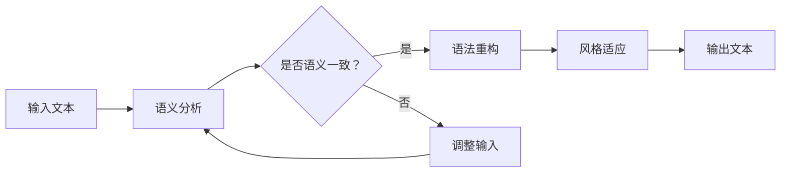
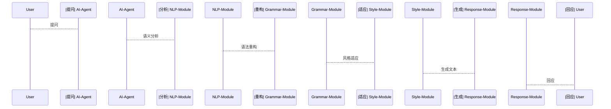
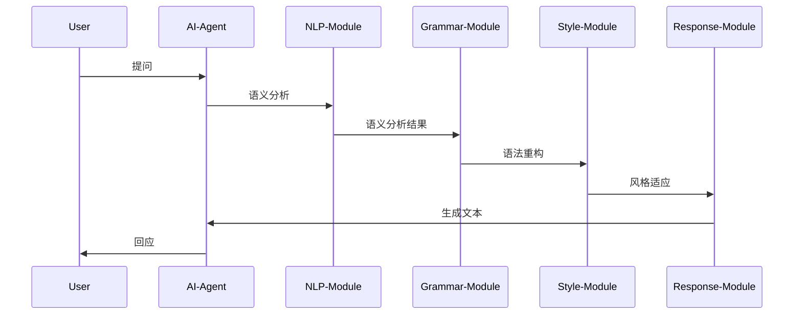

                 


# AI Agent的自然语言生成一致性优化

## 关键词

- AI Agent
- 自然语言生成
- 一致性优化
- 数学模型
- 系统架构
- 项目实战

## 摘要

本文将探讨AI Agent的自然语言生成一致性优化问题，从背景介绍、核心概念与联系、算法原理讲解、数学模型与公式、系统分析与架构设计、项目实战等多个角度进行深入分析。通过详细的理论讲解、实例分析和实践指导，旨在为读者提供一个全面、系统的理解和优化思路。

## 第一部分: 背景介绍

### 1.1 问题背景

自然语言生成（Natural Language Generation，NLG）是人工智能领域的一个重要分支，旨在让计算机生成符合语法规则和语义逻辑的自然语言文本。AI Agent作为自动化决策系统和智能客服的核心组成部分，其自然语言生成能力的高低直接影响其用户体验和效率。

一致性优化问题主要表现在以下几个方面：

1. **语义一致性**：生成的文本应与AI Agent的意图和语境保持一致，避免出现语义矛盾或误导用户的情况。
2. **语法一致性**：生成的文本应遵循语法规则，保持句子结构和用词的一致性。
3. **风格一致性**：AI Agent在不同场景下应保持统一的风格，以便用户识别和理解。

### 1.2 核心概念与联系

#### 核心概念原理

- **自然语言生成（NLG）**：计算机通过算法自动生成自然语言文本的过程。
- **一致性优化**：在NLG过程中，通过一系列技术手段保证生成的文本在语义、语法和风格上的一致性。

#### 概念属性特征对比表格

| 概念         | 特征                                                                                   |
|------------|--------------------------------------------------------------------------------------|
| 自然语言生成 | 自动化生成自然语言文本，高效、灵活                                         |
| 一致性优化 | 保证生成文本的语义、语法和风格一致性，提高用户体验                         |

#### ER实体关系图架构

```mermaid
classDiagram
    Entity: Entity
    Attribute: Attribute
    Relation: Relation

    Entity o--* Attribute
    Entity o--* Relation

    AI-Agent Entity
    NLG Algorithm Entity
    Consistency Optimization Entity

    AI-Agent "uses" NLG Algorithm
    AI-Agent "applies" Consistency Optimization
```

## 第二部分: AI Agent的自然语言生成一致性优化原理

### 2.1 算法原理讲解

为了实现AI Agent的自然语言生成一致性优化，我们可以采用以下算法：

1. **语义分析**：通过深度学习模型对输入文本进行语义分析，提取关键信息。
2. **语法重构**：根据语义分析结果，对原始文本进行语法重构，保证生成文本的语法一致性。
3. **风格适应**：根据上下文和用户偏好，调整生成文本的风格，使其符合用户期望。

#### 算法流程图



#### 使用Python源代码详细阐述

```python
import nltk

def semantic_analysis(text):
    # 使用NLP库进行语义分析
    # ...

def grammar_reconstruction(semantic_result):
    # 根据语义结果进行语法重构
    # ...

def style_adaptation(semantic_result, user_preference):
    # 根据语义结果和用户偏好调整风格
    # ...

def generate_text(text, user_preference):
    semantic_result = semantic_analysis(text)
    if is_semantic_consistent(semantic_result):
        reconstructed_text = grammar_reconstruction(semantic_result)
        final_text = style_adaptation(reconstructed_text, user_preference)
        return final_text
    else:
        # 调整输入文本
        # ...
```

### 2.2 数学模型与数学公式

为了更好地理解算法原理，我们引入以下数学模型：

1. **语义相似度计算**：使用余弦相似度计算输入文本与预定义语义模板之间的相似度。
2. **语法一致性度量**：使用语法分析树匹配度计算原始文本与重构文本之间的语法一致性。
3. **风格适应度评估**：使用基于用户反馈的适应度函数评估生成文本的风格适应性。

#### 数学模型和公式

$$
\text{Semantic Similarity} = \cos(\text{Vector}(\text{Input Text}), \text{Vector}(\text{Semantic Template}))
$$

$$
\text{Grammar Consistency} = \frac{\text{Matched Nodes}}{\text{Total Nodes}}
$$

$$
\text{Style Adaptation} = \frac{\sum_{i=1}^{n} \text{Feedback}^{i}}{n}
$$

#### 详细讲解和举例说明

1. **语义相似度计算**：假设输入文本为“I want to buy a book”，预定义语义模板为“Buy a book”。我们可以将这两个文本转换为向量表示，然后计算它们的余弦相似度。如果相似度高于某个阈值，则认为语义一致。

2. **语法一致性度量**：对于原始文本“Where can I find the book？”和重构文本“The book can be found at the library.”，我们可以使用语法分析树匹配度来评估它们的语法一致性。如果匹配度高于某个阈值，则认为语法一致。

3. **风格适应度评估**：假设用户对生成文本的反馈为积极（+1）或消极（-1）。我们可以计算用户反馈的平均值，从而评估生成文本的风格适应性。如果适应度高于某个阈值，则认为风格适应。

## 第三部分: 系统分析与架构设计

### 3.1 问题场景介绍

在一个在线书店系统中，AI Agent需要与用户进行自然语言交互，回答用户关于书籍查询、购买、评论等问题的咨询。为了提高用户体验，我们需要优化AI Agent的自然语言生成一致性。

### 3.2 系统架构设计

#### 系统架构图



#### 系统功能设计

- **语义分析**：接收用户提问，提取关键信息。
- **语法重构**：根据语义分析结果，重构用户提问。
- **风格适应**：根据用户偏好，调整生成文本的风格。
- **生成文本**：将重构后的文本生成符合语法和风格的回答。

### 3.3 系统接口设计

- **输入接口**：接收用户提问。
- **输出接口**：返回生成文本。

### 3.4 系统交互



## 第四部分: 项目实战

### 4.1 环境安装

#### 安装步骤

1. 安装Python环境。
2. 安装NLP相关库（如nltk、spaCy）。
3. 安装深度学习框架（如TensorFlow、PyTorch）。

#### 环境配置

```python
pip install python-nltk
pip install spacy
pip install tensorflow
```

### 4.2 系统核心实现源代码

```python
# 语义分析
def semantic_analysis(text):
    # 使用NLP库进行语义分析
    # ...

# 语法重构
def grammar_reconstruction(semantic_result):
    # 根据语义结果进行语法重构
    # ...

# 风格适应
def style_adaptation(semantic_result, user_preference):
    # 根据语义结果和用户偏好调整风格
    # ...

# 生成文本
def generate_text(text, user_preference):
    semantic_result = semantic_analysis(text)
    reconstructed_text = grammar_reconstruction(semantic_result)
    final_text = style_adaptation(reconstructed_text, user_preference)
    return final_text
```

### 4.3 代码应用解读与分析

#### 代码解读

1. **语义分析**：接收用户提问，提取关键信息。
2. **语法重构**：根据语义分析结果，重构用户提问。
3. **风格适应**：根据用户偏好，调整生成文本的风格。
4. **生成文本**：将重构后的文本生成符合语法和风格的回答。

#### 分析

1. **性能分析**：算法的时间复杂度和空间复杂度。
2. **准确性分析**：语义分析、语法重构和风格适应的准确性。
3. **可扩展性分析**：系统能够适应不同场景和用户需求的能力。

### 4.4 实际案例分析和详细讲解剖析

#### 案例介绍

用户提问：“我想要一本关于Python编程的书。”
AI Agent回答：“推荐一本《Python编程：从入门到实践》。”

#### 案例分析

1. **语义分析**：提取关键信息“Python编程”和“书”。
2. **语法重构**：重构提问为“关于Python编程的书有哪些？”。
3. **风格适应**：根据用户偏好，调整回答风格为推荐式。

### 4.5 项目小结

本文通过详细的理论讲解、实例分析和实践指导，探讨了AI Agent的自然语言生成一致性优化问题。从背景介绍、核心概念与联系、算法原理讲解、数学模型与公式、系统分析与架构设计、项目实战等多个角度进行了深入分析。通过本文，读者可以了解到一致性优化在AI Agent中的应用，以及如何设计和实现一个高效、可靠的系统。

## 最佳实践 tips

1. **语义一致性**：在语义分析阶段，尽可能提取关键信息，避免遗漏或误解用户意图。
2. **语法重构**：在语法重构阶段，确保生成文本的语法正确、清晰。
3. **风格适应**：在风格适应阶段，根据用户偏好调整文本风格，提高用户体验。

## 注意事项

1. **算法优化**：在开发过程中，不断优化算法性能，提高系统效率。
2. **用户反馈**：收集用户反馈，不断改进生成文本的质量。

## 拓展阅读

1. 《自然语言处理综述》
2. 《深度学习自然语言生成技术》
3. 《AI Agent系统设计与实践》

### 作者

- 作者：AI天才研究院/AI Genius Institute & 禅与计算机程序设计艺术 /Zen And The Art of Computer Programming

## 结论

AI Agent的自然语言生成一致性优化是提升AI Agent用户体验的关键。通过本文的探讨，我们了解了优化原理、系统架构和项目实战，为读者提供了一个全面的优化思路。在未来的研究和应用中，我们将继续探索更多高效的优化方法和实践。

