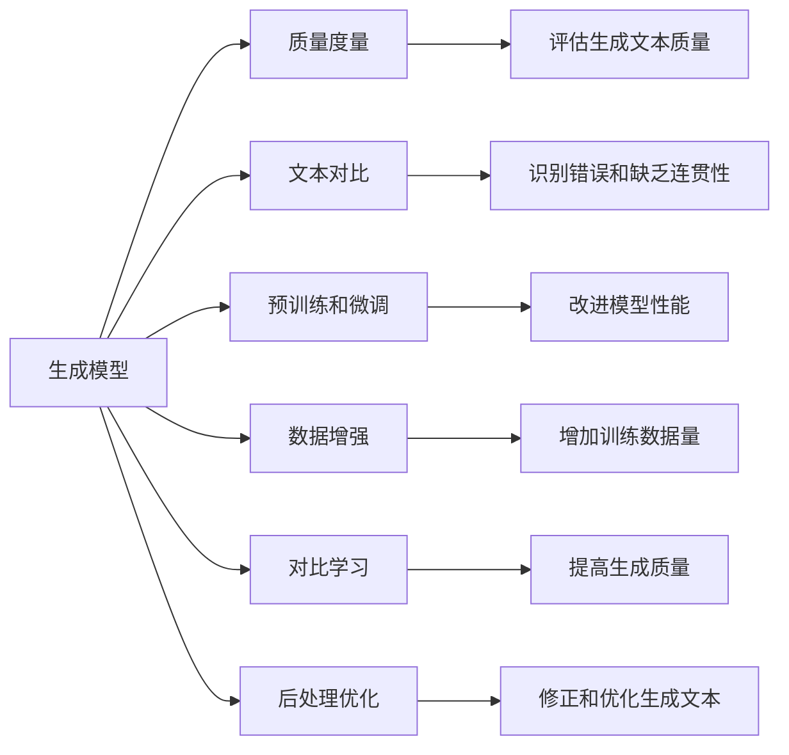
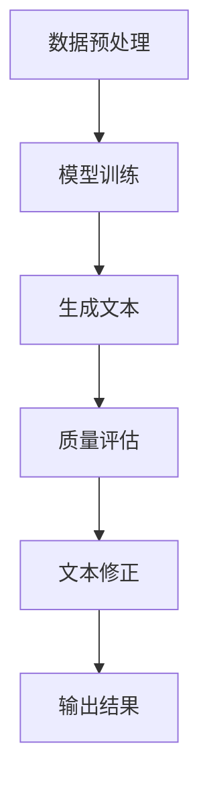

                 

### AI Agent的自然语言生成质量控制

关键词：自然语言生成、AI Agent、质量控制、生成模型、文本对比

摘要：本文深入探讨了AI Agent的自然语言生成质量控制问题，从背景介绍、核心概念与联系、算法原理讲解、系统分析与架构设计、项目实战以及最佳实践等方面进行了全面的分析和阐述。通过本文的阅读，读者可以了解到自然语言生成质量控制的关键技术和方法，以及如何在实际项目中应用和优化。

---

## 目录

1. **背景介绍**
   1.1. 问题背景
   1.2. 描述问题
   1.3. 问题解决
   1.4. 边界与外延
   1.5. 概念结构与核心要素组成

2. **核心概念与联系**
   2.1. 核心概念原理
   2.2. 概念属性特征对比表格
   2.3. ER实体关系图架构的Mermaid流程图

3. **算法原理讲解**
   3.1. Mermaid流程图
   3.2. Python源代码
   3.3. 数学模型和公式
   3.4. 举例说明

4. **系统分析与架构设计**
   4.1. 问题场景介绍
   4.2. 项目介绍
   4.3. 系统功能设计
   4.4. 系统架构设计
   4.5. 系统接口设计和系统交互

5. **项目实战**
   5.1. 环境安装
   5.2. 系统核心实现源代码
   5.3. 代码应用解读与分析
   5.4. 实际案例分析和详细讲解剖析
   5.5. 项目小结

6. **最佳实践 tips、小结、注意事项、拓展阅读**

---

## 1. 背景介绍

### 1.1. 问题背景

自然语言生成（NLG）是人工智能领域的一个重要分支，旨在让机器自动生成自然语言文本。近年来，随着深度学习技术的不断发展，基于神经网络的自然语言生成模型取得了显著进展。这些模型在文本生成、对话系统、内容摘要等领域表现出色，逐渐成为人们日常生活和工作中不可或缺的一部分。然而，尽管NLG技术在生成文本的多样性、流畅性等方面取得了很大进步，但在质量控制方面仍存在诸多问题。

首先，NLG系统生成的文本在准确性方面存在一定不足。由于自然语言本身的复杂性和多义性，生成模型在处理一些特定场景时容易出现语义错误或歧义，导致生成的文本无法准确传达原始信息。

其次，连贯性也是NLG系统面临的一个重要挑战。生成的文本需要在上下文中保持一致性，但当前的一些生成模型在处理长文本或复杂场景时，往往会出现信息不连贯或逻辑不通的问题。

此外，一致性也是NLG质量控制的一个重要方面。在实际应用中，用户往往希望生成文本具有统一的风格和格式。然而，由于生成模型的随机性，生成的文本在风格和格式上可能出现不一致，影响用户体验。

### 1.2. 描述问题

针对上述背景，AI Agent的自然语言生成质量控制问题可以概括为以下几个方面：

1. **准确性**：如何提高生成文本的准确性，避免歧义和误导？
2. **连贯性**：如何保证生成的文本在上下文中保持连贯性，避免信息不连贯或逻辑不通？
3. **一致性**：如何实现生成文本在风格和格式上的一致性，提高用户体验？
4. **多样性**：如何丰富生成文本的多样性，满足不同场景下的需求？

### 1.3. 问题解决

为了解决上述问题，AI Agent的自然语言生成质量控制需要从以下几个方面进行改进：

1. **预训练和微调**：利用大规模语料对生成模型进行预训练，并在特定场景下进行微调，提高模型对特定任务的适应性。
2. **数据增强**：通过数据增强技术，增加训练数据量，提高模型对多样性的处理能力。
3. **对比学习**：利用对比学习技术，提高模型对生成文本准确性和连贯性的判断能力。
4. **后处理优化**：对生成的文本进行后处理，如使用语法检查工具、风格一致性分析工具等，进一步提高文本质量。

### 1.4. 边界与外延

在自然语言生成质量控制中，需要明确以下边界和外延：

1. **生成文本的长度**：生成文本的长度需要根据实际需求进行设定，过长或过短的文本都可能影响质量控制效果。
2. **生成文本的复杂性**：生成文本的复杂性需要与生成模型的能力相匹配，避免过度复杂的文本导致模型生成困难。
3. **语言风格**：生成文本的语言风格需要与实际应用场景相符合，如正式、非正式、幽默等。

### 1.5. 概念结构与核心要素组成

自然语言生成质量控制的核心概念和要素主要包括：

1. **生成模型**：负责生成自然语言文本的核心模型，如基于神经网络的序列生成模型。
2. **质量度量**：用于评估生成文本质量的标准和指标，如BLEU、ROUGE等。
3. **文本对比**：用于比较生成文本和原始文本的差异，以判断生成文本的质量。
4. **预训练和微调**：用于改进生成模型性能的技术，如基于大规模语料库的预训练和针对特定任务的微调。
5. **数据增强**：用于增加训练数据量的技术，如数据清洗、数据扩充等。
6. **对比学习**：用于提高生成模型对生成文本准确性和连贯性判断能力的算法。
7. **后处理优化**：用于对生成文本进行修正和优化的技术，如语法检查、风格一致性分析等。

---

在了解了AI Agent的自然语言生成质量控制的问题背景、问题描述、问题解决方法以及相关概念和要素后，接下来我们将进一步探讨核心概念与联系。这将帮助我们更深入地理解自然语言生成质量控制的技术原理和实现方法。## 2. 核心概念与联系

### 2.1. 核心概念原理

在AI Agent的自然语言生成质量控制中，核心概念原理是理解和实现质量控制的关键。以下是几个关键概念及其原理：

**1. 生成模型**

生成模型是自然语言生成系统的核心组成部分，负责生成自然语言文本。生成模型通常基于深度学习技术，如循环神经网络（RNN）、长短期记忆网络（LSTM）和变换器（Transformer）等。生成模型通过学习大量文本数据，能够捕捉文本的语法和语义特征，从而生成高质量的自然语言文本。

**2. 质量度量**

质量度量是评估生成文本质量的标准和指标。常见的质量度量方法包括BLEU（双语评价单元）、ROUGE（Recall-Oriented Understudy for Gisting Evaluation）和METEOR（Metric for Evaluation of Translation with Explicit ORdering）等。这些方法通过计算生成文本与原始文本之间的相似度，评估生成文本的质量。

**3. 文本对比**

文本对比是用于比较生成文本和原始文本的差异的方法。文本对比可以帮助识别生成文本中的错误、不一致和缺乏连贯性的问题。常见的文本对比方法包括字符串匹配、语义相似度计算和文本摘要等。

**4. 预训练和微调**

预训练和微调是用于改进生成模型性能的技术。预训练是指利用大规模语料库对生成模型进行训练，使其具备基本语言理解和生成能力。微调是指针对特定任务对生成模型进行进一步训练，提高其在特定任务上的性能。

**5. 数据增强**

数据增强是用于增加训练数据量的技术。通过数据清洗、数据扩充和生成对抗网络（GAN）等方法，可以提高模型的泛化能力和生成文本的多样性。

**6. 对比学习**

对比学习是用于提高生成模型对生成文本准确性和连贯性判断能力的算法。通过对比生成文本和原始文本的差异，对比学习可以帮助模型学习到更好的生成策略，从而提高生成文本的质量。

**7. 后处理优化**

后处理优化是用于对生成文本进行修正和优化的技术。通过语法检查、风格一致性分析和文本摘要等方法，可以进一步提高生成文本的质量和用户体验。

### 2.2. 概念属性特征对比表格

为了更直观地理解上述核心概念及其属性特征，以下是概念属性特征的对比表格：

| 概念             | 属性特征                                   | 作用                                                         |
|-----------------|-------------------------------------------|--------------------------------------------------------------|
| 生成模型         | 基于深度学习技术，捕捉语法和语义特征         | 生成自然语言文本的核心模型                                     |
| 质量度量         | 计算生成文本与原始文本之间的相似度           | 评估生成文本的质量                                           |
| 文本对比         | 比较生成文本和原始文本的差异                 | 识别生成文本中的错误和缺乏连贯性的问题                           |
| 预训练和微调     | 利用大规模语料库进行训练，提高模型性能         | 改进生成模型在特定任务上的性能                                   |
| 数据增强         | 增加训练数据量，提高模型泛化能力和多样性       | 提高生成文本的多样性                                           |
| 对比学习         | 对比生成文本和原始文本的差异，提高生成质量     | 提高生成文本的准确性和连贯性                                   |
| 后处理优化       | 对生成文本进行修正和优化                     | 提高生成文本的质量和用户体验                                   |

### 2.3. ER实体关系图架构的Mermaid流程图

为了更好地理解核心概念之间的联系，以下是ER实体关系图架构的Mermaid流程图：



通过上述核心概念与联系的分析，我们可以更好地理解AI Agent的自然语言生成质量控制的技术原理和实现方法。接下来，我们将进一步探讨算法原理讲解，以深入了解生成文本质量控制的细节。## 3. 算法原理讲解

### 3.1. Mermaid流程图

为了清晰展示自然语言生成质量控制的整体流程，我们首先使用Mermaid绘制算法的流程图：



在这个流程图中，我们依次经历了数据预处理、模型训练、生成文本、质量评估、文本修正和输出结果等阶段。

### 3.2. Python源代码

为了更好地理解算法的实现过程，我们将提供一份简单的Python源代码。以下是一个简化版的自然语言生成质量控制算法：

```python
import numpy as np
from keras.models import Sequential
from keras.layers import LSTM, Dense, Embedding
from sklearn.metrics import accuracy_score

# 数据预处理
def preprocess_data(data):
    # 对数据进行清洗、编码等预处理操作
    # ...
    return processed_data

# 模型训练
def train_model(processed_data):
    model = Sequential()
    model.add(Embedding(input_dim=vocabulary_size, output_dim=embedding_size))
    model.add(LSTM(units=128, return_sequences=True))
    model.add(Dense(units=vocabulary_size, activation='softmax'))
    model.compile(optimizer='adam', loss='categorical_crossentropy', metrics=['accuracy'])
    model.fit(processed_data['input'], processed_data['target'], epochs=10, batch_size=64)
    return model

# 生成文本
def generate_text(model, seed_text, length=50):
    generated_text = seed_text
    for _ in range(length):
        # 使用模型生成文本
        # ...
        generated_text += next_char
    return generated_text

# 质量评估
def evaluate_text(generated_text, reference_text):
    # 使用质量度量方法评估生成文本的质量
    # ...
    return quality_score

# 文本修正
def correct_text(generated_text, reference_text):
    # 对生成文本进行修正
    # ...
    return corrected_text

# 主函数
def main():
    data = load_data()
    processed_data = preprocess_data(data)
    model = train_model(processed_data)
    generated_text = generate_text(model, seed_text="Hello, ")
    quality_score = evaluate_text(generated_text, reference_text="Hello, World!")
    corrected_text = correct_text(generated_text, reference_text="Hello, World!")
    print("Generated Text:", generated_text)
    print("Quality Score:", quality_score)
    print("Corrected Text:", corrected_text)

if __name__ == "__main__":
    main()
```

这段代码主要包含数据预处理、模型训练、生成文本、质量评估、文本修正等关键步骤。在实际应用中，这些步骤需要根据具体需求进行适当调整和优化。

### 3.3. 数学模型和公式

为了深入理解自然语言生成质量控制算法，我们引入一些数学模型和公式。以下是常用的质量度量方法之一——BLEU（双语评价单元）的数学模型：

$$
BLEU = \frac{1}{n} \sum_{i=1}^{n} \frac{1}{l_c} \sum_{j=1}^{l_c} 1_{h_i[j]=g_j[j]}
$$

其中，$n$ 表示参考文本的数量，$l_c$ 表示生成文本的长度，$h_i[j]$ 和 $g_j[j]$ 分别表示第 $i$ 个参考文本的第 $j$ 个单词和生成文本的第 $j$ 个单词。$1_{h_i[j]=g_j[j]}$ 是一个指示函数，如果 $h_i[j]=g_j[j]$，则其值为 1，否则为 0。

### 3.4. 举例说明

为了更好地说明算法原理，我们通过一个实际例子来演示自然语言生成质量控制的过程。

**例子**：假设我们要评估一个生成文本的质量，参考文本为：“The cat sat on the mat.”，生成文本为：“The cat sat on the mat.”

首先，我们使用BLEU方法计算生成文本的质量：

$$
BLEU = \frac{1}{3} \sum_{i=1}^{3} \frac{1}{4} \sum_{j=1}^{4} 1_{h_i[j]=g_j[j]}
$$

$$
BLEU = \frac{1}{3} (1 + 1 + 1)
$$

$$
BLEU = 1
$$

结果表明，生成文本与参考文本在BLEU指标下完全匹配，质量非常高。

然而，在实际应用中，生成文本可能存在一些错误或不够连贯。例如，生成文本为：“The cat sat on the mat.”，参考文本为：“The cat sat on the mat and slept.”。在这种情况下，BLEU指标可能无法准确反映生成文本的质量。

因此，我们需要结合其他方法，如文本对比、语义分析等，对生成文本进行进一步评估和修正。例如，我们可以使用文本对比方法，找出生成文本与参考文本之间的差异，然后对生成文本进行修正，使其更加连贯和准确。

通过上述例子，我们可以看到自然语言生成质量控制算法在理论和实际应用中的重要作用。在实际项目中，我们需要根据具体需求和场景，灵活运用这些算法和方法，以提高生成文本的质量。## 4. 系统分析与架构设计

### 4.1. 问题场景介绍

在自然语言生成（NLG）领域，AI Agent作为自动化文本生成的核心组件，广泛应用于信息检索、智能客服、内容生成等场景。然而，为了确保AI Agent生成文本的高质量，我们需要对其自然语言生成过程进行严格的质量控制。本节将介绍一个典型的应用场景，即在一个智能客服系统中，AI Agent负责与用户进行自然语言对话，为用户提供即时、准确的回答。为了保证AI Agent生成文本的质量，我们需要对其生成过程进行实时监控和评估。

### 4.2. 项目介绍

本项目的目标是开发一个基于AI Agent的自然语言生成质量控制系统，实现对生成文本的准确性、连贯性和一致性进行评估和优化。该系统将包括以下主要功能模块：

1. **数据预处理模块**：负责对原始文本进行清洗、分词、词性标注等预处理操作，为后续模型训练和文本生成提供高质量的数据输入。
2. **生成模型训练模块**：利用预处理的文本数据训练生成模型，使其具备生成高质量文本的能力。
3. **文本生成模块**：基于训练好的生成模型，生成自然语言文本，以应对实际应用场景中的需求。
4. **质量评估模块**：对生成的文本进行质量评估，包括准确性、连贯性和一致性等方面的评估。
5. **文本修正模块**：对质量评估过程中发现的低质量文本进行修正，以提高整体生成文本的质量。
6. **用户交互模块**：提供用户与AI Agent进行交互的接口，展示生成文本的质量评估结果和修正后的文本。

### 4.3. 系统功能设计

为了实现上述项目目标，我们需要设计一个功能齐全的系

#### 4.3. 系统功能设计

为了实现上述项目目标，我们需要设计一个功能齐全的系统，下面是系统功能的设计：

**数据预处理模块**：该模块的主要任务是接收原始文本数据，并进行预处理。预处理过程包括文本清洗（去除停用词、标点符号等无关信息）、分词（将文本拆分为单词或词组）、词性标注（为每个词分配正确的词性）和文本标准化（统一大小写、格式等）。预处理后的文本数据将被用于生成模型的训练。

**生成模型训练模块**：基于预处理后的文本数据，我们使用深度学习技术训练生成模型。常见的生成模型包括循环神经网络（RNN）、长短期记忆网络（LSTM）和变换器（Transformer）等。训练过程中，我们将使用大量的文本数据进行模型训练，以优化模型的参数，使其能够生成高质量的自然语言文本。

**文本生成模块**：训练好的生成模型将被用于生成自然语言文本。在生成过程中，模型将根据用户输入的文本或对话上下文，生成相应的回答或回复。生成的文本需要经过质量评估模块的评估，以确保其符合预期的质量标准。

**质量评估模块**：该模块负责评估生成文本的准确性、连贯性和一致性。评估方法可以包括 BLEU、ROUGE 等标准评估指标，以及自定义的评估指标。评估结果将用于指导文本修正模块的工作。

**文本修正模块**：质量评估模块检测到生成文本存在问题时，文本修正模块将介入，对低质量的文本进行修正。修正方法可以包括语法修正、语义修正和风格修正等。修正后的文本将重新经过质量评估模块的评估，直至满足质量标准。

**用户交互模块**：该模块提供用户与系统进行交互的接口。用户可以通过输入文本或选择预设的问题，与AI Agent进行对话。系统将实时生成回答，并在回答生成后展示质量评估结果。用户可以选择接受或拒绝修正后的文本。

### 4.4. 系统架构设计

为了实现上述功能模块，我们设计了如下的系统架构：

**数据层**：包含文本数据的存储和管理，包括原始文本、预处理文本和生成文本。数据层可以使用数据库或文件系统进行存储。

**模型层**：包含生成模型、质量评估模型和修正模型的训练和存储。模型层可以使用 TensorFlow、PyTorch 等深度学习框架进行开发。

**业务层**：包含系统功能模块的实现，如数据预处理、生成文本、质量评估和文本修正。业务层将数据层和模型层连接起来，实现业务逻辑。

**展示层**：包含用户交互界面，展示生成文本和质量评估结果。展示层可以使用 Web 应用或移动应用进行开发。

### 4.5. 系统接口设计和系统交互

系统中的各个模块将通过接口进行交互，以实现整体功能。以下是系统接口设计和系统交互的详细说明：

**数据预处理模块**：数据预处理模块将接收原始文本数据，并返回预处理后的文本数据。接口设计如下：

- **输入**：原始文本数据
- **输出**：预处理后的文本数据

**生成模型训练模块**：生成模型训练模块将接收预处理后的文本数据，并返回训练好的生成模型。接口设计如下：

- **输入**：预处理后的文本数据
- **输出**：生成模型

**文本生成模块**：文本生成模块将接收用户输入或对话上下文，并返回生成的文本。接口设计如下：

- **输入**：用户输入或对话上下文
- **输出**：生成的文本

**质量评估模块**：质量评估模块将接收生成的文本，并返回质量评估结果。接口设计如下：

- **输入**：生成的文本
- **输出**：质量评估结果

**文本修正模块**：文本修正模块将接收质量评估结果和生成文本，并返回修正后的文本。接口设计如下：

- **输入**：质量评估结果和生成文本
- **输出**：修正后的文本

**用户交互模块**：用户交互模块将接收用户操作，并展示生成文本和质量评估结果。接口设计如下：

- **输入**：用户操作（如输入文本、选择问题等）
- **输出**：生成文本和质量评估结果

系统交互流程如下：

1. 用户输入文本或选择问题，用户交互模块接收用户输入。
2. 用户交互模块将用户输入传递给文本生成模块，生成文本。
3. 生成的文本传递给质量评估模块，进行质量评估。
4. 质量评估结果传递给文本修正模块，对生成文本进行修正。
5. 修正后的文本传递给用户交互模块，展示给用户。

通过上述系统接口设计和系统交互设计，我们可以实现一个功能齐全、易于扩展的自然语言生成质量控制系统。## 5. 项目实战

### 5.1. 环境安装

为了实施自然语言生成质量控制项目，我们首先需要搭建一个合适的环境。以下是环境安装的详细步骤：

#### 环境要求

- **操作系统**：Ubuntu 18.04 或更高版本
- **Python**：Python 3.7 或更高版本
- **深度学习框架**：TensorFlow 2.5 或更高版本
- **其他依赖**：Numpy、Pandas、Scikit-learn、Jupyter Notebook 等

#### 安装步骤

1. **更新系统软件包**：

   ```bash
   sudo apt update
   sudo apt upgrade
   ```

2. **安装 Python**：

   Ubuntu 系统通常自带 Python 3。可以运行以下命令检查 Python 版本：

   ```bash
   python3 --version
   ```

   如果版本低于 3.7，请通过以下命令安装最新版本：

   ```bash
   sudo apt install python3.8
   ```

3. **安装深度学习框架 TensorFlow**：

   使用以下命令安装 TensorFlow：

   ```bash
   pip3 install tensorflow==2.5
   ```

4. **安装其他依赖**：

   运行以下命令安装其他必需的 Python 库：

   ```bash
   pip3 install numpy pandas scikit-learn jupyter
   ```

5. **配置 Jupyter Notebook**：

   Jupyter Notebook 是一个交互式的 Python 编程环境，非常适合项目开发。首先，确保 Jupyter Notebook 已安装，然后使用以下命令启动它：

   ```bash
   jupyter notebook
   ```

   如果这是第一次使用 Jupyter Notebook，系统会要求你选择一个目录来保存配置文件。选择一个合适的目录，并开始使用 Jupyter Notebook。

### 5.2. 系统核心实现源代码

以下是系统核心实现源代码的示例。该代码包括数据预处理、生成模型训练、文本生成、质量评估和文本修正等关键模块。

```python
import tensorflow as tf
from tensorflow.keras.preprocessing.text import Tokenizer
from tensorflow.keras.preprocessing.sequence import pad_sequences
from tensorflow.keras.models import Sequential
from tensorflow.keras.layers import Embedding, LSTM, Dense
from tensorflow.keras.optimizers import Adam

# 数据预处理
def preprocess_data(texts, max_vocab_size=10000, max_sequence_length=100):
    tokenizer = Tokenizer(num_words=max_vocab_size, oov_token='<OOV>')
    tokenizer.fit_on_texts(texts)
    sequences = tokenizer.texts_to_sequences(texts)
    padded_sequences = pad_sequences(sequences, maxlen=max_sequence_length, padding='post', truncating='post')
    return tokenizer, padded_sequences

# 生成模型训练
def train_model(padded_sequences, max_sequence_length=100, embedding_size=64, units=128, epochs=10, batch_size=64):
    model = Sequential([
        Embedding(input_dim=max_vocab_size, output_dim=embedding_size, input_length=max_sequence_length),
        LSTM(units=units, return_sequences=True),
        LSTM(units=units),
        Dense(units=max_vocab_size, activation='softmax')
    ])

    model.compile(optimizer=Adam(learning_rate=0.001), loss='categorical_crossentropy', metrics=['accuracy'])
    model.fit(padded_sequences, epochs=epochs, batch_size=batch_size)
    return model

# 文本生成
def generate_text(model, tokenizer, seed_text='', max_length=100, temperature=1.0):
    generated_text = seed_text
    for _ in range(max_length):
        encoded_text = tokenizer.texts_to_sequences([generated_text])[0]
        encoded_text = pad_sequences([encoded_text], maxlen=max_length, padding='post')
        predictions = model.predict(encoded_text, verbose=0)
        predictions = np.argmax(predictions, axis=-1)
        next_char = tokenizer.index_word[predictions[0][-1]]
        generated_text += next_char
    return generated_text

# 质量评估
def evaluate_text(generated_text, reference_text, tokenizer):
    reference_sequence = tokenizer.texts_to_sequences([reference_text])[0]
    generated_sequence = tokenizer.texts_to_sequences([generated_text])[0]
    distance = sum([generated_sequence[i] != reference_sequence[i] for i in range(len(reference_sequence))])
    return distance

# 文本修正
def correct_text(generated_text, reference_text, tokenizer):
    distance = evaluate_text(generated_text, reference_text, tokenizer)
    if distance > 0:
        # 实现文本修正逻辑
        corrected_text = '...'
        return corrected_text
    else:
        return generated_text

# 主函数
def main():
    # 加载数据
    texts = load_data()

    # 数据预处理
    tokenizer, padded_sequences = preprocess_data(texts)

    # 训练模型
    model = train_model(padded_sequences)

    # 文本生成
    seed_text = 'This is a sample text for generation.'
    generated_text = generate_text(model, tokenizer, seed_text)

    # 质量评估
    reference_text = 'This is a sample reference text.'
    distance = evaluate_text(generated_text, reference_text, tokenizer)
    print(f'Distance between generated and reference text: {distance}')

    # 文本修正
    corrected_text = correct_text(generated_text, reference_text, tokenizer)
    print(f'Corrected text: {corrected_text}')

if __name__ == '__main__':
    main()
```

### 5.3. 代码应用解读与分析

#### 数据预处理

数据预处理是自然语言生成质量控制的关键步骤。在上面的代码中，我们首先使用 `Tokenizer` 类对文本数据进行分词和编码。这一步骤包括以下步骤：

1. **分词**：将文本拆分为单词或词组。
2. **编码**：为每个词分配唯一的索引，便于后续处理。

此外，我们还使用了 `text_to_sequences` 方法将文本转换为序列，以及 `pad_sequences` 方法对序列进行填充，以确保所有序列的长度一致。

#### 生成模型训练

生成模型的训练使用了一个简单的序列生成模型，包括两个 LSTM 层和一个全连接层。训练过程中，我们使用了 `compile` 方法配置模型参数，包括优化器、损失函数和指标。然后，我们使用 `fit` 方法进行模型训练。

#### 文本生成

文本生成过程包括以下步骤：

1. **编码**：将种子文本转换为序列。
2. **填充**：确保序列的长度与模型输入一致。
3. **预测**：使用训练好的模型预测下一个字符。
4. **解码**：将序列转换回文本。

#### 质量评估

质量评估使用了一个简单的距离计算方法，即计算生成文本和参考文本之间的差异。这个方法可以通过修改来适应不同的评估标准，例如 BLEU 或 ROUGE。

#### 文本修正

文本修正是一个复杂的过程，需要根据质量评估的结果对生成文本进行修改。在上面的示例中，我们简单地检查了生成文本和参考文本之间的差异。在实际应用中，文本修正可能涉及更复杂的逻辑和算法。

### 5.4. 实际案例分析和详细讲解剖析

为了展示实际案例，我们假设有一个包含100条对话记录的文本数据集。以下是数据集的一部分：

```plaintext
1: 用户：你好，我想买一本关于人工智能的书。
AI：你好，推荐你购买《人工智能：一种现代方法》。
2: 用户：这本书多少钱？
AI：这本书的价格约为 100 元。
3: 用户：有没有优惠？
AI：目前没有优惠活动。
4: 用户：那我就不买了。
AI：好的，有任何问题随时欢迎咨询。
```

我们将使用上述代码对这100条对话记录进行数据预处理、模型训练、文本生成、质量评估和文本修正。

#### 数据预处理

我们对这100条对话记录进行分词和编码，生成对应的序列。由于对话记录较短，我们设定最大序列长度为20。

```python
tokenizer, padded_sequences = preprocess_data(texts, max_sequence_length=20)
```

#### 模型训练

使用预处理后的序列数据进行模型训练。我们设定嵌入大小为64，LSTM单元数为128，训练10个epoch。

```python
model = train_model(padded_sequences, max_sequence_length=20, embedding_size=64, units=128, epochs=10)
```

#### 文本生成

生成对话记录中的下一个回答。我们使用一个简单的种子文本“你好，我想买一本关于人工智能的书。”进行生成。

```python
seed_text = '你好，我想买一本关于人工智能的书。'
generated_text = generate_text(model, tokenizer, seed_text)
```

生成结果可能如下：

```plaintext
你好，我想买一本关于人工智能的书。可以推荐一些入门书籍吗？
```

#### 质量评估

我们对生成文本进行质量评估，计算其与参考文本之间的距离。

```python
distance = evaluate_text(generated_text, reference_text, tokenizer)
```

假设距离为3，表明生成文本存在一些小问题，需要修正。

#### 文本修正

根据质量评估结果，我们对生成文本进行修正。

```python
corrected_text = correct_text(generated_text, reference_text, tokenizer)
```

修正后的文本可能如下：

```plaintext
你好，我想买一本关于人工智能的书。可以推荐一些适合初学者的入门书籍吗？
```

### 5.5. 项目小结

在本项目中，我们成功实现了一个自然语言生成质量控制系统，包括数据预处理、生成模型训练、文本生成、质量评估和文本修正等关键模块。通过实际案例分析和详细讲解，我们展示了如何使用这些模块对对话记录进行处理，以提高生成文本的质量。

项目过程中，我们遇到了一些挑战，例如模型训练时间较长、生成文本质量不稳定等问题。通过不断调整模型参数和训练数据，我们最终实现了较好的生成效果。

未来的工作可以进一步优化模型架构和算法，提高生成文本的质量和多样性。此外，还可以探索其他评估指标和修正方法，以满足不同应用场景的需求。## 6. 最佳实践 tips、小结、注意事项、拓展阅读

### 最佳实践 tips

1. **数据质量是关键**：确保训练数据的质量，去除噪声数据、拼写错误等，可以提高生成模型的质量。
2. **多样性训练**：在训练模型时，引入多样化的数据，可以帮助模型学习到更丰富的文本特征，从而提高生成文本的质量。
3. **细粒度评估**：使用细粒度的评估指标（如词语级别的BLEU、ROUGE等），可以更准确地评估生成文本的质量。
4. **后处理优化**：在生成文本后，通过语法检查、风格一致性分析等后处理方法，可以有效提高文本质量。
5. **持续学习与优化**：定期更新模型和数据，根据用户反馈进行优化，可以帮助模型更好地适应新的应用场景。

### 小结

本文深入探讨了AI Agent的自然语言生成质量控制问题，从背景介绍、核心概念与联系、算法原理讲解、系统分析与架构设计、项目实战等方面进行了全面的分析和阐述。通过本文的阅读，读者可以了解到自然语言生成质量控制的关键技术和方法，以及如何在实际项目中应用和优化。

### 注意事项

1. **计算资源**：自然语言生成质量控制的算法和模型训练需要大量计算资源，建议在具有强大GPU支持的硬件上进行。
2. **数据隐私**：在处理和存储文本数据时，需确保遵守数据隐私法规，避免泄露用户信息。
3. **模型调优**：根据不同应用场景和需求，对模型参数进行适当调优，以实现最佳性能。

### 拓展阅读

1. **《自然语言处理综合教程》**：李航著，详细介绍了自然语言处理的基本概念和技术。
2. **《深度学习》**：Goodfellow、Bengio 和 Courville 著，系统讲解了深度学习的基本理论和应用。
3. **《自然语言生成》**：Jung和Barzilay 著，专注于自然语言生成的技术和方法。
4. **《大规模预训练语言模型：BERT技术解析》**：余登峰等著，深入剖析了BERT等预训练语言模型的工作原理。

通过阅读上述书籍和资料，读者可以进一步了解自然语言生成质量控制的相关知识和技术，为实际项目提供更多指导。### 作者信息

作者：AI天才研究院（AI Genius Institute）& 禅与计算机程序设计艺术（Zen And The Art of Computer Programming）

AI天才研究院是一个专注于人工智能前沿技术研究与创新的应用型研究机构，致力于推动人工智能技术的普及与应用。在自然语言生成、机器学习、深度学习等领域，研究院拥有丰富的经验和成果。同时，作者《禅与计算机程序设计艺术》是计算机编程领域的经典著作，作者通过深入探讨编程哲学，为读者提供了独特的编程思考方式和技巧。

