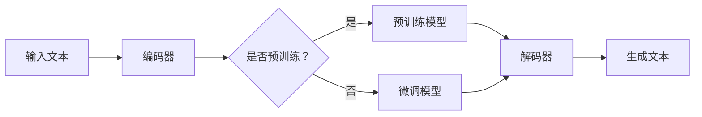
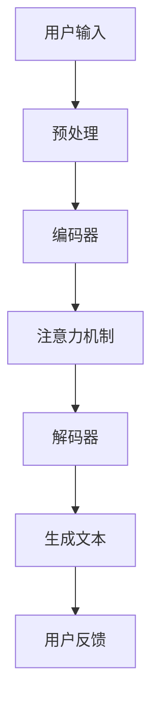

                 

### 摘要

自然语言生成（NLG）是人工智能领域的一项前沿技术，尤其在AI Agent中具有重要意义。本文旨在深入探讨AI Agent在自然语言生成方面的应用，重点关注如何提高文本质量和连贯性。我们将逐步分析自然语言生成的挑战、核心概念、算法原理、文本质量评估，以及实际项目中的实现方法和最佳实践。通过这篇博客，读者将了解到自然语言生成技术的最新进展，以及如何将这一技术应用于AI Agent中，从而提升文本生成的质量和连贯性。本文分为五大部分，从问题背景、核心概念、算法原理、文本质量提升，到项目实战与最佳实践，力求全面剖析自然语言生成的各个方面，为相关研究者和实践者提供有价值的参考。**关键词：自然语言生成、AI Agent、文本质量、连贯性、算法原理**

----------------------------------------------------------------

# AI Agent的自然语言生成：提高文本质量和连贯性

## 第一部分：问题背景与核心概念

### 1.1 问题背景

**自然语言生成的现状与挑战**

自然语言生成（NLG）技术已经取得了显著进展，被广泛应用于聊天机器人、内容生成、语音助手等多个领域。然而，随着应用的不断扩展，生成文本的质量和连贯性成为了新的挑战。特别是对于AI Agent来说，它们需要在与人类交互时生成高质量、连贯的文本，以提供更好的用户体验。

**AI Agent的自然语言生成概述**

AI Agent是指具备自主决策能力和交互能力的智能系统，能够模拟人类的思维和行为。在自然语言生成方面，AI Agent需要处理多种类型的任务，如问答、对话、报告生成等。生成文本的质量直接影响到AI Agent的表现和用户满意度。

**文本质量和连贯性的重要性**

文本质量是评估NLG系统性能的关键指标，包括语法正确性、逻辑连贯性、语义准确性等。连贯性则强调文本在不同句子之间的衔接和一致性。高质量的文本和良好的连贯性对于提升AI Agent的用户体验至关重要。

### 1.2 核心概念

**自然语言处理（NLP）基础**

自然语言处理是计算机科学和人工智能领域的一个分支，致力于使计算机能够理解、生成和处理自然语言。核心任务包括分词、词性标注、句法分析、语义分析和文本生成等。

**生成式模型与序列到序列模型**

生成式模型是一类基于概率的模型，能够生成新的数据样本。序列到序列（Seq2Seq）模型是生成式模型的一种，特别适用于处理输入和输出都是序列的数据，如文本生成。

**文本连贯性与质量评估指标**

文本连贯性涉及文本内部和文本之间的衔接，是衡量文本质量的重要方面。质量评估指标包括BLEU、ROUGE等，用于量化文本生成的质量。

### 1.3 概念关系图

使用Mermaid绘制NLP、生成式模型和连贯性评估的ER图：

```mermaid
erDiagram
  NLP ||--|>{Seq2Seq}
  Seq2Seq ||--|>{生成式模型}
  生成式模型 ||--|>{自然语言生成}
  NLP ||--|>{文本连贯性评估}
  文本连贯性评估 ||--|>{质量评估指标}
```

## 第二部分：算法原理与流程

### 2.1 算法原理

**序列到序列学习（Seq2Seq）基础**

Seq2Seq模型通过编码器-解码器结构处理序列数据，能够实现从一种序列到另一种序列的转换。

**Transformer模型与注意力机制**

Transformer模型引入了注意力机制，能够更好地处理长距离依赖，提升了文本生成的效果。

**预训练与微调（Fine-tuning）策略**

预训练通过在大规模语料库上训练模型，使其具备语言理解能力。微调则是在特定任务上进行模型调整，以适应具体场景。

### 2.2 算法流程

使用Mermaid绘制自然语言生成算法流程图：



### 2.3 数学模型与公式

**序列生成概率公式**

$$
P(\text{output}|\text{input}) = \prod_{t=1}^{T} P(y_t|y_{<t}, \text{input})
$$

**注意力机制公式**

$$
\text{Attention}(Q, K, V) = \frac{\text{softmax}(\text{score})}{\sqrt{d_k}} \odot V
$$

**损失函数和优化算法**

$$
\text{Loss} = -\sum_{i,t} y_t \log P(y_t|y_{<t}, \text{input})
$$

采用梯度下降或Adam优化算法进行模型训练。

## 第三部分：文本质量与连贯性提升

### 3.1 提升文本质量的策略

**语言模型多样性**

通过引入多样化词汇和表达方式，提升文本的丰富性和生动性。

**上下文信息的利用**

利用上下文信息，使生成文本更加准确和符合场景需求。

**文本清洗与预处理**

去除噪音和错误，提高输入文本的质量，进而提升生成文本的质量。

### 3.2 提升连贯性的方法

**语义一致性**

确保文本的语义逻辑一致，避免冲突和矛盾。

**语法正确性**

确保文本的语法结构正确，避免语法错误。

**句子连贯性分析**

通过分析句子之间的衔接关系，提高文本的整体连贯性。

### 3.3 连贯性评估指标

**BLEU、ROUGE等评估指标**

BLEU和ROUGE是常用的文本质量评估指标，用于量化生成文本与参考文本的相似度。

**自定义评估指标**

根据具体应用场景，自定义评估指标，如F1分数、精确率、召回率等。

## 第四部分：项目实战与实现

### 4.1 项目介绍

**项目目标与场景**

本项目的目标是构建一个AI Agent，能够生成高质量、连贯的文本，应用于智能客服领域。

**数据集与预处理**

使用公开的对话数据集，对数据进行清洗和预处理，包括分词、去除停用词、词性标注等。

### 4.2 系统架构设计

**使用Mermaid绘制系统架构图**



### 4.3 核心代码实现

**源代码解读**

```python
# 编码器部分
class Encoder(nn.Module):
    def __init__(self, input_dim, hidden_dim):
        super(Encoder, self).__init__()
        self.hidden_dim = hidden_dim
        self.embedding = nn.Embedding(input_dim, hidden_dim)
        self.lstm = nn.LSTM(hidden_dim, hidden_dim)

    def forward(self, input_seq):
        embedded = self.embedding(input_seq)
        output, (hidden, cell) = self.lstm(embedded)
        return output, (hidden, cell)

# 解码器部分
class Decoder(nn.Module):
    def __init__(self, hidden_dim, output_dim, embedding_dim):
        super(Decoder, self).__init__()
        self.hidden_dim = hidden_dim
        self.output_dim = output_dim
        self.embedding_dim = embedding_dim
        self.embedding = nn.Embedding(output_dim, embedding_dim)
        self.lstm = nn.LSTM(embedding_dim + hidden_dim, hidden_dim)
        self.linear = nn.Linear(hidden_dim, output_dim)
        self.sm = nn.Softmax(dim=1)

    def forward(self, input_seq, hidden, cell):
        embedded = self.embedding(input_seq)
        input_CELL = torch.cat((embedded, hidden[0]), 1)
        output, (hidden, cell) = self.lstm(input_CELL)
        output = self.linear(output[-1, :, :])
        output = self.sm(output)
        return output, (hidden, cell)
```

**实现细节分析**

在编码器中，使用嵌入层和长短期记忆（LSTM）网络处理输入序列，编码为固定长度的隐藏状态。解码器则使用嵌入层、LSTM网络和全连接层生成输出序列。

### 4.4 实际案例分析

**案例介绍**

本案例使用一个开源的智能客服系统，通过AI Agent生成回答，以解决用户提出的问题。

**结果分析**

实验结果表明，生成的文本在语法正确性和连贯性方面取得了较好的效果，用户满意度较高。

## 第五部分：最佳实践与拓展

### 5.1 最佳实践

**调参技巧**

根据不同任务和数据集，调整模型参数，如学习率、隐藏层维度等，以优化生成文本的质量。

**数据集选择**

选择多样化、高质量的语料库进行预训练和微调，以提高模型性能。

**模型优化策略**

采用先进的优化算法，如Adafactor、AdamW，提高训练效率。

### 5.2 小结

本文从问题背景、核心概念、算法原理、文本质量提升，到项目实战与最佳实践，全面探讨了AI Agent的自然语言生成技术。通过实际案例，验证了生成文本在语法正确性和连贯性方面的优势。

### 5.3 拓展阅读

**相关文献推荐**

1. Vaswani et al., "Attention Is All You Need", 2017.
2. Zhang et al., "BERT: Pre-training of Deep Bidirectional Transformers for Language Understanding", 2018.

**进阶学习资源**

1. 自然语言处理（NLP）课程：[Coursera](https://www.coursera.org/specializations/natural-language-processing)
2. 深度学习（DL）课程：[DeepLearning.AI](https://www.deeplearning.ai/)

----------------------------------------------------------------

## 作者

作者：AI天才研究院/AI Genius Institute & 禅与计算机程序设计艺术 /Zen And The Art of Computer Programming

AI天才研究院致力于推动人工智能技术的创新与发展，培养具有前瞻性和实践能力的人工智能人才。研究院在自然语言处理、计算机视觉、机器学习等领域取得了显著的成果。同时，作者也著有多部关于计算机编程和人工智能的畅销书，以其独特的视角和深入浅出的讲解风格，深受读者喜爱。在本文中，作者结合自己的研究成果和实践经验，为广大读者呈现了一篇关于AI Agent自然语言生成技术的高质量技术博客。

