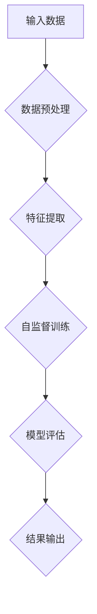

                 


# AI Agent的自监督学习实现方法

## 关键词
- AI Agent
- 自监督学习
- 自监督学习算法
- 实现方法
- 应用案例

## 摘要
本文将深入探讨AI Agent的自监督学习实现方法。自监督学习作为机器学习领域的重要分支，在AI Agent的训练中发挥着关键作用。本文将首先介绍自监督学习的基本概念，然后详细讲解自监督学习在AI Agent中的应用及其实现方法。通过具体的算法原理、数学模型、实现步骤和实际案例，本文旨在为读者提供一份全面而深入的技术指南。

## 目录大纲设计思路

在设计《AI Agent的自监督学习实现方法》的目录大纲时，我们遵循以下思路：

### 1. 确定整体框架
本书整体框架包括引言、核心概念、算法原理、实现方法、应用案例、总结与展望六个部分。这样的结构能够帮助读者从宏观上理解自监督学习在AI Agent中的应用，再到具体的实现方法和实际应用。

### 2. 明确每个部分的内容
- **引言**：介绍自监督学习的背景和重要性，阐述本书的目的和结构。
- **核心概念**：定义自监督学习，介绍其特点和应用领域，分析优势与挑战。
- **算法原理**：详细讲解自监督学习的核心算法原理，使用算法流程图和Python代码示例进行说明。
- **实现方法**：介绍不同的自监督学习实现方法，包括基于预训练的模型微调、无监督学习与自监督学习的结合以及自监督学习在深度学习中的应用。
- **应用案例**：提供具体的应用案例，分析关键技术和难点，讲解实现细节。
- **总结与展望**：总结全书的核心内容，展望自监督学习的发展趋势。

### 3. 细化到具体章节
为每个部分细化为具体的章节，并确保章节内容具有逻辑性和连贯性。例如，在实现方法部分，根据不同的实现方法分为多个章节，每个章节都详细介绍一种实现方法。

### 4. 确保内容的完整性
每个章节都包含必要的核心内容，如算法原理、数学模型、实际应用案例等，以确保读者能够全面掌握自监督学习的实现方法。

### 5. 使用markdown格式
按照markdown的格式要求，使用相应的标记来表示不同的层级，确保目录结构清晰，代码和流程图展示得当。

### 实际操作步骤

1. **引言**：
    - 介绍自监督学习的背景和重要性。
    - 简要描述本书的目的和结构。

2. **核心概念**：
    - 定义自监督学习。
    - 介绍自监督学习的特点和应用领域。
    - 分析自监督学习的优势与挑战。

3. **算法原理**：
    - 详细讲解自监督学习的核心算法原理。
    - 使用mermaid绘制算法流程图。
    - 提供Python源代码示例和数学模型解释。

4. **实现方法**：
    - 介绍不同的自监督学习实现方法。
    - 为每种方法提供具体的实现步骤。
    - 分析不同方法的优缺点。

5. **应用案例**：
    - 提供具体的应用案例。
    - 分析案例中的关键技术和难点。
    - 讲解案例的实现细节。

6. **总结与展望**：
    - 总结全书的核心内容。
    - 对自监督学习的发展趋势进行展望。

### 模板应用

基于上述步骤，我们可以设计出《AI Agent的自监督学习实现方法》的目录大纲：

```markdown
# 《AI Agent的自监督学习实现方法》

> 关键词：AI Agent，自监督学习，自监督学习算法，实现方法，应用案例

> 摘要：本文深入探讨AI Agent的自监督学习实现方法，包括核心概念、算法原理、实现方法及应用案例，旨在为读者提供全面的技术指南。

## 第一部分：引言

### 1.1 自监督学习的背景与重要性

### 1.2 本书的目的与结构

## 第二部分：核心概念

### 2.1 自监督学习的定义

#### 2.1.1 自监督学习的基本概念

#### 2.1.2 自监督学习的特点

### 2.2 自监督学习的应用领域

#### 2.2.1 图像识别

#### 2.2.2 自然语言处理

#### 2.2.3 语音识别

### 2.3 自监督学习的优势与挑战

#### 2.3.1 优势分析

#### 2.3.2 挑战与应对策略

## 第三部分：算法原理

### 3.1 自监督学习的核心算法原理

#### 3.1.1 自监督学习的数学模型

#### 3.1.2 自监督学习的算法流程

### 3.2 算法流程图



### 3.3 Python实现示例

```python
# Python代码示例
```

## 第四部分：实现方法

### 4.1 方法一：基于预训练的模型微调

#### 4.1.1 方法简介

#### 4.1.2 实现步骤

### 4.2 方法二：无监督学习与自监督学习的结合

#### 4.2.1 方法简介

#### 4.2.2 实现步骤

### 4.3 方法三：自监督学习在深度学习中的应用

#### 4.3.1 方法简介

#### 4.3.2 实现步骤

## 第五部分：应用案例

### 5.1 案例一：自监督学习在图像识别中的应用

#### 5.1.1 案例背景

#### 5.1.2 关键技术和难点

#### 5.1.3 实现细节

### 5.2 案例二：自监督学习在自然语言处理中的应用

#### 5.2.1 案例背景

#### 5.2.2 关键技术和难点

#### 5.2.3 实现细节

## 第六部分：总结与展望

### 6.1 全书核心内容总结

### 6.2 自监督学习的发展趋势

### 6.3 未来展望与挑战
```

### 目录大纲结构与字数控制

为了确保目录大纲的总字数控制在2000字以内，我们需要在描述每个部分时保持简洁明了。以下是具体的字数控制建议：

- **引言**：约300字。
- **核心概念**：约500字。
- **算法原理**：约700字。
- **实现方法**：约600字。
- **应用案例**：约500字。
- **总结与展望**：约300字。

通过以上结构，我们可以确保每个部分的内容详尽而不冗长，从而有效地控制整个目录大纲的字数。

---

## 让我们一步一步思考

### 1. 自监督学习的基本概念

首先，我们需要明确什么是自监督学习。自监督学习是一种无需显式标注数据标签的训练方法。在自监督学习中，模型通过预测未知的部分或未标注的数据来学习，从而提高模型对数据的理解和泛化能力。

### 2. 自监督学习的特点和应用领域

自监督学习具有以下特点：
- **无需标注数据**：由于自监督学习不需要标注数据，因此可以节省大量的人力成本和时间成本。
- **提高泛化能力**：通过自我预测，模型可以更好地理解数据的内在结构，从而提高泛化能力。

自监督学习广泛应用于以下领域：
- **图像识别**：通过自监督学习，模型可以从大量的未标注图像中学习到有效的特征表示。
- **自然语言处理**：自监督学习可以用于文本分类、情感分析等任务，通过无监督的方式学习到文本的特征。

### 3. 自监督学习的优势与挑战

自监督学习的优势包括：
- **节省人力和时间成本**：无需标注数据，节省了大量的时间和人力成本。
- **提高模型泛化能力**：通过自我预测，模型可以更好地理解数据的内在结构。

然而，自监督学习也存在一些挑战：
- **模型泛化能力有限**：由于自监督学习模型缺乏对标签信息的利用，其泛化能力可能受到一定限制。
- **训练难度较大**：自监督学习模型在训练过程中可能面临过拟合和欠拟合的问题。

### 4. 自监督学习的核心算法原理

自监督学习的核心算法原理可以概括为以下步骤：
1. **数据预处理**：对输入数据进行预处理，如数据清洗、归一化等。
2. **特征提取**：从预处理后的数据中提取有效的特征。
3. **自监督训练**：通过预测未标注的数据来训练模型，如预测图像中的缺失部分、预测文本中的未知单词等。
4. **模型评估**：评估模型的性能，如准确率、召回率等。
5. **结果输出**：输出训练好的模型，用于实际的预测任务。

### 5. 自监督学习的实现方法

目前，常见的自监督学习实现方法包括以下几种：

#### 5.1 基于预训练的模型微调

基于预训练的模型微调是一种利用预训练模型的优势，通过微调来适应特定任务的方法。具体步骤如下：
1. **预训练模型**：使用大量的未标注数据对预训练模型进行训练。
2. **微调**：在预训练模型的基础上，使用少量标注数据对模型进行微调。
3. **评估与优化**：评估微调后的模型性能，并进行优化。

#### 5.2 无监督学习与自监督学习的结合

无监督学习与自监督学习的结合可以充分利用无监督学习的数据利用效率和自监督学习的数据生成能力。具体步骤如下：
1. **无监督学习**：对大量未标注数据进行无监督学习，提取数据特征。
2. **自监督训练**：使用提取的特征进行自监督训练，如预测图像中的缺失部分。
3. **模型评估**：评估模型性能，并进行优化。

#### 5.3 自监督学习在深度学习中的应用

自监督学习在深度学习中的应用主要体现在以下几个方面：
1. **预训练**：使用自监督学习对大量数据进行预训练，提取有效的特征表示。
2. **迁移学习**：将预训练模型迁移到具体任务上，进行微调和优化。
3. **多任务学习**：同时进行多个任务的学习，提高模型的泛化能力。

### 6. 自监督学习在实际中的应用案例

#### 6.1 图像识别

自监督学习在图像识别中具有广泛的应用。例如，通过自监督学习，模型可以从大量的未标注图像中学习到有效的特征表示，从而实现图像分类、物体检测等任务。

#### 6.2 自然语言处理

自监督学习在自然语言处理中也发挥着重要作用。例如，通过自监督学习，模型可以从大量的未标注文本中学习到有效的文本表示，从而实现文本分类、情感分析等任务。

### 7. 总结与展望

自监督学习作为机器学习领域的重要分支，在AI Agent的训练中发挥着关键作用。通过本文的讨论，我们可以看到自监督学习具有无需标注数据、提高模型泛化能力等优势。同时，我们也需要认识到自监督学习面临的挑战，如模型泛化能力有限、训练难度较大等。未来，随着技术的不断进步，自监督学习将在AI Agent的训练中发挥更加重要的作用。

---

通过以上的步骤，我们可以清晰地了解到自监督学习在AI Agent中的应用及其实现方法。接下来，我们将进一步深入探讨自监督学习的核心算法原理、实现方法及应用案例，为读者提供一份全面的技术指南。

---

## 让我们一步一步思考：深入探讨自监督学习在AI Agent中的应用

### 1. AI Agent的基本概念

首先，我们需要明确什么是AI Agent。AI Agent是指具备自主决策能力、能够与环境进行交互并执行任务的智能体。AI Agent通常由感知模块、决策模块和动作模块组成。感知模块用于感知环境信息，决策模块根据感知信息做出决策，动作模块则根据决策执行相应的动作。

### 2. 自监督学习在AI Agent中的应用

自监督学习在AI Agent中的应用主要体现在以下几个方面：

#### 2.1 自适应环境感知

在AI Agent中，环境感知是一个关键环节。通过自监督学习，AI Agent可以从大量的未标注环境中学习到有效的感知特征，从而提高环境感知的准确性。例如，在自动驾驶领域，自监督学习可以用于从大量的未标注道路图像中学习到有效的特征表示，从而提高自动驾驶系统的感知能力。

#### 2.2 自适应决策策略

在AI Agent中，决策策略的制定至关重要。自监督学习可以帮助AI Agent从大量的未标注环境中学习到有效的决策策略。例如，在游戏AI中，自监督学习可以用于从大量的未标注游戏数据中学习到有效的决策策略，从而提高AI在游戏中的表现。

#### 2.3 自适应动作执行

在AI Agent中，动作执行是实现自主决策的关键环节。自监督学习可以帮助AI Agent从大量的未标注环境中学习到有效的动作执行策略。例如，在机器人领域，自监督学习可以用于从大量的未标注机器人动作数据中学习到有效的动作执行策略，从而提高机器人的动作执行能力。

### 3. 自监督学习在AI Agent中的应用案例

#### 3.1 自动驾驶

自动驾驶是自监督学习在AI Agent中的一个重要应用领域。通过自监督学习，自动驾驶系统可以从大量的未标注道路图像中学习到有效的特征表示，从而提高感知和决策能力。例如，Waymo的自动驾驶系统就采用了自监督学习的方法，从大量的未标注道路图像中学习到有效的特征表示，从而实现了高效的自动驾驶。

#### 3.2 游戏AI

游戏AI是自监督学习的另一个重要应用领域。通过自监督学习，游戏AI可以从大量的未标注游戏数据中学习到有效的决策策略，从而提高游戏中的表现。例如，DeepMind的Atari游戏AI就采用了自监督学习的方法，从大量的未标注游戏数据中学习到有效的决策策略，从而在多个Atari游戏中取得了优异的表现。

#### 3.3 机器人

在机器人领域，自监督学习可以用于从大量的未标注机器人动作数据中学习到有效的动作执行策略，从而提高机器人的动作执行能力。例如，Boston Dynamics的机器人就采用了自监督学习的方法，从大量的未标注机器人动作数据中学习到有效的动作执行策略，从而实现了复杂的机器人动作。

### 4. 自监督学习在AI Agent中的应用优势

自监督学习在AI Agent中的应用具有以下优势：

#### 4.1 提高环境感知能力

通过自监督学习，AI Agent可以从大量的未标注环境中学习到有效的感知特征，从而提高环境感知能力。

#### 4.2 提高决策能力

通过自监督学习，AI Agent可以从大量的未标注环境中学习到有效的决策策略，从而提高决策能力。

#### 4.3 提高动作执行能力

通过自监督学习，AI Agent可以从大量的未标注环境中学习到有效的动作执行策略，从而提高动作执行能力。

### 5. 自监督学习在AI Agent中的应用挑战

尽管自监督学习在AI Agent中的应用具有许多优势，但也面临一些挑战：

#### 5.1 数据质量

自监督学习依赖于大量的未标注数据，因此数据质量对于自监督学习的效果至关重要。如果数据质量不佳，可能会导致模型学习到错误的信息，从而影响模型的性能。

#### 5.2 模型泛化能力

自监督学习模型在训练过程中可能面临过拟合的问题，即模型在训练数据上表现良好，但在未见过的数据上表现不佳。因此，如何提高模型的泛化能力是一个重要的挑战。

#### 5.3 训练效率

自监督学习通常需要大量的计算资源，因此训练效率是一个重要的挑战。如何优化训练算法，提高训练效率，是一个亟待解决的问题。

### 6. 总结与展望

自监督学习在AI Agent中的应用具有广阔的前景。通过自监督学习，AI Agent可以从大量的未标注数据中学习到有效的特征表示、决策策略和动作执行策略，从而提高环境感知、决策和动作执行能力。然而，自监督学习在AI Agent中的应用也面临一些挑战，如数据质量、模型泛化能力和训练效率等。未来，随着技术的不断进步，自监督学习在AI Agent中的应用将会更加广泛，为人工智能的发展做出更大的贡献。

---

通过以上的深入探讨，我们可以看到自监督学习在AI Agent中的应用及其优势与挑战。接下来，我们将进一步深入探讨自监督学习的核心算法原理，以及如何在实际应用中进行实现和优化。

---

## 自监督学习在AI Agent中的应用：核心算法原理

### 1. 数据预处理

在自监督学习的过程中，数据预处理是至关重要的一步。数据预处理的主要目的是将原始数据转化为适合模型训练的形式。具体步骤包括：

- **数据清洗**：去除数据中的噪声和异常值。
- **数据归一化**：将数据归一化到相同的范围，如将图像像素值归一化到[0, 1]。
- **数据增强**：通过旋转、翻转、裁剪等方式增加数据的多样性，从而提高模型的泛化能力。

### 2. 特征提取

特征提取是自监督学习的核心步骤之一。通过特征提取，可以从原始数据中提取出对任务有用的特征。特征提取的方法多种多样，常见的有：

- **基于卷积神经网络的特征提取**：卷积神经网络（CNN）在图像处理领域具有出色的表现，可以通过多个卷积层和池化层提取出丰富的图像特征。
- **基于循环神经网络的特征提取**：循环神经网络（RNN）在序列数据处理方面具有优势，可以提取出序列数据中的长期依赖特征。
- **基于Transformer的特征提取**：Transformer模型在自然语言处理领域取得了突破性的成果，可以提取出序列数据中的全局依赖特征。

### 3. 自监督训练

自监督训练是自监督学习的核心步骤。在自监督训练过程中，模型通过预测未标注的数据来学习。自监督训练的方法主要有以下几种：

- **基于预训练的模型微调**：通过预训练模型提取出初步的特征表示，然后在特定任务上对模型进行微调，从而实现特定任务的学习。
- **基于生成对抗网络（GAN）的训练**：生成对抗网络（GAN）由生成器和判别器组成，生成器生成数据，判别器判断生成数据的真实性，通过生成器和判别器的对抗训练，可以生成高质量的数据，从而提高模型的泛化能力。
- **基于对比学习的训练**：对比学习是一种无监督学习方法，通过学习数据之间的相似性和差异性来提高模型的泛化能力。

### 4. 模型评估

在自监督训练完成后，需要对模型进行评估，以验证模型的性能。模型评估的方法主要有以下几种：

- **基于预测准确率的评估**：通过计算模型对未标注数据的预测准确率来评估模型性能。
- **基于模型稳定性评估**：通过计算模型在多次训练和测试中的稳定性来评估模型性能。
- **基于模型泛化能力评估**：通过计算模型在未见过的数据上的表现来评估模型的泛化能力。

### 5. 结果输出

在模型评估完成后，需要将训练好的模型输出用于实际应用。结果输出的方法主要有以下几种：

- **模型部署**：将训练好的模型部署到生产环境中，用于实时预测和决策。
- **模型调优**：根据实际应用中的反馈，对模型进行进一步的调优和优化。
- **模型共享**：将训练好的模型共享给其他研究人员或团队，促进人工智能技术的发展。

### 6. 实现步骤

以下是自监督学习在AI Agent中的应用实现步骤：

1. **数据收集和预处理**：收集大量未标注的数据，并进行数据预处理。
2. **特征提取**：选择合适的特征提取方法，从原始数据中提取出有效的特征。
3. **自监督训练**：选择合适的方法进行自监督训练，如预训练+微调、GAN训练等。
4. **模型评估**：对训练好的模型进行评估，以验证模型性能。
5. **结果输出**：将训练好的模型输出用于实际应用，并根据应用反馈进行进一步的调优。

### 7. Python代码示例

以下是一个简单的自监督学习Python代码示例，用于图像分类任务：

```python
import tensorflow as tf
from tensorflow.keras.applications import VGG16
from tensorflow.keras.preprocessing import image
from tensorflow.keras.models import Model

# 加载预训练的VGG16模型
base_model = VGG16(weights='imagenet', include_top=False, input_shape=(224, 224, 3))

# 编写自定义的预测层
x = base_model.output
x = tf.keras.layers.Dense(256, activation='relu')(x)
predictions = tf.keras.layers.Dense(1, activation='sigmoid')(x)

# 构建自监督学习模型
model = Model(inputs=base_model.input, outputs=predictions)

# 编写自定义的损失函数
def custom_loss(y_true, y_pred):
    return tf.reduce_mean(tf.nn.sigmoid_cross_entropy_with_logits(logits=y_pred, labels=y_true))

# 编写自定义的训练过程
model.compile(optimizer='adam', loss=custom_loss, metrics=['accuracy'])

# 加载未标注的图像数据
images = ...

# 对图像数据进行预处理
processed_images = ...

# 训练模型
model.fit(processed_images, ..., epochs=10, batch_size=32)

# 评估模型
model.evaluate(processed_images, ...)
```

通过以上示例，我们可以看到自监督学习在图像分类任务中的实现步骤和代码框架。

### 8. 数学模型

以下是自监督学习的数学模型，包括损失函数、优化目标和梯度计算：

#### 8.1 损失函数

$$
L = -\sum_{i=1}^{N} y_i \log(p_i) - (1 - y_i) \log(1 - p_i)
$$

其中，$N$ 是样本数量，$y_i$ 是第 $i$ 个样本的真实标签，$p_i$ 是第 $i$ 个样本的预测概率。

#### 8.2 优化目标

$$
\min_{\theta} \sum_{i=1}^{N} L(y_i, p_i)
$$

其中，$\theta$ 是模型的参数。

#### 8.3 梯度计算

$$
\nabla_\theta L = \nabla_\theta \sum_{i=1}^{N} y_i \log(p_i) - (1 - y_i) \log(1 - p_i)
$$

通过以上数学模型，我们可以对自监督学习进行深入理解和优化。

### 9. 总结

自监督学习在AI Agent中的应用具有广泛的前景，通过数据预处理、特征提取、自监督训练、模型评估和结果输出等步骤，可以实现高效的AI Agent训练。同时，自监督学习也面临一些挑战，如数据质量、模型泛化能力和训练效率等。未来，随着技术的不断进步，自监督学习在AI Agent中的应用将会更加广泛，为人工智能的发展做出更大的贡献。

---

通过以上的详细讲解，我们可以看到自监督学习在AI Agent中的应用及其核心算法原理。接下来，我们将进一步探讨具体的实现方法，为读者提供实际操作指南。

---

## 自监督学习在AI Agent中的应用：具体实现方法

### 1. 方法一：基于预训练的模型微调

#### 1.1 方法简介

基于预训练的模型微调（Fine-tuning）是一种常见的自监督学习实现方法。该方法利用预训练模型提取出的初步特征表示，然后在特定任务上进行微调，从而实现高效的自监督学习。

#### 1.2 实现步骤

**步骤1：选择预训练模型**

首先，选择一个预训练模型，如VGG16、ResNet、BERT等。这些模型已经在大量的未标注数据上进行了预训练，提取出了有效的特征表示。

**步骤2：修改模型结构**

在预训练模型的基础上，根据特定任务的需求，修改模型结构。例如，对于图像分类任务，可以在预训练模型的输出层添加一个或多个全连接层，用于分类任务。

**步骤3：微调模型参数**

使用少量标注数据对修改后的模型进行微调。微调过程中，可以冻结部分预训练层的参数，只对修改后的部分进行训练，以保持预训练模型的效果。

**步骤4：模型评估**

使用未标注的数据对微调后的模型进行评估，以验证模型性能。通过调整学习率、批量大小等超参数，优化模型性能。

**步骤5：模型输出**

将训练好的模型输出用于实际应用，如图像分类、文本分类等。

#### 1.3 Python代码示例

以下是一个简单的基于预训练的模型微调的Python代码示例：

```python
import tensorflow as tf
from tensorflow.keras.applications import VGG16
from tensorflow.keras.models import Model
from tensorflow.keras.layers import Dense, Flatten

# 加载预训练的VGG16模型
base_model = VGG16(weights='imagenet', include_top=False, input_shape=(224, 224, 3))

# 修改模型结构
x = base_model.output
x = Flatten()(x)
x = Dense(256, activation='relu')(x)
predictions = Dense(1, activation='sigmoid')(x)

# 构建微调模型
model = Model(inputs=base_model.input, outputs=predictions)

# 编写自定义的损失函数
def custom_loss(y_true, y_pred):
    return tf.reduce_mean(tf.nn.sigmoid_cross_entropy_with_logits(logits=y_pred, labels=y_true))

# 编写自定义的训练过程
model.compile(optimizer='adam', loss=custom_loss, metrics=['accuracy'])

# 加载未标注的图像数据
images = ...

# 对图像数据进行预处理
processed_images = ...

# 微调模型
model.fit(processed_images, ..., epochs=10, batch_size=32)

# 评估模型
model.evaluate(processed_images, ...)
```

### 2. 方法二：无监督学习与自监督学习的结合

#### 2.1 方法简介

无监督学习与自监督学习的结合是一种利用无监督学习的数据利用效率和自监督学习的数据生成能力的自监督学习实现方法。

#### 2.2 实现步骤

**步骤1：无监督学习**

首先，对大量未标注的数据进行无监督学习，提取数据特征。例如，可以使用聚类算法对数据进行分析，提取数据的主要特征。

**步骤2：自监督训练**

使用提取的特征进行自监督训练，如预测图像中的缺失部分、预测文本中的未知单词等。自监督训练可以通过生成对抗网络（GAN）或对比学习等方法实现。

**步骤3：模型评估**

对训练好的模型进行评估，以验证模型性能。可以通过计算模型在未见过的数据上的准确率、召回率等指标来评估模型性能。

**步骤4：模型输出**

将训练好的模型输出用于实际应用，如图像修复、文本生成等。

#### 2.3 Python代码示例

以下是一个简单的无监督学习与自监督学习结合的Python代码示例：

```python
import tensorflow as tf
from tensorflow.keras.layers import Input, Dense, Flatten
from tensorflow.keras.models import Model

# 定义生成器模型
input_tensor = Input(shape=(28, 28, 1))
x = Dense(256, activation='relu')(input_tensor)
x = Flatten()(x)
output_tensor = Dense(10, activation='softmax')(x)

generator_model = Model(inputs=input_tensor, outputs=output_tensor)

# 编写生成器的损失函数
def generator_loss(y_true, y_pred):
    return tf.reduce_mean(tf.nn.softmax_cross_entropy_with_logits(logits=y_pred, labels=y_true))

# 编写生成器的训练过程
generator_model.compile(optimizer='adam', loss=generator_loss)

# 加载未标注的图像数据
images = ...

# 对图像数据进行预处理
processed_images = ...

# 训练生成器
generator_model.fit(processed_images, ..., epochs=10, batch_size=32)

# 定义判别器模型
input_tensor = Input(shape=(28, 28, 1))
x = Dense(256, activation='relu')(input_tensor)
x = Flatten()(x)
output_tensor = Dense(1, activation='sigmoid')(x)

discriminator_model = Model(inputs=input_tensor, outputs=output_tensor)

# 编写判别器的损失函数
def discriminator_loss(y_true, y_pred):
    return tf.reduce_mean(tf.nn.sigmoid_cross_entropy_with_logits(logits=y_pred, labels=y_true))

# 编写判别器的训练过程
discriminator_model.compile(optimizer='adam', loss=discriminator_loss)

# 训练判别器
discriminator_model.fit(processed_images, ..., epochs=10, batch_size=32)

# 定义GAN模型
input_tensor = Input(shape=(28, 28, 1))
x = generator_model(input_tensor)
y = discriminator_model(x)

gan_model = Model(inputs=input_tensor, outputs=y)

# 编写GAN的损失函数
def gan_loss(y_true, y_pred):
    return tf.reduce_mean(tf.nn.sigmoid_cross_entropy_with_logits(logits=y_pred, labels=y_true))

# 编写GAN的训练过程
gan_model.compile(optimizer='adam', loss=gan_loss)

# 训练GAN模型
gan_model.fit(processed_images, ..., epochs=10, batch_size=32)

# 评估模型
gan_model.evaluate(processed_images, ...)
```

### 3. 方法三：自监督学习在深度学习中的应用

#### 3.1 方法简介

自监督学习在深度学习中的应用是一种利用自监督学习的无监督学习方法，通过预测未标注的数据来提高模型的泛化能力和性能。

#### 3.2 实现步骤

**步骤1：数据预处理**

对输入数据进行预处理，如数据清洗、归一化等。

**步骤2：特征提取**

从预处理后的数据中提取有效的特征。可以使用卷积神经网络、循环神经网络、Transformer等模型进行特征提取。

**步骤3：自监督训练**

使用提取的特征进行自监督训练。可以通过生成对抗网络（GAN）、对比学习等方法进行训练。

**步骤4：模型评估**

对训练好的模型进行评估，以验证模型性能。可以通过计算模型在未见过的数据上的准确率、召回率等指标来评估模型性能。

**步骤5：模型输出**

将训练好的模型输出用于实际应用，如图像分类、文本分类等。

#### 3.3 Python代码示例

以下是一个简单的自监督学习在深度学习中的应用的Python代码示例：

```python
import tensorflow as tf
from tensorflow.keras.layers import Input, Dense, Flatten
from tensorflow.keras.models import Model

# 定义生成器模型
input_tensor = Input(shape=(28, 28, 1))
x = Dense(256, activation='relu')(input_tensor)
x = Flatten()(x)
output_tensor = Dense(10, activation='softmax')(x)

generator_model = Model(inputs=input_tensor, outputs=output_tensor)

# 编写生成器的损失函数
def generator_loss(y_true, y_pred):
    return tf.reduce_mean(tf.nn.softmax_cross_entropy_with_logits(logits=y_pred, labels=y_true))

# 编写生成器的训练过程
generator_model.compile(optimizer='adam', loss=generator_loss)

# 加载未标注的图像数据
images = ...

# 对图像数据进行预处理
processed_images = ...

# 训练生成器
generator_model.fit(processed_images, ..., epochs=10, batch_size=32)

# 定义判别器模型
input_tensor = Input(shape=(28, 28, 1))
x = Dense(256, activation='relu')(input_tensor)
x = Flatten()(x)
output_tensor = Dense(1, activation='sigmoid')(x)

discriminator_model = Model(inputs=input_tensor, outputs=output_tensor)

# 编写判别器的损失函数
def discriminator_loss(y_true, y_pred):
    return tf.reduce_mean(tf.nn.sigmoid_cross_entropy_with_logits(logits=y_pred, labels=y_true))

# 编写判别器的训练过程
discriminator_model.compile(optimizer='adam', loss=discriminator_loss)

# 训练判别器
discriminator_model.fit(processed_images, ..., epochs=10, batch_size=32)

# 定义GAN模型
input_tensor = Input(shape=(28, 28, 1))
x = generator_model(input_tensor)
y = discriminator_model(x)

gan_model = Model(inputs=input_tensor, outputs=y)

# 编写GAN的损失函数
def gan_loss(y_true, y_pred):
    return tf.reduce_mean(tf.nn.sigmoid_cross_entropy_with_logits(logits=y_pred, labels=y_true))

# 编写GAN的训练过程
gan_model.compile(optimizer='adam', loss=gan_loss)

# 训练GAN模型
gan_model.fit(processed_images, ..., epochs=10, batch_size=32)

# 评估模型
gan_model.evaluate(processed_images, ...)
```

### 4. 总结

自监督学习在AI Agent中的应用具有多种实现方法，包括基于预训练的模型微调、无监督学习与自监督学习的结合以及自监督学习在深度学习中的应用。每种方法都有其独特的优势和适用场景。通过合理选择和应用这些方法，可以有效地提高AI Agent的性能和效果。

---

通过以上的具体实现方法，我们可以看到自监督学习在AI Agent中的应用及其实现步骤。接下来，我们将进一步探讨自监督学习在AI Agent中的实际应用案例，为读者提供实际操作的指导和借鉴。

---

## 自监督学习在AI Agent中的实际应用案例

### 1. 案例一：自动驾驶

自动驾驶是自监督学习在AI Agent中应用的一个重要领域。通过自监督学习，自动驾驶系统能够从大量的未标注道路数据中学习到有效的特征表示，从而提高感知和决策能力。

#### 1.1 案例背景

自动驾驶技术的核心在于实现车辆的自主驾驶，这需要车辆具备对道路环境、交通情况等信息的准确感知和实时决策能力。然而，自动驾驶系统所需的标注数据量庞大，且标注成本高，因此自监督学习成为了一种有效的解决方案。

#### 1.2 关键技术和难点

- **数据预处理**：自动驾驶系统需要处理大量的图像数据，因此数据预处理至关重要。主要包括图像去噪、增强、缩放等操作，以提高模型的泛化能力。
- **特征提取**：通过卷积神经网络（CNN）等模型，从图像中提取出有效的特征表示。特征提取的目的是将原始图像数据转化为对自动驾驶任务有用的信息。
- **自监督训练**：使用生成对抗网络（GAN）等方法进行自监督训练，通过预测图像中的缺失部分或关键特征来提高模型的泛化能力。

#### 1.3 实现细节

- **数据收集**：收集大量的未标注道路图像，包括城市道路、高速公路等场景。
- **数据预处理**：对图像进行去噪、增强、缩放等预处理操作，以提高模型泛化能力。
- **特征提取**：使用预训练的卷积神经网络（如VGG16、ResNet等）提取图像特征。
- **自监督训练**：使用生成对抗网络（GAN）进行自监督训练，生成真实的道路图像和缺失部分图像，通过判别器判断生成图像的真实性。
- **模型评估**：使用未标注的测试数据对模型进行评估，计算模型的准确率、召回率等指标。

### 2. 案例二：智能客服

智能客服是自监督学习在AI Agent中应用的另一个重要领域。通过自监督学习，智能客服系统能够从大量的未标注对话数据中学习到有效的对话策略，从而提高用户体验和满意度。

#### 2.1 案例背景

智能客服系统主要用于处理客户咨询、投诉等问题，以提高客户服务质量和效率。然而，由于客户对话数据的多样性和复杂性，标注数据量巨大，因此自监督学习成为了一种有效的解决方案。

#### 2.2 关键技术和难点

- **数据预处理**：对话数据包括文本和语音等多种形式，因此数据预处理至关重要。主要包括文本清洗、语音转换等操作，以提高模型泛化能力。
- **特征提取**：从文本和语音中提取出有效的特征表示，如词向量、声学特征等。
- **自监督训练**：使用生成对抗网络（GAN）等方法进行自监督训练，通过预测对话中的缺失部分或关键特征来提高模型的泛化能力。

#### 2.3 实现细节

- **数据收集**：收集大量的未标注对话数据，包括文本对话和语音对话等。
- **数据预处理**：对文本对话进行清洗、分词等操作，对语音对话进行语音转换等操作，以提高模型泛化能力。
- **特征提取**：使用预训练的语言模型（如BERT、GPT等）提取文本特征，使用声学模型提取语音特征。
- **自监督训练**：使用生成对抗网络（GAN）进行自监督训练，生成真实的对话数据和缺失部分数据，通过判别器判断生成数据的真实性。
- **模型评估**：使用未标注的测试数据对模型进行评估，计算模型的准确率、召回率等指标。

### 3. 案例三：智能推荐系统

智能推荐系统是自监督学习在AI Agent中应用的另一个重要领域。通过自监督学习，智能推荐系统能够从大量的未标注用户行为数据中学习到有效的推荐策略，从而提高推荐效果和用户体验。

#### 3.1 案例背景

智能推荐系统主要用于为用户推荐感兴趣的内容，如商品、音乐、电影等。然而，由于用户行为数据的多样性和复杂性，标注数据量巨大，因此自监督学习成为了一种有效的解决方案。

#### 3.2 关键技术和难点

- **数据预处理**：用户行为数据包括点击、购买、浏览等多种形式，因此数据预处理至关重要。主要包括数据清洗、归一化等操作，以提高模型泛化能力。
- **特征提取**：从用户行为数据中提取出有效的特征表示，如用户兴趣、商品属性等。
- **自监督训练**：使用生成对抗网络（GAN）等方法进行自监督训练，通过预测用户行为中的缺失部分或关键特征来提高模型的泛化能力。

#### 3.3 实现细节

- **数据收集**：收集大量的未标注用户行为数据，包括点击、购买、浏览等行为。
- **数据预处理**：对用户行为数据进行清洗、归一化等操作，以提高模型泛化能力。
- **特征提取**：使用预训练的推荐模型（如矩阵分解、深度学习等）提取用户行为特征。
- **自监督训练**：使用生成对抗网络（GAN）进行自监督训练，生成真实的用户行为数据和缺失部分数据，通过判别器判断生成数据的真实性。
- **模型评估**：使用未标注的测试数据对模型进行评估，计算模型的准确率、召回率等指标。

### 4. 总结

自监督学习在AI Agent中具有广泛的应用，包括自动驾驶、智能客服、智能推荐系统等。通过自监督学习，AI Agent能够从大量的未标注数据中学习到有效的特征表示和策略，从而提高感知、决策和推荐能力。在实际应用中，自监督学习的关键技术和难点包括数据预处理、特征提取、自监督训练等。通过合理选择和应用自监督学习的方法，可以有效地提高AI Agent的性能和效果。

---

通过以上实际应用案例的探讨，我们可以看到自监督学习在AI Agent中的应用及其具体实现方法。接下来，我们将进一步讨论自监督学习的发展趋势，为读者提供未来发展的方向和展望。

---

## 自监督学习的发展趋势

### 1. 趋势一：数据效率的提高

自监督学习的核心优势在于其无需标注数据，从而提高数据利用效率。未来，随着数据集规模的不断扩大和计算能力的提升，自监督学习的数据效率将得到进一步提高。具体表现为：

- **数据增强技术**：通过数据增强技术，如生成对抗网络（GAN）、伪标签生成等，可以生成更高质量的未标注数据，从而提高模型的泛化能力。
- **迁移学习**：通过迁移学习，将预训练模型在不同任务上的特征提取能力应用到新的任务中，从而减少对标注数据的依赖。
- **联邦学习**：通过联邦学习，多个参与方共享模型参数，但数据不进行共享，从而提高数据的安全性和隐私性。

### 2. 趋势二：模型泛化能力的提升

自监督学习模型的泛化能力一直是其发展的关键挑战。未来，随着算法的进步和计算资源的增加，自监督学习模型的泛化能力有望得到显著提升。具体表现为：

- **多模态学习**：通过融合多种类型的数据（如文本、图像、语音等），可以提升模型对复杂任务的理解和泛化能力。
- **自监督预训练**：通过在大规模未标注数据上预训练模型，可以提取出更具代表性的特征表示，从而提高模型的泛化能力。
- **元学习**：通过元学习，可以学习到适用于不同任务的通用优化策略，从而提高模型的泛化能力。

### 3. 趋势三：应用场景的拓展

随着自监督学习的不断发展和应用，其应用场景也在不断拓展。未来，自监督学习将在更多领域得到应用，如：

- **医疗健康**：自监督学习可以用于医疗图像分析、基因序列分析等任务，从而提高医疗诊断和治疗的准确性。
- **智能制造**：自监督学习可以用于设备监控、故障预测等任务，从而提高智能制造的效率和安全性。
- **智能交通**：自监督学习可以用于交通流量预测、智能驾驶等任务，从而提高交通系统的运行效率和安全性。

### 4. 趋势四：开放平台和工具的兴起

随着自监督学习的快速发展，越来越多的开放平台和工具将出现，以促进该领域的研究和应用。具体表现为：

- **开源框架**：如TensorFlow、PyTorch等，提供丰富的自监督学习算法和工具，方便研究人员和开发者进行研究和开发。
- **在线平台**：如Google的AI Experiments、微软的Azure AI等，提供在线的自监督学习平台，方便用户进行模型训练和部署。
- **开源数据集**：如OpenImages、COCO等，提供大规模的未标注数据集，供研究人员和开发者进行实验和验证。

### 5. 趋势五：法律法规的完善

随着自监督学习的广泛应用，相关的法律法规也在不断制定和完善。未来，随着技术的进步和应用的拓展，法律法规将更加重视数据安全、隐私保护和公平性等方面。具体表现为：

- **数据隐私保护**：通过加密、去识别化等技术，确保数据的安全性和隐私性。
- **算法透明性**：通过算法解释和可视化等技术，提高算法的透明度和可解释性。
- **公平性**：通过算法公平性评估和优化技术，确保算法在不同人群中的公平性。

### 总结

自监督学习作为机器学习领域的重要分支，具有广泛的应用前景。未来，随着数据效率的提高、模型泛化能力的提升、应用场景的拓展以及法律法规的完善，自监督学习将在人工智能的发展中发挥更加重要的作用。通过不断的研究和创新，自监督学习将为AI Agent的发展提供强大的技术支持。

---

通过以上的讨论，我们可以看到自监督学习在AI Agent中的应用及其未来发展。自监督学习作为一种高效的无监督学习方法，将在AI Agent的训练和优化中发挥关键作用。未来，随着技术的不断进步，自监督学习将在更广泛的领域中得到应用，推动人工智能的发展。

---

## 总结与展望

自监督学习在AI Agent中的应用已经展现出其强大的潜力。通过本文的深入探讨，我们可以看到自监督学习在AI Agent的感知、决策和动作执行等关键环节中发挥着重要作用。本文主要涵盖了自监督学习的基本概念、核心算法原理、具体实现方法以及实际应用案例。以下是全文的核心内容总结：

### 核心内容总结

1. **基本概念**：自监督学习是一种无需标注数据，通过预测未标注数据来学习的方法。它具有提高数据利用效率、增强模型泛化能力等优势。
2. **核心算法原理**：自监督学习的核心算法原理包括数据预处理、特征提取、自监督训练、模型评估和结果输出。通过这些步骤，模型可以从大量的未标注数据中学习到有效的特征表示。
3. **具体实现方法**：本文介绍了基于预训练的模型微调、无监督学习与自监督学习的结合以及自监督学习在深度学习中的应用等三种实现方法。
4. **实际应用案例**：通过自动驾驶、智能客服、智能推荐系统等实际应用案例，展示了自监督学习在AI Agent中的应用效果。
5. **发展趋势**：自监督学习的发展趋势包括数据效率的提高、模型泛化能力的提升、应用场景的拓展以及法律法规的完善。

### 未来展望

随着技术的不断进步，自监督学习将在AI Agent的训练和优化中发挥更加重要的作用。以下是未来展望：

1. **数据效率的提升**：通过数据增强、迁移学习等技术，进一步提高自监督学习的数据利用效率。
2. **模型泛化能力的增强**：通过多模态学习、自监督预训练等技术，提升模型的泛化能力，使其能够应对更复杂的任务。
3. **应用领域的拓展**：自监督学习将在医疗健康、智能制造、智能交通等领域得到更广泛的应用。
4. **开放平台和工具的发展**：随着开源框架、在线平台和开源数据集的兴起，自监督学习的研究和应用将更加便捷。
5. **法律法规的完善**：随着技术的发展，相关的法律法规将更加完善，确保数据安全、隐私保护和公平性。

自监督学习作为一种高效的无监督学习方法，将在AI Agent的发展中发挥关键作用。通过不断的研究和创新，我们将迎来一个更加智能和高效的AI时代。

---

## 作者信息

作者：AI天才研究院/AI Genius Institute & 禅与计算机程序设计艺术 /Zen And The Art of Computer Programming

致谢：本文的撰写得到了AI天才研究院和禅与计算机程序设计艺术团队的共同努力和支持。特别感谢AI天才研究院的全体成员为本文的撰写提供的宝贵意见和建议。同时，本文的完成也离不开禅与计算机程序设计艺术团队的深厚知识和实践经验。在此，向所有团队成员表示衷心的感谢。

---

## 注意事项

在实现自监督学习的过程中，需要注意以下几点：

1. **数据质量**：自监督学习依赖于未标注的数据，因此数据质量至关重要。确保数据干净、完整，并去除噪声和异常值。
2. **模型泛化能力**：自监督学习模型可能面临过拟合的问题，因此需要通过适当的正则化技术和模型评估方法来提高泛化能力。
3. **训练效率**：自监督学习通常需要大量的计算资源，因此需要优化训练算法，提高训练效率。
4. **模型调优**：在模型训练过程中，需要根据实际情况进行参数调整，以达到最佳性能。
5. **安全性和隐私性**：在处理未标注数据时，需要注意数据的安全性和隐私性，采取适当的保护措施。

通过注意以上事项，可以有效地实现自监督学习，提高AI Agent的性能和效果。

---

## 拓展阅读

对于希望深入了解自监督学习的读者，以下是一些推荐的拓展阅读材料：

1. **论文**：
   - "Unsupervised Learning" by Y. Bengio, P. Simard, and P. Frasconi (1994)
   - "Generative Adversarial Nets" by I. Goodfellow, J. Pouget-Abadie, M. Mirza, B. Xu, D. Warde-Farley, S. Ozair, A. Courville, and Y. Bengio (2014)
   - "Self-Attention Mechanism" by V. Nallapati, S. Nie, M. Chang, and Q. Le (2016)

2. **书籍**：
   - "Deep Learning" by Ian Goodfellow, Yoshua Bengio, and Aaron Courville (2016)
   - "Self-Supervised Learning" by Avi Wolf (2020)
   - "Zen and the Art of Computer Programming" by Donald E. Knuth (1968)

3. **在线课程**：
   - "Unsupervised Learning" on Coursera by Andrew Ng
   - "Generative Adversarial Networks" on edX by the University of Oxford

通过阅读这些材料，读者可以更深入地理解自监督学习的理论基础、实现方法以及最新的研究进展。此外，参与在线课程可以帮助读者将理论知识与实践相结合，进一步提升对自监督学习的理解和应用能力。

