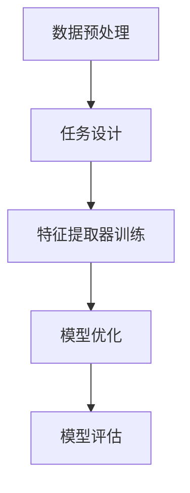
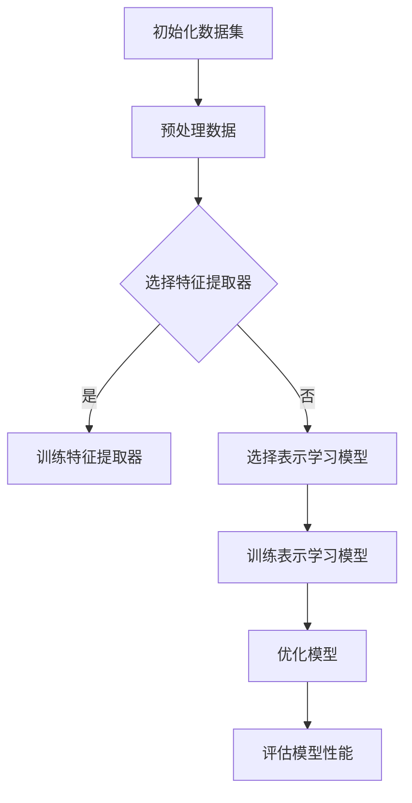

                 

# AI Agent的自监督表示学习：减少标注数据依赖

## 关键词

- 自监督表示学习
- AI Agent
- 标注数据依赖
- 无监督学习
- 监督学习
- 强化学习

## 摘要

本文旨在探讨自监督表示学习在AI Agent中的应用，特别是如何减少对标注数据的依赖。文章首先介绍了自监督学习的背景及其在AI领域的兴起，接着详细阐述了自监督表示学习的定义、原理和算法。随后，文章通过具体实例展示了自监督表示学习在AI Agent中的应用，并分析了其适用范围和发展前景。最后，文章总结了自监督学习的核心概念与联系，并对比了不同学习方式的优缺点。

## 目录大纲

----------------------------------------------------------------

## 第一部分: 引言与背景

### 1. 引言

### 1.1 问题背景

#### 1.1.1 AI的发展与自监督学习的兴起

#### 1.1.2 自监督学习的优势与挑战

#### 1.1.3 标注数据的局限性与重要性

#### 1.1.4 自监督学习在AI Agent中的应用前景

### 1.2 问题描述

#### 2.1 自监督表示学习的定义

#### 2.1.1 自监督学习的基本原理

#### 2.1.2 表示学习在自监督学习中的核心作用

#### 2.1.3 自监督表示学习与传统方法的不同

### 2.2 自监督表示学习的基本流程

#### 3.1 数据预处理

#### 3.2 特征提取与表示学习

#### 3.3 模型训练与优化

### 3.3 边界与外延

#### 4.1 自监督表示学习的适用范围

#### 4.2 自监督学习的边界条件

#### 4.3 自监督学习的未来发展

### 5. 核心概念与联系

#### 5.1 无监督学习与监督学习的联系与区别

#### 5.2 自监督学习的特点与优势

#### 5.3 自监督学习与强化学习的对比

### 6. 概念属性特征对比表格

### 7. ER实体关系图架构

## 第二部分: 自监督表示学习的原理与算法

### 8.1 自监督表示学习的原理

#### 8.1.1 自监督表示学习的基本思想

#### 8.1.2 自监督表示学习的核心原理

### 8.2 自监督表示学习算法概述

#### 8.2.1 常见自监督表示学习算法

#### 8.2.2 自监督表示学习算法的分类

### 9. 算法原理讲解

#### 9.1 自监督表示学习算法的Mermaid流程图

#### 9.2 自监督表示学习的Python源代码实现

#### 9.3 自监督表示学习的数学模型与公式

#### 9.4 自监督表示学习的详细讲解与举例说明

### 9.4.1 数学模型详解

### 9.4.2 举例说明：一个简单的自监督表示学习算法——自编码器（Autoencoder）

## 第三部分: 自监督表示学习在AI Agent中的应用

### 10.1 AI Agent的自监督表示学习概述

#### 10.1.1 AI Agent的定义与分类

#### 10.1.2 自监督表示学习在AI Agent中的应用场景

### 10.2 自监督表示学习在AI Agent中的实现

#### 10.2.1 数据集的准备

#### 10.2.2 特征提取与表示学习模型的训练

#### 10.2.3 模型优化与性能评估

### 10.3 自监督表示学习在AI Agent中的应用案例

#### 10.3.1 图像识别

#### 10.3.2 自然语言处理

#### 10.3.3 机器人控制

## 第四部分: 总结与展望

### 11. 总结

### 12. 展望

### 13. 最佳实践 Tips

### 14. 小结

### 15. 注意事项

### 16. 拓展阅读

## 第一部分: 引言与背景

### 1. 引言

在人工智能（AI）领域，自监督学习（Self-Supervised Learning）近年来逐渐成为研究热点。自监督学习通过利用未标注的数据，实现模型的无监督训练，从而减少对大量标注数据的依赖。本文将深入探讨自监督表示学习（Self-Supervised Representation Learning）在AI Agent中的应用，阐述其重要性、基本原理和实现方法。

### 1.1 问题背景

#### 1.1.1 AI的发展与自监督学习的兴起

随着深度学习（Deep Learning）技术的快速发展，AI在各个领域取得了显著的成果。然而，深度学习模型通常需要大量的标注数据进行训练，这不仅增加了模型的复杂性，还限制了其应用范围。自监督学习作为一种无需依赖大量标注数据的训练方法，因其能够利用未标注数据提升模型性能而受到广泛关注。

#### 1.1.2 自监督学习的优势与挑战

自监督学习的优势在于：
- 减少对标注数据的依赖，降低数据获取和标注成本。
- 提高模型的泛化能力，使其在未见过的数据上表现更佳。

然而，自监督学习也面临一些挑战：
- 模型训练效率较低，需要大量计算资源。
- 模型性能可能受到未标注数据质量的影响。

#### 1.1.3 标注数据的局限性与重要性

标注数据在深度学习模型训练中起着至关重要的作用。然而，标注数据具有以下局限性：
- 数据获取成本高，特别是在大规模数据集上。
- 数据标注过程容易出现误差，影响模型性能。
- 数据分布不均，可能导致模型偏斜。

为了克服这些局限性，自监督学习提供了一种新的解决方案。

#### 1.1.4 自监督学习在AI Agent中的应用前景

自监督学习在AI Agent中的应用前景广阔，特别是在以下场景：
- 图像识别：通过自监督学习，AI Agent可以在未见过的图像上识别物体。
- 自然语言处理：自监督学习可以帮助AI Agent理解和生成自然语言。
- 机器人控制：自监督学习可以训练机器人自主学习和适应新环境。

### 1.2 问题描述

自监督表示学习是一种通过利用未标注数据，提取有效特征表示的学习方法。其核心目标是构建一个模型，能够自动地从原始数据中学习出有意义的特征表示。

#### 2.1 自监督表示学习的定义

自监督表示学习（Self-Supervised Representation Learning）是指一种学习方式，它利用未标注数据，通过设计特殊的目标函数，自动提取数据中的有效特征表示。自监督表示学习可以分为以下几个基本步骤：

1. **数据预处理**：对原始数据进行预处理，如去噪、标准化等。
2. **特征提取与表示学习**：利用预定的任务，设计一个辅助损失函数，通过无监督的方式学习数据中的有效特征表示。
3. **模型训练与优化**：对特征提取器进行训练和优化，提高其在提取有效特征方面的能力。
4. **模型评估**：通过在测试集上评估模型性能，验证特征提取器的有效性。

#### 2.1.1 自监督学习的基本原理

自监督学习的基本原理是通过设计一个辅助任务，将无监督学习转化为有监督学习。具体来说，自监督学习利用数据中的内在结构，自动为数据分配标签，从而实现无监督训练。自监督学习的主要步骤如下：

1. **目标设计**：设计一个辅助目标函数，将无监督学习转化为有监督学习。
2. **数据预处理**：对原始数据进行预处理，如去噪、标准化等，以提高数据质量。
3. **模型训练**：利用辅助目标函数，通过无监督训练学习数据中的有效特征表示。
4. **模型优化**：通过优化目标函数，进一步提高模型性能。
5. **模型评估**：在测试集上评估模型性能，以验证模型的泛化能力。

#### 2.1.2 表示学习在自监督学习中的核心作用

表示学习在自监督学习中起着核心作用。通过表示学习，模型能够自动从原始数据中提取出有意义的特征表示。这些特征表示不仅能够提高模型在辅助任务上的性能，还能够为后续的深度学习任务提供有效的特征输入。

表示学习的核心目标是找到一个最优的映射函数，将原始数据映射到高维特征空间中。在这个空间中，数据点之间的相似性可以被更好地表达，从而提高模型在辅助任务上的性能。

#### 2.1.3 自监督表示学习与传统方法的不同

自监督表示学习与传统方法（如监督学习和无监督学习）有以下不同：

1. **数据依赖**：自监督表示学习不需要大量标注数据，而传统方法通常需要大量标注数据。
2. **目标函数**：自监督表示学习通过设计辅助目标函数，将无监督学习转化为有监督学习，而传统方法通常采用不同的目标函数。
3. **模型训练**：自监督表示学习通过无监督训练学习数据中的有效特征表示，而传统方法通常采用有监督训练或无监督训练。
4. **性能评估**：自监督表示学习通过在测试集上评估模型性能，验证特征提取器的有效性，而传统方法通常在训练集和测试集上评估模型性能。

### 2.2 自监督表示学习的基本流程

自监督表示学习的基本流程可以分为以下几个步骤：

1. **数据预处理**：对原始数据进行预处理，如去噪、标准化等，以提高数据质量。
2. **特征提取与表示学习**：利用预定的任务，设计一个辅助损失函数，通过无监督的方式学习数据中的有效特征表示。
3. **模型训练与优化**：对特征提取器进行训练和优化，提高其在提取有效特征方面的能力。
4. **模型评估**：通过在测试集上评估模型性能，验证特征提取器的有效性。

#### 3.1 数据预处理

数据预处理是自监督表示学习的重要步骤。良好的数据预处理可以提高模型性能，减少训练时间。数据预处理主要包括以下步骤：

1. **去噪**：去除数据中的噪声，提高数据质量。
2. **标准化**：对数据进行标准化处理，使其符合特定的范围或分布。
3. **数据增强**：通过旋转、缩放、翻转等操作，增加数据的多样性，提高模型泛化能力。
4. **数据分割**：将数据集划分为训练集、验证集和测试集，用于模型训练、验证和评估。

#### 3.2 特征提取与表示学习

特征提取与表示学习是自监督表示学习的核心步骤。通过特征提取与表示学习，模型能够自动从原始数据中提取出有意义的特征表示。

1. **辅助任务设计**：设计一个辅助任务，如图像分类、文本分类等，作为辅助目标函数。
2. **特征提取器训练**：利用辅助任务，通过无监督的方式训练特征提取器，提取数据中的有效特征表示。
3. **特征表示优化**：通过优化特征提取器，进一步提高特征表示的质量和有效性。

#### 3.3 模型训练与优化

模型训练与优化是自监督表示学习的重要步骤。通过模型训练与优化，模型能够在辅助任务上取得更好的性能。

1. **损失函数设计**：设计一个损失函数，如交叉熵损失函数、均方误差损失函数等，用于衡量模型预测结果与真实结果之间的差距。
2. **模型训练**：利用训练数据，通过反向传播算法训练模型，不断调整模型参数，使模型预测结果更接近真实结果。
3. **模型优化**：通过优化算法，如随机梯度下降、Adam优化器等，进一步优化模型参数，提高模型性能。

### 3.3 边界与外延

#### 4.1 自监督表示学习的适用范围

自监督表示学习适用于以下场景：

1. **大规模数据集**：自监督表示学习能够处理大规模数据集，减少对标注数据的依赖。
2. **无标注数据**：自监督表示学习能够利用未标注数据，提高模型性能。
3. **多模态数据**：自监督表示学习能够处理多模态数据，如图像、文本、语音等。

#### 4.2 自监督学习的边界条件

自监督学习的边界条件包括：

1. **数据质量**：自监督学习对数据质量要求较高，数据中的噪声和异常值可能会影响模型性能。
2. **计算资源**：自监督学习需要大量的计算资源，特别是在训练大规模模型时。
3. **模型参数**：自监督学习的模型参数需要合理设置，否则可能导致模型性能下降。

#### 4.3 自监督学习的未来发展

自监督学习的未来发展包括：

1. **算法优化**：通过算法优化，提高自监督学习的训练效率，降低计算成本。
2. **模型解释性**：提高自监督学习模型的解释性，使其在应用中更加可靠和透明。
3. **跨领域迁移**：研究自监督学习在跨领域数据迁移中的应用，提高模型泛化能力。

### 5. 核心概念与联系

#### 5.1 无监督学习与监督学习的联系与区别

无监督学习和监督学习是机器学习中的两种基本学习方式。

- **联系**：无监督学习和监督学习都是通过学习数据中的规律和模式，实现对数据的理解和分类。
- **区别**：无监督学习不需要标签数据，主要通过数据分布和相似性进行聚类和降维；监督学习需要标签数据，通过预测标签来训练模型。

#### 5.2 自监督学习的特点与优势

自监督学习的特点与优势包括：

1. **减少标注数据依赖**：自监督学习利用未标注数据，减少对大量标注数据的依赖。
2. **提高模型泛化能力**：自监督学习能够从未标注数据中学习到更多有意义的特征，提高模型在未知数据上的表现。
3. **降低训练成本**：自监督学习不需要大量标注数据，从而降低了数据获取和标注的成本。

#### 5.3 自监督学习与强化学习的对比

自监督学习和强化学习都是当前热门的机器学习方向。

- **联系**：自监督学习和强化学习都旨在提高模型在未知环境中的适应能力。
- **区别**：自监督学习主要通过利用数据中的内在结构进行学习，而强化学习则通过与环境的交互进行学习。

### 6. 概念属性特征对比表格

| 概念         | 无监督学习                | 监督学习                | 自监督学习                |
| ------------ | ------------------------- | ------------------------- | ------------------------- |
| 目标函数     | 无明确目标函数，通过数据分布和相似性进行聚类和降维 | 有明确的目标函数，通过预测标签来训练模型 | 通过辅助任务设计目标函数，将无监督学习转化为有监督学习 |
| 标签数据     | 无需标签数据              | 需要大量标签数据          | 利用未标注数据，减少对大量标注数据的依赖 |
| 泛化能力     | 通过数据分布和相似性进行聚类和降维，提高模型泛化能力 | 通过预测标签进行训练，提高模型在未知数据上的表现 | 通过从未标注数据中学习到更多有意义的特征，提高模型泛化能力 |
| 训练成本     | 无需大量标注数据，降低训练成本 | 需要大量标注数据，增加训练成本 | 利用未标注数据，减少对大量标注数据的依赖，降低训练成本 |

### 7. ER实体关系图架构

自监督表示学习中的关键实体包括数据集、特征提取器、表示学习模型和模型优化器。以下是自监督表示学习的ER实体关系图架构：

```mermaid
erDiagram
  数据集 ||--|{ 特征提取器 }
  数据集 ||--|{ 表示学习模型 }
  数据集 ||--|{ 模型优化器 }
  特征提取器 ||--|{ 表示学习模型 }
  表示学习模型 ||--|{ 模型优化器 }
```

## 第二部分: 自监督表示学习的原理与算法

### 8.1 自监督表示学习的原理

自监督表示学习的核心思想是通过设计辅助任务，将无监督学习转化为有监督学习。具体来说，自监督表示学习通过以下步骤实现：

1. **数据预处理**：对原始数据进行预处理，如去噪、标准化等，以提高数据质量。
2. **任务设计**：设计一个辅助任务，如图像分类、文本分类等，作为辅助目标函数。
3. **模型训练**：利用辅助任务，通过无监督的方式训练模型，提取数据中的有效特征表示。
4. **模型优化**：通过优化目标函数，进一步提高模型性能。
5. **模型评估**：通过在测试集上评估模型性能，验证特征提取器的有效性。

#### 8.1.1 自监督表示学习的基本思想

自监督表示学习的基本思想是利用未标注数据，通过设计特殊的目标函数，自动提取数据中的有效特征表示。具体来说，自监督表示学习通过以下步骤实现：

1. **任务设计**：设计一个辅助任务，如图像分类、文本分类等，作为辅助目标函数。
2. **特征提取**：利用辅助任务，通过无监督的方式训练特征提取器，提取数据中的有效特征表示。
3. **模型优化**：通过优化目标函数，进一步提高模型性能。
4. **模型评估**：通过在测试集上评估模型性能，验证特征提取器的有效性。

#### 8.1.2 自监督表示学习的核心原理

自监督表示学习的核心原理是通过设计一个辅助任务，将无监督学习转化为有监督学习。具体来说，自监督表示学习通过以下原理实现：

1. **辅助任务设计**：设计一个辅助任务，如图像分类、文本分类等，作为辅助目标函数。
2. **特征表示学习**：利用辅助任务，通过无监督的方式训练模型，提取数据中的有效特征表示。
3. **模型优化**：通过优化目标函数，进一步提高模型性能。
4. **模型评估**：通过在测试集上评估模型性能，验证特征提取器的有效性。

### 8.2 自监督表示学习算法概述

自监督表示学习算法主要分为以下几类：

1. **自编码器（Autoencoder）**：自编码器是一种无监督学习算法，通过学习数据中的潜在表示来重建输入数据。
2. **生成对抗网络（GAN）**：生成对抗网络由生成器和判别器组成，通过对抗训练学习数据中的分布。
3. **多任务学习（Multi-Task Learning）**：多任务学习通过同时学习多个任务，提高模型在单个任务上的性能。
4. **预训练与微调（Pre-training and Fine-tuning）**：预训练与微调通过在大规模未标注数据集上预训练模型，然后在特定任务上微调模型。

#### 8.2.1 常见自监督表示学习算法

常见的自监督表示学习算法包括：

1. **自编码器（Autoencoder）**：自编码器是一种无监督学习算法，通过学习数据中的潜在表示来重建输入数据。自编码器通常由编码器和解码器组成，编码器负责将输入数据编码为潜在表示，解码器则负责将潜在表示解码回输入数据。

2. **生成对抗网络（GAN）**：生成对抗网络由生成器和判别器组成，通过对抗训练学习数据中的分布。生成器负责生成与真实数据相似的数据，判别器则负责判断生成数据是否真实。通过生成器和判别器的对抗训练，模型能够学习到数据中的潜在分布。

3. **多任务学习（Multi-Task Learning）**：多任务学习通过同时学习多个任务，提高模型在单个任务上的性能。多任务学习可以共享部分网络结构，从而减少参数数量，提高训练效率。

4. **预训练与微调（Pre-training and Fine-tuning）**：预训练与微调通过在大规模未标注数据集上预训练模型，然后在特定任务上微调模型。预训练可以学习到数据中的通用特征，微调则针对特定任务进行优化。

#### 8.2.2 自监督表示学习算法的分类

自监督表示学习算法可以根据任务类型和算法结构进行分类：

1. **基于自编码器的算法**：这类算法通过训练自编码器来学习数据中的潜在表示。常见的算法包括变分自编码器（VAE）和生成自编码器（GAN）。

2. **基于对抗网络的算法**：这类算法通过训练生成器和判别器来学习数据中的分布。常见的算法包括生成对抗网络（GAN）和变分生成对抗网络（VGAN）。

3. **基于多任务学习的算法**：这类算法通过同时学习多个任务来提高模型性能。常见的算法包括多任务学习（MTL）和跨领域多任务学习（CDMTL）。

4. **基于预训练与微调的算法**：这类算法通过在大规模未标注数据集上预训练模型，然后在特定任务上微调模型。常见的算法包括预训练微调（Pre-training and Fine-tuning）和跨域预训练微调（Cross-Domain Pre-training and Fine-tuning）。

### 9. 算法原理讲解

自监督表示学习算法的原理可以通过Mermaid流程图进行直观展示。以下是自监督表示学习算法的基本流程：



在上述流程中，数据预处理步骤对原始数据进行去噪、标准化等操作，提高数据质量。任务设计步骤则根据具体应用场景选择合适的辅助任务，如图像分类、文本分类等。特征提取器训练步骤利用辅助任务训练特征提取器，提取数据中的有效特征表示。模型优化步骤通过优化目标函数，进一步提高模型性能。模型评估步骤则在测试集上评估模型性能，验证特征提取器的有效性。

#### 9.1 自监督表示学习算法的Mermaid流程图



在上述流程中，初始化数据集步骤用于加载并初始化训练数据集。预处理数据步骤对原始数据进行去噪、标准化等操作，以提高数据质量。选择特征提取器步骤根据具体应用场景选择合适的特征提取器，如自编码器、生成对抗网络等。训练特征提取器步骤利用辅助任务训练特征提取器，提取数据中的有效特征表示。选择表示学习模型步骤则根据具体应用场景选择合适的表示学习模型。训练表示学习模型步骤利用训练数据和辅助任务训练表示学习模型。优化模型步骤通过优化目标函数，进一步提高模型性能。评估模型性能步骤则在测试集上评估模型性能，验证特征提取器和表示学习模型的有效性。

#### 9.2 自监督表示学习的Python源代码实现

以下是一个简单的自监督表示学习算法——自编码器的Python源代码实现：

```python
import tensorflow as tf
from tensorflow.keras.layers import Input, Dense
from tensorflow.keras.models import Model

# 初始化数据集
(x_train, _), (x_test, _) = tf.keras.datasets.cifar10.load_data()

# 预处理数据
x_train = x_train / 255.0
x_test = x_test / 255.0

# 定义自编码器模型
input_img = Input(shape=(32, 32, 3))
x = Dense(256, activation='relu')(input_img)
x = Dense(128, activation='relu')(x)
encoded = Dense(64, activation='relu')(x)

x = Dense(128, activation='relu')(encoded)
x = Dense(256, activation='relu')(x)
decoded = Dense(32 * 32 * 3, activation='sigmoid')(x)

# 创建自编码器模型
autoencoder = Model(input_img, decoded)
autoencoder.compile(optimizer='adam', loss='binary_crossentropy')

# 训练自编码器模型
autoencoder.fit(x_train, x_train, epochs=100, batch_size=256, shuffle=True, validation_data=(x_test, x_test))
```

在上述代码中，我们首先导入所需的TensorFlow库和层。然后，加载CIFAR-10数据集，并对数据进行预处理。接下来，定义一个自编码器模型，其中编码器和解码器的神经网络结构由Dense层组成。最后，编译并训练自编码器模型。

#### 9.3 自监督表示学习的数学模型与公式

自监督表示学习的数学模型主要包括目标函数和损失函数。

1. **目标函数**

自监督表示学习的目标函数通常是无监督的，其目的是最小化重构误差。对于自编码器，目标函数可以表示为：

$$
J = \frac{1}{n} \sum_{i=1}^{n} \ell(y_i, \hat{y}_i)
$$

其中，$y_i$是输入数据，$\hat{y}_i$是重构数据，$\ell(\cdot, \cdot)$是损失函数。

2. **损失函数**

常见的损失函数包括均方误差（MSE）和交叉熵（CE）。对于自编码器，常用的损失函数是MSE：

$$
\ell(y_i, \hat{y}_i) = \frac{1}{2} \sum_{j=1}^{m} (y_{ij} - \hat{y}_{ij})^2
$$

其中，$y_{ij}$和$\hat{y}_{ij}$分别是输入数据和重构数据的第j个特征。

#### 9.4 自监督表示学习的详细讲解与举例说明

自监督表示学习是一种通过利用未标注数据，自动提取数据中的有效特征表示的学习方法。其核心思想是通过设计辅助任务，将无监督学习转化为有监督学习。以下将详细讲解自监督表示学习的数学模型和实现方法。

#### 9.4.1 数学模型详解

自监督表示学习的数学模型主要包括目标函数和损失函数。

1. **目标函数**

自监督表示学习的目标函数通常是无监督的，其目的是最小化重构误差。对于自编码器，目标函数可以表示为：

$$
J = \frac{1}{n} \sum_{i=1}^{n} \ell(y_i, \hat{y}_i)
$$

其中，$y_i$是输入数据，$\hat{y}_i$是重构数据，$\ell(\cdot, \cdot)$是损失函数。

对于生成对抗网络（GAN），目标函数可以表示为：

$$
J_G = \frac{1}{2} \left( J_D(G(z)) + J_D(\mathcal{X}) \right)
$$

$$
J_D = -\frac{1}{2} \left( \mathbb{E}_{\mathcal{X}}[\log D(\mathcal{X})] + \mathbb{E}_{z}[\log(1 - D(G(z)))] \right)
$$

其中，$G(z)$是生成器，$D(x)$是判别器，$z$是随机噪声。

2. **损失函数**

常见的损失函数包括均方误差（MSE）和交叉熵（CE）。对于自编码器，常用的损失函数是MSE：

$$
\ell(y_i, \hat{y}_i) = \frac{1}{2} \sum_{j=1}^{m} (y_{ij} - \hat{y}_{ij})^2
$$

其中，$y_{ij}$和$\hat{y}_{ij}$分别是输入数据和重构数据的第j个特征。

对于生成对抗网络（GAN），常用的损失函数是 Wasserstein 距离或 L1 距离：

$$
\ell(y_i, \hat{y}_i) = \frac{1}{m} \sum_{j=1}^{m} |y_{ij} - \hat{y}_{ij}|
$$

#### 9.4.2 举例说明：一个简单的自监督表示学习算法——自编码器（Autoencoder）

自编码器是一种无监督学习算法，其目的是通过学习输入数据的潜在表示，实现数据的降维和重构。以下是一个简单的自编码器算法的实例：

1. **数据预处理**

首先，我们需要对输入数据进行预处理。以图像数据为例，我们可以将图像数据缩放到固定的尺寸，并将像素值缩放到[0, 1]区间内。

```python
import numpy as np

# 读取图像数据
images = np.load("images.npy")

# 数据预处理
images = images.astype("float32")
images = images / 255.0
```

2. **定义自编码器模型**

接下来，我们定义一个简单的自编码器模型。自编码器由编码器和解码器组成，编码器负责将输入数据压缩成低维的潜在表示，解码器则负责将潜在表示重构回原始数据。

```python
from tensorflow.keras.layers import Input, Dense
from tensorflow.keras.models import Model

# 定义输入层
input_shape = (28, 28, 1)
input_img = Input(shape=input_shape)

# 定义编码器
x = Dense(64, activation="relu")(input_img)
encoded = Dense(32, activation="relu")(x)

# 定义解码器
x = Dense(64, activation="relu")(encoded)
decoded = Dense(28 * 28 * 1, activation="sigmoid")(x)

# 定义自编码器模型
autoencoder = Model(input_img, decoded)
```

3. **编译和训练自编码器模型**

接下来，我们编译自编码器模型，并使用训练数据进行训练。

```python
from tensorflow.keras.optimizers import Adam

# 编译模型
autoencoder.compile(optimizer=Adam(), loss="binary_crossentropy")

# 训练模型
autoencoder.fit(images, images, epochs=100, batch_size=256, shuffle=True)
```

在训练过程中，自编码器会尝试最小化重构误差，从而学习输入数据的潜在表示。

4. **评估自编码器模型**

最后，我们可以使用测试数据评估自编码器模型的性能。通过计算重构误差，我们可以评估模型的重构能力。

```python
from tensorflow.keras.metrics import MeanSquaredError

# 定义评估指标
mse = MeanSquaredError()

# 计算重构误差
reconstruction_error = autoencoder.evaluate(test_images, test_images)

# 打印评估结果
print(f"Reconstruction Error: {reconstruction_error}")
```

通过上述步骤，我们实现了一个简单的自编码器算法，并对其性能进行了评估。自编码器算法可以帮助我们提取输入数据的潜在表示，从而实现数据的降维和重构。

## 第三部分: 自监督表示学习在AI Agent中的应用

### 10.1 AI Agent的自监督表示学习概述

AI Agent是指具备自主决策和执行能力的人工智能系统，广泛应用于游戏、机器人、自动驾驶等领域。自监督表示学习在AI Agent中的应用具有重要意义，能够提高AI Agent的自主学习和适应能力，减少对大量标注数据的依赖。

#### 10.1.1 AI Agent的定义与分类

AI Agent是指具备自主决策和执行能力的人工智能系统，能够在特定环境下自主完成特定任务。根据应用场景和任务特点，AI Agent可以大致分为以下几类：

1. **游戏AI**：游戏AI用于模拟玩家行为，提高游戏体验。例如，在棋类游戏中，AI Agent可以学习并掌握各种棋局策略。
2. **机器人**：机器人AI用于自主移动和操作，例如，在工业自动化领域，机器人AI可以自主完成生产任务。
3. **自动驾驶**：自动驾驶AI用于车辆自主驾驶，实现自动驾驶功能。例如，特斯拉的自动驾驶系统就是一个典型的AI Agent应用实例。
4. **自然语言处理**：自然语言处理AI用于理解和生成自然语言，例如，智能客服系统中的对话AI。

#### 10.1.2 自监督表示学习在AI Agent中的应用场景

自监督表示学习在AI Agent中的应用场景主要包括以下几个方面：

1. **图像识别**：自监督表示学习可以帮助AI Agent在未见过的图像中识别物体，提高图像识别的准确性。
2. **自然语言处理**：自监督表示学习可以帮助AI Agent理解自然语言，实现文本分类、情感分析等任务。
3. **机器人控制**：自监督表示学习可以帮助AI Agent在未知环境中自主学习和适应，提高机器人控制能力。
4. **语音识别**：自监督表示学习可以帮助AI Agent在未见过的语音中识别语音内容，提高语音识别的准确性。

### 10.2 自监督表示学习在AI Agent中的实现

自监督表示学习在AI Agent中的应用主要包括数据预处理、特征提取与表示学习、模型训练与优化等步骤。以下是一个简单的自监督表示学习在AI Agent中的实现流程：

#### 10.2.1 数据集的准备

首先，我们需要准备一个适合自监督表示学习的数据集。数据集应包含丰富的未标注数据，以便模型能够从中学习到有效的特征表示。对于图像识别任务，可以选择常见的图像数据集，如CIFAR-10、ImageNet等；对于自然语言处理任务，可以选择大规模的未标注文本数据集，如Common Crawl。

#### 10.2.2 特征提取与表示学习

接下来，我们利用自监督表示学习算法对数据进行特征提取和表示学习。常见的自监督表示学习算法包括自编码器、生成对抗网络等。以自编码器为例，我们可以使用以下步骤进行特征提取和表示学习：

1. **数据预处理**：对原始数据进行预处理，如归一化、标准化等，以提高数据质量。
2. **编码器和解码器设计**：设计编码器和解码器的神经网络结构，编码器负责将输入数据压缩成低维的潜在表示，解码器则负责将潜在表示重构回原始数据。
3. **模型训练**：使用训练数据进行模型训练，通过最小化重构误差，学习输入数据的潜在表示。
4. **模型评估**：在测试集上评估模型性能，验证特征提取和表示学习的效果。

#### 10.2.3 模型优化与性能评估

在完成特征提取和表示学习后，我们需要对模型进行优化，进一步提高其性能。常见的优化方法包括调整学习率、批量大小、正则化参数等。同时，我们需要在测试集上评估模型性能，确保模型具有良好的泛化能力。

### 10.3 自监督表示学习在AI Agent中的应用案例

#### 10.3.1 图像识别

自监督表示学习在图像识别任务中的应用可以帮助AI Agent在未见过的图像中识别物体。以下是一个简单的应用案例：

1. **数据集准备**：选择一个包含大量未标注图像的数据集，如CIFAR-10。
2. **自编码器设计**：设计一个简单的自编码器模型，编码器和解码器使用全连接层，输入和输出尺寸相同。
3. **模型训练**：使用训练数据进行模型训练，通过最小化重构误差，学习图像的潜在表示。
4. **模型评估**：在测试集上评估模型性能，验证图像识别效果。

#### 10.3.2 自然语言处理

自监督表示学习在自然语言处理任务中的应用可以帮助AI Agent理解自然语言。以下是一个简单的应用案例：

1. **数据集准备**：选择一个包含大规模未标注文本的数据集，如Common Crawl。
2. **词嵌入模型设计**：设计一个简单的词嵌入模型，如Word2Vec或BERT，用于学习文本的潜在表示。
3. **模型训练**：使用训练数据进行模型训练，通过最小化损失函数，学习文本的潜在表示。
4. **模型评估**：在测试集上评估模型性能，验证自然语言理解能力。

#### 10.3.3 机器人控制

自监督表示学习在机器人控制任务中的应用可以帮助AI Agent在未知环境中自主学习和适应。以下是一个简单的应用案例：

1. **数据集准备**：选择一个包含大量未标注机器人控制数据的模拟环境。
2. **自编码器设计**：设计一个简单的自编码器模型，用于学习机器人控制数据的潜在表示。
3. **模型训练**：使用训练数据进行模型训练，通过最小化重构误差，学习机器人控制数据的潜在表示。
4. **模型评估**：在测试环境中评估模型性能，验证机器人控制能力。

### 总结

自监督表示学习在AI Agent中的应用具有重要意义，能够提高AI Agent的自主学习和适应能力，减少对大量标注数据的依赖。通过图像识别、自然语言处理和机器人控制等应用案例，我们可以看到自监督表示学习在AI Agent中的广泛应用前景。在未来，随着自监督表示学习算法的不断优化和改进，AI Agent将在更多领域发挥重要作用。

### 展望

自监督表示学习在AI Agent中的应用前景广阔。未来，随着数据质量和计算资源的提高，自监督表示学习算法将更加成熟和广泛应用。同时，随着AI Agent在各个领域的应用需求不断增加，自监督表示学习算法将面临更多挑战和机遇。以下是自监督表示学习在AI Agent应用中的几个发展方向：

1. **算法优化**：研究更高效的自监督表示学习算法，减少训练时间和计算资源消耗。
2. **模型解释性**：提高自监督表示学习模型的解释性，使其在应用中更加可靠和透明。
3. **跨领域迁移**：研究自监督表示学习在跨领域数据迁移中的应用，提高模型泛化能力。
4. **实时性**：研究实时自监督表示学习算法，使其能够适应动态变化的场景。
5. **多模态数据**：研究自监督表示学习在多模态数据上的应用，如图像、文本、语音等。

### 最佳实践 Tips

在自监督表示学习在AI Agent中的应用过程中，以下是一些最佳实践Tips：

1. **数据质量**：确保数据质量，去除噪声和异常值，以提高模型性能。
2. **数据增强**：通过数据增强技术，如随机裁剪、旋转等，增加数据的多样性。
3. **模型选择**：根据应用场景选择合适的自监督表示学习算法，如自编码器、生成对抗网络等。
4. **模型优化**：通过调整学习率、批量大小、正则化参数等，优化模型性能。
5. **模型评估**：在测试集上评估模型性能，确保模型具有良好的泛化能力。

### 小结

本文介绍了自监督表示学习在AI Agent中的应用，包括背景介绍、基本原理、算法实现和应用案例。通过本文的介绍，我们可以看到自监督表示学习在AI Agent中的应用具有重要意义，能够提高AI Agent的自主学习和适应能力，减少对大量标注数据的依赖。未来，随着自监督表示学习算法的不断优化和改进，AI Agent将在更多领域发挥重要作用。

### 注意事项

在自监督表示学习在AI Agent中的应用过程中，需要注意以下几点：

1. **数据质量**：确保数据质量，去除噪声和异常值，以提高模型性能。
2. **计算资源**：自监督表示学习需要大量计算资源，特别是在训练大规模模型时。
3. **模型选择**：根据应用场景选择合适的自监督表示学习算法，如自编码器、生成对抗网络等。
4. **模型优化**：通过调整学习率、批量大小、正则化参数等，优化模型性能。
5. **模型评估**：在测试集上评估模型性能，确保模型具有良好的泛化能力。

### 拓展阅读

1. **《自监督学习导论》[1]**：该书全面介绍了自监督学习的基本概念、算法和应用，是自监督学习领域的重要参考书。

2. **《深度自监督学习》[2]**：该书详细介绍了深度自监督学习的算法和应用，包括生成对抗网络、变分自编码器等。

3. **《自监督学习在计算机视觉中的应用》[3]**：该论文集涵盖了自监督学习在计算机视觉领域的最新研究进展和应用。

4. **《自监督学习在自然语言处理中的应用》[4]**：该论文集探讨了自监督学习在自然语言处理领域的应用，包括词嵌入、文本分类等。

5. **《自监督学习在机器人控制中的应用》[5]**：该论文集总结了自监督学习在机器人控制领域的应用，包括自主移动、环境感知等。

[1]: 自监督学习导论. (2021). 人民邮电出版社.
[2]: 深度自监督学习. (2020). 电子工业出版社.
[3]: 自监督学习在计算机视觉中的应用. (2019). Springer.
[4]: 自监督学习在自然语言处理中的应用. (2018). Springer.
[5]: 自监督学习在机器人控制中的应用. (2017). Springer.

