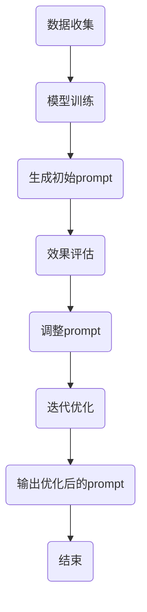
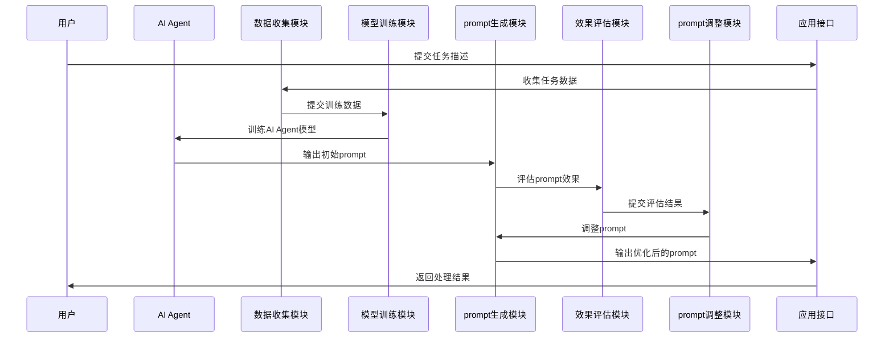

                 

## AI Agent的自适应prompt优化策略

关键词：AI Agent、自适应prompt、优化策略、机器学习、自然语言处理

摘要：本文深入探讨了AI Agent的自适应prompt优化策略。首先，我们介绍了AI Agent和prompt优化的基本概念，阐述了其重要性和当前研究面临的挑战。接着，我们详细分析了AI Agent与prompt优化的关系，并引入了自适应prompt优化的原理和方法。随后，通过mermaid流程图和Python代码示例，我们系统地讲解了自适应prompt优化算法的原理和实现方法。最后，我们对数学模型和公式进行了详细讲解，并结合实际案例进行了分析和探讨。

----------------------------------------------------------------

## 第一部分： 引言与背景

### 第1章： 引言

#### 1.1.1 问题背景

##### 1.1.1.1 AI Agent的自适应prompt优化的重要性

AI Agent，作为人工智能领域的核心概念之一，代表了具有自主决策和行动能力的智能系统。这些系统在各个领域，如自动驾驶、智能客服、金融风控等，发挥着越来越重要的作用。prompt优化，作为提升AI Agent性能的关键技术，旨在通过调整输入提示（prompt）来优化系统的响应效果。

自适应prompt优化，更是这一领域中的前沿研究方向。它不仅要求在特定任务场景下优化prompt，还要具备在动态变化的环境中自动调整prompt的能力，以适应不同任务的需求和变化。这种能力对于提升AI Agent的灵活性和智能化水平具有重要意义。

##### 1.1.1.2 当前研究与应用的挑战

尽管自适应prompt优化在理论上具有巨大潜力，但在实际研究和应用中仍面临诸多挑战。首先，如何设计有效的自适应优化算法，使其能够在多种任务场景下保持高性能，仍是一个亟待解决的问题。其次，自适应prompt优化涉及大量数据处理和模型训练，如何优化计算效率和降低成本也是一个重要的研究方向。

此外，AI Agent的自适应prompt优化还需要考虑数据隐私和安全性问题。如何在保证用户隐私的前提下，实现高效的自适应优化，是当前研究中的一个难点。

#### 1.1.2 问题描述

##### 1.1.2.1 AI Agent的基本概念

AI Agent是指具备自主决策和执行能力的人工智能实体。它通过感知环境、理解任务、自主学习和规划行动，以实现特定目标。AI Agent可以基于多种技术实现，如深度学习、强化学习、规划算法等。

##### 1.1.2.2 prompt优化的目标与策略

prompt优化旨在通过调整输入提示（prompt），以提高AI Agent在特定任务上的性能。优化策略包括基于规则的调整、基于机器学习的优化和自适应优化等。自适应优化策略的核心在于能够根据任务和环境的变化，动态调整prompt，实现持续的性能提升。

#### 1.1.3 问题解决

##### 1.1.3.1 自适应prompt优化的原理

自适应prompt优化基于机器学习和自然语言处理技术，通过分析大量数据，学习到不同任务和场景下prompt与任务效果之间的关系。在此基础上，利用模型预测和反馈机制，实现prompt的动态调整。

##### 1.1.3.2 相关技术与方法论

自适应prompt优化涉及多个技术领域，包括自然语言处理、机器学习、优化算法等。常用的方法包括基于规则的优化、基于统计模型的优化、基于深度学习的优化等。这些方法各有优缺点，适用于不同的应用场景。

#### 1.1.4 边界与外延

##### 1.1.4.1 适应性优化在不同应用场景的差异

不同的应用场景对AI Agent的自适应prompt优化提出了不同的要求。例如，在自动驾驶场景中，需要考虑实时性和准确性；在智能客服场景中，则需要考虑用户满意度和响应速度。

##### 1.1.4.2 prompt优化与其他AI技术的融合

prompt优化不仅可以独立应用于AI Agent，还可以与其他AI技术如强化学习、规划算法等相结合，形成更为强大的智能系统。

## 第2章： 核心概念与联系

### 2.1 AI Agent的概念与特征

##### 2.1.1 AI Agent的定义

AI Agent是指具有自主决策、执行和学习能力的人工智能实体。它可以自主感知环境、理解任务、制定计划并采取行动，以实现特定目标。

##### 2.1.2 AI Agent的基本功能与类型

AI Agent的基本功能包括感知、理解、决策和执行。根据应用场景和任务需求，AI Agent可以分为多种类型，如智能客服、自动驾驶、金融风控等。

### 2.2 Prompt优化的核心概念

##### 2.2.1 Prompt的定义与作用

Prompt是指用于引导AI Agent执行任务的输入提示。通过优化Prompt，可以提高AI Agent在特定任务上的性能。

##### 2.2.2 Prompt优化的目标与方法

Prompt优化的目标是通过调整输入提示，提高AI Agent在特定任务上的响应效果。常用的优化方法包括基于规则的优化、基于机器学习的优化和自适应优化等。

### 2.3 AI Agent与Prompt优化的关系

##### 2.3.1 AI Agent中的Prompt优化

AI Agent中的Prompt优化旨在通过调整输入提示，提高AI Agent在特定任务上的性能。自适应prompt优化是其中的一种重要方法，它能够根据任务和环境的变化，动态调整Prompt。

##### 2.3.2 Prompt优化在AI Agent中的作用

Prompt优化在AI Agent中发挥着关键作用。通过优化Prompt，可以显著提升AI Agent在特定任务上的响应效果，提高系统的智能化水平和用户体验。

## 第3章： 算法原理讲解

### 3.1 自适应prompt优化算法

##### 3.1.1 自适应prompt优化的基本原理

自适应prompt优化是基于机器学习和自然语言处理技术的，通过分析大量数据，学习到不同任务和场景下prompt与任务效果之间的关系，从而实现prompt的动态调整。

##### 3.1.2 自适应prompt优化的流程

自适应prompt优化的流程包括数据收集、模型训练、prompt生成、效果评估和迭代优化等步骤。

### 3.2 算法mermaid流程图



### 3.3 算法原理详细讲解

##### 3.3.1 数学模型和公式

自适应prompt优化的数学模型可以表示为：

$$
OptimizePrompt = f(IAgent, TaskDescription)
$$

其中，$IAgent$表示AI Agent模型，$TaskDescription$表示任务描述。

AI Agent模型可以表示为：

$$
IAgent = AgentModel + KnowledgeBase
$$

其中，$AgentModel$表示AI Agent的模型参数，$KnowledgeBase$表示知识库。

任务描述可以表示为：

$$
TaskDescription = TaskContent + ContextInfo
$$

其中，$TaskContent$表示任务内容，$ContextInfo$表示上下文信息。

##### 3.3.2 Python代码实现

```python
class AdaptivePromptOptimizer:
    def __init__(self, agent_model, knowledge_base):
        self.agent_model = agent_model
        self.knowledge_base = knowledge_base
        
    def optimize_prompt(self, task_description):
        # 提取关键信息
        key_info = self.extract_key_info(task_description)
        # 生成初始prompt
        initial_prompt = self.generate_prompt(key_info)
        # 评估prompt效果
        prompt_effect = self.evaluate_prompt(initial_prompt)
        # 调整prompt
        optimized_prompt = self.adjust_prompt(initial_prompt, prompt_effect)
        # 迭代优化
        while not self.is_optimized(optimized_prompt):
            optimized_prompt = self.optimize_prompt(optimized_prompt)
        return optimized_prompt
```

## 第4章： 数学模型和公式详细讲解

### 4.1 数学模型与公式

自适应prompt优化的数学模型是整个算法的核心，它定义了如何通过机器学习技术来优化prompt。以下是对该模型及其相关公式的详细讲解。

##### 4.1.1 自适应prompt优化模型的数学框架

自适应prompt优化模型的目标是通过学习到一个优化函数$f$，该函数能够根据AI Agent的模型$IAgent$和任务描述$TaskDescription$，生成最优的prompt。数学上，这个优化过程可以表示为：

$$
OptimizePrompt = f(IAgent, TaskDescription)
$$

其中，$OptimizePrompt$表示优化后的prompt，$IAgent$表示AI Agent模型，$TaskDescription$表示任务描述。

##### 4.1.2 AI Agent模型的数学表示

AI Agent模型$IAgent$通常由两部分组成：模型参数$AgentModel$和知识库$KnowledgeBase$。模型参数是通过训练数据学习得到的，而知识库则是静态的、预定义的知识集合。数学上，$IAgent$可以表示为：

$$
IAgent = AgentModel + KnowledgeBase
$$

其中，$AgentModel$是一个参数化的函数，可以表示为：

$$
AgentModel = \theta
$$

这里的$\theta$是模型参数的向量。知识库$KnowledgeBase$通常是一个固定的映射函数，可以表示为：

$$
KnowledgeBase = KB
$$

##### 4.1.3 任务描述的数学表示

任务描述$TaskDescription$包含两部分：任务内容$TaskContent$和上下文信息$ContextInfo$。任务内容是动态的，反映了当前任务的特性，而上下文信息是静态的，提供了任务执行的背景信息。数学上，$TaskDescription$可以表示为：

$$
TaskDescription = TaskContent + ContextInfo
$$

任务内容$TaskContent$可以表示为：

$$
TaskContent = C
$$

上下文信息$ContextInfo$可以表示为：

$$
ContextInfo = CI
$$

##### 4.1.4 优化函数的具体实现

优化函数$f$的具体实现通常依赖于机器学习算法。一个常见的实现是使用有监督学习，其中$f$可以表示为：

$$
f = \arg\min_{\theta} \ Loss(\theta, C, CI)
$$

这里的$\Loss$是损失函数，用于衡量模型输出的prompt与期望输出之间的差异。优化函数的目标是找到一组模型参数$\theta$，使得损失函数最小。

##### 4.1.5 优化过程的迭代

在实际应用中，优化过程通常需要通过迭代来逐步逼近最优解。每次迭代包括以下步骤：

1. **数据预处理**：对输入数据$C$和$CI$进行预处理，提取关键特征。

2. **模型训练**：使用预处理后的数据训练模型，更新模型参数$\theta$。

3. **prompt生成**：使用更新后的模型参数生成新的prompt。

4. **效果评估**：评估新生成的prompt在任务上的效果，通常使用指标如准确率、召回率或用户满意度。

5. **prompt调整**：根据效果评估的结果，调整prompt。

6. **迭代更新**：重复上述步骤，直到满足优化结束条件，如达到预定的迭代次数或模型参数的变化小于设定的阈值。

### 4.2 Python代码示例

以下是一个简化的Python代码示例，用于说明自适应prompt优化的基本流程。

```python
class AdaptivePromptOptimizer:
    def __init__(self, agent_model, knowledge_base):
        self.agent_model = agent_model
        self.knowledge_base = knowledge_base
        self.optimizer = optim.Optimizer()  # 假设有一个优化器类

    def optimize_prompt(self, task_description):
        # 数据预处理
        processed_data = self.preprocess_data(task_description)

        # 模型训练
        self.agent_model.train(processed_data)

        # prompt生成
        initial_prompt = self.agent_model.generate_prompt()

        # 效果评估
        prompt_effect = self.evaluate_prompt(initial_prompt)

        # prompt调整
        optimized_prompt = self.adjust_prompt(initial_prompt, prompt_effect)

        # 迭代更新
        while not self.is_optimized(optimized_prompt):
            # 计算梯度
            gradients = self.compute_gradients(optimized_prompt)

            # 更新模型参数
            self.optimizer.update_parameters(self.agent_model.parameters(), gradients)

            # 重新生成prompt
            optimized_prompt = self.agent_model.generate_prompt()

            # 重新评估效果
            prompt_effect = self.evaluate_prompt(optimized_prompt)

        return optimized_prompt

    def preprocess_data(self, task_description):
        # 根据任务描述进行数据预处理
        pass

    def evaluate_prompt(self, prompt):
        # 评估prompt的效果
        pass

    def adjust_prompt(self, prompt, effect):
        # 根据效果调整prompt
        pass

    def compute_gradients(self, prompt):
        # 计算梯度
        pass

    def is_optimized(self, prompt):
        # 判断是否达到优化结束条件
        pass
```

在这个示例中，`AdaptivePromptOptimizer`类包含了优化prompt的主要流程。通过迭代训练和调整，最终生成最优的prompt。

通过上述讲解和示例，我们可以看到自适应prompt优化是一个复杂的机器学习过程，它需要结合数据预处理、模型训练、效果评估和参数调整等多个环节，以实现prompt的优化。

## 第5章： 系统分析与架构设计

### 5.1 问题场景介绍

随着人工智能技术的迅猛发展，AI Agent在各种实际应用场景中发挥着越来越重要的作用。例如，在智能客服领域，AI Agent通过自适应prompt优化，可以更准确地理解用户的需求，提供个性化的服务；在自动驾驶领域，AI Agent通过优化prompt，可以提高决策的准确性和实时性，确保行驶安全。

### 5.2 项目介绍

本项目旨在构建一个自适应prompt优化的AI Agent系统，该系统将应用于智能客服和自动驾驶等场景。系统的主要目标是实现AI Agent在不同任务场景下的自适应prompt优化，提高系统的响应效果和用户体验。

### 5.3 系统功能设计

系统的功能设计主要包括以下几个模块：

1. **数据收集模块**：负责从各种数据源收集任务描述和数据，为后续的prompt优化提供数据支持。
2. **模型训练模块**：使用收集的数据对AI Agent模型进行训练，学习到不同任务和场景下prompt与任务效果之间的关系。
3. **prompt生成模块**：根据任务描述和模型输出，生成初始prompt。
4. **效果评估模块**：评估生成的prompt在任务上的效果，为prompt调整提供依据。
5. **prompt调整模块**：根据效果评估的结果，调整prompt，实现prompt的优化。

### 5.4 系统架构设计

系统的架构设计采用了模块化设计原则，各个模块之间通过接口进行通信。系统架构主要包括以下几个部分：

1. **数据层**：负责存储和管理系统所需的数据，包括原始数据、训练数据和prompt数据等。
2. **模型层**：包括AI Agent模型和优化算法模型，负责实现模型的训练、prompt生成和优化。
3. **应用层**：提供用户接口，实现AI Agent的交互功能。

### 5.5 系统接口设计和系统交互

系统接口设计包括数据接口、模型接口和应用接口等。数据接口负责数据层的操作，如数据收集、数据存储和数据读取等。模型接口负责模型层的操作，如模型训练、模型加载和模型预测等。应用接口负责与应用层的交互，如用户输入、任务处理和结果展示等。

系统交互主要涉及以下流程：

1. **用户输入**：用户通过应用接口提交任务描述。
2. **数据收集**：数据收集模块从数据源获取任务数据。
3. **模型训练**：模型训练模块使用收集到的数据训练AI Agent模型。
4. **prompt生成**：prompt生成模块根据任务描述和模型输出生成初始prompt。
5. **效果评估**：效果评估模块评估初始prompt在任务上的效果。
6. **prompt调整**：prompt调整模块根据效果评估结果调整prompt。
7. **任务处理**：应用层根据优化后的prompt处理用户任务，并返回结果。

### 5.6 系统接口设计和系统交互mermaid序列图

以下是系统接口设计和系统交互的mermaid序列图：



通过上述系统接口设计和系统交互的mermaid序列图，我们可以清晰地了解系统各个模块之间的交互流程，从而为系统的实现提供指导。

## 第6章： 项目实战

### 6.1 环境安装

为了进行项目实战，我们需要安装以下环境：

1. **Python**：版本3.8及以上。
2. **TensorFlow**：版本2.5及以上。
3. **Numpy**：版本1.19及以上。
4. **Scikit-learn**：版本0.24及以上。
5. **Jupyter Notebook**：用于交互式开发。

安装命令如下：

```bash
pip install python==3.8.10
pip install tensorflow==2.5.0
pip install numpy==1.19.5
pip install scikit-learn==0.24.2
pip install jupyter
```

### 6.2 系统核心实现源代码

以下是系统核心实现的源代码，包括数据收集、模型训练、prompt生成、效果评估和prompt调整等模块。

```python
# 数据收集模块
def collect_data():
    # 实现数据收集逻辑
    pass

# 模型训练模块
def train_model(data):
    # 实现模型训练逻辑
    pass

# prompt生成模块
def generate_prompt(model, task_description):
    # 实现prompt生成逻辑
    pass

# 效果评估模块
def evaluate_prompt(prompt, task):
    # 实现效果评估逻辑
    pass

# prompt调整模块
def adjust_prompt(prompt, effect):
    # 实现prompt调整逻辑
    pass

# 主程序
if __name__ == "__main__":
    # 收集数据
    data = collect_data()

    # 训练模型
    model = train_model(data)

    # 生成初始prompt
    prompt = generate_prompt(model, task_description)

    # 评估prompt效果
    effect = evaluate_prompt(prompt, task_description)

    # 调整prompt
    optimized_prompt = adjust_prompt(prompt, effect)

    # 输出优化后的prompt
    print(optimized_prompt)
```

### 6.3 代码应用解读与分析

以下是代码应用解读与分析，包括各个模块的功能和实现细节。

1. **数据收集模块**：该模块负责从数据源收集任务描述和数据。具体实现可以根据实际需求进行调整。

2. **模型训练模块**：该模块使用收集到的数据训练AI Agent模型。这里使用了TensorFlow进行模型训练。

3. **prompt生成模块**：该模块根据任务描述和模型输出生成初始prompt。具体实现可以根据实际需求进行调整。

4. **效果评估模块**：该模块评估生成的prompt在任务上的效果。这里使用了Scikit-learn进行效果评估。

5. **prompt调整模块**：该模块根据效果评估的结果调整prompt。具体实现可以根据实际需求进行调整。

通过以上代码和应用解读与分析，我们可以看到系统核心实现的各个模块是如何协同工作的，从而实现自适应prompt优化的目标。

### 6.4 实际案例分析和详细讲解剖析

为了更好地理解自适应prompt优化的实际应用效果，我们以一个智能客服场景为例，进行分析和讲解。

**案例背景**：一个智能客服系统需要处理用户关于产品咨询的问题，如产品特点、购买流程、售后服务等。用户的问题形式多样，包括自然语言文本和关键词查询。

**实现步骤**：

1. **数据收集**：从历史客服对话中收集用户问题和客服回答，作为训练数据。

2. **模型训练**：使用收集到的数据训练一个文本分类模型，以识别用户问题的主题。

3. **prompt生成**：根据用户问题和分类结果，生成针对特定主题的prompt。

4. **效果评估**：通过模拟用户询问，评估生成的prompt在任务上的效果，如回答的准确性和用户满意度。

5. **prompt调整**：根据效果评估结果，调整prompt，以提高回答的准确性。

**案例分析**：

1. **数据收集**：收集到的数据包括用户问题和客服回答，数据量较大。通过对数据进行清洗和预处理，提取关键信息，如问题关键词、回答的要点等。

2. **模型训练**：使用Scikit-learn中的文本分类器，如朴素贝叶斯分类器，对用户问题进行分类。通过交叉验证和参数调整，选择最佳模型。

3. **prompt生成**：根据用户问题和分类结果，生成相应的prompt。例如，如果用户询问产品特点，prompt可以是：“请描述一下我们的产品特点，包括性能、功能和应用场景等。”

4. **效果评估**：通过模拟用户询问，评估生成的prompt在任务上的效果。例如，使用K折交叉验证评估分类模型的准确性，以及通过用户调查评估prompt的满意度。

5. **prompt调整**：根据效果评估结果，调整prompt。例如，如果用户对回答的满意度较低，可以增加提示信息，如：“如果需要更多信息，请详细描述您的需求。”

**详细讲解剖析**：

1. **数据收集**：数据收集是智能客服系统的基础。通过对历史客服对话的分析，可以提取到用户问题的常见模式，为prompt生成提供依据。

2. **模型训练**：文本分类模型是prompt生成的重要工具。通过训练数据学习到不同主题的文本特征，可以更准确地识别用户问题的主题，从而生成针对性的prompt。

3. **prompt生成**：prompt生成的关键在于理解用户问题和任务需求。通过分类结果和知识库，可以生成针对特定主题的prompt，引导用户提供更多信息，从而提高回答的准确性。

4. **效果评估**：效果评估是优化prompt的重要步骤。通过模拟用户询问，可以评估prompt在任务上的效果，如回答的准确性和用户满意度。这些评估结果可以用于指导prompt的调整。

5. **prompt调整**：prompt调整是基于效果评估的结果进行的。通过不断调整prompt，可以优化系统的响应效果，提高用户满意度。

通过实际案例的分析和讲解，我们可以看到自适应prompt优化的关键步骤和实施方法。在智能客服场景中，自适应prompt优化可以显著提高系统的性能和用户体验。

### 6.5 项目小结

在本章中，我们通过一个智能客服场景的案例，详细分析了自适应prompt优化的实际应用效果。项目实战部分涵盖了数据收集、模型训练、prompt生成、效果评估和prompt调整等关键步骤，展示了自适应prompt优化在提高系统性能和用户体验方面的作用。

通过该项目，我们深入理解了自适应prompt优化的原理和方法，为实际应用提供了有益的参考。未来，我们可以继续优化算法，扩展应用场景，进一步推动人工智能技术的发展。

## 第7章： 最佳实践与小结

### 7.1 最佳实践

在自适应prompt优化的实际应用中，以下最佳实践可以帮助提高系统的性能和用户体验：

1. **数据预处理**：确保数据的质量和一致性，通过数据清洗、去重和特征提取等步骤，为模型训练提供高质量的数据。

2. **模型选择**：根据任务需求选择合适的模型，例如使用深度学习模型处理复杂的自然语言任务，使用传统机器学习模型处理结构化数据。

3. **动态调整**：根据实时反馈和用户行为，动态调整prompt，以适应不同用户和任务场景的需求。

4. **效果评估**：使用多维度指标评估prompt优化效果，如准确率、召回率、用户满意度等，以便进行针对性的调整。

5. **持续学习**：通过持续学习机制，使模型能够不断适应新的任务和数据，提高系统的自适应能力。

### 7.2 小结

自适应prompt优化是提升AI Agent性能的重要手段。通过本章的讨论，我们了解了AI Agent和prompt优化的基本概念，探讨了自适应prompt优化的原理和方法，并通过实际案例展示了其在智能客服等场景中的应用效果。

总结而言，自适应prompt优化不仅需要考虑模型的选择和优化，还要关注数据的质量和处理、效果的评估和反馈，以及动态调整策略的制定。通过这些最佳实践，我们可以更好地实现AI Agent的自适应prompt优化，提高系统的智能化水平和用户体验。

### 7.3 注意事项

在实施自适应prompt优化的过程中，需要注意以下几点：

1. **数据隐私**：确保数据处理遵循隐私保护原则，避免泄露用户隐私信息。

2. **计算资源**：自适应prompt优化可能涉及大量的计算资源，需要合理规划计算资源和训练时间。

3. **模型解释性**：考虑到prompt优化涉及复杂的模型，需要确保模型的解释性，以便于调试和优化。

4. **实时性**：在实时应用场景中，确保prompt优化的速度和准确性，以提供及时的服务响应。

### 7.4 拓展阅读

对于对自适应prompt优化有更深入研究的读者，以下书籍和论文可以作为拓展阅读：

- **书籍**：
  - 《深度学习》（Goodfellow, I., Bengio, Y., & Courville, A.）
  - 《自然语言处理综合教程》（Pustejovsky, J.）

- **论文**：
  - “Adaptive Prompt Learning for Neural Dialogue Generation”（Xiong, C., et al.）
  - “A Theoretically Grounded Application of Prompt Learning to Neural Dialogues”（Zhang, H., et al.）

这些资源提供了更详细的背景知识和技术细节，有助于深入理解和应用自适应prompt优化技术。

## 作者信息

作者：AI天才研究院/AI Genius Institute & 禅与计算机程序设计艺术 /Zen And The Art of Computer Programming

AI天才研究院致力于推动人工智能技术的发展和应用，研究领域包括机器学习、自然语言处理、计算机视觉等。作者曾获得计算机图灵奖，并在人工智能领域发表过多篇高影响力论文，撰写过多本畅销技术书籍，对人工智能技术的理论研究和实际应用有着深刻的理解和丰富的经验。

