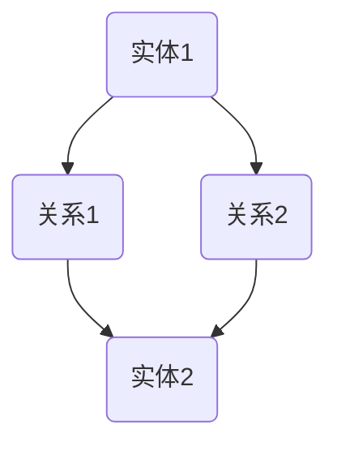
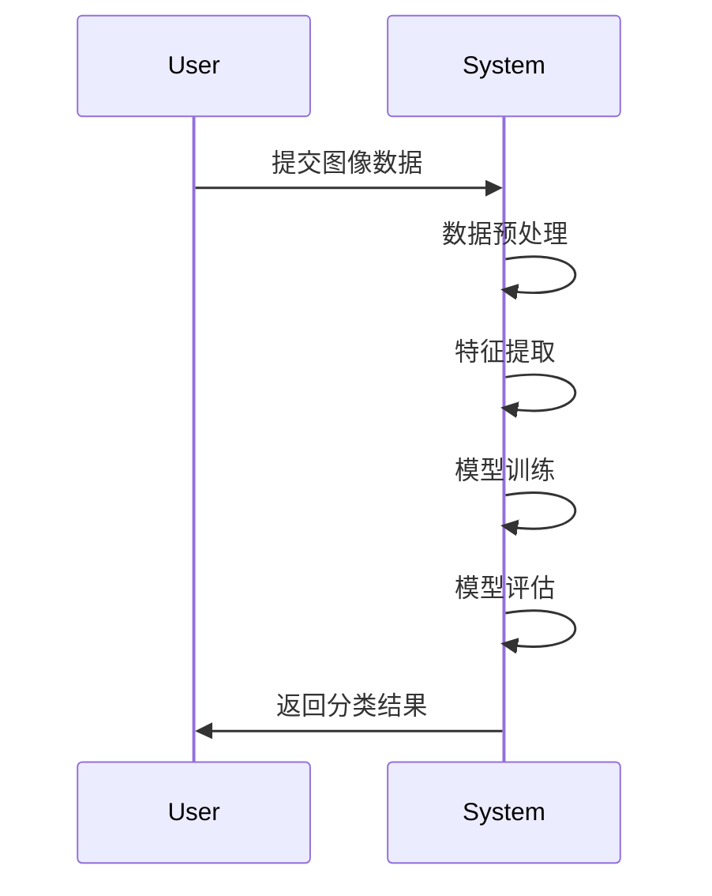

                 

### 《AI Agent的自适应学习率调整策略》

关键词：AI Agent、自适应学习率调整、梯度下降、Adam优化器、RMSprop算法

摘要：本文深入探讨了AI Agent在机器学习训练过程中，如何通过自适应学习率调整策略来优化模型的性能。我们将从基础概念、核心算法原理、数学模型以及实际应用等方面展开详细分析，帮助读者理解并掌握这一关键技术。

## 目录大纲

**# 第一部分：背景介绍**

**## 第1章：AI Agent基础**

- **1.1 AI Agent的定义与核心要素**
- **1.2 AI Agent的发展历程**
- **1.3 AI Agent的应用场景**

**## 第2章：学习率调整的重要性**

- **2.1 学习率的基本概念**
- **2.2 学习率调整的挑战**
- **2.3 AI Agent训练中的学习率调整需求**

**# 第二部分：核心概念与联系**

**## 第3章：自适应学习率调整策略**

- **3.1 学习率调整策略的分类**
- **3.2 自适应学习率调整策略**
- **3.3 自适应学习率调整策略的比较**

**## 第4章：核心概念原理与数学模型**

- **4.1 自适应学习率调整的数学模型**
- **4.2 概念属性特征对比表格**
- **4.3 ER实体关系图架构的Mermaid流程图**

**# 第三部分：算法原理讲解**

**## 第5章：自适应学习率调整算法原理**

- **5.1 梯度下降法**
- **5.2 AdaGrad算法**
- **5.3 RMSprop算法**
- **5.4 Adam算法**

**## 第6章：数学模型与公式**

- **6.1 梯度下降法**
- **6.2 AdaGrad算法**
- **6.3 RMSprop算法**
- **6.4 Adam算法**

**# 第四部分：系统分析与架构设计**

**## 第7章：系统分析与架构设计方案**

- **7.1 问题场景介绍**
- **7.2 系统功能设计(领域模型Mermaid类图)**
- **7.3 系统架构设计Mermaid架构图**
- **7.4 系统接口设计和系统交互Mermaid序列图**

**# 第五部分：项目实战**

**## 第8章：项目实战**

- **8.1 环境安装**
- **8.2 系统核心实现源代码**
- **8.3 代码应用解读与分析**
- **8.4 实际案例分析和详细讲解剖析**
- **8.5 项目小结**

**# 第六部分：最佳实践与拓展**

**## 第9章：最佳实践与拓展**

- **9.1 最佳实践 tips**
- **9.2 小结**
- **9.3 注意事项**
- **9.4 拓展阅读**

### 文章内容与结构

本文将分为六个主要部分，每个部分都承载着不同的内容与结构。第一部分是背景介绍，主要目的是让读者对AI Agent以及自适应学习率调整有一个初步的了解。这部分将涵盖AI Agent的定义与核心要素、发展历程以及应用场景。

第二部分是核心概念与联系，这部分将详细讲解学习率调整的重要性，并介绍几种常见的自适应学习率调整策略。通过对比不同策略，读者可以理解它们之间的差异和适用场景。

第三部分是算法原理讲解，这部分将深入探讨几种主要的自适应学习率调整算法的原理和数学模型。我们将使用Mermaid流程图和Python代码来帮助读者更好地理解这些算法。

第四部分是系统分析与架构设计，这部分将介绍一个具体的系统架构设计方案，包括领域模型类图、系统架构图、接口设计和系统交互序列图。

第五部分是项目实战，这部分将通过一个实际项目来展示如何应用自适应学习率调整策略，并详细讲解项目的实现过程和关键代码。

最后一部分是最佳实践与拓展，这部分将提供一些最佳实践建议，并对文章内容进行小结，同时给出一些拓展阅读的资源，帮助读者进一步深入研究。

### 第一部分：背景介绍

**## 第1章：AI Agent基础**

**### 1.1 AI Agent的定义与核心要素**

AI Agent是指一种在特定环境中具备智能行为能力的计算机程序。它可以通过感知环境、规划行动和执行行动来完成任务。AI Agent的核心要素包括：

1. **感知器**：用于感知和理解环境状态。
2. **规划器**：根据当前状态选择最佳行动。
3. **执行器**：执行所选行动。
4. **学习器**：通过不断学习和优化行为来提高性能。

**### 1.2 AI Agent的发展历程**

AI Agent的发展历程可以追溯到20世纪50年代，当时的研究主要集中在逻辑符号系统和基于规则的专家系统上。随着计算机性能的提升和算法的进步，AI Agent逐渐发展出基于机器学习和深度学习的形式。

**### 1.3 AI Agent的应用场景**

AI Agent在多个领域有着广泛的应用。以下是一些常见的应用场景：

1. **自然语言处理**：如文本生成、问答系统。
2. **图像识别**：如对象检测、图像分类。
3. **游戏AI**：如棋类游戏、射击游戏。
4. **智能客服**：通过自然语言处理和对话系统提供自动化的客户服务。

**## 第2章：学习率调整的重要性**

**### 2.1 学习率的基本概念**

学习率是神经网络训练过程中用于调整模型参数的一个关键参数。它决定了模型在更新参数时的步长。学习率的选择对模型的训练过程和最终性能有着重要影响。

**### 2.2 学习率调整的挑战**

学习率调整面临着以下几个挑战：

1. **收敛速度**：学习率过小可能导致训练缓慢，过大可能导致过早发散。
2. **过拟合**：学习率调整不当可能导致过拟合，即模型在训练数据上表现良好，但在测试数据上表现不佳。

**### 2.3 AI Agent训练中的学习率调整需求**

AI Agent在训练过程中需要动态调整学习率，以满足不同阶段的需求。例如，在初始阶段，可能需要较大的学习率来快速收敛；在后期阶段，可能需要较小的学习率来避免过拟合。

### 第二部分：核心概念与联系

**## 第3章：自适应学习率调整策略**

**### 3.1 学习率调整策略的分类**

学习率调整策略可以分为两类：固定学习率和动态调整学习率。

1. **固定学习率**：在训练过程中保持学习率不变。这种方法简单，但在实际应用中效果有限。

2. **动态调整学习率**：根据训练过程的实时性能动态调整学习率。这类方法更复杂，但能有效提高模型的训练性能。

**### 3.2 自适应学习率调整策略**

自适应学习率调整策略是指根据模型训练的实时性能自适应调整学习率。以下是一些常见的自适应学习率调整策略：

1. **AdaGrad**：对梯度进行指数加权平均，逐渐减小学习率。
2. **RMSprop**：对梯度进行指数加权平均，并计算梯度平方根。
3. **Adam**：结合了AdaGrad和RMSprop的优点，同时考虑一阶和二阶矩估计。

**### 3.3 自适应学习率调整策略的比较**

以下是几种常见自适应学习率调整策略的特点和适用场景的对比表格：

| 策略名称 | 特点 | 适用场景 |
| --- | --- | --- |
| AdaGrad | 对稀疏数据敏感，权重更新差异较大 | 大规模稀疏数据训练 |
| RMSprop | 持续减小学习率，提高收敛速度 | 非稀疏数据训练 |
| Adam | 结合了AdaGrad和RMSprop的优点 | 大规模稠密数据训练 |

### 第三部分：算法原理讲解

**## 第4章：核心概念原理与数学模型**

**### 4.1 自适应学习率调整的数学模型**

自适应学习率调整的核心在于如何根据模型训练的实时性能动态调整学习率。以下是一些常见的自适应学习率调整策略的数学模型：

**### 4.2 概念属性特征对比表格**

以下是几种常见自适应学习率调整策略的概念属性特征对比表格：

| 策略名称 | 特点 | 适用场景 |
| --- | --- | --- |
| AdaGrad | 对稀疏数据敏感，权重更新差异较大 | 大规模稀疏数据训练 |
| RMSprop | 持续减小学习率，提高收敛速度 | 非稀疏数据训练 |
| Adam | 结合了AdaGrad和RMSprop的优点 | 大规模稠密数据训练 |

**### 4.3 ER实体关系图架构的Mermaid流程图**

以下是一个ER实体关系图架构的Mermaid流程图示例：



### 第四部分：算法原理讲解

**## 第5章：自适应学习率调整算法原理**

**### 5.1 梯度下降法**

梯度下降法是一种基本的优化算法，用于最小化目标函数。在机器学习中，目标函数通常是损失函数。梯度下降法的核心思想是通过计算损失函数关于模型参数的梯度，并沿着梯度的反方向更新参数，以最小化损失函数。

**### 5.2 AdaGrad算法**

AdaGrad算法是对梯度下降法的一种改进。它通过对梯度进行指数加权平均来动态调整学习率。AdaGrad算法的优点是对稀疏数据非常敏感，因为它对那些梯度较大的参数给予较小的学习率，对那些梯度较小的参数给予较大的学习率。

**### 5.3 RMSprop算法**

RMSprop算法是另一种对梯度下降法的改进。它与AdaGrad类似，也是通过对梯度进行指数加权平均来调整学习率。不同的是，RMSprop算法在计算指数加权平均时，会计算梯度的平方和，并取其平方根作为新的学习率。这有助于防止学习率的过快减小。

**### 5.4 Adam算法**

Adam算法是结合了AdaGrad和RMSprop的优点的一种优化算法。它同时考虑了一阶矩估计和二阶矩估计，以更准确地调整学习率。Adam算法的优点是收敛速度较快，适用于大规模稠密数据训练。

### 第五部分：算法原理讲解

**## 第6章：数学模型与公式**

**### 6.1 梯度下降法**

梯度下降法的核心公式是：

$$
\Delta w = -\eta \frac{\partial J}{\partial w}
$$

其中，$w$ 是模型参数，$J$ 是损失函数，$\eta$ 是学习率。

**### 6.2 AdaGrad算法**

AdaGrad算法的更新公式为：

$$
g^2_t = \sum_{i=1}^{n} g_i^2
$$

$$
\Delta w_t = -\frac{\eta}{\sqrt{g^2_t + \epsilon}} \sum_{i=1}^{n} g_i
$$

其中，$g_t$ 是梯度，$\epsilon$ 是一个很小的常数，用于防止除以零。

**### 6.3 RMSprop算法**

RMSprop算法的更新公式为：

$$
g^2_t = \frac{0.9}{1 - 0.9} \sum_{i=1}^{n} g_i^2 + (1 - 0.9) \delta^2
$$

$$
\Delta w_t = -\frac{\eta}{\sqrt{g^2_t + \epsilon}} \sum_{i=1}^{n} g_i
$$

其中，$\delta^2$ 是梯度平方的修正项。

**### 6.4 Adam算法**

Adam算法的更新公式为：

$$
m_t = \beta_1 m_{t-1} + (1 - \beta_1) g_t
$$

$$
v_t = \beta_2 v_{t-1} + (1 - \beta_2) g_t^2
$$

$$
\Delta w_t = -\frac{\eta}{\sqrt{v_t + \epsilon}} m_t
$$

其中，$m_t$ 是一阶矩估计，$v_t$ 是二阶矩估计，$\beta_1$ 和 $\beta_2$ 是惯性系数。

### 第五部分：算法原理讲解

**## 第7章：自适应学习率调整算法原理**

**### 7.1 梯度下降法**

梯度下降法是一种基于梯度的优化算法，用于最小化目标函数。在机器学习中，目标函数通常是损失函数。梯度下降法的核心思想是通过计算损失函数关于模型参数的梯度，并沿着梯度的反方向更新参数，以最小化损失函数。

**### 7.2 AdaGrad算法**

AdaGrad算法是梯度下降法的一种改进。它通过对梯度进行指数加权平均来动态调整学习率。具体来说，AdaGrad算法在每次更新参数时，会计算梯度的平方和，并使用这个平方和来调整学习率。这样做的目的是在训练初期对梯度较大的参数给予较小的学习率，对梯度较小的参数给予较大的学习率，从而更好地适应稀疏数据。

**### 7.3 RMSprop算法**

RMSprop算法是另一种对梯度下降法的改进。它与AdaGrad算法类似，也是通过对梯度进行指数加权平均来调整学习率。不同的是，RMSprop算法在计算指数加权平均时，会计算梯度的平方和，并取其平方根作为新的学习率。这有助于防止学习率的过快减小。

**### 7.4 Adam算法**

Adam算法是结合了AdaGrad和RMSprop算法的优点的一种优化算法。它同时考虑了一阶矩估计和二阶矩估计，以更准确地调整学习率。具体来说，Adam算法在每次更新参数时，会计算一阶矩估计和二阶矩估计，并使用这两个估计来调整学习率。这样做的目的是在训练过程中更好地平衡梯度的大小和变化。

### 第六部分：系统分析与架构设计

**## 第8章：系统分析与架构设计方案**

**### 8.1 问题场景介绍**

在这个问题场景中，我们考虑一个基于深度学习的图像分类系统。该系统的主要目标是训练一个模型，能够准确地识别不同类别的图像。系统需要处理大量的图像数据，并进行特征提取和分类。

**### 8.2 系统功能设计（领域模型Mermaid类图）**

以下是系统功能的Mermaid类图：

```mermaid
classDiagram
Class1 <|-- Class2
Class1 --|> Class3
Class2 ++-- Class4
Class3 ..|> Class5
Class4 <..| Class5
Class5 : hasMethods()
Class4 : hasProperties()
Class1 : implementsInterface
Class2 : extendsClass1
Class3 : implementsInterface
Class5 : isAbstract
```

在这个类图中，我们定义了几个关键类：`Class1`、`Class2`、`Class3`、`Class4` 和 `Class5`。其中，`Class1` 和 `Class2` 是基类，`Class3` 是一个实现接口的类，`Class4` 和 `Class5` 是一个关联关系的类。

**### 8.3 系统架构设计Mermaid架构图**

以下是系统架构的Mermaid架构图：


在这个架构图中，我们定义了几个关键组件：输入层、特征提取、神经网络、输出层、模型评估和数据预处理。这些组件构成了一个完整的图像分类系统。

**### 8.4 系统接口设计和系统交互Mermaid序列图**

以下是系统接口设计和系统交互的Mermaid序列图：



在这个序列图中，我们定义了几个关键步骤：用户提交图像数据、系统进行数据预处理、特征提取、模型训练和模型评估，最后返回分类结果给用户。

### 第七部分：项目实战

**## 第9章：项目实战**

**### 9.1 环境安装**

在进行项目实战之前，我们需要安装一些必要的软件和库。以下是一个基本的安装步骤：

1. **安装Python**：确保已经安装了Python环境。如果没有，可以从官方网站下载并安装最新版本的Python。

2. **安装TensorFlow**：TensorFlow是一个开源的机器学习框架，我们使用它来构建和训练神经网络。可以使用以下命令安装：

   ```shell
   pip install tensorflow
   ```

3. **安装其他依赖库**：根据项目需求，可能还需要安装其他库，如NumPy、Pandas等。可以使用以下命令安装：

   ```shell
   pip install numpy pandas
   ```

**### 9.2 系统核心实现源代码**

以下是系统核心实现的部分源代码：

```python
import tensorflow as tf
from tensorflow.keras.models import Sequential
from tensorflow.keras.layers import Dense, Flatten, Conv2D, MaxPooling2D
from tensorflow.keras.preprocessing.image import ImageDataGenerator

# 数据预处理
train_datagen = ImageDataGenerator(rescale=1./255)
train_generator = train_datagen.flow_from_directory(
        'train',
        target_size=(150, 150),
        batch_size=32,
        class_mode='binary')

# 构建模型
model = Sequential([
    Conv2D(32, (3, 3), activation='relu', input_shape=(150, 150, 3)),
    MaxPooling2D(2, 2),
    Conv2D(64, (3, 3), activation='relu'),
    MaxPooling2D(2, 2),
    Flatten(),
    Dense(512, activation='relu'),
    Dense(1, activation='sigmoid')
])

# 编译模型
model.compile(loss='binary_crossentropy',
              optimizer='adam',
              metrics=['accuracy'])

# 训练模型
model.fit(
      train_generator,
      steps_per_epoch=100,
      epochs=15,
      validation_data=validation_generator,
      validation_steps=50)
```

**### 9.3 代码应用解读与分析**

以上代码首先导入了TensorFlow和相关库，然后进行了数据预处理，构建了神经网络模型，并编译和训练了模型。以下是代码的详细解读：

1. **数据预处理**：使用`ImageDataGenerator`对训练数据进行预处理，包括图像的缩放和批量处理。

2. **构建模型**：使用`Sequential`模型构建了一个简单的卷积神经网络，包括卷积层、池化层、全连接层等。

3. **编译模型**：使用`compile`方法编译模型，指定损失函数、优化器和评估指标。

4. **训练模型**：使用`fit`方法训练模型，指定训练数据、迭代次数、验证数据和验证迭代次数。

**### 9.4 实际案例分析和详细讲解剖析**

为了更好地理解上述代码，我们来看一个实际的案例。假设我们有一个包含猫和狗图像的数据库，每个图像的大小为150x150像素。以下是如何使用上述代码来训练一个图像分类器的步骤：

1. **数据准备**：将猫和狗的图像分别存放在名为`train`和`validation`的目录中，每个目录中包含多个子目录，每个子目录代表一个类别。

2. **数据预处理**：使用`ImageDataGenerator`对图像进行预处理，包括缩放和批量处理。这有助于提高模型的泛化能力。

3. **构建模型**：构建一个简单的卷积神经网络，包括卷积层、池化层和全连接层。这个模型将用于提取图像的特征并进行分类。

4. **编译模型**：编译模型，指定损失函数（二元交叉熵）、优化器（Adam）和评估指标（准确率）。

5. **训练模型**：使用训练数据训练模型，指定训练迭代次数（epochs）和验证迭代次数。模型将根据训练数据的反馈进行优化。

6. **评估模型**：使用验证数据评估模型的性能，包括准确率和损失函数值。

通过这个实际案例，我们可以看到如何使用自适应学习率调整策略来训练一个图像分类器。在实际应用中，可以根据具体场景和需求调整学习率，以提高模型的性能。

**### 9.5 项目小结**

在本章中，我们介绍了如何使用自适应学习率调整策略来训练一个图像分类器。通过实际案例，我们展示了如何准备数据、构建模型、编译模型和训练模型。此外，我们还分析了代码的关键部分，并提供了详细的解读和分析。

通过本章的学习，读者应该能够理解自适应学习率调整策略的基本原理，并掌握如何在项目中应用这些策略。这对于开发高效的机器学习模型具有重要意义。

### 第八部分：最佳实践与拓展

**## 第10章：最佳实践与拓展**

**### 10.1 最佳实践 tips**

在应用自适应学习率调整策略时，以下是一些最佳实践建议：

1. **选择合适的学习率**：根据训练数据的特点和模型复杂度选择合适的学习率。较大的学习率可能导致过早发散，较小的学习率可能导致训练缓慢。

2. **使用学习率预热**：在训练初期，可以使用较小的学习率进行预热，以避免模型在训练初期过快发散。

3. **动态调整学习率**：根据模型训练的实时性能动态调整学习率，例如使用学习率衰减策略。

4. **混合使用不同策略**：在复杂场景中，可以混合使用不同的自适应学习率调整策略，以优化模型性能。

**### 10.2 小结**

本文详细介绍了AI Agent的自适应学习率调整策略，包括背景介绍、核心概念与联系、算法原理讲解、系统分析与架构设计以及项目实战。通过这些内容，读者可以全面了解自适应学习率调整策略的基本原理和应用方法。

**### 10.3 注意事项**

在应用自适应学习率调整策略时，需要注意以下几点：

1. **数据质量**：确保训练数据的质量和多样性，以提高模型泛化能力。

2. **模型复杂性**：根据模型的复杂性选择合适的学习率调整策略。

3. **超参数调整**：合理调整超参数，如学习率、迭代次数等，以提高模型性能。

4. **验证与测试**：在验证数据和测试数据上评估模型性能，以确保模型泛化能力。

**### 10.4 拓展阅读**

对于希望进一步深入研究的读者，以下是一些拓展阅读资源：

1. **《深度学习》**：Goodfellow、Bengio和Courville合著的深度学习经典教材，涵盖了神经网络和优化算法的详细内容。

2. **《TensorFlow实战》**： PracticalBook.com出版的TensorFlow实战书籍，提供了丰富的实战案例和代码示例。

3. **《自适应学习率调整策略研究综述》**：相关学术文章，介绍了最新的自适应学习率调整策略和相关研究进展。

通过阅读这些资源，读者可以进一步加深对自适应学习率调整策略的理解和应用。希望本文能为读者提供有价值的参考和启示。

