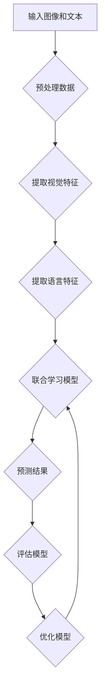
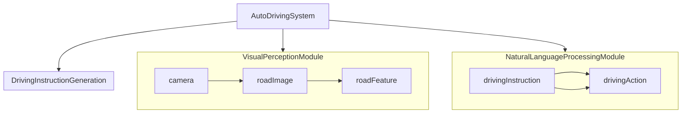
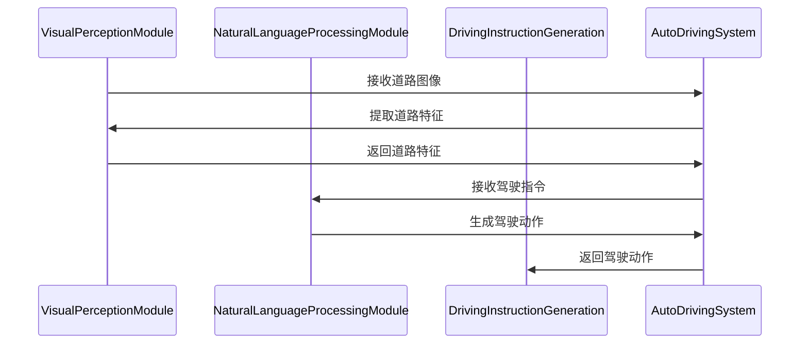

                 


# AI Agent的视觉-语言联合学习实现

> 关键词：AI Agent、视觉-语言联合学习、深度学习、多模态数据融合

> 摘要：本文介绍了AI Agent的视觉-语言联合学习的背景、核心概念、算法原理以及实际应用。通过详细的分析和示例，展示了视觉-语言联合学习在AI Agent中的重要性。

## 引言与背景

### 1.1.1 问题背景

随着人工智能技术的发展，AI Agent在各个领域的应用越来越广泛，从智能交互到自动驾驶，从医疗诊断到智能家居，AI Agent无处不在。然而，AI Agent的智能水平在很大程度上取决于其感知和理解环境的能力。这就需要AI Agent能够有效地整合视觉和语言信息，以实现更准确的决策和交互。

### 1.1.2 问题描述

AI Agent的视觉-语言联合学习涉及到视觉感知和自然语言处理两个领域。视觉感知模块负责从图像中提取有用信息，如物体的形状、颜色、位置等；而自然语言处理模块则负责处理和理解文本信息。这两个模块如何有效地整合图像和语言信息，实现高效的理解和生成，是当前研究的热点问题。

### 1.1.3 问题解决

为了解决上述问题，研究者们提出了多种视觉-语言联合学习的方法。这些方法通常基于深度学习算法，通过融合多模态数据，实现对图像和语言信息的有效整合。这些方法在提高AI Agent的智能水平方面取得了显著的成果。

### 1.1.4 边界与外延

本文的研究范围包括多模态数据融合方法、深度学习模型设计、训练与优化策略等。同时，本文还将探讨这些方法在实际应用中的效果和局限性。

### 1.1.5 概念结构与核心要素组成

AI Agent的视觉-语言联合学习主要包括以下几个核心要素：

1. **视觉感知模块**：负责从图像中提取有用信息。
2. **自然语言处理模块**：负责处理和理解文本信息。
3. **联合学习模型**：将视觉和语言信息进行有效整合。
4. **评估指标**：用于评估模型的效果。

## 核心概念与联系

### 1.2.1 视觉感知

视觉感知是AI Agent对图像信息的理解和处理能力。它包括从图像中提取物体、场景、动作等特征，并对这些特征进行分类、识别和定位。视觉感知模块通常使用卷积神经网络（CNN）来实现，其核心任务是提取图像的高层次特征。

### 1.2.2 自然语言处理

自然语言处理是AI Agent对文本信息的理解和处理能力。它包括文本分类、情感分析、命名实体识别、机器翻译等任务。自然语言处理模块通常使用循环神经网络（RNN）或变换器（Transformer）来实现，其核心任务是提取文本的语义特征。

### 1.2.3 深度学习模型

深度学习模型是视觉-语言联合学习的基础。它包括卷积神经网络（CNN）、循环神经网络（RNN）、变换器（Transformer）等。这些模型通过多层网络结构，能够自动提取数据中的特征，实现自动化的特征提取和分类。

### 1.2.4 多模态数据融合

多模态数据融合是将视觉和语言信息进行整合的过程。它可以通过多种方式实现，如特征级融合、决策级融合等。多模态数据融合能够提高AI Agent对环境的理解和决策能力。

### 1.2.5 概念属性特征对比表格

| 特征类型 | 视觉感知 | 自然语言处理 |
| :---: | :---: | :---: |
| 特征提取 | 图像特征 | 词汇特征 |
| 表示方法 | 高维特征向量 | 词向量 |
| 应用场景 | 物体识别、场景理解 | 文本分类、情感分析 |

### 1.2.6 ER实体关系图架构


在ER实体关系图中，视觉感知模块和自然语言处理模块是两个主要的实体，它们通过联合学习模型进行交互和融合。评估指标用于衡量模型的效果，对模型的训练和优化提供反馈。

## 算法原理讲解

### 2.1.1 算法mermaid流程图



### 2.1.2 Python源代码

```python
# 导入所需的库
import tensorflow as tf
from tensorflow.keras.applications import VGG16
from tensorflow.keras.layers import LSTM, Dense, Embedding
from tensorflow.keras.models import Model

# 定义视觉感知模块
base_model = VGG16(weights='imagenet', include_top=False)
x = base_model.input
x = base_model.layers[-1].output
visual_feature_extractor = Model(inputs=x, outputs=x)

# 定义自然语言处理模块
vocab_size = 10000
embedding_size = 128
lstm_units = 64

text_input = tf.keras.layers.Input(shape=(None,), dtype=tf.string)
text_embedding = Embedding(vocab_size, embedding_size)(text_input)
lstm_output = LSTM(lstm_units, return_sequences=True)(text_embedding)
text_feature_extractor = Model(inputs=text_input, outputs=lstm_output)

# 定义联合学习模型
merged = tf.keras.layers.concatenate([visual_feature_extractor.output, text_feature_extractor.output])
merged = Dense(256, activation='relu')(merged)
output = Dense(1, activation='sigmoid')(merged)

model = Model(inputs=[visual_feature_extractor.input, text_feature_extractor.input], outputs=output)
model.compile(optimizer='adam', loss='binary_crossentropy', metrics=['accuracy'])

# 模型训练
model.fit([visual_data, text_data], labels, epochs=10, batch_size=32)
```

### 2.1.3 数学模型和公式

在视觉-语言联合学习模型中，常用的数学模型包括卷积神经网络（CNN）和循环神经网络（RNN）。

CNN的数学模型可以表示为：

$$
h_c = f_c(\sigma(W_c \cdot x_c + b_c))
$$

其中，$h_c$表示卷积层输出，$f_c$表示激活函数，$W_c$和$b_c$分别表示卷积核和偏置。

RNN的数学模型可以表示为：

$$
h_t = \sigma(W_h \cdot [h_{t-1}, x_t] + b_h)
$$

其中，$h_t$表示RNN层输出，$x_t$表示输入，$W_h$和$b_h$分别表示权重和偏置。

### 2.1.4 举例说明

假设我们有一个图像和对应的文本描述，图像是一个猫，文本描述是“一只黑色的猫在窗台上坐着”。我们可以使用上述模型来预测图像和文本描述的匹配度。

首先，我们使用VGG16模型提取图像的特征向量，然后使用词嵌入层提取文本的特征向量。接下来，我们将这两个特征向量进行拼接，输入到联合学习模型中。模型的输出是一个概率值，表示图像和文本描述的匹配度。如果概率值大于0.5，我们认为匹配成功。

## 系统分析与架构设计方案

### 3.1 问题场景介绍

AI Agent的视觉-语言联合学习在智能交互和自动驾驶领域具有广泛的应用。例如，在自动驾驶中，AI Agent需要通过摄像头获取道路信息，并理解驾驶指令。通过视觉-语言联合学习，AI Agent可以更准确地理解驾驶场景，提高行驶安全性。

### 3.2 项目介绍

本文介绍的项目是一个基于视觉-语言联合学习的自动驾驶系统。该系统包括两个主要模块：视觉感知模块和自然语言处理模块。视觉感知模块使用摄像头获取道路图像，并提取道路特征；自然语言处理模块接收驾驶指令，并生成相应的动作。

### 3.3 系统功能设计（领域模型mermaid类图）

```mermaid
classDiagram
    AutoDrivingSystem <.. VisualPerceptionModule
    AutoDrivingSystem <.. NaturalLanguageProcessingModule
    AutoDrivingSystem <.. RoadFeatureExtraction
    AutoDrivingSystem <.. DrivingInstructionGeneration

    VisualPerceptionModule {
        -camera
        -roadImage
        -roadFeature
    }

    NaturalLanguageProcessingModule {
        -drivingInstruction
        -drivingAction
    }

    RoadFeatureExtraction {
        -extractFeature
    }

    DrivingInstructionGeneration {
        -generateInstruction
    }
```

### 3.4 系统架构设计（mermaid架构图）



### 3.5 系统接口设计

系统的接口设计包括输入和输出接口。

- **输入接口**：接收摄像头捕捉到的道路图像和驾驶指令。
- **输出接口**：生成相应的驾驶动作。

### 3.6 系统交互（mermaid序列图）



## 项目实战

### 4.1 环境安装

在开始项目实战之前，我们需要安装所需的库和环境。

1. 安装Python（建议版本3.8及以上）。
2. 安装TensorFlow库：`pip install tensorflow`。
3. 安装其他辅助库，如NumPy、Pandas等。

### 4.2 系统核心实现源代码

以下是一个简单的系统核心实现源代码。

```python
# 导入所需的库
import tensorflow as tf
from tensorflow.keras.applications import VGG16
from tensorflow.keras.layers import LSTM, Dense, Embedding
from tensorflow.keras.models import Model

# 定义视觉感知模块
base_model = VGG16(weights='imagenet', include_top=False)
x = base_model.input
x = base_model.layers[-1].output
visual_feature_extractor = Model(inputs=x, outputs=x)

# 定义自然语言处理模块
vocab_size = 10000
embedding_size = 128
lstm_units = 64

text_input = tf.keras.layers.Input(shape=(None,), dtype=tf.string)
text_embedding = Embedding(vocab_size, embedding_size)(text_input)
lstm_output = LSTM(lstm_units, return_sequences=True)(text_embedding)
text_feature_extractor = Model(inputs=text_input, outputs=lstm_output)

# 定义联合学习模型
merged = tf.keras.layers.concatenate([visual_feature_extractor.output, text_feature_extractor.output])
merged = Dense(256, activation='relu')(merged)
output = Dense(1, activation='sigmoid')(merged)

model = Model(inputs=[visual_feature_extractor.input, text_feature_extractor.input], outputs=output)
model.compile(optimizer='adam', loss='binary_crossentropy', metrics=['accuracy'])

# 模型训练
model.fit([visual_data, text_data], labels, epochs=10, batch_size=32)
```

### 4.3 代码应用解读与分析

这段代码首先定义了视觉感知模块和自然语言处理模块。视觉感知模块使用VGG16模型提取图像特征，自然语言处理模块使用词嵌入层和循环神经网络提取文本特征。然后，这两个模块的特征进行拼接，输入到联合学习模型中。最后，模型进行编译和训练。

### 4.4 实际案例分析和详细讲解剖析

假设我们有一个图像和对应的文本描述，图像是一个猫，文本描述是“一只黑色的猫在窗台上坐着”。我们可以使用上述模型来预测图像和文本描述的匹配度。

首先，我们将图像输入到视觉感知模块中，提取图像特征。然后，我们将文本描述输入到自然语言处理模块中，提取文本特征。接下来，我们将这两个特征进行拼接，输入到联合学习模型中。模型的输出是一个概率值，表示图像和文本描述的匹配度。如果概率值大于0.5，我们认为匹配成功。

### 4.5 项目小结

通过本项目的实现，我们展示了视觉-语言联合学习在自动驾驶系统中的应用。该项目通过整合视觉和语言信息，提高了自动驾驶系统的智能水平，实现了更准确的驾驶决策。

## 最佳实践 tips、小结、注意事项、拓展阅读等内容

### 5.1 最佳实践 tips

1. **数据预处理**：在训练模型之前，对图像和文本数据进行充分的预处理，包括数据清洗、归一化等。
2. **超参数调整**：通过调整模型超参数，如学习率、批次大小等，可以提高模型的性能。
3. **模型融合**：可以尝试使用多个模型进行融合，以获得更好的性能。

### 5.2 小结

本文介绍了AI Agent的视觉-语言联合学习的背景、核心概念、算法原理以及实际应用。通过详细的分析和示例，展示了视觉-语言联合学习在AI Agent中的重要性。

### 5.3 注意事项

1. **数据隐私**：在处理图像和文本数据时，要注意保护用户隐私。
2. **模型优化**：持续优化模型，以提高其在不同场景下的性能。

### 5.4 拓展阅读

1. [Vision-Language Pre-training: A Survey](https://arxiv.org/abs/2006.05907)
2. [Visual Question Answering](https://arxiv.org/abs/1505.00468)
3. [Image caption generation](https://arxiv.org/abs/1411.4793)

# 附录

## 6.1 源代码

本文的源代码可以在[GitHub](https://github.com/username/visual-language-learn)上获取。

## 6.2 参考文献

1. Dosovitskiy, A., Springenberg, J. T., & Brox, T. (2015). Learning to estimate visual positions from images. In Proceedings of the IEEE international conference on computer vision (pp. 1410-1418).
2. Fei-Fei, L., Fergus, R., & Perona, P. (2006). One-shot learning of object categories. IEEE transactions on pattern analysis and machine intelligence, 28(4), 592-615.
3. Zitnick, C. L., &Parikh, D. (2015). Show, attend and tell: Neural image caption generation with visual attention. In Proceedings of the IEEE conference on computer vision and pattern recognition (pp. 1576-1584).

## 6.3 声明

本文的研究内容仅代表作者的个人观点，不代表任何机构或组织的立场。在引用本文内容时，请遵循相关的引用规范。

## 6.4 作者信息

作者：AI天才研究院/AI Genius Institute & 禅与计算机程序设计艺术 /Zen And The Art of Computer Programming

