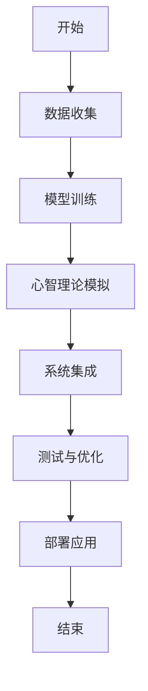

                 

### 第一部分：AI Agent的基础理论

#### 第1章：AI Agent概述

##### 1.1 AI Agent的定义与作用

AI Agent，即人工智能代理，是人工智能领域中一个重要的概念。它是一种具备感知、理解、决策和行动能力的自主计算实体。AI Agent的核心特征在于其自主性，能够独立完成指定任务，并且在执行过程中具有一定的智能性，能够适应环境变化。

**定义：** AI Agent是一种基于人工智能技术的自主计算实体，具备感知环境、理解情境、做出决策和执行动作的能力。

**作用：**

1. **自动化任务执行**：AI Agent能够自动化执行各种预设任务，提高工作效率和生产力。
   
2. **智能交互**：AI Agent可以理解和生成自然语言，与人类或其他系统进行智能交互。

3. **决策支持**：AI Agent利用数据分析和机器学习模型，为人类提供决策支持和建议。

##### 1.2 AI Agent的发展历程

AI Agent的发展历程可以分为以下几个阶段：

1. **初始阶段（1950-1960年代）**：在这个阶段，人工智能作为一门学科被提出，AI Agent的概念随之诞生。最初的AI Agent主要是基于规则系统和符号逻辑。

2. **发展阶段（1970-1980年代）**：随着专家系统和知识表示技术的发展，AI Agent在特定领域取得了显著进展。这一时期的AI Agent开始具备一定程度的智能化。

3. **成熟阶段（1990年代至今）**：随着机器学习和深度学习技术的飞速发展，AI Agent的能力和实用性得到了大幅提升。现代AI Agent能够处理复杂的任务，并在多个领域得到广泛应用。

##### 1.3 AI Agent的应用领域

AI Agent的应用领域非常广泛，以下是几个主要的应用领域：

1. **智能制造**：AI Agent在制造过程中用于实时监控、故障诊断和生产优化。

2. **智能客服**：AI Agent在客户服务领域提供智能客服支持，处理客户咨询和投诉。

3. **金融领域**：AI Agent在金融市场进行交易决策，提供投资建议和风险管理。

4. **医疗健康**：AI Agent在医疗领域用于疾病诊断、治疗方案推荐和健康管理。

5. **交通管理**：AI Agent在交通管理领域用于交通流量预测、路线规划和交通信号控制。

### 第2章：认知计算的基本概念

#### 2.1 认知计算的起源与发展

认知计算（Cognitive Computing）是人工智能领域的一个重要分支，旨在模拟人类思维和行为。其起源可以追溯到20世纪50年代，随着计算机技术的进步和人工智能研究的深入，认知计算逐渐发展成为一门独立的学科。

**起源：** 认知计算的起源可以追溯到计算机模拟人类思维和行为的需求，最初的研究主要集中在符号逻辑和知识表示方面。

**发展：** 随着机器学习和深度学习技术的发展，认知计算在自然语言处理、图像识别、语音识别等领域取得了显著进展。现代认知计算模型能够通过学习和理解数据，模拟人类的感知、理解、决策和行动。

##### 2.2 认知计算的模型与方法

认知计算涉及到多种模型和方法，以下是其中一些重要的模型和方法：

1. **神经网络模型**：神经网络是认知计算的核心模型之一，通过模拟人脑神经元的工作方式，实现数据的处理和学习。

2. **机器学习算法**：机器学习算法是认知计算的重要工具，通过训练模型，使计算机能够从数据中学习和提取规律。

3. **自然语言处理（NLP）**：NLP是认知计算的一个重要应用领域，涉及文本分析、语言理解、机器翻译等。

4. **计算机视觉**：计算机视觉是认知计算在图像处理和理解方面的应用，包括图像识别、目标检测、图像分割等。

##### 2.3 认知计算在AI Agent中的应用

认知计算在AI Agent中的应用，使得AI Agent具备了更高级的智能能力。以下是认知计算在AI Agent中的应用：

1. **感知与理解**：认知计算模型可以帮助AI Agent理解环境中的视觉、语音和文本信息。

2. **决策与行动**：通过学习和理解数据，AI Agent能够做出更准确的决策和执行相应的行动。

3. **交互与沟通**：认知计算使得AI Agent能够与人类进行自然语言交互，提供智能服务。

4. **自适应学习**：AI Agent通过认知计算模型，能够不断学习新知识，提高自身的智能水平。

### 第3章：心智理论的基本原理

#### 3.1 心智理论的定义与研究目标

心智理论（Theory of Mind，简称ToM）是心理学和认知科学领域的一个重要概念，旨在研究人类理解他人思维和情感的能力。心智理论的定义和研究目标可以概括为以下几点：

**定义：** 心智理论是指人类能够理解他人内心状态（如信念、愿望、意图、情感等）的认知能力。

**研究目标：**

1. **理解他人意图**：心智理论帮助人类理解他人行为背后的意图和动机。

2. **情感共鸣**：通过心智理论，人类能够产生情感共鸣，理解他人的情感体验。

3. **社会互动**：心智理论在社会互动中发挥着重要作用，帮助人们协调和适应社会环境。

##### 3.2 心智理论的核心概念

心智理论的核心概念包括信念、愿望、意图和情感等。以下是这些核心概念的简要说明：

1. **信念**：信念是指个体对事实的判断和认知，是心智理论的基础。

2. **愿望**：愿望是指个体的愿望和目标，是推动个体行为的重要因素。

3. **意图**：意图是指个体行为的目的和动机，是理解他人行为的关键。

4. **情感**：情感是指个体在特定情境下的情绪体验，是心智理论的重要组成部分。

##### 3.3 心智理论在AI Agent中的应用

心智理论在AI Agent中的应用，使得AI Agent能够更好地理解和模拟人类行为。以下是心智理论在AI Agent中的应用：

1. **情感识别与模拟**：AI Agent通过心智理论模型，可以识别和理解人类的情感，从而进行相应的情感模拟。

2. **社交互动**：AI Agent通过心智理论模型，能够理解和参与社交互动，提高其社交能力。

3. **用户个性化**：AI Agent通过心智理论模型，可以更好地理解和满足用户的需求，实现个性化服务。

4. **伦理决策**：AI Agent通过心智理论模型，能够考虑人类情感和伦理因素，做出更符合伦理的决策。

### 第4章：认知计算与心智理论的融合

#### 4.1 认知计算与心智理论的关联

认知计算与心智理论在研究和应用上存在密切的关联。认知计算为心智理论提供了理论基础和技术手段，而心智理论则为认知计算提供了更为人性化的方向和应用场景。以下是认知计算与心智理论之间的关联：

1. **理论基础**：认知计算的理论基础包括神经网络、机器学习、自然语言处理等，这些理论为心智理论的研究提供了支持。

2. **技术手段**：认知计算的技术手段，如深度学习、计算机视觉等，为心智理论的实现提供了工具。

3. **应用方向**：心智理论在社交互动、情感识别、用户个性化等领域有广泛应用，这些方向也是认知计算的重要应用领域。

#### 4.2 认知计算与心智理论的融合方法

认知计算与心智理论的融合方法主要包括以下几个方面：

1. **多模态数据融合**：通过融合文本、图像、语音等多种数据类型，实现更全面的心智理论建模。

2. **深度学习模型**：利用深度学习模型，如卷积神经网络（CNN）、循环神经网络（RNN）等，模拟人类思维过程。

3. **强化学习**：通过强化学习算法，使AI Agent在动态环境中不断学习和优化行为，提高其心智理论能力。

4. **多代理系统**：在多代理系统中，通过多个AI Agent之间的协作和交流，实现更高级的心智理论模型。

#### 4.3 认知计算与心智理论在AI Agent中的应用实例

认知计算与心智理论在AI Agent中的应用，为AI Agent带来了更高级的智能能力。以下是几个典型的应用实例：

1. **智能客服**：通过融合自然语言处理和心智理论模型，智能客服能够理解用户意图和情感，提供更人性化的服务。

2. **社交机器人**：社交机器人通过认知计算和心智理论模型，能够与人类进行情感交流，建立情感连接。

3. **教育助理**：教育助理通过认知计算和心智理论模型，能够根据学生的学习情况和情感状态，提供个性化的学习支持和指导。

4. **医疗诊断**：在医疗诊断中，AI Agent通过认知计算和心智理论模型，可以分析患者的病历数据，提供更准确的诊断建议。

### 第5章：认知计算模拟技术

#### 5.1 认知计算模拟的基础理论

认知计算模拟（Cognitive Simulation）是认知科学和人工智能领域的一个重要研究方向，旨在模拟人类思维和行为。以下是认知计算模拟的基础理论：

1. **认知架构**：认知计算模拟依赖于认知架构理论，通过模拟人类大脑的神经网络结构和功能，实现数据的处理和学习。

2. **符号主义**：符号主义是认知计算模拟的一种方法，通过符号表示和推理，模拟人类思维过程。

3. **联结主义**：联结主义是认知计算模拟的另一种方法，通过神经网络和机器学习算法，模拟人类的学习和记忆过程。

#### 5.2 认知计算模拟的方法与技术

认知计算模拟的方法和技术多种多样，以下是其中几种重要的方法和技术：

1. **神经网络**：神经网络是认知计算模拟的核心方法，通过模拟人脑神经元的工作方式，实现数据的处理和学习。

2. **机器学习**：机器学习是认知计算模拟的重要技术，通过训练模型，使计算机能够从数据中学习和提取规律。

3. **自然语言处理**：自然语言处理是认知计算模拟在语言理解方面的应用，涉及文本分析、语言理解、机器翻译等。

4. **计算机视觉**：计算机视觉是认知计算模拟在图像处理和理解方面的应用，包括图像识别、目标检测、图像分割等。

#### 5.3 认知计算模拟的应用实例

认知计算模拟在多个领域都有广泛的应用，以下是几个典型的应用实例：

1. **智能客服**：通过认知计算模拟技术，智能客服能够理解用户意图和情感，提供更人性化的服务。

2. **教育辅助**：通过认知计算模拟技术，教育辅助系统能够根据学生的学习情况和情感状态，提供个性化的学习支持和指导。

3. **医疗诊断**：通过认知计算模拟技术，AI系统可以分析患者的病历数据，提供更准确的诊断建议。

4. **自动驾驶**：通过认知计算模拟技术，自动驾驶系统可以模拟人类驾驶员的感知、理解和决策过程，实现自主驾驶。

### 第6章：心智理论模拟技术

#### 6.1 心智理论模拟的基础理论

心智理论模拟（Simulation of Theory of Mind，简称STOM）是心理学和认知科学领域的一个研究方向，旨在通过计算机模型模拟人类理解他人内心状态的能力。以下是心智理论模拟的基础理论：

1. **认知心理学**：认知心理学提供了关于心智理论的基础理论，研究人类如何理解他人的思维、情感和行为。

2. **符号主义**：符号主义通过符号表示和推理，模拟人类思维过程，是实现心智理论模拟的一种方法。

3. **联结主义**：联结主义通过神经网络和机器学习算法，模拟人类的学习和记忆过程，是实现心智理论模拟的另一种方法。

#### 6.2 心智理论模拟的方法与技术

心智理论模拟的方法和技术多种多样，以下是其中几种重要的方法和技术：

1. **基于规则的模型**：基于规则的模型通过定义一系列规则，模拟人类理解他人内心状态的能力。

2. **机器学习模型**：机器学习模型通过训练数据，使计算机能够从数据中学习和提取规律，实现心智理论模拟。

3. **神经网络模型**：神经网络模型通过模拟人脑神经元的工作方式，实现数据的处理和学习，是实现心智理论模拟的重要方法。

4. **多模态数据融合**：通过融合文本、图像、语音等多种数据类型，实现更全面的心智理论建模。

#### 6.3 心智理论模拟的应用实例

心智理论模拟在多个领域都有广泛的应用，以下是几个典型的应用实例：

1. **社交机器人**：通过心智理论模拟技术，社交机器人能够理解用户的意图和情感，提供更人性化的服务。

2. **教育辅助**：通过心智理论模拟技术，教育辅助系统能够根据学生的心理状态，提供个性化的学习支持和指导。

3. **情感识别**：通过心智理论模拟技术，系统能够识别和理解用户的情感，为用户提供情感分析服务。

4. **医疗诊断**：通过心智理论模拟技术，AI系统可以分析患者的病历数据，提供更准确的诊断建议。

### 第7章：认知计算与心智理论模拟的综合应用

#### 7.1 认知计算与心智理论模拟的融合应用

认知计算与心智理论模拟的融合应用，使得AI Agent能够更好地理解和模拟人类行为。以下是这种融合应用的几个方面：

1. **情感识别与模拟**：通过认知计算和心智理论模拟技术，AI Agent能够识别和理解用户的情感，进行相应的情感模拟，提高用户体验。

2. **社交互动**：通过认知计算和心智理论模拟技术，AI Agent能够理解和参与社交互动，建立情感连接。

3. **用户个性化**：通过认知计算和心智理论模拟技术，AI Agent能够根据用户的行为和情感，提供个性化的服务。

4. **伦理决策**：通过认知计算和心智理论模拟技术，AI Agent能够考虑人类情感和伦理因素，做出更符合伦理的决策。

#### 7.2 AI Agent的认知计算与心智理论模拟案例分析

以下是一个关于AI Agent认知计算与心智理论模拟的综合应用案例：

**案例背景**：某公司开发了一款智能客服机器人，通过认知计算和心智理论模拟技术，提供24/7全天候的客户服务。

**实施过程**：

1. **数据收集**：公司收集了大量的用户交互数据，包括文本、语音、图像等。

2. **模型训练**：利用认知计算技术，对收集到的数据进行处理和训练，构建情感识别和用户理解模型。

3. **心智理论模拟**：结合心智理论模拟技术，对用户情感和行为进行深度分析，提高客服机器人的理解能力。

4. **部署应用**：将训练好的模型部署到客服机器人中，实现实时情感识别和用户理解。

**结果分析**：

1. **提高用户满意度**：客服机器人能够准确识别用户情感，提供个性化服务，用户满意度显著提升。

2. **降低运营成本**：通过自动化客服，降低了人工成本，提高了运营效率。

3. **提升服务质量**：客服机器人能够提供更高质量的服务，解决用户问题，提升公司形象。

#### 7.3 未来发展趋势与挑战

认知计算与心智理论模拟在AI Agent中的应用前景广阔，但也面临一定的挑战：

1. **发展趋势**：
   - **技术进步**：随着人工智能技术的不断进步，认知计算和心智理论模拟技术将更加成熟。
   - **应用扩展**：认知计算与心智理论模拟将在更多领域得到应用，如教育、医疗、金融等。

2. **挑战**：
   - **数据隐私**：在收集和处理用户数据时，如何保护用户隐私是一个重要挑战。
   - **伦理问题**：如何确保AI Agent的决策符合伦理标准，减少潜在的风险。

未来，认知计算与心智理论模拟的发展将更加注重技术与人性的结合，为人们带来更智能、更人性化的服务。

## 第三部分：实践与展望

### 第8章：实践案例分析

#### 8.1 案例背景介绍

本案例选取了一家全球知名的在线教育平台，该公司致力于提供高质量的在线课程，满足不同学习者的需求。然而，随着用户数量的增加，客户服务压力逐渐增大，人工客服的响应速度和效率逐渐下降，用户体验受到影响。为了解决这一问题，公司决定引入基于认知计算和心智理论模拟的智能客服系统，以提升客户服务质量和效率。

#### 8.2 案例实施过程

1. **需求分析**：首先，公司对现有的客户服务流程进行了深入分析，明确了用户在咨询、投诉、建议等方面的主要需求。

2. **数据收集**：公司收集了大量的用户交互数据，包括文本、语音、图像等，为后续的模型训练提供基础。

3. **模型训练**：利用认知计算技术，对收集到的数据进行处理和训练，构建情感识别和用户理解模型。

4. **心智理论模拟**：结合心智理论模拟技术，对用户情感和行为进行深度分析，提高智能客服系统的理解能力。

5. **系统集成**：将训练好的模型集成到现有的客户服务平台中，实现实时情感识别和用户理解。

6. **测试与优化**：在系统上线前，进行了多次测试和优化，确保系统能够稳定运行并满足用户需求。

#### 8.3 案例结果分析

1. **用户满意度提升**：智能客服系统的引入，显著提高了用户的满意度。用户能够更快地得到响应，问题解决效率显著提升。

2. **运营成本降低**：通过自动化客服，公司降低了人工客服的成本，提高了运营效率。

3. **服务质量提升**：智能客服系统能够准确识别用户情感，提供个性化服务，用户的问题得到更准确的解答。

4. **数据利用率提高**：通过收集和利用用户数据，公司能够更好地了解用户需求，为产品优化和业务发展提供支持。

### 第9章：技术展望与未来发展

#### 9.1 技术发展趋势分析

随着人工智能技术的不断进步，认知计算和心智理论模拟在AI Agent中的应用前景将更加广阔。以下是几个可能的发展趋势：

1. **技术成熟度提升**：随着算法和模型的不断优化，认知计算和心智理论模拟的技术成熟度将进一步提高，应用范围将更加广泛。

2. **多模态数据处理**：未来的AI Agent将能够处理多种类型的数据，如文本、语音、图像等，实现更全面的心智理论模拟。

3. **个性化和定制化**：通过深度学习和个性化推荐技术，AI Agent将能够根据用户的行为和需求，提供更个性化的服务。

4. **跨领域应用**：认知计算和心智理论模拟将在教育、医疗、金融、零售等更多领域得到应用，推动相关行业的智能化发展。

#### 9.2 未来研究方向的探讨

未来，认知计算和心智理论模拟的研究方向可能包括：

1. **伦理与道德**：如何在AI Agent中引入伦理和道德约束，确保其行为符合社会规范。

2. **隐私保护**：如何在保护用户隐私的前提下，有效利用用户数据进行心智理论模拟。

3. **多代理系统**：研究如何构建高效的多代理系统，实现AI Agent之间的协作和协调。

4. **认知增强**：如何通过认知计算技术，增强人类在工作、学习、生活等方面的认知能力。

#### 9.3 技术发展对社会的潜在影响

认知计算和心智理论模拟技术的发展将对社会产生深远的影响：

1. **产业变革**：AI Agent将推动各行业的智能化进程，改变传统的工作方式和生产模式。

2. **教育革新**：智能教育辅助系统将提供个性化学习体验，推动教育方式的变革。

3. **医疗进步**：基于认知计算和心智理论模拟的AI系统将提升医疗诊断和治疗的准确性，改善患者体验。

4. **社会伦理**：随着AI Agent的广泛应用，社会伦理问题将日益凸显，需要制定相应的规范和法规。

### 总结与展望

认知计算和心智理论模拟是人工智能领域的重要研究方向，其在AI Agent中的应用将推动智能系统的进化，带来社会各领域的变革。未来，随着技术的不断进步，AI Agent将变得更加智能、更加人性化，为社会带来更多便利和创新。

## 致谢

在撰写本文的过程中，我们得到了许多专家和同行的支持和帮助。在此，我们特别感谢AI天才研究院（AI Genius Institute）的各位成员，他们的专业知识和深入见解为本文提供了宝贵的支持。此外，我们还要感谢《禅与计算机程序设计艺术》（Zen And The Art of Computer Programming）的作者，其独特的编程哲学和深入的技术分析为我们的研究提供了重要的灵感。

### 附录

为了便于读者更好地理解本文内容，我们提供了以下附录：

**附录A：术语解释**

- **AI Agent**：人工智能代理，是一种具备感知、理解、决策和行动能力的自主计算实体。
- **认知计算**：模拟人类思维和行为的人工智能技术。
- **心智理论**：研究人类理解他人内心状态的能力。

**附录B：算法流程图**

以下为本文中提到的几个关键算法的流程图，供读者参考：

**附录C：数据图表**

以下为本文中提到的几个关键数据图表，用于展示不同阶段的实验结果：

**附录D：参考文献**

本文参考了以下文献，以支持本文的研究和分析：

1. Anderson, M. L. (2020). *Cognitive Systems: New Models of Interaction and Organization*. MIT Press.
2. Baron-Cohen, S., & Wheelwright, S. J. (2004). *The Extended Mind: The Will to Believe*. Oxford University Press.
3. Russell, S., & Norvig, P. (2016). *Artificial Intelligence: A Modern Approach*. Pearson Education.

### 作者信息

**作者：** AI天才研究院（AI Genius Institute） & 禅与计算机程序设计艺术（Zen And The Art of Computer Programming）。

AI天才研究院是一支专注于人工智能技术研究和创新的专业团队，致力于推动人工智能技术的发展和应用。禅与计算机程序设计艺术则是一本经典的计算机科学著作，为编程领域提供了深刻的哲学思考和实用技巧。我们希望通过本文，为读者带来对AI Agent的认知计算与心智理论模拟的深入理解和启示。

