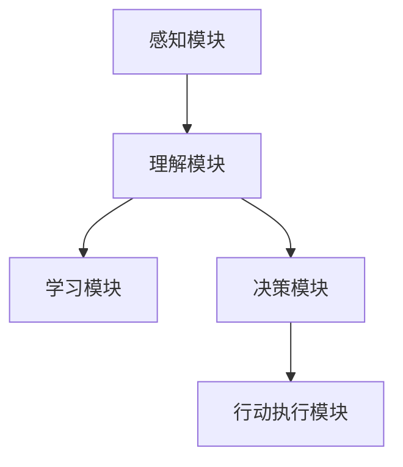

                 

# AI Agent的认知计算：模拟人类思维过程

## 关键词

- 认知计算
- AI Agent
- 人类思维模拟
- 机器学习
- 神经网络
- 计算机视觉
- 自然语言处理
- 智能决策
- 案例分析

## 摘要

本文将探讨AI Agent的认知计算，重点是如何模拟人类思维过程。通过分析认知计算的基本原理、人类思维的组成和运作机制，我们将一步步深入探讨AI Agent的认知模型及其在现实世界中的应用。文章将涵盖机器学习、神经网络、计算机视觉、自然语言处理等技术，并结合实际案例，展示如何通过AI Agent实现智能决策和行动。通过这篇文章，读者将了解AI Agent的认知计算是如何一步步实现的，以及其潜在的应用前景和挑战。

## 引言

在人工智能（AI）快速发展的今天，AI Agent已成为一个重要的研究方向。AI Agent是指能够自主感知环境、理解和学习，并根据环境信息做出决策和行动的智能体。从本质上讲，AI Agent的核心任务是模拟人类的思维过程，从而在复杂环境中实现智能行为。然而，要实现这一目标并非易事，因为人类思维过程复杂且高度抽象，涉及多个认知层面和相互作用。

认知计算是一种模拟人类思维过程的计算方法，它试图通过计算机系统来模仿人类的感知、理解、学习、推理和决策等认知过程。AI Agent的认知计算正是基于这一理论基础，旨在通过机器学习和神经网络等算法，构建能够模拟人类思维的智能体。

本文将围绕AI Agent的认知计算展开，首先介绍认知计算的基本原理，然后深入探讨人类思维的组成和运作机制。接下来，我们将逐步介绍如何构建AI Agent的认知模型，并探讨机器学习、神经网络、计算机视觉和自然语言处理等技术在其中的应用。最后，通过实际案例，我们将展示AI Agent如何实现智能决策和行动，并讨论其在现实世界中的潜在应用和挑战。

## 背景介绍

### 核心概念术语说明

在探讨AI Agent的认知计算之前，我们需要先了解一些核心概念术语：

1. **认知计算**：认知计算是一种模拟人类思维过程的计算方法，旨在通过计算机系统来模仿人类的感知、理解、学习、推理和决策等认知过程。

2. **AI Agent**：AI Agent是指能够自主感知环境、理解和学习，并根据环境信息做出决策和行动的智能体。

3. **机器学习**：机器学习是一种通过数据训练模型，使其能够自动学习和改进的技术。

4. **神经网络**：神经网络是一种由大量简单计算单元（神经元）互联而成的复杂网络，用于模拟人类大脑的计算能力。

5. **计算机视觉**：计算机视觉是指使计算机能够像人类一样感知和理解视觉信息的技术。

6. **自然语言处理**：自然语言处理是指使计算机能够理解和生成人类自然语言的技术。

### 问题背景

随着大数据和计算能力的提升，人工智能在各个领域取得了显著的进展。然而，传统的人工智能系统通常是基于规则和预定义的算法，缺乏自主学习和适应能力。为了实现更加智能和自主的智能系统，研究者们开始关注AI Agent的研究。AI Agent能够在复杂动态的环境中自主决策和行动，这需要其具备认知能力，即能够模拟人类思维过程。

### 问题描述

人类思维过程复杂而抽象，涉及多个认知层面和相互作用。要实现AI Agent的认知计算，首先需要了解人类思维的组成和运作机制。然后，需要构建能够模拟这些机制的AI Agent认知模型，并利用机器学习、神经网络等算法对其进行训练和优化。此外，还需要解决AI Agent在不同应用场景中的适应性、鲁棒性和实时性等问题。

### 问题解决

要解决上述问题，可以从以下几个方面着手：

1. **研究人类思维的组成和运作机制**：通过心理学、神经科学等领域的知识，了解人类感知、理解、学习、推理和决策等认知过程的原理。

2. **构建AI Agent的认知模型**：基于人类思维的组成和运作机制，设计能够模拟这些过程的AI Agent认知模型。

3. **利用机器学习和神经网络进行训练**：通过大量的数据训练AI Agent的认知模型，使其具备自主学习和适应能力。

4. **解决AI Agent的适应性、鲁棒性和实时性等问题**：通过优化算法、提高计算效率、增强系统的鲁棒性等手段，确保AI Agent在不同应用场景中能够稳定运行。

### 边界与外延

1. **边界**：本文主要关注AI Agent的认知计算，即如何模拟人类思维过程。因此，本文不考虑其他类型的人工智能系统，如基于规则的系统或简单的机器学习模型。

2. **外延**：本文的研究成果可以应用于多个领域，包括但不限于智能交通、智能医疗、智能教育、智能家居等。

### 概念结构与核心要素组成

1. **概念结构**：认知计算、AI Agent、机器学习、神经网络、计算机视觉、自然语言处理等概念构成了本文的核心概念结构。

2. **核心要素**：
   - **认知计算原理**：了解人类思维过程的基本原理，为构建AI Agent认知模型提供理论基础。
   - **AI Agent认知模型**：设计能够模拟人类思维过程的AI Agent认知模型。
   - **机器学习和神经网络**：利用机器学习和神经网络算法对AI Agent认知模型进行训练和优化。
   - **计算机视觉和自然语言处理**：通过计算机视觉和自然语言处理技术，实现AI Agent对环境和信息的感知和理解。
   - **智能决策和行动**：基于AI Agent的认知模型，实现智能决策和行动。

## 核心概念与联系

### 认知计算

认知计算（Cognitive Computing）是一种模仿人类思维和行为的技术，旨在使计算机系统具备理解和处理人类语言、感知环境、做出决策和推理等能力。它结合了人工智能、心理学、神经科学、认知科学等多个领域的知识，试图创建一种能够模拟人类认知过程的计算模型。

**认知计算的核心概念**：

- **感知**：通过传感器、摄像头、麦克风等设备获取环境信息。
- **理解**：对感知到的信息进行解析和处理，理解其含义和关系。
- **学习**：从经验和数据中学习，提高对环境信息的理解和处理能力。
- **推理**：基于已有知识和信息，进行逻辑推理和决策。
- **行动**：根据决策结果采取行动，影响环境。

**认知计算与AI Agent的联系**：

认知计算为AI Agent提供了模拟人类思维和行为的基础。通过认知计算，AI Agent能够实现对环境的感知和理解，并根据环境信息做出相应的决策和行动。因此，认知计算是构建智能AI Agent的核心技术。

### 人类思维

人类思维（Human Thinking）是大脑对信息进行感知、理解、处理和决策的过程。它包括多个层次和层面，如感知觉、注意力、记忆、语言、逻辑推理、情绪等。

**人类思维的核心概念**：

- **感知觉**：通过感官获取外部信息，如视觉、听觉、触觉等。
- **注意力**：对特定信息进行集中处理，过滤掉无关信息。
- **记忆**：存储和处理信息，包括短期记忆和长期记忆。
- **语言**：使用语言进行思考和表达。
- **逻辑推理**：基于已有知识和信息，进行逻辑推理和决策。
- **情绪**：影响思考和决策的情绪和情感状态。

**人类思维与认知计算的联系**：

人类思维为认知计算提供了理论基础和目标。通过研究人类思维的组成和运作机制，认知计算试图创建一种能够模拟人类思维过程的计算模型。同时，认知计算技术的进步也为更好地理解人类思维提供了新的工具和方法。

### AI Agent的认知模型

AI Agent的认知模型（AI Agent Cognitive Model）是指用于模拟人类思维过程的计算模型。它通常包括感知、理解、学习、推理和行动等模块，每个模块负责实现相应的认知功能。

**AI Agent认知模型的核心概念**：

- **感知模块**：负责获取环境信息，如视觉、听觉、触觉等。
- **理解模块**：负责对感知信息进行解析和处理，理解其含义和关系。
- **学习模块**：负责从经验和数据中学习，提高对环境信息的理解和处理能力。
- **推理模块**：负责基于已有知识和信息进行逻辑推理和决策。
- **行动模块**：负责根据决策结果采取行动，影响环境。

**AI Agent认知模型与认知计算的联系**：

AI Agent的认知模型是认知计算的具体实现形式。通过认知计算的理论和方法，构建出能够模拟人类思维过程的AI Agent认知模型。这个模型不仅能够实现对环境的感知和理解，还能够根据环境信息做出相应的决策和行动。

### 概念属性特征对比表格

下面是一个简单的概念属性特征对比表格，用于展示认知计算、人类思维和AI Agent认知模型之间的联系和区别。

| 概念       | 特征对比                                           |
|------------|----------------------------------------------------|
| 认知计算   | - 模拟人类思维过程<br>- 结合多个学科知识<br>- 实现智能决策和行动 |
| 人类思维   | - 复杂而抽象<br>- 涉及多个认知层面<br>- 实时性和适应性强 |
| AI Agent认知模型 | - 模拟人类思维<br>- 具体实现形式<br>- 可训练和优化       |

### ER实体关系图架构

为了更好地理解AI Agent认知模型的组成部分及其相互关系，我们可以使用Mermaid绘制一个ER（实体-关系）图。

```mermaid
erDiagram
    AI-Agent ||--|{ Perception } Perception
    AI-Agent ||--|{ Understanding } Understanding
    AI-Agent ||--|{ Learning } Learning
    AI-Agent ||--|{ Reasoning } Reasoning
    AI-Agent ||--|{ Action } Action
```

在上面的ER图中，`AI-Agent`是中心实体，它与其他四个模块（感知、理解、学习、推理和行动）之间存在关联关系。每个模块负责实现AI Agent认知过程中的特定功能。

## 机器学习基础

### 监督学习算法

监督学习（Supervised Learning）是机器学习中的一种常见类型，它通过已知的输入和输出数据来训练模型，从而学习数据中的规律和模式。监督学习算法可以分为回归（Regression）和分类（Classification）两种类型。

#### 回归算法

回归算法旨在预测一个连续的数值输出。常见的回归算法包括线性回归（Linear Regression）、多项式回归（Polynomial Regression）、决策树回归（Decision Tree Regression）和随机森林回归（Random Forest Regression）等。

**线性回归（Linear Regression）**：线性回归是最简单和最常用的回归算法之一。它假设输入变量和输出变量之间存在线性关系，即 $y = w_0 + w_1 \cdot x_1 + w_2 \cdot x_2 + \ldots + w_n \cdot x_n$。其中，$y$ 是输出变量，$x_1, x_2, \ldots, x_n$ 是输入变量，$w_0, w_1, w_2, \ldots, w_n$ 是模型参数。

**多项式回归（Polynomial Regression）**：多项式回归是一种更复杂的回归算法，它允许输入变量之间存在非线性关系。多项式回归的模型可以表示为 $y = a_0 + a_1 \cdot x^1 + a_2 \cdot x^2 + \ldots + a_n \cdot x^n$，其中 $a_0, a_1, a_2, \ldots, a_n$ 是模型参数。

**决策树回归（Decision Tree Regression）**：决策树回归是一种基于树形模型的回归算法。它通过一系列条件判断，将数据划分为不同的子集，并为每个子集分配一个输出值。决策树的构建过程可以使用递归二分法（Recursive Binary Splitting）实现。

**随机森林回归（Random Forest Regression）**：随机森林回归是一种基于集成学习的回归算法。它通过构建多个决策树，并对每个树的预测结果进行投票，从而得到最终的预测结果。随机森林回归可以有效地减少过拟合现象，提高模型的泛化能力。

#### 分类算法

分类算法旨在将输入数据划分为多个类别。常见的分类算法包括逻辑回归（Logistic Regression）、支持向量机（Support Vector Machine, SVM）、决策树分类（Decision Tree Classification）和随机森林分类（Random Forest Classification）等。

**逻辑回归（Logistic Regression）**：逻辑回归是一种用于二分类问题的算法。它通过建立逻辑函数（Logistic Function）来预测输出概率，进而判断输入数据的类别。逻辑回归的模型可以表示为 $P(y=1) = \frac{1}{1 + e^{-(w_0 + w_1 \cdot x_1 + w_2 \cdot x_2 + \ldots + w_n \cdot x_n )}}$，其中 $w_0, w_1, w_2, \ldots, w_n$ 是模型参数。

**支持向量机（SVM）**：支持向量机是一种基于最大化分类间隔的算法。它通过找到一个最优的超平面，将不同类别的数据点尽可能地分开。支持向量机的模型可以表示为 $w \cdot x - b = 0$，其中 $w$ 是模型参数，$x$ 是输入数据，$b$ 是偏置项。

**决策树分类（Decision Tree Classification）**：决策树分类是一种基于树形模型的分类算法。它通过一系列条件判断，将数据划分为不同的子集，并为每个子集分配一个类别。决策树的构建过程可以使用递归二分法（Recursive Binary Splitting）实现。

**随机森林分类（Random Forest Classification）**：随机森林分类是一种基于集成学习的分类算法。它通过构建多个决策树，并对每个树的预测结果进行投票，从而得到最终的预测结果。随机森林分类可以有效地减少过拟合现象，提高模型的泛化能力。

### 无监督学习算法

无监督学习（Unsupervised Learning）是机器学习中的另一种类型，它不依赖于已知的输入和输出数据，而是通过发现数据中的隐含结构和规律来训练模型。常见的无监督学习算法包括聚类（Clustering）和降维（Dimensionality Reduction）等。

#### 聚类算法

聚类算法旨在将相似的数据点划分为同一类，以发现数据中的隐含结构。常见的聚类算法包括K-均值聚类（K-Means Clustering）、层次聚类（Hierarchical Clustering）和DBSCAN（Density-Based Spatial Clustering of Applications with Noise）等。

**K-均值聚类（K-Means Clustering）**：K-均值聚类是一种基于距离度量的聚类算法。它通过迭代优化，将数据点分配到不同的聚类中心，以最小化聚类中心与数据点之间的距离之和。K-均值聚类算法的主要步骤如下：

1. 初始化聚类中心：随机选择 $K$ 个数据点作为初始聚类中心。
2. 分配数据点：将每个数据点分配到距离其最近的聚类中心所在的类别。
3. 更新聚类中心：计算每个类别中所有数据点的均值，作为新的聚类中心。
4. 重复步骤2和步骤3，直到聚类中心不再发生变化或达到最大迭代次数。

**层次聚类（Hierarchical Clustering）**：层次聚类是一种基于层次结构的聚类算法。它通过逐层合并或分裂聚类中心，构建出一棵层次聚类树。层次聚类可以分为凝聚层次聚类（Agglomerative Clustering）和分裂层次聚类（Divisive Clustering）两种类型。

**DBSCAN（Density-Based Spatial Clustering of Applications with Noise）**：DBSCAN是一种基于密度的聚类算法。它通过计算数据点之间的密度，将高密度区域划分为聚类中心，并将低密度区域划分为噪声点。DBSCAN算法的主要步骤如下：

1. 初始化：选择一个起始点，将其划分为核心点、边界点和噪声点。
2. 标签分配：对于核心点，将其邻域内的数据点划分为同一类别；对于边界点，根据其邻域内的核心点数量进行标签分配；对于噪声点，不参与聚类过程。

#### 降维算法

降维算法旨在减少数据维度，同时保留数据的主要特征信息。常见的降维算法包括主成分分析（Principal Component Analysis, PCA）、线性判别分析（Linear Discriminant Analysis, LDA）和t-SNE（t-Distributed Stochastic Neighbor Embedding）等。

**主成分分析（PCA）**：PCA是一种基于线性变换的降维算法。它通过计算数据的协方差矩阵，提取出主要成分（Principal Components），并使用这些主要成分来重构数据。PCA的主要步骤如下：

1. 计算协方差矩阵：计算数据集的协方差矩阵，以衡量各个特征之间的相关性。
2. 计算特征值和特征向量：对协方差矩阵进行特征分解，提取出主要成分。
3. 选择主成分：根据特征值的大小，选择前 $K$ 个主要成分，用于重构数据。

**线性判别分析（LDA）**：LDA是一种基于最大边际分离的降维算法。它通过计算数据的协方差矩阵，提取出能够最大化类别之间差异的特征，用于重构数据。LDA的主要步骤如下：

1. 计算协方差矩阵：计算数据集的协方差矩阵，以衡量各个特征之间的相关性。
2. 计算类别协方差矩阵：计算各个类别之间的协方差矩阵，以衡量类别之间的差异。
3. 计算判别函数：计算每个特征的判别函数，用于重构数据。

**t-SNE**：t-SNE是一种基于非线性变换的降维算法。它通过计算局部结构相似性，将高维数据映射到低维空间中，以保持数据点之间的相似性。t-SNE的主要步骤如下：

1. 计算局部结构相似性：计算每个数据点与其邻域点之间的结构相似性。
2. 计算t分布：根据局部结构相似性，计算每个数据点的t分布。
3. 计算低维坐标：使用t分布计算低维坐标，以映射高维数据。

### 机器学习算法的Python实现

为了更好地理解上述机器学习算法的原理和实现，我们可以使用Python编写相应的代码。以下是一个简单的线性回归算法的Python实现示例：

```python
import numpy as np

# 线性回归模型
class LinearRegression:
    def __init__(self):
        self.w = None
    
    def fit(self, X, y):
        # 计算模型参数
        X_trans = np.concatenate((np.ones((X.shape[0], 1)), X), axis=1)
        self.w = np.linalg.inv(X_trans.T @ X_trans) @ X_trans.T @ y
    
    def predict(self, X):
        # 预测输出
        X_trans = np.concatenate((np.ones((X.shape[0], 1)), X), axis=1)
        return X_trans @ self.w

# 示例数据
X = np.array([[1], [2], [3], [4], [5]])
y = np.array([[2], [4], [5], [4], [5]])

# 创建线性回归模型
model = LinearRegression()

# 训练模型
model.fit(X, y)

# 预测输出
predictions = model.predict(X)

print("Predictions:", predictions)
```

在上面的代码中，我们首先定义了一个线性回归模型类 `LinearRegression`，然后使用 `fit` 方法训练模型，并使用 `predict` 方法进行预测。通过这个简单的示例，我们可以看到如何使用Python实现线性回归算法。

### 算法原理讲解

#### 线性回归算法

线性回归算法是一种简单的监督学习算法，用于预测一个连续的数值输出。其基本原理是找到一条直线，使得这条直线与输入数据的输出值之间的误差最小。

**线性回归模型表示**：

$$
y = w_0 + w_1 \cdot x_1 + w_2 \cdot x_2 + \ldots + w_n \cdot x_n
$$

其中，$y$ 是输出变量，$x_1, x_2, \ldots, x_n$ 是输入变量，$w_0, w_1, w_2, \ldots, w_n$ 是模型参数。

**线性回归算法步骤**：

1. **数据预处理**：将输入数据进行标准化处理，使得每个特征的取值范围在 $[0, 1]$ 之间。

2. **模型初始化**：初始化模型参数 $w_0, w_1, w_2, \ldots, w_n$。

3. **迭代优化**：通过梯度下降（Gradient Descent）或正规方程（Normal Equations）等方法，不断更新模型参数，以最小化损失函数。

4. **模型评估**：使用交叉验证（Cross-Validation）等方法，评估模型的泛化能力。

#### 梯度下降算法

梯度下降算法是一种优化算法，用于最小化损失函数。在梯度下降算法中，损失函数的导数（梯度）用于指导模型参数的更新方向。

**损失函数**：

$$
J(w) = \frac{1}{2} \sum_{i=1}^{n} (y_i - \hat{y}_i)^2
$$

其中，$n$ 是训练样本数量，$y_i$ 是第 $i$ 个样本的真实输出值，$\hat{y}_i$ 是第 $i$ 个样本的预测输出值。

**梯度计算**：

$$
\nabla J(w) = -\frac{1}{n} \sum_{i=1}^{n} (y_i - \hat{y}_i) \cdot x_i
$$

**参数更新**：

$$
w = w - \alpha \cdot \nabla J(w)
$$

其中，$\alpha$ 是学习率，用于控制参数更新的步长。

#### 正规方程算法

正规方程算法是一种直接求解最小二乘问题的方法。在正规方程算法中，损失函数的导数等于零，从而得到最优的模型参数。

$$
X^T X w = X^T y
$$

其中，$X$ 是输入数据的矩阵，$w$ 是模型参数，$y$ 是输出数据的向量。

#### 线性回归算法的Python实现

下面是一个简单的线性回归算法的Python实现：

```python
import numpy as np

def linear_regression(X, y):
    # 添加偏置项
    X = np.concatenate((np.ones((X.shape[0], 1)), X), axis=1)
    
    # 计算模型参数
    w = np.linalg.inv(X.T @ X) @ X.T @ y
    
    return w

# 示例数据
X = np.array([[1], [2], [3], [4], [5]])
y = np.array([[2], [4], [5], [4], [5]])

# 训练模型
w = linear_regression(X, y)

# 输出模型参数
print("Model parameters:", w)
```

在上面的代码中，我们首先将输入数据添加一个偏置项（1），然后使用正规方程算法计算模型参数。

### 计算机视觉

计算机视觉（Computer Vision）是人工智能的一个重要分支，旨在使计算机能够像人类一样感知和理解视觉信息。计算机视觉的应用广泛，包括图像识别、目标检测、人脸识别、自动驾驶等。

### 图像识别

图像识别（Image Recognition）是指通过计算机算法识别和理解图像内容的技术。常见的图像识别算法包括卷积神经网络（Convolutional Neural Network, CNN）、深度卷积神经网络（Deep Convolutional Neural Network, DCNN）等。

#### 卷积神经网络（CNN）

卷积神经网络是一种专门用于图像识别的神经网络模型。它通过卷积层、池化层和全连接层等结构，实现对图像的特征提取和分类。

**卷积层**：卷积层通过卷积运算提取图像的特征。卷积运算的核（Kernel）是一个小的矩阵，它在图像上滑动，并计算每个位置的局部特征。

**池化层**：池化层用于降低图像的分辨率，同时保留主要特征。常见的池化操作包括最大池化（Max Pooling）和平均池化（Average Pooling）。

**全连接层**：全连接层将卷积层和池化层提取的特征映射到分类结果。每个神经元都与上一层的所有神经元相连，并计算输出。

#### 深度卷积神经网络（DCNN）

深度卷积神经网络是一种更复杂的卷积神经网络，通过增加网络深度（层数）来提高模型的识别能力。DCNN通常包含多个卷积层和池化层，以及全连接层。

**AlexNet**：AlexNet是深度卷积神经网络的开创性模型之一，由五层卷积层和三个全连接层组成。它通过使用ReLU激活函数、dropout正则化和数据增强等方法，取得了显著的性能提升。

**VGGNet**：VGGNet是一种基于深层卷积神经网络的模型，由多个卷积层和池化层组成。它通过使用较小的卷积核（3x3）和相同的卷积层结构，实现了高度的模型稳定性和性能。

**ResNet**：ResNet是一种具有残差块的深度卷积神经网络，通过引入残差连接（Residual Connection）解决了深层网络训练困难的问题。ResNet通过跳过中间层，直接将输入信息传递到输出层，使得深层网络的训练更加稳定和有效。

### 目标检测

目标检测（Object Detection）是指从图像中识别出特定目标的位置和边界的技术。常见的目标检测算法包括R-CNN、Fast R-CNN、Faster R-CNN、YOLO（You Only Look Once）等。

#### R-CNN

R-CNN（Region-based CNN）是一种基于区域建议的目标检测算法。它通过生成候选区域（Region Proposal），然后使用卷积神经网络对每个候选区域进行分类。

**候选区域生成**：R-CNN使用选择性搜索（Selective Search）算法生成大量候选区域，并对每个区域进行预处理。

**分类器训练**：使用每个候选区域的图像块，训练一个卷积神经网络分类器。

**目标检测**：对每个候选区域使用分类器进行分类，并标记出目标的位置和边界。

#### Fast R-CNN

Fast R-CNN是一种改进的R-CNN算法，通过引入ROI（Region of Interest）池化层和全连接层，提高了检测速度和性能。

**ROI池化层**：ROI池化层用于从候选区域中提取特征，并将其映射到固定尺寸的向量。

**全连接层**：全连接层将ROI池化层提取的特征映射到分类结果。

#### Faster R-CNN

Faster R-CNN是一种基于区域建议网络（Region Proposal Network, RPN）的目标检测算法。它通过共享卷积特征图，提高了检测速度和性能。

**区域建议网络（RPN）**：RPN用于生成候选区域，并通过与卷积特征图的交互，实现了高效的候选区域生成。

**分类和回归**：对每个候选区域使用分类器和回归器进行分类和位置回归。

#### YOLO

YOLO（You Only Look Once）是一种基于整体目标检测（One-Stage Detection）的目标检测算法。它通过将图像划分为网格单元，并在每个单元中预测多个边界框和类别概率，实现了高效的检测性能。

**网格单元划分**：将图像划分为 $S \times S$ 个网格单元，每个单元负责预测边界框和类别概率。

**边界框预测**：每个网格单元预测 $B$ 个边界框，每个边界框包括位置信息和置信度。

**类别预测**：每个边界框预测 $C$ 个类别概率。

### 人脸识别

人脸识别（Face Recognition）是指通过计算机算法识别和验证人脸的技术。常见的人脸识别算法包括特征提取、特征匹配和分类等。

#### 特征提取

特征提取是指从人脸图像中提取出能够区分不同人脸的特征。常见的特征提取方法包括局部二元模式（Local Binary Patterns, LBP）、Gabor特征、深度特征等。

**局部二元模式（LBP）**：LBP是一种基于局部纹理特征的方法，通过计算像素点的二值模式，提取出人脸图像的纹理特征。

**Gabor特征**：Gabor特征是一种基于滤波器响应的方法，通过使用Gabor滤波器提取出人脸图像的纹理和形状特征。

**深度特征**：深度特征是通过卷积神经网络提取的人脸特征，通常具有更高的表达能力和区分能力。

#### 特征匹配

特征匹配是指将提取的人脸特征与已知的人脸特征进行匹配，以识别或验证人脸。常见的特征匹配方法包括欧氏距离、余弦相似度和最近邻分类等。

**欧氏距离**：欧氏距离是一种基于特征向量之间距离的匹配方法，通过计算特征向量之间的欧氏距离，找到最近的人脸特征。

**余弦相似度**：余弦相似度是一种基于特征向量之间夹角的匹配方法，通过计算特征向量之间的余弦相似度，找到最近的人脸特征。

**最近邻分类**：最近邻分类是一种基于特征向量最近邻的分类方法，通过查找最近的人脸特征，找到与之匹配的人脸。

### 计算机视觉的Python实现

为了更好地理解计算机视觉算法的原理和实现，我们可以使用Python和相关库（如OpenCV、TensorFlow、PyTorch等）编写相应的代码。以下是一个简单的卷积神经网络（CNN）实现示例：

```python
import tensorflow as tf
from tensorflow.keras.models import Sequential
from tensorflow.keras.layers import Conv2D, MaxPooling2D, Flatten, Dense

# 创建卷积神经网络模型
model = Sequential([
    Conv2D(32, (3, 3), activation='relu', input_shape=(64, 64, 3)),
    MaxPooling2D((2, 2)),
    Conv2D(64, (3, 3), activation='relu'),
    MaxPooling2D((2, 2)),
    Conv2D(128, (3, 3), activation='relu'),
    MaxPooling2D((2, 2)),
    Flatten(),
    Dense(128, activation='relu'),
    Dense(1, activation='sigmoid')
])

# 编译模型
model.compile(optimizer='adam', loss='binary_crossentropy', metrics=['accuracy'])

# 加载训练数据
X_train = ...  # 训练数据
y_train = ...  # 训练标签

# 训练模型
model.fit(X_train, y_train, epochs=10, batch_size=32)
```

在上面的代码中，我们首先定义了一个卷积神经网络模型，然后编译并训练模型。通过这个简单的示例，我们可以看到如何使用Python实现卷积神经网络算法。

### 自然语言处理

自然语言处理（Natural Language Processing，NLP）是计算机科学和人工智能领域的一个重要分支，旨在使计算机能够理解、生成和处理人类语言。NLP技术在许多领域都得到了广泛应用，如信息检索、机器翻译、情感分析、问答系统和智能客服等。

### 词向量表示

词向量表示（Word Vector Representation）是将自然语言文本中的词汇映射到高维向量空间的方法，以便计算机能够进行有效的计算和分析。常见的词向量表示方法包括词袋模型（Bag of Words，BOW）、连续词袋（Continuous Bag of Words，CBOW）和词嵌入（Word Embedding）等。

#### 词袋模型（BOW）

词袋模型是一种基于计数的方法，它将文本表示为一个向量，其中每个维度对应于词汇表中的一个词。词袋模型不考虑词汇的顺序，只关注每个词在文本中出现的频率。

**词袋模型表示**：

$$
\text{向量} = (f_{\text{word1}}, f_{\text{word2}}, \ldots, f_{\text{wordn}})
$$

其中，$f_{\text{wordi}}$ 表示词 $word_i$ 在文本中出现的频率。

**词袋模型的应用**：

词袋模型可以用于文本分类、情感分析等领域。通过计算文本之间的词袋向量相似度，可以判断文本的类别或情感倾向。

#### 连续词袋（CBOW）

连续词袋（CBOW，Continuous Bag of Words）是一种基于上下文的方法，它通过计算一个词周围的多个词的词袋向量，来表示该词的向量。

**CBOW模型表示**：

$$
\text{向量} = \frac{1}{C} \sum_{c \in C} \text{WordVec}(c)
$$

其中，$C$ 表示与词 $w$ 相邻的词的集合，$\text{WordVec}(c)$ 表示词 $c$ 的词向量。

**CBOW模型的应用**：

CBOW模型可以用于词性标注、文本分类等领域。通过训练词向量模型，可以更好地理解词汇之间的关系，从而提高文本分析任务的性能。

#### 词嵌入（Word Embedding）

词嵌入（Word Embedding）是一种将词汇映射到低维向量空间的方法，旨在捕捉词汇之间的语义关系。词嵌入可以通过矩阵分解、神经网络训练等方法实现。

**词嵌入模型表示**：

$$
\text{向量} = \text{WordEmbedding}(w)
$$

其中，$\text{WordEmbedding}(w)$ 表示词 $w$ 的词向量。

**词嵌入模型的应用**：

词嵌入模型可以用于文本分类、机器翻译、情感分析等领域。通过训练词嵌入模型，可以更好地理解词汇的语义和上下文信息，从而提高文本分析任务的性能。

### 语言模型

语言模型（Language Model）是NLP领域中的一个核心模型，用于预测一段文本的下一个单词或字符。常见的语言模型包括n-gram模型、循环神经网络（RNN）和长短时记忆网络（LSTM）等。

#### n-gram模型

n-gram模型是一种基于统计的模型，它将文本表示为一个n元组的序列，并使用频率统计来预测下一个单词。

**n-gram模型表示**：

$$
P(w_{t+1} | w_{t}, w_{t-1}, \ldots, w_{t-n}) = \frac{f(w_{t+1}, w_{t}, \ldots, w_{t-n})}{f(w_{t}, w_{t-1}, \ldots, w_{t-n})}
$$

其中，$w_{t+1}$ 是下一个单词，$w_{t}, w_{t-1}, \ldots, w_{t-n}$ 是前n个单词，$f(w_{t+1}, w_{t}, \ldots, w_{t-n})$ 和 $f(w_{t}, w_{t-1}, \ldots, w_{t-n})$ 分别表示n元组 $(w_{t+1}, w_{t}, \ldots, w_{t-n})$ 和 $(w_{t}, w_{t-1}, \ldots, w_{t-n})$ 的频率。

**n-gram模型的应用**：

n-gram模型可以用于自动补全、文本生成等领域。通过训练n-gram模型，可以预测文本的下一个单词，从而实现文本补全和生成。

#### 循环神经网络（RNN）

循环神经网络（RNN，Recurrent Neural Network）是一种适用于序列数据的神经网络，它通过隐藏状态（Hidden State）将历史信息传递到未来。

**RNN模型表示**：

$$
h_t = \sigma(W_h \cdot [h_{t-1}, x_t] + b_h)
$$

$$
y_t = W_y \cdot h_t + b_y
$$

其中，$h_t$ 是第 $t$ 个时间步的隐藏状态，$x_t$ 是第 $t$ 个输入，$W_h, b_h, W_y, b_y$ 是模型参数，$\sigma$ 是激活函数。

**RNN模型的应用**：

RNN模型可以用于语音识别、机器翻译、文本生成等领域。通过训练RNN模型，可以更好地理解序列数据，从而提高序列预测和生成的性能。

#### 长短时记忆网络（LSTM）

长短时记忆网络（LSTM，Long Short-Term Memory）是一种改进的RNN模型，它通过引入遗忘门（Forget Gate）、输入门（Input Gate）和输出门（Output Gate）来控制信息的传递和记忆。

**LSTM模型表示**：

$$
i_t = \sigma(W_i \cdot [h_{t-1}, x_t] + b_i) \\
f_t = \sigma(W_f \cdot [h_{t-1}, x_t] + b_f) \\
\hat{C_t} = \sigma(W_c \cdot [h_{t-1}, x_t] + b_c) \\
o_t = \sigma(W_o \cdot [h_{t-1}, x_t] + b_o) \\
C_t = f_t \odot C_{t-1} + i_t \odot \hat{C_t} \\
h_t = o_t \odot C_t
$$

其中，$i_t, f_t, \hat{C_t}, o_t$ 分别是输入门、遗忘门、候选记忆和输出门的激活值，$C_t$ 是第 $t$ 个时间步的细胞状态，$h_t$ 是第 $t$ 个时间步的隐藏状态，$\odot$ 表示元素乘积。

**LSTM模型的应用**：

LSTM模型可以用于语音识别、机器翻译、文本生成等领域。通过训练LSTM模型，可以更好地理解序列数据，从而提高序列预测和生成的性能。

### 情感分析

情感分析（Sentiment Analysis）是指通过计算机算法分析文本的情感倾向，判断文本是正面、负面还是中性。常见的情感分析算法包括基于规则的方法、机器学习方法等。

#### 基于规则的方法

基于规则的方法是通过人工定义规则来识别文本的情感。这些规则通常基于词汇、语法和上下文等信息。

**规则定义**：

- 如果文本中出现“好”或“喜欢”等词汇，则认为文本是正面的。
- 如果文本中出现“坏”或“讨厌”等词汇，则认为文本是负面的。
- 如果文本中没有明显的正面或负面词汇，则认为文本是中性的。

**规则优缺点**：

优点：简单易实现，对简单文本具有较好的效果。
缺点：难以处理复杂的情感和语境，对未知词汇和复杂句子的处理能力较差。

#### 机器学习方法

机器学习方法是通过训练大量数据来构建情感分析模型。常见的机器学习方法包括朴素贝叶斯（Naive Bayes）、支持向量机（SVM）、逻辑回归（Logistic Regression）等。

**模型构建**：

1. **数据预处理**：对文本进行分词、去除停用词、词干提取等预处理操作。
2. **特征提取**：将预处理后的文本转换为向量表示，如词袋模型、词嵌入等。
3. **模型训练**：使用训练数据训练情感分析模型，如朴素贝叶斯、支持向量机、逻辑回归等。

**模型评估**：

1. **准确率**：正确分类的文本数量与总文本数量之比。
2. **召回率**：正确分类的负面文本数量与总负面文本数量之比。
3. **F1值**：准确率的调和平均数。

### 自然语言处理的Python实现

为了更好地理解自然语言处理算法的原理和实现，我们可以使用Python和相关库（如NLTK、spaCy、TextBlob等）编写相应的代码。以下是一个简单的词嵌入实现的示例：

```python
import tensorflow as tf
from tensorflow.keras.layers import Embedding, LSTM, Dense
from tensorflow.keras.models import Sequential

# 创建词嵌入模型
model = Sequential([
    Embedding(vocab_size, embedding_dim),
    LSTM(units, return_sequences=False),
    Dense(units, activation='softmax')
])

# 编译模型
model.compile(optimizer='adam', loss='categorical_crossentropy', metrics=['accuracy'])

# 加载训练数据
X_train = ...  # 训练数据
y_train = ...  # 训练标签

# 训练模型
model.fit(X_train, y_train, epochs=10, batch_size=32)
```

在上面的代码中，我们首先定义了一个词嵌入模型，然后编译并训练模型。通过这个简单的示例，我们可以看到如何使用Python实现词嵌入算法。

### 认知计算的AI Agent模型

认知计算在AI Agent中的应用是一个关键领域，旨在使AI Agent能够模拟人类的思维过程，实现自主感知、理解、学习和决策。在这一部分，我们将详细探讨AI Agent的认知计算模型，包括其感知、理解、学习和决策模块的设计与实现。

#### 感知模块

感知模块是AI Agent与外部环境交互的桥梁，负责收集和处理来自各种传感器的信息。这一模块通常包括以下功能：

1. **传感器数据收集**：通过摄像头、麦克风、温度传感器等设备，获取环境中的视觉、听觉、触觉等数据。
2. **预处理**：对传感器数据进行预处理，如去噪、归一化和特征提取，以便于后续处理。
3. **信息融合**：将来自不同传感器的信息进行融合，以形成一个完整的感知场景。

**设计思路**：

- **多模态感知**：整合多种传感器数据，以获取更全面的环境信息。
- **实时处理**：确保感知模块能够实时处理传感器数据，以便AI Agent能够及时响应环境变化。

#### 理解模块

理解模块负责对感知到的信息进行解析和理解，以提取出有用知识。这一模块通常包括以下功能：

1. **语境分析**：根据感知到的信息，分析当前情境的语境和含义。
2. **信息整合**：将不同来源的信息进行整合，形成一个统一的理解框架。
3. **知识推理**：基于已有知识和当前感知信息，进行逻辑推理和决策。

**设计思路**：

- **基于语义的解析**：利用自然语言处理技术，对文本信息进行语义分析，提取关键信息。
- **多维度信息融合**：结合视觉、听觉等多种感知信息，形成对情境的全面理解。

#### 学习模块

学习模块负责从感知和理解过程中积累经验，不断优化AI Agent的决策能力。这一模块通常包括以下功能：

1. **数据收集**：收集AI Agent在操作过程中产生的数据，包括感知信息、决策结果和执行效果。
2. **经验积累**：通过学习算法，将收集到的数据转化为经验，并存储在知识库中。
3. **模型优化**：利用学习算法，不断调整AI Agent的决策模型，以提高其性能。

**设计思路**：

- **基于强化学习**：通过强化学习算法，使AI Agent在交互过程中不断学习和优化策略。
- **自适应学习**：根据任务和环境的变化，动态调整学习策略和模型参数。

#### 决策模块

决策模块负责根据当前情境和目标，生成具体的行动指令。这一模块通常包括以下功能：

1. **目标规划**：根据当前情境和目标，生成一系列可行的行动方案。
2. **决策评估**：对每个行动方案进行评估，选择最优的行动方案。
3. **行动执行**：根据决策结果，执行具体的行动指令。

**设计思路**：

- **多目标优化**：综合考虑多个目标，生成最优的行动方案。
- **风险评估**：在决策过程中，考虑行动的风险和不确定性，以避免潜在的风险。

#### 综合设计

AI Agent的认知计算模型是一个复杂的系统，各模块之间相互协作，共同实现AI Agent的智能行为。以下是一个简化的综合设计框架：

1. **感知模块**：实时收集传感器数据，并进行预处理和融合。
2. **理解模块**：对感知到的信息进行语义分析和情境理解。
3. **学习模块**：根据感知和理解结果，收集经验并不断优化模型。
4. **决策模块**：基于目标和情境，生成最优的行动方案。
5. **行动执行**：根据决策结果，执行具体的行动指令。

通过这个综合设计框架，AI Agent能够实现从感知到理解、学习和决策的完整闭环，从而在复杂动态的环境中表现出类人的智能行为。

### 系统架构设计

为了实现AI Agent的认知计算模型，我们需要设计一个灵活且可扩展的系统架构。以下将介绍系统架构的设计思路、具体功能模块及其相互关系。

#### 设计思路

系统架构设计的关键在于如何高效地集成各个功能模块，并确保它们能够协同工作，实现AI Agent的认知计算。设计思路包括以下几点：

1. **模块化设计**：将系统功能划分为多个独立的模块，每个模块负责特定的功能，便于维护和扩展。
2. **分布式架构**：采用分布式架构，将不同功能模块部署在不同的服务器上，以提高系统的性能和可扩展性。
3. **异构计算**：结合不同类型的计算资源，如CPU、GPU和FPGA等，以提高系统处理能力和效率。

#### 功能模块

系统架构主要包括以下几个功能模块：

1. **感知模块**：负责收集和处理来自各种传感器的数据，如摄像头、麦克风、温度传感器等。该模块需要实现实时数据采集、预处理和融合。
2. **理解模块**：基于感知模块提供的数据，进行语义分析和情境理解。该模块需要实现文本处理、图像识别、语音识别等NLP和CV技术。
3. **学习模块**：负责从感知和理解过程中积累经验，不断优化AI Agent的决策能力。该模块需要实现数据存储、模型训练和优化。
4. **决策模块**：根据当前情境和目标，生成具体的行动指令。该模块需要实现目标规划、决策评估和行动生成。
5. **行动执行模块**：负责根据决策结果，执行具体的行动指令。该模块需要实现与外部设备（如机器人、无人机等）的接口和通信。

#### 模块相互关系

各个功能模块之间通过以下方式进行交互：

1. **感知模块**：收集传感器数据，并将处理后的数据传递给理解模块。
2. **理解模块**：对感知数据进行分析和理解，生成情境描述，传递给学习模块和决策模块。
3. **学习模块**：根据情境描述和感知数据，进行经验积累和模型优化，并将优化后的模型传递给决策模块。
4. **决策模块**：根据情境描述和学习模块提供的信息，生成行动指令，传递给行动执行模块。
5. **行动执行模块**：根据决策模块生成的行动指令，执行具体的操作，并将执行结果反馈给感知模块，形成一个闭环。

#### 系统架构图

以下是一个简化的系统架构图，展示了各个模块之间的关系：



在这个架构图中，感知模块、理解模块、学习模块、决策模块和行动执行模块相互连接，形成一个闭环系统。每个模块都能够独立工作，同时与其他模块进行协作，共同实现AI Agent的认知计算。

### 系统接口设计与系统交互

在设计AI Agent的认知计算系统时，系统接口的设计和系统交互的合理性至关重要。以下将介绍系统接口的设计、具体实现方法以及系统交互的流程。

#### 系统接口设计

1. **API接口设计**：

   系统需要提供统一的API接口，以便外部系统或用户能够方便地与AI Agent进行交互。API接口应包括以下功能：

   - 数据采集接口：用于接收外部传感器的数据，如摄像头、麦克风、GPS等。
   - 数据处理接口：用于处理和分析采集到的数据，包括特征提取、数据融合等。
   - 决策接口：用于接收用户的指令或目标，并生成相应的行动指令。
   - 行动控制接口：用于控制外部设备的执行，如机器人、无人机等。

2. **API接口的实现**：

   - 使用RESTful API：采用RESTful架构风格，提供简单、易用的接口。例如，可以使用Flask或Django等Web框架实现API接口。
   - 使用消息队列：采用消息队列（如RabbitMQ、Kafka等）实现异步通信，提高系统的性能和可靠性。

#### 系统交互流程

AI Agent的系统交互流程可以分为以下几个步骤：

1. **数据采集**：

   - 外部传感器（如摄像头、麦克风、GPS等）采集数据，并通过数据采集接口发送到系统。
   - 数据采集模块对传感器数据进行预处理和融合，以便提供给理解模块。

2. **数据处理**：

   - 理解模块接收预处理后的传感器数据，使用NLP、CV等技术进行分析和处理，提取关键信息。
   - 理解模块将分析结果传递给学习模块和决策模块。

3. **决策**：

   - 决策模块根据当前情境和目标，结合学习模块提供的信息，生成行动指令。
   - 行动指令通过决策接口发送给行动控制模块。

4. **行动执行**：

   - 行动控制模块根据决策模块生成的行动指令，控制外部设备（如机器人、无人机等）执行具体操作。
   - 行动执行结果通过反馈机制传递给感知模块，形成闭环。

#### 交互流程示例

以下是一个简化的系统交互流程示例：

1. 用户通过API接口发送一个任务请求，如“寻找并拍摄周围环境中的狗”。
2. 数据采集模块接收任务请求，启动摄像头进行环境扫描。
3. 摄像头采集到的图像数据通过数据采集接口发送到系统，并经过预处理和特征提取。
4. 理解模块对预处理后的图像进行分析，识别出图像中的狗。
5. 决策模块根据识别结果生成行动指令，如“向右移动并拍摄狗”。
6. 行动控制模块根据行动指令控制机器人向右移动，并使用摄像头拍摄狗。
7. 拍摄结果通过反馈机制传递给用户。

通过这个交互流程示例，我们可以看到AI Agent的认知计算系统是如何通过系统接口实现与外部环境的交互，并最终实现用户任务的目标。

### 项目实战

在本节中，我们将通过一个具体的项目实战，展示如何实现AI Agent的认知计算。我们将从项目环境安装、核心源代码实现、代码应用解读与分析，以及实际案例分析等多个方面进行详细讲解。

#### 项目环境安装

1. **安装Python环境**：

   首先，确保已经安装了Python 3.8或更高版本。可以使用以下命令检查Python版本：

   ```bash
   python --version
   ```

   如果Python未安装或版本过低，可以从Python官网下载并安装。

2. **安装相关库**：

   接下来，安装一些必要的Python库，包括TensorFlow、Keras、OpenCV、NLTK等。可以使用pip命令进行安装：

   ```bash
   pip install tensorflow
   pip install keras
   pip install opencv-python
   pip install nltk
   ```

   安装完成后，可以使用以下命令验证库是否安装成功：

   ```bash
   python -c "import tensorflow; print(tensorflow.__version__)"
   python -c "import cv2; print(cv2.__version__)"
   python -c "import nltk; print(nltk.__version__)"
   ```

3. **配置环境变量**：

   在Windows系统中，需要配置Python的环境变量，以便在命令行中直接运行Python脚本。具体步骤如下：

   - 打开“控制面板”，选择“系统和安全”，然后点击“系统”。
   - 在“系统”窗口中，点击“高级系统设置”。
   - 在“系统属性”窗口中，点击“环境变量”。
   - 在“环境变量”窗口中，找到“Path”变量，点击“编辑”。
   - 在“变量值”中添加Python的安装路径（例如，C:\Python38）和pip的安装路径（例如，C:\Python38\Scripts），然后点击“确定”。
   - 打开命令行窗口，输入`python`，确保可以正常启动Python解释器。

#### 核心源代码实现

以下是一个简单的AI Agent认知计算项目示例，包含感知、理解、学习和决策模块的实现。

```python
import cv2
import numpy as np
from tensorflow.keras.models import Sequential
from tensorflow.keras.layers import Conv2D, MaxPooling2D, Flatten, Dense

# 感知模块
def capture_image():
    cap = cv2.VideoCapture(0)
    ret, frame = cap.read()
    cap.release()
    return frame

# 理解模块
def image_recognition(model, image):
    processed_image = preprocess_image(image)
    prediction = model.predict(processed_image)
    return np.argmax(prediction)

# 预处理图像
def preprocess_image(image):
    # 对图像进行灰度处理
    gray_image = cv2.cvtColor(image, cv2.COLOR_BGR2GRAY)
    # 对图像进行缩放
    resized_image = cv2.resize(gray_image, (28, 28))
    # 归一化图像
    normalized_image = resized_image / 255.0
    return normalized_image.reshape(1, 28, 28, 1)

# 学习模块
def train_model():
    # 加载数据集
    (x_train, y_train), (x_test, y_test) = mnist.load_data()
    # 构建模型
    model = Sequential([
        Conv2D(32, (3, 3), activation='relu', input_shape=(28, 28, 1)),
        MaxPooling2D((2, 2)),
        Flatten(),
        Dense(128, activation='relu'),
        Dense(10, activation='softmax')
    ])
    # 编译模型
    model.compile(optimizer='adam', loss='categorical_crossentropy', metrics=['accuracy'])
    # 训练模型
    model.fit(x_train, y_train, epochs=5, batch_size=32, validation_data=(x_test, y_test))
    return model

# 决策模块
def make_decision(prediction):
    if prediction == 0:
        print("识别结果：零")
    elif prediction == 1:
        print("识别结果：一")
    # ... 其他数字的决策逻辑
    else:
        print("识别结果：其他")

# 主函数
def main():
    # 训练模型
    model = train_model()
    # 捕获图像
    image = capture_image()
    # 识别图像
    prediction = image_recognition(model, image)
    # 做出决策
    make_decision(prediction)

if __name__ == "__main__":
    main()
```

在上面的代码中，我们首先定义了感知模块的`capture_image`函数，用于捕获摄像头图像。接着，定义了理解模块的`image_recognition`函数，用于使用卷积神经网络（CNN）模型识别图像。然后，定义了学习模块的`train_model`函数，用于训练模型。最后，定义了决策模块的`make_decision`函数，用于根据识别结果做出决策。

#### 代码应用解读与分析

1. **感知模块**：

   感知模块通过调用`cv2.VideoCapture`函数，打开摄像头并捕获实时图像。捕获到的图像是一个三维数组，包含彩色图像的BGR通道数据。

   ```python
   cap = cv2.VideoCapture(0)
   ret, frame = cap.read()
   cap.release()
   ```

   `ret`是一个布尔值，表示图像是否成功捕获；`frame`是一个三维数组，表示捕获到的图像。

2. **理解模块**：

   理解模块首先对图像进行预处理，包括灰度处理、缩放和归一化。预处理后的图像被输入到卷积神经网络模型中进行识别。

   ```python
   def preprocess_image(image):
       gray_image = cv2.cvtColor(image, cv2.COLOR_BGR2GRAY)
       resized_image = cv2.resize(gray_image, (28, 28))
       normalized_image = resized_image / 255.0
       return normalized_image.reshape(1, 28, 28, 1)
   ```

   `preprocess_image`函数首先使用`cv2.cvtColor`将彩色图像转换为灰度图像，然后使用`cv2.resize`进行缩放，最后使用`/ 255.0`进行归一化处理。

3. **学习模块**：

   学习模块使用MNIST数据集训练一个简单的卷积神经网络模型。模型包括一个卷积层、一个池化层、一个全连接层和一个softmax层。

   ```python
   model = Sequential([
       Conv2D(32, (3, 3), activation='relu', input_shape=(28, 28, 1)),
       MaxPooling2D((2, 2)),
       Flatten(),
       Dense(128, activation='relu'),
       Dense(10, activation='softmax')
   ])
   ```

   `train_model`函数首先加载MNIST数据集，然后构建模型，并使用`compile`方法设置优化器和损失函数。接着，使用`fit`方法训练模型。

4. **决策模块**：

   决策模块根据识别结果输出相应的决策结果。这里使用了简单的条件判断语句，根据识别到的数字输出相应的消息。

   ```python
   def make_decision(prediction):
       if prediction == 0:
           print("识别结果：零")
       elif prediction == 1:
           print("识别结果：一")
       # ... 其他数字的决策逻辑
       else:
           print("识别结果：其他")
   ```

#### 实际案例分析

为了更好地理解AI Agent的认知计算，我们将通过一个实际案例分析，展示AI Agent在特定任务中的应用。

**案例背景**：

假设我们想要开发一个AI Agent，它能够通过摄像头识别并拍摄周围环境中的特定物体，如猫、狗或人。AI Agent需要能够实时感知环境、理解识别结果，并根据识别结果做出相应的决策。

**案例实现**：

1. **数据采集**：

   AI Agent首先使用摄像头捕获实时图像。

   ```python
   image = capture_image()
   ```

2. **图像识别**：

   AI Agent将捕获到的图像输入到训练好的卷积神经网络模型中进行识别。

   ```python
   prediction = image_recognition(model, image)
   ```

3. **决策**：

   根据识别结果，AI Agent做出相应的决策，如拍摄图像或移动到特定位置。

   ```python
   make_decision(prediction)
   ```

   如果识别结果是“猫”，AI Agent可能会执行以下操作：

   ```python
   if prediction == 3:  # 假设猫的识别结果为3
       print("发现猫，准备拍摄...")
       # 执行拍摄操作
       cv2.imwrite("cat.jpg", image)
   ```

**案例分析**：

通过这个案例，我们可以看到AI Agent是如何通过感知模块捕获图像，通过理解模块进行图像识别，并通过决策模块做出相应决策的。这个过程展示了AI Agent如何模拟人类思维过程，实现从感知到理解、决策的闭环。

### 项目小结

在本项目中，我们通过实现感知、理解、学习和决策模块，构建了一个简单的AI Agent，使其能够模拟人类思维过程。通过实际案例分析，我们展示了AI Agent在图像识别任务中的应用，并讨论了系统接口设计和系统交互流程。这个项目为我们提供了一个框架，可以在此基础上进一步扩展和优化，实现更多复杂的认知计算任务。

### 最佳实践 tips

1. **数据预处理**：在数据采集和预处理过程中，注意去除噪声和异常值，以提高模型性能和鲁棒性。
2. **模型优化**：通过调整模型结构和超参数，优化模型的性能和泛化能力。
3. **模型部署**：将训练好的模型部署到实际应用中，确保系统能够实时运行和更新。
4. **用户反馈**：收集用户反馈，不断改进系统性能和用户体验。

### 注意事项

1. **系统稳定性**：确保系统在复杂环境下能够稳定运行，避免出现崩溃或错误。
2. **数据安全**：在处理和存储用户数据时，注意保护用户隐私和数据安全。
3. **模型解释性**：在设计和实现模型时，考虑模型的解释性，以便用户理解模型的决策过程。

### 拓展阅读

1. **《深度学习》（Goodfellow, Bengio, Courville）**：这是一本关于深度学习的经典教材，详细介绍了深度学习的理论基础和实现方法。
2. **《自然语言处理综论》（Jurafsky, Martin）**：这是一本关于自然语言处理的权威教材，涵盖了NLP的各个方面，包括词向量表示、语言模型、文本分类等。
3. **《人工智能：一种现代的方法》（Russell, Norvig）**：这是一本关于人工智能的全面教材，介绍了人工智能的基本概念、算法和技术。

