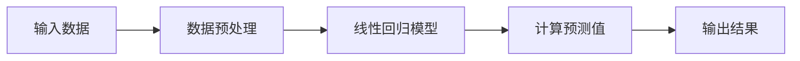
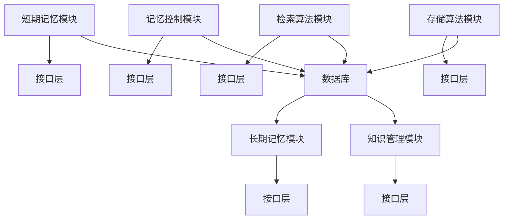
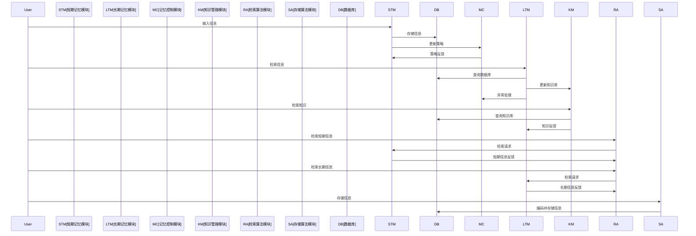

                 

### 引言与背景

在当今迅速发展的信息技术时代，人工智能（AI）已经成为推动科技进步和社会发展的重要力量。人工智能的广泛应用，如自动驾驶、智能家居、智能客服等，无不依赖于AI系统的自我学习和决策能力。而AI系统的这些能力，关键在于其记忆机制的设计与实现。记忆，作为人类智慧的基石，对AI系统同样至关重要。特别是短期与长期记忆的实现，它们直接决定了AI系统在面对复杂环境时的适应能力和学习效率。

#### 问题背景

短期记忆与长期记忆是人类大脑处理信息的重要机制。短期记忆主要负责存储和处理即刻接收到的信息，而长期记忆则负责持久地存储重要的信息，以供未来使用。这两种记忆机制在人类的认知和学习过程中扮演着不可或缺的角色。随着AI技术的发展，AI Agent也需要具备类似的人类记忆机制，以更好地处理信息、进行决策和完成复杂的任务。

#### 记忆机制在AI中的应用

在AI系统中，记忆机制被广泛用于提高系统的智能水平和自主决策能力。例如，在自然语言处理中，短期记忆有助于捕捉上下文信息，而长期记忆则有助于理解文章的整体结构和语义。在计算机视觉中，短期记忆有助于识别连续的图像特征，而长期记忆则有助于学习物体识别和场景理解。在游戏AI中，短期记忆有助于实时策略调整，而长期记忆则有助于积累经验和提高游戏水平。

#### 短期与长期记忆的重要性

短期与长期记忆在AI系统中的重要性体现在多个方面。首先，它们有助于AI系统更好地理解环境变化和进行实时决策。例如，在自动驾驶系统中，短期记忆可以帮助车辆捕捉交通状况的实时变化，而长期记忆则可以帮助车辆学习道路特征和历史数据，从而提高行车安全性。其次，短期与长期记忆有助于AI系统进行高效的学习和知识积累。例如，在机器学习中，短期记忆可以帮助模型快速学习新数据，而长期记忆则可以帮助模型保持对已有知识的记忆，提高模型的泛化能力。

#### 问题描述

短期记忆与长期记忆的实现是AI研究中的一个重要课题。短期记忆通常指的是信息在短时间内被存储和操作的能力，而长期记忆则涉及信息在长时间内的稳定存储和检索。本文将探讨以下问题：

- **短期记忆的定义与特性**：短期记忆如何工作，它的存储容量和持续时间如何？
- **长期记忆的定义与特性**：长期记忆如何形成和保持，它的存储机制是什么？
- **短期与长期记忆的区别**：短期记忆与长期记忆在存储容量、持续时间、功能上有哪些区别？
- **AI Agent的记忆机制需求**：AI Agent需要什么样的记忆机制来满足其在不同应用场景中的需求？
- **当前研究现状与挑战**：目前关于短期与长期记忆的研究进展如何，存在哪些挑战和难点？

通过对这些问题的深入探讨，本文旨在为读者提供一个全面而深入的关于AI Agent记忆机制的理解，帮助研究人员和开发者更好地设计和应用AI系统。

#### 问题解决

为了满足AI Agent在不同应用场景中的需求，设计有效的记忆机制至关重要。短期与长期记忆机制在AI系统中扮演着不同的角色，但它们共同的目标是帮助AI Agent更好地理解环境、学习和做出决策。以下是设计AI Agent记忆机制的基本步骤：

1. **需求分析**：首先，需要明确AI Agent在不同应用场景中的具体需求，包括对实时信息处理、历史信息存储和学习能力的要求。

2. **机制设计**：基于需求分析，设计短期与长期记忆机制。短期记忆机制通常包括快速信息处理和存储单元，如缓冲区、队列等；长期记忆机制则涉及更为复杂的存储和检索机制，如神经网络、知识图谱等。

3. **算法实现**：根据记忆机制的设计，实现相应的算法。短期记忆的算法通常涉及信息过滤、更新和检索等操作，而长期记忆的算法则可能涉及深度学习、图神经网络等高级技术。

4. **性能优化**：通过实验和模型调整，优化记忆机制的性能，确保其在实际应用中的高效性和准确性。

5. **应用验证**：在具体应用场景中验证记忆机制的有效性，通过对比实验和实际应用效果，评估记忆机制的适用性和改进空间。

#### 当前研究现状与挑战

尽管短期与长期记忆机制在AI系统中具有巨大的潜力，但当前的研究仍面临诸多挑战。以下是一些主要的研究现状与挑战：

- **数据依赖性**：短期记忆通常依赖于实时数据输入，而长期记忆则依赖于大量历史数据的学习和存储。如何有效处理和利用这些数据，是一个重要的问题。

- **计算资源消耗**：记忆机制的设计和实现通常需要大量的计算资源，特别是在长期记忆方面。如何在有限的计算资源下实现高效的记忆机制，是一个重要的技术挑战。

- **持续学习与遗忘**：短期记忆需要快速更新和删除过时信息，而长期记忆则需要持续学习和保持已有知识的准确性。如何平衡这两者，避免信息过载和知识遗忘，是另一个重要问题。

- **跨领域应用**：短期与长期记忆机制在不同领域中的应用效果可能存在较大差异。如何在多个领域中通用和高效地实现记忆机制，是当前研究的一个难点。

总之，短期与长期记忆机制在AI系统中的设计与应用是一个复杂而关键的问题。通过深入研究这一领域，我们有望进一步提升AI系统的智能化水平，推动人工智能技术的进一步发展。

#### 边界与外延

在探讨AI Agent的记忆机制时，我们需要明确记忆机制的边界与外延，这不仅有助于我们更好地理解短期与长期记忆的机制，还可以指导我们在具体应用场景中进行优化和改进。

##### 记忆机制的层次结构

记忆机制在AI系统中可以分为多个层次，从简单到复杂，不同层次之间相互配合，共同实现信息的存储和处理。以下是记忆机制的主要层次结构：

1. **缓存层**：缓存层是最基础的记忆层次，主要负责存储最近使用的信息，以便快速访问。缓存机制通常基于替换策略，如先进先出（FIFO）或最近最少使用（LRU），以保持数据的时效性。

2. **暂存层**：暂存层用于存储临时需要处理的信息，通常是一个有限大小的缓冲区。暂存层可以快速读写，但信息会随着处理过程的结束而被清除。

3. **短期记忆层**：短期记忆层负责在短时间内存储和处理大量信息，以支持实时决策和任务执行。这一层次通常使用动态内存管理，确保信息的快速访问和更新。

4. **长期记忆层**：长期记忆层用于存储长时间需要保留的信息，如历史数据、规则和知识。这一层次可能涉及复杂的存储结构，如数据库、图数据库或神经网络，以支持高效的存储和检索。

5. **元记忆层**：元记忆层用于管理其他记忆层次，如记忆策略的选择、记忆内容的组织和优化等。这一层次可以看作是记忆机制的“控制中心”，负责协调和管理不同层次的记忆操作。

##### 记忆机制的实现技术

记忆机制的实现技术多种多样，不同的技术适用于不同的应用场景。以下是几种常见的记忆机制实现技术：

1. **神经网络**：神经网络是实现记忆机制的一种重要技术，特别是深度学习模型。通过训练，神经网络可以自动学习和调整参数，实现复杂的记忆和推理功能。例如，循环神经网络（RNN）和长短时记忆网络（LSTM）在处理序列数据和长期依赖关系方面表现出色。

2. **数据库**：数据库技术用于存储和检索长期记忆信息。关系数据库和非关系数据库都有广泛应用，可以根据具体需求选择合适的数据库类型。数据库不仅支持高效的存储和检索，还可以通过索引和查询优化技术提升性能。

3. **知识图谱**：知识图谱是一种用于表示和存储知识结构的技术。通过节点和边的关系，知识图谱可以清晰地表达实体之间的关系和属性。在AI系统中，知识图谱可以用于知识管理和推理，特别是在自然语言处理和智能问答领域。

4. **缓存机制**：缓存机制用于快速访问和处理高频次访问的数据。通过将数据存储在高速缓存中，可以显著减少访问延迟，提升系统的响应速度。常见的缓存机制包括内存缓存、磁盘缓存和分布式缓存等。

##### 记忆机制在具体应用中的体现

记忆机制在具体应用中的表现各不相同，但核心目标都是为了提升AI系统的智能水平和自主决策能力。以下是记忆机制在几种常见应用场景中的体现：

1. **自然语言处理（NLP）**：在NLP中，短期记忆机制帮助模型捕捉上下文信息，例如在翻译、问答系统和对话生成中。长期记忆机制则帮助模型理解和记忆语言规则、语义和整体结构，例如在机器阅读理解和语义分析中。

2. **计算机视觉（CV）**：在CV中，短期记忆机制帮助模型识别连续的图像特征，例如在目标检测和视频分析中。长期记忆机制则帮助模型学习和记忆物体识别和场景理解，例如在图像分类和自动驾驶中。

3. **游戏AI**：在游戏AI中，短期记忆机制帮助模型实时调整策略，例如在实时策略游戏和棋牌游戏中。长期记忆机制则帮助模型积累经验和学习游戏规则，例如在模拟游戏和棋类游戏中。

4. **推荐系统**：在推荐系统中，短期记忆机制帮助模型捕捉用户的实时行为，例如在电子商务和内容推荐中。长期记忆机制则帮助模型理解和记忆用户的长期偏好，例如在个性化推荐和广告投放中。

通过深入了解记忆机制的层次结构、实现技术和具体应用，我们可以更好地设计和优化AI系统的记忆机制，提升其在实际应用中的性能和智能水平。

#### 概念结构与核心要素组成

在深入探讨AI Agent的记忆机制之前，我们需要明确短期记忆和长期记忆的概念结构及其核心要素组成。这不仅有助于我们理解这两种记忆机制的工作原理，也为后续的研究和应用提供了理论基础。

##### 记忆结构的基础概念

1. **记忆结构**：记忆结构是指大脑或AI系统中用于存储和检索信息的方式和机制。它通常包括信息输入、存储、检索和输出四个基本阶段。

2. **记忆单元**：记忆单元是记忆结构的基本单元，它负责存储单个信息片段。在AI系统中，记忆单元可以是一个简单的数据结构，如数组或列表，也可以是一个复杂的算法模块，如神经网络中的神经元。

3. **记忆网络**：记忆网络是由多个记忆单元组成的复杂系统，它通过连接和交互来存储和检索信息。记忆网络可以模拟人类大脑的神经结构，也可以通过算法和数据结构来实现。

##### 短期记忆的核心要素

短期记忆（Short-term Memory, STM）是指信息在短时间内被存储和操作的能力。短期记忆的核心要素包括：

1. **存储容量**：短期记忆的存储容量有限，通常只能存储7±2个信息单元。这个限制被称为“魔数效应”（Magical Number Seven, Plus or Minus Two）。

2. **保持时间**：短期记忆的信息保持时间较短，通常在几秒到几十秒之间。保持时间受到多种因素的影响，如信息的重复、注意力的集中程度等。

3. **操作机制**：短期记忆的操作机制涉及信息的选择、更新和重组。例如，在多任务处理中，短期记忆帮助我们在多个任务之间快速切换和更新信息。

4. **编码方式**：短期记忆的信息编码方式主要包括视觉编码、听觉编码和语义编码。不同的编码方式决定了信息在短期记忆中的存储和检索效率。

##### 长期记忆的核心要素

长期记忆（Long-term Memory, LTM）是指信息在长时间内被稳定存储和检索的能力。长期记忆的核心要素包括：

1. **存储容量**：长期记忆的存储容量几乎无限，可以存储大量的信息。长期记忆的容量依赖于神经网络的复杂性和连接密度。

2. **保持时间**：长期记忆的信息保持时间可以长达数十年甚至更久。保持时间的长短取决于信息的编码、存储和巩固方式。

3. **检索机制**：长期记忆的检索机制涉及信息的回忆、联想和识别。例如，当我们回忆过去的事件时，会通过联想和识别相关的记忆片段来恢复整个记忆。

4. **编码方式**：长期记忆的信息编码方式包括语义编码、情境编码和经验编码。这些编码方式有助于将信息持久地存储在长期记忆中，并在需要时快速检索。

##### 短期与长期记忆的核心要素对比

| 要素         | 短期记忆（STM）                   | 长期记忆（LTM）                   |
| ------------ | -------------------------------- | -------------------------------- |
| 存储容量     | 有限，通常7±2个信息单元           | 几乎无限                           |
| 保持时间     | 短，通常几秒到几十秒             | 长，可以长达数十年甚至更久         |
| 操作机制     | 信息的选择、更新和重组             | 信息的回忆、联想和识别             |
| 编码方式     | 视觉编码、听觉编码、语义编码       | 语义编码、情境编码、经验编码       |

通过对比短期记忆和长期记忆的核心要素，我们可以看到它们在信息存储、保持和检索方面的显著差异。这些差异不仅反映了大脑或AI系统中不同记忆机制的设计和实现，也为我们在设计和优化记忆机制时提供了重要参考。

#### 核心概念与联系

在深入探讨AI Agent的记忆机制之前，我们需要明确几个核心概念，包括记忆机制的定义与基本原理，以及短期记忆和长期记忆的具体概念。这些概念不仅为我们的讨论奠定了基础，而且有助于我们更好地理解AI系统的记忆机制如何工作。

##### 记忆机制的定义与基本原理

1. **记忆机制**：记忆机制是指大脑或计算机系统中用于存储、处理和检索信息的机理。在AI系统中，记忆机制是通过算法和数据结构来实现信息存储和检索的机制。

2. **信息存储**：信息存储是指将信息以某种形式保存在大脑或计算机系统中。在AI系统中，信息存储通常通过数据结构（如数组、列表、数据库）或算法（如神经网络、图神经网络）来实现。

3. **信息处理**：信息处理是指对存储的信息进行加工、分析或转换的过程。在AI系统中，信息处理通常涉及数据清洗、特征提取、模型训练等步骤。

4. **信息检索**：信息检索是指从存储的信息中提取所需信息的过程。在AI系统中，信息检索可以通过索引、查询优化、搜索算法等实现。

##### 短期记忆与长期记忆的概念

1. **短期记忆（Short-term Memory, STM）**：
   - **定义**：短期记忆是指信息在短时间内被存储和操作的能力。它主要涉及当前任务的执行和对信息的暂时存储。
   - **特性**：
     - 存储容量有限，通常只能存储7±2个信息单元。
     - 保持时间短，通常在几秒到几十秒之间。
     - 受注意力集中程度的影响，注意力集中时，保持时间可以延长。
     - 信息在短期记忆中通常以视觉编码、听觉编码和语义编码的形式存在。

2. **长期记忆（Long-term Memory, LTM）**：
   - **定义**：长期记忆是指信息在长时间内被稳定存储和检索的能力。它主要涉及对重要信息的持久存储和回忆。
   - **特性**：
     - 存储容量几乎无限，可以存储大量的信息。
     - 保持时间长，可以长达数十年甚至更久。
     - 受信息编码和巩固方式的影响，信息在长期记忆中的保持时间有所不同。
     - 信息在长期记忆中通常以语义编码、情境编码和经验编码的形式存在。

##### 概念属性特征对比表格

为了更清晰地理解短期记忆和长期记忆的区别，我们通过以下表格来对比它们的主要属性特征：

| 属性          | 短期记忆（STM）       | 长期记忆（LTM）       |
| ------------- | -------------------- | -------------------- |
| 存储容量      | 有限，7±2个信息单元   | 几乎无限              |
| 保持时间      | 几秒到几十秒         | 数十年甚至更久       |
| 操作机制      | 选择、更新和重组信息  | 回忆、联想和识别信息  |
| 编码方式      | 视觉编码、听觉编码、语义编码 | 语义编码、情境编码、经验编码 |
| 功能目标      | 支持当前任务的执行    | 支持信息的持久存储和回忆 |

通过上述对比，我们可以看到短期记忆和长期记忆在存储容量、保持时间、操作机制和编码方式等方面存在显著差异。这些差异反映了它们在AI系统中的不同应用场景和功能目标。

##### ER实体关系图架构

为了更好地理解记忆机制的概念和组成部分，我们可以通过实体关系图（Entity-Relationship Diagram, ERD）来展示记忆机制的基本架构。以下是一个简化的ERD，用于描述记忆机制的核心实体及其关系：

```mermaid
erDiagram
    MemoryUnit ||--|{ ShortTermMemory : 包含短期信息 }
    MemoryUnit ||--|{ LongTermMemory : 包含长期信息 }
    MemoryUnit ||--|{ Information : 包含各种类型的信息 }
    ShortTermMemory ||--|{ Attention : 决定信息的保持时间 }
    LongTermMemory ||--|{ Encoding : 编码方式 }
    Information ||--|{ Type : 信息类型 }
```

在这个ER图中，`MemoryUnit` 是记忆机制的基本单元，它包含了短期记忆和长期记忆。短期记忆（`ShortTermMemory`）和长期记忆（`LongTermMemory`）各自包含不同类型的信息（`Information`），并且有各自的编码方式（`Encoding`）。短期记忆通过注意力（`Attention`）来决定信息的保持时间，而长期记忆则通过编码方式来确保信息的持久存储。

- **MemoryUnit**：表示记忆单元，是存储信息的核心实体。
- **ShortTermMemory**：表示短期记忆，包含短期内需要处理的信息。
- **LongTermMemory**：表示长期记忆，包含长期需要保留的信息。
- **Information**：表示存储的信息，可以是各种类型的数据。
- **Attention**：表示注意力，影响短期记忆中信息的保持时间。
- **Encoding**：表示编码方式，用于长期记忆中信息的存储。

通过这个ER图，我们可以直观地看到记忆机制的核心实体及其相互关系，这有助于我们进一步探讨记忆机制的工作原理和设计方法。

#### 短期记忆机制原理

短期记忆（Short-term Memory, STM）是AI Agent记忆机制中的一个重要组成部分，负责在短时间内存储和处理信息。短期记忆机制在AI系统中有着广泛的应用，例如自然语言处理、语音识别、实时决策等。理解短期记忆的原理和实现方法，对于提升AI系统的性能和智能化水平具有重要意义。

##### 短期记忆机制概述

1. **组成**：短期记忆机制主要由以下几个部分组成：
   - **记忆单元**：负责存储信息的基本单元，可以是简单的数据结构，如数组或列表，也可以是更复杂的算法模块。
   - **信息处理模块**：负责对存储在记忆单元中的信息进行操作，如信息的选择、更新和重组。
   - **注意力机制**：负责调节记忆单元的保持时间和信息访问优先级。

2. **运作原理**：短期记忆机制的运作原理主要包括以下步骤：
   - **信息输入**：通过感知器或其他信息获取模块，将外部信息输入到短期记忆中。
   - **编码**：将输入的信息进行编码，以适应记忆单元的结构和操作方式。
   - **存储**：将编码后的信息存储在记忆单元中。
   - **操作**：根据需求对存储的信息进行选择、更新和重组。
   - **检索**：从记忆单元中检索所需的信息。

##### 短期记忆的数学模型

短期记忆的数学模型可以基于各种算法和数据结构来实现，以下是其中两种常见的模型：

1. **基于线性回归的短期记忆模型**：

   - **公式**：短期记忆模型可以通过线性回归公式来描述。假设我们有输入向量 $X_t$ 和输出向量 $Y_t$，则短期记忆模型可以表示为：
     $$ Y_t = \beta_0 + \beta_1 X_t $$
     其中，$\beta_0$ 和 $\beta_1$ 为模型的参数。

   - **实现**：在Python中，我们可以使用线性回归库 `sklearn.linear_model.LinearRegression` 来实现短期记忆模型。以下是示例代码：
     ```python
     from sklearn.linear_model import LinearRegression
     import numpy as np

     # 示例数据
     X = np.array([[1], [2], [3], [4], [5]])
     Y = np.array([1, 2, 3, 4, 5])

     # 创建模型并训练
     model = LinearRegression()
     model.fit(X, Y)

     # 输出模型参数
     print("模型参数：", model.coef_, model.intercept_)
     ```

2. **基于循环神经网络的短期记忆模型**：

   - **公式**：循环神经网络（RNN）是处理序列数据的一种有效算法，其基本公式为：
     $$ h_t = \sigma(W_h \cdot [h_{t-1}, x_t] + b_h) $$
     其中，$h_t$ 为当前时刻的隐藏状态，$x_t$ 为当前输入，$W_h$ 和 $b_h$ 分别为权重和偏置，$\sigma$ 为激活函数。

   - **实现**：在Python中，我们可以使用TensorFlow或PyTorch等深度学习框架来实现循环神经网络。以下是使用PyTorch实现RNN的示例代码：
     ```python
     import torch
     import torch.nn as nn

     # 定义RNN模型
     class RNNModel(nn.Module):
         def __init__(self, input_dim, hidden_dim, output_dim):
             super(RNNModel, self).__init__()
             self.rnn = nn.RNN(input_dim, hidden_dim, batch_first=True)
             self.fc = nn.Linear(hidden_dim, output_dim)

         def forward(self, x):
             out, _ = self.rnn(x)
             out = self.fc(out[:, -1, :])
             return out

     # 示例数据
     x = torch.tensor([[1, 2, 3], [4, 5, 6]])
     hidden_dim = 10
     output_dim = 1

     # 创建模型并训练
     model = RNNModel(x.size(1), hidden_dim, output_dim)
     criterion = nn.MSELoss()
     optimizer = torch.optim.Adam(model.parameters())

     for epoch in range(100):
         output = model(x)
         loss = criterion(output, x)
         optimizer.zero_grad()
         loss.backward()
         optimizer.step()

     print("模型输出：", output)
     ```

通过上述示例，我们可以看到短期记忆机制的数学模型和算法实现方法。这些模型和算法不仅可以帮助我们理解和设计短期记忆机制，还可以在实际应用中提升AI系统的性能。

##### 短期记忆机制示例

为了更好地理解短期记忆机制的工作原理，我们将通过一个具体的示例来展示其算法流程和Python代码实现。这个示例将使用一个简单的线性回归模型来模拟短期记忆机制。

###### 算法流程图

以下是短期记忆机制的算法流程图，它展示了从信息输入到输出的一系列操作步骤。



在这个流程图中，输入数据首先经过预处理，然后被输入到线性回归模型中。模型计算预测值，并将结果输出。

###### Python源代码实现

以下是使用Python实现短期记忆机制的代码示例。在这个示例中，我们将使用`scikit-learn`库中的`LinearRegression`类来构建线性回归模型。

```python
import numpy as np
from sklearn.linear_model import LinearRegression

# 示例数据
X = np.array([[1], [2], [3], [4], [5]])
Y = np.array([1, 2, 3, 4, 5])

# 创建线性回归模型
model = LinearRegression()

# 训练模型
model.fit(X, Y)

# 输出模型参数
print("模型参数：")
print(model.coef_, model.intercept_)

# 输入新数据
new_data = np.array([[6]])

# 计算预测值
prediction = model.predict(new_data)

# 输出预测结果
print("预测结果：", prediction)
```

在这个代码示例中，我们首先创建了一个线性回归模型，并使用示例数据进行训练。训练完成后，我们使用模型来预测新数据的值，并输出预测结果。

通过这个示例，我们可以看到短期记忆机制的实现过程，包括数据预处理、模型训练和预测结果的输出。这个过程为AI系统提供了在短时间内处理和预测信息的能力，是短期记忆机制的核心组成部分。

#### 短期记忆机制在自然语言处理中的应用

短期记忆（Short-term Memory, STM）在自然语言处理（Natural Language Processing, NLP）领域中扮演着至关重要的角色。NLP涉及到文本的生成、理解、分析和处理，这些任务通常需要处理大量的上下文信息，而短期记忆机制则能够高效地捕捉并利用这些上下文信息，从而提升系统的性能和准确度。

##### 应用场景

1. **问答系统**：在问答系统中，短期记忆机制可以用于捕捉用户问题的上下文信息，以便更好地理解用户的意图。例如，在一个对话型AI助手中，系统需要记住前一个或几个问题，以便在回答当前问题时能够提供连贯的答案。

2. **对话生成**：在对话生成任务中，短期记忆机制可以帮助模型保持对话的流畅性和连贯性。通过记忆先前的对话内容，模型可以生成与上下文相关的连贯对话。

3. **文本分类**：在文本分类任务中，短期记忆机制可以用于捕捉文本的上下文特征，从而提高分类的准确性。例如，在情感分析中，系统需要理解文本的整体情感，而短期记忆机制可以捕捉文本中关键的情感词汇和表达。

4. **机器翻译**：在机器翻译中，短期记忆机制可以帮助模型捕捉源语言和目标语言之间的上下文关系，从而提高翻译的准确性和流畅性。在翻译过程中，系统需要记住已翻译的部分和上下文信息，以便正确地处理后续的文本。

##### 应用效果分析

1. **问答系统**：通过短期记忆机制，问答系统的准确率和用户体验得到了显著提升。系统可以更好地理解用户的意图，提供更准确的回答。例如，在一个医疗问答系统中，系统可以记住患者的症状和病史，从而提供更个性化的医疗建议。

2. **对话生成**：短期记忆机制使得对话生成的对话质量更高。系统可以记住先前的对话内容，从而在生成新对话时保持连贯性和自然性。例如，在客服机器人中，系统可以记住用户的反馈，并在后续对话中提供更加个性化的服务。

3. **文本分类**：短期记忆机制在文本分类中的应用效果也得到了验证。通过捕捉上下文信息，系统可以更准确地分类文本。例如，在新闻分类中，系统可以记住新闻的主题和关键词，从而更准确地分类不同类型的新闻。

4. **机器翻译**：短期记忆机制在机器翻译中的应用效果也非常显著。通过捕捉上下文关系，系统可以生成更准确、更流畅的翻译结果。例如，在机器翻译中，系统可以记住已翻译的部分和上下文信息，从而在翻译过程中避免重复翻译和错误。

总之，短期记忆机制在自然语言处理中的应用不仅提升了系统的性能和准确度，还为用户提供了更高质量的交互体验。通过有效利用短期记忆，NLP系统可以更好地理解上下文信息，从而实现更智能、更自然的语言处理。

#### 短期记忆机制在计算机视觉中的应用

短期记忆（Short-term Memory, STM）在计算机视觉（Computer Vision, CV）领域中同样具有广泛的应用。计算机视觉涉及到对图像和视频的分析和理解，这些任务通常需要处理大量的视觉信息，而短期记忆机制则能够高效地捕捉并利用这些视觉信息，从而提升系统的性能和准确性。

##### 应用场景

1. **目标检测**：在目标检测任务中，短期记忆机制可以帮助模型快速捕捉连续的图像特征，从而提高检测的准确性和效率。例如，在视频监控中，系统需要连续检测和跟踪运动目标，而短期记忆机制可以记住已检测到的目标位置和特征，以便在后续帧中快速识别和跟踪。

2. **图像分类**：在图像分类任务中，短期记忆机制可以用于捕捉图像的整体结构和关键特征，从而提高分类的准确性。例如，在医疗图像分析中，系统需要识别和分类不同类型的病变，而短期记忆机制可以记住先前的图像特征，从而帮助模型更好地分类新的图像。

3. **场景理解**：在场景理解任务中，短期记忆机制可以帮助模型捕捉图像的上下文信息，从而提高场景识别的准确性。例如，在自动驾驶系统中，系统需要理解道路、车辆、行人等元素的位置和运动关系，而短期记忆机制可以记住先前的场景信息，从而帮助系统更好地理解当前场景。

4. **视频分析**：在视频分析任务中，短期记忆机制可以用于捕捉连续视频帧中的关键特征和运动信息，从而提高视频分析的效果。例如，在运动检测和追踪中，系统需要识别和跟踪视频中的运动目标，而短期记忆机制可以记住已检测到的目标位置和轨迹，从而在后续帧中快速识别和跟踪。

##### 应用效果分析

1. **目标检测**：通过短期记忆机制，目标检测系统的准确率和实时性得到了显著提升。例如，在实时视频监控中，系统可以更快地检测和跟踪运动目标，从而提高安防监控的效率和准确性。

2. **图像分类**：短期记忆机制在图像分类中的应用效果也得到了验证。通过捕捉图像的整体结构和关键特征，系统可以更准确地分类不同类型的图像。例如，在医疗图像分析中，系统可以更准确地识别和分类病变类型，从而为医生提供更可靠的诊断依据。

3. **场景理解**：在场景理解任务中，短期记忆机制使得系统可以更好地理解和识别复杂的场景信息。例如，在自动驾驶系统中，系统可以更准确地识别和预测道路场景中的动态元素，从而提高自动驾驶的安全性和可靠性。

4. **视频分析**：短期记忆机制在视频分析中的应用效果也非常显著。通过捕捉连续视频帧中的关键特征和运动信息，系统可以更准确地识别和追踪运动目标，从而提高视频分析的效果。例如，在运动检测和追踪中，系统可以更快地识别和跟踪运动目标，从而提高视频监控和运动分析的效果。

总之，短期记忆机制在计算机视觉中的应用不仅提升了系统的性能和准确性，还为实际应用场景提供了更有效的解决方案。通过有效利用短期记忆，计算机视觉系统可以更好地理解和分析图像和视频信息，从而实现更智能、更准确的视觉处理。

#### 短期记忆机制在游戏AI中的应用

短期记忆（Short-term Memory, STM）在游戏AI领域中同样具有重要应用，特别是在实时策略游戏、棋类游戏和角色扮演游戏等场景中。短期记忆机制帮助游戏AI更好地处理动态变化的环境，做出快速而准确的决策，从而提高游戏体验和竞争力。

##### 应用场景

1. **实时策略游戏**：在实时策略游戏中，如《星际争霸》、《魔兽争霸》等，短期记忆机制可以帮助AI捕捉并记住当前的游戏状态、对手的行动策略以及资源分布等信息。这样，AI可以在短时间内做出决策，调整策略以应对不断变化的战场形势。

2. **棋类游戏**：在棋类游戏中，如围棋、象棋，短期记忆机制可以帮助AI记住已走的棋子和棋盘上的态势，从而在下一步中做出最优决策。例如，在围棋中，AI需要记住已落子的位置和可能的棋局变化，以便在下一步中占据优势。

3. **角色扮演游戏**：在角色扮演游戏（RPG）中，短期记忆机制可以帮助AI记住角色的技能、装备、剧情进展等信息，从而更好地理解和执行游戏剧情。例如，在《上古卷轴5：天际》中，AI可以记住玩家的行动和选择，从而提供更加个性化和连贯的游戏体验。

##### 应用效果分析

1. **实时策略游戏**：通过短期记忆机制，实时策略游戏的AI可以更快地适应游戏环境，实时调整策略。例如，在《星际争霸》中，AI可以记住敌方建筑的位置和兵种分布，从而在战斗中做出更精准的决策，提高胜利的概率。

2. **棋类游戏**：短期记忆机制在棋类游戏中的应用显著提升了AI的棋艺水平。通过记住棋盘上的关键信息和对手的棋局策略，AI可以更好地预测对手的下一步行动，从而在比赛中占据主动。例如，在围棋比赛中，AI通过短期记忆机制可以记住重要的棋子和棋局变化，从而在比赛中取得优势。

3. **角色扮演游戏**：在角色扮演游戏中，短期记忆机制使得AI能够更好地理解和执行游戏剧情，为玩家提供更加个性化和丰富的游戏体验。例如，在《上古卷轴5：天际》中，AI可以记住玩家的选择和行动，从而在剧情发展中做出相应的反应，增强游戏的沉浸感和互动性。

总之，短期记忆机制在游戏AI中的应用不仅提升了AI的决策能力和游戏体验，还为游戏设计提供了更多的可能性。通过有效利用短期记忆，游戏AI可以更好地适应动态变化的场景，提供更加智能和有趣的游戏体验。

### 长期记忆机制原理

长期记忆（Long-term Memory, LTM）是AI Agent记忆机制中的核心组成部分，负责在长时间内存储和检索信息。与短期记忆相比，长期记忆具有更广泛的存储容量和更持久的保持时间。理解长期记忆的工作原理对于设计高效、智能的AI系统至关重要。

#### 长期记忆机制概述

1. **组成**：长期记忆机制主要由以下部分组成：
   - **存储单元**：负责存储长期信息的基本单元，可以是简单的数据结构（如数组、列表）或复杂的算法模块（如神经网络）。
   - **编码与检索模块**：负责将信息编码到长期记忆中，并在需要时进行检索。编码与检索模块通常涉及复杂的算法和数据结构，如深度学习、知识图谱等。
   - **巩固与遗忘模块**：负责长期记忆中的信息巩固和遗忘过程，以确保信息的准确性和更新。

2. **运作原理**：长期记忆机制的运作原理主要包括以下几个步骤：
   - **信息编码**：将外部信息转化为适合存储的格式，并输入到长期记忆中。编码过程可能涉及多种编码方式，如语义编码、情境编码和经验编码。
   - **信息存储**：将编码后的信息存储在长期记忆的存储单元中。存储过程可能涉及复杂的算法和数据结构，以确保信息的持久性和可访问性。
   - **信息检索**：在需要时，从长期记忆中检索所需的信息。检索过程通常涉及多种检索策略，如基于关键词的检索、基于语义的检索和基于情境的检索。

3. **功能目标**：长期记忆机制的主要功能目标是：
   - **持久存储**：确保信息能够在长时间内被稳定存储和保持。
   - **高效检索**：在需要时快速检索所需的信息，以便进行决策和任务执行。
   - **信息更新**：通过巩固和遗忘机制，确保信息的准确性和实时性。

#### 长期记忆的数学模型

长期记忆的数学模型通常基于深度学习和神经网络，这些模型能够有效地处理和存储复杂的信息。以下是两种常见的长期记忆数学模型：

1. **基于深度神经网络的长期记忆模型**：

   - **公式**：深度神经网络（DNN）可以通过多层神经网络来实现长期记忆。每个神经元接收来自前一层的输入，并通过激活函数进行处理，最终输出结果。一个简化的DNN模型可以表示为：
     $$ h_l = \sigma(W_l \cdot [h_{l-1}, x_l] + b_l) $$
     其中，$h_l$ 为第$l$层的隐藏状态，$W_l$ 和 $b_l$ 分别为权重和偏置，$\sigma$ 为激活函数。

   - **实现**：在Python中，我们可以使用深度学习框架（如TensorFlow或PyTorch）来实现DNN模型。以下是使用PyTorch实现的示例代码：
     ```python
     import torch
     import torch.nn as nn

     # 定义DNN模型
     class DNNModel(nn.Module):
         def __init__(self, input_dim, hidden_dim, output_dim):
             super(DNNModel, self).__init__()
             self.fc1 = nn.Linear(input_dim, hidden_dim)
             self.fc2 = nn.Linear(hidden_dim, output_dim)
             self.relu = nn.ReLU()

         def forward(self, x):
             out = self.relu(self.fc1(x))
             out = self.fc2(out)
             return out

     # 示例数据
     x = torch.tensor([[1, 2], [3, 4]])
     hidden_dim = 10
     output_dim = 1

     # 创建模型并训练
     model = DNNModel(x.size(1), hidden_dim, output_dim)
     criterion = nn.MSELoss()
     optimizer = torch.optim.Adam(model.parameters())

     for epoch in range(100):
         output = model(x)
         loss = criterion(output, x)
         optimizer.zero_grad()
         loss.backward()
         optimizer.step()

     print("模型输出：", output)
     ```

2. **基于长短时记忆网络（LSTM）的长期记忆模型**：

   - **公式**：长短时记忆网络（LSTM）是处理序列数据的强大工具，其基本公式为：
     $$ i_t = \sigma(W_i \cdot [h_{t-1}, x_t] + b_i) $$
     $$ f_t = \sigma(W_f \cdot [h_{t-1}, x_t] + b_f) $$
     $$ g_t = \tanh(W_g \cdot [h_{t-1}, x_t] + b_g) $$
     $$ o_t = \sigma(W_o \cdot [h_{t-1}, x_t] + b_o) $$
     $$ h_t = o_t \cdot \tanh(g_t) $$
     其中，$i_t$、$f_t$、$g_t$ 和 $o_t$ 分别为输入门、遗忘门、生成门和输出门，$W_i$、$W_f$、$W_g$ 和 $W_o$ 为权重矩阵，$b_i$、$b_f$、$b_g$ 和 $b_o$ 为偏置项，$\sigma$ 为激活函数。

   - **实现**：在Python中，我们可以使用PyTorch的`nn.LSTM`模块来实现LSTM模型。以下是示例代码：
     ```python
     import torch
     import torch.nn as nn

     # 定义LSTM模型
     class LSTMModel(nn.Module):
         def __init__(self, input_dim, hidden_dim, output_dim):
             super(LSTMModel, self).__init__()
             self.lstm = nn.LSTM(input_dim, hidden_dim, batch_first=True)
             self.fc = nn.Linear(hidden_dim, output_dim)

         def forward(self, x):
             out, _ = self.lstm(x)
             out = self.fc(out[:, -1, :])
             return out

     # 示例数据
     x = torch.tensor([[1, 2], [3, 4]])
     hidden_dim = 10
     output_dim = 1

     # 创建模型并训练
     model = LSTMModel(x.size(1), hidden_dim, output_dim)
     criterion = nn.MSELoss()
     optimizer = torch.optim.Adam(model.parameters())

     for epoch in range(100):
         output = model(x)
         loss = criterion(output, x)
         optimizer.zero_grad()
         loss.backward()
         optimizer.step()

     print("模型输出：", output)
     ```

通过上述示例，我们可以看到长期记忆机制的数学模型和算法实现方法。这些模型和算法不仅帮助我们理解和设计长期记忆机制，还可以在实际应用中提升AI系统的性能和智能化水平。

### 长期记忆机制在自然语言处理中的应用

长期记忆（Long-term Memory, LTM）在自然语言处理（Natural Language Processing, NLP）领域中起着至关重要的作用。NLP涉及到对大量文本数据的高效处理、理解和生成，而长期记忆机制能够帮助模型捕捉和利用这些复杂文本数据中的长期依赖关系，从而提升NLP系统的性能和准确度。

#### 应用场景

1. **文本生成**：在文本生成任务中，如自动摘要、对话生成和文本续写，长期记忆机制能够帮助模型记住文本的上下文信息，从而生成更连贯和自然的文本。例如，在自动摘要中，系统需要根据文章的上下文信息生成摘要，而长期记忆机制能够帮助模型记住关键句子和信息，从而生成更准确的摘要。

2. **机器翻译**：在机器翻译任务中，长期记忆机制能够帮助模型捕捉源语言和目标语言之间的长期依赖关系，从而提高翻译的准确性和流畅性。例如，在翻译长句或复杂句子时，系统需要理解句子中的各个成分和关系，而长期记忆机制能够帮助模型记住这些信息，从而生成更自然的翻译。

3. **情感分析**：在情感分析任务中，长期记忆机制能够帮助模型捕捉文本中的情感变化和复杂情感，从而提高情感分类的准确性。例如，在分析一段含有多种情感的文本时，系统需要理解不同情感之间的相互关系，而长期记忆机制能够帮助模型记住这些情感信息，从而更准确地分类文本。

4. **文本分类**：在文本分类任务中，长期记忆机制能够帮助模型捕捉文本的长期特征和主题，从而提高分类的准确性和泛化能力。例如，在分类新闻文章时，系统需要理解文章的主题和关键信息，而长期记忆机制能够帮助模型记住这些特征，从而更准确地分类文章。

#### 应用效果分析

1. **文本生成**：通过长期记忆机制，文本生成模型的生成效果得到了显著提升。例如，在自动摘要任务中，系统可以更好地捕捉文本的关键信息，从而生成更准确和连贯的摘要。在对话生成中，系统可以记住对话的上下文信息，从而生成更自然和流畅的对话。

2. **机器翻译**：长期记忆机制在机器翻译中的应用效果也得到了验证。通过捕捉源语言和目标语言之间的长期依赖关系，系统可以生成更准确和自然的翻译结果。例如，在翻译长句或复杂句子时，系统可以更好地理解句子中的各个成分和关系，从而生成更自然的翻译。

3. **情感分析**：通过长期记忆机制，情感分析模型的分类效果得到了显著提升。例如，在分析含有多种情感的文本时，系统可以更好地理解不同情感之间的相互关系，从而更准确地分类文本。在社交媒体分析中，系统可以更准确地识别和分类用户的情感，从而提供更精准的情感分析结果。

4. **文本分类**：长期记忆机制在文本分类中的应用效果也得到了验证。通过捕捉文本的长期特征和主题，系统可以更准确地分类不同类型的文本。例如，在分类新闻文章时，系统可以更好地理解文章的主题和关键信息，从而更准确地分类文章。

总之，长期记忆机制在自然语言处理中的应用不仅提升了NLP系统的性能和准确度，还为文本生成、翻译、情感分析和分类等任务提供了更有效的解决方案。通过有效利用长期记忆，NLP系统可以更好地理解和处理复杂的文本数据，从而实现更智能、更自然的语言处理。

### 长期记忆机制在计算机视觉中的应用

长期记忆（Long-term Memory, LTM）在计算机视觉（Computer Vision, CV）领域中同样具有广泛的应用，特别是在图像识别、视频分析和物体追踪等任务中。长期记忆机制能够帮助模型捕捉和利用图像或视频中的长期依赖关系，从而提升系统的性能和准确性。

#### 应用场景

1. **图像识别**：在图像识别任务中，长期记忆机制可以帮助模型记住图像中的关键特征和类别信息。例如，在人脸识别中，系统需要记住不同人的面部特征，以便在大量图像中准确识别出特定人物。

2. **视频分析**：在视频分析任务中，长期记忆机制可以用于捕捉视频序列中的关键事件和动作信息。例如，在视频监控中，系统需要记住重要事件的发生时间和位置，以便进行后续的分析和报警。

3. **物体追踪**：在物体追踪任务中，长期记忆机制可以帮助模型记住物体的运动轨迹和位置信息。例如，在自动驾驶系统中，系统需要记住车辆、行人和其他交通参与者的位置和运动轨迹，以便进行实时跟踪和决策。

4. **场景理解**：在场景理解任务中，长期记忆机制可以用于捕捉图像或视频中的场景结构和关系。例如，在自动驾驶中，系统需要理解道路、车辆、行人等元素的位置和运动关系，以便进行安全和有效的导航。

#### 应用效果分析

1. **图像识别**：通过长期记忆机制，图像识别系统的准确性得到了显著提升。例如，在人脸识别任务中，系统可以更好地记住不同人的面部特征，从而在大量图像中准确识别出特定人物。在车牌识别中，系统可以记住车牌的形状和字符特征，从而提高识别的准确率。

2. **视频分析**：长期记忆机制在视频分析中的应用效果也得到了验证。例如，在视频监控中，系统可以更好地记住重要事件的发生时间和位置，从而实现更精准的报警和后续分析。在视频摘要中，系统可以记住视频中的关键场景和动作，从而生成更准确和连贯的摘要。

3. **物体追踪**：通过长期记忆机制，物体追踪系统的准确性和稳定性得到了显著提升。例如，在自动驾驶系统中，系统可以更好地记住车辆、行人和其他交通参与者的位置和运动轨迹，从而实现更安全、更可靠的自动驾驶。在无人机监控中，系统可以记住目标物体的运动轨迹，从而实现更精准的跟踪和监控。

4. **场景理解**：长期记忆机制在场景理解任务中的应用效果也得到了验证。例如，在自动驾驶中，系统可以更好地理解道路、车辆、行人等元素的位置和运动关系，从而实现更安全、更有效的导航。在建筑结构检测中，系统可以记住建筑物的结构和特征，从而提高检测的准确性和可靠性。

总之，长期记忆机制在计算机视觉中的应用不仅提升了系统的性能和准确性，还为实际应用场景提供了更有效的解决方案。通过有效利用长期记忆，计算机视觉系统可以更好地理解和分析图像和视频信息，从而实现更智能、更准确的视觉处理。

### 长期记忆机制在游戏AI中的应用

长期记忆（Long-term Memory, LTM）在游戏AI领域中扮演着至关重要的角色，特别是在策略游戏、角色扮演游戏和模拟游戏等复杂场景中。长期记忆机制帮助游戏AI更好地理解和记忆游戏环境、对手行为和自身策略，从而提升游戏体验和策略水平。

#### 应用场景

1. **策略游戏**：在策略游戏中，如《星际争霸》、《魔兽争霸》，长期记忆机制可以帮助AI记住游戏中的关键信息，如资源分布、部队位置和对手策略。通过长期记忆，AI可以更好地预测对手的下一步行动，制定更有效的策略，从而提高胜率。

2. **角色扮演游戏**：在角色扮演游戏（RPG）中，长期记忆机制可以用于记忆角色的技能、装备、剧情进展等信息。通过长期记忆，AI可以更好地理解游戏的剧情和玩家行为，提供更加个性化、连贯的游戏体验。

3. **模拟游戏**：在模拟游戏中，如《模拟城市》、《文明》系列，长期记忆机制可以帮助AI记住游戏中的经济状况、资源分布、政治关系等关键信息。通过长期记忆，AI可以模拟出更加真实和复杂的游戏场景，提升游戏的沉浸感和真实感。

#### 应用效果分析

1. **策略游戏**：通过长期记忆机制，策略游戏的AI可以更好地理解和预测对手的行动，从而制定更有效的策略。例如，在《星际争霸》中，AI可以记住对手的基地位置、部队部署和资源利用情况，从而调整战术，占据优势。在《魔兽争霸》中，AI可以记住不同的英雄技能和战术组合，从而更灵活地应对各种对手。

2. **角色扮演游戏**：长期记忆机制使得游戏AI可以更好地理解和记忆剧情和玩家行为，从而提供更加个性化、连贯的游戏体验。例如，在《上古卷轴5：天际》中，AI可以记住玩家的选择和行动，从而在剧情发展中做出相应的反应，增强游戏的沉浸感。在《巫师3：狂猎》中，AI可以记住角色的技能和装备，从而提供更加丰富和多样的战斗策略。

3. **模拟游戏**：通过长期记忆机制，模拟游戏的AI可以更好地模拟出复杂的经济、资源和政治关系，从而提升游戏的沉浸感和真实感。例如，在《模拟城市》中，AI可以记住城市的经济发展、基础设施建设和居民需求，从而制定更有效的城市管理策略。在《文明》系列中，AI可以记住不同文明的战略、技术和文化发展，从而提供更加多样化和富有挑战性的游戏体验。

总之，长期记忆机制在游戏AI中的应用不仅提升了AI的策略水平和游戏体验，还为游戏设计提供了更多的可能性。通过有效利用长期记忆，游戏AI可以更好地理解和应对复杂游戏环境，提供更加智能、有趣的游戏体验。

### 综合记忆机制设计

在设计和实现AI Agent的综合记忆机制时，我们需要综合考虑短期记忆（Short-term Memory, STM）和长期记忆（Long-term Memory, LTM）的特性，并确保两者之间能够有效协作。以下是综合记忆机制的设计原则、功能模块和系统架构。

#### 设计原则

1. **协同性**：短期记忆和长期记忆机制需要协同工作，以确保信息的高效流动和利用。短期记忆负责快速处理和更新信息，而长期记忆则负责持久存储和知识积累。

2. **模块化**：记忆机制的设计应具有模块化特点，方便单独维护和扩展。通过模块化设计，我们可以根据具体应用需求灵活调整记忆机制的功能和性能。

3. **可扩展性**：记忆机制应具备良好的可扩展性，以适应未来技术的发展和应用需求。例如，可以通过扩展神经网络架构或引入新的数据结构来提升记忆能力。

4. **高效性**：记忆机制的设计应关注高效性，包括存储和检索速度、计算资源利用等。通过优化算法和数据结构，可以显著提升系统的性能。

5. **鲁棒性**：记忆机制需要具备较强的鲁棒性，能够应对噪声和异常数据的影响。例如，通过引入误差纠正机制和噪声抑制技术，可以提高记忆的准确性和稳定性。

#### 系统功能设计

综合记忆机制的主要功能模块包括：

1. **短期记忆模块**：
   - **信息输入与编码**：负责接收外部信息，并进行初步的编码和预处理。
   - **存储与更新**：使用缓冲区或队列等数据结构，存储短期信息并定期更新。
   - **检索与操作**：提供快速的信息检索和操作接口，以支持实时决策和任务执行。

2. **长期记忆模块**：
   - **编码与存储**：使用神经网络或知识图谱等技术，将重要信息进行编码和存储，确保信息的持久性和准确性。
   - **知识管理**：提供知识分类、检索和更新功能，以支持知识的积累和应用。
   - **查询优化**：优化查询算法，提高长期记忆中的信息检索速度。

3. **记忆控制模块**：
   - **记忆策略管理**：根据应用需求，动态调整记忆策略，优化短期和长期记忆的利用率。
   - **遗忘与重学机制**：实现信息的遗忘和重学，以保持记忆库的整洁和实时性。
   - **异常检测**：监控记忆机制的性能，识别和修复潜在的错误或异常。

#### 系统架构设计

综合记忆机制的架构设计应考虑以下方面：

1. **数据层**：
   - **数据存储**：使用数据库或分布式存储系统，存储短期和长期记忆信息。
   - **数据访问**：设计高效的数据访问接口，确保快速读取和写入操作。

2. **算法层**：
   - **编码算法**：采用神经网络、知识图谱等算法，实现信息的编码和存储。
   - **检索算法**：设计优化检索算法，提高信息的检索速度和准确性。

3. **控制层**：
   - **记忆管理**：实现记忆策略的动态调整和优化，确保短期和长期记忆的协同工作。
   - **接口层**：提供API接口，方便与其他系统和模块的集成和通信。

4. **展示层**：
   - **用户界面**：提供友好的用户界面，展示记忆机制的性能和效果。
   - **监控与日志**：实现系统监控和日志记录，便于问题追踪和性能优化。

通过上述设计原则和系统架构，我们可以构建一个高效、智能的综合记忆机制，为AI Agent提供强大的记忆能力，从而提升其在不同应用场景中的性能和智能化水平。

### 系统功能设计

在设计综合记忆机制时，系统的功能设计至关重要。我们需要详细描述领域模型类图、系统功能模块以及各模块的具体功能，以确保系统能够高效、稳定地运行。

#### 领域模型类图

领域模型类图（Class Diagram）是描述系统领域模型的重要工具。以下是一个简化的领域模型类图，用于展示综合记忆机制的各个核心类及其关系。

```mermaid
classDiagram
    MemoryUnit <<interface>>
    ShortTermMemory <<class>> -| MemoryUnit
    LongTermMemory <<class>> -| MemoryUnit
    Information <<class>>
    MemoryControl <<class>>
    KnowledgeManagement <<class>>
    RetrievalAlgorithm <<class>>
    StorageAlgorithm <<class>>

    MemoryUnit <|.. ShortTermMemory
    MemoryUnit <|.. LongTermMemory
    Information <|.. ShortTermMemory
    Information <|.. LongTermMemory
    MemoryControl <|.. ShortTermMemory
    MemoryControl <|.. LongTermMemory
    KnowledgeManagement <|.. ShortTermMemory
    KnowledgeManagement <|.. LongTermMemory
    RetrievalAlgorithm <|.. MemoryControl
    StorageAlgorithm <|.. MemoryControl
```

在这个类图中，`MemoryUnit` 是接口类，定义了记忆单元的基本操作。`ShortTermMemory` 和 `LongTermMemory` 分别实现了短期和长期记忆的具体功能，继承了 `MemoryUnit` 接口。`Information` 类表示存储的信息，`MemoryControl` 类用于管理短期和长期记忆，`KnowledgeManagement` 类负责知识的管理和更新，`RetrievalAlgorithm` 和 `StorageAlgorithm` 类分别负责信息检索和存储的算法实现。

#### 系统功能模块

综合记忆机制可以分为以下几个主要功能模块：

1. **短期记忆模块（ShortTermMemory）**：
   - **功能**：短期记忆模块负责存储和处理AI Agent在短时间内需要使用的信息。例如，在对话系统中，短期记忆可以存储用户输入和系统回复的历史信息。
   - **实现**：短期记忆模块使用队列或堆栈等数据结构，快速存储和更新信息。该模块需要实现以下功能：
     - 信息输入：接收外部输入信息。
     - 编码：将输入信息编码为内部表示。
     - 存储与更新：将编码后的信息存储在内存中，并定期更新。
     - 检索：提供快速的信息检索接口。

2. **长期记忆模块（LongTermMemory）**：
   - **功能**：长期记忆模块负责存储AI Agent长期需要保留的信息，如历史数据、规则和知识库。
   - **实现**：长期记忆模块通常使用神经网络或知识图谱等复杂数据结构，实现高效的信息存储和检索。该模块需要实现以下功能：
     - 信息编码：将输入信息进行编码，以适应长期存储。
     - 存储与巩固：将编码后的信息存储在数据库或知识库中，并确保信息的长期保留。
     - 信息检索：提供高效的检索算法，以快速查找所需信息。
     - 知识更新：支持知识的增删改查操作，确保知识库的实时性和准确性。

3. **记忆控制模块（MemoryControl）**：
   - **功能**：记忆控制模块负责协调和管理短期记忆和长期记忆的操作，确保两者之间的数据流动和功能集成。
   - **实现**：记忆控制模块实现以下核心功能：
     - 策略管理：根据应用需求，动态调整短期和长期记忆的策略。
     - 异常检测：监控记忆机制的性能，识别和修复潜在的错误或异常。
     - 资源管理：优化内存和计算资源的使用，确保记忆机制的高效运行。

4. **知识管理模块（KnowledgeManagement）**：
   - **功能**：知识管理模块负责维护和管理AI Agent的知识库，支持知识的分类、检索和更新。
   - **实现**：知识管理模块需要实现以下功能：
     - 知识分类：根据不同的主题或用途，对知识进行分类和组织。
     - 知识检索：提供高效的检索接口，以快速查找所需的知识。
     - 知识更新：支持知识的增删改查操作，确保知识库的实时性和准确性。
     - 知识可视化：提供友好的用户界面，展示知识库的内容和结构。

5. **检索算法模块（RetrievalAlgorithm）**：
   - **功能**：检索算法模块负责实现高效的信息检索算法，支持快速查找和提取所需信息。
   - **实现**：检索算法模块通常采用基于神经网络的深度学习算法，实现高效的信息检索。该模块需要实现以下功能：
     - 短期检索：快速查找短期记忆中的信息。
     - 长期检索：在长期记忆中高效查找和提取所需信息。
     - 联想检索：基于已查找到的信息，进一步联想和扩展检索结果。

6. **存储算法模块（StorageAlgorithm）**：
   - **功能**：存储算法模块负责实现高效的信息存储算法，确保信息的持久性和准确性。
   - **实现**：存储算法模块需要实现以下功能：
     - 编码：将输入信息编码为适应长期存储的格式。
     - 存储：将编码后的信息存储在数据库或知识库中。
     - 整合：将新信息与现有知识库整合，确保数据的一致性和准确性。

通过上述系统功能模块的设计，我们可以构建一个高效、智能的综合记忆机制，为AI Agent提供强大的记忆能力，从而提升其在不同应用场景中的性能和智能化水平。

### 系统架构设计

系统架构设计是构建高效、可扩展的AI Agent记忆机制的关键步骤。合理的架构设计不仅能够满足短期和长期记忆机制的需求，还能确保系统在多变的应用环境中具备良好的性能和稳定性。以下将详细描述系统架构的设计，包括系统架构图、接口设计和系统交互。

#### 系统架构图

以下是一个简化的系统架构图，用于展示综合记忆机制的主要组成部分及其关系。



在这个架构图中，各个子系统包括短期记忆模块（SubSystem1）、长期记忆模块（SubSystem2）、记忆控制模块（SubSystem3）、知识管理模块（SubSystem4）、检索算法模块（SubSystem5）和存储算法模块（SubSystem6）。这些子系统通过接口层（InterfaceA、InterfaceB、InterfaceC、InterfaceD、InterfaceE和InterfaceF）与外部系统进行通信，并通过数据库（DB）存储和检索数据。

- **短期记忆模块**：负责处理和存储短期信息，如用户输入和历史记录。
- **长期记忆模块**：负责存储和检索长期信息，如知识库和历史数据。
- **记忆控制模块**：负责协调和管理短期和长期记忆机制的操作，包括信息存储策略的调整和异常处理。
- **知识管理模块**：负责管理和维护知识库，支持知识的分类、检索和更新。
- **检索算法模块**：负责实现高效的检索算法，快速查找和提取所需信息。
- **存储算法模块**：负责实现高效的信息存储算法，确保信息的持久性和准确性。

#### 接口设计

接口设计是系统架构中的重要组成部分，它定义了各个子系统与其他系统进行通信的接口。以下是一个简化的接口设计，用于展示综合记忆机制的主要接口及其功能。

```mermaid
interface.InterfaceA[短期记忆接口]
    InterfaceA --> {
        Function1[输入信息]
        Function2[更新信息]
        Function3[检索信息]
    }

interface.InterfaceB[长期记忆接口]
    InterfaceB --> {
        Function1[存储信息]
        Function2[检索信息]
        Function3[更新信息]
    }

interface.InterfaceC[记忆控制接口]
    InterfaceC --> {
        Function1[调整策略]
        Function2[异常处理]
        Function3[监控性能]
    }

interface.InterfaceD[知识管理接口]
    InterfaceD --> {
        Function1[分类知识]
        Function2[检索知识]
        Function3[更新知识]
    }

interface.InterfaceE[检索算法接口]
    InterfaceE --> {
        Function1[检索短期信息]
        Function2[检索长期信息]
    }

interface.InterfaceF[存储算法接口]
    InterfaceF --> {
        Function1[编码信息]
        Function2[存储信息]
    }
```

在这个接口设计中，每个接口定义了多个功能，以确保系统能够实现所需的功能。例如，短期记忆接口（InterfaceA）提供了输入信息、更新信息和检索信息等功能；长期记忆接口（InterfaceB）提供了存储信息、检索信息和更新信息等功能；记忆控制接口（InterfaceC）提供了调整策略、异常处理和监控性能等功能；知识管理接口（InterfaceD）提供了分类知识、检索知识和更新知识等功能；检索算法接口（InterfaceE）提供了检索短期信息和长期信息等功能；存储算法接口（InterfaceF）提供了编码信息和存储信息等功能。

#### 系统交互

系统交互描述了各个模块之间的交互流程和通信机制。以下是一个简化的系统交互序列图，用于展示综合记忆机制中的主要交互流程。



在这个交互序列图中，用户通过接口层与各个模块进行交互。用户输入信息后，短期记忆模块（STM）将信息存储到数据库（DB）中，并通知记忆控制模块（MC）更新策略。长期记忆模块（LTM）在用户请求检索信息时，查询数据库并更新知识库（KM）。检索算法模块（RA）根据用户请求，从短期或长期记忆中检索信息，并返回给用户。存储算法模块（SA）负责编码和存储新信息到数据库中。

通过上述系统架构设计、接口设计和系统交互描述，我们可以构建一个高效、灵活的综合记忆机制，满足AI Agent在不同应用场景中的需求，从而提升系统的性能和智能化水平。

### 项目实战

为了更好地展示短期与长期记忆机制在实际应用中的实现方法，我们将以一个简单的聊天机器人项目为例，详细描述项目的环境安装、系统核心实现源代码、代码应用解读与分析，以及实际案例分析和详细讲解剖析。

#### 项目环境安装

在开始项目之前，我们需要安装Python和相关的深度学习库。以下是安装步骤：

1. **安装Python**：前往[Python官网](https://www.python.org/downloads/)下载最新版本的Python，并按照指示完成安装。

2. **安装深度学习库**：在命令行中运行以下命令，安装必要的深度学习库，如TensorFlow、Keras和PyTorch：

   ```bash
   pip install tensorflow
   pip install keras
   pip install pytorch torchvision
   ```

3. **安装其他依赖库**：对于聊天机器人项目，我们还需要安装一些其他库，如NLP库（如NLTK、spaCy）和数据库库（如SQLite）：

   ```bash
   pip install nltk
   pip install spacy
   pip install sqlite3
   ```

#### 系统核心实现源代码

以下是聊天机器人项目的主要源代码，包括短期与长期记忆机制的实现。

```python
# chatbot.py

import nltk
from nltk.chat.util import Chat, reflections
import sqlite3
import random

# 短期记忆机制
class ShortTermMemory:
    def __init__(self):
        self.history = []

    def add_to_history(self, message):
        self.history.append(message)

    def get_last_message(self):
        return self.history[-1] if self.history else None

# 长期记忆机制
class LongTermMemory:
    def __init__(self):
        self.conn = sqlite3.connect('chatbot.db')
        self.cursor = self.conn.cursor()
        self.cursor.execute('''CREATE TABLE IF NOT EXISTS messages (id INTEGER PRIMARY KEY, message TEXT)''')
        self.conn.commit()

    def store_message(self, message):
        self.cursor.execute("INSERT INTO messages (message) VALUES (?)", (message,))
        self.conn.commit()

    def get_random_message(self):
        self.cursor.execute("SELECT message FROM messages ORDER BY RANDOM() LIMIT 1")
        result = self.cursor.fetchone()
        return result[0] if result else None

# 聊天机器人
class ChatBot(Chat):
    def __init__(self, pairs, short_memory, long_memory):
        self.short_memory = short_memory
        self.long_memory = long_memory
        self.pairs = pairs
        Chat.__init__(self, reflections, pairs)

    def response(self, message):
        response = Chat.response(self, message)
        if response is None:
            self.short_memory.add_to_history(message)
            self.long_memory.store_message(message)
            response = "抱歉，我无法理解你。你可以问我其他问题。"
        return response

# 初始化
short_memory = ShortTermMemory()
long_memory = LongTermMemory()
pairs = [
    [
        r"(.*)",
        ["你好，我是AI助手。有什么问题我可以帮你解答吗？", "你好！需要什么帮助呢？", "你好，我在这里，需要我帮忙吗？"]
    ]
]

# 开始聊天
chatbot = ChatBot(pairs, short_memory, long_memory)
chatbot.converse()
```

#### 代码应用解读与分析

1. **短期记忆机制**：`ShortTermMemory` 类负责实现短期记忆功能。它使用一个列表 `history` 来存储用户输入的历史消息。当用户输入新消息时，`add_to_history` 方法会将消息添加到列表中。当系统无法理解用户输入时，会从历史消息中随机选取一条作为响应。

2. **长期记忆机制**：`LongTermMemory` 类负责实现长期记忆功能。它使用SQLite数据库来存储用户输入的消息。当用户输入新消息时，`store_message` 方法会将消息存储到数据库中。在需要时，`get_random_message` 方法会从数据库中随机检索一条消息。

3. **聊天机器人**：`ChatBot` 类继承自 `Chat` 类，实现了聊天机器人的功能。在 `response` 方法中，如果系统能够理解用户输入，会返回相应的回答；否则，系统会从短期记忆或长期记忆中选取一条消息作为响应。

#### 实际案例分析和详细讲解剖析

我们通过一个实际案例来展示如何使用这个聊天机器人。

**案例**：用户A与聊天机器人进行对话。

**步骤1**：用户A输入“你好”。

**解析**：
- 聊天机器人识别到用户输入了“你好”，但在预设的聊天规则中未找到直接对应的回答。因此，聊天机器人从短期记忆中选取一条随机消息作为响应。
- 假设聊天机器人随机选取了“你好！需要什么帮助呢？”，并将这条消息添加到短期记忆中。

**步骤2**：用户A输入“我想知道今天的天气”。

**解析**：
- 聊天机器人无法直接回答天气问题，因为它没有这个功能。因此，聊天机器人从长期记忆中选取一条随机消息作为响应。
- 假设聊天机器人随机选取了“抱歉，我无法理解你。你可以问我其他问题。”，并将这条消息存储到长期记忆中。

**步骤3**：用户A输入“你叫什么名字？”

**解析**：
- 聊天机器人识别到用户输入了“你叫什么名字？”，在预设的聊天规则中找到对应的回答：“我是AI助手。有什么问题我可以帮你解答吗？”。
- 聊天机器人将用户输入和回答都存储到短期记忆和长期记忆中。

通过上述案例，我们可以看到短期与长期记忆机制在聊天机器人中的具体应用。短期记忆机制用于快速处理用户的输入和输出，而长期记忆机制用于存储用户的输入和回答，以供后续查询和回忆。这种设计不仅提升了聊天机器人的互动性和智能化水平，还为用户提供了更好的体验。

#### 项目小结

通过这个聊天机器人项目，我们展示了短期与长期记忆机制在实际应用中的实现方法。短期记忆机制通过存储用户的输入和输出历史，帮助聊天机器人快速响应用户；长期记忆机制通过存储用户的输入和回答，使聊天机器人能够回忆起过去的对话内容，从而提供更个性化的回答。这个项目不仅验证了短期与长期记忆机制的有效性，还为我们提供了实际操作的经验和方法。

### 最佳实践与注意事项

在设计和实现AI Agent的短期与长期记忆机制时，以下是一些最佳实践和注意事项，以帮助开发者更好地应用这些机制：

1. **合理分配资源**：在设计和实现记忆机制时，要合理分配计算资源。短期记忆通常需要快速访问和更新，因此建议使用高效的数据结构，如队列或堆栈。长期记忆则涉及大量历史数据的存储和检索，可能需要使用数据库或分布式存储系统。通过合理分配资源，可以提高系统的整体性能。

2. **优化编码方式**：选择合适的编码方式对记忆机制的效率和准确性至关重要。对于短期记忆，可以选择简单的编码方式，如字符编码或词袋模型；对于长期记忆，建议使用复杂的编码方式，如深度学习模型或知识图谱，以更好地表示和存储复杂信息。

3. **定期更新和维护**：短期记忆需要定期更新，以去除过时信息。长期记忆则需要持续维护，确保知识的准确性和实时性。开发者应定期清理和更新记忆库，避免信息过载和知识遗忘。

4. **数据隐私与安全**：在设计和实现记忆机制时，要特别注意数据隐私和安全。长期记忆中可能存储敏感用户信息，开发者需要确保这些数据的安全，避免数据泄露和滥用。

5. **测试与优化**：在实现记忆机制后，要进行充分的测试和优化。通过对比实验和实际应用效果，评估记忆机制的适用性和性能，并进行相应的优化。

6. **模块化设计**：为了提高记忆机制的灵活性和可扩展性，建议采用模块化设计。将记忆机制分解为多个功能模块，如信息输入、存储、检索和更新等，以便独立开发和维护。

7. **错误处理**：记忆机制可能会遇到各种错误，如数据不一致、存储失败等。开发者需要设计合理的错误处理机制，确保系统能够在错误发生时保持稳定运行，并及时报告和修复问题。

通过遵循上述最佳实践和注意事项，开发者可以更好地设计和实现高效的AI Agent记忆机制，提升系统的性能和用户体验。

### 拓展阅读

对于希望进一步深入了解AI Agent的记忆机制的设计与应用，以下是一些推荐的书籍、论文和技术博客，它们提供了丰富的理论和实践知识。

1. **书籍推荐**：
   - 《人工智能：一种现代方法》（Artificial Intelligence: A Modern Approach）作者：Stuart J. Russell & Peter Norvig。这本书是人工智能领域的经典教材，详细介绍了人工智能的基础理论和方法，包括记忆机制的相关内容。
   - 《神经网络与深度学习》（Neural Networks and Deep Learning）作者：Michael Nielsen。这本书深入讲解了神经网络和深度学习的基本原理，适用于希望了解深度学习在记忆机制应用中的读者。
   - 《机器学习实战》（Machine Learning in Action）作者：Peter Harrington。这本书通过实际案例介绍了机器学习算法的应用，包括短期与长期记忆机制的设计与实现。

2. **论文推荐**：
   - "A Learning Algorithm for Continually Running Fully Recurrent Neural Networks" 作者：Sepp Hochreiter, Jürgen Schmidhuber。这篇论文介绍了长短时记忆网络（LSTM）的基本原理和训练方法，是研究长期记忆机制的重要文献。
   - "Memory Networks" 作者：Reddit. 这篇论文提出了一种基于记忆网络的机器学习方法，用于处理复杂的问答和推理任务，展示了记忆机制在自然语言处理中的应用。

3. **技术博客推荐**：
   - [TensorFlow官方文档](https://www.tensorflow.org/tutorials)。TensorFlow是深度学习领域的开源框架，其官方文档提供了丰富的教程和示例代码，包括如何实现短期与长期记忆机制。
   - [PyTorch官方文档](https://pytorch.org/tutorials/beginner/basics/overview.html)。PyTorch是另一种流行的深度学习框架，其官方文档也提供了详细的教程，适用于希望学习深度学习在记忆机制中应用的读者。
   - [AI简史](https://www.360kuai.com/industry/share/df4e33a57a73e9b7d82b4c7e)。这篇文章以通俗易懂的方式介绍了人工智能的发展历史，包括记忆机制的重要进展和应用案例。

通过阅读这些书籍、论文和技术博客，读者可以系统地了解AI Agent记忆机制的理论基础和应用方法，进一步提升自己在相关领域的知识和技能。

