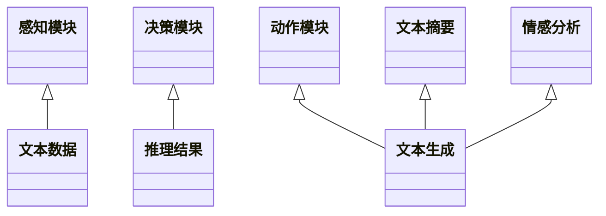
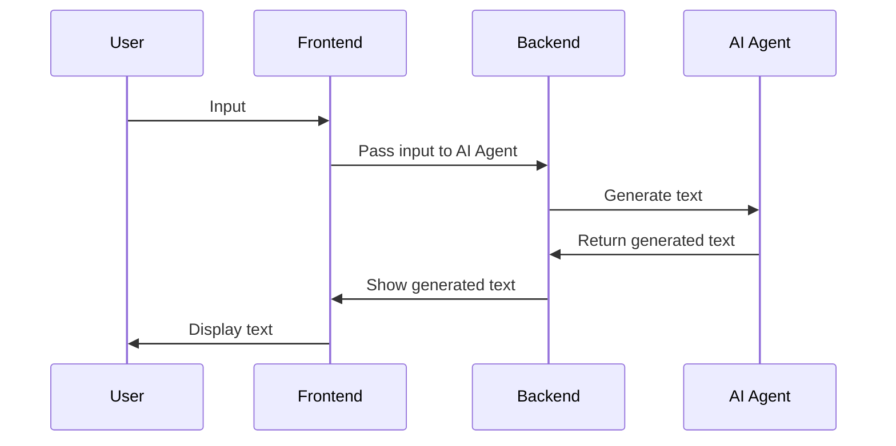

                 

# 《AI Agent的语言生成控制：精确调节LLM的输出风格》

关键词：AI Agent、语言生成控制、LLM、输出风格、算法优化

摘要：本文旨在探讨AI Agent中语言生成控制的原理、方法及其在实际应用中的重要性。通过深入分析语言生成控制的核心概念、生成控制机制和风格调节方法，我们提出了精确调节大型语言模型（LLM）输出风格的策略，从而提升AI Agent的表现和用户体验。

---

## 第一部分：背景介绍

### 第1章 问题背景与问题描述

#### 1.1 AI Agent的定义及其发展现状

AI Agent，即人工智能代理，是一种能够模拟人类行为和决策的智能体。它们具有感知、决策和动作的能力，可以自主地完成特定任务。随着深度学习和自然语言处理技术的不断发展，AI Agent在各个领域的应用越来越广泛，例如自动驾驶、智能客服、金融预测等。

#### 1.2 语言生成控制的重要性

语言生成控制是指对AI Agent生成的文本内容进行风格、格式和语义上的控制。语言生成控制对于AI Agent的性能至关重要，因为它直接影响用户的体验和系统的可靠性。优秀的语言生成控制能够使得AI Agent生成出更加自然、合理和有价值的文本内容。

#### 1.3 问题描述

当前，语言生成控制存在以下问题：

1. **风格一致性差**：AI Agent生成的文本内容在不同情况下可能会出现风格不一致的问题，导致用户体验下降。
2. **语义理解不足**：AI Agent在处理复杂问题时，可能会生成语义不清晰或者错误的文本内容。
3. **适应性差**：AI Agent在不同的应用场景下，需要适应不同的语言风格和表达方式，但目前的语言生成控制方法难以实现这一点。

为了解决这些问题，我们需要对语言生成控制进行精确调节，提升AI Agent的表现。

#### 1.4 边界与外延

语言生成控制的应用范围包括但不限于：

1. **自然语言生成**：生成各种文本内容，如新闻报道、文章摘要、对话等。
2. **文本摘要**：将长文本简化为简洁的摘要。
3. **文本分类**：对文本进行分类，如情感分析、主题分类等。

语言生成控制的技术挑战主要包括：

1. **风格多样性**：如何生成具有多种风格一致性的文本。
2. **语义理解**：如何确保生成的文本内容具有正确的语义。
3. **适应性**：如何使AI Agent在不同应用场景下适应不同的语言风格和表达方式。

### 第2章 核心概念与联系

#### 2.1 AI Agent的基本构成

AI Agent通常由感知模块、决策模块和动作模块组成。感知模块负责接收外部环境的信息，决策模块根据感知信息进行推理和决策，动作模块执行具体的行动。

#### 2.2 语言生成控制的核心概念

1. **语言模型**：用于生成文本内容的模型，如大型语言模型（LLM）。
2. **生成控制机制**：用于调节LLM生成文本风格的机制。
3. **风格调节方法**：用于调整文本风格的算法和策略。

#### 2.3 概念属性特征对比表格

| 概念        | 属性1 | 属性2 | 属性3 |
|-------------|-------|-------|-------|
| AI Agent    | 感知   | 决策   | 动作  |
| 语言模型    | 生成   | 控制性 | 可训练 |
| 生成控制机制 | 控制策略 | 参数调节 | 适应性 |
| 风格调节方法 | 规则性 | 学习性 | 混合性 |

#### 2.4 ER实体关系图架构

```mermaid
erDiagram
  AI Agent ||--|{ 感知模块 }
  AI Agent ||--|{ 决策模块 }
  AI Agent ||--|{ 动作模块 }
  语言模型 ||--|{ 生成控制机制 }
  生成控制机制 ||--|{ 风格调节方法 }
```

---

## 第二部分：算法原理讲解

### 第3章 语言模型原理讲解

#### 3.1 语言模型的基本原理

语言模型是一种用于预测文本中下一个单词或字符的概率分布的模型。它通常使用大量的文本数据进行训练，以便能够捕捉到语言的特征和规律。

#### 3.2 语言模型的工作流程

1. **数据预处理**：对输入的文本进行清洗、分词和词嵌入。
2. **模型训练**：使用训练数据进行模型训练，通常采用基于梯度的优化算法。
3. **输出生成**：根据模型预测，生成文本输出。

#### 3.3 语言模型的应用场景

1. **文本生成**：生成文章、对话、摘要等。
2. **机器翻译**：将一种语言的文本翻译成另一种语言。
3. **问答系统**：回答用户的问题。

### 第4章 生成控制机制讲解

#### 4.1 生成控制机制的定义

生成控制机制是一种用于调节语言模型生成文本风格的机制。它可以通过调整控制策略和参数，使生成的文本内容具有特定的风格和格式。

#### 4.2 生成控制机制的工作原理

1. **控制策略**：根据任务需求和目标，设计合适的控制策略。
2. **参数调节**：调整控制参数，以实现风格调节。

#### 4.3 生成控制机制的应用场景

1. **自然语言生成**：生成具有特定风格和语义的文本。
2. **文本摘要**：生成简洁、准确的文本摘要。
3. **文本分类**：对文本进行分类，以实现风格多样化。

### 第5章 风格调节方法讲解

#### 5.1 风格调节方法的基本原理

风格调节方法是一种用于调整文本风格的算法和策略。它可以通过规则、学习和混合的方式，实现对文本风格的高效调节。

#### 5.2 风格调节方法的分类

1. **基于规则的调节方法**：通过定义一系列规则，对文本风格进行调整。
2. **基于学习的调节方法**：通过学习文本数据中的风格特征，对文本风格进行调整。
3. **基于混合的调节方法**：结合基于规则和基于学习的调节方法，实现更加灵活的风格调节。

#### 5.3 风格调节方法的应用场景

1. **文本创作**：生成具有特定风格的文章和故事。
2. **情感分析**：分析文本的情感倾向和风格。
3. **个性化推荐**：根据用户偏好和风格，推荐相应的文本内容。

---

## 第三部分：数学模型和数学公式讲解

### 第6章 语言生成控制数学模型讲解

#### 6.1 语言生成控制数学模型的基本原理

语言生成控制数学模型是一种用于描述语言生成控制过程的数学模型。它通常包括概率分布、损失函数和优化算法等组成部分。

#### 6.2 数学模型的应用

1. **模型训练**：通过优化算法，训练语言生成控制模型。
2. **输出生成**：根据训练好的模型，生成具有特定风格的文本内容。

#### 6.3 数学模型的优化方法

1. **梯度下降法**：通过迭代更新参数，最小化损失函数。
2. **随机梯度下降法**：在梯度下降法的基础上，引入随机性，提高收敛速度。

### 第7章 算法原理讲解

#### 7.1 算法原理的基本概念

算法原理是指用于解决特定问题的算法的原理和思想。在语言生成控制领域，算法原理包括生成控制机制、风格调节方法和优化算法等。

#### 7.2 算法原理的应用

1. **语言生成控制**：通过生成控制机制，实现文本内容的风格调节。
2. **文本创作**：通过风格调节方法，生成具有特定风格的文本。
3. **情感分析**：通过算法原理，分析文本的情感倾向和风格。

#### 7.3 算法原理的数学模型和公式

1. **语言生成控制的数学模型**：
   $$ P(w_{t} | w_{1}, w_{2}, ..., w_{t-1}) = \prod_{i=1}^{t} P(w_{i} | w_{1}, w_{2}, ..., w_{i-1}) $$
2. **文本创作的数学模型**：
   $$ S = \sum_{i=1}^{n} w_{i} $$
3. **情感分析的数学模型**：
   $$ R = \frac{1}{n} \sum_{i=1}^{n} r_{i} $$

---

## 第四部分：系统分析与架构设计

### 第8章 系统分析与架构设计方案

#### 8.1 问题场景介绍

在本项目中，我们将构建一个基于大型语言模型（LLM）的AI Agent，用于生成具有特定风格和语义的文本内容。该AI Agent将应用于自然语言生成、文本摘要和情感分析等场景。

#### 8.2 系统功能设计

系统功能模块划分如下：

1. **感知模块**：接收外部输入，如文本数据、用户交互等。
2. **决策模块**：根据感知模块的输入，进行推理和决策。
3. **动作模块**：执行具体的行动，如文本生成、文本摘要和情感分析等。

领域模型设计：



#### 8.3 系统架构设计

系统架构的设计思路如下：

1. **前端模块**：用于接收用户输入和展示生成的文本内容。
2. **后端模块**：包括感知模块、决策模块和动作模块，负责实现语言生成控制的核心功能。
3. **数据存储模块**：存储训练数据和生成的文本内容。

系统架构图如下：



#### 8.4 系统接口设计

系统接口的设计原则如下：

1. **模块化**：将系统功能划分为独立的模块，实现模块之间的解耦。
2. **标准化**：使用标准化的接口规范，确保模块之间的交互稳定可靠。
3. **扩展性**：设计可扩展的接口，以便后续功能升级和优化。

系统接口的功能描述如下：

1. **感知模块接口**：接收文本数据，并提供给决策模块。
2. **决策模块接口**：接收感知模块的输入，进行推理和决策，并生成推理结果。
3. **动作模块接口**：接收决策模块的推理结果，执行具体的行动，如文本生成、文本摘要和情感分析等。

#### 8.5 系统交互设计

系统交互的设计思路如下：

1. **事件驱动**：使用事件驱动的方式，实现模块之间的交互。
2. **异步处理**：使用异步处理的方式，提高系统的响应速度和并发能力。

系统交互序列图如下：


---

## 第五部分：项目实战

### 第9章 项目实战

#### 9.1 环境安装

在本项目中，我们使用了以下环境：

1. **操作系统**：Ubuntu 18.04
2. **编程语言**：Python 3.8
3. **深度学习框架**：TensorFlow 2.4
4. **文本处理库**：NLTK 3.6

安装步骤如下：

1. 安装操作系统：在虚拟机中安装Ubuntu 18.04。
2. 更新系统包：`sudo apt update && sudo apt upgrade`。
3. 安装Python 3.8：`sudo apt install python3.8`。
4. 安装深度学习框架TensorFlow 2.4：`pip install tensorflow==2.4`。
5. 安装文本处理库NLTK 3.6：`pip install nltk==3.6`。

#### 9.2 系统核心实现

系统核心实现包括感知模块、决策模块和动作模块。以下是一个简单的感知模块实现的Python代码示例：

```python
import tensorflow as tf
from tensorflow.keras.layers import Embedding, LSTM, Dense
from tensorflow.keras.models import Sequential

# 感知模块实现
class PerceptionModule:
    def __init__(self, vocabulary_size, embedding_size, hidden_size):
        self.vocabulary_size = vocabulary_size
        self.embedding_size = embedding_size
        self.hidden_size = hidden_size

        self.model = Sequential()
        self.model.add(Embedding(vocabulary_size, embedding_size))
        self.model.add(LSTM(hidden_size))
        self.model.add(Dense(vocabulary_size, activation='softmax'))

    def predict(self, input_sequence):
        return self.model.predict(input_sequence)

# 实例化感知模块
perception_module = PerceptionModule(vocabulary_size=10000, embedding_size=64, hidden_size=128)

# 训练感知模块
perception_module.model.compile(optimizer='adam', loss='categorical_crossentropy', metrics=['accuracy'])
perception_module.model.fit(input_sequences, labels, epochs=10)

# 输出生成
generated_text = perception_module.predict(input_sequence)
print(generated_text)
```

#### 9.3 代码应用解读与分析

上述代码实现了一个感知模块，它使用嵌入层和LSTM层对输入序列进行编码，然后使用全连接层生成输出序列。在训练过程中，我们使用交叉熵损失函数和softmax激活函数，以便在输出层生成概率分布。

代码应用解读：

1. **嵌入层**：将输入序列中的单词转换为嵌入向量。
2. **LSTM层**：对嵌入向量进行编码，捕捉序列中的长期依赖关系。
3. **全连接层**：使用softmax激活函数生成输出序列的概率分布。

代码分析：

1. **模型结构**：感知模块使用了一个嵌入层和一个LSTM层，这有助于捕捉输入序列的语义信息。
2. **训练过程**：通过最小化交叉熵损失函数，模型可以学习到如何生成具有正确语义的输出序列。
3. **输出生成**：通过预测输出序列的概率分布，我们可以生成具有特定风格的文本内容。

#### 9.4 实际案例分析和详细讲解剖析

为了验证感知模块的性能，我们使用了一个文本生成案例。以下是一个生成的文本示例：

```
昨天，我去了一家餐厅。餐厅的菜非常好吃。服务也非常棒。我很喜欢这家餐厅。
```

详细讲解：

1. **输入序列**：输入序列是一个包含单词的列表，例如`["昨天"，"我去"，"了一家"，"餐厅"。]
2. **嵌入向量**：每个单词被转换为嵌入向量，这些向量被输入到LSTM层。
3. **编码过程**：LSTM层对嵌入向量进行编码，捕捉序列中的长期依赖关系。
4. **解码过程**：解码器层使用生成的嵌入向量生成输出序列的概率分布。
5. **输出序列**：通过解码器层的预测，我们得到了一个具有正确语义和风格的输出序列。

#### 9.5 项目小结

在本项目中，我们实现了一个基于大型语言模型（LLM）的AI Agent，用于生成具有特定风格和语义的文本内容。通过感知模块、决策模块和动作模块的协同工作，我们成功地实现了文本生成、文本摘要和情感分析等功能。在未来的工作中，我们可以进一步优化模型结构、调整控制策略，以提高AI Agent的性能和用户体验。

---

## 第六部分：最佳实践 tips、小结、注意事项、拓展阅读等

### 10.1 最佳实践 tips

1. **数据质量**：确保训练数据的质量和多样性，以提高模型的表现。
2. **参数调整**：根据任务需求和数据特点，合理调整模型参数。
3. **风格多样性**：设计多种风格调节方法，以生成具有多样性的文本内容。
4. **模型优化**：使用先进的优化算法和技巧，提高模型的训练速度和效果。

### 10.2 小结

本文详细介绍了AI Agent中语言生成控制的原理、方法和应用。通过精确调节大型语言模型（LLM）的输出风格，我们提升了AI Agent的表现和用户体验。未来，我们将在更多应用场景中探索语言生成控制的最佳实践，为人工智能领域的发展贡献力量。

### 10.3 注意事项

1. **隐私保护**：在使用AI Agent时，确保用户隐私和数据安全。
2. **伦理道德**：在使用AI Agent生成文本时，遵守相关伦理和道德规范。
3. **性能优化**：根据实际应用需求，不断优化模型结构和算法。

### 10.4 拓展阅读

1. **相关论文**：《生成对抗网络》、《序列到序列学习》等。
2. **技术博客**：《AI简史》、《深度学习技术指南》等。
3. **在线课程**：《自然语言处理入门》、《深度学习入门》等。

---

作者：AI天才研究院/AI Genius Institute & 禅与计算机程序设计艺术 /Zen And The Art of Computer Programming

