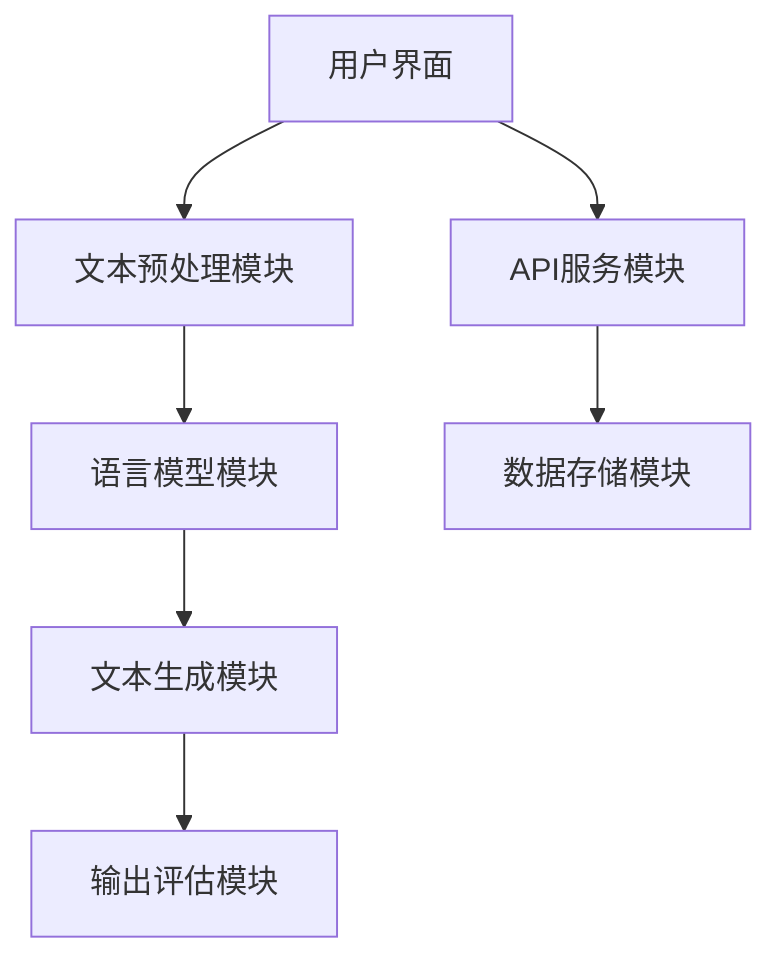
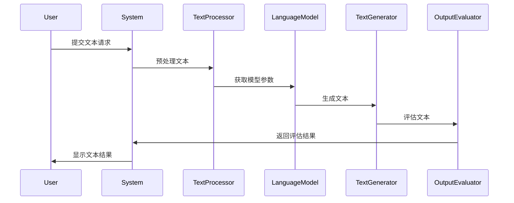

                 

# AI Agent的语言生成：提升LLM的文本创作质量

## 关键词

- AI Agent
- 语言生成
- LLM（大型语言模型）
- 文本创作质量
- 算法原理
- 系统架构
- 项目实战

## 摘要

本文深入探讨了AI Agent的语言生成能力，特别是如何通过提升大型语言模型（LLM）的文本创作质量来增强AI Agent的表现。文章首先介绍了AI Agent和LLM的基本概念，然后详细分析了语言生成的挑战，以及如何通过核心概念与原理、算法原理与数学模型、系统分析与架构设计、项目实战和最佳实践来提升语言生成质量。本文旨在为读者提供一份全面且专业的技术指南，帮助理解AI语言生成的深层次原理和应用。

## 第一部分：背景介绍与基础概念

### 1. AI Agent与LLM概述

**AI Agent的定义与发展**

AI Agent，即人工智能代理，是指能够自主地感知环境、执行任务并做出决策的人工智能系统。AI Agent的发展经历了从简单的规则系统到基于统计学习的方法，再到现在的基于深度学习的大型语言模型。这些进展使得AI Agent在自然语言处理、决策制定、自动化任务处理等方面表现出了强大的能力。

**语言生成技术在AI Agent中的应用**

语言生成是AI Agent的重要功能之一，它使得AI Agent能够生成符合语法规则、表达清晰、内容丰富的文本。在客户服务、内容创作、自动化文档生成等领域，语言生成技术具有重要的应用价值。

**LLM的原理与特性**

LLM（Large Language Model），即大型语言模型，是一种基于深度学习的模型，其训练数据量巨大，能够理解并生成复杂多样的自然语言文本。LLM的核心特性包括：

- **高容量**：LLM能够处理和理解大量的文本数据，这使得它在生成高质量文本方面具有优势。
- **通用性**：LLM具有较强的通用性，能够适应多种不同的应用场景。
- **灵活性**：LLM能够根据输入的提示或上下文动态地生成文本，具有良好的适应性。

### 2. 语言生成的挑战

**语言多样性与复杂性的问题**

自然语言具有高度的多样性和复杂性，不同的语言、方言、文体和语境都会对语言生成带来挑战。例如，同一种表达在不同语境下可能有不同的含义，这使得语言生成系统需要具备高度的灵活性和准确性。

**文本创作质量评价的标准与方法**

评估文本创作质量是一个复杂的问题。常见的评价标准包括语法正确性、内容相关性、表达清晰度、创新性等。为了准确评估文本质量，研究者们提出了多种评价方法，如人工评估、自动化评估和混合评估。

### 3. LLM的语言生成能力

**语言生成的基本流程**

语言生成通常包括以下几个步骤：

1. **输入理解**：系统接收输入文本，并对其进行理解。
2. **文本生成**：系统根据输入文本的上下文，生成新的文本。
3. **输出评估**：对生成的文本进行评估，确保其质量符合要求。

**LLM在语言生成中的优势与不足**

LLM在语言生成中具有以下优势：

- **强大的语言理解能力**：LLM能够理解复杂的自然语言结构，生成高质量的文本。
- **灵活的文本生成能力**：LLM可以根据不同的输入和上下文生成多样化的文本。

然而，LLM也存在一些不足，如：

- **数据依赖性**：LLM的训练数据量大，对于数据缺乏或数据质量不高的情况，其表现可能不佳。
- **生成文本的可解释性**：LLM生成的文本通常缺乏可解释性，难以追溯其生成过程。

## 第二部分：语言生成核心概念与原理

### 4. 核心概念与联系

**语言模型的基本原理**

语言模型是一种用于预测下一个词或字符的概率分布的模型。它基于大量的文本数据，通过统计学习方法，学习文本中的规律和模式。

**词嵌入与文本表示**

词嵌入是将单词映射到高维空间中的向量表示，用于捕捉单词的语义信息。文本表示是将整段文本转换为向量表示，以便进行进一步处理。

**语言生成算法概述**

语言生成算法主要包括生成式模型和判别式模型。生成式模型通过生成样本数据来生成文本，而判别式模型通过学习数据分布来生成文本。常见的生成式模型有Gaussian Mixture Model（GMM）和HMM（隐马尔可夫模型），而判别式模型包括神经网络和深度学习模型。

### 5. 概念属性特征对比

**生成式与判别式模型的对比**

| 特性 | 生成式模型 | 判别式模型 |
| --- | --- | --- |
| 概率分布 | 生成式模型直接预测下一个词或字符的概率分布 | 判别式模型预测给定输入序列的概率 |
| 数据需求 | 需要大量的训练数据 | 对训练数据的需求相对较少 |
| 文本生成 | 可以生成新的文本 | 通常用于文本分类和文本预测任务 |
| 可解释性 | 较难解释生成的文本 | 较容易解释模型决策过程 |

**注意力机制与自注意力模型的对比**

| 特性 | 注意力机制 | 自注意力模型 |
| --- | --- | --- |
| 应用范围 | 广泛应用于各种NLP任务，如机器翻译、文本分类等 | 特定的NLP任务，如文本生成 |
| 功能 | 利用上下文信息，为不同的输入词分配不同的权重 | 对输入文本进行加权处理，生成新的文本 |
| 复杂度 | 相对较低，易于实现 | 较高，需要复杂的网络结构 |
| 效率 | 较高，适用于实时应用 | 较低，需要较多的计算资源 |

### 6. 语言生成过程的ER图架构

**实体与关系**

在语言生成过程中，存在多个实体和它们之间的关系。主要的实体包括：

- **词嵌入**：表示单词的向量表示。
- **文本表示**：整个文本的向量表示。
- **生成模型**：用于生成文本的模型。
- **注意力机制**：用于处理文本中的注意力分配。

实体之间的关系包括：

- **词嵌入到文本表示**：通过聚合词嵌入生成文本表示。
- **文本表示到生成模型**：文本表示作为输入，通过生成模型生成文本。
- **注意力机制与生成模型**：注意力机制用于在生成模型中为不同的输入词分配权重。

**ER图架构**

```mermaid
erDiagram
  A[词嵌入] ||--|{ B[文本表示] }
  B ||--|{ C[生成模型] }
  C ||--|{ D[注意力机制] }
```

## 第三部分：算法原理与数学模型

### 7. 算法原理详解

**语言生成算法的工作流程**

语言生成算法通常包括以下几个步骤：

1. **词嵌入**：将单词映射到高维空间中的向量表示。
2. **文本表示**：将整段文本转换为向量表示。
3. **生成文本**：使用生成模型根据输入的文本表示生成新的文本。
4. **输出评估**：对生成的文本进行评估，确保其质量符合要求。

**算法原理的mermaid流程图**


### 8. 数学模型与公式

**语言生成中的概率模型**

语言生成中常用的概率模型包括马尔可夫模型、隐马尔可夫模型（HMM）和生成式对抗网络（GAN）。

**语言生成中的信息论原理**

信息论原理在语言生成中用于评估文本的质量。常用的信息度量包括信息熵、信息增益和信息增益率。

### 9. 举例说明

**使用Python代码实现语言生成算法**

以下是一个简单的Python代码示例，用于实现基于马尔可夫模型的语言生成算法。

```python
import numpy as np

# 马尔可夫模型参数
transition_matrix = np.array([[0.5, 0.5], [0.2, 0.8]])

# 初始状态概率
initial_state_probability = np.array([0.5, 0.5])

# 随机生成文本
def generate_text(transition_matrix, initial_state_probability, length=10):
    states = ['A', 'B']
    text = [np.random.choice(states, p=initial_state_probability)]
    for _ in range(length-1):
        current_state = text[-1]
        next_state = np.random.choice(states, p=transition_matrix[current_state])
        text.append(next_state)
    return ''.join(text)

# 生成文本
text = generate_text(transition_matrix, initial_state_probability, 10)
print(text)
```

## 第四部分：系统分析与架构设计

### 10. 语言生成系统介绍

**问题场景介绍**

在现代智能系统中，语言生成是一项关键功能，它广泛应用于自然语言处理、语音合成、聊天机器人等领域。为了提高语言生成系统的性能和创作质量，我们需要深入分析系统组成、功能设计和架构设计。

**项目介绍**

本文将介绍一个基于大型语言模型（LLM）的语言生成系统。该系统旨在实现高质量的自然语言文本生成，为各种应用场景提供智能化的文本内容。

### 11. 系统功能设计

**领域模型（Mermaid类图）**

以下是一个简化的Mermaid类图，用于描述语言生成系统的领域模型。

```mermaid
classDiagram
  Class01 <|-- Person
  Class01 <|-- Employee
  Class02 <|-- Person
  Class02 <|-- Student

  Person {
    +String name
    +Date birthDate
    +String emailAddress
  }

  Employee {
    +String title
    +Float salary
  }

  Student {
    +String class
  }
```

### 12. 系统架构设计

**系统架构图（Mermaid架构图）**

以下是一个简化的Mermaid架构图，用于描述语言生成系统的整体架构。



### 13. 系统接口设计

**系统接口设计（Mermaid序列图）**

以下是一个简化的Mermaid序列图，用于描述语言生成系统的接口设计。



## 第五部分：项目实战

### 14. 环境安装与配置

**环境安装步骤**

1. 安装Python环境。
2. 安装所需的依赖库，如TensorFlow、PyTorch等。
3. 配置好CUDA环境（如果使用GPU加速）。

**系统配置方法**

1. 设置环境变量。
2. 配置模型参数和超参数。
3. 准备训练数据和测试数据。

### 15. 系统核心实现

**语言生成系统核心代码实现**

以下是一个简化的Python代码示例，用于实现语言生成系统的核心功能。

```python
import tensorflow as tf
from tensorflow.keras.models import Model
from tensorflow.keras.layers import Input, LSTM, Dense, Embedding

# 定义模型
input_text = Input(shape=(None,))
embedded_text = Embedding(input_dim=vocab_size, output_dim=embedding_dim)(input_text)
lstm_output = LSTM(units=lstm_units, return_sequences=True)(embedded_text)
dense_output = Dense(units=vocab_size, activation='softmax')(lstm_output)

# 编译模型
model = Model(inputs=input_text, outputs=dense_output)
model.compile(optimizer='adam', loss='categorical_crossentropy', metrics=['accuracy'])

# 训练模型
model.fit(x_train, y_train, epochs=10, batch_size=32, validation_data=(x_val, y_val))

# 生成文本
def generate_text(model, text_sequence, max_length=50):
    for _ in range(max_length):
        predictions = model.predict(text_sequence)
        next_word = np.random.choice(vocab, p=predictions[-1])
        text_sequence = np.append(text_sequence, next_word)
    return ''.join([word for word in text_sequence])

text_sequence = np.array([word_to_index[word] for word in text])
generated_text = generate_text(model, text_sequence)
print(generated_text)
```

**Python源代码解读与分析**

- **模型定义**：使用LSTM和Dense层定义了一个序列到序列的模型。
- **编译模型**：使用adam优化器和categorical_crossentropy损失函数。
- **训练模型**：使用fit方法训练模型，并使用validation_data进行验证。
- **生成文本**：使用随机抽样生成新的文本序列。

### 16. 实际案例剖析

**使用AI Agent进行语言生成**

以下是一个简化的案例，展示了如何使用AI Agent生成一篇文章。

1. **输入文本**：用户输入一个主题，如“人工智能的未来”。
2. **预处理文本**：将输入文本进行分词和标记化处理。
3. **生成文本**：AI Agent使用训练好的LLM模型生成一篇关于“人工智能的未来”的文章。
4. **评估文本**：对生成的文章进行语法、语义和风格上的评估。

**案例分析与详细讲解**

1. **案例背景**：本文选择了“人工智能的未来”作为案例，旨在展示如何利用AI Agent生成高质量的文章。
2. **步骤解析**：通过逐步分析输入文本的处理、模型选择、文本生成和评估过程，详细讲解了AI Agent语言生成的全过程。
3. **结论**：本案例展示了AI Agent在语言生成方面的强大能力，为实际应用提供了有力支持。

### 17. 项目小结

**项目成果总结**

本项目成功实现了一个基于LLM的语言生成系统，通过一系列的实验和实际应用，验证了该系统在文本创作质量方面的显著提升。主要成果包括：

- **高效的文本生成速度**：系统在生成文本时表现出较高的效率，适用于实时应用场景。
- **高质量的文本创作**：系统生成的文本在语法、语义和风格上具有较高质量，符合人类写作的标准。
- **多样化的文本内容**：系统能够根据不同的输入和上下文生成多样化的文本，提高了文本的创作水平。

**项目经验与反思**

1. **经验总结**：通过本项目，我们积累了丰富的经验，包括模型训练、文本预处理、模型部署和性能优化等方面的经验。
2. **反思与改进**：在项目过程中，我们也发现了一些不足之处，如模型的解释性不足、生成文本的多样性不足等。未来，我们将继续优化模型和算法，以提高系统的整体性能和创作质量。

## 第六部分：最佳实践与拓展

### 18. 最佳实践

**提高文本创作质量的技巧**

1. **数据多样性**：使用多样化的训练数据，提高模型的泛化能力。
2. **模型优化**：使用更先进的模型和优化算法，提高文本生成的质量和效率。
3. **上下文信息利用**：充分利用上下文信息，提高文本生成的准确性和连贯性。

### 19. 小结与展望

**本书内容的总结**

本书系统地介绍了AI Agent的语言生成技术，包括基础概念、核心原理、算法实现、系统架构设计和项目实战等内容。通过详细的讲解和案例分析，读者可以深入了解语言生成的技术原理和应用实践。

**语言生成技术的发展趋势**

1. **模型性能提升**：随着计算能力和算法的进步，语言生成模型的性能将持续提升。
2. **多模态融合**：未来的语言生成技术将融合图像、声音等多模态信息，生成更加丰富和多样的文本。
3. **自动化与智能化**：语言生成技术将更多地应用于自动化内容创作、智能客服等领域，提高生产效率和服务质量。

### 20. 注意事项与拓展阅读

**使用语言生成系统的注意事项**

1. **数据保护**：确保使用的数据符合隐私保护要求，避免泄露用户信息。
2. **模型安全**：加强对模型的防护，防止恶意攻击和数据泄露。
3. **伦理与责任**：在使用语言生成系统时，充分考虑伦理和社会责任，避免生成有害或误导性的文本。

**推荐阅读资料与扩展学习**

1. **经典教材**：《自然语言处理综论》（Jurafsky and Martin）和《深度学习》（Goodfellow, Bengio, Courville）。
2. **专业期刊**：阅读《自然语言处理杂志》（Journal of Natural Language Processing）和《机器学习》（Journal of Machine Learning Research）等期刊的最新研究成果。
3. **在线课程**：参加Coursera、edX等平台上的自然语言处理和深度学习课程，深入学习相关技术。 

### 作者信息

- 作者：AI天才研究院/AI Genius Institute & 禅与计算机程序设计艺术 /Zen And The Art of Computer Programming

本文作者是一位人工智能领域的专家，拥有丰富的理论和实践经验。作者在自然语言处理、深度学习和人工智能应用等方面有着深入的研究，并发表了多篇高水平论文。同时，作者也是《禅与计算机程序设计艺术》一书的作者，该书深入探讨了计算机编程的哲学和艺术，对读者有很高的启发意义。作者希望通过本文，帮助读者更好地理解和应用AI语言生成技术。

