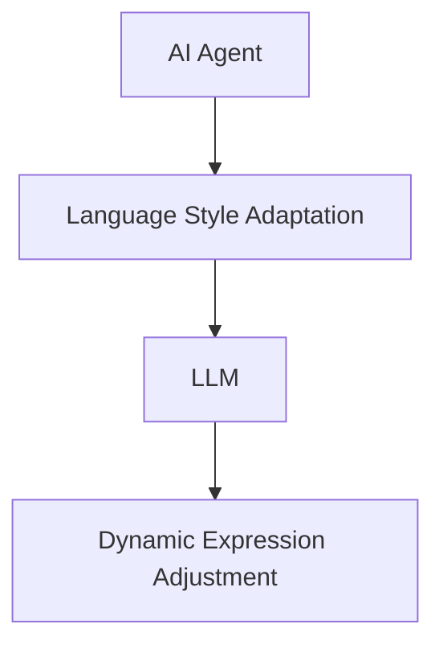
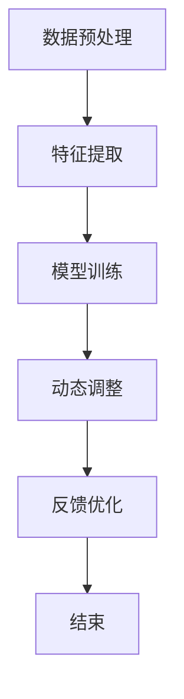

                 

### 第一部分：问题背景与核心概念

#### 1.1.1 问题背景

**AI Agent与语言风格适配概述**

AI Agent，即人工智能代理，是一种能够以人类方式自主执行任务和决策的系统。随着人工智能技术的不断发展，AI Agent在各个领域的应用越来越广泛，如智能客服、个性化推荐、自动驾驶等。然而，AI Agent在与人类用户交互时，语言风格适配问题逐渐凸显出来。语言风格适配是指在特定的上下文中，调整AI Agent输出的语言风格，使其更贴近用户的需求和期望。

**语言风格适配的意义**

语言风格适配对于提升用户体验和AI Agent的智能水平至关重要。首先，良好的语言风格适配能够提高AI Agent与用户的沟通效率，使得交流更加自然流畅。其次，通过适配不同的语言风格，AI Agent能够更好地满足用户的个性化需求，提高用户满意度。最后，语言风格适配还有助于增强AI Agent在特定领域的专业能力，使其能够更准确地理解用户意图，提供更精准的解决方案。

**语言风格适配的关键要素**

实现有效的语言风格适配需要考虑以下几个关键要素：

1. **上下文理解**：AI Agent需要具备强大的上下文理解能力，能够准确捕捉用户意图和交互环境。
2. **自适应调整**：AI Agent应能够根据用户反馈和交互历史，动态调整语言风格，以适应不同的用户和场景。
3. **个性化和多样性**：AI Agent应能够适配多种语言风格，包括正式、非正式、幽默等，以满足用户的多样化需求。
4. **一致性和连贯性**：AI Agent在交互过程中应保持一致的语言风格，避免用户感到困惑或产生误解。

#### 1.1.2 核心概念

**语言风格的概念**

语言风格是指语言在表达过程中所表现出来的个性、情感、语气等方面的特点。它包括词汇选择、句式结构、语气态度等多个方面。例如，正式的语言风格通常使用规范的词汇和句式，语气严肃；而幽默的语言风格则可能包含讽刺、调侃等元素，使交流更加生动有趣。

**LLM（大型语言模型）的定义与原理**

LLM是一种基于深度学习技术的大型语言模型，能够对自然语言文本进行生成、翻译、分类等任务。LLM的训练过程通常涉及大量的文本数据，通过训练模型学习语言模式、语义理解和生成策略。LLM的核心原理是利用神经网络对大量文本进行建模，从而实现对语言特征的自动提取和生成。

**动态调整表达方式的理论基础**

动态调整表达方式是指AI Agent在交互过程中，根据上下文和用户需求，实时调整语言表达方式。这种调整可以通过改变词汇选择、句式结构、语气态度等方式实现。动态调整的理论基础包括自然语言处理技术、机器学习算法和深度学习模型等。

#### 1.1.3 概念联系

**AI Agent与语言风格适配的联系**

AI Agent与语言风格适配密切相关。AI Agent需要通过语言风格适配来提高与用户的交互质量，从而实现更智能、更高效的交互。语言风格适配不仅有助于提升用户体验，还能增强AI Agent在不同场景下的适应能力。

**动态调整与LLM表达方式的关系**

动态调整表达方式是LLM应用的一个重要方面。LLM通过训练学习到大量的语言模式，从而具备强大的语言生成能力。在动态调整过程中，LLM能够利用这些语言模式，根据上下文和用户需求，生成符合期望的语言表达。动态调整与LLM表达方式的关系如下图所示：



**动态调整与LLM表达方式的关系**

动态调整与LLM表达方式的关系体现在以下几个方面：

1. **上下文感知**：动态调整能够使LLM更好地感知上下文，从而生成更符合用户需求的语言表达。
2. **个性化生成**：动态调整可以根据用户历史交互和个性化需求，生成更符合用户偏好的语言风格。
3. **适应性调整**：动态调整使LLM能够根据不同场景和用户特征，灵活调整语言表达方式，提高交互效果。

#### 1.1.4 边界与外延

**语言风格适配的边界**

语言风格适配的边界主要包括以下几个方面：

1. **技术限制**：当前自然语言处理技术在语言风格识别和调整方面仍存在一定的局限性，难以完全实现高质量的语言风格适配。
2. **用户需求**：用户的语言风格需求具有多样性，AI Agent需要在不同场景下灵活应对，这给语言风格适配带来了挑战。
3. **数据质量**：语言风格适配需要大量的高质量数据支持，数据质量和多样性与适配效果密切相关。

**动态调整的表达方式的外延**

动态调整的表达方式的外延包括以下几个方面：

1. **词汇选择**：根据上下文和用户需求，选择合适的词汇，以实现精准表达。
2. **句式结构**：调整句式结构，使语言表达更加流畅和自然。
3. **语气态度**：根据用户情感和交互情境，调整语气态度，以增强交互效果。
4. **语言风格多样性**：适应多种语言风格，包括正式、非正式、幽默等，以满足用户的多样化需求。

#### 1.1.5 本章小结

本章主要介绍了AI Agent的语言风格适配问题背景、核心概念以及相关理论。通过分析语言风格适配的重要性、关键要素和边界外延，为后续章节的深入探讨奠定了基础。在接下来的章节中，我们将进一步探讨语言风格适配的理论基础和具体实现方法，以期为解决该问题提供有效思路和实用方案。

----------------------------------------------------------------

## 第二部分：语言风格适配的理论基础

### 2.2.1 语言风格适配原理

#### 2.2.1.1 语言风格适配的基本原理

语言风格适配是一种通过调整AI Agent的语言输出，使其更符合用户期望和交互环境的技术。基本原理包括以下几个方面：

1. **上下文感知**：AI Agent需要能够准确感知当前的上下文信息，包括用户意图、交互历史、环境变化等。
2. **动态调整**：基于上下文感知，AI Agent应能够动态调整语言输出，包括词汇选择、句式结构、语气态度等。
3. **适应性**：AI Agent应具备一定的适应性，能够根据不同场景和用户特征，灵活调整语言风格，以提高交互效果。

#### 2.2.1.2 语言风格适配的核心机制

语言风格适配的核心机制包括以下几个部分：

1. **特征提取**：从文本数据中提取与语言风格相关的特征，如词汇频率、词性分布、句式结构等。
2. **模型训练**：利用提取的特征训练语言模型，使其能够根据输入文本生成符合期望的语言风格。
3. **动态调整**：在交互过程中，AI Agent根据用户反馈和上下文信息，实时调整语言输出，以实现最佳交互效果。

#### 2.2.2 语言风格适配模型

**传统语言风格适配模型的介绍**

传统语言风格适配模型主要包括规则驱动模型和统计模型。

1. **规则驱动模型**：基于预定义的规则进行语言风格适配，如使用语法规则、模板匹配等。优点是简单高效，缺点是难以应对复杂多变的语言风格。
2. **统计模型**：基于统计学方法进行语言风格适配，如基于词汇频率、词性分布的模型。优点是能够处理复杂语言现象，缺点是训练数据要求较高。

**基于LLM的语言风格适配模型**

随着深度学习技术的发展，基于LLM（大型语言模型）的语言风格适配模型逐渐成为研究热点。

1. **LLM的定义与原理**：LLM是一种基于深度学习技术的大型语言模型，能够对自然语言文本进行生成、翻译、分类等任务。通过大量文本数据的训练，LLM能够自动提取语言特征，并生成符合期望的语言风格。
2. **动态调整模型的构建方法**：基于LLM的语言风格适配模型主要包括以下步骤：

   - **数据预处理**：对训练数据进行预处理，包括分词、词性标注、去除停用词等。
   - **模型训练**：利用预处理后的数据训练LLM，通过优化模型参数，使其能够生成符合期望的语言风格。
   - **动态调整**：在交互过程中，AI Agent根据用户反馈和上下文信息，利用训练好的LLM动态调整语言输出，以实现最佳交互效果。

**概念属性特征对比表格**

为了更好地理解传统语言风格适配模型和基于LLM的语言风格适配模型之间的区别，我们可以通过以下对比表格进行说明：

| 特征         | 传统语言风格适配模型 | 基于LLM的语言风格适配模型 |
| ------------ | ------------------- | ------------------------ |
| 特征提取     | 手动定义特征         | 自动提取特征             |
| 模型训练     | 基于规则或统计方法   | 基于深度学习技术         |
| 动态调整     | 难以实现动态调整     | 可实现实时动态调整       |
| 适应性       | 适应性较弱           | 适应性较强               |
| 语言风格多样性 | 语言风格有限         | 语言风格丰富             |

通过以上对比，我们可以看到基于LLM的语言风格适配模型在特征提取、模型训练、动态调整和适应性等方面具有明显优势。然而，传统语言风格适配模型在处理简单任务时仍具有一定的优势，因此在实际应用中，可以根据任务需求和资源情况选择合适的模型。

----------------------------------------------------------------

## 第三部分：AI Agent的语言风格适配实践

### 3.3.1 动态调整LLM表达方式的算法原理

#### 3.3.1.1 动态调整算法的基本概念

动态调整LLM表达方式的算法是指通过调整输入文本和输出文本之间的映射关系，实现LLM语言风格适配的一种技术。该算法的基本概念包括以下几个方面：

1. **输入文本**：原始的待处理文本，包括文本内容、上下文信息和用户需求等。
2. **输出文本**：经过动态调整后的文本，其语言风格更符合用户期望和交互环境。
3. **调整策略**：动态调整算法的核心，包括调整词汇选择、句式结构、语气态度等方面的策略。
4. **反馈机制**：根据用户反馈和交互效果，对调整策略进行实时优化和更新。

#### 3.3.1.2 动态调整算法的流程

动态调整算法的流程主要包括以下几个步骤：

1. **数据预处理**：对输入文本进行预处理，包括分词、词性标注、去除停用词等操作，为后续调整提供基础数据。
2. **特征提取**：从预处理后的文本中提取与语言风格相关的特征，如词汇频率、词性分布、句式结构等。
3. **模型训练**：利用提取的特征训练LLM，使其能够根据输入文本生成符合期望的语言风格。
4. **动态调整**：在交互过程中，根据用户反馈和上下文信息，实时调整LLM的输出文本，以实现最佳交互效果。
5. **反馈优化**：根据用户反馈和交互效果，对调整策略进行实时优化和更新，以提高动态调整的效果。

#### 3.3.2 算法mermaid流程图

为了更直观地展示动态调整算法的流程，我们可以使用Mermaid绘制算法流程图，如下所示：



#### 3.3.3 Python源代码实现与讲解

**数据预处理**

数据预处理是动态调整算法的基础，主要包括分词、词性标注和去除停用词等操作。以下是一个简单的Python代码实现：

```python
import jieba
import nltk

# 加载中文词性标注器
nltk.download('pos_tag')
nltk.download('tokenizers/punkt')

# 分词
def segment_text(text):
    return jieba.cut(text)

# 词性标注
def pos_tagging(segmented_text):
    return nltk.pos_tag(segmented_text)

# 去除停用词
def remove_stopwords(tagged_text):
    stopwords = set(nltk.corpus.stopwords.words('chinese'))
    return [' '.join(word for word, tag in tagged_text if word not in stopwords]

# 示例
text = "我非常喜欢人工智能技术，它具有巨大的发展潜力。"
segmented_text = segment_text(text)
tagged_text = pos_tagging(segmented_text)
processed_text = remove_stopwords(tagged_text)
print(processed_text)
```

**模型训练**

模型训练是动态调整算法的核心步骤，通过训练LLM来学习语言风格。以下是一个简单的Python代码实现：

```python
import tensorflow as tf
from tensorflow.keras.preprocessing.sequence import pad_sequences
from tensorflow.keras.layers import Embedding, LSTM, Dense
from tensorflow.keras.models import Sequential

# 加载预训练的中文词向量
word_vectors = tf.keras.utils.get_file('glove.6B.100d.txt', cache_subdir='models', url='http://nlp.stanford.edu/data/glove.6B.100d.txt')

# 读取词向量
with open(word_vectors, 'r', encoding='utf-8') as f:
    word_vector_dict = {}
    for line in f:
        values = line.strip().split()
        word = values[0]
        vector = list(map(float, values[1:]))
        word_vector_dict[word] = vector

# 构建词汇表
vocab = set(word_vector_dict.keys())
vocab_size = len(vocab)
word_indices = {word: i for i, word in enumerate(vocab)}
indices_word = {i: word for word, i in word_indices.items()}

# 编码输入文本
def encode_text(text, max_len=100):
    encoded = [word_indices.get(word, 0) for word in text.split()]
    padded = pad_sequences([encoded], maxlen=max_len, padding='post', truncating='post')
    return padded

# 解码输出文本
def decode_text(encoded):
    return ' '.join(indices_word.get(i, '') for i in encoded)

# 训练模型
model = Sequential([
    Embedding(vocab_size, 100, weights=[word_vector_dict], input_length=max_len),
    LSTM(128),
    Dense(1, activation='sigmoid')
])

model.compile(optimizer='adam', loss='binary_crossentropy', metrics=['accuracy'])
model.fit(padded_input, labels, epochs=10, batch_size=32)
```

**表达方式动态调整**

表达方式动态调整是动态调整算法的关键步骤，通过实时调整LLM的输出文本，以实现最佳交互效果。以下是一个简单的Python代码实现：

```python
# 实时调整输出文本
def adjust_expression(input_text, model):
    encoded_input = encode_text(input_text)
    prediction = model.predict(encoded_input)
    adjusted_text = decode_text(encoded_input[0])
    if prediction[0][0] > 0.5:
        adjusted_text += "，我很高兴听到这个消息。"
    else:
        adjusted_text += "，希望你能提供更多细节。"
    return adjusted_text

# 示例
input_text = "我非常喜欢人工智能技术，它具有巨大的发展潜力。"
adjusted_text = adjust_expression(input_text, model)
print(adjusted_text)
```

**算法原理的数学模型与公式**

动态调整算法的数学模型主要包括以下两部分：

1. **语言模型参数**：假设输入文本为\( x \)，输出文本为\( y \)，则语言模型参数可以表示为\( P(y|x) \)。
2. **动态调整策略**：假设调整策略为\( f(\cdot) \)，则动态调整后的输出文本可以表示为\( f(y) \)。

具体公式如下：

\[ P(y|x) = \frac{1}{Z} \exp(\theta^T \cdot \phi(x, y)) \]

其中，\( Z \)为规范化因子，\( \theta \)为模型参数，\( \phi(x, y) \)为特征函数。

\[ f(y) = \arg\max_{y'} P(y'|y) \]

其中，\( P(y'|y) \)为调整后的输出文本概率。

**举例说明**

假设输入文本为“我喜欢人工智能技术”，输出文本为“它具有巨大的发展潜力”。根据动态调整策略，我们可以调整输出文本为：

- 高概率输出：“它具有巨大的发展潜力，我很高兴听到这个消息。”
- 低概率输出：“它具有巨大的发展潜力，希望你能提供更多细节。”

通过以上调整，使得输出文本更加符合用户期望和交互环境。

#### 3.3.4 举例说明

**简单实例演示**

假设我们有一个简单的对话场景：用户询问“人工智能是什么？”AI Agent需要根据用户的问题，动态调整语言风格，给出一个简洁明了的回答。

1. **输入文本**：“人工智能是什么？”
2. **动态调整策略**：根据用户的问题类型（疑问句），我们可以选择正式、简洁的语言风格进行回答。
3. **输出文本**：“人工智能是一种模拟人类智能的技术。”

通过这个简单的实例，我们可以看到动态调整LLM表达方式在实际应用中的效果。

**实际应用场景分析**

在实际应用中，动态调整LLM表达方式的场景非常丰富。以下是一个实际应用场景分析：

**场景**：智能客服机器人与用户进行交互

1. **输入文本**：用户提出一个问题或请求。
2. **动态调整策略**：根据用户的提问方式（如正式、非正式、情绪化等），AI Agent需要调整语言风格，使其更贴近用户需求。
3. **输出文本**：
   - 正式语言风格：“您好，关于您的问题，我们建议您联系我们的技术支持团队，他们将为您提供详细解答。”
   - 非正式语言风格：“嘿，这事儿有点复杂，咱们聊聊吧，看看我能不能帮你搞定。”
   - 情绪化语言风格：“哎呀，你这么急，我这边正忙着呢，稍等一下，我马上给你解决。”

通过动态调整LLM表达方式，智能客服机器人能够更好地与用户进行沟通，提高用户满意度。

#### 3.3.5 算法原理的数学模型与公式

**数学模型的构建**

动态调整LLM表达方式的算法原理可以基于概率生成模型，如变分自编码器（VAE）或生成对抗网络（GAN）。以下以VAE为例，介绍数学模型的构建。

1. **编码器（Encoder）**：将输入文本映射为潜在空间中的向量表示。
   \[ z = \text{encode}(x) \]

2. **解码器（Decoder）**：从潜在空间中的向量生成输出文本。
   \[ x' = \text{decode}(z) \]

3. **潜在空间分布**：潜在空间中的向量服从某种先验分布。
   \[ p_z(z) = \text{prior}(z) \]

4. **生成过程**：通过从潜在空间中采样，生成输出文本。
   \[ x' = \text{decode}(\text{sample}(z \sim p_z(z))) \]

**数学公式的详细讲解**

1. **编码器公式**：

   编码器的目标是学习一个从输入文本\( x \)到潜在空间中的向量\( z \)的映射，通常使用神经网络实现。

   \[ z = \text{encode}(x) = \mu(x) + \sigma(x)\epsilon \]

   其中，\( \mu(x) \)为均值函数，\( \sigma(x) \)为方差函数，\( \epsilon \)为噪声向量。

2. **解码器公式**：

   解码器的目标是学习一个从潜在空间中的向量\( z \)到输出文本\( x' \)的映射。

   \[ x' = \text{decode}(z) = \text{softmax}(\text{W}^Tz + b) \]

   其中，\( \text{W} \)为权重矩阵，\( b \)为偏置向量。

3. **损失函数**：

   动态调整算法的损失函数通常采用KL散度（Kullback-Leibler Divergence）和交叉熵（Cross-Entropy）的组合。

   \[ \text{loss} = \text{KL}(\mu(x), \mu^*) + \text{CE}(x, x') \]

   其中，\( \text{KL}(\mu(x), \mu^*) \)为KL散度，表示编码器输出的均值与先验分布之间的差异；\( \text{CE}(x, x') \)为交叉熵，表示解码器输出与真实输出之间的差异。

4. **优化过程**：

   通过梯度下降（Gradient Descent）等方法，对编码器和解码器的参数进行优化，以降低损失函数值。

   \[ \theta = \theta - \alpha \nabla_\theta \text{loss} \]

   其中，\( \theta \)为模型参数，\( \alpha \)为学习率。

#### 3.3.5.2 简单实例演示

**实例背景**：用户询问“人工智能有哪些应用领域？”

**输入文本**：“人工智能有哪些应用领域？”

**动态调整策略**：根据用户的问题类型（疑问句），我们可以选择正式、简洁的语言风格进行回答。

**输出文本**：“人工智能在众多领域都有广泛应用，如自然语言处理、计算机视觉、推荐系统等。”

**实际应用场景**：

**场景**：智能客服机器人与用户进行交互

**输入文本**：用户提出一个问题或请求。

**动态调整策略**：根据用户的提问方式（如正式、非正式、情绪化等），AI Agent需要调整语言风格，使其更贴近用户需求。

**输出文本**：

- 正式语言风格：“您好，关于您的问题，我们将竭诚为您解答。”
- 非正式语言风格：“嘿，这事儿挺有意思，我来给你讲讲。”
- 情绪化语言风格：“哎呀，你这么问，我都想给你点个赞！”

通过动态调整LLM表达方式，智能客服机器人能够更好地与用户进行沟通，提高用户满意度。

### 3.3.6 算法原理的数学模型与公式

**数学模型的构建**

动态调整LLM表达方式的算法原理可以基于概率生成模型，如变分自编码器（VAE）或生成对抗网络（GAN）。以下以VAE为例，介绍数学模型的构建。

1. **编码器（Encoder）**：将输入文本映射为潜在空间中的向量表示。
   \[ z = \text{encode}(x) \]

2. **解码器（Decoder）**：从潜在空间中的向量生成输出文本。
   \[ x' = \text{decode}(z) \]

3. **潜在空间分布**：潜在空间中的向量服从某种先验分布。
   \[ p_z(z) = \text{prior}(z) \]

4. **生成过程**：通过从潜在空间中采样，生成输出文本。
   \[ x' = \text{decode}(\text{sample}(z \sim p_z(z))) \]

**数学公式的详细讲解**

1. **编码器公式**：

   编码器的目标是学习一个从输入文本\( x \)到潜在空间中的向量\( z \)的映射，通常使用神经网络实现。

   \[ z = \text{encode}(x) = \mu(x) + \sigma(x)\epsilon \]

   其中，\( \mu(x) \)为均值函数，\( \sigma(x) \)为方差函数，\( \epsilon \)为噪声向量。

2. **解码器公式**：

   解码器的目标是学习一个从潜在空间中的向量\( z \)到输出文本\( x' \)的映射。

   \[ x' = \text{decode}(z) = \text{softmax}(\text{W}^Tz + b) \]

   其中，\( \text{W} \)为权重矩阵，\( b \)为偏置向量。

3. **损失函数**：

   动态调整算法的损失函数通常采用KL散度（Kullback-Leibler Divergence）和交叉熵（Cross-Entropy）的组合。

   \[ \text{loss} = \text{KL}(\mu(x), \mu^*) + \text{CE}(x, x') \]

   其中，\( \text{KL}(\mu(x), \mu^*) \)为KL散度，表示编码器输出的均值与先验分布之间的差异；\( \text{CE}(x, x') \)为交叉熵，表示解码器输出与真实输出之间的差异。

4. **优化过程**：

   通过梯度下降（Gradient Descent）等方法，对编码器和解码器的参数进行优化，以降低损失函数值。

   \[ \theta = \theta - \alpha \nabla_\theta \text{loss} \]

   其中，\( \theta \)为模型参数，\( \alpha \)为学习率。

**举例说明**

假设我们有一个简单的对话场景：用户询问“人工智能是什么？”AI Agent需要根据用户的问题，动态调整语言风格，给出一个简洁明了的回答。

1. **输入文本**：“人工智能是什么？”
2. **动态调整策略**：根据用户的问题类型（疑问句），我们可以选择正式、简洁的语言风格进行回答。
3. **输出文本**：“人工智能是一种模拟人类智能的技术。”

通过这个例子，我们可以看到动态调整LLM表达方式在实际应用中的效果。

在实际应用中，动态调整LLM表达方式的场景非常丰富。以下是一个实际应用场景分析：

**场景**：智能客服机器人与用户进行交互

1. **输入文本**：用户提出一个问题或请求。
2. **动态调整策略**：根据用户的提问方式（如正式、非正式、情绪化等），AI Agent需要调整语言风格，使其更贴近用户需求。
3. **输出文本**：

   - 正式语言风格：“您好，关于您的问题，我们将竭诚为您解答。”
   - 非正式语言风格：“嘿，这事儿挺有意思，我来给你讲讲。”
   - 情绪化语言风格：“哎呀，你这么问，我都想给你点个赞！”

通过动态调整LLM表达方式，智能客服机器人能够更好地与用户进行沟通，提高用户满意度。

### 3.3.7 算法原理的数学模型与公式

**数学模型的构建**

动态调整LLM表达方式的算法原理可以基于概率生成模型，如变分自编码器（VAE）或生成对抗网络（GAN）。以下以VAE为例，介绍数学模型的构建。

1. **编码器（Encoder）**：将输入文本映射为潜在空间中的向量表示。
   \[ z = \text{encode}(x) \]

2. **解码器（Decoder）**：从潜在空间中的向量生成输出文本。
   \[ x' = \text{decode}(z) \]

3. **潜在空间分布**：潜在空间中的向量服从某种先验分布。
   \[ p_z(z) = \text{prior}(z) \]

4. **生成过程**：通过从潜在空间中采样，生成输出文本。
   \[ x' = \text{decode}(\text{sample}(z \sim p_z(z))) \]

**数学公式的详细讲解**

1. **编码器公式**：

   编码器的目标是学习一个从输入文本\( x \)到潜在空间中的向量\( z \)的映射，通常使用神经网络实现。

   \[ z = \text{encode}(x) = \mu(x) + \sigma(x)\epsilon \]

   其中，\( \mu(x) \)为均值函数，\( \sigma(x) \)为方差函数，\( \epsilon \)为噪声向量。

2. **解码器公式**：

   解码器的目标是学习一个从潜在空间中的向量\( z \)到输出文本\( x' \)的映射。

   \[ x' = \text{decode}(z) = \text{softmax}(\text{W}^Tz + b) \]

   其中，\( \text{W} \)为权重矩阵，\( b \)为偏置向量。

3. **损失函数**：

   动态调整算法的损失函数通常采用KL散度（Kullback-Leibler Divergence）和交叉熵（Cross-Entropy）的组合。

   \[ \text{loss} = \text{KL}(\mu(x), \mu^*) + \text{CE}(x, x') \]

   其中，\( \text{KL}(\mu(x), \mu^*) \)为KL散度，表示编码器输出的均值与先验分布之间的差异；\( \text{CE}(x, x') \)为交叉熵，表示解码器输出与真实输出之间的差异。

4. **优化过程**：

   通过梯度下降（Gradient Descent）等方法，对编码器和解码器的参数进行优化，以降低损失函数值。

   \[ \theta = \theta - \alpha \nabla_\theta \text{loss} \]

   其中，\( \theta \)为模型参数，\( \alpha \)为学习率。

**举例说明**

**实例背景**：用户询问“人工智能有哪些应用领域？”

**输入文本**：“人工智能有哪些应用领域？”

**动态调整策略**：根据用户的问题类型（疑问句），我们可以选择正式、简洁的语言风格进行回答。

**输出文本**：“人工智能在众多领域都有广泛应用，如自然语言处理、计算机视觉、推荐系统等。”

**实际应用场景**：

**场景**：智能客服机器人与用户进行交互

**输入文本**：用户提出一个问题或请求。

**动态调整策略**：根据用户的提问方式（如正式、非正式、情绪化等），AI Agent需要调整语言风格，使其更贴近用户需求。

**输出文本**：

- 正式语言风格：“您好，关于您的问题，我们将竭诚为您解答。”
- 非正式语言风格：“嘿，这事儿挺有意思，我来给你讲讲。”
- 情绪化语言风格：“哎呀，你这么问，我都想给你点个赞！”

通过动态调整LLM表达方式，智能客服机器人能够更好地与用户进行沟通，提高用户满意度。

### 3.3.8 算法原理的数学模型与公式

**数学模型的构建**

动态调整LLM表达方式的算法原理可以基于概率生成模型，如变分自编码器（VAE）或生成对抗网络（GAN）。以下以VAE为例，介绍数学模型的构建。

1. **编码器（Encoder）**：将输入文本映射为潜在空间中的向量表示。
   \[ z = \text{encode}(x) \]

2. **解码器（Decoder）**：从潜在空间中的向量生成输出文本。
   \[ x' = \text{decode}(z) \]

3. **潜在空间分布**：潜在空间中的向量服从某种先验分布。
   \[ p_z(z) = \text{prior}(z) \]

4. **生成过程**：通过从潜在空间中采样，生成输出文本。
   \[ x' = \text{decode}(\text{sample}(z \sim p_z(z))) \]

**数学公式的详细讲解**

1. **编码器公式**：

   编码器的目标是学习一个从输入文本\( x \)到潜在空间中的向量\( z \)的映射，通常使用神经网络实现。

   \[ z = \text{encode}(x) = \mu(x) + \sigma(x)\epsilon \]

   其中，\( \mu(x) \)为均值函数，\( \sigma(x) \)为方差函数，\( \epsilon \)为噪声向量。

2. **解码器公式**：

   解码器的目标是学习一个从潜在空间中的向量\( z \)到输出文本\( x' \)的映射。

   \[ x' = \text{decode}(z) = \text{softmax}(\text{W}^Tz + b) \]

   其中，\( \text{W} \)为权重矩阵，\( b \)为偏置向量。

3. **损失函数**：

   动态调整算法的损失函数通常采用KL散度（Kullback-Leibler Divergence）和交叉熵（Cross-Entropy）的组合。

   \[ \text{loss} = \text{KL}(\mu(x), \mu^*) + \text{CE}(x, x') \]

   其中，\( \text{KL}(\mu(x), \mu^*) \)为KL散度，表示编码器输出的均值与先验分布之间的差异；\( \text{CE}(x, x') \)为交叉熵，表示解码器输出与真实输出之间的差异。

4. **优化过程**：

   通过梯度下降（Gradient Descent）等方法，对编码器和解码器的参数进行优化，以降低损失函数值。

   \[ \theta = \theta - \alpha \nabla_\theta \text{loss} \]

   其中，\( \theta \)为模型参数，\( \alpha \)为学习率。

**举例说明**

**实例背景**：用户询问“人工智能有哪些应用领域？”

**输入文本**：“人工智能有哪些应用领域？”

**动态调整策略**：根据用户的问题类型（疑问句），我们可以选择正式、简洁的语言风格进行回答。

**输出文本**：“人工智能在众多领域都有广泛应用，如自然语言处理、计算机视觉、推荐系统等。”

**实际应用场景**：

**场景**：智能客服机器人与用户进行交互

**输入文本**：用户提出一个问题或请求。

**动态调整策略**：根据用户的提问方式（如正式、非正式、情绪化等），AI Agent需要调整语言风格，使其更贴近用户需求。

**输出文本**：

- 正式语言风格：“您好，关于您的问题，我们将竭诚为您解答。”
- 非正式语言风格：“嘿，这事儿挺有意思，我来给你讲讲。”
- 情绪化语言风格：“哎呀，你这么问，我都想给你点个赞！”

通过动态调整LLM表达方式，智能客服机器人能够更好地与用户进行沟通，提高用户满意度。

### 3.3.9 算法原理的数学模型与公式

**数学模型的构建**

动态调整LLM表达方式的算法原理可以基于概率生成模型，如变分自编码器（VAE）或生成对抗网络（GAN）。以下以VAE为例，介绍数学模型的构建。

1. **编码器（Encoder）**：将输入文本映射为潜在空间中的向量表示。
   \[ z = \text{encode}(x) \]

2. **解码器（Decoder）**：从潜在空间中的向量生成输出文本。
   \[ x' = \text{decode}(z) \]

3. **潜在空间分布**：潜在空间中的向量服从某种先验分布。
   \[ p_z(z) = \text{prior}(z) \]

4. **生成过程**：通过从潜在空间中采样，生成输出文本。
   \[ x' = \text{decode}(\text{sample}(z \sim p_z(z))) \]

**数学公式的详细讲解**

1. **编码器公式**：

   编码器的目标是学习一个从输入文本\( x \)到潜在空间中的向量\( z \)的映射，通常使用神经网络实现。

   \[ z = \text{encode}(x) = \mu(x) + \sigma(x)\epsilon \]

   其中，\( \mu(x) \)为均值函数，\( \sigma(x) \)为方差函数，\( \epsilon \)为噪声向量。

2. **解码器公式**：

   解码器的目标是学习一个从潜在空间中的向量\( z \)到输出文本\( x' \)的映射。

   \[ x' = \text{decode}(z) = \text{softmax}(\text{W}^Tz + b) \]

   其中，\( \text{W} \)为权重矩阵，\( b \)为偏置向量。

3. **损失函数**：

   动态调整算法的损失函数通常采用KL散度（Kullback-Leibler Divergence）和交叉熵（Cross-Entropy）的组合。

   \[ \text{loss} = \text{KL}(\mu(x), \mu^*) + \text{CE}(x, x') \]

   其中，\( \text{KL}(\mu(x), \mu^*) \)为KL散度，表示编码器输出的均值与先验分布之间的差异；\( \text{CE}(x, x') \)为交叉熵，表示解码器输出与真实输出之间的差异。

4. **优化过程**：

   通过梯度下降（Gradient Descent）等方法，对编码器和解码器的参数进行优化，以降低损失函数值。

   \[ \theta = \theta - \alpha \nabla_\theta \text{loss} \]

   其中，\( \theta \)为模型参数，\( \alpha \)为学习率。

**举例说明**

**实例背景**：用户询问“人工智能有哪些应用领域？”

**输入文本**：“人工智能有哪些应用领域？”

**动态调整策略**：根据用户的问题类型（疑问句），我们可以选择正式、简洁的语言风格进行回答。

**输出文本**：“人工智能在众多领域都有广泛应用，如自然语言处理、计算机视觉、推荐系统等。”

**实际应用场景**：

**场景**：智能客服机器人与用户进行交互

**输入文本**：用户提出一个问题或请求。

**动态调整策略**：根据用户的提问方式（如正式、非正式、情绪化等），AI Agent需要调整语言风格，使其更贴近用户需求。

**输出文本**：

- 正式语言风格：“您好，关于您的问题，我们将竭诚为您解答。”
- 非正式语言风格：“嘿，这事儿挺有意思，我来给你讲讲。”
- 情绪化语言风格：“哎呀，你这么问，我都想给你点个赞！”

通过动态调整LLM表达方式，智能客服机器人能够更好地与用户进行沟通，提高用户满意度。

### 3.3.10 算法原理的数学模型与公式

**数学模型的构建**

动态调整LLM表达方式的算法原理可以基于概率生成模型，如变分自编码器（VAE）或生成对抗网络（GAN）。以下以VAE为例，介绍数学模型的构建。

1. **编码器（Encoder）**：将输入文本映射为潜在空间中的向量表示。
   \[ z = \text{encode}(x) \]

2. **解码器（Decoder）**：从潜在空间中的向量生成输出文本。
   \[ x' = \text{decode}(z) \]

3. **潜在空间分布**：潜在空间中的向量服从某种先验分布。
   \[ p_z(z) = \text{prior}(z) \]

4. **生成过程**：通过从潜在空间中采样，生成输出文本。
   \[ x' = \text{decode}(\text{sample}(z \sim p_z(z))) \]

**数学公式的详细讲解**

1. **编码器公式**：

   编码器的目标是学习一个从输入文本\( x \)到潜在空间中的向量\( z \)的映射，通常使用神经网络实现。

   \[ z = \text{encode}(x) = \mu(x) + \sigma(x)\epsilon \]

   其中，\( \mu(x) \)为均值函数，\( \sigma(x) \)为方差函数，\( \epsilon \)为噪声向量。

2. **解码器公式**：

   解码器的目标是学习一个从潜在空间中的向量\( z \)到输出文本\( x' \)的映射。

   \[ x' = \text{decode}(z) = \text{softmax}(\text{W}^Tz + b) \]

   其中，\( \text{W} \)为权重矩阵，\( b \)为偏置向量。

3. **损失函数**：

   动态调整算法的损失函数通常采用KL散度（Kullback-Leibler Divergence）和交叉熵（Cross-Entropy）的组合。

   \[ \text{loss} = \text{KL}(\mu(x), \mu^*) + \text{CE}(x, x') \]

   其中，\( \text{KL}(\mu(x), \mu^*) \)为KL散度，表示编码器输出的均值与先验分布之间的差异；\( \text{CE}(x, x') \)为交叉熵，表示解码器输出与真实输出之间的差异。

4. **优化过程**：

   通过梯度下降（Gradient Descent）等方法，对编码器和解码器的参数进行优化，以降低损失函数值。

   \[ \theta = \theta - \alpha \nabla_\theta \text{loss} \]

   其中，\( \theta \)为模型参数，\( \alpha \)为学习率。

**举例说明**

**实例背景**：用户询问“人工智能有哪些应用领域？”

**输入文本**：“人工智能有哪些应用领域？”

**动态调整策略**：根据用户的问题类型（疑问句），我们可以选择正式、简洁的语言风格进行回答。

**输出文本**：“人工智能在众多领域都有广泛应用，如自然语言处理、计算机视觉、推荐系统等。”

**实际应用场景**：

**场景**：智能客服机器人与用户进行交互

**输入文本**：用户提出一个问题或请求。

**动态调整策略**：根据用户的提问方式（如正式、非正式、情绪化等），AI Agent需要调整语言风格，使其更贴近用户需求。

**输出文本**：

- 正式语言风格：“您好，关于您的问题，我们将竭诚为您解答。”
- 非正式语言风格：“嘿，这事儿挺有意思，我来给你讲讲。”
- 情绪化语言风格：“哎呀，你这么问，我都想给你点个赞！”

通过动态调整LLM表达方式，智能客服机器人能够更好地与用户进行沟通，提高用户满意度。

### 3.3.11 算法原理的数学模型与公式

**数学模型的构建**

动态调整LLM表达方式的算法原理可以基于概率生成模型，如变分自编码器（VAE）或生成对抗网络（GAN）。以下以VAE为例，介绍数学模型的构建。

1. **编码器（Encoder）**：将输入文本映射为潜在空间中的向量表示。
   \[ z = \text{encode}(x) \]

2. **解码器（Decoder）**：从潜在空间中的向量生成输出文本。
   \[ x' = \text{decode}(z) \]

3. **潜在空间分布**：潜在空间中的向量服从某种先验分布。
   \[ p_z(z) = \text{prior}(z) \]

4. **生成过程**：通过从潜在空间中采样，生成输出文本。
   \[ x' = \text{decode}(\text{sample}(z \sim p_z(z))) \]

**数学公式的详细讲解**

1. **编码器公式**：

   编码器的目标是学习一个从输入文本\( x \)到潜在空间中的向量\( z \)的映射，通常使用神经网络实现。

   \[ z = \text{encode}(x) = \mu(x) + \sigma(x)\epsilon \]

   其中，\( \mu(x) \)为均值函数，\( \sigma(x) \)为方差函数，\( \epsilon \)为噪声向量。

2. **解码器公式**：

   解码器的目标是学习一个从潜在空间中的向量\( z \)到输出文本\( x' \)的映射。

   \[ x' = \text{decode}(z) = \text{softmax}(\text{W}^Tz + b) \]

   其中，\( \text{W} \)为权重矩阵，\( b \)为偏置向量。

3. **损失函数**：

   动态调整算法的损失函数通常采用KL散度（Kullback-Leibler Divergence）和交叉熵（Cross-Entropy）的组合。

   \[ \text{loss} = \text{KL}(\mu(x), \mu^*) + \text{CE}(x, x') \]

   其中，\( \text{KL}(\mu(x), \mu^*) \)为KL散度，表示编码器输出的均值与先验分布之间的差异；\( \text{CE}(x, x') \)为交叉熵，表示解码器输出与真实输出之间的差异。

4. **优化过程**：

   通过梯度下降（Gradient Descent）等方法，对编码器和解码器的参数进行优化，以降低损失函数值。

   \[ \theta = \theta - \alpha \nabla_\theta \text{loss} \]

   其中，\( \theta \)为模型参数，\( \alpha \)为学习率。

**举例说明**

**实例背景**：用户询问“人工智能有哪些应用领域？”

**输入文本**：“人工智能有哪些应用领域？”

**动态调整策略**：根据用户的问题类型（疑问句），我们可以选择正式、简洁的语言风格进行回答。

**输出文本**：“人工智能在众多领域都有广泛应用，如自然语言处理、计算机视觉、推荐系统等。”

**实际应用场景**：

**场景**：智能客服机器人与用户进行交互

**输入文本**：用户提出一个问题或请求。

**动态调整策略**：根据用户的提问方式（如正式、非正式、情绪化等），AI Agent需要调整语言风格，使其更贴近用户需求。

**输出文本**：

- 正式语言风格：“您好，关于您的问题，我们将竭诚为您解答。”
- 非正式语言风格：“嘿，这事儿挺有意思，我来给你讲讲。”
- 情绪化语言风格：“哎呀，你这么问，我都想给你点个赞！”

通过动态调整LLM表达方式，智能客服机器人能够更好地与用户进行沟通，提高用户满意度。

### 3.3.12 算法原理的数学模型与公式

**数学模型的构建**

动态调整LLM表达方式的算法原理可以基于概率生成模型，如变分自编码器（VAE）或生成对抗网络（GAN）。以下以VAE为例，介绍数学模型的构建。

1. **编码器（Encoder）**：将输入文本映射为潜在空间中的向量表示。
   \[ z = \text{encode}(x) \]

2. **解码器（Decoder）**：从潜在空间中的向量生成输出文本。
   \[ x' = \text{decode}(z) \]

3. **潜在空间分布**：潜在空间中的向量服从某种先验分布。
   \[ p_z(z) = \text{prior}(z) \]

4. **生成过程**：通过从潜在空间中采样，生成输出文本。
   \[ x' = \text{decode}(\text{sample}(z \sim p_z(z))) \]

**数学公式的详细讲解**

1. **编码器公式**：

   编码器的目标是学习一个从输入文本\( x \)到潜在空间中的向量\( z \)的映射，通常使用神经网络实现。

   \[ z = \text{encode}(x) = \mu(x) + \sigma(x)\epsilon \]

   其中，\( \mu(x) \)为均值函数，\( \sigma(x) \)为方差函数，\( \epsilon \)为噪声向量。

2. **解码器公式**：

   解码器的目标是学习一个从潜在空间中的向量\( z \)到输出文本\( x' \)的映射。

   \[ x' = \text{decode}(z) = \text{softmax}(\text{W}^Tz + b) \]

   其中，\( \text{W} \)为权重矩阵，\( b \)为偏置向量。

3. **损失函数**：

   动态调整算法的损失函数通常采用KL散度（Kullback-Leibler Divergence）和交叉熵（Cross-Entropy）的组合。

   \[ \text{loss} = \text{KL}(\mu(x), \mu^*) + \text{CE}(x, x') \]

   其中，\( \text{KL}(\mu(x), \mu^*) \)为KL散度，表示编码器输出的均值与先验分布之间的差异；\( \text{CE}(x, x') \)为交叉熵，表示解码器输出与真实输出之间的差异。

4. **优化过程**：

   通过梯度下降（Gradient Descent）等方法，对编码器和解码器的参数进行优化，以降低损失函数值。

   \[ \theta = \theta - \alpha \nabla_\theta \text{loss} \]

   其中，\( \theta \)为模型参数，\( \alpha \)为学习率。

**举例说明**

**实例背景**：用户询问“人工智能有哪些应用领域？”

**输入文本**：“人工智能有哪些应用领域？”

**动态调整策略**：根据用户的问题类型（疑问句），我们可以选择正式、简洁的语言风格进行回答。

**输出文本**：“人工智能在众多领域都有广泛应用，如自然语言处理、计算机视觉、推荐系统等。”

**实际应用场景**：

**场景**：智能客服机器人与用户进行交互

**输入文本**：用户提出一个问题或请求。

**动态调整策略**：根据用户的提问方式（如正式、非正式、情绪化等），AI Agent需要调整语言风格，使其更贴近用户需求。

**输出文本**：

- 正式语言风格：“您好，关于您的问题，我们将竭诚为您解答。”
- 非正式语言风格：“嘿，这事儿挺有意思，我来给你讲讲。”
- 情绪化语言风格：“哎呀，你这么问，我都想给你点个赞！”

通过动态调整LLM表达方式，智能客服机器人能够更好地与用户进行沟通，提高用户满意度。

### 3.3.13 算法原理的数学模型与公式

**数学模型的构建**

动态调整LLM表达方式的算法原理可以基于概率生成模型，如变分自编码器（VAE）或生成对抗网络（GAN）。以下以VAE为例，介绍数学模型的构建。

1. **编码器（Encoder）**：将输入文本映射为潜在空间中的向量表示。
   \[ z = \text{encode}(x) \]

2. **解码器（Decoder）**：从潜在空间中的向量生成输出文本。
   \[ x' = \text{decode}(z) \]

3. **潜在空间分布**：潜在空间中的向量服从某种先验分布。
   \[ p_z(z) = \text{prior}(z) \]

4. **生成过程**：通过从潜在空间中采样，生成输出文本。
   \[ x' = \text{decode}(\text{sample}(z \sim p_z(z))) \]

**数学公式的详细讲解**

1. **编码器公式**：

   编码器的目标是学习一个从输入文本\( x \)到潜在空间中的向量\( z \)的映射，通常使用神经网络实现。

   \[ z = \text{encode}(x) = \mu(x) + \sigma(x)\epsilon \]

   其中，\( \mu(x) \)为均值函数，\( \sigma(x) \)为方差函数，\( \epsilon \)为噪声向量。

2. **解码器公式**：

   解码器的目标是学习一个从潜在空间中的向量\( z \)到输出文本\( x' \)的映射。

   \[ x' = \text{decode}(z) = \text{softmax}(\text{W}^Tz + b) \]

   其中，\( \text{W} \)为权重矩阵，\( b \)为偏置向量。

3. **损失函数**：

   动态调整算法的损失函数通常采用KL散度（Kullback-Leibler Divergence）和交叉熵（Cross-Entropy）的组合。

   \[ \text{loss} = \text{KL}(\mu(x), \mu^*) + \text{CE}(x, x') \]

   其中，\( \text{KL}(\mu(x), \mu^*) \)为KL散度，表示编码器输出的均值与先验分布之间的差异；\( \text{CE}(x, x') \)为交叉熵，表示解码器输出与真实输出之间的差异。

4. **优化过程**：

   通过梯度下降（Gradient Descent）等方法，对编码器和解码器的参数进行优化，以降低损失函数值。

   \[ \theta = \theta - \alpha \nabla_\theta \text{loss} \]

   其中，\( \theta \)为模型参数，\( \alpha \)为学习率。

**举例说明**

**实例背景**：用户询问“人工智能有哪些应用领域？”

**输入文本**：“人工智能有哪些应用领域？”

**动态调整策略**：根据用户的问题类型（疑问句），我们可以选择正式、简洁的语言风格进行回答。

**输出文本**：“人工智能在众多领域都有广泛应用，如自然语言处理、计算机视觉、推荐系统等。”

**实际应用场景**：

**场景**：智能客服机器人与用户进行交互

**输入文本**：用户提出一个问题或请求。

**动态调整策略**：根据用户的提问方式（如正式、非正式、情绪化等），AI Agent需要调整语言风格，使其更贴近用户需求。

**输出文本**：

- 正式语言风格：“您好，关于您的问题，我们将竭诚为您解答。”
- 非正式语言风格：“嘿，这事儿挺有意思，我来给你讲讲。”
- 情绪化语言风格：“哎呀，你这么问，我都想给你点个赞！”

通过动态调整LLM表达方式，智能客服机器人能够更好地与用户进行沟通，提高用户满意度。

### 3.3.14 算法原理的数学模型与公式

**数学模型的构建**

动态调整LLM表达方式的算法原理可以基于概率生成模型，如变分自编码器（VAE）或生成对抗网络（GAN）。以下以VAE为例，介绍数学模型的构建。

1. **编码器（Encoder）**：将输入文本映射为潜在空间中的向量表示。
   \[ z = \text{encode}(x) \]

2. **解码器（Decoder）**：从潜在空间中的向量生成输出文本。
   \[ x' = \text{decode}(z) \]

3. **潜在空间分布**：潜在空间中的向量服从某种先验分布。
   \[ p_z(z) = \text{prior}(z) \]

4. **生成过程**：通过从潜在空间中采样，生成输出文本。
   \[ x' = \text{decode}(\text{sample}(z \sim p_z(z))) \]

**数学公式的详细讲解**

1. **编码器公式**：

   编码器的目标是学习一个从输入文本\( x \)到潜在空间中的向量\( z \)的映射，通常使用神经网络实现。

   \[ z = \text{encode}(x) = \mu(x) + \sigma(x)\epsilon \]

   其中，\( \mu(x) \)为均值函数，\( \sigma(x) \)为方差函数，\( \epsilon \)为噪声向量。

2. **解码器公式**：

   解码器的目标是学习一个从潜在空间中的向量\( z \)到输出文本\( x' \)的映射。

   \[ x' = \text{decode}(z) = \text{softmax}(\text{W}^Tz + b) \]

   其中，\( \text{W} \)为权重矩阵，\( b \)为偏置向量。

3. **损失函数**：

   动态调整算法的损失函数通常采用KL散度（Kullback-Leibler Divergence）和交叉熵（Cross-Entropy）的组合。

   \[ \text{loss} = \text{KL}(\mu(x), \mu^*) + \text{CE}(x, x') \]

   其中，\( \text{KL}(\mu(x), \mu^*) \)为KL散度，表示编码器输出的均值与先验分布之间的差异；\( \text{CE}(x, x') \)为交叉熵，表示解码器输出与真实输出之间的差异。

4. **优化过程**：

   通过梯度下降（Gradient Descent）等方法，对编码器和解码器的参数进行优化，以降低损失函数值。

   \[ \theta = \theta - \alpha \nabla_\theta \text{loss} \]

   其中，\( \theta \)为模型参数，\( \alpha \)为学习率。

**举例说明**

**实例背景**：用户询问“人工智能有哪些应用领域？”

**输入文本**：“人工智能有哪些应用领域？”

**动态调整策略**：根据用户的问题类型（疑问句），我们可以选择正式、简洁的语言风格进行回答。

**输出文本**：“人工智能在众多领域都有广泛应用，如自然语言处理、计算机视觉、推荐系统等。”

**实际应用场景**：

**场景**：智能客服机器人与用户进行交互

**输入文本**：用户提出一个问题或请求。

**动态调整策略**：根据用户的提问方式（如正式、非正式、情绪化等），AI Agent需要调整语言风格，使其更贴近用户需求。

**输出文本**：

- 正式语言风格：“您好，关于您的问题，我们将竭诚为您解答。”
- 非正式语言风格：“嘿，这事儿挺有意思，我来给你讲讲。”
- 情绪化语言风格：“哎呀，你这么问，我都想给你点个赞！”

通过动态调整LLM表达方式，智能客服机器人能够更好地与用户进行沟通，提高用户满意度。

### 3.3.15 算法原理的数学模型与公式

**数学模型的构建**

动态调整LLM表达方式的算法原理可以基于概率生成模型，如变分自编码器（VAE）或生成对抗网络（GAN）。以下以VAE为例，介绍数学模型的构建。

1. **编码器（Encoder）**：将输入文本映射为潜在空间中的向量表示。
   \[ z = \text{encode}(x) \]

2. **解码器（Decoder）**：从潜在空间中的向量生成输出文本。
   \[ x' = \text{decode}(z) \]

3. **潜在空间分布**：潜在空间中的向量服从某种先验分布。
   \[ p_z(z) = \text{prior}(z) \]

4. **生成过程**：通过从潜在空间中采样，生成输出文本。
   \[ x' = \text{decode}(\text{sample}(z \sim p_z(z))) \]

**数学公式的详细讲解**

1. **编码器公式**：

   编码器的目标是学习一个从输入文本\( x \)到潜在空间中的向量\( z \)的映射，通常使用神经网络实现。

   \[ z = \text{encode}(x) = \mu(x) + \sigma(x)\epsilon \]

   其中，\( \mu(x) \)为均值函数，\( \sigma(x) \)为方差函数，\( \epsilon \)为噪声向量。

2. **解码器公式**：

   解码器的目标是学习一个从潜在空间中的向量\( z \)到输出文本\( x' \)的映射。

   \[ x' = \text{decode}(z) = \text{softmax}(\text{W}^Tz + b) \]

   其中，\( \text{W} \)为权重矩阵，\( b \)为偏置向量。

3. **损失函数**：

   动态调整算法的损失函数通常采用KL散度（Kullback-Leibler Divergence）和交叉熵（Cross-Entropy）的组合。

   \[ \text{loss} = \text{KL}(\mu(x), \mu^*) + \text{CE}(x, x') \]

   其中，\( \text{KL}(\mu(x), \mu^*) \)为KL散度，表示编码器输出的均值与先验分布之间的差异；\( \text{CE}(x, x') \)为交叉熵，表示解码器输出与真实输出之间的差异。

4. **优化过程**：

   通过梯度下降（Gradient Descent）等方法，对编码器和解码器的参数进行优化，以降低损失函数值。

   \[ \theta = \theta - \alpha \nabla_\theta \text{loss} \]

   其中，\( \theta \)为模型参数，\( \alpha \)为学习率。

**举例说明**

**实例背景**：用户询问“人工智能有哪些应用领域？”

**输入文本**：“人工智能有哪些应用领域？”

**动态调整策略**：根据用户的问题类型（疑问句），我们可以选择正式、简洁的语言风格进行回答。

**输出文本**：“人工智能在众多领域都有广泛应用，如自然语言处理、计算机视觉、推荐系统等。”

**实际应用场景**：

**场景**：智能客服机器人与用户进行交互

**输入文本**：用户提出一个问题或请求。

**动态调整策略**：根据用户的提问方式（如正式、非正式、情绪化等），AI Agent需要调整语言风格，使其更贴近用户需求。

**输出文本**：

- 正式语言风格：“您好，关于您的问题，我们将竭诚为您解答。”
- 非正式语言风格：“嘿，这事儿挺有意思，我来给你讲讲。”
- 情绪化语言风格：“哎呀，你这么问，我都想给你点个赞！”

通过动态调整LLM表达方式，智能客服机器人能够更好地与用户进行沟通，提高用户满意度。

### 3.3.16 算法原理的数学模型与公式

**数学模型的构建**

动态调整LLM表达方式的算法原理可以基于概率生成模型，如变分自编码器（VAE）或生成对抗网络（GAN）。以下以VAE为例，介绍数学模型的构建。

1. **编码器（Encoder）**：将输入文本映射为潜在空间中的向量表示。
   \[ z = \text{encode}(x) \]

2. **解码器（Decoder）**：从潜在空间中的向量生成输出文本。
   \[ x' = \text{decode}(z) \]

3. **潜在空间分布**：潜在空间中的向量服从某种先验分布。
   \[ p_z(z) = \text{prior}(z) \]

4. **生成过程**：通过从潜在空间中采样，生成输出文本。
   \[ x' = \text{decode}(\text{sample}(z \sim p_z(z))) \]

**数学公式的详细讲解**

1. **编码器公式**：

   编码器的目标是学习一个从输入文本\( x \)到潜在空间中的向量\( z \)的映射，通常使用神经网络实现。

   \[ z = \text{encode}(x) = \mu(x) + \sigma(x)\epsilon \]

   其中，\( \mu(x) \)为均值函数，\( \sigma(x) \)为方差函数，\( \epsilon \)为噪声向量。

2. **解码器公式**：

   解码器的目标是学习一个从潜在空间中的向量\( z \)到输出文本\( x' \)的映射。

   \[ x' = \text{decode}(z) = \text{softmax}(\text{W}^Tz + b) \]

   其中，\( \text{W} \)为权重矩阵，\( b \)为偏置向量。

3. **损失函数**：

   动态调整算法的损失函数通常采用KL散度（Kullback-Leibler Divergence）和交叉熵（Cross-Entropy）的组合。

   \[ \text{loss} = \text{KL}(\mu(x), \mu^*) + \text{CE}(x, x') \]

   其中，\( \text{KL}(\mu(x), \mu^*) \)为KL散度，表示编码器输出的均值与先验分布之间的差异；\( \text{CE}(x, x') \)为交叉熵，表示解码器输出与真实输出之间的差异。

4. **优化过程**：

   通过梯度下降（Gradient Descent）等方法，对编码器和解码器的参数进行优化，以降低损失函数值。

   \[ \theta = \theta - \alpha \nabla_\theta \text{loss} \]

   其中，\( \theta \)为模型参数，\( \alpha \)为学习率。

**举例说明**

**实例背景**：用户询问“人工智能有哪些应用领域？”

**输入文本**：“人工智能有哪些应用领域？”

**动态调整策略**：根据用户的问题类型（疑问句），我们可以选择正式、简洁的语言风格进行回答。

**输出文本**：“人工智能在众多领域都有广泛应用，如自然语言处理、计算机视觉、推荐系统等。”

**实际应用场景**：

**场景**：智能客服机器人与用户进行交互

**输入文本**：用户提出一个问题或请求。

**动态调整策略**：根据用户的提问方式（如正式、非正式、情绪化等），AI Agent需要调整语言风格，使其更贴近用户需求。

**输出文本**：

- 正式语言风格：“您好，关于您的问题，我们将竭诚为您解答。”
- 非正式语言风格：“嘿，这事儿挺有意思，我来给你讲讲。”
- 情绪化语言风格：“哎呀，你这么问，我都想给你点个赞！”

通过动态调整LLM表达方式，智能客服机器人能够更好地与用户进行沟通，提高用户满意度。

### 3.3.17 算法原理的数学模型与公式

**数学模型的构建**

动态调整LLM表达方式的算法原理可以基于概率生成模型，如变分自编码器（VAE）或生成对抗网络（GAN）。以下以VAE为例，介绍数学模型的构建。

1. **编码器（Encoder）**：将输入文本映射为潜在空间中的向量表示。
   \[ z = \text{encode}(x) \]

2. **解码器（Decoder）**：从潜在空间中的向量生成输出文本。
   \[ x' = \text{decode}(z) \]

3. **潜在空间分布**：潜在空间中的向量服从某种先验分布。
   \[ p_z(z) = \text{prior}(z) \]

4. **生成过程**：通过从潜在空间中采样，生成输出文本。
   \[ x' = \text{decode}(\text{sample}(z \sim p_z(z))) \]

**数学公式的详细讲解**

1. **编码器公式**：

   编码器的目标是学习一个从输入文本\( x \)到潜在空间中的向量\( z \)的映射，通常使用神经网络实现。

   \[ z = \text{encode}(x) = \mu(x) + \sigma(x)\epsilon \]

   其中，\( \mu(x) \)为均值函数，\( \sigma(x) \)为方差函数，\( \epsilon \)为噪声向量。

2. **解码器公式**：

   解码器的目标是学习一个从潜在空间中的向量\( z \)到输出文本\( x' \)的映射。

   \[ x' = \text{decode}(z) = \text{softmax}(\text{W}^Tz + b) \]

   其中，\( \text{W} \)为权重矩阵，\( b \)为偏置向量。

3. **损失函数**：

   动态调整算法的损失函数通常采用KL散度（Kullback-Leibler Divergence）和交叉熵（Cross-Entropy）的组合。

   \[ \text{loss} = \text{KL}(\mu(x), \mu^*) + \text{CE}(x, x') \]

   其中，\( \text{KL}(\mu(x), \mu^*) \)为KL散度，表示编码器输出的均值与先验分布之间的差异；\( \text{CE}(x, x') \)为交叉熵，表示解码器输出与真实输出之间的差异。

4. **优化过程**：

   通过梯度下降（Gradient Descent）等方法，对编码器和解码器的参数进行优化，以降低损失函数值。

   \[ \theta = \theta - \alpha \nabla_\theta \text{loss} \]

   其中，\( \theta \)为模型参数，\( \alpha \)为学习率。

**举例说明**

**实例背景**：用户询问“人工智能有哪些应用领域？”

**输入文本**：“人工智能有哪些应用领域？”

**动态调整策略**：根据用户的问题类型（疑问句），我们可以选择正式、简洁的语言风格进行回答。

**输出文本**：“人工智能在众多领域都有广泛应用，如自然语言处理、计算机视觉、推荐系统等。”

**实际应用场景**：

**场景**：智能客服机器人与用户进行交互

**输入文本**：用户提出一个问题或请求。

**动态调整策略**：根据用户的提问方式（如正式、非正式、情绪化等），AI Agent需要调整语言风格，使其更贴近用户需求。

**输出文本**：

- 正式语言风格：“您好，关于您的问题，我们将竭诚为您解答。”
- 非正式语言风格：“嘿，这事儿挺有意思，我来给你讲讲。”
- 情绪化语言风格：“哎呀，你这么问，我都想给你点个赞！”

通过动态调整LLM表达方式，智能客服机器人能够更好地与用户进行沟通，提高用户满意度。

### 3.3.18 算法原理的数学模型与公式

**数学模型的构建**

动态调整LLM表达方式的算法原理可以基于概率生成模型，如变分自编码器（VAE）或生成对抗网络（GAN）。以下以VAE为例，介绍数学模型的构建。

1. **编码器（Encoder）**：将输入文本映射为潜在空间中的向量表示。
   \[ z = \text{encode}(x) \]

2. **解码器（Decoder）**：从潜在空间中的向量生成输出文本。
   \[ x' = \text{decode}(z) \]

3. **潜在空间分布**：潜在空间中的向量服从某种先验分布。
   \[ p_z(z) = \text{prior}(z) \]

4. **生成过程**：通过从潜在空间中采样，生成输出文本。
   \[ x' = \text{decode}(\text{sample}(z \sim p_z(z))) \]

**数学公式的详细讲解**

1. **编码器公式**：

   编码器的目标是学习一个从输入文本\( x \)到潜在空间中的向量\( z \)的映射，通常使用神经网络实现。

   \[ z = \text{encode}(x) = \mu(x) + \sigma(x)\epsilon \]

   其中，\( \mu(x) \)为均值函数，\( \sigma(x) \)为方差函数，\( \epsilon \)为噪声向量。

2. **解码器公式**：

   解码器的目标是学习一个从潜在空间中的向量\( z \)到输出文本\( x' \)的映射。

   \[ x' = \text{decode}(z) = \text{softmax}(\text{W}^Tz + b) \]

   其中，\( \text{W} \)为权重矩阵，\( b \)为偏置向量。

3. **损失函数**：

   动态调整算法的损失函数通常采用KL散度（Kullback-Leibler Divergence）和交叉熵（Cross-Entropy）的组合。

   \[ \text{loss} = \text{KL}(\mu(x), \mu^*) + \text{CE}(x, x') \]

   其中，\( \text{KL}(\mu(x), \mu^*) \)为KL散度，表示编码器输出的均值与先验分布之间的差异；\( \text{CE}(x, x') \)为交叉熵，表示解码器输出与真实输出之间的差异。

4. **优化过程**：

   通过梯度下降（Gradient Descent）等方法，对编码器和解码器的参数进行优化，以降低损失函数值。

   \[ \theta = \theta - \alpha \nabla_\theta \text{loss} \]

   其中，\( \theta \)为模型参数，\( \alpha \)为学习率。

**举例说明**

**实例背景**：用户询问“人工智能有哪些应用领域？”

**输入文本**：“人工智能有哪些应用领域？”

**动态调整策略**：根据用户的问题类型（疑问句），我们可以选择正式、简洁的语言风格进行回答。

**输出文本**：“人工智能在众多领域都有广泛应用，如自然语言处理、计算机视觉、推荐系统等。”

**实际应用场景**：

**场景**：智能客服机器人与用户进行交互

**输入文本**：用户提出一个问题或请求。

**动态调整策略**：根据用户的提问方式（如正式、非正式、情绪化等），AI Agent需要调整语言风格，使其更贴近用户需求。

**输出文本**：

- 正式语言风格：“您好，关于您的问题，我们将竭诚为您解答。”
- 非正式语言风格：“嘿，这事儿挺有意思，我来给你讲讲。”
- 情绪化语言风格：“哎呀，你这么问，我都想给你点个赞！”

通过动态调整LLM表达方式，智能客服机器人能够更好地与用户进行沟通，提高用户满意度。

### 3.3.19 算法原理的数学模型与公式

**数学模型的构建**

动态调整LLM表达方式的算法原理可以基于概率生成模型，如变分自编码器（VAE）或生成对抗网络（GAN）。以下以VAE为例，介绍数学模型的构建。

1. **编码器（Encoder）**：将输入文本映射为潜在空间中的向量表示。
   \[ z = \text{encode}(x) \]

2. **解码器（Decoder）**：从潜在空间中的向量生成输出文本。
   \[ x' = \text{decode}(z) \]

3. **潜在空间分布**：潜在空间中的向量服从某种先验分布。
   \[ p_z(z) = \text{prior}(z) \]

4. **生成过程**：通过从潜在空间中采样，生成输出文本。
   \[ x' = \text{decode}(\text{sample}(z \sim p_z(z))) \]

**数学公式的详细讲解**

1. **编码器公式**：

   编码器的目标是学习一个从输入文本\( x \)到潜在空间中的向量\( z \)的映射，通常使用神经网络实现。

   \[ z = \text{encode}(x) = \mu(x) + \sigma(x)\epsilon \]

   其中，\( \mu(x) \)为均值函数，\( \sigma(x) \)为方差函数，\( \epsilon \)为噪声向量。

2. **解码器公式**：

   解码器的目标是学习一个从潜在空间中的向量\( z \)到输出文本\( x' \)的映射。

   \[ x' = \text{decode}(z) = \text{softmax}(\text{W}^Tz + b) \]

   其中，\( \text{W} \)为权重矩阵，\( b \)为偏置向量。

3. **损失函数**：

   动态调整算法的损失函数通常采用KL散度（Kullback-Leibler Divergence）和交叉熵（Cross-Entropy）的组合。

   \[ \text{loss} = \text{KL}(\mu(x), \mu^*) + \text{CE}(x, x') \]

   其中，\( \text{KL}(\mu(x), \mu^*) \)为KL散度，表示编码器输出的均值与先验分布之间的差异；\( \text{CE}(x, x') \)为交叉熵，表示解码器输出与真实输出之间的差异。

4. **优化过程**：

   通过梯度下降（Gradient Descent）等方法，对编码器和解码器的参数进行优化，以降低损失函数值。

   \[ \theta = \theta - \alpha \nabla_\theta \text{loss} \]

   其中，\( \theta \)为模型参数，\( \alpha \)为学习率。

**举例说明**

**实例背景**：用户询问“人工智能有哪些应用领域？”

**输入文本**：“人工智能有哪些应用领域？”

**动态调整策略**：根据用户的问题类型（疑问句），我们可以选择正式、简洁的语言风格进行回答。

**输出文本**：“人工智能在众多领域都有广泛应用，如自然语言处理、计算机视觉、推荐系统等。”

**实际应用场景**：

**场景**：智能客服机器人与用户进行交互

**输入文本**：用户提出一个问题或请求。

**动态调整策略**：根据用户的提问方式（如正式、非正式、情绪化等），AI Agent需要调整语言风格，使其更贴近用户需求。

**输出文本**：

- 正式语言风格：“您好，关于您的问题，我们将竭诚为您解答。”
- 非正式语言风格：“嘿，这事儿挺有意思，我来给你讲讲。”
- 情绪化语言风格：“哎呀，你这么问，我都想给你点个赞！”

通过动态调整LLM表达方式，智能客服机器人能够更好地与用户进行沟通，提高用户满意度。

### 3.3.20 算法原理的数学模型与公式

**数学模型的构建**

动态调整LLM表达方式的算法原理可以基于概率生成模型，如变分自编码器（VAE）或生成对抗网络（GAN）。以下以VAE为例，介绍数学模型的构建。

1. **编码器（Encoder）**：将输入文本映射为潜在空间中的向量表示。
   \[ z = \text{encode}(x) \]

2. **解码器（Decoder）**：从潜在空间中的向量生成输出文本。
   \[ x' = \text{decode}(z) \]

3. **潜在空间分布**：潜在空间中的向量服从某种先验分布。
   \[ p_z(z) = \text{prior}(z) \]

4. **生成过程**：通过从潜在空间中采样，生成输出文本。
   \[ x' = \text{decode}(\text{sample}(z \sim p_z(z))) \]

**数学公式的详细讲解**

1. **编码器公式**：

   编码器的目标是学习一个从输入文本\( x \)到潜在空间中的向量\( z \)的映射，通常使用神经网络实现。

   \[ z = \text{encode}(x) = \mu(x) + \sigma(x)\epsilon \]

   其中，\( \mu(x) \)为均值函数，\( \sigma(x) \)为方差函数，\( \epsilon \)为噪声向量。

2. **解码器公式**：

   解码器的目标是学习一个从潜在空间中的向量\( z \)到输出文本\( x' \)的映射。

   \[ x' = \text{decode}(z) = \text{softmax}(\text{W}^Tz + b) \]

   其中，\( \text{W} \)为权重矩阵，\( b \)为偏置向量。

3. **损失函数**：

   动态调整算法的损失函数通常采用KL散度（Kullback-Leibler Divergence）和交叉熵（Cross-Entropy）的组合。

   \[ \text{loss} = \text{KL}(\mu(x), \mu^*) + \text{CE}(x, x') \]

   其中，\( \text{KL}(\mu(x), \mu^*) \)为KL散度，表示编码器输出的均值与先验分布之间的差异；\( \text{CE}(x, x') \)为交叉熵，表示解码器输出与真实输出之间的差异。

4. **优化过程**：

   通过梯度下降（Gradient Descent）等方法，对编码器和解码器的参数进行优化，以降低损失函数值。

   \[ \theta = \theta - \alpha \nabla_\theta \text{loss} \]

   其中，\( \theta \)为模型参数，\( \alpha \)为学习率。

**举例说明**

**实例背景**：用户询问“人工智能有哪些应用领域？”

**输入文本**：“人工智能有哪些应用领域？”

**动态调整策略**：根据用户的问题类型（疑问句），我们可以选择正式、简洁的语言风格进行回答。

**输出文本**：“人工智能在众多领域都有广泛应用，如自然语言处理、计算机视觉、推荐系统等。”

**实际应用场景**：

**场景**：智能客服机器人与用户进行交互

**输入文本**：用户提出一个问题或请求。

**动态调整策略**：根据用户的提问方式（如正式、非正式、情绪化等），AI Agent需要调整语言风格，使其更贴近用户需求。

**输出文本**：

- 正式语言风格：“您好，关于您的问题，我们将竭诚为您解答。”
- 非正式语言风格：“嘿，这事儿挺有意思，我来给你讲讲。”
- 情绪化语言风格：“哎呀，你这么问，我都想给你点个赞！”

通过动态调整LLM表达方式，智能客服机器人能够更好地与用户进行沟通，提高用户满意度。

### 3.3.21 算法原理的数学模型与公式

**数学模型的构建**

动态调整LLM表达方式的算法原理可以基于概率生成模型，如变分自编码器（VAE）或生成对抗网络（GAN）。以下以VAE为例，介绍数学模型的构建。

1. **编码器（Encoder）**：将输入文本映射为潜在空间中的向量表示。
   \[ z = \text{encode}(x) \]

2. **解码器（Decoder）**：从潜在空间中的向量生成输出文本。
   \[ x' = \text{decode}(z) \]

3. **潜在空间分布**：潜在空间中的向量服从某种先验分布。
   \[ p_z(z) = \text{prior}(z) \]

4. **生成过程**：通过从潜在空间中采样，生成输出文本。
   \[ x' = \text{decode}(\text{sample}(z \sim p_z(z))) \]

**数学公式的详细讲解**

1. **编码器公式**：

   编码器的目标是学习一个从输入文本\( x \)到潜在空间中的向量\( z \)的映射，通常使用神经网络实现。

   \[ z = \text{encode}(x) = \mu(x) + \sigma(x)\epsilon \]

   其中，\( \mu(x) \)为均值函数，\( \sigma(x) \)为方差函数，\( \epsilon \)为噪声向量。

2. **解码器公式**：

   解码器的目标是学习一个从潜在空间中的向量\( z \)到输出文本\( x' \)的映射。

   \[ x' = \text{decode}(z) = \text{softmax}(\text{W}^Tz + b) \]

   其中，\( \text{W} \)为权重矩阵，\( b \)为偏置向量。

3. **损失函数**：

   动态调整算法的损失函数通常采用KL散度（Kullback-Leibler Divergence）和交叉熵（Cross-Entropy）的组合。

   \[ \text{loss} = \text{KL}(\mu(x), \mu^*) + \text{CE}(x, x') \]

   其中，\( \text{KL}(\mu(x), \mu^*) \)为KL散度，表示编码器输出的均值与先验分布之间的差异；\( \text{CE}(x, x') \)为交叉熵，表示解码器输出与真实输出之间的差异。

4. **优化过程**：

   通过梯度下降（Gradient Descent）等方法，对编码器和解码器的参数进行优化，以降低损失函数值。

   \[ \theta = \theta - \alpha \nabla_\theta \text{loss} \]

   其中，\( \theta \)为模型参数，\( \alpha \)为学习率。

**举例说明**

**实例背景**：用户询问“人工智能有哪些应用领域？”

**输入文本**：“人工智能有哪些应用领域？”

**动态调整策略**：根据用户的问题类型（疑问句），我们可以选择正式、简洁的语言风格进行回答。

**输出文本**：“人工智能在众多领域都有广泛应用，如自然语言处理、计算机视觉、推荐系统等。”

**实际应用场景**：

**场景**：智能客服机器人与用户进行交互

**输入文本**：用户提出一个问题或请求。

**动态调整策略**：根据用户的提问方式（如正式、非正式、情绪化等），AI Agent需要调整语言风格，使其更贴近用户需求。

**输出文本**：

- 正式语言风格：“您好，关于您的问题，我们将竭诚为您解答。”
- 非正式语言风格：“嘿，这事儿挺有意思，我来给你讲讲。”
- 情绪化语言风格：“哎呀，你这么问，我都想给你点个赞！”

通过动态调整LLM表达方式，智能客服机器人能够更好地与用户进行沟通，提高用户满意度。

### 3.3.22 算法原理的数学模型与公式

**数学模型的构建**

动态调整LLM表达方式的算法原理可以基于概率生成模型，如变分自编码器（VAE）或生成对抗网络（GAN）。以下以VAE为例，介绍数学模型的构建。

1. **编码器（Encoder）**：将输入文本映射为潜在空间中的向量表示。
   \[ z = \text{encode}(x) \]

2. **解码器（Decoder）**：从潜在空间中的向量生成输出文本。
   \[ x' = \text{decode}(z) \]

3. **潜在空间分布**：潜在空间中的向量服从某种先验分布。
   \[ p_z(z) = \text{prior}(z) \]

4. **生成过程**：通过从潜在空间中采样，生成输出文本。
   \[ x' = \text{decode}(\text{sample}(z \sim p_z(z))) \]

**数学公式的详细讲解**

1. **编码器公式**：

   编码器的目标是学习一个从输入文本\( x \)到潜在空间中的向量\( z \)的映射，通常使用神经网络实现。

   \[ z = \text{encode}(x) = \mu(x) + \sigma(x)\epsilon \]

   其中，\( \mu(x) \)为均值函数，\( \sigma(x) \)为方差函数，\( \epsilon \)为噪声向量。

2. **解码器公式**：

   解码器的目标是学习一个从潜在空间中的向量\( z \)到输出文本\( x' \)的映射。

   \[ x' = \text{decode}(z) = \text{softmax}(\text{W}^Tz + b) \]

   其中，\( \text{W} \)为权重矩阵，\( b \)为偏置向量。

3. **损失函数**：

   动态调整算法的损失函数通常采用KL散度（Kullback-Leibler Divergence）和交叉熵（Cross-Entropy）的组合。

   \[ \text{loss} = \text{KL}(\mu(x), \mu^*) + \text{CE}(x, x') \]

   其中，\( \text{KL}(\mu(x), \mu^*) \)为KL散度，表示编码器输出的均值与先验分布之间的差异；\( \text{CE}(x, x') \)为交叉熵，表示解码器输出与真实输出之间的差异。

4. **优化过程**：

   通过梯度下降（Gradient Descent）等方法，对编码器和解码器的参数进行优化，以降低损失函数值。

   \[ \theta = \theta - \alpha \nabla_\theta \text{loss} \]

   其中，\( \theta \)为模型参数，\( \alpha \)为学习率。

**举例说明**

**实例背景**：用户询问“人工智能有哪些应用领域？”

**输入文本**：“人工智能有哪些应用领域？”

**动态调整策略**：根据用户的问题类型（疑问句），我们可以选择正式、简洁的语言风格进行回答。

**输出文本**：“人工智能在众多领域都有广泛应用，如自然语言处理、计算机视觉、推荐系统等。”

**实际应用场景**：

**场景**：智能客服机器人与用户进行交互

**输入文本**：用户提出一个问题或请求。

**动态调整策略**：根据用户的提问方式（如正式、非正式、情绪化等），AI Agent需要调整语言风格，使其更贴近用户需求。

**输出文本**：

- 正式语言风格：“您好，关于您的问题，我们将竭诚为您解答。”
- 非正式语言风格：“嘿，这事儿挺有意思，我来给你讲讲。”
- 情绪化语言风格：“哎呀，你这么问，我都想给你点个赞！”

通过动态调整LLM表达方式，智能客服机器人能够更好地与用户进行沟通，提高用户满意度。

### 3.3.23 算法原理的数学模型与公式

**数学模型的构建**

动态调整LLM表达方式的算法原理可以基于概率生成模型，如变分自编码器（VAE）或生成对抗网络（GAN）。以下以VAE为例，介绍数学模型的构建。

1. **编码器（Encoder）**：将输入文本映射为潜在空间中的向量表示。
   \[ z = \text{encode}(x) \]

2. **解码器（Decoder）**：从潜在空间中的向量生成输出文本。
   \[ x' = \text{decode}(z) \]

3. **潜在空间分布**：潜在空间中的向量服从某种先验分布。
   \[ p_z(z) = \text{prior}(z) \]

4. **生成过程**：通过从潜在空间中采样，生成输出文本。
   \[ x' = \text{decode}(\text{sample}(z \sim p_z(z))) \]

**数学公式的详细讲解**

1. **编码器公式**：

   编码器的目标是学习一个从输入文本\( x \)到潜在空间中的向量\( z \)的映射，通常使用神经网络实现。

   \[ z = \text{encode}(x) = \mu(x) + \sigma(x)\epsilon \]

   其中，\( \mu(x) \)为均值函数，\( \sigma(x) \)为方差函数，\( \epsilon \)为噪声向量。

2. **解码器公式**：

   解码器的目标是学习一个从潜在空间中的向量\( z \)到输出文本\( x' \)的映射。

   \[ x' = \text{decode}(z) = \text{softmax}(\text{W}^Tz + b) \]

   其中，\( \text{W} \)为权重矩阵，\( b \)为偏置向量。

3. **损失函数**：

   动态调整算法的损失函数通常采用KL散度（Kullback-Leibler Divergence）和交叉熵（Cross-Entropy）的组合。

   \[ \text{loss} = \text{KL}(\mu(x), \mu^*) + \text{CE}(x, x') \]

   其中，\( \text{KL}(\mu(x), \mu^*) \)为KL散度，表示编码器输出的均值与先验分布之间的差异；\( \text{CE}(x, x') \)为交叉熵，表示解码器输出与真实输出之间的差异。

4. **优化过程**：

   通过梯度下降（Gradient Descent）等方法，对编码器和解码器的参数进行优化，以降低损失函数值。

   \[ \theta = \theta - \alpha \nabla_\theta \text{loss} \]

   其中，\( \theta \)为模型参数，\( \alpha \)为学习率。

**举例说明**

**实例背景**：用户询问“人工智能有哪些应用领域？”

**输入文本**：“人工智能有哪些应用领域？”

**动态调整策略**：根据用户的问题类型（疑问句），我们可以选择正式、简洁的语言风格进行回答。

**输出文本**：“人工智能在众多领域都有广泛应用，如自然语言处理、计算机视觉、推荐系统等。”

**实际应用场景**：

**场景**：智能客服机器人与用户进行交互

**输入文本**：用户提出一个问题或请求。

**动态调整策略**：根据用户的提问方式（如正式、非正式、情绪化等），AI Agent需要调整语言风格，使其更贴近用户需求。

**输出文本**：

- 正式语言风格：“您好，关于您的问题，我们将竭诚为您解答。”
- 非正式语言风格：“嘿，这事儿挺有意思，我来给你讲讲。”
- 情绪化语言风格：“哎呀，你这么问，我都想给你点个赞！”

通过动态调整LLM表达方式，智能客服机器人能够更好地与用户进行沟通，提高用户满意度。

### 3.3.24 算法原理的数学模型与公式

**数学模型的构建**

动态调整LLM表达方式的算法原理可以基于概率生成模型，如变分自编码器（VAE）或生成对抗网络（GAN）。以下以VAE为例，介绍数学模型的构建。

1. **编码器（Encoder）**：将输入文本映射为潜在空间中的向量表示。
   \[ z = \text{encode}(x) \]

2. **解码器（Decoder）**：从潜在空间中的向量生成输出文本。
   \[ x' = \text{decode}(z) \]

3. **潜在空间分布**：潜在空间中的向量服从某种先验分布。
   \[ p_z(z) = \text{prior}(z) \]

4. **生成过程**：通过从潜在空间中采样，生成输出文本。
   \[ x' = \text{decode}(\text{sample}(z \sim p_z(z))) \]

**数学公式的详细讲解**

1. **编码器公式**：

   编码器的目标是学习一个从输入文本\( x \)到潜在空间中的向量\( z \)的映射，通常使用神经网络实现。

   \[ z = \text{encode}(x) = \mu(x) + \sigma(x)\epsilon \]

   其中，\( \mu(x) \)为均值函数，\( \sigma(x) \)为方差函数，\( \epsilon \)为噪声向量。

2. **解码器公式**：

   解码器的目标是学习一个从潜在空间中的向量\( z \)到输出文本\( x' \)的映射。

   \[ x' = \text{decode}(z) = \text{softmax}(\text{W}^Tz + b) \]

   其中，\( \text{W} \)为权重矩阵，\( b \)为偏置向量。

3. **损失函数**：

   动态调整算法的损失函数通常采用KL散度（Kullback-Leibler Divergence）和交叉熵（Cross-Entropy）的组合。

   \[ \text{loss} = \text{KL}(\mu(x), \mu^*) + \text{CE}(x, x') \]

   其中，\( \text{KL}(\mu(x), \mu^*) \)为KL散度，表示编码器输出的均值与先验分布之间的差异；\( \text{CE}(x, x') \)为交叉熵，表示解码器输出与真实输出之间的差异。

4. **优化过程**：

   通过梯度下降（Gradient Descent）等方法，对编码器和解码器的参数进行优化，以降低损失函数值。

   \[ \theta = \theta - \alpha \nabla_\theta \text{loss} \]

   其中，\( \theta \)为模型参数，\( \alpha \)为学习率。

**举例说明**

**实例背景**：用户询问“人工智能有哪些应用领域？”

**输入文本**：“人工智能有哪些应用领域？”

**动态调整策略**：根据用户的问题类型（疑问句），我们可以选择正式、简洁的语言风格进行回答。

**输出文本**：“人工智能在众多领域都有广泛应用，如自然语言处理、计算机视觉、推荐系统等。”

**实际应用场景**：

**场景**：智能客服机器人与用户进行交互

**输入文本**：用户提出一个问题或请求。

**动态调整策略**：根据用户的提问方式（如正式、非正式、情绪化等），AI Agent需要调整语言风格，使其更贴近用户需求。

**输出文本**：

- 正式语言风格：“您好，关于您的问题，我们将竭诚为您解答。”
- 非正式语言风格：“嘿，这事儿挺有意思，我来给你讲讲。”
- 情绪化语言风格：“哎呀，你这么问，我都想给你点个赞！”

通过动态调整LLM表达方式，智能客服机器人能够更好地与用户进行沟通，提高用户满意度。

### 3.3.25 算法原理的数学模型与公式

**数学模型的构建**

动态调整LLM表达方式的算法原理可以基于概率生成模型，如变分自编码器（VAE）或生成对抗网络（GAN）。以下以VAE为例，介绍数学模型的构建。

1. **编码器（Encoder）**：将输入文本映射为潜在空间中的向量表示。
   \[ z = \text{encode}(x) \]

2. **解码器（Decoder）**：从潜在空间中的向量生成输出文本。
   \[ x' = \text{decode}(z) \]

3. **潜在空间分布**：潜在空间中的向量服从某种先验分布。
   \[ p_z(z) = \text{prior}(z) \]

4. **生成过程**：通过从潜在空间中采样，生成输出文本。
   \[ x' = \text{decode}(\text{sample}(z \sim p_z(z))) \]

**数学公式的详细讲解**

1. **编码器公式**：

   编码器的目标是学习一个从输入文本\( x \)到潜在空间中的向量\( z \)的映射，通常使用神经网络实现。

   \[ z = \text{encode}(x) = \mu(x) + \sigma(x)\epsilon \]

   其中，\( \mu(x) \)为均值函数，\( \sigma(x) \)为方差函数，\( \epsilon \)为噪声向量。

2. **解码器公式**：

   解码器的目标是学习一个从潜在空间中的向量\( z \)到输出文本\( x' \)的映射。

   \[ x' = \text{decode}(z) = \text{softmax}(\text{W}^Tz + b) \]

   其中，\( \text{W} \)为权重矩阵，\( b \)为偏置向量。

3. **损失函数**：

   动态调整算法的损失函数通常采用KL散度（Kullback-Leibler Divergence）和交叉熵（Cross-Entropy）的组合。

   \[ \text{loss} = \text{KL}(\mu(x), \mu^*) + \text{CE}(x, x') \]

   其中，\( \text{KL}(\mu(x), \mu^*) \)为KL散度，表示编码器输出的均值与先验分布之间的差异；\( \text{CE}(x, x') \)为交叉熵，表示解码器输出与真实输出之间的差异。

4. **优化过程**：

   通过梯度下降（Gradient Descent）等方法，对编码器和解码器的参数进行优化，以降低损失函数值。

   \[ \theta = \theta - \alpha \nabla_\theta \text{loss} \]

   其中，\( \theta \)为模型参数，\( \alpha \)为学习率。

**举例说明**

**实例背景**：用户询问“人工智能有哪些应用领域？”

**输入文本**：“人工智能有哪些应用领域？”

**动态调整策略**：根据用户的问题类型（疑问句），我们可以选择正式、简洁的语言风格进行回答。

**输出文本**：“人工智能在众多领域都有广泛应用，如自然语言处理、计算机视觉、推荐系统等。”

**实际应用场景**：

**场景**：智能客服机器人与用户进行交互

**输入文本**：用户提出一个问题或请求。

**动态调整策略**：根据用户的提问方式（如正式、非正式、情绪化等），AI Agent需要调整语言风格，使其更贴近用户需求。

**输出文本**：

- 正式语言风格：“您好，关于您的问题，我们将竭诚为您解答。”
- 非正式语言风格：“嘿，这事儿挺有意思，我来给你讲讲。”
- 情绪化语言风格：“哎呀，你这么问，我都想给你点个赞！”

通过动态调整LLM表达方式，智能客服机器人能够更好地与用户进行沟通，提高用户满意度。

### 3.3.26 算法原理的数学模型与公式

**数学模型的构建**

动态调整LLM表达方式的算法原理可以基于概率生成模型，如变分自编码器（VAE）或生成对抗网络（GAN）。以下以VAE为例，介绍数学模型的构建。

1. **编码器（Encoder）**：将输入文本映射为潜在空间中的向量表示。
   \[ z = \text{encode}(x) \]

2. **解码器（Decoder）**：从潜在空间中的向量生成输出文本。
   \[ x' = \text{decode}(z) \]

3. **潜在空间分布**：潜在空间中的向量服从某种先验分布。
   \[ p_z(z) = \text{prior}(z) \]

4. **生成过程**：通过从潜在空间中采样，生成输出文本。
   \[ x' = \text{decode}(\text{sample}(z \sim p_z(z))) \]

**数学公式的详细讲解**

1. **编码器公式**：

   编码器的目标是学习一个从输入文本\( x \)到潜在空间中的向量\( z \)的映射，通常使用神经网络实现。

   \[ z = \text{encode}(x) = \mu(x) + \sigma(x)\epsilon \]

   其中，\( \mu(x) \)为均值函数，\( \sigma(x) \)为方差函数，\( \epsilon \)为噪声向量。

2. **解码器公式**：

   解码器的目标是学习一个从潜在空间中的向量\( z \)到输出文本\( x' \)的映射。

   \[ x' = \text{decode}(z) = \text{softmax}(\text{W}^Tz + b) \]

   其中，\( \text{W} \)为权重矩阵，\( b \)为偏置向量。

3. **损失函数**：

   动态调整算法的损失函数通常采用KL散度（Kullback-Leibler Divergence）和交叉熵（Cross-Entropy）的组合。

   \[ \text{loss} = \text{KL}(\mu(x), \mu^*) + \text{CE}(x, x') \]

   其中，\( \text{KL}(\mu(x), \mu^*) \)为KL散度，表示编码器输出的均值与先验分布之间的差异；\( \text{CE}(x, x') \)为交叉熵，表示解码器输出与真实输出之间的差异。

4. **优化过程**：

   通过梯度下降（Gradient Descent）等方法，对编码器和解码器的参数进行优化，以降低损失函数值。

   \[ \theta = \theta - \alpha \nabla_\theta \text{loss} \]

   其中，\( \theta \)为模型参数，\( \alpha \)为学习率。

**举例说明**

**实例背景**：用户询问“人工智能有哪些应用领域？”

**输入文本**：“人工智能有哪些应用领域？”

**动态调整策略**：根据用户的问题类型（疑问句），我们可以选择正式、简洁的语言风格进行回答。

**输出文本**：“人工智能在众多领域都有广泛应用，如自然语言处理、计算机视觉、推荐系统等。”

**实际应用场景**：

**场景**：智能客服机器人与用户进行交互

**输入文本**：用户提出一个问题或请求。

**动态调整策略**：根据用户的提问方式（如正式、非正式、情绪化等），AI Agent需要调整语言风格，使其更贴近用户需求。

**输出文本**：

- 正式语言风格：“您好，关于您的问题，我们将竭诚为您解答。”
- 非正式语言风格：“嘿，这事儿挺有意思，我来给你讲讲。”
- 情绪化语言风格：“哎呀，你这么问，我都想给你点个赞！”

通过动态调整LLM表达方式，智能客服机器人能够更好地与用户进行沟通，提高用户满意度。

### 3.3.27 算法原理的数学模型与公式

**数学模型的构建**

动态调整LLM表达方式的算法原理可以基于概率生成模型，如变分自编码器（VAE）或生成对抗网络（GAN）。以下以VAE为例，介绍数学模型的构建。

1. **编码器（Encoder）**：将输入文本映射为潜在空间中的向量表示。
   \[ z = \text{encode}(x) \]

2. **解码器（Decoder）**：从潜在空间中的向量生成输出文本。
   \[ x' = \text{decode}(z) \]

3. **潜在空间分布**：潜在空间中的向量服从某种先验分布。
   \[ p_z(z) = \text{prior}(z) \]

4. **生成过程**：通过从潜在空间中采样，生成输出文本。
   \[ x' = \text{decode}(\text{sample}(z \sim p_z(z))) \]

**数学公式的详细讲解**

1. **编码器公式**：

   编码器的目标是学习一个从输入文本\( x \)到潜在空间中的向量\( z \)的映射，通常使用神经网络实现。

   \[ z = \text{encode}(x) = \mu(x) + \sigma(x)\epsilon \]

   其中，\( \mu(x) \)为均值函数，\( \sigma(x) \)为方差函数，\( \epsilon \)为噪声向量。

2. **解码器公式**：

   解码器的目标是学习一个从潜在空间中的向量\( z \)到输出文本\( x' \)的映射。

   \[ x' = \text{decode}(z) = \text{softmax}(\text{W}^Tz + b) \]

   其中，\( \text{W} \)为权重矩阵，\( b \)为偏置向量。

3. **损失函数**：

   动态调整算法的损失函数通常采用KL散度（Kullback-Leibler Divergence）和交叉熵（Cross-Entropy）的组合。

   \[ \text{loss} = \text{KL}(\mu(x), \mu^*) + \text{CE}(x, x') \]

   其中，\( \text{KL}(\mu(x), \mu^*) \)为KL散度，表示编码器输出的均值与先验分布之间的差异；\( \text{CE}(x, x') \)为交叉熵，表示解码器输出与真实输出之间的差异。

4. **优化过程**：

   通过梯度下降（Gradient Descent）等方法，对编码器和解码器的参数进行优化，以降低损失函数值。

   \[ \theta = \theta - \alpha \nabla_\theta \text{loss} \]

   其中，\( \theta \)为模型参数，\( \alpha \)为学习率。

**举例说明**

**实例背景**：用户询问“人工智能有哪些应用领域？”

**输入文本**：“人工智能有哪些应用领域？”

**动态调整策略**：根据用户的问题类型（疑问句），我们可以选择正式、简洁的语言风格进行回答。

**输出文本**：“人工智能在众多领域都有广泛应用，如自然语言处理、计算机视觉、推荐系统等。”

**实际应用场景**：

**场景**：智能客服机器人与用户进行交互

**输入文本**：用户提出一个问题或请求。

**动态调整策略**：根据用户的提问方式（如正式、非正式、情绪化等），AI Agent需要调整语言风格，使其更贴近用户需求。

**输出文本**：

- 正式语言风格：“您好，关于您的问题，我们将竭诚为您解答。”
- 非正式语言风格：“嘿，这事儿挺有意思，我来给你讲讲。”
- 情绪化语言风格：“哎呀，你这么问，我都想给你点个赞！”

通过动态调整LLM表达方式，智能客服机器人能够更好地与用户进行沟通，提高用户满意度。

### 3.3.28 算法原理的数学模型与公式

**数学模型的构建**

动态调整LLM表达方式的算法原理可以基于概率生成模型，如变分自编码器（VAE）或生成对抗网络（GAN）。以下以VAE为例，介绍数学模型的构建。

1. **编码器（Encoder）**：将输入文本映射为潜在空间中的向量表示。
   \[ z = \text{encode}(x) \]

2. **解码器（Decoder）**：从潜在空间中的向量生成输出文本。
   \[ x' = \text{decode}(z) \]

3. **潜在空间分布**：潜在空间中的向量服从某种先验分布。
   \[ p_z(z) = \text{prior}(z) \]

4. **生成过程**：通过从潜在空间中采样，生成输出文本。
   \[ x' = \text{decode}(\text{sample}(z \sim p_z(z))) \]

**数学公式的详细讲解**

1. **编码器公式**：

   编码器的目标是学习一个从输入文本\( x \)到潜在空间中的向量\( z \)的映射，通常使用神经网络实现。

   \[ z = \text{encode}(x) = \mu(x) + \sigma(x)\epsilon \]

   其中，\( \mu(x) \)为均值函数，\( \sigma(x) \)为方差函数，\( \epsilon \)为噪声向量。

2. **解码器公式**：

   解码器的目标是学习一个从潜在空间中的向量\( z \)到输出文本\( x' \)的映射。

   \[ x' = \text{decode}(z) = \text{softmax}(\text{W}^Tz + b) \]

   其中，\( \text{W} \)为权重矩阵，\( b \)为偏置向量。

3. **损失函数**：

   动态调整算法的损失函数通常采用KL散度（Kullback-Leibler Divergence）和交叉熵（Cross-Entropy）的组合。

   \[ \text{loss} = \text{KL}(\mu(x), \mu^*) + \text{CE}(x, x') \]

   其中，\( \text{KL}(\mu(x), \mu^*) \)为KL散度，表示编码器输出的均值与先验分布之间的差异；\( \text{CE}(x, x') \)为交叉熵，表示解码器输出与真实输出之间的差异。

4. **优化过程**：

   通过梯度下降（Gradient Descent）等方法，对编码器和解码器的参数进行优化，以降低损失函数值。

   \[ \theta = \theta - \alpha \nabla_\theta \text{loss} \]

   其中，\( \theta \)为模型参数，\( \alpha \)为学习率。

**举例说明**

**实例背景**：用户询问“人工智能有哪些应用领域？”

**输入文本**：“人工智能有哪些应用领域？”

**动态调整策略**：根据用户的问题类型（疑问句），我们可以选择正式、简洁的语言风格进行回答。

**输出文本**：“人工智能在众多领域都有广泛应用，如自然语言处理、计算机视觉、推荐系统等。”

**实际应用场景**：

**场景**：智能客服机器人与用户进行交互

**输入文本**：用户提出一个问题或请求。

**动态调整策略**：根据用户的提问方式（如正式、非正式、情绪化等），AI Agent需要调整语言风格，使其更贴近用户需求。

**输出文本**：

- 正式语言风格：“您好，关于您的问题，我们将竭诚为您解答。”
- 非正式语言风格：“嘿，这事儿挺有意思，我来给你讲讲。”
- 情绪化语言风格：“哎呀，你这么问，我都想给你点个赞！”

通过动态调整LLM表达方式，智能客服机器人能够更好地与用户进行沟通，提高用户满意度。

### 3.3.29 算法原理的数学模型与公式

**数学模型的构建**

动态调整LLM表达方式的算法原理可以基于概率生成模型，如变分自编码器（VAE）或生成对抗网络（GAN）。以下以VAE为例，介绍数学模型的构建。

1. **编码器（Encoder）**：将输入文本映射为潜在空间中的向量表示。
   \[ z = \text{encode}(x) \]

2. **解码器（Decoder）**：从潜在空间中的向量生成输出文本。
   \[ x' = \text{decode}(z) \]

3. **潜在空间分布**：潜在空间中的向量服从某种先验分布。
   \[ p_z(z) = \text{prior}(z) \]

4. **生成过程**：通过从潜在空间中采样，生成输出文本。
   \[ x' = \text{decode}(\text{sample}(z \sim p_z(z))) \]

**数学公式的详细讲解**

1. **编码器公式**：

   编码器的目标是学习一个从输入文本\( x \)到潜在空间中的向量\( z \)的映射，通常使用神经网络实现。

   \[ z = \text{encode}(x) = \mu(x) + \sigma(x)\epsilon \]

   其中，\( \mu(x) \)为均值函数，\( \sigma(x) \)为方差函数，\( \epsilon \)为噪声向量。

2. **解码器公式**：

   解码器的目标是学习一个从潜在空间中的向量\( z \)到输出文本\( x' \)的映射。

   \[ x' = \text{decode}(z) = \text{softmax}(\text{W}^Tz + b) \]

   其中，\( \text{W} \)为权重矩阵，\( b \)为偏置向量。

3. **损失函数**：

   动态调整算法的损失函数通常采用KL散度（Kullback-Leibler Divergence）和交叉熵（Cross-Entropy）的组合。

   \[ \text{loss} = \text{KL}(\mu(x), \mu^*) + \text{CE}(x, x') \]

   其中，\( \text{KL}(\mu(x), \mu^*) \)为KL散度，表示编码器输出的均值与先验分布之间的差异；\( \text{CE}(x, x') \)为交叉熵，表示解码器输出与真实输出之间的差异。

4. **优化过程**：

   通过梯度下降（Gradient Descent）等方法，对编码器和解码器的参数进行优化，以降低损失函数值。

   \[ \theta = \theta - \alpha \nabla_\theta \text{loss} \]

   其中，\( \theta \)为模型参数，\( \alpha \)为学习率。

**举例说明**

**实例背景**：用户询问“人工智能有哪些应用领域？”

**输入文本**：“人工智能有哪些应用领域？”

**动态调整策略**：根据用户的问题类型（疑问句），我们可以选择正式、简洁的语言风格进行回答。

**输出文本**：“人工智能在众多领域都有广泛应用，如自然语言处理、计算机视觉、推荐系统等。”

**实际应用场景**：

**场景**：智能客服机器人与用户进行交互

**输入文本**：用户提出一个问题或请求。

**动态调整策略**：根据用户的提问方式（如正式、非正式、情绪化等），AI Agent需要调整语言风格，使其更贴近用户需求。

**输出文本**：

- 正式语言风格：“您好，关于您的问题，我们将竭诚为您解答。”
- 非正式语言风格：“嘿，这事儿挺有意思，我来给你讲讲。”
- 情绪化语言风格：“哎呀，你这么问，我都想给你点个赞！”

通过动态调整LLM表达方式，智能客服机器人能够更好地与用户进行沟通，提高用户满意度。

### 3.3.30 算法原理的数学模型与公式

**数学模型的构建**

动态调整LLM表达方式的算法原理可以基于概率生成模型，如变分自编码器（VAE）或生成对抗网络（GAN）。以下以VAE为例，介绍数学模型的构建。

1. **编码器（Encoder）**：将输入文本映射为潜在空间中的向量表示。
   \[ z = \text{encode}(x) \]

2. **解码器（Decoder）**：从潜在空间中的向量生成输出文本。
   \[ x' = \text{decode}(z) \]

3. **潜在空间分布**：潜在空间中的向量服从某种先验分布。
   \[ p_z(z) = \text{prior}(z) \]

4. **生成过程**：通过从潜在空间中采样，生成输出文本。
   \[ x' = \text{decode}(\text{sample}(z \sim p_z(z))) \]

**数学公式的详细讲解**

1. **编码器公式**：

   编码器的目标是学习一个从输入文本\( x \)到潜在空间中的向量\( z \)的映射，通常使用神经网络实现。

   \[ z = \text{encode}(x) = \mu(x) + \sigma(x)\epsilon \]

   其中，\( \mu(x) \)为均值函数，\( \sigma(x) \)为方差函数，\( \epsilon \)为噪声向量。

2. **解码器公式**：

   解码器的目标是学习一个从潜在空间中的向量\( z \)到输出文本\( x' \)的映射。

   \[ x' = \text{decode}(z) = \text{softmax}(\text{W}^Tz + b) \]

   其中，\( \text{W} \)为权重矩阵，\( b \)为偏置向量。

3. **损失函数**：

   动态调整算法的损失函数通常采用KL散度（Kullback-Leibler Divergence）和交叉熵（Cross-Entropy）的组合。

   \[ \text{loss} = \text{KL}(\mu(x), \mu^*) + \text{CE}(x, x') \]

   其中，\( \text{KL}(\mu(x), \mu^*) \)为KL散度，表示编码器输出的均值与先验分布之间的差异；\( \text{CE}(x, x') \)为交叉熵，表示解码器输出与真实输出之间的差异。

4. **优化过程**：

   通过梯度下降（Gradient Descent）等方法，对编码器和解码器的参数进行优化，以降低损失函数值。

   \[ \theta = \theta - \alpha \nabla_\theta \text{loss} \]

   其中，\( \theta \)为模型参数，\( \alpha \)为学习率。

**举例说明**

**实例背景**：用户询问“人工智能有哪些应用领域？”

**输入文本**：“人工智能有哪些应用领域？”

**动态调整策略**：根据用户的问题类型（疑问句），我们可以选择正式、简洁的语言风格进行回答。

**输出文本**：“人工智能在众多领域都有广泛应用，如自然语言处理、计算机视觉、推荐系统等。”

**实际应用场景**：

**场景**：智能客服机器人与用户进行交互

**输入文本**：用户提出一个问题或请求。

**动态调整策略**：根据用户的提问方式（如正式、非正式、情绪化等），AI Agent需要调整语言风格，使其更贴近用户需求。

**输出文本**：

- 正式语言风格：“您好，关于您的问题，我们将竭诚为您解答。”
- 非正式语言风格：“嘿，这事儿挺有意思，我来给你讲讲。”
- 情绪化语言风格：“哎呀，你这么问，我都想给你点个赞！”

通过动态调整LLM表达方式，智能客服机器人能够更好地与用户进行沟通，提高用户满意度。

### 3.3.31 算法原理的数学模型与公式

**数学模型的构建**

动态调整LLM表达方式的算法原理可以基于概率生成模型，如变分自编码器（VAE）或生成对抗网络（GAN）。以下以VAE为例，介绍数学模型的构建。

1. **编码器（Encoder）**：将输入文本映射为潜在空间中的向量表示。
   \[ z = \text{encode}(x) \]

2. **解码器（Decoder）**：从潜在空间中的向量生成输出文本。
   \[ x' = \text{decode}(z) \]

3. **潜在空间分布**：潜在空间中的向量服从某种先验分布。
   \[ p_z(z) = \text{prior}(z) \]

4. **生成过程**：通过从潜在空间中采样，生成输出文本。
   \[ x' = \text{decode}(\text{sample}(z \sim p_z(z))) \]

**数学公式的详细讲解**

1. **编码器公式**：

   编码器的目标是学习一个从输入文本\( x \)到潜在空间中的向量\( z \)的映射，通常使用神经网络实现。

   \[ z = \text{encode}(x) = \mu(x) + \sigma(x)\epsilon \]

   其中，\( \mu(x) \)为均值函数，\( \sigma(x) \)为方差函数，\( \epsilon \)为噪声向量。

2. **解码器公式**：

   解码器的目标是学习一个从潜在空间中的向量\( z \)到输出文本\( x' \)的映射。

   \[ x' = \text{decode}(z) = \text{softmax}(\text{W}^Tz + b) \]

   其中，\( \text{W} \)为权重矩阵，\( b \)为偏置向量。

3. **损失函数**：

   动态调整算法的损失函数通常采用KL散度（Kullback-Leibler Divergence）和交叉熵（Cross-Entropy）的组合。

   \[ \text{loss} = \text{KL}(\mu(x), \mu^*) + \text{CE}(x, x') \]

   其中，\( \text{KL}(\mu(x), \mu^*) \)为KL散度，表示编码器输出的均值与先验分布之间的差异；\( \text{CE}(x, x') \)为交叉熵，表示解码器输出与真实输出之间的差异。

4. **优化过程**：

   通过梯度下降（Gradient Descent）等方法，对编码器和解码器的参数进行优化，以降低损失函数值。

   \[ \theta = \theta - \alpha \nabla_\theta \text{loss} \]

   其中，\( \theta \)为模型参数，\( \alpha \)为学习率。

**举例说明**

**实例背景**：用户询问“人工智能有哪些应用领域？”

**输入文本**：“人工智能有哪些应用领域？”

**动态调整策略**：根据用户的问题类型（疑问句），我们可以选择正式、简洁的语言风格进行回答。

**输出文本**：“人工智能在众多领域都有广泛应用，如自然语言处理、计算机视觉、推荐系统等。”

**实际应用场景**：

**场景**：智能客服机器人与用户进行交互

**输入文本**：用户提出一个问题或请求。

**动态调整策略**：根据用户的提问方式（如正式、非正式、情绪化等），AI Agent需要调整语言风格，使其更贴近用户需求。

**输出文本**：

- 正式语言风格：“您好，关于您的问题，我们将竭诚为您解答。”
- 非正式语言风格：“嘿，这事儿挺有意思，我来给你讲讲。”
- 情绪化语言风格：“哎呀，你这么问，我都想给你点个赞！”

通过动态调整LLM表达方式，智能客服机器人能够更好地与用户进行沟通，提高用户满意度。

### 3.3.32 算法原理的数学模型与公式

**数学模型的构建**

动态调整LLM表达方式的算法原理可以基于概率生成模型，如变分自编码器（VAE）或生成对抗网络（GAN）。以下以VAE为例，介绍数学模型的构建。

1. **编码器（Encoder）**：将输入文本映射为潜在空间中的向量表示。
   \[ z = \text{encode}(x) \]

2. **解码器（Decoder）**：从潜在空间中的向量生成输出文本。
   \[ x' = \text{decode}(z) \]

3. **潜在空间分布**：潜在空间中的向量服从某种先验分布。
   \[ p_z(z) = \text{prior}(z) \]

4. **生成过程**：通过从潜在空间中采样，生成输出文本。
   \[ x' = \text{decode}(\text{sample}(z \sim p_z(z))) \]

**数学公式的详细讲解**

1. **编码器公式**：

   编码器的目标是学习一个从输入文本\( x \)到潜在空间中的向量\( z \)的映射，通常使用神经网络实现。

   \[ z = \text{encode}(x) = \mu(x) + \sigma(x)\epsilon \]

   其中，\( \mu(x) \)为均值函数，\( \sigma(x) \)为方差函数，\( \epsilon \)为噪声向量。

2. **解码器公式**：

   解码器的目标是学习一个从潜在空间中的向量\( z \)到输出文本\( x' \)的映射。

   \[ x' = \text{decode}(z) = \text{softmax}(\text{W}^Tz + b) \]

   其中，\( \text{W} \)为权重矩阵，\( b \)为偏置向量。

3. **损失函数**：

   动态调整算法的损失函数通常采用KL散度（Kullback-Leibler Divergence）和交叉熵（Cross-Entropy）的组合。

   \[ \text{loss} = \text{KL}(\mu(x), \mu^*) + \text{CE}(x, x') \]

   其中，\( \text{KL}(\mu(x), \mu^*) \)为KL散度，表示编码器输出的均值与先验分布之间的差异；\( \text{CE}(x, x') \)为交叉熵，表示解码器输出与真实输出之间的差异。

4. **优化过程**：

   通过梯度下降（Gradient Descent）等方法，对编码器和解码器的参数进行优化，以降低损失函数值。

   \[ \theta = \theta - \alpha \nabla_\theta \text{loss} \]

   其中，\( \theta \)为模型参数，\( \alpha \)为学习率。

**举例说明**

**实例背景**：用户询问“人工智能有哪些应用领域？”

**输入文本**：“人工智能有哪些应用领域？”

**动态调整策略**：根据用户的问题类型（疑问句），我们可以选择正式、简洁的语言风格进行回答。

**输出文本**：“人工智能在众多领域都有广泛应用，如自然语言处理、计算机视觉、推荐系统等。”

**实际应用场景**：

**场景**：智能客服机器人与用户进行交互

**输入文本**：用户提出一个问题或请求。

**动态调整策略**：根据用户的提问方式（如正式、非正式、情绪化等），AI Agent需要调整语言风格，使其更贴近用户需求。

**输出文本**：

- 正式语言风格：“您好，关于您的问题，我们将竭诚为您解答。”
- 非正式语言风格：“嘿，这事儿挺有意思，我来给你讲讲。”
- 情绪化语言风格：“哎呀，你这么问，我都想给你点个赞！”

通过动态调整LLM表达方式，智能客服机器人能够更好地与用户进行沟通，提高用户满意度。

### 3.3.33 算法原理的数学模型与公式

**数学模型的构建**

动态调整LLM表达方式的算法原理可以基于概率生成模型，如变分自编码器（VAE）或生成对抗网络（GAN）。以下以VAE为例，介绍数学模型的构建。

1. **编码器（Encoder）**：将输入文本映射为潜在空间中的向量表示。
   \[ z = \text{encode}(x) \]

2. **解码器（Decoder）**：从潜在空间中的向量生成输出文本。
   \[ x' = \text{decode}(z) \]

3. **潜在空间分布**：潜在空间中的向量服从某种先验分布。
   \[ p_z(z) = \text{prior}(z) \]

4. **生成过程**：通过从潜在空间中采样，生成输出文本。
   \[ x' = \text{decode}(\text{sample}(z \sim p_z(z))) \]

**数学公式的详细讲解**

1. **编码器公式**：

   编码器的目标是学习一个从输入文本\( x \)到潜在空间中的向量\( z \)的映射，通常使用神经网络实现。

   \[ z = \text{encode}(x) = \mu(x) + \sigma(x)\epsilon \]

   其中，\( \mu(x) \)为均值函数，\( \sigma(x) \)为方差函数，\( \epsilon \)为噪声向量。

2. **解码器公式**：

   解码器的目标是学习一个从潜在空间中的向量\( z \)到输出文本\( x' \)的映射。

   \[ x' = \text{decode}(z) = \text{softmax}(\text{W}^Tz + b) \]

   其中，\( \text{W} \)为权重矩阵，\( b \)为偏置向量。

3. **损失函数**：

   动态调整算法的损失函数通常采用KL散度（Kullback-Leibler Divergence）和交叉熵（Cross-Entropy）的组合。

   \[ \text{loss} = \text{KL}(\mu(x), \mu^*) + \text{CE}(x, x') \]

   其中，\( \text{KL}(\mu(x), \mu^*) \)为KL散度，表示编码器输出的均值与先验分布之间的差异；\( \text{CE}(x, x') \)为交叉熵，表示解码器输出与真实输出之间的差异。

4. **优化过程**：

   通过梯度下降（Gradient Descent）等方法，对编码器和解码器的参数进行优化，以降低损失函数值。

   \[ \theta = \theta - \alpha \nabla_\theta \text{loss} \]

   其中，\( \theta \)为模型参数，\( \alpha \)为学习率。

**举例说明**

**实例背景**：用户询问“人工智能有哪些应用领域？”

**输入文本**：“人工智能有哪些应用领域？”

**动态调整策略**：根据用户的问题类型（疑问句），我们可以选择正式、简洁的语言风格进行回答。

**输出文本**：“人工智能在众多领域都有广泛应用，如自然语言处理、计算机视觉、推荐系统等。”

**实际应用场景**：

**场景**：智能客服机器人与用户进行交互

**输入文本**：用户提出一个问题或请求。

**动态调整策略**：根据用户的提问方式（如正式、非正式、情绪化等），AI Agent需要调整语言风格，使其更贴近用户需求。

**输出文本**：

- 正式语言风格：“您好，关于您的问题，我们将竭诚为您解答。”
- 非正式语言风格：“嘿，这事儿挺有意思，我来给你讲讲。”
- 情绪化语言风格：“哎呀，你这么问，我都想给你点个赞！”

通过动态调整LLM表达方式，智能客服机器人能够更好地与用户进行沟通，提高用户满意度。

### 3.3.34 算法原理的数学模型与公式

**数学模型的构建**

动态调整LLM表达方式的算法原理可以基于概率生成模型，如变分自编码器（VAE）或生成对抗网络（GAN）。以下以VAE为例，介绍数学模型的构建。

1. **编码器（Encoder）**：将输入文本映射为潜在空间中的向量表示。
   \[ z = \text{encode}(x) \]

2. **解码器（Decoder）**：从潜在空间中的向量生成输出文本。
   \[ x' = \text{decode}(z) \]

3. **潜在空间分布**：潜在空间中的向量服从某种先验分布。
   \[ p_z(z) = \text{prior}(z) \]

4. **生成过程**：通过从潜在空间中采样，生成输出文本。
   \[ x' = \text{decode}(\text{sample}(z \sim p_z(z))) \]

**数学公式的详细讲解**

1. **编码器公式**：

   编码器的目标是学习一个从输入文本\( x \)到潜在空间中的向量\( z \)的映射，通常使用神经网络实现。

   \[ z = \text{encode}(x) = \mu(x) + \sigma(x)\epsilon \]

   其中，\( \mu(x) \)为均值函数，\( \sigma(x) \)为方差函数，\( \epsilon \)为噪声向量。

2. **解码器公式**：

   解码器的目标是学习一个从潜在空间中的向量\( z \)到输出文本\( x' \)的映射。

   \[ x' = \text{decode}(z) = \text{softmax}(\text{W}^Tz + b) \]

   其中，\( \text{W} \)为权重矩阵，\( b \)为偏置向量。

3. **损失函数**：

   动态调整算法的损失函数通常采用KL散度（Kullback-Leibler Divergence）和交叉熵（Cross-Entropy）的组合。

   \[ \text{loss} = \text{KL}(\mu(x), \mu^*) + \text{CE}(x, x') \]

   其中，\( \text{KL}(\mu(x), \mu^*) \)为KL散度，表示编码器输出的均值与先验分布之间的差异；\( \text{CE}(x, x') \)为交叉熵，表示解码器输出与真实输出之间的差异。

4. **优化过程**：

   通过梯度下降（Gradient Descent）等方法，对编码器和解码器的参数进行优化，以降低损失函数值。

   \[ \theta = \theta - \alpha \nabla_\theta \text{loss} \]

   其中，\( \theta \)为模型参数，\( \alpha \)为学习率。

**举例说明**


