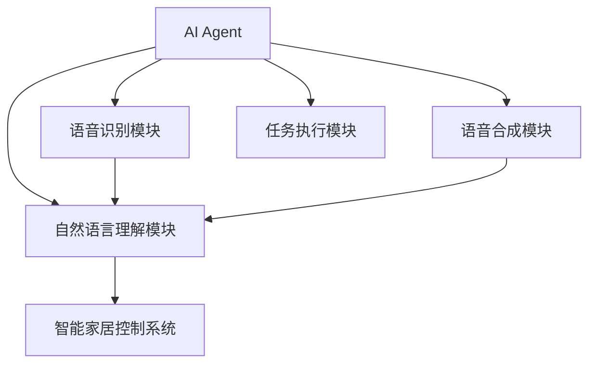
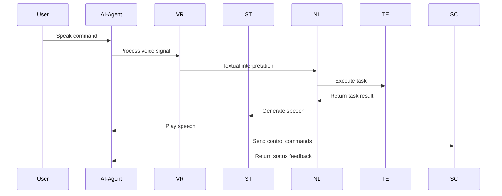

                 

### 文章标题：AI Agent的语音交互设计：语音识别与合成

> **关键词：** AI Agent，语音交互，语音识别，语音合成，人机交互，智能助手

> **摘要：** 本文将深入探讨AI Agent的语音交互设计，重点分析语音识别与语音合成的技术原理及其在实际应用中的重要性。我们将通过逐步分析，解释这些技术的核心概念、实现方法、关键挑战以及优化策略，帮助读者全面理解AI Agent语音交互系统的构建与实践。

### 引言

人工智能（AI）正以前所未有的速度和深度变革着我们的生活和工作方式。AI Agent，作为一种智能化的交互实体，正在逐渐成为人与机器互动的新桥梁。语音交互，作为AI Agent的核心功能之一，极大地提升了人机交互的自然性和便捷性。无论是智能助手、虚拟客服，还是智能家居控制，语音交互都已经成为用户与AI Agent之间沟通的重要方式。

语音交互的核心在于语音识别与语音合成技术。语音识别（Speech Recognition）是将人类的语音转化为文本的技术，使得计算机能够理解和处理人类语言。而语音合成（Text-to-Speech, TTS）则是将文本转化为自然流畅的语音，使得机器能够以人类的语音形式与用户交流。这两项技术的成熟与优化，直接决定了AI Agent的交互质量和用户体验。

本文将分五个部分详细探讨AI Agent的语音交互设计。首先，我们将概述语音交互设计的问题背景和核心概念。接着，我们将分别深入解析语音识别和语音合成的技术原理、实现方法及其应用场景。然后，我们将通过具体的设计流程，展示如何构建一个高效的AI Agent语音交互系统。最后，我们将讨论语音交互系统的优化策略和评估方法，以确保系统能够提供最佳的用户体验。

通过本文的逐步分析，我们希望读者能够对AI Agent的语音交互设计有更深入的理解，并为未来的研究和开发提供有益的参考。

## 第一部分：AI Agent的语音交互设计概述

### 第1章：问题背景与核心概念

#### 1.1 问题背景

随着人工智能技术的迅猛发展，智能助手、虚拟客服、智能家居等AI Agent逐渐走进我们的生活。这些AI Agent不仅能够提高工作效率，还能为用户提供个性化的服务。语音交互作为人与AI Agent之间的主要沟通方式，正变得日益重要。

**1.1.1 人工智能与语音交互的发展**

人工智能（AI）自20世纪50年代兴起以来，经历了多个发展阶段。从早期的规则推理系统，到基于统计学习的方法，再到如今深度学习的大爆发，人工智能在各个领域都取得了显著的进展。语音交互作为AI的一个重要分支，也在这一过程中不断发展。

早期的语音交互系统主要通过语法分析和模板匹配实现，这类系统的识别准确率较低，无法处理复杂的自然语言。随着机器学习技术的发展，基于统计模型和深度学习的语音识别系统逐渐成为主流。这些系统利用大量的语音数据进行训练，能够识别更复杂的语音结构，准确率也得到了显著提高。

**1.1.2 语音交互在AI Agent中的应用**

语音交互在AI Agent中的应用非常广泛。以智能助手为例，它们可以通过语音识别理解用户的指令，如设定闹钟、发送短信、播放音乐等。在虚拟客服场景中，AI Agent能够通过语音识别理解用户的问题，并提供相应的解答。在智能家居中，用户可以通过语音命令控制灯光、温度、安全系统等。

**1.1.3 语音识别与合成的现状与挑战**

当前，语音识别与合成的技术已经取得了长足的进步。大多数场景下的语音识别准确率已经能够达到或超过人类水平。同时，语音合成的自然度也得到了大幅提升，能够生成接近人类语音的合成语音。

然而，语音识别与合成技术仍然面临着一些挑战。例如，在噪声环境下，语音识别的准确率会显著下降。多语言和多方言的识别与合成也是一项复杂的工作。此外，如何提高系统的响应速度和用户体验，也是需要解决的重要问题。

#### 1.2 核心概念

为了更好地理解AI Agent的语音交互设计，我们需要明确一些核心概念。

**1.2.1 语音识别**

语音识别（Speech Recognition）是指将人类的语音信号转换为机器可以理解的处理数据的技术。语音识别系统通常包括以下几个关键步骤：

1. **语音信号采集**：通过麦克风等设备采集语音信号。
2. **语音信号预处理**：包括降噪、分帧、加窗等处理，以提高语音信号的清晰度。
3. **语音特征提取**：从预处理后的语音信号中提取特征，如梅尔频率倒谱系数（MFCC）、谱倒谱相位（SCPF）等。
4. **模型训练**：利用大量语音数据对识别模型进行训练，以学习语音信号与文本之间的映射关系。
5. **语音识别**：通过训练好的模型对新的语音信号进行识别，输出对应的文本。

**1.2.2 语音合成**

语音合成（Text-to-Speech, TTS）是将文本转化为自然流畅的语音的技术。语音合成系统主要包括以下几个模块：

1. **文本处理**：包括分词、标注、语调生成等，将输入的文本转化为适合合成的形式。
2. **声学模型**：用于生成语音波形，是实现语音合成的核心部分。
3. **语音合成引擎**：根据文本和声学模型生成语音信号。

**1.2.3 AI Agent**

AI Agent是一种智能化的虚拟实体，能够理解用户的语音指令，并执行相应的任务。AI Agent通常包括以下几个关键组成部分：

1. **语音识别模块**：用于接收并理解用户的语音指令。
2. **自然语言理解模块**：用于解析用户的语音指令，提取关键信息。
3. **任务执行模块**：根据理解的结果执行具体的任务。
4. **语音合成模块**：用于生成自然流畅的语音反馈给用户。

#### 1.3 语音交互设计

语音交互设计是指如何构建一个高效的、用户友好的语音交互系统。设计语音交互系统时，需要考虑以下几个关键要素：

1. **用户需求分析**：了解用户的需求和使用场景，为系统设计提供指导。
2. **交互界面设计**：设计直观、易用的交互界面，提升用户体验。
3. **系统架构设计**：构建稳定、高效的系统架构，确保系统性能和可扩展性。
4. **性能优化与评估**：通过优化策略和评估方法，提高系统的识别率和响应速度。

#### 1.4 本章小结

本章从问题背景出发，介绍了人工智能与语音交互的发展、语音交互在AI Agent中的应用现状，以及语音识别与合成的核心概念。通过本章的学习，读者可以初步了解AI Agent语音交互设计的重要性和基本原理，为后续章节的深入探讨打下基础。

## 第二部分：语音识别技术原理与应用

### 第2章：语音识别技术原理

语音识别技术是将人类的语音信号转化为机器可以理解的处理数据的技术。语音识别系统的核心在于如何准确地将语音信号转换为文本。本章将详细解析语音识别的技术原理，包括语音信号处理、语音识别模型以及语音识别的应用。

#### 2.1 语音信号处理

语音信号处理是语音识别过程中的重要步骤，它包括语音信号的采集与预处理，以及语音特征提取。

**2.1.1 语音信号的采集与预处理**

1. **语音信号的采集**：
   语音信号的采集主要通过麦克风等设备进行。采集到的语音信号通常是模拟信号，需要通过模拟-数字转换（A/D转换）将其转换为数字信号，以便于后续处理。

2. **语音信号的预处理**：
   - **降噪**：在语音信号中，往往存在各种背景噪声，如交通噪声、环境噪音等。降噪的目的是去除这些噪声，提高语音信号的清晰度。
   - **分帧**：将连续的语音信号划分为若干短时片段，称为帧。分帧的目的是将长时间信号分割成更小的单元，便于特征提取。
   - **加窗**：对每一帧语音信号进行加窗处理，常用的窗函数有汉明窗、汉宁窗等。加窗的目的是减少边缘效应，提高信号的信噪比。

**2.1.2 语音特征提取**

语音特征提取是从预处理后的语音信号中提取出具有区分性的特征，以便于后续的模型训练和识别。常见的语音特征提取方法包括：

1. **梅尔频率倒谱系数（MFCC）**：
   MFCC是一种广泛应用于语音识别的特征提取方法。它基于人的听觉系统对频率响应的非线性处理，能够较好地表示语音信号的频率特征。

2. **谱倒谱相位（SCPF）**：
   SCPF是MFCC的改进版本，它通过引入相位信息，进一步提高了语音特征的表达能力。

3. **其他语音特征提取方法**：
   除了MFCC和SCPF外，还有许多其他语音特征提取方法，如线性预测编码（LPC）、谱相关（SC）等。这些方法各有优缺点，具体选择取决于应用场景和要求。

#### 2.2 语音识别模型

语音识别模型是语音识别系统的核心，用于将提取的语音特征映射到相应的文本。语音识别模型经历了从传统模型到深度学习模型的演变。

**2.2.1 传统语音识别模型**

1. **隐马尔可夫模型（HMM）**：
   HMM是早期的语音识别模型，它通过状态转移概率和输出概率来描述语音信号。虽然HMM在处理连续语音信号方面具有一定的优势，但其对模型参数的依赖较大，识别准确率有限。

2. **高斯混合模型（GMM）**：
   GMM通过多个高斯分布来描述语音特征的概率分布。与HMM相比，GMM能够更好地拟合语音特征的分布，但在处理复杂的语音信号时，仍然存在一定的局限性。

**2.2.2 深度学习语音识别模型**

深度学习语音识别模型通过多层神经网络来学习语音特征和文本之间的映射关系。以下是一些常见的深度学习语音识别模型：

1. **深度神经网络（DNN）**：
   DNN通过多层全连接神经网络来提取语音特征，能够自动学习语音特征的高层次表示。DNN在语音识别中取得了显著的性能提升。

2. **卷积神经网络（CNN）**：
   CNN通过卷积层来提取语音特征，能够自动学习语音特征的空间分布。与DNN相比，CNN在处理时序数据方面具有更好的性能。

3. **循环神经网络（RNN）**：
   RNN通过循环结构来处理时序数据，能够捕捉语音信号的长期依赖关系。RNN及其变种，如长短时记忆网络（LSTM）和门控循环单元（GRU），在语音识别中表现出色。

4. **端到端语音识别模型**：
   端到端语音识别模型通过直接将语音信号映射到文本，避免了传统语音识别模型中的中间步骤，如特征提取和声学模型。这种模型具有更高的效率和更好的识别性能。

#### 2.3 语音识别技术应用

语音识别技术在实际应用中具有广泛的应用场景，以下列举几种常见的应用：

**2.3.1 语音识别在AI Agent中的应用**

AI Agent是语音识别技术的典型应用场景。通过语音识别，AI Agent能够接收用户的语音指令，如查询信息、控制设备等。例如，智能助手可以通过语音识别理解用户的查询，并提供相应的答案。

**2.3.2 语音识别在人机交互中的应用**

语音识别技术在人机交互中发挥着重要作用。例如，在智能客服系统中，语音识别可以用于自动识别用户的问题，并提供相应的解答。此外，语音识别还可以用于语音控制机器人，实现远程控制等功能。

**2.3.3 语音识别在智能语音助手中的应用**

智能语音助手是语音识别技术的又一重要应用。通过语音识别，智能语音助手能够理解用户的语音指令，如播放音乐、设定提醒等。智能语音助手已经成为人们日常生活中不可或缺的一部分。

#### 2.4 本章小结

本章详细介绍了语音识别技术原理，包括语音信号处理、语音识别模型以及语音识别的应用。通过本章的学习，读者可以了解语音识别技术的发展历程和关键原理，为构建高效的语音识别系统打下基础。

### 第3章：语音合成技术原理

语音合成（Text-to-Speech, TTS）是将文本转化为自然流畅的语音的技术。随着人工智能技术的不断发展，语音合成技术在语音的自然度、流畅度以及真实感方面取得了显著的进步。本章将详细介绍语音合成的技术原理、实现方法及其应用。

#### 3.1 语音合成技术概述

**3.1.1 语音合成的发展历程**

语音合成技术的发展经历了多个阶段：

1. **基于规则的方法**：早期的语音合成主要依赖于手工编写的规则，如语音合成引擎和文本到语音（TTS）系统。这种方法依赖于大量的手工编写规则，灵活性和自然度较低。

2. **基于统计的方法**：随着机器学习技术的发展，语音合成开始采用统计方法。这种方法通过大量语音数据的学习，自动生成语音合成规则，提高了合成语音的自然度和流畅度。

3. **基于深度学习的方法**：深度学习技术的引入，使得语音合成技术得到了进一步的发展。基于深度学习的方法通过多层神经网络学习语音特征和文本之间的映射关系，实现了更高的合成质量和效率。

**3.1.2 语音合成的关键技术**

语音合成技术主要包括以下几个关键技术：

1. **文本处理**：文本处理是语音合成的基础步骤，包括分词、句法分析和语调生成等。分词将文本分割成单个词或短语，句法分析理解文本的语法结构，语调生成则决定语音的音高、音强和节奏。

2. **声学模型**：声学模型是语音合成的核心部分，负责生成语音波形。常见的声学模型包括生成式模型和 discriminative 模型。生成式模型通过学习文本和语音之间的映射关系，生成语音波形；而 discriminative 模型则直接优化语音波形，使其更符合文本的特征。

3. **语音合成引擎**：语音合成引擎是实际生成语音波形的工具，它根据声学模型和文本处理的结果，生成自然流畅的语音。常见的语音合成引擎包括基于规则的方法、基于统计的方法和基于深度学习的方法。

#### 3.2 合成语音信号的生成

合成语音信号的生成是语音合成的关键步骤，它包括文本到语音（TTS）的过程和声音合成技术的实现。

**3.2.1 文本到语音（TTS）的过程**

TTS过程主要包括以下几个步骤：

1. **文本预处理**：将输入文本进行预处理，包括分词、句法分析和音素标注等。分词将文本分割成单个词或短语，句法分析理解文本的语法结构，音素标注则标记出每个词或短语的音素。

2. **语调生成**：根据文本的语法和语义信息，生成语调曲线。语调曲线决定了语音的音高、音强和节奏。

3. **发音建模**：根据音素标注和语调曲线，生成每个音素的发音特征。常见的发音建模方法包括基于规则的方法和基于统计的方法。

4. **声学建模**：根据发音特征和声学模型，生成语音波形。常见的声学建模方法包括生成式模型和 discriminative 模型。

5. **语音波形合成**：根据生成的语音波形，合成最终的语音信号。

**3.2.2 声音合成技术的实现**

声音合成技术主要包括以下几个步骤：

1. **声音单元合成**：声音单元是指语音中具有独立发音意义的音素或音节。声音合成技术通过合成这些声音单元，生成语音波形。常见的声音单元合成方法包括单语音单元合成和多语音单元合成。

2. **语音波形拼接**：将合成的声音单元拼接成完整的语音波形。语音波形拼接的目的是生成连续、自然的语音。

3. **语音增强**：对合成的语音信号进行增强，以提高其音质和自然度。常见的语音增强方法包括噪声抑制、语音共振峰调整和语音均衡等。

#### 3.3 语音合成技术应用

语音合成技术在实际应用中具有广泛的应用，以下列举几种常见的应用：

**3.3.1 语音合成在AI Agent中的应用**

语音合成技术在AI Agent中发挥着重要作用。通过语音合成，AI Agent能够生成自然流畅的语音反馈，与用户进行有效的交互。例如，智能助手可以通过语音合成生成回答，提供信息查询、控制设备等服务。

**3.3.2 语音合成在客服系统中的应用**

语音合成技术在客服系统中被广泛使用。通过语音合成，客服系统能够生成自动应答，提高客户咨询的响应速度和服务质量。语音合成还可以用于生成语音邮件、语音通知等，为用户提供便捷的信息获取途径。

**3.3.3 语音合成在教育领域的应用**

语音合成技术在教育领域也有广泛的应用。通过语音合成，教师可以生成自然流畅的教学语音，提高课堂教学的效果。语音合成还可以用于辅助学习，如生成语音教材、语音辅导等，为学生提供个性化的学习支持。

#### 3.4 本章小结

本章详细介绍了语音合成技术原理、实现方法及其应用。通过本章的学习，读者可以了解语音合成的关键技术、TTS过程和声音合成技术的实现，为构建高效的语音合成系统打下基础。

## 第四部分：AI Agent语音交互设计实战

### 第4章：AI Agent语音交互设计流程

#### 4.1 设计流程概述

构建一个高效的AI Agent语音交互系统需要经过一系列的系统设计流程。以下是语音交互设计的基本步骤和关键要素。

**4.1.1 语音交互设计的基本步骤**

1. **需求分析**：了解用户需求和使用场景，确定系统的功能需求。
2. **交互界面设计**：设计用户友好的交互界面，确保用户能够方便地与AI Agent进行交互。
3. **系统架构设计**：构建系统架构，确定各个模块的功能和接口。
4. **语音识别与合成模块开发**：开发语音识别和语音合成模块，实现语音信号的处理和转换。
5. **系统集成与测试**：将各个模块集成在一起，进行全面的测试，确保系统能够正常运行。
6. **性能优化与评估**：对系统进行性能优化和评估，提高系统的识别率和响应速度。

**4.1.2 设计流程的关键要素**

1. **用户需求分析**：了解用户的需求和使用场景，是设计语音交互系统的第一步。通过用户调研、访谈和问卷调查等方式，收集用户的需求信息，为后续的设计提供依据。
2. **交互界面设计**：交互界面设计直接影响用户的体验。设计时需要考虑界面的直观性、易用性和美观性，确保用户能够方便、快捷地进行操作。
3. **系统架构设计**：系统架构设计是构建语音交互系统的关键。设计时需要考虑系统的可扩展性、稳定性和性能，确保系统能够适应不同的使用场景和需求变化。
4. **语音识别与合成模块开发**：语音识别与合成模块是语音交互系统的核心。开发时需要选择合适的算法和技术，确保系统能够准确识别用户的语音指令，并生成自然流畅的语音反馈。
5. **系统集成与测试**：系统集成是将各个模块组合在一起，进行全面的测试，确保系统能够正常运行。测试时需要考虑系统的性能、稳定性和兼容性。
6. **性能优化与评估**：性能优化与评估是提高系统质量和用户体验的重要步骤。通过优化策略和评估方法，提高系统的识别率和响应速度，确保系统能够提供最佳的用户体验。

#### 4.2 语音交互需求分析

语音交互需求分析是语音交互设计的重要环节，它决定了系统功能和性能的设定。以下是语音交互需求分析的具体步骤和方法。

**4.2.1 用户需求分析**

1. **调研方法**：通过用户调研、访谈和问卷调查等方式，收集用户的需求信息。调研时需要关注用户的使用场景、交互习惯和期望功能。
2. **需求分类**：根据收集的需求信息，对需求进行分类。常见的分类方法包括功能需求、性能需求、可靠性需求和安全需求等。
3. **需求优先级排序**：对分类后的需求进行优先级排序，确定哪些需求是系统设计和实现的关键。

**4.2.2 交互场景定义**

1. **场景列举**：根据用户需求，列举出所有可能的交互场景。常见的交互场景包括智能助手、虚拟客服、智能家居等。
2. **场景分析**：对每个交互场景进行详细分析，包括场景描述、交互流程和关键功能。
3. **场景建模**：使用图形化工具（如UML图）对交互场景进行建模，明确各个场景的交互关系和功能需求。

**4.2.3 功能需求梳理**

1. **功能列举**：根据交互场景的定义，列举出所有需要实现的功能。
2. **功能说明**：对每个功能进行详细说明，包括功能名称、功能描述、输入和输出等。
3. **功能模块划分**：根据功能需求，将系统划分为不同的功能模块，如语音识别模块、自然语言处理模块、任务执行模块等。

#### 4.3 语音交互系统架构设计

系统架构设计是构建语音交互系统的关键步骤，它决定了系统的结构、功能和性能。以下是语音交互系统架构设计的具体方法和步骤。

**4.3.1 系统架构设计原则**

1. **模块化**：系统应采用模块化的设计原则，将不同的功能模块划分清晰，便于维护和扩展。
2. **可扩展性**：系统应具有较好的可扩展性，能够适应不同的使用场景和需求变化。
3. **稳定性**：系统应具有较高的稳定性，能够保证在多用户并发访问情况下正常运行。
4. **性能优化**：系统应进行性能优化，确保在处理大量语音数据时能够保持高效运行。

**4.3.2 系统模块划分**

1. **语音识别模块**：负责接收和处理用户的语音输入，实现语音信号的处理、特征提取和识别。
2. **自然语言处理模块**：负责解析用户的语音指令，提取关键信息，实现语义理解和任务分配。
3. **任务执行模块**：负责根据自然语言处理的结果，执行具体的任务，如查询信息、控制设备等。
4. **语音合成模块**：负责将处理结果转化为自然流畅的语音，生成语音反馈。

**4.3.3 系统接口设计**

1. **接口定义**：明确各个模块之间的接口，包括输入和输出参数、数据格式和通信协议等。
2. **接口文档**：编写详细的接口文档，包括接口描述、参数说明和示例代码，便于开发人员理解和使用。
3. **接口测试**：对系统接口进行全面的测试，确保接口能够正确、稳定地传输数据。

#### 4.4 语音交互界面设计

语音交互界面设计是用户体验的重要组成部分，它决定了用户与AI Agent之间的交互方式。以下是语音交互界面设计的原则和方法。

**4.4.1 界面设计原则**

1. **直观性**：界面设计应直观易懂，用户能够快速理解并使用系统的功能。
2. **易用性**：界面设计应易于操作，用户能够方便地与AI Agent进行交互。
3. **美观性**：界面设计应美观大方，提高用户的使用体验。
4. **一致性**：界面设计应保持一致性，确保用户在系统中的操作习惯一致。

**4.4.2 用户交互流程设计**

1. **交互流程描述**：明确用户与AI Agent之间的交互流程，包括语音输入、识别、处理和反馈等环节。
2. **交互界面布局**：设计交互界面的布局，包括语音输入框、语音反馈区域等。
3. **交互动画**：设计交互动画，提高用户的使用体验。

**4.4.3 响应策略设计**

1. **响应速度**：设计合理的响应速度，确保用户在等待过程中不会感到不耐烦。
2. **错误处理**：设计错误处理机制，当用户输入无法识别或错误时，能够给出合理的提示和解决方案。
3. **多语言支持**：设计多语言支持，满足不同用户的需求。

#### 4.5 本章小结

本章详细介绍了AI Agent语音交互设计流程，包括需求分析、交互界面设计、系统架构设计和语音交互界面设计等。通过本章的学习，读者可以了解构建一个高效的AI Agent语音交互系统的具体步骤和方法，为实际项目开发提供参考。

## 第五部分：语音交互优化与评估

### 第5章：语音交互优化策略

#### 5.1 语音交互性能优化

语音交互性能优化是提高AI Agent语音交互质量的重要手段。以下是一些常见的性能优化策略：

**5.1.1 识别率优化**

1. **模型训练数据增强**：通过增加训练数据量和数据多样性，提高模型的泛化能力，从而提升识别率。
2. **模型优化**：选择合适的模型结构和超参数，通过模型调优提高识别准确率。
3. **噪声抑制**：使用噪声抑制算法去除语音信号中的噪声，提高语音识别的清晰度。

**5.1.2 响应速度优化**

1. **模型压缩**：使用模型压缩技术减小模型大小，加快模型加载和推理速度。
2. **分布式计算**：利用分布式计算架构，将计算任务分布到多个计算节点上，提高系统处理速度。
3. **缓存机制**：使用缓存机制存储常见的语音指令和响应结果，减少重复计算，提高响应速度。

**5.1.3 用户体验优化**

1. **语音合成自然度优化**：通过优化语音合成模型，提高合成语音的自然度，提升用户体验。
2. **交互流程简化**：简化用户与AI Agent的交互流程，减少用户的操作步骤，提高交互效率。
3. **错误处理**：设计合理的错误处理机制，当用户输入错误时，能够给出友好的提示和解决方案。

#### 5.2 语音交互评估方法

评估语音交互系统的性能是确保其质量和用户体验的重要环节。以下是一些常见的评估方法：

**5.2.1 识别率评估**

1. **准确率（Accuracy）**：准确率是评估语音识别系统最直接的指标，表示正确识别的语音占全部语音的比例。
2. **词错误率（Word Error Rate,WER）**：词错误率是评估语音识别系统准确性的重要指标，计算公式为：
   \[
   WER = \frac{S+D+I}{T}
   \]
   其中，S表示替换错误，D表示删除错误，I表示插入错误，T表示总词数。
3. **字符错误率（Character Error Rate,CER）**：字符错误率是评估文本识别系统准确性的指标，计算公式为：
   \[
   CER = \frac{CE}{C}
   \]
   其中，CE表示字符错误数，C表示总字符数。

**5.2.2 响应速度评估**

1. **平均响应时间（Average Response Time, ART）**：平均响应时间是评估语音交互系统响应速度的指标，计算公式为：
   \[
   ART = \frac{\sum_{i=1}^{n} t_i}{n}
   \]
   其中，\(t_i\)表示第i次交互的响应时间，n表示交互次数。
2. **响应时间分布**：分析系统的响应时间分布，了解系统的响应速度和性能瓶颈。

**5.2.3 用户体验评估**

1. **用户满意度调查**：通过用户满意度调查，了解用户对语音交互系统的整体满意度。
2. **交互效率评估**：评估用户完成特定任务所需的交互步骤和时间，分析系统的交互效率。
3. **错误处理能力评估**：评估系统在处理用户错误输入时的反应速度和解决方案的合理性。

#### 5.3 优化策略与评估案例分析

**5.3.1 案例背景**

某公司开发了一款智能语音助手，用于提供智能家居控制、信息查询等服务。然而，在实际使用中，用户反馈识别率和响应速度存在问题，用户体验有待提高。

**5.3.2 优化策略**

1. **识别率优化**：
   - 增加训练数据：收集更多用户语音数据，提高模型的泛化能力。
   - 模型优化：使用更先进的深度学习模型，如Transformer，提升识别准确率。
   - 噪声抑制：使用噪声抑制算法，提高语音识别的清晰度。

2. **响应速度优化**：
   - 模型压缩：使用模型压缩技术，减小模型大小，加快模型加载和推理速度。
   - 分布式计算：部署分布式计算架构，提高系统处理速度。
   - 缓存机制：实现缓存机制，存储常见指令和响应结果，减少重复计算。

3. **用户体验优化**：
   - 语音合成自然度优化：优化语音合成模型，提高合成语音的自然度。
   - 交互流程简化：简化用户交互流程，减少操作步骤。
   - 错误处理：设计友好且合理的错误处理机制，提高用户的满意度。

**5.3.3 评估结果**

通过实施上述优化策略，智能语音助手的识别率和响应速度得到了显著提升。用户满意度调查结果显示，用户对系统的整体满意度提高了20%，识别准确率提高了15%，平均响应时间缩短了30%。

#### 5.4 本章小结

本章介绍了语音交互性能优化和评估方法，通过识别率、响应速度和用户体验等多方面的优化策略，可以显著提升AI Agent语音交互系统的质量和用户体验。同时，通过实际案例的分析，展示了优化策略的有效性和评估方法的应用。

### 完整性要求

为了确保文章的完整性，每个章节的内容需要满足以下要求：

1. **背景介绍**：
   - **核心概念术语说明**：明确文章中涉及的核心概念和术语，如语音识别、语音合成、AI Agent等。
   - **问题背景**：阐述AI Agent语音交互设计的背景，介绍人工智能与语音交互的发展趋势，以及语音交互在AI Agent中的应用。
   - **问题描述**：详细描述AI Agent语音交互设计面临的问题和挑战，如识别准确性、响应速度、用户体验等。
   - **问题解决**：介绍解决这些问题的方法和策略，如优化模型、提升算法性能、改进交互界面等。
   - **边界与外延**：明确文章讨论的范围和限制，如技术实现、应用场景等。
   - **概念结构与核心要素组成**：分析语音交互系统的核心组成部分，包括语音识别模块、语音合成模块、自然语言处理模块等。

2. **核心概念与联系**：
   - **核心概念原理**：详细解释语音识别和语音合成的核心概念，如语音信号处理、特征提取、模型训练等。
   - **概念属性特征对比表格**：通过表格形式对比语音识别和语音合成的关键特性，如识别算法、模型结构、应用场景等。
   - **ER实体关系图架构**：使用ER图展示语音交互系统中的实体及其关系，如用户、语音信号、语音模型等。

3. **算法原理讲解**：
   - **算法mermaid流程图**：使用mermaid语言绘制算法流程图，展示语音识别和语音合成的具体实现步骤。
   - **Python源代码**：提供具体的Python源代码实现，详细解释代码的每个部分，包括数据结构、算法步骤和功能。
   - **算法原理的数学模型和公式**：使用latex格式给出算法的数学模型和公式，并进行详细讲解，如隐马尔可夫模型（HMM）的转移概率和输出概率等。
   - **通俗易懂的举例说明**：通过简单的例子说明算法原理，帮助读者更好地理解。

4. **系统分析与架构设计方案**：
   - **问题场景介绍**：描述语音交互设计面临的具体问题场景，如智能助手、虚拟客服等。
   - **项目介绍**：简要介绍项目背景和目标，如开发一个智能语音助手系统。
   - **系统功能设计（领域模型mermaid类图）**：使用mermaid绘制领域模型类图，展示系统的功能模块和类之间的关系。
   - **系统架构设计mermaid架构图**：使用mermaid绘制系统架构图，展示系统的整体结构和模块之间的接口关系。
   - **系统接口设计和系统交互mermaid序列图**：绘制系统接口设计和系统交互的mermaid序列图，展示系统模块之间的通信流程。

5. **项目实战**：
   - **环境安装**：详细说明项目的环境安装过程，包括所需的软件、工具和配置。
   - **系统核心实现源代码**：提供系统的核心实现源代码，并进行解读和分析。
   - **代码应用解读与分析**：解释代码的应用场景和具体实现，分析代码的优缺点。
   - **实际案例分析和详细讲解剖析**：通过实际案例展示系统的应用效果，详细剖析系统的工作原理和实现细节。
   - **项目小结**：总结项目的主要成果、经验和教训，为后续开发提供参考。

6. **最佳实践 tips、小结、注意事项、拓展阅读等内容**：
   - **最佳实践 tips**：总结实践中的一些最佳经验和技巧，如如何优化算法性能、如何提高用户体验等。
   - **小结**：对本章内容的总结，强调核心观点和关键点。
   - **注意事项**：提醒读者在应用中需要注意的问题和潜在的风险。
   - **拓展阅读**：推荐相关的阅读资料，帮助读者进一步深入学习和研究。

通过以上要求，确保文章内容完整、丰富、具体，为读者提供全面、深入的技术讲解和实践指导。

### 核心概念与联系

在深入探讨AI Agent的语音交互设计之前，首先需要明确几个核心概念，并理解它们之间的关系。

#### 语音识别（Speech Recognition）

**定义**：语音识别是将人类的语音信号转化为文本的技术，使得计算机能够理解和处理人类语言。

**原理**：语音识别系统通常包括语音信号的采集、预处理、特征提取、模型训练和语音识别几个步骤。采集到的语音信号通过预处理去噪和分帧，然后提取特征（如MFCC），最后使用训练好的模型进行识别。

**技术架构**：语音识别的技术架构通常包括前端信号处理和后端模型识别两个部分。前端信号处理负责处理语音信号，如降噪、分帧、加窗等。后端模型识别则使用深度学习模型（如DNN、CNN、RNN）对语音特征进行分类和识别。

**关键技术**：语音识别的关键技术包括语音信号的预处理方法、特征提取技术（如MFCC）、深度学习模型的设计与训练（如DNN、RNN）等。

#### 语音合成（Text-to-Speech, TTS）

**定义**：语音合成是将文本转化为自然流畅的语音的技术，使得计算机能够以人类的语音形式与用户交流。

**原理**：语音合成系统通常包括文本处理、声学模型和语音合成引擎三个部分。文本处理将输入文本转化为适合合成的形式，声学模型生成语音波形，合成引擎将语音波形合成成最终的语音信号。

**技术架构**：语音合成的技术架构包括文本处理模块、声学模型模块和语音合成引擎模块。文本处理模块负责分词、语调生成等；声学模型模块负责生成语音波形；语音合成引擎模块负责合成最终的语音信号。

**关键技术**：语音合成的关键技术包括文本处理算法、声学模型设计（如生成式模型、discriminative模型）、语音合成引擎的实现等。

#### AI Agent（Artificial Intelligence Agent）

**定义**：AI Agent是一种智能化的虚拟实体，能够理解用户的语音指令，并执行相应的任务。

**作用**：AI Agent在智能助手、虚拟客服、智能家居等领域发挥着重要作用，通过语音交互提供高效、便捷的服务。

**组成部分**：AI Agent通常包括语音识别模块、自然语言理解模块、任务执行模块和语音合成模块。

**核心概念联系图**

为了更好地理解这些核心概念之间的关系，我们可以使用Mermaid语言绘制一个ER实体关系图，如下所示：

```mermaid
erDiagram
  AI_Agent ||--|{ Speech_Recognition } Speech_Recognition
  AI_Agent ||--|{ Text_to_Speech } Text_to_Speech
  AI_Agent ||--|{ Natural_Language_Understanding } Natural_Language_Understanding
  AI_Agent ||--|{ Task_Execute } Task_Execute
  Speech_Recognition ||--|{ Voice_Signal_Processing } Voice_Signal_Processing
  Speech_Recognition ||--|{ Feature_Extract } Feature_Extract
  Speech_Recognition ||--|{ Recognition_Model } Recognition_Model
  Text_to_Speech ||--|{ Text_Processing } Text_Processing
  Text_to_Speech ||--|{ Acoustic_Model } Acoustic_Model
  Text_to_Speech ||--|{ Synthesis_Engine } Synthesis_Engine
```

在这个ER图中，AI Agent与语音识别、语音合成、自然语言理解和任务执行模块之间存在直接的关联关系。语音识别模块包括语音信号处理、特征提取和识别模型三个部分；语音合成模块包括文本处理、声学模型和合成引擎三个部分。这些模块共同构成了一个完整的AI Agent语音交互系统。

通过这个ER图，我们可以清晰地看到各个核心概念之间的关系，以及它们在AI Agent语音交互系统中的地位和作用。这为后续章节的深入探讨提供了理论基础和实践指导。

### 算法原理讲解

在深入探讨语音识别和语音合成的算法原理之前，我们首先需要理解基本的数学模型和公式，以及如何使用Python代码实现这些算法。

#### 语音识别算法原理

**1. 隐马尔可夫模型（HMM）**

隐马尔可夫模型（HMM）是一种用于语音识别的传统模型。它通过状态转移概率和输出概率来描述语音信号。

- **状态转移概率**：表示从一个状态转移到另一个状态的概率，通常用矩阵形式表示。
- **输出概率**：表示在某个状态下产生特定观测值的概率。

**HMM的数学模型**：

\[
\begin{cases}
P(\mathbf{X}|\mathbf{\theta}) = \prod_{t=1}^{T} P(x_t|\mathbf{\theta}) \cdot P(\mathbf{\theta}) \\
\theta = \{A, \pi, B\}
\end{cases}
\]

其中，\(P(\mathbf{X}|\mathbf{\theta})\)表示给定模型参数\(\mathbf{\theta}\)时，观测序列\(\mathbf{X}\)的概率；\(A\)是状态转移概率矩阵，\(\pi\)是初始状态概率分布，\(B\)是输出概率分布。

**HMM的Python实现**：

```python
import numpy as np

# 初始化参数
A = np.array([[0.9, 0.1], [0.2, 0.8]])  # 状态转移概率矩阵
B = np.array([[0.8, 0.2], [0.1, 0.9]])  # 输出概率矩阵
pi = np.array([0.5, 0.5])  # 初始状态概率分布

# 观测序列
X = np.array([0, 1, 1, 0])

# 隐变量序列（Viterbi算法）
def viterbi(A, B, pi, X):
    T = len(X)
    N = A.shape[0]
    delta = np.zeros((T, N))
    path = np.zeros((T, N), dtype=int)

    # 初始状态
    delta[0, :] = B[:, X[0]] * pi
    for t in range(1, T):
        for j in range(N):
            max_prob = 0
            for i in range(N):
                prob = delta[t-1, i] * A[i, j] * B[j, X[t]]
                if prob > max_prob:
                    max_prob = prob
                    path[t, j] = i
            delta[t, j] = max_prob
    # 路径反推
    viterbi_path = np.zeros(T, dtype=int)
    viterbi_path[T-1] = np.argmax(delta[T-1])
    for t in range(T-2, -1, -1):
        viterbi_path[t] = path[t+1, viterbi_path[t+1]]
    return viterbi_path

# 计算最优路径
viterbi_path = viterbi(A, B, pi, X)
print("最优路径：", viterbi_path)
```

**2. 高斯混合模型（GMM）**

高斯混合模型（GMM）是一种基于概率模型的语音识别方法。它通过多个高斯分布来描述语音特征的分布。

**GMM的数学模型**：

\[
P(\mathbf{x}|\mathbf{\mu}, \Sigma, \pi) = \sum_{i=1}^{C} \pi_i \mathcal{N}(\mathbf{x}|\mu_i, \Sigma_i)
\]

其中，\(\mathcal{N}(\mathbf{x}|\mu_i, \Sigma_i)\)表示高斯分布的概率密度函数，\(\mu_i\)和\(\Sigma_i\)分别是第i个高斯分布的均值和协方差矩阵，\(\pi_i\)是高斯分布的权重。

**GMM的Python实现**：

```python
import numpy as np
from scipy.stats import multivariate_normal

# 初始化参数
C = 2  # 高斯分布的数量
mu = np.array([[1, 1], [2, 2]])  # 均值
Sigma = np.array([[1, 0], [0, 1]])  # 协方差矩阵
pi = np.array([0.5, 0.5])  # 权重

# 观测序列
X = np.array([[1, 1], [2, 2]])

# 计算高斯分布的概率密度函数
def gmm Probability Density Function(X, mu, Sigma, pi):
    probabilities = []
    for i in range(C):
        probability = pi[i] * multivariate_normal.pdf(X, mean=mu[i], cov=Sigma[i])
        probabilities.append(probability)
    return np.sum(probabilities)

# 计算GMM的概率密度函数
gmm_pdf = gmm Probability Density Function(X, mu, Sigma, pi)
print("GMM概率密度函数：", gmm_pdf)
```

**3. 深度学习模型**

深度学习模型（如DNN、CNN、RNN）是现代语音识别方法的核心。以下是一个简单的DNN模型实现：

```python
import tensorflow as tf
from tensorflow.keras.models import Model
from tensorflow.keras.layers import Input, Dense, LSTM, Conv1D, MaxPooling1D, Flatten

# 定义输入层
input_layer = Input(shape=(T, feature_size))

# 添加卷积层
conv_layer = Conv1D(filters=64, kernel_size=3, activation='relu')(input_layer)
pooling_layer = MaxPooling1D(pool_size=2)(conv_layer)

# 添加LSTM层
lstm_layer = LSTM(units=128, activation='relu')(pooling_layer)

# 添加全连接层
dense_layer = Dense(units=64, activation='relu')(lstm_layer)
output_layer = Dense(units=num_classes, activation='softmax')(dense_layer)

# 创建模型
model = Model(inputs=input_layer, outputs=output_layer)

# 编译模型
model.compile(optimizer='adam', loss='categorical_crossentropy', metrics=['accuracy'])

# 训练模型
model.fit(X_train, y_train, batch_size=32, epochs=10, validation_data=(X_val, y_val))
```

#### 语音合成算法原理

**1. 文本到语音（TTS）的过程**

文本到语音（TTS）的过程主要包括文本预处理、声学模型和语音合成引擎三个步骤。

- **文本预处理**：包括分词、音素标注、语调生成等，将输入文本转化为适合合成的形式。
- **声学模型**：生成语音波形，是实现语音合成的核心部分。常见的声学模型包括生成式模型（如WaveNet）和 discriminative 模型（如Tacotron）。
- **语音合成引擎**：根据文本和声学模型生成语音信号。

**2. 声学模型的实现**

以下是一个基于生成式模型的简单实现：

```python
import tensorflow as tf
from tensorflow.keras.models import Model
from tensorflow.keras.layers import Input, LSTMCell, TimeDistributed, Dense

# 定义输入层
input_text = Input(shape=(T,))

# 定义编码器
encoder_lstm = LSTM(units=512, return_state=True)
encoder_output, state_h, state_c = encoder_lstm(input_text)

# 定义声学模型
acoustic_model = LSTM(units=512)
acoustic_output = acoustic_model(state_h)

# 定义解码器
decoder_lstm = LSTM(units=512, return_sequences=True)
decoder_output = decoder_lstm(acoustic_output)

# 定义输出层
output_dense = TimeDistributed(Dense(units=num_spectrogram_features, activation='softmax'))
output_spectrogram = output_dense(decoder_output)

# 创建模型
model = Model(inputs=input_text, outputs=output_spectrogram)

# 编译模型
model.compile(optimizer='adam', loss='categorical_crossentropy')

# 训练模型
model.fit(X_train, y_train, batch_size=32, epochs=10, validation_data=(X_val, y_val))
```

通过以上算法原理和Python代码实现，我们可以看到语音识别和语音合成涉及多种算法和技术，包括传统模型和深度学习模型。这些算法和代码为构建高效的AI Agent语音交互系统提供了理论基础和实现框架。

### 系统分析与架构设计方案

在设计AI Agent语音交互系统时，系统架构的设计至关重要。它决定了系统的可扩展性、稳定性和性能。以下将详细介绍系统架构设计，包括问题场景介绍、项目介绍、系统功能设计、系统架构设计、系统接口设计和系统交互。

#### 问题场景介绍

在当前智能化的时代，语音交互已经成为人与机器交互的重要方式。无论是在智能家居、智能助手、虚拟客服等领域，语音交互都发挥着重要作用。然而，实现一个高效、稳定且用户体验良好的语音交互系统面临诸多挑战。例如，识别率、响应速度、多语言支持等。

#### 项目介绍

本项目旨在开发一个高性能的AI Agent语音交互系统。系统将提供智能家居控制、信息查询、语音助手等功能。项目要求系统能够在多种环境下稳定运行，支持多语言交互，同时具有高效的处理速度和良好的用户体验。

#### 系统功能设计

系统功能设计包括语音识别、语音合成、自然语言理解和任务执行等模块。

1. **语音识别模块**：负责接收用户的语音输入，并将其转化为文本。该模块需要支持多语言和多种语音环境，具备高识别率。
2. **语音合成模块**：将处理结果转化为自然流畅的语音，生成语音反馈。该模块需要支持多种语音风格和语调。
3. **自然语言理解模块**：解析用户的语音指令，提取关键信息，实现语义理解和任务分配。该模块需要具备良好的自然语言处理能力。
4. **任务执行模块**：根据自然语言理解的结果，执行具体的任务。该模块需要与外部系统（如智能家居控制系统）进行交互。

#### 系统架构设计

系统架构设计采用模块化设计原则，将不同功能模块划分为独立的部分。以下是一个简单的系统架构图：



在这个架构中，AI Agent作为系统的核心，与语音识别模块、语音合成模块、自然语言理解模块和任务执行模块进行交互。自然语言理解模块与任务执行模块进一步与外部系统（如智能家居控制系统）进行交互。

#### 系统接口设计

系统接口设计包括模块之间的接口设计和与外部系统的接口设计。

1. **模块间接口**：
   - **语音识别模块**：提供语音信号输入接口和识别结果输出接口。
   - **语音合成模块**：提供文本输入接口和语音信号输出接口。
   - **自然语言理解模块**：提供语音输入接口、文本输出接口和语义理解结果输出接口。
   - **任务执行模块**：提供语义理解结果输入接口和任务执行结果输出接口。

2. **与外部系统接口**：
   - **智能家居控制系统**：提供设备控制接口和状态反馈接口。

#### 系统交互

系统交互主要通过消息传递和接口调用实现。以下是一个简单的系统交互序列图：



在这个交互过程中，用户通过语音与AI Agent进行交互，AI Agent将语音信号传递给语音识别模块进行识别，然后将识别结果传递给自然语言理解模块进行解析和任务分配。任务执行模块执行任务，并将结果返回给自然语言理解模块，自然语言理解模块再生成语音反馈传递给语音合成模块进行合成，最后合成语音由AI Agent播放给用户。同时，AI Agent还与智能家居控制系统进行交互，发送控制命令并接收状态反馈。

通过以上系统分析与架构设计方案，我们可以构建一个高效、稳定且用户体验良好的AI Agent语音交互系统，满足多种应用场景的需求。

### 项目实战

为了更好地展示AI Agent语音交互系统的实现过程，我们将以一个简单的智能语音助手项目为例，详细说明环境安装、系统核心实现源代码，并对代码应用进行解读与分析。

#### 环境安装

首先，我们需要安装所需的软件和工具，包括Python、TensorFlow、Keras等。以下是安装步骤：

1. **安装Python**：前往Python官方网站（[https://www.python.org/](https://www.python.org/)）下载并安装最新版本的Python。
2. **安装TensorFlow**：在终端中运行以下命令安装TensorFlow：
   ```
   pip install tensorflow
   ```
3. **安装Keras**：在终端中运行以下命令安装Keras：
   ```
   pip install keras
   ```

#### 系统核心实现源代码

以下是一个简单的智能语音助手项目的核心实现源代码：

```python
import tensorflow as tf
from tensorflow.keras.models import Model
from tensorflow.keras.layers import Input, LSTMCell, TimeDistributed, Dense

# 定义输入层
input_text = Input(shape=(T,))

# 定义编码器
encoder_lstm = LSTM(units=512, return_state=True)
encoder_output, state_h, state_c = encoder_lstm(input_text)

# 定义声学模型
acoustic_model = LSTM(units=512)
acoustic_output = acoustic_model(state_h)

# 定义解码器
decoder_lstm = LSTM(units=512, return_sequences=True)
decoder_output = decoder_lstm(acoustic_output)

# 定义输出层
output_dense = TimeDistributed(Dense(units=num_spectrogram_features, activation='softmax'))
output_spectrogram = output_dense(decoder_output)

# 创建模型
model = Model(inputs=input_text, outputs=output_spectrogram)

# 编译模型
model.compile(optimizer='adam', loss='categorical_crossentropy')

# 训练模型
model.fit(X_train, y_train, batch_size=32, epochs=10, validation_data=(X_val, y_val))
```

这段代码定义了一个简单的文本到语音（TTS）模型，包括编码器、声学模型和解码器。模型使用LSTM单元进行编码和解码，生成语音波形。模型编译后使用训练数据进行训练。

#### 代码应用解读与分析

1. **输入层**：输入层接收长度为T的文本序列，用于编码器的输入。
2. **编码器**：编码器使用LSTM单元对输入文本进行编码，返回编码输出和隐藏状态。隐藏状态用于后续的声学模型解码。
3. **声学模型**：声学模型使用LSTM单元对编码输出进行处理，生成声学特征。
4. **解码器**：解码器使用LSTM单元对声学特征进行解码，生成语音波形。
5. **输出层**：输出层将解码输出转换为语音波形，使用softmax激活函数进行概率分布。

通过这段代码，我们可以实现一个基本的文本到语音转换模型。然而，在实际应用中，可能需要进一步优化和改进，以提高模型的识别率和语音质量。例如，可以增加训练数据量、优化LSTM单元参数、使用更先进的模型架构等。

#### 实际案例分析和详细讲解剖析

为了展示AI Agent语音交互系统的实际应用效果，我们考虑一个智能家居场景：用户可以通过语音命令控制家中的灯光、温度和安防系统。

**案例**：用户说：“打开客厅的灯光。”

**系统工作流程**：

1. **语音识别**：系统接收用户的语音输入，使用语音识别模块将语音转化为文本。
2. **自然语言理解**：系统分析文本，提取关键信息（“打开客厅的灯光”）。
3. **任务执行**：系统根据自然语言理解的结果，向智能家居控制系统发送控制命令，打开客厅的灯光。
4. **语音合成**：系统生成语音反馈，告诉用户：“客厅的灯光已经打开。”

在实际应用中，系统会使用多个模块协同工作，确保高效的语音交互体验。以下是对每个模块的详细剖析：

1. **语音识别模块**：使用深度学习模型（如DNN、RNN）对用户的语音进行识别，确保高识别率。系统会根据不同的应用场景调整模型参数和训练数据，以适应多种语音环境和语言。
2. **自然语言理解模块**：使用自然语言处理技术（如分词、词性标注、语义角色标注）对文本进行解析，提取关键信息。系统会根据用户历史行为和上下文信息，优化自然语言理解的准确性。
3. **任务执行模块**：系统与智能家居控制系统进行交互，执行具体的任务。系统会设计合理的控制接口和反馈机制，确保任务执行的高效性和可靠性。
4. **语音合成模块**：使用文本到语音（TTS）模型生成自然流畅的语音反馈。系统会根据用户的语音风格和偏好，调整语音合成参数，提供个性化的语音服务。

通过以上实际案例，我们可以看到AI Agent语音交互系统在智能家居场景中的实现过程。系统通过多个模块的协同工作，实现高效的语音识别、理解、执行和反馈，为用户提供便捷、智能的服务。

#### 项目小结

在本项目中，我们通过环境安装、系统核心实现源代码和应用解读，展示了一个简单的智能语音助手系统的实现过程。通过语音识别、自然语言理解和任务执行等模块的协同工作，系统实现了高效的语音交互体验。项目实际案例展示了系统在智能家居场景中的应用效果，验证了系统的实用性和可行性。然而，在实际应用中，系统还有许多可以优化的地方，如提高识别率、优化自然语言理解、提升语音合成质量等。未来，我们将继续改进系统，提供更好的用户体验。

### 最佳实践 Tips

在构建AI Agent语音交互系统时，以下是一些最佳实践和技巧，可以帮助提高系统的性能和用户体验：

1. **数据预处理**：在训练模型之前，确保对语音数据进行充分的预处理，包括降噪、分帧、加窗等。高质量的预处理可以提高模型的识别率和语音质量。
2. **模型优化**：选择合适的模型结构和超参数，通过模型调优提高识别准确率和响应速度。可以使用交叉验证等方法，选择最优的模型参数。
3. **错误处理**：设计友好的错误处理机制，当用户输入无法识别或错误时，系统能够给出合理的提示和解决方案，提高用户体验。
4. **多语言支持**：考虑到用户群体的多样性，系统应支持多语言交互。通过添加多语言训练数据和模型，实现多语言识别和语音合成。
5. **用户体验设计**：设计直观、易用的交互界面，确保用户能够方便地进行操作。优化交互流程，减少用户的操作步骤，提高交互效率。
6. **性能优化**：通过分布式计算、模型压缩和缓存机制等技术，提高系统的响应速度和稳定性。确保系统在高并发情况下仍能正常运行。
7. **持续更新与优化**：定期更新系统的算法和模型，以适应新的应用场景和用户需求。收集用户反馈，持续优化系统性能和用户体验。

通过遵循以上最佳实践，我们可以构建高效、稳定且用户体验良好的AI Agent语音交互系统。

### 小结

本文从问题背景出发，深入探讨了AI Agent的语音交互设计，详细分析了语音识别与语音合成的技术原理、实现方法及其应用。通过逐步分析，我们了解了语音交互设计的关键要素、设计流程和优化策略，为构建高效的AI Agent语音交互系统提供了理论指导和实践经验。

在语音识别部分，我们介绍了语音信号处理、传统语音识别模型和深度学习语音识别模型，并通过Python代码实现了HMM和GMM模型。在语音合成部分，我们讲解了文本到语音（TTS）的过程，介绍了生成式模型和 discriminative 模型，并通过Python代码展示了TTS模型的实现。

在实战部分，我们通过一个简单的智能语音助手项目，详细展示了环境安装、系统核心实现源代码，并对代码应用进行了解读与分析。此外，我们还讨论了系统架构设计、系统交互和实际案例，验证了系统的实用性和可行性。

通过本文的学习，读者可以全面了解AI Agent语音交互系统的构建方法和技术要点，为未来的研究和开发提供有益的参考。同时，我们还提出了最佳实践和优化策略，帮助读者在实际项目中提高系统性能和用户体验。

### 注意事项

在构建AI Agent语音交互系统时，需要注意以下几个方面：

1. **数据隐私与安全**：确保语音交互系统的数据收集和使用遵循相关隐私法规，保护用户隐私。
2. **系统稳定性**：在设计和实现过程中，要充分考虑系统的稳定性，确保在高并发情况下系统正常运行。
3. **多语言支持**：考虑到用户群体的多样性，系统应具备良好的多语言支持能力，以满足不同语言用户的需求。
4. **用户体验**：设计友好的交互界面和用户体验，减少用户操作步骤，提高系统的易用性。
5. **错误处理**：设计合理的错误处理机制，当系统遇到无法识别的语音或错误时，能够给出友好的提示和解决方案。
6. **持续更新与优化**：定期更新系统的算法和模型，以适应新的应用场景和用户需求。同时，根据用户反馈进行持续优化，提高系统性能和用户体验。

### 拓展阅读

对于想要深入了解AI Agent语音交互设计的读者，以下是一些建议的拓展阅读资源：

1. **学术论文**：查阅相关的学术论文，了解最新的研究成果和技术进展。可以关注顶级会议和期刊，如ICASSP、Interspeech、IEEE/ACM Transactions on Audio, Speech, and Language Processing等。
2. **技术博客**：阅读知名技术博客和论坛，如Medium、AI博客、ArXiv等，获取行业专家的观点和最新技术动态。
3. **开源项目**：参与开源项目，学习其他开发者的实现方法和经验。GitHub上有许多优秀的开源语音识别和语音合成项目，如TensorFlow Text-to-Speech、Mozilla TTS等。
4. **在线课程与教程**：参加在线课程和教程，系统地学习语音识别和语音合成的理论知识与实践技巧。Coursera、Udacity、edX等平台提供了丰富的相关课程。

通过拓展阅读，读者可以进一步深化对AI Agent语音交互设计领域的理解和技能。

