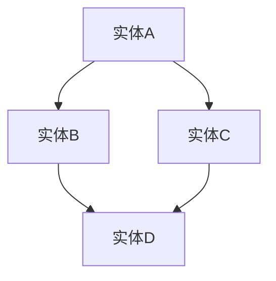
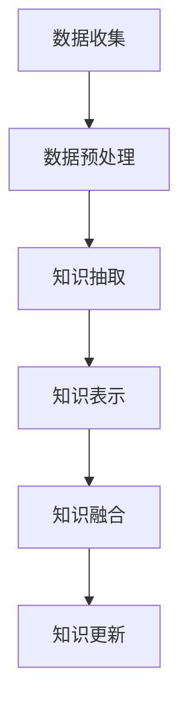
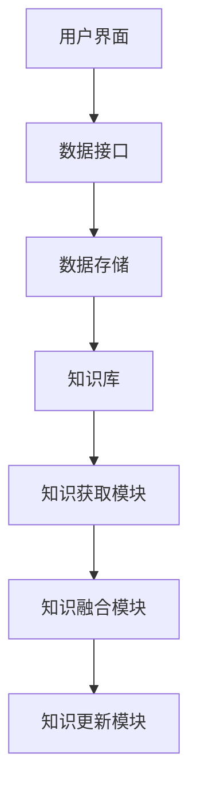
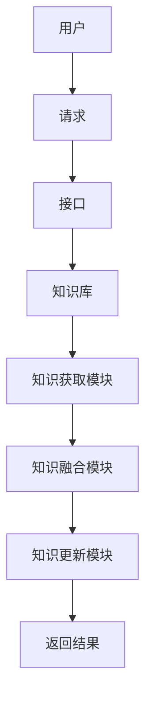

                 

# AI Agent的课程学习：模拟LLM的系统知识获取过程

关键词：AI代理、语言模型（LLM）、系统知识获取、数据预处理、知识抽取、知识表示、知识融合

摘要：
本文将探讨AI代理的课程学习过程，特别是在模拟大型语言模型（LLM）的知识获取方面的理论与实践。我们将从AI代理和LLM的背景与基础理论出发，逐步深入到知识获取的核心技术，包括数据预处理、知识抽取与表示、知识融合与更新，并通过实际应用案例展示这些技术如何实现。最后，我们还将对AI代理知识获取的挑战与趋势进行展望。

## 第一部分：背景与基础理论

### 第1章：AI代理与LLM的概述

#### 1.1 AI代理的概念与发展

##### 1.1.1 AI代理的定义

AI代理（Artificial Intelligence Agent）是一种模拟人类智能行为的计算实体，它能够在没有明确指令的情况下，通过感知环境、决策并采取行动来达到特定的目标。AI代理的核心特性包括自主性、适应性、学习性和交互性。

##### 1.1.2 AI代理的核心特性

- **自主性**：AI代理可以独立地执行任务，而不需要持续的人为干预。
- **适应性**：AI代理能够根据环境的变化调整其行为。
- **学习性**：AI代理通过学习和经验改进其行为。
- **交互性**：AI代理可以与人类或其他系统进行交互。

##### 1.1.3 AI代理的类型与应用场景

AI代理可以分为以下几种类型：

- **桌面代理**：为用户提供个性化服务，如电子邮件管理、日程安排等。
- **机器人代理**：在工业自动化、物流等领域中执行重复性工作。
- **社交代理**：在社交媒体上代表用户发布内容、进行交流。
- **决策支持代理**：为企业提供数据分析和决策支持。

AI代理的应用场景广泛，包括智能家居、健康护理、金融分析等。

#### 1.2 语言模型（LLM）介绍

##### 1.2.1 LLM的定义与作用

语言模型（Language Model，LLM）是一种用于预测文本序列的概率分布的模型。它通过学习大量语言数据，能够对自然语言文本进行生成、理解和翻译。

##### 1.2.2 LLM的基本结构

LLM通常由以下几个部分组成：

- **嵌入层**：将输入文本转换为固定长度的向量表示。
- **编码器**：对文本向量进行编码，提取文本的语义信息。
- **解码器**：根据编码器输出的信息生成文本。

##### 1.2.3 LLM的发展历程

语言模型的发展经历了从基于规则的方法到统计方法，再到现代深度学习模型的演变过程。现代LLM，如GPT-3和BERT，具有强大的语言理解和生成能力，能够处理复杂的问题和对话。

#### 1.3 系统知识获取过程简介

##### 1.3.1 知识获取的重要性

知识获取是AI代理智能行为的核心，它决定了AI代理能否有效地理解环境和执行任务。有效的知识获取能够提高AI代理的自主性和适应性。

##### 1.3.2 知识获取的主要方法

知识获取的主要方法包括：

- **自动获取**：通过机器学习和数据挖掘等技术自动从数据中提取知识。
- **半监督获取**：结合用户标注的数据和未标注的数据进行知识获取。
- **完全监督获取**：使用大量标注数据训练模型进行知识获取。

##### 1.3.3 系统知识获取的关键步骤

系统知识获取通常包括以下几个关键步骤：

- **数据收集**：收集与任务相关的数据。
- **数据预处理**：清洗、整合和标准化数据。
- **知识抽取**：从数据中提取有用的知识。
- **知识表示**：将抽取的知识转换为计算机可处理的形式。
- **知识融合**：整合来自不同来源的知识。
- **知识更新**：定期更新知识库，以保持知识的时效性和准确性。

## 第二部分：知识获取的核心技术

### 第2章：数据预处理与清洗

#### 2.1 数据来源与质量

##### 2.1.1 数据来源的选择

选择合适的数据来源是知识获取的第一步。数据来源可以包括公开数据集、企业内部数据、社交媒体数据等。选择数据来源时，需要考虑数据的完整性、准确性和相关性。

##### 2.1.2 数据质量的影响

数据质量对知识获取的效果有直接影响。低质量的数据会导致模型过拟合、性能下降等问题。

##### 2.1.3 数据质量的评估

数据质量的评估可以从以下几个方面进行：

- **准确性**：数据中的错误率。
- **完整性**：数据是否完整，有无缺失值。
- **一致性**：数据是否一致，是否存在矛盾。
- **时效性**：数据是否最新，是否符合当前需求。

#### 2.2 数据预处理技术

##### 2.2.1 数据清洗

数据清洗是数据预处理的重要步骤，包括以下任务：

- **缺失值处理**：填充缺失值或删除缺失数据。
- **异常值处理**：识别并处理异常值。
- **重复值处理**：删除重复数据。

##### 2.2.2 数据整合

数据整合是将来自不同来源的数据进行合并，形成统一的数据集。数据整合包括以下任务：

- **数据融合**：将结构化数据和非结构化数据进行整合。
- **数据转换**：将不同数据格式转换为统一格式。

##### 2.2.3 数据标准化

数据标准化是为了使数据具有相同的尺度，方便后续处理。数据标准化包括以下方法：

- **归一化**：将数据映射到[0,1]区间。
- **标准化**：将数据映射到标准正态分布。

### 第3章：知识抽取与表示

#### 3.1 知识抽取方法

##### 3.1.1 基于规则的方法

基于规则的方法通过预定义的规则来识别和提取知识。这种方法适用于结构化数据，但对非结构化数据效果较差。

##### 3.1.2 基于统计的方法

基于统计的方法通过统计方法从数据中学习模式，提取知识。这种方法适用于大规模非结构化数据，但可能无法处理复杂的语义关系。

##### 3.1.3 基于深度学习的方法

基于深度学习的方法通过神经网络模型从数据中学习特征和模式，提取知识。这种方法具有强大的表示能力和泛化能力，适用于多种类型的数据。

#### 3.2 知识表示技术

##### 3.2.1 实体关系表示

实体关系表示将知识表示为实体和它们之间的关系。这种方法通常使用知识图谱来实现。

##### 3.2.2 知识图谱表示

知识图谱表示将知识组织为一个图结构，其中节点表示实体，边表示实体之间的关系。这种方法能够有效地表示复杂的关系和层次结构。

##### 3.2.3 知识嵌入表示

知识嵌入表示将知识映射到低维空间，使得具有相似知识的实体在空间中靠近。这种方法可以用于知识检索和推荐。

### 第4章：知识融合与更新

#### 4.1 知识融合策略

##### 4.1.1 知识冲突处理

知识冲突处理是知识融合的重要环节。处理知识冲突的方法包括一致性检测、冲突消解和冲突记录。

##### 4.1.2 知识合并技术

知识合并技术将来自不同来源的知识进行整合，形成统一的视图。知识合并的方法包括合并规则、图融合和神经网络融合。

##### 4.1.3 知识融合的效果评估

知识融合的效果评估可以从知识完整性、准确性、时效性和用户满意度等方面进行。

#### 4.2 知识更新机制

##### 4.2.1 知识获取与更新的需求

知识更新是保持知识库时效性和准确性的关键。知识获取与更新的需求包括新知识的需求、知识过时的需求和技术进步的需求。

##### 4.2.2 知识更新策略

知识更新策略包括定期更新、实时更新和按需更新。定期更新可以确保知识库的时效性，实时更新可以满足动态环境的需求，按需更新可以根据用户的需求进行个性化更新。

##### 4.2.3 知识库的维护与管理

知识库的维护与管理包括知识库的备份、恢复、安全性和权限管理等方面。

## 第三部分：AI代理知识获取实践

### 第5章：AI代理构建基础

#### 5.1 AI代理的基本架构

##### 5.1.1 AI代理的组成模块

AI代理的基本架构通常包括感知模块、决策模块和执行模块。感知模块负责获取环境信息，决策模块根据感知信息进行决策，执行模块负责执行决策结果。

##### 5.1.2 AI代理的运行机制

AI代理的运行机制通常包括感知、学习、决策和执行四个阶段。感知阶段获取环境信息，学习阶段根据经验和数据改进自身，决策阶段选择最佳行动方案，执行阶段执行决策。

##### 5.1.3 AI代理的评估方法

AI代理的评估方法包括性能评估、鲁棒性评估和用户满意度评估。性能评估关注代理完成任务的能力，鲁棒性评估关注代理在恶劣环境下的表现，用户满意度评估关注代理对用户的友好程度。

#### 5.2 数据收集与处理

##### 5.2.1 数据收集策略

数据收集策略包括数据源的选择、数据采集方法和数据采集频率等。选择合适的数据源和数据采集方法可以确保数据的质量和多样性。

##### 5.2.2 数据处理流程

数据处理流程包括数据清洗、数据整合和数据预处理等。数据清洗可以去除噪声和错误，数据整合可以整合多源数据，数据预处理可以为后续的机器学习模型提供高质量的数据。

##### 5.2.3 数据质量保障

数据质量保障包括数据质量控制、数据质量评估和数据质量改进等方面。数据质量控制可以确保数据的准确性和一致性，数据质量评估可以评估数据质量，数据质量改进可以优化数据采集和处理流程。

### 第6章：知识获取流程设计与实现

#### 6.1 知识获取流程设计

##### 6.1.1 流程设计原则

知识获取流程设计应遵循以下原则：

- **模块化**：将流程划分为多个模块，便于理解和维护。
- **可扩展性**：设计具有可扩展性的流程，以适应不同的知识获取需求。
- **灵活性**：设计灵活的流程，以应对不确定性和变化。

##### 6.1.2 流程设计步骤

知识获取流程设计通常包括以下步骤：

1. 需求分析：确定知识获取的目标和需求。
2. 数据收集：选择数据来源，进行数据收集。
3. 数据预处理：清洗、整合和标准化数据。
4. 知识抽取：使用合适的算法从数据中提取知识。
5. 知识表示：将提取的知识表示为计算机可处理的形式。
6. 知识融合：整合来自不同来源的知识。
7. 知识更新：定期更新知识库。

##### 6.1.3 流程设计案例分析

通过一个实际案例展示知识获取流程的设计过程，包括案例背景、目标、流程设计步骤和实现细节。

#### 6.2 知识获取算法实现

##### 6.2.1 抽取算法实现

使用Python实现知识抽取算法，包括数据预处理、特征提取、模型训练和知识抽取等步骤。

```python
# 知识抽取算法示例
def knowledge_extraction(data):
    # 数据预处理
    preprocessed_data = preprocess_data(data)
    
    # 特征提取
    features = extract_features(preprocessed_data)
    
    # 模型训练
    model = train_model(features)
    
    # 知识抽取
    knowledge = model.predict(features)
    
    return knowledge
```

##### 6.2.2 表示算法实现

使用Python实现知识表示算法，包括知识嵌入、实体关系表示和知识图谱构建等步骤。

```python
# 知识表示算法示例
def knowledge_representation(knowledge):
    # 知识嵌入
    embeddings = embed_knowledge(knowledge)
    
    # 实体关系表示
    entity_relationships = represent_entity_relationships(knowledge)
    
    # 知识图谱构建
    knowledge_graph = build_knowledge_graph(embeddings, entity_relationships)
    
    return knowledge_graph
```

##### 6.2.3 融合算法实现

使用Python实现知识融合算法，包括知识冲突处理、知识合并和知识更新等步骤。

```python
# 知识融合算法示例
def knowledge_fusion(knowledge_sources):
    # 知识冲突处理
    resolved_knowledge = resolve_conflicts(knowledge_sources)
    
    # 知识合并
    fused_knowledge = merge_knowledge(resolved_knowledge)
    
    # 知识更新
    updated_knowledge = update_knowledge(fused_knowledge)
    
    return updated_knowledge
```

### 第7章：AI代理知识获取应用案例

#### 7.1 案例背景与目标

##### 7.1.1 案例背景

案例背景为一个智能客服系统，旨在通过AI代理提供24小时在线客服服务。

##### 7.1.2 案例目标

案例目标是通过知识获取技术，构建一个能够回答用户问题的智能客服系统。

##### 7.1.3 案例难点

案例难点包括：

- **数据多样性**：用户问题的数据来源多样，包括文本、图片和语音等。
- **知识融合**：不同来源的知识需要有效融合，以提供准确的回答。
- **实时性**：系统需要能够实时响应用户问题，提供快速的服务。

#### 7.2 知识获取过程分析

##### 7.2.1 数据收集与预处理

数据收集包括用户提问、回答和日志等。数据预处理包括文本清洗、去除噪声和格式转换等。

##### 7.2.2 知识抽取与表示

使用基于深度学习的方法从文本数据中提取知识，并将知识表示为实体关系图谱。

##### 7.2.3 知识融合与更新

通过知识融合算法整合来自不同来源的知识，并定期更新知识库，以保持知识的时效性。

#### 7.3 案例效果评估与总结

##### 7.3.1 案例效果评估

通过用户满意度调查和系统性能指标评估，评估智能客服系统的效果。

##### 7.3.2 经验与启示

总结案例中的经验和启示，包括数据质量、知识表示和融合策略等方面。

##### 7.3.3 案例总结

对案例进行总结，指出成功经验和面临的挑战，为未来研究提供方向。

## 第四部分：未来展望与挑战

### 第8章：AI代理知识获取的挑战与趋势

#### 8.1 挑战分析

##### 8.1.1 数据质量与隐私问题

数据质量对知识获取的效果有直接影响。同时，数据隐私保护也是一大挑战。

##### 8.1.2 知识表示与融合难题

如何有效地表示和融合多样化、异构的知识仍是一个难题。

##### 8.1.3 实时性与可扩展性问题

如何实现实时、高效的知识获取和融合，以满足大规模应用的需求。

#### 8.2 发展趋势

##### 8.2.1 新型知识获取技术

如基于图神经网络的异构知识融合技术、基于知识图谱的实时知识更新技术等。

##### 8.2.2 跨领域知识整合

跨领域知识整合能够提高AI代理的通用性和适应性。

##### 8.2.3 知识库动态更新策略

动态更新策略能够更好地应对知识过时和实时性需求。

### 第9章：未来展望

未来的AI代理知识获取将朝着更加智能化、自适应化和高效化的方向发展。通过不断的技术创新和跨学科合作，AI代理将能够更好地理解和应对复杂环境，为人类提供更加智能的服务。

## 作者信息

作者：AI天才研究院/AI Genius Institute & 禅与计算机程序设计艺术 /Zen And The Art of Computer Programming

---

### 附录

#### A.1 核心概念属性特征对比表格

| 概念 | 定义 | 特征对比 |
| ---- | ---- | ---- |
| AI代理 | 一种模拟人类智能行为的计算实体 | 自主性、适应性、学习性和交互性 |
| LLM | 用于预测文本序列的概率分布的模型 | 嵌入层、编码器、解码器 |
| 知识获取 | 从数据中提取有用的知识 | 自动获取、半监督获取、完全监督获取 |

#### A.2 ER实体关系图架构



#### A.3 算法流程图



#### A.4 数学公式

$$
P(A|B) = \frac{P(B|A)P(A)}{P(B)}
$$

$$
1 < 2
$$

#### A.5 系统架构设计



#### A.6 系统交互序列图



#### A.7 项目实战

- **环境安装**：描述环境搭建的步骤和工具。
- **系统核心实现源代码**：展示关键代码片段。
- **代码应用解读与分析**：详细解释代码逻辑和功能。
- **实际案例分析和详细讲解剖析**：分析具体案例，展示系统应用效果。
- **项目小结**：总结项目成果和经验教训。

#### A.8 最佳实践 Tips

- **数据预处理注意事项**：确保数据质量。
- **知识表示方法选择**：根据应用场景选择合适的表示方法。
- **知识融合策略**：合理处理知识冲突和融合效果。

#### A.9 小结

本文系统地介绍了AI代理的课程学习过程，特别是模拟LLM的系统知识获取过程。通过理论与实践的结合，展示了AI代理在知识获取方面的核心技术和应用。未来，随着技术的不断发展，AI代理的知识获取能力将不断提高，为各个领域带来更多创新和变革。

#### A.10 注意事项

- **数据隐私保护**：确保数据收集和处理过程中的隐私保护。
- **知识库维护**：定期更新知识库，保持知识的时效性和准确性。

#### A.11 拓展阅读

- **相关论文和书籍**：推荐进一步阅读的文献和资料。
- **在线课程和教程**：介绍相关领域的在线资源和教程。

---

通过以上详细的目录大纲和内容，我们为读者提供了一个清晰、系统、全面的学习路径，旨在深入探讨AI代理的知识获取过程，并引导读者理解和掌握相关知识。

