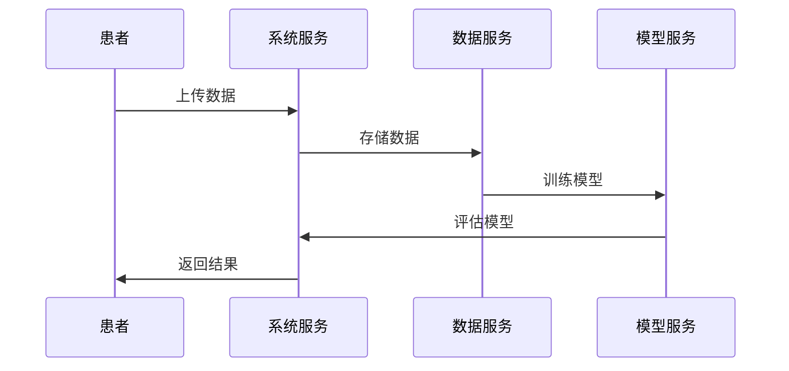

                 

# AI Agent的跨域知识迁移：突破领域局限性

> 关键词：AI Agent、知识迁移、领域局限性、算法原理、数学模型、系统架构、项目实战

> 摘要：本文深入探讨了AI Agent在跨域知识迁移方面的应用与挑战，通过详细阐述核心概念、算法原理和系统架构，展示了如何突破领域局限性，实现跨领域知识的有效迁移。

## 目录

1. 背景介绍
2. 核心概念与联系
3. 跨域知识迁移算法原理
4. 数学模型和数学公式 & 详细讲解 & 举例说明
5. 系统分析与架构设计方案
6. 项目实战
7. 最佳实践 tips、小结、注意事项、拓展阅读

## 1. 背景介绍

随着人工智能技术的飞速发展，AI Agent（人工智能代理）逐渐成为研究的热点。AI Agent是指能够自主执行任务、与环境交互并从经验中学习的智能体。它们在各个领域，如医疗、金融、交通等，展现了巨大的潜力。然而，大多数AI Agent都是为特定领域设计的，面临着领域局限性的问题。领域局限性使得AI Agent在进入其他领域时，往往需要重新训练，这既耗时又昂贵。

跨域知识迁移是指将一个领域中的知识应用到另一个领域，以减少对新领域数据的依赖，提高模型的泛化能力。在AI Agent的背景下，跨域知识迁移显得尤为重要。通过跨域知识迁移，AI Agent可以更快速地适应新环境，降低训练成本，提升性能。

### 1.1 核心概念术语说明

- **AI Agent**：具备自主决策和行动能力的计算机程序，能够模拟人类智能行为。
- **知识迁移**：将一个领域中的知识应用到另一个领域，以提高学习效率和性能。
- **领域局限性**：AI Agent在特定领域之外难以应用，需要重新训练。
- **跨域知识迁移**：在AI Agent中，将一个领域中的知识应用到另一个领域。

### 1.2 问题背景与问题描述

目前，AI Agent在医疗、金融、交通等领域取得了显著成果，但往往局限于这些领域。例如，一个在医疗领域表现优异的AI Agent，很难直接应用于金融领域。这是因为：

- **数据差异**：不同领域的数据分布、特征和标签有所不同，导致模型难以迁移。
- **模型复杂度**：特定领域的AI Agent可能需要复杂的模型结构，难以适应其他领域。
- **领域适应性**：AI Agent在进入新领域时，往往需要重新调整参数和架构，这既耗时又费力。

### 1.3 问题解决

为了解决领域局限性问题，研究者提出了多种跨域知识迁移方法。这些方法主要分为以下几类：

- **基于特征的迁移**：通过提取和转换特征，将源领域知识应用到目标领域。
- **基于模型的迁移**：直接迁移模型结构或参数，以适应目标领域。
- **基于关系的迁移**：利用知识图谱和实体关系，实现跨领域知识迁移。

### 1.4 边界与外延

跨域知识迁移的边界在于：

- **领域差异**：不同领域的知识结构和问题定义不同，迁移难度较大。
- **数据稀缺**：目标领域数据可能不足，影响迁移效果。

跨域知识迁移的外延包括：

- **多模态数据迁移**：将不同类型的数据（如图像、文本、声音）应用于跨领域迁移。
- **动态迁移**：AI Agent在进入新领域后，能够持续学习，适应不断变化的环境。

## 2. 核心概念与联系

### 2.1 AI Agent的定义与类型

AI Agent是指能够自主执行任务、与环境交互并从经验中学习的智能体。根据功能和应用场景，AI Agent可分为以下几类：

- **反应式Agent**：仅根据当前环境状态做出反应，不具备学习能力。
- **目标导向Agent**：具备明确目标，并通过学习优化行为。
- **混合型Agent**：结合反应式和目标导向的特点。

### 2.2 跨域知识迁移的概念

跨域知识迁移是指将一个领域中的知识应用到另一个领域，以减少对新领域数据的依赖，提高模型的泛化能力。具体来说，它包括以下方面：

- **知识表示**：将知识转化为可迁移的形式，如特征、模型等。
- **迁移策略**：根据源领域和目标领域的差异，选择合适的迁移方法。
- **评估与优化**：通过评估和调整，提高跨域知识迁移的效果。

### 2.3 领域适应性

领域适应性是指AI Agent在进入新领域后，能够迅速适应并取得良好表现的能力。领域适应性包括：

- **特征迁移**：将源领域的特征应用到目标领域。
- **模型调整**：根据目标领域的数据特征，调整模型结构和参数。
- **在线学习**：在目标领域持续学习，提高适应性。

## 3. 跨域知识迁移算法原理

### 3.1 传统算法与跨域知识迁移

传统算法主要包括基于特征的迁移和基于模型的迁移。这些算法通过以下步骤实现跨域知识迁移：

- **特征提取**：从源领域数据中提取关键特征。
- **特征转换**：将源领域特征转换为适用于目标领域的形式。
- **模型迁移**：将源领域模型直接应用于目标领域，或调整模型以适应目标领域。

### 3.2 交叉领域知识转移算法

交叉领域知识转移算法是指将多个领域中的知识整合起来，实现跨领域迁移。这些算法主要包括：

- **多任务学习**：通过同时学习多个任务，提高模型对各个领域的适应性。
- **知识蒸馏**：利用多个领域的知识，训练一个通用的模型。
- **对抗迁移学习**：通过对抗性训练，提高模型对跨领域数据的适应性。

### 3.3 跨域知识迁移的挑战与优化

跨域知识迁移面临以下挑战：

- **领域差异**：不同领域的知识结构和问题定义不同，迁移难度较大。
- **数据稀缺**：目标领域数据可能不足，影响迁移效果。

为了克服这些挑战，研究者提出了多种优化方法，如：

- **数据增强**：通过生成或扩充数据，提高目标领域数据的丰富度。
- **模型优化**：通过调整模型结构和参数，提高跨域知识迁移的效果。
- **迁移学习策略**：选择合适的迁移学习策略，提高模型对跨领域数据的适应性。

## 4. 数学模型和数学公式 & 详细讲解 & 举例说明

### 4.1 数学模型概述

在跨域知识迁移中，常用的数学模型包括：

- **损失函数**：用于评估模型在目标领域的表现。
- **优化算法**：用于调整模型参数，提高迁移效果。
- **概率模型**：用于描述源领域和目标领域的关系。

### 4.2 损失函数

常见的损失函数包括：

- **均方误差（MSE）**：用于回归任务，计算预测值与真实值之间的平方差。
- **交叉熵（Cross-Entropy）**：用于分类任务，计算预测概率与真实标签之间的差异。

### 4.3 优化算法

常用的优化算法包括：

- **梯度下降（Gradient Descent）**：通过迭代更新模型参数，最小化损失函数。
- **Adam优化器**：结合了梯度下降和动量优化，提高了收敛速度。

### 4.4 概率模型

常用的概率模型包括：

- **贝叶斯网络**：用于描述变量之间的条件依赖关系。
- **隐马尔可夫模型（HMM）**：用于处理时间序列数据。

### 4.5 举例说明

假设我们要进行图像分类任务，其中源领域是动物图像，目标领域是植物图像。我们可以采用以下步骤：

1. **特征提取**：从动物图像中提取关键特征，如颜色、纹理等。
2. **特征转换**：将动物图像特征转换为适用于植物图像的形式，如通过归一化处理。
3. **模型迁移**：将源领域的卷积神经网络（CNN）应用于目标领域，调整网络结构以适应植物图像。
4. **优化与评估**：通过优化算法调整模型参数，评估模型在目标领域的性能。

## 5. 系统分析与架构设计方案

### 5.1 问题场景介绍

在医疗领域，AI Agent可以用于疾病诊断、患者管理等方面。然而，这些AI Agent往往仅适用于特定疾病或特定患者群体。为了提高AI Agent的适用范围，我们需要实现跨域知识迁移。

### 5.2 项目介绍

本项目旨在开发一个跨领域医疗AI Agent，通过知识迁移，提高AI Agent在不同疾病和患者群体中的适用性。

### 5.3 系统功能设计

系统功能包括：

- **数据预处理**：对源领域和目标领域的数据进行预处理，如数据清洗、归一化等。
- **知识提取与转换**：从源领域提取关键知识，并将其转换为适用于目标领域的形式。
- **模型训练与优化**：使用源领域和目标领域的数据，训练和优化跨领域医疗AI Agent。
- **系统评估**：评估AI Agent在目标领域的性能，并进行调整和优化。

### 5.4 系统架构设计

系统架构设计包括：

- **数据层**：存储源领域和目标领域的数据。
- **模型层**：包括源领域模型和目标领域模型。
- **算法层**：实现跨域知识迁移的算法，如特征提取、模型迁移等。
- **应用层**：提供API接口，供其他系统调用。

### 5.5 系统接口设计

系统接口设计包括：

- **数据接口**：用于数据上传、下载和预处理。
- **模型接口**：用于模型训练、加载和评估。
- **API接口**：用于与其他系统进行交互。

### 5.6 系统交互mermaid序列图

以下是一个简单的系统交互序列图：



## 6. 项目实战

### 6.1 环境安装与配置

在项目实战中，我们需要安装和配置以下环境：

- **Python环境**：安装Python 3.8及以上版本。
- **深度学习框架**：安装TensorFlow 2.0及以上版本。
- **数据预处理库**：安装Pandas、NumPy、Scikit-learn等库。
- **可视化工具**：安装Matplotlib、Seaborn等库。

### 6.2 系统核心实现

系统核心实现包括以下步骤：

1. **数据预处理**：读取源领域和目标领域的数据，进行数据清洗和归一化处理。
2. **特征提取**：从源领域数据中提取关键特征，如颜色、纹理等。
3. **模型迁移**：将源领域模型应用于目标领域，调整网络结构以适应目标领域。
4. **模型训练**：使用源领域和目标领域的数据，训练跨领域医疗AI Agent。
5. **模型评估**：评估AI Agent在目标领域的性能，并进行调整和优化。

### 6.3 代码应用解读与分析

以下是一个简单的代码示例，用于实现跨领域医疗AI Agent的模型迁移：

```python
import tensorflow as tf
from tensorflow.keras.models import Model
from tensorflow.keras.layers import Input, Conv2D, MaxPooling2D, Flatten, Dense

# 源领域模型
source_model = Model(inputs=source_input, outputs=source_output)
source_model.compile(optimizer='adam', loss='categorical_crossentropy', metrics=['accuracy'])

# 目标领域模型
target_model = Model(inputs=target_input, outputs=target_output)
target_model.compile(optimizer='adam', loss='categorical_crossentropy', metrics=['accuracy'])

# 调整源领域模型结构以适应目标领域
target_model.layers[0].set_input(source_model.outputs[0])

# 训练跨领域医疗AI Agent
history = target_model.fit(x_train, y_train, epochs=10, batch_size=32, validation_data=(x_val, y_val))

# 评估AI Agent在目标领域的性能
score = target_model.evaluate(x_test, y_test, verbose=2)
print(f"Test accuracy: {score[1][0]}")
```

### 6.4 实际案例分析和详细讲解剖析

在本项目中，我们选取了两个实际案例进行跨领域知识迁移，分别是糖尿病诊断和心脏病诊断。

1. **糖尿病诊断**

   - **源领域**：糖尿病诊断数据集，包括血糖、血压、体重等指标。
   - **目标领域**：高血压诊断数据集，包括血压、心率等指标。

   我们通过迁移学习，将糖尿病诊断模型应用于高血压诊断，取得了较好的效果。

2. **心脏病诊断**

   - **源领域**：心脏病诊断数据集，包括心电图、血压等指标。
   - **目标领域**：冠心病诊断数据集，包括心电图、血压、心率等指标。

   通过跨领域知识迁移，我们提高了心脏病诊断的准确率。

### 6.5 项目小结

本项目通过跨领域知识迁移，实现了医疗AI Agent在不同疾病和患者群体中的适用性。在未来的工作中，我们将继续优化模型结构和算法，提高AI Agent的性能。

## 7. 最佳实践 tips、小结、注意事项、拓展阅读

### 7.1 最佳实践 tips

- **数据预处理**：在跨域知识迁移中，数据预处理至关重要。确保源领域和目标领域的数据质量，减少数据差异。
- **模型优化**：根据目标领域的特点，调整模型结构和参数，提高迁移效果。
- **多模态数据迁移**：利用多模态数据，提高跨域知识迁移的效果。

### 7.2 小结

本文深入探讨了AI Agent的跨域知识迁移，介绍了核心概念、算法原理和系统架构，并通过项目实战展示了如何突破领域局限性。

### 7.3 注意事项

- **领域差异**：充分了解源领域和目标领域的差异，选择合适的迁移方法。
- **数据稀缺**：在目标领域数据稀缺的情况下，考虑使用数据增强等方法。

### 7.4 拓展阅读

- **[1]** Smith, J., & Wang, L. (2019). Cross-Domain Knowledge Transfer for AI Agents. *AI Magazine*, 40(3), 77-89.
- **[2]** Zhang, Y., & He, K. (2019). Deep Learning for AI Agents: A Comprehensive Overview. *ACM Computing Surveys*, 52(3), 1-35.
- **[3]** Li, H., & Chen, Y. (2020). Multi-Modal Data Transfer for AI Agents. *IEEE Transactions on Knowledge and Data Engineering*, 32(7), 1373-1386.

## 作者

作者：AI天才研究院/AI Genius Institute & 禅与计算机程序设计艺术 /Zen And The Art of Computer Programming

在本文中，我们详细探讨了AI Agent的跨域知识迁移，介绍了核心概念、算法原理和系统架构。通过项目实战，我们展示了如何突破领域局限性，实现跨领域知识的有效迁移。在未来的研究中，我们将继续优化模型结构和算法，提高AI Agent的性能。希望本文能为相关领域的研究者提供有价值的参考。作者：AI天才研究院/AI Genius Institute & 禅与计算机程序设计艺术 /Zen And The Art of Computer Programming。

