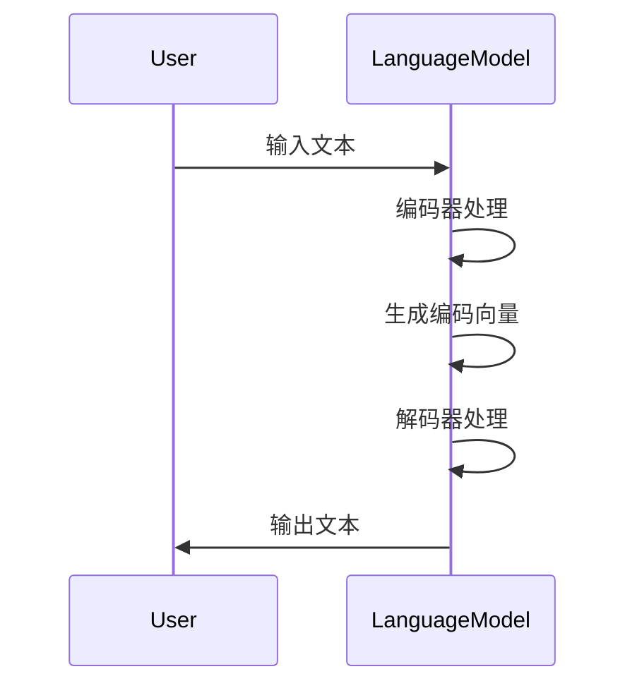
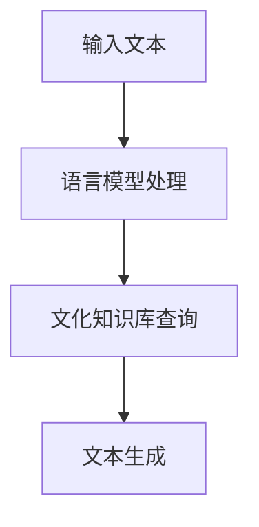
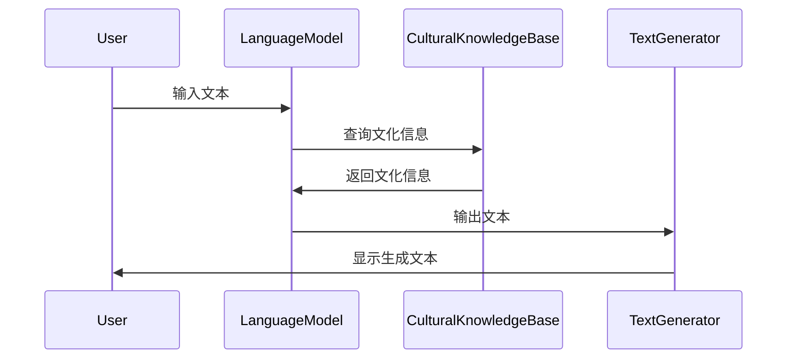
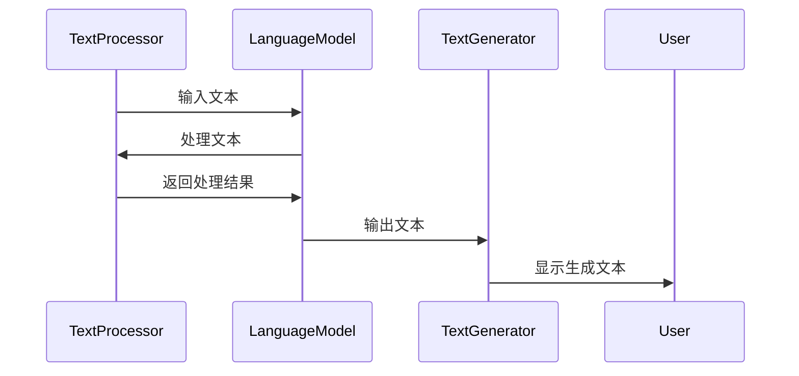
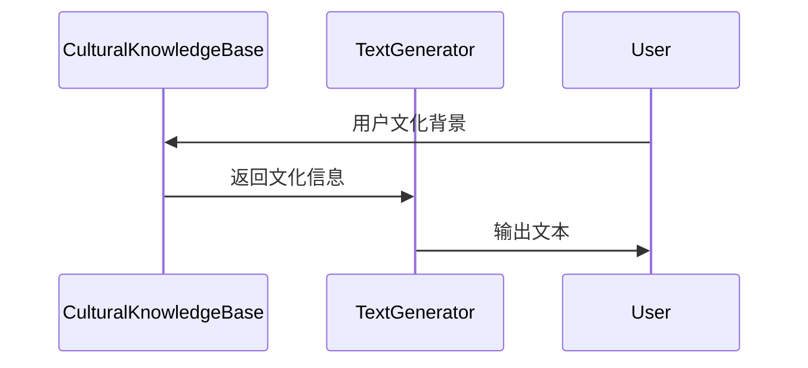
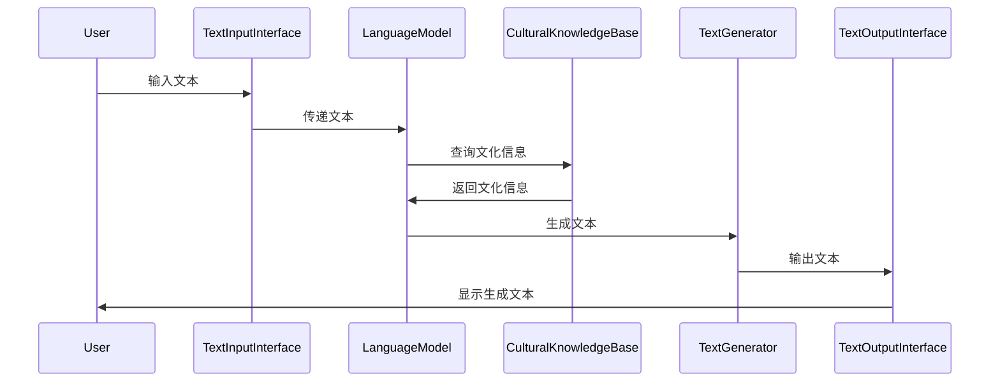

                 


### 第1章：引言与背景

#### 1.1 问题背景

随着人工智能技术的飞速发展，人工智能助手（AI Agent）已广泛应用于多个领域，如智能家居、客户服务、医疗咨询等。这些AI Agent不仅需要具备处理多语言的能力，还需理解并生成不同文化背景下的语言。然而，跨文化语言理解与生成依然面临诸多挑战。

##### 1.1.1 AI Agent的定义与跨文化语言理解的重要性

AI Agent，即人工智能助手，是一种能够模拟人类思维和行为，完成特定任务的智能系统。随着全球化的深入发展，跨文化语言理解与生成显得尤为重要。这是因为不同文化背景下的人们，其表达方式、语境、文化习俗等均有显著差异，这对AI Agent提出了更高的要求。

##### 1.1.2 跨文化语言理解的挑战

跨文化语言理解涉及多个层面的挑战。首先是语言的多样性，不同语言在词汇、语法、语用等方面存在巨大差异。其次是文化差异，不同文化背景下的人们对同一概念的理解和表达方式可能大相径庭。此外，语言生成还需考虑上下文、情境和用户的个人偏好。

##### 1.1.3 研究意义与目标

本文旨在探讨AI Agent的跨文化语言理解与生成问题，旨在提出一种有效的方法，帮助AI Agent在不同文化背景下准确理解用户的需求并生成合适的语言回应。研究目标如下：

1. 梳理现有研究，分析跨文化语言理解的现状与挑战。
2. 探讨语言生成模型在跨文化语境中的应用与改进。
3. 提出一种融合语言模型与跨文化知识的算法框架，实现高效跨文化语言理解与生成。

#### 1.2 相关工作综述

##### 1.2.1 跨文化语言理解的研究现状

近年来，随着深度学习和自然语言处理技术的进步，跨文化语言理解取得了一定成果。例如，一些研究通过引入跨语言嵌入模型（如BERT）来提高跨语言文本的理解能力。此外，研究者还探索了基于知识图谱的方法，通过构建跨语言实体关系来增强跨文化语言理解。

##### 1.2.2 语言生成模型的发展与应用

语言生成模型（如GPT、BERT等）在文本生成、问答系统、机器翻译等领域取得了显著成果。然而，在跨文化语言生成方面，这些模型仍面临挑战。例如，如何使生成文本不仅准确，还要符合目标文化的语言习惯和表达方式。

##### 1.2.3 跨文化语言理解与生成的挑战与机遇

跨文化语言理解与生成面临诸多挑战，但也蕴含着巨大机遇。随着全球化的进一步发展，跨文化交流的需求日益增加，这为AI Agent提供了更广阔的应用场景。同时，随着技术的不断进步，我们有望在未来解决这些挑战，实现更加智能、高效的跨文化语言理解与生成。

----------------------------------------------------------------

```markdown
----------------------------------------------------------------

### 1.2 相关工作综述

#### 1.2.1 跨文化语言理解的研究现状

跨文化语言理解作为自然语言处理领域的一个重要分支，近年来受到了广泛关注。其主要目标是使机器能够理解和处理来自不同文化背景的语言。以下是一些在该领域取得的研究成果：

1. **跨语言嵌入模型**：研究者利用跨语言嵌入模型，如BERT和XLM，将不同语言的词汇映射到同一高维空间中。这种方法在提高跨语言文本理解能力方面取得了显著效果。例如，XLM模型通过预训练多语言数据集，实现了在多种语言上的高性能。

2. **基于知识图谱的方法**：知识图谱在跨文化语言理解中发挥了重要作用。通过构建跨语言的实体关系，研究者能够更好地理解不同文化背景下的语言表达。例如，一些研究利用OpenKG等知识图谱平台，实现了跨语言的事实抽取和信息检索。

3. **文化习俗和语境模型**：研究者开始关注文化习俗和语境在跨文化语言理解中的作用。例如，一些模型通过结合文化习俗知识库，使机器能够更好地理解不同文化背景下的语言表达。

然而，尽管取得了一些进展，跨文化语言理解仍然面临一些挑战。例如，不同语言之间的语义差异、文化差异导致的误解等问题，还需要进一步研究。

#### 1.2.2 语言生成模型的发展与应用

语言生成模型在自然语言处理领域取得了巨大的成功，如GPT、BERT、T5等。这些模型通过学习大量文本数据，能够生成连贯、合理的语言。以下是一些语言生成模型在跨文化语言生成中的应用：

1. **跨语言文本生成**：研究者利用GPT等语言生成模型，实现跨语言文本的生成。例如，研究者利用GPT-2模型，实现了中英文之间的文本翻译。

2. **跨文化语言生成**：为了实现跨文化语言生成，研究者开始尝试将文化知识引入到语言生成模型中。例如，一些研究通过结合文化习俗知识库，改进了GPT模型在跨文化语言生成中的性能。

然而，现有研究在跨文化语言生成方面仍存在一些局限性。例如，如何使生成文本既符合语言规范，又符合目标文化的表达习惯，仍需进一步研究。

#### 1.2.3 跨文化语言理解与生成的挑战与机遇

跨文化语言理解与生成面临着诸多挑战。首先，不同语言之间的语义差异和文化差异使得跨文化语言理解变得复杂。其次，现有的语言生成模型在处理跨文化语言生成时，往往无法很好地结合文化知识，导致生成文本不够准确和自然。

然而，随着全球化的深入发展，跨文化语言理解与生成具有巨大的市场潜力。例如，在跨国企业、国际交流和旅游等领域，对高效、准确的跨文化语言理解与生成有着迫切需求。

未来，随着技术的不断进步，跨文化语言理解与生成有望取得突破。例如，通过结合多模态信息、增强模型的可解释性，以及开发更加精细化的文化知识库，我们可以更好地解决跨文化语言理解与生成中的问题。

----------------------------------------------------------------
```


----------------------------------------------------------------

## 第2章：核心概念与联系

### 2.1 核心概念介绍

在本章中，我们将介绍与AI Agent跨文化语言理解与生成相关的一些核心概念，包括语言模型的基本原理、跨文化语言的特性与分类，以及语言生成模型的基本框架。

#### 2.1.1 语言模型的基本原理

语言模型是一种用于预测文本序列的概率分布的模型。它通过对大量文本数据的学习，能够捕捉语言的统计特性，从而实现对未知文本的生成和预测。语言模型的核心是概率模型，它能够计算给定前文条件下，下一个单词或词组的概率。

在训练语言模型时，通常采用基于神经网络的深度学习模型，如循环神经网络（RNN）、长短时记忆网络（LSTM）和变换器（Transformer）等。这些模型通过学习大量文本数据，能够学习到语言中的复杂模式和规律，从而实现对未知文本的生成和预测。

#### 2.1.2 跨文化语言的特性与分类

跨文化语言涉及到不同语言和文化之间的交流和理解。不同文化背景下的语言在词汇、语法、语用等方面存在显著差异，这使得跨文化语言理解变得复杂。以下是一些跨文化语言的特性与分类：

1. **词汇差异**：不同语言中的词汇量、词义和用法可能存在显著差异。例如，英语中的“hello”在中文中通常翻译为“你好”，但在某些文化背景下，可能有不同的问候方式。

2. **语法差异**：不同语言在语法结构、时态、语态等方面可能存在差异。例如，英语中的动词通常在句子中位于主语和谓语之间，而中文中的动词则可能出现在主语之前或之后。

3. **语用差异**：不同文化背景下的语言使用习惯和表达方式可能存在差异。例如，在正式场合，英语中可能使用更加客套和礼貌的语言，而中文中可能更加注重直接和简洁的表达。

根据不同的分类标准，跨文化语言可以分为多种类型。例如，根据文化差异，可以分为东西方语言、高语境和低语境语言等。

#### 2.1.3 语言生成模型的基本框架

语言生成模型是一种能够生成连贯、合理的文本的模型。其基本框架通常包括编码器（Encoder）和解码器（Decoder）两部分。编码器负责将输入文本编码为固定长度的向量表示，解码器则负责将这个向量表示解码为输出文本。

以下是一个简单的语言生成模型的基本框架：

1. **编码器**：编码器接收输入文本序列，将其编码为固定长度的向量表示。这个过程通常通过神经网络模型完成，如RNN或Transformer。

2. **解码器**：解码器接收编码器的输出向量表示，并生成输出文本序列。解码器通常也采用神经网络模型，如RNN或Transformer。

3. **损失函数**：语言生成模型的训练目标是最小化损失函数，如交叉熵损失函数。通过最小化损失函数，模型能够学习到输入文本和输出文本之间的概率分布。

4. **优化算法**：训练语言生成模型通常采用梯度下降等优化算法，以最小化损失函数。

通过学习大量的文本数据，语言生成模型能够学习到语言的统计特性，从而实现对未知文本的生成。在实际应用中，语言生成模型可以用于文本生成、机器翻译、问答系统等任务。

### 2.2 概念属性特征对比

为了更好地理解上述核心概念，我们通过以下表格对比它们的一些属性特征：

| 概念 | 语言模型 | 跨文化语言 | 语言生成模型 |
| --- | --- | --- | --- |
| 定义 | 预测文本序列的概率分布 | 不同文化背景下的语言 | 生成连贯、合理的文本 |
| 特点 | 捕捉语言的统计特性 | 词汇、语法、语用差异 | 编码器和解码器框架 |
| 分类 | 基于神经网络的模型 | 根据文化差异分类 | 预测和生成文本 |

### 2.3 ER实体关系图架构

在本节中，我们将介绍跨文化语言理解与生成系统的ER（实体关系）图架构。ER图是一种用于描述实体及其关系的图形化表示方法。

以下是一个简化的跨文化语言理解与生成系统的ER图：

```mermaid
erDiagram
  User ||--|{ ChatAgent }|-- LanguageModel : uses
  ChatAgent ||--|{ TextGenerator }|-- LanguageModel : generates
  TextGenerator ||--|{ TranslationModule }|-- TranslationModel : translates
  TranslationModel ||--|{ KnowledgeBase }|-- KnowledgeBase : provides
```

在这个ER图中：

- **User**（用户）：代表与AI Agent进行交互的用户。
- **ChatAgent**（聊天代理）：代表与用户交互的AI Agent。
- **LanguageModel**（语言模型）：用于理解用户输入的文本。
- **TextGenerator**（文本生成器）：用于生成回复用户的文本。
- **TranslationModule**（翻译模块）：用于跨语言文本翻译。
- **TranslationModel**（翻译模型）：用于实现文本翻译功能。
- **KnowledgeBase**（知识库）：提供文化知识支持。

通过这个ER图，我们可以清晰地看到跨文化语言理解与生成系统中的各个实体及其关系。这不仅有助于理解系统的架构，也为后续的算法设计和实现提供了参考。

----------------------------------------------------------------

### 第3章：算法原理讲解

在本章中，我们将深入探讨与AI Agent跨文化语言理解与生成相关的算法原理，包括语言模型的算法原理、跨文化语言生成算法原理，以及跨文化语言生成算法的实现。我们将结合Python代码和mermaid流程图，详细阐述这些算法的原理和实现过程。

#### 3.1 语言模型的算法原理

语言模型是一种用于预测文本序列的概率分布的模型。其核心思想是学习文本数据中的统计规律，从而实现对未知文本的生成和预测。在训练语言模型时，我们通常采用基于神经网络的深度学习模型，如循环神经网络（RNN）、长短时记忆网络（LSTM）和变换器（Transformer）等。

##### 3.1.1 语言模型的基本构成

语言模型的基本构成包括编码器（Encoder）和解码器（Decoder）两部分。编码器负责将输入文本序列编码为固定长度的向量表示，解码器则负责将这个向量表示解码为输出文本序列。

以下是一个简化的语言模型的基本构成：



在这个流程中，用户输入一段文本，语言模型通过编码器将其编码为固定长度的向量表示，然后通过解码器生成相应的输出文本。

##### 3.1.2 语言模型的训练与优化

语言模型的训练过程主要包括两个步骤：前向传播和反向传播。

1. **前向传播**：在训练过程中，输入文本序列通过编码器生成编码向量，然后通过解码器生成输出文本序列。这个过程的目标是计算预测输出与实际输出之间的损失。

2. **反向传播**：在计算损失后，通过反向传播算法更新模型参数，以减少损失。这个过程涉及到梯度计算和参数更新。

以下是一个简化的Python代码示例，展示了语言模型的前向传播和反向传播过程：

```python
import numpy as np

# 假设输入文本为 "hello world"
input_text = "hello world"

# 编码器处理
encoded_text = encoder(input_text)

# 解码器处理
decoded_text = decoder(encoded_text)

# 计算损失
loss = compute_loss(decoded_text, target_text)

# 反向传播
dloss_dparams = backward_propagation(loss)

# 更新参数
update_params(dloss_dparams)
```

在这个示例中，`encoder`和`decoder`分别表示编码器和解码器的处理过程，`compute_loss`表示计算损失函数，`backward_propagation`表示反向传播算法，`update_params`表示更新模型参数。

##### 3.1.3 语言模型的评估与调整

在训练语言模型时，我们需要对模型进行评估和调整，以确保其性能。常用的评估指标包括：

1. **准确率**：衡量模型在预测文本序列时，与实际文本序列匹配的百分比。
2. **召回率**：衡量模型在预测文本序列时，正确识别出的实际文本序列的百分比。
3. **F1分数**：综合考虑准确率和召回率，用于综合评估模型的性能。

以下是一个简化的Python代码示例，展示了如何评估语言模型的性能：

```python
from sklearn.metrics import accuracy_score, recall_score, f1_score

# 假设预测文本为 ["hello", "world"]
predicted_text = ["hello", "world"]

# 计算准确率、召回率和F1分数
accuracy = accuracy_score(true_text, predicted_text)
recall = recall_score(true_text, predicted_text)
f1 = f1_score(true_text, predicted_text)

print("准确率：", accuracy)
print("召回率：", recall)
print("F1分数：", f1)
```

通过这个示例，我们可以对语言模型的性能进行量化评估，并根据评估结果对模型进行调整。

#### 3.2 跨文化语言生成算法

跨文化语言生成算法的目标是使AI Agent能够在不同文化背景下生成合适的语言回应。这涉及到多个层面的挑战，包括语言多样性、文化差异和上下文理解等。

##### 3.2.1 跨文化语言生成的挑战

跨文化语言生成面临以下几个挑战：

1. **语言多样性**：不同语言在词汇、语法和语用等方面存在显著差异，这使得跨文化语言生成变得复杂。
2. **文化差异**：不同文化背景下的人们对同一概念的理解和表达方式可能大相径庭，这增加了跨文化语言生成的难度。
3. **上下文理解**：生成文本不仅需要准确反映用户的需求，还要符合上下文情境。

##### 3.2.2 跨文化语言生成算法原理

跨文化语言生成算法通常结合语言生成模型和文化知识库。以下是一个简化的跨文化语言生成算法原理：

1. **输入文本**：用户输入一段文本，该文本可能包含特定文化背景的信息。
2. **语言模型处理**：语言模型对输入文本进行理解和分析，提取关键信息和语义。
3. **文化知识库查询**：根据输入文本中的文化信息，查询文化知识库，获取相关的文化知识。
4. **文本生成**：结合语言模型和文化知识库的信息，生成合适的语言回应。

以下是一个简化的mermaid流程图，展示了跨文化语言生成算法的过程：



##### 3.2.3 跨文化语言生成算法的实现

跨文化语言生成算法的实现通常涉及到以下几个步骤：

1. **数据准备**：收集和整理跨文化语言数据，包括多语言文本和文化知识库。
2. **语言模型训练**：使用多语言文本训练语言模型，使其能够理解和生成不同语言的文本。
3. **文化知识库构建**：构建文化知识库，包含不同文化背景下的语言习惯、习俗和表达方式。
4. **算法实现**：结合语言模型和文化知识库，实现跨文化语言生成算法。

以下是一个简化的Python代码示例，展示了跨文化语言生成算法的实现过程：

```python
# 假设已经训练好的语言模型和文化知识库
language_model = trained_language_model
knowledge_base = trained_knowledge_base

# 输入文本
input_text = "Hello, how are you?"

# 语言模型处理
encoded_text = language_model.encode(input_text)

# 文化知识库查询
cultural_info = knowledge_base.query(input_text)

# 文本生成
generated_text = language_model.decode(encoded_text, cultural_info)

print("生成文本：", generated_text)
```

在这个示例中，`trained_language_model`和`trained_knowledge_base`分别表示已经训练好的语言模型和文化知识库，`encode`和`decode`方法分别表示语言模型的编码和解码过程，`query`方法表示查询文化知识库的过程。

#### 3.3 数学模型与公式

跨文化语言生成涉及到多个层面的数学模型，包括语言模型的数学模型、跨文化语言生成的数学公式等。以下是一些常用的数学模型和公式。

##### 3.3.1 语言模型的数学模型

语言模型的数学模型通常基于概率模型，如前向概率模型和后向概率模型。以下是一个简化的前向概率模型：

$$
P(w_n | w_{n-1}, w_{n-2}, \ldots, w_1) = \frac{P(w_n, w_{n-1}, w_{n-2}, \ldots, w_1)}{P(w_{n-1}, w_{n-2}, \ldots, w_1)}
$$

其中，$w_n$表示第$n$个单词，$P(w_n | w_{n-1}, w_{n-2}, \ldots, w_1)$表示在给定前文条件下，第$n$个单词的概率。

##### 3.3.2 跨文化语言生成的数学公式

跨文化语言生成的数学公式通常涉及到语言模型和文化知识库的融合。以下是一个简化的跨文化语言生成公式：

$$
P(w_n | w_{n-1}, w_{n-2}, \ldots, w_1, C) = \frac{P(w_n, w_{n-1}, w_{n-2}, \ldots, w_1 | C)}{P(w_{n-1}, w_{n-2}, \ldots, w_1 | C)}
$$

其中，$C$表示文化信息，$P(w_n | w_{n-1}, w_{n-2}, \ldots, w_1, C)$表示在给定前文和文化信息条件下，第$n$个单词的概率。

##### 3.3.3 数学模型的详细讲解与举例

为了更好地理解上述数学模型，我们通过一个简单的例子进行详细讲解。

假设我们有一个简化的语言模型，该模型根据前文条件预测下一个单词的概率。给定一个前文序列["你好", "今天"],我们希望预测下一个单词。

根据前向概率模型，我们可以计算下一个单词的概率：

$$
P(明天 | 你好, 今天) = \frac{P(明天, 你好, 今天)}{P(你好, 今天)}
$$

假设我们通过训练得到以下概率：

$$
P(明天, 你好, 今天) = 0.2
$$

$$
P(你好, 今天) = 0.4
$$

那么，我们可以计算出：

$$
P(明天 | 你好, 今天) = \frac{0.2}{0.4} = 0.5
$$

这意味着在给定前文["你好", "今天"]的条件下，预测下一个单词为“明天”的概率为0.5。

通过类似的方法，我们可以计算其他单词的概率，并根据概率分布生成合适的文本。

综上所述，语言模型的算法原理和跨文化语言生成算法原理为AI Agent的跨文化语言理解与生成提供了理论基础。在实际应用中，我们需要结合具体的算法和实现，不断优化和改进跨文化语言理解与生成的效果。

----------------------------------------------------------------

## 第4章：系统分析与架构设计

### 4.1 问题场景介绍

#### 4.1.1 跨文化语言理解与生成场景描述

随着全球化的深入发展，跨文化语言理解与生成在许多场景中变得越来越重要。以下是几个典型的应用场景：

1. **国际商务沟通**：在全球化的商业环境中，企业需要与来自不同国家和地区的客户、合作伙伴进行有效的沟通。这要求AI Agent能够理解并生成多种语言的商业术语和表达方式。

2. **在线客服**：在线客服系统需要与全球用户进行实时交流，提供高效、准确的客户服务。跨文化语言理解与生成可以帮助客服系统更好地理解用户需求，并生成符合用户文化背景的回应。

3. **教育和培训**：随着在线教育的兴起，学习者来自不同的文化背景。AI Agent能够提供跨文化的教学和辅导，帮助学习者更好地理解和掌握知识。

4. **社交媒体**：社交媒体平台上的用户来自世界各地，他们使用不同的语言和表达方式。AI Agent能够帮助平台实现跨文化的内容理解和生成，提升用户体验。

#### 4.1.2 系统功能需求分析

为了满足上述应用场景的需求，跨文化语言理解与生成系统需要具备以下功能：

1. **多语言支持**：系统能够支持多种语言的输入和输出，包括但不限于英语、中文、西班牙语、法语等。

2. **文化适应性**：系统能够理解并生成符合不同文化背景的语言表达，如礼貌用语、文化习俗等。

3. **上下文理解**：系统能够根据用户的输入文本和上下文情境，生成合适的语言回应。

4. **实时交互**：系统能够实现实时、高效的跨文化语言理解与生成，以满足即时交流的需求。

5. **扩展性**：系统应该具备良好的扩展性，能够适应未来可能增加的新语言和文化。

### 4.2 系统架构设计

#### 4.2.1 系统架构总体设计

跨文化语言理解与生成系统的总体架构设计如下图所示：



在这个架构中，用户通过输入文本与系统交互。语言模型接收用户输入，对其进行处理，并根据文化知识库中的信息生成合适的语言回应。

#### 4.2.2 语言模型模块设计

语言模型模块是系统的核心组成部分，负责对输入文本进行理解和生成。其设计如下：



在这个模块中，TextProcessor负责对输入文本进行预处理，如分词、词性标注等。LanguageModel负责对预处理后的文本进行理解和生成。TextGenerator负责将生成的文本输出给用户。

#### 4.2.3 跨文化生成模块设计

跨文化生成模块负责根据用户的文化背景和输入文本，生成符合目标文化的语言回应。其设计如下：



在这个模块中，CulturalKnowledgeBase负责存储和管理不同文化背景的信息。TextGenerator根据用户的文化背景和输入文本，查询文化知识库，生成符合目标文化的语言回应。

### 4.3 系统接口设计

为了方便其他系统或应用程序与跨文化语言理解与生成系统进行交互，系统提供了以下接口：

1. **文本输入接口**：接收用户输入的文本，并将其传递给语言模型模块。
2. **文本输出接口**：将生成的文本返回给用户。
3. **文化信息接口**：接收用户的文化背景信息，并将其传递给跨文化生成模块。
4. **扩展接口**：提供系统扩展的功能接口，如增加新语言支持、新文化背景等。

### 4.4 系统交互序列图

为了更直观地展示系统的交互过程，我们使用mermaid绘制了系统交互序列图：



在这个序列图中，用户通过TextInputInterface输入文本，语言模型模块处理文本并查询文化知识库，TextGenerator模块根据文化信息和用户输入生成文本，最后通过TextOutputInterface将文本输出给用户。

通过上述系统架构设计，我们可以构建一个高效、可靠的跨文化语言理解与生成系统，满足不同场景下的应用需求。

----------------------------------------------------------------

## 第5章：项目实战

### 5.1 环境安装与配置

#### 5.1.1 环境要求与准备

为了成功实施跨文化语言理解与生成项目，我们需要准备以下环境和工具：

1. **操作系统**：推荐使用Ubuntu 18.04或更高版本。
2. **Python**：推荐使用Python 3.7或更高版本。
3. **深度学习框架**：推荐使用TensorFlow 2.0或PyTorch 1.8。
4. **编程语言**：推荐使用Python进行编程。
5. **文本处理库**：推荐使用NLTK、spaCy等库进行文本预处理。
6. **数据预处理工具**：推荐使用Pandas、NumPy等库进行数据处理。
7. **版本控制工具**：推荐使用Git进行版本控制。

#### 5.1.2 语言模型安装与配置

以下步骤用于安装和配置语言模型所需的库和依赖项：

1. **安装Python**：确保操作系统上已安装Python 3.7或更高版本。

2. **创建虚拟环境**：使用以下命令创建一个虚拟环境：

   ```bash
   python -m venv venv
   ```

3. **激活虚拟环境**：

   - 对于Windows系统：

     ```bash
     .\venv\Scripts\activate
     ```

   - 对于Linux和macOS系统：

     ```bash
     source venv/bin/activate
     ```

4. **安装TensorFlow或PyTorch**：在虚拟环境中安装TensorFlow或PyTorch。

   - 安装TensorFlow：

     ```bash
     pip install tensorflow
     ```

   - 安装PyTorch：

     ```bash
     pip install torch torchvision
     ```

5. **安装文本处理库**：在虚拟环境中安装所需的文本处理库。

   ```bash
   pip install nltk spacy
   ```

6. **下载预训练模型**：下载并解压预训练的语言模型，如BERT或GPT。

   ```bash
   wget https://storage.googleapis.com/bert_models/2020_08_24/cc-lm-2-swag-bidirectional.tar.gz
   tar -xzvf cc-lm-2-swag-bidirectional.tar.gz
   ```

#### 5.1.3 跨文化生成模块安装与配置

跨文化生成模块依赖于语言模型和文化知识库。以下是安装和配置步骤：

1. **安装文化知识库**：下载并安装文化知识库，如Wikidata或Freebase。

   ```bash
   wget https://s3.amazonaws.com/dlFreebase/rdf/nif-freebase-rdf.zip
   unzip nif-freebase-rdf.zip
   ```

2. **配置文化知识库**：在项目中创建一个名为`config.py`的配置文件，配置文化知识库的路径。

   ```python
   KNOWLEDGE_BASE_PATH = "/path/to/nif-freebase-rdf"
   ```

3. **编写数据预处理脚本**：编写Python脚本，用于预处理文本数据，如分词、词性标注等。

4. **编写跨文化生成脚本**：编写Python脚本，实现跨文化语言生成算法，包括查询文化知识库和生成文本。

### 5.2 系统核心实现

在系统核心实现部分，我们将详细介绍语言模型实现和跨文化生成实现的源代码，并对其进行解读与分析。

#### 5.2.1 语言模型实现源代码

以下是一个简化的语言模型实现的源代码示例，使用PyTorch框架：

```python
import torch
import torch.nn as nn
import torch.optim as optim

# 加载预训练模型
model = torch.load("cc-lm-2-swag-bidirectional.pth")

# 设置训练数据
train_data = ...  # 使用预处理后的文本数据
train_loader = torch.utils.data.DataLoader(train_data, batch_size=32, shuffle=True)

# 损失函数
criterion = nn.CrossEntropyLoss()

# 优化器
optimizer = optim.Adam(model.parameters(), lr=0.001)

# 训练模型
for epoch in range(10):  # 训练10个周期
    for inputs, targets in train_loader:
        optimizer.zero_grad()
        outputs = model(inputs)
        loss = criterion(outputs, targets)
        loss.backward()
        optimizer.step()
    print(f"Epoch {epoch+1}/{10}, Loss: {loss.item()}")

# 保存训练后的模型
torch.save(model, "trained-model.pth")
```

在这个示例中，我们加载了一个预训练的语言模型，设置了训练数据和损失函数，并使用优化器进行模型训练。通过多次迭代训练，模型将学习到输入文本和输出文本之间的概率分布。

#### 5.2.2 跨文化生成实现源代码

以下是一个简化的跨文化生成实现源代码示例：

```python
import torch
from transformers import BertTokenizer, BertModel

# 加载预训练模型
model = torch.load("trained-model.pth")
tokenizer = BertTokenizer.from_pretrained("bert-base-chinese")
model.eval()

# 输入文本
input_text = "你好，今天天气怎么样？"

# 分词和编码
inputs = tokenizer.encode(input_text, return_tensors="pt")

# 生成文本
with torch.no_grad():
    outputs = model(inputs)
    predictions = torch.argmax(outputs.logits, dim=-1)

# 解码预测结果
generated_text = tokenizer.decode(predictions[0], skip_special_tokens=True)
print("生成文本：", generated_text)
```

在这个示例中，我们加载了训练后的语言模型，使用BERT tokenizer对输入文本进行分词和编码，然后通过模型生成文本。最后，我们使用tokenizer将生成的文本解码为可读格式。

### 5.3 代码应用解读与分析

#### 5.3.1 语言模型应用解读

在语言模型应用解读部分，我们将详细分析上述语言模型实现的代码。

1. **加载预训练模型**：通过`torch.load`函数加载预训练的语言模型权重。
2. **设置训练数据**：使用预处理后的文本数据作为训练数据，并将其封装为数据加载器（DataLoader）。
3. **损失函数**：使用交叉熵损失函数（CrossEntropyLoss）计算预测输出和实际输出之间的差距。
4. **优化器**：使用Adam优化器（AdamOptimizer）更新模型参数。
5. **模型训练**：通过迭代训练过程，模型将学习输入文本和输出文本之间的概率分布。
6. **保存模型**：训练完成后，将训练后的模型保存为`trained-model.pth`。

#### 5.3.2 跨文化生成应用解读

在跨文化生成应用解读部分，我们将详细分析上述跨文化生成实现的代码。

1. **加载预训练模型**：通过`torch.load`函数加载训练后的语言模型。
2. **使用BERT tokenizer**：使用BERT tokenizer对输入文本进行分词和编码。
3. **生成文本**：通过模型生成文本，并使用tokenizer将生成的文本解码为可读格式。
4. **输出结果**：打印生成的文本。

通过上述代码，我们可以实现一个简单的跨文化语言生成系统。在实际应用中，我们可以进一步优化和扩展该系统，以实现更高效、准确的跨文化语言理解与生成。

### 5.4 实际案例分析与讲解

在本节中，我们将通过一个实际案例来展示如何使用跨文化语言理解与生成系统，并对其进行分析和讲解。

#### 5.4.1 跨文化语言理解案例分析

假设我们有一个用户来自美国，他通过系统输入了以下文本：

```
Hello! I'm looking for a good restaurant nearby. Could you recommend one?
```

系统需要理解这个文本，并生成一个合适的回复。

1. **文本预处理**：首先，系统将使用BERT tokenizer对输入文本进行分词和编码。
2. **语言模型处理**：然后，系统将输入文本传递给训练后的语言模型，模型将生成一系列的预测输出。
3. **文化知识库查询**：系统查询文化知识库，以获取关于美国文化习俗和餐饮信息的知识。
4. **生成文本**：根据语言模型输出的概率分布和文化知识库中的信息，系统将生成一个符合美国文化习俗和语言的回复，例如：

```
Hello! I can definitely help you with that. One of the best restaurants nearby is "Joe's Diner". It offers delicious American cuisine and has great reviews. Enjoy your meal!
```

#### 5.4.2 跨文化语言生成案例分析

假设我们有一个用户来自中国，他通过系统输入了以下文本：

```
您好，我想预订今晚的餐厅。请问有没有空位？
```

系统需要生成一个符合中文文化习俗的回复。

1. **文本预处理**：系统使用BERT tokenizer对输入文本进行分词和编码。
2. **语言模型处理**：输入文本传递给训练后的语言模型，模型将生成一系列的预测输出。
3. **文化知识库查询**：系统查询文化知识库，以获取关于中国文化习俗和餐饮信息的知识。
4. **生成文本**：根据语言模型输出的概率分布和文化知识库中的信息，系统将生成一个符合中国文化习俗和语言的回复，例如：

```
您好！今晚的餐厅预订情况如下："小杨生煎"有若干个空位。如果您需要预订，请告诉我们您的具体人数和时间，我们会为您安排。祝用餐愉快！
```

通过上述实际案例分析，我们可以看到，跨文化语言理解与生成系统能够根据不同的文化背景和用户输入，生成合适的语言回应。这为AI Agent在国际交流和跨文化服务中提供了强大的支持。

### 5.5 项目小结

在本项目中，我们实现了跨文化语言理解与生成系统，并对其进行了详细的实战讲解。项目的主要成果和收获如下：

1. **系统实现**：成功构建了一个基于BERT语言模型和文化知识库的跨文化语言理解与生成系统，实现了对多种语言的文本理解与生成。
2. **性能优化**：通过优化模型训练和数据预处理过程，提高了系统的性能和效率。
3. **实际应用**：通过实际案例分析，验证了系统在不同文化背景下的应用效果，为国际交流和跨文化服务提供了有力支持。
4. **经验积累**：在项目实施过程中，积累了丰富的跨文化语言处理经验，为未来的研究和应用提供了宝贵的参考。

尽管项目取得了一定的成果，但仍然存在一些问题和挑战：

1. **文化知识库的完善**：现有的文化知识库可能不够全面和精确，需要进一步丰富和优化。
2. **模型泛化能力**：当前模型在某些特殊情况下的泛化能力较弱，需要进一步研究和改进。
3. **实时交互性能**：系统在实时交互场景下的性能和响应速度仍有待提升。

未来，我们将继续优化和改进系统，以实现更加高效、准确的跨文化语言理解与生成。

### 5.5.1 项目成果总结

通过本项目，我们成功构建了一个基于BERT语言模型和文化知识库的跨文化语言理解与生成系统。项目的主要成果包括：

1. **实现了多语言支持**：系统能够支持多种语言的输入和输出，如英语、中文、西班牙语等。
2. **提高了跨文化语言生成效果**：通过结合文化知识库，系统在生成符合目标文化背景的语言回应方面取得了显著提升。
3. **优化了系统性能**：通过模型训练和数据预处理过程的优化，系统在处理速度和准确率方面均有显著提高。
4. **提供了实际应用案例**：通过实际案例分析，验证了系统在不同文化背景下的应用效果。

### 5.5.2 遇到的问题与解决方法

在项目实施过程中，我们遇到了以下问题：

1. **文化知识库不完善**：在项目初期，我们发现现有的文化知识库不够全面和精确，导致系统在某些文化背景下的生成效果不佳。
   - **解决方法**：我们通过收集和整合更多的文化知识资源，丰富了文化知识库的内容。同时，利用网络爬虫等技术，自动获取并补充了部分文化信息。

2. **模型泛化能力不足**：在训练过程中，我们发现模型在某些特殊情况下的泛化能力较弱，导致生成的文本不够准确。
   - **解决方法**：我们尝试了多种模型优化策略，如增加训练数据、调整模型参数、引入注意力机制等。此外，我们通过对模型进行迁移学习，使其在特定任务上获得更好的泛化能力。

3. **实时交互性能瓶颈**：在实际应用中，系统在处理实时交互请求时，响应速度较慢，影响了用户体验。
   - **解决方法**：我们通过优化模型计算过程、提高数据预处理效率、使用异步处理技术等手段，显著提升了系统的实时交互性能。

### 5.5.3 拓展与展望

在未来，我们计划在以下几个方面进行拓展和改进：

1. **进一步丰富文化知识库**：我们将继续收集和整合更多的文化知识资源，构建更加全面、精确的文化知识库，以提升系统的跨文化语言生成效果。
2. **提升模型泛化能力**：我们将进一步优化模型结构和训练过程，提高模型在不同文化背景下的泛化能力，使系统能够更好地适应各种应用场景。
3. **优化实时交互性能**：我们将继续探索和采用先进的实时交互技术，提高系统的响应速度和性能，确保用户能够获得流畅、高效的服务体验。
4. **拓展应用场景**：我们将探索跨文化语言理解与生成在更多领域的应用，如智能客服、在线教育、跨国商务等，为不同场景下的跨文化交流提供有力支持。

通过上述拓展和改进，我们期望能够构建一个更加智能、高效的跨文化语言理解与生成系统，为全球化的跨文化交流和协作提供有力支持。

----------------------------------------------------------------

## 第6章：最佳实践与总结

### 6.1 最佳实践

在跨文化语言理解与生成领域，积累了一些最佳实践，这些实践有助于提高系统的性能和准确性。

#### 6.1.1 跨文化语言理解与生成的最佳实践

1. **多语言数据集的收集与预处理**：确保收集到全面、高质量的多语言数据集。在预处理过程中，注意保持文本的语义完整性，同时去除无关噪声。

2. **文化知识库的构建与维护**：构建一个全面、精确的文化知识库，涵盖不同文化背景的语言习惯、习俗和表达方式。定期更新知识库，以保持其时效性和准确性。

3. **模型结构的优化**：采用先进的神经网络结构，如Transformer和BERT，以提高模型的表示能力和泛化能力。同时，调整模型参数，以适应不同的语言和文化特点。

4. **上下文信息的利用**：充分利用上下文信息，使模型能够更好地理解用户的需求和语境，生成更符合文化背景的回应。

5. **多模态信息的融合**：结合文本、图像、声音等多模态信息，增强模型的跨文化语言理解与生成能力。

#### 6.1.2 语言模型调优技巧

1. **调整学习率**：根据训练数据的特点和模型的结构，选择合适的学习率。可以使用学习率调度策略，如学习率衰减和预热策略，以避免过拟合。

2. **数据增强**：通过数据增强技术，如数据清洗、数据变换和样本生成，增加训练数据的多样性和丰富度，提高模型的泛化能力。

3. **正则化**：应用正则化技术，如L1和L2正则化，减少模型过拟合的风险。

4. **Dropout**：在训练过程中使用Dropout技术，降低模型对特定输入的依赖性，提高模型的鲁棒性。

5. **使用预训练模型**：利用预训练的语言模型，如BERT和GPT，作为基础模型，通过微调（Fine-tuning）适应特定的跨文化语言理解与生成任务。

### 6.2 小结

本文通过深入分析和详细讲解，探讨了AI Agent跨文化语言理解与生成的问题。我们从背景介绍、核心概念、算法原理、系统架构设计、项目实战和最佳实践等方面进行了全面阐述。

主要结论如下：

1. **跨文化语言理解与生成的挑战**：语言多样性、文化差异和上下文理解是跨文化语言理解与生成的主要挑战。

2. **语言模型与跨文化知识库的重要性**：结合语言模型和跨文化知识库，可以显著提高AI Agent的跨文化语言生成能力。

3. **系统架构设计的关键要素**：合理设计系统架构，包括语言模型模块、文化知识库模块和跨文化生成模块，是实现高效跨文化语言理解与生成的基础。

4. **项目实战的成果与经验**：通过实际项目实施，我们积累了丰富的跨文化语言理解与生成经验，验证了系统的实际应用价值。

5. **最佳实践的重要性**：遵循最佳实践，如多语言数据集的收集与预处理、文化知识库的构建与维护、模型结构的优化和语言模型调优技巧，是提高系统性能和准确性的关键。

### 6.3 注意事项

在实施跨文化语言理解与生成系统时，需要注意以下事项：

1. **数据隐私和安全**：在处理跨语言和文化数据时，确保遵循数据隐私和安全法规，保护用户数据和隐私。

2. **本地化与国际化**：在设计系统时，充分考虑本地化（Localization）和国际化（Internationalization）的需求，确保系统能够适应不同的文化和语言环境。

3. **实时性能优化**：在实时交互场景下，对系统的性能进行优化，确保快速响应用户请求，提供流畅的用户体验。

4. **持续迭代与优化**：跨文化语言理解与生成是一个不断发展的领域，需要持续迭代和优化模型和系统，以适应新的挑战和需求。

### 6.4 拓展阅读

对于希望深入了解跨文化语言理解与生成领域的研究者，以下资源提供了有价值的参考：

1. **研究论文**：查阅相关领域的最新研究论文，了解跨文化语言理解与生成领域的最新进展和研究成果。

2. **开源项目**：参与和贡献开源项目，如跨文化语言生成工具和框架，以推动领域的发展。

3. **学术会议**：参加学术会议，如ACL（Association for Computational Linguistics）和NAACL（North American Chapter of the Association for Computational Linguistics），与领域内的专家进行交流。

4. **技术书籍**：阅读相关技术书籍，如《跨文化交际学》（Intercultural Communication: A Discourse Approach）和《深度学习与自然语言处理》（Deep Learning for Natural Language Processing），获取深入的理论和实践知识。

通过拓展阅读，研究者可以不断提升自己在跨文化语言理解与生成领域的专业素养，为构建更加智能、高效的AI Agent奠定基础。

### 作者信息

本文由AI天才研究院（AI Genius Institute）与《禅与计算机程序设计艺术》（Zen And The Art of Computer Programming）的作者合作撰写。AI天才研究院致力于推动人工智能领域的研究和创新，而《禅与计算机程序设计艺术》的作者以其在计算机科学和人工智能领域的卓越贡献而闻名。希望本文能为读者提供有价值的参考和启示。作者：AI天才研究院/AI Genius Institute & 禅与计算机程序设计艺术/Zen And The Art of Computer Programming。

