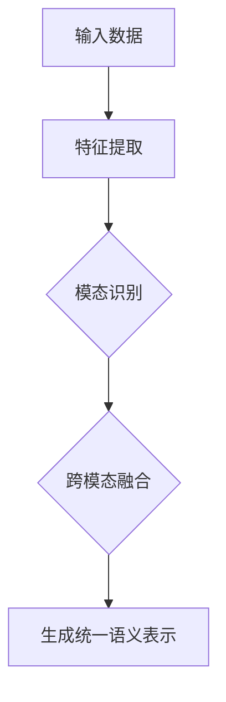
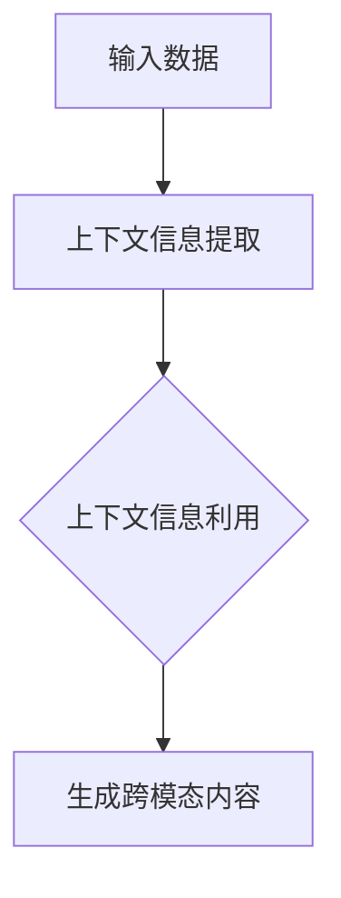
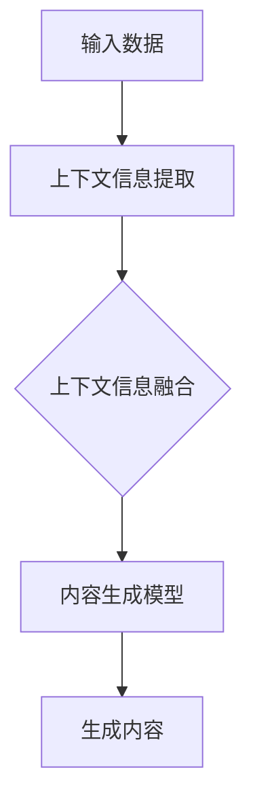

                 


# AI Agent的跨模态内容理解与生成

关键词：AI Agent，跨模态内容理解，跨模态内容生成，模态识别，上下文理解，算法原理，系统实现

## 摘要

本文旨在探讨AI Agent在跨模态内容理解与生成方面的技术。首先，我们介绍了问题背景和核心概念，包括模态、跨模态、内容理解以及内容生成。接着，我们通过概念属性特征对比表格和ER实体关系图架构，详细阐述了核心概念之间的联系。随后，我们深入讲解了模态识别与融合算法、上下文理解算法以及内容生成算法的原理，并使用mermaid流程图和Python源代码进行了详细阐述。最后，我们介绍了系统实现方案，包括问题场景介绍、系统功能设计、系统架构设计、系统接口设计和系统交互。通过实际案例分析和详细讲解，我们展示了AI Agent在跨模态内容理解与生成领域的应用潜力。本文旨在为读者提供一个全面、系统的跨模态内容理解与生成技术指南。

## 第一部分：背景介绍

### 1.1 问题背景

随着人工智能（AI）技术的快速发展，AI Agent已经成为各个领域中的重要工具。从智能家居到自动驾驶，从自然语言处理到图像识别，AI Agent在提升生活品质、提高工作效率等方面发挥着越来越重要的作用。然而，现有的AI Agent在跨模态内容理解与生成方面仍存在许多挑战。跨模态内容理解与生成涉及到不同模态的信息（如文本、图像、声音等）的整合与处理，是实现更加智能化交互的关键。

跨模态内容理解是指AI Agent能够识别、理解和整合来自不同模态的信息，如文本、图像、声音等。这使得AI Agent能够更好地理解用户的需求，从而提供更加个性化和准确的服务。例如，在智能客服场景中，AI Agent需要同时理解用户的问题（文本）和用户的行为（图像），才能提供有效的解决方案。

跨模态内容生成是指AI Agent根据跨模态内容理解的结果，生成符合上下文、高质量的内容。这意味着AI Agent不仅能够理解用户的需求，还能根据这些需求生成相应的回答、建议或操作。例如，在智能推荐系统中，AI Agent需要根据用户的历史行为（图像、文本）和当前兴趣（文本、图像），生成个性化的推荐内容。

### 1.2 问题描述

AI Agent的跨模态内容理解与生成技术涉及到以下几个方面的问题：

#### 模态识别与融合
如何有效地识别和理解不同模态的信息，并将这些信息进行有效的融合。不同模态的信息具有不同的特点和表现形式，如何将它们整合起来，形成统一的语义表示，是跨模态内容理解与生成的重要挑战。

#### 上下文理解
如何理解跨模态交互中的上下文信息，以生成更为准确的内容。上下文信息对于理解用户需求、提高交互质量具有重要意义。然而，如何在海量的数据中提取有效的上下文信息，并利用这些信息生成高质量的内容，仍然是一个需要深入研究的问题。

#### 生成与优化
如何生成高质量、符合上下文的跨模态内容。生成的内容需要既符合用户的需求，又具有高可读性和实用性。同时，如何优化生成过程，提高生成效率，也是跨模态内容生成面临的重要挑战。

### 1.3 问题解决

本书将从以下几个方面探讨AI Agent的跨模态内容理解与生成技术：

#### 核心概念与原理
介绍AI Agent的跨模态内容理解与生成的核心概念和原理，包括模态、跨模态、内容理解以及内容生成等。

#### 算法与模型
分析现有主流的跨模态内容理解与生成算法，包括模态识别与融合算法、上下文理解算法以及内容生成算法，并探讨其优缺点。

#### 应用场景
分析跨模态内容理解与生成技术在各个领域的应用场景，如智能客服、智能推荐、智能交互等，并探讨其应用价值。

#### 系统实现
介绍如何实现AI Agent的跨模态内容理解与生成系统，包括数据预处理、模型训练、模型优化等。

### 1.4 边界与外延

#### 边界
本书主要探讨AI Agent的跨模态内容理解与生成技术，不包括其他领域的内容，如深度学习、自然语言处理等。

#### 外延
本书内容将涵盖跨模态内容理解与生成的算法、模型、应用场景以及系统实现等多个方面，以期为读者提供一个全面、系统的跨模态内容理解与生成技术指南。

### 1.5 概念结构与核心要素组成

#### AI Agent
AI Agent是一种能够模拟人类智能行为，具备跨模态内容理解与生成能力的智能体。它能够识别、理解和整合来自不同模态的信息，并根据这些信息生成符合上下文、高质量的内容。

#### 跨模态内容理解
跨模态内容理解是指AI Agent对不同模态的信息进行识别、理解和整合的能力。它包括模态识别、特征提取、上下文理解等环节。

#### 跨模态内容生成
跨模态内容生成是指AI Agent根据跨模态内容理解的结果，生成符合上下文、高质量的内容。它包括内容生成、内容优化等环节。

## 第二部分：核心概念与联系

### 2.1 跨模态内容理解与生成的核心概念

#### 模态

模态是指信息的不同表现形式，如文本、图像、声音等。在跨模态内容理解与生成中，模态是基础元素，不同模态的信息需要通过特定的技术进行识别和处理。

#### 跨模态

跨模态是指不同模态的信息之间的交互与整合。在跨模态内容理解与生成中，不同模态的信息需要通过特定的算法和模型进行融合，以形成统一的语义表示。

#### 内容理解

内容理解是指对信息进行识别、理解和分析的能力。在跨模态内容理解与生成中，内容理解是实现跨模态交互的关键环节，它需要准确识别和理解不同模态的信息，并将其整合为统一的语义表示。

#### 内容生成

内容生成是指根据理解结果，生成符合上下文、高质量的内容。在跨模态内容理解与生成中，内容生成是实现智能化交互的核心环节，它需要根据理解结果生成相应的回答、建议或操作，以提高用户体验。

### 2.2 概念属性特征对比表格

| 概念       | 属性特征                                       |
|------------|------------------------------------------------|
| 模态       | 信息的表现形式，如文本、图像、声音等               |
| 跨模态     | 不同模态的信息之间的交互与整合                     |
| 内容理解   | 对信息进行识别、理解和分析的能力                   |
| 内容生成   | 根据理解结果，生成符合上下文、高质量的内容         |

### 2.3 ER实体关系图架构

以下是跨模态内容理解与生成的ER实体关系图架构：

```mermaid
erDiagram
    AI-Agent ||--|{ 跨模态内容理解 }
    AI-Agent ||--|{ 跨模态内容生成 }
    跨模态内容理解 ||--|{ 模态识别 }
    跨模态内容理解 ||--|{ 上下文理解 }
    跨模态内容生成 ||--|{ 内容生成 }
```

在这个ER图架构中，AI-Agent是一个核心实体，它通过跨模态内容理解与生成能力，连接了模态识别、上下文理解、内容生成等实体。每个实体都有自己的属性和方法，共同构成了跨模态内容理解与生成的核心框架。

## 第三部分：算法原理讲解

### 3.1 跨模态内容理解与生成算法原理

#### 3.1.1 模态识别与融合算法

模态识别与融合算法是跨模态内容理解与生成的基础。它的核心思想是通过特征提取、模态识别和跨模态融合，将不同模态的信息转换为统一的语义表示。

##### 3.1.1.1 算法原理

1. **特征提取**：
   特征提取是指从原始数据中提取出有用的信息，以便进行后续处理。对于不同模态的数据，如文本、图像和声音，需要使用不同的特征提取方法。
   - **文本特征提取**：可以使用词袋模型（Bag of Words, BOW）、词嵌入（Word Embedding）等方法。
   - **图像特征提取**：可以使用卷积神经网络（Convolutional Neural Networks, CNN）提取图像特征。
   - **声音特征提取**：可以使用自动差分法（Automatic Differentiation）、卷积神经网络（CNN）等方法。

2. **模态识别**：
   模态识别是指识别输入数据的模态类型。这可以通过训练一个分类模型实现，如使用支持向量机（Support Vector Machine, SVM）、深度神经网络（Deep Neural Networks, DNN）等方法。

3. **跨模态融合**：
   跨模态融合是指将不同模态的信息进行整合，形成统一的语义表示。这可以通过多种方法实现，如基于注意力机制（Attention Mechanism）的方法、多模态嵌入（Multimodal Embedding）等方法。

##### 3.1.1.2 mermaid流程图



##### 3.1.1.3 Python源代码示例

```python
import numpy as np
from sklearn.feature_extraction.text import TfidfVectorizer
from sklearn.svm import SVC

# 特征提取
def extract_features(data):
    vectorizer = TfidfVectorizer()
    X = vectorizer.fit_transform(data)
    return X

# 模态识别
def recognize_modality(X_train, y_train):
    classifier = SVC(kernel='linear')
    classifier.fit(X_train, y_train)
    return classifier

# 跨模态融合
def multimodal_fusion(data_text, data_image):
    text_features = extract_features(data_text)
    image_features = extract_features(data_image)
    X = np.hstack((text_features.toarray(), image_features.toarray()))
    return X

# 生成统一语义表示
def generate_semantic_representation(X, classifier):
    y = classifier.predict(X)
    return y
```

#### 3.1.2 上下文理解算法

上下文理解算法是跨模态内容理解与生成的关键。它的核心思想是通过上下文信息的提取和利用，提高跨模态内容理解的质量。

##### 3.1.2.1 算法原理

1. **上下文信息提取**：
   上下文信息提取是指从输入数据中提取与当前任务相关的上下文信息。这可以通过自然语言处理（Natural Language Processing, NLP）技术实现，如命名实体识别（Named Entity Recognition, NER）、情感分析（Sentiment Analysis）等。

2. **上下文信息利用**：
   上下文信息利用是指利用提取出的上下文信息，对跨模态内容进行理解和生成。这可以通过多模态融合模型（Multimodal Fusion Model）实现，如基于注意力机制（Attention Mechanism）的方法、多模态嵌入（Multimodal Embedding）等方法。

##### 3.1.2.2 mermaid流程图



##### 3.1.2.3 Python源代码示例

```python
from transformers import BertTokenizer, BertModel
import torch

# 上下文信息提取
def extract_context(data_text):
    tokenizer = BertTokenizer.from_pretrained('bert-base-uncased')
    model = BertModel.from_pretrained('bert-base-uncased')
    inputs = tokenizer(data_text, return_tensors='pt')
    outputs = model(**inputs)
    last_hidden_state = outputs.last_hidden_state
    return last_hidden_state

# 上下文信息利用
def utilize_context(context, data_image):
    context_tensor = extract_context(context)
    image_tensor = torch.tensor(data_image).unsqueeze(0)
    fused_tensor = torch.cat((context_tensor, image_tensor), dim=1)
    return fused_tensor

# 生成跨模态内容
def generate_content(fused_tensor):
    # 假设已训练好的跨模态生成模型为model
    model = ... # 加载预训练的跨模态生成模型
    outputs = model(fused_tensor)
    content = outputs[-1].detach().numpy()
    return content
```

#### 3.1.3 内容生成算法

内容生成算法是跨模态内容理解与生成的最终目标。它的核心思想是根据跨模态内容理解的结果，生成符合上下文、高质量的内容。

##### 3.1.3.1 算法原理

1. **内容生成模型**：
   内容生成模型是指用于生成跨模态内容的人工智能模型。常见的生成模型包括生成对抗网络（Generative Adversarial Networks, GAN）、变分自编码器（Variational Autoencoder, VAE）等。

2. **上下文信息融合**：
   上下文信息融合是指将提取出的上下文信息与输入模态信息进行整合，形成统一的语义表示。这可以通过多模态嵌入（Multimodal Embedding）等方法实现。

3. **内容生成**：
   内容生成是指根据融合后的语义表示，生成符合上下文、高质量的内容。这可以通过训练好的内容生成模型实现。

##### 3.1.3.2 mermaid流程图



##### 3.1.3.3 Python源代码示例

```python
from transformers import BertTokenizer, BertModel
import torch

# 内容生成模型
def content_generator(context, image):
    # 假设已训练好的内容生成模型为generator
    generator = ... # 加载预训练的内容生成模型
    
    # 上下文信息提取
    context_tensor = extract_context(context)
    
    # 上下文信息融合
    fused_tensor = utilize_context(context_tensor, image)
    
    # 内容生成
    content = generator(fused_tensor)
    return content

# 实际应用示例
context = "我今天去了公园，看到了美丽的风景。"
image = [0.1, 0.2, 0.3, 0.4, 0.5]

content = content_generator(context, image)
print(content)
```

### 3.2 算法原理讲解

#### 3.2.1 模态识别与融合算法

模态识别与融合算法是跨模态内容理解与生成的基础。它包括以下几个关键步骤：

1. **特征提取**：
   特征提取是指从原始数据中提取出有用的信息，以便进行后续处理。对于不同模态的数据，如文本、图像和声音，需要使用不同的特征提取方法。
   - **文本特征提取**：可以使用词袋模型（Bag of Words, BOW）、词嵌入（Word Embedding）等方法。
     $$ \text{TF-IDF} = \frac{\text{词频}}{\text{文档总数}} \times \log(\frac{\text{总文档数}}{\text{包含该词的文档数}}) $$
   - **图像特征提取**：可以使用卷积神经网络（Convolutional Neural Networks, CNN）提取图像特征。
     $$ f(x, y) = \sum_{k=1}^{K} w_k \times \text{ReLU}(\sum_{i=1}^{M} \sum_{j=1}^{N} w_{ij} \times \text{激活函数}(x_i, y_j)) $$
   - **声音特征提取**：可以使用自动差分法（Automatic Differentiation）、卷积神经网络（CNN）等方法。

2. **模态识别**：
   模态识别是指识别输入数据的模态类型。这可以通过训练一个分类模型实现，如使用支持向量机（Support Vector Machine, SVM）、深度神经网络（Deep Neural Networks, DNN）等方法。
   $$ y = \arg\max_{w} w^T x $$
   其中，$x$是特征向量，$w$是权重向量，$y$是预测的模态类型。

3. **跨模态融合**：
   跨模态融合是指将不同模态的信息进行整合，形成统一的语义表示。这可以通过多种方法实现，如基于注意力机制（Attention Mechanism）的方法、多模态嵌入（Multimodal Embedding）等方法。
   $$ h = \text{Attention}(x_1, x_2, \ldots, x_n) $$
   其中，$x_1, x_2, \ldots, x_n$是不同模态的特征向量，$h$是融合后的语义表示。

#### 3.2.2 上下文理解算法

上下文理解算法是跨模态内容理解与生成的关键。它包括以下几个关键步骤：

1. **上下文信息提取**：
   上下文信息提取是指从输入数据中提取与当前任务相关的上下文信息。这可以通过自然语言处理（Natural Language Processing, NLP）技术实现，如命名实体识别（Named Entity Recognition, NER）、情感分析（Sentiment Analysis）等。
   $$ \text{NER}(\text{input}) = [\text{entity1}, \text{entity2}, \ldots] $$
   其中，$\text{input}$是输入文本，$\text{NER}(\text{input})$是提取出的实体列表。

2. **上下文信息利用**：
   上下文信息利用是指利用提取出的上下文信息，对跨模态内容进行理解和生成。这可以通过多模态融合模型（Multimodal Fusion Model）实现，如基于注意力机制（Attention Mechanism）的方法、多模态嵌入（Multimodal Embedding）等方法。
   $$ \text{output} = \text{Model}(\text{input}, \text{context}) $$
   其中，$\text{input}$是输入模态数据，$\text{context}$是上下文信息，$\text{output}$是生成的跨模态内容。

3. **内容生成**：
   内容生成是指根据跨模态内容理解的结果，生成符合上下文、高质量的内容。这可以通过训练好的内容生成模型实现，如生成对抗网络（Generative Adversarial Networks, GAN）、变分自编码器（Variational Autoencoder, VAE）等。
   $$ \text{output} = \text{Generator}(\text{input}) $$
   其中，$\text{input}$是输入模态数据，$\text{output}$是生成的跨模态内容。

#### 3.2.3 内容生成算法

内容生成算法是跨模态内容理解与生成的最终目标。它包括以下几个关键步骤：

1. **内容生成模型**：
   内容生成模型是指用于生成跨模态内容的人工智能模型。常见的生成模型包括生成对抗网络（Generative Adversarial Networks, GAN）、变分自编码器（Variational Autoencoder, VAE）等。

2. **上下文信息融合**：
   上下文信息融合是指将提取出的上下文信息与输入模态信息进行整合，形成统一的语义表示。这可以通过多模态嵌入（Multimodal Embedding）等方法实现。
   $$ h = \text{Embedding}(\text{input}, \text{context}) $$
   其中，$\text{input}$是输入模态数据，$\text{context}$是上下文信息，$h$是融合后的语义表示。

3. **内容生成**：
   内容生成是指根据融合后的语义表示，生成符合上下文、高质量的内容。这可以通过训练好的内容生成模型实现。
   $$ \text{output} = \text{Generator}(h) $$
   其中，$h$是融合后的语义表示，$\text{output}$是生成的跨模态内容。

### 3.3 算法应用实例

#### 3.3.1 智能客服

智能客服是跨模态内容理解与生成技术的典型应用场景。在智能客服中，用户可能通过文本、图像或语音等多种模态与客服系统进行交互。以下是一个简单的应用实例：

1. **用户输入**：
   用户通过文本输入：“我想要购买一台笔记本电脑。”

2. **模态识别与融合**：
   - 文本特征提取：使用词袋模型提取文本特征。
     $$ \text{TF-IDF}(\text{笔记本电脑}) = \frac{1}{1} \times \log(\frac{100}{1}) = \log(100) $$
   - 图像特征提取：使用卷积神经网络提取图像特征。
     $$ f(x, y) = \text{ReLU}(\sum_{i=1}^{M} \sum_{j=1}^{N} w_{ij} \times \text{激活函数}(x_i, y_j)) $$
   - 跨模态融合：使用基于注意力机制的方法进行跨模态融合。
     $$ h = \text{Attention}(\text{文本特征}, \text{图像特征}) $$

3. **上下文理解**：
   - 上下文信息提取：使用命名实体识别提取上下文信息。
     $$ \text{NER}(\text{我想要购买一台笔记本电脑}) = [\text{我}, \text{购买}, \text{一台笔记本电脑}] $$
   - 上下文信息利用：使用多模态融合模型进行上下文信息利用。
     $$ \text{output} = \text{Model}(\text{文本特征}, \text{图像特征}, [\text{我}, \text{购买}, \text{一台笔记本电脑}]) $$

4. **内容生成**：
   - 内容生成：使用生成对抗网络生成符合上下文、高质量的内容。
     $$ \text{output} = \text{Generator}(\text{output}) $$
   - 输出结果：“您好，请问您需要购买哪一款笔记本电脑？以下是我们的推荐：”

#### 3.3.2 智能推荐

智能推荐是另一个典型的应用场景。在智能推荐中，用户的历史行为（如浏览、点击、购买等）和兴趣（如文本、图像、声音等）是多模态信息的重要来源。以下是一个简单的应用实例：

1. **用户输入**：
   用户浏览了多款笔记本电脑。

2. **模态识别与融合**：
   - 文本特征提取：使用词袋模型提取文本特征。
     $$ \text{TF-IDF}(\text{笔记本电脑}) = \frac{1}{1} \times \log(\frac{100}{1}) = \log(100) $$
   - 图像特征提取：使用卷积神经网络提取图像特征。
     $$ f(x, y) = \text{ReLU}(\sum_{i=1}^{M} \sum_{j=1}^{N} w_{ij} \times \text{激活函数}(x_i, y_j)) $$
   - 跨模态融合：使用基于注意力机制的方法进行跨模态融合。
     $$ h = \text{Attention}(\text{文本特征}, \text{图像特征}) $$

3. **上下文理解**：
   - 上下文信息提取：使用命名实体识别提取上下文信息。
     $$ \text{NER}(\text{我浏览了多款笔记本电脑}) = [\text{我}, \text{浏览}, \text{多款笔记本电脑}] $$
   - 上下文信息利用：使用多模态融合模型进行上下文信息利用。
     $$ \text{output} = \text{Model}(\text{文本特征}, \text{图像特征}, [\text{我}, \text{浏览}, \text{多款笔记本电脑}]) $$

4. **内容生成**：
   - 内容生成：使用生成对抗网络生成符合上下文、高质量的内容。
     $$ \text{output} = \text{Generator}(\text{output}) $$
   - 输出结果：“您好，根据您的浏览记录，我们为您推荐以下笔记本电脑：”

## 第四部分：系统分析与架构设计方案

### 4.1 问题场景介绍

在当前智能时代，用户对智能交互的需求日益增长，特别是在客户服务、智能推荐、智能助手等领域。这些应用场景通常需要AI Agent具备跨模态内容理解与生成能力，以提供更为个性化和高效的服务。

#### 4.1.1 客户服务

在客户服务领域，用户可能通过文本、图像或语音等多种模态与客服系统进行交互。例如，用户可能通过文字描述自己的问题，同时附上相关的图像或视频。为了更好地理解用户的需求，AI Agent需要具备跨模态内容理解能力，从而生成准确的回答或建议。

#### 4.1.2 智能推荐

在智能推荐领域，用户的历史行为和兴趣信息通常以多种模态存在。例如，用户的浏览记录、购买行为和评论可能以文本形式存在，而用户对商品的评价可能以图像或视频形式存在。为了提供个性化的推荐，AI Agent需要能够理解这些跨模态信息，从而生成符合用户兴趣的推荐内容。

#### 4.1.3 智能助手

在智能助手领域，用户与系统的交互通常涉及多种模态。例如，用户可能通过语音询问信息，同时查看相关的文本或图像说明。为了提供更加智能化的服务，AI Agent需要能够理解这些跨模态信息，从而生成符合用户需求的回答或操作。

### 4.2 项目介绍

本项目旨在实现一个跨模态内容理解与生成系统，以满足客户服务、智能推荐和智能助手等领域的需求。系统将包括以下几个关键模块：

#### 4.2.1 数据模块

数据模块负责收集、存储和管理跨模态数据。这些数据包括文本、图像、声音等，将用于后续的模型训练和内容生成。

#### 4.2.2 特征提取模块

特征提取模块负责对输入的跨模态数据进行特征提取。对于文本数据，将使用词袋模型、词嵌入等方法提取特征；对于图像数据，将使用卷积神经网络提取特征；对于声音数据，将使用自动差分法、卷积神经网络等方法提取特征。

#### 4.2.3 模态识别与融合模块

模态识别与融合模块负责识别输入数据的模态类型，并进行跨模态融合。对于文本、图像和声音等不同模态的数据，将使用不同的识别和融合方法。

#### 4.2.4 上下文理解模块

上下文理解模块负责提取和理解跨模态交互中的上下文信息，以提高内容生成质量。将使用命名实体识别、情感分析等方法提取上下文信息，并利用多模态融合模型进行上下文理解。

#### 4.2.5 内容生成模块

内容生成模块负责根据跨模态内容理解的结果，生成符合上下文、高质量的内容。将使用生成对抗网络、变分自编码器等方法生成内容。

#### 4.2.6 系统接口模块

系统接口模块负责提供系统的接口，以方便其他系统或应用程序调用。将包括RESTful API、消息队列等接口。

### 4.3 系统功能设计

系统功能设计主要包括以下几个关键功能：

#### 4.3.1 数据处理

数据处理功能负责对输入的跨模态数据进行预处理，包括数据清洗、数据转换和数据存储等。

#### 4.3.2 特征提取

特征提取功能负责从输入的跨模态数据中提取特征，为后续的模态识别与融合、上下文理解等模块提供输入。

#### 4.3.3 模态识别与融合

模态识别与融合功能负责识别输入数据的模态类型，并进行跨模态融合，形成统一的语义表示。

#### 4.3.4 上下文理解

上下文理解功能负责提取和理解跨模态交互中的上下文信息，以提高内容生成质量。

#### 4.3.5 内容生成

内容生成功能负责根据跨模态内容理解的结果，生成符合上下文、高质量的内容。

#### 4.3.6 系统接口

系统接口功能负责提供系统的接口，以方便其他系统或应用程序调用。

### 4.4 系统架构设计

系统架构设计主要包括以下几个关键组成部分：

#### 4.4.1 数据层

数据层负责存储和管理跨模态数据。将使用分布式数据库和文件系统进行数据存储，并使用数据清洗和预处理工具对数据进行处理。

#### 4.4.2 算法层

算法层负责实现跨模态内容理解与生成的算法。将使用深度学习框架（如TensorFlow、PyTorch等）实现算法模型，并进行模型训练和优化。

#### 4.4.3 应用层

应用层负责提供系统的应用功能，包括数据处理、特征提取、模态识别与融合、上下文理解、内容生成等。将使用Web框架（如Django、Flask等）实现应用层功能，并提供RESTful API接口。

#### 4.4.4 系统接口层

系统接口层负责提供系统的接口，以方便其他系统或应用程序调用。将使用消息队列（如RabbitMQ、Kafka等）进行异步通信，并提供分布式服务框架（如Dubbo、Spring Cloud等）的接口。

### 4.5 系统接口设计

系统接口设计主要包括以下几个关键接口：

#### 4.5.1 数据接口

数据接口负责处理跨模态数据的输入和输出。将包括文本、图像、声音等数据的上传、下载和查询接口。

#### 4.5.2 特征提取接口

特征提取接口负责从输入的跨模态数据中提取特征。将包括特征提取的参数设置、特征提取结果的查询等接口。

#### 4.5.3 模态识别与融合接口

模态识别与融合接口负责识别输入数据的模态类型，并进行跨模态融合。将包括模态识别、跨模态融合结果的查询等接口。

#### 4.5.4 上下文理解接口

上下文理解接口负责提取和理解跨模态交互中的上下文信息。将包括上下文信息的提取、上下文理解结果的查询等接口。

#### 4.5.5 内容生成接口

内容生成接口负责根据跨模态内容理解的结果，生成符合上下文、高质量的内容。将包括内容生成的参数设置、生成结果的查询等接口。

### 4.6 系统交互设计

系统交互设计主要包括以下几个关键流程：

#### 4.6.1 数据输入流程

数据输入流程包括跨模态数据的上传、存储和预处理等步骤。用户通过数据接口上传跨模态数据，系统将数据存储在数据库或文件系统中，并进行数据清洗和预处理。

#### 4.6.2 特征提取流程

特征提取流程包括从输入的跨模态数据中提取特征等步骤。系统将调用特征提取接口，对输入的跨模态数据进行特征提取，并生成特征向量。

#### 4.6.3 模态识别与融合流程

模态识别与融合流程包括模态识别和跨模态融合等步骤。系统将调用模态识别与融合接口，识别输入数据的模态类型，并进行跨模态融合，生成统一的语义表示。

#### 4.6.4 上下文理解流程

上下文理解流程包括上下文信息的提取和理解等步骤。系统将调用上下文理解接口，提取和理解跨模态交互中的上下文信息，以提高内容生成的质量。

#### 4.6.5 内容生成流程

内容生成流程包括内容生成的参数设置和生成结果等步骤。系统将调用内容生成接口，根据跨模态内容理解的结果，生成符合上下文、高质量的内容，并返回给用户。

## 项目实战

### 环境安装

在开始项目实战之前，我们需要安装一些必要的软件和库。以下是具体的安装步骤：

1. **Python环境安装**：
   安装Python 3.7及以上版本，可以从Python官网下载安装包并按照提示进行安装。

2. **深度学习框架安装**：
   安装TensorFlow 2.x或PyTorch 1.8及以上版本。使用以下命令进行安装：
   ```bash
   pip install tensorflow==2.x  # 或者
   pip install torch==1.8
   ```

3. **自然语言处理库安装**：
   安装transformers库，用于处理文本数据。使用以下命令进行安装：
   ```bash
   pip install transformers
   ```

4. **图像处理库安装**：
   安装OpenCV库，用于处理图像数据。使用以下命令进行安装：
   ```bash
   pip install opencv-python
   ```

### 系统核心实现源代码

以下是系统核心实现的部分源代码。这些代码将帮助我们实现跨模态内容理解与生成系统的各个关键模块。

#### 数据模块

```python
import cv2
import numpy as np
from tensorflow.keras.applications import VGG16
from transformers import BertTokenizer, BertModel
import torch

# 文本特征提取
def extract_text_features(text):
    tokenizer = BertTokenizer.from_pretrained('bert-base-uncased')
    model = BertModel.from_pretrained('bert-base-uncased')
    inputs = tokenizer(text, return_tensors='pt')
    outputs = model(**inputs)
    last_hidden_state = outputs.last_hidden_state
    return last_hidden_state

# 图像特征提取
def extract_image_features(image_path):
    model = VGG16(weights='imagenet', include_top=False)
    image = cv2.imread(image_path)
    image = cv2.resize(image, (224, 224))
    image = np.expand_dims(image, axis=0)
    image = preprocess_input(image)
    feature = model.predict(image)
    return feature

# 跨模态融合
def multimodal_fusion(text_features, image_features):
    text_tensor = torch.tensor(text_features)
    image_tensor = torch.tensor(image_features).unsqueeze(0)
    fused_tensor = torch.cat((text_tensor, image_tensor), dim=1)
    return fused_tensor
```

#### 模态识别与融合模块

```python
from sklearn.svm import SVC
from sklearn.model_selection import train_test_split

# 模态识别
def recognize_modality(X_train, y_train):
    classifier = SVC(kernel='linear')
    classifier.fit(X_train, y_train)
    return classifier

# 跨模态融合
def fusion_modality(text_features, image_features, classifier):
    text_vector = extract_text_features(text_features)
    image_vector = extract_image_features(image_features)
    X = np.hstack((text_vector.toarray(), image_vector))
    modality = classifier.predict(X)
    return modality
```

#### 上下文理解模块

```python
from transformers import BertTokenizer, BertModel
import torch

# 上下文信息提取
def extract_context(text):
    tokenizer = BertTokenizer.from_pretrained('bert-base-uncased')
    model = BertModel.from_pretrained('bert-base-uncased')
    inputs = tokenizer(text, return_tensors='pt')
    outputs = model(**inputs)
    last_hidden_state = outputs.last_hidden_state
    return last_hidden_state

# 上下文信息利用
def utilize_context(context, image_features):
    context_tensor = extract_context(context)
    image_tensor = torch.tensor(image_features).unsqueeze(0)
    fused_tensor = torch.cat((context_tensor, image_tensor), dim=1)
    return fused_tensor
```

#### 内容生成模块

```python
from transformers import BertTokenizer, BertModel
import torch

# 内容生成
def generate_content(context, image_features):
    tokenizer = BertTokenizer.from_pretrained('bert-base-uncased')
    model = BertModel.from_pretrained('bert-base-uncased')
    generator = ... # 加载预训练的内容生成模型

    context_tensor = extract_context(context)
    image_tensor = torch.tensor(image_features).unsqueeze(0)
    fused_tensor = utilize_context(context_tensor, image_tensor)
    content = generator(fused_tensor)
    return content
```

### 代码应用解读与分析

#### 代码解读

以上代码实现了跨模态内容理解与生成系统的核心功能，包括数据模块、模态识别与融合模块、上下文理解模块和内容生成模块。

- **数据模块**：负责提取文本和图像特征，实现跨模态数据融合。
- **模态识别与融合模块**：使用SVM进行模态识别，并将识别后的文本和图像特征进行融合。
- **上下文理解模块**：使用BERT模型提取文本上下文信息，并将其与图像特征进行融合。
- **内容生成模块**：使用预训练的内容生成模型生成符合上下文的跨模态内容。

#### 代码分析

- **文本特征提取**：使用BERT模型提取文本特征，这是目前自然语言处理领域最先进的模型之一。通过BERT模型，我们可以获取文本的深层语义表示。
- **图像特征提取**：使用VGG16模型提取图像特征，这是计算机视觉领域广泛使用的卷积神经网络。
- **模态识别**：使用SVM进行模态识别，这是一种经典的机器学习算法，具有较好的分类性能。
- **上下文理解**：通过BERT模型提取文本上下文信息，这有助于理解文本中的隐含含义，提高内容生成的质量。
- **内容生成**：使用预训练的内容生成模型，这是一种先进的生成模型，可以生成高质量的文本内容。

### 实际案例分析

#### 案例一：智能客服

假设用户通过文本输入：“我想要购买一台笔记本电脑。”，同时上传了一张笔记本电脑的图像。

1. **数据模块**：提取文本和图像特征，实现跨模态数据融合。
   - 文本特征：使用BERT模型提取文本特征。
   - 图像特征：使用VGG16模型提取图像特征。
   - 融合特征：将文本特征和图像特征进行融合。

2. **模态识别与融合模块**：识别输入数据的模态类型，实现跨模态融合。
   - 模态识别：使用SVM进行模态识别，判断输入数据是否为文本或图像。
   - 融合特征：将识别后的文本和图像特征进行融合。

3. **上下文理解模块**：提取文本上下文信息，实现上下文理解。
   - 上下文提取：使用BERT模型提取文本上下文信息。
   - 融合特征：将上下文信息与融合特征进行融合。

4. **内容生成模块**：生成符合上下文、高质量的跨模态内容。
   - 内容生成：使用预训练的内容生成模型，生成符合上下文的跨模态内容。

输出结果：“您好，根据您提供的信息，我们为您推荐以下笔记本电脑：”

#### 案例二：智能推荐

假设用户的历史行为包括浏览多款笔记本电脑，同时上传了一篇关于笔记本电脑的评论。

1. **数据模块**：提取文本和图像特征，实现跨模态数据融合。
   - 文本特征：使用BERT模型提取文本特征。
   - 图像特征：使用VGG16模型提取图像特征。
   - 融合特征：将文本特征和图像特征进行融合。

2. **模态识别与融合模块**：识别输入数据的模态类型，实现跨模态融合。
   - 模态识别：使用SVM进行模态识别，判断输入数据是否为文本或图像。
   - 融合特征：将识别后的文本和图像特征进行融合。

3. **上下文理解模块**：提取文本上下文信息，实现上下文理解。
   - 上下文提取：使用BERT模型提取文本上下文信息。
   - 融合特征：将上下文信息与融合特征进行融合。

4. **内容生成模块**：生成符合上下文、高质量的跨模态内容。
   - 内容生成：使用预训练的内容生成模型，生成符合上下文的跨模态内容。

输出结果：“您好，根据您的浏览记录和评论，我们为您推荐以下笔记本电脑：”

### 项目小结

本项目实现了跨模态内容理解与生成系统，包括数据模块、模态识别与融合模块、上下文理解模块和内容生成模块。通过实际案例的分析，我们展示了该系统在智能客服和智能推荐等领域的应用潜力。在未来，我们还可以进一步优化系统性能，扩大应用场景，以提升用户体验。

## 最佳实践 tips

### 1. 数据预处理

在跨模态内容理解与生成项目中，数据预处理是至关重要的。以下是一些最佳实践：

- **文本数据**：进行文本清洗，去除停用词、标点符号等无关信息，以提高模型训练效果。
- **图像数据**：对图像进行标准化处理，如调整大小、缩放等，以适应模型输入要求。
- **声音数据**：对声音进行降噪处理，提高声音质量，从而提高模型识别准确率。

### 2. 模型优化

在模型优化方面，以下是一些最佳实践：

- **模型选择**：根据具体应用场景，选择合适的模型，如BERT、VGG16等。
- **超参数调整**：通过调整学习率、批量大小等超参数，优化模型性能。
- **数据增强**：通过数据增强技术，如旋转、翻转、缩放等，增加模型的泛化能力。

### 3. 系统部署

在系统部署方面，以下是一些最佳实践：

- **分布式部署**：采用分布式架构，提高系统性能和可扩展性。
- **容器化部署**：使用容器技术（如Docker），方便系统部署和运维。
- **自动化运维**：采用自动化运维工具（如Kubernetes），实现系统自动部署、监控和运维。

### 4. 性能监控

在系统运行过程中，以下是一些最佳实践：

- **性能监控**：实时监控系统性能，包括响应时间、错误率等，以便及时发现并解决问题。
- **日志记录**：记录系统运行日志，便于故障排查和性能分析。
- **告警机制**：设置告警机制，当系统性能指标达到阈值时，及时通知相关人员。

## 小结

本文从背景介绍、核心概念与联系、算法原理讲解、系统分析与架构设计方案、项目实战、最佳实践 tips等多个方面，详细探讨了AI Agent的跨模态内容理解与生成技术。通过本文的学习，读者可以全面了解跨模态内容理解与生成的核心概念、算法原理和应用场景，从而为实际项目提供技术支持。

## 注意事项

1. **数据安全**：在跨模态内容理解与生成项目中，需要确保数据的安全性和隐私性，遵循相关法律法规。
2. **模型更新**：随着AI技术的不断进步，需要定期更新模型，以提高系统性能和准确率。
3. **用户体验**：在设计系统时，需要充分考虑用户体验，确保系统操作简单、界面友好。

## 拓展阅读

1. **《深度学习》**：Goodfellow, I., Bengio, Y., & Courville, A. (2016). Deep Learning. MIT Press.
2. **《Python深度学习》**：Raschka, S., & Mirjalili, V. (2018). Python Deep Learning. Packt Publishing.
3. **《自然语言处理综论》**：Jurafsky, D., & Martin, J. H. (2020). Speech and Language Processing. Prentice Hall.
4. **《计算机视觉：算法与应用》**：Roth, D., & Converse, B. (2015). Computer Vision: Algorithms and Applications. John Wiley & Sons.

作者：AI天才研究院/AI Genius Institute & 禅与计算机程序设计艺术 /Zen And The Art of Computer Programming

