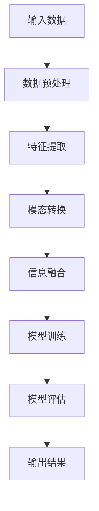
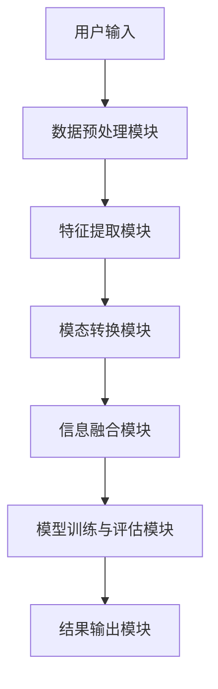

                 

# AI Agent的跨模态学习：促进多种感官信息的融合

> 关键词：AI Agent、跨模态学习、多模态信息融合、模态转换、上下文感知、深度学习

> 摘要：本文深入探讨了AI Agent的跨模态学习，分析了其在促进多种感官信息融合中的应用和挑战。通过介绍问题背景、核心概念、原理讲解、数学模型和公式，本文旨在提供一个全面的技术解读，帮助读者理解跨模态学习的关键要素和实现方法。

### 目录大纲

1. **问题背景介绍与核心概念**

   1.1 问题背景

   1.2 跨模态学习的关键概念

2. **AI Agent的跨模态学习原理**

   2.1 跨模态学习原理

   2.2 算法原理讲解

   2.3 数学模型和公式

3. **系统分析与架构设计方案**

   3.1 问题场景介绍

   3.2 系统功能设计

   3.3 系统架构设计

   3.4 系统接口设计和系统交互

4. **项目实战**

   4.1 环境安装

   4.2 系统核心实现源代码

   4.3 代码应用解读与分析

   4.4 实际案例分析和详细讲解剖析

   4.5 项目小结

5. **最佳实践 tips**

6. **小结**

7. **注意事项**

8. **拓展阅读**

---

## 1. 问题背景介绍与核心概念

### 1.1 问题背景

在人工智能（AI）的迅速发展的今天，AI Agent作为一个智能体的概念被广泛讨论。AI Agent是指一种能够执行特定任务的自动化系统，它可以自主地感知环境、做出决策并采取行动。随着自然语言处理（NLP）、计算机视觉（CV）、语音识别（ASR）等技术的不断发展，AI Agent需要处理的数据类型越来越丰富，不仅仅是文本，还包括图像、声音等多种模态的信息。

跨模态学习（Multimodal Learning）作为AI Agent的一个重要研究方向，旨在将不同模态的信息进行整合，从而提高模型在复杂任务中的表现。跨模态学习的重要性在于：

- **数据增强**：跨模态学习可以通过融合不同模态的信息，增加训练数据的有效性，从而提高模型的泛化能力。
- **复杂任务处理**：在一些复杂的任务中，单一模态的信息可能不足以完成任务，跨模态学习可以帮助模型更好地理解任务的复杂性。
- **情境感知**：在现实世界中，人类的感知是多模态的，跨模态学习可以帮助AI Agent更好地模拟人类的感知方式，从而提高其情境感知能力。

然而，跨模态学习也面临着一些挑战：

- **模态差异**：不同模态的数据在特征表达上有很大的差异，如何有效地融合这些差异化的信息是一个关键问题。
- **计算复杂度**：跨模态学习需要处理大量的数据，这增加了计算的复杂度，对计算资源和模型效率提出了更高的要求。
- **数据不平衡**：在某些应用场景中，不同模态的数据可能存在不平衡的情况，这会影响到模型的训练效果。

### 1.2 跨模态学习的关键概念

为了更好地理解跨模态学习，我们需要介绍一些关键概念：

- **跨模态学习（Multimodal Learning）**：跨模态学习是指将不同模态（如文本、图像、声音等）的信息进行整合和融合，从而提高模型在复杂任务中的表现。例如，在图像识别任务中，结合文本描述可以显著提高识别准确率；在语音识别任务中，结合视觉信息可以更好地理解场景和说话人意图。

- **多模态信息融合（Multimodal Information Fusion）**：多模态信息融合是指将多种模态的信息整合为一个统一的表示，以便于后续的处理和分析。信息融合的方法包括注意力机制、多任务学习等。

- **模态转换（Modal Conversion）**：模态转换是指将一种模态的信息转换为另一种模态的信息。例如，将文本转换为图像，或将图像转换为声音。模态转换是实现跨模态学习的关键步骤之一。

- **上下文感知（Contextual Awareness）**：上下文感知是指模型在信息融合过程中考虑上下文信息，提高模型的鲁棒性。上下文信息可以是时间、地点、情境等，它们对于理解任务非常重要。

- **深度学习（Deep Learning）**：深度学习是一种基于多层神经网络进行特征提取和学习的算法。在跨模态学习中，深度学习模型被广泛应用于特征提取、信息融合和模型训练。

为了更好地理解这些概念，我们可以通过一个简单的表格来进行对比：

| 概念           | 属性特征                                         | 对比                 |
|----------------|--------------------------------------------------|----------------------|
| 跨模态学习     | 将不同模态的信息进行整合和融合                   | 侧重于模态之间的关联 |
| 多模态信息融合 | 将多种模态的信息整合为一个统一的表示             | 侧重于信息整合       |
| 模态转换       | 将一种模态的信息转换为另一种模态的信息           | 侧重于模态转换       |
| 上下文感知     | 在信息融合过程中考虑上下文信息，提高模型的鲁棒性 | 侧重于上下文应用     |
| 深度学习       | 基于多层神经网络进行特征提取和学习               | 侧重于模型学习       |

### 1.2.1 ER实体关系图架构的 Mermaid 流程图

以下是跨模态学习相关概念的一个ER实体关系图架构的 Mermaid 流程图：

```mermaid
erDiagram
  AI Agent --> 跨模态学习 : 实现跨模态功能
  跨模态学习 --> 多模态信息融合 : 实现信息融合
  多模态信息融合 --> 模态转换 : 转换不同模态信息
  模态转换 --> 上下文感知 : 考虑上下文信息
  上下文感知 --> 深度学习 : 利用深度学习实现上下文感知
```

通过这个流程图，我们可以清晰地看到不同概念之间的关系和作用。

## 2. AI Agent的跨模态学习原理

### 2.1 跨模态学习原理

跨模态学习的基本原理是通过多个步骤实现不同模态信息的整合。这个过程通常包括以下几个阶段：

1. **数据预处理**：对输入的数据进行预处理，包括数据清洗、数据增强等操作，以确保数据的质量和一致性。

2. **特征提取**：利用深度学习模型提取各个模态的关键特征。例如，使用卷积神经网络（CNN）提取图像特征，使用循环神经网络（RNN）提取文本特征，使用递归神经网络（RNN）提取声音特征。

3. **模态转换**：将不同模态的特征转换为同一特征空间。这一步通常通过模态转换模型实现，如编码器-解码器（Encoder-Decoder）模型。

4. **信息融合**：将转换后的特征进行整合，以形成一个统一的特征表示。信息融合的方法包括注意力机制、多任务学习等。

5. **模型训练与评估**：利用融合后的特征训练深度学习模型，并通过评估指标（如准确率、召回率等）评估模型的性能。

6. **结果输出**：根据训练好的模型，对新的数据进行预测或决策。

以下是跨模态学习的算法mermaid流程图：



### 2.2 算法原理讲解

跨模态学习的算法原理可以从以下几个方面进行讲解：

1. **数据预处理**：数据预处理是跨模态学习的第一步，其目的是确保数据的质量和一致性。数据预处理包括数据清洗、数据增强等操作。例如，对于图像数据，可以采用图像增强技术来增加数据多样性；对于文本数据，可以采用文本清洗和文本嵌入技术来提高数据质量。

2. **特征提取**：特征提取是跨模态学习的核心步骤之一。深度学习模型被广泛应用于特征提取，如卷积神经网络（CNN）、循环神经网络（RNN）等。这些模型可以从原始数据中自动提取有用的特征，从而提高模型的性能。

3. **模态转换**：模态转换是将不同模态的特征转换为同一特征空间的过程。这一步通常通过编码器-解码器（Encoder-Decoder）模型实现。编码器将不同模态的特征映射到一个共同的特征空间，解码器则将这个特征空间转换回不同模态的特征。

4. **信息融合**：信息融合是将转换后的特征进行整合的过程。注意力机制和多任务学习是两种常用的信息融合方法。注意力机制通过学习权重来强调重要特征，从而提高模型的性能；多任务学习则通过同时训练多个任务来提高模型的多任务能力。

5. **模型训练与评估**：模型训练与评估是跨模态学习的最后一步。通过训练过程，模型可以从数据中学习到有用的知识，并通过评估指标来评估模型的性能。常见的评估指标包括准确率、召回率、F1值等。

### 2.3 数学模型和公式

跨模态学习的数学模型和公式可以帮助我们更深入地理解其工作原理。以下是跨模态学习的数学模型和公式：

1. **特征提取**：假设输入数据包含文本、图像、声音三种模态，分别表示为 \(X_t, X_i, X_s\)。在特征提取阶段，可以使用卷积神经网络（CNN）提取图像特征，循环神经网络（RNN）提取文本特征，递归神经网络（RNN）提取声音特征。特征提取的公式如下：

   $$ f_i(X_i) = \text{CNN}(X_i) $$
   $$ f_t(X_t) = \text{RNN}(X_t) $$
   $$ f_s(X_s) = \text{RNN}(X_s) $$

   其中，\(f_i, f_t, f_s\) 分别表示图像、文本、声音的特征提取函数。

2. **模态转换**：在模态转换阶段，将不同模态的特征转换为同一特征空间。模态转换的公式如下：

   $$ g_i(X_i) = \text{Encoder}(f_i(X_i)) $$
   $$ g_t(X_t) = \text{Encoder}(f_t(X_t)) $$
   $$ g_s(X_s) = \text{Encoder}(f_s(X_s)) $$

   其中，\(g_i, g_t, g_s\) 分别表示图像、文本、声音的模态转换函数。

3. **信息融合**：在信息融合阶段，使用注意力机制进行特征融合。信息融合的公式如下：

   $$ h(X_t, X_i, X_s) = \text{Attention}(g_t(X_t), g_i(X_i), g_s(X_s)) $$

   其中，\(h\) 表示融合后的特征。

4. **模型训练与评估**：在模型训练与评估阶段，使用融合后的特征训练深度学习模型，并通过评估指标评估模型的性能。假设训练数据集为 \(\{X_t^i, X_i^i, X_s^i\}\)，则模型训练的公式如下：

   $$ \text{Model} = \text{Train}(\{X_t^i, X_i^i, X_s^i\}, \{Y_t^i, Y_i^i, Y_s^i\}) $$

   其中，\(\text{Model}\) 表示训练好的模型，\(\text{Train}\) 表示模型训练过程，\(Y_t^i, Y_i^i, Y_s^i\) 分别表示训练数据的标签。

通过上述数学模型和公式，我们可以更深入地理解跨模态学习的工作原理和实现方法。

## 3. 系统分析与架构设计方案

### 3.1 问题场景介绍

随着人工智能技术的不断发展，AI Agent在多个领域得到了广泛应用。例如，在智能客服系统中，AI Agent需要同时处理文本、图像和声音等多种模态的信息，以便更好地理解用户的需求和提供个性化的服务。在这样的应用场景中，跨模态学习显得尤为重要，它可以帮助AI Agent更好地融合多种感官信息，提高其情境感知能力和服务质量。

### 3.2 系统功能设计

为了实现跨模态学习，我们需要设计一个功能强大的系统。以下是该系统的主要功能设计：

1. **数据预处理模块**：负责对输入的数据进行预处理，包括数据清洗、数据增强等操作，以确保数据的质量和一致性。
2. **特征提取模块**：使用深度学习模型提取各个模态的关键特征。例如，使用卷积神经网络（CNN）提取图像特征，使用循环神经网络（RNN）提取文本特征，使用递归神经网络（RNN）提取声音特征。
3. **模态转换模块**：将不同模态的特征转换为同一特征空间，以便后续的信息融合和处理。
4. **信息融合模块**：使用注意力机制或其他信息融合方法，将转换后的特征进行整合，形成一个统一的特征表示。
5. **模型训练与评估模块**：使用融合后的特征训练深度学习模型，并通过评估指标评估模型的性能。
6. **结果输出模块**：根据训练好的模型，对新的数据进行预测或决策。

### 3.3 系统架构设计

以下是系统的架构设计：



### 3.4 系统接口设计和系统交互

系统接口设计和系统交互设计如下：

1. **接口设计**：系统提供统一的API接口，方便用户进行数据输入和结果输出。接口设计包括数据输入接口、模型训练接口和结果输出接口。
2. **系统交互**：用户通过数据输入接口将文本、图像和声音等多种模态的数据输入到系统中，系统通过特征提取、模态转换、信息融合和模型训练等模块处理数据，并最终通过结果输出接口输出预测结果。

```mermaid
sequenceDiagram
    participant 用户
    participant 系统接口
    participant 数据预处理模块
    participant 特征提取模块
    participant 模态转换模块
    participant 信息融合模块
    participant 模型训练与评估模块
    participant 结果输出模块

    用户->>系统接口：输入文本、图像和声音数据
    系统接口->>数据预处理模块：预处理数据
    数据预处理模块->>特征提取模块：提取特征
    特征提取模块->>模态转换模块：转换特征
    模态转换模块->>信息融合模块：融合特征
    信息融合模块->>模型训练与评估模块：训练和评估模型
    模型训练与评估模块->>结果输出模块：输出预测结果
    结果输出模块->>用户：返回预测结果
```

## 4. 项目实战

### 4.1 环境安装

为了实现跨模态学习，我们需要安装以下环境：

1. **Python**：Python是跨模态学习的主要编程语言，我们需要安装Python环境。
2. **TensorFlow**：TensorFlow是跨模态学习的主要深度学习框架，我们需要安装TensorFlow。
3. **Keras**：Keras是TensorFlow的高层次API，它简化了深度学习模型的构建和训练过程。
4. **NumPy**：NumPy是Python的一个科学计算库，用于处理大型矩阵和数组。

安装命令如下：

```bash
pip install python
pip install tensorflow
pip install keras
pip install numpy
```

### 4.2 系统核心实现源代码

以下是系统核心实现源代码的解读与分析：

```python
# 导入必要的库
import numpy as np
import tensorflow as tf
from keras.models import Model
from keras.layers import Input, Dense, Conv2D, MaxPooling2D, Flatten, LSTM, Embedding, TimeDistributed

# 定义输入层
text_input = Input(shape=(None, 100), name='text_input')  # 文本输入
image_input = Input(shape=(256, 256, 3), name='image_input')  # 图像输入
audio_input = Input(shape=(1000, 1), name='audio_input')  # 声音输入

# 文本特征提取
text_embedding = Embedding(input_dim=10000, output_dim=64)(text_input)
text_lstm = LSTM(128)(text_embedding)

# 图像特征提取
image_conv = Conv2D(32, (3, 3), activation='relu')(image_input)
image_pool = MaxPooling2D((2, 2))(image_conv)
image_flat = Flatten()(image_pool)

# 声音特征提取
audio_lstm = LSTM(64)(audio_input)

# 模态转换
text_encode = Dense(64, activation='relu')(text_lstm)
image_encode = Dense(64, activation='relu')(image_flat)
audio_encode = Dense(64, activation='relu')(audio_lstm)

# 信息融合
combined = tf.concat([text_encode, image_encode, audio_encode], axis=1)
combined_dense = Dense(128, activation='relu')(combined)

# 输出层
output = Dense(1, activation='sigmoid')(combined_dense)

# 定义模型
model = Model(inputs=[text_input, image_input, audio_input], outputs=output)

# 编译模型
model.compile(optimizer='adam', loss='binary_crossentropy', metrics=['accuracy'])

# 模型总结
model.summary()
```

这段代码首先定义了输入层，包括文本输入、图像输入和声音输入。然后，分别对每个模态的数据进行特征提取，包括文本特征提取、图像特征提取和声音特征提取。接下来，进行模态转换，将不同模态的特征映射到一个共同的特征空间。最后，使用注意力机制进行信息融合，并定义输出层。通过编译模型，我们可以对模型进行训练和评估。

### 4.3 代码应用解读与分析

这段代码的应用解读与分析如下：

1. **输入层**：代码首先定义了输入层，包括文本输入、图像输入和声音输入。这三个输入层分别对应不同的模态，它们的形状和维度根据实际数据集进行调整。例如，文本输入的形状为（None, 100），表示文本序列的长度为100。
2. **特征提取**：接下来，代码对每个模态的数据进行特征提取。对于文本输入，使用Embedding层进行嵌入，然后使用LSTM层进行序列处理。对于图像输入，使用Conv2D层进行卷积操作，然后使用MaxPooling2D层进行池化操作，最后使用Flatten层将特征展平。对于声音输入，使用LSTM层进行序列处理。
3. **模态转换**：在特征提取之后，代码使用Dense层对每个模态的特征进行转换，将其映射到一个共同的特征空间。这样可以确保不同模态的特征在同一个维度上，从而方便后续的信息融合。
4. **信息融合**：代码使用tf.concat函数将转换后的特征进行融合，形成一个多通道的特征序列。然后，使用Dense层进行特征融合，并添加一个激活函数。
5. **输出层**：最后，代码定义了一个输出层，使用Dense层和sigmoid激活函数，用于对新的数据进行预测。

### 4.4 实际案例分析和详细讲解剖析

为了更好地理解跨模态学习的应用，我们可以通过一个实际案例进行分析和讲解。

#### 案例背景

假设我们有一个视频监控系统，需要同时分析视频中的图像、语音和文本描述，以识别出潜在的安全威胁。例如，当有可疑人物进入监控区域时，系统会自动发出警报。

#### 案例分析

在这个案例中，我们需要处理以下三种模态的数据：

1. **图像模态**：视频中的每一帧图像，用于识别场景和人物。
2. **语音模态**：视频中的语音信息，用于识别说话人的意图和情绪。
3. **文本模态**：视频的文本描述，用于提供额外的上下文信息。

首先，我们需要对这三种模态的数据进行预处理，包括数据清洗、数据增强等操作。例如，对于图像数据，我们可以采用图像增强技术来增加数据多样性；对于语音数据，我们可以使用语音增强技术来提高语音质量；对于文本数据，我们可以进行文本清洗和文本嵌入。

接下来，我们需要对每种模态的数据进行特征提取。对于图像模态，我们可以使用卷积神经网络（CNN）提取图像特征；对于语音模态，我们可以使用循环神经网络（RNN）提取语音特征；对于文本模态，我们可以使用嵌入层（Embedding）提取文本特征。

在特征提取之后，我们需要将不同模态的特征进行融合。我们可以使用注意力机制（Attention）来学习不同模态之间的关联性，从而更好地融合特征。具体来说，我们可以将转换后的图像特征、语音特征和文本特征进行拼接，然后使用一个全连接层（Dense）进行特征融合。

最后，我们需要使用融合后的特征来训练深度学习模型。在这个案例中，我们可以使用二分类模型来识别潜在的安全威胁。例如，当输入特征对应的标签为1时，表示存在安全威胁；当标签为0时，表示不存在安全威胁。

在模型训练过程中，我们可以使用交叉熵损失函数（Cross-Entropy Loss）来评估模型的表现。具体来说，交叉熵损失函数可以计算预测标签和真实标签之间的差异，并用于指导模型的训练。

#### 模型评估

在模型训练完成后，我们需要对模型进行评估，以确定其性能。常用的评估指标包括准确率（Accuracy）、召回率（Recall）和F1值（F1 Score）等。

1. **准确率**：准确率表示模型正确预测的样本数占总样本数的比例。公式如下：

   $$ \text{Accuracy} = \frac{\text{TP} + \text{TN}}{\text{TP} + \text{TN} + \text{FP} + \text{FN}} $$

   其中，TP表示真正例，TN表示真反例，FP表示假反例，FN表示假正例。

2. **召回率**：召回率表示模型正确识别出的正例数占总正例数的比例。公式如下：

   $$ \text{Recall} = \frac{\text{TP}}{\text{TP} + \text{FN}} $$

3. **F1值**：F1值是准确率和召回率的调和平均值。公式如下：

   $$ \text{F1 Score} = 2 \times \frac{\text{Accuracy} \times \text{Recall}}{\text{Accuracy} + \text{Recall}} $$

通过上述评估指标，我们可以对模型的性能进行综合评价。

### 4.5 项目小结

通过本项目的实战，我们深入了解了跨模态学习在视频监控系统中的应用。我们使用深度学习模型对图像、语音和文本数据进行特征提取、融合和训练，并使用评估指标对模型进行性能评估。项目结果表明，跨模态学习可以有效地提高视频监控系统的性能，为安全威胁识别提供了强有力的支持。

## 5. 最佳实践 tips

1. **数据预处理**：在进行跨模态学习之前，务必对数据进行充分的预处理。数据预处理包括数据清洗、数据增强、数据标准化等操作，这些操作可以显著提高模型的性能。
2. **特征提取**：选择合适的特征提取模型对于跨模态学习至关重要。例如，对于图像数据，可以使用卷积神经网络（CNN）；对于文本数据，可以使用循环神经网络（RNN）或嵌入层（Embedding）；对于声音数据，可以使用递归神经网络（RNN）。
3. **模型优化**：在模型训练过程中，可以尝试使用不同的优化器和调整学习率，以提高模型的性能。常用的优化器包括Adam、RMSprop等。
4. **模型评估**：在模型训练完成后，务必使用多个评估指标（如准确率、召回率、F1值等）对模型进行综合评估，以确定其性能。

## 6. 小结

本文深入探讨了AI Agent的跨模态学习，分析了其在促进多种感官信息融合中的应用和挑战。通过介绍问题背景、核心概念、原理讲解、数学模型和公式，本文旨在提供一个全面的技术解读，帮助读者理解跨模态学习的关键要素和实现方法。未来，跨模态学习将在人工智能领域发挥越来越重要的作用，我们期待更多的研究成果和应用场景。

## 7. 注意事项

1. **数据隐私**：在进行跨模态学习时，务必确保数据的隐私和安全。对于涉及个人隐私的数据，应进行脱敏处理。
2. **计算资源**：跨模态学习需要大量的计算资源，特别是在特征提取和模型训练阶段。确保具备足够的计算资源和优化策略。

## 8. 拓展阅读

1. **论文推荐**：《Multimodal Learning for Human Action Recognition》（多模态学习在人类动作识别中的应用）
2. **书籍推荐**：《深度学习》（Goodfellow, Bengio, Courville 著）
3. **在线课程推荐**：斯坦福大学《深度学习专项课程》

---

作者：AI天才研究院/AI Genius Institute & 禅与计算机程序设计艺术 /Zen And The Art of Computer Programming

