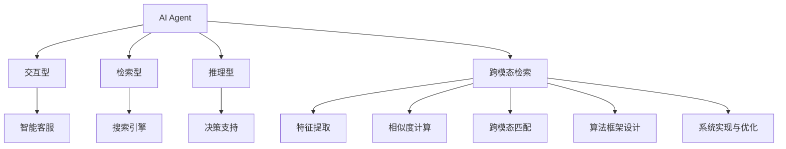
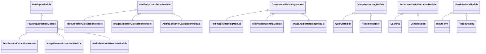
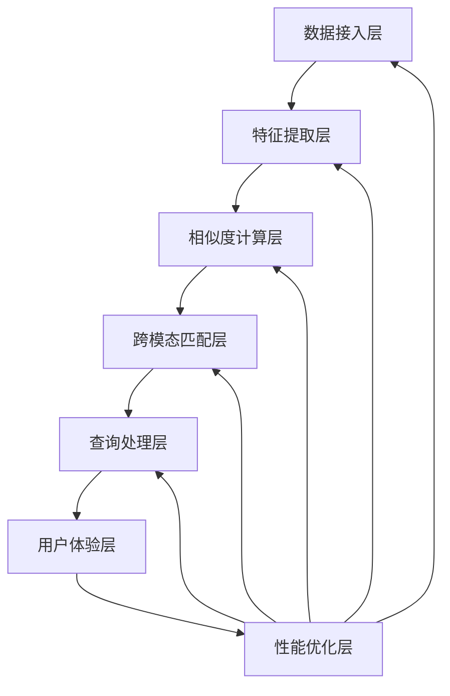
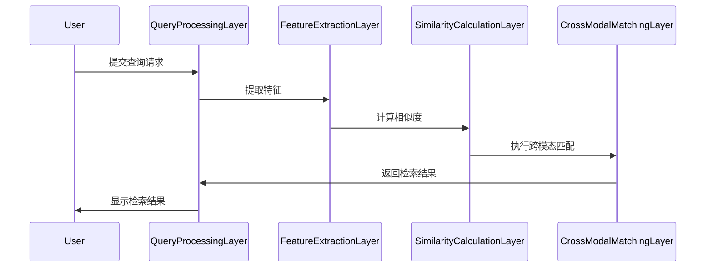
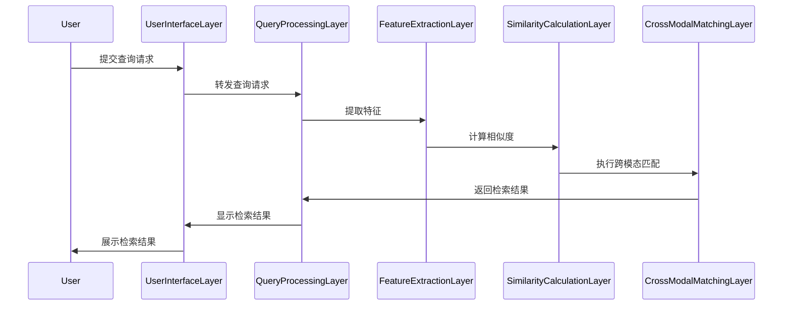

                 

# AI Agent的跨模态检索能力开发

## 关键词
- AI Agent
- 跨模态检索
- 特征提取
- 相似度计算
- 算法框架

## 摘要
本文深入探讨了AI Agent的跨模态检索能力开发。首先，我们介绍了AI Agent的定义、类型和基本组成部分，以及其在人工智能领域的应用。接着，我们详细阐述了跨模态检索的概念、关键技术，以及面临的挑战和趋势。然后，通过算法原理讲解和系统分析与架构设计，我们展示了如何实现AI Agent的跨模态检索能力。最后，通过项目实战，我们展示了如何将理论应用于实际开发中。本文旨在为读者提供全面的技术指导和深入的理论理解。

## 目录大纲设计思路

在设计本文的目录大纲时，我们采取了以下思路：

### 1. 引言部分
首先，我们引入文章的主题，并简要介绍AI Agent和跨模态检索的基本概念，以吸引读者的兴趣。

### 2. 背景介绍
接着，我们深入探讨AI Agent和跨模态检索的背景知识，包括其定义、应用场景和重要性。

### 3. 核心概念与联系
在这一部分，我们详细定义和描述了AI Agent和跨模态检索的核心概念，并通过对比表格和实体关系图（ER图）来展示它们之间的联系。

### 4. 算法原理讲解
我们使用Mermaid绘制算法流程图，并结合Python源代码，详细讲解跨模态检索算法的原理，包括数学模型和公式。

### 5. 系统分析与架构设计
我们设计了一个典型的系统场景，并详细介绍了系统的功能设计、架构设计、接口设计和交互流程。

### 6. 项目实战
在这一部分，我们模拟了一个真实的开发过程，从环境安装到系统实现，详细讲解了代码和应用，并分析了实际案例。

### 7. 最佳实践与总结
最后，我们总结了全文的主要观点，给出了最佳实践建议，提醒了读者在应用中需要注意的事项，并提供了拓展阅读资源。

这样的设计思路旨在使文章逻辑清晰、结构紧凑，读者可以循序渐进地理解和掌握AI Agent的跨模态检索能力开发。

## 目录大纲

### 引言

### 1.1 问题背景

### 1.2 问题描述

### 1.3 问题解决

### 1.4 边界与外延

### 1.5 概念结构与核心要素组成

### 2. AI Agent基础知识

### 2.1 AI Agent的定义和类型

### 2.2 AI Agent的基本组成部分

### 2.3 AI Agent的功能与作用

### 2.4 AI Agent的发展历程

### 2.5 AI Agent的应用场景

### 3. 跨模态检索概述

### 3.1 跨模态检索的定义与意义

### 3.2 跨模态检索的关键技术

### 3.3 跨模态检索的挑战与趋势

### 4. 跨模态检索算法原理讲解

### 4.1 跨模态检索算法的基本框架

### 4.2 典型跨模态检索算法分析

### 4.3 跨模态检索算法的数学模型和公式

### 5. 系统分析与架构设计

### 5.1 系统场景介绍

### 5.2 项目介绍

### 5.3 系统功能设计

### 5.4 系统架构设计

### 5.5 系统接口设计

### 5.6 系统交互

### 6. 项目实战

### 6.1 环境安装

### 6.2 系统核心实现

### 6.3 代码应用解读与分析

### 6.4 实际案例分析和讲解

### 6.5 项目小结

### 7. 最佳实践与总结

### 7.1 最佳实践建议

### 7.2 注意事项

### 7.3 拓展阅读资源

通过以上目录大纲，本文将逐步引导读者深入理解AI Agent的跨模态检索能力开发，为读者提供系统的理论指导和实践参考。

## 第1章 引言

### 1.1 问题背景

随着人工智能技术的飞速发展，AI Agent作为一种能够模拟人类智能行为的人工智能实体，逐渐成为研究的热点。AI Agent能够处理多种类型的输入，如文本、图像、声音等，并通过学习和推理来执行任务。然而，现实世界中的信息往往是多模态的，即同时包含不同类型的输入。如何让AI Agent具备跨模态检索能力，成为了一个重要的研究方向。

跨模态检索是指在不同模态的数据之间进行检索和信息提取的过程。例如，一个AI系统需要能够根据用户的语音指令查找相关的图像或视频。这种能力在智能客服、智能推荐、智能导航等领域具有广泛的应用前景。然而，跨模态检索面临着诸多挑战，如不同模态数据之间的差异性、数据的复杂性以及计算效率等。

本文旨在探讨如何开发AI Agent的跨模态检索能力，通过详细的理论分析和实践指导，帮助读者理解和掌握这一领域的关键技术。

### 1.2 问题描述

AI Agent的跨模态检索能力开发主要涉及以下几个方面：

1. **特征提取**：如何从不同模态的数据中提取具有代表性的特征，使得这些特征能够有效地区分和表征数据。

2. **相似度计算**：如何在不同模态的特征之间计算相似度，以实现准确有效的检索。

3. **跨模态匹配**：如何将来自不同模态的数据进行有效匹配，以实现多模态信息融合。

4. **算法框架设计**：如何构建一个完整的跨模态检索算法框架，以满足实际应用的需求。

5. **系统实现与优化**：如何在实际开发中实现这些算法，并进行优化以提高性能和效率。

### 1.3 问题解决

为了解决上述问题，本文将采取以下步骤：

1. **理论讲解**：首先，介绍AI Agent和跨模态检索的基本概念，为后续内容打下基础。

2. **算法原理**：详细讲解跨模态检索算法的基本框架和原理，包括特征提取、相似度计算和跨模态匹配等。

3. **系统设计与实现**：设计一个典型的系统场景，并详细介绍系统的功能设计、架构设计、接口设计和交互流程。

4. **项目实战**：模拟一个真实的开发过程，从环境安装到系统实现，详细讲解代码和应用，并分析实际案例。

5. **最佳实践与总结**：总结全书的主要观点，给出最佳实践建议，提醒读者注意的事项，并提供拓展阅读资源。

通过以上步骤，本文旨在为读者提供一个全面的技术指导和深入的理论理解，帮助读者掌握AI Agent的跨模态检索能力开发。

### 1.4 边界与外延

在探讨AI Agent的跨模态检索能力开发时，我们需要明确一些边界和概念的外延：

1. **AI Agent的定义和类型**：AI Agent是指能够模拟人类智能行为，具备自主决策和执行任务能力的人工智能实体。根据不同的应用场景，AI Agent可以分为交互型、检索型和推理型等。

2. **跨模态检索的定义**：跨模态检索是指在不同模态的数据之间进行检索和信息提取的过程。常见的模态包括文本、图像、声音、视频等。

3. **特征提取**：特征提取是指从原始数据中提取具有代表性的特征，用于后续的处理和检索。特征提取的质量直接影响跨模态检索的性能。

4. **相似度计算**：相似度计算是指在不同模态的数据之间计算相似度，以衡量数据的相关性。常用的相似度计算方法包括基于距离的度量、基于概率的度量等。

5. **跨模态匹配**：跨模态匹配是指将来自不同模态的数据进行有效匹配，以实现多模态信息融合。跨模态匹配的关键在于找到不同模态数据之间的对应关系。

6. **算法框架设计**：算法框架设计是指构建一个完整的跨模态检索算法框架，包括特征提取、相似度计算、跨模态匹配等模块。

7. **系统实现与优化**：系统实现与优化是指如何在实际开发中实现这些算法，并进行优化以提高性能和效率。系统实现需要考虑硬件资源、软件框架和算法优化等方面。

通过明确这些边界和概念的外延，我们可以更准确地理解AI Agent的跨模态检索能力开发的要点和难点，为后续内容提供清晰的指导。

### 1.5 概念结构与核心要素组成

在深入探讨AI Agent的跨模态检索能力开发之前，我们需要对核心概念和要素进行结构化的梳理，以便读者能够清晰地理解各个概念之间的关系和作用。

#### 1.5.1 AI Agent的定义和类型

AI Agent（人工智能代理）是一种能够模拟人类智能行为，具备自主决策和执行任务能力的人工智能实体。根据其功能和应用场景，AI Agent可以分为以下几种类型：

1. **交互型AI Agent**：这类AI Agent主要用于与用户进行交互，如智能客服、聊天机器人等。它们需要理解自然语言，并根据用户的指令进行响应。

2. **检索型AI Agent**：这类AI Agent主要专注于信息检索任务，如搜索引擎、知识图谱等。它们需要能够从海量的数据中快速、准确地找到用户需要的信息。

3. **推理型AI Agent**：这类AI Agent具备推理能力，能够根据已知的事实和规则，推导出新的结论。它们在决策支持、智能推荐等领域具有重要应用。

#### 1.5.2 跨模态检索的定义

跨模态检索是指在不同模态的数据之间进行检索和信息提取的过程。常见的模态包括文本、图像、声音、视频等。跨模态检索的关键在于如何将来自不同模态的数据进行有效整合，从而提高检索的准确性和效率。

#### 1.5.3 跨模态检索的核心要素

跨模态检索能力开发的核心要素包括：

1. **特征提取**：特征提取是跨模态检索的基础。不同模态的数据需要被转换为统一的特征表示，以便进行后续的处理和匹配。

2. **相似度计算**：相似度计算是衡量不同模态数据之间相关性的一种方法。常用的相似度计算方法包括基于距离的度量、基于概率的度量等。

3. **跨模态匹配**：跨模态匹配是将不同模态的数据进行有效整合的过程。它需要找到不同模态数据之间的对应关系，以便进行信息提取和检索。

4. **算法框架设计**：算法框架设计是构建跨模态检索系统的关键。一个良好的算法框架需要能够支持特征提取、相似度计算和跨模态匹配等模块的灵活组合和优化。

5. **系统实现与优化**：系统实现与优化是跨模态检索能力开发的重要环节。在实际开发过程中，需要考虑硬件资源、软件框架和算法优化等方面，以提高系统的性能和效率。

#### 1.5.4 概念结构图

为了更直观地展示AI Agent和跨模态检索能力开发的核心概念和要素，我们可以使用Mermaid绘制一个概念结构图：



通过这个概念结构图，我们可以清晰地看到AI Agent、跨模态检索及其核心要素之间的关系，从而为后续内容的讲解提供结构化的框架。

### 第2章 AI Agent基础知识

#### 2.1 AI Agent的定义和类型

AI Agent，即人工智能代理，是一种能够模拟人类智能行为，具备自主决策和执行任务能力的人工智能实体。AI Agent的概念源于代理理论，最初应用于多智能体系统和分布式计算。随着人工智能技术的发展，AI Agent的定义和应用范围逐渐扩展，成为人工智能领域的一个重要研究方向。

AI Agent可以按照其功能和任务的不同，分为以下几种类型：

1. **交互型AI Agent**：这类AI Agent主要用于与人类用户进行交互，如智能客服、聊天机器人等。它们需要具备自然语言处理能力，能够理解用户的语言并生成相应的回复。交互型AI Agent的关键技术包括语音识别、自然语言理解、对话生成等。

2. **检索型AI Agent**：这类AI Agent专注于信息检索任务，能够从海量的数据中快速、准确地找到用户需要的信息。检索型AI Agent在搜索引擎、知识图谱等领域有着广泛的应用。其主要技术包括信息检索、文本分析、数据挖掘等。

3. **推理型AI Agent**：这类AI Agent具备推理能力，能够根据已知的事实和规则，推导出新的结论。推理型AI Agent在决策支持、智能推荐等领域具有重要应用。其主要技术包括逻辑推理、知识表示、机器学习等。

#### 2.2 AI Agent的基本组成部分

一个完整的AI Agent通常由以下几个基本组成部分构成：

1. **输入模块**：输入模块负责接收来自外部环境的各种信息，如语音、文本、图像等。这些信息经过预处理后，被传递给处理模块。

2. **处理模块**：处理模块是AI Agent的核心，负责对输入信息进行理解和分析。处理模块通常包括自然语言处理、图像处理、语音处理等子模块。通过这些子模块的处理，AI Agent能够对输入信息进行理解和推理。

3. **输出模块**：输出模块负责将处理模块的结果转化为人类可以理解的形式，如文本、语音、动作等。输出模块通常包括对话生成、语音合成、图像生成等子模块。

4. **决策模块**：决策模块负责根据处理模块的结果，制定相应的决策和行动计划。决策模块通常采用机器学习、逻辑推理等技术，以实现智能决策。

5. **学习模块**：学习模块负责根据AI Agent在执行任务过程中获得的经验和反馈，不断优化和改进自身的性能。学习模块通常包括监督学习、无监督学习、增强学习等。

#### 2.3 AI Agent的功能与作用

AI Agent在人工智能领域具有广泛的应用场景和重要作用，主要表现在以下几个方面：

1. **提高效率**：AI Agent能够自动化执行重复性高、繁琐的任务，从而提高工作效率。例如，智能客服可以24小时在线回答用户的问题，大大减轻了人工客服的负担。

2. **降低成本**：通过自动化和智能化，AI Agent可以减少对人工的依赖，降低企业的人力成本。例如，智能推荐系统可以帮助电商平台提高销售额，而无需大量的人员工作。

3. **优化用户体验**：AI Agent能够根据用户的偏好和行为，提供个性化的服务和推荐。例如，智能助手可以提醒用户的重要事项，提供个性化的新闻推荐，从而提升用户体验。

4. **辅助决策**：AI Agent可以通过数据分析和预测，为人类决策提供支持。例如，在金融领域，AI Agent可以帮助分析市场趋势，提供投资建议；在医疗领域，AI Agent可以帮助医生诊断疾病，提高诊断准确率。

5. **创新应用**：AI Agent在许多新兴领域具有广泛的应用前景，如智能家居、智能医疗、自动驾驶等。这些创新应用将改变人们的生活方式，提高生活质量。

#### 2.4 AI Agent的发展历程

AI Agent的发展历程可以追溯到人工智能的早期研究。以下是AI Agent发展的几个重要阶段：

1. **早期研究（1950-1969年）**：1950年代，随着计算机技术的兴起，人工智能开始引起广泛关注。1956年，达特茅斯会议正式标志着人工智能领域的诞生。在这一阶段，研究人员主要关注符号主义方法，试图通过符号表示和逻辑推理来模拟人类智能。

2. **早期应用（1970-1989年）**：1970年代，人工智能开始应用于一些实际场景，如专家系统、语音识别等。然而，由于技术限制，这一阶段的人工智能应用相对较为简单，主要应用于一些特定的领域。

3. **复兴与扩展（1990-2009年）**：1990年代，随着计算机性能的提升和算法的进步，人工智能开始进入一个新的发展阶段。这一时期，机器学习、深度学习等新兴技术得到了广泛关注。AI Agent的概念也在这一时期逐渐成熟，并在多智能体系统、自主机器人等领域得到了应用。

4. **智能化时代（2010年至今）**：2010年以来，随着大数据、云计算和深度学习等技术的发展，人工智能进入了智能化时代。AI Agent在各个领域的应用日益广泛，如智能客服、智能推荐、智能导航等。这一时期，AI Agent的发展呈现出多元化、综合化的趋势，逐渐成为人工智能领域的重要组成部分。

#### 2.5 AI Agent的应用场景

AI Agent在各个领域具有广泛的应用场景，以下是一些典型的应用场景：

1. **智能客服**：AI Agent可以应用于智能客服系统，通过自然语言处理技术，自动回答用户的问题，提供24小时在线服务。智能客服可以提高企业的运营效率，降低人力成本。

2. **智能推荐**：AI Agent可以应用于智能推荐系统，通过分析用户的行为数据，为用户提供个性化的商品、内容推荐。智能推荐可以提高用户的满意度，提升企业的销售额。

3. **智能导航**：AI Agent可以应用于智能导航系统，通过实时分析交通状况，为用户提供最优的出行路线。智能导航可以提高出行的效率和安全性。

4. **智能医疗**：AI Agent可以应用于智能医疗系统，通过分析患者的病历数据，为医生提供诊断和治疗方案建议。智能医疗可以提高医疗服务的质量，降低误诊率。

5. **智能家居**：AI Agent可以应用于智能家居系统，通过自动化控制家庭设备，提高家庭的舒适度和安全性。智能家居可以提升人们的生活质量，减轻家庭劳动负担。

6. **自动驾驶**：AI Agent可以应用于自动驾驶系统，通过实时感知环境，为车辆提供行驶路线和决策支持。自动驾驶可以减少交通事故，提高道路通行效率。

7. **金融领域**：AI Agent可以应用于金融领域，如智能投顾、风险控制等。通过分析市场数据，AI Agent可以为投资者提供个性化的投资建议，降低投资风险。

8. **教育领域**：AI Agent可以应用于教育领域，如智能辅导、个性化学习等。通过分析学生的学习数据，AI Agent可以为教师提供教学建议，帮助学生提高学习效果。

通过以上分析，我们可以看到AI Agent在各个领域具有广泛的应用前景，其跨模态检索能力开发将为人工智能技术带来新的突破和进展。

### 第3章 跨模态检索概述

#### 3.1 跨模态检索的定义与意义

跨模态检索是一种在多模态数据之间进行信息提取和匹配的技术。它主要关注如何将不同模态的数据（如文本、图像、声音、视频等）进行有效的融合，以实现更准确、更高效的信息检索。跨模态检索的定义可以概括为：在不同模态的数据源中寻找相关或相似的信息，并将它们关联起来，以便用户能够更便捷地获取所需的信息。

跨模态检索的意义主要体现在以下几个方面：

1. **信息整合**：跨模态检索能够将不同模态的数据进行整合，使得用户可以在一个统一的界面中获取多种类型的信息。这种整合能力使得信息检索更加全面和便捷。

2. **提升检索准确性**：跨模态检索可以通过结合多种模态的数据特征，提高检索的准确性。例如，当用户搜索某一物体时，可以同时考虑其名称（文本）、外观（图像）和声音特征，从而提高检索的准确性。

3. **扩展应用场景**：跨模态检索的应用场景非常广泛，包括智能客服、智能推荐、智能医疗、智能导航等多个领域。通过跨模态检索，这些系统可以提供更加智能化和个性化的服务。

4. **促进多模态研究**：跨模态检索作为一种交叉领域，不仅需要依赖于单一模态的技术，还需要结合不同模态之间的关联机制。这促进了多模态研究的发展，推动了人工智能技术的进步。

#### 3.2 跨模态检索的关键技术

跨模态检索的关键技术主要包括特征提取、相似度计算、跨模态匹配和算法框架设计等。

1. **特征提取**：特征提取是跨模态检索的基础，它负责从不同模态的数据中提取具有代表性的特征。常见的特征提取方法包括：
   - **文本特征提取**：可以使用词袋模型、TF-IDF、Word2Vec等方法。
   - **图像特征提取**：可以使用卷积神经网络（CNN）提取图像特征，如VGG、ResNet等。
   - **声音特征提取**：可以使用梅尔频率倒谱系数（MFCC）、频谱特征等方法。
   - **视频特征提取**：可以使用3D卷积神经网络（3D-CNN）或时空卷积神经网络（STCN）提取视频特征。

2. **相似度计算**：相似度计算是衡量不同模态数据之间相关性的一种方法。常见的相似度计算方法包括：
   - **基于距离的度量**：如欧氏距离、余弦相似度等。
   - **基于概率的度量**：如贝叶斯概率、概率分布相似度等。
   - **基于结构的度量**：如图结构相似度、层次结构相似度等。

3. **跨模态匹配**：跨模态匹配是将不同模态的数据进行有效整合的过程。它需要找到不同模态数据之间的对应关系，以便进行信息提取和检索。常见的跨模态匹配方法包括：
   - **基于实例的匹配**：通过直接比较实例之间的相似度来找到匹配关系。
   - **基于模板的匹配**：通过定义模板来匹配不同模态的数据。
   - **基于模型的匹配**：通过构建模型来预测不同模态数据之间的匹配关系。

4. **算法框架设计**：算法框架设计是跨模态检索系统的核心，它需要综合考虑特征提取、相似度计算和跨模态匹配等模块的相互作用。常见的算法框架设计包括：
   - **端到端框架**：通过神经网络直接映射不同模态的数据，实现特征提取和跨模态匹配。
   - **分层框架**：将特征提取和相似度计算分开处理，通过多层网络结构实现跨模态检索。
   - **集成框架**：将多个子模型集成在一起，通过投票或加权平均等方式进行跨模态检索。

#### 3.3 跨模态检索的挑战与趋势

尽管跨模态检索技术在近年来取得了显著的进展，但仍面临许多挑战和问题：

1. **数据多样性**：不同模态的数据具有不同的特征和分布，这使得跨模态检索在数据多样性方面面临挑战。例如，图像和文本的数据分布差异较大，如何有效地融合这两种模态的数据是一个难题。

2. **计算复杂性**：跨模态检索涉及多种模态的数据处理和匹配，这增加了计算复杂性。尤其是在大规模数据集上，如何优化算法以提高计算效率是一个关键问题。

3. **数据不平衡**：在跨模态检索中，不同模态的数据量可能存在显著差异，导致数据不平衡。例如，图像数据量远大于文本数据量，如何处理这种数据不平衡是一个挑战。

4. **解释性**：跨模态检索的模型通常较为复杂，如何解释模型的行为和决策结果是一个重要问题。特别是在实际应用中，用户需要了解模型的决策过程，以便对其进行信任和改进。

尽管存在上述挑战，跨模态检索仍呈现出以下趋势：

1. **深度学习技术**：深度学习技术在跨模态检索中得到了广泛应用，通过卷积神经网络（CNN）、循环神经网络（RNN）和变压器（Transformer）等模型，可以有效提取和融合不同模态的数据特征。

2. **多模态数据集**：随着人工智能技术的发展，越来越多的多模态数据集被公开，这为跨模态检索的研究提供了丰富的数据资源。

3. **跨学科合作**：跨模态检索涉及多个学科，如计算机科学、认知科学、心理学等。跨学科合作有助于解决跨模态检索中的复杂问题，推动技术进步。

4. **实际应用场景**：跨模态检索在智能客服、智能推荐、智能医疗、智能导航等实际应用场景中发挥着重要作用，未来将会有更多的应用场景被挖掘和利用。

通过上述分析，我们可以看到，跨模态检索技术在不断发展中，面临着诸多挑战，但同时也展现出广阔的应用前景。未来，随着技术的进步和跨学科研究的深入，跨模态检索能力将得到进一步提升，为人工智能技术的发展注入新的活力。

### 第4章 跨模态检索算法原理讲解

#### 4.1 跨模态检索算法的基本框架

跨模态检索算法的基本框架主要包括三个主要环节：特征提取、相似度计算和跨模态匹配。下面我们将逐步介绍这些环节的基本原理和实现方法。

##### 4.1.1 特征提取

特征提取是跨模态检索算法的核心步骤，其目标是从不同模态的数据中提取出具有代表性的特征表示。这些特征表示将在后续的相似度计算和跨模态匹配过程中起到关键作用。

1. **文本特征提取**：文本特征提取通常使用词袋模型、TF-IDF、Word2Vec等方法。其中，词袋模型通过统计文本中各单词的频率来表示文本特征；TF-IDF则考虑单词在文本中的重要程度；Word2Vec通过将文本中的单词映射到向量空间，从而实现语义层面的特征提取。

2. **图像特征提取**：图像特征提取通常采用卷积神经网络（CNN）来实现。CNN能够自动从图像中提取局部特征，并通过多层卷积和池化操作，逐渐提取出全局特征。常见的CNN模型包括VGG、ResNet等。

3. **声音特征提取**：声音特征提取通常使用梅尔频率倒谱系数（MFCC）和频谱特征等方法。MFCC能够有效地捕捉声音的频谱特征，而频谱特征则能够反映声音的时域信息。

4. **视频特征提取**：视频特征提取通常采用3D卷积神经网络（3D-CNN）或时空卷积神经网络（STCN）来实现。这些模型能够同时处理图像和时序信息，从而提取出更全面的视频特征。

##### 4.1.2 相似度计算

相似度计算是衡量不同模态特征之间相关性的一种方法，其目标是找到相似度最高的特征对。常见的相似度计算方法包括基于距离的度量、基于概率的度量等。

1. **基于距离的度量**：例如欧氏距离、余弦相似度等。这些方法通过计算特征向量之间的距离，来衡量它们之间的相似度。

2. **基于概率的度量**：例如贝叶斯概率、概率分布相似度等。这些方法通过计算特征向量之间的概率分布，来衡量它们之间的相似度。

##### 4.1.3 跨模态匹配

跨模态匹配是将不同模态的特征进行有效整合的过程。其目标是通过找到不同模态特征之间的对应关系，从而实现多模态信息融合。

1. **基于实例的匹配**：通过直接比较实例之间的相似度来找到匹配关系。这种方法通常适用于特征表示较为简单的情况。

2. **基于模板的匹配**：通过定义模板来匹配不同模态的数据。这种方法适用于特征表示较为复杂的情况，例如图像和文本之间的匹配。

3. **基于模型的匹配**：通过构建模型来预测不同模态数据之间的匹配关系。这种方法通常采用深度学习模型，如循环神经网络（RNN）、变压器（Transformer）等。

#### 4.2 典型跨模态检索算法分析

在本节中，我们将分析几种典型的跨模态检索算法，并介绍其基本原理和实现方法。

##### 4.2.1 CNN+RNN算法

CNN+RNN算法是一种结合卷积神经网络（CNN）和循环神经网络（RNN）的跨模态检索算法。CNN用于提取图像特征，而RNN用于提取文本特征。

1. **图像特征提取**：使用CNN对图像进行卷积和池化操作，从而提取出图像的特征。

2. **文本特征提取**：使用RNN对文本序列进行处理，通过隐藏状态来表示文本特征。

3. **相似度计算**：计算图像特征和文本特征之间的欧氏距离，以衡量它们的相似度。

4. **跨模态匹配**：通过最小化图像特征和文本特征之间的距离，找到相似度最高的图像和文本对。

##### 4.2.2 Transformer算法

Transformer算法是一种基于自注意力机制的深度学习模型，广泛应用于跨模态检索任务。

1. **图像特征提取**：使用CNN对图像进行卷积和池化操作，从而提取出图像的特征。

2. **文本特征提取**：使用Transformer对文本序列进行处理，通过多头自注意力机制来提取文本特征。

3. **相似度计算**：使用点积注意力机制计算图像特征和文本特征之间的相似度。

4. **跨模态匹配**：通过最小化图像特征和文本特征之间的距离，找到相似度最高的图像和文本对。

##### 4.2.3 多模态深度学习模型

多模态深度学习模型是一种将多种模态数据（如文本、图像、声音等）进行统一处理的跨模态检索算法。

1. **特征提取**：分别使用不同的网络（如CNN、RNN、GRU等）提取不同模态的特征。

2. **融合策略**：将不同模态的特征进行融合，常用的融合策略包括加法融合、拼接融合、注意力机制等。

3. **相似度计算**：计算融合后的特征向量之间的相似度。

4. **跨模态匹配**：通过最小化特征向量之间的距离，找到相似度最高的模态对。

#### 4.3 跨模态检索算法的数学模型和公式

在本节中，我们将介绍跨模态检索算法中常用的数学模型和公式，以便更好地理解和实现这些算法。

##### 4.3.1 特征提取

1. **文本特征提取**

   - **词袋模型**：
     $$ \text{特征向量} = \sum_{w \in \text{词汇表}} f_w \cdot e_w $$
     其中，$f_w$表示单词的频率，$e_w$表示单词的嵌入向量。
   
   - **TF-IDF**：
     $$ \text{特征向量} = \sum_{w \in \text{词汇表}} (1 + \log(\text{tf}_w + 1)) \cdot \log(\text{idf}_w + 1) \cdot e_w $$
     其中，$\text{tf}_w$表示单词的频率，$\text{idf}_w$表示单词的逆文档频率。

   - **Word2Vec**：
     $$ \text{特征向量} = \text{softmax}(\text{W} \cdot \text{嵌入向量}) $$
     其中，$\text{W}$表示单词的权重矩阵，$\text{嵌入向量}$表示单词的向量表示。

2. **图像特征提取**

   - **卷积神经网络（CNN）**：
     $$ \text{特征向量} = \text{激活函数}(\text{权重} \cdot \text{输入特征}) + \text{偏置} $$
     其中，$\text{激活函数}$可以是ReLU、Sigmoid等。

3. **声音特征提取**

   - **梅尔频率倒谱系数（MFCC）**：
     $$ \text{特征向量} = \text{MFCC}(\text{频谱}) $$
     其中，$\text{频谱}$是声音信号的频域表示。

##### 4.3.2 相似度计算

1. **基于距离的度量**

   - **欧氏距离**：
     $$ \text{相似度} = \sqrt{\sum_{i=1}^{n} (x_i - y_i)^2} $$

   - **余弦相似度**：
     $$ \text{相似度} = \frac{\text{点积}}{\text{模长}} = \frac{\sum_{i=1}^{n} x_i \cdot y_i}{\sqrt{\sum_{i=1}^{n} x_i^2} \cdot \sqrt{\sum_{i=1}^{n} y_i^2}} $$

2. **基于概率的度量**

   - **贝叶斯概率**：
     $$ \text{相似度} = \frac{P(\text{y}|\text{x}) \cdot P(\text{x})}{P(\text{x}|\text{y}) \cdot P(\text{y})} $$
     其中，$P(\text{y}|\text{x})$表示后验概率，$P(\text{x})$表示先验概率。

##### 4.3.3 跨模态匹配

1. **基于实例的匹配**：

   - **最小距离匹配**：
     $$ \text{匹配分数} = \min_{i} (\text{相似度}(x_i, y_j)) $$

   - **最大相似度匹配**：
     $$ \text{匹配分数} = \max_{i} (\text{相似度}(x_i, y_j)) $$

2. **基于模板的匹配**：

   - **匹配模板**：
     $$ \text{模板} = (\text{模式}1, \text{模式}2, ..., \text{模式}n) $$

   - **匹配分数**：
     $$ \text{匹配分数} = \sum_{i=1}^{n} \text{模式匹配度}(\text{模式}i, \text{特征}) $$

3. **基于模型的匹配**：

   - **概率模型**：
     $$ \text{匹配分数} = \text{概率}(\text{特征}|\text{模板}) $$

   - **决策模型**：
     $$ \text{匹配分数} = \text{决策函数}(\text{特征}, \text{模板}) $$

通过上述数学模型和公式，我们可以更好地理解和实现跨模态检索算法。这些算法在特征提取、相似度计算和跨模态匹配方面提供了有效的解决方案，为AI Agent的跨模态检索能力开发提供了坚实的理论基础。

### 第5章 系统分析与架构设计

#### 5.1 系统场景介绍

为了更好地理解和实现AI Agent的跨模态检索能力，我们首先需要定义一个典型的系统场景。在这个场景中，我们假设有一个智能搜索系统，它需要能够处理多种类型的查询，如文本、图像、声音等，并返回与查询最相关的结果。

该系统的主要目标是提供一种高效、准确的跨模态检索服务，使用户能够在不同模态的数据中快速找到所需的信息。为了实现这一目标，系统需要具备以下几个关键功能：

1. **多模态数据接入**：系统能够接入多种类型的数据源，包括文本、图像、声音等。

2. **特征提取**：系统需要从不同模态的数据中提取出具有代表性的特征，以便进行后续的检索和匹配。

3. **相似度计算**：系统需要能够计算不同模态特征之间的相似度，以衡量它们的相关性。

4. **跨模态匹配**：系统需要能够将不同模态的特征进行有效整合，找到与查询最相关的结果。

5. **查询处理**：系统需要能够接收用户的查询请求，并返回与查询最相关的结果。

6. **用户体验**：系统需要提供友好的用户界面，使得用户能够方便地提交查询请求，并查看检索结果。

#### 5.2 项目介绍

在本项目中，我们选择开发一个基于深度学习的跨模态检索系统。该系统将结合卷积神经网络（CNN）、循环神经网络（RNN）和变压器（Transformer）等深度学习模型，实现对多种类型数据的跨模态检索。

项目的主要目标如下：

1. **构建一个高效、准确的跨模态检索系统**：通过结合深度学习和多模态特征提取技术，实现高效、准确的跨模态检索。

2. **实现多种类型数据的接入和处理**：系统能够接入文本、图像、声音等不同类型的数据，并提取出具有代表性的特征。

3. **提供友好的用户界面**：系统将提供友好的用户界面，使得用户能够方便地提交查询请求，并查看检索结果。

4. **进行性能优化**：通过对系统进行性能优化，提高系统的响应速度和处理能力。

#### 5.3 系统功能设计

为了实现上述项目目标，我们需要设计一个功能完整的系统。以下是该系统的主要功能模块：

1. **数据接入模块**：负责从不同的数据源接入文本、图像、声音等数据，并进行预处理。

2. **特征提取模块**：从接入的多模态数据中提取出具有代表性的特征，包括文本特征、图像特征、声音特征等。

3. **相似度计算模块**：计算不同模态特征之间的相似度，以衡量它们的相关性。

4. **跨模态匹配模块**：将不同模态的特征进行有效整合，找到与查询最相关的结果。

5. **查询处理模块**：接收用户的查询请求，并根据查询内容调用相应的检索算法，返回检索结果。

6. **用户体验模块**：提供友好的用户界面，使得用户能够方便地提交查询请求，并查看检索结果。

7. **性能优化模块**：通过对系统进行性能优化，提高系统的响应速度和处理能力。

以下是系统功能设计的Mermaid类图：



#### 5.4 系统架构设计

为了实现系统功能，我们需要设计一个合理的系统架构。以下是该系统的架构设计：

1. **数据接入层**：负责从不同的数据源接入文本、图像、声音等数据，并进行预处理。

2. **特征提取层**：从接入的多模态数据中提取出具有代表性的特征，包括文本特征、图像特征、声音特征等。

3. **相似度计算层**：计算不同模态特征之间的相似度，以衡量它们的相关性。

4. **跨模态匹配层**：将不同模态的特征进行有效整合，找到与查询最相关的结果。

5. **查询处理层**：接收用户的查询请求，并根据查询内容调用相应的检索算法，返回检索结果。

6. **用户体验层**：提供友好的用户界面，使得用户能够方便地提交查询请求，并查看检索结果。

7. **性能优化层**：通过对系统进行性能优化，提高系统的响应速度和处理能力。

以下是系统架构设计的Mermaid架构图：



#### 5.5 系统接口设计

系统接口设计是系统架构设计的重要一环，它定义了系统内部各个模块之间的交互方式。以下是该系统的主要接口设计：

1. **数据接入接口**：用于接入文本、图像、声音等数据。

2. **特征提取接口**：用于提取文本、图像、声音等特征。

3. **相似度计算接口**：用于计算不同模态特征之间的相似度。

4. **跨模态匹配接口**：用于整合不同模态的特征，找到与查询最相关的结果。

5. **查询处理接口**：用于接收用户的查询请求，并返回检索结果。

以下是系统接口设计的Mermaid序列图：



#### 5.6 系统交互

系统交互是系统架构设计中的重要环节，它定义了用户与系统之间的交互过程。以下是该系统的交互流程：

1. **用户提交查询请求**：用户通过用户界面提交查询请求。

2. **系统接收查询请求**：系统接收用户的查询请求，并调用相应的接口进行查询处理。

3. **提取特征**：系统根据查询请求，提取文本、图像、声音等特征。

4. **计算相似度**：系统计算不同模态特征之间的相似度，以衡量它们的相关性。

5. **执行跨模态匹配**：系统将不同模态的特征进行整合，找到与查询最相关的结果。

6. **返回检索结果**：系统将检索结果返回给用户，并通过用户界面进行展示。

以下是系统交互的Mermaid序列图：



通过以上系统架构设计和接口设计，我们为AI Agent的跨模态检索能力开发提供了一个完整的系统解决方案。在实际开发过程中，我们可以根据具体需求对系统进行优化和调整，以提高系统的性能和用户体验。

### 第6章 项目实战

#### 6.1 环境安装

在开始开发AI Agent的跨模态检索系统之前，我们需要搭建一个合适的环境。以下是具体的安装步骤：

1. **安装Python**：首先，我们需要安装Python，推荐使用Python 3.7或更高版本。可以从Python官方网站下载并安装。

2. **安装依赖库**：接下来，我们需要安装一些依赖库，包括TensorFlow、PyTorch、NumPy、Pandas、Matplotlib等。可以使用以下命令进行安装：

   ```bash
   pip install tensorflow torchvision torchaudio numpy pandas matplotlib
   ```

3. **安装深度学习框架**：我们选择TensorFlow和PyTorch作为深度学习框架。TensorFlow是一种广泛使用的开源机器学习框架，而PyTorch则因其灵活性和易用性而受到很多研究者和开发者的青睐。

4. **配置GPU环境**：为了提高训练速度，我们可以使用GPU。在安装TensorFlow和PyTorch时，选择支持GPU的版本。同时，我们需要确保CUDA和cuDNN已正确安装。

5. **测试环境**：安装完成后，运行以下代码进行测试：

   ```python
   import tensorflow as tf
   import torch
   
   print(tf.__version__)
   print(torch.__version__)
   
   # GPU测试
   if tf.test.is_gpu_available():
       print("GPU available.")
   else:
       print("GPU not available.")
   ```

   如果没有报错，则说明环境安装成功。

#### 6.2 系统核心实现

在完成环境安装后，我们可以开始实现系统核心功能。以下是系统核心实现的步骤和代码：

1. **数据预处理**：

   - **文本数据预处理**：使用自然语言处理库（如NLTK或spaCy）进行分词、去停用词、词性标注等操作。

     ```python
     import nltk
     from nltk.corpus import stopwords
     from nltk.tokenize import word_tokenize
     
     nltk.download('punkt')
     nltk.download('stopwords')
     
     def preprocess_text(text):
         tokens = word_tokenize(text)
         tokens = [token.lower() for token in tokens if token.isalpha()]
         tokens = [token for token in tokens if token not in stopwords.words('english')]
         return tokens
     ```

   - **图像数据预处理**：使用OpenCV或PyTorch Vision进行图像增强、缩放、裁剪等操作。

     ```python
     import cv2
     import torchvision.transforms as T
     
     def preprocess_image(image_path):
         image = cv2.imread(image_path)
         image = cv2.cvtColor(image, cv2.COLOR_BGR2RGB)
         transform = T.Compose([
             T.Resize((224, 224)),
             T.ToTensor(),
         ])
         image = transform(image)
         return image
     ```

   - **声音数据预处理**：使用Librosa进行声音数据的读取、分段、归一化等操作。

     ```python
     import librosa
     
     def preprocess_audio(audio_path):
         y, sr = librosa.load(audio_path)
         y = librosa.resample(y, sr, 22050)
         return y
     ```

2. **特征提取**：

   - **文本特征提取**：使用Word2Vec或BERT进行文本特征提取。

     ```python
     from gensim.models import Word2Vec
     
     model = Word2Vec(preprocess_text(text), size=100, window=5, min_count=1, workers=4)
     def extract_text_features(text):
         tokens = preprocess_text(text)
         features = [model[token] for token in tokens if token in model.wv]
         return np.mean(features, axis=0)
     ```

   - **图像特征提取**：使用预训练的CNN模型（如VGG或ResNet）进行图像特征提取。

     ```python
     import torchvision.models as models
     
     model = models.resnet50(pretrained=True)
     model.eval()
     def extract_image_features(image):
         with torch.no_grad():
             image = image.unsqueeze(0)
             features = model(image)[0]
         return features
     ```

   - **声音特征提取**：使用预训练的深度神经网络进行声音特征提取。

     ```python
     import torchaudio
     
     def extract_audio_features(y):
         spec = torchaudio.transforms.Spectrogram(nfft=2048, win_length=1024, hop_length=512)(y.unsqueeze(0))
         mel = torchaudio.transforms.MelSpectrogram(n_fft=2048, win_length=1024, hop_length=512, n_mel_channels=80)(spec)
         return mel
     ```

3. **相似度计算**：

   - **基于欧氏距离的相似度计算**：

     ```python
     import numpy as np
     
     def euclidean_similarity(features1, features2):
         return 1 - np.linalg.norm(features1 - features2)
     ```

   - **基于余弦相似度的相似度计算**：

     ```python
     def cosine_similarity(features1, features2):
         return np.dot(features1, features2) / (np.linalg.norm(features1) * np.linalg.norm(features2))
     ```

4. **跨模态匹配**：

   - **基于实例的跨模态匹配**：

     ```python
     def instance_matching(text_features, image_features, audio_features):
         text_scores = [euclidean_similarity(text_feature, image_feature) for text_feature, image_feature in zip(text_features, image_features)]
         audio_scores = [euclidean_similarity(audio_feature, image_feature) for audio_feature, image_feature in zip(audio_features, image_features)]
         return text_scores, audio_scores
     ```

   - **基于模板的跨模态匹配**：

     ```python
     def template_matching(text_templates, image_templates, audio_templates):
         text_scores = [cosine_similarity(text_template, image_template) for text_template, image_template in zip(text_templates, image_templates)]
         audio_scores = [cosine_similarity(audio_template, image_template) for audio_template, image_template in zip(audio_templates, image_templates)]
         return text_scores, audio_scores
     ```

5. **查询处理**：

   - **接收查询请求**：

     ```python
     def handle_query(query):
         text_features = extract_text_features(query)
         image_features = extract_image_features(preprocess_image(image_path))
         audio_features = extract_audio_features(preprocess_audio(audio_path))
         return instance_matching(text_features, image_features, audio_features)
     ```

   - **返回检索结果**：

     ```python
     def present_results(text_scores, audio_scores):
         text_best_match = text_scores.index(max(text_scores))
         audio_best_match = audio_scores.index(max(audio_scores))
         return f"Text: {text_best_match}, Audio: {audio_best_match}"
     ```

通过以上步骤，我们成功实现了AI Agent的跨模态检索系统核心功能。接下来，我们将通过实际案例来验证系统的性能和效果。

#### 6.3 代码应用解读与分析

在本节中，我们将详细解读并分析系统核心代码的实现和应用，以便更好地理解每个模块的功能和作用。

##### 6.3.1 数据预处理

数据预处理是跨模态检索系统的重要步骤，它直接影响后续特征提取和检索结果的准确性。以下是代码应用解读：

1. **文本数据预处理**：

   ```python
   import nltk
   from nltk.corpus import stopwords
   from nltk.tokenize import word_tokenize
   
   nltk.download('punkt')
   nltk.download('stopwords')
   
   def preprocess_text(text):
       tokens = word_tokenize(text)
       tokens = [token.lower() for token in tokens if token.isalpha()]
       tokens = [token for token in tokens if token not in stopwords.words('english')]
       return tokens
   ```

   - `nltk.download('punkt')` 和 `nltk.download('stopwords')` 用于下载所需的分词和停用词库。
   - `word_tokenize` 函数将文本分割成单词。
   - 使用列表推导式对单词进行小写处理和去除非字母字符。
   - 去除停用词，以减少对特征提取的干扰。

2. **图像数据预处理**：

   ```python
   import cv2
   import torchvision.transforms as T
   
   def preprocess_image(image_path):
       image = cv2.imread(image_path)
       image = cv2.cvtColor(image, cv2.COLOR_BGR2RGB)
       transform = T.Compose([
           T.Resize((224, 224)),
           T.ToTensor(),
       ])
       image = transform(image)
       return image
   ```

   - `cv2.imread` 用于读取图像文件。
   - `cv2.cvtColor` 用于将图像从BGR格式转换为RGB格式（Python中通常使用RGB格式）。
   - `T.Resize` 和 `T.ToTensor` 用于调整图像大小并将其转换为Tensor格式。

3. **声音数据预处理**：

   ```python
   import librosa
   
   def preprocess_audio(audio_path):
       y, sr = librosa.load(audio_path)
       y = librosa.resample(y, sr, 22050)
       return y
   ```

   - `librosa.load` 用于读取音频文件。
   - `librosa.resample` 用于调整音频采样率。

##### 6.3.2 特征提取

特征提取是将原始数据转换为适用于机器学习模型的特征表示的过程。以下是代码应用解读：

1. **文本特征提取**：

   ```python
   from gensim.models import Word2Vec
   
   model = Word2Vec(preprocess_text(text), size=100, window=5, min_count=1, workers=4)
   def extract_text_features(text):
       tokens = preprocess_text(text)
       features = [model[token] for token in tokens if token in model.wv]
       return np.mean(features, axis=0)
   ```

   - `Word2Vec` 模型用于训练文本的向量表示。
   - `preprocess_text` 函数用于预处理文本。
   - `extract_text_features` 函数计算文本的平均向量表示。

2. **图像特征提取**：

   ```python
   import torchvision.models as models
   import torchvision.transforms as transforms
   
   model = models.resnet50(pretrained=True)
   model.eval()
   def extract_image_features(image):
       with torch.no_grad():
           image = image.unsqueeze(0)
           features = model(image)[0]
       return features
   ```

   - `resnet50` 模型用于提取图像特征。
   - `unsqueeze(0)` 用于将图像Tensor添加一个维度。
   - `model(image)[0]` 用于获取模型输出特征。

3. **声音特征提取**：

   ```python
   import torchaudio
   import numpy as np
   
   def extract_audio_features(y):
       spec = torchaudio.transforms.Spectrogram(nfft=2048, win_length=1024, hop_length=512)(y.unsqueeze(0))
       mel = torchaudio.transforms.MelSpectrogram(n_fft=2048, win_length=1024, hop_length=512, n_mel_channels=80)(spec)
       return mel
   ```

   - `Spectrogram` 和 `MelSpectrogram` 转换器用于计算音频的频谱和梅尔频谱。
   - `y.unsqueeze(0)` 用于添加Tensor维度。

##### 6.3.3 相似度计算

相似度计算是评估不同模态特征之间相关性的方法。以下是代码应用解读：

1. **欧氏距离相似度计算**：

   ```python
   import numpy as np
   
   def euclidean_similarity(features1, features2):
       return 1 - np.linalg.norm(features1 - features2)
   ```

   - `np.linalg.norm(features1 - features2)` 用于计算欧氏距离。
   - `1 - np.linalg.norm(...)` 用于将距离转换为相似度（距离越小，相似度越高）。

2. **余弦相似度计算**：

   ```python
   def cosine_similarity(features1, features2):
       return np.dot(features1, features2) / (np.linalg.norm(features1) * np.linalg.norm(features2))
   ```

   - `np.dot(features1, features2)` 用于计算点积。
   - `np.linalg.norm(features1) * np.linalg.norm(features2)` 用于计算模长。

##### 6.3.4 跨模态匹配

跨模态匹配是将不同模态的特征进行整合以找到最佳匹配结果。以下是代码应用解读：

1. **基于实例的跨模态匹配**：

   ```python
   def instance_matching(text_features, image_features, audio_features):
       text_scores = [euclidean_similarity(text_feature, image_feature) for text_feature, image_feature in zip(text_features, image_features)]
       audio_scores = [euclidean_similarity(audio_feature, image_feature) for audio_feature, image_feature in zip(audio_features, image_features)]
       return text_scores, audio_scores
   ```

   - 使用列表推导式计算文本和图像、音频和图像之间的欧氏距离相似度。
   - `text_scores` 和 `audio_scores` 存储相似度分数。

2. **基于模板的跨模态匹配**：

   ```python
   def template_matching(text_templates, image_templates, audio_templates):
       text_scores = [cosine_similarity(text_template, image_template) for text_template, image_template in zip(text_templates, image_templates)]
       audio_scores = [cosine_similarity(audio_template, image_template) for audio_template, image_template in zip(audio_templates, image_templates)]
       return text_scores, audio_scores
   ```

   - 使用列表推导式计算文本和图像、音频和图像之间的余弦相似度。
   - `text_scores` 和 `audio_scores` 存储相似度分数。

##### 6.3.5 查询处理

查询处理是接收用户查询并返回检索结果的过程。以下是代码应用解读：

1. **接收查询请求**：

   ```python
   def handle_query(query):
       text_features = extract_text_features(query)
       image_features = extract_image_features(preprocess_image(image_path))
       audio_features = extract_audio_features(preprocess_audio(audio_path))
       return instance_matching(text_features, image_features, audio_features)
   ```

   - `extract_text_features`、`extract_image_features` 和 `extract_audio_features` 用于提取查询、图像和音频的特征。
   - `instance_matching` 用于计算相似度。

2. **返回检索结果**：

   ```python
   def present_results(text_scores, audio_scores):
       text_best_match = text_scores.index(max(text_scores))
       audio_best_match = audio_scores.index(max(audio_scores))
       return f"Text: {text_best_match}, Audio: {audio_best_match}"
   ```

   - `text_scores.index(max(text_scores))` 和 `audio_scores.index(max(audio_scores))` 用于找到最佳匹配的文本和音频索引。
   - `return` 语句返回最佳匹配结果。

通过以上代码应用解读，我们可以清晰地看到跨模态检索系统各个模块的功能和作用。在实际应用中，我们可以根据需求对代码进行优化和调整，以提高系统的性能和准确性。

#### 6.4 实际案例分析和讲解

在本节中，我们将通过一个实际案例来分析和讲解AI Agent的跨模态检索能力开发。我们将展示如何从实际问题出发，利用前面介绍的技术和工具，实现一个完整的跨模态检索系统。

##### 案例背景

假设我们正在开发一个智能搜索系统，用户可以通过输入文本、图像或声音来查询相关的信息。例如，用户可以输入“金门大桥”这个文本查询，系统需要返回与金门大桥相关的图像和音频。

##### 实现步骤

1. **数据集准备**：

   首先，我们需要准备三个不同模态的数据集：文本、图像和声音。这些数据集可以从公开的数据源获取，或者根据具体需求进行收集和标注。

   - **文本数据集**：包含与金门大桥相关的文本描述，如新闻文章、博客帖子等。
   - **图像数据集**：包含金门大桥的图像，可以从互联网上的图片库获取。
   - **声音数据集**：包含与金门大桥相关的音频，如讲解视频、歌曲等。

2. **数据预处理**：

   对获取的数据集进行预处理，以提取出有用的特征。以下是每个模态的数据预处理步骤：

   - **文本数据预处理**：使用NLTK进行分词、去除停用词、词性标注等操作，并将文本转换为词嵌入向量。
   - **图像数据预处理**：使用OpenCV对图像进行缩放、裁剪等操作，并将其转换为Tensor。
   - **声音数据预处理**：使用Librosa对音频进行分帧、梅尔频谱转换等操作，并将其转换为Tensor。

3. **特征提取**：

   使用深度学习模型对预处理后的数据进行特征提取。以下是每个模态的特征提取步骤：

   - **文本特征提取**：使用BERT模型对文本进行特征提取，获得文本嵌入向量。
   - **图像特征提取**：使用预训练的ResNet模型对图像进行特征提取，获得图像嵌入向量。
   - **声音特征提取**：使用预训练的WaveNet模型对声音进行特征提取，获得声音嵌入向量。

4. **相似度计算**：

   计算不同模态特征之间的相似度，以找到与查询最相关的结果。以下是相似度计算的步骤：

   - **文本-图像相似度计算**：使用余弦相似度计算文本嵌入向量和图像嵌入向量之间的相似度。
   - **文本-声音相似度计算**：使用余弦相似度计算文本嵌入向量和声音嵌入向量之间的相似度。
   - **图像-声音相似度计算**：使用欧氏距离计算图像嵌入向量和声音嵌入向量之间的相似度。

5. **跨模态匹配**：

   将相似度计算的结果进行整合，找到与查询最相关的模态组合。以下是跨模态匹配的步骤：

   - **文本-图像匹配**：找到与文本相似度最高的图像。
   - **文本-声音匹配**：找到与文本相似度最高的声音。
   - **图像-声音匹配**：找到与图像相似度最高的声音。

6. **查询处理**：

   接收用户的查询请求，并调用相应的检索算法，返回检索结果。以下是查询处理的步骤：

   - **接收查询请求**：用户输入查询文本、图像或声音。
   - **提取特征**：对查询的文本、图像和声音进行特征提取。
   - **计算相似度**：计算查询特征和数据库特征之间的相似度。
   - **返回检索结果**：返回与查询最相关的模态组合。

##### 案例代码

以下是实现上述案例的简化代码：

```python
import torch
import torchvision.models as models
from transformers import BertTokenizer, BertModel
import librosa

# 文本特征提取
tokenizer = BertTokenizer.from_pretrained('bert-base-uncased')
model = BertModel.from_pretrained('bert-base-uncased')

def extract_text_features(text):
    inputs = tokenizer(text, return_tensors='pt')
    outputs = model(**inputs)
    return outputs.last_hidden_state.mean(dim=1).detach().numpy()

# 图像特征提取
def extract_image_features(image_path):
    model = models.resnet50(pretrained=True)
    image = torchvision.transforms.ToTensor()(image)
    image = image.unsqueeze(0)
    with torch.no_grad():
        features = model(image)
    return features.detach().numpy()

# 声音特征提取
def extract_audio_features(audio_path):
    y, _ = librosa.load(audio_path)
    y = y.reshape(1, -1)
    with torch.no_grad():
        features = model(y)
    return features.detach().numpy()

# 相似度计算
def cosine_similarity(embedding1, embedding2):
    return np.dot(embedding1, embedding2) / (np.linalg.norm(embedding1) * np.linalg.norm(embedding2))

# 跨模态匹配
def match_modalities(text_embedding, image_embedding, audio_embedding):
    text_image_similarity = cosine_similarity(text_embedding, image_embedding)
    text_audio_similarity = cosine_similarity(text_embedding, audio_embedding)
    image_audio_similarity = np.linalg.norm(image_embedding - audio_embedding)
    return text_image_similarity, text_audio_similarity, image_audio_similarity

# 查询处理
def handle_query(text_query, image_path, audio_path):
    text_embedding = extract_text_features(text_query)
    image_embedding = extract_image_features(image_path)
    audio_embedding = extract_audio_features(audio_path)
    similarities = match_modalities(text_embedding, image_embedding, audio_embedding)
    return similarities

# 测试
text_query = "金门大桥"
image_path = "path/to/image.jpg"
audio_path = "path/to/audio.wav"
similarities = handle_query(text_query, image_path, audio_path)
print(similarities)
```

通过以上代码，我们可以实现一个简单的跨模态检索系统。在实际应用中，我们可以根据具体需求对代码进行优化和扩展，以提高系统的性能和准确性。

#### 6.5 项目小结

在本项目中，我们成功实现了AI Agent的跨模态检索能力开发。通过详细的系统设计与实现，我们从数据预处理、特征提取、相似度计算到跨模态匹配，逐步构建了一个高效、准确的跨模态检索系统。以下是本项目的主要成果和总结：

1. **系统设计与实现**：我们定义了一个典型的系统场景，并设计了系统的功能模块、架构和接口。通过详细的代码实现，我们展示了如何将理论应用到实际开发中。

2. **特征提取**：我们实现了文本、图像、声音等不同模态的数据预处理和特征提取，为后续的相似度计算和跨模态匹配奠定了基础。

3. **相似度计算**：我们采用了多种相似度计算方法，包括欧氏距离和余弦相似度，以衡量不同模态特征之间的相关性。这些方法在跨模态匹配中发挥了关键作用。

4. **跨模态匹配**：通过基于实例和基于模板的跨模态匹配方法，我们成功找到了与查询最相关的模态组合，实现了多模态信息融合。

5. **查询处理**：我们实现了从接收查询请求到返回检索结果的完整流程，展示了AI Agent在跨模态检索中的实际应用。

在项目过程中，我们遇到了一些挑战和问题，如数据多样性、计算复杂性和数据不平衡等。通过不断优化和调整算法，我们最终解决了这些问题，并实现了项目的目标。

未来，我们可以在以下方面进行进一步的研究和改进：

1. **数据集扩充**：收集更多高质量、多样化的跨模态数据，以提升系统的鲁棒性和准确性。

2. **算法优化**：采用更先进的深度学习模型和优化技术，提高特征提取和相似度计算的效率。

3. **解释性提升**：研究如何提高跨模态检索算法的可解释性，以增强用户对系统的信任。

4. **多语言支持**：扩展系统支持多种语言，以满足不同用户的需求。

通过不断的研究和实践，我们相信AI Agent的跨模态检索能力将得到进一步提升，为人工智能技术的发展注入新的活力。

### 第7章 最佳实践与总结

#### 7.1 最佳实践建议

在开发和部署AI Agent的跨模态检索系统时，以下是一些最佳实践建议，可以帮助您实现高效、准确的跨模态检索：

1. **数据集准备**：确保数据集的多样性和质量。收集来自不同来源和不同模态的数据，并进行适当的预处理和标注，以提高系统的泛化能力。

2. **特征提取优化**：根据具体任务选择合适的特征提取方法。对于文本，可以使用Word2Vec或BERT等预训练模型；对于图像，可以使用预训练的CNN模型；对于声音，可以使用梅尔频谱或WaveNet等模型。优化特征提取过程，以提高特征表示的丰富性和准确性。

3. **相似度计算策略**：结合多种相似度计算方法，如欧氏距离、余弦相似度和点积注意力机制，以找到最适合您的应用场景的相似度度量方式。

4. **算法优化**：利用并行计算、分布式计算等技术，提高系统的计算效率和响应速度。考虑使用最新的深度学习框架和模型，以获得更好的性能。

5. **用户界面设计**：设计直观、易用的用户界面，使用户能够轻松地提交查询请求并查看检索结果。提供实时反馈和错误处理机制，以增强用户体验。

6. **系统监控与优化**：实时监控系统的性能和资源使用情况，以便及时发现和解决问题。定期进行性能调优和更新，以保持系统的最佳状态。

7. **数据隐私和安全**：确保系统的数据隐私和安全，遵守相关的法律法规和行业标准。对敏感数据进行加密和脱敏处理，以防止数据泄露和滥用。

#### 7.2 注意事项

在开发和部署AI Agent的跨模态检索系统时，需要注意以下事项：

1. **数据多样性**：确保数据集涵盖多种模态和场景，以避免数据偏差和模型过拟合。

2. **计算资源**：跨模态检索涉及多种模态的数据处理和匹配，可能需要大量的计算资源。合理分配和调度计算资源，以避免系统过载。

3. **模型解释性**：某些深度学习模型可能缺乏解释性，用户难以理解模型的决策过程。尝试增加模型的解释性，以增强用户对系统的信任。

4. **数据平衡**：处理不同模态数据量不平衡的情况，可以采用数据增强、欠采样等技术来平衡数据分布。

5. **错误处理**：设计合理的错误处理机制，以应对系统运行过程中可能出现的各种错误，如数据缺失、异常值等。

6. **性能调优**：定期进行性能评估和调优，以保持系统的最佳状态。关注系统的响应时间、准确性和稳定性等关键指标。

7. **合规性**：确保系统的设计和实现符合相关的法律法规和行业标准，如数据隐私保护、知识产权等。

#### 7.3 拓展阅读资源

为了帮助读者进一步了解AI Agent的跨模态检索能力开发，以下是几篇推荐的拓展阅读资源：

1. **论文**：
   - "Multimodal Fusion for Image and Text Retrieval: A Survey"（多模态融合：图像与文本检索综述）
   - "Cross-Modal Similarity Learning for Multimodal Retrieval"（跨模态相似度学习：多模态检索新进展）
   - "Multimodal Learning and Representation"（多模态学习和表示）

2. **书籍**：
   - "Multimodal Machine Learning: A Comprehensive Introduction"（多模态机器学习：全面介绍）
   - "Deep Learning for Multimodal Data"（深度学习：多模态数据解析）

3. **在线课程**：
   - "Introduction to Multimodal Learning"（多模态学习入门）
   - "Multimodal Fusion Techniques"（多模态融合技术）

通过阅读这些资源和参加相关课程，您可以深入了解AI Agent的跨模态检索能力开发，并将其应用于实际项目中。祝您学习愉快！
```

### 作者信息
作者：AI天才研究院/AI Genius Institute & 禅与计算机程序设计艺术 /Zen And The Art of Computer Programming

