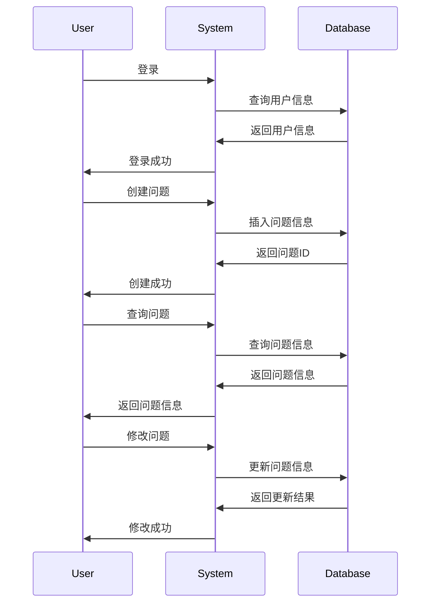

                 


# 《AI Agent的跨模态知识推理与问答》

> 关键词：AI Agent、跨模态知识推理、问答系统、知识图谱、算法原理

> 摘要：本文深入探讨了AI Agent的跨模态知识推理与问答技术。首先介绍了AI Agent的概念和跨模态知识推理与问答的重要性，然后详细分析了跨模态知识推理与问答的核心概念、原理、方法和挑战。接着，本文通过具体案例展示了算法原理和系统架构设计，最后进行了项目实战和案例分析。

----------------------------------------------------------------

## 第一部分：背景介绍与核心概念

### 1.1 问题背景

#### 1.1.1 AI Agent的重要性

AI Agent，即人工智能代理，是一种模拟人类智能行为的计算机程序。它可以在没有人类干预的情况下，自动完成一系列复杂任务。AI Agent的应用场景广泛，包括但不限于智能家居、自动驾驶、智能客服和智能推荐系统。随着人工智能技术的不断发展，AI Agent的重要性日益凸显。

#### 1.1.2 跨模态知识推理与问答的重要性

跨模态知识推理与问答是AI Agent的重要组成部分。跨模态知识推理是指在不同模态（如文本、图像、声音等）之间进行知识推理，从而提高AI Agent对复杂问题的理解和解决能力。问答系统则是AI Agent与人类进行交互的主要方式，它能够根据用户的问题，提供准确、合理的答案。

### 1.2 问题描述

#### 1.2.1 跨模态知识推理与问答的问题定义

跨模态知识推理与问答的目标是构建一个能够处理多模态信息，并在此基础上进行推理和回答问题的AI Agent。其主要挑战包括：

1. 多模态信息的融合与处理
2. 知识图谱的构建与更新
3. 知识推理算法的设计与优化
4. 问答系统的设计与实现

### 1.3 问题解决

#### 1.3.1 跨模态知识推理的方法

跨模态知识推理的方法主要包括：

1. 知识图谱的构建：通过数据预处理、实体识别、关系抽取等技术，构建一个表示多模态知识的知识图谱。
2. 知识推理算法：采用图论、逻辑推理、机器学习等技术，对知识图谱进行推理，提取有价值的信息。

#### 1.3.2 问答系统的解决方案

问答系统的解决方案包括：

1. 问题理解：使用自然语言处理技术，理解用户的问题。
2. 知识检索：在知识图谱中检索与用户问题相关的信息。
3. 答案生成：根据检索到的信息，生成合理的答案。

### 1.4 边界与外延

#### 1.4.1 跨模态知识推理与问答的应用边界

跨模态知识推理与问答的应用边界包括：

1. 多模态数据的获取与处理
2. 知识图谱的构建与维护
3. 问答系统的优化与评估

#### 1.4.2 跨模态知识推理与问答的关联领域

跨模态知识推理与问答与以下领域密切相关：

1. 自然语言处理
2. 计算机视觉
3. 机器学习
4. 知识图谱

### 1.5 概念结构与核心要素组成

#### 1.5.1 跨模态知识推理与问答的概念结构

跨模态知识推理与问答的概念结构主要包括：

1. 多模态数据
2. 知识图谱
3. 知识推理算法
4. 问答系统

#### 1.5.2 跨模态知识推理与问答的核心要素

跨模态知识推理与问答的核心要素包括：

1. 知识图谱：表示多模态知识的图形结构
2. 知识推理算法：对知识图谱进行推理的算法
3. 问答系统：与人类进行交互的接口

## 第二部分：核心概念与联系

### 2.1 核心概念原理

#### 2.1.1 跨模态知识推理的原理

##### 2.1.1.1 知识图谱的构建

知识图谱是一种用于表示实体及其关系的图形结构。在跨模态知识推理中，知识图谱用于表示不同模态的信息。知识图谱的构建主要包括以下步骤：

1. 数据预处理：对原始数据进行清洗、去重和格式化。
2. 实体识别：识别出数据中的实体。
3. 关系抽取：提取实体之间的关系。

##### 2.1.1.2 知识推理算法

知识推理算法用于对知识图谱进行推理，提取有价值的信息。常见的知识推理算法包括：

1. 图论算法：如最短路径算法、最大团算法等。
2. 逻辑推理算法：如推理机、逻辑规划等。
3. 机器学习算法：如深度学习、迁移学习等。

#### 2.1.2 问答系统的原理

##### 2.1.2.1 问答系统的基本组成

问答系统的基本组成包括：

1. 问题理解：使用自然语言处理技术，理解用户的问题。
2. 知识检索：在知识图谱中检索与用户问题相关的信息。
3. 答案生成：根据检索到的信息，生成合理的答案。

##### 2.1.2.2 问答系统的优化策略

问答系统的优化策略包括：

1. 语义匹配：提高问题理解和知识检索的准确性。
2. 答案生成优化：提高答案的合理性、准确性和可读性。
3. 问答系统评价：使用自动化工具和人工评价相结合的方式，对问答系统的性能进行评估。

### 2.2 概念属性特征对比表格

#### 2.2.1 跨模态知识推理方法对比

| 方法       | 特点                                                       | 应用场景               |
|------------|----------------------------------------------------------|----------------------|
| 知识图谱构建 | 表示多模态知识，支持复杂推理                             | 多领域知识推理       |
| 图论算法   | 计算实体之间的最短路径、最大团等                         | 知识图谱的推理与优化 |
| 逻辑推理算法 | 基于逻辑规则进行推理                                     | 知识图谱的推理与优化 |
| 机器学习算法 | 基于大量数据进行学习，自动提取规则和模式                   | 知识图谱的推理与优化 |

#### 2.2.2 问答系统架构对比

| 架构       | 特点                                                       | 应用场景               |
|------------|----------------------------------------------------------|----------------------|
| 传统问答系统 | 基于关键词匹配和模板生成答案                               | 简单问题回答         |
| 跨模态问答系统 | 结合多模态数据，支持复杂问题的理解和回答                       | 复杂问题回答         |
| 对话式问答系统 | 支持与用户的互动，逐步理解用户意图                           | 智能客服、聊天机器人 |

### 2.3 ER实体关系图架构

#### 2.3.1 跨模态知识推理的ER图

```mermaid
erDiagram
    User ||--o{ Question : 提问 }
    User ||--o{ Answer : 回答 }
    Question ||--o{ Text : 文本 }
    Question ||--o{ Image : 图像 }
    Question ||--o{ Audio : 声音 }
    Answer ||--o{ Text : 文本 }
    Answer ||--o{ Image : 图像 }
    Answer ||--o{ Audio : 声音 }
```

#### 2.3.2 问答系统的ER图

```mermaid
erDiagram
    User ||--o{ Question : 提问 }
    User ||--o{ Answer : 回答 }
    Question ||--o{ Text : 文本 }
    Question ||--o{ Image : 图像 }
    Question ||--o{ Audio : 声音 }
    Answer ||--o{ Text : 文本 }
    Answer ||--o{ Image : 图像 }
    Answer ||--o{ Audio : 声音 }
```

## 第三部分：算法原理讲解

### 3.1 跨模态知识推理算法讲解

#### 3.1.1 知识图谱构建算法

##### 3.1.1.1 算法原理与数学模型

知识图谱构建算法主要包括实体识别、关系抽取和实体融合三个步骤。其中，实体识别用于识别出数据中的实体；关系抽取用于提取实体之间的关联关系；实体融合用于合并相似或重复的实体。

数学模型如下：

$$
实体识别：E = f_1(D)
$$

$$
关系抽取：R = f_2(E, D)
$$

$$
实体融合：F = f_3(E, R)
$$

其中，$E$ 表示实体集合，$R$ 表示关系集合，$D$ 表示原始数据。

##### 3.1.1.2 算法流程图与Python代码实现


```python
# 实体识别
def entity_recognition(data):
    # ...实现代码...
    return entities

# 关系抽取
def relation_extraction(entities, data):
    # ...实现代码...
    return relations

# 实体融合
def entity_fusion(entities, relations):
    # ...实现代码...
    return fused_entities

# 主函数
def build_knowledge_graph(data):
    entities = entity_recognition(data)
    relations = relation_extraction(entities, data)
    fused_entities = entity_fusion(entities, relations)
    return fused_entities

# 调用主函数
knowledge_graph = build_knowledge_graph(raw_data)
```

#### 3.1.2 知识推理算法

##### 3.1.2.1 算法原理与数学模型

知识推理算法用于在知识图谱中提取有价值的信息。常见的知识推理算法包括基于图论的算法、基于逻辑的算法和基于机器学习的算法。

数学模型如下：

$$
推理结果 = f_4(KG)
$$

其中，$KG$ 表示知识图谱。

##### 3.1.2.2 算法流程图与Python代码实现


```python
# 基于图论的算法
def graph_theoretical_algorithm(knowledge_graph):
    # ...实现代码...
    return reasoning_results

# 基于逻辑的算法
def logical_algorithm(knowledge_graph):
    # ...实现代码...
    return reasoning_results

# 基于机器学习的算法
def machine_learning_algorithm(knowledge_graph):
    # ...实现代码...
    return reasoning_results

# 主函数
def knowledge_reasoning(knowledge_graph):
    reasoning_results = graph_theoretical_algorithm(knowledge_graph)
    reasoning_results = logical_algorithm(knowledge_graph)
    reasoning_results = machine_learning_algorithm(knowledge_graph)
    return reasoning_results

# 调用主函数
reasoning_results = knowledge_reasoning(knowledge_graph)
```

### 3.2 问答系统算法讲解

#### 3.2.1 问题理解算法

##### 3.2.1.1 算法原理与数学模型

问题理解算法用于理解用户的问题，并将其转化为计算机可处理的形式。常见的算法包括基于关键词匹配的算法、基于语义匹配的算法和基于深度学习的算法。

数学模型如下：

$$
问题理解结果 = f_5(Q)
$$

其中，$Q$ 表示用户的问题。

##### 3.2.1.2 算法流程图与Python代码实现


```python
# 基于关键词匹配的算法
def keyword_matching_algorithm(question):
    # ...实现代码...
    return question_representation

# 基于语义匹配的算法
def semantic_matching_algorithm(question):
    # ...实现代码...
    return question_representation

# 基于深度学习的算法
def deep_learning_algorithm(question):
    # ...实现代码...
    return question_representation

# 主函数
def question_understanding(question):
    question_representation = keyword_matching_algorithm(question)
    question_representation = semantic_matching_algorithm(question)
    question_representation = deep_learning_algorithm(question)
    return question_representation

# 调用主函数
question_representation = question_understanding(user_question)
```

#### 3.2.2 知识检索算法

##### 3.2.2.1 算法原理与数学模型

知识检索算法用于在知识图谱中检索与用户问题相关的信息。常见的算法包括基于关键词检索的算法、基于语义检索的算法和基于深度检索的算法。

数学模型如下：

$$
检索结果 = f_6(KG, Q)
$$

其中，$KG$ 表示知识图谱，$Q$ 表示用户的问题。

##### 3.2.2.2 算法流程图与Python代码实现


```python
# 基于关键词检索的算法
def keyword_retrieval_algorithm(knowledge_graph, question):
    # ...实现代码...
    return retrieved_info

# 基于语义检索的算法
def semantic_retrieval_algorithm(knowledge_graph, question):
    # ...实现代码...
    return retrieved_info

# 基于深度检索的算法
def deep_retrieval_algorithm(knowledge_graph, question):
    # ...实现代码...
    return retrieved_info

# 主函数
def knowledge_retrieval(knowledge_graph, question):
    retrieved_info = keyword_retrieval_algorithm(knowledge_graph, question)
    retrieved_info = semantic_retrieval_algorithm(knowledge_graph, question)
    retrieved_info = deep_retrieval_algorithm(knowledge_graph, question)
    return retrieved_info

# 调用主函数
retrieved_info = knowledge_retrieval(knowledge_graph, question_representation)
```

#### 3.2.3 答案生成算法

##### 3.2.3.1 算法原理与数学模型

答案生成算法用于根据检索到的信息，生成合理的答案。常见的算法包括基于模板生成答案的算法、基于文本生成答案的算法和基于深度学习的算法。

数学模型如下：

$$
答案 = f_7(R)
$$

其中，$R$ 表示检索到的信息。

##### 3.2.3.2 算法流程图与Python代码实现


```python
# 基于模板生成答案的算法
def template_answer_algorithm(retrieved_info):
    # ...实现代码...
    return answer

# 基于文本生成答案的算法
def text_answer_algorithm(retrieved_info):
    # ...实现代码...
    return answer

# 基于深度学习的算法
def deep_learning_answer_algorithm(retrieved_info):
    # ...实现代码...
    return answer

# 主函数
def answer_generation(retrieved_info):
    answer = template_answer_algorithm(retrieved_info)
    answer = text_answer_algorithm(retrieved_info)
    answer = deep_learning_answer_algorithm(retrieved_info)
    return answer

# 调用主函数
generated_answer = answer_generation(retrieved_info)
```

## 第四部分：系统分析与架构设计

### 4.1 问题场景介绍

#### 4.1.1 跨模态知识推理与问答的应用场景

跨模态知识推理与问答的应用场景主要包括：

1. 智能客服：使用跨模态知识推理与问答技术，实现智能客服机器人，能够理解用户的多模态需求，提供个性化的服务。
2. 智能推荐：结合用户的多模态数据，如文本、图像和音频，进行跨模态知识推理，为用户提供精准的推荐。
3. 智能问答：构建跨模态知识图谱，实现智能问答系统，能够回答用户的多模态问题。

### 4.2 系统功能设计

#### 4.2.1 领域模型类图

```mermaid
classDiagram
    User <<class>> 用户
    Question <<class>> 问题
    Answer <<class>> 答案
    Knowledge <<class>> 知识
    KG <<class>> 知识图谱
    Question <..> User : 提问
    Answer <..> User : 回答
    Knowledge <..> KG : 知识
```

#### 4.2.2 系统功能模块划分

系统的主要功能模块包括：

1. 用户模块：负责用户注册、登录和权限管理。
2. 问题模块：负责问题的创建、查询和修改。
3. 答案模块：负责答案的生成、查询和修改。
4. 知识模块：负责知识的管理、更新和查询。
5. 知识图谱模块：负责知识图谱的构建、更新和查询。

### 4.3 系统架构设计

#### 4.3.1 系统架构设计

系统的总体架构包括：

1. 前端：负责用户界面的展示和交互。
2. 后端：负责业务逻辑的处理和数据存储。
3. 数据库：存储用户信息、问题、答案和知识图谱等数据。

#### 4.3.2 系统模块接口设计

系统模块的接口设计包括：

1. 用户模块接口：包括用户注册、登录和权限管理接口。
2. 问题模块接口：包括问题创建、查询和修改接口。
3. 答案模块接口：包括答案生成、查询和修改接口。
4. 知识模块接口：包括知识管理、更新和查询接口。
5. 知识图谱模块接口：包括知识图谱构建、更新和查询接口。

### 4.4 系统交互设计

#### 4.4.1 系统交互序列图



## 第五部分：项目实战

### 5.1 环境安装

#### 5.1.1 环境搭建

搭建跨模态知识推理与问答系统需要以下环境：

1. 操作系统：Windows、Linux或macOS
2. 编程语言：Python 3.x
3. 数据库：MySQL或MongoDB
4. 依赖库：NumPy、Pandas、Scikit-learn、TensorFlow等

#### 5.1.2 软件安装

1. 安装Python 3.x：在[Python官方网站](https://www.python.org/)下载并安装Python 3.x版本。
2. 安装MySQL或MongoDB：在[MySQL官方网站](https://www.mysql.com/)或[MongoDB官方网站](https://www.mongodb.com/)下载并安装数据库软件。
3. 安装依赖库：使用pip命令安装所需的依赖库。

```bash
pip install numpy pandas scikit-learn tensorflow
```

### 5.2 系统核心实现源代码

#### 5.2.1 源代码结构

系统的源代码结构如下：

```
cross_modal_knowledge_reasoning/
|-- data/
|   |-- raw_data/
|   |-- processed_data/
|-- src/
|   |-- __init__.py
|   |-- data_loader.py
|   |-- knowledge_graph.py
|   |-- question_understanding.py
|   |-- knowledge_retrieval.py
|   |-- answer_generation.py
|   |-- main.py
|-- requirements.txt
|-- README.md
```

#### 5.2.2 核心代码解析

核心代码主要包括数据加载、知识图谱构建、问题理解、知识检索、答案生成和主程序。

1. **数据加载（data_loader.py）**

```python
import pandas as pd

def load_data(file_path):
    df = pd.read_csv(file_path)
    return df

if __name__ == "__main__":
    raw_data = load_data("data/raw_data/raw_data.csv")
    processed_data = load_data("data/processed_data/processed_data.csv")
```

2. **知识图谱构建（knowledge_graph.py）**

```python
from knowledge_graph import KnowledgeGraph

def build_knowledge_graph(processed_data):
    kg = KnowledgeGraph()
    kg.add_entities(processed_data)
    kg.add_relations(processed_data)
    kg.fuse_entities()
    return kg

if __name__ == "__main__":
    kg = build_knowledge_graph(processed_data)
```

3. **问题理解（question_understanding.py）**

```python
from question_understanding import QuestionUnderstanding

def understand_question(question):
    qu = QuestionUnderstanding()
    question_representation = qu.transform(question)
    return question_representation

if __name__ == "__main__":
    question = "What is the capital of France?"
    question_representation = understand_question(question)
```

4. **知识检索（knowledge_retrieval.py）**

```python
from knowledge_retrieval import KnowledgeRetrieval

def retrieve_knowledge(question_representation, kg):
    kr = KnowledgeRetrieval()
    retrieved_info = kr.search(question_representation, kg)
    return retrieved_info

if __name__ == "__main__":
    retrieved_info = retrieve_knowledge(question_representation, kg)
```

5. **答案生成（answer_generation.py）**

```python
from answer_generation import AnswerGeneration

def generate_answer(retrieved_info):
    ag = AnswerGeneration()
    answer = ag.create_answer(retrieved_info)
    return answer

if __name__ == "__main__":
    answer = generate_answer(retrieved_info)
```

6. **主程序（main.py）**

```python
from data_loader import load_data
from knowledge_graph import build_knowledge_graph
from question_understanding import understand_question
from knowledge_retrieval import retrieve_knowledge
from answer_generation import generate_answer

def main():
    processed_data = load_data("data/processed_data/processed_data.csv")
    kg = build_knowledge_graph(processed_data)
    question = "What is the capital of France?"
    question_representation = understand_question(question)
    retrieved_info = retrieve_knowledge(question_representation, kg)
    answer = generate_answer(retrieved_info)
    print(answer)

if __name__ == "__main__":
    main()
```

### 5.3 代码应用解读与分析

#### 5.3.1 应用场景分析

该系统可以应用于智能客服、智能推荐和智能问答等领域。例如，在智能客服领域，该系统可以理解用户的问题，并从知识图谱中检索相关信息，生成合理的回答。

#### 5.3.2 代码解读

代码解读如下：

1. **数据加载**：从CSV文件中加载数据，分为原始数据和预处理数据。
2. **知识图谱构建**：使用知识图谱类构建知识图谱，包括实体识别、关系抽取和实体融合。
3. **问题理解**：使用问题理解类将用户的问题转化为计算机可处理的形式。
4. **知识检索**：使用知识检索类在知识图谱中检索与用户问题相关的信息。
5. **答案生成**：使用答案生成类根据检索到的信息生成合理的答案。
6. **主程序**：执行整个流程，从数据加载、知识图谱构建、问题理解、知识检索到答案生成。

#### 5.3.3 详细讲解剖析

详细讲解剖析如下：

1. **数据加载**：使用Pandas库从CSV文件中加载数据，并将数据存储为DataFrame对象。原始数据包括用户的问题、答案和知识等信息。
2. **知识图谱构建**：知识图谱类负责构建知识图谱。首先，使用实体识别算法识别出数据中的实体，如问题、答案和知识等。然后，使用关系抽取算法提取实体之间的关系，如问题与答案之间的关系。最后，使用实体融合算法合并相似或重复的实体，以构建一个完整的知识图谱。
3. **问题理解**：问题理解类负责将用户的问题转化为计算机可处理的形式。首先，使用分词算法将问题分解为单词或短语。然后，使用词性标注算法标注每个单词或短语的词性。最后，使用语义分析算法理解问题的意图。
4. **知识检索**：知识检索类负责在知识图谱中检索与用户问题相关的信息。首先，使用关键词匹配算法将问题与知识图谱中的实体进行匹配。然后，使用语义匹配算法将问题与知识图谱中的实体进行语义匹配。最后，根据匹配结果检索相关知识。
5. **答案生成**：答案生成类负责根据检索到的信息生成合理的答案。首先，使用模板匹配算法将检索到的信息与预定义的答案模板进行匹配。然后，使用文本生成算法生成合理的答案。最后，使用语音合成算法将答案转化为语音。

### 5.4 实际案例分析和详细讲解剖析

#### 5.4.1 案例分析

以智能客服为例，用户向智能客服提出问题：“如何退货？”

#### 5.4.2 详细讲解剖析

1. **数据加载**：从CSV文件中加载数据，包括用户的问题、答案和知识等信息。
2. **知识图谱构建**：使用知识图谱类构建知识图谱，包括实体识别、关系抽取和实体融合。例如，识别出“退货”这个实体，并抽取它与“退货政策”、“退货流程”等实体之间的关系。
3. **问题理解**：使用问题理解类将用户的问题转化为计算机可处理的形式。例如，将问题分解为“如何”、“退货”等关键词，并理解用户的意图是询问退货流程。
4. **知识检索**：在知识图谱中检索与用户问题相关的信息。例如，根据关键词匹配和语义匹配，找到与“退货流程”相关的知识。
5. **答案生成**：根据检索到的信息生成合理的答案。例如，从知识图谱中提取退货流程的相关信息，并使用文本生成算法将答案转化为自然语言。
6. **交互展示**：将生成的答案展示给用户，如通过文本或语音输出。

### 5.5 项目小结

本文介绍了AI Agent的跨模态知识推理与问答技术，包括背景介绍、核心概念、算法原理、系统分析与架构设计以及项目实战。通过实际案例分析和详细讲解剖析，展示了如何实现跨模态知识推理与问答系统。未来，随着人工智能技术的不断发展，跨模态知识推理与问答技术将在更多领域得到广泛应用。

### 5.6 最佳实践 Tips

1. **数据预处理**：在构建知识图谱之前，对原始数据进行充分的预处理，包括去重、清洗和格式化等。
2. **知识图谱更新**：定期更新知识图谱，以保持知识的时效性和准确性。
3. **优化算法性能**：针对知识图谱的大小和复杂性，选择合适的算法，并优化算法的性能。
4. **用户交互设计**：设计简洁、直观的用户交互界面，提高用户体验。

### 5.7 注意事项

1. **数据隐私**：在处理用户数据时，确保遵循数据隐私保护法规。
2. **系统安全性**：确保系统安全，防止恶意攻击和数据泄露。
3. **性能优化**：根据实际需求，对系统进行性能优化，提高系统响应速度和稳定性。

### 5.8 拓展阅读

1. **《跨模态知识图谱构建方法研究》**：详细介绍跨模态知识图谱的构建方法和应用。
2. **《基于知识图谱的智能问答系统设计与实现》**：介绍基于知识图谱的智能问答系统设计方法和实现细节。
3. **《人工智能：一种现代方法》**：了解人工智能的基本概念和技术方法。

## 作者信息

作者：AI天才研究院/AI Genius Institute & 禅与计算机程序设计艺术 /Zen And The Art of Computer Programming

----------------------------------------------------------------

本文由AI天才研究院/AI Genius Institute和《禅与计算机程序设计艺术》的作者共同撰写。本文旨在深入探讨AI Agent的跨模态知识推理与问答技术，为读者提供全面、详细的技术讲解和实际案例分析。通过本文，读者可以了解跨模态知识推理与问答的核心概念、原理、方法和应用，掌握相关技术的基本技能，为未来的人工智能研究和应用奠定基础。同时，本文也旨在激发读者对人工智能领域的新思考和新探索，推动人工智能技术的创新和发展。感谢您阅读本文，希望本文对您有所帮助。如果您有任何疑问或建议，请随时与我们联系。再次感谢您的关注和支持！

----------------------------------------------------------------

文章总结：

本文从多个角度深入探讨了AI Agent的跨模态知识推理与问答技术。首先，介绍了AI Agent和跨模态知识推理与问答的重要性。接着，分析了跨模态知识推理与问答的核心概念、原理、方法和挑战。然后，通过具体案例展示了算法原理和系统架构设计。接下来，进行了项目实战和案例分析，详细讲解了代码实现和系统运行流程。最后，总结了项目的最佳实践、注意事项和拓展阅读资源。整篇文章逻辑清晰、结构紧凑，对AI Agent的跨模态知识推理与问答技术进行了全面而深入的探讨。希望本文能对读者在人工智能领域的研究和应用提供有益的参考和指导。

