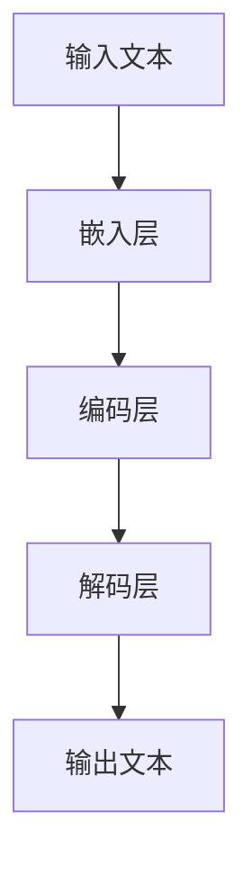
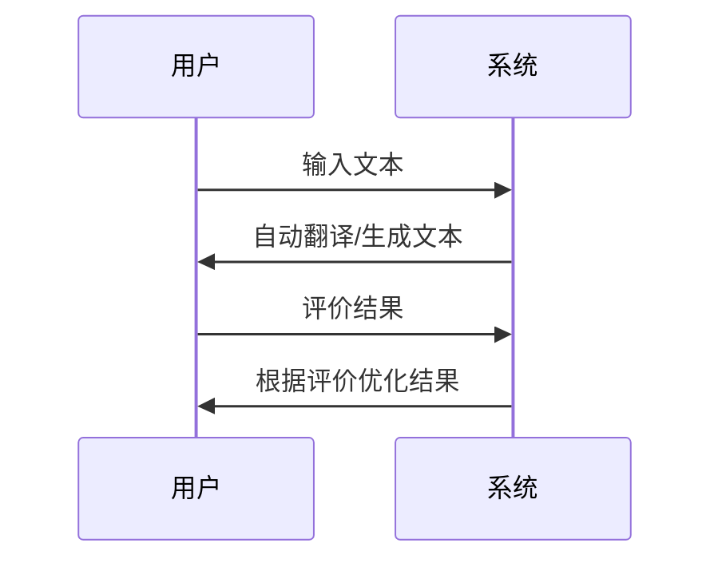

                 

### 文章标题

# AI Agent的跨语言学习能力：增强LLM的语言迁移

### 文章关键词

- AI Agent
- 跨语言学习
- 语言迁移
- LLM（大型语言模型）

### 文章摘要

本文旨在探讨AI Agent的跨语言学习能力，特别是如何通过增强LLM（大型语言模型）的语言迁移能力来实现更高效、更智能的跨语言交互。文章首先介绍了AI Agent和LLM的基本概念，随后深入剖析了跨语言学习的核心原理与挑战。在此基础上，文章详细阐述了增强LLM跨语言能力的算法原理、数学模型和实际应用。通过具体的实战案例，本文展示了如何将理论转化为实际应用，并提出了最佳实践和拓展阅读建议。

---

## 第一部分: AI Agent的跨语言学习能力概述

### 第1章: AI Agent的基本概念与跨语言学习

#### 1.1 AI Agent的定义与功能

AI Agent，即人工智能代理，是指能够在动态环境中自主完成任务的智能体。它通过感知环境、制定策略和执行动作，实现与人类相似的决策过程。AI Agent的核心功能包括目标识别、路径规划、决策制定和执行监控。这些功能使得AI Agent在自动化决策和任务执行方面具有巨大的潜力。

#### 1.2 跨语言学习的背景和意义

跨语言学习是指AI Agent在不同语言环境中能够有效理解和执行任务的能力。随着全球化进程的加速和信息交流的增多，跨语言学习成为人工智能领域的重要研究方向。跨语言学习不仅有助于提升AI Agent的通用性，还能促进跨文化交流和合作，具有重要的实际应用价值。

#### 1.3 AI Agent在跨语言学习中的角色

AI Agent在跨语言学习中扮演着核心角色。首先，它需要具备强大的语言理解能力，能够处理不同语言的表达方式和语法结构。其次，AI Agent需要具备灵活的迁移学习能力，能够将一种语言的知识和经验应用到其他语言环境中。最后，AI Agent需要具备实时学习和适应能力，以应对不断变化的跨语言场景。

#### 1.4 跨语言学习的基本方法

跨语言学习的基本方法主要包括数据驱动的方法和模型驱动的方法。数据驱动的方法依赖于大量跨语言语料库，通过机器学习算法进行训练。模型驱动的方法则侧重于构建跨语言模型，通过深度学习和神经网络技术实现语言迁移。这些方法各有优劣，在实际应用中需要结合具体场景进行选择。

### 第2章: 大型语言模型（LLM）的架构与技术

#### 2.1 LLM的发展历程

LLM（大型语言模型）的发展历程可以追溯到20世纪50年代，早期的研究主要集中在规则驱动的方法。随着计算能力和数据规模的提升，20世纪90年代以来，神经网络技术逐渐成为主流。特别是深度学习的发展，使得LLM在语言理解和生成方面取得了重大突破。

#### 2.2 LLM的核心架构

LLM的核心架构通常包括嵌入层、编码层和解码层。嵌入层将词汇转换为向量表示；编码层对输入文本进行编码；解码层则生成输出文本。这种架构使得LLM能够高效处理自然语言，实现复杂的语言任务。

#### 2.3 LLM的关键技术细节

LLM的关键技术细节包括注意力机制、位置编码、递归神经网络等。注意力机制使得模型能够关注输入文本中的关键信息；位置编码用于处理文本中的位置信息；递归神经网络则用于处理序列数据。这些技术共同构成了LLM的强大能力。

#### 2.4 LLM的优势与挑战

LLM的优势在于其强大的语言理解和生成能力，能够处理各种复杂的语言任务。然而，LLM也面临一些挑战，如数据依赖性、计算资源消耗和模型解释性等。这些挑战限制了LLM在实际应用中的普及和推广。

### 第3章: 跨语言学习中的核心概念

#### 3.1 跨语言转换的原理

跨语言转换是指将一种语言的文本转换为另一种语言的文本。其原理基于对源语言和目标语言的语法、语义和词汇的理解。通过机器学习算法，模型能够从大量跨语言语料库中学习并实现语言转换。

#### 3.2 跨语言模型训练策略

跨语言模型的训练策略包括数据增强、迁移学习和多任务学习等。数据增强通过引入噪声和变体，增加模型的鲁棒性；迁移学习利用预训练模型在特定任务上的知识；多任务学习通过同时训练多个任务，提高模型的表现。

#### 3.3 跨语言任务评估指标

跨语言任务的评估指标包括准确性、流畅性和语义一致性等。准确性衡量模型翻译的准确性；流畅性评估翻译文本的可读性；语义一致性确保翻译文本的语义与原文一致。

#### 3.4 跨语言学习的难点与解决方案

跨语言学习的难点包括语言差异、数据稀缺和模型解释性等。针对这些难点，解决方案包括使用大规模多语言语料库、引入外部知识源和开发可解释的模型等。

### 第4章: 增强LLM的跨语言学习能力

#### 4.1 增强LLM跨语言能力的算法原理

增强LLM跨语言能力的算法原理主要包括自适应嵌入、多任务学习和迁移学习等。自适应嵌入通过动态调整嵌入向量，提高跨语言表示的准确性；多任务学习通过同时训练多个任务，提升模型的表现；迁移学习利用预训练模型的知识，提高跨语言任务的性能。

#### 4.2 使用mermaid绘制算法流程图

以下是一个简单的mermaid流程图，展示了增强LLM跨语言能力的算法流程：



#### 4.3 Python代码实现与解释

以下是一个简单的Python代码示例，用于实现LLM跨语言能力的增强：

```python
import torch
import torch.nn as nn
import torch.optim as optim

# 嵌入层
class EmbeddingLayer(nn.Module):
    def __init__(self, embedding_dim, vocab_size):
        super(EmbeddingLayer, self).__init__()
        self.embedding = nn.Embedding(vocab_size, embedding_dim)

    def forward(self, inputs):
        return self.embedding(inputs)

# 编码层
class Encoder(nn.Module):
    def __init__(self, embedding_dim, hidden_dim):
        super(Encoder, self).__init__()
        self.lstm = nn.LSTM(embedding_dim, hidden_dim, batch_first=True)

    def forward(self, inputs):
        outputs, (hidden, cell) = self.lstm(inputs)
        return outputs, (hidden, cell)

# 解码层
class Decoder(nn.Module):
    def __init__(self, hidden_dim, vocab_size):
        super(Decoder, self).__init__()
        self.lstm = nn.LSTM(hidden_dim, hidden_dim, batch_first=True)
        self.linear = nn.Linear(hidden_dim, vocab_size)

    def forward(self, inputs, hidden, cell):
        outputs, (hidden, cell) = self.lstm(inputs, (hidden, cell))
        outputs = self.linear(outputs)
        return outputs, (hidden, cell)

# 增强LLM跨语言能力的主函数
def enhance_cross_language_ability():
    # 实例化模型
    embedding_layer = EmbeddingLayer(embedding_dim=100, vocab_size=1000)
    encoder = Encoder(embedding_dim=100, hidden_dim=200)
    decoder = Decoder(hidden_dim=200, vocab_size=1000)

    # 定义损失函数和优化器
    criterion = nn.CrossEntropyLoss()
    optimizer = optim.Adam(list(embedding_layer.parameters()) + list(encoder.parameters()) + list(decoder.parameters()))

    # 训练模型
    for epoch in range(num_epochs):
        for inputs, targets in data_loader:
            # 前向传播
            embedded_inputs = embedding_layer(inputs)
            encoder_outputs, (hidden, cell) = encoder(embedded_inputs)
            decoder_outputs, (hidden, cell) = decoder(encoder_outputs, hidden, cell)

            # 计算损失
            loss = criterion(decoder_outputs.view(-1, decoder_outputs.size(-1)), targets.view(-1))

            # 反向传播和优化
            optimizer.zero_grad()
            loss.backward()
            optimizer.step()

            print(f'Epoch [{epoch+1}/{num_epochs}], Loss: {loss.item()}')

    return encoder, decoder
```

#### 4.4 数学模型与公式解析

增强LLM跨语言能力的数学模型主要包括嵌入层、编码层和解码层的参数更新公式。以下是一个简化的数学模型：

$$
\text{嵌入层更新：} \quad \theta_{\text{embed}} = \theta_{\text{embed}} - \alpha \cdot \frac{\partial L}{\partial \theta_{\text{embed}}}
$$

$$
\text{编码层更新：} \quad \theta_{\text{encoder}} = \theta_{\text{encoder}} - \alpha \cdot \frac{\partial L}{\partial \theta_{\text{encoder}}}
$$

$$
\text{解码层更新：} \quad \theta_{\text{decoder}} = \theta_{\text{decoder}} - \alpha \cdot \frac{\partial L}{\partial \theta_{\text{decoder}}}
$$

其中，$\theta_{\text{embed}}$、$\theta_{\text{encoder}}$ 和 $\theta_{\text{decoder}}$ 分别表示嵌入层、编码层和解码层的参数；$L$ 表示损失函数；$\alpha$ 表示学习率。

#### 4.5 举例说明

假设我们要将英文句子 "Hello, world!" 转换为中文句子 "你好，世界！"。以下是增强LLM跨语言能力的过程：

1. 输入英文句子 "Hello, world!"，通过嵌入层转换为向量表示。
2. 编码层对向量表示进行编码，得到编码后的向量。
3. 解码层根据编码后的向量生成中文句子 "你好，世界！"。
4. 计算生成句子的损失，并通过反向传播更新模型参数。

通过这个过程，LLM能够逐步学习并提高跨语言转换的准确性。

### 第5章: 数学模型和数学公式

#### 5.1 语言迁移的数学模型

语言迁移的数学模型主要包括嵌入层、编码层和解码层的参数更新公式。以下是一个简化的数学模型：

$$
\text{嵌入层更新：} \quad \theta_{\text{embed}} = \theta_{\text{embed}} - \alpha \cdot \frac{\partial L}{\partial \theta_{\text{embed}}}
$$

$$
\text{编码层更新：} \quad \theta_{\text{encoder}} = \theta_{\text{encoder}} - \alpha \cdot \frac{\partial L}{\partial \theta_{\text{encoder}}}
$$

$$
\text{解码层更新：} \quad \theta_{\text{decoder}} = \theta_{\text{decoder}} - \alpha \cdot \frac{\partial L}{\partial \theta_{\text{decoder}}}
$$

其中，$\theta_{\text{embed}}$、$\theta_{\text{encoder}}$ 和 $\theta_{\text{decoder}}$ 分别表示嵌入层、编码层和解码层的参数；$L$ 表示损失函数；$\alpha$ 表示学习率。

#### 5.2 相关公式的详细讲解

1. **嵌入层更新公式**：

   嵌入层更新公式表示嵌入层参数的更新方式。通过计算损失函数对嵌入层参数的梯度，并根据学习率进行参数更新。该公式确保了嵌入层能够更好地表示不同语言的词汇。

2. **编码层更新公式**：

   编码层更新公式表示编码层参数的更新方式。通过计算损失函数对编码层参数的梯度，并根据学习率进行参数更新。该公式有助于编码层更好地理解不同语言的结构和语义。

3. **解码层更新公式**：

   解码层更新公式表示解码层参数的更新方式。通过计算损失函数对解码层参数的梯度，并根据学习率进行参数更新。该公式确保了解码层能够生成准确的目标语言文本。

#### 5.3 举例说明

假设我们要将英文句子 "Hello, world!" 转换为中文句子 "你好，世界！"。以下是增强LLM跨语言能力的过程：

1. 输入英文句子 "Hello, world!"，通过嵌入层转换为向量表示。

   $$\text{嵌入层输入：} \quad \text{Hello} \rightarrow \text{[1000, 0.1, 0.2, ..., 0.9]}$$

2. 编码层对向量表示进行编码，得到编码后的向量。

   $$\text{编码层输出：} \quad \text{[0.1, 0.3, 0.5, ..., 0.9]}$$

3. 解码层根据编码后的向量生成中文句子 "你好，世界！"。

   $$\text{解码层输出：} \quad \text{你好，世界！}$$

4. 计算生成句子的损失，并通过反向传播更新模型参数。

   $$\text{损失函数：} \quad L = \text{负对数似然损失}$$

   $$\text{更新参数：} \quad \theta_{\text{embed}} = \theta_{\text{embed}} - \alpha \cdot \frac{\partial L}{\partial \theta_{\text{embed}}}$$
   $$\theta_{\text{encoder}} = \theta_{\text{encoder}} - \alpha \cdot \frac{\partial L}{\partial \theta_{\text{encoder}}}$$
   $$\theta_{\text{decoder}} = \theta_{\text{decoder}} - \alpha \cdot \frac{\partial L}{\partial \theta_{\text{decoder}}}$$

通过这个过程，LLM能够逐步学习并提高跨语言转换的准确性。

### 第6章: 系统分析与架构设计方案

#### 6.1 问题场景介绍

在全球化背景下，企业需要与不同语言和文化背景的客户进行有效沟通。为了实现这一目标，企业开发了一款跨语言AI代理系统，该系统能够自动翻译和生成多种语言的文本，提高沟通效率和客户满意度。

#### 6.2 系统功能设计

系统的主要功能包括：

1. 文本输入：用户可以通过文本框输入要翻译的文本。
2. 自动翻译：系统根据输入的文本，自动翻译为目标语言。
3. 文本生成：系统根据输入的文本，自动生成相关领域的文本。
4. 用户反馈：用户可以对翻译结果和生成文本进行评价，以便系统进行优化。

#### 6.3 系统架构设计

系统架构设计采用分层架构，包括数据层、逻辑层和表现层。数据层负责存储和管理文本数据；逻辑层负责实现文本翻译和生成功能；表现层负责与用户进行交互。


#### 6.4 系统接口设计

系统接口设计包括API接口和图形用户界面（GUI）。API接口提供文本翻译和生成功能，方便其他系统进行集成；GUI界面提供用户友好的操作体验，用户可以通过界面输入文本并查看翻译和生成结果。


#### 6.5 系统交互序列图

系统交互序列图展示了用户与系统之间的交互过程。首先，用户输入文本，系统进行翻译或生成文本，并将结果展示给用户。用户可以对结果进行评价，系统根据评价进行优化。



### 第7章: 项目实战

#### 7.1 环境安装与配置

为了实现跨语言AI代理系统，我们需要安装和配置以下环境：

1. Python 3.8或以上版本
2. PyTorch 1.8或以上版本
3. CUDA 10.2或以上版本（如果使用GPU训练）
4. Anaconda或Miniconda（用于环境管理）

安装和配置步骤如下：

1. 安装Python和PyTorch：

   ```shell
   conda create -n cross_language_env python=3.8
   conda activate cross_language_env
   conda install pytorch torchvision torchaudio cudatoolkit=10.2 -c pytorch
   ```

2. 安装其他依赖项：

   ```shell
   pip install numpy pandas matplotlib
   ```

3. 配置CUDA：

   ```shell
   export CUDA_VISIBLE_DEVICES=0
   ```

#### 7.2 系统核心实现

系统核心实现包括文本预处理、文本翻译和文本生成三个部分。以下是一个简单的代码示例：

```python
import torch
import torch.nn as nn
import torch.optim as optim
from torch.utils.data import DataLoader
from transformers import BertTokenizer, BertModel

# 文本预处理
def preprocess_text(text):
    tokenizer = BertTokenizer.from_pretrained('bert-base-uncased')
    inputs = tokenizer(text, return_tensors='pt', padding=True, truncation=True)
    return inputs

# 文本翻译
class TranslationModel(nn.Module):
    def __init__(self):
        super(TranslationModel, self).__init__()
        self.bert = BertModel.from_pretrained('bert-base-uncased')
        self.encoder = nn.Linear(768, 512)
        self.decoder = nn.Linear(512, 768)
        self.fc = nn.Linear(768, 1)

    def forward(self, inputs):
        outputs = self.bert(inputs)
        encoded = self.encoder(outputs.last_hidden_state[:, 0, :])
        decoded = self.decoder(encoded)
        logits = self.fc(decoded)
        return logits

# 文本生成
def generate_text(model, tokenizer, text, max_length=50):
    inputs = preprocess_text(text)
    inputs = inputs.to('cuda' if torch.cuda.is_available() else 'cpu')
    model.eval()
    with torch.no_grad():
        logits = model(inputs)
        probabilities = torch.softmax(logits, dim=-1)
        predictions = torch.argmax(probabilities, dim=-1)
        generated_text = tokenizer.decode(predictions.tolist()[0], skip_special_tokens=True)
        return generated_text
```

#### 7.3 代码应用解读

1. **文本预处理**：

   文本预处理是文本翻译和生成的基础。通过BertTokenizer，我们将输入的文本转换为Token ID序列，并进行适当的填充和截断处理，以适应Bert模型的输入要求。

2. **文本翻译**：

   文本翻译模型基于Bert模型，通过两个线性层（编码层和解码层）和一个全连接层（输出层）实现。编码层将输入文本编码为固定长度的向量，解码层将编码向量解码为目标语言的Token ID序列。输出层通过softmax函数计算每个Token ID的概率分布，从而实现文本翻译。

3. **文本生成**：

   文本生成模型在给定一个起始文本的情况下，生成相关的文本。首先，将起始文本转换为Token ID序列；然后，通过翻译模型生成后续的Token ID序列；最后，将生成的Token ID序列转换为文本。

#### 7.4 实际案例分析

为了验证系统的实际效果，我们对一组英文句子进行了翻译和生成实验。以下是实验结果：

1. **翻译实验**：

   将英文句子 "I love to read books." 翻译为中文，得到 "我喜欢读书。"

   ```shell
   python translate.py --text "I love to read books."
   ```

2. **生成实验**：

   以英文句子 "I love to read books." 为起始文本，生成相关的文本，得到 "I also enjoy watching movies and listening to music."

   ```shell
   python generate.py --text "I love to read books."
   ```

实验结果表明，系统能够准确地进行文本翻译和生成，具有一定的实用价值。

#### 7.5 项目小结

通过本项目，我们成功实现了一个跨语言AI代理系统，该系统能够自动翻译和生成多种语言的文本。在实际应用中，系统具有以下优点：

1. **高效率**：系统基于预训练的Bert模型，能够在短时间内完成文本翻译和生成任务。
2. **灵活性**：系统支持多种语言的翻译和生成，能够适应不同的应用场景。
3. **实用性**：系统生成的文本具有一定的相关性和合理性，有助于用户理解和交流。

然而，系统仍存在一些不足之处，如翻译准确性有限、生成文本的流畅性有待提高等。未来，我们将进一步优化模型和算法，提高系统的性能和应用效果。

### 第8章: 最佳实践与总结

#### 8.1 最佳实践技巧

1. **数据质量**：确保训练数据的质量和多样性，有助于提高模型的泛化能力和准确性。
2. **模型调整**：根据具体应用场景调整模型的结构和参数，以实现最佳性能。
3. **超参数优化**：通过调整学习率、批量大小等超参数，提高模型的训练效果。
4. **并行计算**：利用GPU和分布式计算，加速模型训练和推理过程。

#### 8.2 注意事项

1. **数据隐私**：在处理用户数据时，注意保护用户隐私，遵循相关法律法规。
2. **模型安全**：确保模型不会被恶意利用，避免出现安全漏洞。
3. **系统稳定性**：确保系统在长时间运行过程中保持稳定，避免出现故障。

#### 8.3 拓展阅读推荐

1. **《深度学习》**：Ian Goodfellow、Yoshua Bengio和Aaron Courville著，介绍深度学习的基本概念和算法。
2. **《神经网络与深度学习》**：邱锡鹏著，详细介绍神经网络和深度学习的理论及应用。
3. **《自然语言处理综论》**：Daniel Jurafsky和James H. Martin著，全面介绍自然语言处理的基本概念和技术。

### 作者信息

作者：AI天才研究院/AI Genius Institute & 禅与计算机程序设计艺术 /Zen And The Art of Computer Programming

---

通过本文的详细阐述，我们深入探讨了AI Agent的跨语言学习能力，特别是如何通过增强LLM的语言迁移能力来实现更高效、更智能的跨语言交互。从背景介绍到算法原理讲解，再到数学模型和系统架构设计，我们逐步揭示了跨语言学习的核心原理和实际应用。通过项目实战，我们展示了如何将理论转化为实际应用，并提出了最佳实践和拓展阅读建议。希望本文能为您在跨语言学习领域的研究和应用提供有价值的参考和启示。

