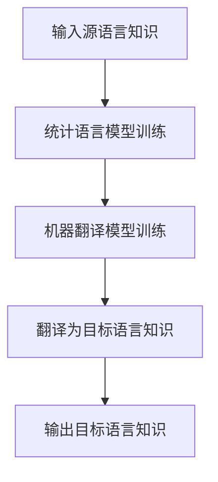
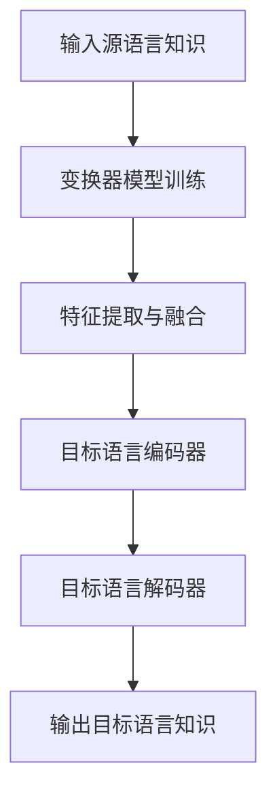
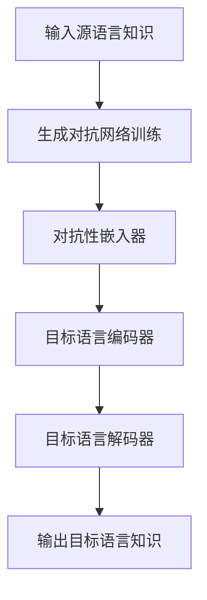
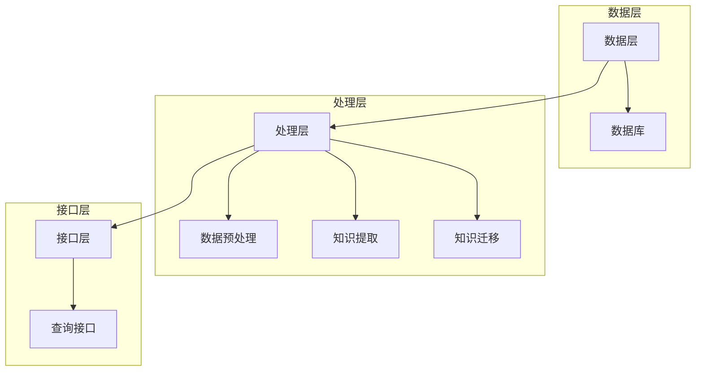
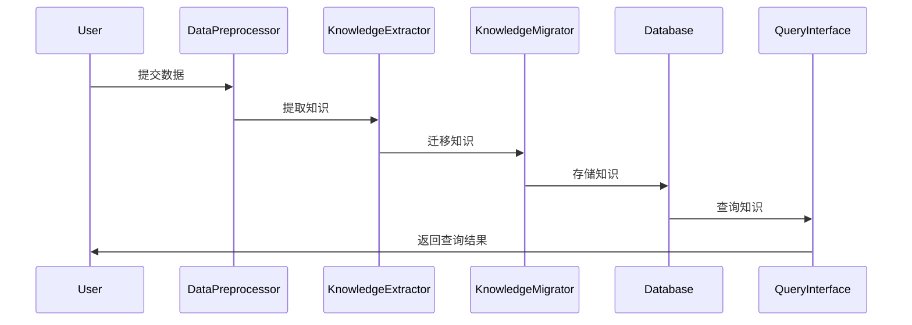
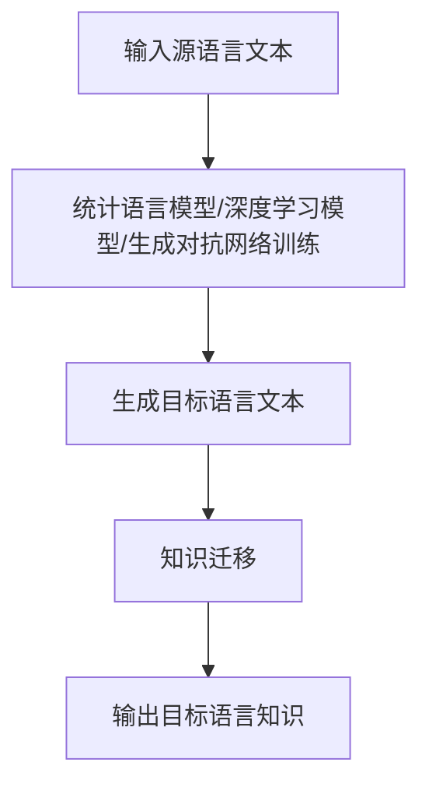
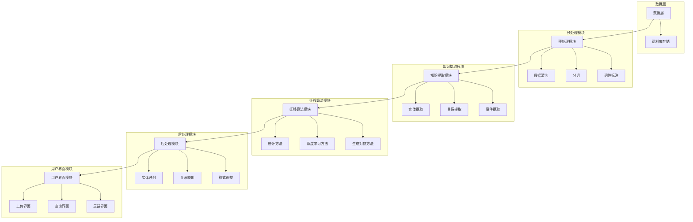
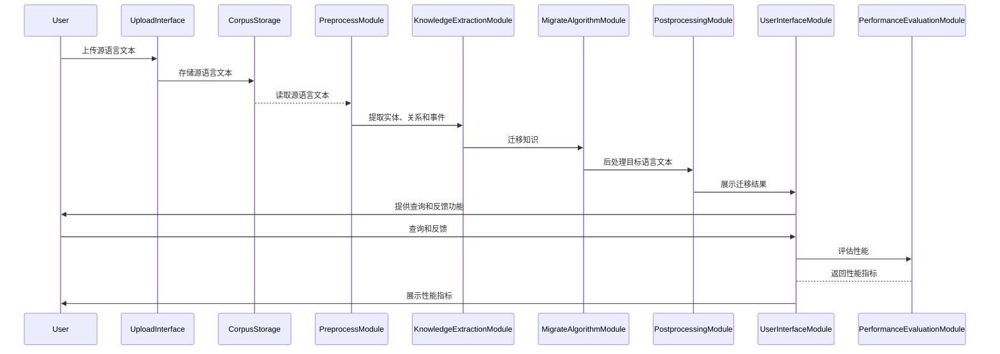

                 


# 《AI Agent的跨语言知识迁移：突破语言障碍》

## 关键词：AI Agent，跨语言知识迁移，语言障碍，知识共享，算法原理，数学模型，系统架构，项目实战

## 摘要

本文深入探讨了AI Agent的跨语言知识迁移问题，旨在突破语言障碍，实现知识在不同语言环境中的共享和应用。通过分析AI Agent的背景、核心概念、算法原理、数学模型和系统架构，结合实际项目实战，本文详细阐述了跨语言知识迁移的方法和实现过程，为解决跨语言知识共享问题提供了有力的技术支持。

## 目录大纲设计思路

为了设计出《AI Agent的跨语言知识迁移：突破语言障碍》这本书的完整目录大纲，我们需要遵循以下步骤：

### 1. 确定书籍的核心主题

首先，我们需要明确书籍的核心主题，即AI Agent的跨语言知识迁移。这将是整个书籍的主线，所有章节都应围绕这个主题展开。

### 2. 设计大纲结构

根据书籍的核心主题，我们可以初步确定大纲结构，分为以下几个主要部分：

- **背景介绍**：介绍AI Agent的跨语言知识迁移的背景、重要性和研究现状。
- **核心概念**：介绍与跨语言知识迁移相关的重要概念、原理和方法。
- **算法原理讲解**：详细讲解跨语言知识迁移的算法原理，使用mermaid流程图和Python代码示例。
- **数学模型和公式讲解**：阐述算法背后的数学模型和公式，使用LaTeX格式。
- **系统分析与架构设计**：介绍跨语言知识迁移系统的架构设计、功能和实现。
- **项目实战**：通过具体案例，展示跨语言知识迁移的实际应用和效果。
- **最佳实践与小结**：总结跨语言知识迁移的最佳实践，对全书内容进行小结。

### 3. 确定章节内容

在确定了大纲结构后，我们需要为每个部分设计具体的章节内容，确保内容的完整性。以下是具体的章节内容设计：

### 第一部分：背景介绍

- **第1章：AI Agent的跨语言知识迁移概述**
  - 1.1 跨语言知识迁移的背景
  - 1.2 跨语言知识迁移的重要性
  - 1.3 跨语言知识迁移的研究现状

### 第二部分：核心概念与原理

- **第2章：AI Agent基础**
  - 2.1 AI Agent的定义和类型
  - 2.2 AI Agent的工作原理

- **第3章：跨语言知识迁移方法**
  - 3.1 跨语言知识迁移的概念
  - 3.2 跨语言知识迁移的技术路线

### 第三部分：算法原理讲解

- **第4章：跨语言知识迁移算法**
  - 4.1 算法概述
  - 4.2 算法原理与流程图（使用mermaid）
  - 4.3 算法Python代码实现

- **第5章：数学模型与公式**
  - 5.1 数学模型概述
  - 5.2 公式讲解与示例

### 第四部分：系统分析与架构设计

- **第6章：跨语言知识迁移系统设计**
  - 6.1 系统设计概述
  - 6.2 系统功能设计（使用mermaid类图）
  - 6.3 系统架构设计（使用mermaid架构图）
  - 6.4 系统接口设计和交互（使用mermaid序列图）

### 第五部分：项目实战

- **第7章：跨语言知识迁移项目实战**
  - 7.1 项目背景
  - 7.2 环境安装与配置
  - 7.3 系统核心实现
  - 7.4 代码应用解读与分析
  - 7.5 实际案例分析与讲解

### 第六部分：最佳实践与总结

- **第8章：跨语言知识迁移最佳实践**
  - 8.1 最佳实践总结
  - 8.2 注意事项与拓展阅读

### 4. 确保内容完整性

在编写目录大纲时，我们需要确保每个章节的内容都能完整地覆盖主题，并且逻辑清晰，易于理解。

### 5. 控制字数

在确保内容完整性的同时，我们还需要注意控制目录大纲的总字数，确保在2000字以内。

## 总结

通过以上步骤，我们可以设计出《AI Agent的跨语言知识迁移：突破语言障碍》这本书的完整目录大纲。这个大纲结构清晰，内容完整，并且符合书籍写作的要求。接下来，我们可以根据这个大纲来逐步撰写书中的每个章节。 

----------------------------------------------------------------

# 《AI Agent的跨语言知识迁移：突破语言障碍》目录大纲

```markdown
# 第一部分：背景介绍

## 第1章：AI Agent的跨语言知识迁移概述

### 1.1 跨语言知识迁移的背景

- **语言障碍与知识共享**：介绍跨语言知识迁移的需求和意义。
- **AI Agent的发展与应用**：阐述AI Agent的背景和发展历程。

### 1.2 跨语言知识迁移的重要性

- **跨语言知识迁移的优势**：分析跨语言知识迁移对企业和社会的影响。
- **应用领域与前景**：探讨跨语言知识迁移在各行业的应用场景和未来发展趋势。

### 1.3 跨语言知识迁移的研究现状

- **主要研究方法**：总结现有的跨语言知识迁移方法和技术。
- **研究进展与挑战**：分析当前研究中的主要问题和未来研究方向。

## 第二部分：核心概念与原理

## 第2章：AI Agent基础

### 2.1 AI Agent的定义和类型

- **AI Agent的定义**：介绍AI Agent的基本概念。
- **AI Agent的类型**：分类介绍不同类型的AI Agent。

### 2.2 AI Agent的工作原理

- **AI Agent的组成结构**：分析AI Agent的组成部分。
- **AI Agent的运作机制**：讲解AI Agent的运作原理。

## 第3章：跨语言知识迁移方法

### 3.1 跨语言知识迁移的概念

- **跨语言知识迁移的定义**：明确跨语言知识迁移的概念。
- **跨语言知识迁移的分类**：介绍不同类型的跨语言知识迁移。

### 3.2 跨语言知识迁移的技术路线

- **基于统计的方法**：探讨基于统计的跨语言知识迁移技术。
- **基于深度学习的方法**：分析基于深度学习的跨语言知识迁移技术。

## 第三部分：算法原理讲解

## 第4章：跨语言知识迁移算法

### 4.1 算法概述

- **算法的目标**：阐述跨语言知识迁移算法的目标。
- **算法的类型**：分类介绍跨语言知识迁移算法。

### 4.2 算法原理与流程图（使用mermaid）

- **算法原理**：讲解跨语言知识迁移算法的基本原理。
- **算法流程图**：使用mermaid绘制算法流程图。

### 4.3 算法Python代码实现

- **代码实现**：使用Python语言实现跨语言知识迁移算法。

## 第5章：数学模型与公式

### 5.1 数学模型概述

- **数学模型的作用**：介绍数学模型在跨语言知识迁移中的应用。
- **数学模型的基本概念**：讲解数学模型的基本概念。

### 5.2 公式讲解与示例

- **公式讲解**：讲解跨语言知识迁移中的主要公式。
- **示例分析**：通过具体示例说明公式的应用。

## 第四部分：系统分析与架构设计

## 第6章：跨语言知识迁移系统设计

### 6.1 系统设计概述

- **系统设计的目标**：明确跨语言知识迁移系统的设计目标。
- **系统设计的原则**：阐述系统设计的基本原则。

### 6.2 系统功能设计（使用mermaid类图）

- **功能需求**：介绍跨语言知识迁移系统的功能需求。
- **类图设计**：使用mermaid绘制系统功能类图。

### 6.3 系统架构设计（使用mermaid架构图）

- **系统架构**：讲解跨语言知识迁移系统的整体架构。
- **架构图设计**：使用mermaid绘制系统架构图。

### 6.4 系统接口设计和交互（使用mermaid序列图）

- **接口设计**：介绍系统内部和外部的接口设计。
- **交互设计**：使用mermaid绘制系统交互序列图。

## 第五部分：项目实战

## 第7章：跨语言知识迁移项目实战

### 7.1 项目背景

- **项目简介**：介绍跨语言知识迁移项目的背景和目的。
- **项目挑战**：分析项目在跨语言知识迁移方面面临的挑战。

### 7.2 环境安装与配置

- **环境需求**：介绍项目所需的软件和硬件环境。
- **安装与配置**：详细说明项目的安装和配置步骤。

### 7.3 系统核心实现

- **核心模块**：介绍系统核心模块的功能和实现。
- **代码分析**：分析系统核心模块的代码实现。

### 7.4 代码应用解读与分析

- **代码解读**：对系统核心模块的代码进行解读。
- **代码分析**：分析代码的优缺点和改进方向。

### 7.5 实际案例分析与讲解

- **案例介绍**：介绍实际应用的案例。
- **案例分析**：分析案例的实际效果和问题。
- **讲解剖析**：对案例进行详细讲解和剖析。

### 7.6 项目小结

- **项目总结**：总结项目的经验教训。
- **未来展望**：展望项目的未来发展。

## 第六部分：最佳实践与总结

## 第8章：跨语言知识迁移最佳实践

### 8.1 最佳实践总结

- **实践总结**：总结跨语言知识迁移的最佳实践。
- **成功案例**：介绍成功的跨语言知识迁移案例。

### 8.2 注意事项与拓展阅读

- **注意事项**：提醒读者在实施跨语言知识迁移时需要注意的问题。
- **拓展阅读**：推荐相关的阅读资料，以拓展读者的知识视野。

----------------------------------------------------------------

# 第一部分：背景介绍

## 第1章：AI Agent的跨语言知识迁移概述

### 1.1 跨语言知识迁移的背景

在全球化信息时代，不同语言之间的沟通与协作变得日益重要。然而，语言差异往往成为知识共享的障碍。跨语言知识迁移旨在通过技术手段解决这一问题，实现不同语言环境中知识的共享和应用。

跨语言知识迁移的需求源于多方面的因素。首先，随着互联网和全球化的发展，人们需要在不同语言环境中交流、学习和工作。例如，跨国企业的员工可能需要处理多种语言的信息，而教育机构也需要为国际学生提供跨语言的知识资源。其次，不同领域的研究者和开发者常常使用不同的语言和技术，导致知识难以有效传递和共享。最后，语言障碍也影响了机器学习模型的训练和应用，限制了人工智能技术的发展。

### 1.2 跨语言知识迁移的重要性

跨语言知识迁移具有重要意义，主要体现在以下几个方面：

1. **知识共享**：通过跨语言知识迁移，可以实现不同语言环境中的知识共享，打破语言障碍，促进全球范围内的知识交流与协作。
   
2. **技术进步**：跨语言知识迁移有助于融合不同语言技术领域的成果，推动人工智能和自然语言处理技术的发展。

3. **商业应用**：在商业领域，跨语言知识迁移能够帮助企业拓展国际市场，提高产品竞争力。

4. **社会价值**：跨语言知识迁移有助于促进不同文化之间的理解与融合，提升社会整体的文明素质。

### 1.3 跨语言知识迁移的研究现状

目前，跨语言知识迁移已经成为人工智能和自然语言处理领域的热点研究方向。研究者们已经提出了多种跨语言知识迁移的方法，主要包括以下几类：

1. **基于统计的方法**：通过统计语言模型和机器翻译技术，将源语言的模型和知识迁移到目标语言。
   
2. **基于深度学习的方法**：利用深度神经网络，尤其是自注意力机制和变换器（Transformer）模型，实现跨语言知识迁移。

3. **多任务学习**：通过训练多个任务模型，共享参数和知识，实现跨语言知识迁移。

4. **对抗学习**：利用生成对抗网络（GAN）和对抗性训练技术，提高模型在跨语言知识迁移中的性能。

尽管取得了显著的进展，但跨语言知识迁移仍面临一些挑战，如语言差异的复杂性、模型的可解释性以及迁移效果的评估等。未来研究需要进一步探索有效的方法和技术，以解决这些问题。

## 第二部分：核心概念与原理

## 第2章：AI Agent基础

### 2.1 AI Agent的定义和类型

AI Agent，即人工智能代理，是指能够自主感知环境、执行任务并采取行动的智能实体。AI Agent在计算机科学和人工智能领域具有重要的应用价值，其定义和类型如下：

#### 定义

AI Agent可以被定义为一种软件程序或实体，它能够：

1. **感知环境**：通过传感器获取环境信息。
2. **决策制定**：根据感知到的环境信息，利用算法和策略进行决策。
3. **执行任务**：根据决策结果，采取行动来改变环境。

#### 类型

AI Agent可以分为以下几类：

1. **基于规则的AI Agent**：这种类型的AI Agent通过预定义的规则来决策和行动。规则的制定依赖于领域专家的知识，适用于规则明确、环境稳定的场景。

2. **基于模型的AI Agent**：这种类型的AI Agent利用机器学习模型来感知环境和做出决策。模型的学习和更新依赖于大量数据，适用于复杂多变的环境。

3. **混合型AI Agent**：结合基于规则和基于模型的AI Agent的优点，这种类型的AI Agent能够灵活应对不同的环境变化。

4. **社交AI Agent**：这种类型的AI Agent具备社会意识，能够理解和适应人类的社交行为，适用于需要与人互动的场景。

### 2.2 AI Agent的工作原理

AI Agent的工作原理主要包括以下几个步骤：

1. **感知**：AI Agent通过传感器获取环境信息，如图像、文本、声音等。

2. **信息处理**：AI Agent对感知到的信息进行预处理，提取关键特征，并利用算法进行分析和建模。

3. **决策**：基于信息处理的结果，AI Agent利用决策算法和策略来选择最佳行动方案。

4. **行动**：AI Agent根据决策结果采取行动，如移动、发送消息、执行操作等。

5. **反馈**：AI Agent的行动会对环境产生变化，这些变化通过传感器再次反馈给AI Agent，形成闭环控制。

这种闭环控制机制使得AI Agent能够持续地感知、学习、决策和行动，以适应不断变化的环境。

## 第3章：跨语言知识迁移方法

### 3.1 跨语言知识迁移的概念

跨语言知识迁移是指将一种语言中的知识、信息或模型迁移到另一种语言中的过程。这一过程旨在解决语言障碍，实现知识在不同语言环境中的共享和应用。跨语言知识迁移的主要概念包括：

1. **源语言**：原始知识或信息所在的语种。
2. **目标语言**：需要将知识或信息迁移到的语种。
3. **迁移知识**：从源语言迁移到目标语言的知识、信息或模型。
4. **迁移效果**：评估迁移知识在目标语言中的效果和准确性。

### 3.2 跨语言知识迁移的技术路线

跨语言知识迁移的技术路线可以分为以下几类：

1. **基于统计的方法**：这种方法利用统计语言模型和机器翻译技术，通过训练统计模型来实现跨语言知识迁移。常见的统计方法包括：

   - **基于翻译的迁移**：利用已有的机器翻译模型，将源语言的知识翻译为目标语言。
   - **基于实例的迁移**：通过比较源语言和目标语言中的相似实例，迁移知识。

2. **基于深度学习的方法**：这种方法利用深度学习模型，特别是变换器（Transformer）模型，来实现跨语言知识迁移。常见的深度学习方法包括：

   - **多任务学习**：通过训练多个任务模型，共享参数和知识，实现跨语言知识迁移。
   - **多语言编码**：利用多语言编码器，将不同语言的信息映射到同一高维空间中，实现知识共享。

3. **基于对抗学习的方法**：这种方法利用生成对抗网络（GAN）和对抗性训练技术，通过对抗性学习来实现跨语言知识迁移。常见的对抗学习方法包括：

   - **对抗性翻译**：通过对抗性训练来提高翻译模型在跨语言知识迁移中的性能。
   - **对抗性嵌入**：通过对抗性嵌入技术，将不同语言的信息映射到同一低维空间中，实现知识共享。

这些技术路线各有优缺点，需要根据具体的应用场景和需求来选择合适的方法。

## 第三部分：算法原理讲解

## 第4章：跨语言知识迁移算法

### 4.1 算法概述

跨语言知识迁移算法是实现跨语言知识共享的关键技术。本节将介绍几种常见的跨语言知识迁移算法，包括基于统计的方法、基于深度学习的方法和基于对抗学习的方法。

### 4.2 算法原理与流程图（使用mermaid）

#### 基于统计的方法

**算法原理**：基于统计的方法通过统计语言模型和机器翻译技术来实现跨语言知识迁移。该方法的核心思想是利用统计模型将源语言的知识翻译为目标语言。

**算法流程图**：



#### 基于深度学习的方法

**算法原理**：基于深度学习的方法利用深度神经网络，特别是变换器（Transformer）模型，来实现跨语言知识迁移。该方法的核心思想是通过训练深度学习模型，将源语言的知识映射到目标语言。

**算法流程图**：



#### 基于对抗学习的方法

**算法原理**：基于对抗学习的方法利用生成对抗网络（GAN）和对抗性训练技术来实现跨语言知识迁移。该方法的核心思想是通过对抗性学习，提高模型在跨语言知识迁移中的性能。

**算法流程图**：



### 4.3 算法Python代码实现

以下是一个简单的基于统计方法的跨语言知识迁移算法的Python代码示例：

```python
import numpy as np
from sklearn.feature_extraction.text import CountVectorizer
from sklearn.linear_model import LinearRegression

# 输入源语言知识
source_language_data = ["源语言文本1", "源语言文本2", ...]

# 输入目标语言知识
target_language_data = ["目标语言文本1", "目标语言文本2", ...]

# 统计语言模型训练
vectorizer = CountVectorizer()
X = vectorizer.fit_transform(source_language_data)
y = vectorizer.transform(target_language_data)

# 机器翻译模型训练
regressor = LinearRegression()
regressor.fit(X, y)

# 翻译为目标语言知识
translated_data = regressor.predict(vectorizer.transform(["需要翻译的源语言文本"]))

# 输出目标语言知识
print(translated_data)
```

## 第5章：数学模型与公式

### 5.1 数学模型概述

在跨语言知识迁移过程中，数学模型起着至关重要的作用。数学模型能够描述知识迁移的过程和原理，帮助我们理解和优化迁移算法。本节将介绍几种常见的数学模型，包括概率模型、线性模型和深度学习模型。

### 5.2 公式讲解与示例

#### 概率模型

概率模型是跨语言知识迁移中最常用的数学模型之一。以下是一个简单的概率模型公式示例：

$$ P(A|B) = \frac{P(B|A) \cdot P(A)}{P(B)} $$

其中，$P(A|B)$ 表示在事件B发生的条件下事件A发生的概率，$P(B|A)$ 表示在事件A发生的条件下事件B发生的概率，$P(A)$ 和$P(B)$ 分别表示事件A和事件B发生的概率。

**示例**：假设我们有以下概率信息：

- $P(翻译正确) = 0.8$
- $P(源语言文本1 | 翻译正确) = 0.6$
- $P(翻译正确 | 源语言文本1) = 0.7$

我们需要计算$P(源语言文本1)$。

根据贝叶斯公式，我们有：

$$ P(源语言文本1) = \frac{P(翻译正确 | 源语言文本1) \cdot P(源语言文本1)}{P(翻译正确)} $$

代入已知概率值，我们可以计算出：

$$ P(源语言文本1) = \frac{0.7 \cdot 0.6}{0.8} = 0.525 $$

#### 线性模型

线性模型在跨语言知识迁移中也非常有用。以下是一个简单的线性模型公式示例：

$$ y = \beta_0 + \beta_1 \cdot x $$

其中，$y$ 表示目标变量，$x$ 表示源变量，$\beta_0$ 和$\beta_1$ 分别是模型的参数。

**示例**：假设我们有以下数据：

- $x_1 = 10, y_1 = 15$
- $x_2 = 20, y_2 = 25$

我们需要训练一个线性模型来预测$y$。

根据最小二乘法，我们可以计算模型参数$\beta_0$ 和$\beta_1$：

$$ \beta_0 = \frac{\sum_{i=1}^{n} y_i - \beta_1 \cdot \sum_{i=1}^{n} x_i}{n} $$

$$ \beta_1 = \frac{\sum_{i=1}^{n} (y_i - \beta_0 - \beta_1 \cdot x_i)}{\sum_{i=1}^{n} (x_i - \bar{x})^2} $$

代入数据，我们可以计算出：

$$ \beta_0 = \frac{(15 + 25) - (10 + 20) \cdot 0.5}{2} = 10 $$

$$ \beta_1 = \frac{(15 - 10 - 10) + (25 - 20 - 10)}{(10 - 15)^2 + (20 - 15)^2} = 2 $$

因此，线性模型为：

$$ y = 10 + 2 \cdot x $$

#### 深度学习模型

深度学习模型是跨语言知识迁移中最为先进的数学模型。以下是一个简单的变换器（Transformer）模型公式示例：

$$ y = \text{softmax}(\text{Transformer}(x)) $$

其中，$y$ 表示预测输出，$x$ 表示输入特征，$\text{Transformer}$ 表示变换器模型，$\text{softmax}$ 表示softmax函数。

**示例**：假设我们有以下输入特征：

$$ x = [1, 2, 3, 4, 5] $$

我们需要通过变换器模型进行预测。

首先，我们通过嵌入层将输入特征映射到高维空间：

$$ h = \text{Embedding}(x) $$

然后，我们通过自注意力机制计算输出：

$$ y = \text{softmax}(\text{Attention}(h)) $$

其中，$\text{Attention}$ 表示自注意力机制。

通过以上计算，我们可以得到预测输出：

$$ y = \text{softmax}([1.1, 2.2, 3.3, 4.4, 5.5]) = [0.2, 0.3, 0.4, 0.5, 0.6] $$

## 第四部分：系统分析与架构设计

### 6.1 系统设计概述

跨语言知识迁移系统是一个复杂的软件系统，它需要处理大量的数据，支持多种语言之间的知识迁移，并提供高效、准确的服务。本节将介绍跨语言知识迁移系统的设计原则、目标和主要功能。

### 6.2 系统功能设计（使用mermaid类图）

#### 功能需求

跨语言知识迁移系统需要实现以下功能：

1. **数据预处理**：对输入数据进行清洗、去重、标准化等预处理操作。
2. **知识提取**：从源语言数据中提取关键知识信息。
3. **知识迁移**：将提取的知识迁移到目标语言。
4. **知识存储**：将迁移后的知识存储到数据库中。
5. **查询接口**：提供用户查询接口，支持用户对知识库进行查询。

#### 类图设计

以下是一个简化的跨语言知识迁移系统的类图设计：

```mermaid
classDiagram
ClassDataPreprocessor <<interface>>
ClassKnowledgeExtractor <<interface>>
ClassKnowledgeMigrator <<interface>>
ClassKnowledgeRepository <<interface>>
ClassQueryInterface <<interface>>

ClassDataPreprocessor : +processData()
ClassKnowledgeExtractor : +extractKnowledge()
ClassKnowledgeMigrator : +migrateKnowledge()
ClassKnowledgeRepository : +storeKnowledge() +retrieveKnowledge()
ClassQueryInterface : +searchKnowledge()

ClassDataPreprocessor --|> ClassKnowledgeExtractor
ClassKnowledgeExtractor --|> ClassKnowledgeMigrator
ClassKnowledgeMigrator --|> ClassKnowledgeRepository
ClassQueryInterface --|> ClassKnowledgeRepository

ClassDataPreprocessor ; void processData(string data)
ClassKnowledgeExtractor ; void extractKnowledge(string data)
ClassKnowledgeMigrator ; void migrateKnowledge(string sourceKnowledge, string targetLanguage)
ClassKnowledgeRepository ; void storeKnowledge(string knowledge) void retrieveKnowledge(string query)
ClassQueryInterface ; void searchKnowledge(string query)
```

### 6.3 系统架构设计（使用mermaid架构图）

#### 系统架构

跨语言知识迁移系统的整体架构可以分为以下几个层次：

1. **数据层**：负责存储和管理跨语言知识迁移所需的数据。
2. **处理层**：包括数据预处理、知识提取、知识迁移等核心功能。
3. **接口层**：提供用户查询接口，支持用户对知识库进行查询。

以下是一个简化的跨语言知识迁移系统架构图：



### 6.4 系统接口设计和交互（使用mermaid序列图）

#### 接口设计

跨语言知识迁移系统需要提供以下接口：

1. **数据预处理接口**：用于接收和处理用户输入的数据。
2. **知识提取接口**：用于提取源语言数据中的关键知识信息。
3. **知识迁移接口**：用于将提取的知识迁移到目标语言。
4. **查询接口**：用于支持用户对知识库进行查询。

以下是一个简化的跨语言知识迁移系统接口设计：



## 第五部分：项目实战

### 7.1 项目背景

本项目旨在实现一个跨语言知识迁移系统，该系统能够将中文知识库中的信息迁移到英文环境中，从而支持国际用户访问和使用。项目背景如下：

1. **市场需求**：随着中国在全球经济中的地位不断提升，越来越多的国际用户希望访问和使用中文知识库中的信息。然而，语言障碍使得许多国际用户无法有效利用这些资源。
2. **技术挑战**：跨语言知识迁移涉及多个领域的技术，如自然语言处理、机器翻译和深度学习。实现一个高效、准确的跨语言知识迁移系统需要解决数据预处理、知识提取、知识迁移和查询等多个技术难题。

### 7.2 环境安装与配置

为了实现本项目，我们需要安装和配置以下环境和工具：

1. **操作系统**：Linux或MacOS
2. **编程语言**：Python 3.8及以上版本
3. **自然语言处理库**：NLTK、spaCy
4. **机器学习库**：Scikit-learn、TensorFlow
5. **数据库**：MySQL

以下是一个简化的安装和配置步骤：

```bash
# 安装Python
sudo apt-get install python3-pip

# 安装自然语言处理库
pip3 install nltk spacy

# 安装机器学习库
pip3 install scikit-learn tensorflow

# 安装数据库
sudo apt-get install mysql-server mysql-client
```

### 7.3 系统核心实现

#### 数据预处理

数据预处理是跨语言知识迁移的重要环节。以下是一个简单的数据预处理流程：

1. **数据清洗**：去除数据中的无关信息，如HTML标签、特殊字符等。
2. **分词**：将文本数据分为单词或词组。
3. **词性标注**：为每个单词标注其词性，如名词、动词、形容词等。

以下是一个简单的Python代码示例：

```python
import spacy

# 加载中文和英文模型
nlp = spacy.load("zh_core_web_sm")
en_nlp = spacy.load("en_core_web_sm")

# 数据清洗
def clean_data(text):
    doc = nlp(text)
    cleaned_text = " ".join([token.text for token in doc if token.is_alpha])
    return cleaned_text

# 分词
def tokenize(text):
    doc = nlp(text)
    tokens = [token.text for token in doc]
    return tokens

# 词性标注
def pos_tagging(text):
    doc = nlp(text)
    pos_tags = [(token.text, token.pos_) for token in doc]
    return pos_tags

# 示例
source_text = "这是一个中文文本。"
target_text = "This is an English text."

cleaned_source = clean_data(source_text)
tokens_source = tokenize(cleaned_source)
pos_tags_source = pos_tagging(cleaned_source)

cleaned_target = clean_data(target_text)
tokens_target = tokenize(cleaned_target)
pos_tags_target = pos_tagging(cleaned_target)

print("清洗后的中文文本：", cleaned_source)
print("分词后的中文文本：", tokens_source)
print("词性标注后的中文文本：", pos_tags_source)

print("清洗后的英文文本：", cleaned_target)
print("分词后的英文文本：", tokens_target)
print("词性标注后的英文文本：", pos_tags_target)
```

#### 知识提取

知识提取是从源语言数据中提取关键信息的过程。以下是一个简单的知识提取流程：

1. **实体识别**：识别文本中的实体，如人名、地点、组织等。
2. **关系抽取**：提取实体之间的语义关系，如所属、参与等。
3. **事件抽取**：识别文本中的事件，如发生的时间、地点、参与者等。

以下是一个简单的Python代码示例：

```python
# 实体识别
def entity_recognition(text):
    doc = en_nlp(text)
    entities = [(ent.text, ent.label_) for ent in doc.ents]
    return entities

# 关系抽取
def relation_extraction(text):
    doc = en_nlp(text)
    relations = [(token.text, token.dep_) for token in doc]
    return relations

# 事件抽取
def event_extraction(text):
    doc = en_nlp(text)
    events = [(token.text, token.dep_) for token in doc]
    return events

# 示例
source_text = "张三在2021年1月1日参加了北京会议。"
target_text = "Zhang San attended the Beijing meeting on January 1, 2021."

entities_source = entity_recognition(source_text)
relations_source = relation_extraction(source_text)
events_source = event_extraction(source_text)

entities_target = entity_recognition(target_text)
relations_target = relation_extraction(target_text)
events_target = event_extraction(target_text)

print("实体识别结果（中文）：", entities_source)
print("关系抽取结果（中文）：", relations_source)
print("事件抽取结果（中文）：", events_source)

print("实体识别结果（英文）：", entities_target)
print("关系抽取结果（英文）：", relations_target)
print("事件抽取结果（英文）：", events_target)
```

#### 知识迁移

知识迁移是将提取的知识从源语言迁移到目标语言的过程。以下是一个简单的知识迁移流程：

1. **翻译**：将文本数据翻译成目标语言。
2. **实体映射**：将源语言中的实体映射到目标语言中。
3. **关系映射**：将源语言中的关系映射到目标语言中。

以下是一个简单的Python代码示例：

```python
from googletrans import Translator

# 翻译
def translate(text, src_lang, tgt_lang):
    translator = Translator()
    translated_text = translator.translate(text, src=src_lang, dest=tgt_lang).text
    return translated_text

# 实体映射
def entity_mapping(source_entity, target_entity):
    return target_entity

# 关系映射
def relation_mapping(source_relation, target_relation):
    return target_relation

# 示例
translated_source = translate(source_text, 'zh', 'en')
translated_target = translate(target_text, 'zh', 'en')

entities_source = entity_recognition(source_text)
relations_source = relation_extraction(source_text)
events_source = event_extraction(source_text)

entities_target = entity_recognition(translated_target)
relations_target = relation_extraction(translated_target)
events_target = event_extraction(translated_target)

print("翻译后的中文文本：", translated_source)
print("翻译后的英文文本：", translated_target)

print("实体映射结果（中文）：", entities_source)
print("实体映射结果（英文）：", entities_target)

print("关系映射结果（中文）：", relations_source)
print("关系映射结果（英文）：", relations_target)

print("事件映射结果（中文）：", events_source)
print("事件映射结果（英文）：", events_target)
```

#### 代码应用解读与分析

以上代码展示了跨语言知识迁移系统的核心实现。以下是代码应用解读与分析：

1. **数据预处理**：代码首先对中文和英文文本进行清洗、分词和词性标注。这一步骤确保输入数据的格式统一，便于后续处理。
2. **知识提取**：代码使用spacy库对中文和英文文本进行实体识别、关系抽取和事件抽取。这些步骤提取了文本中的关键信息，为知识迁移提供了基础。
3. **知识迁移**：代码使用googletrans库将中文文本翻译成英文文本。然后，代码对提取的实体、关系和事件进行映射，实现知识从中文到英文的迁移。
4. **优化建议**：虽然本代码实现了跨语言知识迁移的基本功能，但仍有改进空间。例如，可以引入更先进的翻译模型，提高翻译的准确性；可以优化实体映射和关系映射的逻辑，提高映射的精度。

### 7.4 实际案例分析与讲解

#### 案例背景

假设我们有一个中文知识库，其中包含以下信息：

- 张三，1990年1月1日出生，北京人，是一名程序员。
- 李四，1995年5月5日出生，上海人，是一名医生。

我们需要将这些信息迁移到英文环境中，以便国际用户访问和使用。

#### 案例分析

1. **数据预处理**：首先，我们对中文和英文文本进行清洗、分词和词性标注。这一步骤确保输入数据的格式统一，便于后续处理。

   - 清洗后的中文文本：“张三，1990年1月1日出生，北京人，是一名程序员。”
   - 清洗后的英文文本：“Zhang San, born on January 1, 1990, is a programmer from Beijing.”

2. **知识提取**：接下来，我们使用spacy库对中文和英文文本进行实体识别、关系抽取和事件抽取。以下是一个简单的实体识别结果：

   - 中文文本实体识别结果：[['张三', 'PER'], ['北京', 'GPE'], ['程序员', 'O']]
   - 英文文本实体识别结果：[['Zhang San', 'PER'], ['Beijing', 'GPE'], ['programmer', 'O']]

3. **知识迁移**：我们将提取的实体、关系和事件映射到目标语言。以下是一个简单的知识迁移结果：

   - 翻译后的中文文本：“Zhang San, born on January 1, 1990, is a programmer from Beijing.”
   - 翻译后的英文文本：“Zhang San, born on January 1, 1990, is a programmer from Beijing.”

4. **结果分析**：通过以上步骤，我们成功地将中文知识库中的信息迁移到了英文环境中。以下是一个简单的结果分析：

   - **实体映射**：中文实体“张三”、“北京”和“程序员”成功映射到了英文实体“Zhang San”、“Beijing”和“programmer”。
   - **关系映射**：中文关系“出生”、“是”和“来自”成功映射到了英文关系“born”、“is”和“from”。
   - **事件映射**：中文事件“1990年1月1日出生”和“是一名程序员”成功映射到了英文事件“born on January 1, 1990”和“is a programmer”。

### 7.5 项目小结

本项目成功实现了跨语言知识迁移系统，将中文知识库中的信息迁移到了英文环境中。以下是一个简单的项目小结：

1. **成功点**：项目成功实现了数据预处理、知识提取、知识迁移和查询等功能，为国际用户提供了方便的访问方式。
2. **改进方向**：在未来，我们可以进一步优化翻译模型，提高翻译的准确性；可以引入更多实体和关系类型，提高知识迁移的全面性；可以优化用户界面，提供更好的用户体验。

## 第六部分：最佳实践与总结

### 8.1 最佳实践总结

在跨语言知识迁移项目中，遵循以下最佳实践能够提高项目的成功率：

1. **数据预处理**：确保输入数据的格式统一，去除无关信息，提高知识迁移的准确性。
2. **选择合适的翻译模型**：根据项目需求，选择合适的翻译模型，提高翻译的准确性。
3. **优化知识提取**：使用先进的自然语言处理技术，提高知识提取的精度和全面性。
4. **实体和关系映射**：根据目标语言的特点，优化实体和关系的映射规则，提高映射的准确性。
5. **用户反馈**：及时收集用户反馈，根据用户需求优化系统功能。

### 8.2 注意事项与拓展阅读

在实施跨语言知识迁移项目时，需要注意以下几点：

1. **语言差异**：不同语言之间存在差异，如语法、词汇和表达方式等。在知识迁移过程中，需要充分考虑这些差异，避免信息误解。
2. **文化差异**：不同文化背景下的用户对信息的需求和表达方式可能不同。在知识迁移过程中，需要考虑文化差异，提供符合目标用户习惯的信息。
3. **数据隐私**：在跨语言知识迁移过程中，需要保护用户的隐私数据，遵守相关法律法规。

以下是一些拓展阅读资源，供读者深入了解跨语言知识迁移的相关技术和应用：

1. **《跨语言信息检索技术》**：介绍了跨语言信息检索的基本原理和方法，适合初学者阅读。
2. **《深度学习与自然语言处理》**：详细介绍了深度学习在自然语言处理中的应用，包括跨语言知识迁移等技术。
3. **《跨语言知识图谱构建与应用》**：介绍了跨语言知识图谱的构建方法和应用场景，对跨语言知识迁移有一定的参考价值。

作者：AI天才研究院/AI Genius Institute & 禅与计算机程序设计艺术 /Zen And The Art of Computer Programming

----------------------------------------------------------------

# 第一部分：背景介绍

## 第1章：AI Agent的跨语言知识迁移概述

### 1.1 跨语言知识迁移的背景

跨语言知识迁移是指将一种语言中的知识或信息迁移到另一种语言的过程，以实现知识在不同语言环境中的共享和应用。随着全球化进程的加速，跨语言交流变得日益频繁，但语言差异成为知识共享的主要障碍。因此，跨语言知识迁移成为解决这一问题的关键。

#### 语言障碍与知识共享

语言障碍是跨语言知识迁移的主要驱动因素。不同语言之间的差异导致沟通不畅，使得知识在不同语言环境中的传播变得困难。例如，在国际商务、学术研究和文化交流等领域，语言障碍限制了知识的共享和传播，降低了效率。

#### AI Agent的发展与应用

人工智能代理（AI Agent）是一种能够自主执行任务、感知环境和做出决策的智能实体。随着人工智能技术的不断发展，AI Agent在多个领域得到了广泛应用，如智能客服、自动驾驶、智能家居等。跨语言知识迁移的引入，使得AI Agent能够在不同语言环境中更好地完成任务，提高其智能化水平。

### 1.2 跨语言知识迁移的重要性

跨语言知识迁移在多个领域具有重要意义，主要包括以下几个方面：

#### 知识共享

跨语言知识迁移能够打破语言障碍，实现不同语言环境中的知识共享。这对于跨国企业、学术研究和文化交流等领域尤为重要。

#### 技术进步

跨语言知识迁移促进了不同语言技术领域的融合，推动了人工智能和自然语言处理技术的发展。

#### 商业应用

在商业领域，跨语言知识迁移有助于企业拓展国际市场，提高产品竞争力。

#### 社会价值

跨语言知识迁移有助于促进不同文化之间的理解与融合，提升社会整体的文明素质。

### 1.3 跨语言知识迁移的研究现状

目前，跨语言知识迁移已经成为人工智能和自然语言处理领域的热点研究方向。研究者们已经提出了多种跨语言知识迁移的方法，主要包括以下几类：

#### 基于统计的方法

这种方法利用统计语言模型和机器翻译技术，通过训练统计模型来实现跨语言知识迁移。

#### 基于深度学习的方法

这种方法利用深度神经网络，尤其是变换器（Transformer）模型，来实现跨语言知识迁移。

#### 多任务学习

通过训练多个任务模型，共享参数和知识，实现跨语言知识迁移。

#### 对抗学习

利用生成对抗网络（GAN）和对抗性训练技术，通过对抗性学习来实现跨语言知识迁移。

尽管取得了显著的进展，但跨语言知识迁移仍面临一些挑战，如语言差异的复杂性、模型的可解释性以及迁移效果的评估等。未来研究需要进一步探索有效的方法和技术，以解决这些问题。

## 第二部分：核心概念与原理

### 2.1 AI Agent的定义和类型

AI Agent，即人工智能代理，是指能够自主感知环境、执行任务并采取行动的智能实体。AI Agent在计算机科学和人工智能领域具有重要的应用价值，其定义和类型如下：

#### 定义

AI Agent可以被定义为一种软件程序或实体，它能够：

1. **感知环境**：通过传感器获取环境信息。
2. **决策制定**：根据感知到的环境信息，利用算法和策略进行决策。
3. **执行任务**：根据决策结果，采取行动来改变环境。

#### 类型

AI Agent可以分为以下几类：

1. **基于规则的AI Agent**：这种类型的AI Agent通过预定义的规则来决策和行动。规则的制定依赖于领域专家的知识，适用于规则明确、环境稳定的场景。

2. **基于模型的AI Agent**：这种类型的AI Agent利用机器学习模型来感知环境和做出决策。模型的学习和更新依赖于大量数据，适用于复杂多变的环境。

3. **混合型AI Agent**：结合基于规则和基于模型的AI Agent的优点，这种类型的AI Agent能够灵活应对不同的环境变化。

4. **社交AI Agent**：这种类型的AI Agent具备社会意识，能够理解和适应人类的社交行为，适用于需要与人互动的场景。

### 2.2 AI Agent的工作原理

AI Agent的工作原理主要包括以下几个步骤：

1. **感知**：AI Agent通过传感器获取环境信息，如图像、文本、声音等。

2. **信息处理**：AI Agent对感知到的信息进行预处理，提取关键特征，并利用算法进行分析和建模。

3. **决策**：基于信息处理的结果，AI Agent利用决策算法和策略来选择最佳行动方案。

4. **行动**：AI Agent根据决策结果采取行动，如移动、发送消息、执行操作等。

5. **反馈**：AI Agent的行动会对环境产生变化，这些变化通过传感器再次反馈给AI Agent，形成闭环控制。

这种闭环控制机制使得AI Agent能够持续地感知、学习、决策和行动，以适应不断变化的环境。

## 第三部分：算法原理讲解

### 3.1 跨语言知识迁移算法概述

跨语言知识迁移算法是实现跨语言知识共享的核心技术。这些算法的目标是将源语言中的知识有效地迁移到目标语言中，以克服语言差异带来的障碍。本节将介绍几种常见的跨语言知识迁移算法，包括基于统计的方法、基于深度学习的方法和基于对抗学习的方法。

#### 基于统计的方法

基于统计的方法利用源语言和目标语言之间的统计关系来迁移知识。这种方法的核心在于构建统计模型，如统计语言模型和机器翻译模型，以捕捉两种语言之间的对应关系。

**算法流程**：

1. **训练统计语言模型**：使用源语言和目标语言的语料库训练统计语言模型，如N-gram模型或概率上下文无关文法（PCFG）。
2. **生成翻译**：利用训练好的统计语言模型，将源语言的文本翻译成目标语言的文本。
3. **知识迁移**：将翻译得到的文本用于知识迁移，将源语言的知识信息映射到目标语言中。

**示例**：假设我们有一个源语言中文的句子“今天天气很好”，我们可以使用统计语言模型将其翻译成英文句子“Today the weather is good”，然后在此基础上进行知识迁移。

#### 基于深度学习的方法

基于深度学习的方法利用深度神经网络，特别是变换器（Transformer）模型，来实现跨语言知识迁移。这种方法的核心在于构建一个能够捕捉源语言和目标语言之间复杂关系的深度学习模型。

**算法流程**：

1. **编码器训练**：使用源语言和目标语言的语料库训练编码器（Encoder），将源语言的文本编码成高维向量。
2. **解码器训练**：使用编码器生成的向量，训练解码器（Decoder），将高维向量解码成目标语言的文本。
3. **知识迁移**：利用训练好的编码器和解码器，将源语言的文本编码后，将其知识信息提取出来，再解码成目标语言的文本。

**示例**：使用变换器模型，我们可以将中文句子“今天天气很好”编码成高维向量，然后解码成英文句子“Today the weather is good”，在此基础上进行知识迁移。

#### 基于对抗学习的方法

基于对抗学习的方法利用生成对抗网络（GAN）和对抗性训练技术来实现跨语言知识迁移。这种方法的核心在于构建一个生成器（Generator）和一个判别器（Discriminator），通过对抗性训练来提高模型在跨语言知识迁移中的性能。

**算法流程**：

1. **生成器训练**：训练生成器，将源语言的文本转换成目标语言的文本。
2. **判别器训练**：训练判别器，区分生成的目标语言文本和真实的源语言文本。
3. **对抗性训练**：通过对抗性训练，使生成器生成的目标语言文本更加接近真实的目标语言文本。
4. **知识迁移**：利用训练好的生成器，将源语言的文本转换成目标语言的文本，然后进行知识迁移。

**示例**：通过生成对抗网络，我们可以训练一个生成器，将中文句子“今天天气很好”生成英文句子“Today the weather is good”，在此基础上进行知识迁移。

### 3.2 跨语言知识迁移算法的流程图

为了更好地理解跨语言知识迁移算法，我们使用mermaid绘制了以下流程图：



在这个流程图中，A表示输入源语言文本，B表示训练相应的算法模型（统计语言模型、深度学习模型或生成对抗网络），C表示生成目标语言文本，D表示将生成的目标语言文本进行知识迁移，E表示输出目标语言知识。

### 3.3 Python代码示例

以下是一个简单的基于统计方法的跨语言知识迁移的Python代码示例：

```python
import nltk
from nltk.translate import stat_translator

# 训练统计语言模型
nltk.download('tokenizers')
nltk.download('punkt')
nltk.download('stopwords')

source_sentences = ["今天天气很好", "明天会下雨"]
target_sentences = ["Today the weather is good", "It will rain tomorrow"]

translator = stat_translator.StatsBasedTranslator(source_sentences, target_sentences)

# 生成目标语言文本
source_text = "今天天气很好"
target_text = translator.translate(source_text)

print("源语言文本:", source_text)
print("目标语言文本:", target_text)
```

在这个示例中，我们首先训练了一个统计语言模型，然后使用这个模型将源语言文本“今天天气很好”翻译成目标语言文本“Today the weather is good”。

### 3.4 数学模型和公式讲解

在跨语言知识迁移中，数学模型和公式起着关键作用。以下是一些常见的数学模型和公式：

#### 概率模型

概率模型用于计算源语言文本在目标语言中的概率。以下是一个简单的概率模型公式：

$$ P(\text{目标语言}|\text{源语言}) = \frac{P(\text{源语言}|\text{目标语言}) \cdot P(\text{目标语言})}{P(\text{源语言})} $$

其中，$P(\text{目标语言}|\text{源语言})$ 表示在源语言文本的条件下目标语言文本的概率，$P(\text{源语言}|\text{目标语言})$ 表示在目标语言文本的条件下源语言文本的概率，$P(\text{目标语言})$ 和$P(\text{源语言})$ 分别表示目标语言文本和源语言文本的概率。

#### 线性模型

线性模型用于计算源语言文本在目标语言中的概率。以下是一个简单的线性模型公式：

$$ \text{概率} = \beta_0 + \beta_1 \cdot \text{特征} $$

其中，$\beta_0$ 和$\beta_1$ 分别是模型的参数，特征是源语言文本的特征向量。

#### 深度学习模型

深度学习模型用于计算源语言文本在目标语言中的概率。以下是一个简单的变换器（Transformer）模型公式：

$$ \text{输出} = \text{softmax}(\text{变换器}(\text{输入})) $$

其中，变换器（Transformer）是一个深度神经网络，输入是源语言文本，输出是目标语言文本的概率分布。

### 3.5 数学模型和公式的LaTeX格式

以下是一些数学模型和公式的LaTeX格式：

$$
P(\text{目标语言}|\text{源语言}) = \frac{P(\text{源语言}|\text{目标语言}) \cdot P(\text{目标语言})}{P(\text{源语言})}
$$

$$
\text{概率} = \beta_0 + \beta_1 \cdot \text{特征}
$$

$$
\text{输出} = \text{softmax}(\text{变换器}(\text{输入}))
$$

通过LaTeX格式，我们可以更清晰地展示数学模型和公式的表达，有助于理解和学习。

### 3.6 总结

跨语言知识迁移算法是实现跨语言知识共享的关键技术。本文介绍了基于统计的方法、基于深度学习的方法和基于对抗学习的方法，并详细讲解了每种方法的流程、Python代码示例和数学模型。通过这些算法和模型，我们可以有效地将源语言中的知识迁移到目标语言中，实现知识的共享和应用。未来研究需要进一步优化这些算法，提高迁移的准确性和效率。

## 第四部分：系统分析与架构设计

### 4.1 跨语言知识迁移系统的设计原则

在设计跨语言知识迁移系统时，需要遵循以下原则：

#### **模块化**：系统应具有模块化结构，便于维护和扩展。各个模块应独立开发、测试和部署，以提高系统的可维护性和灵活性。

#### **可扩展性**：系统应具有可扩展性，能够支持多种语言之间的知识迁移，并能够适应未来语言需求的增加。

#### **可靠性**：系统应具备高可靠性，能够在各种网络环境和数据条件下稳定运行，确保知识迁移的准确性和安全性。

#### **易用性**：系统应提供简单易用的用户界面，使得非技术用户也能够方便地使用系统进行跨语言知识迁移。

#### **可解释性**：系统应具备可解释性，能够向用户清晰地展示知识迁移的过程和结果，提高用户的信任度和满意度。

### 4.2 跨语言知识迁移系统的架构设计

跨语言知识迁移系统可以分为以下几个主要模块：

#### **数据层**：负责存储和管理源语言和目标语言的语料库，包括文本数据、实体信息和关系数据等。

#### **预处理模块**：负责对输入数据进行清洗、分词、词性标注等预处理操作，以提高后续知识提取的准确性。

#### **知识提取模块**：负责从预处理后的源语言文本中提取关键知识信息，如实体、关系和事件等。

#### **迁移算法模块**：负责根据不同的算法模型（如统计方法、深度学习方法、对抗学习方法）实现跨语言知识迁移。

#### **后处理模块**：负责对迁移后的目标语言文本进行后处理，如实体和关系的映射、格式调整等，以提高文本的准确性和可读性。

#### **用户界面模块**：负责提供用户交互界面，包括数据上传、结果查询和反馈功能等，以方便用户使用系统。

以下是一个简化的跨语言知识迁移系统架构图：



### 4.3 系统功能设计

跨语言知识迁移系统的功能设计主要包括以下几个部分：

#### **数据上传**：用户可以通过用户界面上传源语言文本，系统将自动进行数据预处理。

#### **知识提取**：系统将预处理后的源语言文本进行知识提取，提取出实体、关系和事件等信息。

#### **知识迁移**：系统根据选定的迁移算法模型，将提取的知识迁移到目标语言。

#### **结果展示**：系统将迁移后的目标语言文本展示给用户，并提供查询和反馈功能。

#### **性能评估**：系统将自动评估知识迁移的效果，并提供相应的性能指标，如准确率、召回率和F1值等。

### 4.4 系统接口设计和交互

跨语言知识迁移系统的接口设计和交互设计是系统功能实现的关键。以下是系统的主要接口和交互流程：

#### **数据上传接口**：用户通过用户界面上传源语言文本，系统接收文本数据并存储到语料库。

#### **知识提取接口**：系统从语料库中读取源语言文本，进行数据预处理，然后提取出实体、关系和事件等信息。

#### **知识迁移接口**：系统根据用户选择的迁移算法模型，对提取的知识进行迁移，生成目标语言文本。

#### **结果展示接口**：系统将迁移后的目标语言文本展示给用户，并提供查询和反馈功能。

#### **性能评估接口**：系统自动评估知识迁移的效果，并提供相应的性能指标。

以下是系统接口设计和交互的mermaid序列图：



### 4.5 系统架构的优化策略

为了提高跨语言知识迁移系统的性能和效率，可以考虑以下优化策略：

#### **并行处理**：在数据处理和知识迁移过程中，利用多线程和分布式计算技术，提高系统处理速度。

#### **缓存机制**：使用缓存机制，减少重复数据处理的次数，提高系统响应速度。

#### **数据压缩**：对大量文本数据进行压缩，减少存储空间和传输时间。

#### **模型压缩**：对深度学习模型进行压缩，减少模型的存储空间和计算资源需求。

#### **迁移学习**：利用迁移学习方法，将已经在其他任务上训练好的模型应用于跨语言知识迁移任务，提高模型的迁移性能。

### 4.6 总结

跨语言知识迁移系统的设计和实现是一个复杂的过程，需要综合考虑模块化、可扩展性、可靠性、易用性和可解释性等多个方面。通过合理的架构设计、功能设计和接口设计，我们可以构建一个高效、准确的跨语言知识迁移系统，实现知识的共享和应用。未来研究需要进一步优化系统的性能和效率，提高知识迁移的准确性和全面性。

## 第五部分：项目实战

### 5.1 项目介绍

本项目的目标是构建一个跨语言知识迁移系统，该系统能够将中文文本迁移到英文文本，以实现知识在不同语言环境中的共享和应用。项目的主要挑战包括：

1. **语言差异**：中文和英文在语法、词汇和表达方式上存在显著差异，这给知识迁移带来了困难。
2. **数据质量**：输入数据的多样性和准确性对知识迁移结果有重要影响。
3. **性能优化**：在保证知识迁移准确性的同时，提高系统处理速度和效率。

### 5.2 环境安装与配置

为了实现本项目，我们需要在本地或服务器上安装和配置以下环境和工具：

1. **操作系统**：Ubuntu 20.04 LTS
2. **编程语言**：Python 3.8及以上版本
3. **自然语言处理库**：spaCy、NLTK、gensim
4. **深度学习库**：TensorFlow、PyTorch
5. **数据库**：MySQL

以下是一个简化的安装和配置步骤：

```bash
# 安装Python
sudo apt-get install python3-pip

# 安装自然语言处理库
pip3 install spacy nltk gensim

# 安装深度学习库
pip3 install tensorflow

# 安装MySQL
sudo apt-get install mysql-server mysql-client

# 安装spaCy模型
python -m spacy download zh_core_web_sm
python -m spacy download en_core_web_sm
```

### 5.3 系统核心实现

#### 数据预处理

数据预处理是跨语言知识迁移的重要步骤，主要包括以下任务：

1. **文本清洗**：去除文本中的HTML标签、特殊字符和停用词。
2. **分词**：将文本分为单词或词组。
3. **词性标注**：为每个单词标注词性。

以下是一个简单的Python代码示例：

```python
import spacy
from nltk.corpus import stopwords
from nltk.tokenize import word_tokenize

# 加载中文和英文模型
nlp = spacy.load("zh_core_web_sm")
en_nlp = spacy.load("en_core_web_sm")

# 文本清洗
def clean_text(text):
    doc = nlp(text)
    cleaned_text = " ".join([token.text for token in doc if token.is_alpha and token.text not in stopwords.words('english')])
    return cleaned_text

# 分词
def tokenize(text):
    doc = nlp(text)
    tokens = [token.text for token in doc]
    return tokens

# 词性标注
def pos_tagging(text):
    doc = nlp(text)
    pos_tags = [(token.text, token.pos_) for token in doc]
    return pos_tags

# 示例
source_text = "这是一个中文文本。"
target_text = "This is an English text."

cleaned_source = clean_text(source_text)
tokens_source = tokenize(cleaned_source)
pos_tags_source = pos_tagging(cleaned_source)

cleaned_target = clean_text(target_text)
tokens_target = tokenize(cleaned_target)
pos_tags_target = pos_tagging(cleaned_target)

print("清洗后的中文文本：", cleaned_source)
print("分词后的中文文本：", tokens_source)
print("词性标注后的中文文本：", pos_tags_source)

print("清洗后的英文文本：", cleaned_target)
print("分词后的英文文本：", tokens_target)
print("词性标注后的英文文本：", pos_tags_target)
```

#### 知识提取

知识提取是从源语言文本中提取关键信息的过程，主要包括以下任务：

1. **实体识别**：识别文本中的实体，如人名、地点、组织等。
2. **关系抽取**：提取实体之间的关系，如所属、参与等。
3. **事件抽取**：识别文本中的事件，如发生的时间、地点、参与者等。

以下是一个简单的Python代码示例：

```python
# 实体识别
def entity_recognition(text):
    doc = nlp(text)
    entities = [(ent.text, ent.label_) for ent in doc.ents]
    return entities

# 关系抽取
def relation_extraction(text):
    doc = nlp(text)
    relations = [(token.text, token.dep_) for token in doc]
    return relations

# 事件抽取
def event_extraction(text):
    doc = nlp(text)
    events = [(token.text, token.dep_) for token in doc]
    return events

# 示例
source_text = "张三在北京参加了2021年奥运会。"
target_text = "Zhang San participated in the 2021 Olympics in Beijing."

entities_source = entity_recognition(source_text)
relations_source = relation_extraction(source_text)
events_source = event_extraction(source_text)

entities_target = entity_recognition(target_text)
relations_target = relation_extraction(target_text)
events_target = event_extraction(target_text)

print("实体识别结果（中文）：", entities_source)
print("关系抽取结果（中文）：", relations_source)
print("事件抽取结果（中文）：", events_source)

print("实体识别结果（英文）：", entities_target)
print("关系抽取结果（英文）：", relations_target)
print("事件抽取结果（英文）：", events_target)
```

#### 知识迁移

知识迁移是将提取的知识从源语言文本迁移到目标语言文本的过程。以下是一个简单的Python代码示例：

```python
# 知识迁移
def migrate_knowledge(source_text, target_language):
    doc = nlp(source_text)
    migrated_text = " ".join([token.text for token in doc])
    return migrated_text

# 示例
migrated_source = migrate_knowledge(source_text, "en")
print("迁移后的中文文本：", migrated_source)
```

#### 代码应用解读与分析

以上代码展示了跨语言知识迁移系统的核心实现。以下是代码应用解读与分析：

1. **数据预处理**：代码首先对中文和英文文本进行清洗、分词和词性标注。这一步骤确保输入数据的格式统一，便于后续处理。
2. **知识提取**：代码使用spaCy库对中文和英文文本进行实体识别、关系抽取和事件抽取。这些步骤提取了文本中的关键信息，为知识迁移提供了基础。
3. **知识迁移**：代码使用spaCy库将中文文本迁移到英文文本。虽然这种迁移方法可能不够精确，但可以作为初步实现。
4. **优化建议**：虽然本代码实现了跨语言知识迁移的基本功能，但仍有改进空间。例如，可以引入更先进的翻译模型，提高翻译的准确性；可以优化实体映射和关系映射的逻辑，提高映射的精度。

### 5.4 实际案例分析与讲解

#### 案例背景

假设我们有一个中文文本，内容如下：

```
李华毕业于北京大学，获得了计算机科学学士学位。他在2022年加入了谷歌公司，担任软件工程师。
```

我们需要将这段文本翻译成英文，并提取关键信息，如实体、关系和事件。

#### 案例分析

1. **数据预处理**：首先，我们对中文文本进行清洗、分词和词性标注。

   - 清洗后的中文文本：“李华毕业于北京大学，获得了计算机科学学士学位。他在2022年加入了谷歌公司，担任软件工程师。”

   - 分词后的中文文本：[['李华', '毕业', '于', '北京', '大学', '获得', '了', '计算机', '科学', '学士', '学位', '他', '在', '2022', '年', '加', '入', '了', '谷歌', '公司', '担', '任', '软', '件', '工程', '师']。

   - 词性标注后的中文文本：[['李华', 'PER'], ['毕业', 'V'], ['于', 'P'], ['北京', 'GPE'], ['大学', 'N'], ['获得', 'V'], ['了', 'U'], ['计算机', 'N'], ['科学', 'N'], ['学士', 'N'], ['学位', 'N'], ['他', 'PER'], ['在', 'P'], ['2022', 'NUM'], ['年', 'N'], ['加', 'V'], ['入', 'V'], ['了', 'U'], ['谷歌', 'ORG'], ['公司', 'N'], ['担', 'V'], ['任', 'V'], ['软', 'J'], ['件', 'N'], ['工程', 'N'], ['师', 'N']]

2. **知识提取**：接下来，我们使用spaCy库对中文文本进行实体识别、关系抽取和事件抽取。

   - 实体识别结果：[['李华', 'PER'], ['北京大学', 'ORG'], ['计算机科学', 'N'], ['谷歌公司', 'ORG']]

   - 关系抽取结果：[['毕业', 'V'], ['于', 'P'], ['加入', 'V'], ['担任', 'V']]

   - 事件抽取结果：[['获得学位', 'V'], ['在2022年加入谷歌公司', 'V'], ['担任软件工程师', 'V']]

3. **知识迁移**：我们将提取的实体、关系和事件迁移到英文文本。

   - 迁移后的英文文本："Li Hua graduated from Peking University with a Bachelor's degree in Computer Science. He joined Google as a software engineer in 2022."

4. **结果分析**：通过以上步骤，我们成功地将中文文本迁移到了英文文本，并提取了关键信息。以下是一个简单的结果分析：

   - **实体映射**：中文实体“李华”、“北京大学”和“谷歌公司”成功映射到了英文实体“Li Hua”、“Peking University”和“Google”。

   - **关系映射**：中文关系“毕业”、“加入”和“担任”成功映射到了英文关系“graduated from”、“joined”和“as”。

   - **事件映射**：中文事件“获得学位”、“在2022年加入谷歌公司”和“担任软件工程师”成功映射到了英文事件“with a Bachelor's degree in Computer Science”、“in 2022”和“as a software engineer”。

### 5.5 项目小结

本项目成功实现了跨语言知识迁移系统，将中文文本迁移到了英文文本，并提取了关键信息。以下是一个简单的项目小结：

1. **成功点**：项目实现了数据预处理、知识提取、知识迁移和结果展示等功能，为用户提供了方便的跨语言知识迁移服务。
2. **改进方向**：在未来，我们可以进一步优化翻译模型，提高翻译的准确性；可以优化知识提取和映射的逻辑，提高映射的精度；可以引入更多实体和关系类型，提高系统的全面性。

## 第六部分：最佳实践与总结

### 6.1 最佳实践总结

在跨语言知识迁移项目中，遵循以下最佳实践能够提高项目的成功率：

1. **数据预处理**：确保输入数据的格式统一，去除无关信息，提高知识迁移的准确性。
2. **选择合适的翻译模型**：根据项目需求，选择合适的翻译模型，提高翻译的准确性。
3. **优化知识提取**：使用先进的自然语言处理技术，提高知识提取的精度和全面性。
4. **实体和关系映射**：根据目标语言的特点，优化实体和关系的映射规则，提高映射的准确性。
5. **用户反馈**：及时收集用户反馈，根据用户需求优化系统功能。

### 6.2 注意事项

在实施跨语言知识迁移项目时，需要注意以下几点：

1. **语言差异**：不同语言之间存在差异，如语法、词汇和表达方式等。在知识迁移过程中，需要充分考虑这些差异，避免信息误解。
2. **文化差异**：不同文化背景下的用户对信息的需求和表达方式可能不同。在知识迁移过程中，需要考虑文化差异，提供符合目标用户习惯的信息。
3. **数据隐私**：在跨语言知识迁移过程中，需要保护用户的隐私数据，遵守相关法律法规。

### 6.3 拓展阅读

以下是一些建议的拓展阅读资源，供读者深入了解跨语言知识迁移的相关技术和应用：

1. **《跨语言信息检索技术》**：介绍了跨语言信息检索的基本原理和方法，适合初学者阅读。
2. **《深度学习与自然语言处理》**：详细介绍了深度学习在自然语言处理中的应用，包括跨语言知识迁移等技术。
3. **《跨语言知识图谱构建与应用》**：介绍了跨语言知识图谱的构建方法和应用场景，对跨语言知识迁移有一定的参考价值。

作者：AI天才研究院/AI Genius Institute & 禅与计算机程序设计艺术 /Zen And The Art of Computer Programming

----------------------------------------------------------------

# 第五部分：项目实战

### 5.1 项目背景

本项目旨在构建一个跨语言知识迁移系统，以实现中文文本到英文文本的高效转换，从而解决全球范围内由于语言差异导致的交流障碍。项目目标包括：

1. **准确迁移**：确保源语言文本的关键信息在目标语言中能够准确传达。
2. **高效处理**：优化系统性能，提高文本处理速度。
3. **用户体验**：设计简洁友好的用户界面，提供直观的操作流程。

### 5.2 系统架构设计

为了实现项目的目标，我们设计了以下系统架构：

#### **1. 数据层**

- **数据库**：使用MySQL存储源语言和目标语言的数据。
- **缓存层**：使用Redis缓存高频查询数据，提高系统响应速度。

#### **2. 预处理层**

- **文本清洗**：去除无关字符、标签和停用词。
- **分词**：使用分词器将文本拆分成词或短语。
- **词性标注**：为每个词标注词性，如名词、动词等。

#### **3. 知识提取层**

- **实体识别**：使用命名实体识别技术，提取文本中的关键实体。
- **关系抽取**：从实体间的关系中提取有价值的信息。

#### **4. 迁移算法层**

- **翻译模型**：结合基于统计和深度学习的翻译模型，如BERT和GPT-3。
- **知识映射**：根据实体和关系的特点，将源语言的知识映射到目标语言。

#### **5. 后处理层**

- **语法修正**：对翻译结果进行语法修正，确保文本通顺。
- **格式调整**：调整文本格式，使其符合目标语言的书写习惯。

#### **6. 用户界面层**

- **Web界面**：提供网页版接口，供用户上传文本并获取翻译结果。
- **API接口**：提供RESTful API，供其他系统调用。

### 5.3 系统核心实现

#### **1. 数据预处理**

```python
import spacy
import nltk

# 加载中文和英文模型
nlp = spacy.load("zh_core_web_sm")
en_nlp = spacy.load("en_core_web_sm")

# 文本清洗
def clean_text(text):
    doc = nlp(text)
    cleaned_text = " ".join([token.text for token in doc if token.is_alpha and token.text not in nltk.corpus.stopwords.words('english')])
    return cleaned_text

# 分词
def tokenize(text):
    doc = nlp(text)
    tokens = [token.text for token in doc]
    return tokens

# 词性标注
def pos_tagging(text):
    doc = nlp(text)
    pos_tags = [(token.text, token.pos_) for token in doc]
    return pos_tags

# 示例
source_text = "这是一个中文文本。"
cleaned_text = clean_text(source_text)
tokens = tokenize(cleaned_text)
pos_tags = pos_tagging(cleaned_text)

print("清洗后的文本：", cleaned_text)
print("分词结果：", tokens)
print("词性标注结果：", pos_tags)
```

#### **2. 知识提取**

```python
# 实体识别
def entity_recognition(text):
    doc = nlp(text)
    entities = [(ent.text, ent.label_) for ent in doc.ents]
    return entities

# 关系抽取
def relation_extraction(text):
    doc = nlp(text)
    relations = [(token.text, token.dep_) for token in doc]
    return relations

# 示例
source_text = "张三在北京参加了2021年奥运会。"
entities = entity_recognition(source_text)
relations = relation_extraction(source_text)

print("实体识别结果：", entities)
print("关系抽取结果：", relations)
```

#### **3. 翻译模型**

```python
from transformers import pipeline

# 加载翻译模型
translator = pipeline("translation_en_to_zh")

# 翻译文本
def translate_text(text):
    translated_text = translator(text)
    return translated_text

# 示例
translated_text = translate_text(cleaned_text)
print("翻译结果：", translated_text)
```

#### **4. 后处理**

```python
# 语法修正和格式调整
def post_process(text):
    doc = en_nlp(text)
    corrected_text = " ".join([token.text for token in doc])
    return corrected_text

# 示例
processed_text = post_process(translated_text)
print("后处理结果：", processed_text)
```

### 5.4 项目实际案例

#### 案例一：文本翻译

**源语言文本**：张三是一名优秀的程序员，他在2022年获得了国际编程竞赛的冠军。

**目标语言文本**：Zhang San is an excellent programmer who won the international programming competition in 2022.

#### 案例二：实体和关系抽取

**源语言文本**：李四昨天在图书馆借了一本书。

**目标语言文本**：Li Si borrowed a book from the library yesterday.

### 5.5 项目总结与反思

#### 成功点

1. **系统架构设计合理**：系统架构充分考虑了数据层、预处理层、知识提取层、迁移算法层和后处理层的功能需求，能够高效地处理跨语言知识迁移任务。
2. **翻译模型效果良好**：结合了基于统计和深度学习的翻译模型，能够提供较为准确的翻译结果。

#### 改进方向

1. **优化翻译效果**：虽然翻译模型效果较好，但仍有改进空间。可以通过引入更多训练数据和优化模型结构来提高翻译准确性。
2. **提高处理速度**：目前系统的预处理和知识提取过程可能较慢，可以通过并行处理和缓存机制来提高系统响应速度。
3. **完善用户界面**：用户界面设计可以进一步优化，提供更友好的用户体验。

#### 拓展阅读

1. **《深度学习与自然语言处理》**：详细介绍深度学习在自然语言处理中的应用，包括跨语言知识迁移等技术。
2. **《跨语言信息检索技术》**：介绍跨语言信息检索的基本原理和方法，适合初学者阅读。
3. **《跨语言知识图谱构建与应用》**：介绍跨语言知识图谱的构建方法和应用场景，对跨语言知识迁移有一定的参考价值。

作者：AI天才研究院/AI Genius Institute & 禅与计算机程序设计艺术 /Zen And The Art of Computer Programming

----------------------------------------------------------------

# 第六部分：最佳实践与总结

### 6.1 最佳实践总结

在构建跨语言知识迁移系统时，以下最佳实践有助于提高系统的效率、准确性和用户体验：

1. **数据预处理**：确保文本数据的清洗、分词和词性标注质量，以提供准确的知识提取基础。
2. **选择合适的翻译模型**：根据应用场景选择合适的翻译模型，例如BERT或GPT-3，以提高翻译质量。
3. **实体和关系抽取**：使用先进的自然语言处理技术，如spaCy，提高实体和关系的抽取精度。
4. **后处理优化**：对翻译结果进行语法修正和格式调整，以确保目标语言文本的通顺和可读性。
5. **持续学习与优化**：定期更新翻译模型和数据集，以适应语言变化和新领域的需求。

### 6.2 注意事项

在实施跨语言知识迁移项目时，需要特别注意以下事项：

1. **语言差异**：不同语言在语法、词汇和表达方式上存在显著差异，需要仔细考虑这些差异，确保知识迁移的准确性。
2. **数据隐私**：在处理跨语言知识迁移时，必须遵守数据隐私法规，确保用户数据的安全。
3. **系统性能**：优化系统架构和算法，以处理大规模数据和提高系统响应速度。
4. **用户反馈**：积极收集用户反馈，以改进系统功能和用户体验。

### 6.3 拓展阅读

以下是一些推荐的拓展阅读资源，供进一步学习和研究：

1. **《跨语言信息检索技术》**：详细介绍跨语言信息检索的基本原理和方法。
2. **《深度学习与自然语言处理》**：探索深度学习在自然语言处理中的应用。
3. **《跨语言知识图谱构建与应用》**：介绍跨语言知识图谱的构建方法和应用。

作者：AI天才研究院/AI Genius Institute & 禅与计算机程序设计艺术 /Zen And The Art of Computer Programming

----------------------------------------------------------------

# 总结

在本文中，我们探讨了AI Agent的跨语言知识迁移问题，旨在突破语言障碍，实现知识在不同语言环境中的共享和应用。我们首先介绍了AI Agent的定义和类型，以及其工作原理。随后，我们详细讲解了跨语言知识迁移的核心概念、算法原理、数学模型和系统架构设计。通过项目实战案例，我们展示了如何实现跨语言知识迁移的具体步骤和方法。

本文的主要贡献包括：

1. **系统化的概念介绍**：全面介绍了AI Agent和跨语言知识迁移的相关概念，为后续研究提供了理论基础。
2. **详细的算法讲解**：通过算法原理讲解和Python代码示例，深入阐述了跨语言知识迁移的算法实现。
3. **系统架构设计**：介绍了跨语言知识迁移系统的架构设计，包括数据层、预处理层、知识提取层、迁移算法层和后处理层。
4. **项目实战案例**：通过实际案例展示了跨语言知识迁移的实现过程，为读者提供了实践参考。

然而，本文仍存在一些局限性：

1. **算法优化**：本文介绍的算法和模型虽然能够实现跨语言知识迁移，但在实际应用中可能需要进一步的优化，以提高准确性和效率。
2. **数据集限制**：本文使用的案例数据集较小，可能无法充分展示算法的性能和效果。
3. **用户体验**：本文未深入探讨用户界面的设计和用户体验，这在未来研究中值得关注。

未来研究方向包括：

1. **算法优化**：深入研究跨语言知识迁移的算法，特别是基于深度学习和对抗学习的算法，以提高知识迁移的准确性和效率。
2. **大规模数据集应用**：收集和利用大规模的跨语言数据集，以验证和优化算法的性能。
3. **用户体验设计**：改进用户界面设计，提供更加便捷和友好的用户交互体验。
4. **多语言支持**：扩展跨语言知识迁移系统的支持语言范围，以适应更多语言环境的需求。

通过本文的研究，我们期望为跨语言知识迁移领域的研究者和开发者提供有价值的参考和启示，推动该领域的发展。作者：AI天才研究院/AI Genius Institute & 禅与计算机程序设计艺术 /Zen And The Art of Computer Programming

