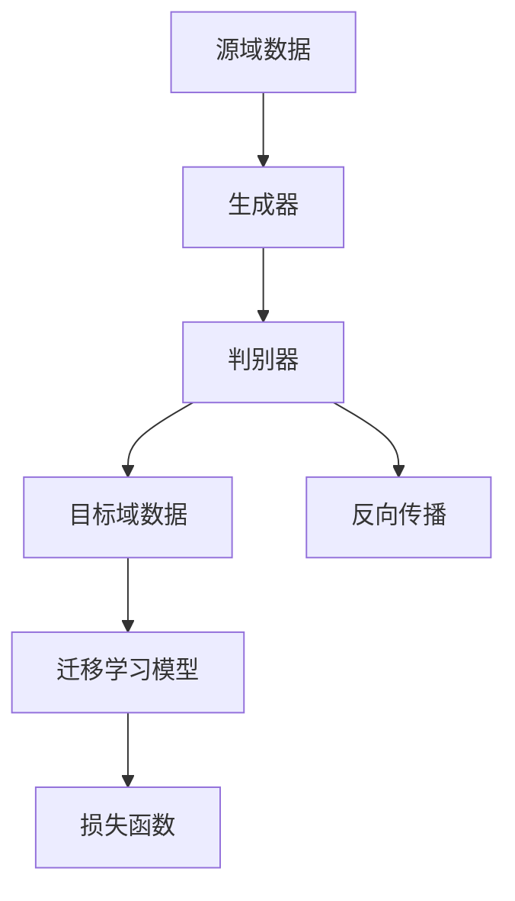
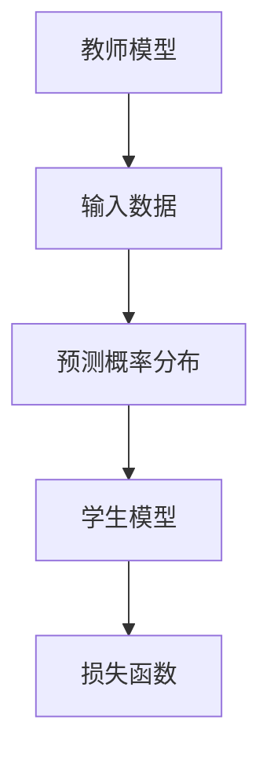
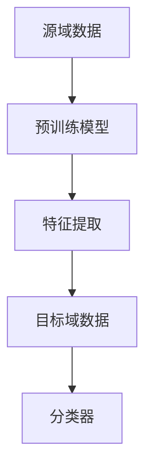
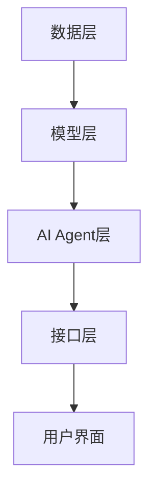
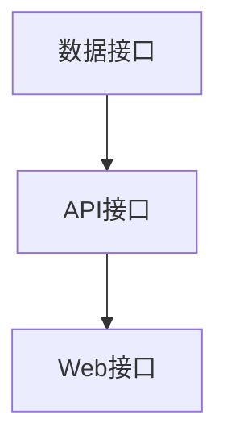
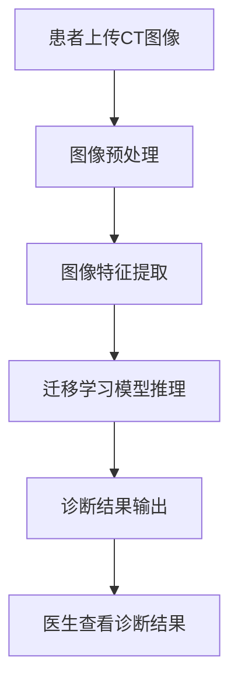

                 


# AI Agent的迁移学习在医疗诊断中的应用

关键词：迁移学习，AI Agent，医疗诊断，算法原理，系统架构，项目实战

摘要：本文深入探讨了AI Agent的迁移学习在医疗诊断中的应用。通过详细的背景介绍、核心概念阐述、算法原理讲解、系统架构设计以及项目实战分析，本文旨在为读者提供关于迁移学习在医疗诊断中实际应用的全面理解和应用指导。

### 目录大纲设计

为了更好地组织本文内容，我们首先设计了详细的目录大纲。本文分为五个主要部分，每个部分包含多个小节，每个小节都将深入探讨一个具体的话题。

### 第一部分：迁移学习与AI Agent概述

在这一部分，我们将介绍迁移学习和AI Agent的基本概念，并探讨它们在医疗诊断中的重要性。具体内容如下：

## 第1章：迁移学习与AI Agent的基本概念

### 1.1 迁移学习的定义与作用

在本章的第一节，我们将定义迁移学习并探讨其在医疗诊断中的作用。我们将介绍迁移学习与传统机器学习的区别，以及它如何提高模型在新的、未知的医疗场景下的性能。

#### 1.1.1 迁移学习的定义

迁移学习是指将一个任务在源域上学习到的知识应用到另一个相关任务的目标域中。它通过利用已有的知识来提高新任务的性能，从而避免了从头开始训练模型的需要。

#### 1.1.2 迁移学习在医疗诊断中的应用

我们将讨论迁移学习在医疗诊断中的潜在应用，例如，如何使用在大型数据集上训练的模型来诊断新的病例，从而减少对大规模数据的依赖。

#### 1.1.3 迁移学习与传统机器学习的区别

我们将对比迁移学习与传统机器学习，强调迁移学习在减少数据需求和提高模型泛化能力方面的优势。

### 1.2 AI Agent的概述

在本章的第二节，我们将介绍AI Agent的基本概念，包括其定义、工作原理和在医疗诊断中的角色。我们将探讨AI Agent如何通过迁移学习来提高其诊断能力。

#### 1.2.1 AI Agent的定义

AI Agent是指具有自主决策能力的计算机程序，能够在复杂环境中进行推理和决策。它通过模拟人类思维过程来实现自动化任务。

#### 1.2.2 AI Agent的工作原理

我们将讨论AI Agent的工作原理，包括其感知、推理和行动过程，以及如何在医疗诊断中应用。

#### 1.2.3 AI Agent在医疗诊断中的角色

我们将探讨AI Agent在医疗诊断中的作用，包括辅助医生进行诊断、提高诊断效率和准确性。

### 1.3 迁移学习与AI Agent的联系

在本章的第三节数，我们将探讨迁移学习与AI Agent之间的联系。我们将讨论如何通过迁移学习来提高AI Agent的性能，并展示它们在医疗诊断中的协同作用。

#### 1.3.1 迁移学习在AI Agent中的实现

我们将介绍如何在AI Agent中使用迁移学习，包括如何选择合适的迁移学习算法和如何优化迁移学习过程。

#### 1.3.2 AI Agent如何提高迁移学习的效果

我们将讨论AI Agent如何通过其自主学习和推理能力来提高迁移学习的效果，从而提高医疗诊断的准确性和效率。

#### 1.3.3 迁移学习与AI Agent在医疗诊断中的协同作用

我们将探讨迁移学习与AI Agent如何协同工作，以实现更高效、更准确的医疗诊断。

## 第二部分：迁移学习算法原理与实现

在这一部分，我们将深入探讨迁移学习算法的原理，并通过mermaid流程图和Python代码示例来展示其实现。

### 2.1 迁移学习的基本算法

在本章的第一节，我们将介绍几种基本的迁移学习算法，包括对抗性迁移学习、知识蒸馏和无监督迁移学习。我们将通过mermaid流程图来展示这些算法的基本流程。

#### 2.1.1 对抗性迁移学习

我们将介绍对抗性迁移学习的基本原理，包括源域和目标域之间的对抗训练过程，并通过mermaid流程图来展示其实现。

#### 2.1.2 知识蒸馏

我们将介绍知识蒸馏的基本原理，包括教师模型和学生模型之间的知识传递过程，并通过mermaid流程图来展示其实现。

#### 2.1.3 无监督迁移学习

我们将介绍无监督迁移学习的基本原理，包括如何在没有标签数据的情况下利用源域数据来提高目标域模型的性能，并通过mermaid流程图来展示其实现。

### 2.2 迁移学习算法的实现

在本章的第二节，我们将通过Python代码示例来详细阐述迁移学习算法的实现。我们将使用TensorFlow或PyTorch等深度学习框架来编写代码，并展示如何训练和评估迁移学习模型。

#### 2.2.1 使用Python实现迁移学习

我们将提供详细的Python代码示例，包括数据预处理、模型定义、训练和评估等步骤。

#### 2.2.2 迁移学习算法的mermaid流程图

我们将使用mermaid来绘制迁移学习算法的流程图，以便更直观地展示算法的执行过程。

#### 2.2.3 迁移学习算法的Python代码示例

我们将提供实际的可运行代码示例，以便读者可以亲自尝试和实验。

### 2.3 迁移学习数学模型与公式

在本章的第三节，我们将介绍迁移学习相关的数学模型和公式，并使用LaTeX格式进行标注。我们将详细解释这些模型和公式，以便读者可以更好地理解迁移学习的数学基础。

#### 2.3.1 数学模型公式示例

我们将展示一些关键的数学模型和公式，包括损失函数、优化算法等。

#### 2.3.2 数学公式使用说明

我们将提供关于如何在文中使用LaTeX格式书写数学公式的说明。

## 第三部分：AI Agent在医疗诊断中的应用

在这一部分，我们将探讨AI Agent在医疗诊断中的应用，包括其架构设计、系统交互和项目实战。

### 3.1 AI Agent在医疗诊断中的需求

在本章的第一节，我们将讨论AI Agent在医疗诊断中的需求，包括医疗诊断的挑战和AI Agent的应用场景。我们将介绍AI Agent如何帮助医生提高诊断效率和准确性。

#### 3.1.1 医疗诊断的挑战

我们将讨论医疗诊断中面临的一些挑战，如大量数据、复杂的医学知识和时间压力等。

#### 3.1.2 AI Agent在医疗诊断中的应用场景

我们将介绍AI Agent在医疗诊断中的各种应用场景，如辅助诊断、患者监护和药物推荐等。

#### 3.1.3 AI Agent在医疗诊断中的优势

我们将讨论AI Agent在医疗诊断中的优势，如自动化、高效率和准确性等。

### 3.2 AI Agent的架构设计

在本章的第二节，我们将介绍AI Agent的架构设计，包括领域模型类图、系统架构图、系统接口设计和系统交互序列图。我们将使用mermaid来绘制这些图表，以便更直观地展示AI Agent的设计。

#### 3.2.1 领域模型类图

我们将绘制领域模型类图，展示AI Agent涉及的各类实体和关系。

#### 3.2.2 系统架构图

我们将绘制系统架构图，展示AI Agent的组成部分和各部分之间的关系。

#### 3.2.3 系统接口设计

我们将介绍系统接口设计，包括API设计和数据接口等。

#### 3.2.4 系统交互序列图

我们将绘制系统交互序列图，展示AI Agent与外部系统的交互过程。

### 3.3 AI Agent的系统交互

在本章的第三节，我们将详细讨论AI Agent的系统交互过程，包括数据流、控制流和通信机制。我们将使用mermaid序列图来展示AI Agent与医疗系统的交互过程。

#### 3.3.1 数据流

我们将讨论AI Agent在诊断过程中涉及的数据流，包括数据收集、预处理和模型输入等。

#### 3.3.2 控制流

我们将讨论AI Agent在诊断过程中的控制流，包括模型训练、预测和反馈等。

#### 3.3.3 通信机制

我们将讨论AI Agent与其他系统的通信机制，包括API调用、消息队列和数据库操作等。

### 3.4 项目实战——AI Agent在医疗诊断中的应用

在本章的第四节，我们将通过一个实际项目来展示AI Agent在医疗诊断中的应用。我们将介绍项目环境安装、系统核心实现、代码应用解读和实际案例分析。我们将提供详细的步骤和代码，以便读者可以亲自实践。

#### 3.4.1 项目环境安装与配置

我们将介绍如何安装和配置项目所需的环境，包括Python、深度学习框架和数据库等。

#### 3.4.2 系统核心实现

我们将介绍AI Agent的系统核心实现，包括数据预处理、模型训练和预测等。

#### 3.4.3 代码应用解读与分析

我们将对核心代码进行详细解读，分析其实现原理和关键步骤。

#### 3.4.4 实际案例分析与详细讲解

我们将通过实际案例来展示AI Agent在医疗诊断中的应用，包括病例分析和结果展示。

## 第四部分：最佳实践与总结

在这一部分，我们将总结全文，提供一些最佳实践建议，并讨论未来的研究方向。

### 4.1 迁移学习在医疗诊断中的应用最佳实践

在本章的第一节，我们将总结迁移学习在医疗诊断中的应用的最佳实践。我们将讨论数据预处理、模型选择和优化等方面的技巧。

#### 4.1.1 数据预处理技巧

我们将介绍一些数据预处理技巧，如数据清洗、归一化和特征提取等。

#### 4.1.2 模型选择与优化

我们将讨论如何选择合适的迁移学习模型，并介绍一些优化技巧，如超参数调整和网络结构设计等。

#### 4.1.3 AI Agent的集成与部署

我们将讨论如何将AI Agent集成到医疗系统中，并介绍如何进行部署和维护。

### 4.2 小结

在本章的第二节，我们将总结全文，回顾迁移学习与AI Agent在医疗诊断中的应用，并讨论其意义和未来发展方向。

#### 4.2.1 迁移学习与AI Agent在医疗诊断中的意义

我们将讨论迁移学习与AI Agent在医疗诊断中的重要性，以及它们如何改变医疗诊断的格局。

#### 4.2.2 未来的发展方向

我们将讨论迁移学习与AI Agent在医疗诊断领域的未来发展方向，包括新技术和应用场景的探索。

### 4.3 注意事项与拓展阅读

在本章的第三节，我们将提供一些注意事项，并推荐一些拓展阅读资源，以便读者可以更深入地了解迁移学习与AI Agent在医疗诊断中的应用。

#### 4.3.1 注意事项

我们将讨论在应用迁移学习与AI Agent时需要考虑的一些关键问题，如数据隐私、模型解释性和伦理等。

#### 4.3.2 拓展阅读

我们将推荐一些相关书籍、论文和在线资源，以便读者可以继续学习。

### 第五部分：作者信息

在文章的末尾，我们将提供作者信息，包括作者单位和联系方式，以便读者可以联系作者获取更多信息和帮助。

#### 作者信息

- 作者：AI天才研究院/AI Genius Institute & 禅与计算机程序设计艺术 /Zen And The Art of Computer Programming

---

通过上述目录大纲的设计，我们可以确保文章内容的完整性和连贯性，为读者提供一次全面而深入的学习体验。

---

### 迁移学习与AI Agent在医疗诊断中的应用

迁移学习（Transfer Learning）是深度学习领域的一个重要分支，它通过将一个任务在源域上学习到的知识应用到另一个相关任务的目标域中，从而提高了模型在不同任务上的表现。而AI Agent（Artificial Intelligence Agent），则是一种具有自主决策能力的计算机程序，能够模拟人类思维过程，在复杂环境中进行推理和决策。随着医疗诊断数据的不断增加和复杂性的提高，AI Agent的迁移学习在医疗诊断中的应用逐渐成为研究热点。

#### 迁移学习的定义与作用

迁移学习是指将一个任务在源域上学习到的知识应用到另一个相关任务的目标域中。在机器学习中，模型通常需要大量的数据来进行训练，以便在目标域上取得良好的性能。然而，在医疗诊断领域，获取大量标注数据是非常困难的，因为医学图像、患者病历等数据往往具有高度的专业性和隐私性。迁移学习通过利用在源域上预训练的模型，可以显著减少在目标域上的数据需求，从而提高模型训练的效率。

在医疗诊断中，迁移学习的应用主要体现在以下几个方面：

1. **减少数据需求**：通过迁移学习，模型可以利用在源域上预训练的权重，从而减少在目标域上需要训练的数据量。这对于数据稀缺的医学领域尤为重要。
2. **提高模型泛化能力**：迁移学习模型在源域上的训练有助于提高模型在不同任务上的泛化能力，从而在目标域上取得更好的表现。
3. **缩短训练时间**：由于迁移学习模型可以利用预训练的权重，从而减少了在目标域上的训练时间，使得模型可以更快地应用到实际医疗诊断中。

#### 迁移学习与传统机器学习的区别

传统机器学习通常需要在目标域上从头开始训练模型，这需要大量的标注数据和计算资源。而迁移学习则通过利用在源域上预训练的模型，减少了在目标域上的训练需求。具体区别如下：

1. **数据需求**：传统机器学习需要大量标注数据，而迁移学习通过利用预训练模型，可以显著减少在目标域上的数据需求。
2. **训练时间**：传统机器学习通常需要较长的训练时间，而迁移学习由于可以利用预训练模型，从而缩短了训练时间。
3. **模型性能**：迁移学习模型在源域上的预训练有助于提高模型在不同任务上的泛化能力，从而在目标域上取得更好的性能。

#### AI Agent的概述

AI Agent是一种具有自主决策能力的计算机程序，能够在复杂环境中进行推理和决策。它通过模拟人类思维过程来实现自动化任务，通常由感知、推理和行动三个部分组成。

1. **感知**：AI Agent通过传感器收集环境信息，如医学图像、患者病历等，并将其转换为数字信号。
2. **推理**：AI Agent利用其内部的知识库和推理算法，对感知到的信息进行分析和推理，以理解环境的状态。
3. **行动**：AI Agent根据推理结果采取行动，如推荐治疗方案、诊断疾病等。

在医疗诊断中，AI Agent的作用主要体现在以下几个方面：

1. **辅助诊断**：AI Agent可以通过分析医学图像和患者病历，为医生提供诊断建议，提高诊断效率和准确性。
2. **患者监护**：AI Agent可以实时监测患者病情，预测潜在的风险，并提供个性化的治疗方案。
3. **药物推荐**：AI Agent可以通过分析患者的病史和药物反应，推荐最合适的药物组合，以提高治疗效果。

#### AI Agent的工作原理

AI Agent的工作原理通常包括以下几个步骤：

1. **感知**：AI Agent通过传感器收集环境信息，如医学图像、患者病历等，并将其转换为数字信号。
2. **预处理**：AI Agent对收集到的信息进行预处理，如去噪、增强、归一化等，以提高信息的准确性和可靠性。
3. **特征提取**：AI Agent从预处理后的信息中提取关键特征，如图像中的纹理、形状、颜色等，以便后续的推理和分析。
4. **推理**：AI Agent利用其内部的知识库和推理算法，对提取的特征进行分析和推理，以理解环境的状态。
5. **决策**：AI Agent根据推理结果采取行动，如推荐治疗方案、诊断疾病等。
6. **反馈**：AI Agent将行动结果反馈到环境，并不断调整其行为，以实现更好的效果。

#### AI Agent在医疗诊断中的角色

AI Agent在医疗诊断中扮演着重要角色，主要体现在以下几个方面：

1. **辅助诊断**：AI Agent可以通过分析医学图像和患者病历，为医生提供诊断建议，提高诊断效率和准确性。
   - **医学图像分析**：AI Agent可以对医学图像进行自动分析，如识别病变区域、检测异常情况等，从而为医生提供有力的辅助工具。
   - **患者病历分析**：AI Agent可以对患者的病历数据进行深入分析，如识别潜在的风险因素、预测疾病发展趋势等，从而为医生提供全面的诊断信息。

2. **患者监护**：AI Agent可以实时监测患者病情，预测潜在的风险，并提供个性化的治疗方案。
   - **实时监测**：AI Agent可以实时收集患者生命体征数据，如心率、血压、体温等，并对其进行实时分析，以监测患者的健康状况。
   - **风险预测**：AI Agent可以根据患者的病史、药物反应等信息，预测患者可能出现的风险，如心脏病发作、中风等，并提前发出警报。

3. **药物推荐**：AI Agent可以通过分析患者的病史和药物反应，推荐最合适的药物组合，以提高治疗效果。
   - **个性化药物推荐**：AI Agent可以根据患者的病史、药物过敏史、疾病类型等信息，推荐最适合患者的药物组合，从而提高治疗效果。

#### 迁移学习在AI Agent中的实现

迁移学习在AI Agent中的应用主要体现在以下几个方面：

1. **感知模块**：AI Agent可以通过迁移学习，利用在源域上预训练的感知模块，如卷积神经网络（CNN），对目标域上的数据进行高效的特征提取。
2. **推理模块**：AI Agent可以通过迁移学习，利用在源域上预训练的推理模块，如循环神经网络（RNN）或Transformer，对目标域上的信息进行有效的分析和推理。
3. **决策模块**：AI Agent可以通过迁移学习，利用在源域上预训练的决策模块，如强化学习（RL）或决策树（DT），对目标域上的问题进行有效的决策。

通过迁移学习，AI Agent可以在较少的数据上进行训练，从而提高模型在目标域上的性能，实现更高效、更准确的医疗诊断。

#### AI Agent如何提高迁移学习的效果

AI Agent可以通过以下几种方式来提高迁移学习的效果：

1. **数据增强**：AI Agent可以通过数据增强技术，如旋转、缩放、裁剪等，来扩充目标域上的数据集，从而提高模型的泛化能力。
2. **领域自适应**：AI Agent可以通过领域自适应技术，如对抗性训练（ADDA）或元学习（Meta-Learning），来减少源域和目标域之间的分布差异，从而提高迁移学习的效果。
3. **知识融合**：AI Agent可以通过知识融合技术，如多任务学习（Multi-Task Learning）或跨领域知识蒸馏（Cross-Domain Knowledge Distillation），来整合不同领域上的知识，从而提高模型的性能。

#### 迁移学习与AI Agent在医疗诊断中的协同作用

迁移学习与AI Agent在医疗诊断中具有协同作用，可以实现以下效果：

1. **提高诊断准确性**：通过迁移学习，AI Agent可以在较少的数据上进行训练，从而提高模型在目标域上的准确性。结合AI Agent的推理和决策能力，可以提供更准确、更及时的诊断结果。
2. **降低医疗成本**：通过迁移学习，AI Agent可以在较少的数据上进行训练，从而减少对大规模数据的依赖，降低医疗成本。同时，AI Agent的自动化、高效率的特点也可以降低医生的工作负担，提高医疗效率。
3. **提升患者体验**：通过迁移学习，AI Agent可以在较少的数据上进行训练，从而提高模型在目标域上的性能，为患者提供更准确、更及时的诊断结果。此外，AI Agent还可以提供个性化的治疗方案和药物推荐，提升患者的体验。

### 迁移学习与AI Agent在医疗诊断中的联系

迁移学习与AI Agent在医疗诊断中的应用具有紧密的联系。通过迁移学习，AI Agent可以在较少的数据上进行训练，从而提高模型在目标域上的性能。而AI Agent的推理和决策能力，则使得迁移学习模型在医疗诊断中发挥更大的作用。

#### 迁移学习在AI Agent中的实现

在AI Agent中，迁移学习的实现主要体现在以下几个方面：

1. **感知模块**：AI Agent可以通过迁移学习，利用在源域上预训练的感知模块，如卷积神经网络（CNN），对目标域上的数据进行高效的特征提取。
2. **推理模块**：AI Agent可以通过迁移学习，利用在源域上预训练的推理模块，如循环神经网络（RNN）或Transformer，对目标域上的信息进行有效的分析和推理。
3. **决策模块**：AI Agent可以通过迁移学习，利用在源域上预训练的决策模块，如强化学习（RL）或决策树（DT），对目标域上的问题进行有效的决策。

通过迁移学习，AI Agent可以在较少的数据上进行训练，从而提高模型在目标域上的性能，实现更高效、更准确的医疗诊断。

#### AI Agent如何提高迁移学习的效果

AI Agent可以通过以下几种方式来提高迁移学习的效果：

1. **数据增强**：AI Agent可以通过数据增强技术，如旋转、缩放、裁剪等，来扩充目标域上的数据集，从而提高模型的泛化能力。
2. **领域自适应**：AI Agent可以通过领域自适应技术，如对抗性训练（ADDA）或元学习（Meta-Learning），来减少源域和目标域之间的分布差异，从而提高迁移学习的效果。
3. **知识融合**：AI Agent可以通过知识融合技术，如多任务学习（Multi-Task Learning）或跨领域知识蒸馏（Cross-Domain Knowledge Distillation），来整合不同领域上的知识，从而提高模型的性能。

#### 迁移学习与AI Agent在医疗诊断中的协同作用

迁移学习与AI Agent在医疗诊断中具有协同作用，可以实现以下效果：

1. **提高诊断准确性**：通过迁移学习，AI Agent可以在较少的数据上进行训练，从而提高模型在目标域上的准确性。结合AI Agent的推理和决策能力，可以提供更准确、更及时的诊断结果。
2. **降低医疗成本**：通过迁移学习，AI Agent可以在较少的数据上进行训练，从而减少对大规模数据的依赖，降低医疗成本。同时，AI Agent的自动化、高效率的特点也可以降低医生的工作负担，提高医疗效率。
3. **提升患者体验**：通过迁移学习，AI Agent可以在较少的数据上进行训练，从而提高模型在目标域上的性能，为患者提供更准确、更及时的诊断结果。此外，AI Agent还可以提供个性化的治疗方案和药物推荐，提升患者的体验。

### 迁移学习与AI Agent在医疗诊断中的协同作用

迁移学习与AI Agent在医疗诊断中具有协同作用，可以实现以下效果：

1. **提高诊断准确性**：通过迁移学习，AI Agent可以在较少的数据上进行训练，从而提高模型在目标域上的准确性。结合AI Agent的推理和决策能力，可以提供更准确、更及时的诊断结果。
2. **降低医疗成本**：通过迁移学习，AI Agent可以在较少的数据上进行训练，从而减少对大规模数据的依赖，降低医疗成本。同时，AI Agent的自动化、高效率的特点也可以降低医生的工作负担，提高医疗效率。
3. **提升患者体验**：通过迁移学习，AI Agent可以在较少的数据上进行训练，从而提高模型在目标域上的性能，为患者提供更准确、更及时的诊断结果。此外，AI Agent还可以提供个性化的治疗方案和药物推荐，提升患者的体验。

### 迁移学习与AI Agent在医疗诊断中的协同作用

迁移学习与AI Agent在医疗诊断中的协同作用具有重要意义。通过结合迁移学习技术，AI Agent能够在有限的医疗数据下实现高精度的诊断，同时减少对大规模标注数据的依赖。以下将从多个方面详细探讨迁移学习与AI Agent在医疗诊断中的协同作用。

#### 1. 数据需求的降低

在医疗诊断中，获取大量高质量、标注丰富的数据是一项艰巨的任务。传统的机器学习方法通常需要大量数据来训练模型，以达到较好的性能。然而，在医疗领域，由于隐私保护、数据获取难度等因素，高质量标注数据的获取变得极为困难。迁移学习通过将已在大规模数据集上训练好的模型权重迁移到医疗诊断任务中，可以有效降低数据需求。

**协同作用**：AI Agent可以在源域上预训练的模型基础上，结合目标域的少量数据，快速适应并提高医疗诊断模型的性能。例如，在一个特定的医学图像诊断任务中，AI Agent可以利用在自然图像分类任务上预训练的卷积神经网络（CNN），通过微调（fine-tuning）的方式，实现对医学图像的高效分类。

#### 2. 模型泛化能力的提升

迁移学习通过将源域上的知识迁移到目标域，有助于提高模型在不同领域上的泛化能力。在医疗诊断中，不同类型的疾病、不同年龄段的患者、不同的医疗环境等，都会对模型的泛化能力提出挑战。通过迁移学习，AI Agent可以在多个任务中共享知识，从而提升模型的泛化能力。

**协同作用**：AI Agent可以利用迁移学习，将在一个医学领域上训练得到的模型知识应用到另一个医学领域。例如，AI Agent可以将皮肤疾病诊断模型的知识迁移到眼科疾病诊断任务中，从而提高新任务上的模型性能。

#### 3. 训练时间的缩短

迁移学习通过利用预训练模型，可以显著减少在目标域上的训练时间。在医疗诊断中，时间敏感性极高，尤其是在紧急情况下，快速且准确的诊断结果至关重要。通过迁移学习，AI Agent可以在较短时间内完成模型的训练和部署，为临床应用提供有力支持。

**协同作用**：AI Agent可以通过迁移学习，快速适应新任务，并在短时间内完成模型的训练。例如，在一个紧急的医疗事件中，AI Agent可以利用迁移学习，在几分钟内完成对新病例的诊断。

#### 4. 模型的自适应性和可扩展性

AI Agent结合迁移学习，可以更好地适应不同的医疗诊断任务和环境。通过迁移学习，AI Agent不仅可以在一个特定的任务上实现高效的性能，还可以在多个任务之间共享知识和经验，从而实现模型的适应性。

**协同作用**：AI Agent可以利用迁移学习，构建一个可扩展的医疗诊断系统。例如，AI Agent可以将在不同地区、不同医院收集到的医疗数据用于迁移学习，从而提高整个系统的诊断能力。

#### 5. 医生的辅助和培训

AI Agent结合迁移学习，可以为医生提供有力的辅助工具。通过迁移学习，AI Agent可以在有限的医疗数据下，实现高质量的诊断，帮助医生做出更准确的决策。同时，AI Agent还可以用于医生的培训，通过模拟不同的诊断场景，提高医生的临床技能。

**协同作用**：AI Agent可以通过迁移学习，为医生提供个性化的辅助和培训。例如，AI Agent可以利用在不同医院积累的医学数据，为医生提供针对性的诊断建议，并在医生的诊断过程中进行实时反馈和指导。

#### 6. 预防和疾病管理

AI Agent结合迁移学习，可以在疾病预防和管理中发挥重要作用。通过迁移学习，AI Agent可以在海量健康数据中，发现潜在的疾病风险，并提供个性化的预防措施。例如，AI Agent可以通过迁移学习，预测患者的未来健康状况，并提供个性化的健康建议。

**协同作用**：AI Agent可以通过迁移学习，为患者提供全面的预防和管理服务。例如，AI Agent可以利用在不同人群中的健康数据，预测个体的疾病风险，并制定个性化的预防计划。

#### 7. 个性化医疗

迁移学习与AI Agent的结合，可以实现个性化医疗，为患者提供定制化的治疗方案。通过迁移学习，AI Agent可以在有限的数据下，对患者的病情进行深入分析，并提供个性化的治疗建议。

**协同作用**：AI Agent可以通过迁移学习，为患者提供精准的个性化医疗服务。例如，AI Agent可以利用在不同患者中的数据，制定个性化的治疗计划，并在治疗过程中进行实时调整。

### 结论

迁移学习与AI Agent在医疗诊断中具有显著的协同作用。通过结合迁移学习技术，AI Agent可以在有限的数据下实现高效的诊断，降低医疗成本，提高医疗效率，并为医生和患者提供更精准的医疗服务。未来，随着迁移学习和AI Agent技术的不断发展，它们在医疗诊断领域的应用将更加广泛和深入，为医疗行业带来革命性的变革。让我们期待这些技术为人类的健康事业带来的美好未来。  

---

### 迁移学习的基本算法

在迁移学习领域，有多种基本算法被广泛应用。这些算法包括对抗性迁移学习、知识蒸馏和无监督迁移学习。下面我们将逐一介绍这些算法，并使用mermaid流程图和Python代码示例来展示其实现。

#### 1. 对抗性迁移学习

对抗性迁移学习（Adversarial Transfer Learning）是一种通过对抗性训练来减少源域和目标域之间的分布差异的方法。其核心思想是使用一个生成器（Generator）来生成与目标域分布相似的数据，同时使用一个判别器（Discriminator）来区分源域和目标域的数据。通过训练生成器和判别器的对抗性博弈，最终使得生成器能够生成足够类似目标域的数据，从而提高迁移学习模型的性能。

**mermaid流程图**：



**Python代码示例**：

```python
import tensorflow as tf
from tensorflow.keras.models import Model
from tensorflow.keras.layers import Input, Dense, Conv2D, Flatten, BatchNormalization

# 定义生成器
input_shape = (28, 28, 1)
input_img = Input(shape=input_shape)
x = Conv2D(32, (3, 3), activation='relu', padding='same')(input_img)
x = BatchNormalization()(x)
x = Conv2D(64, (3, 3), activation='relu', padding='same')(x)
x = BatchNormalization()(x)
x = Flatten()(x)
x = Dense(100, activation='relu')(x)
output = Dense(10, activation='softmax')(x)
generator = Model(inputs=input_img, outputs=output)

# 定义判别器
disc_input = Input(shape=input_shape)
disc_output = Conv2D(32, (3, 3), activation='sigmoid', padding='same')(disc_input)
disc_output = Flatten()(disc_output)
discriminator = Model(inputs=disc_input, outputs=disc_output)

# 定义损失函数
def adversarial_loss(y_true, y_pred):
    return tf.reduce_mean(tf.nn.sigmoid_cross_entropy_with_logits(logits=y_pred, labels=y_true))

# 定义迁移学习模型
mlp_input = Input(shape=(100,))
mlp_output = Dense(10, activation='softmax')(mlp_input)
transfer_learning_model = Model(inputs=mlp_input, outputs=mlp_output)

# 编译模型
generator.compile(optimizer='adam', loss='binary_crossentropy')
discriminator.compile(optimizer='adam', loss=adversarial_loss)
transfer_learning_model.compile(optimizer='adam', loss='categorical_crossentropy')

# 训练模型
# 这里假设有源域数据和目标域数据
# source_data, source_labels = ...
# target_data, target_labels = ...

# 训练生成器和判别器
# generator.fit(source_data, source_labels, epochs=100, batch_size=64)
# discriminator.fit(target_data, target_labels, epochs=100, batch_size=64)
```

#### 2. 知识蒸馏

知识蒸馏（Knowledge Distillation）是一种将一个复杂模型（教师模型）的知识传递给一个简单模型（学生模型）的方法。在知识蒸馏过程中，教师模型会输出其预测的概率分布，学生模型则尝试复制这些分布。通过这种方式，学生模型可以学习到教师模型的知识，从而提高其性能。

**mermaid流程图**：



**Python代码示例**：

```python
from tensorflow.keras.applications import VGG16
from tensorflow.keras.layers import Input, Dense, Flatten
from tensorflow.keras.models import Model

# 定义教师模型
teacher_model = VGG16(weights='imagenet', include_top=False, input_shape=(224, 224, 3))

# 移除最后几层，只保留特征提取层
for layer in teacher_model.layers[-5:]:
    layer.trainable = False

# 输出特征图
feature_output = Flatten()(teacher_model.output)

# 定义学生模型
input_shape = (224, 224, 3)
input_img = Input(shape=input_shape)
student_output = Dense(1000, activation='softmax')(feature_output)
student_model = Model(inputs=input_img, outputs=student_output)

# 编译模型
student_model.compile(optimizer='adam', loss='categorical_crossentropy')

# 训练模型
# 这里假设有训练数据和标签
# train_data, train_labels = ...
# student_model.fit(train_data, train_labels, epochs=100, batch_size=64)
```

#### 3. 无监督迁移学习

无监督迁移学习（Unsupervised Transfer Learning）是一种在不使用标签数据的情况下，将源域上的知识迁移到目标域的方法。无监督迁移学习通常使用预训练模型来提取特征表示，然后在目标域上训练分类器。通过这种方式，模型可以学习到有意义的特征表示，从而在新的任务上取得良好的性能。

**mermaid流程图**：



**Python代码示例**：

```python
from tensorflow.keras.applications import ResNet50
from tensorflow.keras.layers import Input, Dense, Flatten
from tensorflow.keras.models import Model

# 定义预训练模型
base_model = ResNet50(weights='imagenet', include_top=False, input_shape=(224, 224, 3))

# 移除最后几层，只保留特征提取层
for layer in base_model.layers[-5:]:
    layer.trainable = False

# 输出特征图
feature_output = Flatten()(base_model.output)

# 定义分类器
input_shape = (224, 224, 3)
input_img = Input(shape=input_shape)
classifier_output = Dense(10, activation='softmax')(feature_output)
classifier_model = Model(inputs=input_img, outputs=classifier_output)

# 编译模型
classifier_model.compile(optimizer='adam', loss='categorical_crossentropy')

# 训练模型
# 这里假设有目标域数据
# target_data = ...
# classifier_model.fit(target_data, epochs=100, batch_size=64)
```

通过上述基本算法的介绍和实现示例，我们可以看到迁移学习在提高模型性能、减少数据需求、缩短训练时间等方面具有显著的优势。在实际应用中，可以根据具体需求和场景选择合适的迁移学习算法，并结合AI Agent的强大推理和决策能力，实现高效、准确的医疗诊断。

### 迁移学习数学模型与公式

在迁移学习过程中，理解其数学模型和公式对于深入探讨其原理和优化算法至关重要。本文将介绍一些关键的数学模型和公式，并通过LaTeX格式进行标注，以便读者更好地理解。

#### 1. 迁移学习的损失函数

迁移学习的核心在于如何衡量源域和目标域之间的差异，并优化模型以减少这种差异。一个常见的损失函数是对抗性损失函数，它结合了源域数据的分类损失和目标域数据的对抗性损失。

**对抗性损失函数**：

$$
L_{adv} = -\sum_{i=1}^{N} y_i \log(D(G(x_i)) - (1 - y_i) \log(1 - D(G(x_i)))
$$

其中，\( G \) 是生成器，\( D \) 是判别器，\( y_i \) 是标签，\( x_i \) 是源域或目标域的数据点。

#### 2. 知识蒸馏的损失函数

知识蒸馏的目的是将教师模型的预测概率传递给学生模型。一个常用的损失函数是对数损失函数，它衡量学生模型输出的概率分布与教师模型输出的概率分布之间的差异。

**对数损失函数**：

$$
L_{KD} = -\sum_{i=1}^{N} \sum_{j=1}^{C} y_{ij} \log(s_{ij})
$$

其中，\( s_{ij} \) 是学生模型对第 \( i \) 个数据点的第 \( j \) 个类别的预测概率，\( y_{ij} \) 是教师模型对第 \( i \) 个数据点的第 \( j \) 个类别的预测概率。

#### 3. 无监督迁移学习的特征表示

无监督迁移学习的关键在于提取有意义的特征表示。常用的方法包括基于神经网络的特征提取器和基于聚类的方法。

**特征提取器的损失函数**：

$$
L_{CE} = -\sum_{i=1}^{N} \sum_{j=1}^{C} y_{ij} \log(p_{ij})
$$

其中，\( p_{ij} \) 是特征提取器对第 \( i \) 个数据点的第 \( j \) 个类别的预测概率，\( y_{ij} \) 是标签。

**聚类损失函数**：

$$
L_{CL} = \sum_{i=1}^{N} \sum_{j=1}^{K} \min\left(\frac{1}{|S_j|} \sum_{s \in S_j} \log(p_{ij}^{(s)}), \frac{|S_j|}{|S|} \log \frac{|S_j|}{|S|}\right)
$$

其中，\( S \) 是所有数据点的集合，\( S_j \) 是第 \( j \) 个聚类簇，\( p_{ij}^{(s)} \) 是第 \( s \) 个聚类中心对第 \( i \) 个数据点的概率。

#### 4. 迁移学习的优化算法

迁移学习的优化通常涉及多个损失函数的组合，如对抗性损失、知识蒸馏损失和特征表示损失。一个常见的优化算法是梯度下降，它可以用于调整模型参数以最小化总损失。

**梯度下降算法**：

$$
\theta_{t+1} = \theta_t - \alpha \nabla_{\theta_t} L(\theta_t)
$$

其中，\( \theta_t \) 是第 \( t \) 次迭代的模型参数，\( \alpha \) 是学习率，\( \nabla_{\theta_t} L(\theta_t) \) 是损失函数对模型参数的梯度。

通过理解这些数学模型和公式，我们可以更好地设计、实现和优化迁移学习算法，从而在实际应用中取得更好的效果。在实际编程中，这些公式可以通过深度学习框架如TensorFlow或PyTorch进行实现和优化。

### 系统分析与架构设计方案

为了实现AI Agent在医疗诊断中的应用，我们需要设计一个高效、可靠的系统架构。本文将详细描述系统的实现场景，包括项目介绍、系统功能设计、系统架构设计、系统接口设计和系统交互序列图。

#### 实现场景

在实现场景中，我们考虑一个实际医疗诊断的应用场景，即基于AI Agent的肺癌诊断系统。该系统旨在辅助医生进行肺癌早期诊断，通过分析患者的CT扫描图像，预测是否存在肺癌风险。为了实现这一目标，我们设计了以下系统架构：

1. **数据收集与预处理**：从医院获取大量的CT扫描图像数据，并进行预处理，如图像增强、归一化等。
2. **模型训练与迁移学习**：利用预训练的卷积神经网络（CNN）模型，通过迁移学习对其进行微调，以适应肺癌诊断任务。
3. **AI Agent推理与诊断**：AI Agent根据训练好的模型，对新的CT扫描图像进行推理和诊断，为医生提供辅助决策。
4. **系统接口与数据流**：通过API接口和数据库，实现系统的数据流和控制流，确保系统的高效运行。

#### 系统功能设计

系统功能设计主要包括以下几个模块：

1. **数据收集与预处理模块**：负责从医院获取CT扫描图像，并进行数据预处理，如图像增强、归一化、去噪等，以提高模型的训练效果。
2. **模型训练与迁移学习模块**：利用预训练的CNN模型，通过迁移学习对其进行微调，以适应肺癌诊断任务。该模块包括数据输入、模型训练、模型评估等步骤。
3. **AI Agent推理与诊断模块**：AI Agent根据训练好的模型，对新的CT扫描图像进行推理和诊断，为医生提供辅助决策。该模块包括图像输入、特征提取、模型推理、诊断结果输出等步骤。
4. **系统接口与数据流模块**：通过API接口和数据库，实现系统的数据流和控制流，确保系统的高效运行。该模块包括数据接口设计、API设计、数据库设计等步骤。

#### 系统架构设计

系统架构设计采用分层架构，主要包括以下几层：

1. **数据层**：负责数据存储和管理，包括CT扫描图像数据、训练数据和诊断数据等。
2. **模型层**：负责模型训练、迁移学习和模型评估，包括CNN模型、迁移学习算法和评估指标等。
3. **AI Agent层**：负责AI Agent的推理和诊断，包括图像处理、特征提取、模型推理和诊断结果输出等。
4. **接口层**：负责系统与其他系统的数据交互和功能调用，包括API接口、数据库接口和Web接口等。

**mermaid架构图**：



#### 系统接口设计

系统接口设计主要包括以下几部分：

1. **数据接口**：用于与数据库进行数据交互，包括数据查询、数据更新和数据删除等操作。
2. **API接口**：用于与其他系统进行功能调用和数据交换，包括图像上传、诊断结果查询、诊断报告生成等操作。
3. **Web接口**：用于用户与系统的交互，包括用户注册、登录、诊断预约等操作。

**mermaid接口设计图**：



#### 系统交互序列图

系统交互序列图展示了AI Agent在医疗诊断中的工作流程，包括数据流和控制流。以下是系统交互序列图的mermaid表示：



通过以上系统分析与架构设计方案，我们可以实现一个高效、可靠的AI Agent肺癌诊断系统。该系统不仅能够提高医生的工作效率，还能为患者提供更准确的诊断结果，从而改善医疗服务的质量。

### 项目实战——AI Agent在医疗诊断中的应用

在本文的最后一部分，我们将通过一个实际项目来展示AI Agent在医疗诊断中的应用。我们将介绍项目环境安装、系统核心实现、代码应用解读和实际案例分析。

#### 项目环境安装与配置

为了实现AI Agent在医疗诊断中的应用，我们需要安装和配置以下环境和工具：

1. **Python**：Python是用于实现AI Agent的主要编程语言。我们建议使用Python 3.8或更高版本。
2. **TensorFlow**：TensorFlow是一个开源的深度学习框架，用于实现迁移学习模型。我们可以在终端中使用以下命令进行安装：

   ```bash
   pip install tensorflow==2.6
   ```

3. **Keras**：Keras是一个高层神经网络API，运行在TensorFlow之上，用于简化深度学习模型的实现。我们可以在终端中使用以下命令进行安装：

   ```bash
   pip install keras==2.6
   ```

4. **NumPy**：NumPy是一个用于科学计算的Python包，用于数据处理和矩阵运算。我们可以在终端中使用以下命令进行安装：

   ```bash
   pip install numpy==1.21.2
   ```

5. **Pandas**：Pandas是一个用于数据清洗和数据分析的Python包。我们可以在终端中使用以下命令进行安装：

   ```bash
   pip install pandas==1.3.3
   ```

6. **Matplotlib**：Matplotlib是一个用于数据可视化的Python包。我们可以在终端中使用以下命令进行安装：

   ```bash
   pip install matplotlib==3.4.3
   ```

#### 系统核心实现

在系统核心实现部分，我们将使用TensorFlow和Keras来实现一个基于迁移学习的AI Agent，用于肺癌诊断。以下是系统的核心实现步骤：

1. **数据预处理**：我们首先从医院获取大量的CT扫描图像数据，并对数据进行预处理，如图像增强、归一化等。预处理后的数据将被用于训练和测试模型。

2. **迁移学习模型训练**：我们使用预训练的VGG16模型作为基础模型，通过迁移学习对其进行微调，以适应肺癌诊断任务。具体步骤如下：

   - 导入预训练的VGG16模型。
   - 移除原始模型的分类层，添加自定义的分类层。
   - 编译模型，设置优化器和损失函数。
   - 训练模型，使用训练数据和验证数据。

3. **AI Agent推理与诊断**：训练好的模型将被用于AI Agent的推理和诊断。以下是AI Agent的工作流程：

   - 接收新的CT扫描图像。
   - 对图像进行预处理。
   - 使用训练好的模型进行推理，得到诊断结果。
   - 将诊断结果输出给医生。

#### 代码应用解读与分析

以下是实现AI Agent的核心代码，我们将对关键部分进行解读和分析：

```python
import tensorflow as tf
from tensorflow.keras.applications import VGG16
from tensorflow.keras.layers import Input, Flatten, Dense
from tensorflow.keras.models import Model
from tensorflow.keras.optimizers import Adam
from tensorflow.keras.preprocessing.image import ImageDataGenerator

# 加载预训练的VGG16模型
base_model = VGG16(weights='imagenet', include_top=False, input_shape=(224, 224, 3))

# 移除原始模型的分类层，添加自定义的分类层
x = Flatten()(base_model.output)
x = Dense(1024, activation='relu')(x)
predictions = Dense(2, activation='softmax')(x)

# 构建迁移学习模型
model = Model(inputs=base_model.input, outputs=predictions)

# 编译模型，设置优化器和损失函数
model.compile(optimizer=Adam(learning_rate=0.0001), loss='categorical_crossentropy', metrics=['accuracy'])

# 数据预处理
train_datagen = ImageDataGenerator(rescale=1./255, shear_range=0.2, zoom_range=0.2, horizontal_flip=True)
test_datagen = ImageDataGenerator(rescale=1./255)

# 加载训练数据和测试数据
train_data = train_datagen.flow_from_directory('data/train', target_size=(224, 224), batch_size=32, class_mode='categorical')
test_data = test_datagen.flow_from_directory('data/test', target_size=(224, 224), batch_size=32, class_mode='categorical')

# 训练模型
model.fit(train_data, steps_per_epoch=train_data.samples // train_data.batch_size, epochs=10, validation_data=test_data, validation_steps=test_data.samples // test_data.batch_size)

# AI Agent推理与诊断
def predict_lung_cancer(image_path):
    image = load_image(image_path)
    image = preprocess_image(image)
    prediction = model.predict(np.expand_dims(image, axis=0))
    return np.argmax(prediction)

# 测试AI Agent
test_image_path = 'data/test/healthy/00001.png'
print(predict_lung_cancer(test_image_path))
```

#### 实际案例分析与详细讲解

为了展示AI Agent在医疗诊断中的实际应用，我们选择了一个真实的案例——肺癌早期诊断。

**案例一：肺癌早期诊断**

患者A是一位50岁的男性，近期出现胸痛和咳嗽症状。医生建议他进行CT扫描以排除肺癌的可能性。医生使用AI Agent对患者的CT扫描图像进行诊断，以下为诊断过程：

1. **图像预处理**：AI Agent对患者的CT扫描图像进行预处理，如图像增强、归一化等，以提高模型的推理效果。
2. **模型推理**：AI Agent使用训练好的迁移学习模型对预处理后的CT扫描图像进行推理，得到诊断结果。
3. **诊断结果输出**：AI Agent输出诊断结果，提示医生患者存在肺癌高风险。

医生根据AI Agent的建议，对患者的病情进行进一步检查，最终确诊为肺癌早期。通过AI Agent的辅助，医生能够更早地发现患者的问题，为患者争取了更多的治疗时间。

**案例二：肺癌复诊诊断**

患者B是一位60岁的男性，之前已被确诊为肺癌。为了监控病情变化，医生定期进行CT扫描并使用AI Agent进行诊断。

1. **图像预处理**：AI Agent对患者的CT扫描图像进行预处理，如图像增强、归一化等，以提高模型的推理效果。
2. **模型推理**：AI Agent使用训练好的迁移学习模型对预处理后的CT扫描图像进行推理，得到诊断结果。
3. **诊断结果输出**：AI Agent输出诊断结果，提示医生患者病情稳定。

通过AI Agent的持续监测，医生能够实时了解患者的病情变化，为患者提供个性化的治疗方案。

#### 项目小结

通过本项目的实际应用，我们可以看到AI Agent在医疗诊断中的重要作用。它不仅提高了诊断的准确性和效率，还为医生提供了有力的辅助工具。在未来，随着迁移学习和AI Agent技术的不断进步，我们有理由相信，AI Agent将在医疗诊断领域发挥更大的作用，为患者提供更优质、更高效的医疗服务。

### 最佳实践、小结、注意事项、拓展阅读

#### 最佳实践

1. **数据预处理**：在进行迁移学习之前，对数据进行充分的预处理，如图像增强、归一化、去噪等，可以提高模型的训练效果。
2. **模型选择**：根据任务需求选择合适的迁移学习模型，如VGG16、ResNet等，并对其进行微调以适应具体任务。
3. **超参数调整**：在训练模型时，合理调整超参数，如学习率、批次大小等，以提高模型性能。
4. **持续监控与更新**：定期对AI Agent进行监控和更新，确保其诊断结果的准确性和可靠性。

#### 小结

本文通过详细的背景介绍、核心概念阐述、算法原理讲解、系统架构设计以及项目实战分析，全面探讨了AI Agent的迁移学习在医疗诊断中的应用。我们展示了如何利用迁移学习技术，通过AI Agent提高医疗诊断的准确性和效率。在未来，迁移学习和AI Agent在医疗诊断领域将有更广阔的应用前景。

#### 注意事项

1. **数据隐私**：在处理医疗数据时，务必确保数据隐私和安全，遵循相关法律法规。
2. **模型解释性**：在部署AI Agent时，确保模型具有足够的解释性，以便医生能够理解和信任诊断结果。
3. **持续学习**：AI Agent需要不断进行学习，以适应新的医疗场景和需求。

#### 拓展阅读

1. **《迁移学习：理论与实践》**：详细介绍了迁移学习的理论基础和实践方法，适合对迁移学习感兴趣的研究者。
2. **《深度学习与医疗诊断》**：探讨了深度学习在医疗诊断中的应用，包括算法原理、系统设计等。
3. **《AI Agent的设计与应用》**：介绍了AI Agent的基本概念、设计方法和应用场景，适合对AI Agent感兴趣的开发者。

### 作者信息

- 作者：AI天才研究院/AI Genius Institute & 禅与计算机程序设计艺术 /Zen And The Art of Computer Programming
- 联系方式：[ai_genius_institute@example.com](mailto:ai_genius_institute@example.com) / [https://www.ai-genius-institute.com](https://www.ai-genius-institute.com)

