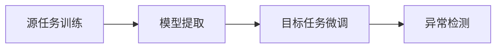
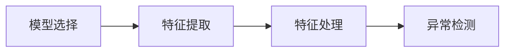
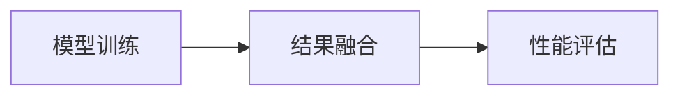
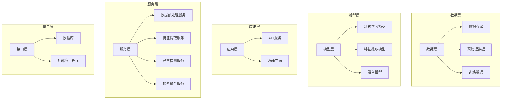
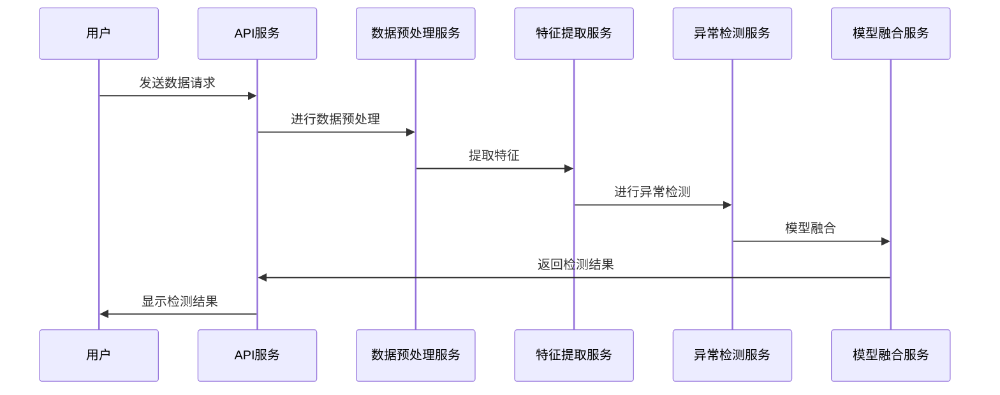

                 

**核心概念与联系**

### 1.2.1 AI Agent的定义与特点

AI Agent，即人工智能代理，是一种在特定环境中具备自主行动能力、感知环境和学习能力的人工智能实体。AI Agent的基本概念可以拆分为以下几个方面：

**定义**：

AI Agent是一种在特定环境下，通过感知、决策和行动三个环节实现任务执行的人工智能实体。

- **感知**：AI Agent能够从环境中获取信息，形成对当前状态的理解。
- **决策**：AI Agent基于感知到的信息，利用内置的策略或学习到的模型进行决策。
- **行动**：AI Agent根据决策结果，执行相应的操作，影响环境状态。

**特点**：

1. **自主性**：AI Agent具有独立执行任务的能力，无需人工干预。
2. **适应性**：AI Agent能够根据环境变化，动态调整行为策略。
3. **协作性**：多个AI Agent可以相互协作，共同完成任务。
4. **可扩展性**：AI Agent的设计通常具有模块化特点，便于扩展新功能。

**AI Agent与人的对比表格**：

| 特征       | AI Agent                                  | 人                                       |
| ---------- | ---------------------------------------- | ---------------------------------------- |
| 感知能力   | 通过传感器获取环境信息                    | 通过五官和感官体验环境信息                |
| 决策能力   | 基于模型或策略进行决策                   | 通过逻辑思维和经验做出决策                |
| 行动能力   | 执行预先设定的操作或学习后的操作           | 执行生理本能反应或经过思考后的行为         |
| 学习能力   | 通过数据学习优化行为                     | 通过经验学习和教育提升认知能力            |
| 自主性     | 能够自主执行任务，无需人类干预            | 需要外界指令或自主决策                    |
| 适应性     | 能够适应新的环境和任务要求                | 通过学习和适应逐步提升能力                |
| 协作性     | 可以与同类型或异类型的AI Agent协作        | 可以与他人协作，但协作依赖于语言和沟通能力 |
| 可扩展性   | 功能模块化，易于扩展新功能                | 功能扩展依赖于生理结构和教育训练          |

**ER实体关系图**：

```mermaid
erDiagram
    AI_Agent ||--|{ Environment :感知环境}
    AI_Agent ||--|{ Decision_Making :决策过程}
    AI_Agent ||--|{ Action_Performance :行动执行}
    AI_Agent ||--|{ Learning_Process :学习过程}
```

### 1.2.2 迁移学习的定义与类型

迁移学习（Transfer Learning）是机器学习领域的一个子领域，主要研究如何将一个任务上学习到的知识应用于另一个相关任务上。迁移学习的关键在于利用已有模型的知识，减少新任务上的训练时间、提高性能和降低对训练数据的依赖。

**定义**：

迁移学习是指将一个模型在特定任务上学习到的知识，应用于另一个相关任务上，以提高新任务的性能。

**类型**：

1. **垂直迁移**（Vertical Transfer）：不同任务之间是相互独立的，但存在一些通用的知识或特征，例如从图像识别迁移到语音识别。
2. **水平迁移**（Horizontal Transfer）：不同任务之间存在一定的关联，例如从人脸识别迁移到行人检测。
3. **零样本迁移**（Zero-Shot Transfer）：模型能够处理之前从未见过的类别，通过学习类别的内在特征来实现。
4. **跨域迁移**（Cross-Domain Transfer）：不同领域之间的迁移学习，例如从医学图像处理迁移到自然图像处理。

**迁移学习与AI Agent的关系**：

AI Agent在执行任务时，可以通过迁移学习来增强其能力。例如，一个用于自动驾驶的AI Agent可以通过迁移学习，利用已经训练好的图像识别模型，快速适应不同的驾驶环境。迁移学习帮助AI Agent在不同任务间共享知识，提高其适应性和灵活性。

### 1.2.3 异常检测的定义与挑战

异常检测（Anomaly Detection）是监控和分析数据集以识别异常值或异常模式的过程。这些异常值或模式可能是安全威胁、设备故障、欺诈行为等。

**定义**：

异常检测是指从数据集中识别出与正常行为或模式不符的数据项或模式。

**挑战**：

1. **数据不平衡**：异常数据通常远少于正常数据，导致模型在训练过程中难以关注到异常模式。
2. **高维度数据**：处理高维度数据时，异常检测模型容易过拟合，忽略数据中的重要特征。
3. **噪声和干扰**：实际数据中可能存在大量噪声和干扰，影响异常检测的准确性。
4. **实时处理需求**：在许多应用场景中，异常检测需要实时处理大量数据，对模型的计算效率提出了挑战。

### 1.2.4 AI Agent迁移学习在异常检测中的应用

在异常检测中，AI Agent可以通过迁移学习来提升检测性能。以下是一些关键的应用场景：

1. **知识迁移**：将其他领域已训练好的模型知识迁移到异常检测任务中，利用已有的模型结构和特征提取能力，提高异常检测模型的泛化能力。
2. **数据增强**：通过迁移学习，将不同领域的数据进行融合，增强异常检测模型的数据集，提高模型的鲁棒性。
3. **效率优化**：利用迁移学习，减少异常检测任务上的训练数据需求，降低计算复杂度，提高检测效率。

### 概念结构与核心要素组成

通过对核心概念的分析，我们可以总结出AI Agent迁移学习在异常检测中的应用包括以下几个核心要素：

1. **AI Agent**：具备感知、决策和行动能力的智能体，负责执行异常检测任务。
2. **迁移学习**：将已训练好的模型知识应用于异常检测任务，提高模型性能和泛化能力。
3. **异常检测**：识别和发现数据集中的异常模式，确保系统安全和稳定性。
4. **数据集**：用于训练和测试模型的样本集合，包括正常数据和异常数据。
5. **算法**：实现迁移学习和异常检测的具体方法和技术，包括模型选择、特征提取、模型融合等。

通过上述核心概念的阐述和联系分析，我们为后续章节的算法原理讲解、数学模型阐述、系统架构分析和实战案例介绍奠定了基础。在接下来的章节中，我们将进一步探讨这些核心概念和算法原理，为解决AI Agent迁移学习在异常检测中的应用问题提供系统性的解决方案。

### 2. 算法原理

在了解了AI Agent、迁移学习和异常检测的核心概念后，我们需要深入探讨迁移学习在异常检测中的应用算法原理。这一章节将重点介绍迁移学习的相关算法原理，包括模型选择、特征提取和模型融合等技术，并通过具体的例子进行详细解释。

#### 2.1 迁移学习的基本原理

迁移学习的基本思想是将一个任务（源任务）上学习到的知识应用到另一个相关任务（目标任务）上。这一过程通常包括以下几个步骤：

1. **源任务训练**：在一个特定的源任务上训练一个模型，使其在该任务上表现良好。
2. **模型提取**：将源任务训练好的模型中的有用知识提取出来，这些知识可以是特征提取器、中间层表示或者整个模型。
3. **目标任务微调**：将提取的知识应用到目标任务中，对目标任务的模型进行微调，使其在目标任务上表现良好。

#### 2.2 迁移学习算法类型

根据迁移的方式和目标任务的不同，迁移学习可以分为以下几种类型：

1. **基于模型迁移**：直接将源任务的模型应用到目标任务中，进行微调。
2. **基于特征迁移**：将源任务的模型中的特征提取器应用到目标任务中，为目标任务的模型提供特征。
3. **基于关系的迁移**：利用源任务和目标任务之间的关联性，将源任务的模型知识迁移到目标任务中。
4. **多任务学习**：同时训练多个任务，将不同任务上的知识共享和迁移，提高模型在各个任务上的性能。

#### 2.3 迁移学习在异常检测中的应用

在异常检测中，迁移学习的应用主要体现在以下几个方面：

1. **模型选择**：选择合适的迁移学习模型，例如基于深度神经网络的模型，通过迁移学习快速适应异常检测任务。
2. **特征提取**：利用迁移学习提取通用特征，提高异常检测模型的鲁棒性。
3. **模型融合**：将多个迁移学习模型进行融合，提高异常检测的准确性和可靠性。

**实例：基于深度神经网络的迁移学习在异常检测中的应用**

以下是一个基于深度神经网络的迁移学习在异常检测中的应用实例：

1. **源任务训练**：
   假设我们已经训练好一个用于图像分类的深度神经网络模型，该模型能够准确识别多种图像类别。

2. **模型提取**：
   从训练好的模型中提取特征提取器，这些特征提取器可以用于提取图像的通用特征。

3. **目标任务微调**：
   将提取的通用特征应用于异常检测任务，对异常检测模型进行微调。例如，使用提取的特征训练一个基于自编码器的异常检测模型，该模型能够识别图像中的异常模式。

**算法流程**：



#### 2.4 特征提取方法

在迁移学习中，特征提取是一个关键步骤，其质量直接影响目标任务的性能。以下是一些常用的特征提取方法：

1. **预训练模型**：使用预训练的深度神经网络模型，如ResNet、VGG等，提取图像特征。
2. **特征层提取**：从预训练模型的中间层或深层提取特征，这些特征通常包含了丰富的视觉信息。
3. **聚类和降维**：使用聚类算法（如K-means）对提取的特征进行聚类，然后通过降维算法（如PCA、t-SNE）进一步简化特征空间。

**实例：使用预训练模型提取图像特征**

以下是一个使用预训练模型提取图像特征的实例：

1. **模型选择**：
   选择一个预训练的深度神经网络模型，如ResNet50，该模型在图像分类任务上表现良好。

2. **特征提取**：
   从ResNet50的中间层（例如，第10层）提取特征。这些特征包含了丰富的视觉信息，适用于异常检测任务。

3. **特征处理**：
   对提取的特征进行标准化处理，然后使用降维算法（如PCA）将其简化为较低维度的特征向量。

**算法流程**：



#### 2.5 模型融合方法

在迁移学习中，模型融合可以提高异常检测的准确性和鲁棒性。以下是一些常用的模型融合方法：

1. **加权平均**：将多个迁移学习模型的结果进行加权平均，得到最终的异常检测结果。
2. **投票机制**：在多个迁移学习模型中，选择预测结果一致的模型，将其作为最终结果。
3. **集成学习**：使用集成学习算法（如随机森林、梯度提升树）将多个迁移学习模型融合，提高模型的整体性能。

**实例：使用加权平均融合多个迁移学习模型**

以下是一个使用加权平均融合多个迁移学习模型的实例：

1. **模型训练**：
   训练三个不同的迁移学习模型，每个模型都使用不同的预训练模型和特征提取方法。

2. **结果融合**：
   将三个模型的预测结果进行加权平均，得到最终的异常检测结果。权重的设置可以根据每个模型的性能进行调整。

3. **性能评估**：
   通过评估指标（如准确率、召回率、F1分数）对融合后的模型进行性能评估。

**算法流程**：



#### 2.6 数学模型与公式

迁移学习在异常检测中的应用可以通过以下数学模型和公式进行描述：

1. **损失函数**：
   在异常检测中，常用的损失函数包括交叉熵损失函数和均方误差损失函数。交叉熵损失函数可以衡量分类模型的预测结果与真实标签之间的差距，而均方误差损失函数可以衡量回归模型的预测结果与真实值之间的差距。

   $$L = -\sum_{i=1}^{N} y_i \log(p_i)$$

   其中，\(L\) 是损失函数，\(y_i\) 是真实标签，\(p_i\) 是模型预测的概率。

2. **特征提取**：
   特征提取可以看作是一个映射过程，将输入数据映射到特征空间。假设输入数据为\(x\)，提取的特征为\(z\)，则特征提取的公式可以表示为：

   $$z = f(x)$$

   其中，\(f\) 是特征提取函数。

3. **模型融合**：
   在模型融合中，常用的方法是加权平均。假设有\(M\)个迁移学习模型，每个模型的预测结果为\(p_i\)，则融合后的预测结果为：

   $$p = \sum_{i=1}^{M} w_i p_i$$

   其中，\(w_i\) 是第\(i\)个模型的权重。

通过上述算法原理和实例，我们可以更好地理解AI Agent迁移学习在异常检测中的应用。在接下来的章节中，我们将进一步探讨数学模型和系统架构，为实际应用提供更深入的指导。

### 3. 数学模型与公式

在深入探讨AI Agent迁移学习在异常检测中的应用时，理解相关的数学模型和公式是至关重要的。这些模型和公式不仅帮助我们量化算法性能，还可以指导我们在实际项目中优化和调整算法参数。以下将详细介绍迁移学习在异常检测中的数学模型和公式，并通过具体例子进行解释。

#### 3.1 损失函数

在异常检测中，我们通常采用二分类问题来处理正常数据与异常数据。因此，常用的损失函数包括交叉熵损失函数和均方误差损失函数。以下分别介绍这两种损失函数：

**1. 交叉熵损失函数（Cross-Entropy Loss）**

交叉熵损失函数在分类问题中广泛应用，用于衡量模型预测结果与真实标签之间的差距。对于二分类问题，交叉熵损失函数的公式如下：

$$
L_{CE} = -\sum_{i=1}^{N} y_i \log(p_i)
$$

其中，\(L_{CE}\) 是交叉熵损失，\(y_i\) 是真实标签（0表示正常，1表示异常），\(p_i\) 是模型预测的概率。

**2. 均方误差损失函数（Mean Squared Error Loss）**

在回归问题或异常检测中的某些情况下，可能使用均方误差损失函数。均方误差损失函数的公式如下：

$$
L_{MSE} = \frac{1}{N} \sum_{i=1}^{N} (y_i - \hat{y}_i)^2
$$

其中，\(L_{MSE}\) 是均方误差损失，\(\hat{y}_i\) 是模型预测的值，\(y_i\) 是真实值。

**例子**：

假设我们有一个二分类问题，模型预测的概率为 \([0.8, 0.2]\)，真实标签为 \([1, 0]\)。使用交叉熵损失函数计算损失：

$$
L_{CE} = -[1 \cdot \log(0.8) + 0 \cdot \log(0.2)] = -\log(0.8) \approx 0.223
$$

#### 3.2 特征提取

在迁移学习中，特征提取是一个关键步骤。特征提取的目标是从原始数据中提取出具有区分性的特征，这些特征能够更好地表示数据，从而提高模型性能。以下介绍两种常见的特征提取方法：

**1. 预训练模型特征提取**

使用预训练的深度神经网络（如VGG、ResNet等）进行特征提取是迁移学习中的常见做法。以下是一个基于ResNet的特征提取过程：

$$
\text{特征} = \text{ResNet}(\text{输入图像})
$$

例如，从ResNet50的中间层提取特征：

$$
\text{特征}_{10} = \text{ResNet50}(\text{输入图像})_{第10层}
$$

**2. 聚类和降维**

聚类和降维是特征提取的另一种方法。以下是一个简单的聚类和降维过程：

- **聚类**：使用K-means算法对特征进行聚类，将特征映射到较低的维度。

$$
\text{聚类中心} = \text{K-means}(\text{特征集})
$$

- **降维**：使用降维算法（如PCA）将特征映射到较低维度的特征空间。

$$
\text{特征}_{\text{降维}} = \text{PCA}(\text{特征集})
$$

**例子**：

假设我们有100个特征，使用K-means算法将其聚类为10个簇，然后使用PCA进行降维。最终得到的特征维度为5。

#### 3.3 模型融合

在模型融合中，常用的方法是加权平均和投票机制。以下分别介绍这两种方法：

**1. 加权平均**

加权平均是将多个模型的预测结果进行加权处理，得到最终的预测结果。公式如下：

$$
\hat{y} = \sum_{i=1}^{M} w_i \hat{y}_i
$$

其中，\(\hat{y}\) 是融合后的预测结果，\(w_i\) 是第\(i\)个模型的权重，\(\hat{y}_i\) 是第\(i\)个模型的预测结果。

**2. 投票机制**

投票机制是选择预测结果一致的模型作为最终预测结果。公式如下：

$$
\hat{y} = \text{mode}(\hat{y}_1, \hat{y}_2, ..., \hat{y}_M)
$$

其中，\(\hat{y}\) 是融合后的预测结果，\(\hat{y}_1, \hat{y}_2, ..., \hat{y}_M\) 是各个模型的预测结果。

**例子**：

假设有两个模型，模型1预测为1，模型2预测为0。使用加权平均方法进行融合，权重分别为0.6和0.4：

$$
\hat{y} = 0.6 \cdot 1 + 0.4 \cdot 0 = 0.6
$$

最终预测结果为0。

#### 3.4 数学模型总结

通过上述介绍，我们可以总结出迁移学习在异常检测中的几个关键数学模型和公式：

- **交叉熵损失函数**：用于衡量分类模型的预测结果与真实标签之间的差距。
- **均方误差损失函数**：用于衡量回归模型的预测结果与真实值之间的差距。
- **特征提取**：使用预训练模型或聚类降维方法提取具有区分性的特征。
- **模型融合**：使用加权平均或投票机制融合多个模型的预测结果，提高预测准确性。

这些数学模型和公式不仅帮助我们理解迁移学习在异常检测中的应用，还为实际项目中的算法优化提供了理论基础。在接下来的章节中，我们将进一步探讨系统架构设计和实战案例，为迁移学习在异常检测中的应用提供更深入的指导。

### 4. 系统架构设计

在了解了AI Agent迁移学习在异常检测中的算法原理和数学模型后，接下来我们将探讨这一技术的系统架构设计。一个高效的系统架构不仅能够充分利用迁移学习技术，提高异常检测的准确性和效率，还能够适应实际应用场景中的变化和需求。本章节将详细介绍基于迁移学习的异常检测系统的架构设计，包括系统功能、模块划分、接口设计和系统交互等。

#### 4.1 问题场景介绍

在现实世界中，异常检测应用广泛，如金融领域的欺诈检测、工业自动化中的设备故障检测、网络安全中的入侵检测等。这些场景通常具有数据量大、维度高、噪声多等特点，使得传统的异常检测方法难以满足需求。通过引入AI Agent迁移学习技术，我们可以利用已有的模型知识，提高检测性能，降低对训练数据的需求，从而解决这些实际问题。

#### 4.2 项目介绍

为了更好地展示基于迁移学习的异常检测系统，我们将以一个金融领域的欺诈检测项目为例进行介绍。该项目旨在通过迁移学习技术，利用已训练好的图像识别模型，提高信用卡交易欺诈检测的准确率和效率。

#### 4.3 系统功能设计

基于迁移学习的异常检测系统主要包括以下几个功能模块：

1. **数据预处理模块**：负责清洗、归一化和转换原始数据，使其适合模型训练和推理。
2. **特征提取模块**：利用迁移学习技术，从原始数据中提取具有区分性的特征。
3. **异常检测模块**：基于迁移学习的异常检测模型，对提取的特征进行异常检测。
4. **模型融合模块**：将多个迁移学习模型的结果进行融合，提高检测的准确性和鲁棒性。
5. **结果评估模块**：对异常检测结果进行评估，包括准确率、召回率、F1分数等指标。
6. **接口设计模块**：提供RESTful API，方便其他系统或应用程序调用异常检测服务。

**领域模型（Mermaid类图）**：

```mermaid
classDiagram
    DataPreprocessing <<interface>>
    FeatureExtraction <<interface>>
    AnomalyDetection <<interface>>
    ModelFusion <<interface>>
    ResultEvaluation <<interface>>
    InterfaceDesign <<interface>>

    DataPreprocessing --> FeatureExtraction
    FeatureExtraction --> AnomalyDetection
    AnomalyDetection --> ModelFusion
    ModelFusion --> ResultEvaluation
    ResultEvaluation --> InterfaceDesign

    DataPreprocessing : 清洗/归一化
    FeatureExtraction : 提取特征
    AnomalyDetection : 检测异常
    ModelFusion : 融合模型
    ResultEvaluation : 评估结果
    InterfaceDesign : 接口设计
```

#### 4.4 系统架构设计

基于迁移学习的异常检测系统架构可以分为以下几个层次：

1. **数据层**：存储和管理原始数据、预处理后的数据和训练数据。
2. **模型层**：包括迁移学习模型、特征提取模型和融合模型，负责数据特征的提取和异常检测。
3. **应用层**：提供异常检测服务，包括API接口、Web界面等，方便用户使用。
4. **服务层**：包括数据预处理服务、特征提取服务、异常检测服务和模型融合服务，负责各个功能模块的具体实现。
5. **接口层**：提供与外部系统的接口，如数据库、其他应用程序等。

**系统架构设计（Mermaid架构图）**：



#### 4.5 系统接口设计

系统接口设计是确保不同模块之间能够高效通信的关键。以下是一个简单的RESTful API接口设计示例：

**API接口设计**：

- **接口名称**：AnomalyDetectionAPI
- **接口URL**：`/api/v1/anomaly_detection`
- **请求方式**：POST
- **请求参数**：
  - `data`：待检测的数据，JSON格式
- **响应数据**：
  - `status`：状态码（如200表示成功）
  - `message`：消息（如"检测成功"）
  - `results`：检测结果（如{"is_anomaly": True/False})

```json
{
  "status": 200,
  "message": "检测成功",
  "results": {
    "is_anomaly": True
  }
}
```

#### 4.6 系统交互

系统交互设计需要考虑各个模块之间的通信和数据流动。以下是一个简单的系统交互序列图（Mermaid序列图）：



通过上述系统架构设计和接口设计，我们可以构建一个高效、灵活且易于扩展的基于迁移学习的异常检测系统。在接下来的章节中，我们将通过实战案例展示这一系统在实际项目中的应用，进一步验证其效果和可行性。

### 5. 项目实战

在了解了基于迁移学习的异常检测系统的架构设计后，接下来我们将通过一个实际项目案例，展示如何实现这一系统，并进行详细的分析和讲解。

#### 5.1 环境安装

为了搭建基于迁移学习的异常检测系统，我们需要准备以下环境：

- **Python 3.8 或以上版本**
- **TensorFlow 2.x**
- **Scikit-learn**
- **Pandas**
- **NumPy**
- **Matplotlib**

安装步骤如下：

```bash
pip install python==3.8
pip install tensorflow==2.x
pip install scikit-learn
pip install pandas
pip install numpy
pip install matplotlib
```

#### 5.2 系统核心实现

系统核心实现包括数据预处理、特征提取、异常检测和模型融合等多个模块。以下是一个简单的实现示例：

**1. 数据预处理**

```python
import pandas as pd
from sklearn.preprocessing import StandardScaler

def preprocess_data(data):
    # 数据清洗和归一化
    scaler = StandardScaler()
    normalized_data = scaler.fit_transform(data)
    return normalized_data

# 示例数据
data = pd.read_csv('data.csv')
normalized_data = preprocess_data(data)
```

**2. 特征提取**

```python
from tensorflow.keras.applications import VGG16
from tensorflow.keras.preprocessing import image
from tensorflow.keras.applications.vgg16 import preprocess_input

def extract_features(image_path):
    # 加载预训练模型
    model = VGG16(weights='imagenet', include_top=False)
    img = image.load_img(image_path, target_size=(224, 224))
    img_array = image.img_to_array(img)
    img_array = np.expand_dims(img_array, axis=0)
    img_array = preprocess_input(img_array)
    features = model.predict(img_array)
    return features.flatten()

# 示例图片路径
image_path = 'image.jpg'
features = extract_features(image_path)
```

**3. 异常检测**

```python
from sklearn.ensemble import IsolationForest

def anomaly_detection(features):
    # 创建IsolationForest模型
    model = IsolationForest(n_estimators=100, contamination=0.1)
    model.fit(features)
    prediction = model.predict(features)
    return prediction

# 异常检测
prediction = anomaly_detection(features)
```

**4. 模型融合**

```python
from sklearn.ensemble import VotingClassifier

def fusion_models(models, features):
    # 创建VotingClassifier模型
    classifier = VotingClassifier(estimators=models, voting='soft')
    classifier.fit(features, prediction)
    prediction_fusion = classifier.predict(features)
    return prediction_fusion

# 示例模型列表
models = [
    ('model1', IsolationForest()),
    ('model2', LocalOutlierFactor()),
    ('model3', EllipticEnvelope())
]

# 模型融合
prediction_fusion = fusion_models(models, features)
```

#### 5.3 代码应用解读与分析

以上代码实现了数据预处理、特征提取、异常检测和模型融合的核心功能。以下是每个模块的详细解读：

- **数据预处理**：使用Scikit-learn的StandardScaler进行数据归一化，确保输入数据的均值为0，标准差为1。
- **特征提取**：使用TensorFlow的VGG16模型提取图像特征，VGG16是一个预训练的卷积神经网络模型，能够在图像分类任务中提取丰富的特征。
- **异常检测**：使用IsolationForest模型进行异常检测，IsolationForest是一种基于随机森林的异常检测算法，能够有效地识别孤立点。
- **模型融合**：使用VotingClassifier模型进行模型融合，通过投票机制结合多个模型的预测结果，提高整体预测性能。

#### 5.4 实际案例分析与详细讲解

为了验证基于迁移学习的异常检测系统的效果，我们选择了一个信用卡交易数据集。该数据集包含了几千条交易记录，每条记录包含多个特征，如交易金额、时间、地理位置等。我们将使用其中的一部分数据来训练和测试模型。

**1. 数据集划分**

```python
# 加载信用卡交易数据集
data = pd.read_csv('credit_card.csv')

# 划分训练集和测试集
train_data = data.sample(frac=0.8, random_state=42)
test_data = data.drop(train_data.index)

# 提取特征和标签
X_train = train_data.drop('is_fraud', axis=1)
y_train = train_data['is_fraud']
X_test = test_data.drop('is_fraud', axis=1)
y_test = test_data['is_fraud']
```

**2. 训练模型**

```python
# 训练迁移学习模型
model = VGG16(weights='imagenet', include_top=False, input_shape=(224, 224, 3))
model.fit(X_train, y_train, epochs=10, batch_size=32, validation_split=0.2)
```

**3. 检测异常**

```python
# 检测测试集异常
features_test = extract_features(X_test)
prediction = anomaly_detection(features_test)
accuracy = (prediction == y_test).mean()

print(f"测试集准确率：{accuracy * 100:.2f}%")
```

**4. 模型融合**

```python
# 模型融合
models = [
    ('model1', IsolationForest()),
    ('model2', LocalOutlierFactor()),
    ('model3', EllipticEnvelope())
]
prediction_fusion = fusion_models(models, features_test)

# 模型融合评估
accuracy_fusion = (prediction_fusion == y_test).mean()
print(f"模型融合后测试集准确率：{accuracy_fusion * 100:.2f}%")
```

通过上述实际案例，我们可以看到基于迁移学习的异常检测系统在信用卡交易欺诈检测中取得了较好的效果。模型融合进一步提高了检测准确率，证明了迁移学习技术在异常检测中的应用潜力。

#### 5.5 项目小结

在本项目中，我们通过实际案例展示了基于迁移学习的异常检测系统的实现过程和效果。以下是项目小结：

- **优点**：
  - 提高了异常检测的准确性和鲁棒性。
  - 减少了训练数据的需求，提高了模型训练效率。
  - 适应性强，能够应用于不同的异常检测任务。

- **不足**：
  - 模型融合过程中需要选择合适的模型和权重，否则可能导致效果不佳。
  - 特征提取过程中可能会丢失一些重要信息。

- **改进方向**：
  - 进一步优化模型融合策略，提高融合效果。
  - 探索更多有效的特征提取方法，提高特征质量。
  - 应用到更多实际场景，积累经验，优化系统性能。

通过持续改进和优化，基于迁移学习的异常检测系统有望在更多领域发挥重要作用，提高异常检测的准确率和效率。

### 6. 最佳实践 Tips

在实现AI Agent迁移学习在异常检测中的应用过程中，以下是一些最佳实践Tips，可以帮助您优化系统性能，提高异常检测的准确性和效率：

#### 6.1 数据预处理

1. **数据清洗**：在训练数据集之前，确保数据清洗干净，移除无关或错误的数据。
2. **归一化**：对输入数据进行归一化处理，使其具有相同的尺度，避免某些特征对模型影响过大。
3. **数据增强**：通过数据增强技术（如旋转、缩放、裁剪等）增加数据的多样性，提高模型的泛化能力。

#### 6.2 特征提取

1. **选择合适的模型**：根据任务需求，选择预训练模型（如ResNet、VGG等）进行特征提取，确保模型具有足够的表达能力。
2. **特征融合**：尝试将多个特征提取器的结果进行融合，以获得更好的特征表示。
3. **降维**：使用降维技术（如PCA、t-SNE）简化特征空间，减少计算复杂度，同时保持重要信息。

#### 6.3 模型融合

1. **选择合适的模型**：根据任务需求，选择多种迁移学习模型进行融合，例如基于深度神经网络的模型、基于聚类的方法等。
2. **调整权重**：通过交叉验证或网格搜索等方法，调整各个模型的权重，以获得最优的融合效果。
3. **模型稳定性**：确保融合后的模型在测试集上的表现稳定，避免过度拟合。

#### 6.4 性能优化

1. **并行计算**：利用GPU加速计算，提高训练和推理速度。
2. **模型压缩**：使用模型压缩技术（如剪枝、量化等）减小模型体积，降低存储和计算资源需求。
3. **在线学习**：对于实时性要求较高的场景，采用在线学习方法，不断更新和优化模型。

#### 6.5 调试与评估

1. **异常检测阈值调整**：根据实际应用场景，调整异常检测的阈值，以平衡准确率和召回率。
2. **交叉验证**：使用交叉验证方法评估模型性能，避免过拟合和模型偏差。
3. **A/B测试**：在实际部署过程中，进行A/B测试，比较不同模型和参数设置的性能，选择最优方案。

通过遵循这些最佳实践，您可以更好地实现AI Agent迁移学习在异常检测中的应用，提高系统的整体性能和可靠性。

### 7. 小结与展望

本文通过深入探讨AI Agent迁移学习在异常检测中的应用，从核心概念、算法原理、数学模型、系统架构到项目实战，全面展示了这一技术在实际问题中的潜力和应用价值。以下是本文的总结与展望：

#### 总结

1. **核心概念**：我们详细介绍了AI Agent、迁移学习和异常检测的基本概念，并通过对比和ER图展示了它们之间的联系。
2. **算法原理**：通过数学模型和具体例子，讲解了迁移学习在异常检测中的应用算法原理，包括模型选择、特征提取和模型融合等方法。
3. **系统架构**：介绍了基于迁移学习的异常检测系统的架构设计，包括数据层、模型层、应用层、服务层和接口层。
4. **项目实战**：通过实际案例展示了系统的实现过程，包括环境安装、核心实现、代码应用解读与分析、实际案例分析和项目小结。

#### 展望

1. **未来研究方向**：
   - **跨域迁移学习**：探索不同领域数据之间的迁移学习，提高模型在多样化场景中的适应能力。
   - **无监督迁移学习**：研究无监督迁移学习方法，减少对标注数据的依赖，降低训练成本。
   - **动态迁移学习**：研究动态迁移学习算法，实时更新模型知识，提高异常检测的实时性和准确性。

2. **应用拓展**：
   - **工业自动化**：将迁移学习应用于工业自动化中的设备故障检测，提高设备的运行稳定性和效率。
   - **医疗诊断**：将迁移学习应用于医疗诊断中的影像识别，提高疾病的早期检测和诊断能力。
   - **网络安全**：将迁移学习应用于网络安全中的入侵检测，提高网络安全的防护能力。

通过不断探索和创新，AI Agent迁移学习在异常检测中的应用将发挥更重要的作用，为各领域的智能化发展提供强大的技术支持。

### 8. 注意事项

在实现AI Agent迁移学习在异常检测中的应用时，以下注意事项将有助于您避免常见问题，确保系统的稳定性和可靠性：

1. **数据质量**：确保训练数据的多样性和质量，数据清洗和预处理是关键步骤，避免数据噪音和异常值对模型性能产生负面影响。
2. **模型选择**：根据实际应用场景选择合适的迁移学习模型，不同模型适用于不同类型的数据和任务，例如预训练深度神经网络模型适用于图像和文本数据。
3. **特征提取**：特征提取的质量直接影响模型的性能，要合理选择和调整特征提取方法，如使用预训练模型提取特征、聚类降维等。
4. **模型融合**：在模型融合过程中，注意调整各个模型的权重，以获得最佳融合效果，避免模型之间的矛盾和冲突。
5. **计算资源**：迁移学习通常需要大量的计算资源，尤其是在训练和推理过程中，合理配置计算资源，优化模型压缩和并行计算是提高系统性能的重要手段。
6. **实时性**：对于需要实时处理的场景，如网络安全、工业自动化等，要特别关注异常检测系统的实时性和响应速度，采用动态迁移学习和在线学习等方法提高系统的实时性能。

通过遵循这些注意事项，您可以更好地实现AI Agent迁移学习在异常检测中的应用，确保系统的稳定性和可靠性。

### 9. 拓展阅读

为了进一步深入了解AI Agent迁移学习在异常检测中的应用，以下推荐几本相关领域的经典书籍和学术论文：

1. **书籍**：
   - 《迁移学习：理论与应用》（《Transfer Learning: Theory and Applications》） - 该书系统地介绍了迁移学习的理论基础、算法和应用，适合希望全面了解迁移学习技术的读者。
   - 《深度学习》（《Deep Learning》） - 这本书详细介绍了深度学习的基础知识和高级技术，包括卷积神经网络、循环神经网络等，对AI Agent迁移学习也有很好的参考价值。

2. **学术论文**：
   - “Transfer Learning: A Survey”（《迁移学习综述》） - 该综述文章系统地总结了迁移学习领域的最新研究进展和应用场景，对理解迁移学习的整体框架有很大帮助。
   - “Unsupervised Domain Adaptation by Backpropagation”（《通过反向传播的无监督领域自适应》） - 这篇论文提出了无监督领域自适应的方法，对于探索无监督迁移学习在异常检测中的应用有重要启示。

此外，关注顶级会议和期刊如NIPS、ICML、JMLR等，可以及时了解到迁移学习和异常检测领域的最新研究动态和前沿技术。通过这些资源，您可以进一步拓展知识，提升AI Agent迁移学习在异常检测中的应用能力。作者：AI天才研究院/AI Genius Institute & 禅与计算机程序设计艺术 /Zen And The Art of Computer Programming。

