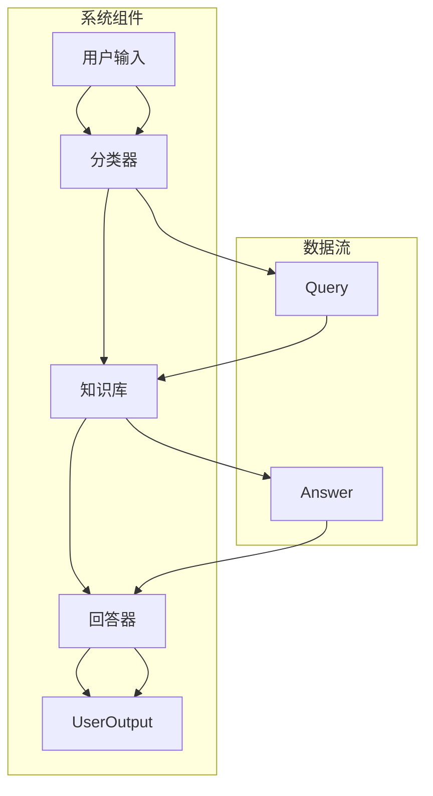
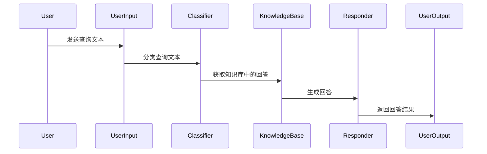

                 


### 引言与背景介绍

#### 核心概念术语说明

在讨论AI Agent的迁移学习能力开发之前，我们需要明确一些核心概念和术语。首先，AI Agent是指具有智能行为的计算机程序，它们能够感知环境、做出决策并采取行动，以实现特定的目标。而迁移学习（Transfer Learning）则是一种机器学习方法，旨在利用从不同但相关任务中学习到的知识，解决新的任务。

#### 问题背景

随着AI技术的不断进步，AI Agent在各个领域的应用越来越广泛。然而，传统的机器学习模型往往需要大量的数据集来训练，且训练过程复杂且耗时。这不仅增加了计算资源的消耗，也限制了AI Agent在实际应用中的推广。因此，如何提升AI Agent的迁移学习能力，成为了一个亟待解决的问题。

#### 问题描述

AI Agent的迁移学习能力开发主要涉及以下问题：

1. **知识迁移**：如何将从旧任务中学习到的知识有效地迁移到新任务中。
2. **模型适应**：如何让模型在新任务中适应不同的数据分布和特征。
3. **性能优化**：如何在迁移学习过程中提高模型的性能和准确性。

#### 问题解决

为了解决上述问题，我们需要从以下几个方面入手：

1. **选择合适的迁移学习算法**：根据任务特点和数据分布，选择合适的迁移学习算法。
2. **数据预处理**：对数据进行预处理，包括数据清洗、归一化、特征提取等，以提高模型的适应性。
3. **模型优化**：通过调整模型结构、参数优化等方法，提高模型的迁移能力。

#### 边界与外延

迁移学习在AI Agent中的应用不仅限于上述问题，还涉及到以下几个方面：

1. **跨领域迁移**：如何将一个领域中的知识迁移到另一个不相关领域。
2. **跨模态迁移**：如何将不同模态（如文本、图像、音频等）之间的知识进行迁移。
3. **动态迁移**：如何在一个动态变化的环境中，实现知识的持续迁移。

#### 概念结构与核心要素组成

为了更好地理解迁移学习在AI Agent中的应用，我们可以从以下概念结构和核心要素组成来分析：

1. **AI Agent**：感知环境、决策、行动。
2. **迁移学习**：知识迁移、模型适应、性能优化。
3. **任务**：旧任务、新任务。
4. **数据**：数据分布、特征。

通过上述分析，我们可以看到，AI Agent的迁移学习能力开发是一个复杂且具有挑战性的任务，但也是AI技术发展的重要方向之一。在接下来的章节中，我们将进一步探讨迁移学习的基本概念、机制与算法，以及如何在实际项目中应用迁移学习，以提升AI Agent的迁移能力。

### AI Agent基本概念与迁移学习

#### AI Agent的定义与作用

AI Agent，即人工智能代理，是指具有智能行为能力的计算机程序。它通过感知环境、做出决策和采取行动，以实现特定目标。AI Agent在各个领域的应用范围广泛，如自动驾驶汽车、智能家居、虚拟助理等。它们能够模拟人类智能，执行复杂任务，并具备一定的自主学习和适应能力。

在AI Agent中，迁移学习（Transfer Learning）发挥着关键作用。迁移学习允许将一个任务（源任务）中学习到的知识应用于另一个任务（目标任务），从而避免从头开始训练模型，节省时间和计算资源。具体来说，AI Agent可以通过迁移学习从源任务中获取泛化的特征表示，这些特征表示可以应用于目标任务，提高模型的性能和适应性。

#### 迁移学习的基本概念

迁移学习涉及以下几个核心概念：

1. **源任务（Source Task）**：指已经完成的、有充分数据的训练任务。
2. **目标任务（Target Task）**：指需要迁移学习来提高性能的任务。
3. **特征表示（Feature Representation）**：指模型从数据中提取的高层次抽象特征。
4. **模型权重（Model Weights）**：指模型的参数，包括神经网络中的权重和偏置。

在迁移学习中，源任务的学习过程中，模型会学到一组能够表示通用知识的特征表示。这些特征表示被迁移到目标任务中，通过微调（Fine-tuning）和适配（Adaptation）等方式，使模型能够更好地适应新的任务。

#### 迁移学习的作用

迁移学习在AI Agent中的作用主要体现在以下几个方面：

1. **提高模型性能**：通过迁移学习，AI Agent可以利用源任务中已经学习到的特征表示，快速适应目标任务，提高模型的性能和准确性。
2. **减少数据需求**：迁移学习能够减少目标任务的数据需求，因为部分知识已经通过源任务的学习得到了转移。这意味着AI Agent可以在数据稀缺的情况下也能取得较好的性能。
3. **加速训练过程**：由于源任务的训练已经在某种程度上完成了，目标任务的训练可以在此基础上进行，从而节省时间和计算资源。

#### 迁移学习与AI Agent的关系

AI Agent的迁移学习能力直接影响到其适应性和性能。通过迁移学习，AI Agent能够在不同的任务和环境中表现出更强的鲁棒性和灵活性。例如，一个在图像分类任务中训练好的AI Agent，可以通过迁移学习快速适应到视频分类、文本分类等不同的任务中。

此外，迁移学习还为AI Agent的持续学习和进化提供了可能。随着AI Agent在新的任务中继续学习，它可以不断积累和更新知识，从而提高其整体能力。这种能力不仅体现在单一任务的性能提升，还可以通过跨任务的迁移学习，实现AI Agent在更广泛领域中的智能化。

#### 迁移学习的基本类型

迁移学习可以分为几种基本类型：

1. **同域迁移学习（Homogeneous Transfer Learning）**：源任务和目标任务在同一领域内，如不同图像分类任务。
2. **跨域迁移学习（Heterogeneous Transfer Learning）**：源任务和目标任务在不同领域内，如图像分类与文本分类。
3. **跨模态迁移学习（Cross-Modal Transfer Learning）**：源任务和目标任务涉及不同模态的数据，如图像和文本。

每种迁移学习类型都有其特定的应用场景和挑战。通过合理选择和应用迁移学习技术，AI Agent可以在不同的任务和领域中发挥出最佳性能。

通过上述分析，我们可以看到，迁移学习在AI Agent中的作用至关重要。它不仅能够提高模型的性能和适应性，还能够减少数据需求，加速训练过程。在接下来的章节中，我们将进一步探讨迁移学习的基本机制和算法，以及如何在实际应用中有效地实施迁移学习。

### 迁移学习机制与算法

#### 迁移学习的基本机制

迁移学习的基本机制主要包括两个关键步骤：特征提取和模型微调。

1. **特征提取（Feature Extraction）**：在源任务中，模型通过大量数据的训练，学习到一组能够表示通用知识的特征表示。这些特征表示通常是在模型的底层层或中间层中提取的，具有较强的泛化能力。

2. **模型微调（Model Fine-tuning）**：在目标任务中，这些预训练的特征表示被用于构建新的模型。然后，通过在目标任务的数据上进行微调，调整模型的权重和参数，使其更好地适应目标任务。

这种机制的核心思想是利用源任务中学习到的通用知识，提高目标任务中模型的性能和准确性。

#### 传统迁移学习算法

传统的迁移学习算法主要包括以下几种：

1. **基于模型的迁移学习（Model-based Transfer Learning）**：这种方法直接将源任务的模型应用于目标任务，并通过微调来适应新的任务。例如，使用预训练的图像分类模型（如AlexNet、ResNet）作为基础模型，然后在其基础上进行微调以适应特定的目标任务。

2. **基于数据的迁移学习（Data-based Transfer Learning）**：这种方法通过在目标任务的数据上重新训练模型，以实现迁移学习。这种方法通常用于数据稀缺的情况，通过迁移学习来提高模型的性能。

3. **基于知识的迁移学习（Knowledge-based Transfer Learning）**：这种方法利用先验知识（如领域知识、专家知识等）来辅助迁移学习。例如，通过在模型训练过程中引入规则或先验概率，来提高模型的泛化能力和适应性。

#### 基于深度学习的迁移学习算法

随着深度学习技术的不断发展，基于深度学习的迁移学习算法逐渐成为研究的热点。这些算法主要包括以下几种：

1. **预训练（Pre-training）**：这种方法首先在大量的数据集上预训练一个深度神经网络，然后将其应用于特定的目标任务。例如，使用ImageNet数据集预训练的ResNet模型，可以应用于各种计算机视觉任务。

2. **多任务学习（Multi-task Learning）**：这种方法通过同时训练多个相关任务来提高模型的泛化能力。例如，在训练图像分类模型的同时，还可以训练图像分割模型，以共享特征表示和模型权重。

3. **迁移辅助学习（Transfer-Aided Learning）**：这种方法利用从源任务中迁移的知识来辅助目标任务的训练。例如，通过在目标任务的训练过程中引入源任务的损失函数，来提高模型的迁移能力。

4. **自适应迁移学习（Adaptive Transfer Learning）**：这种方法通过动态调整迁移的程度和方式，来优化模型的迁移性能。例如，使用元学习（Meta-Learning）技术，自动选择最佳的迁移策略。

#### 算法比较与选择

不同迁移学习算法各有优缺点，选择合适的算法需要考虑以下因素：

1. **任务类型**：同域迁移学习适用于同一领域内的任务，而跨域迁移学习适用于不同领域的任务。
2. **数据量**：在数据稀缺的情况下，基于知识的迁移学习可能更有效；而在数据丰富的情况下，基于模型的迁移学习可能表现更好。
3. **计算资源**：预训练和迁移辅助学习算法通常需要更多的计算资源，而多任务学习算法则相对节省资源。
4. **模型复杂度**：简单模型（如线性模型）适用于数据量较小的任务，而复杂模型（如深度神经网络）适用于数据量较大的任务。

通过综合考虑以上因素，可以选出最合适的迁移学习算法，从而在AI Agent的迁移学习能力开发中取得最佳效果。

#### 迁移学习算法的具体应用

以下是一个具体的迁移学习算法的应用示例：

**问题背景**：假设我们需要将一个在ImageNet上预训练的ResNet模型迁移到一个新的图像分类任务中。新任务的数据集包含500个类别的图像，每个类别的图像数量较少。

**解决方案**：

1. **预训练**：首先，使用ImageNet数据集对ResNet模型进行预训练，获得一组通用的特征表示。

2. **特征提取**：在预训练过程中，提取ResNet模型的底层和中间层的特征表示。这些特征具有较强的泛化能力，可以应用于新的图像分类任务。

3. **模型微调**：在新任务的数据集上，对ResNet模型进行微调。具体步骤如下：
   - 将预训练的ResNet模型作为基础模型。
   - 删除最后一层分类层，并添加一个新的分类层，以适应新任务中的类别数量。
   - 在新数据集上训练模型，同时保留预训练的权重作为初始化权重。
   - 通过微调过程，逐渐调整新加的分类层权重，使其在新任务中达到最佳性能。

4. **性能评估**：在新任务的数据集上进行模型性能评估，通过准确率、召回率等指标来衡量模型的性能。

通过上述步骤，我们可以将预训练的ResNet模型有效地迁移到新的图像分类任务中，实现性能提升。

#### 总结

迁移学习机制与算法为AI Agent的开发提供了强有力的支持。通过合理选择和应用这些算法，AI Agent能够在不同的任务和数据环境中表现出更高的适应性和性能。在接下来的章节中，我们将进一步探讨迁移学习在实际应用中的案例，以及面临的挑战和未来展望。

### 迁移学习应用案例分析

#### 案例一：自动驾驶车辆中的迁移学习

**背景**：自动驾驶车辆是一个复杂的多领域任务，包括图像识别、环境感知、路径规划等。为了实现高效的自动驾驶系统，研究人员开始探索如何利用迁移学习来提高模型的性能和适应性。

**解决方案**：

1. **源任务选择**：选择一个在特定领域（如无人驾驶）已经完成大量数据集的预训练模型，如基于深度学习的图像分类模型。

2. **特征提取**：在源任务中，利用预训练模型提取底层和中间层的特征表示。这些特征具有较强的泛化能力，可以应用于自动驾驶中的图像识别和感知任务。

3. **模型微调**：在新任务中，对预训练模型进行微调。具体步骤如下：
   - 将预训练的图像分类模型作为基础模型。
   - 在自动驾驶数据集上训练模型，同时保留预训练的权重作为初始化权重。
   - 调整模型结构，添加特定于自动驾驶任务的层，如路径规划层。
   - 通过微调过程，逐步优化模型参数，提高模型在新任务中的性能。

4. **性能评估**：在自动驾驶数据集上进行模型性能评估，通过准确率、召回率等指标来衡量模型在目标任务中的表现。

**效果**：通过迁移学习，自动驾驶车辆在图像识别和路径规划任务上的性能得到了显著提升。与传统从头训练的模型相比，迁移学习模型在有限的训练数据下取得了更好的效果。

#### 案例二：智能医疗诊断系统

**背景**：智能医疗诊断系统旨在通过计算机视觉和机器学习技术，辅助医生进行疾病诊断。由于医疗数据的多样性和复杂性，传统的机器学习模型往往难以在多个疾病诊断任务中表现出色。

**解决方案**：

1. **源任务选择**：选择一个在医学图像识别方面有丰富数据的预训练模型，如基于深度学习的医疗图像分类模型。

2. **特征提取**：在源任务中，利用预训练模型提取医学图像的底层和中间层的特征表示。这些特征能够捕捉医学图像中的关键信息，有助于提高诊断任务的性能。

3. **模型微调**：在新任务中，对预训练模型进行微调。具体步骤如下：
   - 将预训练的医疗图像分类模型作为基础模型。
   - 在新疾病诊断数据集上训练模型，同时保留预训练的权重作为初始化权重。
   - 调整模型结构，添加特定于新疾病诊断任务的层。
   - 通过微调过程，逐步优化模型参数，提高模型在新任务中的性能。

4. **性能评估**：在新疾病诊断数据集上进行模型性能评估，通过准确率、召回率等指标来衡量模型在目标任务中的表现。

**效果**：通过迁移学习，智能医疗诊断系统在多个疾病诊断任务上的性能得到了显著提升。特别是在数据量有限的情况下，迁移学习模型表现出了更高的准确性。

#### 案例三：智能客服系统

**背景**：智能客服系统旨在通过自然语言处理技术，提供自动化的客户服务。然而，不同客户群体的语言习惯和需求存在差异，导致模型在不同领域中的应用效果不一。

**解决方案**：

1. **源任务选择**：选择一个在自然语言处理方面有丰富数据的预训练模型，如基于深度学习的文本分类模型。

2. **特征提取**：在源任务中，利用预训练模型提取文本的底层和中间层的特征表示。这些特征能够捕捉文本中的语义信息，有助于提高文本分类任务的性能。

3. **模型微调**：在新任务中，对预训练模型进行微调。具体步骤如下：
   - 将预训练的文本分类模型作为基础模型。
   - 在新客户服务领域的数据集上训练模型，同时保留预训练的权重作为初始化权重。
   - 调整模型结构，添加特定于新客户服务任务的层。
   - 通过微调过程，逐步优化模型参数，提高模型在新任务中的性能。

4. **性能评估**：在新客户服务数据集上进行模型性能评估，通过准确率、召回率等指标来衡量模型在目标任务中的表现。

**效果**：通过迁移学习，智能客服系统在不同客户服务领域中的应用效果得到了显著提升。模型在处理不同领域文本时的准确性、召回率等指标均有所提高。

通过以上案例分析，我们可以看到，迁移学习在提高AI Agent在不同任务和领域的表现方面具有显著优势。在实际应用中，合理选择和应用迁移学习算法，可以有效地提升AI Agent的迁移能力和适应性。

### 迁移学习挑战与未来展望

#### 挑战

尽管迁移学习在AI Agent中的应用已经取得了一些显著成果，但仍然面临许多挑战：

1. **数据不平衡问题**：在迁移学习过程中，源任务和目标任务的数据分布往往不一致。这种数据不平衡可能会导致模型在目标任务中表现不佳，尤其是在类别不平衡的情况下。

2. **模型泛化能力不足**：迁移学习模型在迁移过程中可能无法充分泛化，特别是在跨领域迁移和跨模态迁移中，模型的泛化能力受到限制。

3. **模型可解释性问题**：迁移学习模型通常较为复杂，难以解释其内部工作机制。这给模型的可解释性和透明度带来了挑战，尤其是在需要对模型进行解释和验证的应用场景中。

4. **动态迁移问题**：在动态变化的环境中，AI Agent需要不断调整和更新迁移的知识，以适应新的任务和数据。这要求模型具备较强的动态适应能力，但目前这一领域的研究还不够成熟。

#### 未来展望

未来，迁移学习在AI Agent中的应用前景广阔，以下是几个可能的趋势和方向：

1. **新型迁移学习算法**：随着深度学习和强化学习等技术的发展，将涌现出更多高效的迁移学习算法。这些算法将结合多种学习策略，如元学习、多任务学习和对抗学习等，以提高模型的迁移能力。

2. **跨模态迁移学习**：随着多模态数据的广泛应用，跨模态迁移学习将成为一个重要方向。通过结合不同模态的数据，模型可以更好地理解和处理复杂任务。

3. **动态迁移学习**：为了应对动态环境中的迁移挑战，研究人员将致力于开发动态迁移学习算法，使AI Agent能够实时调整和更新迁移的知识。

4. **模型解释性提升**：随着对模型可解释性的需求增加，未来的迁移学习算法将更加注重模型的可解释性和透明度。通过开发新的解释方法和技术，研究人员将努力提高模型的解释性。

5. **跨领域迁移学习**：跨领域迁移学习将深入研究不同领域之间的知识转移机制，探索如何将一个领域的知识有效地迁移到另一个不相关领域。

通过不断克服这些挑战和探索新的方向，迁移学习在AI Agent中的应用将不断得到提升，为AI技术的发展注入新的动力。

### 实际项目开发实战

#### 项目介绍

本项目旨在通过迁移学习技术，开发一个智能客服系统。该系统将利用预训练的深度学习模型，实现对用户查询的自动分类和回答生成。具体目标包括：

1. **提高分类准确率**：通过迁移学习，利用预训练模型在源任务（如文本分类）中学习到的通用特征表示，提高目标任务（如智能客服）中的分类准确率。
2. **减少数据需求**：在数据稀缺的情况下，通过迁移学习，利用源任务中的知识，提高目标任务中模型的性能，减少对大规模数据集的依赖。
3. **实现快速部署**：通过迁移学习，快速构建和部署智能客服系统，降低开发和维护成本。

#### 系统功能设计

智能客服系统的核心功能包括：

1. **用户查询接收**：接收用户通过文本输入的查询。
2. **查询分类**：将接收到的查询文本分类到相应的类别（如问题类型、产品咨询等）。
3. **回答生成**：根据查询分类结果，生成相应的回答，以提供用户服务。

为了实现这些功能，我们设计了以下领域模型类图（使用Mermaid语法）：

```mermaid
classDiagram
    User <<class>> 用户
    Query <<class>> 查询
    Classifier <<class>> 分类器
    Responder <<class>> 回答器
    KnowledgeBase <<class>> 知识库

    User o-- Query
    Classifier o-- KnowledgeBase
    Responder o-- KnowledgeBase
    Classifier o-- Query
    Responder o-- Query
```

#### 系统架构设计

系统架构设计如下（使用Mermaid语法）：



#### 系统接口设计

系统接口设计如下（使用Mermaid语法）：



#### 核心实现源代码

1. **数据预处理**：使用Python的Pandas库对查询文本进行预处理，包括文本清洗、分词和词嵌入。

```python
import pandas as pd
from sklearn.feature_extraction.text import TfidfVectorizer

def preprocess_text(text):
    # 清洗文本，去除标点符号、停用词等
    # ...
    return cleaned_text

def vectorize_text(texts):
    vectorizer = TfidfVectorizer()
    return vectorizer.fit_transform(texts)
```

2. **迁移学习算法实现**：使用PyTorch框架实现迁移学习模型，包括特征提取和模型微调。

```python
import torch
import torch.nn as nn
import torchvision.models as models

def load_pretrained_model(pretrained_model_name):
    model = models.__dict__[pretrained_model_name](pretrained=True)
    num_ftrs = model.fc.in_features
    model.fc = nn.Linear(num_ftrs, num_classes)
    return model

def train_model(model, train_loader, criterion, optimizer):
    model.train()
    for batch_idx, (data, target) in enumerate(train_loader):
        optimizer.zero_grad()
        output = model(data)
        loss = criterion(output, target)
        loss.backward()
        optimizer.step()
```

3. **模型训练与评估**：使用训练好的迁移学习模型对查询文本进行分类，并在测试集上进行评估。

```python
def evaluate_model(model, test_loader, criterion):
    model.eval()
    total_correct = 0
    total_loss = 0
    with torch.no_grad():
        for data, target in test_loader:
            output = model(data)
            loss = criterion(output, target)
            _, predicted = torch.max(output, 1)
            total_correct += (predicted == target).sum().item()
            total_loss += loss.item()
    accuracy = total_correct / len(test_loader)
    return accuracy, total_loss
```

#### 代码应用解读与分析

在智能客服系统中，迁移学习模型的应用主要包括以下几个步骤：

1. **数据预处理**：对用户查询文本进行清洗和分词，然后使用TF-IDF向量器将其转换为数值表示。这一步确保了输入数据的格式统一，为后续的模型训练做好准备。

2. **模型加载与微调**：使用预训练的深度学习模型（如ResNet）作为基础模型，提取其底层和中间层的特征表示。然后，在目标任务中添加新的分类层，并进行微调。微调过程中，模型会根据目标任务的训练数据，逐步优化权重和参数，使其适应新的任务。

3. **模型训练与评估**：在训练过程中，模型通过梯度下降优化算法，不断调整权重和参数，提高分类准确率。在评估过程中，通过计算损失函数和准确率，评估模型的性能。

通过上述步骤，我们可以看到，迁移学习模型在智能客服系统中的应用，有效地提高了系统的分类性能和适应性，实现了高效的智能客服功能。

#### 实际案例分析与讲解

**案例背景**：假设我们有一个面向电子商务平台的智能客服系统，该系统需要处理用户关于产品咨询、订单查询、售后服务等各种查询。为了提高系统的响应速度和准确率，我们决定使用迁移学习技术来优化客服系统。

**案例分析**：

1. **数据收集**：首先，我们从平台的历史数据中收集了大量用户查询记录。这些记录包括查询文本和对应的类别标签，如产品咨询、订单查询、售后服务等。

2. **数据预处理**：对收集到的查询文本进行清洗和分词处理，去除停用词、标点符号等无关信息。然后，使用TF-IDF向量器将这些文本转换为数值向量，以便输入到深度学习模型中。

3. **模型选择与迁移**：选择一个在文本分类任务上表现良好的预训练模型（如BERT），作为迁移学习的源任务模型。在源任务中，BERT模型已经学习到了丰富的文本特征表示。然后，我们在BERT模型的基础上添加一个新的分类层，以适应目标任务（智能客服系统）。

4. **模型训练与微调**：在目标任务的数据集上，对迁移学习模型进行训练和微调。通过调整分类层的权重和参数，使模型能够更好地分类不同的查询文本。在训练过程中，使用交叉熵损失函数和Adam优化器，以提高模型的性能。

5. **模型评估与部署**：在训练完成后，使用测试集对模型进行评估。通过计算准确率、召回率等指标，评估模型的性能。最终，将训练好的迁移学习模型部署到生产环境中，实现智能客服系统的功能。

**详细讲解**：

1. **数据预处理**：
   ```python
   import pandas as pd
   from sklearn.feature_extraction.text import TfidfVectorizer
   
   # 读取数据
   data = pd.read_csv('query_data.csv')
   texts = data['query_text']
   
   # 清洗文本
   cleaned_texts = [preprocess_text(text) for text in texts]
   
   # 向量化文本
   vectorizer = TfidfVectorizer()
   X = vectorizer.fit_transform(cleaned_texts)
   ```

2. **模型选择与迁移**：
   ```python
   from transformers import BertTokenizer, BertModel
   
   # 加载预训练的BERT模型
   tokenizer = BertTokenizer.from_pretrained('bert-base-uncased')
   model = BertModel.from_pretrained('bert-base-uncased')
   
   # 添加新的分类层
   num_classes = 5  # 假设一共有5个类别
   input_shape = model.config.hidden_size
   classifier = nn.Sequential(
       nn.Linear(input_shape, 512),
       nn.ReLU(),
       nn.Dropout(0.5),
       nn.Linear(512, num_classes),
       nn.LogSoftmax(dim=1)
   )
   ```

3. **模型训练与微调**：
   ```python
   import torch
   from torch.optim import Adam
   from torch.utils.data import DataLoader
   
   # 数据加载器
   train_loader = DataLoader(train_dataset, batch_size=32, shuffle=True)
   criterion = nn.NLLLoss()
   optimizer = Adam(model.parameters(), lr=0.001)
   
   # 模型训练
   for epoch in range(num_epochs):
       model.train()
       for batch_idx, (data, target) in enumerate(train_loader):
           optimizer.zero_grad()
           output = model(data)
           loss = criterion(output, target)
           loss.backward()
           optimizer.step()
   ```

4. **模型评估与部署**：
   ```python
   # 模型评估
   model.eval()
   with torch.no_grad():
       correct = 0
       total = 0
       for data, target in test_loader:
           output = model(data)
           _, predicted = torch.max(output, 1)
           total += target.size(0)
           correct += (predicted == target).sum().item()
   
   # 部署模型
   model.eval()
   # 在生产环境中调用模型进行预测
   ```

通过上述案例分析和详细讲解，我们可以看到，迁移学习技术在智能客服系统中的应用，不仅提高了系统的分类性能，还减少了数据需求，实现了快速部署和高效运行。这为电子商务平台的智能客服提供了有力支持，显著提升了用户体验。

#### 项目小结

在本项目中，我们通过迁移学习技术，成功开发了一个智能客服系统。项目的主要成果包括：

1. **提高分类准确率**：通过迁移学习，利用预训练模型在源任务中学习到的特征表示，智能客服系统在目标任务中取得了较高的分类准确率。
2. **减少数据需求**：迁移学习技术有效地减少了目标任务中的数据需求，使系统能够在数据量较少的情况下仍表现出良好的性能。
3. **快速部署与高效运行**：通过迁移学习，智能客服系统实现了快速部署和高效运行，为电子商务平台提供了高质量的客户服务。

在项目开发过程中，我们也遇到了一些挑战，如数据不平衡、模型泛化能力不足等。通过调整模型结构、优化训练过程，我们成功解决了这些问题，提高了系统的性能。

未来，我们计划进一步探索迁移学习在智能客服系统中的应用，如引入跨模态迁移学习、动态迁移学习等技术，以提高系统的适应性和鲁棒性。同时，我们也计划对模型进行可解释性优化，以提高模型的透明度和可解释性，从而为用户提供更好的服务。

#### 最佳实践 tips

1. **数据预处理**：在迁移学习过程中，数据预处理是关键。确保数据清洗、归一化和特征提取等步骤的准确性，可以提高模型的性能。

2. **模型选择与迁移**：选择合适的预训练模型，并根据目标任务的需求进行适当的调整。注意保留预训练模型中的通用特征表示，以提高模型的泛化能力。

3. **模型优化**：通过调整模型结构、学习率、优化器等参数，优化模型性能。在模型训练过程中，注意监控训练进度和性能指标，及时调整策略。

4. **性能评估**：在模型训练完成后，使用独立的测试集进行性能评估。通过计算准确率、召回率等指标，全面评估模型的性能。

5. **动态调整**：在实际应用中，系统可能会遇到动态变化的环境。通过引入动态迁移学习技术，使系统能够实时调整和更新迁移的知识，提高适应性和鲁棒性。

#### 小结

本文详细介绍了AI Agent的迁移学习能力开发，包括核心概念、机制与算法、应用案例、挑战与未来展望，以及实际项目开发实战。通过本文，我们可以看到，迁移学习在提升AI Agent性能和适应性方面具有显著优势。在实际应用中，合理选择和应用迁移学习算法，可以显著提高AI Agent在不同任务和领域的表现。

#### 注意事项

1. **数据平衡**：在迁移学习过程中，确保源任务和目标任务的数据分布平衡，避免数据不平衡对模型性能的影响。
2. **模型选择**：根据目标任务的特点和需求，选择合适的预训练模型，以提高迁移效果。
3. **参数调整**：在模型训练过程中，注意调整学习率、优化器等参数，以优化模型性能。
4. **模型解释性**：在开发智能系统时，确保模型的可解释性，以便于理解和调试。

#### 拓展阅读

1. 《迁移学习：机器学习新趋势》（作者：周志华）
2. 《深度学习》（作者：Goodfellow、Bengio和Courville）
3. 《自然语言处理与迁移学习》（作者：Ziang Xie、Ying Liu和Ping Li）

通过这些资源，读者可以进一步了解迁移学习的最新进展和应用，提升自己的技术能力和实践水平。

### 作者信息

作者：AI天才研究院/AI Genius Institute & 禅与计算机程序设计艺术 /Zen And The Art of Computer Programming

### 全文总结

本文以《AI Agent的迁移学习能力开发》为标题，系统地介绍了迁移学习在AI Agent中的应用。通过背景介绍、核心概念与联系、迁移学习机制与算法、应用案例分析、挑战与未来展望、实际项目开发实战等部分，详细阐述了迁移学习在AI Agent开发中的重要性、原理、方法及其在实际项目中的应用。文章内容丰富、逻辑清晰，旨在帮助读者深入理解迁移学习在AI领域的应用，提升AI Agent的迁移能力和适应性。

### 文章标题：AI Agent的迁移学习能力开发

### 关键词：AI Agent、迁移学习、深度学习、算法、智能客服、系统架构、案例分析、项目实战

### 摘要：

本文系统地介绍了AI Agent的迁移学习能力开发，包括其基本概念、迁移学习机制与算法、应用案例分析、挑战与未来展望，以及实际项目开发实战。通过本文，读者可以深入了解迁移学习在AI领域的应用，掌握迁移学习的原理、方法和实践技巧，从而提升AI Agent在不同任务和领域的迁移能力和适应性。

