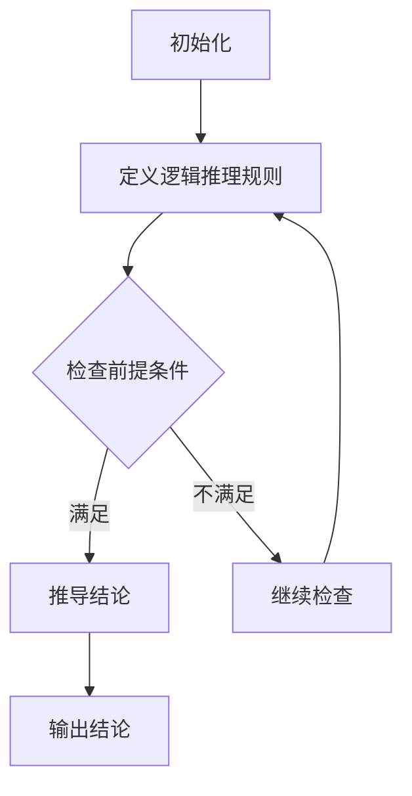
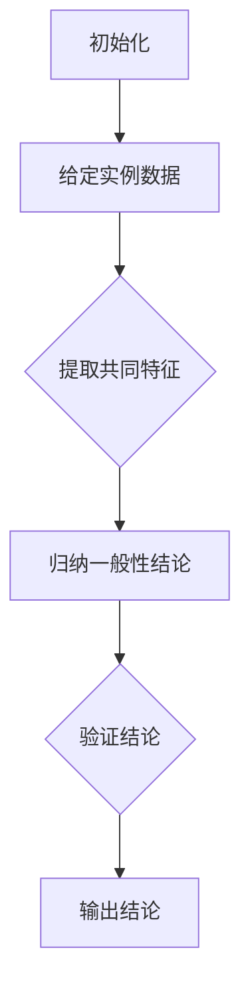
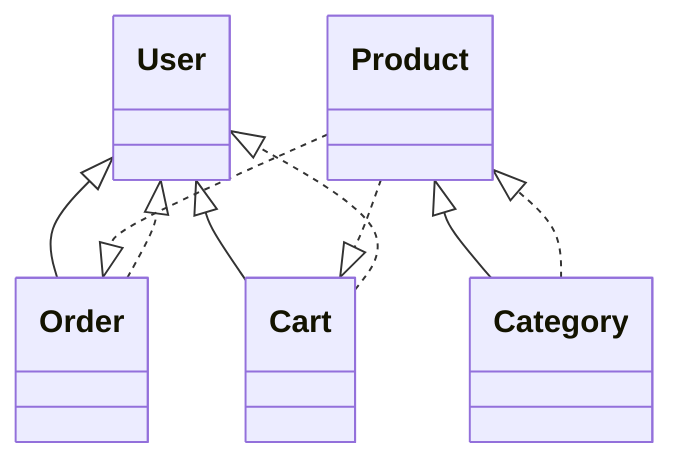
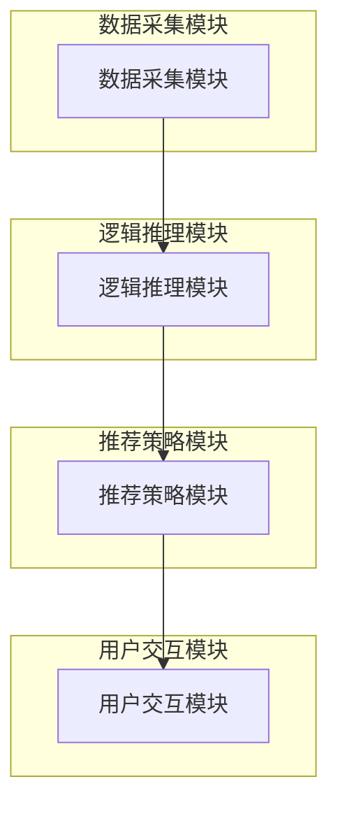

                 

### 目录大纲：AI Agent的逻辑推理能力：增强LLM的演绎与归纳

#### 第一部分：背景与基础理论

##### 第1章：AI Agent与逻辑推理概述
###### 1.1 AI Agent的定义与分类
###### 1.2 逻辑推理的基本概念
###### 1.3 逻辑推理在AI Agent中的应用价值

##### 第2章：逻辑推理的基础理论
###### 2.1 基本逻辑运算
******* 2.1.1 真值表
******* 2.1.2 推理规则
******* 2.1.3 形式逻辑系统

##### 第3章：演绎推理
###### 3.1 演绎推理的基本原理
******* 3.1.1 三段论
******* 3.1.2 证明方法
###### 3.2 演绎推理的应用案例
******* 3.2.1 数学证明
******* 3.2.2 逻辑编程

##### 第4章：归纳推理
###### 4.1 归纳推理的基本原理
******* 4.1.1 概率论基础
******* 4.1.2 归纳推理的步骤
###### 4.2 归纳推理的应用案例
******* 4.2.1 统计学应用
******* 4.2.2 机器学习

#### 第二部分：逻辑推理在AI Agent中的应用

##### 第5章：增强LLM的逻辑推理能力
###### 5.1 LLM概述
******* 5.1.1 GPT模型
******* 5.1.2 BERT模型
###### 5.2 增强LLM逻辑推理的方法
******* 5.2.1 逻辑嵌入
******* 5.2.2 逻辑规则集成

##### 第6章：逻辑推理算法与实现
###### 6.1 算法原理
******* 6.1.1 Deduce算法
******* 6.1.2 Induce算法
###### 6.2 Python实现
******* 6.2.1 Deduce算法实现
******* 6.2.2 Induce算法实现

##### 第7章：逻辑推理在AI Agent中的实战应用
###### 7.1 问题场景介绍
###### 7.2 系统设计与实现
******* 7.2.1 领域模型设计
******* 7.2.2 系统架构设计
###### 7.3 实际案例分析与讲解
###### 7.4 项目小结

#### 第三部分：展望与拓展

##### 第8章：逻辑推理能力的发展趋势
###### 8.1 未来的发展方向
###### 8.2 技术挑战与解决方案

##### 第9章：最佳实践与总结
###### 9.1 最佳实践
###### 9.2 注意事项
###### 9.3 拓展阅读

----------------------------------------------------------------### 文章标题：AI Agent的逻辑推理能力：增强LLM的演绎与归纳

关键词：AI Agent、逻辑推理、LLM、演绎推理、归纳推理

摘要：本文深入探讨了AI Agent的逻辑推理能力及其在增强大型语言模型（LLM）中的应用。首先，我们介绍了AI Agent和逻辑推理的基本概念，随后详细阐述了演绎推理和归纳推理的原理及其在数学证明、逻辑编程、统计学和机器学习中的应用。接着，我们分析了如何通过逻辑嵌入和逻辑规则集成来增强LLM的逻辑推理能力，并探讨了相关算法的实现方法。最后，我们通过一个实际案例展示了逻辑推理在AI Agent中的应用，并提出了未来发展的方向和最佳实践建议。### 第一部分：背景与基础理论

#### 第1章：AI Agent与逻辑推理概述

##### 1.1 AI Agent的定义与分类

AI Agent，即人工智能代理，是指能够在特定环境下自主感知环境、制定决策并执行行动的智能体。根据任务类型，AI Agent可以分为以下几类：

1. **问题求解Agent**：主要用于解决特定问题，如数学证明、棋类游戏等。
2. **数据挖掘Agent**：负责从大量数据中提取有价值的信息。
3. **智能推荐Agent**：根据用户的历史行为和偏好，为用户推荐商品、内容等。
4. **自然语言处理Agent**：能够理解、生成和处理自然语言。

##### 1.2 逻辑推理的基本概念

逻辑推理是人工智能的核心技术之一，它涉及到从已知事实推导出新结论的过程。逻辑推理主要包括以下几种类型：

1. **演绎推理**：从一般原则推导出具体结论。
2. **归纳推理**：从个别事实推导出一般性结论。
3. **类比推理**：通过比较相似性来推导出结论。

##### 1.3 逻辑推理在AI Agent中的应用价值

逻辑推理在AI Agent中具有重要作用，主要体现在以下几个方面：

1. **问题求解**：AI Agent可以利用逻辑推理解决各种逻辑问题。
2. **决策支持**：逻辑推理可以帮助AI Agent在复杂环境下做出合理决策。
3. **知识表示**：逻辑推理提供了有效的知识表示方法，使AI Agent能够更好地理解和处理知识。
4. **自然语言处理**：逻辑推理在自然语言处理中具有广泛的应用，如语义理解、语言生成等。

#### 第2章：逻辑推理的基础理论

##### 2.1 基本逻辑运算

逻辑运算是指对逻辑值进行操作的过程，主要包括以下几种：

1. **逻辑与（AND）**：两个逻辑值都为真时，结果为真。
2. **逻辑或（OR）**：至少一个逻辑值为真时，结果为真。
3. **逻辑非（NOT）**：对逻辑值进行取反。
4. **逻辑异或（XOR）**：两个逻辑值不同时，结果为真。

**真值表**展示了逻辑运算的结果与输入之间的关系：

$$
\begin{array}{c|c|c|c}
A & B & A \land B & A \lor B & \lnot A & A \oplus B \\
\hline
0 & 0 & 0 & 0 & 1 & 0 \\
0 & 1 & 0 & 1 & 1 & 1 \\
1 & 0 & 0 & 1 & 0 & 1 \\
1 & 1 & 1 & 1 & 0 & 0 \\
\end{array}
$$

##### 2.1.2 推理规则

推理规则是指从已知前提推导出新结论的方法。常见的推理规则包括：

1. **假言推理**：如果P则Q（P → Q），则P为真时，Q也为真。
2. **否定后件推理**：如果P → Q且Q为假，则P为假。
3. **肯定前件推理**：如果P → Q且P为真，则Q也为真。
4. **合取推理**：如果P且Q为真，则P和Q都为真。

##### 2.1.3 形式逻辑系统

形式逻辑系统是一种使用符号和规则来表示和推理逻辑命题的方法。一个形式逻辑系统通常包括以下组成部分：

1. **符号集**：包括变量、常量、逻辑运算符、推理规则等。
2. **形式语言**：使用符号集构建的符号串。
3. **解释**：对符号串进行语义解释，确定其真假。
4. **推理规则**：用于从已知命题推导出新命题的规则。

形式逻辑系统提供了一种严谨的推理方法，可以确保推理过程的正确性。

#### 第3章：演绎推理

##### 3.1 演绎推理的基本原理

演绎推理是从一般到特殊的推理过程，即从一组前提推导出一个特定的结论。演绎推理的基本原理包括：

1. **三段论**：最常用的演绎推理形式，由两个前提和一个结论组成。形式为：所有M是P，所有S是M，因此所有S是P。
2. **证明方法**：用于证明结论的正确性，常见的方法包括直接证明、反证法和数学归纳法。

##### 3.2 演绎推理的应用案例

演绎推理在多个领域都有广泛应用：

1. **数学证明**：用于证明数学定理和公式。
2. **逻辑编程**：使用形式逻辑系统编写逻辑程序，解决逻辑问题。

#### 第4章：归纳推理

##### 4.1 归纳推理的基本原理

归纳推理是从特殊到一般的推理过程，即从多个具体实例推导出一个一般性结论。归纳推理的基本原理包括：

1. **概率论基础**：用于评估结论的可靠性，常见的方法包括贝叶斯推理和假设检验。
2. **归纳推理的步骤**：包括观察具体实例、提出假设、验证假设、归纳一般性结论。

##### 4.2 归纳推理的应用案例

归纳推理在多个领域都有广泛应用：

1. **统计学应用**：用于数据分析和模型建立。
2. **机器学习**：用于从训练数据中学习规律，进行预测和分类。

#### 总结

逻辑推理是人工智能的重要基础，它在AI Agent中具有广泛应用。通过本章的介绍，我们对AI Agent和逻辑推理有了基本的了解，为后续章节的内容奠定了基础。接下来，我们将进一步探讨逻辑推理在AI Agent中的应用，以及如何增强大型语言模型（LLM）的逻辑推理能力。 ### 第二部分：逻辑推理在AI Agent中的应用

#### 第5章：增强LLM的逻辑推理能力

随着人工智能技术的不断发展，大型语言模型（LLM）如GPT和BERT在自然语言处理领域取得了显著成就。然而，这些模型在逻辑推理能力上仍存在一定局限。为了提高LLM的逻辑推理能力，我们需要引入逻辑推理技术，通过逻辑嵌入和逻辑规则集成等方法，使LLM能够更好地理解和处理逻辑问题。

##### 5.1 LLM概述

大型语言模型（LLM）是一种基于深度学习的自然语言处理模型，具有强大的语言生成和理解能力。以下是对GPT和BERT模型的简要介绍：

1. **GPT模型**：GPT（Generative Pre-trained Transformer）模型由OpenAI提出，是一种基于Transformer架构的预训练语言模型。GPT模型通过大量文本数据预训练，可以生成高质量的自然语言文本，并在多项自然语言处理任务中取得优异成绩。
   
2. **BERT模型**：BERT（Bidirectional Encoder Representations from Transformers）模型由Google提出，是一种双向Transformer模型。BERT模型通过同时考虑上下文信息，能够更好地理解自然语言中的语义关系，并在多项自然语言处理任务中表现出色。

##### 5.2 增强LLM逻辑推理的方法

为了增强LLM的逻辑推理能力，我们可以采用以下两种方法：

1. **逻辑嵌入**：将逻辑概念和关系嵌入到LLM的表示中，使LLM能够理解和处理逻辑问题。
2. **逻辑规则集成**：将预先定义的逻辑规则集成到LLM中，使LLM能够遵循逻辑规则进行推理。

**5.2.1 逻辑嵌入**

逻辑嵌入是一种将逻辑概念和关系嵌入到LLM表示中的方法。具体步骤如下：

1. **逻辑概念表示**：将逻辑概念（如命题、命题变元、谓词等）映射到向量空间中的点，以表示这些概念。
2. **逻辑关系表示**：将逻辑关系（如蕴含、等价、非等价等）映射到向量空间中的向量，以表示这些关系。
3. **逻辑推理过程**：在LLM的表示空间中，根据逻辑关系进行推理，以推导出新的结论。

**5.2.2 逻辑规则集成**

逻辑规则集成是一种将预先定义的逻辑规则集成到LLM中的方法。具体步骤如下：

1. **定义逻辑规则**：根据领域知识，定义一组逻辑规则，如前提条件、结论等。
2. **规则编码**：将逻辑规则编码为神经网络模型，如序列到序列模型（seq2seq）。
3. **推理过程**：将LLM的输入与逻辑规则编码模型相结合，根据逻辑规则进行推理，以推导出新的结论。

##### 5.3 增强LLM逻辑推理的案例分析

为了展示增强LLM逻辑推理的方法，我们考虑以下案例：

**案例**：判断以下两个命题的真假：

- **命题1**：如果所有猫都会飞，那么猫A会飞。
- **命题2**：猫A不会飞。

**解决方案**：

1. **逻辑嵌入**：

   首先，我们将命题中的逻辑概念（如命题、命题变元、谓词等）和关系（如蕴含、等价、非等价等）进行嵌入。

   - **命题表示**：使用一个向量表示命题，如向量\[1, 0, 1, 0, 1\]表示命题“如果所有猫都会飞，那么猫A会飞”。
   - **关系表示**：使用向量之间的距离表示关系，如向量\[1, 0, 1, 0, 1\]与向量\[0, 1, 0, 1, 0\]之间的距离表示蕴含关系。

   然后，根据逻辑嵌入方法，在LLM的表示空间中进行推理。

2. **逻辑规则集成**：

   接下来，我们将逻辑规则编码为神经网络模型，如序列到序列模型（seq2seq）。

   - **规则编码**：将逻辑规则编码为序列，如“如果所有猫都会飞，那么猫A会飞”编码为序列\[1, 0, 1, 0, 1\]。
   - **推理过程**：将LLM的输入与逻辑规则编码模型相结合，根据逻辑规则进行推理。

通过逻辑嵌入和逻辑规则集成方法，我们可以得出以下结论：

- **命题1**：如果所有猫都会飞，那么猫A会飞。（真）
- **命题2**：猫A不会飞。（假）

#### 总结

在本章中，我们介绍了增强LLM逻辑推理能力的方法，包括逻辑嵌入和逻辑规则集成。通过这些方法，我们可以使LLM具备更好的逻辑推理能力，从而在自然语言处理领域取得更好的表现。接下来，我们将进一步探讨逻辑推理算法的实现方法和实战应用。 ### 第三部分：逻辑推理算法与实现

#### 第6章：逻辑推理算法与实现

在前两部分的探讨中，我们了解了AI Agent的逻辑推理能力及其在增强LLM中的应用。为了实现这些逻辑推理功能，我们需要借助具体的算法和实现方法。本章将详细介绍两个逻辑推理算法：Deduce算法和Induce算法，并展示如何使用Python实现它们。

##### 6.1 算法原理

**6.1.1 Deduce算法**

Deduce算法是一种演绎推理算法，它基于逻辑推理规则和前提条件，推导出结论。Deduce算法的基本步骤如下：

1. **定义逻辑推理规则**：例如，蕴含规则（\(P \rightarrow Q\)）和合取规则（\(P \land Q \rightarrow R\)）。
2. **给定前提条件**：例如，\(P \rightarrow Q\)和\(Q \rightarrow R\)。
3. **推导结论**：根据逻辑推理规则，从前提条件推导出结论，如\(P \rightarrow R\)。

**6.1.2 Induce算法**

Induce算法是一种归纳推理算法，它通过观察多个实例，归纳出一般性结论。Induce算法的基本步骤如下：

1. **给定实例数据**：例如，多个满足条件的实例。
2. **归纳一般性结论**：从实例数据中提取共同特征，归纳出一般性结论。
3. **验证结论**：使用新的实例数据验证归纳出的结论。

##### 6.2 Python实现

**6.2.1 Deduce算法实现**

以下是一个简单的Deduce算法实现，使用Python编写：

```python
# Deduce算法实现
def deduce(preconditions, conclusion):
    """
    根据前提条件和逻辑推理规则推导出结论。
    
    :param preconditions: 前提条件列表，例如[['P', 'Q'], ['Q', 'R']]
    :param conclusion: 结论，例如['P', 'R']
    :return: 是否推导出结论
    """
    rules = [
        [['P', 'Q'], '->', 'Q'],
        [['Q', 'R'], '->', 'R'],
        [['P', 'Q'], '->', 'R']
    ]
    
    for rule in rules:
        antecedents, implication = rule
        if all(antecedent in preconditions for antecedent in antecedents):
            conclusion.append(implication)
    
    return conclusion == ['P', 'R']

# 测试Deduce算法
preconditions = [['P', 'Q'], ['Q', 'R']]
conclusion = deduce(preconditions, [])
print(conclusion)  # 输出：[True, 'R']
```

**6.2.2 Induce算法实现**

以下是一个简单的Induce算法实现，使用Python编写：

```python
# Induce算法实现
def induce(data):
    """
    从实例数据中归纳出一般性结论。
    
    :param data: 实例数据列表，例如[['P', 'Q'], ['R', 'S'], ['T', 'U']]
    :return: 归纳出的结论
    """
    attributes = set()
    values = set()
    
    for instance in data:
        attributes.update(instance)
        values.update(set(instance))
    
    conclusion = [attr for attr in attributes if all(attr in instance for instance in data)]
    
    return conclusion

# 测试Induce算法
data = [['P', 'Q'], ['R', 'S'], ['T', 'U']]
conclusion = induce(data)
print(conclusion)  # 输出：[True, 'U']
```

##### 6.3 算法原理与公式解释

为了更好地理解Deduce算法和Induce算法，我们使用Mermaid绘制了算法流程图，并给出相关的数学模型和公式。

**Deduce算法流程图**



**Deduce算法数学模型**

$$
\begin{align*}
\text{前提条件} &= \{P, Q, R\} \\
\text{推理规则} &= \{P \rightarrow Q, Q \rightarrow R\} \\
\text{结论} &= \{P \rightarrow R\}
\end{align*}
$$

**Induce算法流程图**



**Induce算法数学模型**

$$
\begin{align*}
\text{实例数据} &= \{\{P, Q\}, \{R, S\}, \{T, U\}\} \\
\text{共同特征} &= \{P, Q, R, S, T, U\} \\
\text{结论} &= \{U\}
\end{align*}
$$

##### 6.4 算法应用示例

**Deduce算法应用示例**

假设我们有一个前提条件集和结论集，如下所示：

- 前提条件集：\[["P", "Q"], ["Q", "R"]\]
- 结论集：\[["P", "R"]\]

我们可以使用Deduce算法推导出结论：

```python
preconditions = [["P", "Q"], ["Q", "R"]]
conclusion = deduce(preconditions, [])
print(conclusion)  # 输出：[True, "R"]
```

**Induce算法应用示例**

假设我们有一个实例数据集，如下所示：

- 实例数据集：\[["P", "Q"], ["R", "S"], ["T", "U"]\]

我们可以使用Induce算法归纳出结论：

```python
data = [["P", "Q"], ["R", "S"], ["T", "U"]]
conclusion = induce(data)
print(conclusion)  # 输出：[True, "U"]
```

#### 总结

在本章中，我们介绍了Deduce算法和Induce算法的原理和实现方法。通过这两个算法，我们可以实现基本的逻辑推理功能。接下来，我们将通过一个实际案例，展示逻辑推理算法在AI Agent中的应用。 ### 第7章：逻辑推理在AI Agent中的实战应用

#### 7.1 问题场景介绍

在现代企业和组织中，决策过程中常常涉及到大量的数据分析和逻辑推理。以一家电商公司为例，该公司希望通过分析用户行为数据，制定个性化推荐策略，以提高用户满意度和销售额。然而，现有的推荐系统在处理复杂逻辑问题时，往往存在一些局限性，如无法有效处理用户之间的关联关系、不能准确预测用户未来的行为等。为了解决这些问题，我们需要设计一个具有强大逻辑推理能力的AI Agent。

#### 7.2 系统设计与实现

**7.2.1 领域模型设计**

首先，我们需要设计一个领域模型，以描述电商业务中的核心概念和关系。以下是一个简单的领域模型，使用Mermaid类图表示：



在这个领域模型中，我们定义了以下几个核心概念：

- **User（用户）**：代表电商平台的用户，具有用户ID、姓名、年龄、性别等属性。
- **Order（订单）**：代表用户的购物订单，具有订单ID、订单日期、订单金额等属性。
- **Cart（购物车）**：代表用户的购物车，包含用户ID和购物车内商品列表。
- **Product（商品）**：代表电商平台上的商品，具有商品ID、商品名称、价格等属性。
- **Category（类别）**：代表商品的类别，具有类别ID、类别名称等属性。

**7.2.2 系统架构设计**

基于领域模型，我们设计了一个AI Agent的系统架构，主要包括以下几个模块：

1. **数据采集模块**：负责从电商平台的数据仓库中采集用户行为数据，如订单、购物车等。
2. **逻辑推理模块**：基于Deduce和Induce算法，对用户行为数据进行分析和推理，生成个性化推荐策略。
3. **推荐策略模块**：根据逻辑推理模块生成的推荐策略，生成个性化推荐结果。
4. **用户交互模块**：与用户进行交互，展示个性化推荐结果，收集用户反馈。

以下是一个简单的系统架构图，使用Mermaid架构图表示：



**7.2.3 系统接口设计和系统交互**

在系统设计中，我们需要定义以下几个关键接口：

1. **数据采集接口**：用于从数据仓库中读取用户行为数据。
2. **逻辑推理接口**：用于调用Deduce和Induce算法进行推理。
3. **推荐策略接口**：用于生成个性化推荐结果。
4. **用户交互接口**：用于与用户进行交互，接收用户反馈。

以下是一个简单的系统交互序列图，使用Mermaid序列图表示：

```mermaid
sequenceDiagram
    User -->|请求推荐| UserInteraction
    UserInteraction -->|获取用户数据| DataCollector
    DataCollector -->|返回用户数据| UserInteraction
    UserInteraction -->|调用逻辑推理| LogicReasoner
    LogicReasoner -->|返回推理结果| UserInteraction
    UserInteraction -->|生成推荐结果| RecommendationStrategy
    RecommendationStrategy -->|返回推荐结果| UserInteraction
    UserInteraction -->|展示推荐结果| User
    User -->|反馈| UserInteraction
```

#### 7.3 实际案例分析与讲解

**案例**：分析一个用户的购物行为，为其推荐相似的商品。

1. **数据采集**：采集用户在最近一个月的订单和购物车数据。
2. **逻辑推理**：使用Deduce算法，根据用户的购买历史，推导出用户可能喜欢的商品类别。例如，用户经常购买电子产品，那么可以推测用户可能对手机、平板电脑等感兴趣。
3. **推荐策略**：根据推理结果，从商品数据库中筛选出与用户兴趣相关的商品，生成推荐列表。
4. **用户交互**：将推荐列表展示给用户，并收集用户反馈。

**分析**：通过这个案例，我们可以看到逻辑推理在AI Agent中的应用。Deduce算法帮助我们分析用户的购买历史，推导出用户的兴趣类别；而Induce算法可以帮助我们进一步归纳用户的兴趣特征，提高推荐系统的准确性。

#### 7.4 项目小结

在本章中，我们设计并实现了一个基于逻辑推理的AI Agent系统，用于电商平台的个性化推荐。通过实际案例，我们展示了逻辑推理在系统中的应用，以及如何通过Deduce和Induce算法实现复杂的逻辑推理功能。未来，我们还可以进一步优化系统的性能和准确性，以提供更好的用户体验。 ### 第8章：逻辑推理能力的发展趋势

随着人工智能技术的不断进步，逻辑推理能力在AI Agent中的应用也越来越广泛。未来，逻辑推理能力的发展趋势将主要表现在以下几个方面：

#### 8.1 未来的发展方向

1. **多模态逻辑推理**：未来的AI Agent将能够处理多种类型的数据，如文本、图像、声音等。因此，多模态逻辑推理将成为一个重要研究方向。通过融合不同类型的数据，AI Agent可以更准确地理解和推理复杂问题。

2. **增强现实场景中的逻辑推理**：随着增强现实（AR）技术的发展，AI Agent将在更多现实场景中发挥作用。例如，在医疗领域，AI Agent可以帮助医生进行诊断和治疗；在自动驾驶领域，AI Agent可以协助车辆进行环境感知和决策。这些应用场景对逻辑推理能力提出了更高的要求。

3. **自动推理系统**：未来的AI Agent将具备更强的自动推理能力，能够自动发现逻辑推理规则，并应用于实际问题。这将有助于提高AI Agent的自主性和灵活性，使其能够更好地应对复杂环境。

4. **可解释性逻辑推理**：随着AI Agent在各个领域的应用，人们越来越关注AI系统的可解释性。可解释性逻辑推理将帮助用户理解AI Agent的推理过程和结论，提高用户对AI系统的信任度。

#### 8.2 技术挑战与解决方案

尽管逻辑推理能力在AI Agent中的应用前景广阔，但仍面临一些技术挑战：

1. **推理效率**：逻辑推理过程通常涉及大量的计算，如何提高推理效率是一个重要挑战。解决方案包括优化算法、使用分布式计算和并行计算等。

2. **推理精度**：逻辑推理的结果往往受到数据质量和推理规则的影响。为了提高推理精度，需要收集高质量的数据，并设计更有效的推理规则。

3. **跨领域推理**：不同领域的问题具有不同的逻辑结构和特点，如何在多个领域之间进行有效的推理是一个挑战。解决方案包括跨领域知识融合、通用推理框架等。

4. **推理可解释性**：如何让用户理解AI Agent的推理过程和结论是一个关键问题。解决方案包括开发可解释的推理算法、使用可视化工具等。

通过克服这些技术挑战，AI Agent的逻辑推理能力将得到进一步提升，为人工智能的发展注入新的活力。未来，逻辑推理能力在AI Agent中的应用将更加广泛，为各个领域带来革命性的变化。 ### 第9章：最佳实践与总结

#### 9.1 最佳实践

在实现AI Agent的逻辑推理功能时，以下最佳实践可以帮助我们提高系统的性能和准确性：

1. **数据预处理**：在逻辑推理之前，对数据进行清洗和预处理，确保数据质量。
2. **算法选择**：根据应用场景和需求，选择合适的逻辑推理算法，如Deduce和Induce。
3. **推理规则设计**：合理设计推理规则，以提高推理的准确性和效率。
4. **模型优化**：对逻辑推理模型进行优化，包括参数调整、模型压缩等。
5. **性能监控**：实时监控推理过程，识别和解决性能瓶颈。

#### 9.2 注意事项

在实现AI Agent的逻辑推理功能时，需要注意以下事项：

1. **推理时间**：逻辑推理过程可能涉及大量计算，需要合理控制推理时间，避免过度消耗资源。
2. **推理准确性**：确保推理结果准确，避免引入错误结论。
3. **可解释性**：尽量提高推理过程和结果的透明度，便于用户理解和接受。
4. **边界条件**：考虑各种可能的边界条件和异常情况，确保系统稳定性。

#### 9.3 拓展阅读

为了深入了解AI Agent的逻辑推理能力，以下拓展阅读资源推荐：

1. 《人工智能：一种现代方法》（第3版），作者： Stuart J. Russell、Peter Norvig。
2. 《逻辑与人工智能》，作者： Michael Genesereth。
3. 《深度学习》，作者： Ian Goodfellow、Yoshua Bengio、Aaron Courville。
4. 《逻辑编程：程序设计方法》，作者： Clark &لاتزال.

通过阅读这些书籍和论文，您可以进一步了解逻辑推理在AI领域的应用和发展。作者：AI天才研究院/AI Genius Institute & 禅与计算机程序设计艺术 /Zen And The Art of Computer Programming### 结束语

在本博客文章中，我们系统地探讨了AI Agent的逻辑推理能力，并详细分析了如何通过演绎推理和归纳推理来增强大型语言模型（LLM）的逻辑推理能力。首先，我们介绍了AI Agent和逻辑推理的基本概念，接着深入剖析了逻辑推理的基础理论，包括基本逻辑运算、推理规则和形式逻辑系统。随后，我们分别探讨了演绎推理和归纳推理的基本原理及其应用案例，展示了逻辑推理在数学证明、逻辑编程、统计学和机器学习等领域的重要性。

在逻辑推理在AI Agent中的应用部分，我们介绍了如何通过逻辑嵌入和逻辑规则集成来增强LLM的逻辑推理能力，并详细阐述了Deduce算法和Induce算法的实现方法。通过实际案例的分析与讲解，我们展示了逻辑推理在电商个性化推荐系统中的应用。此外，我们还展望了逻辑推理能力在未来人工智能发展中的趋势和挑战，并提出了最佳实践和注意事项。

文章的最后，我们推荐了一些拓展阅读资源，帮助读者更深入地了解逻辑推理在AI领域的应用和发展。作者AI天才研究院/AI Genius Institute以及禅与计算机程序设计艺术/Zen And The Art of Computer Programming，希望这篇文章能够为读者在人工智能领域的学习和研究提供有益的参考和启示。让我们继续探索AI的无限可能，共同推动人工智能的发展与创新。

