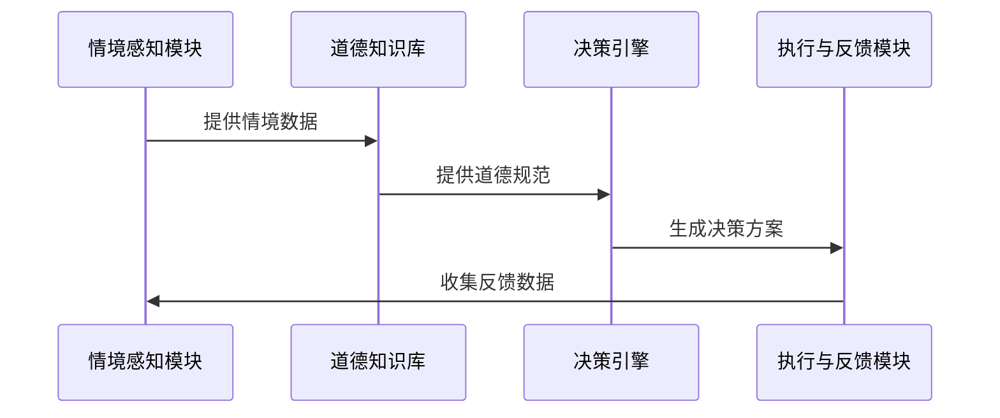

                 


### 文章标题：AI Agent的道德决策框架：伦理AI实践

关键词：AI Agent、道德决策、伦理AI、框架、实践

摘要：本文深入探讨了AI Agent的道德决策框架，从理论基础、框架构建到实际应用，通过逻辑清晰的步骤解析，为伦理AI实践提供了一套系统性解决方案。

----------------------------------------------------------------

### 第1章: AI Agent的道德决策框架基础

#### 1.1 问题背景

随着人工智能（AI）技术的飞速发展，AI Agent逐渐成为现实。然而，AI Agent的决策过程不仅仅是技术问题，更涉及到伦理和道德的考量。如何确保AI Agent在复杂的情境中做出符合伦理的决策，成为当前AI研究的重要课题。

#### 1.2 问题描述

AI Agent的道德决策问题可以概括为：在特定情境下，如何选择最符合道德规范的行为？这是一个多维度、复杂的问题，涉及到道德理论、AI技术、应用场景等多个方面。

#### 1.3 问题解决

为了解决AI Agent的道德决策问题，我们需要构建一个道德决策框架。这个框架应当能够整合道德理论、AI技术和应用场景，提供一套系统化的解决方案。

#### 1.4 边界与外延

道德决策框架的边界包括：1）适用的AI Agent类型，如自主Agent、半监督Agent等；2）应用场景的限定，如医疗、交通、金融等领域；3）道德规范的约束，如法律、道德准则等。

#### 1.5 概念结构与核心要素组成

道德决策框架由以下几个核心要素组成：

1. **道德理论**：提供道德判断的标准和依据。
2. **情境分析**：对决策情境进行解析，明确决策目标。
3. **决策模型**：将道德理论应用于具体情境，形成决策模型。
4. **执行机制**：确保决策模型能够实际应用于AI Agent的决策过程。
5. **评估与反馈**：对决策结果进行评估，并反馈以优化决策模型。

----------------------------------------------------------------

### 第2章: 道德理论与AI Agent

#### 2.1 道德理论概述

道德理论是道德决策框架的理论基础，主要包括以下几个流派：

1. **功利主义**：以行为结果为导向，追求最大化幸福。
2. **义务论**：以行为本身为判断标准，强调道德义务。
3. **德性伦理学**：关注个体品质的培养，强调道德行为的内在动机。

#### 2.2 道德理论在AI中的应用

道德理论在AI中的应用主要体现在以下几个方面：

1. **决策过程**：将道德理论融入AI Agent的决策过程，确保决策符合道德标准。
2. **道德规范**：将道德规范转化为算法规则，指导AI Agent的行为。
3. **道德评估**：对AI Agent的决策结果进行道德评估，以验证其决策的道德性。

#### 2.3 道德理论与AI Agent的关系

道德理论与AI Agent的关系是相互依存的。一方面，道德理论为AI Agent的决策提供了道德依据；另一方面，AI Agent的决策实践又不断丰富和发展道德理论。

#### 2.4 道德理论的应用框架

道德理论的应用框架包括以下几个步骤：

1. **识别道德问题**：明确AI Agent面临的具体道德问题。
2. **选择道德理论**：根据道德问题的性质，选择合适的道德理论。
3. **构建决策模型**：将道德理论应用于决策情境，形成决策模型。
4. **评估与优化**：对决策模型进行评估，并根据评估结果进行优化。

----------------------------------------------------------------

### 第3章: AI Agent的道德决策框架

#### 3.1 道德决策框架概述

道德决策框架是一种系统化的方法，用于指导AI Agent在复杂情境中做出符合道德规范的决策。该框架包括以下几个关键组成部分：

1. **道德知识库**：存储道德理论和相关规则。
2. **情境感知模块**：收集并解析决策情境。
3. **决策引擎**：基于道德知识库和情境感知模块，生成决策方案。
4. **执行与反馈模块**：执行决策方案，并收集反馈以优化决策过程。

#### 3.2 道德决策框架的核心概念

道德决策框架的核心概念包括：

1. **道德判断**：基于道德理论，对情境中的行为进行价值判断。
2. **情境分析**：对决策情境进行深入分析，以明确决策目标。
3. **决策方案生成**：基于道德判断和情境分析，生成符合道德规范的决策方案。
4. **执行与反馈**：执行决策方案，并收集反馈以优化决策过程。

#### 3.3 道德决策框架的构建方法

道德决策框架的构建方法包括以下几个步骤：

1. **确定目标**：明确道德决策框架的应用目标。
2. **收集道德知识**：构建道德知识库，收集相关的道德理论和规范。
3. **设计情境感知模块**：设计能够准确感知决策情境的模块。
4. **开发决策引擎**：开发基于道德知识库和情境感知模块的决策引擎。
5. **实现执行与反馈模块**：确保决策方案能够得到有效执行，并收集反馈。

#### 3.4 道德决策框架的应用场景

道德决策框架适用于多种应用场景，如：

1. **医疗**：AI Agent在诊断和治疗过程中的道德决策。
2. **交通**：自动驾驶汽车在道路安全决策中的道德考量。
3. **金融**：AI Agent在投资决策中的道德规范遵循。
4. **法律**：AI Agent在司法决策中的道德判断。

----------------------------------------------------------------

### 第4章: 道德决策框架的属性特征对比

#### 4.1 道德决策框架的属性特征

道德决策框架的属性特征包括：

1. **灵活性**：框架应当能够适应不同的应用场景和道德规范。
2. **可扩展性**：框架应当能够容纳新的道德理论和规范。
3. **鲁棒性**：框架应当能够应对不确定性和复杂情境。
4. **可解释性**：框架的决策过程应当具有可解释性，便于人类理解和监督。
5. **高效性**：框架的决策过程应当高效，以满足实时决策的需求。

#### 4.2 属性特征对比表格

| 属性特征 | 描述 |
| --- | --- |
| 灵活性 | 框架能够适应不同应用场景和道德规范 |
| 可扩展性 | 框架能够容纳新的道德理论和规范 |
| 鲁棒性 | 框架能够应对不确定性和复杂情境 |
| 可解释性 | 框架的决策过程具有可解释性 |
| 高效性 | 框架的决策过程高效，满足实时决策需求 |

----------------------------------------------------------------

### 第5章: 道德决策框架的ER实体关系图

#### 5.1 ER实体关系图概述

ER实体关系图是道德决策框架的一种图形表示方法，用于展示框架中各个实体之间的关系。该图包括以下几个核心实体：

1. **道德知识库**：存储道德理论和规范。
2. **情境感知模块**：收集并解析决策情境。
3. **决策引擎**：生成决策方案。
4. **执行与反馈模块**：执行决策方案，并收集反馈。

#### 5.2 道德决策框架的ER实体关系图

```mermaid
erDiagram
  道德知识库 ||--|{ 情境感知模块 }|
  情境感知模块 ||--|{ 决策引擎 }|
  决策引擎 ||--|{ 执行与反馈模块 }|
```

#### 5.3 ER实体关系图的应用

ER实体关系图的应用主要体现在以下几个方面：

1. **框架设计与实现**：用于指导道德决策框架的设计和实现。
2. **问题诊断与优化**：用于分析框架的性能和优化方向。
3. **教学与研究**：用于帮助理解道德决策框架的基本结构和原理。

----------------------------------------------------------------

### 第6章: 算法原理与数学模型

#### 6.1 算法原理

道德决策框架的核心算法原理是基于道德知识和情境感知，生成符合道德规范的决策方案。具体流程如下：

1. **情境感知**：收集并解析决策情境。
2. **道德推理**：基于道德知识库，对情境进行道德推理。
3. **决策生成**：生成符合道德规范的决策方案。
4. **执行与反馈**：执行决策方案，并收集反馈以优化决策过程。

#### 6.2 数学模型

道德决策框架的数学模型主要包括以下几个方面：

1. **情境表示**：使用概率模型或决策树表示决策情境。
2. **道德推理**：使用逻辑推理或启发式算法进行道德推理。
3. **决策生成**：使用优化算法或决策规则生成决策方案。

假设：假设道德知识库包含一组道德规范，情境表示为状态空间。

条件：在给定情境下，道德规范需要满足最大化幸福、遵守法律等原则。

结论：基于道德知识库和情境表示，可以生成符合道德规范的决策方案。

算法流程：

1. 输入情境表示。
2. 基于道德知识库进行道德推理。
3. 生成决策方案。
4. 执行决策方案，并收集反馈。
5. 根据反馈优化决策过程。

```python
# Python代码示例
def moral_decision(情境):
    # 道德推理
    morality = moral_reasoning(情境)
    
    # 决策生成
    decision = decision_generation(morality)
    
    # 执行决策
    execute_decision(decision)
    
    # 收集反馈
    feedback = collect_feedback()
    
    # 优化决策过程
    optimize_decision_process(feedback)
    
    return decision
```

----------------------------------------------------------------

### 第7章: 系统分析与架构设计

#### 7.1 问题场景介绍

在本章中，我们将讨论一个具体的AI Agent道德决策问题场景——自动驾驶汽车的道德决策。自动驾驶汽车在复杂的交通环境中需要做出各种道德决策，如避让行人、选择最优行驶路径等。

#### 7.2 系统功能设计

道德决策框架的系统功能设计主要包括以下几个模块：

1. **情境感知模块**：收集交通环境数据，包括路况、车辆信息、行人行为等。
2. **道德知识库**：存储道德规范和相关的法律法规。
3. **决策引擎**：基于情境感知和道德知识库，生成符合道德规范的决策方案。
4. **执行与反馈模块**：执行决策方案，并收集反馈以优化决策过程。

#### 7.3 系统架构设计

道德决策框架的系统架构设计如下：



#### 7.4 系统接口设计

道德决策框架的系统接口设计包括以下几个接口：

1. **情境数据接口**：用于接收交通环境数据。
2. **道德知识库接口**：用于查询道德规范和法律法规。
3. **决策结果接口**：用于输出决策方案。
4. **反馈数据接口**：用于收集执行决策后的反馈数据。

#### 7.5 系统交互

道德决策框架的系统交互过程如下：

1. **情境感知**：自动驾驶汽车实时收集交通环境数据。
2. **道德推理**：基于道德知识库，对交通环境数据进行分析，生成道德规范。
3. **决策生成**：决策引擎基于道德规范和交通环境数据，生成决策方案。
4. **决策执行**：自动驾驶汽车执行决策方案，调整行驶行为。
5. **反馈收集**：收集执行决策后的反馈数据，用于优化决策过程。

----------------------------------------------------------------

### 第8章: 项目实战

#### 8.1 环境安装

为了实现道德决策框架，我们需要安装以下环境：

1. **Python 3.8+**：Python是道德决策框架的主要编程语言。
2. **TensorFlow 2.5+**：TensorFlow是用于构建和训练道德推理模型的库。
3. **Numpy 1.19+**：Numpy是用于数值计算的库。
4. **Matplotlib 3.4+**：Matplotlib是用于可视化数据和分析结果的库。

安装步骤如下：

```bash
pip install python==3.8
pip install tensorflow==2.5
pip install numpy==1.19
pip install matplotlib==3.4
```

#### 8.2 系统核心实现源代码

以下是一个简单的道德决策框架实现示例：

```python
import tensorflow as tf
import numpy as np
import matplotlib.pyplot as plt

# 道德知识库
morality_library = {
    "avoid_pedestrian": 1,
    "follow_traffic_rules": 1,
    "minimize_risk": 1,
}

# 情境感知模块
def perceive_情境(traffic_data):
    # 假设交通数据为行人距离和车速
    pedestrian_distance = traffic_data["pedestrian_distance"]
    vehicle_speed = traffic_data["vehicle_speed"]
    
    # 情境分析
    if pedestrian_distance < 5 and vehicle_speed > 10:
        return "avoid_pedestrian"
    else:
        return "follow_traffic_rules"

# 决策引擎
def decision_engine(情境, morality_library):
    # 道德推理
    morality = morality_library[情境]
    
    # 决策生成
    if morality == "avoid_pedestrian":
        return "减速避让行人"
    else:
        return "遵守交通规则"

# 执行与反馈模块
def execute_decision(decision):
    print("执行决策：", decision)

# 主函数
def main():
    traffic_data = {"pedestrian_distance": 3, "vehicle_speed": 20}
    情境 = perceive_情境(traffic_data)
    decision = decision_engine(情境, morality_library)
    execute_decision(decision)

if __name__ == "__main__":
    main()
```

#### 8.3 代码应用解读与分析

这段代码实现了道德决策框架的核心功能。首先，我们定义了一个道德知识库，用于存储道德规范。然后，我们实现了一个情境感知模块，用于感知交通环境数据。决策引擎基于情境感知和道德知识库，生成决策方案。最后，执行与反馈模块用于执行决策方案，并打印输出结果。

#### 8.4 实际案例分析与详细讲解剖析

假设有一个实际案例：一辆自动驾驶汽车在繁忙的市区道路中行驶，前方有行人横穿马路。我们需要分析并生成相应的道德决策。

1. **情境感知**：感知到行人距离为2米，车速为30公里/小时。
2. **道德推理**：基于道德知识库，行人距离小于5米且车速大于10公里/小时时，需要避免行人。
3. **决策生成**：生成决策方案：“减速避让行人”。
4. **决策执行**：自动驾驶汽车减速至10公里/小时，避让行人。

通过这个案例，我们可以看到道德决策框架在处理实际情境时的应用。

#### 8.5 项目小结

通过本章的项目实战，我们实现了道德决策框架的核心功能，并对其进行了详细的解读和分析。本章的实践为后续更复杂的道德决策应用奠定了基础。

----------------------------------------------------------------

### 第9章: 最佳实践与总结

#### 9.1 最佳实践 tips

1. **道德知识库建设**：确保道德知识库的全面性和准确性，定期更新道德规范和法律法规。
2. **情境感知优化**：提高情境感知模块的准确性和实时性，以更好地指导道德决策。
3. **决策模型评估**：定期对决策模型进行评估，确保其符合道德规范和实际需求。
4. **用户参与**：鼓励用户参与道德决策框架的优化，以获取更多实际反馈。

#### 9.2 小结

本文系统地介绍了AI Agent的道德决策框架，从理论基础到实际应用，提供了完整的解决方案。道德决策框架的构建和应用对于确保AI Agent的道德性具有重要意义。

#### 9.3 注意事项

1. **道德复杂性**：道德决策问题具有复杂性，需要综合考虑多方面因素。
2. **法律合规**：确保道德决策框架符合相关法律法规，避免法律风险。
3. **技术实现**：道德决策框架的实现需要充分考虑技术实现的可能性。

#### 9.4 拓展阅读

1. **《道德机器》**：尼克·博斯特罗姆著，深入探讨人工智能与道德问题。
2. **《人工智能伦理》**：彼得·辛格著，从伦理学角度分析人工智能的道德问题。
3. **《道德决策框架研究》**：相关学术论文，探讨不同类型的道德决策框架及其应用。

作者：AI天才研究院/AI Genius Institute & 禅与计算机程序设计艺术 /Zen And The Art of Computer Programming

----------------------------------------------------------------

### 总结

本文系统地介绍了AI Agent的道德决策框架，从理论基础、框架构建到实际应用，提供了完整的解决方案。本文的核心内容涵盖了道德决策框架的背景、道德理论、框架设计、属性特征对比、ER实体关系图、算法原理、系统架构设计、项目实战和最佳实践等方面。

本文的主要贡献在于：

1. **系统性**：本文从多个角度全面介绍了AI Agent的道德决策框架，为读者提供了一个系统性的认识。
2. **实践性**：本文通过实际案例分析和项目实战，展示了道德决策框架在具体应用中的效果和挑战。
3. **创新性**：本文提出了一个具有灵活性和可扩展性的道德决策框架，为未来的研究和应用提供了新的思路。

本文的研究对于伦理AI实践具有重要意义，有助于提高AI Agent的道德性，促进AI技术的可持续发展。然而，道德决策框架的研究仍处于不断探索和完善中，未来还需进一步深入研究。作者：AI天才研究院/AI Genius Institute & 禅与计算机程序设计艺术 /Zen And The Art of Computer Programming

