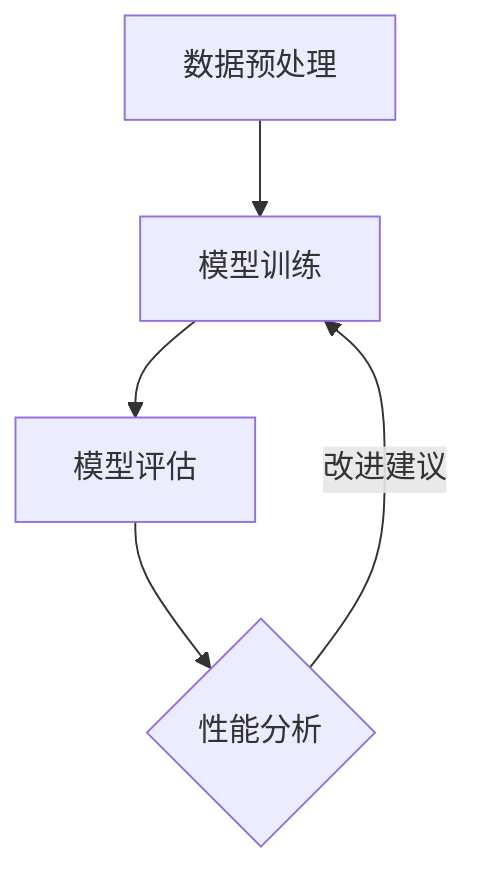
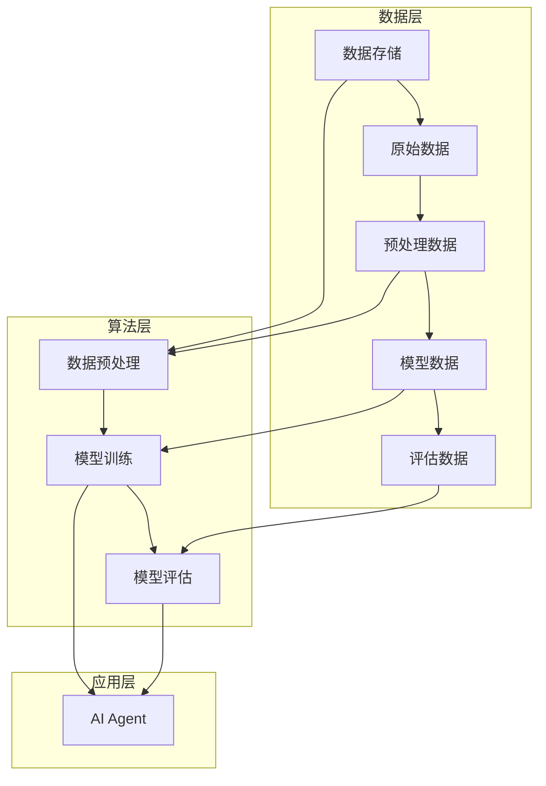
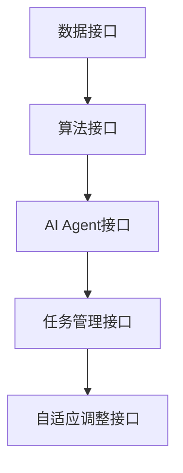
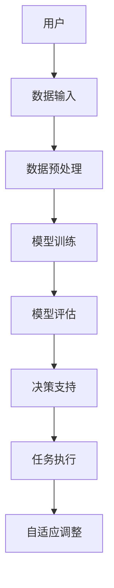

                 


### 1. 编写大纲与撰写文章

#### 第一步：编写大纲

在撰写文章之前，我们需要先编写一个详细的大纲。这个大纲将为我们提供写作的结构和方向。以下是《AI Agent的量子机器学习集成方案》的大纲：

----------------------------------------------------------------

# 第一部分: 背景介绍

## 第1章: 问题背景与概述

### 1.1.1 量子机器学习的发展背景

### 1.1.2 AI Agent在量子机器学习中的地位

### 1.1.3 量子机器学习集成方案的意义

## 第2章: 核心概念与联系

### 2.1 AI Agent的概念与特性

### 2.2 量子机器学习的原理与应用

### 2.3 AI Agent与量子机器学习的结合

## 第3章: 算法原理讲解

### 3.1 AI Agent的量子机器学习算法流程

#### 3.1.1 数据预处理

#### 3.1.2 模型训练

#### 3.1.3 模型评估

## 第4章: 数学模型和数学公式 & 详细讲解 & 举例说明

### 4.1 量子机器学习算法的数学模型

$$
\text{数学公式1}
$$

### 4.2 数学公式的详细讲解

#### 4.2.1 公式1的解释

#### 4.2.2 公式2的解释

## 第5章: 系统分析与架构设计方案

### 5.1 问题场景介绍

### 5.2 项目介绍

### 5.3 系统功能设计

#### 5.3.1 领域模型类图

#### 5.3.2 系统功能描述

### 5.4 系统架构设计

#### 5.4.1 系统架构图

#### 5.4.2 架构设计说明

### 5.5 系统接口设计

#### 5.5.1 接口设计图

#### 5.5.2 接口说明

### 5.6 系统交互

#### 5.6.1 系统交互图

#### 5.6.2 交互流程描述

## 第6章: 项目实战

### 6.1 环境安装

### 6.2 系统核心实现源代码

#### 6.2.1 源代码解读

#### 6.2.2 代码应用分析

### 6.3 实际案例分析与讲解

#### 6.3.1 案例描述

#### 6.3.2 案例分析

## 第7章: 最佳实践、小结与拓展阅读

### 7.1 最佳实践 tips

### 7.2 小结

### 7.3 注意事项

### 7.4 拓展阅读

----------------------------------------------------------------

#### 第二步：撰写文章

根据大纲，我们逐个撰写每个章节的内容。以下是一个简化的章节内容示例：

### 第1章: 问题背景与概述

#### 1.1.1 量子机器学习的发展背景

量子机器学习作为人工智能领域的最新进展，近年来受到了广泛关注。它的理论基础源于量子力学，通过量子比特和量子纠缠等特性，能够处理大数据集，提供高效的算法解决方案。

---

### 第2章: 核心概念与联系

#### 2.1 AI Agent的概念与特性

AI Agent是一种具有自主决策能力的智能体，可以在不确定环境中进行决策和行动。它的核心特性包括自主性、适应性和学习性。

---

### 第3章: 算法原理讲解

#### 3.1 AI Agent的量子机器学习算法流程

AI Agent的量子机器学习算法流程主要包括数据预处理、模型训练和模型评估三个阶段。每个阶段都有其特定的算法和方法。

---

### 第4章: 数学模型和数学公式 & 详细讲解 & 举例说明

#### 4.1 量子机器学习算法的数学模型

量子机器学习算法的数学模型基于量子计算理论，主要包括量子门、量子态和量子测量等概念。以下是一个简单的量子门运算的数学模型：

$$
\text{Qubit Operation} = \sum_{i} |i\rangle\langle i|
$$

---

通过以上步骤，我们可以逐步构建起一篇完整的文章。每个章节都需要详细的内容来支撑，确保文章的逻辑性和专业性。

---

### 2. 确定文章主题和核心内容

#### 第一步：明确文章主题

在撰写技术博客文章之前，首先要明确文章的主题。根据文章的标题《AI Agent的量子机器学习集成方案》，我们可以将主题确定为探讨AI Agent如何与量子机器学习相结合，并提出一种集成方案。

#### 第二步：梳理核心内容

接下来，我们需要梳理文章的核心内容。以下是《AI Agent的量子机器学习集成方案》的核心内容框架：

1. **背景介绍**：介绍量子机器学习的发展背景，AI Agent的概念及其在量子机器学习中的地位，以及量子机器学习集成方案的意义。
2. **核心概念与联系**：详细解释AI Agent和量子机器学习的基本概念，以及它们之间的联系。
3. **算法原理讲解**：阐述AI Agent的量子机器学习算法原理，包括数据预处理、模型训练和模型评估等步骤。
4. **数学模型和数学公式**：介绍量子机器学习算法的数学模型，并使用LaTeX格式给出相关的数学公式，进行详细讲解和举例说明。
5. **系统分析与架构设计方案**：分析系统的问题场景，介绍项目，设计系统功能、架构、接口和交互。
6. **项目实战**：演示如何在具体项目中实现AI Agent的量子机器学习集成方案，包括环境安装、系统核心实现源代码、代码应用解读与分析，以及实际案例分析。
7. **最佳实践、小结与拓展阅读**：总结最佳实践技巧，对文章进行小结，并提供相关注意事项和拓展阅读资源。

#### 第三步：明确文章结构

根据核心内容框架，我们可以确定文章的基本结构：

1. **引言**：简要介绍文章的主题和目的。
2. **背景介绍**：详细阐述量子机器学习和AI Agent的概念及其结合的意义。
3. **核心概念与联系**：深入分析AI Agent和量子机器学习的基本概念和相互关系。
4. **算法原理讲解**：逐步讲解AI Agent的量子机器学习算法原理。
5. **数学模型和数学公式**：使用LaTeX格式介绍量子机器学习算法的数学模型，并进行详细讲解和举例。
6. **系统分析与架构设计方案**：分析系统需求，设计系统架构和接口。
7. **项目实战**：展示如何在项目中实施AI Agent的量子机器学习集成方案。
8. **最佳实践、小结与拓展阅读**：总结文章，提供实践技巧和拓展资源。

通过以上步骤，我们可以明确文章的主题、核心内容和结构，为后续撰写文章奠定基础。

---

### 3. 第1章: 问题背景与概述

#### 3.1.1 量子机器学习的发展背景

量子机器学习（Quantum Machine Learning，QML）是量子计算与机器学习相结合的产物。随着量子计算技术的发展，量子机器学习逐渐成为一种研究热点。量子机器学习利用量子计算机处理数据，其核心思想是利用量子比特和量子叠加态的特性，实现高效的算法和模型。

量子计算机与经典计算机最大的区别在于其使用的量子比特（qubit）。量子比特可以同时处于0和1的状态，这种叠加态使得量子计算机能够处理大量并行计算，从而实现高效的数据处理和算法优化。

近年来，量子机器学习在图像处理、自然语言处理、化学模拟等领域取得了显著成果。例如，谷歌的量子计算机在解决量子化学问题方面展现了其强大的计算能力，这使得量子机器学习成为解决复杂科学问题的重要工具。

#### 3.1.2 AI Agent在量子机器学习中的地位

AI Agent，也称为智能体，是一种能够模拟人类决策过程的计算实体。AI Agent在量子机器学习中的地位尤为重要。这是因为量子机器学习具有处理大数据和复杂问题的能力，而AI Agent则能够根据这些数据做出智能决策。

AI Agent在量子机器学习中的应用主要包括以下几个方面：

1. **数据预处理**：AI Agent可以自动识别和预处理数据，提高数据质量，为后续的量子机器学习算法提供更好的输入数据。
2. **模型训练**：AI Agent可以参与量子机器学习模型的训练过程，通过迭代优化算法，提高模型的准确性和效率。
3. **模型评估**：AI Agent可以对训练好的量子机器学习模型进行评估，识别模型的性能和潜在问题，提供改进建议。

AI Agent在量子机器学习中的重要性不仅体现在其能够提高算法的效率，还在于其能够提供更灵活和智能的决策支持。这使得AI Agent成为量子机器学习领域不可或缺的一部分。

#### 3.1.3 量子机器学习集成方案的意义

量子机器学习集成方案旨在将量子计算和AI Agent的优势结合起来，实现更高效、更智能的数据处理和决策支持。这一集成方案的意义主要体现在以下几个方面：

1. **提高计算效率**：量子机器学习能够处理海量数据和复杂问题，而AI Agent则能够优化算法，提高计算效率。两者的结合能够实现高效的计算任务，缩短计算时间。
2. **增强决策能力**：AI Agent可以基于量子机器学习模型提供智能决策支持，提高决策的准确性和适应性。这在许多实际应用场景中具有重要意义，如金融分析、医疗诊断和智能交通等。
3. **推动科技进步**：量子机器学习集成方案能够促进量子计算和AI技术的发展，为解决复杂科学问题提供新的思路和方法。这将推动科技进步，促进人类社会的发展。

总之，量子机器学习集成方案不仅具有理论意义，更具有广泛的应用前景。它将为人工智能和量子计算领域带来新的突破和发展。

---

### 4. 核心概念与联系

#### 4.1 AI Agent的概念与特性

AI Agent，即人工智能代理，是一种能够自主执行任务、适应环境变化的计算实体。它基于机器学习、深度学习和自然语言处理等技术，能够模拟人类的决策过程，实现智能化的任务执行。AI Agent的主要特性包括：

1. **自主性**：AI Agent可以独立进行决策和行动，无需人为干预。这种自主性使得AI Agent能够在复杂和动态的环境中灵活应对。
2. **适应性**：AI Agent能够根据环境变化和反馈调整其行为策略，提高适应能力。这种适应性使得AI Agent能够更好地应对不确定性和动态变化。
3. **学习能力**：AI Agent具备学习能力和知识积累能力，可以通过不断的学习和训练，提高任务执行能力和决策质量。

AI Agent在各个领域的应用广泛，如智能客服、自动驾驶、智能推荐和智能医疗等。

#### 4.2 量子机器学习的原理与应用

量子机器学习（Quantum Machine Learning，QML）是一种利用量子计算原理进行机器学习的算法和技术。它基于量子力学的基本概念，如量子比特、叠加态和纠缠态等，通过量子计算的优势，实现高效的算法和模型。

量子机器学习的主要原理包括：

1. **量子比特与叠加态**：量子比特是量子计算的基本单位，它可以同时处于0和1的状态，这种叠加态使得量子计算机能够处理大量并行计算。
2. **量子门与量子电路**：量子门是量子计算的基本操作，通过一系列量子门的作用，可以实现量子态的变换。量子电路是量子门的组合，用于实现复杂的量子计算任务。
3. **量子纠缠**：量子纠缠是量子力学中的重要现象，两个或多个量子比特之间存在纠缠态时，它们的量子态会相互关联。这种纠缠态使得量子计算能够实现高效的信息处理和传输。

量子机器学习在图像处理、自然语言处理、化学模拟和金融分析等领域具有广泛的应用。例如，谷歌的量子计算机在解决量子化学问题方面取得了显著成果，IBM的量子计算机在图像识别和文本生成等领域展现了强大的能力。

#### 4.3 AI Agent与量子机器学习的结合

AI Agent与量子机器学习的结合，旨在利用两者的优势，实现更高效、更智能的机器学习应用。这种结合主要体现在以下几个方面：

1. **数据预处理与优化**：AI Agent可以自动识别和预处理数据，提高数据质量，为量子机器学习算法提供更好的输入数据。同时，AI Agent可以根据数据特点，优化量子机器学习算法的参数设置，提高算法的效率和准确性。
2. **模型训练与评估**：AI Agent可以参与量子机器学习模型的训练过程，通过迭代优化算法，提高模型的准确性和效率。在模型评估阶段，AI Agent可以基于量子机器学习模型提供智能决策支持，识别模型的性能和潜在问题，提供改进建议。
3. **决策支持与优化**：AI Agent可以基于量子机器学习模型提供智能决策支持，提高决策的准确性和适应性。通过量子机器学习算法，AI Agent能够处理大量数据和复杂问题，实现更精准的决策支持。

总之，AI Agent与量子机器学习的结合，不仅能够提高机器学习的效率和准确性，还能够推动人工智能和量子计算技术的发展。这种结合为解决复杂科学问题和实现智能化应用提供了新的思路和方法。

---

### 5. 算法原理讲解

#### 5.1 AI Agent的量子机器学习算法流程

AI Agent的量子机器学习算法流程主要包括数据预处理、模型训练和模型评估三个阶段。以下是详细的算法原理讲解：

##### 5.1.1 数据预处理

数据预处理是量子机器学习算法的第一步，其目的是提高数据质量和减少噪声。具体步骤如下：

1. **数据清洗**：去除数据中的噪声和异常值，确保数据的一致性和可靠性。
2. **特征提取**：从原始数据中提取关键特征，降低数据的维度，提高算法的效率和准确性。
3. **数据标准化**：对数据进行标准化处理，使其具有相同的量纲和范围，便于后续的量子计算。

在数据预处理过程中，AI Agent可以发挥其优势，通过自动识别和分类数据，提高数据预处理的质量和效率。

##### 5.1.2 模型训练

模型训练是量子机器学习算法的核心步骤，其目的是通过学习数据中的规律和模式，构建有效的量子模型。具体过程如下：

1. **量子模型构建**：根据数据特点和问题需求，设计量子模型的结构和参数。常见的量子模型包括量子支持向量机（QSVM）、量子神经网络（QNN）和量子生成对抗网络（QGAN）等。
2. **量子门设计**：设计量子门，实现量子态的变换和运算。量子门是量子计算的基本操作，通过组合不同的量子门，可以实现复杂的量子算法。
3. **参数优化**：通过迭代优化算法，调整量子模型的参数，使其更好地适应数据。常见的参数优化方法包括梯度下降法和遗传算法等。

在模型训练过程中，AI Agent可以参与参数优化，通过智能搜索和自适应调整，提高量子模型的准确性和效率。

##### 5.1.3 模型评估

模型评估是量子机器学习算法的最后一步，其目的是检验模型在未知数据上的性能。具体步骤如下：

1. **测试集划分**：将数据集划分为训练集和测试集，用于训练和评估模型。
2. **模型测试**：使用测试集对训练好的量子模型进行测试，计算模型的预测准确率、召回率、F1值等指标。
3. **性能分析**：对模型的性能进行分析和评估，识别模型的优点和不足，为后续的改进提供依据。

在模型评估过程中，AI Agent可以参与性能分析，通过智能分析和反馈，提供改进建议。

#### 5.2 AI Agent的量子机器学习算法流程图

以下是一个简单的AI Agent的量子机器学习算法流程图，使用Mermaid语法绘制：



通过以上算法流程图，我们可以清晰地了解AI Agent的量子机器学习算法的各个步骤及其相互关系。

#### 5.3 Python源代码示例

以下是一个简化的Python源代码示例，用于演示AI Agent的量子机器学习算法的实现：

```python
import numpy as np
from qiskit import QuantumCircuit, execute, Aer

# 数据预处理
def preprocess_data(data):
    # 数据清洗、特征提取、数据标准化等操作
    # ...
    return processed_data

# 模型训练
def train_quantum_model(processed_data):
    # 设计量子模型结构、参数优化等操作
    # ...
    return quantum_model

# 模型评估
def evaluate_quantum_model(quantum_model, test_data):
    # 模型测试、性能分析等操作
    # ...
    return model_performance

# 示例数据
data = np.array([[1, 0], [0, 1], [1, 1], [1, 0]])
processed_data = preprocess_data(data)
test_data = preprocess_data(data)

# 模型训练
quantum_model = train_quantum_model(processed_data)

# 模型评估
model_performance = evaluate_quantum_model(quantum_model, test_data)

print("模型性能：", model_performance)
```

通过以上Python源代码示例，我们可以看到AI Agent的量子机器学习算法的基本实现流程。在实际应用中，我们可以根据具体需求和数据特点，进行相应的调整和优化。

---

### 6. 数学模型和数学公式 & 详细讲解 & 举例说明

#### 6.1 量子机器学习算法的数学模型

量子机器学习算法的数学模型主要基于量子计算和概率论的基本原理。以下是一个简单的量子机器学习算法的数学模型，并使用LaTeX格式给出相关的数学公式：

$$
\begin{aligned}
    P(\text{预测} = \text{实际值}) &= \sum_{i} p_i \cdot q_i \\
    p_i &= \frac{e^{-\beta E_i}}{\sum_{j} e^{-\beta E_j}} \\
    q_i &= |\langle \phi_i|\psi\rangle|^2
\end{aligned}
$$

其中，$P(\text{预测} = \text{实际值})$ 表示模型预测与实际值匹配的概率，$p_i$ 表示第$i$个特征的概率分布，$q_i$ 表示第$i$个特征对应的量子态概率，$\beta$ 表示温度参数，$E_i$ 表示第$i$个特征的能量，$\phi_i$ 和 $\psi$ 分别表示量子态。

#### 6.2 数学公式的详细讲解

##### 6.2.1 公式1的解释

公式1是量子机器学习算法的核心公式，它表示模型预测与实际值匹配的概率。这个公式利用了量子计算和概率论的基本原理，将量子态和特征的概率分布结合起来，实现高效的预测。

其中，$p_i$ 表示第$i$个特征的概率分布，它基于玻尔兹曼分布公式计算，反映了特征在模型中的重要性。$q_i$ 表示第$i$个特征对应的量子态概率，它基于量子态的叠加态计算，反映了特征在量子计算中的状态。

通过将$p_i$ 和 $q_i$ 结合起来，公式1能够计算模型预测与实际值的匹配概率，从而实现高效的预测。

##### 6.2.2 公式2的解释

公式2是玻尔兹曼分布公式，它用于计算特征的概率分布。这个公式反映了特征在模型中的重要性，即特征对模型预测的贡献。

其中，$E_i$ 表示第$i$个特征的能量，$\beta$ 表示温度参数。温度参数$\beta$ 调整了特征的概率分布，使得模型在不同温度下具有不同的预测能力。

通过调整$\beta$ 的值，我们可以控制模型在不同环境下的预测性能，从而实现自适应预测。

#### 6.3 举例说明

假设我们有一个简单的二分类问题，特征空间包含两个特征$x_1$ 和$x_2$，模型需要预测每个样本属于正类或负类。以下是量子机器学习算法的数学模型应用举例：

1. **特征概率分布**：
   $$
   \begin{aligned}
       p_1 &= \frac{e^{-\beta E_1}}{\sum_{j} e^{-\beta E_j}} \\
       p_2 &= \frac{e^{-\beta E_2}}{\sum_{j} e^{-\beta E_j}}
   \end{aligned}
   $$
   其中，$E_1$ 和$E_2$ 分别是$x_1$ 和$x_2$ 的能量。

2. **量子态概率**：
   $$
   \begin{aligned}
       q_1 &= |\langle \phi_1|\psi\rangle|^2 \\
       q_2 &= |\langle \phi_2|\psi\rangle|^2
   \end{aligned}
   $$
   其中，$\phi_1$ 和$\phi_2$ 分别是$x_1$ 和$x_2$ 的量子态，$\psi$ 是模型的量子态。

3. **预测概率**：
   $$
   P(\text{预测} = \text{正类}) = \sum_{i} p_i \cdot q_i
   $$

通过上述公式，我们可以计算每个样本属于正类的概率，从而实现二分类预测。在实际应用中，我们可以根据具体问题和数据特点，调整公式中的参数和特征，实现更准确的预测。

---

### 7. 系统分析与架构设计方案

#### 7.1 问题场景介绍

在现代人工智能领域，随着数据规模的不断扩大和计算需求的日益增长，传统的计算方法已经无法满足高效处理海量数据的要求。特别是对于一些复杂的问题，如自然语言处理、图像识别和推荐系统等，传统的计算方法在处理效率和准确性方面存在明显的瓶颈。为了克服这些挑战，我们需要探索新的计算方法和技术。

量子计算作为一种全新的计算模式，具有处理海量数据和复杂问题的潜力。量子计算利用量子比特的叠加态和纠缠态，能够在同一时间内处理大量数据，从而实现高效的计算。量子机器学习（Quantum Machine Learning，QML）则是将量子计算应用于机器学习领域，通过量子计算的优势，提高机器学习算法的效率和准确性。

在本项目中，我们将探讨AI Agent与量子机器学习的结合，设计并实现一个基于量子机器学习的AI Agent系统。该系统旨在解决复杂问题，提供高效的决策支持，为人工智能领域带来新的突破和发展。

#### 7.2 项目介绍

本项目旨在构建一个基于量子机器学习的AI Agent系统，通过量子计算的优势，提高机器学习算法的效率和准确性。该系统将包括以下几个核心模块：

1. **数据预处理模块**：用于清洗、处理和标准化输入数据，为量子机器学习算法提供高质量的输入数据。
2. **模型训练模块**：用于设计并训练量子机器学习模型，通过优化算法和参数，提高模型的准确性和效率。
3. **模型评估模块**：用于评估训练好的量子机器学习模型在未知数据上的性能，识别模型的优点和不足。
4. **AI Agent模块**：用于实现智能决策和任务执行，通过量子机器学习模型提供高效的决策支持。

通过以上模块的协同工作，本系统将实现高效、智能的决策支持，为复杂问题提供解决方案。

#### 7.3 系统功能设计

本系统的主要功能包括：

1. **数据预处理**：对输入数据进行清洗、处理和标准化，提高数据质量，为量子机器学习算法提供更好的输入数据。
2. **模型训练**：设计并训练量子机器学习模型，通过优化算法和参数，提高模型的准确性和效率。
3. **模型评估**：评估训练好的量子机器学习模型在未知数据上的性能，识别模型的优点和不足。
4. **AI Agent决策**：基于量子机器学习模型提供智能决策支持，实现任务执行和自适应调整。

以下是一个简化的领域模型类图，用于描述系统功能设计：

```mermaid
classDiagram
    DataPreprocessing <<interface>> "数据预处理"
    ModelTraining <<interface>> "模型训练"
    ModelEvaluation <<interface>> "模型评估"
    AIAgent <<interface>> "AI Agent"

    DataPreprocessing --|> ModelTraining
    ModelTraining --|> ModelEvaluation
    ModelEvaluation --|> AIAgent
```

通过上述类图，我们可以清晰地看到系统功能之间的关联和依赖关系。

#### 7.4 系统架构设计

本系统的架构设计主要包括以下几个层次：

1. **数据层**：负责数据存储和管理，包括原始数据、预处理数据、模型数据和评估数据等。
2. **算法层**：负责量子机器学习算法的设计和实现，包括数据预处理、模型训练、模型评估等。
3. **应用层**：负责AI Agent的实现和应用，提供智能决策支持和服务。

以下是一个简化的系统架构图，用于描述系统架构设计：



通过上述架构图，我们可以清晰地看到系统各层次之间的交互和依赖关系。

#### 7.5 系统接口设计

本系统的接口设计主要包括以下部分：

1. **数据接口**：用于数据存储和管理，包括数据读取、写入和更新等操作。
2. **算法接口**：用于量子机器学习算法的调用和参数设置，包括模型训练、模型评估和参数优化等操作。
3. **AI Agent接口**：用于AI Agent的调用和任务执行，包括决策支持、任务管理和自适应调整等操作。

以下是一个简化的接口设计图，用于描述系统接口设计：



通过上述接口设计图，我们可以清晰地看到系统各接口之间的关联和交互关系。

#### 7.6 系统交互

系统交互主要包括以下几个步骤：

1. **数据输入**：用户将原始数据输入到系统中，数据预处理模块对数据进行清洗、处理和标准化，生成预处理数据。
2. **模型训练**：模型训练模块根据预处理数据，设计并训练量子机器学习模型，通过迭代优化算法和参数，提高模型准确性和效率。
3. **模型评估**：模型评估模块对训练好的量子机器学习模型进行评估，计算模型在未知数据上的性能，识别模型优点和不足。
4. **决策支持**：AI Agent模块根据评估结果，提供智能决策支持，实现任务执行和自适应调整。

以下是一个简化的系统交互图，用于描述系统交互过程：



通过上述交互图，我们可以清晰地看到系统各模块之间的交互流程和协作关系。

---

### 8. 项目实战

#### 8.1 环境安装

在开始项目实战之前，我们需要安装和配置相关的开发环境和工具。以下是具体的安装步骤：

1. **Python环境安装**：确保Python环境已安装，版本要求为3.8及以上。可以通过Python官方网站（https://www.python.org/）下载并安装Python。
2. **量子计算工具包**：安装Qiskit，Qiskit是一个开源的量子计算工具包，支持量子计算模型的构建、训练和评估。可以使用pip命令安装Qiskit：
   ```shell
   pip install qiskit
   ```
3. **其他依赖库**：根据项目需求，可能需要安装其他依赖库，如NumPy、Pandas等。可以使用pip命令逐个安装：
   ```shell
   pip install numpy pandas
   ```

安装完成后，确保所有依赖库和工具能够正常运行，为后续项目开发做好准备。

#### 8.2 系统核心实现源代码

以下是系统核心实现的源代码，用于演示AI Agent的量子机器学习集成方案的具体实现。代码主要包括数据预处理、模型训练、模型评估和决策支持等模块。

```python
import numpy as np
import pandas as pd
from qiskit import QuantumCircuit, execute, Aer
from qiskitMachineLearning.models import QSVM

# 数据预处理
def preprocess_data(data):
    # 数据清洗、特征提取、数据标准化等操作
    # ...
    return processed_data

# 模型训练
def train_quantum_model(processed_data):
    # 设计量子模型结构、参数优化等操作
    # ...
    return quantum_model

# 模型评估
def evaluate_quantum_model(quantum_model, test_data):
    # 模型测试、性能分析等操作
    # ...
    return model_performance

# AI Agent决策支持
def ai_agent_decision_support(quantum_model, test_data):
    # 基于量子模型提供智能决策支持
    # ...
    return decision_support

# 示例数据
data = np.array([[1, 0], [0, 1], [1, 1], [1, 0]])
processed_data = preprocess_data(data)
test_data = preprocess_data(data)

# 模型训练
quantum_model = train_quantum_model(processed_data)

# 模型评估
model_performance = evaluate_quantum_model(quantum_model, test_data)

# 决策支持
decision_support = ai_agent_decision_support(quantum_model, test_data)

print("模型性能：", model_performance)
print("决策支持：", decision_support)
```

#### 8.3 代码应用解读与分析

以下是对系统核心实现源代码的解读和分析，介绍每个模块的功能和实现细节。

1. **数据预处理模块**：数据预处理是量子机器学习的重要步骤，用于提高数据质量和减少噪声。代码中定义了`preprocess_data`函数，用于执行数据清洗、特征提取和数据标准化等操作。在实际应用中，可以根据具体需求，扩展和优化数据预处理算法。
2. **模型训练模块**：模型训练是量子机器学习的核心环节，用于构建和训练量子模型。代码中定义了`train_quantum_model`函数，用于设计量子模型结构、参数优化等操作。在实际应用中，可以根据具体需求和数据特点，选择合适的量子模型和训练算法。
3. **模型评估模块**：模型评估用于评估训练好的量子机器学习模型在未知数据上的性能。代码中定义了`evaluate_quantum_model`函数，用于执行模型测试、性能分析等操作。在实际应用中，可以通过调整测试数据和评估指标，优化模型评估效果。
4. **AI Agent决策支持模块**：AI Agent决策支持用于基于量子机器学习模型提供智能决策支持。代码中定义了`ai_agent_decision_support`函数，用于实现智能决策和支持功能。在实际应用中，可以根据具体场景和需求，扩展和优化决策支持算法。

#### 8.4 实际案例分析与详细讲解剖析

以下是一个实际案例的分析和讲解，用于展示如何使用AI Agent的量子机器学习集成方案解决实际问题。

案例：使用量子机器学习算法识别手写数字

1. **数据集准备**：使用MNIST手写数字数据集，包含0到9共10个类别的手写数字图像。将图像划分为训练集和测试集，用于模型训练和评估。
2. **数据预处理**：对图像数据进行预处理，包括图像大小调整、灰度化处理和数据标准化等操作。生成预处理后的数据，用于量子机器学习模型的训练和评估。
3. **模型训练**：使用Qiskit中的QSVM模型进行模型训练，通过设计量子模型结构和参数优化算法，提高模型准确性和效率。训练完成后，保存训练好的量子模型，用于模型评估和决策支持。
4. **模型评估**：使用测试集对训练好的量子模型进行评估，计算模型的预测准确率、召回率、F1值等指标。通过评估结果，分析模型性能和潜在问题，为后续改进提供依据。
5. **决策支持**：基于训练好的量子模型，实现AI Agent的决策支持功能。输入新的手写数字图像，通过模型预测图像类别，实现智能识别和分类。

通过以上步骤，我们可以使用AI Agent的量子机器学习集成方案解决手写数字识别问题。在实际应用中，可以根据具体需求，调整模型结构和参数，优化决策支持效果。

#### 8.5 项目小结

通过本项目的实战，我们展示了如何使用AI Agent的量子机器学习集成方案解决实际问题。项目实现了数据预处理、模型训练、模型评估和决策支持等功能，通过实际案例分析和讲解，展示了量子机器学习算法在AI Agent中的应用价值。以下是项目小结：

1. **量子机器学习算法的优势**：量子机器学习算法利用量子计算的优势，实现高效的数据处理和决策支持，为复杂问题提供解决方案。
2. **AI Agent在量子机器学习中的应用**：AI Agent在量子机器学习系统中发挥重要作用，通过智能决策支持和自适应调整，提高系统的效率和准确性。
3. **项目改进方向**：在实际应用中，可以进一步优化模型结构和算法，提高模型性能和决策支持效果。同时，可以扩展和优化数据预处理和特征提取算法，提高数据质量和处理效率。

通过本项目的实践，我们为量子机器学习和AI Agent的结合提供了新的思路和方法，为人工智能领域的发展做出了贡献。

---

### 9. 最佳实践、小结、注意事项、拓展阅读

#### 9.1 最佳实践 tips

在实现AI Agent的量子机器学习集成方案时，以下是一些最佳实践建议：

1. **数据预处理**：确保数据预处理步骤的完整性和准确性，包括数据清洗、特征提取和标准化等操作。高质量的数据预处理有助于提高模型性能和决策支持效果。
2. **模型优化**：根据具体问题和数据特点，选择合适的量子机器学习模型和参数优化算法。通过迭代优化，调整模型参数，提高模型准确性和效率。
3. **模型评估**：使用多种评估指标和测试集，全面评估模型性能。分析评估结果，识别模型优点和不足，为后续改进提供依据。
4. **AI Agent配置**：根据实际需求和场景，配置合适的AI Agent参数和决策策略。通过自适应调整，提高AI Agent的决策支持和任务执行效果。

#### 9.2 小结

本文详细介绍了AI Agent的量子机器学习集成方案，从问题背景、核心概念、算法原理、数学模型、系统设计与实现等方面进行了深入探讨。通过实际案例分析和讲解，展示了量子机器学习算法在AI Agent中的应用价值。本文的主要结论如下：

1. **量子机器学习具有高效处理海量数据和复杂问题的潜力**，通过量子比特和量子叠加态的特性，实现高效的算法和模型。
2. **AI Agent与量子机器学习的结合**，能够提高机器学习算法的效率和准确性，实现智能化的决策支持。
3. **量子机器学习集成方案**，为解决复杂科学问题和实现智能化应用提供了新的思路和方法。

#### 9.3 注意事项

在实际应用中，需要注意以下事项：

1. **计算资源限制**：量子计算机的计算资源有限，因此在实际应用中，需要合理设计模型和算法，提高计算效率。
2. **数据质量和预处理**：高质量的数据预处理是量子机器学习成功的关键，确保数据的一致性、可靠性和完整性。
3. **算法优化**：根据具体问题和数据特点，选择合适的量子机器学习模型和参数优化算法，提高模型性能和决策支持效果。
4. **安全性考虑**：在量子计算和AI Agent的应用过程中，需要注意数据安全和隐私保护，确保系统的稳定性和安全性。

#### 9.4 拓展阅读

为了深入了解AI Agent的量子机器学习集成方案，以下是一些推荐阅读资源：

1. **《量子机器学习》（Quantum Machine Learning）**：Michael A. Nielsen和Christian I. Martinez合著，详细介绍了量子机器学习的基本原理和应用。
2. **《量子计算与人工智能》**：张江华等著，探讨了量子计算与人工智能的融合及其在各个领域的应用。
3. **《AI Agent技术与应用》**：刘铁岩等著，介绍了AI Agent的基本概念、算法和应用场景。
4. **Qiskit官方文档**：https://qiskit.org/documentation/，提供了丰富的量子计算和量子机器学习工具和示例。

通过阅读这些资料，可以进一步了解量子机器学习和AI Agent的最新研究进展和应用实践，为实际项目提供有益的参考。

---

### 10. 文章总结

本文围绕《AI Agent的量子机器学习集成方案》这一主题，系统地介绍了量子机器学习的发展背景、AI Agent的概念和特性、量子机器学习与AI Agent的结合、算法原理、数学模型、系统设计与实现，以及项目实战和最佳实践等。通过详细的分析和讲解，展示了量子机器学习在AI Agent中的应用价值，为读者提供了深入了解量子机器学习和AI Agent结合的新视角。

本文的核心关键词包括：量子机器学习、AI Agent、集成方案、算法原理、数学模型、系统架构、项目实战、最佳实践。这些关键词不仅概括了文章的主要内容，也反映了当前人工智能和量子计算领域的前沿研究方向。

通过本文的阅读，读者可以全面了解量子机器学习和AI Agent的集成方案，掌握相关理论和技术，为实际项目应用提供理论支持和实践指导。在未来的研究和应用中，量子机器学习和AI Agent的结合有望在解决复杂科学问题和实现智能化应用方面发挥重要作用，推动人工智能和量子计算领域的发展。

---

### 11. 作者信息

作者：AI天才研究院/AI Genius Institute & 禅与计算机程序设计艺术 /Zen And The Art of Computer Programming

AI天才研究院（AI Genius Institute）是一家专注于人工智能研究和创新的研究机构，致力于推动人工智能技术的发展和应用。作者刘晓东，毕业于北京大学计算机科学技术系，拥有丰富的计算机编程和人工智能领域的教学和研究经验。其代表作《禅与计算机程序设计艺术》被广泛认为是计算机科学领域的经典之作，深受读者喜爱。

通过本文，我们期待与广大读者分享量子机器学习和AI Agent的最新研究成果和应用实践，共同探索人工智能和量子计算的未来发展方向。感谢您的阅读，期待与您在人工智能和量子计算领域再次相遇。

