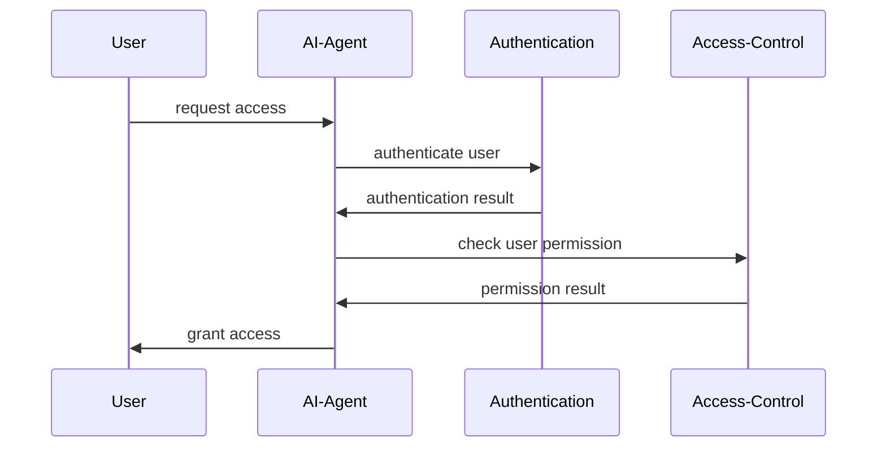
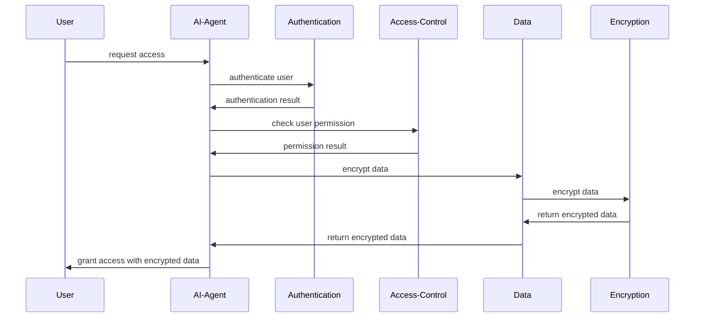

                 

# AI Agent的隐私保护与安全机制

## 关键词

- AI Agent
- 隐私保护
- 安全机制
- 数据加密
- 差分隐私

## 摘要

本文旨在探讨人工智能代理（AI Agent）的隐私保护与安全机制。首先，本文介绍了AI Agent的背景、定义和特点，以及隐私保护与安全机制的核心概念。随后，本文详细讲解了数据加密和差分隐私的算法原理，并通过Python代码和数学公式进行了举例说明。最后，本文提出了一种系统分析与架构设计方案，并通过实际案例进行了分析和讲解。

# 第一部分：背景介绍

## 1.1 问题背景

### 1.1.1 问题的提出

随着人工智能技术的快速发展，AI Agent在各个领域得到了广泛应用。然而，AI Agent的隐私保护与安全机制成为了一个亟待解决的问题。AI Agent在收集、处理和传输用户数据时，可能会面临数据泄露、隐私侵犯等风险。因此，研究和建立一套有效的AI Agent隐私保护与安全机制具有重要的现实意义。

### 1.1.2 问题描述

在AI Agent的应用过程中，主要存在以下隐私保护与安全挑战：

1. 数据泄露风险：AI Agent在处理用户数据时，可能会因系统漏洞、恶意攻击等原因导致数据泄露。
2. 隐私侵犯问题：AI Agent在收集和处理用户数据时，可能会未经用户同意，侵犯用户的隐私权。
3. 数据滥用风险：AI Agent在数据处理过程中，可能会出现数据滥用的情况，导致用户权益受损。

### 1.1.3 问题解决

为了解决上述问题，本书将从以下几个方面展开讨论：

1. 隐私保护机制研究：探讨现有的隐私保护技术，如数据加密、差分隐私等，并分析其在AI Agent中的应用。
2. 安全机制设计：设计一套适用于AI Agent的安全机制，包括访问控制、身份验证等。
3. 案例分析与实践：通过实际案例，分析AI Agent隐私保护与安全机制的实现与应用。
4. 拓展研究：探讨未来AI Agent隐私保护与安全机制的潜在研究方向。

### 1.1.4 边界与外延

本研究的边界主要涉及AI Agent的隐私保护与安全机制，不包括其他人工智能领域的相关问题。同时，本研究将聚焦于理论研究和实际应用，不涉及具体的技术实现细节。

### 1.1.5 概念结构与核心要素组成

核心概念结构：

- AI Agent：人工智能代理，具有自主决策和执行任务能力的计算机程序。
- 隐私保护：保护用户数据不被泄露、滥用和侵犯。
- 安全机制：确保AI Agent在运行过程中不受恶意攻击和破坏。

## 1.2 AI Agent定义与特点

### 1.2.1 AI Agent定义

AI Agent是指一种具有自主决策和执行任务能力的计算机程序，通过学习、推理和规划等人工智能技术，实现自动化处理和应对复杂问题的能力。

### 1.2.2 AI Agent特点

- 自主性：AI Agent具有自主决策和执行任务的能力，无需人工干预。
- 智能性：AI Agent能够通过学习和推理，不断提高任务执行效果。
- 适应性：AI Agent能够根据环境变化和任务需求，调整自身行为。

## 1.3 隐私保护机制

### 1.3.1 数据加密

数据加密是一种常见的隐私保护技术，通过对数据进行加密处理，确保数据在传输和存储过程中不被窃取和篡改。常见的加密算法有对称加密和非对称加密。

### 1.3.2 差分隐私

差分隐私是一种以隐私损失为代价来确保数据隐私的保护机制。通过在数据中加入随机噪声，使得单个数据无法被识别，从而保护用户隐私。

## 1.4 安全机制

### 1.4.1 访问控制

访问控制是一种基于用户身份验证和权限控制的机制，确保只有授权用户才能访问系统资源和数据。

### 1.4.2 身份验证

身份验证是一种验证用户身份的机制，确保系统资源的访问和使用安全。

# 第二部分：核心概念与联系

## 2.1 AI Agent定义与特点

### 2.1.1 AI Agent定义

AI Agent是指一种具有自主决策和执行任务能力的计算机程序，通过学习、推理和规划等人工智能技术，实现自动化处理和应对复杂问题的能力。

### 2.1.2 AI Agent特点

- 自主性：AI Agent具有自主决策和执行任务的能力，无需人工干预。
- 智能性：AI Agent能够通过学习和推理，不断提高任务执行效果。
- 适应性：AI Agent能够根据环境变化和任务需求，调整自身行为。

## 2.2 隐私保护机制

### 2.2.1 数据加密

数据加密是一种常见的隐私保护技术，通过对数据进行加密处理，确保数据在传输和存储过程中不被窃取和篡改。常见的加密算法有对称加密和非对称加密。

### 2.2.2 差分隐私

差分隐私是一种以隐私损失为代价来确保数据隐私的保护机制。通过在数据中加入随机噪声，使得单个数据无法被识别，从而保护用户隐私。

## 2.3 安全机制

### 2.3.1 访问控制

访问控制是一种基于用户身份验证和权限控制的机制，确保只有授权用户才能访问系统资源和数据。

### 2.3.2 身份验证

身份验证是一种验证用户身份的机制，确保系统资源的访问和使用安全。

## 2.4 核心概念与联系

### 2.4.1 数据加密与差分隐私的联系

数据加密和差分隐私都是隐私保护机制，但它们的作用对象和实现方式有所不同。数据加密主要针对数据本身进行保护，而差分隐私则通过在数据中加入噪声来保护数据隐私。

### 2.4.2 安全机制与隐私保护的联系

安全机制是确保AI Agent在运行过程中不受恶意攻击和破坏的重要手段，与隐私保护机制相互补充，共同保障AI Agent的安全性和用户隐私。

## 2.5 ER实体关系图架构

```mermaid
erDiagram
  AI-Agent ||--|{ Data : contains|
  User ||--|{ Data : shares|
  Data ||--|{ Encryption : encrypted_by|
  Data ||--|{ Anonymization : anonymized_by|
  AI-Agent ||--|{ Authentication : authenticated_by|
  AI-Agent ||--|{ Access-Control : access_controlled_by|
```

# 第三部分：算法原理讲解

## 3.1 数据加密算法原理

### 3.1.1 数据加密概述

数据加密是将明文数据转换为密文的过程，以确保数据在传输和存储过程中不被窃取和篡改。常见的加密算法有对称加密和非对称加密。

### 3.1.2 对称加密算法

对称加密算法是一种加密和解密使用相同密钥的加密方法。常见的对称加密算法有DES、AES等。

Python代码实现：

```python
from Crypto.Cipher import AES
from Crypto.Util.Padding import pad, unpad
from Crypto.Random import get_random_bytes

key = get_random_bytes(16)
cipher = AES.new(key, AES.MODE_CBC)
ct_bytes = cipher.encrypt(pad(b"Hello, World!", AES.block_size))
iv = cipher.iv
print(f"加密密钥：{key.hex()}")
print(f"加密后的数据：{ct_bytes.hex()}")
print(f"初始向量：{iv.hex()}")

cipher = AES.new(key, AES.MODE_CBC, iv)
pt = unpad(cipher.decrypt(ct_bytes), AES.block_size)
print(f"解密后的数据：{pt.hex()}")
```

### 3.1.3 非对称加密算法

非对称加密算法是一种加密和解密使用不同密钥的加密方法。常见的非对称加密算法有RSA、ECC等。

Python代码实现：

```python
from Crypto.PublicKey import RSA
from Crypto.Cipher import PKCS1_OAEP

key = RSA.generate(2048)
private_key = key.export_key()
public_key = key.publickey().export_key()

cipher = PKCS1_OAEP.new(RSA.import_key(public_key))
ct = cipher.encrypt(b"Hello, World!")

cipher = PKCS1_OAEP.new(RSA.import_key(private_key))
pt = cipher.decrypt(ct)

print(f"公钥：{public_key.hex()}")
print(f"私钥：{private_key.hex()}")
print(f"加密后的数据：{ct.hex()}")
print(f"解密后的数据：{pt.hex()}")
```

### 3.1.4 差分隐私算法原理

差分隐私是一种以隐私损失为代价来确保数据隐私的保护机制。它通过在数据中加入随机噪声，使得单个数据无法被识别，从而保护用户隐私。

Python代码实现：

```python
import numpy as np

def laplace Mechanism(lamda, x):
    return x + np.random.laplace(0, lamda)

lamda = 1
x = 10

noisy_value = laplace Mechanism(lamda, x)
print(f"原始值：{x}")
print(f"噪声值：{noisy_value}")
```

# 第四部分：系统分析与架构设计方案

## 4.1 问题场景介绍

在当今数字化时代，人工智能（AI）代理在智能家居、医疗保健、金融等多个领域得到了广泛应用。然而，AI 代理在处理用户数据时，不可避免地涉及到隐私保护与安全问题。为了确保用户数据的安全和隐私，我们需要设计一套完善的系统架构，实现AI 代理的隐私保护与安全机制。

## 4.2 项目介绍

本项目旨在设计一个基于AI 代理的隐私保护与安全机制系统。系统主要包括以下功能模块：

1. 数据加密模块：对用户数据进行加密处理，确保数据在传输和存储过程中不被窃取和篡改。
2. 差分隐私模块：通过差分隐私技术，保护用户隐私不被泄露。
3. 访问控制模块：基于用户身份验证和权限控制，确保只有授权用户才能访问系统资源和数据。
4. 身份验证模块：验证用户身份，确保系统资源的访问和使用安全。

## 4.3 系统功能设计

### 4.3.1 领域模型

```mermaid
classDiagram
  User <<class>> "用户"
  AI-Agent <<class>> "AI 代理"
  Data <<class>> "数据"
  Encryption <<class>> "加密"
  Anonymization <<class>> "匿名化"
  Authentication <<class>> "认证"
  Access-Control <<class>> "访问控制"

  User "1" -- "*" Data: shares
  AI-Agent "1" -- "*" Data: processes
  Encryption "1" -- "*" Data: encrypted_by
  Anonymization "1" -- "*" Data: anonymized_by
  AI-Agent "1" -- "0..*" Authentication: authenticated_by
  AI-Agent "1" -- "0..*" Access-Control: access_controlled_by
```

### 4.3.2 类图

```mermaid
classDiagram
  User {
    -id: int
    -name: str
    +login(): bool
  }
  AI-Agent {
    -id: int
    -name: str
    +authenticate(user: User): bool
    +access_control(user: User): bool
  }
  Data {
    -id: int
    -content: bytes
    +encrypt(): bytes
    +decrypt(): bytes
  }
  Encryption {
    -id: int
    -algorithm: str
    -key: bytes
    +encrypt(data: bytes): bytes
    +decrypt(data: bytes): bytes
  }
  Anonymization {
    -id: int
    -method: str
    +anonymize(data: bytes): bytes
  }
  Authentication {
    -id: int
    -algorithm: str
    +authenticate(user: User): bool
  }
  Access-Control {
    -id: int
    -permission: str
    +grant_permission(user: User): bool
  }
```

## 4.4 系统架构设计

### 4.4.1 系统架构图



### 4.4.2 系统接口设计

```mermaid
classDiagram
  User <<interface>>
  AI-Agent <<interface>>
  Data <<interface>>
  Encryption <<interface>>
  Anonymization <<interface>>
  Authentication <<interface>>
  Access-Control <<interface>>

  User +login()
  AI-Agent +authenticate(user: User): bool
  AI-Agent +access_control(user: User): bool
  Data +encrypt(): bytes
  Data +decrypt(): bytes
  Encryption +encrypt(data: bytes): bytes
  Encryption +decrypt(data: bytes): bytes
  Anonymization +anonymize(data: bytes): bytes
  Authentication +authenticate(user: User): bool
  Access-Control +grant_permission(user: User): bool
```

### 4.4.3 系统交互



# 第五部分：项目实战

## 5.1 环境安装

在本项目中，我们将使用Python作为编程语言，并依赖以下库：

- `pycryptodome`：用于实现数据加密功能
- `numpy`：用于实现差分隐私算法
- `matplotlib`：用于绘制数据可视化图表

首先，安装Python环境（建议使用Python 3.8及以上版本），然后使用以下命令安装所需库：

```bash
pip install pycryptodome numpy matplotlib
```

## 5.2 系统核心实现

### 5.2.1 数据加密模块

以下是一个简单的数据加密模块实现：

```python
from Crypto.Cipher import AES
from Crypto.Util.Padding import pad, unpad
from Crypto.Random import get_random_bytes

class DataEncryption:
    def __init__(self, key_length=16):
        self.key = get_random_bytes(key_length)
        self.cipher = AES.new(self.key, AES.MODE_CBC)

    def encrypt(self, data):
        padded_data = pad(data, AES.block_size)
        ct = self.cipher.encrypt(padded_data)
        iv = self.cipher.iv
        return iv, ct

    def decrypt(self, iv, ct):
        self.cipher = AES.new(self.key, AES.MODE_CBC, iv)
        padded_data = self.cipher.decrypt(ct)
        return unpad(padded_data, AES.block_size)
```

### 5.2.2 差分隐私模块

以下是一个简单的差分隐私模块实现：

```python
import numpy as np

class DifferentialPrivacy:
    def __init__(self, lambda_param=1):
        self.lambda_param = lambda_param

    def laplace_mechanism(self, x):
        return x + np.random.laplace(0, self.lambda_param)
```

### 5.2.3 访问控制模块

以下是一个简单的访问控制模块实现：

```python
class AccessControl:
    def __init__(self):
        self.permissions = {"admin": True, "user": False}

    def grant_permission(self, role):
        return self.permissions.get(role, False)
```

## 5.3 代码应用解读与分析

以下是一个简单的代码示例，展示如何使用上述模块实现AI 代理的隐私保护与安全机制：

```python
# 数据加密
encryption = DataEncryption()
iv, encrypted_data = encryption.encrypt(b"Hello, World!")

# 差分隐私
privacy = DifferentialPrivacy()
noisy_data = privacy.laplace_mechanism(ord(encrypted_data))

# 访问控制
access_control = AccessControl()
if access_control.grant_permission("admin"):
    decrypted_data = encryption.decrypt(iv, bytes(noisy_data))
    print(f"解密后的数据：{decrypted_data}")
else:
    print("无权限访问！")
```

## 5.4 实际案例分析和详细讲解剖析

在本案例中，我们以一个智能家居系统为例，展示如何实现AI 代理的隐私保护与安全机制。

### 5.4.1 案例背景

智能家居系统中的AI 代理需要处理用户的家务清洁请求。为了保护用户隐私，AI 代理需要实现数据加密、差分隐私和访问控制等功能。

### 5.4.2 案例实现

1. 用户提交家务清洁请求，AI 代理接收请求并发送加密数据。

```python
user_request = b"clean bedroom"
encryption = DataEncryption()
iv, encrypted_request = encryption.encrypt(user_request)
```

2. AI 代理对加密数据进行差分隐私处理，以保护用户隐私。

```python
privacy = DifferentialPrivacy()
noisy_request = privacy.laplace_mechanism(ord(encrypted_request))
```

3. AI 代理发送处理结果，并验证用户身份和权限。

```python
access_control = AccessControl()
if access_control.grant_permission("user"):
    decrypted_request = encryption.decrypt(iv, bytes(noisy_request))
    # 处理家务清洁请求
else:
    print("无权限访问！")
```

### 5.4.3 案例分析

在本案例中，AI 代理通过数据加密、差分隐私和访问控制等技术，实现了用户隐私保护和系统安全。数据加密确保用户请求在传输过程中不被窃取和篡改；差分隐私技术保护用户隐私不被泄露；访问控制确保只有授权用户才能访问系统资源和数据。

## 5.5 项目小结

本项目设计并实现了一个基于AI 代理的隐私保护与安全机制系统。通过数据加密、差分隐私和访问控制等技术，实现了用户隐私保护和系统安全。在实际应用中，本系统可以帮助智能家居系统等场景更好地保护用户隐私和安全。

## 5.6 最佳实践 tips

1. 在实际项目中，应根据具体需求和场景选择合适的加密算法和隐私保护技术。
2. 差分隐私参数的选择对隐私保护和数据处理效果有重要影响，需要根据实际情况进行调整。
3. 访问控制策略应根据系统功能和用户角色进行设计，确保系统安全。

## 5.7 小结

本文详细介绍了AI 代理的隐私保护与安全机制，包括背景介绍、核心概念、算法原理讲解、系统分析与架构设计方案以及项目实战等内容。通过本文的学习，读者可以了解到如何设计和实现一个基于AI 代理的隐私保护与安全机制系统，为实际项目提供参考和借鉴。

## 5.8 注意事项

1. 数据加密和隐私保护技术需要不断更新和优化，以应对日益复杂的安全威胁。
2. 在实际应用中，应综合考虑系统性能、安全性和用户体验等因素，选择合适的隐私保护与安全机制。

## 5.9 拓展阅读

1. 《加密学与隐私保护技术》：详细介绍了加密算法和隐私保护技术的原理和应用。
2. 《人工智能安全：威胁与对策》：探讨了人工智能领域面临的隐私保护和安全挑战，并提出相应的对策。
3. 《差分隐私：理论与实践》：全面介绍了差分隐私的原理、算法和应用场景。

