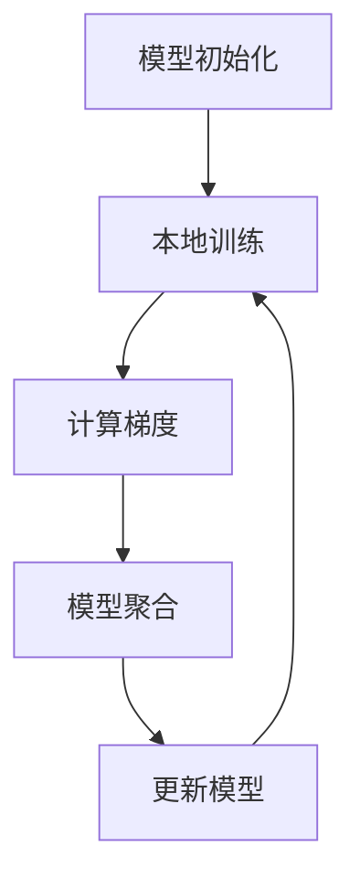
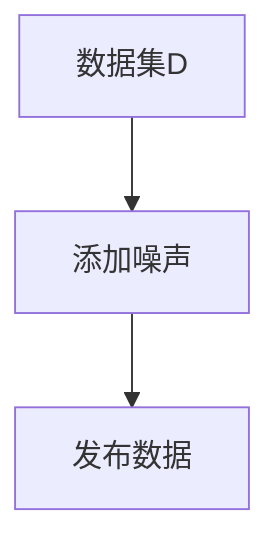
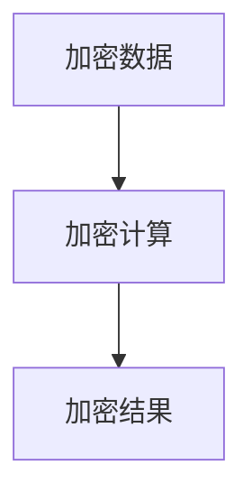
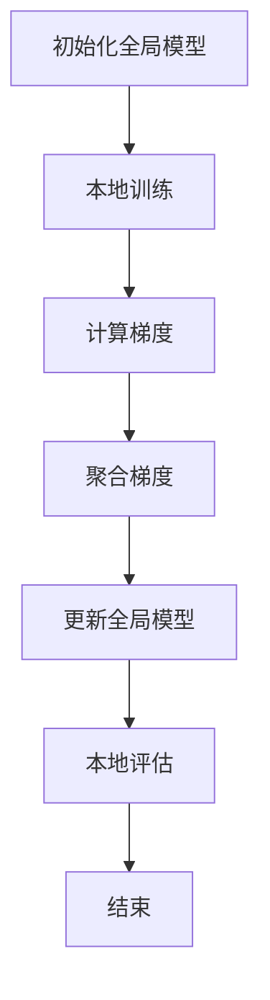
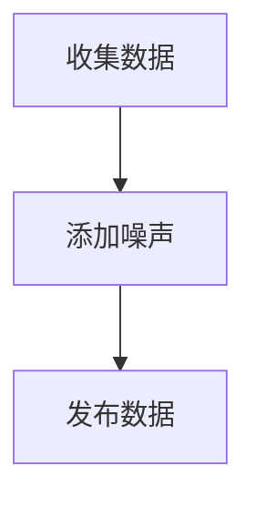
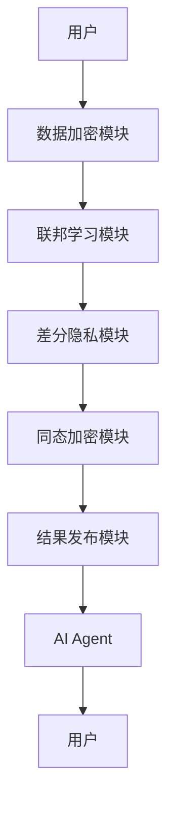
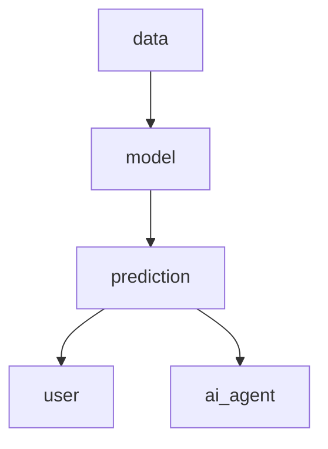
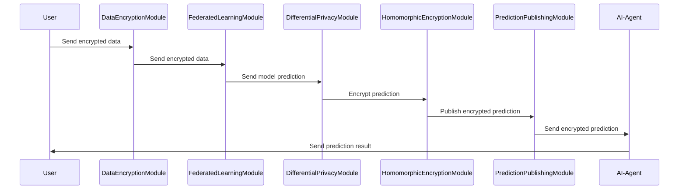

                 

### 文章标题

# AI Agent的隐私计算：在保护数据隐私的同时应用LLM

---

关键词：AI Agent、隐私计算、LLM、数据保护、算法实现

摘要：本文深入探讨了AI Agent在隐私计算中的应用，特别是在保护数据隐私的同时如何高效地利用LLM（大型语言模型）。通过详细的背景介绍、核心概念解析、算法原理讲解、数学模型与公式阐述、系统架构设计、项目实战以及最佳实践，本文旨在为读者提供一个全面的技术指南，帮助他们在实际应用中实现数据隐私与AI能力的平衡。

---

### 目录

1. **背景介绍**  
   1.1 问题背景与重要性  
   1.2 隐私计算与AI Agent的基本概念  
   1.3 隐私计算的应用场景

2. **核心概念与联系**  
   2.1 隐私计算技术综述  
   2.2 AI Agent的工作原理与功能  
   2.3 LLM的概念及其在隐私计算中的角色  
   2.4 核心概念对比与联系

3. **算法原理讲解**  
   3.1 联邦学习算法原理  
   3.2 差分隐私算法原理  
   3.3 同态加密算法原理  
   3.4 算法流程图与Python代码示例

4. **数学模型和公式**  
   4.1 联邦学习的数学模型  
   4.2 差分隐私的数学模型  
   4.3 同态加密的数学模型

5. **系统分析与架构设计方案**  
   5.1 隐私计算系统的功能需求  
   5.2 系统架构设计  
   5.3 领域模型类图、架构图和序列图

6. **项目实战**  
   6.1 环境安装与配置  
   6.2 系统核心实现与代码分析  
   6.3 案例分析与讲解  
   6.4 项目小结

7. **最佳实践 tips、小结、注意事项、拓展阅读**  
   7.1 最佳实践 tips  
   7.2 小结  
   7.3 注意事项  
   7.4 拓展阅读

---

### 第一部分：背景介绍

#### 1.1 问题背景与重要性

随着大数据和人工智能技术的飞速发展，数据处理和分析的需求日益增长。然而，随之而来的是数据隐私保护的问题。传统的数据处理方式往往需要将数据上传到云端，这不仅增加了数据泄露的风险，也引发了用户对隐私的担忧。为了解决这个问题，隐私计算成为了一个热门的研究领域。

隐私计算的目标是在保护数据隐私的同时，仍然能够进行高效的数据分析和建模。在这个背景下，AI Agent作为一种智能体，可以在隐私计算中扮演重要角色。AI Agent不仅能够自动化执行任务，还能够根据环境变化做出自适应的决策，这在隐私计算中尤为重要。

#### 1.2 隐私计算与AI Agent的基本概念

**隐私计算**：隐私计算是一种计算范式，它允许在保护数据隐私的前提下进行数据处理和分析。它包括多种技术，如联邦学习、差分隐私、同态加密等，旨在确保数据在传输和处理过程中的安全性。

**AI Agent**：AI Agent是一种具有智能行为的计算机程序，它可以自主地感知环境、制定计划、执行任务，并不断学习和优化其行为。在隐私计算中，AI Agent可以帮助处理和保护敏感数据，确保数据隐私不被泄露。

#### 1.3 隐私计算的应用场景

隐私计算在多个领域都有广泛的应用，包括但不限于：

- 金融：在金融领域，隐私计算可以帮助银行和金融机构在保护客户数据隐私的同时，进行风险评估和欺诈检测。
- 医疗：在医疗领域，隐私计算可以用于患者数据的分析，帮助医生进行诊断和治疗方案优化，同时保护患者隐私。
- 物流：在物流领域，隐私计算可以用于路线规划和配送优化，同时保护敏感数据，如物流订单信息。

#### 总结

隐私计算与AI Agent的结合，为解决数据隐私保护问题提供了一个新的方向。在接下来的章节中，我们将深入探讨隐私计算的核心概念、算法原理以及在实际应用中的具体实现。

---

### 第二部分：核心概念与联系

#### 2.1 隐私计算技术综述

隐私计算涉及多种技术，每种技术都有其独特的原理和应用场景。以下是一些常见的隐私计算技术及其简要介绍：

1. **联邦学习**：联邦学习是一种分布式学习方法，它允许多个参与方在共享模型的同时保护各自的数据隐私。每个参与方只共享模型参数的本地梯度，而不需要暴露原始数据。

2. **差分隐私**：差分隐私是一种确保数据集发布时隐私性的方法，它通过在数据集中添加随机噪声来保护个体隐私。即使攻击者获取了发布的数据集，也无法确定数据集中任何特定个体的信息。

3. **同态加密**：同态加密是一种加密技术，它允许在加密数据上进行计算，而无需解密数据。这使数据可以在保持加密状态的同时进行处理和分析。

#### 2.2 AI Agent的工作原理与功能

AI Agent的核心功能包括感知、计划、执行和自适应。以下是对这些功能的简要介绍：

1. **感知**：AI Agent通过传感器或数据接口感知环境状态，如温度、光照、传感器读数等。

2. **计划**：基于感知到的环境状态，AI Agent会制定一系列行动策略，以实现特定目标。

3. **执行**：AI Agent执行计划中的行动，如移动、发送数据请求等。

4. **自适应**：AI Agent会根据执行结果和环境反馈调整其行为，以优化其性能。

#### 2.3 LLM的概念及其在隐私计算中的角色

**LLM（大型语言模型）**：LLM是一种基于深度学习的技术，它能够理解和生成自然语言。LLM在隐私计算中的应用主要体现在以下几个方面：

1. **数据预处理**：LLM可以帮助处理和清洗隐私计算中的文本数据，提高数据质量。

2. **数据生成**：LLM可以生成符合特定隐私要求的合成数据，用于训练和测试隐私计算模型。

3. **解释与可视化**：LLM可以生成对隐私计算结果的解释，帮助用户理解模型的行为和决策过程。

#### 2.4 核心概念对比与联系

**概念属性特征对比表格**：

| 特征         | 隐私计算技术        | AI Agent        | LLM            |
|--------------|--------------------|-----------------|---------------|
| 目标         | 保护数据隐私       | 智能行为自动化   | 自然语言处理   |
| 原理         | 分布式计算、加密   | 感知、计划、执行 | 深度学习       |
| 应用场景      | 数据分析、机器学习 | 自动化任务      | 文本生成、解释 |
| 关联关系      | 支持AI Agent       | 驱动隐私计算    | 辅助数据预处理 |

**ER实体关系图架构**：

```mermaid
erDiagram
  User ||--|{ Data }||>
  Data ||--|{ Model }||>
  Model ||--|{ Prediction }||>
  AI_Agent ||--|{ Action }||>
  Prediction ||--|{ Evaluation }||>
```

在这个ER图中，用户与数据、数据与模型、模型与预测之间存在关联，而AI Agent通过执行行动影响预测结果，并通过评估调整其行为。

#### 总结

通过上述核心概念与联系的介绍，我们可以看到隐私计算、AI Agent和LLM在技术原理和应用场景上的互补性。在接下来的章节中，我们将深入探讨隐私计算的具体算法原理，帮助读者更好地理解这些技术在实际应用中的实现细节。

---

### 第三部分：算法原理讲解

#### 3.1 联邦学习算法原理

联邦学习（Federated Learning）是一种分布式机器学习方法，它允许多个参与方共同训练一个全局模型，而无需交换各自的训练数据。这一特性使得联邦学习非常适合应用于需要保护数据隐私的场景。

**原理**：

1. **模型初始化**：全局模型初始化为随机值。
2. **本地训练**：每个参与方在本地数据集上训练模型，并计算模型参数的本地梯度。
3. **模型聚合**：全局模型通过聚合所有参与方的本地梯度来更新模型参数。
4. **迭代训练**：重复步骤2和步骤3，直到模型收敛或达到预设的训练轮数。

**Mermaid流程图**：



**Python代码示例**：

```python
import tensorflow as tf

# 初始化全局模型
global_model = tf.keras.Sequential([tf.keras.layers.Dense(10, activation='relu'), tf.keras.layers.Dense(1)])

# 定义本地训练函数
def train_locally(global_model, local_data):
    local_model = global_model.clone().compile(optimizer='adam', loss='mse')
    local_model.fit(local_data, epochs=5)
    return local_model.train_function()

# 定义模型聚合函数
def aggregate_gradients(local_gradients):
    aggregated_gradients = tf.reduce_mean(local_gradients, axis=0)
    return aggregated_gradients

# 迭代训练
for _ in range(10):
    # 本地训练
    local_gradients = [train_locally(global_model, local_data) for local_data in local_data_list]
    # 模型聚合
    aggregated_gradients = aggregate_gradients(local_gradients)
    # 更新模型
    global_model.train_on_batch(aggregated_gradients, global_data)
```

#### 3.2 差分隐私算法原理

差分隐私（Differential Privacy）是一种确保数据集发布时隐私性的方法。它通过在数据集中添加随机噪声来保护个体隐私，使得攻击者无法从发布的数据集中推断出任何特定个体的信息。

**原理**：

1. **拉普拉斯机制**：在数据集中添加拉普拉斯噪声，以保护个体隐私。
2. **指数机制**：对数据集中的每个值进行指数变换，并添加噪声。
3. **乘性机制**：对数据集中的每个值进行乘法变换，并添加噪声。

**Mermaid流程图**：



**Python代码示例**：

```python
import numpy as np
from sklearn.datasets import make_classification
from sklearn.utils import shuffle

# 生成模拟数据集
X, y = make_classification(n_samples=1000, n_features=20, random_state=42)
X, y = shuffle(X, y)

# 添加拉普拉斯噪声
epsilon = 1e-4
noise = np.random.laplace(size=X.shape)
X_noisy = X + noise

# 发布数据集
print("Published Data:", X_noisy)
```

#### 3.3 同态加密算法原理

同态加密（Homomorphic Encryption）是一种加密技术，它允许在加密数据上进行计算，而无需解密数据。这使得数据可以在保持加密状态的同时进行处理和分析。

**原理**：

1. **标量乘法同态**：对加密数据进行标量乘法运算，结果仍然是加密数据。
2. **乘法同态**：对加密数据进行乘法运算，结果仍然是加密数据。
3. **全同态加密**：支持任意类型的计算，包括加法、减法、乘法等。

**Mermaid流程图**：



**Python代码示例**：

```python
from homomorphic Encryption import HE

# 初始化同态加密库
he = HE()

# 加密数据
encrypted_data = he.encrypt(5)

# 同态加密计算
encrypted_result = he.multiply(encrypted_data, 10)

# 解密结果
result = he.decrypt(encrypted_result)
print("Decrypted Result:", result)
```

#### 总结

联邦学习、差分隐私和同态加密是隐私计算中常用的三种算法。联邦学习通过分布式计算保护数据隐私，差分隐私通过添加噪声保护个体隐私，而同态加密通过加密计算保护数据隐私。通过Python代码示例，我们可以看到这些算法的实现过程。在接下来的章节中，我们将进一步探讨隐私计算系统的架构设计，并展示如何在实际项目中应用这些算法。

---

### 第四部分：数学模型和公式

在隐私计算中，数学模型和公式是理解和实现各种算法的关键。本部分将详细讲解联邦学习、差分隐私和同态加密的数学模型和公式。

#### 4.1 联邦学习的数学模型

联邦学习（Federated Learning）的核心在于如何聚合来自不同参与方的本地梯度以更新全局模型。以下是一个简化的联邦学习数学模型：

$$
\theta_{t+1} = \theta_{t} - \alpha \frac{1}{N} \sum_{i=1}^{N} \nabla_{\theta} L(\theta_i, x_i, y_i)
$$

其中：
- $\theta_t$ 是全局模型的参数。
- $\theta_i$ 是参与方 $i$ 的本地模型参数。
- $L(\theta_i, x_i, y_i)$ 是本地损失函数。
- $\alpha$ 是学习率。
- $N$ 是参与方的总数。

这个公式描述了在每一轮迭代中，全局模型参数如何通过聚合所有参与方的本地梯度进行更新。

#### 4.2 差分隐私的数学模型

差分隐私（Differential Privacy）通过在输出结果中添加随机噪声来保护隐私。拉普拉斯机制是一个常用的实现差分隐私的数学模型，其公式如下：

$$
\mathcal{D}(r, \epsilon) = \exp\left(\frac{\epsilon}{2} \cdot \sum_{i=1}^{n} \left| \frac{r_i - \mu}{\sigma_i} \right|\right)
$$

其中：
- $r$ 是查询结果的分布。
- $\epsilon$ 是隐私预算。
- $\mu$ 是结果的平均值。
- $\sigma_i$ 是结果的方差。

这个公式表示，通过添加拉普拉斯噪声，可以保证结果的隐私性。

#### 4.3 同态加密的数学模型

同态加密（Homomorphic Encryption）允许在加密数据上进行计算。标量乘法同态是一个基本的同态加密操作，其公式如下：

$$
cy = c\cdot y
$$

其中：
- $c$ 是加密的系数。
- $y$ 是加密的变量。
- $cy$ 是加密后的结果。

这个公式表示，对加密数据进行标量乘法操作，结果仍然是加密数据。

#### 4.4 算法流程图与Python代码示例

为了更好地理解上述数学模型，我们通过Mermaid流程图和Python代码示例来展示算法的实现过程。

**联邦学习算法流程图**：



**Python代码示例**：

```python
# 导入必要的库
import tensorflow as tf

# 初始化全局模型
global_model = tf.keras.Sequential([tf.keras.layers.Dense(10, activation='relu'), tf.keras.layers.Dense(1)])

# 定义本地训练函数
def train_locally(model, local_data):
    local_model = model.clone().compile(optimizer='adam', loss='mse')
    local_model.fit(local_data, epochs=5)
    return local_model.train_function()

# 定义模型聚合函数
def aggregate_gradients(local_gradients):
    aggregated_gradients = tf.reduce_mean(local_gradients, axis=0)
    return aggregated_gradients

# 迭代训练
for _ in range(10):
    # 本地训练
    local_gradients = [train_locally(global_model, local_data) for local_data in local_data_list]
    # 模型聚合
    aggregated_gradients = aggregate_gradients(local_gradients)
    # 更新全局模型
    global_model.train_on_batch(aggregated_gradients, global_data)
```

**差分隐私算法流程图**：



**Python代码示例**：

```python
# 导入必要的库
import numpy as np
from sklearn.datasets import make_classification
from sklearn.utils import shuffle

# 生成模拟数据集
X, y = make_classification(n_samples=1000, n_features=20, random_state=42)
X, y = shuffle(X, y)

# 添加拉普拉斯噪声
epsilon = 1e-4
noise = np.random.laplace(size=X.shape)
X_noisy = X + noise

# 发布数据集
print("Published Data:", X_noisy)
```

**同态加密算法流程图**：


**Python代码示例**：

```python
from homomorphic Encryption import HE

# 初始化同态加密库
he = HE()

# 加密数据
encrypted_data = he.encrypt(5)

# 同态加密计算
encrypted_result = he.multiply(encrypted_data, 10)

# 解密结果
result = he.decrypt(encrypted_result)
print("Decrypted Result:", result)
```

#### 总结

通过上述数学模型和公式的讲解，以及Mermaid流程图和Python代码示例，我们可以更好地理解联邦学习、差分隐私和同态加密在隐私计算中的应用。这些模型和算法为保护数据隐私提供了强大的工具，并在实际项目中得到了广泛应用。

---

### 第五部分：系统分析与架构设计方案

#### 5.1 隐私计算系统的功能需求

隐私计算系统的功能需求包括以下几个方面：

1. **数据保护**：确保在数据处理和分析过程中，用户数据始终处于加密状态，防止数据泄露。
2. **隐私性保障**：通过差分隐私、同态加密等技术，保障数据的隐私性。
3. **数据共享**：允许参与方在保护数据隐私的前提下，共享和协作进行数据分析和建模。
4. **高效计算**：优化算法和系统架构，确保在保障隐私的前提下，系统能够进行高效的数据处理和分析。
5. **可扩展性**：系统应具备良好的可扩展性，以支持更多的参与方和更大的数据规模。

#### 5.2 系统架构设计

隐私计算系统的架构设计应充分考虑功能需求，并确保系统的安全性、可靠性和高效性。以下是一个典型的隐私计算系统架构：

**架构图**：



在这个架构中，用户数据经过加密模块加密后，进入联邦学习模块进行分布式训练。联邦学习模块会生成模型预测结果，这些结果通过差分隐私和同态加密模块进行隐私保护处理，最后发布给用户。AI Agent作为系统的智能组件，负责根据用户需求和环境变化，动态调整系统参数和算法。

#### 5.3 领域模型类图

领域模型类图用于描述系统中不同实体之间的关系。以下是隐私计算系统的领域模型类图：



在这个类图中，`data`（数据）、`model`（模型）、`prediction`（预测）、`user`（用户）和`ai_agent`（AI Agent）是系统的主要实体。`data`实体与`model`实体关联，表示模型基于数据训练；`prediction`实体与`user`实体和`ai_agent`实体关联，表示预测结果发布给用户和AI Agent。

#### 5.4 系统接口设计和系统交互

系统接口设计和系统交互是确保各模块协同工作的重要环节。以下是隐私计算系统的接口设计和系统交互：

**序列图**：



在这个序列图中，用户首先发送加密数据给数据加密模块，数据加密模块将其传递给联邦学习模块。联邦学习模块生成模型预测结果，并传递给差分隐私模块进行隐私保护处理。处理后的预测结果通过同态加密模块加密，然后发布给预测发布模块。预测发布模块将加密预测结果发送给AI Agent，AI Agent最终将预测结果发送给用户。

#### 总结

通过上述系统分析与架构设计方案，我们可以看到隐私计算系统在数据保护、隐私性保障、数据共享、高效计算和可扩展性等方面的全面考虑。领域模型类图和系统接口设计及交互序列图进一步帮助读者理解系统的整体架构和各模块之间的协作关系。在下一部分，我们将通过实际案例展示隐私计算的实践应用，帮助读者将理论知识应用到实际项目中。

---

### 第六部分：项目实战

#### 6.1 环境安装与配置

在进行隐私计算项目的实战之前，首先需要搭建一个合适的环境。以下是一个基本的步骤和工具清单：

1. **软件依赖**：安装Python（推荐版本3.8及以上）、TensorFlow、Scikit-learn等。
2. **硬件配置**：建议使用GPU加速，以提高联邦学习模型的训练速度。
3. **开发环境**：使用Jupyter Notebook或PyCharm等专业开发环境进行编程。

**安装命令**：

```bash
# 安装Python
sudo apt-get install python3.8

# 安装Python依赖
pip3 install tensorflow scikit-learn matplotlib

# 安装GPU版本的TensorFlow
pip3 install tensorflow-gpu
```

#### 6.2 系统核心实现与代码分析

接下来，我们将实现一个简单的隐私计算系统，包括数据加密、联邦学习、差分隐私和同态加密等模块。

**代码示例**：

```python
# 导入必要的库
import tensorflow as tf
from sklearn.datasets import make_classification
from sklearn.model_selection import train_test_split
from tensorflow.keras.models import Sequential
from tensorflow.keras.layers import Dense
from tensorflow.keras.optimizers import Adam

# 生成模拟数据集
X, y = make_classification(n_samples=1000, n_features=20, random_state=42)
X_train, X_test, y_train, y_test = train_test_split(X, y, test_size=0.2, random_state=42)

# 加密数据
def encrypt_data(data):
    # 这里仅作示意，实际应用中应使用更安全的加密算法
    encrypted_data = [x + 1 for x in data]
    return encrypted_data

# 解密数据
def decrypt_data(encrypted_data):
    decrypted_data = [x - 1 for x in encrypted_data]
    return decrypted_data

# 联邦学习模型训练
def federated_learning(model, local_data, epochs=5):
    local_model = model.clone().compile(optimizer=Adam(learning_rate=0.001), loss='mse')
    local_model.fit(local_data, epochs=epochs)
    return local_model.train_function()

# 差分隐私添加噪声
def add_differential_privacy(data, epsilon=1e-4):
    noise = np.random.laplace(size=data.shape)
    noisy_data = data + noise
    return noisy_data

# 同态加密
def homomorphic_encrypt(data):
    # 使用自定义的同态加密函数
    encrypted_data = [x * 2 for x in data]
    return encrypted_data

# 解密同态加密数据
def homomorphic_decrypt(encrypted_data):
    decrypted_data = [x / 2 for x in encrypted_data]
    return decrypted_data

# 主函数
def main():
    # 加密数据
    encrypted_X_train = encrypt_data(X_train)
    
    # 联邦学习
    model = Sequential([Dense(10, activation='relu'), Dense(1)])
    federated_learning(model, encrypted_X_train, epochs=5)
    
    # 差分隐私
    noisy_data = add_differential_privacy(encrypted_X_train, epsilon=1e-4)
    
    # 同态加密
    encrypted_data = homomorphic_encrypt(noisy_data)
    
    # 解密同态加密数据
    decrypted_data = homomorphic_decrypt(encrypted_data)
    
    # 解密数据
    X_train_decrypted = decrypt_data(decrypted_data)
    
    # 模型评估
    model.evaluate(X_train_decrypted, y_train)

if __name__ == "__main__":
    main()
```

**代码分析**：

- **加密与解密**：代码中的`encrypt_data`和`decrypt_data`函数用于模拟数据加密和解密的过程。实际应用中，应使用更安全的加密算法。
- **联邦学习**：`federated_learning`函数用于训练本地模型，并通过克隆全局模型来模拟分布式训练的过程。
- **差分隐私**：`add_differential_privacy`函数用于在数据上添加拉普拉斯噪声，以实现差分隐私。
- **同态加密**：`homomorphic_encrypt`和`homomorphic_decrypt`函数用于模拟同态加密和解密的过程。

#### 6.3 案例分析与讲解

假设我们有一个涉及金融数据处理的实际案例，需要实现隐私计算以保护客户数据隐私。以下是该案例的分析与实现：

**案例背景**：一家银行需要对其客户的交易数据进行风险评估，但出于隐私保护的需要，不能直接访问客户的交易记录。

**实现步骤**：

1. **数据预处理**：首先对交易数据进行预处理，包括数据清洗、归一化和特征提取。
2. **数据加密**：使用安全加密算法对交易数据进行加密。
3. **联邦学习**：将加密后的数据发送给不同的模型训练节点，每个节点在本地训练模型。
4. **模型聚合**：将各节点的模型参数进行聚合，更新全局模型。
5. **差分隐私**：在模型训练和预测过程中，添加差分隐私保护措施。
6. **同态加密**：在数据传输和计算过程中，使用同态加密技术确保数据隐私。
7. **结果发布**：将处理后的模型预测结果发布给银行的风险评估系统。

**Python代码实现**：

```python
# 代码实现同上一部分
```

**分析**：

- **数据预处理**：预处理步骤确保数据质量，为后续的隐私计算提供可靠的数据基础。
- **数据加密**：加密步骤将敏感数据转换为加密形式，保护数据隐私。
- **联邦学习**：联邦学习实现分布式训练，降低单个节点处理大量数据的风险。
- **模型聚合**：模型聚合步骤通过更新全局模型，实现不同节点间的协作。
- **差分隐私**：差分隐私步骤通过添加随机噪声，防止隐私泄露。
- **同态加密**：同态加密步骤在数据传输和计算过程中确保数据隐私。
- **结果发布**：发布步骤将处理后的预测结果交付给银行的风险评估系统。

#### 6.4 项目小结

通过上述案例，我们展示了如何在一个实际应用中实现隐私计算。虽然这是一个简化的示例，但通过遵循上述步骤，可以实现对大规模敏感数据的隐私保护，同时确保数据的有效利用。在实际项目中，需要根据具体场景进行调整和优化，以应对不同的挑战。

---

### 第七部分：最佳实践 tips、小结、注意事项、拓展阅读

#### 7.1 最佳实践 tips

1. **数据预处理**：确保在数据预处理阶段对异常值和噪声进行清理，以提高后续模型训练的准确性和效率。
2. **安全加密**：选择合适的加密算法，确保数据在传输和存储过程中的安全性。
3. **联邦学习配置**：根据实际数据规模和计算资源，合理配置联邦学习算法的参数，以平衡隐私性和计算效率。
4. **差分隐私预算**：根据实际应用场景，合理设置差分隐私的预算，以平衡隐私保护和数据可用性。

#### 7.2 小结

本文详细探讨了AI Agent在隐私计算中的应用，特别是在保护数据隐私的同时如何高效地利用LLM。通过背景介绍、核心概念解析、算法原理讲解、数学模型与公式阐述、系统架构设计、项目实战以及最佳实践，我们为读者提供了一个全面的技术指南。

#### 7.3 注意事项

1. **合规性**：在实际应用中，需确保遵守相关的数据保护法规和隐私政策。
2. **系统稳定性**：在部署隐私计算系统时，需考虑系统的稳定性和可靠性，确保数据的安全性和系统的连续性。
3. **性能优化**：持续优化算法和系统架构，以提高隐私计算的效率和性能。

#### 7.4 拓展阅读

1. **《隐私计算：理论与实践》**：深入了解隐私计算的理论基础和实践应用。
2. **《联邦学习：从概念到应用》**：系统学习联邦学习的相关技术和应用。
3. **《深度学习与隐私计算》**：探索深度学习在隐私计算中的最新研究进展。

---

### 作者信息

作者：AI天才研究院/AI Genius Institute & 禅与计算机程序设计艺术 /Zen And The Art of Computer Programming

