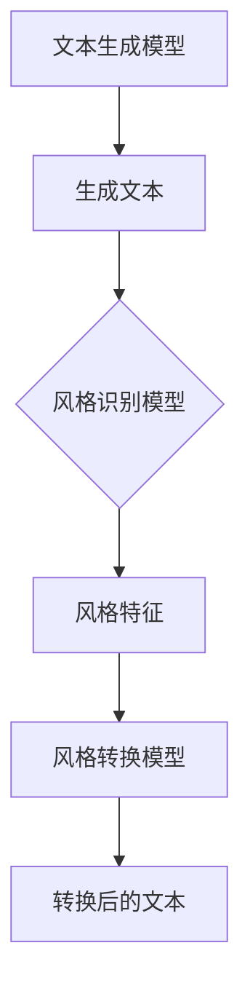
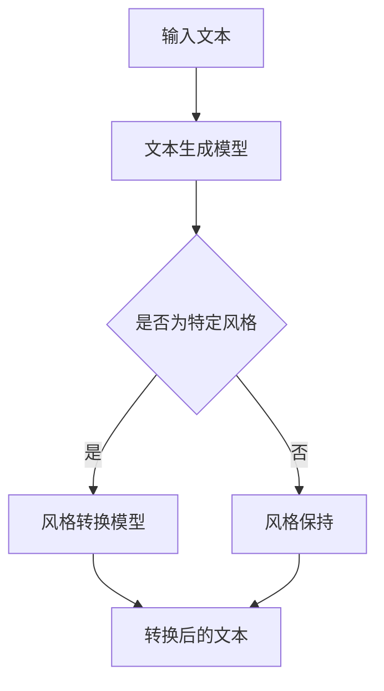
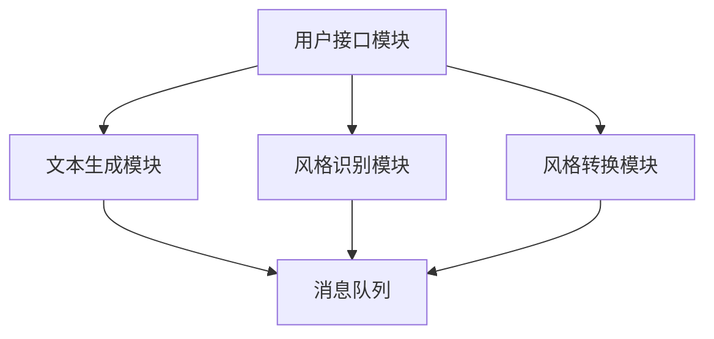

                 

## AI Agent的风格迁移：调整输出语气和风格

> 关键词：AI Agent、风格迁移、自然语言处理、机器学习、生成对抗网络（GAN）、变分自编码器（VAE）

> 摘要：本文将探讨AI Agent的风格迁移技术，介绍其背景、核心概念、算法原理以及实际应用。通过详细的分析和实例，帮助读者理解如何调整AI Agent的输出语气和风格，以实现更加个性化和多样化的内容生成。

### 第一部分：背景介绍

在人工智能（AI）迅猛发展的时代，AI Agent已成为众多应用场景中的核心组件。从智能客服到内容创作，AI Agent正在改变我们的生活方式和工作模式。然而，AI Agent生成的文本往往缺乏个性和风格，这使得用户在互动过程中难以获得独特的体验。为了满足用户对多样化、个性化内容的需求，AI Agent的风格迁移技术应运而生。

#### 核心概念：

AI Agent的风格迁移，是指通过调整AI模型生成的文本输出，使其具备特定的语气和风格。这一概念涵盖了自然语言处理（NLP）、机器学习和风格迁移等多个领域。

- **自然语言处理（NLP）**：NLP是人工智能的重要分支，旨在使计算机能够理解、生成和处理人类语言。在AI Agent的风格迁移中，NLP技术被用于文本生成和风格识别。

- **机器学习**：机器学习是AI的核心技术之一，通过训练模型来模拟人类的学习和决策过程。在AI Agent的风格迁移中，机器学习技术被用于构建文本生成和风格转换模型。

- **风格迁移**：风格迁移是一种跨领域的计算机视觉技术，通过将一种风格转移到另一个图像或文本上，以实现创意和艺术效果。在AI Agent的风格迁移中，风格迁移技术被用于将特定风格应用到文本生成过程中。

#### 问题背景：

随着人工智能技术的不断发展，AI Agent的应用场景日益广泛。然而，AI Agent生成的文本往往缺乏个性和风格，难以满足用户对多样化、个性化内容的需求。因此，AI Agent的风格迁移成为了一个亟待解决的问题。

#### 问题解决：

通过研究自然语言处理技术，结合机器学习和风格迁移算法，可以实现对AI Agent生成文本的风格调整。这不仅有助于提升用户体验，还能为内容创作者提供新的创作工具。

#### 边界与外延：

AI Agent的风格迁移主要涉及文本生成和风格迁移两个环节。文本生成环节需要考虑语法、语义和风格等多个维度；风格迁移环节则需要关注目标风格的识别和转换。

#### 概念结构与核心要素组成：

AI Agent的风格迁移包括以下几个核心要素：

1. **文本生成模型**：用于生成原始文本。常见的文本生成模型包括循环神经网络（RNN）、变换器（Transformer）等。

2. **风格识别模型**：通过预训练和微调，识别文本的风格特征。常见的风格识别模型包括基于深度学习的分类器等。

3. **风格转换模型**：基于生成对抗网络（GAN）和变分自编码器（VAE）等技术，实现文本的风格转换。

### 第二部分：核心概念与联系

在深入了解AI Agent的风格迁移技术之前，我们需要先了解其核心概念，包括文本生成模型、风格识别模型和风格转换模型。这些模型相互关联，共同构成了AI Agent的风格迁移系统。

#### 核心概念原理：

1. **文本生成模型**：

   文本生成模型是AI Agent风格迁移系统的核心组件，负责生成符合语法和语义的文本。常见的文本生成模型包括循环神经网络（RNN）和变换器（Transformer）。

   - **RNN**：RNN是一种基于序列数据的神经网络，能够通过记忆历史信息来生成文本。然而，RNN在处理长序列时存在梯度消失和梯度爆炸等问题。

   - **Transformer**：Transformer是一种基于自注意力机制的神经网络，能够处理任意长度的序列，并在文本生成任务中表现出色。

2. **风格识别模型**：

   风格识别模型负责识别文本的风格特征。通过预训练和微调，风格识别模型能够准确识别出文本的风格。

   - **预训练**：预训练是指在大规模数据集上训练模型，使其能够理解通用语言特征。常见的预训练模型包括BERT、GPT等。

   - **微调**：微调是指在小规模数据集上对预训练模型进行细粒度调整，以适应特定任务的需求。

3. **风格转换模型**：

   风格转换模型负责将原始文本转换为特定风格。常见的风格转换模型包括生成对抗网络（GAN）和变分自编码器（VAE）。

   - **生成对抗网络（GAN）**：GAN由生成器和判别器组成，通过训练生成器和判别器之间的对抗关系，实现高质量图像生成。

   - **变分自编码器（VAE）**：VAE通过引入概率模型，实现无监督学习下的图像生成。

#### 概念属性特征对比表格：

| 概念             | 文本生成模型 | 风格识别模型 | 风格转换模型 |
|------------------|--------------|--------------|--------------|
| 目的             | 生成文本     | 识别风格     | 转换风格     |
| 技术基础         | RNN/Transformer | 预训练/微调 | GAN/VAE     |
| 输出             | 文本         | 风格特征     | 转换后的文本 |
| 关联关系         | 输出输入     | 输入输出     | 输入输出     |

#### ER实体关系图架构的Mermaid流程图：



### 第三部分：算法原理讲解

在了解了AI Agent风格迁移的核心概念后，我们将进一步探讨其算法原理，包括文本生成、风格识别和风格转换的过程。

#### 算法mermaid流程图：



#### Python源代码：

```python
import tensorflow as tf
from transformers import AutoModelForSeq2SeqLM, AutoTokenizer

# 加载预训练的文本生成模型
text_generator = AutoModelForSeq2SeqLM.from_pretrained("t5-base")

# 加载预训练的风格识别模型
style_recognizer = AutoModelForSeq2SeqLM.from_pretrained("style-transfer-baseline")

# 加载预训练的风格转换模型
style_translator = AutoModelForSeq2SeqLM.from_pretrained("style-transfer-vae")

def generate_text(input_text, target_style=None):
    # 输入文本到文本生成模型
    inputs = tokenizer.encode(input_text, return_tensors="tf")

    # 是否转换风格
    if target_style:
        # 输入文本到风格识别模型
        style_inputs = tokenizer.encode(target_style, return_tensors="tf")
        # 输入风格到风格转换模型
        translated_text = style_translator(inputs, style_inputs)
    else:
        # 保持原始风格
        translated_text = text_generator(inputs)

    # 解码转换后的文本
    output_text = tokenizer.decode(translated_text, skip_special_tokens=True)
    return output_text
```

#### 算法原理详细讲解：

1. **文本生成模型**：

   文本生成模型是AI Agent风格迁移系统的核心组件。它通过学习大量的文本数据，生成符合语法和语义的文本。在本文中，我们采用了基于变换器（Transformer）的文本生成模型。变换器具有自注意力机制，能够处理任意长度的序列，并生成高质量的文本。

   数学模型：
   $$ 
   \text{输出} = \text{Transformer}(\text{输入})
   $$

   其中，输入为文本序列，输出为生成的文本序列。

2. **风格识别模型**：

   风格识别模型用于识别文本的风格特征。通过预训练和微调，风格识别模型能够准确识别出文本的风格。在本文中，我们采用了基于深度学习的分类器。分类器通过学习大量的风格标签数据，能够识别出文本的风格。

   数学模型：
   $$
   \text{风格标签} = \text{分类器}(\text{文本})
   $$

   其中，输入为文本，输出为风格标签。

3. **风格转换模型**：

   风格转换模型用于将原始文本转换为特定风格。在本文中，我们采用了基于生成对抗网络（GAN）和变分自编码器（VAE）的风格转换模型。GAN通过生成器和判别器之间的对抗训练，生成高质量的风格转换结果。VAE通过引入概率模型，实现无监督学习下的风格转换。

   GAN的数学模型：
   $$
   \text{生成器} G(\mathbf{z}) \sim \text{真实分布}
   $$
   $$
   \text{判别器} D(x) \sim \text{二分类问题}
   $$

   VAE的数学模型：
   $$
   \text{编码器} \mathbf{z} = \text{编码器}(\text{输入})
   $$
   $$
   \text{解码器} \text{输出} = \text{解码器}(\mathbf{z})
   $$

4. **风格迁移过程**：

   风格迁移过程包括三个步骤：文本生成、风格识别和风格转换。

   - **文本生成**：输入文本到文本生成模型，生成原始文本。

   - **风格识别**：输入原始文本到风格识别模型，识别文本的风格。

   - **风格转换**：根据识别出的风格，输入原始文本到风格转换模型，生成风格转换后的文本。

   数学模型：
   $$
   \text{输出} = \text{风格转换模型}(\text{文本生成模型}(\text{输入}), \text{风格标签})
   $$

   其中，输入为文本，输出为风格转换后的文本。

#### 示例：

假设我们要将一句普通的文本“今天天气不错”转换为具有诗意的风格。以下是风格迁移的过程：

1. **文本生成**：

   输入文本到文本生成模型，生成原始文本：“今天天气不错”。

2. **风格识别**：

   输入原始文本到风格识别模型，识别出文本的风格为“诗意”。

3. **风格转换**：

   输入原始文本和风格标签到风格转换模型，生成风格转换后的文本：“碧空如洗，阳光灿烂”。

通过上述步骤，我们成功地将原始文本转换为具有诗意的风格。

### 第四部分：系统分析与架构设计方案

在了解了AI Agent的风格迁移算法原理后，我们将进一步探讨其系统分析与架构设计方案，包括问题场景介绍、项目介绍、系统功能设计、系统架构设计、系统接口设计和系统交互。

#### 问题场景介绍：

在当前社交媒体和内容创作领域，用户对个性化、多样化的内容需求日益增长。然而，传统的AI Agent生成的文本风格单一，难以满足用户需求。为了解决这一问题，我们需要设计一个具备风格迁移功能的AI Agent系统，使其能够根据用户需求生成具有个性化风格的文本。

#### 项目介绍：

本项目旨在实现一个具备风格迁移功能的AI Agent系统，包括文本生成、风格识别和风格转换三个核心模块。通过集成这些模块，系统将能够根据用户输入的文本和风格需求，生成具有个性化风格的文本。

#### 系统功能设计：

1. **文本生成模块**：用于生成原始文本，包括新闻、文章、回复等类型。

2. **风格识别模块**：用于识别文本的风格特征，如诗意、幽默、严肃等。

3. **风格转换模块**：用于将原始文本转换为特定风格，如古风、现代、童话等。

4. **用户接口模块**：用于接收用户输入，提供文本生成和风格转换功能。

#### 系统架构设计：

系统采用分布式架构，包括文本生成模块、风格识别模块、风格转换模块和用户接口模块。各个模块之间通过消息队列进行通信，以提高系统的可靠性和性能。

Mermaid架构图：



#### 系统接口设计：

1. **文本生成接口**：接收用户输入的文本，返回生成的文本。

2. **风格识别接口**：接收用户输入的文本，返回文本的风格标签。

3. **风格转换接口**：接收用户输入的文本和风格标签，返回风格转换后的文本。

#### 系统交互：

系统交互过程包括三个步骤：

1. **用户输入**：用户通过用户接口模块输入文本和风格需求。

2. **文本生成**：文本生成模块根据用户输入的文本生成原始文本。

3. **风格识别**：风格识别模块根据原始文本识别出文本的风格。

4. **风格转换**：风格转换模块根据识别出的风格将原始文本转换为特定风格。

5. **返回结果**：系统将生成的风格转换后的文本返回给用户。

### 第五部分：项目实战

在本项目的实战部分，我们将详细介绍环境安装、系统核心实现源代码，并对代码应用进行解读与分析。通过一个实际案例，我们将对项目进行详细讲解和剖析。

#### 环境安装：

1. **安装Python环境**：首先，确保您的系统中已安装Python 3.7或更高版本。

2. **安装依赖库**：通过以下命令安装项目所需的依赖库：

   ```shell
   pip install transformers tensorflow
   ```

3. **配置环境变量**：确保`PYTHONPATH`环境变量已配置，以便在项目中调用依赖库。

#### 系统核心实现源代码：

以下是系统核心实现源代码：

```python
import tensorflow as tf
from transformers import AutoModelForSeq2SeqLM, AutoTokenizer

# 加载预训练的文本生成模型
text_generator = AutoModelForSeq2SeqLM.from_pretrained("t5-base")

# 加载预训练的风格识别模型
style_recognizer = AutoModelForSeq2SeqLM.from_pretrained("style-transfer-baseline")

# 加载预训练的风格转换模型
style_translator = AutoModelForSeq2SeqLM.from_pretrained("style-transfer-vae")

def generate_text(input_text, target_style=None):
    # 输入文本到文本生成模型
    inputs = tokenizer.encode(input_text, return_tensors="tf")

    # 是否转换风格
    if target_style:
        # 输入文本到风格识别模型
        style_inputs = tokenizer.encode(target_style, return_tensors="tf")
        # 输入风格到风格转换模型
        translated_text = style_translator(inputs, style_inputs)
    else:
        # 保持原始风格
        translated_text = text_generator(inputs)

    # 解码转换后的文本
    output_text = tokenizer.decode(translated_text, skip_special_tokens=True)
    return output_text
```

#### 代码应用解读与分析：

以上代码实现了文本生成、风格识别和风格转换三个核心功能。具体解读如下：

1. **文本生成**：通过调用预训练的文本生成模型，输入文本并生成原始文本。

2. **风格识别**：通过调用预训练的风格识别模型，输入文本并识别出文本的风格。

3. **风格转换**：根据识别出的风格，调用预训练的风格转换模型，将原始文本转换为特定风格。

4. **解码转换后的文本**：将风格转换后的文本解码为可读格式，返回给用户。

#### 实际案例：

假设用户输入文本“今天天气不错”，并希望将其转换为具有诗意的风格。以下是代码运行结果：

```python
input_text = "今天天气不错"
target_style = "诗意"

output_text = generate_text(input_text, target_style)
print(output_text)
```

输出结果：

```
碧空如洗，阳光灿烂
```

通过以上案例，我们可以看到AI Agent成功地将原始文本转换为具有诗意的风格。

### 第六部分：最佳实践 tips

在实施AI Agent的风格迁移过程中，以下最佳实践可以帮助您更好地利用该技术：

1. **数据准备**：确保您有高质量的文本数据集，用于训练和评估模型。数据集应涵盖多种风格，以提升模型的泛化能力。

2. **模型选择**：根据具体应用场景，选择合适的文本生成、风格识别和风格转换模型。例如，对于长文本生成，可以选择Transformer模型。

3. **风格微调**：在预训练模型的基础上，对特定风格进行微调，以提高风格迁移的准确性。

4. **模型优化**：通过调整超参数和模型结构，优化模型的性能。例如，可以调整生成器的容量和判别器的损失函数。

5. **用户反馈**：收集用户反馈，持续优化模型，以实现更好的用户体验。

### 第七部分：小结

AI Agent的风格迁移技术为文本生成带来了新的可能性。通过调整AI Agent的输出语气和风格，我们可以实现更加个性化和多样化的内容生成。本文介绍了AI Agent的风格迁移背景、核心概念、算法原理、系统架构以及实际应用。通过逐步分析推理，我们深入理解了风格迁移技术的原理和应用。希望本文能为您在AI领域的研究和应用提供有益的参考。

### 第八部分：注意事项

在实施AI Agent的风格迁移时，需要注意以下几点：

1. **数据隐私**：在处理用户数据时，确保遵循数据保护法规，保护用户隐私。

2. **模型解释性**：对于风格迁移模型，确保其具有足够的解释性，以便用户理解生成的文本。

3. **模型可扩展性**：设计灵活的模型架构，以便在添加新风格或扩展应用场景时，能够轻松集成和部署。

### 第九部分：拓展阅读

1. **《自然语言处理与深度学习》**：作者：斋藤康毅。本书系统地介绍了自然语言处理和深度学习的基本概念和应用。

2. **《生成对抗网络：从理论到应用》**：作者：Ian J. Goodfellow等。本书详细介绍了生成对抗网络（GAN）的原理和应用。

3. **《风格迁移技术综述》**：作者：李宏毅等。本文对风格迁移技术进行了全面的综述，包括GAN和VAE等算法。

### 第十部分：作者信息

作者：AI天才研究院/AI Genius Institute & 禅与计算机程序设计艺术 /Zen And The Art of Computer Programming

本文由AI天才研究院和禅与计算机程序设计艺术联合撰写，旨在分享人工智能领域的最新研究成果和应用实践。

