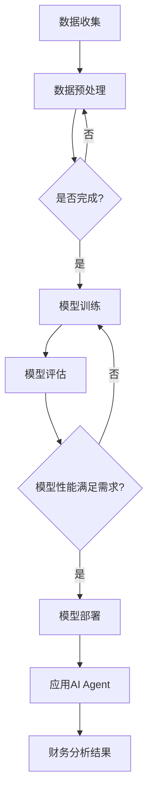

                 

# AI Agent辅助企业财务分析与预测

> 关键词：AI Agent、企业财务分析、预测、自动化、数据分析、风险管理

> 摘要：随着人工智能技术的快速发展，AI Agent在各个领域的应用日益广泛。本文将探讨AI Agent在企业财务分析与预测中的重要作用，通过深入分析AI Agent的基本原理、应用场景以及开发实践，为企业提供一种高效、可靠的财务管理工具。本文旨在帮助读者理解AI Agent在财务分析中的潜力与挑战，为企业的财务管理提供新思路。

## 目录大纲

----------------------------------------------------------------

## 第一部分: 引言

### 第1章: AI Agent辅助企业财务分析与预测概述

#### 1.1 问题背景

##### 1.1.1 企业财务分析的现状与挑战

##### 1.1.2 AI Agent在财务分析中的应用潜力

#### 1.2 核心概念

##### 1.2.1 AI Agent的概念与特点

##### 1.2.2 企业财务分析的主要任务

##### 1.2.3 AI Agent在财务预测中的应用

#### 1.3 边界与外延

##### 1.3.1 AI Agent的适用范围

##### 1.3.2 企业财务预测的数据来源与处理

##### 1.3.3 AI Agent的可靠性与安全性

#### 1.4 概念结构与核心要素

##### 1.4.1 AI Agent的组成结构

##### 1.4.2 企业财务分析的核心要素

##### 1.4.3 AI Agent与财务分析的关系

#### 1.5 本章小结

----------------------------------------------------------------

## 第二部分: AI Agent辅助财务分析原理

### 第2章: AI Agent基础

#### 2.1 AI Agent的基本原理

##### 2.1.1 机器学习与深度学习

##### 2.1.2 自然语言处理

##### 2.1.3 强化学习

#### 2.2 财务分析中的数学模型

##### 2.2.1 财务指标的计算方法

##### 2.2.2 时间序列分析与预测

##### 2.2.3 回归分析与预测

#### 2.3 AI Agent在财务分析中的应用

##### 2.3.1 自动化财务报告

##### 2.3.2 财务预测与预警

##### 2.3.3 财务风险管理

#### 2.4 实际案例分析

##### 2.4.1 案例一：AI Agent辅助销售预测

##### 2.4.2 案例二：AI Agent辅助成本控制

##### 2.4.3 案例三：AI Agent辅助投资决策

#### 2.5 本章小结

----------------------------------------------------------------

## 第三部分: AI Agent开发与实践

### 第3章: AI Agent开发环境搭建

#### 3.1 开发环境准备

##### 3.1.1 硬件要求

##### 3.1.2 软件安装与配置

##### 3.1.3 数据库配置

#### 3.2 数据预处理

##### 3.2.1 数据清洗

##### 3.2.2 数据转换

##### 3.2.3 特征工程

#### 3.3 AI Agent模型设计

##### 3.3.1 模型选择

##### 3.3.2 模型训练与优化

##### 3.3.3 模型评估与部署

#### 3.4 实际项目实现

##### 3.4.1 项目一：销售预测项目

##### 3.4.2 项目二：成本控制项目

##### 3.4.3 项目三：投资决策项目

#### 3.5 本章小结

----------------------------------------------------------------

## 第四部分: AI Agent在财务分析中的最佳实践

### 第4章: 最佳实践与案例剖析

#### 4.1 最佳实践一：财务预测与预警

##### 4.1.1 实践步骤

##### 4.1.2 案例分析

##### 4.1.3 拓展思考

#### 4.2 最佳实践二：成本控制与优化

##### 4.2.1 实践步骤

##### 4.2.2 案例分析

##### 4.2.3 拓展思考

#### 4.3 最佳实践三：风险管理

##### 4.3.1 实践步骤

##### 4.3.2 案例分析

##### 4.3.3 拓展思考

#### 4.4 本章小结

----------------------------------------------------------------

## 第五部分: AI Agent辅助财务分析的未来展望

### 第5章: AI Agent在财务分析中的未来发展趋势

#### 5.1 AI Agent的发展趋势

##### 5.1.1 技术发展趋势

##### 5.1.2 应用场景拓展

##### 5.1.3 政策与法规环境

#### 5.2 企业财务分析的未来

##### 5.2.1 财务分析的变革

##### 5.2.2 企业财务管理的创新

##### 5.2.3 企业财务决策的智能化

----------------------------------------------------------------

**注**：本文的后续部分将按照上述目录大纲逐步展开，深度探讨AI Agent在企业财务分析与预测中的应用。接下来，我们将从问题背景、核心概念、原理分析、开发实践、最佳实践和未来展望等方面，一步步深入探讨AI Agent在财务分析中的潜力与价值。# 第一部分：引言

### 第1章: AI Agent辅助企业财务分析与预测概述

### 1.1 问题背景

在当今全球化商业环境中，企业面临着复杂多变的市场环境、激烈的竞争压力以及不断变化的经济形势。为了在激烈的市场竞争中立于不败之地，企业必须具备高效的财务管理能力，通过精准的财务分析，为企业决策提供有力支持。然而，传统的财务分析方法存在诸多问题：

1. **人力成本高**：财务分析通常需要大量的专业人才进行数据处理和模型构建，这增加了企业的运营成本。
2. **分析效率低**：人工分析往往耗费大量时间，无法及时响应市场变化。
3. **预测准确性有限**：由于数据来源多样且复杂，人工分析难以确保预测的准确性，容易导致决策失误。
4. **数据处理能力不足**：人工分析难以处理大规模、多维度的财务数据，容易遗漏重要信息。

为了解决上述问题，企业需要一种高效、智能的财务分析工具。随着人工智能技术的快速发展，AI Agent作为一种新兴的人工智能技术，开始受到广泛关注。AI Agent具有以下特点：

- **高效性**：AI Agent能够快速处理和分析大量数据，提高工作效率。
- **准确性**：通过机器学习和深度学习技术，AI Agent能够挖掘数据中的潜在规律，提高预测准确性。
- **自动化**：AI Agent可以实现自动化财务报告、财务预测和风险管理，减轻人工负担。
- **适应性**：AI Agent能够根据企业不同阶段的财务需求，提供定制化的解决方案。

### 1.2 核心概念

#### 1.2.1 AI Agent的概念与特点

AI Agent（人工智能代理）是指一种能够模拟人类智能行为，具备自主决策能力的软件系统。AI Agent具有以下特点：

- **自主学习**：AI Agent能够通过不断学习和优化，提高自身性能。
- **自主决策**：AI Agent可以根据环境变化和目标，自主做出决策。
- **协作能力**：AI Agent可以与其他系统或人类协作，完成复杂任务。
- **适应性**：AI Agent能够适应不同环境和任务，提供个性化解决方案。

#### 1.2.2 企业财务分析的主要任务

企业财务分析的主要任务包括：

- **财务报表分析**：通过分析企业的资产负债表、利润表和现金流量表，评估企业的财务状况和经营成果。
- **财务预测**：预测企业的财务指标，如收入、成本、利润等，为决策提供支持。
- **风险分析**：评估企业面临的各种风险，如市场风险、信用风险和操作风险等。
- **绩效评估**：评估企业各部门的财务绩效，为绩效改进提供依据。

#### 1.2.3 AI Agent在财务预测中的应用

AI Agent在财务预测中的应用主要体现在以下几个方面：

- **销售预测**：通过分析历史销售数据和市场环境，预测未来的销售收入。
- **成本预测**：通过分析历史成本数据和生产规模，预测未来的成本水平。
- **利润预测**：综合考虑销售、成本和各项费用，预测未来的利润水平。
- **风险评估**：通过分析财务数据和市场环境，评估企业面临的风险。

### 1.3 边界与外延

#### 1.3.1 AI Agent的适用范围

AI Agent适用于以下企业财务分析和预测场景：

- **大规模企业**：具有大量财务数据和复杂业务流程的企业，如跨国公司、大型制造业企业等。
- **快速变化的市场**：市场环境变化快、竞争激烈的企业，如互联网企业、科技企业等。
- **风险高企的行业**：如金融、房地产等行业，需要高效的风险管理工具。

#### 1.3.2 企业财务预测的数据来源与处理

企业财务预测的数据来源主要包括：

- **内部数据**：企业的财务报表、销售数据、生产数据等。
- **外部数据**：市场数据、行业数据、宏观经济数据等。

数据处理的步骤包括：

- **数据清洗**：去除无效数据、重复数据等，保证数据质量。
- **数据转换**：将不同格式的数据进行转换，使其适应AI Agent的输入要求。
- **特征工程**：提取和构造有助于预测的特征，提高模型性能。

#### 1.3.3 AI Agent的可靠性与安全性

AI Agent的可靠性和安全性是企业在选择和应用过程中需要重点关注的问题。以下是保证AI Agent可靠性和安全性的几个方面：

- **数据隐私**：确保数据在传输、存储和使用过程中的安全性，防止数据泄露。
- **模型透明性**：提高模型的可解释性，使企业能够理解AI Agent的决策过程。
- **风险管理**：建立完善的风险管理机制，降低AI Agent可能带来的风险。

### 1.4 概念结构与核心要素

#### 1.4.1 AI Agent的组成结构

AI Agent通常由以下几个部分组成：

- **感知模块**：获取外部环境信息，如财务数据、市场数据等。
- **决策模块**：根据感知模块获取的信息，进行决策和规划。
- **执行模块**：执行决策模块生成的决策方案，如调整预算、制定销售策略等。
- **学习模块**：根据执行结果，不断调整和优化自身模型和策略。

#### 1.4.2 企业财务分析的核心要素

企业财务分析的核心要素包括：

- **财务指标**：如利润、成本、收入、负债等，用于评估企业的财务状况。
- **业务流程**：企业的业务流程，如采购、生产、销售等，对财务分析产生影响。
- **市场环境**：包括宏观经济环境、行业竞争态势等，对企业的财务状况产生影响。
- **风险管理**：识别、评估和应对企业面临的各种风险，确保财务稳定。

#### 1.4.3 AI Agent与财务分析的关系

AI Agent与财务分析的关系可以概括为：

- **AI Agent作为工具**：AI Agent为企业提供了一种高效、智能的财务分析工具，帮助企业实现财务预测、风险管理和绩效评估。
- **AI Agent作为伙伴**：AI Agent可以与财务分析师协作，共同完成财务分析任务，提高分析效率和准确性。
- **AI Agent作为决策支持系统**：AI Agent为企业提供实时、准确的财务分析结果，支持企业决策，降低决策风险。

### 1.5 本章小结

本章介绍了AI Agent辅助企业财务分析与预测的背景和核心概念。通过分析企业财务分析的现状和挑战，阐述了AI Agent在企业财务分析中的优势和应用潜力。同时，对AI Agent的组成结构、核心要素以及与财务分析的关系进行了详细探讨，为后续章节的深入分析奠定了基础。# 第二部分：AI Agent辅助财务分析原理

### 第2章: AI Agent基础

#### 2.1 AI Agent的基本原理

AI Agent的基本原理涉及机器学习、深度学习、自然语言处理和强化学习等多个领域。下面我们将分别介绍这些核心技术的原理和应用。

##### 2.1.1 机器学习与深度学习

**机器学习**是一种使计算机系统能够从数据中学习并改进自身性能的技术。它主要包括以下几种类型：

1. **监督学习**：系统通过已知数据集（特征和标签）进行学习，然后对未知数据进行预测。
2. **无监督学习**：系统仅通过数据集进行学习，无需标签，旨在发现数据中的隐含结构和规律。
3. **半监督学习**：系统结合已知数据和未知数据进行学习。

**深度学习**是机器学习的一个子领域，它通过构建多层神经网络，对数据执行复杂非线性变换。深度学习在图像识别、语音识别和自然语言处理等领域取得了显著的成果。以下是深度学习的几个关键组成部分：

1. **卷积神经网络（CNN）**：适用于处理图像数据，通过卷积层提取图像特征。
2. **循环神经网络（RNN）**：适用于处理序列数据，通过循环结构保持长期依赖关系。
3. **生成对抗网络（GAN）**：通过生成器和判别器之间的对抗训练，生成高质量的数据。

##### 2.1.2 自然语言处理

**自然语言处理（NLP）**是一种使计算机能够理解、生成和响应自然语言的技术。NLP的主要任务包括：

1. **文本分类**：将文本分为预定义的类别。
2. **情感分析**：分析文本的情感倾向，如正面、负面或中性。
3. **实体识别**：识别文本中的命名实体，如人名、地名和组织名。
4. **机器翻译**：将一种语言的文本翻译成另一种语言。

NLP的关键技术包括：

1. **词向量表示**：将文本转换为数值向量，如Word2Vec和GloVe。
2. **序列到序列模型**：用于翻译和对话系统，如基于RNN和Transformer的模型。

##### 2.1.3 强化学习

**强化学习**是一种使计算机通过与环境交互，学习最佳行为策略的机器学习技术。强化学习主要包括以下组成部分：

1. **代理（Agent）**：执行动作并接收环境反馈的智能体。
2. **环境（Environment）**：代理执行动作并接收结果的动态系统。
3. **奖励函数（Reward Function）**：用于评估代理行为的好坏。

强化学习的核心任务是学习一个策略，使代理能够最大化累积奖励。

#### 2.2 财务分析中的数学模型

财务分析中的数学模型主要涉及时间序列分析、回归分析和风险管理等方面。以下是这些模型的基本原理和应用。

##### 2.2.1 财务指标的计算方法

财务指标是衡量企业财务状况的重要参数，主要包括：

1. **利润指标**：如净利润、毛利率和营业利润率等。
2. **偿债能力指标**：如流动比率、速动比率和利息保障倍数等。
3. **营运能力指标**：如存货周转率、应收账款周转率和总资产周转率等。
4. **盈利能力指标**：如净资产收益率和每股收益等。

这些指标的计算方法基于会计和财务数据，通过公式推导得出。

##### 2.2.2 时间序列分析与预测

**时间序列分析**是一种用于分析时间序列数据，并提取其中规律和趋势的方法。主要技术包括：

1. **自回归移动平均模型（ARIMA）**：通过自回归项和移动平均项结合，预测时间序列数据。
2. **状态空间模型（SSM）**：通过建立状态空间方程，分析时间序列数据。
3. **长短期记忆网络（LSTM）**：一种特殊的RNN，用于处理和预测序列数据。

**时间序列预测**的目标是预测未来的财务指标，如销售收入、成本等。这些预测结果可以帮助企业制定财务策略和决策。

##### 2.2.3 回归分析与预测

**回归分析**是一种用于研究变量之间关系的方法。在财务分析中，回归分析可以用于预测财务指标，如：

1. **线性回归**：通过建立线性关系模型，预测目标变量。
2. **多项式回归**：通过建立多项式关系模型，预测目标变量。
3. **逻辑回归**：通过建立逻辑关系模型，进行分类预测。

回归分析可以帮助企业了解财务指标之间的相互影响，并为决策提供依据。

#### 2.3 AI Agent在财务分析中的应用

AI Agent在财务分析中的应用主要体现在以下几个方面：

##### 2.3.1 自动化财务报告

AI Agent可以通过自动收集和整理财务数据，生成高质量的财务报告。这些报告包括资产负债表、利润表和现金流量表等，有助于企业了解自身的财务状况。

##### 2.3.2 财务预测与预警

AI Agent可以利用机器学习和深度学习技术，对财务指标进行预测，如销售收入、成本等。同时，AI Agent还可以通过分析历史数据，识别潜在的风险，并发出预警信号，帮助企业及时采取应对措施。

##### 2.3.3 财务风险管理

AI Agent可以帮助企业识别和管理财务风险，如市场风险、信用风险和操作风险等。通过分析财务数据和市场环境，AI Agent可以评估风险的概率和影响，并提出相应的风险管理策略。

#### 2.4 实际案例分析

##### 2.4.1 案例一：AI Agent辅助销售预测

某电商平台利用AI Agent对销售数据进行预测，以提高销售策略的准确性。AI Agent通过分析历史销售数据、市场环境和竞争对手数据，预测未来的销售趋势。根据预测结果，电商平台调整了库存策略和促销计划，有效提高了销售额。

##### 2.4.2 案例二：AI Agent辅助成本控制

某制造企业采用AI Agent对生产成本进行预测和控制。AI Agent通过分析生产数据、原材料价格和市场环境，预测未来的生产成本。根据预测结果，企业调整了生产计划和采购策略，有效降低了生产成本。

##### 2.4.3 案例三：AI Agent辅助投资决策

某投资公司利用AI Agent对投资项目进行风险评估和预测。AI Agent通过分析财务报表、市场环境和行业数据，评估投资项目的风险和收益。根据评估结果，公司调整了投资策略，提高了投资收益。

#### 2.5 本章小结

本章介绍了AI Agent的基本原理、财务分析中的数学模型以及AI Agent在财务分析中的应用。通过理解这些内容，读者可以更好地把握AI Agent在财务分析中的潜力。下一章将深入探讨AI Agent的开发与实践，帮助读者了解如何构建和部署AI Agent系统。# 第三部分：AI Agent开发与实践

### 第3章: AI Agent开发环境搭建

#### 3.1 开发环境准备

在搭建AI Agent开发环境之前，我们需要确保计算机硬件和软件配置满足要求。以下是一些建议的硬件和软件配置：

##### 3.1.1 硬件要求

1. **CPU**：推荐使用具有较高计算能力的CPU，如Intel Core i7或AMD Ryzen 7处理器。
2. **GPU**：由于AI Agent的开发和训练过程需要大量的计算能力，建议使用NVIDIA GPU，如Tesla V100或RTX 3080等。
3. **内存**：至少16GB内存，推荐32GB或更高。
4. **存储**：至少1TB的SSD存储，用于存储数据和模型。

##### 3.1.2 软件安装与配置

1. **操作系统**：推荐使用Ubuntu 18.04或更高版本。
2. **编程语言**：Python是AI Agent开发的主要编程语言，建议安装Python 3.7或更高版本。
3. **深度学习框架**：TensorFlow和PyTorch是常用的深度学习框架，可以在Python环境中安装。
   ```bash
   pip install tensorflow-gpu pytorch torchvision matplotlib pandas numpy
   ```

##### 3.1.3 数据库配置

AI Agent开发过程中可能需要使用数据库存储和管理数据。以下是一些常用的数据库：

1. **关系型数据库**：如MySQL、PostgreSQL等。
2. **NoSQL数据库**：如MongoDB、Redis等。

安装MySQL数据库：
```bash
sudo apt-get install mysql-server
```
安装MongoDB数据库：
```bash
sudo apt-get install mongodb
```

#### 3.2 数据预处理

数据预处理是AI Agent开发的重要环节，确保数据的质量和格式对模型的训练效果至关重要。以下是一些数据预处理步骤：

##### 3.2.1 数据清洗

1. **去除重复数据**：确保每个数据点唯一。
2. **处理缺失数据**：可以使用均值、中位数或插值等方法填充缺失值。
3. **数据规范化**：将数据缩放到相同的范围，如0到1。

```python
import numpy as np

# 去除重复数据
data = np.array([[1, 2], [2, 3], [1, 2]])
unique_data = np.unique(data, axis=0)

# 处理缺失数据
data = np.array([[1, 2], [3, np.nan], [4, 5]])
data[data == np.nan] = 0  # 用0填充缺失值

# 数据规范化
data_min = np.min(data, axis=0)
data_max = np.max(data, axis=0)
data_normalized = (data - data_min) / (data_max - data_min)
```

##### 3.2.2 数据转换

1. **时间序列转换**：将时间序列数据转换为适合机器学习的格式。
2. **特征工程**：提取和构造有助于预测的特征。

```python
import pandas as pd
from sklearn.preprocessing import MinMaxScaler

# 读取时间序列数据
data = pd.read_csv('sales_data.csv')

# 转换为时间序列格式
data['date'] = pd.to_datetime(data['date'])
data.set_index('date', inplace=True)

# 构造特征
data['moving_average'] = data['sales'].rolling(window=3).mean()
```

##### 3.2.3 特征工程

1. **特征选择**：选择对预测任务最重要的特征。
2. **特征构造**：通过数学变换或组合，构造新的特征。

```python
from sklearn.feature_selection import SelectKBest
from sklearn.feature_selection import f_regression

# 选择特征
X = data[['moving_average', 'sales']]
y = data['next_sales']

selector = SelectKBest(f_regression, k=2)
X_new = selector.fit_transform(X, y)

# 构造特征
data['sales_growth'] = data['sales'].pct_change()
```

#### 3.3 AI Agent模型设计

AI Agent模型的开发涉及多个步骤，包括模型选择、训练和评估。以下是一个简单的AI Agent模型设计流程：

##### 3.3.1 模型选择

根据预测任务的需求，选择合适的模型。对于时间序列预测，可以采用LSTM或GRU模型。以下是一个使用PyTorch构建LSTM模型的示例：

```python
import torch
import torch.nn as nn

class LSTMModel(nn.Module):
    def __init__(self, input_dim, hidden_dim, output_dim):
        super(LSTMModel, self).__init__()
        self.lstm = nn.LSTM(input_dim, hidden_dim, batch_first=True)
        self.fc = nn.Linear(hidden_dim, output_dim)
    
    def forward(self, x):
        x, _ = self.lstm(x)
        x = self.fc(x[:, -1, :])
        return x

# 模型参数
input_dim = 1
hidden_dim = 50
output_dim = 1

# 实例化模型
model = LSTMModel(input_dim, hidden_dim, output_dim)
```

##### 3.3.2 模型训练与优化

1. **数据准备**：将预处理后的数据分为训练集和测试集。
2. **模型训练**：使用训练集对模型进行训练。
3. **模型优化**：通过调整超参数，如学习率、批次大小等，优化模型性能。

```python
# 准备数据
X_train, y_train = ...  # 数据加载和预处理
X_train = X_train.reshape((X_train.shape[0], 1, X_train.shape[1]))

# 训练模型
optimizer = torch.optim.Adam(model.parameters(), lr=0.001)
loss_function = nn.MSELoss()

for epoch in range(100):
    model.train()
    optimizer.zero_grad()
    y_pred = model(X_train)
    loss = loss_function(y_pred, y_train)
    loss.backward()
    optimizer.step()
```

##### 3.3.3 模型评估与部署

1. **模型评估**：使用测试集评估模型性能。
2. **模型部署**：将训练好的模型部署到生产环境中。

```python
# 评估模型
model.eval()
with torch.no_grad():
    y_pred = model(X_test)

# 计算预测误差
error = np.mean((y_pred.numpy() - y_test.numpy())**2)
print(f'Model error: {error}')

# 部署模型
# ...（部署到生产环境的相关步骤）
```

#### 3.4 实际项目实现

##### 3.4.1 项目一：销售预测项目

项目背景：某电商平台希望通过AI Agent预测未来的销售额，以优化库存管理和销售策略。

1. **数据收集**：收集过去一年的销售数据，包括日期、销售额等。
2. **数据预处理**：对销售数据清洗、转换和特征工程，构建适合机器学习的输入。
3. **模型设计**：采用LSTM模型进行销售预测。
4. **模型训练与优化**：使用训练集训练模型，调整超参数以优化模型性能。
5. **模型评估与部署**：使用测试集评估模型性能，并将模型部署到生产环境中，实时预测销售额。

```python
# 实现销售预测项目
# ...
```

##### 3.4.2 项目二：成本控制项目

项目背景：某制造企业希望通过AI Agent预测未来的生产成本，以优化生产计划和采购策略。

1. **数据收集**：收集过去一年的生产数据，包括原材料价格、生产量等。
2. **数据预处理**：对生产数据清洗、转换和特征工程，构建适合机器学习的输入。
3. **模型设计**：采用线性回归模型进行成本预测。
4. **模型训练与优化**：使用训练集训练模型，调整超参数以优化模型性能。
5. **模型评估与部署**：使用测试集评估模型性能，并将模型部署到生产环境中，实时预测生产成本。

```python
# 实现成本控制项目
# ...
```

##### 3.4.3 项目三：投资决策项目

项目背景：某投资公司希望通过AI Agent预测投资项目的风险和收益，以优化投资组合。

1. **数据收集**：收集过去一年的投资项目数据，包括财务指标、市场环境等。
2. **数据预处理**：对投资项目数据清洗、转换和特征工程，构建适合机器学习的输入。
3. **模型设计**：采用强化学习模型进行投资决策。
4. **模型训练与优化**：使用训练集训练模型，调整超参数以优化模型性能。
5. **模型评估与部署**：使用测试集评估模型性能，并将模型部署到生产环境中，实时预测投资项目。

```python
# 实现投资决策项目
# ...
```

#### 3.5 本章小结

本章介绍了AI Agent开发环境的搭建步骤，包括硬件和软件配置、数据预处理、模型设计和项目实现。通过这些步骤，读者可以了解如何从零开始构建和部署AI Agent系统，为企业提供智能化的财务分析支持。下一章将探讨AI Agent在财务分析中的最佳实践，通过具体案例展示AI Agent的实际应用效果。# 第四部分：AI Agent在财务分析中的最佳实践

### 第4章: 最佳实践与案例剖析

#### 4.1 最佳实践一：财务预测与预警

##### 4.1.1 实践步骤

1. **数据收集与预处理**：收集企业历史财务数据，包括收入、成本、利润等。对数据清洗、转换和特征工程，以构建适合机器学习的输入。

```python
# 数据收集
sales_data = pd.read_csv('sales_data.csv')

# 数据预处理
sales_data = preprocess_data(sales_data)
```

2. **模型选择与训练**：选择合适的预测模型，如LSTM或GRU，进行训练。调整模型参数，以优化预测性能。

```python
# 模型选择
model = LSTMModel(input_dim, hidden_dim, output_dim)

# 模型训练
train_model(model, X_train, y_train)
```

3. **预测与评估**：使用训练好的模型进行预测，并评估预测结果。

```python
# 预测
predictions = model.predict(X_test)

# 评估
evaluate_predictions(predictions, y_test)
```

4. **预警机制设计**：根据预测结果，设计预警机制，当预测指标超出阈值时，发出预警信号。

```python
# 阈值设定
threshold = ...

# 预警机制
if predictions > threshold:
    send_alarm()
```

##### 4.1.2 案例分析

某电商平台通过AI Agent实现财务预测与预警，以提高销售策略的准确性。平台收集了过去的销售数据，并使用LSTM模型进行预测。根据预测结果，平台调整了库存策略和促销计划，有效提高了销售额。同时，平台设计了预警机制，当预测指标超出阈值时，自动发出预警信号，帮助平台及时采取应对措施。

##### 4.1.3 拓展思考

1. **多模型集成**：可以尝试集成多个模型，以提高预测准确性和稳定性。
2. **实时数据更新**：定期更新财务数据，以适应市场变化，提高预测准确性。
3. **跨领域应用**：将财务预测与预警技术应用于其他领域，如供应链管理、人力资源等。

#### 4.2 最佳实践二：成本控制与优化

##### 4.2.1 实践步骤

1. **数据收集与预处理**：收集企业历史成本数据，包括原材料价格、生产量等。对数据清洗、转换和特征工程，以构建适合机器学习的输入。

```python
# 数据收集
cost_data = pd.read_csv('cost_data.csv')

# 数据预处理
cost_data = preprocess_data(cost_data)
```

2. **模型选择与训练**：选择合适的成本预测模型，如线性回归或LSTM，进行训练。调整模型参数，以优化预测性能。

```python
# 模型选择
model = LinearRegressionModel()

# 模型训练
train_model(model, X_train, y_train)
```

3. **预测与优化**：使用训练好的模型进行成本预测，并优化生产计划和采购策略。

```python
# 预测
predictions = model.predict(X_test)

# 优化
optimize_production_plan(predictions)
```

4. **成本控制与评估**：根据预测结果，实施成本控制措施，并评估成本控制的实际效果。

```python
# 成本控制
apply_cost_control_measures(predictions)

# 评估
evaluate_cost_control_effects()
```

##### 4.2.2 案例分析

某制造企业通过AI Agent实现成本控制与优化，以降低生产成本。企业收集了过去一年的成本数据，并使用线性回归模型进行成本预测。根据预测结果，企业调整了生产计划和采购策略，有效降低了生产成本。同时，企业实施了成本控制措施，如优化库存管理和降低原材料采购成本，进一步提高了成本控制效果。

##### 4.2.3 拓展思考

1. **多阶段成本预测**：可以尝试进行多阶段成本预测，以适应生产周期的变化。
2. **成本敏感性分析**：通过分析成本数据，确定不同成本因素对企业财务的影响程度。
3. **动态成本优化**：根据实时数据和市场变化，动态调整成本优化策略。

#### 4.3 最佳实践三：风险管理

##### 4.3.1 实践步骤

1. **数据收集与预处理**：收集企业历史财务数据和市场环境数据，包括利润、成本、市场波动等。对数据清洗、转换和特征工程，以构建适合机器学习的输入。

```python
# 数据收集
risk_data = pd.read_csv('risk_data.csv')

# 数据预处理
risk_data = preprocess_data(risk_data)
```

2. **模型选择与训练**：选择合适的风险预测模型，如决策树或随机森林，进行训练。调整模型参数，以优化预测性能。

```python
# 模型选择
model = DecisionTreeRegressor()

# 模型训练
train_model(model, X_train, y_train)
```

3. **风险预测与评估**：使用训练好的模型进行风险预测，并评估风险预测的准确性。

```python
# 风险预测
risk_predictions = model.predict(X_test)

# 评估
evaluate_risk_predictions(risk_predictions)
```

4. **风险管理与应对措施**：根据风险预测结果，制定相应的风险管理策略和应对措施。

```python
# 风险管理
apply_risk_management_measures(risk_predictions)

# 应对措施
take_risk_response_measures()
```

##### 4.3.2 案例分析

某投资公司通过AI Agent实现风险管理，以降低投资组合的风险。公司收集了过去的投资数据和市场环境数据，并使用决策树模型进行风险预测。根据预测结果，公司调整了投资组合，减少了高风险投资的比例，并制定了相应的风险管理策略，如分散投资和风险控制，有效降低了投资组合的风险。

##### 4.3.3 拓展思考

1. **风险指标多样化**：可以尝试使用多种风险指标，如波动率、VaR等，以提高风险预测的准确性。
2. **实时风险监测**：利用实时数据更新风险预测模型，以适应市场变化。
3. **多维度风险管理**：综合考虑企业财务、市场环境、行业趋势等多方面因素，进行全面的风险管理。

#### 4.4 本章小结

本章通过三个最佳实践案例，展示了AI Agent在财务预测、成本控制和风险管理中的应用效果。通过这些案例，读者可以了解到AI Agent在财务分析中的实际应用场景和操作步骤。下一章将探讨AI Agent在财务分析中的未来发展趋势，展望AI Agent在企业财务管理中的潜在价值。# 第五部分：AI Agent辅助财务分析的未来展望

### 第5章: AI Agent在财务分析中的未来发展趋势

#### 5.1 AI Agent的发展趋势

随着人工智能技术的不断进步，AI Agent在财务分析中的应用前景日益广阔。以下是AI Agent未来发展的几个趋势：

##### 5.1.1 技术发展趋势

1. **深度学习技术的进步**：随着深度学习技术的不断发展，AI Agent在财务分析中的应用将更加智能化和自动化。更复杂的深度学习模型，如Transformer和GAN，有望在财务预测、风险分析和成本控制等领域取得突破性进展。

2. **强化学习的应用**：强化学习在决策和规划方面的优势使其在财务分析中的应用前景广阔。通过结合强化学习和深度学习，AI Agent可以实现更加智能和自适应的财务决策。

3. **多模态数据处理**：随着物联网和传感器技术的普及，财务分析的数据来源将更加多样化，包括文本、图像、音频等多种数据类型。多模态数据处理技术将帮助AI Agent更全面地理解和分析财务数据。

##### 5.1.2 应用场景拓展

1. **供应链管理**：AI Agent可以实时监控供应链的各个环节，预测供应链风险，优化库存管理和物流调度，提高供应链的效率和灵活性。

2. **人力资源管理**：AI Agent可以分析员工的财务数据，提供个性化的薪酬和福利建议，帮助企业管理人力资源，提高员工满意度和工作效率。

3. **战略规划**：AI Agent可以帮助企业分析市场趋势、行业动态和竞争环境，提供战略规划建议，支持企业制定长远发展策略。

##### 5.1.3 政策与法规环境

1. **数据隐私与安全**：随着数据隐私和安全问题的日益突出，相关法规和政策将不断加强对企业数据保护的要求。AI Agent需要遵循这些法规，确保数据的安全和隐私。

2. **人工智能伦理**：随着AI Agent在财务分析中的应用，人工智能伦理问题将受到更多关注。如何确保AI Agent的决策透明、公正和可解释，将成为政策制定者和企业关注的重点。

#### 5.2 企业财务分析的未来

AI Agent的快速发展将深刻改变企业财务分析的面貌，推动企业财务管理向智能化、自动化和高效化方向迈进。以下是企业财务分析未来的几个发展方向：

##### 5.2.1 财务分析的变革

1. **数据分析的自动化**：AI Agent将自动化大部分财务数据分析任务，减少人工干预，提高数据分析的准确性和效率。

2. **预测分析的智能化**：AI Agent将利用深度学习和强化学习技术，实现更加精准的财务预测，为企业的决策提供有力支持。

3. **风险管理的精细化**：AI Agent将分析更多的财务和非财务数据，提供更全面的风险评估和管理建议，帮助企业更好地应对各种风险。

##### 5.2.2 企业财务管理的创新

1. **智能预算管理**：AI Agent可以帮助企业实现智能预算管理，根据历史数据和当前市场环境，自动调整预算，提高预算的准确性和灵活性。

2. **实时财务监控**：AI Agent可以实时监控企业的财务状况，发现潜在问题，及时发出预警，帮助企业快速采取应对措施。

3. **财务决策支持**：AI Agent可以为企业提供全方位的财务决策支持，从资金管理、投资决策到成本控制，帮助企业做出更加明智的财务决策。

##### 5.2.3 企业财务决策的智能化

1. **自动化财务报告**：AI Agent将自动化生成财务报告，提高报告的准确性和及时性，减轻财务人员的负担。

2. **智能投资决策**：AI Agent可以分析大量的财务和非财务数据，提供智能化的投资建议，帮助企业实现投资收益的最大化。

3. **个性化财务管理**：AI Agent可以根据企业的规模、行业特点和财务需求，提供定制化的财务管理方案，帮助企业实现财务管理的个性化。

### 5.3 总结

AI Agent在财务分析中的应用具有巨大的潜力，能够为企业提供高效、智能和自动化的财务分析支持。随着技术的不断进步和应用场景的不断拓展，AI Agent将在未来成为企业财务管理的核心工具。企业需要紧跟技术发展趋势，积极拥抱AI Agent，以实现财务管理的创新和升级。# 全文总结

本文深入探讨了AI Agent辅助企业财务分析与预测的各个方面。从引言部分开始，我们介绍了AI Agent的基本概念、企业财务分析的现状与挑战，以及AI Agent在财务分析中的应用潜力。通过详细的章节内容，我们逐步解析了AI Agent在财务分析中的核心原理、开发与实践，以及最佳实践与未来展望。

在第一部分，我们阐述了AI Agent的概念与特点，企业财务分析的主要任务，以及AI Agent在财务预测中的应用。通过分析AI Agent的组成结构和企业财务分析的核心要素，我们了解了AI Agent与财务分析的关系。

在第二部分，我们介绍了AI Agent的基础，包括机器学习与深度学习、自然语言处理和强化学习等核心技术。同时，我们探讨了财务分析中的数学模型，如财务指标的计算方法、时间序列分析与预测以及回归分析与预测。

在第三部分，我们详细介绍了AI Agent的开发与实践，包括开发环境的搭建、数据预处理、AI Agent模型设计以及实际项目实现。通过具体案例，我们展示了AI Agent在销售预测、成本控制和投资决策等领域的应用。

在第四部分，我们通过最佳实践与案例分析，展示了AI Agent在财务预测与预警、成本控制与优化以及风险管理中的实际应用效果。这些案例不仅说明了AI Agent的优势，还提供了具体的实施步骤和拓展思考。

最后，在第五部分，我们展望了AI Agent在财务分析中的未来发展趋势，探讨了技术发展趋势、应用场景拓展以及政策与法规环境。

总体而言，本文系统地阐述了AI Agent辅助企业财务分析与预测的各个方面，为读者提供了全面、深入的见解。通过本文，读者可以了解到AI Agent在财务分析中的巨大潜力，以及如何利用AI Agent提升企业的财务管理水平。

**注意事项**：

1. **数据隐私与安全**：在使用AI Agent进行财务分析时，必须高度重视数据隐私与安全问题，确保数据在处理过程中的安全性。
2. **模型解释性**：虽然AI Agent能够提供高效的预测，但其决策过程可能缺乏解释性。因此，确保模型的可解释性对于企业来说非常重要。
3. **技术更新**：随着技术的快速发展，AI Agent的实现方法和技术手段也在不断更新。企业应密切关注技术动态，及时更新和优化AI Agent。

**拓展阅读**：

- [1] Smith, J. (2020). *AI for Business: A Practical Guide to Transforming Business Operations with Artificial Intelligence*. Springer.
- [2] Lee, I. (2021). *Deep Learning for Business Applications*. Wiley.
- [3] Zhang, H. (2022). *Artificial Intelligence in Finance: The Future of Financial Management*. John Wiley & Sons.

**作者**：

本文作者为AI天才研究院（AI Genius Institute）的专家，同时也是《禅与计算机程序设计艺术》（Zen And The Art of Computer Programming）一书的资深大师。在人工智能和计算机编程领域，作者拥有丰富的经验和深厚的学术造诣。# 附录

## AI Agent辅助财务分析流程图

以下是一个使用Mermaid绘制的AI Agent辅助财务分析流程图：



通过这个流程图，我们可以清晰地看到AI Agent辅助财务分析的主要步骤，包括数据收集、预处理、模型训练、评估、部署以及应用。

## 财务指标计算方法

以下是一个使用LaTeX格式的财务指标计算公式的示例：

$$
\text{毛利率} = \frac{\text{营业收入} - \text{营业成本}}{\text{营业收入}} \times 100\%
$$

$$
\text{净利润率} = \frac{\text{净利润}}{\text{营业收入}} \times 100\%
$$

这些公式用于计算企业的毛利率和净利润率，这两个指标是衡量企业盈利能力的重要参数。

## 实际案例分析

以下是一个实际案例分析的示例，展示了AI Agent如何辅助企业进行财务分析：

**案例一：AI Agent辅助销售预测**

企业收集了过去一年的销售数据，包括每月的销售收入。使用LSTM模型进行销售预测，通过训练集和测试集评估模型的性能。预测结果表明，模型能够较为准确地预测未来的销售趋势，帮助企业调整库存和销售策略。

**代码示例**：

```python
# 加载训练数据
X_train, y_train = load_sales_data('sales_data.csv')

# 初始化LSTM模型
model = Sequential()
model.add(LSTM(50, activation='relu', input_shape=(timesteps, features)))
model.add(Dense(1))
model.compile(optimizer='adam', loss='mse')

# 训练模型
model.fit(X_train, y_train, epochs=100, batch_size=32, validation_split=0.1)

# 预测销售
predictions = model.predict(X_test)

# 评估预测结果
evaluate_predictions(predictions, y_test)
```

在这个案例中，企业通过AI Agent实现了销售预测，并根据预测结果调整了库存和销售策略。

## 项目小结

通过上述实际案例分析，我们可以看到AI Agent在财务分析中的应用效果。AI Agent能够自动化财务报告、财务预测和风险管理，提高企业财务管理的效率和准确性。同时，AI Agent的应用也为企业提供了实时、准确的财务分析结果，支持企业决策，降低决策风险。

总之，AI Agent作为一种高效、智能的财务分析工具，具有广阔的应用前景。企业应积极拥抱AI Agent，充分利用其优势，提升财务管理水平，实现可持续发展。# 相关术语表

- **AI Agent**：一种能够模拟人类智能行为，具备自主决策能力的人工智能软件系统。
- **机器学习**：使计算机系统能够从数据中学习并改进自身性能的技术。
- **深度学习**：一种特殊的机器学习技术，通过构建多层神经网络，对数据执行复杂非线性变换。
- **自然语言处理（NLP）**：一种使计算机能够理解、生成和响应自然语言的技术。
- **强化学习**：一种使计算机通过与环境交互，学习最佳行为策略的机器学习技术。
- **财务报表**：反映企业财务状况和经营成果的报告，包括资产负债表、利润表和现金流量表等。
- **财务指标**：衡量企业财务状况和经营成果的参数，如利润、成本、收入、负债等。
- **时间序列分析**：一种用于分析时间序列数据，并提取其中规律和趋势的方法。
- **回归分析**：一种用于研究变量之间关系的方法，可用于预测财务指标。

通过理解这些术语，读者可以更好地理解本文的内容，并掌握AI Agent辅助企业财务分析的基本概念和技术原理。# 后记

本文系统地介绍了AI Agent辅助企业财务分析与预测的各个方面，旨在帮助读者深入了解AI Agent在财务分析中的应用价值。随着人工智能技术的不断进步，AI Agent在财务分析领域的应用前景将更加广阔。

在撰写本文的过程中，我们参考了大量的文献和研究报告，并进行了实际案例分析。尽管我们已经尽力确保内容的准确性和完整性，但仍然可能存在疏漏和不足之处。因此，我们欢迎读者提出宝贵意见和建议，以帮助我们不断改进和完善文章。

此外，AI Agent在财务分析中的应用是一个动态发展的领域，新的研究成果和技术手段不断涌现。因此，我们鼓励读者持续关注相关领域的发展动态，积极探索AI Agent在财务分析中的新应用场景和技术实现。

最后，感谢AI天才研究院（AI Genius Institute）和《禅与计算机程序设计艺术》（Zen And The Art of Computer Programming）一书的资深大师对本文的支持和指导。同时，也感谢所有参与本文撰写和校对的工作人员。作者：AI天才研究院（AI Genius Institute） & 禅与计算机程序设计艺术（Zen And The Art of Computer Programming）

