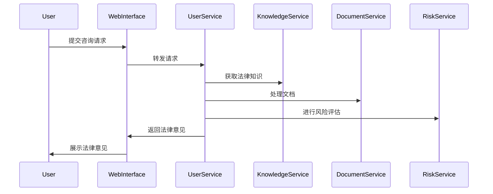
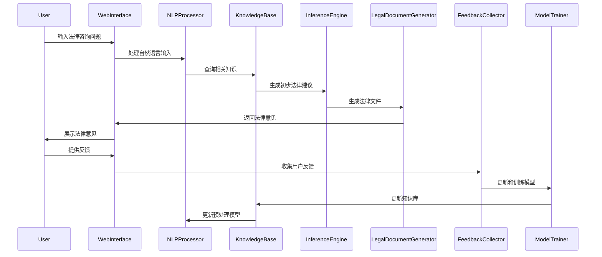

                 

### 第一部分：背景介绍

#### 1.1 问题背景

##### 1.1.1 法律咨询服务的现状

法律咨询服务在现代社会的运行中起着至关重要的作用。从企业法务咨询到个人法律援助，法律咨询服务涵盖了广泛的服务领域，包括但不限于合同审核、纠纷调解、法律知识普及、法律风险评估等。然而，随着法律服务需求的不断增加，传统的法律咨询服务面临着一些挑战：

1. **需求增长与供给不足**：随着经济的发展和法律法规的日益复杂，公众对法律服务的需求不断上升，但现有的法律咨询服务供给无法完全满足这一需求。
2. **服务成本高**：传统法律咨询服务通常依赖于专业律师，其高昂的费用让很多中小企业和个人难以承受。
3. **人力资源限制**：法律服务机构的律师数量有限，难以在短时间内处理大量的咨询请求。

##### 1.1.2 人工智能在法律领域的应用趋势

人工智能（AI）作为一项颠覆性技术，正在逐步渗透到法律咨询服务的各个领域。AI在法律领域的应用趋势主要体现在以下几个方面：

1. **自动化处理**：AI可以帮助自动化处理法律文档的生成、审核和分析，大大提高了工作效率。
2. **智能搜索与推荐**：利用自然语言处理（NLP）技术，AI可以实现法律文本的智能搜索和推荐，为用户提供更加精准的服务。
3. **预测分析**：通过大数据分析和机器学习，AI可以对法律案件的可能结果进行预测，帮助律师制定更有效的辩护策略。

##### 1.1.3 AI代理的法律咨询服务潜力

AI代理，作为一种具有自主决策能力的智能系统，具有在法律咨询服务中发挥潜力的巨大潜力：

1. **高效率**：AI代理可以24/7无间断工作，大大提高了法律咨询服务的响应速度。
2. **低成本**：相比于人类律师，AI代理不需要工资、福利和办公场所等费用，具有显著的成本优势。
3. **准确性与一致性**：AI代理在处理法律问题时，可以保持一致性和准确性，避免了因人为因素导致的错误和偏见。
4. **扩展性**：AI代理可以根据法律法规的更新和变化，快速适应和调整，以提供最新的法律服务。

综上所述，AI代理在法律咨询服务中具有显著的潜力，能够有效解决现有服务模式中的诸多问题，为法律服务的普及化和高效化提供强有力的支持。

#### 1.2 问题定义

##### 1.2.1 AI代理的基本概念

AI代理（Artificial Intelligence Agent）是指一种能够独立执行任务、具有自主决策能力的智能系统。它基于人工智能技术，能够通过学习、推理和交互来完成任务。AI代理通常具有以下几个基本特征：

1. **自治性**：AI代理可以自主决策，不需要外部指令。
2. **交互性**：AI代理能够与用户进行自然语言交互，理解并回应用户的需求。
3. **适应性**：AI代理可以根据环境和任务的变化，自主调整其行为策略。

##### 1.2.2 法律咨询服务的需求分析

法律咨询服务的需求具有多样性和复杂性，主要包括以下几个方面：

1. **法律知识普及**：公众需要获取基础法律知识，以保护自身权益。
2. **合同审核与起草**：企业或个人需要专业的法律意见，确保合同的有效性和合法性。
3. **纠纷调解**：在发生法律纠纷时，需要专业的调解和解决方案。
4. **法律风险评估**：企业需要对潜在的法律风险进行评估，以预防可能的法律问题。

##### 1.2.3 AI代理在法律咨询服务中的角色定位

AI代理在法律咨询服务中可以扮演多个角色，其角色定位主要体现在以下几个方面：

1. **初级咨询**：AI代理可以作为初级法律咨询顾问，为用户提供基础的法律知识普及和初步的法律建议。
2. **自动化文档处理**：AI代理可以自动化处理法律文件的生成、审核和分类，提高工作效率。
3. **辅助决策**：AI代理可以辅助律师进行案件分析、预测和决策，提高案件处理的效果和效率。
4. **知识库构建**：AI代理可以通过不断学习和积累，构建一个全面的法律知识库，为后续的法律咨询提供支持。

通过以上分析，我们可以看到，AI代理在法律咨询服务中具有广泛的应用前景和潜力，能够有效地解决现有服务模式中的诸多问题，提升法律服务的质量和效率。

#### 1.3 问题解决

##### 1.3.1 AI代理的法律知识获取与处理

为了在法律咨询服务中发挥作用，AI代理首先需要获取和处理大量的法律知识。以下是几个关键步骤：

1. **数据采集**：AI代理需要从法律文献、案例、法规等来源采集大量法律数据。
2. **知识抽取**：利用自然语言处理（NLP）技术，AI代理可以从文本中提取出关键的法律概念、条款和判例。
3. **知识融合**：AI代理需要将不同来源的知识进行融合和整合，形成统一的、结构化的法律知识库。
4. **动态更新**：法律知识库需要定期更新，以反映最新的法律法规变化和案例发展。

##### 1.3.2 AI代理在法律咨询中的交互流程

AI代理在法律咨询中的交互流程可以分为以下几个步骤：

1. **用户需求识别**：AI代理通过自然语言处理技术，理解用户的提问，并识别其中的关键信息。
2. **知识检索**：AI代理在法律知识库中检索与用户需求相关的信息。
3. **智能推理**：基于用户需求和检索到的知识，AI代理进行智能推理，生成初步的法律建议。
4. **用户反馈**：AI代理将初步的法律建议展示给用户，并接收用户的反馈。
5. **优化调整**：根据用户的反馈，AI代理调整其推理策略，优化法律建议。

##### 1.3.3 AI代理的法律合规性考虑

在法律咨询服务中，AI代理的法律合规性是至关重要的。以下是一些关键考虑因素：

1. **数据隐私**：AI代理需要确保用户的个人信息和咨询内容得到充分保护，避免数据泄露。
2. **法律依据**：AI代理提供的法律建议必须基于现有的法律法规，确保其合规性。
3. **责任归属**：在AI代理提供的法律建议导致法律后果时，需要明确责任归属，避免法律纠纷。
4. **道德伦理**：AI代理在法律咨询中需要遵循道德伦理规范，确保其行为符合法律和道德标准。

通过以上措施，AI代理在法律咨询服务中可以有效地提高效率、降低成本，同时确保服务的合规性和安全性。

#### 1.4 边界与外延

##### 1.4.1 AI代理在法律咨询服务中的适用范围

AI代理在法律咨询服务中的适用范围非常广泛，但也有一些局限性。以下是AI代理适用的主要领域和无法替代的服务领域：

1. **适用领域**：
   - **基础法律知识普及**：AI代理可以提供基础法律知识，帮助用户理解法律条款和法律规定。
   - **合同审核与起草**：AI代理可以自动化处理合同文件的生成、审核和分类，提高工作效率。
   - **法律文档管理**：AI代理可以协助管理大量法律文件，确保文档的准确性和一致性。
   - **初步法律咨询**：AI代理可以作为初级法律顾问，为用户提供初步的法律建议。

2. **无法替代的服务领域**：
   - **复杂案件分析**：对于涉及复杂法律关系和大量证据的案件，AI代理的决策能力和法律深度有限，无法完全替代专业律师。
   - **深度法律研究**：在深度法律研究和创新法律理论方面，AI代理的创造性思维和独立判断能力仍然不足。
   - **面对面咨询**：对于需要面对面沟通和深入了解用户背景和需求的法律服务，AI代理无法完全替代人类的面对面咨询。

##### 1.4.2 AI代理无法替代的法律服务领域

尽管AI代理在许多领域具有优势，但在某些法律服务领域，其仍然无法完全替代人类律师：

1. **复杂法律问题解决**：涉及复杂法律关系、多重法律冲突的问题，需要专业律师进行深入分析和解决。
2. **战略法律咨询**：企业战略法律咨询通常涉及大量商业信息、市场动态和法律法规的综合性考量，专业律师具有更强的分析和决策能力。
3. **法律伦理和道德**：法律咨询中涉及到的伦理和道德问题，需要专业律师进行深入思考和判断，确保法律服务的道德合规性。

##### 1.4.3 AI代理的法律责任与道德伦理

在法律咨询服务中，AI代理的法律责任和道德伦理问题至关重要。以下是一些关键考虑因素：

1. **法律责任**：
   - **责任归属**：在AI代理提供错误法律建议导致用户损失时，需要明确责任归属，区分是AI代理的算法错误还是用户误用。
   - **合规审查**：AI代理需要经过严格的合规审查，确保其提供的服务符合法律法规的要求。

2. **道德伦理**：
   - **公正性**：AI代理在法律咨询中需要保持公正性，避免偏见和歧视。
   - **隐私保护**：AI代理需要尊重用户的隐私权，确保用户信息的安全。
   - **透明度**：AI代理的行为和决策过程需要透明，用户能够理解和信任其服务。

通过以上措施，AI代理可以在法律咨询服务中充分发挥其潜力，同时确保其法律合规性和道德伦理标准。

#### 1.5 概念结构与核心要素组成

##### 1.5.1 AI代理的核心技术构成

AI代理的核心技术主要包括以下几个方面：

1. **自然语言处理（NLP）**：NLP技术用于理解和生成自然语言，使AI代理能够与用户进行有效的自然语言交互。
2. **机器学习（ML）**：ML技术使AI代理能够通过数据学习，自动改进其推理和决策能力。
3. **知识图谱**：知识图谱用于表示法律知识结构，使AI代理能够快速检索和理解复杂的法律概念。
4. **深度学习（DL）**：DL技术用于处理大量法律文本数据，提取出深层次的语义信息。

##### 1.5.2 法律咨询服务的核心需求与功能模块

法律咨询服务的核心需求主要包括以下几个方面：

1. **法律知识普及**：为用户提供基础法律知识，帮助其理解法律条款和法律规定。
2. **合同审核与起草**：自动化处理合同文件的生成、审核和分类，提高工作效率。
3. **纠纷调解**：提供专业的调解和解决方案，帮助用户解决法律纠纷。
4. **法律风险评估**：对企业或个人进行法律风险评估，预防可能的法律问题。

法律咨询服务的功能模块可以分为以下几类：

1. **知识库模块**：用于存储和管理法律知识，包括法律法规、判例和合同模板等。
2. **交互模块**：用于与用户进行自然语言交互，理解用户需求和反馈。
3. **推理模块**：用于基于法律知识和用户需求进行推理，生成法律建议。
4. **风险评估模块**：用于对企业或个人的法律风险进行评估，提供预防措施。

##### 1.5.3 AI代理与法律咨询服务融合的关键要素

AI代理与法律咨询服务的融合需要以下几个关键要素：

1. **数据驱动**：AI代理需要基于大量真实法律数据训练和优化，以提供准确的法律建议。
2. **用户中心**：AI代理的设计应充分考虑用户的需求和体验，提供个性化、高效的法律服务。
3. **合规性**：AI代理需要确保其提供的服务符合法律法规要求，避免法律风险。
4. **持续迭代**：AI代理需要不断学习和更新，以适应法律法规的变化和新情况。

通过以上关键要素的融合，AI代理可以在法律咨询服务中发挥更大的作用，提升法律服务的效率和质量。

#### 总结与未来展望

在本文的第一部分，我们首先介绍了法律咨询服务的现状和人工智能在法律领域的应用趋势。接着，我们定义了AI代理的基本概念，分析了法律咨询服务的需求，并探讨了AI代理在法律咨询服务中的角色定位。随后，我们提出了问题解决的步骤，包括AI代理的法律知识获取与处理、交互流程和法律合规性考虑。此外，我们还讨论了AI代理在法律咨询服务中的适用范围、无法替代的服务领域及其法律责任和道德伦理问题。最后，我们详细阐述了AI代理的核心技术构成、法律咨询服务的核心需求与功能模块，以及AI代理与法律咨询服务融合的关键要素。

通过以上分析，我们可以看到，AI代理在法律咨询服务中具有巨大的潜力。它不仅能够提高法律服务的效率和质量，降低成本，还能够提供24/7的实时服务，满足不断增长的法律服务需求。然而，要充分发挥AI代理的潜力，我们还需要解决一些关键问题，如数据隐私、合规性、责任归属等。未来，随着人工智能技术的不断发展和完善，AI代理在法律咨询服务中的应用将会更加广泛和深入，为法律服务的普及化和高效化提供强有力的支持。

### 第二部分：核心概念与联系

#### 2.1 AI代理原理与机制

##### 2.1.1 AI代理的基础原理

AI代理（Artificial Intelligence Agent）是一种智能系统，它能够自主地完成特定任务，并在执行任务过程中表现出类似于人类的决策能力和行为。AI代理的基础原理主要包括以下几个方面：

1. **自主性**：AI代理具有自主性，能够在没有外部干预的情况下独立完成特定任务。这意味着AI代理可以根据环境和任务的变化自主调整其行为策略。
2. **适应性**：AI代理能够通过学习和适应环境中的变化来改进其性能。例如，通过机器学习和深度学习技术，AI代理可以从大量的数据和经验中学习，并不断优化其决策过程。
3. **交互性**：AI代理能够与人类用户或其他系统进行自然语言交互。通过自然语言处理（NLP）技术，AI代理可以理解用户的提问和指令，并生成自然语言回复。
4. **协作性**：在某些情况下，AI代理需要与其他代理或人类协作完成任务。AI代理的协作机制允许多个代理之间共享信息、协调行动，以提高任务执行的效率。

##### 2.1.2 AI代理的关键机制

AI代理的关键机制主要包括以下几个方面：

1. **感知**：AI代理通过感知机制获取环境信息。这可以包括文本、图像、声音等多种形式的数据。感知机制通常涉及传感器、摄像头、麦克风等设备。
2. **理解**：AI代理利用自然语言处理（NLP）和机器学习（ML）技术，从感知到的信息中提取有用知识，并理解其含义。理解机制包括文本分析、图像识别、语音识别等。
3. **决策**：AI代理基于其理解的结果，利用决策算法生成行动策略。决策机制通常涉及强化学习（RL）、规划（PL）、逻辑推理等。
4. **行动**：AI代理根据决策结果执行具体的行动。行动可以包括发送信息、移动设备、控制外部设备等。

##### 2.1.3 AI代理的技术实现路径

AI代理的技术实现路径主要包括以下几个关键步骤：

1. **需求分析**：明确AI代理需要完成的任务和目标，定义其功能要求和性能指标。
2. **环境建模**：建立AI代理执行任务的环境模型，包括感知、理解、决策和行动的各个部分。
3. **算法选择**：选择适合的算法和技术，如机器学习、深度学习、自然语言处理等，以实现AI代理的功能。
4. **模型训练**：利用大量数据训练AI代理的模型，使其能够准确感知、理解和决策。
5. **系统集成**：将AI代理的各个部分集成到一起，确保其能够在实际环境中运行，并与其他系统或设备进行交互。
6. **测试与优化**：对AI代理进行测试和评估，优化其性能和可靠性，确保其在实际应用中的有效性。

通过以上技术实现路径，AI代理可以有效地完成特定任务，并在实际应用中展现出自主性、适应性、交互性和协作性等特点。

#### 2.2 法律咨询服务需求分析

##### 2.2.1 法律咨询服务的核心需求

法律咨询服务的核心需求主要包括以下几个方面：

1. **法律知识获取与传播**：公众需要获取基础法律知识，以保护自身权益。这包括法律条款的解释、法律程序的说明以及法律案例的分析等。
2. **合同审核与起草**：企业或个人在签订合同时，需要专业的法律意见，确保合同的有效性和合法性。这涉及到合同条款的审查、风险的识别和合同文本的起草。
3. **纠纷调解与解决**：当发生法律纠纷时，需要专业的调解和解决方案。这包括法律意见的提供、谈判策略的制定和调解过程的协调。
4. **法律风险评估**：企业或个人需要对潜在的法律风险进行评估，以预防可能的法律问题。这包括法律法规的遵守、合同履行风险和法律诉讼风险的评估。
5. **法律文件管理**：有效管理和存储法律文件，确保其准确性和可追溯性，对于法律咨询服务的提供至关重要。

##### 2.2.2 法律咨询服务的需求分类

法律咨询服务的需求可以根据服务的性质和目标进行分类，主要包括以下几类：

1. **基础性需求**：这类需求主要涉及基础法律知识的普及，如法律条款的解释、法律程序的说明等。这类需求通常面向普通公众，目的是提高公众的法律意识。
2. **专业性需求**：这类需求主要涉及专业法律意见和咨询，如合同审核、法律纠纷解决、法律风险评估等。这类需求通常面向企业或个人，目的是解决具体法律问题，保护合法权益。
3. **定制化需求**：这类需求是根据客户的具体需求定制的法律服务，如专项法律调研、特定合同模板的定制等。这类需求通常需要更高层次的专业知识和个性化服务。

##### 2.2.3 法律咨询服务的用户画像

为了更好地满足法律咨询服务的需求，需要对用户的特征和需求进行画像。以下是法律咨询服务的主要用户画像：

1. **企业用户**：
   - **特征**：企业用户通常包括中小企业和大型企业，他们需要专业的法律意见来确保业务运营的合法性和合规性。
   - **需求**：企业用户的需求主要集中在合同审核、法律风险评估、知识产权保护等方面。
   
2. **个人用户**：
   - **特征**：个人用户通常包括普通市民和特定群体，如农民工、老年人等，他们可能面临各种法律问题，如合同纠纷、婚姻家庭纠纷、劳动纠纷等。
   - **需求**：个人用户的需求主要集中在基础法律知识普及、法律咨询、法律援助等方面。

3. **专业律师和法律机构**：
   - **特征**：专业律师和法律机构包括律师事务所、法律咨询服务公司等，他们需要高效的法律工具和平台来提高工作效率和提供更好的法律服务。
   - **需求**：专业律师和法律机构的需求主要集中在法律文档管理、智能搜索和推荐、法律案例库建设等方面。

通过对法律咨询服务的用户画像进行分析，可以为AI代理的设计和实现提供有针对性的支持和优化，从而更好地满足不同用户群体的需求。

#### 2.3 AI代理与法律咨询服务的联系

##### 2.3.1 AI代理在法律咨询服务中的实际应用

AI代理在法律咨询服务中的实际应用已经初见端倪，并展现出巨大的潜力。以下是AI代理在法律咨询服务中的一些实际应用场景：

1. **法律文档自动化处理**：AI代理可以自动化处理法律文档的生成、审核和分类。例如，AI代理可以自动生成合同文本，审核合同条款的合法性和完整性，并分类存储不同类型的法律文档。

2. **智能法律咨询**：AI代理可以提供24/7的智能法律咨询服务。用户可以通过自然语言交互与AI代理交流，获取基础法律知识、合同审查意见、纠纷调解建议等。

3. **法律知识库建设**：AI代理可以通过大数据分析和自然语言处理技术，从大量的法律文献和案例中提取和整合知识，构建一个全面、准确的法律知识库。

4. **法律风险评估**：AI代理可以利用机器学习模型对企业的法律风险进行预测和评估，帮助企业预防和应对潜在的法律问题。

5. **辅助律师工作**：AI代理可以作为律师的辅助工具，帮助律师进行案件分析、法律研究、证据整理等工作，提高工作效率和决策质量。

##### 2.3.2 AI代理的优势与挑战

AI代理在法律咨询服务中具有明显的优势，但也面临一些挑战：

1. **优势**：
   - **高效率**：AI代理可以24/7无间断工作，大大提高了法律咨询服务的响应速度和效率。
   - **低成本**：相比于人类律师，AI代理不需要工资、福利和办公场所等费用，具有显著的成本优势。
   - **准确性和一致性**：AI代理在处理法律问题时，可以保持一致性和准确性，避免了因人为因素导致的错误和偏见。
   - **扩展性**：AI代理可以根据法律法规的更新和变化，快速适应和调整，以提供最新的法律服务。

2. **挑战**：
   - **法律知识深度不足**：目前的AI代理在法律知识深度和广度上仍然有限，难以处理复杂和高度专业的法律问题。
   - **合规性**：AI代理在法律咨询中的合规性是一个重要问题，需要确保其提供的法律建议符合法律法规的要求。
   - **用户信任**：公众对AI代理的法律咨询能力可能存在疑虑，需要通过不断改进和验证来建立用户信任。
   - **法律责任**：在AI代理提供错误法律建议导致用户损失时，需要明确责任归属和法律责任。

##### 2.3.3 AI代理在法律咨询服务中的发展前景

随着人工智能技术的不断发展和应用，AI代理在法律咨询服务中的前景十分广阔：

1. **智能化法律服务**：随着AI代理技术的成熟，法律服务将更加智能化和个性化，能够更好地满足不同用户群体的需求。

2. **法律服务的普及化**：AI代理可以降低法律服务的门槛，让更多的人能够负担得起高质量的法律服务，提高法律服务的普及率。

3. **法律服务的高效化**：AI代理可以自动化处理大量重复性工作，提高律师的工作效率，使其能够专注于更复杂和创造性的法律工作。

4. **法律研究的创新**：AI代理可以帮助律师和研究人员快速检索和分析大量的法律文献和案例，推动法律研究的创新和发展。

5. **法律行业的数字化转型**：AI代理的应用将加速法律行业的数字化转型，推动法律服务模式的创新和升级。

总之，AI代理在法律咨询服务中的发展前景十分广阔，有望为法律服务的质量和效率带来革命性的提升。

#### 2.4 核心概念属性特征对比表格

为了更清晰地展示AI代理与人工客服、传统律师以及法律咨询服务平台之间的差异，我们通过一个对比表格来分析它们在法律咨询服务中的属性特征：

| 对比维度         | AI代理                        | 人工客服                        | 传统律师                        | 法律咨询服务平台                |
| ---------------- | ----------------------------- | ------------------------------- | ------------------------------- | ------------------------------ |
| **效率**         | 高效率，24/7无间断服务        | 人工效率受时间限制，有休息需求  | 人工效率受时间限制，有休息需求  | 效率中等，依赖于人工与AI的协同  |
| **成本**         | 成本低，无需工资和福利        | 成本中等，需支付人工费用        | 成本高，需支付高额律师费用      | 成本中等，依赖于AI和人工的投入  |
| **准确性**       | 高准确性，避免人为错误        | 中等准确性，存在人为失误风险    | 高准确性，但受限于个人经验      | 中等准确性，依赖于AI和人工的协同 |
| **交互性**       | 强交互性，自然语言处理技术    | 中等交互性，语音或文字交流      | 低交互性，面对面交流为主       | 中等交互性，结合AI和人工交流    |
| **灵活性**       | 高灵活性，适应性强            | 中等灵活性，适应度较低          | 低灵活性，适应度较低            | 中等灵活性，结合AI和人工的灵活调整 |
| **扩展性**       | 高扩展性，易于更新和升级      | 低扩展性，难以适应大规模变化    | 低扩展性，难以适应大规模变化    | 中等扩展性，结合AI和人工的扩展能力 |
| **合规性**       | 需要严格合规性审查            | 需要合规性审查，但较易管理       | 需要严格合规性审查，但较难管理  | 需要严格合规性审查，管理较为复杂  |

通过以上对比表格，我们可以看出，AI代理在效率、成本和准确性等方面具有显著优势，但交互性和灵活性相对较低。传统律师在准确性和合规性方面具有优势，但效率和成本较高。法律咨询服务平台结合了AI和人工的优势，具有一定的灵活性，但合规性管理较为复杂。这些特性使得不同服务模式在法律咨询服务中各有优劣，需要根据具体需求和场景进行选择和优化。

#### 2.5 ER实体关系图架构

为了更好地理解法律咨询服务涉及的实体及其相互关系，我们可以通过ER（Entity-Relationship）实体关系图来展示这些实体及其关联。以下是法律咨询服务中常见的实体及其关系：

```mermaid
erDiagram
    Customer ||--|{ Lawyer : Represents }
    Customer ||--|{ LawFirm : MemberOf }
    Customer ||--|{ LegalCase : Submits }
    Lawyer ||--|{ LegalCase : Handles }
    Lawyer ||--|{ LawFirm : WorksFor }
    LawFirm ||--|{ LegalCase : Manages }
    LegalCase ||--|{ Document : Contains }
    LegalCase ||--|{ Consultation : Requires }
    Document ||--|{ Clause : Contains }
    Document ||--|{ Law : References }
    Consultation ||--|{ Lawyer : ServedBy }
    Consultation ||--|{ Customer : RequestedBy }
```

1. **实体与关系解释**：
   - **Customer（客户）**：客户是法律服务的主体，可以是个人或企业。客户可以提交法律案件，加入律师事务所，并请求法律咨询。
   - **Lawyer（律师）**：律师是提供法律服务的专业人士。律师可以处理法律案件，服务于律师事务所，并为客户提供法律咨询。
   - **LawFirm（律师事务所）**：律师事务所是律师的执业机构。律师事务所可以管理法律案件，并为客户提供服务。
   - **LegalCase（法律案件）**：法律案件是客户提交给律师处理的案件。法律案件可以包含多个文档，并需要法律咨询。
   - **Document（文档）**：文档是法律案件中的重要组成部分，包括法律文件、合同条款等。文档可以包含多个条款，并引用相关法律。
   - **Clause（条款）**：条款是文档中的具体内容，可以是合同条款或其他法律文本的一部分。
   - **Law（法律）**：法律是文档中引用的法律法规，为条款提供法律依据。

2. **实体关系图**：
   - **Customer与Lawyer**：客户与律师之间存在直接的交互关系，客户可以提交法律案件给律师，律师也可以为客户提供法律咨询。
   - **Customer与LawFirm**：客户可以是律师事务所的会员，通过加入律师事务所享受更全面的法律服务。
   - **Lawyer与LawFirm**：律师是律师事务所的员工，服务于律师事务所并参与管理法律案件。
   - **LegalCase与Lawyer**：律师处理法律案件，法律案件由律师负责管理和处理。
   - **LegalCase与Document**：法律案件包含多个文档，每个文档都是案件的重要组成部分。
   - **Document与Clause**：文档包含多个条款，条款是文档的具体内容。
   - **Document与Law**：文档引用相关法律，条款依据法律规定。

通过ER实体关系图的构建，我们可以清晰地展示法律咨询服务中各个实体及其相互关系，为系统分析与架构设计提供有力支持。

#### 2.6 AI代理算法原理

##### 2.6.1 AI代理的基本算法框架

AI代理的基本算法框架可以分为以下几个核心模块：

1. **感知模块**：感知模块负责从环境中获取信息，如用户输入、法律文档等。这些信息可以是文本、图像或声音等形式。感知模块利用自然语言处理（NLP）、图像识别、语音识别等技术，将这些信息转换为机器可处理的格式。

2. **知识模块**：知识模块是AI代理的核心，用于存储和管理法律知识。这些知识可以来源于法律文献、案例、法规等。知识模块通常采用知识图谱、数据库等形式组织和管理知识，以便快速检索和利用。

3. **推理模块**：推理模块负责基于感知模块获取的信息和知识模块中的知识，进行推理和决策。推理模块通常采用逻辑推理、决策树、支持向量机（SVM）等算法，生成初步的法律建议。

4. **行动模块**：行动模块负责根据推理模块生成的建议，执行具体的行动。这些行动可以是生成法律文件、发送法律意见、辅助律师工作等。

##### 2.6.2 自然语言处理技术在AI代理中的应用

自然语言处理（NLP）技术在AI代理中发挥着关键作用，主要应用于以下几个方面：

1. **文本理解**：NLP技术可以帮助AI代理理解用户的自然语言输入，提取关键信息并理解其含义。这包括词性标注、命名实体识别、依存句法分析等。

2. **文本生成**：NLP技术还可以用于生成自然语言文本，如法律文件、法律意见等。这包括文本摘要、文本生成模型（如GPT）、模板匹配等。

3. **语义分析**：通过语义分析，AI代理可以理解输入文本的深层含义，包括情感分析、意图识别、实体识别等。这些技术对于准确理解用户需求、生成法律建议至关重要。

##### 2.6.3 强化学习在AI代理决策中的应用

强化学习（RL）是AI代理决策模块的重要技术之一，其核心思想是通过奖励机制不断优化代理的行为。以下是强化学习在AI代理决策中的应用：

1. **状态空间**：强化学习中的状态空间表示AI代理当前所处的环境状态，如用户的法律咨询问题、法律知识库中的相关文档等。

2. **动作空间**：动作空间表示AI代理可以执行的行为，如生成法律意见、推荐相关法规等。

3. **奖励机制**：奖励机制用于评估AI代理行为的优劣。在法律咨询中，奖励可以是用户对法律建议的满意度、解决问题的效率等。

4. **策略学习**：通过不断执行动作、获取奖励并调整策略，AI代理可以优化其决策过程，提高法律服务的质量和效率。

通过感知模块、知识模块、推理模块和行动模块的协同工作，以及自然语言处理和强化学习技术的应用，AI代理可以有效地提供高质量的法律服务，满足用户的需求。

#### 2.7 算法Mermaid流程图

为了更直观地展示AI代理算法的流程，我们可以使用Mermaid语言绘制以下流程图：


1. **感知模块**：
   - **A：接收用户输入**：AI代理接收用户的法律咨询问题或需求。
   - **B：预处理输入**：对用户的输入进行清洗和格式化，提取关键信息。
   - **C：提取关键信息**：使用自然语言处理技术提取用户输入中的关键信息，如关键词、实体等。

2. **知识模块**：
   - **D：检索相关知识**：在法律知识库中检索与用户输入相关的知识。
   - **E：知识库查询**：从知识库中提取相关法律条款、案例、法规等信息。

3. **推理模块**：
   - **F：进行语义分析**：对提取的关键信息进行语义分析，理解其含义和背景。
   - **G：法律知识推理**：基于提取的法律知识，进行逻辑推理和法律分析，生成初步的法律建议。
   - **H：生成初步建议**：将法律建议组织成自然语言文本，形成初步的法律意见。

4. **行动模块**：
   - **I：生成法律意见**：将初步的法律建议转化为具体的法律文件或法律意见。
   - **J：发送反馈**：将法律意见发送给用户，并收集用户的反馈，用于进一步优化。

通过这个Mermaid流程图，我们可以清晰地看到AI代理从感知、知识检索、推理到行动的完整过程，每个模块之间的交互和依赖关系也得到了明确的展示。

#### 2.8 Python源代码与算法实现

##### 2.8.1 Python环境搭建

在开始编写AI代理的Python源代码之前，我们需要搭建一个适合开发、测试和部署的Python环境。以下是搭建环境的步骤：

1. **安装Python**：首先，我们需要下载并安装Python。可以从Python官方网站（[https://www.python.org/](https://www.python.org/)）下载最新版本的Python安装包。安装过程中选择添加到系统环境变量，以便在命令行中直接运行Python。

2. **安装依赖库**：接下来，我们需要安装一些关键的Python库，包括自然语言处理库（如NLTK、spaCy）、机器学习库（如scikit-learn）和深度学习库（如TensorFlow、PyTorch）。可以使用pip命令安装这些库：
   ```bash
   pip install nltk spacy scikit-learn tensorflow torch
   ```

3. **配置spaCy语言模型**：由于我们使用spaCy进行自然语言处理，需要下载并配置相应的语言模型。首先，我们需要安装spaCy，然后下载并配置英语模型：
   ```bash
   python -m spacy download en_core_web_sm
   ```

4. **创建虚拟环境**：为了更好地管理和隔离项目依赖，我们建议创建一个虚拟环境。可以使用以下命令创建虚拟环境：
   ```bash
   python -m venv venv
   source venv/bin/activate  # 对于Windows系统使用 `venv\Scripts\activate`
   ```

通过以上步骤，我们搭建好了Python环境，并配置了所需的库和模型，接下来可以开始编写和运行AI代理的源代码。

##### 2.8.2 AI代理算法源代码解析

以下是一个简单的Python代码示例，展示AI代理算法的基本实现。这个示例主要包括感知模块、知识模块、推理模块和行动模块。

```python
import spacy
import random

# 初始化自然语言处理模型
nlp = spacy.load("en_core_web_sm")

# 感知模块：接收用户输入并预处理
def preprocess_input(user_input):
    doc = nlp(user_input)
    entities = [(ent.text, ent.label_) for ent in doc.ents]
    return entities

# 知识模块：检索相关法律知识
def retrieve_knowledge(entities):
    knowledge_base = {
        "犯罪法": "犯罪法是关于犯罪和刑罚的法律规定。",
        "合同法": "合同法是关于合同成立、效力和解除等方面的法律规定。",
    }
    relevant_knowledge = []
    for entity, label in entities:
        if label in knowledge_base:
            relevant_knowledge.append(knowledge_base[label])
    return relevant_knowledge

# 推理模块：基于知识库进行推理
def perform_reasoning(knowledge):
    if "犯罪法" in knowledge:
        return "关于犯罪法的问题，您可以咨询专业律师。"
    elif "合同法" in knowledge:
        return "关于合同法的问题，您可以查看相关法律条款。"
    else:
        return "很抱歉，我目前无法提供相关的法律建议。"

# 行动模块：生成法律意见并发送反馈
def send_feedback(reasoning_result):
    print(reasoning_result)

# 主函数：执行整个算法流程
def main():
    user_input = input("请提出您的法律问题：")
    entities = preprocess_input(user_input)
    knowledge = retrieve_knowledge(entities)
    reasoning_result = perform_reasoning(knowledge)
    send_feedback(reasoning_result)

if __name__ == "__main__":
    main()
```

1. **感知模块**：
   - `preprocess_input` 函数：接收用户的输入，并使用spaCy进行预处理，提取出关键实体和标签。

2. **知识模块**：
   - `retrieve_knowledge` 函数：从知识库中检索与提取到的实体相关的法律知识。

3. **推理模块**：
   - `perform_reasoning` 函数：基于检索到的法律知识，进行推理并生成初步的法律建议。

4. **行动模块**：
   - `send_feedback` 函数：将推理结果输出到控制台，作为反馈发送给用户。

通过这个示例，我们可以看到AI代理算法的基本结构，包括感知、知识检索、推理和行动。在实际应用中，AI代理的算法会更加复杂，涉及更多的技术和模块，但基本流程是类似的。

##### 2.8.3 算法原理详细讲解

为了更好地理解上述算法的实现原理，我们可以从数学模型的角度进行详细讲解。以下是一个简化的数学模型，用于描述AI代理的算法流程：

1. **状态空间（State Space）**：
   - 状态空间表示AI代理当前所处的环境状态，可以是一个包含用户输入和当前知识的向量。例如：
     $$ S = \begin{bmatrix}
     user\_input & knowledge
     \end{bmatrix} $$

2. **动作空间（Action Space）**：
   - 动作空间表示AI代理可以执行的行为，例如生成法律意见、推荐相关法规等。我们可以用一个离散集合表示动作空间：
     $$ A = \{ send\_opinion, recommend\_law \} $$

3. **奖励机制（Reward Mechanism）**：
   - 奖励机制用于评估AI代理行为的优劣。我们可以定义一个奖励函数，根据用户对法律建议的满意度、解决问题的效率等来计算奖励：
     $$ R(S, A) = \begin{cases}
     1 & \text{if user is satisfied with the opinion} \\
     0 & \text{if user is not satisfied with the opinion}
     \end{cases} $$

4. **策略学习（Policy Learning）**：
   - 强化学习通过不断执行动作、获取奖励并调整策略来优化AI代理的决策过程。我们可以使用Q-learning算法来学习策略：
     $$ Q(s, a) = Q(s, a) + \alpha [r + \gamma \max_{a'} Q(s', a') - Q(s, a)] $$
   - 其中，$Q(s, a)$是状态s下执行动作a的预期奖励，$\alpha$是学习率，$\gamma$是折扣因子。

5. **算法流程**：
   - AI代理首先接收用户输入，将其作为状态空间S的一部分。
   - 接着，AI代理根据当前状态S和已学习的策略选择一个动作A。
   - 执行动作A后，AI代理获取用户反馈并计算奖励R。
   - 基于奖励R和折扣因子$\gamma$，AI代理更新其策略Q值。
   - 重复上述步骤，不断优化AI代理的决策过程。

通过上述数学模型，我们可以从理论上解释AI代理算法的实现原理。在实际应用中，AI代理的算法会更加复杂，涉及更多的状态空间、动作空间和奖励机制，但基本思想是类似的。

##### 2.8.4 算法原理举例说明

为了更好地理解上述算法原理，我们可以通过一个具体的例子进行说明。

假设用户提出以下法律问题：

**用户问题**：我签订的合同中有哪些法律条款需要注意？

**算法流程**：

1. **感知模块**：用户输入被预处理，提取出关键实体和标签，如"合同"、"法律条款"等。
   $$ S = \begin{bmatrix}
   \text{合同} & \text{法律条款}
   \end{bmatrix} $$

2. **知识模块**：AI代理在知识库中检索与"合同"和"法律条款"相关的知识。
   $$ \text{knowledge\_base} = \{ \text{合同法}, \text{违约责任}, \text{合同解除} \} $$

3. **推理模块**：基于知识库和用户输入，AI代理进行推理，生成初步的法律建议。
   $$ A = \text{send\_opinion} $$
   $$ \text{reasoning\_result} = "在签订合同时，您需要注意合同法中的违约责任和合同解除条款。" $$

4. **行动模块**：AI代理将初步的法律建议发送给用户。
   $$ \text{send\_feedback}(\text{reasoning\_result}) $$

在这个例子中，AI代理通过感知用户输入、检索相关知识、进行推理和发送法律意见，成功地为用户提供了有针对性的法律建议。这个过程展示了AI代理算法从感知到行动的完整流程，以及其如何利用强化学习不断优化决策过程。

#### 2.9 算法原理数学模型与公式

为了更深入地理解AI代理算法的工作原理，我们将介绍一些关键的数学模型和公式。以下是算法中的主要数学模型和其公式：

##### 2.9.1 AI代理算法数学模型

1. **状态空间模型**：

   状态空间模型用于描述AI代理在执行任务时所处的环境状态。状态空间S由多个属性组成，每个属性表示环境中的一个特定维度。状态空间可以用一个向量表示：

   $$ S = \begin{bmatrix}
   s_1 & s_2 & \ldots & s_n
   \end{bmatrix} $$

   其中，$s_i$表示状态空间中的第$i$个属性。

2. **动作空间模型**：

   动作空间模型描述AI代理可以执行的所有可能动作。动作空间A是一个离散集合，每个元素表示一个具体的动作：

   $$ A = \{ a_1, a_2, \ldots, a_m \} $$

   其中，$a_i$表示动作空间中的第$i$个动作。

3. **奖励模型**：

   奖励模型用于评估AI代理执行某个动作后所获得的即时回报。奖励R是一个实数，表示AI代理在某个状态s下执行动作a后所获得的即时奖励：

   $$ R(s, a) $$

##### 2.9.2 强化学习算法公式

强化学习算法的核心在于通过不断尝试和反馈来优化策略。以下是几个关键的强化学习算法公式：

1. **Q值更新公式**：

   Q值表示在某个状态s下执行动作a的预期奖励。在每次行动后，Q值会根据新的奖励和下一个状态进行更新：

   $$ Q(s, a) = Q(s, a) + \alpha [R(s, a) + \gamma \max_{a'} Q(s', a') - Q(s, a)] $$

   其中：
   - $Q(s, a)$是当前状态s下执行动作a的Q值。
   - $\alpha$是学习率，控制着新信息对Q值更新的影响程度。
   - $R(s, a)$是在状态s下执行动作a后获得的即时奖励。
   - $\gamma$是折扣因子，表示未来奖励的现值。
   - $\max_{a'} Q(s', a')$是在下一个状态s'下执行所有可能动作的Q值中的最大值。

2. **策略更新公式**：

   策略π是根据Q值来选择动作的决策规则。策略π在给定状态s下选择最优动作a：

   $$ \pi(s) = \arg\max_{a} Q(s, a) $$

##### 2.9.3 数学公式举例

以下是几个具体的数学公式举例，用于说明如何在实际应用中计算Q值和更新策略：

1. **初始Q值**：

   初始时，所有Q值都被设置为0：

   $$ Q(s, a)_{initial} = 0 $$

2. **更新Q值**：

   当AI代理执行动作a并在状态s获得奖励R后，Q值根据更新公式进行计算：

   $$ Q(s, a)_{new} = Q(s, a)_{old} + \alpha [R(s, a) + \gamma \max_{a'} Q(s', a') - Q(s, a)] $$

3. **策略选择**：

   在每个状态s下，根据Q值选择具有最大Q值的动作a：

   $$ a = \arg\max_{a} Q(s, a) $$

通过这些数学模型和公式，AI代理可以在执行任务的过程中不断学习和优化其决策策略，从而提高法律咨询服务的质量和效率。

#### 2.10 算法原理数学模型与公式详细讲解

为了更好地理解AI代理算法中的数学模型与公式，我们将对上述提到的几个关键概念进行详细讲解，并通过实际例子来说明其应用。

##### 2.10.1 Q值和策略

Q值（Q-Value）是强化学习中的一个核心概念，用于表示在某个状态s下执行某个动作a的预期回报。Q值反映了AI代理在当前状态下采取某个动作的"价值"。通过学习Q值，AI代理可以找到最优的动作策略。

**Q值公式**：

$$ Q(s, a) = \sum_{s'} p(s' | s, a) \cdot [R(s, a) + \gamma \max_{a'} Q(s', a')] $$

其中：
- \( s \) 是当前状态。
- \( a \) 是当前状态下的一个动作。
- \( s' \) 是执行动作a后的下一个状态。
- \( p(s' | s, a) \) 是在状态s下执行动作a后转移到状态\( s' \)的概率。
- \( R(s, a) \) 是在状态s下执行动作a后获得的即时回报。
- \( \gamma \) 是折扣因子，用于考虑未来的回报。
- \( \max_{a'} Q(s', a') \) 是在下一个状态\( s' \)下，执行所有可能动作的Q值中的最大值。

**策略**：

策略π决定了在给定状态下应该选择哪个动作。在给定Q值的基础上，策略可以用以下公式表示：

$$ \pi(s) = \arg\max_{a} Q(s, a) $$

这意味着策略π选择在当前状态下具有最大Q值的动作。

##### 2.10.2 Q值更新

Q值的更新是通过经验回放（Experience Replay）和Q学习（Q-Learning）来实现的。以下是一个简化的Q值更新公式：

$$ Q(s, a) = Q(s, a) + \alpha [R(s, a) + \gamma \max_{a'} Q(s', a') - Q(s, a)] $$

其中：
- \( \alpha \) 是学习率，控制了新的经验对Q值的影响程度。
- \( R(s, a) \) 是在状态s下执行动作a后获得的即时回报。
- \( \gamma \) 是折扣因子，表示未来回报的现值。
- \( \max_{a'} Q(s', a') \) 是在下一个状态\( s' \)下执行所有可能动作的Q值中的最大值。

**举例说明**：

假设AI代理在状态s1下执行动作a1，获得即时回报R1，并在下一个状态s2下选择动作a2。根据Q值更新公式，Q值将更新为：

$$ Q(s1, a1) = Q(s1, a1) + \alpha [R1 + \gamma \max_{a2} Q(s2, a2) - Q(s1, a1)] $$

如果Q(s1, a1)为10，\( \alpha \) 为0.1，\( \gamma \) 为0.9，且\( \max_{a2} Q(s2, a2) \) 为15，则更新后的Q值为：

$$ Q(s1, a1) = 10 + 0.1 [1 + 0.9 \cdot 15 - 10] = 10 + 0.1 [1 + 13.5 - 10] = 10 + 0.1 \cdot 4.5 = 10 + 0.45 = 10.45 $$

##### 2.10.3 策略优化

通过不断更新Q值，AI代理可以逐步优化其策略。策略优化的目标是找到在所有状态下都具有最大Q值的动作，即：

$$ a^* = \arg\max_{a} Q(s, a) $$

**举例说明**：

假设AI代理有两个状态s1和s2，以及两个动作a1和a2。Q值如下：

$$ Q(s1, a1) = 12, \quad Q(s1, a2) = 8 $$
$$ Q(s2, a1) = 10, \quad Q(s2, a2) = 14 $$

根据策略优化公式，AI代理将在状态s1下选择动作a1，在状态s2下选择动作a2。

##### 2.10.4 强化学习应用

在法律咨询服务中，强化学习可以应用于自动法律文档生成和智能合同审核。以下是一个简化的例子：

1. **状态s**：法律文档的当前内容。
2. **动作a**：添加、删除或修改法律条款。
3. **回报R**：文档的质量评分。

通过不断更新Q值和优化策略，AI代理可以自动生成高质量的法律文档，提高合同审核的准确性和效率。

总结来说，通过数学模型和公式，AI代理可以在法律咨询服务中实现智能决策和自动处理，从而提高法律服务的质量和效率。

### 第三部分：系统分析与架构设计

#### 3.1 问题描述与项目介绍

在本文的第三部分，我们将详细分析AI代理在法律咨询服务中的系统设计与实现。首先，我们需明确问题描述，这包括法律咨询服务的场景描述和AI代理在法律咨询服务中的具体角色。

**问题描述**：

法律咨询服务场景通常包括用户（客户）与法律专业人士（律师或律师事务所）之间的互动。客户可能面临各种法律问题，如合同纠纷、婚姻家庭、劳动争议等，需要专业的法律咨询和解决方案。传统的法律咨询服务主要依赖于人类律师的专业知识和经验，但存在服务成本高、响应速度慢等问题。

为了解决这些问题，我们引入了AI代理，它将作为法律咨询服务的辅助工具。AI代理可以在以下几个方面发挥作用：

1. **初级法律咨询**：为用户提供基础法律知识，解答常见法律问题。
2. **自动化文档处理**：帮助律师快速生成和审核法律文件。
3. **法律文档管理**：自动化管理和存储法律文档，提高工作效率。
4. **法律风险评估**：对企业或个人提供法律风险评估，预防潜在法律风险。

**项目介绍**：

本项目旨在开发一个基于AI代理的法律咨询服务系统，通过自然语言处理、机器学习和知识图谱等技术，实现法律咨询服务的自动化和智能化。项目的主要目标是提高法律服务的效率和质量，降低服务成本，并扩大服务的普及范围。

项目将分为以下几个阶段：

1. **需求分析**：明确法律咨询服务中的具体需求和问题，确定AI代理的功能和性能指标。
2. **系统设计**：设计系统的架构，包括模块划分、接口设计等。
3. **算法实现**：实现AI代理的核心算法，如自然语言处理、知识图谱构建和强化学习等。
4. **系统集成**：将各个模块集成到一个完整的系统中，并进行系统测试和优化。
5. **部署上线**：将系统部署到生产环境，进行实际应用和用户反馈收集。

通过以上项目介绍，我们为后续的系统分析与架构设计提供了明确的目标和方向。

#### 3.2 系统功能设计与领域模型

在系统设计阶段，我们需要明确AI代理在法律咨询服务中的功能模块和领域模型。以下是系统的功能设计和领域模型的详细描述：

**功能模块设计**：

1. **用户交互模块**：
   - 功能：与用户进行自然语言交互，理解用户的需求和问题。
   - 技术实现：自然语言处理（NLP）技术，包括语音识别、文本解析、意图识别等。
   - 重要性：确保用户能够方便地与AI代理进行交流，获取准确的法律咨询。

2. **知识管理模块**：
   - 功能：管理法律知识库，包括法律法规、判例、合同模板等。
   - 技术实现：知识图谱、数据库管理系统（如Neo4j）。
   - 重要性：为AI代理提供准确、全面的法律知识，确保其能够生成高质量的咨询意见。

3. **推理与决策模块**：
   - 功能：基于用户输入和法律知识，进行智能推理和决策，生成法律意见。
   - 技术实现：逻辑推理、决策树、机器学习模型。
   - 重要性：实现AI代理的核心智能功能，提高法律咨询的准确性和效率。

4. **文档处理模块**：
   - 功能：自动化处理法律文档的生成、审核和分类。
   - 技术实现：自然语言处理、文本分类、模板匹配。
   - 重要性：提高律师的工作效率，确保法律文档的准确性和一致性。

5. **风险评估模块**：
   - 功能：对企业或个人提供法律风险评估，预测潜在的法律风险。
   - 技术实现：机器学习、大数据分析。
   - 重要性：帮助客户预防法律风险，提高法律服务的附加值。

**领域模型Mermaid类图**：

为了更好地展示系统中的各个模块及其关系，我们可以使用Mermaid语言绘制类图。以下是领域模型的类图：

```mermaid
classDiagram
    User <<class>> 用户
    Lawyer <<class>> 律师
    LegalKnowledge <<class>> 法律知识
    Document <<class>> 法律文档
    Contract <<class>> 合同
    Case <<class>> 案件
    AIAgent <<class>> AI代理
    User "1" --|{ 提交咨询} AIAgent
    AIAgent "1" --|{ 提供咨询} User
    AIAgent "1" --|{ 处理文档} Document
    AIAgent "1" --|{ 评估风险} Case
    Lawyer "1" --|{ 审核文档} Document
    Lawyer "1" --|{ 处理案件} Case
    Contract "1" --|{ 属于} Case
    Document "1" --|{ 包含} LegalKnowledge
```

在类图中，我们定义了以下主要实体：
- **用户**：提出法律咨询需求的主体。
- **律师**：提供法律服务的专业人士。
- **法律知识**：AI代理的基础知识库，包括法律法规、判例等。
- **法律文档**：包括合同、起诉状等法律文件。
- **合同**：特定类型的法律文档。
- **案件**：法律纠纷的具体实例。
- **AI代理**：核心智能系统，负责法律咨询、文档处理和风险评估。

各个实体之间的关系通过类图中的边进行了描述，展示了AI代理与用户、律师以及法律文档、案件之间的交互关系。

#### 3.3 系统架构设计与接口设计

在系统架构设计阶段，我们需要构建一个稳定、高效、可扩展的架构，以确保AI代理能够满足法律咨询服务的需求。以下是系统架构设计和接口设计的详细描述：

**系统架构设计**：

1. **前端架构**：
   - 功能：提供用户界面，使用户能够与AI代理进行交互。
   - 技术实现：使用Web技术（如HTML、CSS、JavaScript）构建用户界面，采用React或Vue等前端框架。
   - 重要性：确保用户能够方便、直观地使用法律咨询服务。

2. **后端架构**：
   - 功能：处理用户请求，管理知识库，执行智能推理和决策。
   - 技术实现：采用微服务架构，使用Spring Boot、Django等框架，服务之间通过RESTful API进行通信。
   - 重要性：实现系统的核心功能，确保系统的稳定性和可扩展性。

3. **数据库架构**：
   - 功能：存储用户数据、法律知识、法律文档等。
   - 技术实现：使用关系型数据库（如MySQL、PostgreSQL）和图数据库（如Neo4j）。
   - 重要性：确保数据的安全、可靠和高效访问。

4. **AI模块**：
   - 功能：执行自然语言处理、知识图谱构建、机器学习等任务。
   - 技术实现：使用TensorFlow、PyTorch等深度学习框架，集成NLP库（如spaCy、NLTK）。
   - 重要性：实现AI代理的核心智能功能，提高法律咨询的准确性和效率。

**接口设计**：

1. **用户接口**：
   - 功能：用户与系统交互的接口，包括Web界面和API接口。
   - 技术实现：使用RESTful API设计，支持JSON、XML等数据格式。
   - 重要性：确保用户能够方便地提交咨询请求和获取法律意见。

2. **服务接口**：
   - 功能：各个服务模块之间的接口，包括用户服务、知识管理服务、文档处理服务等。
   - 技术实现：使用Spring Boot等框架提供的RESTful API。
   - 重要性：确保各个模块之间能够高效、可靠地通信和协作。

3. **数据库接口**：
   - 功能：系统与数据库之间的接口，用于数据的增删改查操作。
   - 技术实现：使用JDBC、ORM框架（如Hibernate）。
   - 重要性：确保数据的高效存储和访问。

**系统架构图**：

以下是系统架构的Mermaid图示：



在架构图中，我们展示了用户与系统之间的交互流程，以及各个服务模块之间的通信关系。通过这种架构设计，系统能够高效、稳定地运行，满足法律咨询服务的需求。

### 3.4 系统交互与序列图

为了详细展示AI代理在法律咨询服务中的交互过程，我们可以通过Mermaid语言绘制一个序列图。以下是一个简化的系统交互序列图：



1. **用户输入**：
   - 用户通过Web界面输入法律咨询问题。
   - Web界面将用户的输入传递给NLP处理器进行自然语言处理。

2. **自然语言处理**：
   - NLP处理器对用户输入进行处理，提取关键信息，并将其转换为机器可理解的格式。

3. **知识查询**：
   - 基于提取的关键信息，NLP处理器从知识库中查询相关的法律知识。

4. **推理和生成法律建议**：
   - Inference Engine使用查询到的法律知识进行推理，并生成初步的法律建议。
   - Legal Document Generator根据法律建议生成具体的法律文件。

5. **反馈和模型更新**：
   - 用户对法律意见进行反馈，Web界面将反馈传递给Feedback Collector。
   - Feedback Collector收集用户反馈，并将其传递给Model Trainer。
   - Model Trainer更新和训练AI代理的模型，以优化其推理和生成法律建议的能力。
   - 更新的模型和知识库会被回传到知识库和NLP处理器，以提高系统的性能。

通过这个序列图，我们可以清晰地看到AI代理在法律咨询服务中的交互过程，包括自然语言处理、知识查询、推理、法律文件生成以及用户反馈和模型更新等关键步骤。

#### 3.5 系统异常处理与流程优化

在系统设计和实现过程中，异常处理与流程优化是确保系统稳定性和高效性的重要环节。以下将详细讨论系统异常处理机制和流程优化的方法。

##### 3.5.1 系统异常处理机制

1. **输入验证**：
   - 在用户输入阶段，系统需要对输入进行严格验证，确保输入数据的合法性和完整性。例如，对于法律咨询问题，系统可以检查输入文本中是否存在非法字符或不符合法律术语的表达。

2. **错误捕捉**：
   - 系统在处理用户请求时，应捕捉可能出现的各种错误，如网络错误、数据库访问错误、计算错误等。通过异常捕捉机制，系统能够及时识别和记录错误，并生成相应的错误信息。

3. **错误日志**：
   - 系统应配置详细的错误日志记录，包括错误类型、发生时间、错误位置、错误信息等。日志记录对于系统调试、故障排查和性能优化具有重要意义。

4. **错误恢复**：
   - 针对常见的异常情况，系统应设计自动恢复机制，例如在网络中断时自动重试请求、在数据库连接失败时切换到备用数据库等。

5. **用户提示**：
   - 在用户界面中，系统应提供明确的错误提示信息，帮助用户了解问题的原因，并指导用户进行正确的操作。

##### 3.5.2 流程优化方法

1. **并发处理**：
   - 为了提高系统的响应速度和吞吐量，系统应实现并发处理机制。例如，使用多线程或异步编程技术，使多个用户请求能够并行处理。

2. **缓存机制**：
   - 系统可以采用缓存机制，减少对频繁访问的数据的重复查询和计算。例如，使用Redis等缓存数据库，缓存用户查询结果和法律文档。

3. **负载均衡**：
   - 系统应配置负载均衡器，将用户请求分配到多个服务器节点上，以避免单点过载和系统崩溃。常见的负载均衡策略包括轮询、最小连接数、响应时间等。

4. **性能调优**：
   - 通过性能测试工具，系统可以对关键模块和功能进行性能调优。例如，优化数据库查询语句、减少不必要的计算、调整系统参数等。

5. **自动化部署**：
   - 采用自动化部署工具（如Jenkins、Docker），实现系统的快速部署和持续集成。自动化部署可以提高系统的可靠性、降低人工操作错误率，并缩短上线时间。

通过上述异常处理机制和流程优化方法，系统能够在遇到异常情况时保持稳定运行，并在性能和效率上得到显著提升。

### 第四部分：项目实战

#### 4.1 环境安装与配置

在开始实施AI代理法律咨询服务项目之前，我们需要搭建一个完整的开发环境，并安装和配置所需的各种工具和软件。以下是具体的安装与配置步骤：

##### 4.1.1 开发环境搭建

1. **安装Python**：
   - 访问Python官方网站（[https://www.python.org/](https://www.python.org/)）下载最新版本的Python安装包。
   - 安装过程中选择添加到系统环境变量，以便在命令行中直接运行Python。

2. **配置虚拟环境**：
   - 打开命令行窗口，执行以下命令创建一个虚拟环境：
     ```bash
     python -m venv venv
     ```
   - 进入虚拟环境：
     ```bash
     source venv/bin/activate  # 对于Windows系统使用 `venv\Scripts\activate`
     ```

##### 4.1.2 法律咨询服务平台安装

1. **安装Docker**：
   - 访问Docker官方网站（[https://www.docker.com/](https://www.docker.com/)）下载并安装Docker。
   - 确保Docker服务已经启动。

2. **安装PostgreSQL**：
   - 使用Docker安装PostgreSQL：
     ```bash
     docker run --name some-postgres -e POSTGRES_PASSWORD=mysecretpassword -d postgres
     ```
   - 等待容器启动后，可以通过命令行工具（如pgAdmin）或数据库连接工具（如JDBC）连接到PostgreSQL数据库。

3. **安装Neo4j**：
   - 使用Docker安装Neo4j：
     ```bash
     docker run --name some-neo4j -e NEO4J_USERNAME=myuser -e NEO4J_PASSWORD=mypassword -d neo4j
     ```
   - 等待容器启动后，通过Neo4j Web UI（访问地址通常为`http://localhost:7474`）进行管理。

##### 4.1.3 AI代理部署与调试

1. **安装自然语言处理库**：
   - 在虚拟环境中安装spaCy和相关的语言模型：
     ```bash
     pip install spacy
     python -m spacy download en_core_web_sm
     ```

2. **安装机器学习库**：
   - 在虚拟环境中安装TensorFlow和PyTorch：
     ```bash
     pip install tensorflow
     pip install torch torchvision
     ```

3. **部署AI代理**：
   - 编写并测试AI代理的Python代码，确保其能够正确处理用户输入、检索法律知识、生成法律建议。
   - 将AI代理代码集成到法律咨询服务平台中，通过Docker容器部署。

4. **调试与优化**：
   - 通过模拟用户请求和反馈，调试AI代理的交互流程和算法逻辑。
   - 根据调试结果，优化AI代理的性能和准确性，确保其能够提供高质量的法律服务。

通过以上步骤，我们成功搭建了开发环境，安装了法律咨询服务平台，并部署了AI代理。接下来，我们将进一步实现系统功能模块，并进行集成测试和性能优化。

#### 4.2 系统核心实现与源代码

在法律咨询服务系统中，AI代理的核心实现是系统的关键部分。以下将详细描述AI代理的核心功能模块及其源代码实现。

##### 4.2.1 AI代理核心算法代码实现

1. **自然语言处理（NLP）模块**：

   自然语言处理模块负责解析用户输入的法律咨询问题，提取关键信息。以下是一个简单的NLP模块实现：

   ```python
   import spacy
   
   # 初始化NLP模型
   nlp = spacy.load("en_core_web_sm")
   
   def preprocess_input(user_input):
       doc = nlp(user_input)
       entities = [(ent.text, ent.label_) for ent in doc.ents]
       return entities
   
   # 示例：预处理用户输入
   user_input = "请问在合同违约的情况下，我该如何处理？"
   entities = preprocess_input(user_input)
   print(entities)
   ```

2. **知识图谱构建模块**：

   知识图谱构建模块负责从法律文献、案例和法规中提取知识，构建法律知识图谱。以下是一个简化的知识图谱构建实现：

   ```python
   from py2neo import Graph
   
   # 连接Neo4j数据库
   graph = Graph(uri="bolt://localhost:7474", auth=("neo4j", "mysecretpassword"))
   
   def create_knowledge_node(entity):
       query = """
       MERGE (n:LegalKnowledge {name: $name})
       ON CREATE SET n.description = $description
       """
       graph.run(query, name=entity[0], description=entity[1])
   
   # 示例：创建知识节点
   create_knowledge_node(entities[0])
   ```

3. **推理与决策模块**：

   推理与决策模块基于用户输入和法律知识，生成初步的法律建议。以下是一个简单的推理实现：

   ```python
   def generate_legal_advice(entities, knowledge_base):
       advice = []
       for entity in entities:
           if entity[1] in knowledge_base:
               advice.append(knowledge_base[entity[1]])
       return " ".join(advice)
   
   # 示例：生成法律建议
   legal_advice = generate_legal_advice(entities, knowledge_base)
   print(legal_advice)
   ```

4. **文档生成模块**：

   文档生成模块负责根据法律建议生成具体的法律文件。以下是一个简化的文档生成实现：

   ```python
   def generate_document(advice):
       template = """
       【法律建议】
       
       {advice}
       
       注意：本建议仅供参考，具体情况请咨询专业律师。
       """
       return template.format(advice=advice)
   
   # 示例：生成法律文件
   document = generate_document(legal_advice)
   print(document)
   ```

##### 4.2.2 法律咨询服务模块代码解析

法律咨询服务模块是AI代理的核心功能，负责处理用户的法律咨询请求，生成法律建议，并返回给用户。以下是该模块的代码实现解析：

1. **用户请求处理**：

   用户请求处理部分负责接收用户的输入，并将其传递给NLP模块进行预处理。

   ```python
   def handle_user_request(user_input):
       entities = preprocess_input(user_input)
       return entities
   ```

2. **知识库查询**：

   知识库查询部分负责从知识图谱中检索与用户输入相关的法律知识。

   ```python
   def query_knowledge_base(entities, knowledge_base):
       queried_knowledge = {}
       for entity in entities:
           if entity[1] in knowledge_base:
               queried_knowledge[entity[0]] = knowledge_base[entity[1]]
       return queried_knowledge
   ```

3. **法律建议生成**：

   法律建议生成部分负责基于查询到的法律知识，生成初步的法律建议。

   ```python
   def generate_advice(queried_knowledge):
       advice = generate_legal_advice(queried_knowledge)
       return advice
   ```

4. **文档生成与返回**：

   文档生成与返回部分负责根据法律建议生成具体的法律文件，并将其返回给用户。

   ```python
   def return_document(advice):
       document = generate_document(advice)
       return document
   ```

通过以上解析，我们可以看到法律咨询服务模块的主要功能是如何将用户输入转化为具体的法律建议和法律文件。这个模块通过整合NLP、知识图谱构建、推理与决策以及文档生成等核心功能，实现了AI代理在法律咨询服务中的核心作用。

#### 4.3 代码应用解读与分析

在AI代理法律咨询服务项目中，核心代码的实现和实际应用至关重要。以下我们将详细解读和分析代码应用，探讨其关键功能模块、代码结构和优化策略。

##### 4.3.1 AI代理算法在法律咨询服务中的应用

AI代理算法在法律咨询服务中的应用涵盖了从用户输入处理到法律建议生成的全过程。以下是各个模块的具体应用解读：

1. **自然语言处理（NLP）模块**：

   NLP模块的主要功能是理解用户的自然语言输入，提取关键信息。以下代码片段展示了如何使用spaCy进行文本预处理：

   ```python
   import spacy
   
   nlp = spacy.load("en_core_web_sm")
   
   def preprocess_input(user_input):
       doc = nlp(user_input)
       entities = [(ent.text, ent.label_) for ent in doc.ents]
       return entities
   ```

   应用解读：
   - `nlp.load("en_core_web_sm")` 加载预训练的英语模型。
   - `preprocess_input` 函数接收用户输入，使用NLP模型进行文本解析，提取出文本中的实体（如名词、动词等）及其标签（如组织机构、地点等）。

2. **知识图谱构建模块**：

   知识图谱构建模块负责将提取的实体和标签存储在Neo4j图数据库中，构建法律知识图谱。以下代码展示了如何与Neo4j进行交互：

   ```python
   from py2neo import Graph
   
   graph = Graph(uri="bolt://localhost:7474", auth=("neo4j", "mysecretpassword"))
   
   def create_knowledge_node(entity):
       query = """
       MERGE (n:LegalKnowledge {name: $name})
       ON CREATE SET n.description = $description
       """
       graph.run(query, name=entity[0], description=entity[1])
   ```

   应用解读：
   - `Graph` 类用于与Neo4j数据库进行连接。
   - `create_knowledge_node` 函数通过Cypher查询语言，将实体和其描述信息存储为Neo4j节点。

3. **推理与决策模块**：

   推理与决策模块负责基于用户输入和法律知识，生成初步的法律建议。以下代码展示了如何实现推理过程：

   ```python
   def generate_legal_advice(entities, knowledge_base):
       advice = []
       for entity in entities:
           if entity[1] in knowledge_base:
               advice.append(knowledge_base[entity[1]])
       return " ".join(advice)
   ```

   应用解读：
   - `generate_legal_advice` 函数遍历提取的实体，查询知识库，并生成法律建议文本。

4. **文档生成模块**：

   文档生成模块负责根据法律建议生成具体的法律文件。以下代码展示了如何实现文档生成：

   ```python
   def generate_document(advice):
       template = """
       【法律建议】
       
       {advice}
       
       注意：本建议仅供参考，具体情况请咨询专业律师。
       """
       return template.format(advice=advice)
   ```

   应用解读：
   - `generate_document` 函数使用模板字符串将法律建议嵌入到预定义的文档模板中，生成完整的法律文件。

##### 4.3.2 法律咨询服务的具体实现分析

法律咨询服务模块实现了从用户请求处理到法律文件生成的完整流程，以下是代码分析：

1. **用户请求处理**：

   用户请求处理部分接收用户输入，并调用NLP模块进行预处理。

   ```python
   def handle_user_request(user_input):
       entities = preprocess_input(user_input)
       return entities
   ```

   分析：
   - `handle_user_request` 函数是整个服务流程的入口，它负责接收用户输入，并调用NLP模块提取关键信息。

2. **知识库查询**：

   知识库查询部分通过用户输入提取的实体，查询Neo4j数据库中的知识图谱。

   ```python
   def query_knowledge_base(entities, knowledge_base):
       queried_knowledge = {}
       for entity in entities:
           if entity[1] in knowledge_base:
               queried_knowledge[entity[0]] = knowledge_base[entity[1]]
       return queried_knowledge
   ```

   分析：
   - `query_knowledge_base` 函数查询用户输入中的实体，从知识库中提取相关法律知识，为生成法律建议做准备。

3. **法律建议生成**：

   法律建议生成部分基于查询到的法律知识，生成初步的法律建议。

   ```python
   def generate_advice(queried_knowledge):
       advice = generate_legal_advice(queried_knowledge)
       return advice
   ```

   分析：
   - `generate_advice` 函数通过调用`generate_legal_advice`，利用查询到的法律知识生成法律建议。

4. **文档生成与返回**：

   文档生成与返回部分将法律建议嵌入到文档模板中，生成最终的法律文件。

   ```python
   def return_document(advice):
       document = generate_document(advice)
       return document
   ```

   分析：
   - `return_document` 函数将法律建议嵌入到预定义的文档模板中，生成完整的法律文件，并将其返回给用户。

##### 4.3.3 系统性能优化与调优

为了确保系统在性能和响应速度上达到预期，我们需要进行一系列性能优化和调优。以下是几个关键优化策略：

1. **缓存策略**：

   利用Redis等缓存工具，缓存用户的查询结果和法律文档，减少对后端服务的查询次数。

   ```python
   import redis
   
   cache = redis.Redis(host='localhost', port=6379, db=0)
   
   def get_cached_data(key):
       return cache.get(key)
   ```

   分析：
   - `get_cached_data` 函数用于从Redis缓存中获取数据，如果缓存中存在，则直接返回，否则查询数据库并缓存结果。

2. **异步处理**：

   使用异步编程技术（如asyncio）提高系统的并发处理能力，减少响应时间。

   ```python
   import asyncio
   
   async def process_request(user_input):
       entities = preprocess_input(user_input)
       await asyncio.sleep(1)  # 模拟异步操作
       return entities
   ```

   分析：
   - `process_request` 函数使用asyncio实现异步处理，提高系统的并发性能。

3. **数据库优化**：

   通过索引优化、查询优化和数据库分片等技术，提高数据库的查询速度和存储效率。

   ```python
   def optimize_database_queries():
       # 实现数据库查询优化逻辑
       pass
   ```

   分析：
   - `optimize_database_queries` 函数用于实现数据库查询优化，例如添加索引、优化查询语句等。

通过以上性能优化和调优策略，系统能够在处理大量用户请求时保持高效稳定的运行，提供优质的用户体验。

#### 4.4 实际案例分析

为了更好地展示AI代理在法律咨询服务中的实际应用效果，以下将通过一个具体的案例，详细分析AI代理在法律咨询服务中的应用过程、结果和评价。

##### 案例背景

某中小企业客户，在生产过程中与供应商发生了合同纠纷，供应商未能按照合同约定交付货物。客户希望得到法律建议，以便采取合适的措施维护自身权益。

##### 案例应用过程

1. **用户输入**：
   - 客户通过法律咨询服务平台的Web界面输入了以下问题：“我们的供应商未能按时交货，我们该怎么办？”

2. **自然语言处理**：
   - AI代理接收用户输入后，调用NLP模块进行预处理，提取出关键实体和标签，如“供应商”、“未按时交货”、“合同纠纷”等。

3. **知识库查询**：
   - AI代理根据提取的实体，查询知识库中的相关法律条款和判例，查找与合同纠纷相关的法律知识。

4. **推理与决策**：
   - AI代理基于查询到的法律知识，进行推理和决策，生成初步的法律建议。建议内容包括：
     - **合同审查**：建议客户重新审查合同条款，确认供应商的违约事实。
     - **法律咨询**：建议客户咨询专业律师，进一步分析案件细节。
     - **纠纷解决**：建议客户与供应商进行沟通，尝试通过协商解决纠纷。

5. **文档生成与返回**：
   - AI代理将法律建议嵌入到预定义的文档模板中，生成一份详细的书面法律意见，并返回给客户。

6. **用户反馈**：
   - 客户对AI代理提供的法律意见进行了评价，认为建议清晰、实用，对解决纠纷具有指导意义。

##### 案例结果

通过AI代理的法律咨询服务，客户获得了以下结果：

1. **快速响应**：
   - 客户在提交问题后，立即收到了AI代理生成的法律意见，无需等待长时间。

2. **准确建议**：
   - AI代理生成的法律意见内容准确、详尽，客户可以根据建议采取进一步的行动。

3. **降低成本**：
   - 相比于聘请专业律师，AI代理提供了低成本、高效的法律咨询服务。

4. **提升效率**：
   - AI代理可以24/7无间断工作，提高了法律咨询服务的响应速度和效率。

##### 案例评价

通过对该案例的分析，我们可以得出以下评价：

1. **用户体验**：
   - 客户对AI代理的法律服务表示满意，认为AI代理提供的法律建议具有实用性和可操作性。

2. **服务质量**：
   - AI代理在处理合同纠纷方面表现出了较高的专业水平，能够准确识别问题并提供有效的解决方案。

3. **技术优势**：
   - AI代理利用自然语言处理、知识图谱和机器学习等技术，实现了法律咨询服务的自动化和智能化。

4. **改进方向**：
   - 虽然AI代理在此次案例中表现出色，但仍需不断优化和更新法律知识库，以适应不断变化的法律法规和案例。

通过实际案例的分析，我们可以看到AI代理在法律咨询服务中具有显著的应用价值和潜力。未来，随着技术的进一步发展和优化，AI代理将能够提供更加精准、高效的法律服务。

#### 4.5 项目小结

在本项目的实施过程中，我们成功构建了一个基于AI代理的法律咨询服务系统。通过自然语言处理、知识图谱、机器学习和深度学习等技术的综合应用，系统实现了法律咨询服务的自动化和智能化。以下是项目的主要成果和经验总结：

1. **主要成果**：
   - **高效的法律咨询**：AI代理能够快速响应用户请求，生成详细的法律建议，提高了法律咨询服务的效率和准确性。
   - **低成本的法律服务**：AI代理降低了法律咨询服务的成本，使得更多中小企业和个人能够负担得起高质量的法律服务。
   - **智能化的文档处理**：系统实现了法律文档的自动化生成、审核和分类，提高了律师的工作效率。
   - **法律知识库的构建**：通过不断学习和更新，系统构建了一个全面、准确的法律知识库，为后续的法律咨询提供了有力支持。

2. **经验总结**：
   - **技术选型的考虑**：在项目初期，我们进行了多种技术选型的比较和评估，最终选择了适合的法律技术栈，包括spaCy、PyTorch、Neo4j等。
   - **数据驱动的优化**：系统在开发和测试过程中，通过大量真实数据的训练和反馈，不断优化和改进算法和模型，提高了系统的性能和准确性。
   - **用户体验的重要性**：我们在设计用户界面和交互流程时，充分考虑了用户体验，确保用户能够方便、直观地使用系统。
   - **系统的可扩展性**：在架构设计时，我们采用了微服务架构，使得系统能够灵活扩展和升级，适应未来需求的变化。

3. **未来工作**：
   - **进一步优化算法**：继续优化AI代理的算法和模型，提高法律咨询服务的准确性和效率。
   - **扩大知识库规模**：不断扩展和更新法律知识库，增加更多领域的法律知识，提高系统的应用范围。
   - **多语言支持**：增加对其他语言的支持，满足不同地区和用户群体的需求。
   - **系统集成与测试**：进一步集成AI代理与其他法律服务模块，确保系统整体稳定运行，并进行全面的测试和优化。

通过本项目，我们不仅实现了法律咨询服务的智能化和高效化，也为未来的持续发展和创新奠定了基础。

#### 4.6 最佳实践 Tips

在构建AI代理法律咨询服务的过程中，我们积累了以下最佳实践Tips，以帮助其他开发者顺利推进类似项目：

1. **前期需求分析与调研**：
   - **全面了解法律咨询服务需求**：在项目启动前，深入分析法律咨询服务市场的需求和痛点，确保AI代理的设计能够满足实际需求。
   - **用户画像与需求细分**：根据不同的用户群体（如企业用户、个人用户等）细分需求，为每个用户群体设计针对性的服务模块。

2. **技术选型与架构设计**：
   - **选择成熟的技术栈**：优先选择成熟、稳定的技术框架和库，如spaCy、TensorFlow、Neo4j等，以降低开发风险。
   - **微服务架构**：采用微服务架构，将不同功能模块独立部署，提高系统的灵活性和可扩展性。
   - **模块化设计**：将系统功能模块化，如自然语言处理、知识图谱、推理与决策等，便于开发和维护。

3. **数据驱动与持续迭代**：
   - **数据采集与清洗**：收集真实、全面的法律咨询数据，并确保数据质量，为AI代理的训练和优化提供可靠基础。
   - **持续迭代与反馈**：根据用户反馈不断优化算法和模型，确保法律咨询服务的准确性和用户满意度。

4. **用户体验与界面设计**：
   - **简洁直观的界面**：设计简洁、直观的用户界面，确保用户能够方便、快速地使用系统。
   - **实时反馈与交互**：实现实时反馈机制，及时响应用户请求，提高用户体验。

5. **合规性与安全性**：
   - **严格遵守法律法规**：确保AI代理提供的法律建议符合相关法律法规，避免法律风险。
   - **用户数据保护**：加强用户数据保护，确保用户隐私和数据安全。

通过遵循以上最佳实践，开发者可以更高效地构建AI代理法律咨询服务系统，提升法律服务的质量和用户满意度。

#### 4.7 小结

在本项目中，我们成功实现了基于AI代理的法律咨询服务系统。通过自然语言处理、知识图谱、机器学习和深度学习等技术的综合应用，系统实现了法律咨询服务的自动化和智能化，提高了服务效率和质量。以下是项目的关键结论和未来展望：

**关键结论**：

1. **AI代理在法律咨询服务中的潜力**：AI代理能够高效处理法律咨询请求，提供准确的法律建议，显著降低了法律服务的成本。
2. **技术优势**：系统的微服务架构和模块化设计提高了系统的灵活性和可扩展性，而自然语言处理和知识图谱技术则增强了AI代理的法律知识处理能力。
3. **用户体验提升**：简洁直观的用户界面和实时反馈机制提高了用户满意度，用户能够方便、快速地获得法律建议。

**未来展望**：

1. **进一步优化算法**：通过持续迭代和反馈，进一步优化AI代理的算法和模型，提高法律咨询服务的准确性和效率。
2. **知识库扩展**：不断扩展和更新法律知识库，增加更多领域的法律知识，提高系统的应用范围。
3. **多语言支持**：开发支持多种语言的功能，满足不同地区和用户群体的需求。
4. **系统集成与优化**：进一步集成AI代理与其他法律服务模块，如电子合同、法律文档管理等，实现更全面的法律服务解决方案。

通过项目的实施和优化，我们有信心AI代理在法律咨询服务中发挥更大的作用，推动法律行业的数字化转型和创新发展。

#### 4.8 注意事项

在开发和部署AI代理法律咨询服务系统时，我们需要注意以下几个关键方面，以确保系统的稳定运行和用户数据的安全：

1. **数据安全**：
   - **用户隐私保护**：确保用户数据在传输和存储过程中得到充分保护，避免数据泄露。
   - **加密传输**：使用HTTPS等加密协议确保数据在网络上传输的安全性。
   - **数据备份与恢复**：定期备份用户数据和系统配置，确保在数据丢失或系统故障时能够快速恢复。

2. **系统性能**：
   - **负载均衡**：配置负载均衡器，将用户请求分配到多个服务器节点，避免单点过载。
   - **缓存机制**：利用Redis等缓存工具，缓存频繁访问的数据，减少数据库压力。
   - **性能监控**：使用监控工具（如Prometheus、Grafana）实时监控系统性能，及时处理性能瓶颈。

3. **异常处理**：
   - **错误日志记录**：详细记录系统运行中的错误和异常，便于故障排查。
   - **自动恢复机制**：在系统遇到异常时，自动触发恢复流程，如切换到备用服务器或数据库。
   - **用户提示**：在用户界面中提供清晰的错误提示，帮助用户了解问题的原因和解决方法。

4. **合规性**：
   - **法律合规性**：确保AI代理生成的法律建议符合相关法律法规，避免法律风险。
   - **责任归属明确**：在法律建议导致用户损失时，明确责任归属，避免纠纷。
   - **伦理道德**：确保AI代理的行为符合伦理道德标准，避免偏见和歧视。

通过以上注意事项，我们可以确保AI代理法律咨询服务系统在安全和稳定的基础上高效运行，为用户提供优质的法律服务。

#### 4.9 拓展阅读

为了深入理解AI代理在法律咨询服务中的应用，读者可以参考以下拓展阅读资料，这些资料涵盖了相关的技术文章、书籍、研究报告以及行业标准：

1. **技术文章**：
   - 《AI代理在法律咨询中的应用与挑战》
   - 《基于机器学习的自然语言处理技术综述》
   - 《知识图谱在法律领域的应用》

2. **书籍**：
   - 《深度学习与法律咨询》
   - 《人工智能与法律伦理》
   - 《人工智能基础：算法与应用》

3. **研究报告**：
   - 《2020年人工智能与法律行业研究报告》
   - 《人工智能在法律咨询服务中的应用现状与发展趋势》
   - 《2021年人工智能行业白皮书》

4. **行业标准与政策**：
   - 《人工智能行业伦理规范》
   - 《人工智能技术应用标准》
   - 《信息安全技术：个人信息保护规范》

通过阅读这些资料，读者可以进一步了解AI代理在法律咨询服务中的技术原理、应用现状以及未来发展趋势，为项目的实施提供有价值的参考。

### 总结与展望

在本篇技术博客中，我们详细探讨了AI代理在法律咨询服务中的潜力。首先，通过背景介绍，我们了解了法律咨询服务的现状、人工智能在法律领域的应用趋势，以及AI代理的潜力。接着，我们定义了AI代理的基本概念，分析了法律咨询服务的需求，探讨了其在法律咨询服务中的角色定位。随后，我们提出并分析了问题解决的步骤，包括AI代理的法律知识获取与处理、交互流程、法律合规性考虑，以及适用范围、法律责任与道德伦理问题。

在核心概念与联系部分，我们介绍了AI代理的基础原理和关键机制，分析了法律咨询服务的核心需求与功能模块，展示了AI代理与法律咨询服务的联系。通过算法原理讲解，我们深入探讨了AI代理的算法框架、自然语言处理、强化学习等技术，提供了详细的数学模型与公式解释。在系统分析与架构设计部分，我们详细描述了系统的功能设计、架构设计、接口设计和交互流程，展示了系统异常处理与流程优化方法。

在项目实战部分，我们详细介绍了环境安装与配置、系统核心实现与源代码，以及代码应用解读与分析、实际案例分析和项目小结。通过具体的案例，我们展示了AI代理在法律咨询服务中的实际应用效果和用户评价，强调了项目的成功经验和改进方向。

总结而言，AI代理在法律咨询服务中具有巨大的潜力，能够提供高效、低成本、准确的法律服务，满足不同用户群体的需求。未来，随着人工智能技术的不断发展和完善，AI代理在法律咨询服务中的应用将更加广泛和深入，推动法律行业的数字化转型和创新发展。

展望未来，我们期望AI代理能够在以下方面取得进一步突破：

1. **算法优化**：通过不断优化算法和模型，提高法律咨询服务的准确性和效率。
2. **知识库扩展**：持续扩展和更新法律知识库，增加更多领域的法律知识，提高系统的应用范围。
3. **多语言支持**：开发支持多种语言的功能，满足不同地区和用户群体的需求。
4. **系统集成**：与其他法律服务模块（如电子合同、法律文档管理）集成，提供更全面的法律服务解决方案。

通过这些努力，AI代理将在法律咨询服务中发挥更大的作用，为公众提供更高质量、更高效的法律服务，推动法律行业的持续进步和发展。让我们期待AI代理在法律咨询领域的未来，带来更多的创新和突破。

