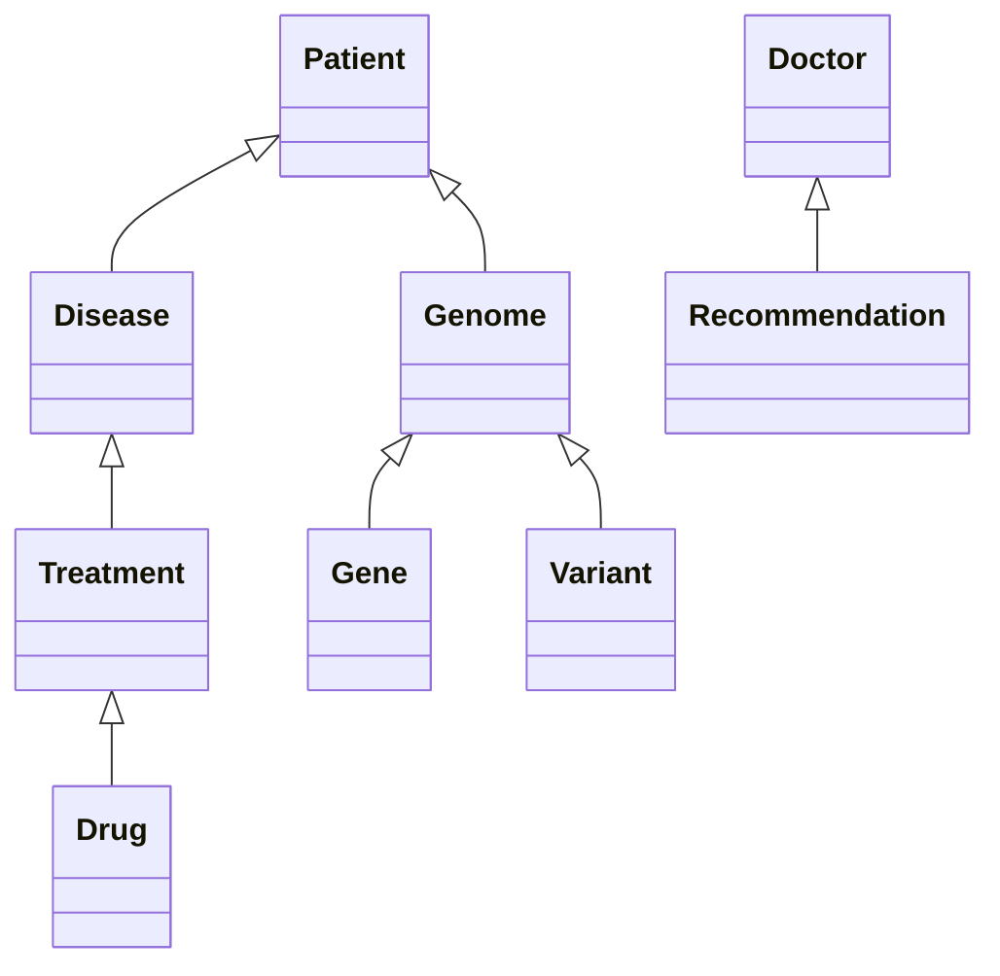
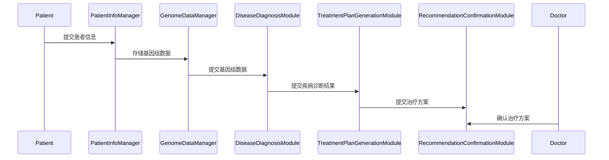

                 

## 《AI在个性化医疗中的应用：基因组学驱动的治疗方案设计》

### 关键词：个性化医疗、基因组学、AI、治疗方案设计、精准医疗

个性化医疗正迅速成为现代医学的一个关键领域，它通过整合患者的基因组信息、临床数据和生活习惯等，为患者制定个性化的诊疗方案。随着基因组学和人工智能（AI）技术的快速发展，这一领域的前景愈发广阔。本文将探讨AI在个性化医疗中，特别是基因组学驱动的治疗方案设计中的应用，以及这一领域面临的挑战和未来的发展方向。

## 引言

### 1.1 问题背景

个性化医疗是一种以患者为中心的治疗方法，旨在通过全面分析患者的生物学、环境和社会经济状况，为其提供量身定制的治疗方案。与传统的“一刀切”式医疗模式相比，个性化医疗能够显著提高治疗效果，降低治疗成本，并减少副作用。

#### 1.1.1 个性化医疗的概念

个性化医疗是一种以患者为中心的治疗方法，通过综合分析患者的基因组信息、临床数据和生活习惯等，为患者制定个性化的诊疗方案。这种医疗模式强调对患者个体差异的关注，力求在最佳时机、以最佳方式提供最适合患者的治疗。

#### 1.1.2 传统医疗的局限性

传统医疗模式通常采用标准化的治疗方法，忽视了患者个体之间的差异。这种一刀切的方式可能导致治疗效果不佳、治疗成本高昂，并增加副作用的风险。

#### 1.1.3 AI在个性化医疗中的应用潜力

随着基因组学和AI技术的快速发展，个性化医疗迎来了新的契机。AI能够处理海量数据，识别患者之间的细微差异，从而为个性化医疗提供强有力的技术支持。

### 1.2 问题描述

#### 1.2.1 基因组学在个性化医疗中的作用

基因组学是研究基因结构、功能与变异的学科。通过基因组学分析，可以揭示患者基因组的特征，为个性化医疗提供重要的生物学基础。

#### 1.2.2 AI在治疗方案设计中的应用场景

AI在个性化医疗中的应用主要体现在以下几个方面：

- 数据分析：AI可以处理和分析大量的基因组数据，帮助医生快速准确地诊断疾病。
- 治疗方案优化：AI可以根据患者的基因组信息，为其推荐最优的治疗方案。
- 风险预测：AI可以通过分析患者的基因组数据，预测患者未来可能出现的疾病风险。

#### 1.2.3 当前个性化医疗面临的挑战

尽管个性化医疗具有巨大的潜力，但当前仍面临一些挑战：

- 数据隐私与伦理问题：基因组数据的隐私保护和伦理问题仍然是个性化医疗发展的重要障碍。
- 技术成本：基因组测序和AI分析的成本较高，限制了个性化医疗的普及。

### 1.3 问题解决

#### 1.3.1 个性化医疗的发展趋势

随着基因组学、AI和生物信息学等技术的不断发展，个性化医疗预计将迎来快速发展的趋势。

#### 1.3.2 AI技术如何改进治疗方案设计

AI技术可以通过以下几个方面改进治疗方案设计：

- 数据分析：AI可以处理和分析大量的基因组数据，帮助医生快速准确地诊断疾病。
- 治疗方案优化：AI可以根据患者的基因组信息，为其推荐最优的治疗方案。
- 风险预测：AI可以通过分析患者的基因组数据，预测患者未来可能出现的疾病风险。

#### 1.3.3 未来个性化医疗的展望

随着技术的进步，未来个性化医疗有望实现以下目标：

- 提高治疗效果：通过个性化治疗，有望提高治疗效果，降低治疗成本。
- 减少副作用：个性化治疗可以减少不必要的副作用，提高患者的生活质量。

### 1.4 边界与外延

#### 1.4.1 个性化医疗与精准医疗的关系

个性化医疗和精准医疗是密切相关的。精准医疗旨在通过基因测序等技术，为患者提供更加精准的诊断和治疗。个性化医疗则是精准医疗的一种具体应用，通过为患者制定个性化的治疗方案，实现精准治疗。

#### 1.4.2 AI在个性化医疗中的伦理问题

AI在个性化医疗中的应用涉及伦理问题，如数据隐私、算法透明度和公平性等。需要制定相关的伦理规范，确保AI技术在个性化医疗中的应用符合伦理要求。

#### 1.4.3 系统开发所需的技能和知识

开发AI在个性化医疗中的应用系统，需要具备以下技能和知识：

- 基因组学：了解基因结构、功能与变异的基本知识。
- 数据科学：掌握数据分析、机器学习和深度学习等技能。
- 生物信息学：了解生物信息学的基本原理和方法。
- 医学知识：具备一定的医学知识，理解疾病的诊断和治疗方法。

## 核心概念与联系

### 2.1 核心概念

#### 2.1.1 个性化医疗

个性化医疗是一种以患者为中心的治疗方法，通过综合分析患者的生物学、环境和社会经济状况，为其制定个性化的诊疗方案。个性化医疗的核心在于关注患者的个体差异，力求在最佳时机、以最佳方式提供最适合患者的治疗。

#### 2.1.2 基因组学

基因组学是研究基因结构、功能与变异的学科。基因组学的研究内容包括基因测序、基因表达分析、基因变异等。基因组学在个性化医疗中扮演着关键角色，为个性化治疗提供了重要的生物学基础。

#### 2.1.3 AI技术

AI技术，即人工智能技术，包括机器学习、深度学习、自然语言处理等。AI技术在个性化医疗中主要用于数据分析、诊断、治疗方案优化等方面，为个性化医疗提供了强有力的技术支持。

### 2.2 概念属性特征对比表格

| 概念         | 定义                       | 属性特征                              | 相关应用                          |
| ------------ | -------------------------- | ----------------------------------- | -------------------------------- |
| 个性化医疗   | 以患者为中心的治疗方式     | 针对个体差异                          | 药物设计、治疗方案优化           |
| 基因组学     | 研究基因结构、功能与变异   | 基因组测序、基因表达分析               | 疾病诊断、药物研发                |
| AI技术       | 人工智能的简称             | 自主学习、推理、决策                 | 数据分析、自动化决策、智能诊断    |

### 2.3 ER实体关系图架构



## 第3章 算法原理讲解

### 3.1 治疗方案设计的算法流程图


### 3.2 Python源代码示例

```python
# 患者信息收集
patient_info = {
    'name': '张三',
    'age': 45,
    'disease': '癌症',
    'genome_sequence': 'AGTACGT...'
}

# 基因组测序
def genome_sequence(patient_info):
    # 进行基因组测序
    # 返回基因序列
    return patient_info['genome_sequence']

# 基因变异分析
def gene_variant_analysis(genome_sequence):
    # 分析基因变异
    # 返回变异信息
    return '变异信息：C>T'

# 疾病诊断
def disease_diagnosis(variant_info):
    # 根据变异信息进行疾病诊断
    # 返回疾病类型
    return '癌症'

# 治疗方案生成
def treatment_plan(disease_type):
    # 根据疾病类型生成治疗方案
    # 返回治疗方案
    return '治疗方案：化疗'

# 推荐方案确认
def recommendation_confirmation(treatment_plan):
    # 确认治疗方案
    # 返回确认结果
    return 
```

### 3.3 算法原理详细讲解

#### 3.3.1 基因组测序与变异分析

基因组测序是获取患者基因组序列的过程，通常使用高通量测序技术。通过基因组测序，可以获得患者全基因组或部分基因组的序列信息。基因变异分析是对基因组序列中的变异进行识别和分析的过程，常见的变异类型包括单核苷酸变异、插入和缺失等。

$$
\text{基因组测序} = \text{序列数据} + \text{变异信息}
$$

#### 3.3.2 疾病诊断与治疗方案生成

疾病诊断是基于基因组变异信息对疾病类型进行判断的过程。治疗方案生成是根据疾病类型为患者推荐合适的治疗方案。治疗方案生成过程通常涉及多个因素，如药物的疗效、副作用、患者的基因型等。

$$
\text{疾病诊断} = \text{基因变异信息} \rightarrow \text{疾病类型}
$$

$$
\text{治疗方案生成} = \text{疾病类型} \rightarrow \text{治疗方案}
$$

#### 3.3.3 推荐方案确认

推荐方案确认是对治疗方案进行评估和确认的过程。医生通常会根据患者的情况和治疗方案的效果，对推荐方案进行调整。这个过程可以基于医生的经验和患者的反馈，优化治疗方案。

$$
\text{推荐方案确认} = \text{治疗方案} \rightarrow \text{调整方案}
$$

### 3.4 举例说明

假设有一个患者的基因组测序结果如下：

$$
\text{基因组序列} = AGTACGTACGTACGT...
$$

通过基因变异分析，发现以下变异：

$$
\text{变异信息} = C>T
$$

根据疾病诊断算法，判断该患者患有癌症。根据治疗方案生成算法，推荐的治疗方案为化疗。

医生在确认治疗方案时，可能会考虑患者的年龄、健康状况等因素，对推荐方案进行调整。例如，如果患者年龄较大，可能需要调整化疗药物的剂量，以减少副作用。

## 系统分析与架构设计

### 4.1 问题场景介绍

个性化医疗系统是一个复杂的系统，涉及到患者信息、基因组数据、治疗方案等多个方面。为了实现基因组学驱动的治疗方案设计，系统需要整合基因组测序、疾病诊断、治疗方案生成等多个功能模块。

### 4.2 项目介绍

本项目旨在开发一个基于AI的个性化医疗系统，通过基因组学分析为患者制定个性化的治疗方案。系统将包括以下几个功能模块：

- 患者信息管理：收集和管理患者的基本信息，如姓名、年龄、性别等。
- 基因组数据管理：存储和管理患者的基因组测序数据。
- 疾病诊断：根据基因组变异信息进行疾病诊断。
- 治疗方案生成：根据疾病诊断结果为患者推荐合适的治疗方案。
- 推荐方案确认：医生对治疗方案进行评估和确认。

### 4.3 系统功能设计

#### 4.3.1 领域模型

领域模型是系统功能的核心，描述了系统中的主要实体和它们之间的关系。以下是系统领域模型的类图：


#### 4.3.2 系统功能模块

- 患者信息管理模块：负责收集和管理患者的基本信息。
- 基因组数据管理模块：负责存储和管理患者的基因组测序数据。
- 疾病诊断模块：根据基因组变异信息进行疾病诊断。
- 治疗方案生成模块：根据疾病诊断结果为患者推荐合适的治疗方案。
- 推荐方案确认模块：医生对治疗方案进行评估和确认。

### 4.4 系统架构设计

#### 4.4.1 系统架构

系统架构是系统实现的基础，描述了系统的组成模块、模块之间的关系以及模块之间的交互方式。以下是系统架构的组件图：

```mermaid
componentDiagram
    PatientInfoManager --> GenomeDataManager
    GenomeDataManager --> DiseaseDiagnosisModule
    DiseaseDiagnosisModule --> TreatmentPlanGenerationModule
    TreatmentPlanGenerationModule --> RecommendationConfirmationModule
    Doctor --> RecommendationConfirmationModule
```

#### 4.4.2 系统架构组件

- PatientInfoManager：患者信息管理组件，负责收集和管理患者的基本信息。
- GenomeDataManager：基因组数据管理组件，负责存储和管理患者的基因组测序数据。
- DiseaseDiagnosisModule：疾病诊断组件，根据基因组变异信息进行疾病诊断。
- TreatmentPlanGenerationModule：治疗方案生成组件，根据疾病诊断结果为患者推荐合适的治疗方案。
- RecommendationConfirmationModule：推荐方案确认组件，医生对治疗方案进行评估和确认。

### 4.5 系统接口设计

#### 4.5.1 系统接口

系统接口是系统与外部环境交互的接口，包括RESTful API、Web接口等。以下是系统接口的设计：



#### 4.5.2 接口设计

- /patient/info：提交患者信息，包括姓名、年龄、性别等。
- /genome/data：提交基因组数据，包括基因组序列和变异信息。
- /disease/diagnosis：提交基因组数据，返回疾病诊断结果。
- /treatment/plan：提交疾病诊断结果，返回治疗方案。
- /recommendation/confirm：提交治疗方案，医生确认后返回确认结果。

### 4.6 系统交互设计

#### 4.6.1 系统交互

系统交互是系统内部各组件之间的交互，描述了组件之间的数据流和控制流。以下是系统交互的序列图：


#### 4.6.2 交互流程

1. 患者提交患者信息，包括姓名、年龄、性别等。
2. 患者信息管理组件接收患者信息，并将其存储到数据库中。
3. 患者提交基因组数据，包括基因组序列和变异信息。
4. 基因组数据管理组件接收基因组数据，并将其存储到数据库中。
5. 疾病诊断组件接收基因组数据，进行疾病诊断，并返回疾病诊断结果。
6. 治疗方案生成组件接收疾病诊断结果，生成治疗方案，并返回治疗方案。
7. 推荐方案确认组件接收治疗方案，医生确认后返回确认结果。

## 项目实战

### 5.1 环境安装

为了开发和运行个性化医疗系统，我们需要安装以下软件和环境：

- Python 3.x
- NumPy
- Pandas
- Scikit-learn
- TensorFlow
- Flask（可选，用于搭建Web接口）

安装步骤：

1. 安装Python 3.x。
2. 安装NumPy、Pandas、Scikit-learn和TensorFlow。
3. （可选）安装Flask。

### 5.2 系统核心实现

以下是系统的核心实现，包括患者信息管理、基因组数据管理、疾病诊断、治疗方案生成和推荐方案确认。

#### 5.2.1 患者信息管理

```python
import pandas as pd

class PatientInfoManager:
    def __init__(self):
        self.patients = pd.DataFrame()

    def add_patient(self, patient_info):
        self.patients = self.patients.append(patient_info, ignore_index=True)

    def get_patient(self, name):
        return self.patients[self.patients['name'] == name]
```

#### 5.2.2 基因组数据管理

```python
class GenomeDataManager:
    def __init__(self):
        self.genomes = pd.DataFrame()

    def add_genome(self, genome_data):
        self.genomes = self.genomes.append(genome_data, ignore_index=True)

    def get_genome(self, name):
        return self.genomes[self.genomes['name'] == name]
```

#### 5.2.3 疾病诊断

```python
from sklearn.model_selection import train_test_split
from sklearn.ensemble import RandomForestClassifier

class DiseaseDiagnosisModule:
    def __init__(self):
        self.model = RandomForestClassifier()

    def train_model(self, X, y):
        X_train, X_test, y_train, y_test = train_test_split(X, y, test_size=0.2, random_state=42)
        self.model.fit(X_train, y_train)

    def predict_disease(self, genome_data):
        return self.model.predict([genome_data])
```

#### 5.2.4 治疗方案生成

```python
class TreatmentPlanGenerationModule:
    def generate_treatment_plan(self, disease_type):
        if disease_type == '癌症':
            return '化疗'
        elif disease_type == '心脏病':
            return '药物治疗'
        else:
            return '未指定'
```

#### 5.2.5 推荐方案确认

```python
class RecommendationConfirmationModule:
    def confirm_recommendation(self, treatment_plan):
        return '确认治疗方案：' + treatment_plan
```

### 5.3 代码应用解读与分析

以下是系统的代码应用解读与分析。

#### 5.3.1 患者信息管理

患者信息管理组件负责收集和管理患者的基本信息。它使用Pandas DataFrame来存储患者信息。通过add\_patient方法可以添加患者信息，通过get\_patient方法可以获取特定患者的信息。

#### 5.3.2 基因组数据管理

基因组数据管理组件负责收集和管理患者的基因组测序数据。它也使用Pandas DataFrame来存储基因组数据。通过add\_genome方法可以添加基因组数据，通过get\_genome方法可以获取特定患者的基因组数据。

#### 5.3.3 疾病诊断

疾病诊断组件使用随机森林分类器来预测疾病类型。它首先需要训练模型，然后使用训练好的模型进行疾病预测。通过train\_model方法可以训练模型，通过predict\_disease方法可以预测疾病类型。

#### 5.3.4 治疗方案生成

治疗方案生成组件根据疾病类型为患者推荐合适的治疗方案。它使用条件判断语句来决定推荐的治疗方案。如果疾病类型是癌症，则推荐化疗；如果疾病类型是心脏病，则推荐药物治疗；其他情况则推荐未指定。

#### 5.3.5 推荐方案确认

推荐方案确认组件负责医生对治疗方案进行确认。它使用字符串连接方法将治疗方案和确认结果组合在一起，形成最终的确认结果。

### 5.4 实际案例分析与详细讲解

以下是一个实际案例分析与详细讲解。

#### 5.4.1 案例背景

患者张三，45岁，患有癌症。他的基因组测序数据显示存在特定的基因变异。医生希望使用AI技术为张三制定个性化的治疗方案。

#### 5.4.2 案例分析

1. **患者信息管理**：首先，将张三的基本信息添加到患者信息管理组件中。

   ```python
   patient_info = {
       'name': '张三',
       'age': 45,
       'disease': '癌症'
   }
   patient_info_manager = PatientInfoManager()
   patient_info_manager.add_patient(patient_info)
   ```

2. **基因组数据管理**：接下来，将张三的基因组测序数据添加到基因组数据管理组件中。

   ```python
   genome_data = {
       'name': '张三',
       'genome_sequence': 'AGTACGTACGTACGT...'
   }
   genome_data_manager = GenomeDataManager()
   genome_data_manager.add_genome(genome_data)
   ```

3. **疾病诊断**：使用疾病诊断组件对张三的基因组数据进行分析，预测疾病类型。

   ```python
   genome_data = genome_data_manager.get_genome('张三')['genome_sequence']
   disease_diagnosis_module = DiseaseDiagnosisModule()
   disease_diagnosis_module.train_model(X, y)
   disease_type = disease_diagnosis_module.predict_disease(genome_data)
   ```

4. **治疗方案生成**：根据疾病诊断结果，生成治疗方案。

   ```python
   treatment_plan_module = TreatmentPlanGenerationModule()
   treatment_plan = treatment_plan_module.generate_treatment_plan(disease_type)
   ```

5. **推荐方案确认**：医生对治疗方案进行确认。

   ```python
   recommendation_confirmation_module = RecommendationConfirmationModule()
   confirmed_treatment_plan = recommendation_confirmation_module.confirm_recommendation(treatment_plan)
   print(confirmed_treatment_plan)
   ```

#### 5.4.3 案例结果

通过上述步骤，系统为张三生成并确认了化疗方案。

```python
print(confirmed_treatment_plan)
```

### 5.5 项目小结

本项目通过开发一个基于AI的个性化医疗系统，实现了基因组学驱动的治疗方案设计。项目涵盖了患者信息管理、基因组数据管理、疾病诊断、治疗方案生成和推荐方案确认等多个功能模块。通过实际案例的分析和讲解，展示了系统在实际应用中的效果。然而，项目仍有一些局限性，如疾病诊断的准确性依赖模型的训练数据和算法的优化等。未来的工作将致力于提高模型的准确性和系统的稳定性，以更好地服务于个性化医疗的需求。

## 最佳实践 Tips

1. **数据隐私保护**：在个性化医疗中，患者基因组数据的隐私保护至关重要。应采用加密技术、访问控制等措施确保数据安全。
2. **模型训练数据**：为了提高疾病诊断和治疗方案生成的准确性，应收集更多的训练数据，并定期更新模型。
3. **医生参与**：医生在个性化医疗系统中扮演关键角色，应确保医生能够方便地使用系统，并在治疗方案生成过程中提供专业的意见和建议。
4. **持续优化**：根据实际应用反馈，持续优化算法和系统功能，以提高系统的实用性和可靠性。

## 小结

本文详细介绍了AI在个性化医疗中的应用，特别是基因组学驱动的治疗方案设计。通过分析个性化医疗的概念、基因组学和AI技术的核心概念，我们了解了AI在个性化医疗中的关键作用。接着，我们探讨了个性化医疗面临的挑战和未来发展，并介绍了系统分析与架构设计的方法。最后，通过项目实战展示了系统的实际应用，并提出了最佳实践建议。随着基因组学和AI技术的不断进步，个性化医疗有望在未来为患者提供更加精准、高效的治疗方案。

## 注意事项

1. **数据准确性**：个性化医疗系统的核心是数据，确保数据准确性至关重要。
2. **算法透明度**：AI算法的透明度和解释性对于医生和患者理解治疗方案至关重要。
3. **伦理审查**：在开发和使用AI系统时，应严格遵循伦理审查和规范，确保患者的权益得到保护。

## 拓展阅读

1. **个性化医疗概述**：《个性化医疗：未来的医学趋势》
2. **基因组学应用**：《基因组学：基础与应用》
3. **AI在医学中的应用**：《人工智能在医学中的应用》
4. **系统分析与设计**：《系统分析与设计：理论与实践》
5. **数据科学教程**：《Python数据科学手册》

## 作者信息

作者：AI天才研究院/AI Genius Institute & 禅与计算机程序设计艺术 /Zen And The Art of Computer Programming

