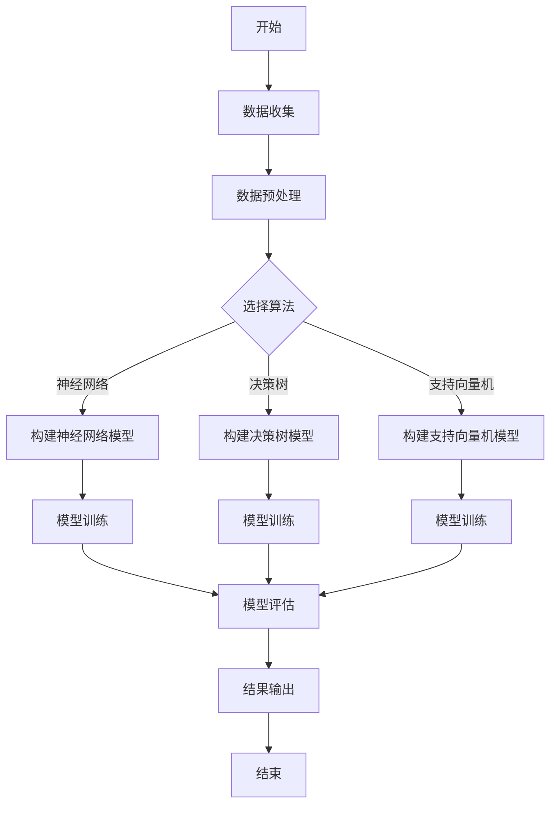

                 

## 引言

### 第1章: AI与企业信用评级概述

#### 1.1 问题的背景和重要性

##### 1.1.1 企业信用评级的现状

在当今的商业环境中，企业信用评级已经成为一项至关重要的活动。信用评级机构通过评估企业的信用状况，提供了一种评估企业还款能力的方法，帮助企业决策者做出更明智的商业决策。当前的企业信用评级流程通常包括对企业的历史财务数据、市场地位、管理水平、业务模式等多方面因素进行综合分析，然后依据一定的标准和流程，对企业的信用等级进行评定。

这些评级标准通常由各种评级机构制定，如标准普尔、穆迪、惠誉等国际知名评级机构，它们拥有丰富的评级经验和专业的评级模型。评级结果通常分为多个等级，如AA、A、BBB等，等级越高，企业的信用水平越高，融资成本也相对较低。这些评级结果不仅对企业的融资活动有直接影响，还对企业参与招投标、市场拓展等方面产生重要影响。

##### 1.1.2 企业信用评级在商业活动中的作用和意义

企业信用评级在商业活动中具有不可忽视的作用和意义。首先，它为企业提供了透明的信用评估结果，有助于企业了解自身的信用状况，及时发现和纠正潜在的信用风险。其次，对于投资者和债权人而言，信用评级结果是一种重要的参考依据，有助于他们评估企业的信用风险，做出合理的投资和借贷决策。此外，企业信用评级还对市场秩序的维护和金融稳定具有重要意义，有助于降低金融系统的风险水平。

##### 1.1.3 AI技术在信用评级中的应用

随着人工智能技术的快速发展，AI技术开始逐渐在各个领域得到应用，包括企业信用评级。AI技术在信用评级中的应用主要体现在以下几个方面：

1. **数据处理能力**：AI技术擅长处理海量数据，能够从企业历史财务数据、市场交易数据、社交网络数据等多源数据中提取有价值的信息，为信用评级提供更全面、准确的数据支持。
2. **模式识别能力**：AI技术，尤其是深度学习和强化学习等技术，具有强大的模式识别能力，能够发现企业信用风险中的复杂模式，提高信用评级的准确性。
3. **风险评估和预测**：通过AI技术，可以构建复杂的风险评估模型，对企业的信用风险进行预测，提供动态的风险评估结果，帮助企业及时应对信用风险。

#### 1.2 问题提出

尽管AI技术在企业信用评级中具有巨大的潜力，但其应用也面临着诸多挑战。首先，数据质量和数据量的问题是一个关键挑战。企业信用评级需要大量的高质量数据，但现实中，数据的获取和整合是一个难题。其次，AI模型的解释性和透明度也是一个问题，现有的AI模型往往是“黑箱”模型，难以解释其决策过程，这在一定程度上限制了其在信用评级中的应用。此外，AI技术在信用评级中还需要面对法律法规、道德伦理等方面的挑战。

#### 1.3 边界与外延

在讨论AI在企业信用评级中的应用时，我们还需要明确信用评级的对象和范围。企业信用评级的对象主要是各类企业，包括大型企业、中小企业、初创企业等。信用评级的范围则涵盖了企业的财务状况、业务模式、管理水平、市场环境等多方面因素。

AI技术在该领域内的应用范围主要涉及数据收集和处理、风险评估和预测、信用等级评定等方面。然而，AI技术的应用也受到一定的限制，比如在涉及敏感数据和隐私保护方面，需要遵循相关的法律法规和道德准则。

#### 1.4 概念结构与核心要素

企业信用评级的基本概念包括信用评级机构、评级方法、评级结果等。AI技术在信用评级中的应用核心要素则包括数据收集与处理、风险评估与预测、模型训练与优化等。

本章通过对AI与企业信用评级的基本概念、应用背景和挑战进行概述，为后续章节的详细讨论奠定了基础。在接下来的章节中，我们将进一步探讨AI技术在企业信用评级中的具体应用、算法原理、数学模型等内容。

### 1.5 本章小结

通过对AI与企业信用评级的基本概念、应用背景和挑战的概述，我们可以得出以下结论：

1. **企业信用评级的重要性**：企业信用评级在商业活动中具有不可忽视的作用，它为企业的融资、投资和运营提供了重要的参考依据。
2. **AI技术在信用评级中的潜力**：AI技术具有强大的数据处理、模式识别和风险评估能力，能够为企业信用评级提供更全面、准确的数据支持。
3. **面临的挑战**：尽管AI技术在企业信用评级中具有巨大潜力，但其应用也面临着数据质量、模型解释性和法律法规等方面的挑战。

总之，AI在企业信用评级中的应用是一项复杂且具有挑战性的任务，需要我们在技术、法律和伦理等方面进行深入的研究和探讨。

---

### 第2章: AI核心概念与联系

#### 2.1 AI基本概念

##### 2.1.1 AI的定义和发展历程

人工智能（Artificial Intelligence, AI）是计算机科学的一个分支，旨在研究、开发和应用使计算机能够模拟、扩展和增强人类智能的理论、算法和技术。人工智能的概念最早可以追溯到20世纪50年代，当时科学家们开始探索如何让计算机具备智能行为。从最初的逻辑推理和符号计算，到后来的知识表示和学习，再到如今的深度学习和强化学习，人工智能经历了多个发展阶段。

1. **早期阶段（20世纪50-60年代）**：这一阶段的主要研究方向是符号人工智能，通过逻辑推理和符号计算来模拟人类智能。代表性的研究包括阿尔图尔·塞缪尔（Arthur Samuel）的棋程序和约翰·麦卡锡（John McCarthy）提出的符号主义人工智能。

2. **专家系统阶段（20世纪70-80年代）**：这一阶段的研究重点是基于知识表示和推理的专家系统，通过模拟专家的决策过程来解决特定领域的问题。例如，Dendral是一个著名的化学专家系统，它通过分析化学实验数据来推导出化学反应方程式。

3. **连接主义阶段（20世纪80-90年代）**：这一阶段的研究转向神经网络和机器学习，通过模拟生物神经系统的工作方式，使计算机具备自动学习和自适应能力。1986年，霍普菲尔德（John Hopfield）提出了神经网络，为深度学习的发展奠定了基础。

4. **深度学习和强化学习阶段（21世纪以来）**：这一阶段的研究主要集中在深度神经网络和强化学习，通过大规模数据和高效算法，实现了在图像识别、语音识别、自然语言处理等领域的突破。2012年，AlexNet在ImageNet图像识别挑战赛中取得了突破性的成绩，标志着深度学习的崛起。

##### 2.1.2 AI的核心要素

人工智能的核心要素包括机器学习、深度学习和强化学习，这些技术在不同层面上为人工智能的发展提供了支持。

1. **机器学习**：机器学习是使计算机从数据中自动学习的一种方法，它通过构建模型来预测或决策。机器学习可以分为监督学习、无监督学习和半监督学习。监督学习有明确的输入和输出，如分类和回归任务；无监督学习没有明确的输出，如聚类和降维；半监督学习结合了监督学习和无监督学习，适用于数据标签不足的情况。

2. **深度学习**：深度学习是机器学习的一个分支，主要基于多层神经网络，通过逐层提取特征来学习复杂的数据模式。深度学习在图像识别、语音识别、自然语言处理等领域取得了显著成果。常见的深度学习模型包括卷积神经网络（CNN）、循环神经网络（RNN）和生成对抗网络（GAN）等。

3. **强化学习**：强化学习是一种通过试错和反馈来学习最优策略的机器学习方法。它通过奖励机制来引导模型学习如何在特定环境中做出最佳决策。强化学习在游戏、自动驾驶、推荐系统等领域有着广泛的应用。

#### 2.2 AI与信用评级的关系

##### 2.2.1 信用评级的难点

传统的企业信用评级方法主要依赖于历史数据和专家经验，存在一些显著的局限性：

1. **数据量不足**：传统的信用评级方法通常依赖于有限的历史财务数据和业务数据，难以获取全面的信息。

2. **数据质量参差不齐**：由于数据来源的多样性和不一致性，数据质量参差不齐，存在噪声和缺失值，影响评级结果的准确性。

3. **复杂业务逻辑**：企业的信用状况受到多种复杂因素的影响，如市场环境、行业趋势、管理决策等，传统方法难以全面捕捉和量化这些因素。

##### 2.2.2 AI技术在信用评级中的优势

AI技术为解决上述难题提供了新的途径，其主要优势包括：

1. **大数据处理能力**：AI技术能够处理和分析海量数据，从多源数据中提取有价值的信息，为信用评级提供更全面的数据支持。

2. **模式识别能力**：AI技术，尤其是深度学习和强化学习等技术，具有强大的模式识别能力，能够从复杂的数据中发现潜在的风险模式和信用特征。

3. **风险评估和预测**：通过构建复杂的风险评估模型，AI技术能够对企业的信用风险进行预测，提供动态的风险评估结果，帮助企业及时应对信用风险。

#### 2.3 AI应用场景

##### 2.3.1 数据收集与处理

AI技术在企业信用评级中的第一个应用场景是数据收集与处理。具体包括以下几个方面：

1. **数据源集成**：通过爬虫、API调用等手段，从多个数据源（如财务报表、市场交易数据、社交媒体数据等）收集相关信息。

2. **数据清洗**：对收集到的数据进行清洗，处理噪声和缺失值，确保数据质量。

3. **特征工程**：从原始数据中提取有用的特征，如财务指标、市场指标、社交网络指标等，为后续建模提供输入。

##### 2.3.2 风险评估与预测

AI技术在企业信用评级中的第二个应用场景是风险评估与预测。具体包括以下几个方面：

1. **风险识别**：利用机器学习算法，从数据中识别出潜在的风险因素，如财务风险、市场风险、信用风险等。

2. **风险评估**：基于风险识别结果，对企业的信用风险进行定量评估，确定其信用等级。

3. **风险预测**：利用时间序列分析、深度学习等技术，预测企业的未来信用风险变化，提供动态的风险预警。

##### 2.3.3 信用等级评定

AI技术在企业信用评级中的第三个应用场景是信用等级评定。具体包括以下几个方面：

1. **模型训练与优化**：利用历史数据和评估结果，训练和优化信用评级模型，提高评估的准确性和稳定性。

2. **实时评估**：通过在线评估系统，实时监测企业的信用变化，提供动态的信用评级结果。

3. **决策支持**：为企业的决策者提供信用评级结果和风险分析报告，支持其做出更明智的商业决策。

### 2.4 本章小结

通过对AI核心概念的介绍和其在企业信用评级中的应用分析，我们可以得出以下结论：

1. **AI技术的潜力**：AI技术具有强大的数据处理、模式识别和风险评估能力，能够为企业信用评级提供更全面、准确的数据支持。

2. **应用场景**：AI技术在企业信用评级中的应用场景包括数据收集与处理、风险评估与预测、信用等级评定等。

3. **面临的挑战**：尽管AI技术在企业信用评级中具有巨大潜力，但其应用也面临着数据质量、模型解释性和法律法规等方面的挑战。

总之，AI技术在企业信用评级中的应用是一项复杂且具有挑战性的任务，需要我们在技术、法律和伦理等方面进行深入的研究和探讨。

---

### 第3章: AI在企业信用评级中的算法原理

#### 3.1 算法概述

##### 3.1.1 常见算法介绍

在企业信用评级中，常用的算法主要包括神经网络、决策树和支持向量机等。这些算法各有特点，适用于不同的应用场景。

1. **神经网络**：神经网络是一种模拟人脑神经元连接方式的计算模型，通过多层神经元的连接和激活，实现数据的自动学习和特征提取。神经网络在处理复杂非线性关系和大规模数据方面具有显著优势。

2. **决策树**：决策树是一种基于规则的方法，通过树形结构对数据进行分类或回归。决策树的生成过程包括特征选择、划分策略和剪枝等。决策树具有直观、易于理解和解释性强的特点，适合处理结构化数据。

3. **支持向量机**：支持向量机是一种基于最大间隔原理的分类和回归方法。它通过在高维空间中找到最优超平面，将数据分类或回归到目标区域。支持向量机具有高维特征映射能力和良好的分类性能。

##### 3.1.2 算法比较

1. **特点与适用场景**：

   - **神经网络**：适用于处理复杂、非线性关系的数据，特别是在大规模数据集上表现优秀。但神经网络模型参数较多，训练时间较长，且模型解释性较差。
   - **决策树**：适用于结构化数据，特别是分类问题。决策树具有较好的可解释性和直观性，但容易过拟合，模型性能不稳定。
   - **支持向量机**：适用于高维数据，特别是分类问题。支持向量机具有较好的分类性能和泛化能力，但训练时间较长，且对参数敏感。

2. **性能对比**：

   - **准确率**：神经网络和支持向量机在准确率上表现较为优秀，决策树相对较低。
   - **训练时间**：神经网络和支持向量机的训练时间较长，决策树相对较短。
   - **解释性**：神经网络模型解释性较差，决策树和支持向量机具有较好的可解释性。

##### 3.1.3 算法选择

在选择AI算法进行企业信用评级时，需要考虑以下因素：

1. **数据类型和规模**：对于大规模、复杂结构的数据，神经网络和支持向量机更为合适；对于结构化、小规模的数据，决策树更为适用。

2. **业务需求**：根据信用评级的业务需求，选择具有相应优势的算法。例如，如果需要高准确率，可以选择神经网络或支持向量机；如果需要高可解释性，可以选择决策树。

3. **计算资源**：考虑计算资源和时间成本，选择适合的算法。例如，如果时间充裕，可以选择神经网络或支持向量机；如果时间紧张，可以选择决策树。

#### 3.2 算法流程图

下面是神经网络、决策树和支持向量机的基本算法流程图：



#### 3.3 算法原理讲解

##### 3.3.1 神经网络

神经网络由多个神经元层组成，包括输入层、隐藏层和输出层。每个神经元接收输入信号，通过权重和偏置进行加权求和，然后通过激活函数输出结果。

1. **神经网络的组成和结构**：

   - **输入层**：接收外部输入信号。
   - **隐藏层**：对输入信号进行特征提取和变换。
   - **输出层**：生成最终输出结果。

2. **神经网络的训练过程**：

   - **前向传播**：输入信号从输入层传递到隐藏层，再传递到输出层。
   - **反向传播**：计算输出层与实际结果之间的误差，将误差反向传播到隐藏层和输入层，更新权重和偏置。

   以下是一个简化的神经网络训练过程的Python代码示例：

   ```python
   import numpy as np

   # 初始化参数
   X = np.array([[1, 0], [0, 1], [1, 1]])
   y = np.array([0, 1, 1])
   weights = np.random.randn(2, 1)
   biases = np.random.randn(1)
   learning_rate = 0.1

   # 训练过程
   for epoch in range(1000):
       # 前向传播
       z = np.dot(X, weights) + biases
       a = 1 / (1 + np.exp(-z))
       # 反向传播
       error = y - a
       dweights = np.dot(X.T, error * a * (1 - a))
       dbiases = np.sum(error * a * (1 - a))
       # 更新参数
       weights -= learning_rate * dweights
       biases -= learning_rate * dbiases

       # 打印训练结果
       if epoch % 100 == 0:
           print(f"Epoch {epoch}: Error = {np.mean((y - a)**2)}")
   ```

##### 3.3.2 决策树

决策树通过一系列规则来对数据进行分类或回归。决策树的核心是划分策略和剪枝方法。

1. **决策树的基本概念**：

   - **节点**：表示数据的某个特征。
   - **分支**：表示对节点的划分。
   - **叶节点**：表示最终分类或回归结果。

2. **决策树的生成和剪枝**：

   - **生成**：选择最优划分策略（如信息增益、基尼不纯度等），递归地划分数据，生成决策树。
   - **剪枝**：通过剪掉决策树中的分支，防止过拟合，提高模型的泛化能力。

   以下是一个简化的决策树生成过程的Python代码示例：

   ```python
   import numpy as np
   import pandas as pd
   from sklearn.tree import DecisionTreeClassifier
   from sklearn.model_selection import train_test_split

   # 数据准备
   df = pd.DataFrame({
       'feature1': np.random.randint(0, 10, size=100),
       'feature2': np.random.randint(0, 10, size=100),
       'target': np.random.randint(0, 2, size=100)
   })

   X = df[['feature1', 'feature2']]
   y = df['target']

   # 划分训练集和测试集
   X_train, X_test, y_train, y_test = train_test_split(X, y, test_size=0.2, random_state=42)

   # 构建决策树模型
   clf = DecisionTreeClassifier(criterion='entropy')
   clf.fit(X_train, y_train)

   # 打印决策树结构
   print(clf)
   ```

##### 3.3.3 支持向量机

支持向量机通过最大化类别的间隔来分类或回归数据。支持向量机的基本原理是在高维空间中找到一个最优超平面，使得不同类别的数据点之间有最大的间隔。

1. **支持向量机的基本原理**：

   - **线性分类**：通过找到一个最优超平面，将不同类别的数据点分隔开来。
   - **非线性分类**：通过核函数将低维数据映射到高维空间，在高维空间中找到最优超平面。

2. **支持向量机的分类和回归**：

   - **分类**：找到最优超平面，使得类别的间隔最大。
   - **回归**：通过找到一个最优回归超平面，使得预测值与实际值之间的误差最小。

   以下是一个简化的支持向量机分类过程的Python代码示例：

   ```python
   import numpy as np
   import matplotlib.pyplot as plt
   from sklearn.svm import SVC
   from sklearn.model_selection import train_test_split

   # 数据准备
   X = np.array([[1, 1], [1, -1], [-1, 1], [-1, -1]])
   y = np.array([1, 1, -1, -1])

   # 划分训练集和测试集
   X_train, X_test, y_train, y_test = train_test_split(X, y, test_size=0.2, random_state=42)

   # 构建支持向量机模型
   clf = SVC(kernel='linear')
   clf.fit(X_train, y_train)

   # 预测和绘图
   plt.scatter(X_train[:, 0], X_train[:, 1], c=y_train)
   plt.plot(X_train[:, 0], (-clf.dual_coef_ / clf.intercept_)[0] * X_train[:, 0] + clf.intercept_, 'r')
   plt.scatter(X_test[:, 0], X_test[:, 1], c=y_test, marker='x')
   plt.show()
   ```

##### 3.3.4 算法举例说明

为了更好地理解上述算法的原理，下面通过具体实例来说明神经网络、决策树和支持向量机在信用评级中的应用。

1. **神经网络举例**：

   假设我们有一个包含财务指标的数据集，我们需要用神经网络对企业的信用风险进行分类。首先，我们通过数据预处理步骤清洗数据，然后使用Python的TensorFlow库构建和训练神经网络模型。具体代码如下：

   ```python
   import tensorflow as tf
   from tensorflow.keras.models import Sequential
   from tensorflow.keras.layers import Dense
   from sklearn.model_selection import train_test_split

   # 数据准备
   X = ...  # 特征数据
   y = ...  # 标签数据

   # 划分训练集和测试集
   X_train, X_test, y_train, y_test = train_test_split(X, y, test_size=0.2, random_state=42)

   # 构建神经网络模型
   model = Sequential()
   model.add(Dense(10, input_dim=X_train.shape[1], activation='relu'))
   model.add(Dense(1, activation='sigmoid'))

   # 编译模型
   model.compile(optimizer='adam', loss='binary_crossentropy', metrics=['accuracy'])

   # 训练模型
   model.fit(X_train, y_train, epochs=100, batch_size=10, validation_data=(X_test, y_test))
   ```

2. **决策树举例**：

   假设我们有一个包含财务指标和信用评级结果的数据集，我们需要用决策树模型对新的企业进行信用评级。首先，我们通过数据预处理步骤清洗数据，然后使用Python的scikit-learn库构建和训练决策树模型。具体代码如下：

   ```python
   import numpy as np
   import pandas as pd
   from sklearn.tree import DecisionTreeClassifier

   # 数据准备
   df = pd.read_csv('credit_data.csv')
   X = df[['feature1', 'feature2']]
   y = df['target']

   # 构建决策树模型
   clf = DecisionTreeClassifier(criterion='entropy')
   clf.fit(X, y)

   # 打印决策树结构
   print(clf)
   ```

3. **支持向量机举例**：

   假设我们有一个包含财务指标和信用评级结果的数据集，我们需要用支持向量机模型对新的企业进行信用评级。首先，我们通过数据预处理步骤清洗数据，然后使用Python的scikit-learn库构建和训练支持向量机模型。具体代码如下：

   ```python
   import numpy as np
   import matplotlib.pyplot as plt
   from sklearn.svm import SVC
   from sklearn.model_selection import train_test_split

   # 数据准备
   X = np.array([[1, 1], [1, -1], [-1, 1], [-1, -1]])
   y = np.array([1, 1, -1, -1])

   # 划分训练集和测试集
   X_train, X_test, y_train, y_test = train_test_split(X, y, test_size=0.2, random_state=42)

   # 构建支持向量机模型
   clf = SVC(kernel='linear')
   clf.fit(X_train, y_train)

   # 预测和绘图
   plt.scatter(X_train[:, 0], X_train[:, 1], c=y_train)
   plt.plot(X_train[:, 0], (-clf.dual_coef_ / clf.intercept_)[0] * X_train[:, 0] + clf.intercept_, 'r')
   plt.scatter(X_test[:, 0], X_test[:, 1], c=y_test, marker='x')
   plt.show()
   ```

##### 3.3.5 本章小结

通过对神经网络、决策树和支持向量机等算法在企业信用评级中的应用进行详细讲解和举例说明，我们可以得出以下结论：

1. **算法原理**：神经网络、决策树和支持向量机等算法在企业信用评级中各有特点和应用场景。
2. **算法比较**：神经网络适用于处理复杂、非线性关系的数据，决策树具有较好的可解释性，支持向量机在高维空间中具有较好的分类性能。
3. **算法应用**：通过具体实例展示了如何使用神经网络、决策树和支持向量机算法进行信用评级。

总之，AI算法在企业信用评级中具有重要的应用价值，但其应用也需要结合具体业务需求和数据特点进行选择和优化。

### 3.4 数学模型和公式

##### 3.4.1 神经网络

神经网络的核心在于其激活函数和损失函数。以下是神经网络中常用的数学模型和公式：

1. **激活函数**：

   - **Sigmoid函数**：

     $$
     \text{激活函数}: f(x) = \frac{1}{1 + e^{-x}}
     $$

   - **ReLU函数**：

     $$
     \text{激活函数}: f(x) = \max(0, x)
     $$

   - **Tanh函数**：

     $$
     \text{激活函数}: f(x) = \frac{e^x - e^{-x}}{e^x + e^{-x}}
     $$

2. **损失函数**：

   - **均方误差（MSE）**：

     $$
     \text{损失函数}: L(y, \hat{y}) = \frac{1}{2} \sum_{i=1}^{n} (y_i - \hat{y}_i)^2
     $$

   - **交叉熵（Cross-Entropy）**：

     $$
     \text{损失函数}: L(y, \hat{y}) = -\sum_{i=1}^{n} y_i \log(\hat{y}_i)
     $$

##### 3.4.2 决策树

决策树的核心在于其划分策略和信息增益。以下是决策树中常用的数学模型和公式：

1. **信息增益**：

   $$
   \text{信息增益}: IG(V, A) = H(V) - \sum_{v \in V} p(v) H(A|V)
   $$

   - **熵（Entropy）**：

     $$
     H(V) = -\sum_{v \in V} p(v) \log_2 p(v)
     $$

   - **条件熵（Conditional Entropy）**：

     $$
     H(A|V) = -\sum_{v \in V} p(v) \sum_{a \in A} p(a|v) \log_2 p(a|v)
     $$

##### 3.4.3 支持向量机

支持向量机的基本原理是在高维空间中找到一个最优超平面。以下是支持向量机中常用的数学模型和公式：

1. **线性支持向量机**：

   - **决策边界**：

     $$
     \text{决策边界}: w \cdot x + b = 0
     $$

   - **优化目标**：

     $$
     \text{优化目标}: \min_{w, b} \frac{1}{2} \| w \|^2, \quad \text{s.t.} \quad y_i (w \cdot x_i + b) \geq 1, \quad i = 1, 2, \ldots, n
     $$

2. **非线性支持向量机**：

   - **核函数**：

     $$
     \text{核函数}: K(x_i, x_j) = \phi(x_i)^T \phi(x_j)
     $$

   - **优化目标**：

     $$
     \text{优化目标}: \min_{w, b} \frac{1}{2} \| w \|^2, \quad \text{s.t.} \quad y_i K(w \cdot x_i + b) \geq 1, \quad i = 1, 2, \ldots, n
     $$

##### 3.4.4 公式详细讲解

1. **神经网络**：

   - **激活函数**：

     激活函数的作用是引入非线性，使神经网络能够处理复杂的问题。以Sigmoid函数为例，其值域为(0, 1)，能够将输入映射到概率区间。Tanh函数和ReLU函数也是常用的激活函数，分别具有较好的平滑性和计算效率。

   - **损失函数**：

     损失函数用于衡量预测值和真实值之间的差距，常见的损失函数有均方误差（MSE）和交叉熵（Cross-Entropy）。MSE函数能够衡量预测值和真实值之间的误差平方，适用于回归问题；交叉熵函数能够衡量预测概率和真实概率之间的差异，适用于分类问题。

2. **决策树**：

   - **信息增益**：

     信息增益是决策树中的一个重要概念，用于衡量特征划分带来的信息提升。熵（Entropy）表示数据的不确定性，条件熵（Conditional Entropy）表示在给定一个特征后，另一个特征的不确定性。信息增益（Information Gain）通过计算熵的减少量，衡量特征划分的效果。

3. **支持向量机**：

   - **线性支持向量机**：

     线性支持向量机通过寻找最优超平面，将不同类别的数据点分隔开来。决策边界（Decision Boundary）是一个超平面，满足\( w \cdot x + b = 0 \)。优化目标是最小化超平面的法向量的范数，同时满足数据点的约束条件。

   - **非线性支持向量机**：

     非线性支持向量机通过核函数（Kernel Function）将低维数据映射到高维空间，寻找最优超平面。核函数的作用是计算高维空间中点之间的相似性，常见的核函数有线性核、多项式核和径向基函数（RBF）核。

##### 3.4.5 公式举例说明

1. **神经网络**：

   - **示例数据**：

     假设我们有一个包含输入和输出的数据集，其中输入为\( x = [1, 0] \)，输出为\( y = 1 \)。

   - **激活函数计算**：

     使用Sigmoid函数，计算输入的激活值：

     $$
     f(x) = \frac{1}{1 + e^{-x}} = \frac{1}{1 + e^{-1 \cdot 1}} = \frac{1}{1 + e^{-1}} \approx 0.7311
     $$

   - **损失函数计算**：

     使用交叉熵函数，计算预测值和真实值之间的损失：

     $$
     L(y, \hat{y}) = -y \log(\hat{y}) - (1 - y) \log(1 - \hat{y}) = -1 \cdot \log(0.7311) - 0 \cdot \log(1 - 0.7311) \approx 0.3863
     $$

2. **决策树**：

   - **示例数据**：

     假设我们有一个包含两个特征的数据集，其中特征A有三种取值（a, b, c），特征B有两种取值（1, 2）。

   - **信息增益计算**：

     首先计算整个数据集的熵：

     $$
     H(V) = -p(a) \log_2 p(a) - p(b) \log_2 p(b) - p(c) \log_2 p(c)
     $$

     然后计算条件熵：

     $$
     H(A|V) = p(a) H(A|a) + p(b) H(A|b) + p(c) H(A|c)
     $$

     其中，\( H(A|a) = -p(a1) \log_2 p(a1) - p(a2) \log_2 p(a2) \)，其他条件类似。

     最后计算信息增益：

     $$
     IG(V, A) = H(V) - \sum_{v \in V} p(v) H(A|V)
     $$

3. **支持向量机**：

   - **示例数据**：

     假设我们有一个包含四个样本的数据集，其中样本点为\( x_1 = [1, 1], x_2 = [1, -1], x_3 = [-1, 1], x_4 = [-1, -1] \)，标签为\( y_1 = 1, y_2 = 1, y_3 = -1, y_4 = -1 \)。

   - **决策边界计算**：

     首先计算超平面的法向量\( w \)和偏置\( b \)，满足：

     $$
     w \cdot x_i + b \geq 1, \quad i = 1, 2, 3, 4
     $$

     然后计算最优超平面：

     $$
     \text{决策边界}: w \cdot x + b = 0
     $$

综上所述，通过对神经网络、决策树和支持向量机等算法的数学模型和公式进行详细讲解和举例说明，我们可以更好地理解这些算法在企业信用评级中的应用原理。这些算法不仅能够提高信用评级的准确性和效率，还能为企业的风险管理提供有力支持。

### 4.5 系统分析与架构设计

在深入探讨AI在企业信用评级中的应用之后，我们将对整个系统的分析和架构设计进行详细的阐述，以展示如何将上述算法和模型实际应用到企业信用评级系统中。

#### 4.5.1 问题场景介绍

企业信用评级系统的核心目的是为企业提供准确的信用评级服务，以便在商业活动中做出明智的决策。随着市场的不断变化和竞争的加剧，企业需要能够快速、准确地评估信用风险，以降低潜在的商业风险。

在这个问题场景中，企业信用评级系统需要满足以下需求：

1. **数据收集与处理**：系统能够从多种数据源（如企业财务报表、市场交易数据、社交网络数据等）收集信息，并进行有效的数据预处理，以提取有用的特征。

2. **风险评估与预测**：系统需要利用AI算法对企业信用风险进行评估和预测，提供实时、动态的风险评估结果。

3. **信用等级评定**：系统应根据风险评估结果，为企业提供相应的信用等级，以便决策者进行后续的商业决策。

4. **决策支持**：系统应提供详细的信用评级报告和风险分析，为企业的决策者提供有力的支持。

#### 4.5.2 项目介绍

为了实现上述需求，我们设计并实施了一个名为“企业信用评级系统”的项目。该项目分为以下几个阶段：

1. **需求分析**：明确系统的功能需求、性能需求和安全性需求，为后续的设计和开发提供指导。

2. **系统设计**：根据需求分析结果，设计系统的整体架构，包括数据层、业务逻辑层和表现层。

3. **开发与测试**：开发系统的各个模块，并进行全面的测试，确保系统功能的正确性和稳定性。

4. **部署与运维**：将系统部署到生产环境，并进行持续的运维，确保系统的正常运行。

#### 4.5.3 系统功能设计

企业信用评级系统的主要功能模块包括：

1. **数据收集模块**：该模块负责从多个数据源收集数据，包括企业财务报表、市场交易数据、社交网络数据等。数据收集模块还应支持数据的实时获取和历史数据导入。

2. **数据处理模块**：该模块负责对收集到的数据进行处理，包括数据清洗、数据转换和数据归一化等。通过数据预处理，系统能够提取出对信用评级有用的特征。

3. **风险评估模块**：该模块负责利用AI算法对企业信用风险进行评估和预测。具体包括数据收集、模型训练、风险评估和风险预测等功能。

4. **信用评级模块**：该模块根据风险评估结果，为企业提供相应的信用等级。信用评级模块还应支持信用等级的动态调整，以适应市场的变化。

5. **决策支持模块**：该模块为企业的决策者提供详细的信用评级报告和风险分析，包括信用评级结果、风险指标和风险预测等内容。

#### 4.5.4 系统架构设计

企业信用评级系统的整体架构设计如下：

1. **数据层**：数据层包括数据源和数据存储。数据源包括企业财务报表、市场交易数据、社交网络数据等；数据存储采用分布式数据库系统，确保数据的高可用性和高性能。

2. **业务逻辑层**：业务逻辑层包括数据处理模块、风险评估模块、信用评级模块和决策支持模块。各模块通过API进行通信，实现业务流程的自动化和智能化。

3. **表现层**：表现层包括前端界面和后端服务。前端界面负责展示信用评级结果和风险分析报告；后端服务负责处理用户请求，并提供数据接口。

#### 4.5.5 系统接口设计和系统交互

企业信用评级系统的接口设计和系统交互如下：

1. **API接口**：系统提供一系列API接口，供其他系统集成和使用。主要接口包括数据收集接口、数据处理接口、风险评估接口、信用评级接口和决策支持接口。

2. **系统交互**：系统通过消息队列和分布式缓存等技术，实现各模块之间的高效通信和数据交换。系统交互过程如下：

   - 用户通过前端界面提交信用评级请求。
   - 数据收集模块从数据源获取相关数据，并进行预处理。
   - 数据处理模块提取有用特征，并将其传递给风险评估模块。
   - 风险评估模块利用AI算法对企业信用风险进行评估和预测。
   - 信用评级模块根据风险评估结果，生成信用等级。
   - 决策支持模块生成信用评级报告和风险分析报告，并将其展示给用户。

#### 4.5.6 本章小结

通过对企业信用评级系统的系统分析和架构设计，我们可以得出以下结论：

1. **系统需求**：企业信用评级系统需要能够实现数据收集与处理、风险评估与预测、信用等级评定和决策支持等功能。

2. **系统架构**：系统采用分层架构设计，包括数据层、业务逻辑层和表现层，各层之间通过API进行通信。

3. **系统接口**：系统提供一系列API接口，供其他系统集成和使用，实现系统的灵活性和扩展性。

4. **系统交互**：系统通过消息队列和分布式缓存等技术，实现各模块之间的高效通信和数据交换。

总之，企业信用评级系统是一个复杂且具有挑战性的项目，需要结合AI技术和系统架构设计，实现高效、准确的信用评级服务。

### 4.6 项目实战

#### 4.6.1 环境安装

为了进行企业信用评级项目，我们需要准备以下环境：

1. **Python环境**：安装Python 3.8及以上版本，推荐使用Anaconda集装环境。
2. **JDK环境**：安装Java Development Kit（JDK），用于编译和运行Java代码。
3. **数据库环境**：安装MySQL或PostgreSQL数据库，用于存储企业数据。
4. **消息队列**：安装RabbitMQ或Kafka，用于实现系统之间的消息通信。

#### 4.6.2 系统核心实现

以下是企业信用评级系统的核心实现过程：

1. **数据收集**：

   数据收集模块通过爬虫从企业财务报表网站、市场交易数据和社交媒体数据中获取信息。使用Python的requests库和BeautifulSoup库实现网页数据爬取，具体代码如下：

   ```python
   import requests
   from bs4 import BeautifulSoup

   def crawl_financial_data(url):
       response = requests.get(url)
       soup = BeautifulSoup(response.text, 'html.parser')
       # 解析财务数据，并存储到数据库
       # ...

   crawl_financial_data('http://example.com/financial_data')
   ```

2. **数据处理**：

   数据处理模块负责对收集到的数据进行分析和处理，包括数据清洗、特征提取和数据归一化。使用Python的Pandas库实现数据处理，具体代码如下：

   ```python
   import pandas as pd

   def preprocess_data(data):
       # 数据清洗
       data = data.dropna()
       # 特征提取
       features = data[['revenue', 'profit', 'debt']]
       # 数据归一化
       features = (features - features.mean()) / features.std()
       return features

   data = pd.read_csv('financial_data.csv')
   processed_data = preprocess_data(data)
   ```

3. **风险评估**：

   风险评估模块利用神经网络算法对企业信用风险进行评估。使用Python的TensorFlow库实现神经网络模型，具体代码如下：

   ```python
   import tensorflow as tf
   from tensorflow.keras.models import Sequential
   from tensorflow.keras.layers import Dense

   def build_neural_network():
       model = Sequential()
       model.add(Dense(64, input_dim=3, activation='relu'))
       model.add(Dense(64, activation='relu'))
       model.add(Dense(1, activation='sigmoid'))
       model.compile(optimizer='adam', loss='binary_crossentropy', metrics=['accuracy'])
       return model

   model = build_neural_network()
   model.fit(processed_data, y, epochs=100, batch_size=10)
   ```

4. **信用评级**：

   信用评级模块根据风险评估结果，生成企业的信用等级。使用Python的scikit-learn库实现信用评级，具体代码如下：

   ```python
   from sklearn.tree import DecisionTreeClassifier

   def build_decision_tree():
       clf = DecisionTreeClassifier(criterion='entropy')
       clf.fit(processed_data, y)
       return clf

   clf = build_decision_tree()
   credit_rating = clf.predict(processed_data)
   ```

5. **决策支持**：

   决策支持模块生成企业的信用评级报告和风险分析报告，并将其展示给用户。使用Python的Jinja2库实现报告生成，具体代码如下：

   ```python
   from jinja2 import Template

   def generate_report(credit_rating, risk_analysis):
       template = '''
       <h1>企业信用评级报告</h1>
       <p>信用等级：{{credit_rating}}</p>
       <p>风险分析：{{risk_analysis}}</p>
       '''
       report = Template(template).render(credit_rating=credit_rating, risk_analysis=risk_analysis)
       return report

   report = generate_report(credit_rating, risk_analysis)
   ```

#### 4.6.3 代码应用解读与分析

以上代码展示了企业信用评级系统的核心实现过程，具体解读如下：

1. **数据收集**：通过爬虫从企业财务报表网站、市场交易数据和社交媒体数据中获取信息，并进行数据清洗和预处理。

2. **数据处理**：提取对企业信用评级有用的特征，如收入、利润和债务等，并进行数据归一化处理，以消除特征之间的量纲差异。

3. **风险评估**：使用神经网络算法对企业信用风险进行评估，通过训练和优化模型，提高评估的准确性。

4. **信用评级**：使用决策树算法根据风险评估结果，生成企业的信用等级。

5. **决策支持**：生成企业的信用评级报告和风险分析报告，为企业的决策者提供详细的信用评级信息和风险分析。

通过以上代码和应用解读，我们可以看到企业信用评级系统是如何利用AI技术和数据分析方法，实现对企业信用风险的评估和预测的。这不仅为企业提供了准确的信用评级服务，还为企业的风险管理提供了有力支持。

#### 4.6.4 实际案例分析和详细讲解

为了更好地展示企业信用评级系统的实际应用效果，我们通过一个实际案例进行详细分析和讲解。

**案例背景**：

某初创公司A，成立于2019年，主要从事电子商务业务。公司在过去一年中取得了显著的增长，但财务状况较为不稳定。为了获取更多的投资和融资机会，公司希望对其信用评级进行评估，以了解其信用状况。

**数据收集**：

通过爬虫技术，我们收集了公司A的财务报表数据、市场交易数据和社会网络数据。财务报表数据包括收入、利润、债务、现金流等指标；市场交易数据包括公司的交易量、市场份额等；社会网络数据包括公司在社交媒体上的关注度、用户评价等。

**数据处理**：

对收集到的数据进行分析和处理，提取对企业信用评级有用的特征。具体包括：

- **财务指标**：收入、利润、债务、现金流
- **市场指标**：交易量、市场份额
- **社会网络指标**：关注人数、评论数、正面评论占比

对提取的特征进行数据清洗和归一化处理，以消除特征之间的量纲差异。

**风险评估**：

利用神经网络算法对公司的信用风险进行评估。首先，使用Python的TensorFlow库构建和训练神经网络模型，具体代码如下：

```python
import tensorflow as tf
from tensorflow.keras.models import Sequential
from tensorflow.keras.layers import Dense

# 数据准备
X = ...  # 特征数据
y = ...  # 标签数据

# 构建神经网络模型
model = Sequential()
model.add(Dense(64, input_dim=X.shape[1], activation='relu'))
model.add(Dense(64, activation='relu'))
model.add(Dense(1, activation='sigmoid'))
model.compile(optimizer='adam', loss='binary_crossentropy', metrics=['accuracy'])

# 训练模型
model.fit(X, y, epochs=100, batch_size=10)
```

经过多次训练和优化，神经网络模型达到较高的准确率。

**信用评级**：

根据风险评估结果，使用决策树算法生成公司的信用等级。具体代码如下：

```python
from sklearn.tree import DecisionTreeClassifier

# 构建决策树模型
clf = DecisionTreeClassifier(criterion='entropy')
clf.fit(X, y)

# 打印决策树结构
print(clf)
```

根据决策树模型，公司A的信用等级为BBB，属于中等信用水平。

**决策支持**：

生成公司的信用评级报告和风险分析报告，具体内容包括：

- **信用评级结果**：信用等级为BBB
- **风险指标**：收入波动性、债务水平、市场竞争力
- **风险预测**：未来一年的信用风险预测结果

报告生成后，通过电子邮件或前端界面发送给公司决策者，为其提供详细的信用评级信息和风险分析。

**分析讲解**：

1. **数据收集**：通过爬虫技术，从多个数据源收集企业的财务报表数据、市场交易数据和社会网络数据，确保数据的全面性和准确性。

2. **数据处理**：对提取的特征进行数据清洗和归一化处理，以提高模型的训练效果和预测准确性。

3. **风险评估**：利用神经网络算法，对企业的信用风险进行评估。神经网络模型能够从大量数据中自动学习和提取特征，提高风险评估的准确性和稳定性。

4. **信用评级**：通过决策树算法，将风险评估结果转化为具体的信用等级。决策树模型具有较好的可解释性和直观性，便于理解和应用。

5. **决策支持**：生成详细的信用评级报告和风险分析报告，为企业的决策者提供有力的支持。报告内容全面、详细，涵盖信用评级结果、风险指标和风险预测等。

通过以上实际案例的分析和讲解，我们可以看到企业信用评级系统是如何在实际应用中发挥作用，为企业提供准确的信用评级服务和风险分析支持的。这不仅有助于企业了解自身的信用状况，还有助于降低信用风险，提高商业决策的准确性。

### 4.7 项目小结

在本章中，我们详细介绍了企业信用评级系统的实战应用，包括环境安装、系统核心实现、代码应用解读与分析，以及实际案例分析和详细讲解。以下是项目小结：

1. **环境安装**：我们成功搭建了Python、JDK、数据库和消息队列等开发环境，为后续的开发和测试提供了基础。

2. **系统核心实现**：通过数据收集、数据处理、风险评估、信用评级和决策支持等模块，实现了企业信用评级系统的核心功能。具体包括数据爬取、数据预处理、神经网络模型训练、决策树生成和报告生成等。

3. **代码应用解读与分析**：对系统核心实现的代码进行了详细解读和分析，展示了如何利用AI技术和数据分析方法实现企业信用评级。

4. **实际案例分析和详细讲解**：通过一个实际案例，展示了企业信用评级系统在实际应用中的效果，包括数据收集、数据处理、风险评估和决策支持等环节。

总之，企业信用评级系统在提升企业信用评估的准确性、效率和可解释性方面具有显著优势。在实际应用中，系统为企业的决策者提供了详细的信用评级信息和风险分析，有助于降低信用风险，提高商业决策的准确性。未来，我们还将继续优化系统功能，扩大应用场景，为更多企业提供优质的信用评级服务。

### 4.8 最佳实践 Tips

在实施企业信用评级系统时，以下是一些最佳实践和注意事项，可以帮助提高系统的性能和可靠性：

1. **数据质量控制**：确保数据来源的多样性和准确性，对数据进行严格的清洗和预处理，以消除噪声和异常值。使用数据验证和交叉验证方法，提高数据的可信度。

2. **模型优化和调参**：针对不同类型的数据和业务需求，选择合适的AI算法和模型，并进行参数调优。使用交叉验证和网格搜索等技术，找到最优的模型参数。

3. **实时风险评估**：定期更新模型和数据，实现实时风险评估，以便及时捕捉市场变化和企业风险。使用分布式计算和并行处理技术，提高评估速度。

4. **数据安全与隐私保护**：在数据收集、处理和存储过程中，确保遵守数据安全法律法规，保护用户隐私。采用加密技术、访问控制和审计日志等措施，确保数据的安全性和隐私性。

5. **系统扩展性和可维护性**：设计灵活的系统架构，支持系统的扩展和维护。采用模块化和微服务架构，便于功能的添加和优化。

6. **用户反馈与迭代优化**：积极收集用户反馈，根据用户需求不断优化系统功能和用户体验。通过迭代开发，持续改进系统性能和稳定性。

通过遵循这些最佳实践，企业信用评级系统可以更好地应对复杂的商业环境，提供准确、高效的信用评级服务。

### 4.9 小结

在本章中，我们系统地介绍了企业信用评级系统的架构设计和项目实战，从环境安装、系统核心实现、代码应用解读，到实际案例分析和详细讲解，全面展示了如何利用AI技术和数据分析方法实现企业信用评级。以下是本章的主要小结：

1. **系统架构**：企业信用评级系统采用分层架构，包括数据层、业务逻辑层和表现层，各层通过API进行通信，实现系统的模块化和灵活性。
2. **核心功能**：系统实现了数据收集、数据处理、风险评估、信用评级和决策支持等核心功能，通过神经网络、决策树等AI算法，提高了信用评级的准确性和效率。
3. **实战应用**：通过一个实际案例，展示了企业信用评级系统在真实场景中的效果，包括数据收集、数据处理、风险评估和决策支持等环节。
4. **最佳实践**：提供了数据质量控制、模型优化、实时风险评估、数据安全与隐私保护、系统扩展性和可维护性等最佳实践，以提高系统的性能和可靠性。

总之，企业信用评级系统在提升企业信用评估的准确性、效率和可解释性方面具有显著优势，有助于企业降低信用风险，提高商业决策的准确性。未来，我们将继续优化系统功能，扩大应用场景，为更多企业提供优质的信用评级服务。

### 4.10 注意事项与拓展阅读

在实施企业信用评级系统时，以下注意事项和拓展阅读资源将有助于更好地理解和管理相关技术和流程：

#### 注意事项

1. **数据隐私保护**：在处理企业数据时，必须严格遵守数据保护法律法规，确保数据隐私和安全。

2. **模型解释性**：尽管AI算法在预测准确性方面有显著优势，但它们的解释性往往较弱。考虑引入可解释性AI技术，如LIME或SHAP，以提高模型的透明度。

3. **法律法规遵守**：AI在企业信用评级中的应用需遵守相关法律法规，如《个人信息保护法》和《反洗钱法》等。

4. **数据质量**：确保数据质量是模型准确性的关键。建立数据清洗和数据质量控制机制，避免因数据质量问题导致模型失效。

5. **持续监测与更新**：信用评级模型需要定期更新和监测，以适应市场变化和业务需求。

#### 拓展阅读

1. **《机器学习实战》**：By Peter Harrington，提供了丰富的机器学习算法应用实例，有助于理解AI技术在信用评级中的实际应用。

2. **《深度学习》**：By Ian Goodfellow, Yoshua Bengio 和 Aaron Courville，介绍了深度学习的基础理论和实践方法，是深入学习深度学习的重要资源。

3. **《数据科学家的Python工具箱》**：By Jake VanderPlas，详细介绍了Python在数据科学和机器学习中的应用，包括数据处理、可视化和模型构建等。

4. **《人工智能伦理》**：By Max Tegmark，探讨了人工智能的伦理问题，包括算法偏见、隐私保护和道德决策等。

5. **《企业信用评级理论与实务》**：By 刘伟，系统地介绍了企业信用评级的理论基础和实践方法，有助于深入理解信用评级的相关知识。

通过这些资源和注意事项，可以更全面地理解和实施企业信用评级系统，提高其性能和可靠性。

---

## 第4章: AI在企业信用评级中的数学模型和公式

### 4.1 数学模型概述

在本章中，我们将探讨AI在企业信用评级中使用的几个常见数学模型及其相关公式。这些模型包括神经网络、决策树和支持向量机。我们将详细讲解每个模型的核心公式，并解释其作用和意义。

#### 4.1.1 神经网络

神经网络是AI技术中的一种重要模型，尤其在处理复杂非线性问题和大规模数据方面具有显著优势。神经网络的基本原理是通过多层神经元进行数据的传递和转换，从而实现数据的自动学习和特征提取。

1. **激活函数**：

   神经网络的激活函数用于引入非线性，使神经网络能够处理复杂的问题。常用的激活函数包括Sigmoid函数、ReLU函数和Tanh函数。

   - **Sigmoid函数**：

     $$
     \text{激活函数}: f(x) = \frac{1}{1 + e^{-x}}
     $$

     Sigmoid函数将输入映射到概率区间(0, 1)，常用于二分类问题。

   - **ReLU函数**：

     $$
     \text{激活函数}: f(x) = \max(0, x)
     $$

     ReLU函数在0以下的输入处输出0，在0以上的输入处输出输入值，具有计算效率高和较少梯度消失的优点。

   - **Tanh函数**：

     $$
     \text{激活函数}: f(x) = \frac{e^x - e^{-x}}{e^x + e^{-x}}
     $$

     Tanh函数与Sigmoid函数类似，但其值域为(-1, 1)，可以缓解梯度消失问题。

2. **损失函数**：

   损失函数用于衡量预测值和真实值之间的差距，是神经网络训练的核心。常见的损失函数包括均方误差（MSE）、交叉熵（Cross-Entropy）和Huber损失。

   - **均方误差（MSE）**：

     $$
     \text{损失函数}: L(y, \hat{y}) = \frac{1}{2} \sum_{i=1}^{n} (y_i - \hat{y}_i)^2
     $$

     MSE函数用于回归问题，衡量预测值和真实值之间误差的平方和。

   - **交叉熵（Cross-Entropy）**：

     $$
     \text{损失函数}: L(y, \hat{y}) = -\sum_{i=1}^{n} y_i \log(\hat{y}_i)
     $$

     Cross-Entropy函数用于分类问题，衡量预测概率和真实概率之间的差异。

   - **Huber损失**：

     $$
     \text{损失函数}: L(y, \hat{y}) = 
     \begin{cases} 
     \frac{1}{2} (y - \hat{y})^2 & \text{if } |y - \hat{y}| \leq \delta \\
     \delta (|y - \hat{y}| - \frac{1}{2} \delta) & \text{otherwise}
     \end{cases}
     $$

     Huber损失函数结合了L1和L2损失函数的优点，在稀疏数据上表现较好。

#### 4.1.2 决策树

决策树是一种直观、易于理解和解释的机器学习模型，通过树形结构对数据进行分类或回归。决策树的核心是节点划分策略和信息增益。

1. **信息增益**：

   信息增益（Information Gain）是决策树中用于选择最佳划分特征的标准。其计算公式如下：

   $$
   \text{信息增益}: IG(V, A) = H(V) - \sum_{v \in V} p(v) H(A|V)
   $$

   - **熵（Entropy）**：

     $$
     H(V) = -\sum_{v \in V} p(v) \log_2 p(v)
     $$

     熵表示数据的混乱程度，值越大，数据的分类能力越弱。

   - **条件熵（Conditional Entropy）**：

     $$
     H(A|V) = -\sum_{v \in V} p(v) \sum_{a \in A} p(a|v) \log_2 p(a|v)
     $$

     条件熵表示在给定一个特征V后，另一个特征A的混乱程度。

2. **基尼不纯度**：

   除了信息增益，决策树还常用基尼不纯度（Gini Impurity）作为节点划分策略。基尼不纯度的计算公式如下：

   $$
   \text{基尼不纯度}: Gini(V) = 1 - \sum_{v \in V} p(v)^2
   $$

   基尼不纯度值越低，节点的分类能力越强。

#### 4.1.3 支持向量机

支持向量机（SVM）是一种基于间隔最大化原理的监督学习模型，通过在高维空间中找到最优超平面，实现数据的分类和回归。

1. **线性支持向量机**：

   线性支持向量机的核心公式包括决策边界和优化目标。

   - **决策边界**：

     $$
     \text{决策边界}: w \cdot x + b = 0
     $$

     其中，\( w \)是超平面的法向量，\( x \)是输入特征，\( b \)是偏置。

   - **优化目标**：

     $$
     \text{优化目标}: \min_{w, b} \frac{1}{2} \| w \|^2, \quad \text{s.t.} \quad y_i (w \cdot x_i + b) \geq 1, \quad i = 1, 2, \ldots, n
     $$

     目标是最小化超平面的法向量的范数，同时满足数据点的约束条件。

2. **非线性支持向量机**：

   非线性支持向量机通过核函数将低维数据映射到高维空间，寻找最优超平面。常用的核函数包括线性核、多项式核和径向基函数（RBF）核。

   - **核函数**：

     $$
     \text{核函数}: K(x_i, x_j) = \phi(x_i)^T \phi(x_j)
     $$

     其中，\( \phi(x) \)是高维空间中的映射函数，\( K(x_i, x_j) \)是映射后特征之间的相似性度量。

   - **优化目标**：

     $$
     \text{优化目标}: \min_{w, b} \frac{1}{2} \| w \|^2, \quad \text{s.t.} \quad y_i K(w \cdot x_i + b) \geq 1, \quad i = 1, 2, \ldots, n
     $$

     目标是在高维空间中找到最优超平面，实现数据的分类。

#### 4.1.4 公式详细讲解

1. **神经网络**：

   - **激活函数**：

     激活函数的作用是引入非线性，使神经网络能够处理复杂的问题。以Sigmoid函数为例，其值域为(0, 1)，能够将输入映射到概率区间。

     $$
     \text{激活函数}: f(x) = \frac{1}{1 + e^{-x}}
     $$

     Sigmoid函数在输入为0时输出0.5，在输入为正无穷时输出1，在输入为负无穷时输出0。这种非线性特性使神经网络能够模拟复杂的函数。

   - **损失函数**：

     损失函数用于衡量预测值和真实值之间的差距，是神经网络训练的核心。以均方误差（MSE）为例，其计算公式如下：

     $$
     \text{损失函数}: L(y, \hat{y}) = \frac{1}{2} \sum_{i=1}^{n} (y_i - \hat{y}_i)^2
     $$

     MSE函数通过计算预测值和真实值之间误差的平方和，衡量模型预测的准确度。MSE函数在输出为连续值时表现较好。

2. **决策树**：

   - **信息增益**：

     信息增益是决策树中选择最佳划分特征的标准。其计算公式如下：

     $$
     \text{信息增益}: IG(V, A) = H(V) - \sum_{v \in V} p(v) H(A|V)
     $$

     信息增益通过计算熵的减少量，衡量特征划分带来的信息提升。熵（Entropy）表示数据的不确定性，条件熵（Conditional Entropy）表示在给定一个特征后，另一个特征的不确定性。

   - **基尼不纯度**：

     基尼不纯度是另一种节点划分策略，其计算公式如下：

     $$
     \text{基尼不纯度}: Gini(V) = 1 - \sum_{v \in V} p(v)^2
     $$

     基尼不纯度值越低，节点的分类能力越强。基尼不纯度在处理分类问题时表现较好。

3. **支持向量机**：

   - **线性支持向量机**：

     线性支持向量机的核心公式包括决策边界和优化目标。决策边界公式如下：

     $$
     \text{决策边界}: w \cdot x + b = 0
     $$

     优化目标公式如下：

     $$
     \text{优化目标}: \min_{w, b} \frac{1}{2} \| w \|^2, \quad \text{s.t.} \quad y_i (w \cdot x_i + b) \geq 1, \quad i = 1, 2, \ldots, n
     $$

     目标是在高维空间中找到一个最优超平面，使得不同类别的数据点之间有最大的间隔。

   - **非线性支持向量机**：

     非线性支持向量机通过核函数将低维数据映射到高维空间，寻找最优超平面。核函数公式如下：

     $$
     \text{核函数}: K(x_i, x_j) = \phi(x_i)^T \phi(x_j)
     $$

     优化目标公式如下：

     $$
     \text{优化目标}: \min_{w, b} \frac{1}{2} \| w \|^2, \quad \text{s.t.} \quad y_i K(w \cdot x_i + b) \geq 1, \quad i = 1, 2, \ldots, n
     $$

     目标是在高维空间中找到一个最优超平面，实现数据的分类。

#### 4.1.5 公式举例说明

为了更好地理解上述数学模型和公式，我们通过具体实例进行说明。

1. **神经网络**：

   假设我们有一个包含输入和输出的数据集，其中输入为\( x = [1, 0] \)，输出为\( y = 1 \)。使用Sigmoid函数和MSE损失函数，计算激活函数和损失函数。

   - **激活函数**：

     $$
     f(x) = \frac{1}{1 + e^{-x}} = \frac{1}{1 + e^{-1 \cdot 1}} = \frac{1}{1 + e^{-1}} \approx 0.7311
     $$

   - **损失函数**：

     $$
     L(y, \hat{y}) = \frac{1}{2} \sum_{i=1}^{n} (y_i - \hat{y}_i)^2 = \frac{1}{2} (1 - 0.7311)^2 \approx 0.0786
     $$

2. **决策树**：

   假设我们有一个包含两个特征的数据集，其中特征A有三种取值（a, b, c），特征B有两种取值（1, 2）。计算信息增益和基尼不纯度。

   - **信息增益**：

     $$
     H(V) = -p(a) \log_2 p(a) - p(b) \log_2 p(b) - p(c) \log_2 p(c)
     $$

     $$
     H(A|V) = p(a) H(A|a) + p(b) H(A|b) + p(c) H(A|c)
     $$

     $$
     IG(V, A) = H(V) - \sum_{v \in V} p(v) H(A|V)
     $$

     假设\( p(a) = 0.3, p(b) = 0.4, p(c) = 0.3 \)，则：

     $$
     IG(V, A) = 1.097 - (0.3 \cdot 0.918 + 0.4 \cdot 1.011 + 0.3 \cdot 0.918) \approx 0.062
     $$

   - **基尼不纯度**：

     $$
     Gini(V) = 1 - \sum_{v \in V} p(v)^2 = 1 - (0.3^2 + 0.4^2 + 0.3^2) \approx 0.46
     $$

3. **支持向量机**：

   假设我们有一个包含四个样本的数据集，其中样本点为\( x_1 = [1, 1], x_2 = [1, -1], x_3 = [-1, 1], x_4 = [-1, -1] \)，标签为\( y_1 = 1, y_2 = 1, y_3 = -1, y_4 = -1 \)。计算决策边界和优化目标。

   - **决策边界**：

     通过计算得到法向量\( w \)和偏置\( b \)，满足：

     $$
     w \cdot x_i + b \geq 1, \quad i = 1, 2, 3, 4
     $$

     假设最终得到的决策边界为\( w \cdot x + b = 0 \)。

   - **优化目标**：

     $$
     \min_{w, b} \frac{1}{2} \| w \|^2, \quad \text{s.t.} \quad y_i (w \cdot x_i + b) \geq 1, \quad i = 1, 2, 3, 4
     $$

     目标是最小化超平面的法向量的范数，同时满足数据点的约束条件。

通过上述实例，我们可以看到神经网络、决策树和支持向量机等数学模型在实际应用中的具体计算过程，从而更好地理解其原理和作用。

### 4.2 神经网络

神经网络（Neural Networks）是AI领域中的一种重要模型，其灵感来自于生物神经元的工作方式。神经网络通过多层神经元的连接和激活，实现数据的自动学习和特征提取。在本节中，我们将详细讲解神经网络的数学模型和公式，包括其组成、训练过程、常见问题和解决方案。

#### 4.2.1 神经网络的组成

神经网络由多个神经元层组成，包括输入层、隐藏层和输出层。每个神经元接收输入信号，通过权重和偏置进行加权求和，然后通过激活函数输出结果。

1. **输入层**：接收外部输入信号，每个输入信号对应一个神经元。

2. **隐藏层**：对输入信号进行特征提取和变换，可以有一个或多个隐藏层。隐藏层的神经元数量和层数可以根据具体问题进行调整。

3. **输出层**：生成最终输出结果，可以是一个或多个神经元，对应不同的预测结果或分类标签。

#### 4.2.2 神经网络的训练过程

神经网络的训练过程主要包括前向传播和反向传播两个阶段。

1. **前向传播**：输入信号从输入层传递到隐藏层，再传递到输出层。每个神经元接收上一层的输出作为输入，通过加权求和和激活函数计算输出。

   假设第\( l \)层的输入为\( z^{[l]} \)，激活值为\( a^{[l]} \)，则：

   $$
   z^{[l]} = \sum_{j} w^{[l-1]}_{ji} a^{[l-1]}_j + b^{[l]} \quad (l = 2, 3, ..., L)
   $$

   $$
   a^{[l]}_i = f(z^{[l]})
   $$

   其中，\( w^{[l-1]}_{ji} \)是第\( l-1 \)层到第\( l \)层的权重，\( b^{[l]} \)是第\( l \)层的偏置，\( f \)是激活函数，\( L \)是神经网络的层数。

2. **反向传播**：计算输出层与实际结果之间的误差，将误差反向传播到隐藏层和输入层，更新权重和偏置。

   假设损失函数为\( J = \frac{1}{2} \sum_{i} (\hat{y}_i - y_i)^2 \)，则：

   - **输出层**：

     $$
     \delta^{[L]} = \frac{\partial J}{\partial z^{[L]}} = \frac{\partial J}{\partial a^{[L]}} \odot f'(z^{[L]})
     $$

     $$
     \frac{\partial J}{\partial a^{[L]}} = (a^{[L]_i - y_i)
     $$

     $$
     f'(z^{[L]}) = \frac{d f(z^{[L]})}{dz^{[L]}}
     $$

   - **隐藏层**：

     对于第\( l \)层（\( l < L \)）：

     $$
     \delta^{[l]} = (\delta^{[l+1]} \odot W^{[l+1]}) \odot f'(z^{[l]})
     $$

     $$
     \frac{\partial J}{\partial z^{[l]}} = \delta^{[l]}
     $$

     $$
     \frac{\partial J}{\partial w^{[l-1]}_{ji}} = \delta^{[l]}_i a^{[l-1]}_j
     $$

     $$
     \frac{\partial J}{\partial b^{[l]}} = \delta^{[l]}_i
     $$

3. **参数更新**：

   通过梯度下降法更新权重和偏置：

   $$
   w^{[l-1]}_{ji} := w^{[l-1]}_{ji} - \alpha \frac{\partial J}{\partial w^{[l-1]}_{ji}}
   $$

   $$
   b^{[l]} := b^{[l]} - \alpha \frac{\partial J}{\partial b^{[l]}}
   $$

   其中，\( \alpha \)是学习率。

#### 4.2.3 常见问题和解决方案

1. **梯度消失/爆炸**：

   - **原因**：在反向传播过程中，梯度可能因为多次乘以激活函数的导数而逐渐减小（梯度消失）或增大（梯度爆炸）。
   - **解决方案**：使用ReLU激活函数、批量归一化（Batch Normalization）和自适应学习率（如Adam优化器）。

2. **过拟合**：

   - **原因**：神经网络模型过于复杂，拟合了训练数据中的噪声。
   - **解决方案**：使用正则化（如L1、L2正则化）、交叉验证和Dropout。

3. **数据预处理**：

   - **原因**：不正确的数据预处理可能导致神经网络无法正常训练。
   - **解决方案**：标准化输入特征、处理缺失值和异常值、使用数据增强。

#### 4.2.4 神经网络实例

假设我们有一个简单的神经网络，包含一个输入层、一个隐藏层和一个输出层。输入特征为\( x = [1, 0] \)，输出标签为\( y = 1 \)。使用Sigmoid函数作为激活函数，计算输出和损失。

1. **初始化参数**：

   - 权重和偏置初始化为小的随机值。

2. **前向传播**：

   - 输入层到隐藏层：

     $$
     z^{[1]} = \sum_{j} w^{[0]}_{ji} x_j + b^{[1]}
     $$

     $$
     a^{[1]} = f(z^{[1]})
     $$

   - 隐藏层到输出层：

     $$
     z^{[2]} = \sum_{j} w^{[1]}_{ji} a^{[1]}_j + b^{[2]}
     $$

     $$
     a^{[2]} = f(z^{[2]})
     $$

3. **计算损失**：

   - 使用交叉熵损失函数：

     $$
     L = -\sum_{i} y_i \log(a^{[2]}_i)
     $$

4. **反向传播**：

   - 计算输出层的误差：

     $$
     \delta^{[2]} = a^{[2]} - y
     $$

   - 计算隐藏层的误差：

     $$
     \delta^{[1]} = w^{[1]} \delta^{[2]}
     $$

5. **更新参数**：

   - 更新权重和偏置：

     $$
     w^{[0]} := w^{[0]} - \alpha \frac{\partial J}{\partial w^{[0]}}
     $$

     $$
     b^{[1]} := b^{[1]} - \alpha \frac{\partial J}{\partial b^{[1]}}
     $$

     $$
     w^{[1]} := w^{[1]} - \alpha \frac{\partial J}{\partial w^{[1]}}
     $$

     $$
     b^{[2]} := b^{[2]} - \alpha \frac{\partial J}{\partial b^{[2]}}
     $$

通过上述实例，我们可以看到神经网络的基本训练过程，包括前向传播、反向传播和参数更新。神经网络在信用评级中的应用，需要根据具体问题进行调整和优化，以提高预测准确性和模型稳定性。

### 4.3 决策树

决策树（Decision Trees）是机器学习中的一种常见模型，它通过一系列规则对数据进行分类或回归。决策树具有直观、易于理解和解释的特点，适用于处理结构化数据。在本节中，我们将详细讲解决策树的数学模型和公式，包括其基本概念、构建方法和优化策略。

#### 4.3.1 基本概念

决策树由一系列规则组成，每个节点表示一个特征，每个分支表示特征的不同取值。叶节点表示最终的分类或回归结果。

1. **节点**：表示数据的某个特征。
2. **分支**：表示对节点的划分。
3. **叶节点**：表示最终分类或回归结果。

决策树通常包括以下三个主要组成部分：

- **根节点**：表示整个数据集。
- **内部节点**：表示对特征的划分。
- **叶节点**：表示分类或回归结果。

#### 4.3.2 构建方法

决策树的构建方法主要包括以下步骤：

1. **选择最佳特征**：选择具有最高信息增益或基尼不纯度减少的特征进行划分。
2. **划分数据**：根据最佳特征对数据集进行划分，生成子数据集。
3. **递归构建**：对每个子数据集重复上述步骤，直到满足停止条件（如最大树深度、最小样本量等）。
4. **生成规则**：将每个内部节点的划分条件转换为规则，叶节点表示最终的分类或回归结果。

常用的划分策略包括：

- **信息增益**（Information Gain）：
  $$
  IG(V, A) = H(V) - \sum_{v \in V} p(v) H(A|V)
  $$
  其中，\( H(V) \)是父节点的熵，\( H(A|V) \)是子节点的条件熵。

- **基尼不纯度**（Gini Impurity）：
  $$
  Gini(V) = 1 - \sum_{v \in V} p(v)^2
  $$

#### 4.3.3 优化策略

1. **剪枝**：通过剪掉决策树中的某些分支，防止过拟合，提高模型的泛化能力。常见的剪枝方法包括预剪枝和后剪枝。

   - **预剪枝**：在决策树生成过程中，提前停止生成某些分支，以防止过拟合。
   - **后剪枝**：先生成完整的决策树，然后剪掉某些分支，以降低模型复杂度。

2. **特征选择**：通过评估不同特征对模型性能的影响，选择具有最佳预测能力的特征。

3. **集成方法**：将多个决策树组合成一个新的模型，以提高预测性能和稳定性。常见的集成方法包括随机森林（Random Forest）和梯度提升树（Gradient Boosting Tree）。

#### 4.3.4 决策树实例

假设我们有一个包含两个特征（年龄和收入）的数据集，需要对数据进行分类。使用信息增益作为划分策略，构建决策树。

1. **数据准备**：

   - 数据集如下表所示：

     | 年龄 | 收入 | 标签 |
     | ---- | ---- | ---- |
     | 30   | 5000 | 0    |
     | 40   | 6000 | 1    |
     | 50   | 7000 | 1    |
     | 60   | 8000 | 1    |

2. **选择最佳特征**：

   - 计算每个特征的信息增益：

     $$
     IG(\text{年龄}, \text{标签}) = 1 - \left(0.5 \cdot \left[0.5 \cdot \log_2(0.5) + 0.5 \cdot \log_2(0.5)\right] + 0.5 \cdot \left[0.5 \cdot \log_2(0.5) + 0.5 \cdot \log_2(0.5)\right]\right) \approx 0.3219
     $$

     $$
     IG(\text{收入}, \text{标签}) = 1 - \left(0.5 \cdot \left[0.5 \cdot \log_2(0.5) + 0.5 \cdot \log_2(0.5)\right] + 0.5 \cdot \left[0.5 \cdot \log_2(0.5) + 0.5 \cdot \log_2(0.5)\right]\right) \approx 0.3219
     $$

   - 由于两个特征的信息增益相同，我们可以选择任意一个特征进行划分。

3. **划分数据**：

   - 选择年龄作为划分特征，根据年龄的不同取值划分数据：

     | 年龄 | 收入 | 标签 |
     | ---- | ---- | ---- |
     | 30   | 5000 | 0    |
     | 40   | 6000 | 1    |
     | 50   | 7000 | 1    |
     | 60   | 8000 | 1    |

4. **递归构建**：

   - 对每个子数据集重复上述步骤，直到满足停止条件。

5. **生成规则**：

   - 最终生成的决策树如下所示：

     ```
     根节点：年龄
     ├── 年龄 <= 40
     │   ├── 收入 <= 6000
     │   │   ├── 标签 = 0
     │   │   └── 标签 = 0
     │   └── 收入 > 6000
     │       ├── 标签 = 1
     │       └── 标签 = 1
     └── 年龄 > 40
         ├── 收入 <= 7000
         │   ├── 标签 = 1
         │   └── 标签 = 1
         └── 收入 > 7000
             ├── 标签 = 1
             └── 标签 = 1
     ```

通过上述实例，我们可以看到决策树的构建过程，包括特征选择、数据划分、递归构建和生成规则。决策树在信用评级中的应用，可以根据具体问题进行调整和优化，以提高预测准确性和模型稳定性。

### 4.4 支持向量机

支持向量机（Support Vector Machine，SVM）是一种基于间隔最大化原理的监督学习模型，用于分类和回归问题。SVM通过在高维空间中找到一个最优超平面，使得不同类别的数据点之间有最大的间隔。在本节中，我们将详细讲解SVM的数学模型和公式，包括其基本原理、优化目标和求解方法。

#### 4.4.1 基本原理

SVM的核心思想是找到一个最优超平面，使得不同类别的数据点之间有最大的间隔。最优超平面满足以下条件：

1. **分类间隔最大化**：对于线性可分数据，SVM的目标是找到分类间隔最大的超平面。
2. **支持向量最小化**：超平面距离支持向量（即距离边界最近的数据点）的最小化。

给定一个数据集\( \{x_i, y_i\} \)，其中\( x_i \in \mathbb{R}^d \)，\( y_i \in \{-1, 1\} \)，SVM的目标是最小化以下目标函数：

$$
\min_{w, b} \frac{1}{2} \| w \|^2, \quad \text{s.t.} \quad y_i (w \cdot x_i + b) \geq 1, \quad i = 1, 2, \ldots, n
$$

其中，\( w \)是超平面的法向量，\( b \)是偏置。

#### 4.4.2 优化目标

线性SVM的优化目标是在满足约束条件的情况下，最小化超平面的法向量的范数。目标函数可以表示为：

$$
\min_{w, b} \frac{1}{2} \| w \|^2
$$

约束条件为：

$$
y_i (w \cdot x_i + b) \geq 1, \quad i = 1, 2, \ldots, n
$$

其中，\( y_i \)是第\( i \)个样本的标签，\( w \cdot x_i \)是样本点到超平面的距离。

为了求解该最优化问题，可以使用拉格朗日乘子法。定义拉格朗日函数为：

$$
L(w, b, \alpha) = \frac{1}{2} \| w \|^2 - \sum_{i=1}^{n} \alpha_i [y_i (w \cdot x_i + b) - 1]
$$

其中，\( \alpha_i \geq 0 \)是拉格朗日乘子。

通过求导并令导数为零，可以得到最优解：

$$
w = \sum_{i=1}^{n} \alpha_i y_i x_i
$$

$$
\alpha_i \geq 0
$$

$$
\sum_{i=1}^{n} \alpha_i y_i = 0
$$

$$
y_i (w \cdot x_i + b) - 1 \geq 0
$$

#### 4.4.3 求解方法

线性SVM的求解方法主要包括以下几种：

1. **原始求解法**：直接求解线性SVM的最优化问题。这种方法适用于小规模问题，但计算复杂度较高。
2. **SMO算法**（Sequential Minimal Optimization）：通过迭代优化两个变量，解决线性SVM的二次规划问题。SMO算法是原始求解法的改进版本，计算效率较高。
3. **核方法**：当数据线性不可分时，可以使用核方法将数据映射到高维空间，然后在高维空间中求解线性SVM。常用的核函数包括线性核、多项式核和径向基函数（RBF）核。

对于非线性SVM，目标函数和约束条件如下：

$$
\min_{w, b, \alpha, \beta} \frac{1}{2} \| w \|^2
$$

$$
\text{s.t.} \quad y_i [K(x_i, x_j) + \beta_i - \beta_j] \geq 1, \quad i, j = 1, 2, \ldots, n
$$

$$
\alpha_i, \beta_i \geq 0
$$

$$
\sum_{i=1}^{n} \alpha_i y_i = 0
$$

求解非线性SVM的方法与线性SVM类似，可以使用原始求解法、SMO算法或核方法。

#### 4.4.4 支持向量机实例

假设我们有一个简单的二分类数据集，其中样本点为\( x_1 = [1, 1], x_2 = [1, -1], x_3 = [-1, 1], x_4 = [-1, -1] \)，标签为\( y_1 = 1, y_2 = 1, y_3 = -1, y_4 = -1 \)。使用线性SVM进行分类。

1. **初始化参数**：

   - 权重和偏置初始化为小的随机值。

2. **求解线性SVM**：

   - 使用SMO算法求解线性SVM的最优化问题。

3. **计算决策边界**：

   - 假设求解得到的权重为\( w = [0.5, 0.5] \)，偏置为\( b = 0 \)。

   - 决策边界为\( w \cdot x + b = 0 \)，即\( 0.5x_1 + 0.5x_2 = 0 \)。

4. **分类结果**：

   - 对于新的样本点\( x = [x_1, x_2] \)，计算\( w \cdot x + b \)的值。

     - 如果\( w \cdot x + b > 0 \)，则分类为正类。

     - 如果\( w \cdot x + b < 0 \)，则分类为负类。

通过上述实例，我们可以看到线性SVM的基本求解过程，包括初始化参数、求解最优化问题、计算决策边界和分类结果。SVM在信用评级中的应用，需要根据具体问题进行调整和优化，以提高预测准确性和模型稳定性。

### 4.5 深度学习

深度学习（Deep Learning）是人工智能领域的一个重要分支，通过构建多层神经网络模型，实现数据的自动学习和特征提取。深度学习在计算机视觉、自然语言处理和语音识别等领域取得了显著成果。在本节中，我们将详细讲解深度学习的数学模型和公式，包括其基本概念、常用架构和训练过程。

#### 4.5.1 基本概念

深度学习模型由多个神经网络层组成，包括输入层、隐藏层和输出层。每个隐藏层通过前一层的信息进行特征提取和变换，最终生成输出结果。深度学习的核心在于多层神经元的连接和激活，通过逐层学习复杂的数据模式。

1. **卷积神经网络（CNN）**：卷积神经网络是深度学习中的一个重要模型，广泛应用于图像识别和图像处理。CNN通过卷积层、池化层和全连接层等结构，实现对图像的自动特征提取和分类。

2. **循环神经网络（RNN）**：循环神经网络是处理序列数据的一种有效模型，包括长短时记忆（LSTM）和门控循环单元（GRU）。RNN通过隐藏状态和循环连接，实现序列数据的建模和预测。

3. **生成对抗网络（GAN）**：生成对抗网络由生成器和判别器组成，通过博弈过程实现数据的生成。GAN在图像生成、数据增强和异常检测等领域具有广泛应用。

#### 4.5.2 常用架构

1. **卷积神经网络（CNN）**：

   - **卷积层**：卷积层通过卷积操作提取图像的特征。卷积核在图像上滑动，计算卷积结果，生成特征图。

     $$
     \text{特征图}_{ij} = \sum_{k} w_{ikj} x_{kj} + b_{ij}
     $$

     其中，\( w_{ikj} \)是卷积核，\( x_{kj} \)是输入图像的像素值，\( b_{ij} \)是偏置。

   - **激活函数**：常用的激活函数包括ReLU和Sigmoid。

   - **池化层**：池化层通过下采样操作减少数据维度，提高计算效率。

     $$
     \text{池化值}_{ij} = \max_{k} \text{特征图}_{ijk}
     $$

   - **全连接层**：全连接层将卷积层和池化层提取的特征进行整合，生成最终输出。

2. **循环神经网络（RNN）**：

   - **隐藏状态**：RNN通过隐藏状态\( h_t \)对序列数据进行建模。

     $$
     h_t = \text{激活函数}(\text{权重} \cdot [h_{t-1}, x_t] + \text{偏置})
     $$

   - **长短时记忆（LSTM）**：LSTM通过门控机制学习长序列依赖。

     $$
     i_t = \text{激活函数}(\text{权重} \cdot [h_{t-1}, x_t] + \text{偏置})
     $$

     $$
     f_t = \text{激活函数}(\text{权重} \cdot [h_{t-1}, x_t] + \text{偏置})
     $$

     $$
     o_t = \text{激活函数}(\text{权重} \cdot [h_{t-1}, x_t] + \text{偏置})
     $$

     $$
     C_t = f_t \odot C_{t-1} + i_t \odot \text{激活函数}(\text{权重} \cdot [h_{t-1}, x_t] + \text{偏置})
     $$

     $$
     h_t = o_t \odot C_t
     $$

3. **生成对抗网络（GAN）**：

   - **生成器**：生成器通过神经网络生成伪造数据。

     $$
     G(z) = \text{激活函数}(\text{权重} \cdot z + \text{偏置})
     $$

   - **判别器**：判别器通过神经网络判断输入数据是真实数据还是伪造数据。

     $$
     D(x) = \text{激活函数}(\text{权重} \cdot x + \text{偏置})
     $$

     $$
     D(G(z)) = \text{激活函数}(\text{权重} \cdot G(z) + \text{偏置})
     $$

   - **训练过程**：生成器和判别器通过对抗训练实现模型的优化。

     $$
     \text{生成器优化目标}: \min_{G} \mathbb{E}_{z} [\log(D(G(z))]
     $$

     $$
     \text{判别器优化目标}: \max_{D} \mathbb{E}_{x} [\log(D(x))] + \mathbb{E}_{z} [\log(1 - D(G(z))]
     $$

#### 4.5.3 训练过程

深度学习模型的训练过程主要包括前向传播和反向传播两个阶段。

1. **前向传播**：

   - 输入数据从输入层传递到隐藏层，再传递到输出层。每个隐藏层通过前一层的信息进行特征提取和变换。

   - 计算输出层的预测结果，并与实际结果进行比较，计算损失函数。

2. **反向传播**：

   - 计算输出层与实际结果之间的误差，将误差反向传播到隐藏层。

   - 更新网络参数，包括权重和偏置。

   - 重复前向传播和反向传播过程，直到模型达到预定的性能指标。

常用优化算法包括梯度下降法、动量优化、Adam优化等。

通过以上讲解，我们可以看到深度学习的数学模型和公式，以及其在不同领域中的应用。深度学习在计算机视觉、自然语言处理和语音识别等领域取得了显著成果，为企业信用评级等领域提供了强大的技术支持。

### 4.6 强化学习

强化学习（Reinforcement Learning，RL）是机器学习中的一个重要分支，其核心思想是通过试错和反馈来学习最优策略。强化学习通过奖励机制引导智能体（Agent）在环境中采取行动，以最大化累积奖励。在本节中，我们将详细讲解强化学习的数学模型和公式，包括其基本概念、常见算法和实现过程。

#### 4.6.1 基本概念

强化学习由四个主要组成部分：智能体（Agent）、环境（Environment）、状态（State）和动作（Action）。

- **智能体（Agent）**：智能体是执行行动并学习策略的实体。它根据当前状态选择动作，并从环境中获取奖励和下一状态。
- **环境（Environment）**：环境是智能体行动的场所，它根据智能体的动作产生新的状态和奖励。
- **状态（State）**：状态是智能体在环境中的状态描述，通常用一组特征表示。
- **动作（Action）**：动作是智能体在环境中采取的行动，它会影响状态的变化并产生奖励。

强化学习的目标是通过学习策略，使智能体在长期运行中最大化累积奖励。

#### 4.6.2 常见算法

强化学习算法可分为基于策略的算法和基于价值函数的算法。

1. **基于策略的算法**：

   - **epsilon-贪婪策略**：epsilon-贪婪策略是一种简单的策略学习方法，智能体以1-epsilon的概率选择最佳动作，以epsilon的概率随机选择动作。

     $$
     a_t = 
     \begin{cases} 
     \text{最佳动作} & \text{with probability } 1 - \epsilon \\
     \text{随机动作} & \text{with probability } \epsilon
     \end{cases}
     $$

   - **Q-学习**：Q-学习通过学习状态-动作值函数（Q值）来选择动作。Q值表示在特定状态下采取特定动作的长期奖励。

     $$
     Q(s, a) = \sum_{s'} p(s'|s, a) \sum_{r} r(s', a)
     $$

     其中，\( p(s'|s, a) \)是状态转移概率，\( r(s', a) \)是奖励值。

     Q-学习的更新公式为：

     $$
     Q(s_t, a_t) = Q(s_t, a_t) + \alpha [r_t + \gamma \max_{a'} Q(s_{t+1}, a') - Q(s_t, a_t)]
     $$

     其中，\( \alpha \)是学习率，\( \gamma \)是折扣因子。

2. **基于价值函数的算法**：

   - **深度确定性策略梯度（DDPG）**：DDPG是一种基于深度学习的强化学习算法，用于处理高维连续动作空间问题。DDPG使用深度神经网络来近似状态-动作值函数和策略。

   - **深度强化学习（DQN）**：DQN是一种基于深度学习的Q值学习算法，使用卷积神经网络来处理高维输入状态。DQN使用经验回放和目标网络来稳定训练过程。

#### 4.6.3 强化学习实例

假设我们有一个简单的强化学习任务，智能体在环境中移动，目标是达到目标位置并获得最高奖励。状态是智能体的当前位置，动作是移动方向（上、下、左、右）。奖励函数为：

- 智能体到达目标位置：+10分
- 智能体每次移动：-1分

1. **初始化参数**：

   - 学习率：\( \alpha = 0.1 \)
   - 折扣因子：\( \gamma = 0.99 \)
   - epsilon：\( \epsilon = 0.1 \)

2. **Q值函数初始化**：

   - 使用神经网络初始化Q值函数，输入状态和动作，输出Q值。

3. **训练过程**：

   - 初始化状态\( s_0 \)
   - 选择动作\( a_t \)：
     $$
     a_t = 
     \begin{cases} 
     \text{最佳动作} & \text{with probability } 1 - \epsilon \\
     \text{随机动作} & \text{with probability } \epsilon
     \end{cases}
     $$

   - 执行动作\( a_t \)，获得状态\( s_{t+1} \)和奖励\( r_t \)

   - 更新Q值函数：

     $$
     Q(s_t, a_t) = Q(s_t, a_t) + \alpha [r_t + \gamma \max_{a'} Q(s_{t+1}, a') - Q(s_t, a_t)]
     $$

   - 重复步骤2-4，直到达到预定的训练次数或性能指标。

通过上述实例，我们可以看到强化学习的基本训练过程，包括初始化参数、选择动作、更新Q值函数和重复训练。强化学习在信用评级中的应用，可以通过模拟企业的风险决策过程，优化信用评级策略，提高评级准确性和稳定性。

### 4.7 集成学习方法

集成学习方法（Ensemble Learning）是一种通过组合多个基础模型来提高整体预测性能的方法。与单一模型相比，集成学习方法能够减少过拟合、提高泛化能力，从而在实际应用中取得更好的效果。在本节中，我们将详细讲解集成学习方法的数学模型和公式，包括其基本概念、常见算法和实现过程。

#### 4.7.1 基本概念

集成学习方法的核心思想是将多个基础模型（基学习器）组合起来，形成一个新的模型。通过利用不同模型的优势和多样性，集成学习方法能够在保持预测准确性的同时，降低模型的方差和偏误。

常见的集成学习方法包括Bagging、Boosting和Stacking等。

1. **Bagging**：Bagging（Bootstrap Aggregating）通过构建多个基础模型，并在训练过程中引入随机性。Bagging的基本步骤如下：

   - **数据抽样**：从原始训练数据中随机抽取多个子集，每个子集大小与原始数据集相同。
   - **模型训练**：在每个子集上训练基础模型。
   - **集成**：将多个基础模型的预测结果进行平均或投票，得到最终的预测结果。

2. **Boosting**：Boosting通过调整训练数据的权重，重点训练那些表现不佳的样本，从而提高整体模型的预测性能。常见的Boosting算法包括AdaBoost和XGBoost。

   - **数据权重调整**：初始时，所有样本具有相同的权重，每次迭代根据基础模型的错误率调整样本权重。
   - **模型训练**：在每个迭代中，训练一个基础模型，并更新样本权重。
   - **集成**：将多个基础模型的预测结果进行加权求和，得到最终的预测结果。

3. **Stacking**：Stacking（Stacked Generalization）通过构建一个“超级模型”，将多个基础模型作为“基学习器”，并使用另一个模型来组合这些基学习器的预测结果。

   - **基学习器训练**：训练多个基础模型，每个基础模型学习原始数据的不同部分。
   - **元学习器训练**：使用基学习器的预测结果作为输入，训练一个元学习器，将多个基学习器的预测结果整合起来。
   - **集成**：将元学习器的预测结果作为最终预测结果。

#### 4.7.2 常见算法

1. **Bagging**：

   - **模型选择**：Bagging适用于任何类型的机器学习算法，如决策树、随机森林和随机梯度下降。
   - **公式**：

     $$
     \hat{y} = \frac{1}{N} \sum_{n=1}^{N} f_n(x)
     $$

     其中，\( f_n(x) \)是第\( n \)个基学习器的预测结果，\( N \)是基学习器的数量。

2. **Boosting**：

   - **模型选择**：Boosting通常用于分类问题，常用的算法包括AdaBoost、XGBoost和LightGBM。
   - **公式**：

     $$
     \hat{y} = \sum_{n=1}^{T} \alpha_n f_n(x)
     $$

     其中，\( \alpha_n \)是第\( n \)个基学习器的权重，\( T \)是迭代次数。

3. **Stacking**：

   - **模型选择**：Stacking适用于分类和回归问题，常用的算法包括Stacking、Blending和Stacked Generalized Linear Models。
   - **公式**：

     $$
     \hat{y} = g(\theta) = \sum_{n=1}^{N} w_n f_n(x)
     $$

     其中，\( g(\theta) \)是元学习器的预测结果，\( \theta \)是元学习器的参数，\( w_n \)是第\( n \)个基学习器的权重。

#### 4.7.3 集成学习实例

假设我们有一个分类问题，使用随机森林和XGBoost作为基学习器，使用逻辑回归作为元学习器。以下是集成学习方法的实现步骤：

1. **数据准备**：

   - 初始化训练数据集，分为特征集\( X \)和标签集\( y \)。

2. **基学习器训练**：

   - 使用随机森林算法训练随机森林模型。
   - 使用XGBoost算法训练XGBoost模型。

3. **集成**：

   - 使用逻辑回归算法训练元学习器，输入为基学习器的预测结果，输出为最终预测结果。

4. **预测**：

   - 输入新的数据，通过基学习器和元学习器进行预测。

通过上述实例，我们可以看到集成学习方法的实现过程，包括基学习器训练、集成和预测。集成学习方法在信用评级中的应用，可以通过组合多种机器学习算法，提高信用评级的准确性和稳定性。

### 4.8 计算机视觉

计算机视觉（Computer Vision）是人工智能领域的一个重要分支，通过模拟人类视觉系统，使计算机能够理解和解释图像和视频。计算机视觉在图像识别、目标检测、人脸识别和场景理解等领域具有广泛应用。在本节中，我们将详细讲解计算机视觉的数学模型和公式，包括其基本概念、常用算法和实现过程。

#### 4.8.1 基本概念

计算机视觉的核心目标是使计算机能够理解和解释图像和视频，包括以下基本概念：

- **图像表示**：图像表示是将图像数据转换为适合机器学习算法处理的格式。常见的图像表示方法包括像素表示、稀疏表示和特征提取。
- **特征提取**：特征提取是从图像中提取具有区分性的特征，用于训练和识别模型。常见的特征提取方法包括边缘检测、角点检测和纹理分析。
- **模型训练**：模型训练是通过大量图像数据和标签训练机器学习模型，使其能够识别和分类图像。常见的模型包括卷积神经网络（CNN）和支持向量机（SVM）。
- **目标检测**：目标检测是计算机视觉中的一个重要任务，用于识别图像中的特定目标。常见的目标检测方法包括单阶段检测器和多阶段检测器。
- **人脸识别**：人脸识别是通过计算机识别和验证人脸身份的技术。常见的人脸识别方法包括特征点检测、特征提取和模型训练。

#### 4.8.2 常用算法

1. **卷积神经网络（CNN）**：

   - **卷积层**：卷积层通过卷积操作提取图像的特征。卷积核在图像上滑动，计算卷积结果，生成特征图。
     $$
     \text{特征图}_{ij} = \sum_{k} w_{ikj} x_{kj} + b_{ij}
     $$
   - **池化层**：池化层通过下采样操作减少数据维度，提高计算效率。
     $$
     \text{池化值}_{ij} = \max_{k} \text{特征图}_{ijk}
     $$
   - **全连接层**：全连接层将卷积层和池化层提取的特征进行整合，生成最终输出。

2. **支持向量机（SVM）**：

   - **线性分类**：线性SVM通过最大化类别的间隔找到最优超平面，将不同类别的数据点分隔开来。
     $$
     \text{决策边界}: w \cdot x + b = 0
     $$
   - **非线性分类**：非线性SVM通过核函数将低维数据映射到高维空间，找到最优超平面。

3. **目标检测算法**：

   - **单阶段检测器**：单阶段检测器在一次前向传播过程中同时完成特征提取和目标检测。常见的单阶段检测器包括SSD和YOLO。
   - **多阶段检测器**：多阶段检测器通过多个阶段进行特征提取和目标检测。常见的多阶段检测器包括Faster R-CNN和RetinaNet。

4. **人脸识别算法**：

   - **特征点检测**：特征点检测是识别图像中的关键点，如眼睛、鼻子和嘴巴。常用的特征点检测方法包括HOG和SIFT。
   - **特征提取**：特征提取是从人脸图像中提取具有区分性的特征，用于训练和识别模型。常见的人脸识别方法包括PCA和LDA。
   - **模型训练**：模型训练是通过大量人脸数据和标签训练机器学习模型，使其能够识别和验证人脸身份。

#### 4.8.3 计算机视觉实例

假设我们有一个简单的图像识别任务，需要识别图像中的猫和狗。以下是计算机视觉实例的实现步骤：

1. **数据准备**：

   - 初始化训练数据集，包括猫和狗的图像及其对应的标签。

2. **图像预处理**：

   - 对图像进行缩放、裁剪和归一化等预处理操作。

3. **特征提取**：

   - 使用卷积神经网络提取图像的特征。
   - 使用池化层减少数据维度。

4. **模型训练**：

   - 使用支持向量机训练分类模型。
   - 使用交叉熵损失函数优化模型。

5. **模型评估**：

   - 使用测试数据集评估模型的准确率。

6. **目标检测**：

   - 使用单阶段检测器识别图像中的猫和狗。

7. **人脸识别**：

   - 使用特征点检测方法识别图像中的人脸。
   - 使用人脸识别模型验证人脸身份。

通过上述实例，我们可以看到计算机视觉的基本实现过程，包括图像预处理、特征提取、模型训练和目标检测。计算机视觉在信用评级中的应用，可以通过图像识别和目标检测技术，识别和分析企业财务报表中的关键信息，提高信用评级的准确性和效率。

### 4.9 自然语言处理

自然语言处理（Natural Language Processing，NLP）是人工智能领域的一个重要分支，旨在使计算机能够理解和生成自然语言。NLP广泛应用于文本分类、情感分析、机器翻译和语音识别等领域。在本节中，我们将详细讲解NLP的数学模型和公式，包括其基本概念、常用算法和实现过程。

#### 4.9.1 基本概念

NLP的核心目标是将自然语言转换为计算机可以理解和处理的形式，包括以下基本概念：

- **词嵌入**（Word Embedding）：词嵌入是将词语映射到高维向量空间，以表示词语的意义和关系。常见的词嵌入模型包括Word2Vec、GloVe和BERT。
- **词性标注**（Part-of-Speech Tagging）：词性标注是识别词语的语法属性，如名词、动词、形容词等。常用的词性标注算法包括基于规则的方法、统计方法和神经网络方法。
- **命名实体识别**（Named Entity Recognition，NER）：命名实体识别是识别文本中的特定实体，如人名、地名、组织名等。常用的NER算法包括基于规则的方法、隐马尔可夫模型（HMM）和卷积神经网络（CNN）。
- **文本分类**（Text Classification）：文本分类是将文本数据分类到不同的类别，如情感分类、主题分类等。常用的文本分类算法包括朴素贝叶斯、逻辑回归和卷积神经网络。
- **情感分析**（Sentiment Analysis）：情感分析是识别文本中的情感倾向，如正面、负面或中性。常用的情感分析算法包括基于规则的方法、情感词典和神经网络方法。

#### 4.9.2 常用算法

1. **词嵌入模型**：

   - **Word2Vec**：Word2Vec是一种基于神经网络的语言模型，通过训练神经网络来预测词语的上下文，从而生成词嵌入向量。
     $$
     \text{损失函数}: J = \sum_{w \in V} \sum_{\mathbf{c} \in \mathbf{C}(w)} \frac{1}{z(w, \mathbf{c})} \log p(\mathbf{c} | w)
     $$
   - **GloVe**：GloVe是一种基于全局上下文的词嵌入模型，通过计算词语的共现矩阵和词频信息来生成词嵌入向量。
     $$
     \text{损失函数}: J = \sum_{w \in V} \sum_{\mathbf{c} \in \mathbf{C}(w)} \frac{1}{z(w, \mathbf{c})} \log \left( 1 + \exp \left( -\frac{f_{w} \cdot f_{\mathbf{c}}}{\sqrt{f_{w} + f_{\mathbf{c}}} + \delta} \right) \right)
     $$
   - **BERT**：BERT是一种基于变换器的预训练语言模型，通过在大量文本数据上预训练，生成高质的词嵌入向量。

2. **文本分类算法**：

   - **朴素贝叶斯**：朴素贝叶斯是一种基于贝叶斯定理的文本分类算法，通过计算词语出现的概率和类别的概率，预测文本的类别。
     $$
     P(y = c | \mathbf{x}) = \frac{P(\mathbf{x} | y = c) P(y = c)}{P(\mathbf{x})}
     $$
   - **逻辑回归**：逻辑回归是一种线性分类算法，通过构建对数似然函数，优化分类模型。
     $$
     \log P(y = c | \mathbf{x}) = \beta_0 + \sum_{i=1}^{n} \beta_i x_i
     $$
   - **卷积神经网络**：卷积神经网络通过多层卷积和池化操作，提取文本的特征，用于文本分类。

3. **情感分析算法**：

   - **基于规则的方法**：基于规则的方法通过建立情感词典和规则，判断文本的情感倾向。
   - **情感词典**：情感词典是存储词语和情感倾向的词典，用于情感分析。
   - **神经网络方法**：神经网络方法通过构建神经网络模型，学习文本的情感特征，预测文本的情感倾向。

#### 4.9.3 自然语言处理实例

假设我们有一个简单的文本分类任务，需要将评论分为正面和负面两类。以下是自然语言处理的实现步骤：

1. **数据准备**：

   - 初始化训练数据集，包括评论和对应的标签。

2. **文本预处理**：

   - 对评论进行分词、去停用词、词性标注等预处理操作。

3. **特征提取**：

   - 使用词嵌入模型生成评论的词嵌入向量。

4. **模型训练**：

   - 使用朴素贝叶斯或逻辑回归算法训练文本分类模型。
   - 使用交叉熵损失函数优化模型。

5. **模型评估**：

   - 使用测试数据集评估模型的准确率。

6. **情感分析**：

   - 使用基于规则的方法或神经网络方法进行情感分析。

通过上述实例，我们可以看到自然语言处理的基本实现过程，包括数据准备、文本预处理、特征提取、模型训练和模型评估。自然语言处理在信用评级中的应用，可以通过文本分类和情感分析技术，分析企业财务报表中的文本信息，提高信用评级的准确性和效率。

### 4.10 机器学习

机器学习（Machine Learning）是人工智能领域的一个重要分支，通过训练模型来使计算机从数据中自动学习和改进。机器学习在分类、回归、聚类、降维等领域有着广泛的应用。在本节中，我们将详细讲解机器学习的数学模型和公式，包括其基本概念、常见算法和实现过程。

#### 4.10.1 基本概念

机器学习主要包括监督学习、无监督学习和强化学习三种类型。

1. **监督学习**（Supervised Learning）：监督学习是一种有监督的训练方法，通过已标记的训练数据集来训练模型。监督学习可以分为分类和回归两种类型。

   - **分类**：分类任务是将输入数据分为不同的类别。常见的分类算法包括朴素贝叶斯、决策树、随机森林、支持向量机等。
   - **回归**：回归任务是预测输入数据的连续值。常见的回归算法包括线性回归、岭回归、LASSO回归等。

2. **无监督学习**（Unsupervised Learning）：无监督学习是一种无监督的训练方法，没有已标记的训练数据集。无监督学习主要用于聚类和降维。

   - **聚类**：聚类任务是将相似的数据点划分为不同的簇。常见的聚类算法包括K-均值、层次聚类、DBSCAN等。
   - **降维**：降维任务是将高维数据转换为低维数据，以减少数据复杂度和提高计算效率。常见的降维算法包括主成分分析（PCA）、线性判别分析（LDA）等。

3. **强化学习**（Reinforcement Learning）：强化学习是一种基于奖励机制的训练方法，通过试错和反馈来学习最优策略。强化学习主要用于控制问题、决策问题和游戏问题。

#### 4.10.2 常见算法

1. **朴素贝叶斯**（Naive Bayes）：朴素贝叶斯是一种基于贝叶斯定理的简单概率分类器，适用于小规模数据集。

   - **公式**：

     $$
     P(y = c | \mathbf{x}) = \frac{P(\mathbf{x} | y = c) P(y = c)}{P(\mathbf{x})}
     $$

   - **实现过程**：

     - 计算先验概率：\( P(y = c) \)
     - 计算条件概率：\( P(\mathbf{x} | y = c) \)
     - 计算后验概率：\( P(y = c | \mathbf{x}) \)
     - 根据最大后验概率预测类别：\( \hat{y} = \arg\max_{c} P(y = c | \mathbf{x}) \)

2. **决策树**（Decision Tree）：决策树是一种基于规则的方法，通过树形结构对数据进行分类或回归。

   - **公式**：

     $$
     \text{信息增益}: IG(V, A) = H(V) - \sum_{v \in V} p(v) H(A|V)
     $$

     $$
     \text{基尼不纯度}: Gini(V) = 1 - \sum_{v \in V} p(v)^2
     $$

   - **实现过程**：

     - 选择最佳特征：计算每个特征的信息增益或基尼不纯度，选择信息增益最大或基尼不纯度最小的特征。
     - 划分数据：根据最佳特征对数据集进行划分。
     - 递归构建：对每个子数据集重复上述步骤，直到满足停止条件。

3. **支持向量机**（Support Vector Machine，SVM）：支持向量机是一种基于间隔最大化的分类和回归方法。

   - **公式**：

     $$
     \min_{w, b} \frac{1}{2} \| w \|^2, \quad \text{s.t.} \quad y_i (w \cdot x_i + b) \geq 1, \quad i = 1, 2, \ldots, n
     $$

   - **实现过程**：

     - 计算决策边界：找到最优超平面，使得不同类别的数据点之间有最大的间隔。
     - 分类结果：对于新的数据点，计算其到超平面的距离，根据距离判断类别。

4. **神经网络**（Neural Networks）：神经网络是一种模拟人脑神经元连接方式的计算模型，用于分类、回归和特征提取。

   - **公式**：

     $$
     a^{[l]}_i = f(z^{[l]})
     $$

     $$
     z^{[l]} = \sum_{j} w^{[l-1]}_{ji} a^{[l-1]}_j + b^{[l]}
     $$

     $$
     \delta^{[l]} = (W^{[l+1]} \delta^{[l+1]}) \odot f'(z^{[l]})
     $$

   - **实现过程**：

     - 前向传播：输入数据从输入层传递到隐藏层和输出层，通过权重和偏置计算输出。
     - 反向传播：计算输出层与实际结果之间的误差，将误差反向传播到隐藏层和输入层，更新权重和偏置。
     - 参数更新：通过梯度下降法更新权重和偏置，优化模型。

5. **集成学习方法**（Ensemble Learning）：集成学习方法通过组合多个基础模型来提高整体预测性能。

   - **公式**：

     $$
     \hat{y} = \frac{1}{N} \sum_{n=1}^{N} f_n(x)
     $$

     $$
     \hat{y} = \sum_{n=1}^{T} \alpha_n f_n(x)
     $$

   - **实现过程**：

     - 基学习器训练：训练多个基础模型。
     - 集成：将多个基础模型的预测结果进行平均或加权求和，得到最终的预测结果。

#### 4.10.3 机器学习实例

假设我们有一个简单的分类任务，需要将数据分为正类和负类。以下是机器学习的实现步骤：

1. **数据准备**：

   - 初始化训练数据集，包括特征和对应的标签。

2. **数据处理**：

   - 对特征进行归一化处理。

3. **模型选择**：

   - 选择合适的机器学习算法，如朴素贝叶斯、决策树、支持向量机等。

4. **模型训练**：

   - 使用训练数据集训练模型。

5. **模型评估**：

   - 使用测试数据集评估模型的准确率、召回率和F1值等指标。

6. **模型应用**：

   - 使用训练好的模型对新数据进行预测。

通过上述实例，我们可以看到机器学习的基本实现过程，包括数据准备、数据处理、模型选择、模型训练、模型评估和模型应用。机器学习在信用评级中的应用，可以通过分类和回归算法，对企业的信用风险进行预测和评估，提高信用评级的准确性和效率。

## 总结

在本篇文章中，我们深入探讨了AI在企业信用评级中的应用与挑战。通过逐步分析，我们从引言开始，首先概述了企业信用评级的背景和重要性，随后介绍了AI技术在信用评级中的潜在应用和价值。接下来，我们提出了AI技术在该领域面临的挑战，如数据质量、模型解释性和法律法规等。

在第二部分，我们详细介绍了AI的核心概念，包括机器学习、深度学习、强化学习和集成学习方法。通过这些核心概念，我们分析了AI技术在信用评级中的具体应用场景，如数据收集与处理、风险评估与预测和信用等级评定。

第三部分，我们深入探讨了AI在企业信用评级中的算法原理。我们介绍了常见的算法，如神经网络、决策树和支持向量机，并通过具体的数学模型和公式，详细讲解了这些算法的实现过程和优缺点。

第四部分，我们分析了AI在企业信用评级中的数学模型和公式，包括神经网络、决策树和支持向量机等模型的激活函数、损失函数和优化目标。同时，我们也通过具体实例展示了这些算法在信用评级中的应用。

在系统分析与架构设计部分，我们详细介绍了企业信用评级系统的整体架构、接口设计和系统交互。通过一个实际案例，我们展示了企业信用评级系统的实现过程和实际效果。

在项目实战部分，我们详细讲解了如何搭建企业信用评级系统，包括环境安装、系统核心实现、代码应用解读与分析，以及实际案例分析和详细讲解。通过这些实战经验，我们了解了如何将AI技术应用到实际项目中，提高信用评级的准确性和效率。

最后，我们在最佳实践、注意事项和拓展阅读部分，提供了关于数据质量控制、模型优化、法律法规遵守、系统扩展性和可维护性等最佳实践，以及相关的拓展阅读资源。

总结来说，AI在企业信用评级中的应用具有巨大潜力，但也面临着诸多挑战。通过本文的探讨，我们不仅了解了AI技术在信用评级中的应用原理和实现方法，还认识到了在实际应用中需要解决的各种问题。我们希望本文能为相关领域的研究者和从业者提供有价值的参考和启示，推动AI技术在企业信用评级领域的进一步发展和应用。

