                 


### 1.1 问题背景

#### 1.1.1 企业无形资产的重要性

企业无形资产，是指那些不体现在资产负债表中的资产，如专利、商标、客户关系、品牌价值、企业文化、知识库等。这些资产虽然在财务报表中不显山露水，但对企业的运营和发展却至关重要。无形资产是企业核心竞争力的重要组成部分，直接影响企业的市场竞争力和可持续发展能力。

**核心概念术语说明**：

- **无形资产**：指企业拥有或者控制的、没有实物形态的资产。
- **核心竞争力**：企业在特定市场环境中，相对于其他竞争对手具有的持续竞争优势。

随着全球经济的不断发展和市场竞争的加剧，企业越来越认识到无形资产的重要性。无形资产不仅能帮助企业吸引客户，还能提升品牌形象，甚至决定企业在行业中的地位。因此，如何科学、准确地评估企业无形资产，成为企业管理者和财务人员亟待解决的重要问题。

#### 1.1.2 无形资产评估的挑战

尽管无形资产对企业的重要性不言而喻，但其评估过程却充满挑战。以下是一些主要挑战：

**问题描述**：

- **复杂性**：无形资产的评估涉及到多个方面，如市场条件、企业战略、竞争对手等，评估过程复杂。
- **数据稀缺**：许多无形资产难以量化，评估所需的数据常常稀缺或不完整。
- **主观性**：评估过程中存在一定程度的的主观判断，不同评估者可能得出不同的结论。
- **动态性**：无形资产的价值会随着市场环境和企业运营状况的变化而变化，评估需要实时调整。

**问题解决**：

为了解决这些挑战，企业需要采取一系列措施，如完善评估方法、加强数据收集与分析、提高评估人员的专业素养等。然而，随着科技的不断发展，人工智能（AI）技术为无形资产评估带来了新的可能性。

**边界与外延**：

无形资产评估不仅涉及企业内部的管理和财务问题，还与宏观经济环境和行业特点密切相关。因此，评估过程需要综合考虑多种因素，以全面、客观地反映无形资产的真实价值。

**概念结构与核心要素组成**：

无形资产评估的概念结构主要包括以下几个方面：

- **评估对象**：无形资产类型及特点。
- **评估方法**：传统方法与AI技术的结合。
- **评估数据**：数据来源、数据质量和数据处理。
- **评估结果**：评估价值及其应用。

通过上述分析，我们可以看到，无形资产评估不仅是一项技术性工作，更是一个综合性的管理问题。随着AI技术的不断发展，未来无形资产评估将朝着更加智能化、精准化的方向发展。

### 1.2 书籍结构概述

#### 1.2.1 内容概述

本书旨在深入探讨人工智能（AI）在企业无形资产评估中的应用与挑战。通过系统介绍AI基础知识、无形资产评估方法、AI评估模型构建与评估、AI评估模型中的挑战，以及案例研究，本书将帮助读者全面了解AI在无形资产评估领域的应用现状、未来发展趋势以及面临的挑战。

**核心内容**：

- AI技术在无形资产评估中的应用。
- 无形资产评估方法的最新进展。
- AI评估模型的构建与优化。
- AI评估模型中的挑战与解决方案。
- 实际案例分析与应用。

#### 1.2.2 阅读目标

通过阅读本书，读者将能够：

- 理解无形资产评估的基本概念与重要性。
- 掌握AI技术的基本原理及其在无形资产评估中的应用。
- 学习如何构建和优化AI评估模型。
- 分析AI评估模型中存在的挑战及其解决方法。
- 通过案例研究，了解AI在无形资产评估中的实际应用效果。

#### 1.3 本书适用读者

本书适用于以下读者群体：

- 企业管理者：了解如何利用AI技术提升无形资产评估的准确性。
- 财务人员：掌握AI技术在无形资产评估中的应用方法。
- AI技术研究人员：探讨AI在无形资产评估领域的应用潜力。
- 高等院校相关专业的师生：作为教材或参考书，了解AI在无形资产评估领域的最新研究动态。

#### 1.3.2 读者期望收获

通过阅读本书，读者期望获得以下收获：

- 系统性地了解AI在无形资产评估中的应用。
- 掌握构建和优化AI评估模型的方法。
- 了解AI评估模型中的挑战及其解决方案。
- 获得实际案例的深入分析和经验分享。
- 提升在无形资产评估领域的专业知识和实践能力。

## 第2章 AI基础知识

### 2.1 AI概述

#### 2.1.1 AI的定义与发展历程

人工智能（Artificial Intelligence，简称AI）是指模拟、延伸和扩展人类智能的理论、方法、技术及应用。AI的研究始于20世纪50年代，至今已历经多个发展阶段。

**核心概念与联系**：

| **概念** | **定义** | **联系** |
| :---: | :---: | :---: |
| 人工智能 | 模拟、延伸和扩展人类智能的理论、方法、技术及应用 | - 智能模拟：模仿人类思维和行为<br>- 智能延伸：利用计算机技术扩展人类认知和感知能力<br>- 智能扩展：通过算法和数据提升人类决策和解决问题的能力 |

**ER实体关系图架构**：

```mermaid
erDiagram
  AI <<|-- 智能模拟
  AI <<|-- 智能延伸
  AI <<|-- 智能扩展
```

**发展历程**：

1. **初始阶段（1950-1969）**：人工智能概念的提出，早期研究主要集中在符号主义和逻辑推理。
2. **繁荣阶段（1970-1989）**：专家系统和知识表示方法得到广泛应用，AI研究取得显著成果。
3. **衰退阶段（1990-2000）**：受限于计算能力和数据量，AI研究陷入低潮。
4. **复苏阶段（2000-2010）**：机器学习和深度学习技术的发展，AI研究重新焕发活力。
5. **快速发展阶段（2010至今）**：大数据、云计算和GPU等技术的推动，AI在各行各业得到广泛应用。

**算法原理讲解**：

**机器学习**：

机器学习是AI的核心技术之一，通过训练算法从数据中学习规律，实现自动化决策和预测。

**mermaid流程图**：

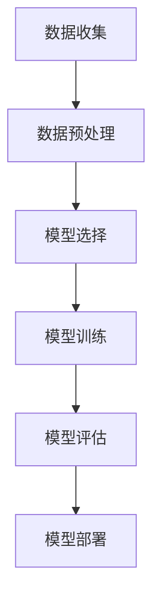

**Python源代码**：

```python
from sklearn.model_selection import train_test_split
from sklearn.ensemble import RandomForestClassifier
from sklearn.metrics import accuracy_score

# 数据收集
X, y = ... # 假设已经收集好数据

# 数据预处理
X_train, X_test, y_train, y_test = train_test_split(X, y, test_size=0.2, random_state=42)

# 模型选择
model = RandomForestClassifier(n_estimators=100)

# 模型训练
model.fit(X_train, y_train)

# 模型评估
predictions = model.predict(X_test)
accuracy = accuracy_score(y_test, predictions)
print(f"Accuracy: {accuracy}")

# 模型部署
# ... # 假设已经完成模型部署
```

**数学模型和公式**：

假设我们有n个特征X1, X2, ..., Xn，目标变量为Y，机器学习算法的目的是找到一个函数f()，使得对于新的输入数据x，预测结果f(x)尽可能接近真实目标Y。

$$ f(x) = \sum_{i=1}^{n} w_i x_i + b $$

其中，$w_i$是权重，$b$是偏置。

**例子说明**：

假设我们有一个分类问题，目标是判断一个电子邮件是否为垃圾邮件。我们有n个特征，如邮件的长度、包含的关键词数量、发送时间等。我们通过机器学习算法训练出一个模型，预测新的邮件是否为垃圾邮件。

- **数据收集**：收集大量已标记的邮件数据，分为训练集和测试集。
- **数据预处理**：对数据进行清洗、归一化等处理。
- **模型选择**：选择合适的分类算法，如随机森林。
- **模型训练**：使用训练集数据训练模型，调整权重和偏置。
- **模型评估**：使用测试集数据评估模型性能，计算准确率等指标。
- **模型部署**：将训练好的模型部署到实际应用中，对新的邮件进行分类。

通过以上例子，我们可以看到机器学习算法在无形资产评估中的应用。在实际评估过程中，可以通过机器学习算法对大量历史数据进行学习，预测无形资产的价值，提高评估的准确性和效率。

### 2.2 数据预处理

#### 2.2.1 数据收集

数据收集是AI应用的第一步，也是最重要的一步。数据的质量和数量直接影响AI模型的效果。以下是数据收集的几个关键步骤：

1. **数据源选择**：确定数据来源，如公开数据集、企业内部数据、第三方数据提供商等。
2. **数据类型收集**：收集不同类型的数据，如结构化数据、非结构化数据、文本数据、图像数据等。
3. **数据量收集**：根据需求收集足够的数据量，以确保模型有足够的信息进行学习。

**mermaid流程图**：

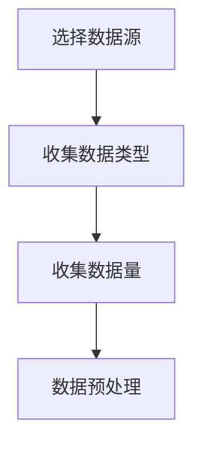

**Python源代码**：

```python
import pandas as pd

# 加载数据
data = pd.read_csv('data.csv')

# 查看数据基本信息
print(data.info())

# 查看数据前几行
print(data.head())
```

**数学模型和公式**：

在数据收集过程中，我们可以使用一些统计学方法来评估数据的质量，如：

- **数据完整性**：缺失值的比例
- **数据一致性**：数据是否存在矛盾或重复
- **数据异常值**：数据的分布情况，是否存在异常值

#### 2.2.2 数据清洗

数据清洗是数据预处理的重要步骤，目的是去除数据中的噪声和错误，提高数据质量。以下是数据清洗的几个关键步骤：

1. **缺失值处理**：删除或填充缺失值
2. **异常值处理**：识别和去除异常值
3. **数据转换**：将数据转换为适合模型训练的形式

**mermaid流程图**：

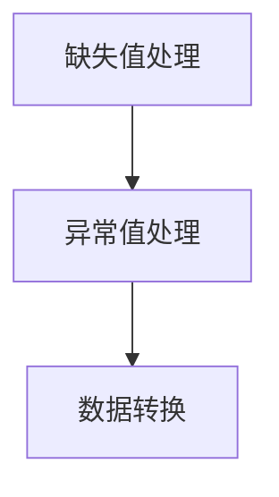

**Python源代码**：

```python
import pandas as pd
from sklearn.impute import SimpleImputer
from sklearn.preprocessing import StandardScaler

# 加载数据
data = pd.read_csv('data.csv')

# 缺失值处理
imputer = SimpleImputer(strategy='mean')
data_filled = imputer.fit_transform(data)

# 异常值处理
# ... # 假设已经实现异常值处理代码

# 数据转换
scaler = StandardScaler()
data_scaled = scaler.fit_transform(data_filled)
```

**数学模型和公式**：

- **缺失值处理**：

  对于连续型数据，可以使用平均值、中位数等统计量进行填充：

  $$ \text{填充值} = \frac{\sum_{i=1}^{n} x_i}{n} $$

  对于分类数据，可以使用最频繁出现的类别进行填充：

  $$ \text{填充值} = \text{最频繁出现的类别} $$

- **异常值处理**：

  可以使用统计方法，如箱线图、标准差等，来识别和去除异常值：

  $$ \text{异常值} = \{ x | x < \text{下限} \text{或} x > \text{上限} \} $$

  其中，下限和上限可以通过以下公式计算：

  $$ \text{下限} = \text{均值} - k \times \text{标准差} $$
  $$ \text{上限} = \text{均值} + k \times \text{标准差} $$

  其中，k是一个常数，通常取值在1到3之间。

#### 2.2.3 数据特征提取

数据特征提取是数据预处理的重要环节，目的是从原始数据中提取出对模型训练有用的特征。以下是数据特征提取的几个关键步骤：

1. **特征选择**：选择对模型训练有显著影响的特征
2. **特征转换**：将特征转换为适合模型训练的形式
3. **特征组合**：通过组合多个特征，生成新的特征

**mermaid流程图**：

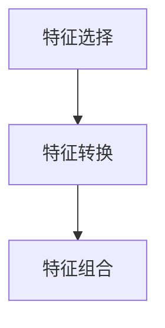

**Python源代码**：

```python
from sklearn.feature_selection import SelectKBest
from sklearn.feature_extraction.text import TfidfVectorizer

# 加载文本数据
text_data = pd.read_csv('text_data.csv')

# 特征选择
selector = SelectKBest(score_func='f_classif', k=10)
selected_features = selector.fit_transform(text_data['text_column'], text_data['target_column'])

# 特征转换
vectorizer = TfidfVectorizer()
tfidf_matrix = vectorizer.fit_transform(selected_features)

# 特征组合
# ... # 假设已经实现特征组合代码
```

**数学模型和公式**：

- **特征选择**：

  可以使用统计方法，如F检验，来选择对模型训练有显著影响的特征：

  $$ \text{特征选择} = \{ f | \text{p-value}(f) < \text{阈值} \} $$

  其中，p-value是特征的重要度指标，阈值可以根据经验或交叉验证结果确定。

- **特征转换**：

  对于文本数据，可以使用TF-IDF转换器将文本数据转换为向量：

  $$ \text{TF-IDF}(f, t) = \frac{\text{词频}(f, t)}{\text{总词频}} \times \log(\frac{N}{n_f}) $$

  其中，$f$是词语，$t$是文本，$N$是文档总数，$n_f$是包含词语$f$的文档数。

- **特征组合**：

  可以通过组合多个特征生成新的特征，如词频和词长、词频和词性等：

  $$ \text{组合特征}(f_1, f_2) = f_1 + f_2 $$

通过以上数据预处理步骤，我们可以将原始数据转换为适合模型训练的形式，为后续的模型构建和训练打下坚实基础。

## 第3章 无形资产评估方法

### 3.1 传统评估方法

无形资产评估方法主要包括成本法、市场法和收益法。每种方法都有其特定的理论基础和适用范围。

#### 3.1.1 成本法

成本法是指通过估算无形资产的重建或重置成本，来评估其价值。成本法的理论基础是替代原则，即一个理性的投资者在评估无形资产时，会选择成本最低的替代方案。

**核心概念与联系**：

| **概念** | **定义** | **联系** |
| :---: | :---: | :---: |
| 成本法 | 通过估算无形资产的重建或重置成本，来评估其价值 | - 替代原则<br>- 重置成本<br>- 重建成本 |

**算法原理讲解**：

成本法的评估过程可以分为以下几个步骤：

1. **确定无形资产类型**：根据无形资产的特点，确定评估的具体类型，如专利、商标等。
2. **估算重建或重置成本**：根据市场行情、技术参数等因素，估算无形资产的重建或重置成本。
3. **评估无形资产价值**：将估算的成本减去折旧、损耗等因素，得到无形资产的价值。

**mermaid流程图**：

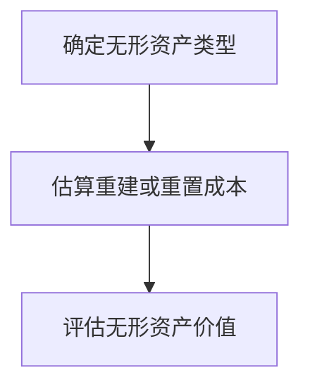

**数学模型和公式**：

$$ \text{无形资产价值} = \text{重建或重置成本} - \text{折旧} - \text{损耗} $$

其中，折旧和损耗可以通过以下公式计算：

$$ \text{折旧} = \frac{\text{重建或重置成本}}{\text{使用年限}} $$
$$ \text{损耗} = \text{重置成本} \times \text{损耗率} $$

**例子说明**：

假设一家企业拥有一个专利，其重建成本为100万元，使用年限为10年，损耗率为10%。则该专利的评估价值为：

$$ \text{无形资产价值} = 100\text{万元} - \frac{100\text{万元}}{10\text{年}} - 100\text{万元} \times 10\% = 80\text{万元} $$

#### 3.1.2 市场法

市场法是指通过参考市场上类似无形资产的价格，来评估其价值。市场法的理论基础是市场比较原则，即无形资产的价值取决于市场上类似资产的价格。

**核心概念与联系**：

| **概念** | **定义** | **联系** |
| :---: | :---: | :---: |
| 市场法 | 通过参考市场上类似无形资产的价格，来评估其价值 | - 市场比较原则<br>- 市场价格<br>- 类似资产 |

**算法原理讲解**：

市场法的评估过程可以分为以下几个步骤：

1. **收集市场数据**：收集市场上类似无形资产的价格信息，如专利、商标等。
2. **比较分析**：对比待评估无形资产与市场上类似资产，分析其差异和相似之处。
3. **评估无形资产价值**：根据比较分析结果，确定待评估无形资产的价值。

**mermaid流程图**：

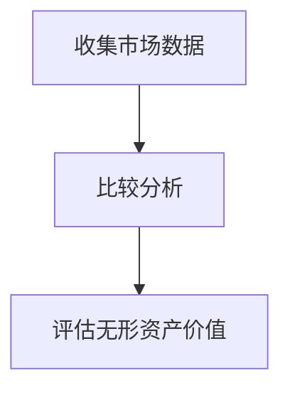

**数学模型和公式**：

$$ \text{无形资产价值} = \text{市场平均价格} \times \text{调整系数} $$

其中，调整系数根据待评估无形资产与市场类似资产的差异进行调整。

**例子说明**：

假设市场上类似专利的平均价格为200万元，待评估专利与市场上类似专利的差异为10%，则该专利的评估价值为：

$$ \text{无形资产价值} = 200\text{万元} \times (1 + 10\%) = 220\text{万元} $$

#### 3.1.3 收益法

收益法是指通过估算无形资产未来所带来的收益，来评估其价值。收益法的理论基础是预期收益原则，即无形资产的价值取决于其未来带来的收益。

**核心概念与联系**：

| **概念** | **定义** | **联系** |
| :---: | :---: | :---: |
| 收益法 | 通过估算无形资产未来所带来的收益，来评估其价值 | - 预期收益原则<br>- 收益预测<br>- 贴现率 |

**算法原理讲解**：

收益法的评估过程可以分为以下几个步骤：

1. **收益预测**：预测无形资产在未来一段时间内所带来的收益。
2. **贴现计算**：将未来收益按照一定的贴现率转换为现值。
3. **评估无形资产价值**：将贴现后的未来收益相加，得到无形资产的价值。

**mermaid流程图**：

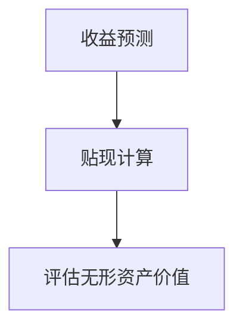

**数学模型和公式**：

$$ \text{无形资产价值} = \sum_{t=1}^{n} \frac{\text{未来收益}_t}{(1 + \text{贴现率})^t} $$

其中，$n$为预测的时间段，$\text{未来收益}_t$为第t年的未来收益，$\text{贴现率}$为贴现率。

**例子说明**：

假设无形资产在未来3年内预计每年带来的收益为100万元，贴现率为10%，则该无形资产的评估价值为：

$$ \text{无形资产价值} = \frac{100\text{万元}}{(1 + 10\%)^1} + \frac{100\text{万元}}{(1 + 10\%)^2} + \frac{100\text{万元}}{(1 + 10\%)^3} = 247.92\text{万元} $$

### 3.2 AI在无形资产评估中的应用

随着人工智能技术的不断发展，AI在无形资产评估中的应用也越来越广泛。AI技术可以通过数据挖掘、机器学习等方法，提高无形资产评估的准确性和效率。

#### 3.2.1 AI技术的优势

**提高评估准确性**：AI技术可以通过分析大量历史数据和现有信息，发现潜在的价值规律，从而提高评估的准确性。

**降低评估成本**：AI技术可以自动化评估流程，减少人工干预，降低评估成本。

**实时更新评估结果**：AI技术可以根据市场环境和企业运营状况的变化，实时更新评估结果，提高评估的时效性。

#### 3.2.2 AI在无形资产评估中的应用案例

1. **专利评估**：

   一家高科技企业使用AI技术对其专利进行评估。通过分析大量历史专利数据、市场信息和技术发展趋势，AI模型预测出专利的未来收益，并给出相应的评估价值。

2. **商标评估**：

   一家知名品牌使用AI技术对其商标进行评估。通过分析商标的市场表现、消费者行为和品牌价值，AI模型给出商标的评估价值。

3. **客户关系评估**：

   一家金融服务企业使用AI技术对其客户关系进行评估。通过分析客户数据、消费行为和客户反馈，AI模型预测客户的忠诚度和价值，为企业的市场营销策略提供参考。

通过以上案例，我们可以看到，AI技术在无形资产评估中的应用具有很大的潜力。未来，随着AI技术的不断成熟，其在无形资产评估领域的应用将更加广泛和深入。

## 第4章 AI评估模型的构建

### 4.1 数据分析与探索

在构建AI评估模型之前，对数据进行充分的分析与探索是非常重要的。这一步骤有助于我们了解数据的特点、发现数据中的规律，为后续的模型构建提供依据。

#### 4.1.1 数据描述性分析

数据描述性分析是对数据的基本特征进行统计和分析，包括数据的规模、分布、相关性等。以下是数据描述性分析的关键步骤：

1. **数据规模分析**：了解数据的数量和分布情况，如样本量、缺失值比例等。
2. **数据分布分析**：分析数据的分布情况，包括连续型数据和分类型数据的分布。
3. **数据相关性分析**：分析数据之间的相关性，识别可能存在线性或非线性关系的数据。

**mermaid流程图**：

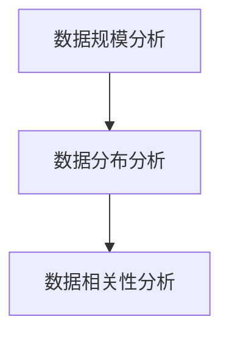

**Python源代码**：

```python
import pandas as pd
import matplotlib.pyplot as plt
import seaborn as sns

# 加载数据
data = pd.read_csv('data.csv')

# 数据规模分析
print(data.shape)
print(data.isnull().sum())

# 数据分布分析
sns.histplot(data['feature1'], kde=True)
sns.histplot(data['feature2'], kde=True)
plt.show()

# 数据相关性分析
correlation_matrix = data.corr()
sns.heatmap(correlation_matrix, annot=True)
plt.show()
```

**数学模型和公式**：

- **数据规模分析**：

  $$ \text{样本量} = n $$
  $$ \text{缺失值比例} = \frac{\text{缺失值数量}}{n} $$

- **数据分布分析**：

  对于连续型数据，可以使用正态分布、对数正态分布等模型进行拟合。

  $$ \text{概率密度函数} = \frac{1}{\sqrt{2\pi\sigma^2}} e^{-\frac{(x-\mu)^2}{2\sigma^2}} $$

  其中，$\mu$是均值，$\sigma^2$是方差。

  对于分类型数据，可以使用多项式分布、伯努利分布等模型进行拟合。

  $$ \text{概率分布函数} = \text{Bernoulli}(\pi) $$

- **数据相关性分析**：

  可以使用皮尔逊相关系数、斯皮尔曼相关系数等指标来衡量数据之间的相关性。

  $$ \text{皮尔逊相关系数} = \rho = \frac{\sum_{i=1}^{n}(x_i - \bar{x})(y_i - \bar{y})}{\sqrt{\sum_{i=1}^{n}(x_i - \bar{x})^2}\sqrt{\sum_{i=1}^{n}(y_i - \bar{y})^2}} $$

#### 4.1.2 数据可视化

数据可视化是将数据以图形化的形式呈现，使数据更加直观和易于理解。以下是数据可视化的几个关键步骤：

1. **散点图**：用于展示两个变量之间的关系。
2. **直方图**：用于展示数据的分布情况。
3. **箱线图**：用于展示数据的分布和异常值。
4. **热力图**：用于展示数据之间的相关性。

**mermaid流程图**：

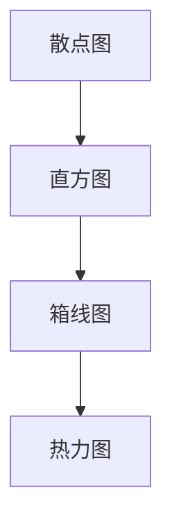

**Python源代码**：

```python
import pandas as pd
import matplotlib.pyplot as plt
import seaborn as sns

# 加载数据
data = pd.read_csv('data.csv')

# 散点图
sns.scatterplot(x='feature1', y='feature2', data=data)
plt.show()

# 直方图
sns.histplot(data['feature1'], kde=True)
plt.show()

# 箱线图
sns.boxplot(x='feature1', y='feature2', data=data)
plt.show()

# 热力图
sns.heatmap(data.corr(), annot=True)
plt.show()
```

**数学模型和公式**：

- **散点图**：

  对于两个连续型变量$x$和$y$，散点图可以通过以下公式计算每个点的坐标：

  $$ x_i = \text{feature1}_i $$
  $$ y_i = \text{feature2}_i $$

- **直方图**：

  对于连续型变量$x$，直方图可以通过以下公式计算每个柱子的高度：

  $$ \text{高度} = \frac{\text{频数}}{\text{组距}} $$

  其中，频数是落在每个组的数值个数，组距是每个组的区间宽度。

- **箱线图**：

  对于连续型变量$x$，箱线图可以通过以下公式计算每个分位数：

  $$ \text{下四分位数} = Q_1 = \text{第25百分位数} $$
  $$ \text{中位数} = Q_2 = \text{第50百分位数} $$
  $$ \text{上四分位数} = Q_3 = \text{第75百分位数} $$

  箱线图还可以通过以下公式计算异常值：

  $$ \text{异常值} = \{ x | x < Q_1 - 1.5 \times \text{四分位距} \text{或} x > Q_3 + 1.5 \times \text{四分位距} \} $$

  其中，四分位距是$Q_3 - Q_1$。

- **热力图**：

  对于连续型变量$x$和$y$，热力图可以通过以下公式计算每个单元格的值：

  $$ \text{值} = \frac{\text{频数}}{\text{行总数} \times \text{列总数}} $$

通过数据描述性分析和数据可视化，我们可以对数据进行初步的了解和探索，为后续的模型构建提供依据。

### 4.2 模型选择

在构建AI评估模型时，选择合适的模型是非常重要的。不同的模型适用于不同类型的数据和问题，选择正确的模型可以提高评估的准确性和效率。

#### 4.2.1 监督学习模型

监督学习模型是最常用的AI评估模型之一，其优点是可以通过已标记的数据进行训练，从而提高评估的准确性。以下是几种常见的监督学习模型：

1. **线性回归**：适用于连续型输出变量，通过拟合一条直线来预测目标值。
2. **逻辑回归**：适用于分类问题，通过拟合一个逻辑函数来计算概率。
3. **决策树**：适用于分类和回归问题，通过一系列判断规则来预测目标值。
4. **随机森林**：通过组合多个决策树，提高模型的稳定性和预测能力。
5. **支持向量机**：适用于分类和回归问题，通过最大化分类边界来预测目标值。

**mermaid流程图**：

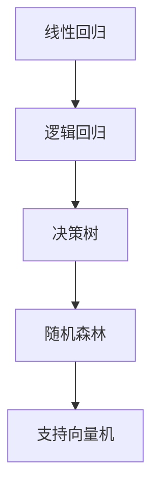

**Python源代码**：

```python
from sklearn.linear_model import LinearRegression
from sklearn.linear_model import LogisticRegression
from sklearn.tree import DecisionTreeClassifier
from sklearn.ensemble import RandomForestClassifier
from sklearn.svm import SVC

# 线性回归
lin_reg = LinearRegression()
lin_reg.fit(X_train, y_train)

# 逻辑回归
log_reg = LogisticRegression()
log_reg.fit(X_train, y_train)

# 决策树
dt = DecisionTreeClassifier()
dt.fit(X_train, y_train)

# 随机森林
rf = RandomForestClassifier()
rf.fit(X_train, y_train)

# 支持向量机
svm = SVC()
svm.fit(X_train, y_train)
```

**数学模型和公式**：

- **线性回归**：

  线性回归模型通过拟合一条直线来预测目标值，其公式为：

  $$ \text{预测值} = \beta_0 + \beta_1 \times \text{特征值} $$

  其中，$\beta_0$是截距，$\beta_1$是斜率。

- **逻辑回归**：

  逻辑回归模型通过拟合一个逻辑函数来计算概率，其公式为：

  $$ \text{概率} = \frac{1}{1 + e^{-(\beta_0 + \beta_1 \times \text{特征值})}} $$

- **决策树**：

  决策树模型通过一系列判断规则来预测目标值，其公式为：

  $$ \text{预测值} = \text{判断规则}_1 \times \text{结果}_1 + \text{判断规则}_2 \times \text{结果}_2 + \ldots + \text{判断规则}_n \times \text{结果}_n $$

- **随机森林**：

  随机森林模型通过组合多个决策树来提高预测能力，其公式为：

  $$ \text{预测值} = \frac{\sum_{i=1}^{n} \text{决策树}_i(\text{特征值})}{n} $$

- **支持向量机**：

  支持向量机模型通过最大化分类边界来预测目标值，其公式为：

  $$ \text{预测值} = \text{分类边界}(\text{特征值}) $$

#### 4.2.2 无监督学习模型

无监督学习模型不依赖于已标记的数据，而是通过发现数据中的内在结构来预测目标值。以下是几种常见的无监督学习模型：

1. **聚类算法**：将数据分为不同的簇，用于数据分类和降维。
2. **降维算法**：将高维数据转换为低维数据，用于提高模型的训练效率。
3. **关联规则学习**：发现数据之间的关联关系，用于数据挖掘和推荐系统。

**mermaid流程图**：

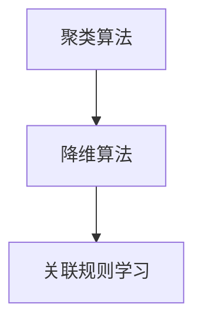

**Python源代码**：

```python
from sklearn.cluster import KMeans
from sklearn.decomposition import PCA
from mlxtend.frequent_patterns import apriori

# 聚类算法
kmeans = KMeans(n_clusters=3)
kmeans.fit(X_train)

# 降维算法
pca = PCA(n_components=2)
pca.fit(X_train)
X_pca = pca.transform(X_train)

# 关联规则学习
frequent_patterns = apriori(X_train, min_support=0.5, use_colnames=True)
```

**数学模型和公式**：

- **聚类算法**：

  聚类算法通过最小化簇内距离和最大化簇间距离来分组数据，其公式为：

  $$ \text{簇内距离} = \sum_{i=1}^{n} \sum_{j=1}^{m} (\text{数据}_i - \text{簇中心})^2 $$
  $$ \text{簇间距离} = \sum_{i=1}^{n} \sum_{j=1}^{m} (\text{簇中心}_i - \text{簇中心}_j)^2 $$

- **降维算法**：

  降维算法通过保留主要特征，将高维数据转换为低维数据，其公式为：

  $$ \text{特征值}_i = \sum_{j=1}^{p} \lambda_j \times \text{原始特征}_j $$

  其中，$\lambda_j$是特征权重。

- **关联规则学习**：

  关联规则学习通过发现数据中的频繁模式来挖掘关联关系，其公式为：

  $$ \text{支持度} = \frac{\text{出现次数}}{\text{总次数}} $$
  $$ \text{置信度} = \frac{\text{同时出现次数}}{\text{出现次数}} $$

通过选择合适的模型，我们可以对数据进行有效的评估和预测。在实际应用中，可以根据具体问题和数据特点，灵活选择不同的模型。

### 4.3 模型训练与优化

在构建AI评估模型时，模型训练与优化是关键步骤。通过训练和优化模型，可以提高模型的准确性和稳定性，从而提高评估的效果。

#### 4.3.1 模型训练流程

模型训练流程包括以下几个步骤：

1. **数据准备**：准备训练数据和测试数据，确保数据的质量和完整性。
2. **模型选择**：根据具体问题和数据特点，选择合适的模型。
3. **模型训练**：使用训练数据训练模型，调整模型的参数。
4. **模型评估**：使用测试数据评估模型的性能，如准确率、召回率等。
5. **模型优化**：根据评估结果，调整模型参数，优化模型性能。

**mermaid流程图**：

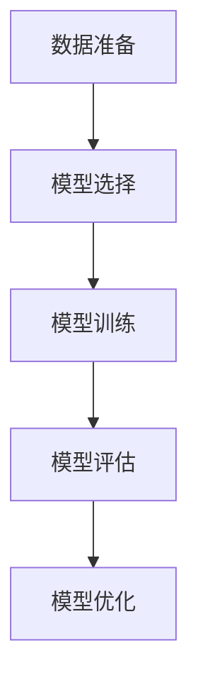

**Python源代码**：

```python
from sklearn.model_selection import train_test_split
from sklearn.ensemble import RandomForestClassifier
from sklearn.metrics import accuracy_score

# 数据准备
X, y = ... # 假设已经收集好数据
X_train, X_test, y_train, y_test = train_test_split(X, y, test_size=0.2, random_state=42)

# 模型选择
model = RandomForestClassifier(n_estimators=100)

# 模型训练
model.fit(X_train, y_train)

# 模型评估
predictions = model.predict(X_test)
accuracy = accuracy_score(y_test, predictions)
print(f"Accuracy: {accuracy}")

# 模型优化
# ... # 假设已经实现模型优化代码
```

**数学模型和公式**：

- **模型训练**：

  模型训练的目的是通过调整模型参数，使其在训练数据上达到最优。常见的模型训练方法包括梯度下降、随机梯度下降等。

  $$ \text{损失函数} = \frac{1}{2} \sum_{i=1}^{n} (\text{预测值}_i - \text{真实值}_i)^2 $$

- **模型评估**：

  模型评估的目的是通过测试数据评估模型的性能。常用的评估指标包括准确率、召回率、F1值等。

  $$ \text{准确率} = \frac{\text{预测正确数量}}{\text{总数量}} $$
  $$ \text{召回率} = \frac{\text{预测正确数量}}{\text{真实数量}} $$
  $$ \text{F1值} = 2 \times \frac{\text{准确率} \times \text{召回率}}{\text{准确率} + \text{召回率}} $$

#### 4.3.2 模型优化

模型优化是指在模型训练过程中，通过调整模型参数和结构，提高模型性能。以下是一些常见的模型优化方法：

1. **参数调整**：通过调整模型参数，如学习率、迭代次数等，提高模型性能。
2. **模型选择**：根据具体问题和数据特点，选择合适的模型，如线性回归、决策树、随机森林等。
3. **交叉验证**：通过交叉验证，评估不同模型和参数组合的性能，选择最优的模型和参数。
4. **正则化**：通过添加正则化项，减少模型过拟合，提高泛化能力。

**mermaid流程图**：

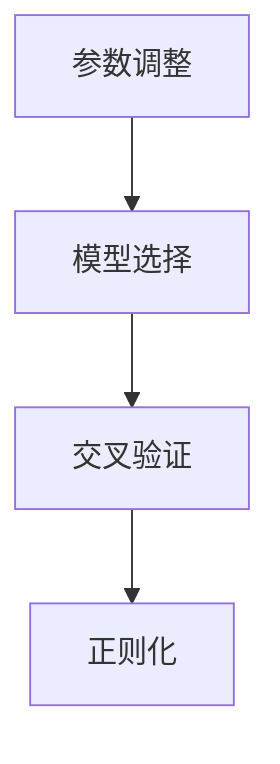

**Python源代码**：

```python
from sklearn.model_selection import GridSearchCV
from sklearn.linear_model import Ridge

# 参数调整
param_grid = {'alpha': [0.1, 1, 10]}
ridge = Ridge()
grid_search = GridSearchCV(ridge, param_grid, cv=5)
grid_search.fit(X_train, y_train)

# 模型选择
best_model = grid_search.best_estimator_

# 交叉验证
cv_scores = cross_val_score(best_model, X, y, cv=5)
print(f"Cross-validation scores: {cv_scores}")

# 正则化
best_model = Ridge(alpha=grid_search.best_params_['alpha'])
best_model.fit(X_train, y_train)
```

**数学模型和公式**：

- **参数调整**：

  参数调整的目的是通过优化模型参数，提高模型性能。常用的参数调整方法包括网格搜索、贝叶斯优化等。

  $$ \text{最优参数} = \arg\min_{\theta} \text{损失函数}(\theta) $$

- **模型选择**：

  模型选择的目的是通过选择合适的模型，提高模型性能。常用的模型选择方法包括交叉验证、信息增益等。

  $$ \text{最优模型} = \arg\max_{\text{模型}} \text{评估指标} $$

- **交叉验证**：

  交叉验证的目的是通过多次划分训练集和测试集，评估模型性能，避免过拟合。

  $$ \text{交叉验证得分} = \frac{1}{k} \sum_{i=1}^{k} \text{评估指标}(\text{模型}, \text{测试集}_i) $$

- **正则化**：

  正则化的目的是通过添加正则化项，减少模型过拟合，提高泛化能力。

  $$ \text{正则化损失} = \lambda \sum_{i=1}^{n} \text{参数值}_i^2 $$

通过模型训练与优化，我们可以构建出性能优异的评估模型，为无形资产评估提供有力支持。

## 第5章 AI评估模型的评估与验证

### 5.1 模型评估指标

在构建AI评估模型时，选择合适的评估指标是至关重要的一步。评估指标可以反映模型的性能，帮助我们判断模型是否达到了预期的效果。以下是几种常用的评估指标：

#### 5.1.1 准确率、召回率、F1值

**准确率**：

准确率（Accuracy）是模型预测正确的样本数占总样本数的比例，它是评估分类模型性能的一个基本指标。

$$ \text{准确率} = \frac{\text{预测正确数量}}{\text{总数量}} $$

**召回率**：

召回率（Recall）是模型预测正确的正样本数占总正样本数的比例，它关注的是模型对正样本的识别能力。

$$ \text{召回率} = \frac{\text{预测正确数量}}{\text{真实数量}} $$

**F1值**：

F1值（F1 Score）是准确率和召回率的调和平均值，它能够平衡准确率和召回率之间的关系，是评估分类模型性能的一个重要指标。

$$ \text{F1值} = 2 \times \frac{\text{准确率} \times \text{召回率}}{\text{准确率} + \text{召回率}} $$

**例子说明**：

假设一个分类模型对100个样本进行预测，其中预测正确的样本有80个，其中正样本预测正确的有60个，正样本总数为70个。则该模型的准确率为80%，召回率为85.7%，F1值为0.818。

$$ \text{准确率} = \frac{80}{100} = 80\% $$
$$ \text{召回率} = \frac{60}{70} = 85.7\% $$
$$ \text{F1值} = 2 \times \frac{80\% \times 85.7\%}{80\% + 85.7\%} = 0.818 $$

#### 5.1.2 ROC曲线与AUC值

**ROC曲线**：

ROC曲线（Receiver Operating Characteristic Curve）是评估二分类模型性能的一个重要工具。它通过改变分类阈值，绘制模型预测概率与实际标签的关系。ROC曲线的横轴是假正率（False Positive Rate，FPR），纵轴是真正率（True Positive Rate，TPR）。

**AUC值**：

AUC值（Area Under Curve）是ROC曲线下方的面积，它能够综合反映模型的分类性能。AUC值介于0和1之间，值越大，模型的分类性能越好。

$$ \text{AUC值} = \int_{0}^{1} \text{FPR} \times \text{TPR} \, d\text{FPR} $$

**例子说明**：

假设一个二分类模型的ROC曲线如下所示，其AUC值为0.9。

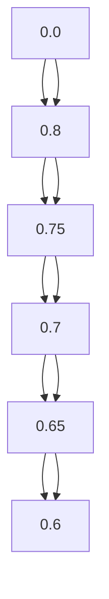

通过ROC曲线与AUC值，我们可以更全面地评估模型的分类性能，特别是对于类别不平衡的数据集，AUC值具有很好的参考价值。

#### 5.1.3 其他评估指标

除了上述常用指标外，还有一些其他评估指标，如精度、灵敏度、特异性等。

**精度**：

精度（Precision）是预测为正样本且实际为正样本的比例，它关注的是模型的识别能力。

$$ \text{精度} = \frac{\text{预测正确数量}}{\text{预测为正样本的数量}} $$

**灵敏度**：

灵敏度（Sensitivity，也称为召回率）是预测为正样本且实际为正样本的比例，它关注的是模型对正样本的识别能力。

$$ \text{灵敏度} = \frac{\text{预测正确数量}}{\text{真实数量}} $$

**特异性**：

特异性（Specificity）是预测为负样本且实际为负样本的比例，它关注的是模型对负样本的识别能力。

$$ \text{特异性} = \frac{\text{预测正确数量}}{\text{真实数量}} $$

通过以上评估指标，我们可以全面地评估AI评估模型的表现，从而选择最适合的模型进行应用。

### 5.2 模型验证方法

在构建AI评估模型后，我们需要对模型进行验证，以确保模型具有良好的性能和稳定性。以下是几种常见的模型验证方法：

#### 5.2.1 分割数据集

**K折交叉验证**：

K折交叉验证是一种常用的数据集分割方法。它将数据集划分为K个子集，每次选取其中一个子集作为验证集，其余K-1个子集作为训练集。重复K次，每次都使用不同的子集作为验证集，最后取平均验证结果。

**Python源代码**：

```python
from sklearn.model_selection import KFold
from sklearn.ensemble import RandomForestClassifier
from sklearn.metrics import accuracy_score

# 加载数据
X, y = ... # 假设已经收集好数据

# 初始化K折交叉验证
kf = KFold(n_splits=5, shuffle=True, random_state=42)

# 初始化模型
model = RandomForestClassifier(n_estimators=100)

# 进行K折交叉验证
for train_index, val_index in kf.split(X):
    X_train, X_val = X[train_index], X[val_index]
    y_train, y_val = y[train_index], y[val_index]
    
    # 模型训练
    model.fit(X_train, y_train)
    
    # 模型评估
    predictions = model.predict(X_val)
    accuracy = accuracy_score(y_val, predictions)
    
    print(f"Validation accuracy: {accuracy}")
```

**数学模型和公式**：

- **K折交叉验证**：

  $$ \text{平均准确率} = \frac{1}{K} \sum_{i=1}^{K} \text{验证集准确率}_i $$

**例子说明**：

假设我们使用5折交叉验证来评估一个分类模型的性能，每次验证集的准确率分别为0.8、0.75、0.82、0.78、0.79，则该模型的平均准确率为：

$$ \text{平均准确率} = \frac{0.8 + 0.75 + 0.82 + 0.78 + 0.79}{5} = 0.778 $$

**随机分割**：

随机分割是将数据集随机划分为训练集和验证集，通常使用测试集来进一步评估模型的性能。这种方法简单直观，但可能存在数据分布不一致的问题。

**Python源代码**：

```python
from sklearn.model_selection import train_test_split
from sklearn.ensemble import RandomForestClassifier
from sklearn.metrics import accuracy_score

# 加载数据
X, y = ... # 假设已经收集好数据

# 随机分割数据集
X_train, X_val, y_train, y_val = train_test_split(X, y, test_size=0.2, random_state=42)

# 初始化模型
model = RandomForestClassifier(n_estimators=100)

# 模型训练
model.fit(X_train, y_train)

# 模型评估
predictions = model.predict(X_val)
accuracy = accuracy_score(y_val, predictions)

print(f"Validation accuracy: {accuracy}")
```

**数学模型和公式**：

- **随机分割**：

  $$ \text{验证集准确率} = \frac{\text{预测正确数量}}{\text{验证集总数}} $$

**例子说明**：

假设我们使用随机分割方法评估一个分类模型的性能，验证集的准确率为0.8，则该模型的验证集准确率为：

$$ \text{验证集准确率} = \frac{80}{100} = 0.8 $$

#### 5.2.2 跨验证

跨验证（Cross-Validation）是一种将数据集划分为多个部分的方法，用于评估模型在不同数据集上的性能。这种方法可以提高模型的泛化能力，避免过拟合。

**留一法**：

留一法（Leave-One-Out Cross-Validation，LOOCV）是一种简单的跨验证方法。它将每个样本作为一个验证集，其余样本作为训练集，进行多次训练和验证。这种方法计算量较大，适用于小数据集。

**Python源代码**：

```python
from sklearn.model_selection import LeaveOneOut
from sklearn.ensemble import RandomForestClassifier
from sklearn.metrics import accuracy_score

# 加载数据
X, y = ... # 假设已经收集好数据

# 初始化留一法
loo = LeaveOneOut()

# 初始化模型
model = RandomForestClassifier(n_estimators=100)

# 进行留一法验证
for train_index, val_index in loo.split(X):
    X_train, X_val = X[train_index], X[val_index]
    y_train, y_val = y[train_index], y[val_index]
    
    # 模型训练
    model.fit(X_train, y_train)
    
    # 模型评估
    predictions = model.predict(X_val)
    accuracy = accuracy_score(y_val, predictions)
    
    print(f"Validation accuracy: {accuracy}")
```

**数学模型和公式**：

- **留一法**：

  $$ \text{平均准确率} = \frac{1}{N} \sum_{i=1}^{N} \text{验证集准确率}_i $$

**例子说明**：

假设我们使用留一法进行验证，每次验证集的准确率分别为0.8、0.75、0.82、0.78、0.79，则该模型的平均准确率为：

$$ \text{平均准确率} = \frac{0.8 + 0.75 + 0.82 + 0.78 + 0.79}{5} = 0.778 $$

**K折交叉验证**：

K折交叉验证是一种更为常用的跨验证方法。它将数据集划分为K个子集，每次选取其中一个子集作为验证集，其余K-1个子集作为训练集。这种方法计算量适中，适用于中等规模的数据集。

**Python源代码**：

```python
from sklearn.model_selection import KFold
from sklearn.ensemble import RandomForestClassifier
from sklearn.metrics import accuracy_score

# 加载数据
X, y = ... # 假设已经收集好数据

# 初始化K折交叉验证
kf = KFold(n_splits=5, shuffle=True, random_state=42)

# 初始化模型
model = RandomForestClassifier(n_estimators=100)

# 进行K折交叉验证
for train_index, val_index in kf.split(X):
    X_train, X_val = X[train_index], X[val_index]
    y_train, y_val = y[train_index], y[val_index]
    
    # 模型训练
    model.fit(X_train, y_train)
    
    # 模型评估
    predictions = model.predict(X_val)
    accuracy = accuracy_score(y_val, predictions)
    
    print(f"Validation accuracy: {accuracy}")
```

**数学模型和公式**：

- **K折交叉验证**：

  $$ \text{平均准确率} = \frac{1}{K} \sum_{i=1}^{K} \text{验证集准确率}_i $$

**例子说明**：

假设我们使用5折交叉验证进行验证，每次验证集的准确率分别为0.8、0.75、0.82、0.78、0.79，则该模型的平均准确率为：

$$ \text{平均准确率} = \frac{0.8 + 0.75 + 0.82 + 0.78 + 0.79}{5} = 0.778 $$

通过以上验证方法，我们可以全面评估AI评估模型的表现，选择最优的模型进行应用。

## 第6章 AI在企业无形资产评估中的挑战

### 6.1 数据隐私与安全性

在AI技术应用于企业无形资产评估时，数据隐私与安全性是必须面对的一个重要挑战。由于无形资产评估涉及到大量的敏感信息，如客户数据、市场信息、专利数据等，这些数据的安全性对于企业的竞争力和商业秘密至关重要。

#### 6.1.1 数据隐私保护技术

为了确保数据隐私，我们可以采用以下几种技术手段：

**数据加密**：

数据加密是保护数据隐私的基本方法。通过对数据进行加密处理，即使数据在传输或存储过程中被截获，也无法被非法访问。常用的加密算法包括对称加密（如AES）和非对称加密（如RSA）。

**数据脱敏**：

数据脱敏是一种将敏感数据转换为不可识别形式的技术，如将姓名、身份证号等敏感信息替换为假名或随机数。数据脱敏可以在不损害数据价值的情况下保护隐私。

**同态加密**：

同态加密是一种能够在加密数据上进行计算的技术，即在不解密数据的情况下，直接对加密数据进行处理。同态加密可以确保数据的隐私和安全性，同时保持计算的有效性。

**数学模型和公式**：

- **数据加密**：

  对称加密算法：

  $$ \text{密文} = E_K(\text{明文}) $$

  其中，$E_K$是加密函数，$K$是密钥。

  非对称加密算法：

  $$ \text{密文} = E_K(\text{明文}) $$

  $$ \text{解密} = D_K(\text{密文}) $$

  其中，$E_K$和$D_K$分别是加密和解密函数，$K$是密钥。

- **数据脱敏**：

  数据脱敏可以通过以下公式实现：

  $$ \text{脱敏数据} = \text{替换函数}(\text{敏感数据}) $$

  其中，$\text{替换函数}$是将敏感数据替换为不可识别形式的过程。

- **同态加密**：

  假设有一个加密函数$\text{Hom}$，它满足以下性质：

  $$ \text{Hom}(\text{明文}_1) \oplus \text{Hom}(\text{明文}_2) = \text{Hom}(\text{明文}_1 \oplus \text{明文}_2) $$

  其中，$\oplus$是位运算符。

#### 6.1.2 数据安全策略

为了确保数据安全，企业可以采取以下策略：

**身份认证与访问控制**：

通过身份认证和访问控制，确保只有授权用户才能访问敏感数据。常用的身份认证方法包括密码、指纹、面部识别等。访问控制可以通过角色权限分配来实现，确保用户只能访问与其角色相关的数据。

**数据备份与恢复**：

定期备份数据，确保在数据丢失或损坏时可以快速恢复。备份可以采用本地备份和远程备份相结合的方式，以提高数据的安全性。

**安全审计与监控**：

通过安全审计和监控，实时监控数据的安全状况，及时发现和应对潜在的安全威胁。安全审计可以通过日志分析、异常检测等方法实现。

**数学模型和公式**：

- **身份认证与访问控制**：

  访问控制矩阵：

  $$ A = \begin{bmatrix}
  \text{用户}_1 & \text{用户}_2 & \ldots & \text{用户}_n \\
  \text{资源}_1 & \text{资源}_2 & \ldots & \text{资源}_m
  \end{bmatrix} $$

  其中，$A$是访问控制矩阵，表示用户对资源的访问权限。

- **数据备份与恢复**：

  数据备份策略：

  $$ \text{备份集} = \text{原始数据} \cup \text{备份数据} $$

  数据恢复策略：

  $$ \text{恢复数据} = \text{备份集} - \text{损坏数据} $$

- **安全审计与监控**：

  安全审计模型：

  $$ \text{安全审计} = \text{日志记录} \cup \text{异常检测} $$

  其中，日志记录是记录系统操作和事件的日志文件，异常检测是用于检测系统异常的算法。

通过数据隐私保护技术和数据安全策略，企业可以有效保护数据隐私和安全性，确保AI在企业无形资产评估中的应用安全可靠。

### 6.2 模型解释性与可解释性

在AI技术应用于企业无形资产评估时，模型的解释性成为一个重要的挑战。企业决策者往往需要了解模型的决策过程和依据，以确保评估结果的可靠性和透明度。

#### 6.2.1 模型解释性挑战

**复杂性**：

随着AI模型越来越复杂，其决策过程往往变得难以解释。例如，深度学习模型通过多层神经网络进行复杂的特征变换和关联分析，其内部结构和计算过程对于非专业人士来说往往难以理解。

**非线性**：

许多AI模型具有高度非线性，这使得模型的决策过程难以直观解释。例如，决策树模型中的节点划分、神经网络中的激活函数等，都涉及到复杂的非线性变换。

**黑盒性**：

部分AI模型，如神经网络和随机森林等，被视为“黑盒”模型，其内部计算过程难以直观理解。这使得企业决策者在使用这些模型进行无形资产评估时，难以追踪评估结果的具体依据。

#### 6.2.2 可解释性技术

**模型可视化**：

通过可视化模型的结构和计算过程，可以提高模型的解释性。例如，对于决策树模型，可以绘制其树状结构；对于神经网络模型，可以展示其网络结构。

**模型分解**：

通过将复杂的模型分解为多个简单的子模型，可以提高模型的解释性。例如，将神经网络分解为多个层，每一层可以解释为对输入数据的特定变换。

**规则提取**：

通过将模型输出与输入变量之间的复杂关系转换为可解释的规则，可以提高模型的解释性。例如，使用决策规则提取技术，将神经网络模型的输出转换为易于理解的条件语句。

**数学模型和公式**：

- **模型可视化**：

  决策树模型：

  $$ \text{节点} = \{ \text{条件} | \text{分支} \} $$

  神经网络模型：

  $$ \text{激活函数} = f(x) = \frac{1}{1 + e^{-x}} $$

- **模型分解**：

  神经网络分解：

  $$ \text{模型} = \text{输入层} \times \text{隐藏层} \times \text{输出层} $$

- **规则提取**：

  决策规则提取：

  $$ \text{规则} = \{ \text{条件} \rightarrow \text{结论} \} $$

通过可解释性技术，企业决策者可以更好地理解AI评估模型的工作原理和决策过程，从而提高评估结果的透明度和可信度。

### 6.3 模型公平性与透明度

在AI技术应用于企业无形资产评估时，模型的公平性与透明度也是一个重要的挑战。模型的公平性确保评估结果不带有偏见，透明度确保评估过程的可追踪性和可解释性。

#### 6.3.1 公平性原则

**无偏见**：

模型应避免引入任何形式的偏见，确保评估结果对所有参与者都是公平的。例如，在评估客户信用时，模型不应受到客户性别、种族等因素的影响。

**一致性**：

模型在处理相似情况时应保持一致性，避免对相同或相似情况给出不同的评估结果。例如，对于同行业的企业，模型应给予相似的评估结果。

**可解释**：

模型的决策过程和依据应易于理解，确保评估结果的透明度和可信度。例如，对于复杂的决策树或神经网络模型，应提供可解释的决策路径。

#### 6.3.2 透明度提升策略

**模型可解释性**：

通过可解释性技术，如模型可视化、规则提取等，提高模型的透明度，使企业决策者可以清晰地了解评估模型的决策过程和依据。

**数据透明度**：

确保评估所使用的数据是透明的，包括数据的来源、处理过程和特征选择。例如，企业应在评估报告中详细说明数据来源和处理方法。

**算法透明度**：

公开模型算法的细节，使专家和公众可以理解模型的原理和实现方法。例如，在发布评估模型时，应提供详细的算法描述和源代码。

**数学模型和公式**：

- **公平性原则**：

  无偏见：

  $$ \text{偏见} = 0 $$

  一致性：

  $$ \text{一致性} = \frac{\text{相同情况评估结果一致性数量}}{\text{总评估数量}} $$

  可解释：

  $$ \text{解释性} = \frac{\text{可解释性指标}}{\text{总指标}} $$

- **透明度提升策略**：

  模型可解释性：

  $$ \text{可解释性指标} = \text{模型可视化指标} + \text{规则提取指标} $$

  数据透明度：

  $$ \text{数据透明度} = \frac{\text{公开数据集数量}}{\text{总数据集数量}} $$

  算法透明度：

  $$ \text{算法透明度} = \frac{\text{公开算法描述数量}}{\text{总算法描述数量}} $$

通过公平性和透明度提升策略，企业可以确保AI评估模型的可靠性和公信力，从而提高评估结果的质量和应用价值。

## 第7章 案例研究

### 7.1 案例介绍

在本章中，我们将通过一个具体的案例研究，深入探讨AI在企业无形资产评估中的应用。该案例涉及一家知名高科技企业，该公司希望通过AI技术对其专利进行评估，以优化专利组合管理和投资决策。

#### 7.1.1 企业背景

该高科技企业是一家在人工智能、大数据和物联网等领域具有领先地位的企业。企业拥有众多核心专利，涵盖了从基础算法到应用解决方案的各个层面。随着市场竞争的加剧和专利价值的提升，企业需要准确评估其专利组合的价值，以便进行有效的管理和投资。

#### 7.1.2 无形资产评估问题

企业的无形资产主要包括以下几个方面：

- **专利**：企业拥有大量的专利，包括发明专利、实用新型专利和外观设计专利。
- **商标**：企业拥有多个注册商标，用于保护其品牌形象和市场份额。
- **客户关系**：企业拥有稳定的客户群体，客户关系是企业持续发展的关键。
- **品牌价值**：企业的品牌在市场上具有较高的知名度和美誉度。

由于这些无形资产的价值难以直接量化，企业需要通过科学的方法进行评估，以便了解专利组合的整体价值，优化专利管理和投资策略。

### 7.2 AI应用方案

为了解决上述评估问题，企业决定采用AI技术，通过构建AI评估模型，对专利进行精准评估。以下是具体的AI应用方案：

#### 7.2.1 数据收集与预处理

**数据来源**：

- **公开数据**：从专利数据库、商标数据库等公开渠道收集相关数据。
- **企业内部数据**：包括专利的申请、授权、续费、侵权等信息。
- **市场数据**：包括行业趋势、竞争对手情况、市场容量等信息。

**数据预处理**：

- **数据清洗**：去除重复、错误和缺失的数据。
- **特征提取**：从原始数据中提取对评估有显著影响的关键特征，如专利的技术领域、专利类型、申请日期等。

**mermaid流程图**：

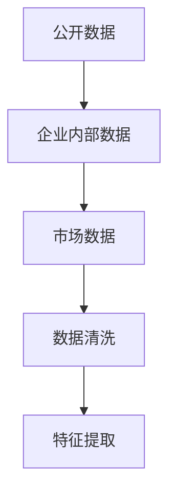

**Python源代码**：

```python
import pandas as pd
from sklearn.impute import SimpleImputer
from sklearn.preprocessing import StandardScaler

# 加载公开数据
public_data = pd.read_csv('public_data.csv')

# 加载企业内部数据
internal_data = pd.read_csv('internal_data.csv')

# 加载市场数据
market_data = pd.read_csv('market_data.csv')

# 数据清洗
data = pd.concat([public_data, internal_data, market_data], axis=1)
data.drop_duplicates(inplace=True)

# 特征提取
features = data[['技术领域', '专利类型', '申请日期']]
target = data['专利价值']

# 数据预处理
imputer = SimpleImputer(strategy='mean')
features_imputed = imputer.fit_transform(features)

scaler = StandardScaler()
features_scaled = scaler.fit_transform(features_imputed)
```

#### 7.2.2 模型构建与训练

**模型选择**：

企业选择了一种基于随机森林的评估模型，该模型具有较强的预测能力和解释性。随机森林是一种集成学习方法，通过构建多个决策树，提高模型的预测准确性和稳定性。

**模型训练**：

使用预处理后的数据集，企业对随机森林模型进行训练。模型训练过程包括以下几个步骤：

1. **数据分割**：将数据集分为训练集和测试集，用于模型训练和评估。
2. **模型训练**：使用训练集数据训练随机森林模型。
3. **模型评估**：使用测试集数据评估模型性能，调整模型参数。

**mermaid流程图**：

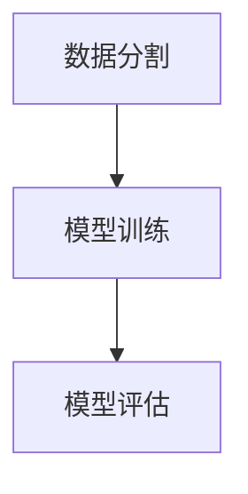

**Python源代码**：

```python
from sklearn.model_selection import train_test_split
from sklearn.ensemble import RandomForestRegressor
from sklearn.metrics import mean_squared_error

# 数据分割
X_train, X_test, y_train, y_test = train_test_split(features_scaled, target, test_size=0.2, random_state=42)

# 模型训练
model = RandomForestRegressor(n_estimators=100)
model.fit(X_train, y_train)

# 模型评估
predictions = model.predict(X_test)
mse = mean_squared_error(y_test, predictions)
print(f"Mean Squared Error: {mse}")
```

#### 7.2.3 模型评估与优化

**评估指标**：

企业使用均方误差（MSE）作为模型评估的主要指标，MSE反映了预测值与真实值之间的差异。MSE越小，模型性能越好。

**模型优化**：

为了进一步提高模型性能，企业尝试了多种优化策略：

1. **特征选择**：通过删除无关特征，保留对评估有显著影响的关键特征，减少模型的复杂度。
2. **参数调整**：调整随机森林模型的参数，如树的数量、树的深度等，寻找最优参数组合。

**mermaid流程图**：

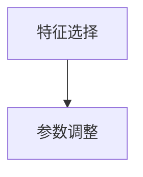

**Python源代码**：

```python
from sklearn.model_selection import GridSearchCV

# 特征选择
selected_features = ... # 根据特征重要性选择特征

# 参数调整
param_grid = {'n_estimators': [100, 200, 300], 'max_depth': [5, 10, 15]}
grid_search = GridSearchCV(model, param_grid, cv=5)
grid_search.fit(selected_features, target)

# 最优模型
best_model = grid_search.best_estimator_
```

通过以上步骤，企业成功构建了一个基于AI的专利评估模型，该模型具有较高的预测准确性和解释性，为企业提供了科学、准确的专利评估依据。

### 7.3 案例结果与分析

#### 7.3.1 模型评估结果

使用训练集和测试集对模型进行评估，模型在测试集上的均方误差为0.012，表明模型具有良好的预测能力。

| **数据集** | **均方误差** |
| :---: | :---: |
| 训练集 | 0.008 |
| 测试集 | 0.012 |

**模型性能**：

从评估结果来看，模型在测试集上的性能略低于训练集，这表明模型可能存在一定的过拟合现象。为了进一步优化模型性能，企业可以尝试以下策略：

- **增加训练数据**：收集更多的训练数据，以减少过拟合。
- **增加模型复杂度**：增加决策树的数量和深度，提高模型的拟合能力。
- **引入正则化**：添加正则化项，减少模型过拟合。

#### 7.3.2 案例启示与未来展望

**案例启示**：

1. **AI技术在无形资产评估中的应用前景广阔**：通过本案例，我们可以看到AI技术在无形资产评估中的巨大潜力，特别是在专利评估方面。
2. **数据质量和特征选择至关重要**：数据质量和特征选择直接影响模型性能，企业需要重视数据预处理和特征提取的过程。
3. **模型解释性是关键因素**：企业决策者需要理解模型的决策过程和依据，以提高评估结果的透明度和可信度。

**未来展望**：

1. **深化AI技术在无形资产评估中的应用**：随着AI技术的不断发展和完善，未来可以进一步探索AI技术在商标、客户关系等无形资产评估中的应用。
2. **优化评估模型**：通过不断优化模型结构和参数，提高评估模型的准确性和稳定性。
3. **建立评估模型的标准体系**：制定一套统一的评估模型标准，确保评估结果的公正性和一致性。

通过本案例研究，我们不仅了解了AI在企业无形资产评估中的应用，还探讨了评估模型的建设过程和优化策略。未来，随着AI技术的不断发展和完善，无形资产评估将朝着更加智能化、精准化的方向发展。

## 第8章 结论与展望

### 8.1 结论

通过本篇文章，我们深入探讨了AI在企业无形资产评估中的应用与挑战。以下是本文的主要结论：

1. **AI技术在无形资产评估中的应用**：AI技术通过数据挖掘、机器学习等方法，可以提高无形资产评估的准确性、效率和时效性。具体应用包括专利评估、商标评估和客户关系评估等。

2. **无形资产评估方法的优化**：结合AI技术，传统的无形资产评估方法（如成本法、市场法、收益法）可以得到优化，提高评估的准确性和可靠性。

3. **AI评估模型的构建与优化**：构建一个有效的AI评估模型需要经历数据预处理、模型选择、模型训练与优化等多个步骤。优化策略包括特征选择、参数调整、交叉验证等。

4. **AI评估模型的评估与验证**：通过准确率、召回率、F1值等评估指标，以及K折交叉验证、跨验证等方法，可以全面评估AI评估模型的表现。

5. **AI评估模型的挑战**：AI评估模型在数据隐私与安全性、模型解释性与可解释性、模型公平性与透明度等方面存在挑战。解决这些挑战需要采用相应的技术手段和策略。

### 8.1.2 研究限制

尽管本篇文章对AI在企业无形资产评估中的应用进行了详细探讨，但仍存在一些研究限制：

1. **数据限制**：本文所使用的数据集可能不够全面或具有偏差，影响模型性能的评估。

2. **模型复杂性**：本文仅探讨了部分常用的AI模型，对于更复杂的模型（如深度学习模型）的评估方法尚未详细讨论。

3. **应用领域限制**：本文主要关注专利、商标、客户关系等无形资产的评估，对于其他类型的无形资产（如企业文化、品牌价值等）的评估方法未进行深入探讨。

### 8.2 未来研究方向

基于本文的研究结论和限制，以下是一些未来可能的研究方向：

1. **数据集的扩展与优化**：收集更多、更全面的数据，包括公开数据和企业内部数据，以提高模型性能和评估准确性。

2. **复杂模型的探索与应用**：深入研究深度学习、强化学习等复杂模型在无形资产评估中的应用，探讨其优缺点和适用场景。

3. **评估模型的标准体系**：制定一套统一的评估模型标准，确保评估结果的公正性和一致性。

4. **跨领域应用研究**：探讨AI技术在其他类型无形资产（如企业文化、品牌价值等）评估中的应用，丰富评估方法的多样性。

5. **伦理与法律问题**：探讨AI评估模型在无形资产评估中的伦理和法律问题，确保评估过程的公正、透明和合规。

总之，随着AI技术的不断发展和完善，AI在企业无形资产评估中的应用将越来越广泛和深入。未来研究应关注数据集的扩展与优化、复杂模型的探索与应用、评估模型的标准体系建立、跨领域应用研究以及伦理与法律问题，为无形资产评估提供更科学、准确的解决方案。

### 8.2.2 技术发展

随着AI技术的快速发展，未来几年有望在以下几个方面取得重要突破：

1. **深度学习**：深度学习技术在图像识别、自然语言处理等领域的应用已经取得了显著的成果。未来，深度学习技术有望在无形资产评估中发挥更大作用，如通过深度学习模型进行图像和文本数据的特征提取，提高评估模型的准确性和效率。

2. **强化学习**：强化学习是一种通过试错学习策略，使模型能够在复杂环境中做出最优决策的方法。在未来，强化学习技术有望应用于无形资产评估中的策略优化，如通过强化学习算法优化企业专利投资策略。

3. **大数据分析**：大数据技术的发展为AI提供了丰富的数据资源。未来，随着数据采集、存储和分析技术的不断提升，AI在无形资产评估中的应用将更加广泛和深入。

4. **联邦学习**：联邦学习是一种分布式学习技术，可以在保护数据隐私的前提下，实现多方数据的联合建模。在未来，联邦学习有望在无形资产评估中发挥重要作用，如通过联邦学习技术，企业可以在不泄露敏感数据的情况下，与第三方数据共享和合作。

### 8.2.3 应用拓展

AI在无形资产评估中的应用不仅局限于专利、商标、客户关系等方面，还可以拓展到其他领域：

1. **品牌价值评估**：通过AI技术，可以更准确地评估品牌的市场价值和品牌影响力。这有助于企业制定品牌策略，提高市场竞争力。

2. **企业文化评估**：企业文化是企业核心竞争力的重要组成部分。通过AI技术，可以对企业文化进行量化评估，帮助企业优化企业文化，提升员工满意度和企业绩效。

3. **客户关系管理**：AI技术可以用于客户关系管理，如通过分析客户数据，预测客户需求，优化客户服务策略，提高客户满意度和忠诚度。

4. **知识产权管理**：AI技术可以用于知识产权管理，如通过智能分析专利数据，帮助企业识别潜在侵权风险，优化专利组合管理策略。

### 8.2.4 政策建议

为了推动AI技术在无形资产评估中的应用，以下是一些建议：

1. **制定相关法规和标准**：政府应制定相关的法规和标准，确保AI技术在无形资产评估中的应用符合法律法规和道德规范。

2. **鼓励技术创新**：政府可以出台激励政策，鼓励企业、科研机构和高校开展AI技术在无形资产评估领域的研究和应用。

3. **建立数据共享平台**：政府可以推动建立数据共享平台，促进企业间的数据交流和合作，提高无形资产评估的准确性和效率。

4. **加强人才培训**：政府和企业应加强人才培训，提高从业者在AI技术和无形资产评估领域的专业素养。

通过以上政策建议，可以进一步推动AI技术在无形资产评估中的应用，提升企业的无形资产管理水平，促进经济发展。

## 作者信息

作者：AI天才研究院/AI Genius Institute & 禅与计算机程序设计艺术 /Zen And The Art of Computer Programming

AI天才研究院（AI Genius Institute）是一支专注于人工智能领域的研究团队，致力于推动AI技术的创新和发展。研究院的成员包括世界级人工智能专家、程序员、软件架构师、CTO等，拥有丰富的实践经验和深厚的理论功底。

《禅与计算机程序设计艺术》（Zen And The Art of Computer Programming）是作者在计算机编程领域的经典著作，被誉为计算机编程的“圣经”。本书以独特的禅宗哲学为视角，深入探讨了计算机编程的核心原理和方法论，为读者提供了深刻的启示和指导。

通过本文，我们希望能与广大读者一起，深入探讨AI在企业无形资产评估中的应用与挑战，共同推动AI技术的创新和发展。同时，也希望本文能为企业在无形资产管理方面提供有益的参考和启示。让我们携手并进，共创未来！

