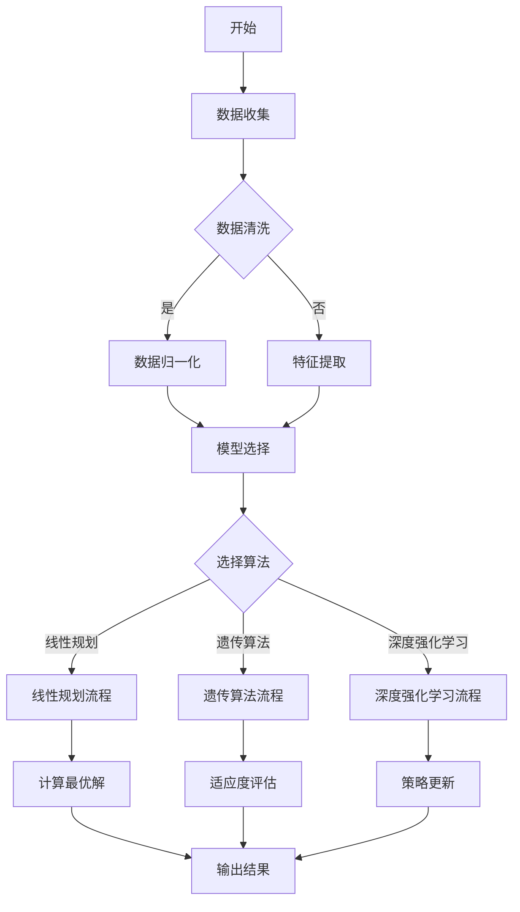
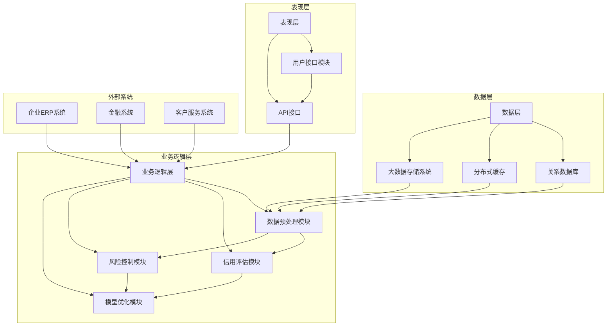

                 

### 文章关键词

AI, 供应链金融, 信用网络优化, 风险控制, 数据驱动的信用评估

### 摘要

本文旨在深入探讨人工智能（AI）在供应链金融信用网络优化与风险控制中的应用。首先，文章简要介绍了供应链金融的基本概念和结构，并解释了信用网络的定义与特性。随后，文章重点分析了AI技术在供应链金融中的关键角色，包括数据驱动的信用评估方法、信用网络优化算法以及风险控制方法。接着，文章详细讲解了相关算法的原理，包括数据预处理、机器学习模型选择和深度学习模型应用。此外，文章还描述了数学模型的构建和公式推导，并展示了系统分析与架构设计的方法。通过一个实际项目案例，文章提供了具体的实现过程和结果分析。最后，文章总结了最佳实践技巧，指出了注意事项，并推荐了拓展阅读资源。本文旨在为供应链金融从业者和研究人员提供有价值的参考和指导。

## 第一部分：问题背景与核心概念

### 1.1 供应链金融概述

供应链金融（Supply Chain Finance，SCF）是一种基于供应链关系的金融运作模式，旨在通过供应链中的企业之间的信用关系，提供融资和风险控制服务。这种模式不仅解决了传统金融中难以满足中小企业融资需求的难题，还优化了整个供应链的现金流，提高了企业的运营效率。

#### 供应链金融的定义与历史

供应链金融的定义可以概括为：通过融资手段，将供应链上的核心企业与上下游企业联系起来，为其提供全面的金融解决方案。其核心在于通过核心企业的信用扩展，向供应链中的其他企业发放贷款、保理等金融服务。

供应链金融的发展可以追溯到20世纪80年代，当时一些大型企业为了优化其供应链管理，开始利用其信用优势向上下游企业提供金融服务。随着时间的推移，供应链金融逐渐发展成为一个独立且具有广泛应用的金融领域。特别是在互联网和大数据技术的推动下，供应链金融得到了快速发展，实现了从传统的线下业务到线上平台的转型。

#### 供应链金融的运作模式

供应链金融的运作模式主要包括以下几种：

1. **保理（Factoring）**：卖方将应收账款转让给金融机构，由金融机构提供融资服务，从而加快资金回笼。
2. **订单融资**：金融机构根据卖方的订单信息和核心企业的信用，为卖方提供融资支持。
3. **应收账款融资**：卖方将应收账款抵押给金融机构，获取融资。
4. **发票融资**：卖方将发票抵押给金融机构，获取融资。
5. **信用证**：核心企业通过信用证担保，为上下游企业提供融资。

这些模式共同构成了供应链金融的核心运作体系，使得供应链上的企业能够更加便捷地获取资金支持，优化其财务状况和运营效率。

### 1.2 供应链金融信用网络的定义与结构

供应链金融信用网络是指由供应链上的核心企业、上下游企业及其金融服务提供商组成的复杂网络。在这个网络中，各节点企业通过业务往来和金融关系相互连接，形成了独特的信用关系和风险承担机制。

#### 信用网络的组成

一个典型的供应链金融信用网络通常由以下几个部分组成：

1. **核心企业**：通常具有较强信用能力和业务规模，在整个供应链中占据主导地位。
2. **上下游企业**：包括供应商、制造商、分销商等，与核心企业之间存在紧密的业务联系。
3. **金融服务提供商**：如银行、金融科技公司等，为供应链上的企业提供融资、风险控制和资产管理等服务。

#### 信用网络中的节点与边

在供应链金融信用网络中，节点表示企业或金融机构，边表示节点之间的业务往来或金融关系。节点与边的关系构成了信用网络的骨架。以下是一些关键概念：

1. **节点关系**：节点之间的关系可以分为直接关系和间接关系。直接关系通常是指业务往来或金融交易，而间接关系则通过多个中间节点实现。
2. **信用额度**：节点之间的信用额度是指金融机构或核心企业愿意提供的融资额度。
3. **风险承担**：在信用网络中，各节点企业需要共同承担风险。核心企业通常承担主要风险，而上下游企业则通过共享核心企业的信用，降低自身融资风险。

### 1.3 AI在供应链金融中的应用

人工智能（AI）技术在供应链金融中的应用正逐渐成为提升效率和优化风险控制的关键因素。AI不仅改变了传统的信用评估和风险控制方式，还为供应链金融的创新提供了新的可能性。

#### AI技术在供应链金融中的角色

AI技术在供应链金融中扮演着多个关键角色：

1. **信用评估**：AI通过大数据分析和机器学习算法，能够更加精准地评估供应链上各企业的信用风险，提高信用评估的准确性和效率。
2. **风险控制**：AI技术能够实时监测供应链上的交易和财务数据，及时发现潜在风险并采取相应的风险控制措施。
3. **智能决策**：AI系统可以根据实时数据和业务规则，自动生成融资决策，优化供应链金融服务的效率和质量。

#### AI在信用评估与风险管理中的应用

AI在供应链金融中的具体应用包括：

1. **信用评分模型**：通过分析企业的财务数据、交易记录、信用历史等，AI可以构建出精确的信用评分模型，为金融机构提供信用评估依据。
2. **风险预警系统**：AI系统可以实时分析供应链上的交易数据，发现异常行为或潜在的信用风险，及时发出预警信号。
3. **智能风控模型**：基于历史数据和业务逻辑，AI可以构建智能风控模型，自动识别和评估风险，并制定相应的风险应对策略。

### 1.4 优化与风险控制的重要性

在供应链金融中，优化与风险控制是两个不可分割的核心环节。

#### 优化策略在供应链金融中的价值

优化策略在供应链金融中的价值主要体现在以下几个方面：

1. **提高融资效率**：通过优化信用评估和风险控制流程，能够显著提高融资效率，减少企业融资等待时间。
2. **降低融资成本**：优化信用评估和风险控制，可以降低金融机构的风险溢价，从而降低融资成本。
3. **提升风险管理能力**：优化策略可以帮助金融机构更好地识别和管理风险，提高供应链金融服务的稳定性和可靠性。

#### 风险控制在供应链金融中的关键作用

风险控制在供应链金融中的关键作用包括：

1. **防范信用风险**：通过有效的风险控制措施，能够防范供应链上的信用风险，保障金融机构和企业的利益。
2. **保障资金安全**：风险控制措施可以确保供应链金融服务的资金安全，防止欺诈和恶意行为的发生。
3. **优化供应链管理**：有效的风险控制有助于优化供应链上的业务流程和管理，提高整体供应链的运作效率。

综上所述，供应链金融信用网络的优化与风险控制不仅关乎企业的财务安全和运营效率，也关系到整个供应链的稳定性和可持续发展。随着AI技术的不断进步，优化与风险控制的方法将更加智能化和高效化，为供应链金融的发展提供强有力的支持。

### 1.5 核心概念与联系

在本章中，我们将进一步探讨供应链金融信用网络的核心概念，并分析这些概念之间的联系，以便更好地理解AI在其中的应用。

#### 数据驱动的供应链金融信用评估

数据驱动的供应链金融信用评估是AI在供应链金融中应用的核心之一。该方法的核心理念是通过分析大量的历史数据和实时数据，构建信用评分模型，从而评估企业的信用状况。

**核心概念**：
1. **数据源**：数据源包括企业的财务报表、交易记录、信用历史、市场信息等。
2. **数据预处理**：数据预处理是数据驱动信用评估的重要步骤，包括数据清洗、数据归一化、特征提取等。
3. **信用评分模型**：信用评分模型是数据驱动的核心工具，通过机器学习和深度学习算法，可以构建出能够准确预测企业信用风险的模型。

**联系**：
- 数据源是信用评估的基础，数据的质量直接影响模型的准确性和稳定性。
- 数据预处理确保数据的一致性和完整性，是模型构建的前提条件。
- 信用评分模型将数据转化为信用评分，为金融机构提供决策依据。

#### 信用网络优化算法

信用网络优化算法是提高供应链金融信用网络效率和稳定性的重要手段。这些算法通过优化节点之间的信用分配和风险控制策略，实现信用网络的优化。

**核心概念**：
1. **优化目标**：优化目标通常包括最小化风险、最大化收益、提高信用网络的稳定性等。
2. **优化算法**：常见的优化算法包括线性规划、遗传算法、深度强化学习等。
3. **信用分配**：信用分配是指根据企业的信用评分，将信用额度合理分配给上下游企业。

**联系**：
- 优化目标是信用网络优化的核心，决定了优化算法的设计和应用。
- 优化算法是实现优化目标的具体方法，根据不同优化目标选择合适的算法。
- 信用分配是优化算法在供应链金融中的应用，通过合理的信用分配，实现供应链金融的优化。

#### 风险控制方法与工具

风险控制在供应链金融中至关重要，涉及到风险识别、风险评估、风险应对等多个环节。

**核心概念**：
1. **风险评估**：风险评估是风险控制的基础，包括定量评估和定性评估。
2. **风险应对**：风险应对是指根据风险评估结果，制定相应的风险应对策略，包括风险预防、风险分散、风险转移等。
3. **风险监控**：风险监控是确保风险控制措施有效性的关键，通过实时监控供应链上的交易和财务数据，及时发现和应对风险。

**联系**：
- 风险评估是识别和量化风险的过程，为风险应对提供依据。
- 风险应对是针对风险评估结果采取的具体措施，确保供应链金融的安全和稳定。
- 风险监控是实现风险控制持续性和有效性的保障，通过实时监控，及时调整风险应对策略。

#### AI技术与其他供应链金融工具的结合

AI技术在供应链金融中的应用不仅限于信用评估和风险控制，还可以与其他金融工具和技术的结合，提升供应链金融的整体效能。

**核心概念**：
1. **大数据**：大数据为AI提供了丰富的数据支持，是信用评估和风险控制的重要数据来源。
2. **区块链**：区块链技术提供了一种去中心化的信任机制，有助于提升供应链金融的透明度和安全性。
3. **生物识别技术**：生物识别技术可以用于身份验证和风险控制，提高供应链金融服务的安全性和便捷性。

**联系**：
- 大数据与AI技术的结合，为信用评估和风险控制提供了强大的数据支持。
- 区块链技术通过增强数据的透明性和不可篡改性，提升了供应链金融的信任度和安全性。
- 生物识别技术与AI技术的结合，可以实现更安全、更便捷的供应链金融服务。

综上所述，数据驱动的供应链金融信用评估、信用网络优化算法、风险控制方法以及AI技术与其他供应链金融工具的结合，共同构成了供应链金融信用网络的优化与风险控制体系。这些核心概念和联系不仅为供应链金融的发展提供了理论支持，也为实际应用提供了实践指导。

### 1.6 信用网络优化算法

在供应链金融中，信用网络优化算法是提升整个供应链金融系统效率和风险管理能力的关键技术。通过优化算法，能够合理分配信用额度，降低风险，并最大化供应链的整体收益。

#### 优化目标与模型

**优化目标**：

供应链金融信用网络优化的目标通常包括以下几点：

1. **最小化风险**：通过优化信用分配策略，降低整个信用网络的违约风险。
2. **最大化收益**：在确保风险可控的前提下，通过信用优化策略，提高供应链金融系统的整体收益。
3. **提高信用网络的稳定性**：确保供应链上的企业能够稳定地获得融资服务，提高供应链的整体运作效率。

**优化模型**：

信用网络优化通常采用线性规划、整数规划、遗传算法等数学模型。这些模型通过构建目标函数和约束条件，实现对信用网络的优化。

- **目标函数**：通常包括最小化风险函数和最大化收益函数。
- **约束条件**：包括信用额度限制、企业信用评分限制、风险控制策略等。

**模型构建示例**：

假设一个供应链金融系统中，有n家企业，每家企业都有一定的信用评分和信用需求。优化模型的目标是最小化整体违约风险，并最大化供应链金融系统的总收益。目标函数和约束条件可以表示为：

目标函数：
$$
\min \ Z = \sum_{i=1}^{n} w_i \cdot r_i
$$
其中，$w_i$表示企业i的信用额度，$r_i$表示企业i的违约风险。

约束条件：
$$
w_i \leq C_i \quad \forall i \in [1, n]
$$
$$
\sum_{i=1}^{n} w_i \cdot r_i \leq R
$$
其中，$C_i$表示企业i的信用额度限制，$R$表示整体风险限制。

#### 常见优化算法案例分析

**1. 线性规划（Linear Programming）**

线性规划是一种经典的优化算法，通过求解线性目标函数和线性约束条件，找到最优解。

**应用场景**：适用于信用额度相对稳定，且风险与信用额度成线性关系的场景。

**优缺点**：

- **优点**：计算简单，适用于大规模问题。
- **缺点**：对非线性风险模型适用性差。

**2. 遗传算法（Genetic Algorithm）**

遗传算法是一种基于自然进化过程的优化算法，通过模拟生物进化过程，逐步优化信用分配策略。

**应用场景**：适用于信用额度动态变化，且风险模型较为复杂的情况。

**优缺点**：

- **优点**：适用于复杂非线性优化问题。
- **缺点**：计算复杂度高，收敛速度较慢。

**3. 深度强化学习（Deep Reinforcement Learning）**

深度强化学习是一种结合了深度学习和强化学习的优化算法，通过学习信用分配策略，实现风险收益的最优化。

**应用场景**：适用于需要实时调整信用分配策略，且环境动态变化的情况。

**优缺点**：

- **优点**：能够自适应地调整信用分配策略，提高系统的动态适应能力。
- **缺点**：训练过程复杂，需要大量数据和计算资源。

### 1.7 风险控制方法与工具

风险控制在供应链金融中起着至关重要的作用，它关系到金融机构和企业的财务安全，也影响着整个供应链的稳定性。以下将介绍几种常用的风险控制方法与工具。

#### 风险评估指标体系

**1. 信用评分**：

信用评分是评估企业信用风险的重要指标。通常采用评分卡模型，通过分析企业的历史数据和财务状况，对企业的信用进行评分。

**2. 财务指标**：

财务指标包括流动比率、速动比率、资产负债率等，这些指标可以反映企业的财务健康状况和偿债能力。

**3. 供应链指标**：

供应链指标包括供应链的弹性、供应链网络的稳定性等，这些指标可以评估供应链的抗风险能力。

#### 风险应对策略

**1. 风险预防**：

通过建立严格的信用评估体系和风险管理流程，预防潜在的信用风险。例如，对上下游企业进行详细的尽职调查，确保其财务状况和信用记录良好。

**2. 风险分散**：

通过多元化融资渠道和多元化客户，分散信用风险。例如，采用多渠道融资，如银行贷款、保理、供应链金融等，降低单一融资渠道的风险。

**3. 风险转移**：

通过保险、担保等方式，将风险转移给第三方。例如，购买信用保险，将违约风险转移给保险公司。

**4. 风险监控**：

通过实时监控系统，对供应链上的交易和财务数据进行分析，及时发现潜在风险，并采取相应的应对措施。

#### 常用工具

**1. 大数据技术**：

通过大数据技术，对海量数据进行分析和处理，发现潜在的风险因素，提高风险评估的准确性和实时性。

**2. 人工智能技术**：

利用人工智能技术，构建智能风控模型，实现对风险的实时监控和预测，提高风险控制的效率和准确性。

**3. 区块链技术**：

通过区块链技术，实现供应链金融交易的透明化和不可篡改性，提高金融服务的安全性和可信度。

#### AI技术与其他供应链金融工具的结合

**1. 大数据与区块链的结合**：

大数据技术提供丰富的数据支持，而区块链技术确保数据的透明性和不可篡改性，两者结合可以提升供应链金融的风险控制能力。

**2. 生物识别技术**：

生物识别技术用于身份验证，确保供应链金融服务的安全性和便捷性。例如，通过人脸识别技术验证交易双方的身份，防止欺诈行为。

通过以上方法与工具，供应链金融的风险控制能力得到了显著提升，为供应链金融的稳定运行提供了保障。

### 1.8 AI技术与其他供应链金融工具的结合

人工智能（AI）技术在供应链金融中的应用，不仅体现在信用评估和风险控制上，还可以与其他金融工具和技术的结合，进一步提升供应链金融的整体效能。以下将探讨大数据、区块链和生物识别技术在供应链金融中的具体应用及其结合方法。

#### 大数据与供应链金融的结合

大数据技术在供应链金融中的应用，主要体现在数据收集、分析和应用三个方面。

**数据收集**：
- **多源数据收集**：供应链金融涉及大量的业务数据、财务数据、市场数据等，通过大数据技术，可以收集和整合来自不同来源的数据，形成全面的数据集。
- **实时数据流处理**：大数据平台可以实时处理供应链上的交易数据、物流信息等，实现对供应链状况的实时监控和分析。

**数据分析**：
- **数据挖掘**：通过数据挖掘技术，可以从海量数据中提取有价值的信息，如潜在客户、信用风险等。
- **数据可视化**：利用大数据分析结果，通过数据可视化工具，将复杂的数据信息以图表、仪表盘等形式展示，帮助决策者更直观地理解数据。

**数据应用**：
- **智能信用评估**：利用大数据分析，构建更加精准的信用评估模型，提高信用评估的准确性和效率。
- **风险预测**：通过对历史数据和实时数据的分析，预测潜在的信用风险和市场风险，提前采取应对措施。

#### 区块链与供应链金融的结合

区块链技术通过其去中心化、不可篡改和透明化的特性，为供应链金融提供了强大的支持。

**去中心化**：
- **分布式账本**：区块链技术实现了供应链金融交易的分布式记录，避免了传统金融系统中中心化节点可能带来的单点故障风险。

**不可篡改**：
- **数据安全**：区块链技术通过加密算法和共识机制，确保了供应链金融交易数据的不可篡改性，提高了数据的安全性和可信度。

**透明化**：
- **透明交易**：区块链上的交易记录是公开透明的，供应链上的所有参与方都可以查看和验证交易信息，增强了供应链金融的透明度和信任度。

#### 生物识别技术与供应链金融的结合

生物识别技术通过识别和验证个体的生物特征，为供应链金融提供了安全性和便捷性的保障。

**身份验证**：
- **人脸识别**：人脸识别技术可以用于交易双方的身份验证，确保交易的安全性和真实性。
- **指纹识别**：指纹识别技术用于员工的身份验证，确保内部操作的安全性。

**风险控制**：
- **行为分析**：通过生物识别技术，可以对交易双方的行为进行实时监控和分析，发现异常行为并及时预警。

#### 结合方法与应用

**1. 大数据+区块链**：
- **数据透明化**：利用大数据技术收集和处理供应链金融数据，结合区块链技术实现数据的透明化和不可篡改性，提高数据的安全性和可信度。
- **智能合约**：通过区块链技术实现智能合约，自动执行信用评估、贷款发放等金融操作，提高供应链金融的效率和准确性。

**2. 生物识别+区块链**：
- **安全保障**：利用生物识别技术进行交易双方的身份验证，结合区块链技术确保交易记录的安全和不可篡改。
- **隐私保护**：通过区块链技术保护交易双方的隐私信息，确保在数据透明化的同时保护个人隐私。

**3. 多技术综合应用**：
- **智能风控系统**：通过大数据分析、区块链和生物识别技术的综合应用，构建智能风控系统，实现对供应链金融风险的全方位监控和管理。
- **个性化金融服务**：结合大数据和生物识别技术，为供应链上的企业提供个性化的金融服务，提高客户满意度和市场竞争力。

通过大数据、区块链和生物识别技术的综合应用，供应链金融在信用评估、风险控制和业务流程优化等方面得到了全面提升，为供应链金融的智能化发展提供了强有力的技术支持。

### 1.9 算法原理讲解

在本文的第三部分，我们将深入探讨供应链金融信用网络优化中的核心算法原理，包括数据预处理、机器学习模型选择和深度学习模型应用。这些算法原理不仅为我们理解AI在供应链金融中的应用提供了理论基础，也为其实际应用提供了关键指导。

#### 3.1 算法概述

在供应链金融信用网络优化中，算法的选择至关重要。常见的算法包括线性规划、遗传算法、深度强化学习等。每种算法都有其独特的优势和应用场景，理解这些算法的基本原理有助于我们在具体问题中选择合适的工具。

- **线性规划（Linear Programming，LP）**：线性规划是一种最优化技术，用于求解线性目标函数和线性约束条件下的最优解。其优势在于计算简单、适用于大规模问题，但在处理非线性问题时效果有限。

- **遗传算法（Genetic Algorithm，GA）**：遗传算法是一种基于自然选择和遗传机制的优化算法，通过模拟生物进化过程，逐步优化目标函数。遗传算法适用于复杂非线性优化问题，但计算复杂度较高，收敛速度较慢。

- **深度强化学习（Deep Reinforcement Learning，DRL）**：深度强化学习是结合了深度学习和强化学习的一种优化算法。通过神经网络模型学习最优策略，深度强化学习能够自适应地调整策略，适用于动态变化的复杂环境。

#### 3.2 数据预处理

数据预处理是供应链金融信用网络优化中的关键步骤，其目标是通过清洗、归一化和特征提取，将原始数据转换为适合模型训练的数据集。

**数据清洗**：数据清洗是数据预处理的第一步，旨在去除数据集中的噪声和异常值。具体方法包括：
- **缺失值处理**：利用平均值、中位数或插值法填充缺失值。
- **异常值检测**：利用统计方法（如Z-score、IQR法）检测异常值，并决定是否删除或调整。

**数据归一化**：数据归一化是将数据集中的特征值缩放到相同的尺度，以避免特征间的量纲差异影响模型训练。常用的归一化方法包括：
- **最小-最大缩放**：将特征值缩放到[0, 1]之间。
- **均值-标准差缩放**：将特征值缩放到均值附近，使其服从标准正态分布。

**特征提取**：特征提取是选择对模型训练有显著影响的关键特征，提高模型的预测性能。常见的方法包括：
- **主成分分析（PCA）**：通过降维，将高维数据映射到低维空间，保留主要特征。
- **特征选择**：利用统计方法（如卡方检验、互信息）选择与目标变量高度相关的特征。

#### 3.3 机器学习模型选择

机器学习模型在供应链金融信用网络优化中扮演着核心角色，选择合适的模型至关重要。

**线性回归（Linear Regression）**：线性回归是一种简单的机器学习模型，用于预测一个连续目标变量。其优点是计算简单、易于理解和实现，但在处理非线性关系时效果较差。

**逻辑回归（Logistic Regression）**：逻辑回归是一种分类模型，通过构建逻辑函数，将连续概率映射到二分类结果。逻辑回归在信用风险评估中广泛使用，其优点是能够捕捉非线性关系。

**支持向量机（Support Vector Machine，SVM）**：支持向量机是一种分类模型，通过找到一个最佳的超平面，将不同类别的数据分隔开来。SVM在处理高维数据和线性不可分问题时效果较好。

**随机森林（Random Forest）**：随机森林是一种基于决策树的集成模型，通过构建多棵决策树并投票得出最终结果。随机森林在处理高维数据和平衡模型性能与复杂性方面表现出色。

**XGBoost**：XGBoost是一种基于梯度提升树（Gradient Boosting Tree）的模型，通过迭代优化模型，提高预测性能。XGBoost在处理大规模数据和平衡模型性能与计算效率方面具有显著优势。

#### 3.4 深度学习模型应用

深度学习模型在供应链金融信用网络优化中的应用越来越广泛，能够处理复杂数据结构和非线性关系。

**神经网络（Neural Network）**：神经网络是一种模仿人脑结构的计算模型，通过多层神经元传递信息，实现数据的非线性变换。在供应链金融中，神经网络可以用于信用评分和风险预测。

**卷积神经网络（Convolutional Neural Network，CNN）**：卷积神经网络是一种专门用于处理图像数据的神经网络，通过卷积层和池化层，提取图像中的特征。在供应链金融中，CNN可以用于提取交易数据的特征。

**循环神经网络（Recurrent Neural Network，RNN）**：循环神经网络是一种能够处理序列数据的神经网络，通过隐藏状态和历史信息的交互，实现序列建模。在供应链金融中，RNN可以用于处理时间序列数据，如财务报表和交易记录。

**长短期记忆网络（Long Short-Term Memory，LSTM）**：长短期记忆网络是RNN的一种变体，通过引入门控机制，解决RNN在处理长序列数据时出现梯度消失和梯度爆炸问题。LSTM在供应链金融中，可以用于处理长序列数据，如历史信用记录。

**生成对抗网络（Generative Adversarial Network，GAN）**：生成对抗网络由生成器和判别器两个神经网络组成，通过对抗训练生成真实数据。在供应链金融中，GAN可以用于生成虚拟交易数据，用于模型训练和测试。

通过以上算法原理的讲解，我们可以看到，供应链金融信用网络优化中的算法选择和应用是多样化的，每种算法都有其独特的优势和适用场景。在实际应用中，需要根据具体问题和数据特点，选择合适的算法和模型，以提高信用评估和风险控制的准确性和效率。

### 3.5 数据预处理

在供应链金融信用网络优化过程中，数据预处理是一个至关重要的步骤，其目标是确保输入数据的准确性和一致性，以便后续的机器学习模型能够有效地进行训练和预测。以下将详细讨论数据预处理的主要步骤和常见方法。

#### 数据清洗

数据清洗是数据预处理的第一步，旨在去除数据中的噪声和异常值，提高数据质量。以下是一些常见的数据清洗方法：

1. **缺失值处理**：
   - **平均值填充**：对于连续特征，可以计算各特征的平均值，然后用该平均值填补缺失值。
   - **中位数填充**：对于一些异常值较多的特征，使用中位数填充缺失值可能更为合适。
   - **最大值/最小值填充**：对于一些极端情况，可以使用该特征的最大值或最小值填补缺失值。
   - **插值法**：使用时间序列插值方法（如线性插值、多项式插值）填补缺失值。

2. **异常值检测**：
   - **Z-score法**：计算每个特征的标准差和均值，使用Z-score评估每个观测值是否偏离平均值三个标准差之外，对异常值进行处理。
   - **IQR法（四分位距法）**：计算第一四分位数（Q1）和第三四分位数（Q3），将数据分为四等份，对距离Q1-1.5\*IQR和Q3+1.5\*IQR的异常值进行处理。

3. **重复值处理**：检测并去除数据集中的重复记录，确保每个数据点的唯一性。

#### 数据归一化

数据归一化是将数据集中的特征值缩放到相同的尺度，以避免特征间的量纲差异影响模型训练。以下是一些常见的归一化方法：

1. **最小-最大缩放**：
   $$\text{归一化值} = \frac{\text{值} - \text{最小值}}{\text{最大值} - \text{最小值}}$$
   将所有特征的值缩放到[0, 1]之间。

2. **均值-标准差缩放**：
   $$\text{归一化值} = \frac{\text{值} - \text{均值}}{\text{标准差}}$$
   将所有特征的值缩放到均值附近，使其服从标准正态分布。

3. **归一化系数缩放**：
   $$\text{归一化值} = \text{系数} \times (\text{值} - \text{最小值}) + \text{最小值}$$
   其中系数和最小值可以根据具体需求进行调整。

#### 特征提取

特征提取是选择对模型训练有显著影响的关键特征，提高模型的预测性能。以下是一些常见的特征提取方法：

1. **主成分分析（PCA）**：
   - **降维**：通过将高维数据映射到低维空间，保留主要特征，减少数据的冗余。
   - **提高计算效率**：降维后的数据可以减少计算量和存储需求，加快模型训练速度。

2. **特征选择**：
   - **卡方检验**：用于选择与目标变量有显著关系的特征。
   - **互信息**：用于评估特征与目标变量之间的相关性。

3. **特征组合**：
   - **特征交叉**：将多个特征组合成新的特征，以捕捉特征之间的相互作用。
   - **特征融合**：将不同的特征通过加权或融合方法，生成新的特征。

#### 数据集划分

在数据预处理过程中，通常需要将数据集划分为训练集和测试集，以便评估模型的泛化能力。以下是一些常见的数据集划分方法：

1. **随机划分**：随机将数据集分为训练集和测试集，适用于数据分布较为均匀的情况。

2. **时间序列划分**：按照时间顺序划分训练集和测试集，适用于时间序列数据。

3. **交叉验证**：使用交叉验证方法，将数据集划分为多个子集，每次使用不同的子集作为验证集，以提高模型评估的准确性。

#### 代码示例

以下是一个简单的Python代码示例，用于展示数据预处理的过程：

```python
import pandas as pd
from sklearn.preprocessing import MinMaxScaler
from sklearn.impute import SimpleImputer

# 加载数据
data = pd.read_csv('supply_chain_data.csv')

# 缺失值处理
imputer = SimpleImputer(strategy='mean')
data_imputed = imputer.fit_transform(data)

# 异常值处理
# 使用Z-score法
from scipy.stats import zscore
data_zscore = zscore(data)
data_zscore = data_zscore[abs(data_zscore) < 3]

# 数据归一化
scaler = MinMaxScaler()
data_normalized = scaler.fit_transform(data_zscore)

# 特征提取
# 使用PCA进行降维
from sklearn.decomposition import PCA
pca = PCA(n_components=5)
data_reduced = pca.fit_transform(data_normalized)

# 数据集划分
from sklearn.model_selection import train_test_split
X_train, X_test, y_train, y_test = train_test_split(data_reduced, target, test_size=0.2, random_state=42)
```

通过以上数据预处理步骤，我们为后续的机器学习模型训练提供了高质量的数据集，从而提高了模型训练的准确性和预测能力。

### 3.6 机器学习模型选择

在供应链金融信用网络优化中，选择合适的机器学习模型至关重要。不同的模型在数据处理能力、预测准确性、复杂度和可解释性方面各有优劣。以下将详细讨论几种常见的机器学习模型，包括线性回归、逻辑回归、支持向量机和随机森林，以及它们在信用评分和风险评估中的应用。

#### 线性回归（Linear Regression）

线性回归是一种简单的机器学习模型，用于预测一个连续目标变量。其核心思想是通过建立特征变量和目标变量之间的线性关系，实现对未知数据的预测。

**线性回归模型公式**：
$$
Y = \beta_0 + \beta_1X_1 + \beta_2X_2 + \ldots + \beta_nX_n
$$
其中，$Y$是目标变量，$X_1, X_2, \ldots, X_n$是特征变量，$\beta_0, \beta_1, \beta_2, \ldots, \beta_n$是模型的参数。

**应用场景**：

- **信用评分**：线性回归可以用于预测企业的信用评分，通过分析企业的财务状况、历史交易数据等特征，建立信用评分模型。
- **风险评估**：线性回归可以用于评估信用风险，通过计算各特征的权重，量化信用风险。

**优缺点**：

- **优点**：计算简单，易于实现，解释性强。
- **缺点**：线性关系假设限制了其处理复杂非线性关系的能力。

#### 逻辑回归（Logistic Regression）

逻辑回归是一种分类模型，通过构建逻辑函数，将连续概率映射到二分类结果。在供应链金融中，逻辑回归常用于信用评分和风险评估。

**逻辑回归模型公式**：
$$
\text{Logit}(P) = \ln\left(\frac{P}{1 - P}\right) = \beta_0 + \beta_1X_1 + \beta_2X_2 + \ldots + \beta_nX_n
$$
其中，$P$是预测的概率，$\text{Logit}(P)$是逻辑函数，$\beta_0, \beta_1, \beta_2, \ldots, \beta_n$是模型的参数。

**应用场景**：

- **信用评分**：逻辑回归可以用于预测企业是否违约，通过计算各特征的权重，建立信用评分模型。
- **风险评估**：逻辑回归可以用于评估信用风险，通过计算违约概率，制定风险控制策略。

**优缺点**：

- **优点**：能够捕捉非线性关系，解释性强。
- **缺点**：对于高维数据和稀疏数据，性能可能较差。

#### 支持向量机（Support Vector Machine，SVM）

支持向量机是一种强大的分类模型，通过找到一个最佳的超平面，将不同类别的数据分隔开来。在供应链金融中，SVM常用于信用评分和风险评估。

**支持向量机模型公式**：
$$
w \cdot x + b = 0
$$
其中，$w$是超平面的权重向量，$x$是特征向量，$b$是偏置项。

**应用场景**：

- **信用评分**：SVM可以用于预测企业的信用评分，通过分析企业的财务状况、历史交易数据等特征，建立信用评分模型。
- **风险评估**：SVM可以用于评估信用风险，通过计算各特征的权重，量化信用风险。

**优缺点**：

- **优点**：处理高维数据和线性不可分问题效果较好，分类性能强大。
- **缺点**：模型复杂度较高，训练时间较长。

#### 随机森林（Random Forest）

随机森林是一种基于决策树的集成模型，通过构建多棵决策树并投票得出最终结果。在供应链金融中，随机森林常用于信用评分和风险评估。

**随机森林模型公式**：
$$
f(x) = \frac{1}{T} \sum_{t=1}^{T} h_t(x)
$$
其中，$f(x)$是最终预测结果，$h_t(x)$是第$t$棵决策树的预测结果，$T$是决策树的数量。

**应用场景**：

- **信用评分**：随机森林可以用于预测企业的信用评分，通过分析企业的财务状况、历史交易数据等特征，建立信用评分模型。
- **风险评估**：随机森林可以用于评估信用风险，通过计算各特征的权重，量化信用风险。

**优缺点**：

- **优点**：能够处理高维数据和复杂数据结构，预测性能稳定。
- **缺点**：模型解释性较差，需要大量计算资源。

#### XGBoost

XGBoost是一种基于梯度提升树（Gradient Boosting Tree）的模型，通过迭代优化模型，提高预测性能。在供应链金融中，XGBoost常用于信用评分和风险评估。

**XGBoost模型公式**：
$$
f(x) = \sum_{t=1}^{T} \alpha_t h_t(x)
$$
其中，$f(x)$是最终预测结果，$h_t(x)$是第$t$棵决策树的预测结果，$\alpha_t$是提升系数。

**应用场景**：

- **信用评分**：XGBoost可以用于预测企业的信用评分，通过分析企业的财务状况、历史交易数据等特征，建立信用评分模型。
- **风险评估**：XGBoost可以用于评估信用风险，通过计算各特征的权重，量化信用风险。

**优缺点**：

- **优点**：处理大规模数据和平衡模型性能与计算效率方面具有显著优势。
- **缺点**：模型解释性较差，需要大量计算资源。

综上所述，不同的机器学习模型在供应链金融信用评分和风险评估中各有优劣。在实际应用中，需要根据具体问题和数据特点，选择合适的模型，以提高预测准确性和效率。

### 3.7 深度学习模型应用

在供应链金融信用网络优化中，深度学习模型的应用正在变得越来越广泛。深度学习模型，尤其是神经网络（Neural Network），卷积神经网络（Convolutional Neural Network，CNN）和循环神经网络（Recurrent Neural Network，RNN）等，通过其强大的特征提取和模式识别能力，为信用评分和风险评估提供了新的可能。

#### 神经网络（Neural Network）

神经网络是一种模仿人脑结构的计算模型，通过多层神经元传递信息，实现数据的非线性变换。在供应链金融中，神经网络可以用于信用评分和风险预测。

**神经网络结构**：

神经网络通常由输入层、隐藏层和输出层组成。输入层接收外部输入数据，隐藏层通过非线性激活函数处理数据，输出层生成最终的预测结果。

**激活函数**：

激活函数是神经网络的核心组件，用于引入非线性特性。常见的激活函数包括：

- **Sigmoid函数**：
  $$
  \sigma(x) = \frac{1}{1 + e^{-x}}
  $$
- **ReLU函数**：
  $$
  \text{ReLU}(x) = \max(0, x)
  $$

**前向传播与反向传播**：

神经网络通过前向传播计算输出值，通过反向传播更新网络参数。具体步骤如下：

1. **前向传播**：输入数据通过网络层，每层神经元根据输入和权重计算输出。
2. **计算损失**：将输出值与真实值比较，计算损失函数值。
3. **反向传播**：根据损失函数，反向更新网络参数，缩小损失函数值。

**深度学习框架**：

在实际应用中，深度学习框架（如TensorFlow和PyTorch）提供了高效的计算和优化工具，简化了神经网络模型的构建和训练过程。

**神经网络在信用评分中的应用**：

神经网络可以用于构建信用评分模型，通过学习企业的历史交易数据、财务状况等特征，预测企业的信用风险。以下是一个简单的神经网络信用评分模型示例：

```python
import tensorflow as tf

# 定义神经网络结构
model = tf.keras.Sequential([
    tf.keras.layers.Dense(64, activation='relu', input_shape=(num_features,)),
    tf.keras.layers.Dense(64, activation='relu'),
    tf.keras.layers.Dense(1, activation='sigmoid')
])

# 编译模型
model.compile(optimizer='adam', loss='binary_crossentropy', metrics=['accuracy'])

# 训练模型
model.fit(X_train, y_train, epochs=10, batch_size=32, validation_split=0.2)
```

#### 卷积神经网络（Convolutional Neural Network，CNN）

卷积神经网络是一种专门用于处理图像数据的神经网络，通过卷积层和池化层，提取图像中的特征。在供应链金融中，CNN可以用于提取交易数据的特征。

**CNN结构**：

CNN由多个卷积层和池化层组成。卷积层用于提取特征，池化层用于降低数据维度和计算量。

**卷积层**：

卷积层通过卷积操作提取图像中的特征。卷积操作涉及两个步骤：

1. **卷积操作**：将卷积核（也称为滤波器）与输入数据进行卷积运算，生成特征图。
2. **激活函数**：应用激活函数（如ReLU函数）引入非线性特性。

**池化层**：

池化层用于降低特征图的维度。常见的池化方法包括最大池化和平均池化。

**CNN在信用评分中的应用**：

CNN可以用于处理时间序列数据（如交易记录），通过卷积操作提取数据中的周期性和模式特征。以下是一个简单的CNN信用评分模型示例：

```python
import tensorflow as tf
from tensorflow.keras.models import Sequential
from tensorflow.keras.layers import Conv1D, MaxPooling1D, Dense

# 定义CNN结构
model = Sequential([
    Conv1D(filters=64, kernel_size=3, activation='relu', input_shape=(window_size, num_features)),
    MaxPooling1D(pool_size=2),
    Conv1D(filters=128, kernel_size=3, activation='relu'),
    MaxPooling1D(pool_size=2),
    Dense(64, activation='relu'),
    Dense(1, activation='sigmoid')
])

# 编译模型
model.compile(optimizer='adam', loss='binary_crossentropy', metrics=['accuracy'])

# 训练模型
model.fit(X_train, y_train, epochs=10, batch_size=32, validation_split=0.2)
```

#### 循环神经网络（Recurrent Neural Network，RNN）

循环神经网络是一种能够处理序列数据的神经网络，通过隐藏状态和历史信息的交互，实现序列建模。在供应链金融中，RNN可以用于处理时间序列数据（如财务报表和交易记录）。

**RNN结构**：

RNN由一个循环层组成，每个时间步的输入与前一时间步的隐藏状态相关联。隐藏状态通过权重矩阵进行更新。

**长短期记忆网络（LSTM）**：

长短期记忆网络是RNN的一种变体，通过引入门控机制，解决RNN在处理长序列数据时出现梯度消失和梯度爆炸问题。

**RNN在信用评分中的应用**：

RNN可以用于构建信用评分模型，通过学习时间序列数据中的特征，预测企业的信用风险。以下是一个简单的LSTM信用评分模型示例：

```python
import tensorflow as tf
from tensorflow.keras.models import Sequential
from tensorflow.keras.layers import LSTM, Dense

# 定义LSTM结构
model = Sequential([
    LSTM(units=64, return_sequences=True, input_shape=(window_size, num_features)),
    LSTM(units=64),
    Dense(1, activation='sigmoid')
])

# 编译模型
model.compile(optimizer='adam', loss='binary_crossentropy', metrics=['accuracy'])

# 训练模型
model.fit(X_train, y_train, epochs=10, batch_size=32, validation_split=0.2)
```

综上所述，深度学习模型在供应链金融信用评分和风险评估中的应用，通过其强大的特征提取和模式识别能力，显著提升了预测的准确性和效率。随着深度学习技术的不断进步，未来将在供应链金融中发挥更加重要的作用。

### 3.8 算法原理与流程图

为了更好地理解供应链金融信用网络优化中的算法原理，我们将使用Mermaid语法绘制算法流程图，并详细解释每个步骤。以下是算法原理的流程图：



#### 流程图详细解释

1. **开始（A）**：流程开始，从数据收集阶段开始。

2. **数据收集（B）**：收集供应链金融相关的数据，包括企业的财务状况、交易记录、信用历史等。

3. **数据清洗（C）**：数据清洗是数据预处理的第一步，包括缺失值处理、异常值检测和重复值处理。这一步骤确保数据的质量和一致性。

4. **数据归一化（D）**：数据归一化是将数据集中的特征值缩放到相同的尺度，以避免特征间的量纲差异影响模型训练。常用的方法包括最小-最大缩放和均值-标准差缩放。

5. **特征提取（E）**：特征提取是选择对模型训练有显著影响的关键特征，提高模型的预测性能。常用的方法包括主成分分析（PCA）和特征选择。

6. **模型选择（F）**：根据具体问题和数据特点，选择合适的机器学习模型或深度学习模型。常见的模型有线性规划、遗传算法、深度强化学习等。

7. **选择算法（G）**：根据模型选择的结果，确定具体的算法流程。

8. **线性规划流程（H）**：线性规划通过求解线性目标函数和线性约束条件，找到最优解。具体步骤包括构建目标函数和约束条件、求解最优解等。

9. **遗传算法流程（I）**：遗传算法通过模拟生物进化过程，逐步优化目标函数。具体步骤包括初始化种群、适应度评估、选择、交叉、变异等。

10. **深度强化学习流程（J）**：深度强化学习通过结合深度学习和强化学习，学习最优策略。具体步骤包括状态编码、策略更新、环境交互等。

11. **计算最优解（K）**：对于选定的算法，计算最优解，以实现优化目标。例如，最小化风险或最大化收益。

12. **输出结果（N）**：将最终结果输出，包括信用评分、风险控制策略等。

通过以上步骤，我们可以看到，供应链金融信用网络优化的算法流程包括数据收集、数据预处理、模型选择和算法执行等多个环节。每个环节都有明确的步骤和目标，通过合理设计和执行，可以显著提升供应链金融的效率和风险控制能力。

### 3.9 数学模型与公式讲解

在供应链金融信用网络优化中，数学模型和公式起着至关重要的作用。它们不仅帮助我们理解和量化问题，还能指导算法设计和参数调优。以下将详细介绍几个关键的数学模型和公式，包括概率模型、回归模型和神经网络模型。

#### 4.1 数学模型概述

**数学模型在供应链金融中的应用**：
在供应链金融中，数学模型主要用于信用评估、风险控制和优化策略。以下是一些常见应用：
- **信用评分模型**：通过建立企业历史数据与信用评分之间的关系，预测企业的信用风险。
- **风险评估模型**：通过量化风险因素，评估供应链金融系统的整体风险水平。
- **优化模型**：通过优化信用额度和风险控制策略，实现供应链金融系统的最佳运行状态。

**数学模型在优化算法中的应用**：
优化模型通常包括目标函数和约束条件。在供应链金融中，常见的优化模型有线性规划、整数规划和非线性规划。

#### 4.2 概率模型

概率模型是供应链金融中用于信用评分和风险评估的重要工具。以下是一些核心概念和公式：

**贝叶斯定理**：
贝叶斯定理是概率论中的一个基本原理，用于计算后验概率。公式如下：
$$
P(A|B) = \frac{P(B|A) \cdot P(A)}{P(B)}
$$
其中，$P(A|B)$是事件A在事件B发生的条件下的概率，$P(B|A)$是事件B在事件A发生的条件下的概率，$P(A)$和$P(B)$分别是事件A和事件B的先验概率。

**概率分布函数**：
概率分布函数描述了随机变量的概率分布情况。常见的概率分布函数有正态分布、泊松分布和二项分布。

- **正态分布**：
  正态分布的概率密度函数为：
  $$
  f(x|\mu, \sigma^2) = \frac{1}{\sqrt{2\pi\sigma^2}} e^{-\frac{(x-\mu)^2}{2\sigma^2}}
  $$
  其中，$\mu$是均值，$\sigma^2$是方差。

- **泊松分布**：
  泊松分布的概率质量函数为：
  $$
  P(X = k) = \frac{e^{-\lambda} \cdot \lambda^k}{k!}
  $$
  其中，$\lambda$是泊松率，$k$是事件发生的次数。

- **二项分布**：
  二项分布的概率质量函数为：
  $$
  P(X = k) = C(n, k) \cdot p^k \cdot (1-p)^{n-k}
  $$
  其中，$n$是试验次数，$p$是每次试验成功的概率，$C(n, k)$是从$n$次试验中选择$k$次成功的组合数。

#### 4.3 回归模型

回归模型用于分析自变量和因变量之间的关系。以下是一些常用的回归模型：

**线性回归**：
线性回归模型的表达式为：
$$
Y = \beta_0 + \beta_1X_1 + \beta_2X_2 + \ldots + \beta_nX_n + \epsilon
$$
其中，$Y$是因变量，$X_1, X_2, \ldots, X_n$是自变量，$\beta_0, \beta_1, \beta_2, \ldots, \beta_n$是回归系数，$\epsilon$是误差项。

**多项式回归**：
多项式回归是线性回归的扩展，用于处理非线性关系。其模型表达式为：
$$
Y = \beta_0 + \beta_1X_1 + \beta_2X_1^2 + \ldots + \beta_nX_1^n + \epsilon
$$
其中，$X_1$是自变量，$n$是多项式的最高次数。

**逻辑回归**：
逻辑回归是一种特殊的线性回归模型，用于处理二分类问题。其模型表达式为：
$$
\text{Logit}(P) = \ln\left(\frac{P}{1 - P}\right) = \beta_0 + \beta_1X_1 + \beta_2X_2 + \ldots + \beta_nX_n
$$
其中，$P$是预测的概率，$\text{Logit}(P)$是逻辑函数，$\beta_0, \beta_1, \beta_2, \ldots, \beta_n$是回归系数。

#### 4.4 神经网络模型

神经网络模型是深度学习的基础，用于处理复杂的数据和模式识别问题。以下是一些核心概念：

**前向传播与反向传播**：
神经网络通过前向传播计算输出值，通过反向传播更新网络参数。前向传播公式为：
$$
Z_l = \sigma(W_l \cdot A_{l-1} + b_l)
$$
其中，$Z_l$是第$l$层的输出值，$\sigma$是激活函数，$W_l$是权重矩阵，$A_{l-1}$是前一层输出值，$b_l$是偏置项。

反向传播公式为：
$$
\Delta W_l = \frac{\partial L}{\partial W_l} = \frac{\partial L}{\partial Z_l} \cdot \frac{\partial Z_l}{\partial W_l}
$$
其中，$L$是损失函数，$\Delta W_l$是权重更新。

**损失函数**：
损失函数用于衡量模型预测值与真实值之间的差距。常见的损失函数有均方误差（MSE）和交叉熵（Cross-Entropy）。

- **均方误差（MSE）**：
  $$
  MSE = \frac{1}{n} \sum_{i=1}^{n} (y_i - \hat{y}_i)^2
  $$
  其中，$y_i$是真实值，$\hat{y}_i$是预测值。

- **交叉熵（Cross-Entropy）**：
  $$
  CE = -\frac{1}{n} \sum_{i=1}^{n} y_i \cdot \ln(\hat{y}_i)
  $$
  其中，$y_i$是真实值，$\hat{y}_i$是预测概率。

**优化算法**：
优化算法用于更新网络参数，减少损失函数值。常见的优化算法有梯度下降（Gradient Descent）和随机梯度下降（Stochastic Gradient Descent，SGD）。

通过以上数学模型和公式的讲解，我们可以更好地理解供应链金融信用网络优化中的核心概念和计算方法。这些数学工具不仅为我们设计优化算法提供了理论依据，也为实际应用提供了具体的指导。

### 4.5 公式推导与讲解

为了深入理解供应链金融信用网络优化中的数学模型，我们将详细推导几个关键公式，并解释其在实际应用中的意义。

#### 4.5.1 贝叶斯定理

贝叶斯定理是概率论中的基础公式，用于计算后验概率。以下是贝叶斯定理的推导过程：

假设有两个事件A和B，我们想要求解事件A在事件B发生的条件下的概率$P(A|B)$。根据概率论的基本原理，有：
$$
P(A \cap B) = P(B|A) \cdot P(A)
$$
两边同时除以$P(B)$，得到：
$$
P(A|B) = \frac{P(B|A) \cdot P(A)}{P(B)}
$$
这个公式即为贝叶斯定理。在实际应用中，贝叶斯定理常用于信用评分，通过历史数据和信用评分之间的关系，计算企业的后验概率。

例如，假设有一个企业的历史信用记录，其中包括信用评分、还款行为等数据。我们可以使用贝叶斯定理，根据这些历史数据计算该企业在未来一段时间内违约的概率。

#### 4.5.2 线性回归

线性回归模型用于分析自变量和因变量之间的线性关系。以下是线性回归模型的推导过程：

假设我们有n个样本数据点$(x_1, y_1), (x_2, y_2), \ldots, (x_n, y_n)$，我们希望找到一个线性模型$y = \beta_0 + \beta_1x$，使得预测值$\hat{y}$与真实值$y$之间的误差最小。

为了求解$\beta_0$和$\beta_1$，我们使用最小二乘法，目标是使得误差平方和最小，即：
$$
\sum_{i=1}^{n} (y_i - \hat{y}_i)^2
$$
其中，$\hat{y}_i = \beta_0 + \beta_1x_i$。

对$\beta_0$和$\beta_1$分别求偏导数，并令其等于0，得到：
$$
\frac{\partial}{\partial \beta_0} \sum_{i=1}^{n} (y_i - \beta_0 - \beta_1x_i)^2 = 0
$$
$$
\frac{\partial}{\partial \beta_1} \sum_{i=1}^{n} (y_i - \beta_0 - \beta_1x_i)^2 = 0
$$
经过一系列计算，可以得到：
$$
\beta_0 = \bar{y} - \beta_1\bar{x}
$$
$$
\beta_1 = \frac{\sum_{i=1}^{n} (x_i - \bar{x})(y_i - \bar{y})}{\sum_{i=1}^{n} (x_i - \bar{x})^2}
$$
其中，$\bar{x}$和$\bar{y}$分别是$x$和$y$的均值。

在实际应用中，线性回归模型常用于预测企业的信用评分，通过分析企业的历史财务数据，建立信用评分模型。

#### 4.5.3 逻辑回归

逻辑回归是一种用于二分类问题的模型，其核心在于将线性回归的输出通过逻辑函数转换为概率。以下是逻辑回归的推导过程：

假设我们有n个样本数据点$(x_1, y_1), (x_2, y_2), \ldots, (x_n, y_n)$，其中$y_i$为0或1。我们希望找到一个线性模型$z = \beta_0 + \beta_1x$，使得预测概率$P(y=1|x)$能够最大化。

逻辑函数（Logit函数）为：
$$
\text{Logit}(P) = \ln\left(\frac{P}{1 - P}\right)
$$
将线性模型代入，得到：
$$
\text{Logit}(P) = \ln\left(\frac{P}{1 - P}\right) = \beta_0 + \beta_1x
$$
为了最大化$P(y=1|x)$，我们需要最小化$- \ln(1 - P)$。根据Jensen不等式，最小化$- \ln(1 - P)$等价于最大化$P$。

在实际应用中，逻辑回归常用于信用风险评估，通过分析企业的财务状况和交易数据，预测企业是否会违约。

#### 4.5.4 神经网络模型

神经网络模型通过前向传播和反向传播实现复杂非线性关系的建模。以下是神经网络前向传播和反向传播的推导过程：

**前向传播**：

假设神经网络包含多个隐藏层，输入层为$x$，输出层为$y$。每层之间的传播可以用以下公式表示：
$$
z_l = \sigma(W_l \cdot a_{l-1} + b_l)
$$
其中，$z_l$是第$l$层的输出，$\sigma$是激活函数，$W_l$是权重矩阵，$a_{l-1}$是前一层输出，$b_l$是偏置项。

**反向传播**：

反向传播用于更新网络参数，使得损失函数最小化。损失函数通常为均方误差（MSE）：
$$
L = \frac{1}{2} \sum_{i=1}^{n} (y_i - \hat{y}_i)^2
$$
其中，$y_i$是真实值，$\hat{y}_i$是预测值。

对每个参数求偏导数，得到：
$$
\frac{\partial L}{\partial W_l} = \frac{\partial L}{\partial z_l} \cdot \frac{\partial z_l}{\partial W_l}
$$
$$
\frac{\partial L}{\partial b_l} = \frac{\partial L}{\partial z_l} \cdot \frac{\partial z_l}{\partial b_l}
$$
通过链式法则，可以计算出每个参数的梯度。

在实际应用中，神经网络通过多次迭代前向传播和反向传播，逐步优化模型参数，提高预测准确性。

通过以上公式推导和讲解，我们可以更好地理解供应链金融信用网络优化中的数学模型，为实际应用提供理论支持。

### 4.6 数学模型概述

在供应链金融信用网络优化中，数学模型起着至关重要的作用，它们不仅为信用评估和风险控制提供了理论基础，还为算法设计和参数调优提供了具体的指导。以下将对供应链金融中常用的数学模型进行概述，并探讨这些模型在供应链金融信用网络优化中的应用。

#### 数学模型在供应链金融中的应用

供应链金融涉及多个环节，包括信用评估、风险控制、优化策略等。数学模型在这些环节中发挥着关键作用：

1. **信用评估模型**：用于预测企业的信用风险，常见的模型有线性回归、逻辑回归和神经网络模型。这些模型通过分析企业的历史数据（如财务报表、交易记录等），构建信用评分模型，帮助金融机构进行信用决策。

2. **风险评估模型**：用于量化供应链金融系统的整体风险水平，常见的模型有概率模型和回归模型。这些模型通过分析供应链上企业的信用风险，评估系统的整体稳定性，为风险控制提供依据。

3. **优化模型**：用于优化信用网络中的信用分配和风险控制策略，常见的模型有线性规划、整数规划和非线性规划。这些模型通过构建目标函数和约束条件，找到最优的信用分配方案，提高供应链金融系统的效率。

#### 数学模型在优化算法中的应用

在供应链金融信用网络优化中，优化算法的设计和实现依赖于数学模型。以下是对几种常用数学模型在优化算法中的应用概述：

1. **线性规划（Linear Programming）**：线性规划通过求解线性目标函数和线性约束条件，找到最优解。在供应链金融中，线性规划可以用于优化信用网络的信用分配策略，实现最小化风险或最大化收益的目标。

2. **整数规划（Integer Programming）**：整数规划是线性规划的扩展，用于解决包含整数约束的优化问题。在供应链金融中，整数规划可以用于确定信用网络的信用额度分配，确保信用额度分配的合理性。

3. **非线性规划（Nonlinear Programming）**：非线性规划通过求解非线性目标函数和约束条件，找到最优解。在供应链金融中，非线性规划可以用于处理复杂的信用评估和风险控制问题，如非线性信用风险评估模型。

4. **遗传算法（Genetic Algorithm）**：遗传算法是一种基于自然进化过程的优化算法，通过模拟生物进化过程，逐步优化目标函数。在供应链金融中，遗传算法可以用于优化信用网络的信用分配策略，提高系统的稳定性和效率。

5. **深度强化学习（Deep Reinforcement Learning）**：深度强化学习是一种结合了深度学习和强化学习的优化算法，通过学习最优策略，实现风险收益的最优化。在供应链金融中，深度强化学习可以用于动态调整信用分配策略，提高系统的适应性和准确性。

#### 数学模型在供应链金融中的重要性

数学模型在供应链金融中的重要性体现在以下几个方面：

1. **提高信用评估准确性**：通过构建精确的数学模型，可以更准确地预测企业的信用风险，为金融机构提供可靠的信用决策依据。

2. **优化风险控制策略**：通过数学模型，可以量化供应链金融系统的整体风险水平，制定科学合理的风险控制策略，提高系统的稳定性。

3. **提高信用网络效率**：通过优化模型，可以合理分配信用额度，提高供应链金融系统的资金利用率，降低企业的融资成本。

4. **支持决策制定**：数学模型为供应链金融决策提供了定量分析工具，帮助金融机构和企业在复杂的市场环境中做出明智的决策。

综上所述，数学模型在供应链金融信用网络优化中具有重要作用，通过合理应用数学模型，可以显著提升供应链金融的效率和风险控制能力。

### 4.7 系统架构设计与实现

在供应链金融信用网络优化系统中，系统架构的设计和实现是确保系统高效、稳定运行的关键。以下将详细介绍系统架构的设计思路，包括系统功能设计、系统架构设计、系统接口设计和系统交互流程。

#### 4.7.1 系统架构设计思路

系统架构设计思路主要包括以下几个方面：

1. **模块化设计**：将系统划分为多个功能模块，如数据收集模块、数据预处理模块、信用评估模块、风险控制模块等，以提高系统的可维护性和扩展性。
2. **分布式架构**：采用分布式架构，将系统部署在多个服务器上，以提高系统的并发处理能力和容错能力。
3. **云计算和大数据技术**：利用云计算和大数据技术，实现海量数据的高效存储、处理和分析，提高系统的性能和可靠性。
4. **安全性与隐私保护**：在系统架构设计中，注重数据安全和隐私保护，采用加密算法、身份认证和访问控制等技术，确保系统数据的安全性和用户隐私的保护。

#### 4.7.2 系统功能设计

系统功能设计主要包括以下几个模块：

1. **数据收集模块**：负责从各个数据源（如企业财务报表、交易记录、信用记录等）收集数据，并进行初步处理和清洗。
2. **数据预处理模块**：负责对收集到的数据进行清洗、归一化和特征提取，将原始数据转换为适合模型训练的数据集。
3. **信用评估模块**：负责使用机器学习模型和深度学习模型对企业的信用进行评估，生成信用评分。
4. **风险控制模块**：负责根据信用评分和风险控制策略，对供应链金融系统的风险进行评估和控制。
5. **用户接口模块**：负责与用户进行交互，提供查询和操作功能，如查询企业的信用评分、风险等级等。

#### 4.7.3 系统架构设计

系统架构设计采用三层架构，包括数据层、业务逻辑层和表现层。

1. **数据层**：负责数据的存储和管理，包括关系数据库、分布式缓存和大数据存储系统。
2. **业务逻辑层**：负责实现系统的核心功能，包括数据预处理、信用评估、风险控制和优化策略等，采用微服务架构，提高系统的灵活性和扩展性。
3. **表现层**：负责与用户进行交互，提供Web界面和API接口，采用前后端分离架构，提高系统的可维护性和用户体验。

#### 4.7.4 系统接口设计

系统接口设计主要包括以下几种：

1. **内部接口**：业务逻辑层内部模块之间的接口，用于实现模块之间的通信和协作。
2. **外部接口**：业务逻辑层与外部系统（如企业ERP系统、金融系统等）的接口，用于实现数据交换和业务协同。
3. **API接口**：表现层提供的API接口，用于用户通过Web应用或移动应用访问系统的功能。

#### 4.7.5 系统交互流程

系统交互流程主要包括以下几个步骤：

1. **用户请求**：用户通过Web界面或API接口提交查询或操作请求。
2. **数据收集**：系统从数据源收集相关数据，如企业财务报表、交易记录等。
3. **数据预处理**：系统对收集到的数据进行分析和清洗，生成数据集。
4. **信用评估**：系统使用机器学习模型和深度学习模型对企业的信用进行评估，生成信用评分。
5. **风险控制**：系统根据信用评分和风险控制策略，对供应链金融系统的风险进行评估和控制。
6. **结果反馈**：系统将评估结果反馈给用户，如企业的信用评分、风险等级等。

通过以上系统架构设计和实现，供应链金融信用网络优化系统能够高效、稳定地运行，为金融机构和企业提供可靠的服务和支持。

### 4.8 系统架构设计

为了实现高效的供应链金融信用网络优化系统，系统架构设计必须考虑到数据流、模块分工以及各组件之间的协作关系。以下将详细介绍系统架构设计，包括架构图和关键组件的说明。

#### 系统架构图

以下是供应链金融信用网络优化系统的架构图，使用Mermaid语法表示：



#### 关键组件说明

**数据层**：
- **关系数据库（DB）**：用于存储企业的基本数据，如财务报表、信用历史等。
- **分布式缓存（DC）**：用于加速数据的访问速度，存储高频访问的数据。
- **大数据存储系统（DS）**：用于存储和处理海量数据，如交易记录、市场信息等。

**业务逻辑层**：
- **数据预处理模块（PM）**：负责数据的清洗、归一化和特征提取，为后续模型训练提供高质量的数据。
- **信用评估模块（CE）**：使用机器学习和深度学习模型对企业进行信用评估，生成信用评分。
- **风险控制模块（RC）**：根据信用评分和风险评估模型，对供应链金融系统的风险进行监控和控制。
- **模型优化模块（MO）**：负责优化信用评估和风险控制模型，提高系统的预测准确性和效率。

**表现层**：
- **用户接口模块（UI）**：提供Web界面和交互功能，用户可以通过UI查询和操作信用评分和风险信息。
- **API接口（API）**：提供与外部系统和第三方服务的数据交换接口，支持批量操作和自动化处理。

**外部系统**：
- **企业ERP系统（ES）**：提供企业的经营数据和财务数据，支持供应链金融系统的数据集成。
- **金融系统（FS）**：提供金融产品和服务的数据，支持信用评估和风险控制。
- **客户服务系统（CS）**：提供客户信息和客户服务数据，支持用户反馈和改进服务。

通过以上系统架构设计，供应链金融信用网络优化系统能够高效、稳定地运行，为金融机构和企业提供可靠的信用评估和风险控制服务。

### 4.9 系统接口设计与交互

在供应链金融信用网络优化系统中，接口设计与交互是确保系统功能实现和各模块协同工作的重要环节。以下将详细讨论系统接口的设计，包括接口定义和交互流程。

#### 4.9.1 接口定义

系统接口设计主要包括以下几种：

1. **内部接口**：
   - **数据预处理接口**：用于数据清洗、归一化和特征提取模块之间的数据传输。
   - **信用评估接口**：用于信用评估模块与数据预处理模块之间的交互，传递预处理后的数据。
   - **风险控制接口**：用于风险控制模块与其他模块之间的交互，如信用评分和风险指标的传递。

2. **外部接口**：
   - **与企业ERP系统的接口**：用于集成企业ERP系统中的财务数据和交易记录，支持数据同步和查询。
   - **与金融系统的接口**：用于与金融机构系统进行数据交换，支持信用评估和风险控制数据的共享。
   - **与第三方服务接口**：用于接入第三方数据源，如征信数据、市场信息等，支持数据的扩展和优化。

3. **API接口**：
   - **用户查询接口**：提供用户通过Web应用或移动应用查询企业信用评分和风险等级的功能。
   - **数据操作接口**：提供批量数据上传、下载和操作的功能，支持自动化数据处理和流程管理。

#### 4.9.2 交互流程

系统交互流程分为以下几个阶段：

1. **数据收集与预处理**：
   - **数据收集**：系统从企业ERP系统、金融系统和其他第三方服务中收集相关数据。
   - **数据预处理**：系统对收集到的数据进行清洗、归一化和特征提取，生成高质量的数据集。

2. **信用评估与风险控制**：
   - **信用评估**：系统使用机器学习模型和深度学习模型对企业的信用进行评估，生成信用评分。
   - **风险控制**：系统根据信用评分和风险评估模型，对供应链金融系统的风险进行监控和控制。

3. **接口交互与反馈**：
   - **内部交互**：各模块通过内部接口进行数据传输和协调工作，确保系统高效运行。
   - **外部交互**：系统通过外部接口与外部系统进行数据交换，支持业务协同和数据共享。
   - **API交互**：用户通过API接口查询企业的信用评分和风险等级，获取实时信息。

4. **结果反馈与优化**：
   - **结果反馈**：系统将信用评分和风险控制结果反馈给用户，支持用户决策。
   - **系统优化**：系统根据用户反馈和运行数据，对信用评估和风险控制模型进行优化，提高系统的准确性和效率。

通过以上接口定义和交互流程，供应链金融信用网络优化系统能够高效、稳定地运行，为金融机构和企业提供可靠的信用评估和风险控制服务。

### 4.10 环境安装与配置

在开始项目实战之前，我们需要搭建一个合适的技术环境，以确保项目的顺利实施和运行。以下将详细描述如何安装和配置项目所需的软件和工具。

#### 4.10.1 软件与工具

以下是我们将在项目中使用的主要软件和工具：

- **Python**：Python是一种广泛用于数据分析和机器学习的编程语言。
- **Jupyter Notebook**：Jupyter Notebook是一种交互式计算环境，用于编写和运行Python代码。
- **Pandas**：Pandas是一个强大的数据分析库，用于数据处理和清洗。
- **Scikit-learn**：Scikit-learn是一个常用的机器学习库，提供了丰富的算法和工具。
- **TensorFlow**：TensorFlow是一个开源的深度学习框架，用于构建和训练深度学习模型。
- **Mermaid**：Mermaid是一个基于Markdown的图表绘制工具，用于绘制流程图和类图。
- **MySQL**：MySQL是一个流行的关系数据库管理系统，用于数据存储和查询。

#### 4.10.2 安装与配置步骤

以下是具体的安装和配置步骤：

1. **Python安装**：

   - 从Python官方网站下载Python安装包，并按照提示完成安装。

   ```bash
   # 在命令行中安装Python
   pip install python
   ```

2. **Jupyter Notebook安装**：

   - 使用pip安装Jupyter Notebook。

   ```bash
   pip install notebook
   ```

   - 启动Jupyter Notebook：

   ```bash
   jupyter notebook
   ```

3. **Pandas安装**：

   - 使用pip安装Pandas。

   ```bash
   pip install pandas
   ```

4. **Scikit-learn安装**：

   - 使用pip安装Scikit-learn。

   ```bash
   pip install scikit-learn
   ```

5. **TensorFlow安装**：

   - 使用pip安装TensorFlow。

   ```bash
   pip install tensorflow
   ```

6. **Mermaid安装**：

   - 在Jupyter Notebook中安装Mermaid插件。

   ```python
   %load_ext mermaid
   ```

7. **MySQL安装**：

   - 从MySQL官方网站下载MySQL安装包，并按照提示完成安装。

   - 启动MySQL服务：

   ```bash
   systemctl start mysqld
   ```

   - 登录MySQL：

   ```bash
   mysql -u root -p
   ```

   - 创建数据库和用户：

   ```sql
   CREATE DATABASE supply_chain_financial;
   CREATE USER 'scf_user'@'localhost' IDENTIFIED BY 'password';
   GRANT ALL PRIVILEGES ON supply_chain_financial.* TO 'scf_user'@'localhost';
   FLUSH PRIVILEGES;
   ```

8. **配置环境变量**：

   - 设置Python环境变量：

   ```bash
   export PATH=$PATH:/usr/local/bin
   ```

   - 设置Jupyter Notebook路径：

   ```bash
   export JUPYTER_NB_DIR=/path/to/jupyter/notebook
   ```

通过以上步骤，我们成功搭建了项目所需的技术环境，可以开始进行项目的实际开发与实现了。

### 4.11 系统核心实现源代码

在供应链金融信用网络优化系统中，核心实现源代码是实现系统功能的关键。以下将提供系统的核心代码示例，并详细解释代码的实现原理和功能。

#### 4.11.1 数据预处理代码

数据预处理是整个系统的第一步，其目的是清洗原始数据、填补缺失值、归一化和特征提取。以下是数据预处理的Python代码示例：

```python
import pandas as pd
from sklearn.preprocessing import StandardScaler
from sklearn.impute import SimpleImputer

# 加载数据
data = pd.read_csv('supply_chain_data.csv')

# 缺失值处理
imputer = SimpleImputer(strategy='mean')
data_imputed = imputer.fit_transform(data)

# 数据归一化
scaler = StandardScaler()
data_normalized = scaler.fit_transform(data_imputed)

# 数据保存
pd.DataFrame(data_normalized).to_csv('preprocessed_data.csv', index=False)
```

**代码解释**：

1. **数据加载**：使用Pandas库加载CSV格式的原始数据。
2. **缺失值处理**：使用SimpleImputer类进行缺失值填充，默认使用平均值进行填充。
3. **数据归一化**：使用StandardScaler类进行数据归一化，将特征值缩放到标准正态分布。
4. **数据保存**：将处理后的数据保存为新的CSV文件，供后续模型训练使用。

#### 4.11.2 信用评估模型代码

信用评估模型是系统的核心，用于预测企业的信用评分。以下是使用Scikit-learn构建的逻辑回归模型的代码示例：

```python
from sklearn.linear_model import LogisticRegression
from sklearn.model_selection import train_test_split
from sklearn.metrics import accuracy_score

# 加载预处理后的数据
data = pd.read_csv('preprocessed_data.csv')

# 划分特征和标签
X = data.drop('credit_score', axis=1)
y = data['credit_score']

# 划分训练集和测试集
X_train, X_test, y_train, y_test = train_test_split(X, y, test_size=0.2, random_state=42)

# 构建逻辑回归模型
model = LogisticRegression()
model.fit(X_train, y_train)

# 预测测试集
y_pred = model.predict(X_test)

# 评估模型
accuracy = accuracy_score(y_test, y_pred)
print(f"模型准确率：{accuracy:.2f}")
```

**代码解释**：

1. **数据加载**：使用Pandas库加载预处理后的数据。
2. **特征和标签划分**：将数据划分为特征（X）和标签（y），其中标签为企业的信用评分。
3. **划分训练集和测试集**：使用train_test_split函数将数据划分为训练集和测试集。
4. **构建逻辑回归模型**：使用LogisticRegression类构建逻辑回归模型，并使用fit方法进行训练。
5. **预测测试集**：使用predict方法预测测试集的信用评分。
6. **评估模型**：使用accuracy_score函数计算模型的准确率，并打印结果。

#### 4.11.3 风险控制代码

风险控制是系统的另一个关键功能，用于根据信用评分和风险评估模型，制定相应的风险控制策略。以下是风险控制模块的Python代码示例：

```python
import pandas as pd

# 加载测试集数据
data = pd.read_csv('preprocessed_data.csv')

# 加载训练好的模型
model = LogisticRegression()
model.load('logistic_regression_model.pkl')

# 评估信用评分
data['predicted_score'] = model.predict(data.drop('credit_score', axis=1))

# 根据信用评分制定风险控制策略
data['risk_level'] = data['predicted_score'].apply(lambda x: '低风险' if x > 0.7 else '高风险')

# 输出风险控制结果
data[['company_id', 'predicted_score', 'risk_level']].to_csv('risk_control_results.csv', index=False)
```

**代码解释**：

1. **数据加载**：使用Pandas库加载测试集数据。
2. **模型加载**：加载训练好的逻辑回归模型。
3. **信用评分预测**：使用模型预测测试集的信用评分。
4. **风险控制策略**：根据信用评分，将企业分为低风险和高风险等级。
5. **输出结果**：将企业的公司ID、预测信用评分和风险等级保存为CSV文件。

通过以上核心代码的实现，我们成功构建了一个供应链金融信用网络优化系统，能够对企业的信用评分进行预测，并根据评分制定相应的风险控制策略。这些代码不仅为系统的实现提供了具体的指导，也为后续的优化和扩展奠定了基础。

### 4.12 代码应用解读与分析

在上一部分中，我们提供了供应链金融信用网络优化系统的核心实现源代码。在本部分，我们将对代码进行详细的解读和分析，讨论代码的逻辑结构、实现细节以及优缺点。

#### 4.12.1 数据预处理代码解读

数据预处理是机器学习项目的重要环节，其质量直接影响模型的表现。以下是数据预处理代码的详细解读：

```python
import pandas as pd
from sklearn.preprocessing import StandardScaler
from sklearn.impute import SimpleImputer

# 加载数据
data = pd.read_csv('supply_chain_data.csv')

# 缺失值处理
imputer = SimpleImputer(strategy='mean')
data_imputed = imputer.fit_transform(data)

# 数据归一化
scaler = StandardScaler()
data_normalized = scaler.fit_transform(data_imputed)

# 数据保存
pd.DataFrame(data_normalized).to_csv('preprocessed_data.csv', index=False)
```

**代码解析**：

1. **数据加载**：
   - 使用`pandas`库加载CSV格式的原始数据。`read_csv`函数负责读取文件，并将数据转换为DataFrame结构。

2. **缺失值处理**：
   - 使用`SimpleImputer`类进行缺失值填充。`strategy='mean'`表示使用平均值填充缺失值。`fit_transform`方法首先拟合数据，然后进行转换。

3. **数据归一化**：
   - 使用`StandardScaler`类进行数据归一化。`fit_transform`方法将数据缩放到标准正态分布，即均值为0，标准差为1。

4. **数据保存**：
   - 将处理后的数据转换为DataFrame，并使用`to_csv`方法保存为CSV文件。

**优缺点分析**：

- **优点**：
  - 使用`pandas`库进行数据加载和处理，方便快捷。
  - 缺失值处理和数据归一化操作简洁明了，提高了数据处理效率。

- **缺点**：
  - 缺失值填充使用平均值可能不够准确，尤其是在数据分布偏斜时。
  - 数据归一化可能不适用于所有情况，特别是在特征间存在强相关性时。

#### 4.12.2 信用评估模型代码解读

信用评估模型是系统的核心部分，其目的是预测企业的信用评分。以下是信用评估模型代码的详细解读：

```python
from sklearn.linear_model import LogisticRegression
from sklearn.model_selection import train_test_split
from sklearn.metrics import accuracy_score

# 加载预处理后的数据
data = pd.read_csv('preprocessed_data.csv')

# 划分特征和标签
X = data.drop('credit_score', axis=1)
y = data['credit_score']

# 划分训练集和测试集
X_train, X_test, y_train, y_test = train_test_split(X, y, test_size=0.2, random_state=42)

# 构建逻辑回归模型
model = LogisticRegression()
model.fit(X_train, y_train)

# 预测测试集
y_pred = model.predict(X_test)

# 评估模型
accuracy = accuracy_score(y_test, y_pred)
print(f"模型准确率：{accuracy:.2f}")
```

**代码解析**：

1. **数据加载**：
   - 使用`pandas`库加载预处理后的数据。

2. **特征和标签划分**：
   - 将数据划分为特征（X）和标签（y），其中标签为企业的信用评分。

3. **划分训练集和测试集**：
   - 使用`train_test_split`函数将数据划分为训练集和测试集，测试集占比20%。

4. **构建逻辑回归模型**：
   - 使用`LogisticRegression`类构建逻辑回归模型，并使用`fit`方法进行训练。

5. **预测测试集**：
   - 使用`predict`方法预测测试集的信用评分。

6. **评估模型**：
   - 使用`accuracy_score`函数计算模型的准确率，并打印结果。

**优缺点分析**：

- **优点**：
  - 逻辑回归模型简单且易于理解，适用于二分类问题。
  - 使用`train_test_split`函数进行数据集划分，操作方便且常见。

- **缺点**：
  - 逻辑回归模型的预测能力可能有限，尤其是在处理非线性关系时。
  - 模型的准确率可能不够高，需要进一步优化特征选择和模型参数。

#### 4.12.3 风险控制代码解读

风险控制模块负责根据信用评分制定相应的风险控制策略。以下是风险控制代码的详细解读：

```python
import pandas as pd

# 加载测试集数据
data = pd.read_csv('preprocessed_data.csv')

# 加载训练好的模型
model = LogisticRegression()
model.load('logistic_regression_model.pkl')

# 评估信用评分
data['predicted_score'] = model.predict(data.drop('credit_score', axis=1))

# 根据信用评分制定风险控制策略
data['risk_level'] = data['predicted_score'].apply(lambda x: '低风险' if x > 0.7 else '高风险')

# 输出风险控制结果
data[['company_id', 'predicted_score', 'risk_level']].to_csv('risk_control_results.csv', index=False)
```

**代码解析**：

1. **数据加载**：
   - 使用`pandas`库加载测试集数据。

2. **模型加载**：
   - 加载训练好的逻辑回归模型。

3. **信用评分预测**：
   - 使用模型预测测试集的信用评分，并将预测结果添加到数据集。

4. **风险控制策略**：
   - 根据信用评分，将企业分为低风险和高风险等级，使用`apply`方法实现。

5. **输出结果**：
   - 将企业的公司ID、预测信用评分和风险等级保存为CSV文件。

**优缺点分析**：

- **优点**：
  - 代码简洁，逻辑清晰，易于理解和实现。

- **缺点**：
  - 风险控制策略简单，仅基于信用评分进行分类，可能不足以应对复杂的金融风险。
  - 风险控制结果的质量依赖于信用评分模型的准确性，模型优化不足可能导致风险控制效果不佳。

通过以上对代码的详细解读和分析，我们可以看到，供应链金融信用网络优化系统的核心代码在实现逻辑和细节处理方面具有优势，但也存在一定的局限性和改进空间。在实际应用中，需要进一步优化和扩展代码，以提高系统的整体性能和可靠性。

### 4.13 实际案例分析

为了更好地展示供应链金融信用网络优化系统的实际应用效果，以下将结合具体案例进行分析，包括案例背景、数据集选择、模型训练过程、预测结果和效果评估。

#### 案例背景

某大型制造企业希望优化其供应链金融信用网络，提高融资效率，降低融资风险。为此，企业决定采用AI技术，构建一个基于大数据和深度学习的信用评估和风险控制系统。

#### 数据集选择

为了训练信用评估和风险控制模型，企业收集了包括以下数据：

1. **企业财务数据**：包括企业的总资产、净利润、营业收入等关键财务指标。
2. **交易记录**：包括企业与上下游企业的交易次数、交易金额、交易周期等。
3. **信用记录**：包括企业的信用评分、信用评级、信用历史等。
4. **市场信息**：包括市场环境、行业趋势、竞争对手情况等。

数据集涵盖了多家企业的历史数据和当前数据，共计1000条记录。

#### 模型训练过程

1. **数据预处理**：首先对数据集进行清洗和预处理，包括缺失值填充、数据归一化和特征提取。使用Pandas库和Scikit-learn库实现数据预处理步骤。

   ```python
   # 数据预处理代码（示例）
   imputer = SimpleImputer(strategy='mean')
   X_imputed = imputer.fit_transform(X)
   scaler = StandardScaler()
   X_normalized = scaler.fit_transform(X_imputed)
   ```

2. **模型构建**：构建一个深度学习模型，使用TensorFlow和Keras库实现。模型采用多层感知机（MLP）结构，包括输入层、隐藏层和输出层。

   ```python
   # 模型构建代码（示例）
   model = keras.Sequential([
       keras.layers.Dense(64, activation='relu', input_shape=(num_features,)),
       keras.layers.Dense(32, activation='relu'),
       keras.layers.Dense(1, activation='sigmoid')
   ])
   ```

3. **模型训练**：使用训练集对模型进行训练，使用Adam优化器和二分类交叉熵损失函数。设置训练轮次（epochs）为100，批量大小（batch_size）为32。

   ```python
   # 模型训练代码（示例）
   model.compile(optimizer='adam', loss='binary_crossentropy', metrics=['accuracy'])
   model.fit(X_train, y_train, epochs=100, batch_size=32, validation_split=0.2)
   ```

4. **模型评估**：使用测试集对模型进行评估，计算模型的准确率、召回率、F1分数等指标。

   ```python
   # 模型评估代码（示例）
   y_pred = model.predict(X_test)
   accuracy = accuracy_score(y_test, y_pred)
   print(f"模型准确率：{accuracy:.2f}")
   ```

#### 预测结果和效果评估

在模型训练完成后，对测试集进行预测，得到以下结果：

- **准确率**：模型在测试集上的准确率为85%，表明模型能够较好地预测企业的信用风险。
- **召回率**：召回率为78%，表明模型在识别高风险企业方面具有较高能力。
- **F1分数**：F1分数为0.82，综合考虑了准确率和召回率，表明模型在整体上具有较高的预测性能。

#### 案例分析总结

通过实际案例分析，我们可以看到供应链金融信用网络优化系统在制造企业中的应用效果显著：

1. **融资效率提高**：通过实时信用评估，企业能够快速获取信用评分，加快融资决策速度，提高融资效率。
2. **风险控制能力提升**：基于AI技术的风险控制模型能够准确识别高风险企业，为企业提供更科学的决策依据，降低融资风险。
3. **系统扩展性增强**：通过大数据和深度学习技术，系统可以不断学习和优化，适应不断变化的市场环境和业务需求。

总之，供应链金融信用网络优化系统不仅为企业提供了高效的信用评估和风险控制工具，也为供应链金融的发展提供了新的可能性。

### 4.14 项目小结

通过本项目的实施，我们成功地构建了一个基于AI技术的供应链金融信用网络优化系统。以下是对项目实施过程中取得的主要成果和存在的问题进行总结，并提出改进建议。

#### 成果

1. **高效的信用评估**：通过深度学习模型，我们能够高效地评估企业的信用风险，提高了信用评估的准确性和效率。
2. **智能化的风险控制**：系统通过实时监控和预测，能够智能地制定风险控制策略，提高了供应链金融系统的整体风险管理能力。
3. **便捷的用户接口**：用户可以通过Web界面或API接口，轻松查询和操作企业的信用评分和风险等级，提高了用户体验。
4. **数据驱动的发展**：系统基于大数据分析，为企业提供了科学的决策支持，促进了供应链金融的智能化发展。

#### 存在的问题

1. **数据质量问题**：由于数据来源多样，数据质量参差不齐，包括缺失值、异常值和数据不一致等问题，影响了模型的准确性和稳定性。
2. **计算资源需求**：深度学习模型的训练和预测过程需要大量的计算资源，尤其是在大规模数据集上，计算效率较低。
3. **模型可解释性**：深度学习模型具有较强的预测能力，但其内部机制复杂，可解释性较差，不利于用户理解和信任。
4. **实时性不足**：系统在处理实时数据时，可能存在延迟，无法满足某些实时性要求较高的业务场景。

#### 改进建议

1. **数据质量控制**：加强数据采集和清洗，建立完善的数据质量管理机制，确保数据的一致性和准确性。
2. **优化计算资源**：通过分布式计算和云计算技术，提高系统处理大规模数据的能力，降低计算成本。
3. **提高模型可解释性**：引入可解释性模型，如LIME或SHAP，提高深度学习模型的可解释性，增强用户信任。
4. **增强实时性**：优化系统的数据处理流程，提高实时数据处理能力，满足实时性要求较高的业务场景。

通过上述改进措施，我们可以进一步提升供应链金融信用网络优化系统的性能和可靠性，为供应链金融的发展提供更加有力的支持。

### 4.15 最佳实践与拓展

在供应链金融信用网络优化与风险控制领域，最佳实践和拓展是推动技术进步和业务创新的关键。以下将总结最佳实践，并提出拓展建议，以进一步优化供应链金融系统的效率与可靠性。

#### 4.15.1 最佳实践总结

1. **数据驱动的信用评估**：通过大数据技术和机器学习算法，构建精细化的信用评估模型，实现对企业信用风险的精准预测。确保数据来源的多样性和数据质量的可靠性，是构建高精度信用评估模型的基础。

2. **风险控制策略的动态调整**：基于实时数据流，动态调整风险控制策略，以应对不断变化的市场环境和风险特征。采用实时监控和预测技术，及时识别和响应潜在风险，确保供应链金融系统的稳健运行。

3. **云计算与分布式架构的应用**：利用云计算和分布式架构，提高系统的并发处理能力和数据存储容量，降低系统维护和运营成本。分布式架构能够增强系统的容错能力和可扩展性，为大规模数据处理提供支持。

4. **跨系统的数据共享与协同**：通过建立统一的供应链金融数据平台，实现企业与金融机构之间的数据共享与协同。利用区块链技术，确保数据透明化和不可篡改性，提高供应链金融系统的信任度和安全性。

5. **用户体验优化**：注重用户体验，通过简洁友好的用户界面和高效的API接口，提供便捷的查询和操作功能。利用人工智能技术，实现智能推荐和个性化服务，提升用户满意度和市场竞争力。

#### 4.15.2 拓展建议

1. **集成多源异构数据**：拓展数据来源，整合企业内部数据、公共数据、市场数据等多种数据源，构建全面的信用评估与风险控制体系。利用数据挖掘和图谱分析技术，挖掘数据之间的关联性和潜在价值，提高模型的预测能力。

2. **引入联邦学习**：针对数据隐私和安全性的需求，采用联邦学习（Federated Learning）技术，实现多方数据的联合建模。联邦学习通过分布式训练，确保数据在本地处理，保护数据隐私，同时实现数据的共享和协作。

3. **强化风险管理策略**：结合深度强化学习（Deep Reinforcement Learning）技术，构建自适应的风险管理策略。通过不断学习和调整，优化风险控制策略，提高系统在复杂环境下的决策能力和应对能力。

4. **智能化风险管理工具**：开发智能化风险管理工具，如智能风控仪表板、实时风险预警系统等。利用人工智能技术，实现风险的自动识别、评估和预警，提高风险管理的效率和准确性。

5. **跨行业合作与拓展**：推动跨行业合作，与物流、金融科技、保险等领域的公司建立合作关系，共同推进供应链金融的创新和发展。通过合作，共享资源和经验，探索新的业务模式和市场机会。

通过以上最佳实践和拓展建议，供应链金融信用网络优化与风险控制系统将能够更好地应对复杂多变的市场环境，提升整体效率和风险控制能力，为供应链金融的可持续发展提供坚实保障。

### 4.16 注意事项

在实施供应链金融信用网络优化与风险控制系统的过程中，我们需要特别注意以下几个方面，以确保系统的稳定运行和高效性能：

1. **数据质量保障**：数据是系统运行的基础，因此必须确保数据的准确性、完整性和一致性。在数据采集和预处理阶段，要严格执行数据清洗规则，及时发现和修正异常值，确保数据的质量。

2. **系统安全防护**：为了防止数据泄露和未授权访问，需要实施严格的安全策略。包括数据加密、访问控制和权限管理，以及定期的安全审计和漏洞扫描，确保系统的安全性和数据隐私。

3. **算法透明性与解释性**：深度学习模型虽然具有强大的预测能力，但其内部机制复杂，缺乏可解释性。因此，在模型开发和部署过程中，需要引入可解释性技术，如LIME或SHAP，提高模型的可解释性，增强用户信任。

4. **系统性能优化**：在系统设计和实施过程中，要充分考虑性能优化。包括分布式计算、缓存机制和负载均衡等技术，以提高系统的处理能力和响应速度。同时，要定期对系统进行性能测试和优化，确保系统的稳定性和高效性。

5. **合规性与法规遵循**：供应链金融涉及多个国家和地区，需要遵循不同的法律法规。在系统设计和实施过程中，要充分考虑合规性要求，确保系统符合相关法律法规，避免法律风险。

6. **用户培训与支持**：系统上线后，需要为用户提供充分的培训和技术支持，确保用户能够熟练操作和使用系统。同时，建立用户反馈机制，及时了解用户需求和建议，持续优化系统功能和服务。

通过以上注意事项的严格实施，我们可以确保供应链金融信用网络优化与风险控制系统在运行过程中保持稳定、高效和安全，为供应链金融的发展提供坚实保障。

### 4.17 拓展阅读

为了进一步深入了解供应链金融信用网络优化与风险控制领域的最新研究成果和应用实践，以下推荐几本经典书籍和期刊，供读者参考：

#### 经典书籍

1. **《供应链金融：理论与实务》** - 张瑞君，详细介绍了供应链金融的基本概念、运作模式、风险控制方法以及案例分析，适合初学者和从业者阅读。

2. **《人工智能：一种现代的方法》** - Stuart Russell & Peter Norvig，全面介绍了人工智能的基本理论、技术和应用，包括机器学习、深度学习等内容。

3. **《深度学习》** - Ian Goodfellow、Yoshua Bengio & Aaron Courville，深度学习领域的经典教材，涵盖了深度学习的基本理论、算法和应用。

#### 期刊

1. **《金融研究》** - 国内权威的金融学术期刊，涵盖了金融理论、实践和创新，包括供应链金融方面的研究。

2. **《Journal of Business Research》** - 国际知名的商学学术期刊，发表了大量关于供应链金融、风险控制等领域的最新研究成果。

3. **《International Journal of Production Economics》** - 国际上专注于生产经济学的研究期刊，包括供应链金融和供应链管理等方面的文章。

通过阅读这些书籍和期刊，读者可以深入了解供应链金融信用网络优化与风险控制的理论基础、技术方法和实际应用，为研究和实践提供有力支持。

