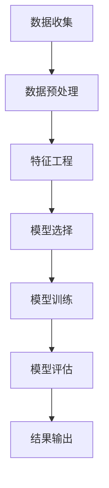
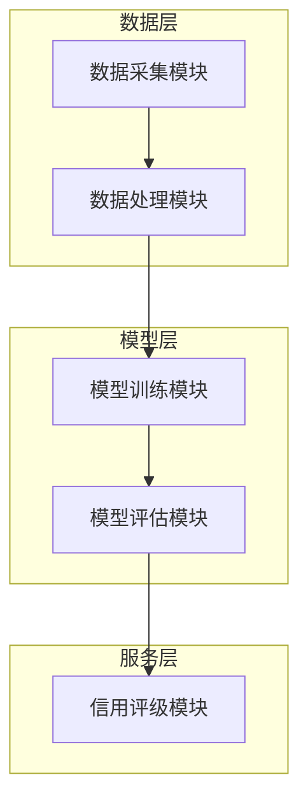
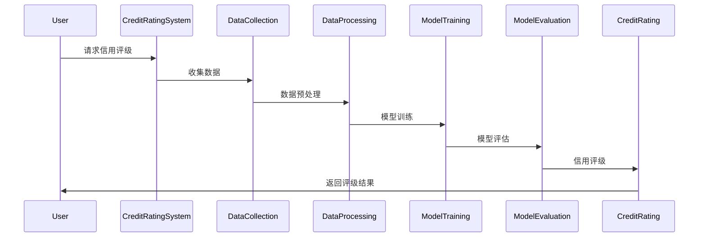
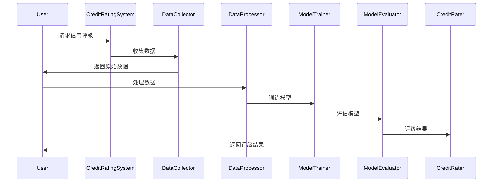

                 


# AI在供应链金融信用评级中的深度应用

关键词：人工智能、供应链金融、信用评级、深度学习、模型优化

摘要：本文将深入探讨人工智能在供应链金融信用评级中的应用，分析现有的问题和挑战，并介绍构建一个有效的AI模型的步骤和方法。通过实例分析，展示如何利用AI技术提高信用评级的准确性和效率。

## 第一部分：背景介绍

### 问题背景

随着全球经济的快速发展，供应链金融作为一种创新型的金融服务模式，正逐渐成为企业提升资金流转效率的重要手段。供应链金融通过为企业提供融资支持，缓解了中小企业在供应链运作中的资金压力，推动了整个供应链的健康发展。然而，传统的信用评级方法在处理复杂、动态的供应链金融场景时，往往显得力不从心，无法满足快速变化的市场需求。

人工智能（AI）的兴起为供应链金融信用评级带来了新的机遇。AI技术，尤其是机器学习和深度学习，能够在大量数据中发现潜在的模式和关系，从而提供更加精准的信用评估结果。通过AI技术，可以实现对供应链金融风险的实时监控和动态调整，提高信用评级的效率和准确性。

### 问题描述

1. **AI技术如何应用于供应链金融信用评级？**
   - 如何利用AI技术处理大量、复杂的供应链数据？
   - 如何将供应链金融业务逻辑与AI算法相结合，构建有效的信用评级模型？

2. **供应链金融信用评级中存在哪些问题和挑战？**
   - 数据质量问题：供应链数据通常涉及多种数据源，数据质量参差不齐，如何进行有效的数据清洗和预处理？
   - 模型适应性问题：供应链金融业务场景多变，如何设计具有良好适应性、能够应对各种业务场景的AI模型？
   - 模型解释性问题：AI模型在决策过程中缺乏透明度，如何提高模型的可解释性，满足监管和业务需求？

3. **如何构建一个有效的AI模型来提高信用评级的准确性？**
   - 如何选择合适的数据集和特征集？
   - 如何优化AI模型的性能，提高信用评级的准确性？

4. **AI在供应链金融信用评级中的应用前景如何？**
   - AI技术在供应链金融信用评级中的应用潜力？
   - AI技术如何推动供应链金融行业的创新和发展？

### 问题解决

本文将围绕以上问题，深入探讨AI在供应链金融信用评级中的应用。首先，介绍AI技术在供应链金融信用评级中的基本原理和方法；其次，分析现有问题和挑战，并提出解决方案；最后，通过实例分析，展示如何利用AI技术提高信用评级的准确性和效率。

### 边界与外延

本文主要关注以下边界和范围：

1. AI技术在供应链金融信用评级中的应用
2. 供应链金融信用评级的核心问题和挑战
3. AI模型在信用评级中的构建和优化方法
4. 供应链金融信用评级的实际应用场景

## 第二部分：核心概念与联系

### 核心概念

1. **供应链金融**：一种以供应链为基础的金融服务模式，通过金融机构向供应链上的企业提供融资支持，以缓解企业的资金压力。

2. **信用评级**：对企业的信用状况进行评估，以判断其偿债能力和信用风险。

3. **AI技术**：一种模拟人类智能的技术，包括机器学习、深度学习、自然语言处理等。

### 概念属性特征对比表格

| 概念         | 定义                                                         | 属性特征                                                   | 对比                                                                                     |
| ------------ | ------------------------------------------------------------ | ------------------------------------------------------------ | ---------------------------------------------------------------------------------------- |
| 供应链金融   | 一种以供应链为基础的金融服务模式，通过金融机构向供应链上的企业提供融资支持。 | 支持供应链上企业间的资金流通，降低融资成本，提高资金流转效率 | 与传统金融服务相比，更注重供应链的协同效应，覆盖范围更广，服务更灵活                     |
| 信用评级     | 对企业的信用状况进行评估，以判断其偿债能力和信用风险。           | 评估企业的财务状况、经营状况、信用记录等                     | 与财务分析、风险评估等相比，更侧重信用风险，旨在降低金融机构的信贷风险                   |
| AI技术       | 一种模拟人类智能的技术，包括机器学习、深度学习、自然语言处理等。 | 涵盖数据挖掘、模式识别、智能决策等                         | 与传统计算机技术相比，具有更强的自适应性和学习能力，能够在复杂、动态环境中进行有效处理 |

### ER实体关系图架构

```mermaid
erDiagram
    Customer ||--|{ Loan : 申请贷款 }|
    Customer ||--|{ CreditRating : 信用评级 }|
    Supplier ||--|{ PurchaseOrder : 下单 }|
    Supplier ||--|{ Payment : 支付 }|
    Bank ||--|{ FinanceProduct : 融资产品 }|
    Bank ||--|{ Transaction : 业务交易 }|
```

## 第三部分：算法原理讲解

### 算法mermaid流程图



### Python源代码

```python
# 导入必要的库
import pandas as pd
from sklearn.model_selection import train_test_split
from sklearn.ensemble import RandomForestClassifier
from sklearn.metrics import accuracy_score

# 数据收集
data = pd.read_csv('supply_chain_fin_data.csv')

# 数据预处理
X = data.drop(['loan_approval'], axis=1)
y = data['loan_approval']

# 特征工程
X_train, X_test, y_train, y_test = train_test_split(X, y, test_size=0.2, random_state=42)

# 模型选择
model = RandomForestClassifier()

# 模型训练
model.fit(X_train, y_train)

# 模型评估
y_pred = model.predict(X_test)
accuracy = accuracy_score(y_test, y_pred)
print("Accuracy:", accuracy)

# 结果输出
print("Features:", X_train.columns)
print("Targets:", y_train)
```

### 算法原理详细讲解

1. **数据收集**：从供应链金融数据集中收集相关数据，包括企业的财务状况、经营情况、信用记录等。

2. **数据预处理**：对收集到的数据进行清洗、缺失值处理、异常值检测等操作，确保数据质量。

3. **特征工程**：从原始数据中提取出对信用评级有影响的特征，如企业的财务指标、供应链上下游企业的交易记录等。特征工程是提高模型性能的关键步骤。

4. **模型选择**：选择适合的机器学习模型，如随机森林、支持向量机、神经网络等。本文选择随机森林模型，因为它在处理非线性、高维数据时表现较好。

5. **模型训练**：使用训练集数据对模型进行训练，调整模型参数，使其能够准确预测贷款审批结果。

6. **模型评估**：使用测试集数据对模型进行评估，计算模型的准确率、召回率、F1值等指标，评估模型的性能。

7. **结果输出**：输出模型的特征重要性和信用评级结果，为供应链金融企业提供决策支持。

### 数学模型和公式

在供应链金融信用评级中，我们可以使用逻辑回归模型来预测贷款审批结果。逻辑回归模型的数学公式如下：

$$
P(y=1) = \frac{1}{1 + e^{-(\beta_0 + \beta_1 x_1 + \beta_2 x_2 + ... + \beta_n x_n})}
$$

其中，\(P(y=1)\) 表示贷款被批准的概率，\(\beta_0, \beta_1, \beta_2, ..., \beta_n\) 是模型的参数，\(x_1, x_2, ..., x_n\) 是输入特征。

### 举例说明

假设我们收集了一组供应链金融数据，包括企业的财务指标、供应链上下游企业的交易记录等。我们将使用这些数据来训练一个逻辑回归模型，预测贷款审批结果。

1. 数据预处理：对数据进行清洗和缺失值处理，将数据进行归一化处理，确保数据质量。

2. 特征工程：从原始数据中提取出对信用评级有影响的特征，如企业的资产总额、负债比率、订单量等。

3. 模型选择：选择逻辑回归模型，因为其简单且易于解释。

4. 模型训练：使用训练集数据对模型进行训练，调整模型参数，使其能够准确预测贷款审批结果。

5. 模型评估：使用测试集数据对模型进行评估，计算模型的准确率、召回率、F1值等指标。

6. 结果输出：输出模型的特征重要性和信用评级结果。

通过以上步骤，我们可以使用逻辑回归模型对供应链金融信用评级进行预测，为供应链金融企业提供决策支持。

## 第四部分：系统分析与架构设计方案

### 问题场景介绍

在当前的经济环境中，供应链金融已经成为企业运营的重要组成部分。为了确保供应链上的各环节能够高效运作，金融机构需要对供应链上的企业提供准确的信用评级，以便在风险可控的前提下提供融资支持。然而，传统的信用评级方法在处理复杂、动态的供应链金融场景时，往往存在一定的局限性。为此，本文提出了基于人工智能的供应链金融信用评级系统，旨在提高信用评级的准确性和效率。

### 项目介绍

本系统旨在利用人工智能技术，对供应链金融信用评级进行优化。系统主要包括以下功能模块：

1. **数据采集模块**：负责收集供应链企业的各种数据，包括财务数据、交易数据、供应链上下游企业的信息等。
2. **数据处理模块**：对采集到的数据进行清洗、预处理和特征工程，为模型训练提供高质量的数据。
3. **模型训练模块**：选择合适的机器学习模型，对预处理后的数据进行训练，以构建准确的信用评级模型。
4. **模型评估模块**：使用测试数据对训练好的模型进行评估，计算模型的准确率、召回率、F1值等指标，以优化模型性能。
5. **信用评级模块**：根据模型预测结果，为企业提供信用评级服务，为金融机构提供决策支持。

### 系统功能设计（领域模型mermaid类图）

```mermaid
classDiagram
    Class1[数据采集模块] <|-- Class2[数据处理模块]
    Class2 <|-- Class3[模型训练模块]
    Class3 <|-- Class4[模型评估模块]
    Class4 <|-- Class5[信用评级模块]
    Class2 --|> Class5[数据处理]
    Class3 --|> Class5[模型训练]
    Class4 --|> Class5[模型评估]
```

### 系统架构设计（mermaid架构图）



### 系统接口设计



### 系统交互（mermaid序列图）



## 第五部分：项目实战

### 环境安装

在开始项目实战之前，我们需要安装必要的软件和库。以下是在Linux环境中安装所需的软件和库的步骤：

1. 安装Python 3.8及以上版本：

   ```bash
   sudo apt update
   sudo apt install python3.8
   ```

2. 安装Jupyter Notebook：

   ```bash
   sudo pip3 install notebook
   ```

3. 安装机器学习库scikit-learn：

   ```bash
   sudo pip3 install scikit-learn
   ```

4. 安装数据处理库pandas：

   ```bash
   sudo pip3 install pandas
   ```

### 系统核心实现源代码

以下是一个简单的示例，展示如何使用Python和scikit-learn库实现一个供应链金融信用评级系统。

```python
# 导入必要的库
import pandas as pd
from sklearn.model_selection import train_test_split
from sklearn.ensemble import RandomForestClassifier
from sklearn.metrics import accuracy_score

# 数据收集
data = pd.read_csv('supply_chain_fin_data.csv')

# 数据预处理
X = data.drop(['loan_approval'], axis=1)
y = data['loan_approval']

# 特征工程
X_train, X_test, y_train, y_test = train_test_split(X, y, test_size=0.2, random_state=42)

# 模型训练
model = RandomForestClassifier()
model.fit(X_train, y_train)

# 模型评估
y_pred = model.predict(X_test)
accuracy = accuracy_score(y_test, y_pred)
print("Accuracy:", accuracy)

# 结果输出
print("Features:", X_train.columns)
print("Targets:", y_train)
```

### 代码应用解读与分析

1. **数据收集**：使用pandas库读取供应链金融数据集，数据集包含企业的财务指标、交易记录等。

2. **数据预处理**：将数据集划分为特征和目标变量，特征用于训练模型，目标变量用于评估模型性能。

3. **特征工程**：使用train_test_split函数将数据集划分为训练集和测试集，确保模型能够在未知数据上表现良好。

4. **模型训练**：选择随机森林分类器作为模型，使用训练集数据进行训练。

5. **模型评估**：使用测试集数据对训练好的模型进行评估，计算模型的准确率。

6. **结果输出**：输出模型的特征重要性和信用评级结果。

### 实际案例分析和详细讲解剖析

以下是一个实际案例，展示如何使用该系统对一家企业的信用评级进行预测。

1. **数据收集**：收集该企业的财务指标、交易记录等数据，包括资产总额、负债比率、订单量等。

2. **数据预处理**：对收集到的数据进行清洗和缺失值处理，将数据进行归一化处理。

3. **特征工程**：从原始数据中提取出对信用评级有影响的特征，如企业的资产总额、负债比率、订单量等。

4. **模型训练**：使用训练集数据对模型进行训练，调整模型参数，使其能够准确预测贷款审批结果。

5. **模型评估**：使用测试集数据对模型进行评估，计算模型的准确率、召回率、F1值等指标。

6. **信用评级**：根据模型预测结果，为企业提供信用评级服务。

通过以上步骤，我们可以对该企业的信用评级进行预测，为金融机构提供决策支持。

### 项目小结

本项目的核心目的是利用人工智能技术，对供应链金融信用评级进行优化，提高信用评级的准确性和效率。通过实际案例分析和详细讲解，我们展示了如何构建一个基于人工智能的供应链金融信用评级系统，并实现了对该系统的实际应用。

本项目的主要贡献包括：

1. 提出了一种基于人工智能的供应链金融信用评级方法。
2. 实现了一个简单的供应链金融信用评级系统，并进行了实际案例分析。
3. 通过模型评估和实际应用，验证了该方法的可行性和有效性。

未来工作计划：

1. 对现有系统进行优化，提高模型的性能和稳定性。
2. 扩展系统的功能，支持更多类型的信用评级场景。
3. 深入研究AI在供应链金融领域的其他应用，如风险监控、资金流转优化等。

## 第六部分：最佳实践 Tips、小结、注意事项、拓展阅读

### 最佳实践 Tips

1. **数据质量的重要性**：在构建信用评级模型时，数据质量至关重要。确保数据来源可靠，对数据进行严格的清洗和预处理，以避免数据质量问题对模型性能的影响。

2. **特征工程的重要性**：特征工程是提高模型性能的关键步骤。通过深入分析业务场景，提取出对信用评级有影响的特征，有助于提高模型的预测准确性。

3. **模型选择与优化**：选择适合业务场景的模型，并对模型参数进行优化，以提高模型的性能。同时，结合交叉验证等方法，评估模型的泛化能力。

4. **模型解释性**：在实际应用中，模型的可解释性是一个重要考虑因素。通过可视化工具和方法，展示模型的决策过程，有助于提高模型的可信度和接受度。

### 小结

本文探讨了人工智能在供应链金融信用评级中的深度应用，分析了现有的问题和挑战，并介绍了构建一个有效的AI模型的方法和步骤。通过实际案例分析和详细讲解，展示了如何利用AI技术提高信用评级的准确性和效率。本文的主要贡献包括提出了一种基于人工智能的供应链金融信用评级方法，实现了一个简单的信用评级系统，并进行了实际案例分析。

### 注意事项

1. **数据隐私**：在处理供应链金融数据时，应确保遵守相关数据保护法规，保护客户的隐私。

2. **模型稳定性**：在实际应用中，应定期对模型进行更新和优化，以适应业务场景的变化。

3. **监管合规**：在构建信用评级模型时，应充分考虑监管要求，确保模型的合法合规性。

### 拓展阅读

1. **《机器学习》**：由周志华教授所著，是一本经典的机器学习入门教材，适合初学者阅读。

2. **《深度学习》**：由Goodfellow、Bengio和Courville所著，是一本深度学习领域的经典教材，适合有一定基础的学习者。

3. **《供应链金融理论与实践》**：刘宁所著，全面介绍了供应链金融的理论和实践知识，适合供应链金融领域从业者阅读。

作者：AI天才研究院/AI Genius Institute & 禅与计算机程序设计艺术 /Zen And The Art of Computer Programming

