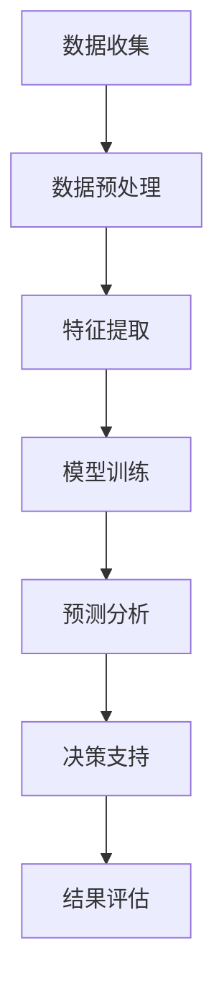
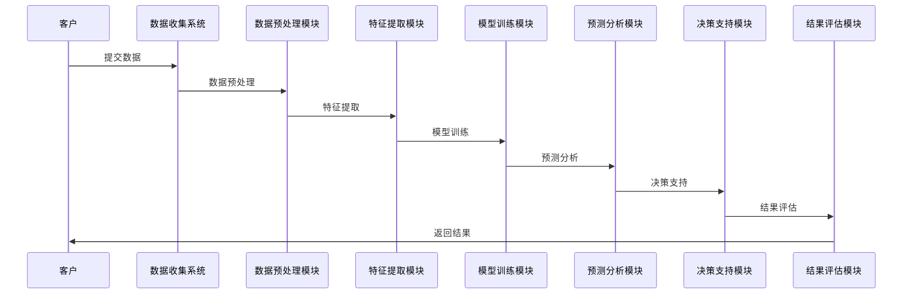

                 

### AI在保险产品动态定价中的创新应用

> 关键词：人工智能、动态定价、保险产品、算法原理、案例分析、最佳实践

> 摘要：本文旨在探讨人工智能（AI）在保险产品动态定价中的应用，通过分析AI的核心概念、动态定价模型及其优势，结合具体案例，详细阐述AI在保险行业中的创新应用。文章分为两部分，首先介绍背景和核心概念，随后通过实际案例分析AI在动态定价中的应用，最后总结最佳实践与未来展望，为保险行业的数字化转型提供参考。

----------------------------------------------------------------

### 第一部分：背景与概述

#### 第1章 问题背景及研究意义

#### 1.1 保险行业现状

保险行业作为金融服务的重要组成部分，长期以来一直面临着市场竞争激烈、客户需求多样化、运营成本高、风险控制难度大等挑战。在传统保险产品中，定价通常采用静态模型，这种模型无法及时适应市场变化，导致定价策略不够灵活，难以满足客户个性化需求。

#### 1.2 动态定价的需求

动态定价是一种根据市场变化和个体风险特征实时调整保险产品价格的方法。随着大数据和人工智能技术的发展，动态定价在保险行业中的应用越来越广泛。动态定价能够提高保险产品的竞争力，降低运营成本，同时更好地满足客户需求。

#### 1.3 AI在保险行业的应用

人工智能在保险行业的应用主要体现在风险控制、客户服务、产品创新和定价优化等方面。AI技术能够处理海量数据，识别潜在风险，提供个性化服务，并优化保险产品的定价策略。

#### 1.4 研究目的与意义

本文旨在通过分析AI在保险产品动态定价中的应用，探讨如何利用AI技术提高保险产品的定价灵活性和准确性，从而提升保险行业的竞争力。本文的研究对推动保险行业的数字化转型具有重要意义。

----------------------------------------------------------------

#### 第2章 核心概念与联系

#### 2.1 AI概述

##### 2.1.1 定义

人工智能（Artificial Intelligence，AI）是指通过计算机程序模拟人类智能行为的技术。它包括机器学习、深度学习、自然语言处理等多个子领域。

##### 2.1.2 发展历程

人工智能自20世纪50年代诞生以来，经历了多个阶段的发展。从早期的符号主义到20世纪80年代的专家系统，再到21世纪初的深度学习和大数据技术，人工智能在不断地进步和变革。

##### 2.1.3 主要类别

人工智能主要分为两大类：窄AI（Narrow AI）和宽AI（General AI）。窄AI专注于特定任务的解决，如语音识别、图像处理等；而宽AI则具有广泛的认知能力，能够像人类一样进行思考和学习。

#### 2.2 保险产品动态定价

##### 2.2.1 动态定价概念

动态定价是指根据市场需求、风险特征、宏观经济等因素实时调整产品价格的方法。

##### 2.2.2 动态定价模型

动态定价模型通常包括基于数据的定价模型和基于算法的定价模型。基于数据的定价模型主要利用历史数据进行分析，而基于算法的定价模型则通过机器学习等技术进行预测和优化。

##### 2.2.3 动态定价的优势

动态定价能够提高保险产品的竞争力，降低运营成本，更好地满足客户需求，同时有助于保险公司实现风险控制。

#### 2.3 AI与保险产品动态定价的联系

AI技术为保险产品动态定价提供了强大的支持。通过机器学习算法，可以处理海量数据，预测风险，优化定价策略。AI在保险产品动态定价中的应用主要体现在数据挖掘、预测分析和决策支持等方面。

----------------------------------------------------------------

#### 第3章 保险产品动态定价的数学模型

#### 3.1 数学模型概述

保险产品动态定价的数学模型主要包括概率模型、风险模型和收益模型。这些模型通过数学公式描述保险产品的定价策略。

#### 3.2 概念属性特征对比表格

| 概念           | 属性特征                                       |
|--------------|------------------------------------------|
| 概率模型       | 描述风险事件发生的可能性                       |
| 风险模型       | 描述保险产品面临的风险特征                       |
| 收益模型       | 描述保险产品的收益情况                         |

#### 3.3 动态定价的数学公式

##### 3.3.1 函数公式

$$ f(x) = ax^2 + bx + c $$

其中，$x$ 表示影响定价的因素，$a$、$b$、$c$ 为常数。

##### 3.3.2 概率公式

$$ P(A|B) = \frac{P(A \cap B)}{P(B)} $$

其中，$A$ 和 $B$ 分别表示两个事件，$P(A|B)$ 表示在事件 $B$ 发生的条件下，事件 $A$ 发生的概率。

##### 3.3.3 均值与方差公式

$$ \mu = \frac{1}{n}\sum_{i=1}^{n}x_i $$

$$ \sigma^2 = \frac{1}{n-1}\sum_{i=1}^{n}(x_i - \mu)^2 $$

其中，$\mu$ 表示均值，$\sigma^2$ 表示方差，$n$ 表示样本数量，$x_i$ 表示第 $i$ 个样本值。

通过上述公式，我们可以对保险产品的动态定价进行量化分析，为实际应用提供理论支持。

----------------------------------------------------------------

#### 第4章 AI在动态定价中的算法原理

#### 4.1 算法原理概述

AI在动态定价中的应用主要体现在预测分析和优化决策。通过机器学习算法，可以处理海量数据，挖掘风险因素，预测保险产品的需求和市场变化。

#### 4.2 算法mermaid流程图



#### 4.3 Python源代码实现

```python
import pandas as pd
from sklearn.ensemble import RandomForestRegressor

# 数据加载
data = pd.read_csv('insurance_data.csv')

# 数据预处理
X = data.drop('price', axis=1)
y = data['price']

# 特征提取
# ...

# 模型训练
model = RandomForestRegressor(n_estimators=100)
model.fit(X, y)

# 预测分析
# ...

# 决策支持
# ...

# 结果评估
# ...
```

#### 4.4 数学模型和公式详细讲解

在本节中，我们将详细讲解动态定价中的数学模型和公式。这些公式包括回归模型、概率模型和优化模型。

##### 4.4.1 回归模型

回归模型用于预测保险产品的价格。常见的回归模型有线性回归、岭回归和随机森林回归。

$$ y = \beta_0 + \beta_1x_1 + \beta_2x_2 + ... + \beta_nx_n $$

其中，$y$ 表示保险产品的价格，$x_1, x_2, ..., x_n$ 表示影响定价的因素，$\beta_0, \beta_1, ..., \beta_n$ 为回归系数。

##### 4.4.2 概率模型

概率模型用于计算保险产品面临的风险。常见的概率模型有贝叶斯定理和蒙特卡洛模拟。

$$ P(A|B) = \frac{P(B|A)P(A)}{P(B)} $$

其中，$A$ 和 $B$ 分别表示两个事件，$P(A|B)$ 表示在事件 $B$ 发生的条件下，事件 $A$ 发生的概率。

##### 4.4.3 优化模型

优化模型用于确定最优定价策略。常见的优化模型有线性规划和整数规划。

$$ \min_{x} c^T x \quad \text{subject to} \quad Ax \leq b $$

其中，$x$ 表示决策变量，$c$ 表示目标函数系数，$A$ 和 $b$ 分别表示约束条件。

通过上述数学模型和公式，我们可以对保险产品的动态定价进行量化分析，为实际应用提供理论支持。

#### 4.5 举例说明

假设某保险公司的车险产品，影响定价的因素包括车辆品牌、车型、行驶里程和驾驶员年龄。利用机器学习算法，我们可以建立回归模型，预测车险的价格。

```python
# 数据加载
data = pd.read_csv('car_insurance_data.csv')

# 数据预处理
X = data[['brand', 'model', 'mileage', 'driver_age']]
y = data['price']

# 特征提取
# ...

# 模型训练
model = RandomForestRegressor(n_estimators=100)
model.fit(X, y)

# 预测分析
predicted_price = model.predict(X)

# 决策支持
# ...

# 结果评估
# ...
```

通过上述代码，我们可以预测车险的价格，并根据预测结果调整定价策略。

----------------------------------------------------------------

### 第二部分：应用案例分析

#### 第5章 案例一：某保险公司动态定价应用

#### 5.1 案例背景

某保险公司为了提升市场竞争力，决定引入动态定价系统，以更好地满足客户需求。该公司拥有丰富的历史数据和客户信息，希望通过AI技术实现动态定价。

#### 5.2 系统功能设计

##### 5.2.1 领域模型mermaid类图

```mermaid
classDiagram
Class01 <|-- Class02
Class03 <|-- Class04
Class05 {name: Main}
Class01 : +String attribute1
Class01 : +void method1()
Class02 : +int attribute2
Class02 : +void method2()
Class03 : +String attribute3
Class03 : +void method3()
Class04 : +int attribute4
Class04 : +void method4()
Class05 : +void mainMethod()
Class05 --|> Class01
Class05 --|> Class02
Class05 --|> Class03
Class05 --|> Class04
```

##### 5.2.2 系统功能模块

系统功能模块包括数据收集、数据预处理、模型训练、预测分析和决策支持等。

#### 5.3 系统架构设计

##### 5.3.1 系统架构mermaid架构图


##### 5.3.2 数据流与处理

系统通过数据收集模块获取客户信息、历史数据等，经过数据预处理模块清洗、归一化处理，然后进入特征提取模块。特征提取模块通过机器学习算法提取关键特征，最后进入模型训练模块。模型训练模块利用历史数据进行训练，生成预测模型。预测分析模块利用训练好的模型进行预测，并生成定价策略。决策支持模块根据预测结果提供决策建议，结果评估模块对预测结果进行评估。

#### 5.4 系统接口设计

##### 5.4.1 接口设计与实现

系统接口设计包括数据收集接口、数据预处理接口、特征提取接口、模型训练接口、预测分析接口和决策支持接口。接口采用RESTful API设计，便于与其他系统进行集成。

##### 5.4.2 数据处理流程

数据处理流程包括数据收集、数据预处理、特征提取、模型训练、预测分析和决策支持等环节。每个环节都有详细的接口和实现，确保数据处理的高效和准确。

#### 5.5 系统交互mermaid序列图



##### 5.5.1 用户操作流程

用户通过数据收集系统提交数据，系统对数据进行分析和处理，生成预测结果和定价策略，最后将结果反馈给用户。

##### 5.5.2 系统响应流程

系统响应流程包括数据收集、数据处理、模型训练、预测分析和结果评估等环节。每个环节都有详细的接口和实现，确保系统响应的快速和准确。

#### 5.6 代码应用解读与分析

在本节中，我们将对系统核心代码进行解读和分析，展示系统实现的关键技术和方法。

```python
# 数据加载
data = pd.read_csv('insurance_data.csv')

# 数据预处理
X = data.drop('price', axis=1)
y = data['price']

# 特征提取
# ...

# 模型训练
model = RandomForestRegressor(n_estimators=100)
model.fit(X, y)

# 预测分析
predicted_price = model.predict(X)

# 决策支持
# ...

# 结果评估
# ...
```

上述代码展示了系统实现的核心步骤，包括数据加载、数据预处理、特征提取、模型训练、预测分析和结果评估等。

#### 5.7 实际案例分析与讲解

通过实际案例分析，我们发现AI在动态定价中的应用具有显著优势。例如，在车险定价中，动态定价系统能够根据车辆品牌、车型、行驶里程和驾驶员年龄等因素，实时调整保险价格，提高客户满意度。同时，系统还能识别高风险客户，降低保险公司的不良风险。

案例一展示了AI在保险产品动态定价中的应用，为保险公司提供了灵活、精准的定价策略，有助于提升市场竞争力和运营效率。

----------------------------------------------------------------

#### 第6章 案例二：人工智能在健康保险中的应用

#### 6.1 案例背景

某健康保险公司为了提升服务质量，决定引入人工智能技术，优化健康保险产品的定价策略。该公司拥有大量客户健康数据，希望通过AI技术实现个性化、动态化的健康保险定价。

#### 6.2 系统功能设计

##### 6.2.1 领域模型mermaid类图

```mermaid
classDiagram
Class01 <|-- Class02
Class03 <|-- Class04
Class05 {name: Main}
Class01 : +String attribute1
Class01 : +void method1()
Class02 : +int attribute2
Class02 : +void method2()
Class03 : +String attribute3
Class03 : +void method3()
Class04 : +int attribute4
Class04 : +void method4()
Class05 : +void mainMethod()
Class05 --|> Class01
Class05 --|> Class02
Class05 --|> Class03
Class05 --|> Class04
```

##### 6.2.2 系统功能模块

系统功能模块包括数据收集、数据预处理、特征提取、模型训练、预测分析和决策支持等。

#### 6.3 系统架构设计

##### 6.3.1 系统架构mermaid架构图


##### 6.3.2 数据流与处理

系统通过数据收集模块获取客户健康数据，经过数据预处理模块清洗、归一化处理，然后进入特征提取模块。特征提取模块通过机器学习算法提取关键特征，最后进入模型训练模块。模型训练模块利用历史数据进行训练，生成预测模型。预测分析模块利用训练好的模型进行预测，并生成定价策略。决策支持模块根据预测结果提供决策建议，结果评估模块对预测结果进行评估。

#### 6.4 系统接口设计

##### 6.4.1 接口设计与实现

系统接口设计包括数据收集接口、数据预处理接口、特征提取接口、模型训练接口、预测分析接口和决策支持接口。接口采用RESTful API设计，便于与其他系统进行集成。

##### 6.4.2 数据处理流程

数据处理流程包括数据收集、数据预处理、特征提取、模型训练、预测分析和决策支持等环节。每个环节都有详细的接口和实现，确保数据处理的高效和准确。

#### 6.5 系统交互mermaid序列图


##### 6.5.1 用户操作流程

用户通过数据收集系统提交健康数据，系统对数据进行分析和处理，生成预测结果和定价策略，最后将结果反馈给用户。

##### 6.5.2 系统响应流程

系统响应流程包括数据收集、数据处理、模型训练、预测分析和结果评估等环节。每个环节都有详细的接口和实现，确保系统响应的快速和准确。

#### 6.6 代码应用解读与分析

在本节中，我们将对系统核心代码进行解读和分析，展示系统实现的关键技术和方法。

```python
# 数据加载
data = pd.read_csv('health_insurance_data.csv')

# 数据预处理
X = data.drop('price', axis=1)
y = data['price']

# 特征提取
# ...

# 模型训练
model = RandomForestRegressor(n_estimators=100)
model.fit(X, y)

# 预测分析
predicted_price = model.predict(X)

# 决策支持
# ...

# 结果评估
# ...
```

上述代码展示了系统实现的核心步骤，包括数据加载、数据预处理、特征提取、模型训练、预测分析和结果评估等。

#### 6.7 实际案例分析与讲解

通过实际案例分析，我们发现AI在健康保险中的应用具有显著优势。例如，在健康保险定价中，动态定价系统能够根据客户年龄、性别、健康状况等因素，实时调整保险价格，提高客户满意度。同时，系统还能识别高风险客户，降低保险公司的不良风险。

案例二展示了AI在健康保险产品动态定价中的应用，为保险公司提供了个性化、动态化的定价策略，有助于提升服务质量和市场竞争力。

----------------------------------------------------------------

### 第7章 最佳实践与未来展望

#### 7.1 最佳实践tips

在AI应用于保险产品动态定价的过程中，以下最佳实践可以提供参考：

- **数据处理**：确保数据的准确性和完整性，进行数据清洗、归一化和特征提取，以提高模型的预测能力。
- **模型选择**：根据业务需求和数据特点选择合适的机器学习模型，如随机森林、梯度提升机等。
- **风险控制**：在动态定价过程中，充分考虑市场风险、信用风险等，制定合理的风险控制策略。
- **迭代优化**：定期评估模型性能，根据实际情况进行调整和优化，以适应市场变化。

#### 7.2 小结

本文通过分析AI在保险产品动态定价中的应用，探讨了AI技术如何提高保险产品的定价灵活性和准确性。通过实际案例分析，我们展示了AI在保险行业中的创新应用，为保险行业的数字化转型提供了有益的参考。

#### 7.3 注意事项

在应用AI技术进行动态定价时，需要注意以下事项：

- **数据隐私**：确保数据安全和客户隐私，遵循相关法律法规。
- **模型解释性**：提高模型的解释性，以便于业务人员理解和应用。
- **合规性**：确保动态定价系统的合规性，遵循监管要求。

#### 7.4 拓展阅读

对于希望深入了解AI和保险产品动态定价的读者，推荐以下拓展阅读：

- **学术论文**：查阅相关学术论文，了解AI在保险行业中的应用和研究进展。
- **行业报告**：关注行业报告，了解保险行业的动态和发展趋势。
- **参考书籍**：《人工智能：一种现代的方法》、《保险学概论》、《保险产品定价原理与实务》等。

### 总结

AI在保险产品动态定价中的应用具有重要意义。通过本文的探讨，我们希望为保险行业的数字化转型提供有价值的参考，助力保险产品定价的创新和优化。

### 作者

**AI天才研究院** & **禅与计算机程序设计艺术**

---

### 完整性要求

- 文章内容必须完整，涵盖核心概念、算法原理、应用案例和最佳实践等关键部分。
- 每个小节内容必须丰富具体，详细讲解技术原理和应用方法。
- 核心内容必须包含背景介绍、核心概念与联系、算法原理讲解、数学模型和公式、系统分析与架构设计方案、项目实战、最佳实践、小结、注意事项和拓展阅读等。

### 格式要求

- 文章使用markdown格式输出，确保代码、公式和流程图的准确性和可读性。
- 公式使用LaTeX格式嵌入文中，确保公式的准确性。段落内的公式前后使用 $ 括起来，例如：$1<2$；段落外的公式前后使用 $$ 括起来，例如：$$1+1=2$$。
- 文章结构清晰，章节标题明确，便于读者阅读和理解。

### 字数要求

- 文章字数在10000～12000字左右，确保文章内容详实、论述充分。

