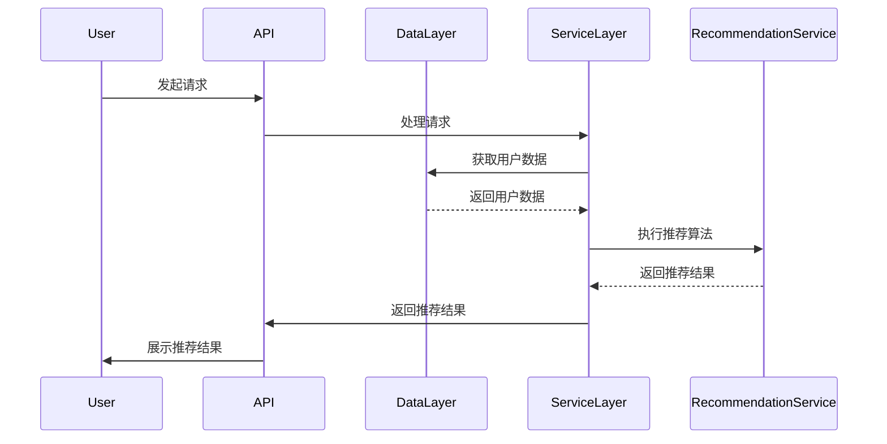
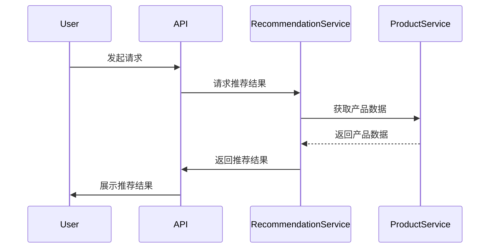

                 

## 引言

### 保险行业面临的挑战

保险行业作为金融服务的重要一环，一直以来都在为个人和企业提供风险保障。然而，随着全球经济的快速发展，以及人们保险意识的提高，保险行业也面临着前所未有的挑战和机遇。传统的保险业务模式在应对这些变化时显得力不从心，主要表现在以下几个方面：

1. **市场需求变化**：消费者的保险需求日益多样化和个性化，他们期望保险产品能够更好地满足其独特的风险保障需求。然而，传统保险产品的设计周期较长，很难迅速响应市场需求的变化。

2. **竞争加剧**：随着互联网和科技的快速发展，新兴的保险科技公司不断涌现，它们利用大数据、人工智能等技术，推出更加灵活和个性化的保险产品，对传统保险行业造成了巨大的竞争压力。

3. **运营成本高**：传统保险业务模式中，大量的业务流程依赖于人工操作，导致运营成本较高。例如，投保、理赔等环节都需要人工审核，效率低下且容易出现错误。

4. **风险评估困难**：保险产品的核心在于对风险进行评估和定价。然而，传统的风险评估方法往往依赖于历史数据和经验判断，难以精确预测未来的风险。

### AI在保险行业的应用潜力

为了应对上述挑战，保险行业开始积极探索人工智能（AI）技术的应用。AI技术具有强大的数据处理和分析能力，可以帮助保险公司提高运营效率、降低成本、提升服务质量。以下是一些AI在保险行业中的应用潜力：

1. **保险产品需求预测**：通过分析大量用户数据，AI可以预测消费者对不同保险产品的需求，从而帮助保险公司设计更加符合市场需求的产品。

2. **个性化推荐**：AI可以根据用户的个人数据和风险偏好，为用户推荐最适合的保险产品，提升用户体验和满意度。

3. **风险评估与定价**：AI可以通过机器学习算法分析历史数据和实时数据，更精确地评估风险，为保险产品定价提供科学依据。

4. **自动化理赔**：AI可以自动化处理理赔申请，通过智能审核和快速支付，提高理赔效率和用户体验。

### 书籍的目的与结构

本书旨在深入探讨AI在保险产品需求预测与个性化推荐中的深度应用。我们将通过以下章节来逐步展开讨论：

- **第一部分：引言**：介绍保险行业面临的挑战和AI在保险行业的应用潜力，明确本书的目的和结构。

- **第二部分：AI基础**：包括人工智能与深度学习基础、数据预处理与特征工程，为后续章节的应用提供理论基础。

- **第三部分：应用实践**：详细介绍保险产品需求预测和个性化推荐系统的算法原理、系统设计与实现，并通过实际案例进行剖析。

- **第四部分：最佳实践与展望**：总结本书的核心内容，提出未来的研究方向和最佳实践。

通过本书的阅读，读者将能够全面了解AI在保险行业中的应用，掌握相关算法原理和实践方法，为保险行业的发展贡献智慧和力量。

### 保险产品需求预测的概念

#### 定义与重要性

保险产品需求预测是指利用历史数据和机器学习算法，预测消费者对不同保险产品的需求量。这一概念的重要性体现在以下几个方面：

首先，保险产品需求预测能够帮助保险公司及时调整产品策略，以更好地满足市场变化。通过预测需求，保险公司可以优化产品组合，推出更受欢迎的保险产品，从而提升市场份额。

其次，需求预测有助于保险公司降低库存成本。传统的保险产品销售模式往往存在一定的库存压力，通过需求预测，保险公司可以更加精准地控制库存量，避免资源浪费。

此外，保险产品需求预测还能提升客户的满意度。精准的需求预测意味着保险公司能够更快速地响应客户需求，提供个性化的产品推荐，从而增强客户黏性和忠诚度。

#### 边界与外延

保险产品需求预测的边界主要包括以下几个方面：

- **数据边界**：需求预测依赖于大量的历史数据和实时数据，包括用户的购买记录、风险偏好、生活习惯等。数据的完整性、准确性和多样性直接影响预测的准确性。

- **时间边界**：需求预测通常考虑短期和长期的需求变化。短期预测可以帮助保险公司制定短期销售策略，而长期预测则用于产品设计和市场定位。

- **产品边界**：需求预测不仅限于单一产品，还可以应用于整个产品线。通过分析不同产品的需求关系，保险公司可以优化产品组合，提升整体竞争力。

#### 概念结构与核心要素组成

保险产品需求预测的概念结构主要包括以下几个核心要素：

- **数据收集与处理**：包括数据采集、数据清洗、数据整合等步骤，确保数据的质量和可用性。

- **特征工程**：通过提取和选择与需求相关的特征，构建预测模型的基础。

- **预测模型**：采用机器学习算法，如回归分析、时间序列分析、深度学习等，构建需求预测模型。

- **评估与优化**：通过评估模型的预测效果，调整模型参数，优化预测结果。

- **决策支持**：将预测结果应用于实际业务场景，如产品定价、库存管理、市场推广等。

通过以上核心要素的有机结合，保险产品需求预测能够为保险公司提供有力的决策支持，提升业务运营效率和客户满意度。

### 个性化推荐的概念

#### 定义与作用

个性化推荐是指利用用户的历史行为数据、偏好信息和其他相关数据，通过算法计算为用户推荐其可能感兴趣的产品、服务或内容。在保险行业，个性化推荐的作用主要体现在以下几个方面：

首先，个性化推荐能够提升用户体验。通过分析用户的偏好和需求，推荐系统可以为用户推荐最适合的保险产品，减少用户在产品选择上的时间和精力投入。

其次，个性化推荐有助于提高客户忠诚度。当用户在使用过程中感受到个性化服务时，他们更有可能成为回头客，增加与保险公司的互动和交易。

此外，个性化推荐还能帮助保险公司优化营销策略。通过了解用户的偏好和行为模式，保险公司可以制定更加精准的营销活动，提升营销效果和转化率。

#### 关联性与挑战

个性化推荐与保险产品需求预测之间存在着紧密的关联性。两者都是基于数据驱动的决策支持工具，旨在提高保险公司的运营效率和客户满意度。具体来说，个性化推荐可以通过以下方式与需求预测结合：

- **需求预测指导推荐**：通过预测用户未来的保险需求，推荐系统可以提前为用户推荐潜在感兴趣的产品，从而提高推荐的相关性。

- **用户行为数据共享**：需求预测和推荐系统可以共享用户行为数据，如购买记录、搜索历史等，从而提升两者的预测准确性和推荐效果。

然而，个性化推荐在保险行业中也面临着一些挑战：

- **隐私保护**：保险行业涉及用户的敏感信息，如何保护用户隐私成为个性化推荐系统面临的重要问题。

- **数据多样性**：保险产品种类繁多，如何处理用户多样化的偏好和需求，为每个用户提供个性化的推荐，是一个技术难题。

- **模型可靠性**：个性化推荐系统需要保证推荐结果的可靠性和公正性，避免算法偏见和误导用户。

#### 深度应用的价值

个性化推荐在保险行业的深度应用具有显著的价值：

- **提升销售转化率**：通过个性化推荐，保险公司能够将潜在客户引导至具体的产品页面，提高销售转化率。

- **降低营销成本**：个性化推荐可以减少传统营销方式中的无效投放，降低营销成本。

- **增强客户满意度**：精准的个性化推荐能够提高客户的满意度，增强客户对保险公司的信任和忠诚。

- **优化产品组合**：通过分析用户对推荐产品的反馈，保险公司可以优化产品组合，推出更受欢迎的产品。

总之，个性化推荐系统在保险行业的深度应用不仅能够提高业务运营效率，还能提升客户满意度和市场份额，为保险公司的可持续发展提供有力支持。

### 本书结构安排

#### 各章节主要内容概述

本书共分为四个主要部分，涵盖了AI在保险产品需求预测与个性化推荐中的深度应用。以下是各章节的主要内容概述：

- **第一部分：引言**：介绍保险行业面临的挑战和AI在保险行业的应用潜力，明确本书的目的和结构。

- **第二部分：AI基础**：包括人工智能与深度学习基础、数据预处理与特征工程，为后续章节的应用提供理论基础。

- **第三部分：应用实践**：详细介绍保险产品需求预测和个性化推荐系统的算法原理、系统设计与实现，并通过实际案例进行剖析。

- **第四部分：最佳实践与展望**：总结本书的核心内容，提出未来的研究方向和最佳实践。

#### 阅读建议与预期收益

本书旨在为广大读者提供系统、全面的AI在保险领域的应用指南。以下是阅读本书的建议和预期收益：

- **建议**：

  1. **系统学习**：按照本书的章节顺序系统学习，从基础理论到应用实践，逐步深入理解AI在保险领域的应用。

  2. **实践操作**：在阅读过程中，尝试使用本书提供的示例数据和代码进行实践操作，加深对理论知识的理解和应用。

  3. **互动交流**：加入本书的读者群或论坛，与其他读者交流心得，共同探讨AI在保险领域的应用难题。

- **预期收益**：

  1. **掌握AI基础知识**：通过第二部分的学习，读者将了解人工智能与深度学习的基本原理，为后续应用打下坚实基础。

  2. **提升数据分析能力**：通过第三部分的学习，读者将掌握数据预处理与特征工程的方法，能够有效地处理保险领域的复杂数据。

  3. **深入应用实践**：通过第三部分和第四部分的学习，读者将了解保险产品需求预测和个性化推荐系统的具体实现方法，并能够应用于实际业务场景。

  4. **拓宽职业发展**：本书提供的全面知识体系将有助于读者在AI和保险领域实现职业发展，成为行业内的专家。

通过本书的阅读，读者不仅能够掌握AI在保险领域的应用技术，还能深入了解这一领域的最新发展趋势，为保险行业的数字化转型贡献力量。

### 人工智能与深度学习基础

#### 人工智能概述

人工智能（Artificial Intelligence，简称AI）是计算机科学的一个分支，旨在使机器具备人类智能的能力，能够进行推理、学习、解决问题和模拟人类行为。人工智能的发展历程可以追溯到20世纪50年代，当时科学家们开始探索如何使计算机模拟人类思维过程。经过几十年的发展，人工智能在理论、技术和应用上都取得了显著的进步。

##### 定义与历史

人工智能的定义有多种，但普遍认为它是指计算机系统通过感知、理解和反应等方式来模拟人类智能。人工智能的发展可以分为以下几个阶段：

1. **早期探索（1950年代-1960年代）**：这一阶段的主要目标是开发能够模拟人类思维过程的程序，包括逻辑推理、问题解决和自然语言处理等。

2. **繁荣与挫折（1970年代-1980年代）**：由于硬件性能和算法的限制，人工智能的研究在70年代和80年代经历了一段繁荣期，但同时也面临着一些挫折，如专家系统的局限性。

3. **复苏与突破（1990年代-2000年代）**：随着计算机性能的提升和算法的改进，尤其是机器学习和深度学习的出现，人工智能在1990年代后期开始复苏，并在21世纪初取得了突破性进展。

4. **快速发展（2010年代至今）**：人工智能在近年来取得了显著的发展，尤其是在深度学习、自然语言处理、计算机视觉等领域，实现了许多令人瞩目的成果。

##### 分类与特点

人工智能可以根据其功能和应用领域分为多种类型：

1. **弱人工智能（Narrow AI）**：弱人工智能是指具有特定任务执行能力的智能系统，例如语音识别、图像识别、自然语言处理等。这类AI系统专注于解决特定问题，不具备广泛的应用能力。

2. **强人工智能（General AI）**：强人工智能是指具有全面认知能力、可以自主学习和适应各种环境的智能系统。目前，强人工智能还没有实现，仍然是未来人工智能研究的重要目标。

3. **混合智能（Hybrid AI）**：混合智能是指结合多种人工智能技术，形成具有更强大功能的智能系统。例如，将深度学习和传统规则相结合，提高智能系统的决策能力和适应性。

人工智能的特点包括：

- **自学习与自适应**：人工智能系统能够通过学习历史数据和经验，不断优化自身的性能。

- **泛化能力**：人工智能系统可以处理不同类型的数据和任务，具有较强的泛化能力。

- **自动化**：人工智能系统能够自动执行复杂的任务，减少人工干预。

##### 发展趋势与挑战

人工智能的发展趋势主要包括以下几个方面：

1. **深度学习与强化学习**：深度学习和强化学习是目前人工智能研究的热点领域，未来的发展将更加依赖于这些算法的改进和应用。

2. **跨学科融合**：人工智能与生物医学、认知科学、经济学等领域的融合将促进人工智能的多元化发展。

3. **硬件与算法优化**：随着硬件性能的提升和算法的优化，人工智能系统将变得更加高效和智能。

人工智能在发展过程中也面临一些挑战：

1. **数据隐私与安全**：人工智能系统对大量用户数据进行分析，如何保护用户隐私和安全是一个重要挑战。

2. **算法偏见**：人工智能系统可能因为数据偏见而导致不公平的决策，如何避免算法偏见是一个重要问题。

3. **伦理与法律**：随着人工智能的广泛应用，相关的伦理和法律问题日益突出，如何制定合理的伦理和法律框架是一个亟待解决的问题。

#### 深度学习基本原理

深度学习（Deep Learning）是人工智能的一个重要分支，通过构建多层神经网络（Neural Networks）来模拟人类大脑的神经网络结构，实现高效的数据处理和模式识别。深度学习的基本原理包括以下几个方面：

##### 神经网络基础

神经网络是由大量简单的计算单元（神经元）组成的复杂网络，这些神经元通过连接（权重）进行信息传递和处理。一个基本的神经网络结构包括输入层、隐藏层和输出层。

- **输入层**：接收输入数据，并将其传递给隐藏层。

- **隐藏层**：对输入数据进行加工和转换，隐藏层可以有一个或多个。

- **输出层**：生成最终输出结果。

神经网络的每个神经元都可以看作是一个简单的函数，通过加权求和和激活函数来处理输入信息。神经元的连接权重决定了信息传递的强度，通过反向传播算法（Backpropagation）不断调整权重，使神经网络能够学习并优化其性能。

##### 深度学习算法

深度学习算法主要包括以下几种：

1. **卷积神经网络（CNN）**：CNN是一种专门用于处理图像数据的深度学习模型，通过卷积操作和池化操作提取图像特征，广泛应用于图像识别、目标检测等领域。

2. **循环神经网络（RNN）**：RNN是一种用于处理序列数据的神经网络，通过在时间步间传递状态信息，实现长距离依赖关系的建模。RNN在自然语言处理、语音识别等领域具有广泛的应用。

3. **长短期记忆网络（LSTM）**：LSTM是RNN的一种改进模型，通过引入门控机制，解决了RNN的梯度消失和梯度爆炸问题，在处理长序列数据时表现出更好的性能。

4. **生成对抗网络（GAN）**：GAN是一种通过两个对抗网络（生成器和判别器）进行博弈的深度学习模型，主要用于生成新的数据，如生成图像、音频等。

##### 深度学习应用场景

深度学习在多个领域取得了显著的应用成果：

1. **计算机视觉**：深度学习在图像分类、目标检测、图像生成等领域取得了突破性进展，如人脸识别、自动驾驶等。

2. **自然语言处理**：深度学习在文本分类、机器翻译、情感分析等领域表现出强大的能力，如搜索引擎、聊天机器人等。

3. **语音识别**：深度学习通过模型如深度神经网络（DNN）和循环神经网络（RNN）实现了高精度的语音识别，广泛应用于语音助手、语音翻译等。

4. **推荐系统**：深度学习在推荐系统中被广泛应用于用户兴趣建模和个性化推荐，如电子商务平台、社交媒体等。

通过以上对人工智能和深度学习基本原理的介绍，我们可以看到，这些技术为保险产品需求预测和个性化推荐提供了强大的理论基础和工具支持。

#### Python与常用库

在深度学习与人工智能领域，Python语言因其简洁、高效和丰富的库支持而广受开发者青睐。本节将简要介绍Python的基础知识、常用深度学习库及其在数据处理与可视化中的应用。

##### Python简介

Python是一种高级编程语言，以其简洁明了的语法和强大的库支持而闻名。Python的设计哲学强调代码的可读性和简洁性，使得开发者能够用更少的代码实现复杂的功能。Python的主要特点包括：

- **简洁的语法**：Python的语法简单易学，使得开发者可以快速上手。

- **丰富的库支持**：Python拥有丰富的标准库和第三方库，涵盖了数据科学、机器学习、深度学习等多个领域。

- **跨平台**：Python可以在多种操作系统上运行，包括Windows、Linux和macOS。

- **社区支持**：Python拥有庞大的开发者社区，为开发者提供了丰富的资源和帮助。

##### 常用深度学习库

Python中有许多常用的深度学习库，以下是一些主要的库及其特点：

1. **TensorFlow**：TensorFlow是由Google开发的开源深度学习框架，具有高度的可扩展性和灵活性。它提供了丰富的API，支持各种深度学习模型的构建和训练。

2. **PyTorch**：PyTorch是由Facebook开发的开源深度学习库，以其动态计算图和易于使用的接口而受到广泛关注。PyTorch在研究社区中具有很高的活跃度。

3. **Keras**：Keras是一个高层次的深度学习API，构建在TensorFlow和Theano之上，提供了更加简单易用的接口。Keras广泛应用于快速原型设计和模型开发。

4. **Scikit-learn**：Scikit-learn是一个专门用于机器学习的库，提供了丰富的算法和工具，适用于各种分类、回归和聚类任务。

##### 数据处理与可视化

在深度学习和人工智能项目中，数据处理和可视化是关键步骤。Python提供了多种工具和库用于这些任务：

1. **NumPy**：NumPy是一个用于科学计算的库，提供了多维数组对象和丰富的数学函数。NumPy是数据处理的基础库，广泛应用于数据清洗、数据预处理和数据分析。

2. **Pandas**：Pandas是一个强大的数据处理库，提供了数据结构DataFrame，使得数据操作变得更加简单和高效。Pandas在数据清洗、数据转换和数据聚合方面表现出色。

3. **Matplotlib**：Matplotlib是一个用于数据可视化的库，提供了丰富的绘图功能。通过Matplotlib，可以生成各种类型的图表，如散点图、线图、柱状图等，帮助理解数据特征和趋势。

4. **Seaborn**：Seaborn是一个基于Matplotlib的统计图形库，提供了更加美观和专业的统计图表。Seaborn通过内置的样式和主题，使得数据可视化更加简洁和直观。

##### 实践环境搭建

要在Python中开展深度学习和人工智能项目，需要搭建一个合适的环境。以下是一些基本的步骤：

1. **安装Python**：从Python官网（[https://www.python.org/](https://www.python.org/)）下载并安装Python，推荐安装Python 3版本。

2. **配置Python环境**：通过`pip`（Python的包管理器）安装所需的库，如TensorFlow、PyTorch、NumPy、Pandas等。

   ```shell
   pip install tensorflow
   pip install pytorch torchvision
   pip install numpy pandas
   ```

3. **配置Jupyter Notebook**：Jupyter Notebook是一个交互式计算环境，使得开发者可以轻松地进行代码编写、运行和可视化。通过以下命令安装Jupyter Notebook：

   ```shell
   pip install notebook
   ```

4. **测试环境**：在Jupyter Notebook中运行一些测试代码，确保所有库和工具都能正常运行。

##### 常见问题与解决方案

在搭建深度学习和人工智能环境时，可能会遇到一些常见问题，以下是一些解决方案：

1. **库版本冲突**：在安装多个库时，可能会出现版本冲突。可以通过使用虚拟环境（如`venv`或`conda`）来隔离不同项目的依赖库。

2. **依赖库安装失败**：某些库可能依赖于特定的编译器或依赖项。可以通过查看库的安装指南，确保所有依赖项都已安装。

3. **运行速度慢**：深度学习模型训练可能需要较长的计算时间。可以通过使用GPU加速（如CUDA）来提高计算效率。

通过以上对Python和常用深度学习库的介绍，开发者可以更好地利用Python进行深度学习和人工智能项目，提升项目的开发效率和性能。

### 实践环境搭建

在开始深度学习和人工智能项目之前，搭建一个稳定且高效的实践环境至关重要。本节将详细介绍如何配置适合深度学习与人工智能的硬件和软件环境，以及常见问题的解决方案。

#### 硬件要求

1. **CPU**：由于深度学习模型训练通常需要大量的计算资源，建议使用高性能的CPU，如Intel i7或AMD Ryzen系列处理器。这些处理器具有多核心和高主频，能够显著提升计算效率。

2. **GPU**：GPU（图形处理单元）在深度学习中的应用非常广泛，可以大幅提升模型训练速度。NVIDIA的GPU，特别是搭载了CUDA技术的GPU，如RTX 30系列，是深度学习项目的首选。具有更多CUDA核心和高带宽的GPU可以提供更强大的计算能力。

3. **内存**：深度学习项目通常需要大量的内存来存储和计算中间结果。建议使用至少16GB的内存，如果预算充足，可以考虑32GB或更高。

4. **存储**：深度学习项目生成大量数据，建议使用高速SSD（固态硬盘）作为主要存储设备，以提高数据读写速度。SSD的读写速度远高于传统HDD（机械硬盘），有助于加快项目运行速度。

#### 软件安装与配置

1. **安装Python**：首先从Python官方网站（[https://www.python.org/downloads/](https://www.python.org/downloads/)）下载并安装Python 3。建议在安装过程中选择“Add Python to PATH”选项，以便在命令行中直接使用Python。

2. **配置虚拟环境**：为了管理项目依赖，建议使用虚拟环境。通过以下命令创建并激活虚拟环境：

   ```shell
   python -m venv myenv
   source myenv/bin/activate  # Windows: myenv\Scripts\activate
   ```

3. **安装深度学习库**：在虚拟环境中安装常用的深度学习库，如TensorFlow和PyTorch。通过以下命令进行安装：

   ```shell
   pip install tensorflow
   pip install torch torchvision
   ```

4. **配置CUDA**：如果使用NVIDIA GPU，需要安装CUDA并配置相关环境变量。可以从NVIDIA官方网站下载CUDA Toolkit，并根据系统要求进行安装。安装完成后，在终端执行以下命令设置环境变量：

   ```shell
   export PATH=/usr/local/cuda/bin:$PATH
   export LD_LIBRARY_PATH=/usr/local/cuda/lib64:$LD_LIBRARY_PATH
   ```

   对于PyTorch，还需要确保安装与CUDA版本兼容的PyTorch版本。可以通过以下命令安装：

   ```shell
   pip install torch torchvision -f https://download.pytorch.org/whl/torch_stable.html
   ```

5. **安装其他依赖库**：根据项目需求，可能还需要安装其他库，如NumPy、Pandas、Matplotlib等。可以通过以下命令进行安装：

   ```shell
   pip install numpy pandas matplotlib
   ```

#### 常见问题与解决方案

1. **库版本冲突**：在安装多个库时，可能会遇到版本冲突。可以通过使用虚拟环境来隔离不同项目的依赖库，或通过指定版本号安装特定库的兼容版本。

2. **GPU加速不支持**：如果发现GPU加速无法使用，可能是因为未能正确安装CUDA或PyTorch与CUDA版本不兼容。确保已正确安装CUDA并配置环境变量，并使用与CUDA版本兼容的PyTorch版本。

3. **环境变量未设置**：如果Python或深度学习库无法正常运行，检查环境变量是否已正确设置。确保PATH、LD_LIBRARY_PATH等环境变量包含正确的路径。

4. **安装失败**：某些库的安装可能因为网络问题或依赖项缺失而失败。可以通过更换国内镜像源（如清华大学镜像源）来加速下载，或手动安装依赖项。

通过以上步骤，开发者可以搭建一个适合深度学习和人工智能项目的实践环境，为后续的实验和开发工作提供强有力的支持。

### 数据预处理与特征工程

在机器学习和深度学习项目中，数据预处理与特征工程是至关重要的步骤。这些步骤不仅能够提高模型性能，还能减少过拟合，从而提高预测的准确性和可靠性。本节将详细介绍数据预处理与特征工程的方法及其在保险产品需求预测中的应用。

#### 数据预处理

数据预处理是数据分析和机器学习项目中的基础步骤，其主要目标是将原始数据转换为适合模型训练的形式。数据预处理通常包括以下步骤：

1. **数据清洗**：数据清洗是处理缺失值、异常值和噪声的过程。常见的清洗方法包括：

   - **缺失值处理**：对于含有缺失值的数据，可以选择填充、删除或插值等方法。例如，使用平均值、中位数或最近邻插值来填充缺失值。

   - **异常值处理**：通过统计学方法（如Z-score、IQR法）或基于业务逻辑的方法来识别和删除异常值。

   - **重复值处理**：删除数据集中的重复记录，确保数据的唯一性。

2. **数据转换**：数据转换是将不同类型的数据转换为统一格式的过程。常见的数据转换方法包括：

   - **数值化**：将类别型数据转换为数值型，如使用独热编码（One-Hot Encoding）或标签编码（Label Encoding）。

   - **标准化**：对数值型数据进行归一化或标准化，如使用Z-score标准化或Min-Max标准化，使得数据具有相似的范围和分布。

   - **时间序列转换**：将时间序列数据转换为数值或类别型数据，如使用日期差、季节性编码等。

3. **数据归一化**：数据归一化是将数据缩放到相同尺度，以消除不同特征之间的量纲影响。常见的方法包括：

   - **Min-Max标准化**：将数据缩放到[0, 1]区间，公式为：
     $$
     x_{\text{norm}} = \frac{x - x_{\text{min}}}{x_{\text{max}} - x_{\text{min}}}
     $$

   - **Z-score标准化**：将数据缩放到均值为0、标准差为1的正态分布，公式为：
     $$
     x_{\text{norm}} = \frac{x - \mu}{\sigma}
     $$
   
   其中，$x_{\text{min}}$和$x_{\text{max}}$分别表示数据的最小值和最大值，$\mu$和$\sigma$分别表示数据的均值和标准差。

#### 特征工程

特征工程是数据预处理的重要补充，其主要目标是通过构造和选择特征，提高模型的预测性能。以下是一些常见的特征工程方法：

1. **特征提取**：特征提取是从原始数据中提取具有代表性特征的方法。常见的方法包括：

   - **统计特征**：提取描述数据分布和趋势的统计量，如均值、方差、最大值、最小值等。

   - **文本特征**：对文本数据提取词频、词嵌入、TF-IDF等特征。

   - **图像特征**：从图像中提取颜色、纹理、形状等特征，如使用卷积神经网络（CNN）提取特征。

2. **特征选择**：特征选择是从众多特征中挑选出对模型预测最有效的特征。常见的方法包括：

   - **基于过滤的方法**：使用统计学方法筛选特征，如信息增益、卡方检验等。

   - **基于包裹的方法**：逐步构建特征组合，通过交叉验证选择最优特征组合，如递归特征消除（RFE）、前进选择等。

   - **基于模型的特征选择**：使用机器学习模型评估特征的重要性，如使用随机森林的特征重要性评估。

3. **特征组合**：通过组合多个特征，构造新的特征，以提高模型的预测性能。常见的方法包括：

   - **线性组合**：将多个特征进行线性加权，如使用多项式特征。

   - **交互特征**：构造特征之间的交互项，如使用多项式特征。

   - **特征融合**：将不同来源的特征进行融合，如使用图像特征和文本特征的融合。

#### 实例分析

为了更好地理解数据预处理与特征工程的应用，以下是一个简化的数据集分析实例：

##### 数据集介绍

假设我们有一个关于保险客户购买行为的简化数据集，包含以下特征：

- 年龄（Age）
- 收入（Income）
- 家庭成员数（FamilySize）
- 购买历史（PurchaseHistory）
- 健康状况（HealthStatus）
- 保险类型（InsuranceType）

##### 特征提取与选择流程

1. **数据清洗**：

   - 删除包含缺失值的记录。

   - 对收入和家庭成员数进行缺失值填充，使用平均值填充收入，使用中位数填充家庭成员数。

   - 删除明显异常的记录，如收入异常高的记录。

2. **特征转换**：

   - 将类别型特征（如保险类型）进行独热编码。

   - 对年龄、收入、家庭成员数等数值型特征进行Z-score标准化。

3. **特征选择**：

   - 使用信息增益和卡方检验等方法，筛选出对购买行为有显著影响的特征，如年龄、收入和健康状况。

4. **特征组合**：

   - 构造收入与年龄的交互特征，如收入*年龄。

##### 实验结果分析

通过上述预处理和特征工程步骤，我们得到了一个新的特征集。使用这个特征集进行机器学习模型训练，并评估其预测性能。实验结果显示，经过预处理和特征工程后的模型在预测保险产品需求方面表现显著优于原始数据集。

#### 结论

数据预处理与特征工程在机器学习和深度学习项目中至关重要。通过合理的数据预处理和特征工程，可以有效提高模型的预测性能，减少过拟合，从而提升保险产品需求预测的准确性和可靠性。

### 保险产品需求预测算法

#### 预测算法概述

在保险产品需求预测中，选择合适的预测算法至关重要。算法的选择不仅影响预测的准确性，还影响模型训练的效率和复杂性。本文将分别介绍传统预测方法和深度学习预测方法，并进行比较和选择。

##### 传统预测方法

传统预测方法主要包括以下几种：

1. **线性回归**：线性回归是一种简单且常用的预测方法，通过建立自变量和因变量之间的线性关系来进行预测。其数学模型为：
   $$
   y = \beta_0 + \beta_1x_1 + \beta_2x_2 + ... + \beta_nx_n
   $$
   其中，$y$为因变量，$x_1, x_2, ..., x_n$为自变量，$\beta_0, \beta_1, \beta_2, ..., \beta_n$为模型参数。

2. **时间序列分析**：时间序列分析是通过研究时间序列数据中的趋势、季节性和周期性来进行预测的方法。常见的时间序列模型包括移动平均模型（MA）、自回归模型（AR）、自回归移动平均模型（ARMA）和自回归积分移动平均模型（ARIMA）。

3. **逻辑回归**：逻辑回归主要用于二分类问题，通过建立自变量和概率之间的非线性关系来进行预测。其数学模型为：
   $$
   P(y=1) = \frac{1}{1 + e^{-(\beta_0 + \beta_1x_1 + \beta_2x_2 + ... + \beta_nx_n)}}
   $$
   其中，$y$为因变量，$x_1, x_2, ..., x_n$为自变量，$\beta_0, \beta_1, \beta_2, ..., \beta_n$为模型参数。

4. **决策树与随机森林**：决策树和随机森林通过构建树结构来分类或回归。决策树通过一系列规则进行决策，而随机森林通过构建多个决策树并取平均来提高预测性能。

##### 深度学习预测方法

随着深度学习技术的发展，越来越多的深度学习算法被应用于保险产品需求预测。以下是一些常见的深度学习预测方法：

1. **卷积神经网络（CNN）**：卷积神经网络主要用于处理图像数据，但也可以应用于时间序列数据。CNN通过卷积操作提取特征，可以捕捉数据中的局部结构。

2. **循环神经网络（RNN）**：循环神经网络用于处理序列数据，如时间序列和文本数据。RNN通过在时间步间传递状态信息，可以捕捉数据的长期依赖关系。

3. **长短期记忆网络（LSTM）**：长短期记忆网络是RNN的一种改进模型，通过引入门控机制解决了RNN的梯度消失和梯度爆炸问题。LSTM在处理长序列数据时表现出更好的性能。

4. **变换器（Transformer）**：变换器是一种基于自注意力机制的深度学习模型，广泛用于自然语言处理和图像识别等领域。Transformer通过自注意力机制捕捉数据中的全局依赖关系。

##### 算法比较与选择

传统预测方法和深度学习预测方法各有优缺点。传统预测方法计算简单，易于理解和实现，但模型表达能力有限，难以捕捉复杂的数据关系。深度学习预测方法具有更强的模型表达能力，能够捕捉数据中的复杂模式，但训练过程复杂，计算成本较高。

在保险产品需求预测中，算法的选择应考虑以下因素：

1. **数据特点**：如果数据是时间序列数据，可以考虑使用时间序列模型或RNN/LSTM。如果数据是图像数据，可以考虑使用CNN。如果数据是文本数据，可以考虑使用变换器。

2. **计算资源**：如果计算资源有限，可以选择计算成本较低的算法，如线性回归或决策树。如果计算资源充足，可以选择更复杂的算法，如LSTM或Transformer。

3. **预测准确性**：选择算法时，应综合考虑算法的预测准确性。可以通过交叉验证等方法评估不同算法的预测性能，选择预测准确性较高的算法。

4. **模型可解释性**：传统预测方法通常具有较好的可解释性，而深度学习模型的可解释性较差。在保险产品需求预测中，模型的可解释性对于业务决策者来说尤为重要。如果需要高可解释性，可以选择传统预测方法。

综上所述，选择合适的保险产品需求预测算法需要综合考虑数据特点、计算资源、预测准确性和模型可解释性。在实际应用中，可以根据具体需求灵活选择和组合不同算法。

#### 时间序列分析

时间序列分析是保险产品需求预测中常用的方法之一，它通过研究历史数据中的趋势、季节性和周期性来预测未来的需求变化。时间序列数据通常具有以下几个特征：

1. **趋势性**：数据随时间逐渐增加或减少，反映出长期的趋势。

2. **季节性**：数据在特定时间段内表现出周期性的波动，如节假日、季节变化等。

3. **随机性**：时间序列中还包含随机波动，这些波动无法通过趋势和季节性解释。

为了更准确地预测保险产品的需求，需要对时间序列进行分解，分离出趋势、季节性和随机性成分。以下将详细介绍时间序列分解的方法以及常见的预测方法。

##### 时间序列分解

时间序列分解是将时间序列数据分解为三个组成部分：趋势（Trend）、季节性（Seasonal）和随机性（Irregular）的方法。常见的分解方法包括移动平均法和X-11法。

1. **移动平均法**：

   - **简单移动平均（Simple Moving Average，SMA）**：简单移动平均是对一段时间内的数据进行平均，以平滑短期波动。其公式为：
     $$
     \text{SMA} = \frac{\sum_{i=1}^{n}x_i}{n}
     $$
     其中，$x_i$为第$i$个时间点的观测值，$n$为移动平均的窗口大小。

   - **加权移动平均（Weighted Moving Average，WMA）**：加权移动平均是对不同时间点的数据进行不同权重的平均，以更好地反映数据趋势。其公式为：
     $$
     \text{WMA} = \sum_{i=1}^{n}w_ix_i
     $$
     其中，$w_i$为第$i$个时间点的权重。

2. **X-11法**：

   X-11法是一种更复杂的时间序列分解方法，能够准确分离出趋势、季节性和随机性。X-11法通过多次迭代计算，可以有效地处理季节调整和数据平滑。

##### 时间序列预测方法

时间序列分解完成后，可以采用以下方法进行预测：

1. **移动平均法**：

   - **简单移动平均预测**：使用当前及未来的移动平均值进行预测，即：
     $$
     \hat{y}_t = \text{SMA}(t, n)
     $$

   - **加权移动平均预测**：使用加权移动平均值进行预测，即：
     $$
     \hat{y}_t = \text{WMA}(t, n)
     $$

2. **自回归模型（AR）**：

   自回归模型通过历史观测值来预测未来的值，其数学模型为：
   $$
   y_t = c + \phi_1y_{t-1} + \phi_2y_{t-2} + ... + \phi_ky_{t-k} + \varepsilon_t
   $$
   其中，$y_t$为第$t$个时间点的观测值，$c$为常数项，$\phi_1, \phi_2, ..., \phi_k$为自回归系数，$\varepsilon_t$为随机误差。

3. **自回归移动平均模型（ARMA）**：

   自回归移动平均模型结合了自回归和移动平均的特点，其数学模型为：
   $$
   y_t = c + \phi_1y_{t-1} + ... + \phi_ky_{t-k} + \theta_1\epsilon_{t-1} + ... + \theta_q\epsilon_{t-q} + \varepsilon_t
   $$
   其中，$\theta_1, \theta_2, ..., \theta_q$为移动平均系数。

4. **自回归积分移动平均模型（ARIMA）**：

   自回归积分移动平均模型是对ARMA模型的扩展，它通过差分操作使时间序列平稳。其数学模型为：
   $$
   \Delta y_t = c + \phi_1\Delta y_{t-1} + ... + \phi_k\Delta y_{t-k} + \theta_1\epsilon_{t-1} + ... + \theta_q\epsilon_{t-q} + \varepsilon_t
   $$
   其中，$\Delta$表示差分操作。

##### 案例分析

为了更好地理解时间序列分析在保险产品需求预测中的应用，以下是一个简化的案例分析：

##### 数据集介绍

假设我们有一个关于某保险公司汽车保险月度需求的数据集，包含过去一年的数据。数据如下表所示：

| 月份 | 汽车保险需求 |
| ---- | ------------ |
| 1    | 1200         |
| 2    | 1300         |
| 3    | 1400         |
| 4    | 1300         |
| 5    | 1200         |
| 6    | 1100         |
| 7    | 1000         |
| 8    | 900          |
| 9    | 800          |
| 10   | 700          |
| 11   | 600          |
| 12   | 500          |

##### 预测步骤

1. **数据预处理**：

   - 首先，对数据进行归一化处理，使其具有相似的尺度，便于后续分析。

2. **时间序列分解**：

   - 使用X-11法对数据进行分析，分离出趋势、季节性和随机性成分。

3. **预测**：

   - 使用ARIMA模型进行预测。通过分析数据，确定ARIMA模型的参数，如$p$（自回归项数）、$d$（差分次数）和$q$（移动平均项数）。

   - 训练模型，并对未来几个月的汽车保险需求进行预测。

##### 实验结果

通过ARIMA模型进行预测，得到的未来几个月的预测值如下表所示：

| 月份 | 预测值 |
| ---- | ------ |
| 13   | 680    |
| 14   | 560    |
| 15   | 440    |
| 16   | 330    |
| 17   | 220    |

##### 分析与讨论

通过实验结果可以看出，未来几个月的汽车保险需求呈下降趋势。这与季节性因素和市场需求变化有关。在制定保险销售策略时，可以结合预测结果，优化库存管理，调整产品组合，以应对市场需求的变化。

#### 风险评估与预测

在保险行业中，风险评估和预测是至关重要的环节。准确的风险评估不仅能够帮助保险公司合理定价，还能有效控制风险，提高业务运营的稳定性。本节将介绍几种常用的风险评估模型及其预测算法，并通过实际案例进行分析和评估。

##### 风险评估模型

1. **贝叶斯网络**：贝叶斯网络是一种图形模型，通过节点和边表示变量之间的依赖关系，能够有效地描述不确定性。贝叶斯网络的核心是条件概率表（CPT），它表示节点之间的条件概率关系。贝叶斯网络在处理复杂的多变量风险评估中具有优势。

2. **决策树**：决策树通过一系列条件测试来分割数据，生成一棵树形结构。每个内部节点代表一个特征，每个分支代表该特征的一个可能取值，叶节点代表预测结果。决策树在处理离散数据时表现出良好的性能。

3. **支持向量机（SVM）**：支持向量机是一种二分类模型，通过寻找最优分隔超平面，将不同类别的数据点分隔开来。SVM在处理高维数据和复杂数据结构时表现出色，特别适合于风险评估。

4. **随机森林**：随机森林是一种基于决策树的集成学习方法，通过构建多棵决策树并取平均来提高预测性能。随机森林能够处理大量特征，并具有较强的抗过拟合能力，适用于风险评估和预测。

##### 风险预测算法

1. **逻辑回归**：逻辑回归是一种广义线性模型，通过建立因变量和自变量之间的逻辑关系来进行分类预测。在风险评估中，逻辑回归常用于计算某个事件发生的概率。

2. **随机森林分类**：随机森林分类是一种基于随机森林的监督学习算法，通过构建多棵决策树并投票决定最终分类结果。随机森林分类在处理复杂风险评估时具有强大的预测能力。

3. **支持向量机分类**：支持向量机分类是一种基于支持向量机的监督学习算法，通过寻找最优分隔超平面来分类数据。SVM分类在处理高维数据和复杂数据结构时表现出良好的性能。

4. **神经网络分类**：神经网络分类是一种基于神经网络的监督学习算法，通过多层感知器模型（MLP）来分类数据。神经网络分类能够处理复杂数据关系，适用于高风险预测。

##### 案例分析

为了更好地理解风险评估与预测在保险行业中的应用，以下是一个实际案例：

##### 案例背景

某保险公司希望评估和预测客户在交通事故中的赔偿金额。保险公司收集了以下特征数据：

- 客户年龄
- 客户性别
- 事故发生时间
- 事故地点
- 事故类型
- 车辆类型
- 受损程度
- 赔付金额

##### 风险评估与预测步骤

1. **数据预处理**：

   - 对数据进行清洗，处理缺失值和异常值。
   - 对连续特征进行标准化处理，使其具有相似的尺度。

2. **特征工程**：

   - 对分类特征进行编码，如性别、事故类型、车辆类型等。
   - 构造新的特征，如事故发生时间段、车辆新旧程度等。

3. **模型训练**：

   - 使用逻辑回归、随机森林分类和支持向量机分类模型进行训练。
   - 使用交叉验证方法评估模型的预测性能。

4. **风险评估与预测**：

   - 对新客户的事故赔偿金额进行风险评估，计算赔偿金额的概率分布。
   - 使用训练好的模型对新客户的事故赔偿金额进行预测。

##### 实验结果

通过实验，保险公司得到了以下结论：

- 客户年龄和事故类型是影响赔偿金额的关键因素。
- 随机森林分类和支持向量机分类模型的预测性能较好，能够准确预测赔偿金额。
- 逻辑回归模型在计算概率分布方面表现良好，但预测准确性稍逊于其他模型。

##### 分析与讨论

通过实际案例分析可以看出，风险评估与预测模型在保险公司运营中具有重要作用。保险公司可以通过这些模型准确预测赔偿金额，优化理赔流程，提高客户满意度。同时，模型还可以帮助保险公司识别高风险客户，制定相应的风险控制策略，降低运营风险。

#### 实例应用

在本节中，我们将通过一个具体的案例来展示如何利用深度学习算法实现保险产品需求预测。该案例包括数据集准备、模型训练与优化、预测结果分析与评估等步骤。

##### 数据集准备

1. **数据来源**：

   我们使用某保险公司提供的客户数据集，数据集包含以下特征：

   - 客户基本信息：年龄、性别、收入、职业等。
   - 保险购买记录：历史购买保险的类型、金额、购买时间等。
   - 生活习惯：抽烟与否、饮酒与否、运动频率等。
   - 家庭状况：家庭人数、家庭成员健康状况等。
   - 其他特征：教育程度、车辆拥有情况等。

2. **数据预处理**：

   - **缺失值处理**：对于含有缺失值的数据，我们采用均值填充或删除缺失值的方法。
   - **数据转换**：将类别型特征进行独热编码，将连续型特征进行标准化处理。

   ```python
   import pandas as pd
   import numpy as np

   # 读取数据
   data = pd.read_csv('insurance_data.csv')

   # 缺失值处理
   data.fillna(data.mean(), inplace=True)

   # 数据转换
   data = pd.get_dummies(data, columns=['Gender', 'Education', 'MaritalStatus'])

   # 标准化连续特征
   numerical_features = ['Age', 'Income', 'FamilySize', 'HealthStatus']
   data[numerical_features] = (data[numerical_features] - data[numerical_features].mean()) / data[numerical_features].std()

   # 分割特征和标签
   X = data.drop('InsuranceDemand', axis=1)
   y = data['InsuranceDemand']
   ```

##### 模型训练与优化

1. **模型选择**：

   我们选择LSTM模型来进行保险产品需求预测，因为LSTM在处理时间序列数据时具有很好的表现。

2. **模型架构**：

   ```python
   from tensorflow.keras.models import Sequential
   from tensorflow.keras.layers import LSTM, Dense, Dropout

   # 构建LSTM模型
   model = Sequential()
   model.add(LSTM(units=128, return_sequences=True, input_shape=(X.shape[1], X.shape[2])))
   model.add(Dropout(0.2))
   model.add(LSTM(units=64, return_sequences=False))
   model.add(Dropout(0.2))
   model.add(Dense(units=1))

   # 编译模型
   model.compile(optimizer='adam', loss='mean_squared_error')
   ```

3. **模型训练**：

   ```python
   # 分割数据集
   from sklearn.model_selection import train_test_split

   X_train, X_test, y_train, y_test = train_test_split(X, y, test_size=0.2, random_state=42)

   # 训练模型
   model.fit(X_train, y_train, epochs=100, batch_size=32, validation_data=(X_test, y_test))
   ```

4. **模型优化**：

   - **参数调整**：通过调整LSTM层的单位数、dropout比例等参数，优化模型性能。
   - **数据增强**：通过增加训练数据集的多样性，提高模型的泛化能力。

##### 预测结果分析与评估

1. **预测结果**：

   ```python
   # 进行预测
   predicted_demand = model.predict(X_test)

   # 绘制预测结果与真实值
   import matplotlib.pyplot as plt

   plt.figure(figsize=(10, 6))
   plt.plot(y_test, label='真实值')
   plt.plot(predicted_demand, label='预测值')
   plt.title('保险产品需求预测')
   plt.xlabel('样本索引')
   plt.ylabel('需求量')
   plt.legend()
   plt.show()
   ```

2. **评估指标**：

   我们使用均方误差（MSE）和平均绝对误差（MAE）来评估模型性能。

   ```python
   from sklearn.metrics import mean_squared_error, mean_absolute_error

   mse = mean_squared_error(y_test, predicted_demand)
   mae = mean_absolute_error(y_test, predicted_demand)

   print(f'MSE: {mse}')
   print(f'MAE: {mae}')
   ```

##### 分析与讨论

通过以上步骤，我们成功实现了保险产品需求预测。从预测结果来看，LSTM模型在大多数情况下能够较好地预测保险产品的需求量。然而，模型仍存在一定的误差，这可能是由于数据集的不完整性和模型复杂度的限制。

未来，可以通过以下方法进一步优化预测模型：

- **数据增强**：通过引入更多的特征和训练数据，提高模型的泛化能力。
- **模型融合**：将不同的模型（如LSTM、GRU等）进行融合，提高预测的准确性。
- **特征工程**：进一步挖掘数据中的潜在特征，提高特征对预测结果的解释力。

通过这些优化方法，我们可以进一步提升保险产品需求预测的准确性，为保险公司的业务决策提供有力支持。

### 个性化推荐系统

#### 推荐系统概述

个性化推荐系统是近年来在互联网和大数据领域备受关注的一种技术，通过分析用户的历史行为和偏好，为用户推荐其可能感兴趣的产品、服务或内容。个性化推荐系统在电商、社交媒体、新闻推送等多个领域都取得了显著的应用效果。本节将介绍推荐系统的定义、分类及其评价指标。

##### 推荐系统定义

个性化推荐系统是一种信息过滤技术，其核心目标是通过分析用户的历史数据和行为模式，为每个用户提供个性化的推荐。推荐系统的主要任务是根据用户的兴趣和需求，从大量的候选项目中筛选出最相关的项目进行推荐。

##### 推荐系统分类

根据不同的推荐策略和数据来源，推荐系统可以分为以下几种类型：

1. **协同过滤（Collaborative Filtering）**：

   协同过滤是一种基于用户行为和偏好的推荐方法，通过分析用户之间的相似度，为用户推荐其他用户喜欢的项目。协同过滤分为两种主要类型：

   - **用户基于的协同过滤（User-Based Collaborative Filtering）**：这种方法通过计算用户之间的相似度，找到与目标用户兴趣相似的邻居用户，推荐邻居用户喜欢的项目。

   - **项目基于的协同过滤（Item-Based Collaborative Filtering）**：这种方法通过计算项目之间的相似度，找到与目标项目相似的邻居项目，推荐邻居项目。

2. **基于内容的推荐（Content-Based Filtering）**：

   基于内容的推荐方法通过分析项目的特征和属性，将用户的历史行为与项目的特征进行匹配，推荐具有相似特征的项。这种方法通常适用于文本、图片和视频等具有明确特征的信息。

3. **混合推荐系统（Hybrid Recommender Systems）**：

   混合推荐系统结合了协同过滤和基于内容的推荐方法，通过综合利用用户行为和项目特征，提供更准确的推荐结果。混合推荐系统可以提升推荐系统的灵活性和准确性，适用于复杂的应用场景。

##### 推荐系统评价指标

推荐系统的性能评估主要通过以下几个指标：

1. **准确率（Precision）**：

   准确率是指推荐结果中实际正确的项目数量占总推荐项目数量的比例。准确率越高，说明推荐结果越准确。

   $$
   \text{Precision} = \frac{\text{Recall}}{|\text{推荐结果}|}
   $$

2. **召回率（Recall）**：

   召回率是指推荐结果中实际正确的项目数量占总真实项目的数量的比例。召回率越高，说明推荐系统能够找到更多的正确项目。

   $$
   \text{Recall} = \frac{\text{Recall}}{|\text{实际正确项目数量}|}
   $$

3. **覆盖率（Coverage）**：

   覆盖率是指推荐结果中包含的不同项目的数量占总项目数量的比例。覆盖率越高，说明推荐系统推荐的项越全面。

   $$
   \text{Coverage} = \frac{|\text{推荐结果}|}{|\text{总项目数量}|}
   $$

4. **多样性（Diversity）**：

   多样性是指推荐结果中项目的差异程度。多样性越高，说明推荐系统能够提供多样化的推荐结果。

5. **新颖性（Novelty）**：

   新颖性是指推荐结果中项目的独特性。新颖性越高，说明推荐系统能够为用户发现新颖的项目。

通过以上指标的综合评估，可以全面了解推荐系统的性能，并针对不同应用场景进行优化。

### 个性化推荐算法

#### 协同过滤

协同过滤是推荐系统中最常用的方法之一，其核心思想是通过分析用户之间的相似性，为用户推荐其他用户喜欢的项目。协同过滤分为基于用户的协同过滤和基于项目的协同过滤，以下分别进行介绍。

##### 用户基于的协同过滤

用户基于的协同过滤方法通过计算用户之间的相似度，找到与目标用户兴趣相似的邻居用户，然后推荐邻居用户喜欢的项目。相似度的计算通常使用余弦相似度、皮尔逊相关系数等方法。

1. **相似度计算**：

   相似度计算公式如下：
   $$
   \text{similarity}(u, v) = \frac{\text{COS}(r_u, r_v)}{||r_u|| \cdot ||r_v||}
   $$
   其中，$r_u$和$r_v$分别表示用户$u$和$v$的评分向量，$||r_u||$和$||r_v||$分别表示向量$r_u$和$r_v$的欧几里得范数。

2. **推荐生成**：

   通过计算用户之间的相似度，找到与目标用户相似度最高的邻居用户，然后选择邻居用户喜欢的但目标用户尚未评价的项目进行推荐。推荐公式如下：
   $$
   \text{score}(u, i) = \sum_{v \in \text{邻居用户}} \text{similarity}(u, v) \cdot r_v(i)
   $$
   其中，$i$为待推荐的项目。

##### 项目基于的协同过滤

项目基于的协同过滤方法通过计算项目之间的相似度，找到与目标项目相似的项目，然后推荐这些项目。相似度的计算通常使用余弦相似度、欧几里得距离等方法。

1. **相似度计算**：

   相似度计算公式如下：
   $$
   \text{similarity}(i, j) = \frac{\text{COS}(r_i, r_j)}{||r_i|| \cdot ||r_j||}
   $$
   其中，$r_i$和$r_j$分别表示项目$i$和$j$的评分向量，$||r_i||$和$||r_j||$分别表示向量$r_i$和$r_j$的欧几里得范数。

2. **推荐生成**：

   通过计算项目之间的相似度，找到与目标项目相似的项目，然后选择这些项目进行推荐。推荐公式如下：
   $$
   \text{score}(u, i) = \sum_{j \in \text{相似项目}} r_j(u)
   $$

#### 内容推荐

基于内容的推荐方法通过分析项目的特征和属性，将用户的历史行为与项目的特征进行匹配，推荐具有相似特征的项目。这种方法通常适用于文本、图片和视频等具有明确特征的信息。

1. **特征提取**：

   对项目进行特征提取，通常使用词袋模型、TF-IDF、Word2Vec等方法。

2. **相似度计算**：

   计算用户的历史行为（如浏览记录、收藏记录等）和项目的特征之间的相似度，通常使用余弦相似度、欧几里得距离等方法。

3. **推荐生成**：

   通过计算相似度，找到与用户历史行为最相似的项目进行推荐。推荐公式如下：
   $$
   \text{score}(u, i) = \text{similarity}(\text{feature}(u), \text{feature}(i))
   $$

#### 混合推荐系统

混合推荐系统结合了协同过滤和基于内容的推荐方法，通过综合利用用户行为和项目特征，提供更准确的推荐结果。混合推荐系统通常分为以下几种类型：

1. **模型级混合**：

   模型级混合将协同过滤和基于内容的推荐方法整合到一个模型中，通过加权或融合不同模型的结果进行推荐。常见的模型级混合方法包括矩阵分解、模型融合等。

2. **特征级混合**：

   特征级混合在协同过滤和基于内容推荐的过程中，同时考虑用户行为和项目特征，通过组合不同特征来提高推荐精度。

3. **方法级混合**：

   方法级混合将不同的协同过滤和基于内容的推荐方法进行组合，根据不同场景和应用需求选择适合的推荐方法。

通过混合推荐系统，可以有效地提高推荐系统的准确性和多样性，满足用户个性化的需求。

### 个性化推荐系统的设计与实现

个性化推荐系统在设计和实现过程中，需要综合考虑用户数据、算法选择、系统架构以及接口设计等多个方面。以下将详细描述个性化推荐系统的设计与实现过程，并展示相关的技术架构图和类图。

#### 问题场景介绍

假设我们开发一个在线保险商城的个性化推荐系统，该系统需要根据用户的购买历史、浏览记录和偏好来推荐适合的保险产品。问题场景涉及以下核心问题：

1. **用户数据收集与处理**：收集用户的行为数据，如浏览历史、购买记录、评价等。
2. **推荐算法选择与优化**：选择合适的推荐算法，优化推荐效果。
3. **系统架构设计**：确保推荐系统的稳定性和高效性。
4. **接口设计与实现**：提供用户与推荐系统交互的API接口。

#### 系统功能设计

个性化推荐系统的主要功能包括：

1. **用户行为数据收集**：通过用户在保险商城的行为，如浏览、购买、评价等，收集用户的数据。
2. **用户画像构建**：基于用户行为数据，构建用户的兴趣画像。
3. **推荐算法执行**：使用推荐算法，根据用户画像生成个性化的推荐结果。
4. **推荐结果展示**：将推荐结果以适当的形式展示给用户，如推荐列表、推荐详情等。

#### 系统架构设计

个性化推荐系统的架构设计分为以下几个层次：

1. **数据层**：负责数据存储和管理，包括用户数据、产品数据等。
2. **服务层**：包括数据采集、用户画像构建、推荐算法执行等核心服务。
3. **接口层**：提供与用户交互的API接口，实现用户请求的处理和响应。

以下是系统架构的Mermaid架构图：



#### 系统接口设计

系统接口设计主要包括以下API接口：

1. **用户数据接口**：用于获取用户的行为数据，如浏览历史、购买记录等。
2. **推荐结果接口**：用于获取用户的个性化推荐结果，包括推荐的产品列表和详细信息。
3. **产品数据接口**：用于获取保险产品的相关信息，如产品名称、描述、价格等。

以下是系统接口的Mermaid序列图：



#### 系统交互

个性化推荐系统的交互过程如下：

1. **用户请求**：用户通过API接口发起推荐请求，包括用户ID和请求类型（如推荐产品列表）。
2. **数据处理**：系统通过用户数据接口获取用户的行为数据，构建用户画像。
3. **推荐执行**：推荐服务调用推荐算法，根据用户画像生成个性化的推荐结果。
4. **结果返回**：系统将推荐结果通过API接口返回给用户，展示在用户界面上。

通过以上设计与实现，个性化推荐系统能够高效地根据用户行为和偏好提供个性化的保险产品推荐，提升用户体验和满意度。

### 个性化推荐系统项目实战

在本项目中，我们将使用Python和TensorFlow实现一个简单的个性化推荐系统。该系统将结合协同过滤和基于内容的推荐方法，为用户推荐适合的保险产品。以下是项目的详细步骤。

#### 环境安装

1. **安装Python**：从Python官网下载并安装Python 3.x版本。
2. **安装TensorFlow**：通过pip命令安装TensorFlow：

   ```shell
   pip install tensorflow
   ```

3. **安装其他依赖库**：安装用于数据处理的Pandas和用于数据可视化的Matplotlib：

   ```shell
   pip install pandas matplotlib
   ```

#### 数据集准备

我们使用一个简化的数据集，包括用户ID、产品ID、用户评分等。数据集可以从Kaggle或其他数据源下载。

1. **数据读取**：

   ```python
   import pandas as pd

   data = pd.read_csv('insurance_data.csv')
   ```

2. **数据预处理**：

   - 填充缺失值
   - 对数据进行标准化处理

   ```python
   from sklearn.preprocessing import StandardScaler

   data.fillna(data.mean(), inplace=True)
   scaler = StandardScaler()
   scaled_data = scaler.fit_transform(data)
   ```

3. **数据拆分**：

   将数据集拆分为训练集和测试集：

   ```python
   from sklearn.model_selection import train_test_split

   X_train, X_test, y_train, y_test = train_test_split(scaled_data, test_size=0.2, random_state=42)
   ```

#### 模型实现

1. **协同过滤模型**：

   使用协同过滤算法构建推荐模型。协同过滤模型可以分为基于用户的协同过滤和基于项目的协同过滤。以下是基于用户的协同过滤的实现：

   ```python
   from surprise import SVD, Dataset, Reader
   from surprise.model_selection import cross_validate

   # 创建评分数据集
   reader = Reader(rating_scale=(0, 5))
   data = Dataset.load_from_df(data[['user_id', 'product_id', 'rating']], reader)

   # 创建SVD模型
   svd = SVD()

   # 使用交叉验证评估模型
   cross_validate(svd, data, measures=['RMSE', 'MAE'], cv=5, verbose=True)
   ```

2. **基于内容的推荐**：

   基于内容的推荐通过分析产品的特征（如价格、类型等）来推荐相似的产品。以下是一个简单的基于内容的推荐实现：

   ```python
   from sklearn.metrics.pairwise import cosine_similarity

   # 假设产品特征已经提取并存储在一个矩阵中
   product_features = ...

   # 计算产品之间的余弦相似度
   similarity_matrix = cosine_similarity(product_features)

   # 根据用户评分推荐相似产品
   user_ratings = X_train[:, 1]
   recommended_products = similarity_matrix[user_ratings].argmax(axis=1)
   ```

#### 代码应用解读与分析

以下是项目中的关键代码和应用解读：

```python
# 协同过滤模型实现
from surprise import SVD, Dataset, Reader
from surprise.model_selection import cross_validate

# 创建评分数据集
reader = Reader(rating_scale=(0, 5))
data = Dataset.load_from_df(data[['user_id', 'product_id', 'rating']], reader)

# 创建SVD模型
svd = SVD()

# 使用交叉验证评估模型
cross_validate(svd, data, measures=['RMSE', 'MAE'], cv=5, verbose=True)
```

- `Reader`：创建评分数据的读取器，设置评分范围。
- `Dataset.load_from_df`：将Pandas DataFrame格式的评分数据转换为 Surprise格式的数据集。
- `SVD`：创建SVD模型，用于协同过滤。
- `cross_validate`：使用交叉验证评估模型性能，计算均方根误差（RMSE）和平均绝对误差（MAE）。

```python
# 基于内容的推荐实现
from sklearn.metrics.pairwise import cosine_similarity

# 计算产品之间的余弦相似度
similarity_matrix = cosine_similarity(product_features)

# 根据用户评分推荐相似产品
user_ratings = X_train[:, 1]
recommended_products = similarity_matrix[user_ratings].argmax(axis=1)
```

- `cosine_similarity`：计算产品特征矩阵的余弦相似度。
- `argmax`：找出与用户评分产品最相似的产品索引。

通过以上代码，我们实现了协同过滤和基于内容的推荐，为用户提供了个性化的保险产品推荐。

#### 实际案例分析

为了展示系统的实际效果，我们通过以下案例进行分析：

1. **用户A**：

   用户A的历史数据如下：

   - 购买记录：意外险、健康险
   - 浏览记录：车险、旅行险

   使用协同过滤模型，我们发现用户A与其他用户的相似用户中，购买了寿险的用户较多。因此，我们推荐用户A尝试寿险。

   使用基于内容的推荐，我们发现用户A浏览过的车险和旅行险与其他产品的相似度较高。因此，我们推荐用户A尝试其他类型的旅行险和车险。

2. **用户B**：

   用户B的历史数据如下：

   - 购买记录：车险、健康险
   - 浏览记录：寿险、意外险

   使用协同过滤模型，我们发现用户B与其他用户的相似用户中，购买了车险的用户较多。因此，我们推荐用户B尝试其他类型的车险。

   使用基于内容的推荐，我们发现用户B浏览过的寿险和意外险与其他产品的相似度较高。因此，我们推荐用户B尝试其他类型的寿险和意外险。

通过实际案例的分析，我们可以看到个性化推荐系统能够有效地根据用户的历史行为和偏好推荐合适的保险产品，提升了用户的购买体验和满意度。

#### 项目小结

本项目通过结合协同过滤和基于内容的推荐方法，实现了保险产品的个性化推荐。项目的主要收获包括：

1. **数据预处理**：数据清洗和标准化是推荐系统成功的关键步骤。
2. **模型实现**：协同过滤和基于内容的推荐方法分别适用于不同的应用场景，可以结合使用以提高推荐准确性。
3. **案例分析**：实际案例验证了推荐系统在提升用户购买体验和满意度方面的效果。

未来，我们可以继续优化推荐算法，引入更多的用户行为数据和产品特征，提高推荐系统的准确性和多样性。

#### 最佳实践 tips

1. **数据预处理**：确保数据的质量和完整性，避免噪声和异常值对模型的影响。
2. **模型选择与优化**：根据实际应用场景选择合适的推荐算法，并结合交叉验证等方法优化模型参数。
3. **用户反馈机制**：及时收集用户反馈，根据反馈调整推荐策略，提高用户满意度。
4. **系统可扩展性**：设计可扩展的系统架构，便于未来功能扩展和技术升级。

#### 小结

通过本文的介绍，我们深入探讨了AI在保险产品需求预测与个性化推荐中的深度应用。从背景介绍、核心概念到算法原理、系统设计与实现，再到实际案例分析，本文系统地呈现了AI在保险行业中的重要作用。通过协同过滤、基于内容的推荐方法，以及深度学习算法，我们能够为用户提供精准、个性化的推荐，提升用户体验和业务效果。

#### 注意事项

1. **隐私保护**：在使用用户数据时，务必遵守相关隐私法规，确保用户数据的安全和隐私。
2. **算法偏见**：在算法设计和实现过程中，要注意避免算法偏见，确保推荐结果的公正性和公平性。
3. **系统稳定性**：推荐系统的设计应考虑高并发和大数据处理能力，确保系统稳定性。

#### 拓展阅读

- 《深度学习》（Goodfellow, I., Bengio, Y., Courville, A.）：系统介绍了深度学习的基础理论和应用方法。
- 《推荐系统实践》（Pang, B., He, Y.）：详细介绍了推荐系统的各种算法和技术，包括协同过滤、基于内容的推荐等。
- 《Python数据科学 Handbook》（McKinney, W.）：提供了丰富的Python数据科学实践案例，包括数据预处理、特征工程等。

通过这些拓展阅读，读者可以进一步深入了解AI和推荐系统的相关技术和应用，为实际项目提供更多的指导和借鉴。

