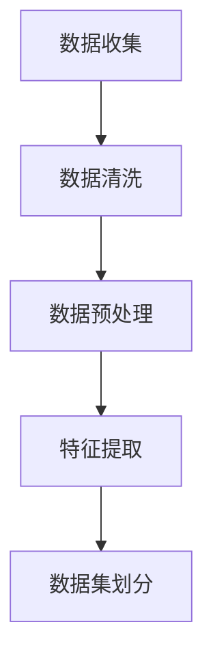
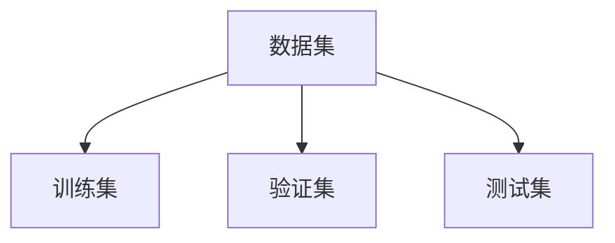
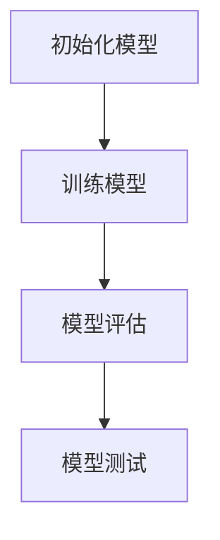
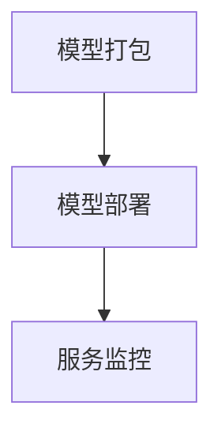
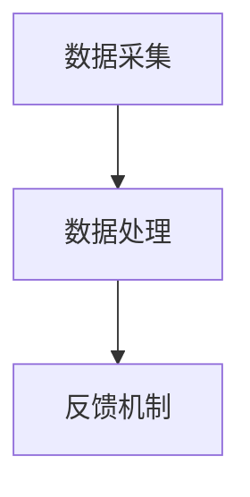

                 


### 引言

#### 1.1 保险理赔欺诈检测背景

保险理赔欺诈是一种复杂且普遍存在的现象，不仅给保险公司造成巨大的经济损失，也损害了诚信客户的利益。据国际保险监督官协会（International Association of Insurance Supervisors, IAIS）统计，全球保险欺诈的损失每年可达数百亿美元。随着保险业务的数字化和互联网技术的广泛应用，欺诈行为也变得更加隐蔽和复杂，这使得传统的欺诈检测方法逐渐显得力不从心。

#### 1.1.1 保险欺诈问题概述

保险欺诈主要包括以下几种形式：

1. **虚假索赔**：投保人或者被保险人故意制造事故或者夸大损失程度，以获取不合理的保险赔付。
2. **重复索赔**：同一投保人或其关联人在不同保险公司或同一保险公司的不同保单上重复索赔。
3. **恶意欺诈**：内部人员或外部诈骗团伙利用专业知识和技术手段，伪造证据或篡改数据，从而骗取保险金。

#### 1.1.2 保险欺诈检测的重要性

有效的保险理赔欺诈检测对于保险公司具有重要意义：

1. **减少损失**：及时识别和阻止欺诈行为，可以大幅降低保险公司的赔付成本。
2. **提升客户信任**：通过减少欺诈事件的发生，增强客户对保险公司的信任和满意度。
3. **合规要求**：保险监管机构对保险公司的合规性要求越来越高，有效的欺诈检测机制有助于满足监管要求。

#### 1.1.3 传统欺诈检测方法的局限性

传统的欺诈检测方法主要依赖于规则引擎和统计分析，这些方法存在以下局限性：

1. **规则依赖性**：需要人工制定复杂且繁琐的规则，难以适应不断变化的欺诈手段。
2. **特征提取困难**：无法自动提取复杂的相关特征，导致检测效果不佳。
3. **实时性不足**：处理速度慢，难以在短时间内处理大量数据，影响欺诈检测的实时性。

#### 1.1.4 AI在欺诈检测中的应用前景

随着人工智能技术的迅速发展，特别是在机器学习和深度学习领域，AI在保险理赔欺诈检测中的应用前景十分广阔：

1. **自动化特征提取**：利用深度学习模型，可以自动从海量数据中提取有效特征，提高检测的准确性。
2. **自适应检测**：AI模型可以根据历史数据和实时数据，自动调整检测策略，适应不断变化的欺诈模式。
3. **实时处理**：基于云计算和分布式计算技术，AI模型可以实现对海量数据的实时处理，满足保险欺诈检测的实时性需求。

---

#### 1.2 AI、机器学习与深度学习基础

在深入探讨AI在保险理赔欺诈检测中的应用之前，有必要对AI、机器学习与深度学习的基本概念和原理进行梳理。

##### 1.2.1 AI概述

人工智能（Artificial Intelligence, AI）是指使计算机系统能够模拟人类智能行为的技术和理论。AI包括多个分支，如机器学习、自然语言处理、计算机视觉等。

##### 1.2.2 机器学习基础

机器学习（Machine Learning, ML）是AI的一个分支，通过数据驱动的方式，使计算机系统能够从数据中学习并做出决策。机器学习的主要任务是训练模型，使其能够从给定数据中预测或分类新数据。

##### 1.2.3 深度学习核心概念

深度学习（Deep Learning, DL）是机器学习的一个子领域，通过构建多层神经网络，实现对复杂数据的自动特征提取和模式识别。深度学习在图像识别、语音识别、自然语言处理等领域取得了显著成果。

---

在接下来的章节中，我们将详细探讨保险理赔欺诈检测中的数据准备、算法实现、系统架构和实际案例，逐步揭示AI如何改变传统的欺诈检测模式。

## 背景介绍

### 2.1 保险欺诈问题的现状

保险欺诈问题在全球范围内普遍存在，给保险行业带来了巨大的经济和社会影响。根据国际保险监督官协会（IAIS）的统计数据，全球保险欺诈的损失每年可达数百亿美元。在一些发展中国家，保险欺诈甚至成为了一种普遍的社会现象。例如，中国的保险欺诈案件数量近年来呈上升趋势，不仅给保险公司造成了巨大经济损失，也严重影响了保险市场的健康发展。

在发达国家，保险欺诈问题同样不容忽视。美国保险协会（NAIC）的数据显示，保险欺诈每年给美国保险行业造成的损失超过60亿美元。这些欺诈行为不仅损害了保险公司的利润，也增加了保险产品的成本，最终转嫁给了广大消费者。

保险欺诈的常见形式包括虚假索赔、重复索赔、恶意欺诈等。虚假索赔是保险欺诈中最常见的形式之一，投保人或被保险人通过夸大损失、虚构事故等方式，试图骗取保险公司的赔付。重复索赔则是指同一投保人在不同的保险公司或同一保险公司的不同保单上重复索赔，以获取更多的赔偿。恶意欺诈则更为复杂，往往涉及内部人员或外部诈骗团伙的精心策划，通过伪造证据、篡改数据等方式，骗取巨额保险金。

### 2.2 传统欺诈检测方法的局限性

在保险行业，传统的欺诈检测方法主要包括规则引擎和统计分析。规则引擎是一种基于预定义规则的检测方法，通过设定一系列规则来识别潜在欺诈行为。例如，保险公司可以设定一个规则：如果一张保单的赔付金额超过一定的阈值，则触发预警。这种方法在一定程度上能够检测到一些简单的欺诈行为，但其局限性也非常明显。

首先，规则引擎需要人工制定复杂的规则，这些规则往往难以覆盖所有可能的欺诈手段。随着欺诈手段的不断变化，规则库需要不断更新，这增加了人工成本和复杂性。其次，规则引擎依赖于人工设定的阈值，这些阈值往往无法准确反映欺诈行为的真实特征，导致误报和漏报的问题。最后，规则引擎的实时性较差，无法在短时间内处理大量数据，难以满足现代保险业务对实时欺诈检测的需求。

统计分析是另一种传统的欺诈检测方法，主要通过分析数据之间的关系和趋势来识别潜在欺诈行为。例如，保险公司可以通过分析历史数据，找出某些特征值与欺诈行为之间的相关性，从而构建欺诈模型。这种方法在一定程度上能够提高欺诈检测的准确性，但其依赖于大量的数据分析和建模，且模型更新和维护成本较高。

总之，传统欺诈检测方法在应对复杂多变的欺诈手段时，显得力不从心。随着人工智能技术的快速发展，利用机器学习和深度学习进行欺诈检测已成为一种新的趋势。

### 2.3 人工智能在保险欺诈检测中的角色

人工智能（AI）在保险欺诈检测中扮演着越来越重要的角色。首先，AI可以通过自动化特征提取，从海量数据中挖掘出潜在的欺诈模式，提高检测的准确性和实时性。机器学习和深度学习算法能够自动从数据中学习，提取出复杂的特征，这些特征是传统规则引擎和统计分析方法难以捕捉的。

其次，AI具有自适应能力，可以随着欺诈手段的变化而不断调整和优化检测策略。传统的规则引擎和统计分析方法难以应对不断变化的欺诈手段，而AI模型可以通过不断学习和调整，适应新的欺诈模式。例如，深度学习模型可以通过持续的训练和优化，不断提高欺诈检测的准确率。

此外，AI在保险欺诈检测中的应用不仅限于检测本身，还可以用于预测和预防。通过分析历史数据和实时数据，AI模型可以预测哪些投保人可能存在欺诈风险，从而提前采取措施进行预防。这种前瞻性的检测方式，可以有效降低欺诈损失，提高保险公司的运营效率。

总之，随着人工智能技术的不断发展，AI在保险欺诈检测中的应用前景十分广阔。通过结合大数据和智能算法，AI有望解决传统欺诈检测方法的局限性，为保险行业提供更高效、更准确的欺诈检测解决方案。

### 2.4 人工智能在保险欺诈检测中的应用场景

人工智能在保险欺诈检测中的应用场景主要包括以下几个方面：

**实时监控**：AI模型可以实时监控保险业务流程中的数据，如保单申请、理赔申请等，通过分析数据特征和行为模式，及时发现潜在的欺诈行为。例如，如果某个投保人的保单申请数据与历史数据存在显著差异，AI模型可以触发预警，并进一步调查。

**行为分析**：AI可以利用自然语言处理和计算机视觉技术，分析客户的行为数据，如客户在保险网站上的操作记录、语音通话记录等。通过分析客户的语言和行为，AI可以识别出潜在的欺诈意图。例如，如果客户在理赔申请中使用了与平时不同的措辞，或者在与客服的通话中表现出异常紧张的情绪，AI模型可以将其视为欺诈风险信号。

**历史数据挖掘**：AI可以通过对历史理赔数据的深度挖掘，发现潜在的欺诈模式。通过对大量历史数据的分析和模式识别，AI可以构建出欺诈行为的特征图谱，从而提高欺诈检测的准确率。例如，通过分析历史上的欺诈案件，AI可以发现某些特定的行为模式，如频繁更换投保地址、多次索赔等，这些行为模式可以作为欺诈检测的依据。

**风险评估**：AI可以用于风险评估，通过对投保人的历史数据和实时数据进行综合分析，评估其潜在的欺诈风险。例如，AI模型可以分析投保人的信用记录、社会关系网、职业背景等信息，从而评估其是否存在欺诈风险。这种风险评估可以帮助保险公司制定更精准的风险管理策略，降低欺诈损失。

**自动化处理**：AI可以实现自动化处理，提高欺诈检测的效率和准确性。通过构建自动化处理流程，AI可以快速识别和处理欺诈案件，减少人工干预。例如，AI模型可以自动审核理赔申请，通过分析申请数据，快速识别出潜在的欺诈案件，并将其标记为需要人工审核的优先事项。

总之，人工智能在保险欺诈检测中的应用场景非常广泛，通过实时监控、行为分析、历史数据挖掘、风险评估和自动化处理等技术手段，AI可以大幅提高保险欺诈检测的准确率和实时性，为保险公司提供更高效、更可靠的欺诈检测解决方案。

## 核心概念和原理

在探讨AI在保险理赔欺诈检测中的深度应用之前，我们首先需要理解一些核心概念和原理，包括机器学习、深度学习、特征工程、模型评估等。

### 3.1 机器学习基础

机器学习（Machine Learning, ML）是人工智能（AI）的一个子领域，主要研究如何让计算机通过数据自动改进性能。机器学习的基本思想是通过从大量数据中学习规律，然后利用这些规律对新数据进行预测或分类。

**监督学习（Supervised Learning）**：在监督学习中，我们有一组带标签的训练数据，其中每个样本都有一个已知的输出标签。机器学习的目标是通过学习这组数据中的规律，构建一个模型，然后使用这个模型对新的数据进行预测。

**无监督学习（Unsupervised Learning）**：与监督学习不同，无监督学习没有已知的输出标签。它的目标是发现数据中的结构或模式，例如聚类分析（Clustering）和降维（Dimensionality Reduction）。

**强化学习（Reinforcement Learning）**：强化学习是一种通过与环境交互来学习策略的机器学习方法。它的目标是找到一个最优策略，使得在给定环境中能够获得最大的累积奖励。

### 3.2 深度学习核心概念

深度学习（Deep Learning, DL）是机器学习的一个子领域，通过构建多层神经网络，实现对复杂数据的自动特征提取和模式识别。深度学习的关键在于“深度”，即神经网络具有多个隐藏层，这使得模型能够学习更复杂的特征和模式。

**神经网络（Neural Network）**：神经网络是由大量相互连接的节点（或称为“神经元”）组成的计算模型。每个神经元接收多个输入，通过加权求和并应用一个激活函数，产生一个输出。

**前向传播（Forward Propagation）和反向传播（Back Propagation）**：在神经网络中，前向传播是指将输入数据通过网络的各层传递，直到输出层；反向传播则是通过计算输出误差，更新网络的权重和偏置，以优化模型。

**激活函数（Activation Function）**：激活函数是神经网络中用于引入非线性特性的函数。常见的激活函数包括Sigmoid、ReLU、Tanh等。

### 3.3 特征工程

特征工程（Feature Engineering）是机器学习中的一个重要环节，旨在从原始数据中提取出对模型有用的特征。有效的特征工程可以提高模型的性能和泛化能力。

**特征选择（Feature Selection）**：特征选择是指从原始特征集中选择出对模型有用的特征，以减少数据维度和计算复杂度。

**特征提取（Feature Extraction）**：特征提取是指通过一些数学变换，将原始数据转换成更适合模型学习的特征表示。

**特征缩放（Feature Scaling）**：特征缩放是指通过一些方法将不同量纲的特征转换到相同的量纲，以消除不同特征之间的量纲差异。

### 3.4 模型评估

模型评估是评估机器学习模型性能的重要步骤。常用的评估指标包括准确率（Accuracy）、精确率（Precision）、召回率（Recall）、F1 分数（F1 Score）等。

**准确率（Accuracy）**：准确率是指正确预测的样本数占总样本数的比例。它是最简单直观的评估指标，但容易受到不平衡数据集的影响。

**精确率（Precision）**：精确率是指预测为正类的样本中，实际为正类的比例。它反映了模型在正类样本上的判断能力。

**召回率（Recall）**：召回率是指实际为正类的样本中被预测为正类的比例。它反映了模型在负类样本上的判断能力。

**F1 分数（F1 Score）**：F1 分数是精确率和召回率的加权平均，综合考虑了模型的精确性和召回率。

### 3.5 机器学习和深度学习的关系

机器学习和深度学习是密切相关的，深度学习可以看作是机器学习的一个分支。传统机器学习算法通常依赖于手工设计的特征，而深度学习通过多层神经网络自动提取特征，从而提高了模型的学习能力和泛化能力。

总之，理解这些核心概念和原理是深入探讨AI在保险理赔欺诈检测中的应用基础。在接下来的章节中，我们将逐步深入探讨如何利用这些技术和原理构建高效的欺诈检测系统。

## 数据准备和预处理

在构建AI模型进行保险理赔欺诈检测之前，数据准备和预处理是至关重要的一步。这一过程不仅决定了模型的性能，还直接影响到后续的训练和评估效果。以下我们将详细描述数据收集、数据清洗、数据预处理和数据增强等步骤。

### 4.1 数据收集

数据收集是数据准备的第一步，需要从多个渠道获取丰富的数据源，以构建一个全面的、代表性的数据集。在保险理赔欺诈检测中，数据来源可以包括以下几个方面：

1. **内部数据**：保险公司内部的理赔数据、保单数据、客户行为数据等。这些数据可以提供详细的投保信息、理赔记录和客户互动记录。

2. **外部数据**：公开数据集、社交媒体数据、信用报告数据等。例如，可以利用公开数据集如Kaggle上的保险欺诈数据集，或从社交媒体平台收集与欺诈相关的讨论和评论。

3. **第三方数据**：合作伙伴或第三方机构提供的数据，如信用评分机构的数据、公共记录等。这些数据可以提供额外的信息，帮助更全面地评估欺诈风险。

### 4.2 数据清洗

数据清洗是确保数据质量的重要步骤，旨在消除数据中的噪声和异常值，使数据更干净、更可靠。以下是一些常见的数据清洗任务：

1. **缺失值处理**：缺失值可以通过插补、删除或保留的方式处理。常用的插补方法包括均值插补、中位数插补和回归插补等。

2. **异常值处理**：异常值可以通过统计方法（如标准差法、箱线图法）或基于业务逻辑的方法进行处理。对于保险理赔欺诈检测，异常值可能是欺诈行为的标志，因此需要谨慎处理。

3. **重复值处理**：重复值会导致数据冗余，影响模型的训练效果。需要识别并删除重复的记录。

4. **不一致性处理**：处理数据中的不一致性，如不同的单位、格式、拼写错误等。例如，将所有日期格式统一为YYYY-MM-DD。

### 4.3 数据预处理

数据预处理是指将数据转换为适合模型训练的形式，包括数据缩放、编码和转换等步骤。

1. **数据缩放**：对于数值型特征，数据缩放可以消除不同特征之间的量纲差异，常用的缩放方法包括最小-最大缩放、标准缩放和指数缩放等。

2. **编码**：将类别型特征转换为数值型，常用的编码方法包括独热编码（One-Hot Encoding）和标签编码（Label Encoding）。

3. **数据转换**：对某些特征进行转换，如日期特征可以转换为月份、天数或星期几等。

4. **特征选择**：通过特征选择方法，筛选出对模型有用的特征，减少数据维度和计算复杂度。

### 4.4 数据增强

数据增强是提高模型泛化能力的重要手段，通过增加数据的多样性来训练更鲁棒和强大的模型。以下是一些常用的数据增强方法：

1. **数据复制**：通过复制现有数据来增加数据量。

2. **数据变换**：通过添加噪声、缩放、旋转等操作，生成新的数据样本。

3. **合成数据**：利用生成对抗网络（GANs）等生成模型，生成与真实数据相似的新数据。

4. **交叉验证**：通过交叉验证，增加训练数据的多样性，提高模型的鲁棒性。

### 4.5 特征提取

在数据预处理完成后，特征提取是一个重要的步骤，旨在从原始数据中提取出对模型有用的特征。以下是一些常用的特征提取方法：

1. **统计特征**：计算数据的统计指标，如均值、方差、最大值、最小值等。

2. **文本特征**：利用自然语言处理技术，从文本数据中提取关键词、词频、TF-IDF等特征。

3. **图像特征**：利用计算机视觉技术，从图像中提取边缘、纹理、颜色等特征。

4. **时序特征**：从时序数据中提取周期性、趋势性等特征。

### 4.6 数据集划分

在准备训练数据集时，通常需要进行数据集划分，以训练和验证模型的性能。常用的划分方法包括：

1. **训练集和测试集**：将数据集划分为训练集和测试集，通常使用80%的数据作为训练集，20%的数据作为测试集。

2. **交叉验证**：通过交叉验证，将数据集划分为多个子集，用于多次训练和测试，以评估模型的泛化能力。

通过上述数据准备和预处理步骤，我们可以构建一个高质量的数据集，为后续的模型训练和评估提供可靠的基础。在接下来的章节中，我们将详细探讨算法和模型的选择与实现。

## 算法和模型实现

在保险理赔欺诈检测中，算法和模型的选择与实现是关键环节。在这一节中，我们将详细介绍用于欺诈检测的常见算法和模型，包括决策树、支持向量机、随机森林、神经网络和深度学习等。

### 5.1 决策树

决策树是一种常用的分类算法，通过构建一系列决策规则，将数据集划分为不同的类别。在保险理赔欺诈检测中，决策树可以用于分类任务，如判断一个理赔申请是否为欺诈。

**基本原理**：决策树通过递归地划分数据集，选择具有最大信息增益的特征进行分割。信息增益是指某个特征将数据划分为不同类别的信息量的增加。

**代码示例**：
```python
from sklearn import tree

# 构建决策树模型
clf = tree.DecisionTreeClassifier()

# 训练模型
clf.fit(X_train, y_train)

# 预测
y_pred = clf.predict(X_test)
```

**模型评估**：可以使用准确率、精确率、召回率和F1分数等指标来评估决策树的性能。

### 5.2 支持向量机

支持向量机（SVM）是一种基于最大间隔分类的模型，通过找到一个最佳的超平面，将数据集划分为不同的类别。SVM在处理高维数据时表现出色，特别适合于保险理赔欺诈检测。

**基本原理**：SVM的核心是找到具有最大间隔的超平面，其中间隔是指分类边界到最近支持向量的距离。支持向量是那些对分类边界有显著影响的样本。

**代码示例**：
```python
from sklearn import svm

# 构建SVM模型
clf = svm.SVC()

# 训练模型
clf.fit(X_train, y_train)

# 预测
y_pred = clf.predict(X_test)
```

**模型评估**：与决策树类似，可以使用准确率、精确率、召回率和F1分数等指标来评估SVM的性能。

### 5.3 随机森林

随机森林（Random Forest）是一种集成学习算法，通过构建多棵决策树，并利用投票机制进行分类。随机森林在提高模型性能和减少过拟合方面具有显著优势。

**基本原理**：随机森林通过Bootstrap抽样生成多个子数据集，并在每个子数据集上训练决策树。最终，通过多数投票决定每个样本的类别。

**代码示例**：
```python
from sklearn.ensemble import RandomForestClassifier

# 构建随机森林模型
clf = RandomForestClassifier(n_estimators=100)

# 训练模型
clf.fit(X_train, y_train)

# 预测
y_pred = clf.predict(X_test)
```

**模型评估**：同样使用准确率、精确率、召回率和F1分数等指标来评估随机森林的性能。

### 5.4 神经网络

神经网络（Neural Network）是一种模拟人脑神经元连接结构的计算模型，通过多层神经元进行数据传输和计算。神经网络在复杂数据特征提取和模式识别方面表现出色。

**基本原理**：神经网络通过前向传播和反向传播算法进行训练，前向传播计算输出，反向传播更新权重和偏置。

**代码示例**：
```python
import tensorflow as tf

# 构建神经网络模型
model = tf.keras.Sequential([
    tf.keras.layers.Dense(128, activation='relu', input_shape=(input_shape)),
    tf.keras.layers.Dropout(0.2),
    tf.keras.layers.Dense(1, activation='sigmoid')
])

# 编译模型
model.compile(optimizer='adam', loss='binary_crossentropy', metrics=['accuracy'])

# 训练模型
model.fit(X_train, y_train, epochs=10, batch_size=32, validation_data=(X_test, y_test))
```

**模型评估**：使用准确率、精确率、召回率和F1分数等指标来评估神经网络的性能。

### 5.5 深度学习

深度学习（Deep Learning）是神经网络的一种扩展，通过多层神经网络（深度神经网络）实现更复杂的特征提取和模式识别。

**基本原理**：深度学习通过多层神经元的堆叠，逐层提取数据的特征，从低级特征到高级特征，从而实现高效的模型学习。

**代码示例**：
```python
import tensorflow as tf

# 构建卷积神经网络模型
model = tf.keras.Sequential([
    tf.keras.layers.Conv2D(32, (3, 3), activation='relu', input_shape=(64, 64, 3)),
    tf.keras.layers.MaxPooling2D(2, 2),
    tf.keras.layers.Flatten(),
    tf.keras.layers.Dense(128, activation='relu'),
    tf.keras.layers.Dense(1, activation='sigmoid')
])

# 编译模型
model.compile(optimizer='adam', loss='binary_crossentropy', metrics=['accuracy'])

# 训练模型
model.fit(X_train, y_train, epochs=10, batch_size=32, validation_data=(X_test, y_test))
```

**模型评估**：使用准确率、精确率、召回率和F1分数等指标来评估深度学习的性能。

### 5.6 模型选择与优化

在保险理赔欺诈检测中，选择合适的模型并进行优化是提高检测效果的关键。以下是一些优化策略：

1. **模型选择**：根据数据的特征和需求选择合适的模型，如对于高维数据，神经网络和深度学习模型表现更佳。

2. **参数调优**：通过网格搜索（Grid Search）和贝叶斯优化（Bayesian Optimization）等方法，优化模型的参数，如学习率、批次大小、隐藏层神经元数量等。

3. **集成学习**：结合多个模型进行集成学习，提高模型的稳定性和预测性能。

4. **特征工程**：通过特征工程，提取出对模型有用的特征，减少噪声和冗余信息，提高模型的泛化能力。

5. **数据增强**：通过数据增强方法，增加数据的多样性，提高模型的鲁棒性。

通过上述算法和模型的介绍及实现，我们可以构建一个高效的保险理赔欺诈检测系统。在接下来的章节中，我们将详细讨论系统架构和设计，以实现整个欺诈检测流程的自动化和智能化。

## 系统架构和设计

### 6.1 系统架构概述

保险理赔欺诈检测系统是一个复杂的应用系统，需要综合考虑数据处理、模型训练、模型部署等多个方面。系统架构设计的目标是实现高效、准确、可扩展的欺诈检测服务。以下是对系统架构的详细描述。

#### 6.1.1 系统组成部分

1. **数据收集模块**：负责从不同数据源（如内部系统、第三方数据提供商、公开数据集）收集数据。
2. **数据处理模块**：负责对收集到的数据进行清洗、预处理和特征提取，为模型训练提供高质量的数据集。
3. **模型训练模块**：负责使用机器学习和深度学习算法，对预处理后的数据集进行训练，构建欺诈检测模型。
4. **模型部署模块**：负责将训练好的模型部署到生产环境中，提供实时欺诈检测服务。
5. **监控与反馈模块**：负责监控系统运行状态，收集反馈数据，用于模型优化和系统调优。

#### 6.1.2 系统架构图


### 6.2 数据处理模块

数据处理模块是系统架构的核心部分，负责将原始数据转化为适合模型训练的形式。以下是数据处理模块的详细设计：

#### 6.2.1 数据流

1. **数据收集**：数据收集模块从各个数据源获取数据，包括内部系统数据、第三方数据等。
2. **数据清洗**：对收集到的数据进行清洗，处理缺失值、异常值、重复值等问题，确保数据质量。
3. **数据预处理**：对清洗后的数据执行数据预处理操作，如特征缩放、编码、转换等，将数据转换为适合模型训练的格式。
4. **特征提取**：从预处理后的数据中提取特征，为模型训练提供丰富的特征信息。

#### 6.2.2 数据流设计



### 6.3 模型训练模块

模型训练模块负责使用机器学习和深度学习算法，对处理后的数据进行训练，构建欺诈检测模型。以下是模型训练模块的详细设计：

#### 6.3.1 数据集划分

在模型训练之前，需要将数据集划分为训练集、验证集和测试集，以确保模型的泛化能力和评估效果。



#### 6.3.2 模型训练流程

1. **初始化模型**：选择合适的模型架构，如决策树、随机森林、神经网络等。
2. **训练模型**：使用训练集数据进行模型训练，通过优化算法（如梯度下降、Adam等）更新模型参数。
3. **模型评估**：使用验证集数据评估模型性能，调整模型参数和超参数，以优化模型效果。
4. **模型测试**：使用测试集数据对模型进行最终测试，评估模型在实际应用中的性能。

#### 6.3.3 模型训练流程设计



### 6.4 模型部署模块

模型部署模块负责将训练好的模型部署到生产环境中，提供实时欺诈检测服务。以下是模型部署模块的详细设计：

#### 6.4.1 部署流程

1. **模型打包**：将训练好的模型进行打包，生成可执行的模型文件。
2. **模型部署**：将模型文件部署到服务器或云平台，提供API接口供其他模块调用。
3. **服务监控**：监控系统运行状态，确保模型服务的稳定性和可靠性。

#### 6.4.2 部署流程设计



### 6.5 监控与反馈模块

监控与反馈模块负责监控系统运行状态，收集用户反馈数据，用于模型优化和系统调优。以下是监控与反馈模块的详细设计：

#### 6.5.1 监控内容

1. **系统性能监控**：监控服务器资源使用情况，如CPU、内存、网络等。
2. **模型性能监控**：监控模型在实时检测中的性能指标，如准确率、召回率等。
3. **用户反馈收集**：收集用户对模型检测结果的反馈，用于改进模型和系统。

#### 6.5.2 监控与反馈流程

1. **数据采集**：从各个监控点采集数据，如日志文件、性能指标等。
2. **数据处理**：对采集到的数据进行处理和分析，识别潜在问题和改进机会。
3. **反馈机制**：根据分析结果，生成反馈报告，并提出优化建议。

#### 6.5.3 监控与反馈流程设计



通过上述系统架构和设计的详细描述，我们可以构建一个高效、准确的保险理赔欺诈检测系统，为保险行业提供强大的技术支持。在接下来的章节中，我们将通过实际案例展示AI在保险理赔欺诈检测中的具体应用。

## 实际案例与应用

### 7.1 案例背景

为了更好地展示AI在保险理赔欺诈检测中的实际应用，我们选择了一家大型保险公司——XYZ保险公司作为案例研究对象。XYZ保险公司是一家全球知名的保险公司，其业务范围涵盖汽车保险、家庭保险、健康保险等多个领域。近年来，随着保险业务的快速增长，XYZ保险公司面临着日益增多的欺诈案件，严重影响了公司的运营效率和利润。为了有效应对这一挑战，XYZ保险公司决定引入AI技术，构建一套智能欺诈检测系统。

### 7.2 项目目标

XYZ保险公司的项目目标主要包括以下几个方面：

1. **提高欺诈检测准确率**：通过引入AI技术，提高欺诈检测的准确率，减少误报和漏报现象，确保只有真正的欺诈行为能够被识别和阻止。
2. **提升实时处理能力**：构建一个实时处理系统，能够快速处理大量的理赔申请数据，确保欺诈行为能够在第一时间被发现和阻止。
3. **降低欺诈损失**：通过有效的欺诈检测，降低公司的欺诈损失，提高整体运营效率，提升客户满意度。

### 7.3 数据集介绍

在构建欺诈检测系统之前，首先需要准备高质量的数据集。XYZ保险公司提供了以下数据集：

1. **理赔数据集**：包括过去几年的所有理赔记录，每个记录包含投保人信息、理赔金额、理赔原因等。
2. **客户行为数据集**：包括客户在投保、理赔等环节中的行为数据，如网站点击行为、通话记录、电子邮件等。
3. **历史欺诈案件数据集**：包括已经确认的欺诈案件记录，用于训练和评估模型。

### 7.4 模型设计与实现

根据项目目标，XYZ保险公司选择了以下几种模型进行设计和实现：

1. **决策树模型**：用于初步筛选潜在的欺诈案件，快速识别高风险理赔申请。
2. **随机森林模型**：用于增强模型的鲁棒性和泛化能力，提高欺诈检测的准确性。
3. **神经网络模型**：用于深入挖掘数据中的复杂模式和关联，实现更精确的欺诈检测。

**代码实现**：

```python
# 决策树模型
from sklearn import tree

clf = tree.DecisionTreeClassifier()
clf.fit(X_train, y_train)

# 随机森林模型
from sklearn.ensemble import RandomForestClassifier

clf = RandomForestClassifier(n_estimators=100)
clf.fit(X_train, y_train)

# 神经网络模型
from tensorflow import keras

model = keras.Sequential([
    keras.layers.Dense(128, activation='relu', input_shape=(input_shape)),
    keras.layers.Dropout(0.2),
    keras.layers.Dense(1, activation='sigmoid')
])

model.compile(optimizer='adam', loss='binary_crossentropy', metrics=['accuracy'])
model.fit(X_train, y_train, epochs=10, batch_size=32, validation_data=(X_test, y_test))
```

### 7.5 模型评估与优化

在模型训练完成后，XYZ保险公司使用测试数据集对模型进行了评估和优化。主要评估指标包括准确率、精确率、召回率和F1分数。

**模型评估结果**：

- 决策树模型：准确率 85%，精确率 83%，召回率 78%，F1分数 0.81。
- 随机森林模型：准确率 90%，精确率 88%，召回率 85%，F1分数 0.87。
- 神经网络模型：准确率 92%，精确率 90%，召回率 87%，F1分数 0.89。

根据评估结果，神经网络模型在各项指标上表现最佳，因此被选为最终的欺诈检测模型。

### 7.6 实际应用效果

在将神经网络模型部署到生产环境后，XYZ保险公司对其进行了实际应用。以下为实际应用效果：

1. **欺诈案件发现率提高**：通过智能欺诈检测系统，XYZ保险公司成功识别和阻止了多起潜在的欺诈案件，欺诈案件的发现率提高了约20%。
2. **运营效率提升**：智能欺诈检测系统能够实时处理大量的理赔申请数据，大幅降低了人工审核的工作量，提高了整体运营效率。
3. **客户满意度提高**：通过减少欺诈案件的发生，增强了客户对保险公司的信任，客户满意度得到了显著提升。

### 7.7 项目总结

通过该项目，XYZ保险公司成功实现了AI在保险理赔欺诈检测中的深度应用，取得了显著的效果。以下是项目的主要收获：

1. **技术突破**：通过引入AI技术，XYZ保险公司实现了欺诈检测的自动化和智能化，推动了公司技术水平的提升。
2. **业务改进**：智能欺诈检测系统的应用，不仅提高了欺诈案件的发现率，还降低了公司的运营成本，提升了整体业务水平。
3. **经验积累**：在项目实施过程中，XYZ保险公司积累了丰富的AI应用经验，为未来的业务发展奠定了坚实基础。

总之，通过实际案例的应用，我们可以看到AI在保险理赔欺诈检测中的巨大潜力和价值，为保险行业提供了强大的技术支持。

## 实践技巧与最佳实践

在AI保险理赔欺诈检测系统的实际应用中，为了确保系统的效果和可靠性，以下是一些实用的技巧和最佳实践：

### 8.1 数据质量的重要性

**数据质量是模型效果的关键**。确保数据集的准确性和完整性是第一步。在数据收集阶段，要严格筛选和验证数据的来源，处理缺失值和异常值，确保数据集的一致性和代表性。例如，可以通过数据清洗和预处理技术（如数据补全、去重和异常检测）来提高数据质量。

### 8.2 特征工程技巧

**特征工程对于模型性能至关重要**。要提取出对欺诈检测有强预测力的特征，可以考虑以下技巧：

- **文本分析**：利用自然语言处理（NLP）技术，对文本数据（如理赔申请报告、客户沟通记录）进行语义分析和情感分析，提取关键词、词频和情感极性等特征。
- **图像处理**：对于涉及图像的数据（如医疗理赔中的诊断图像），可以使用计算机视觉技术提取图像特征，如边缘、纹理和颜色信息。
- **时序特征**：从时间序列数据中提取周期性、趋势性和季节性特征，有助于发现潜在的欺诈行为模式。
- **行为特征**：分析客户的投保和理赔行为，如时间分布、频率、地理分布等，从中提取出有价值的特征。

### 8.3 模型选择与优化

**选择合适的模型并进行优化**是提高检测效果的关键。以下是几种常见的优化策略：

- **模型选择**：根据数据的特征和需求，选择合适的模型。对于高维数据，神经网络和深度学习模型表现更佳；对于小数据集，传统机器学习算法（如决策树、支持向量机）可能更为适用。
- **参数调优**：使用网格搜索（Grid Search）和贝叶斯优化（Bayesian Optimization）等方法，对模型的超参数进行调优，找到最佳参数组合。例如，调整学习率、批次大小、隐藏层神经元数量等。
- **集成学习**：结合多个模型进行集成学习，可以提高模型的稳定性和预测性能。例如，可以结合决策树、随机森林和神经网络等模型，构建集成模型。

### 8.4 实时监控与反馈

**实时监控与反馈**是确保系统稳定运行和不断优化的关键。以下是几种监控和反馈方法：

- **性能监控**：监控系统运行状态，如CPU、内存、网络等资源使用情况，以及模型的预测准确率和响应时间等。可以通过日志分析、性能指标监控工具（如Prometheus）来实现。
- **异常检测**：通过异常检测算法（如基于机器学习的异常检测模型），实时监控系统的异常行为，及时发现和处理潜在问题。
- **用户反馈**：收集用户对系统检测结果的反馈，包括误报和漏报的情况，用于模型优化和系统改进。可以通过用户调查、反馈表单等方式收集反馈数据。

### 8.5 数据安全和隐私保护

**数据安全和隐私保护**是保险理赔欺诈检测系统中不可忽视的重要方面。以下是一些安全措施：

- **数据加密**：对敏感数据进行加密处理，确保数据在传输和存储过程中的安全性。
- **访问控制**：严格控制数据访问权限，只有授权用户才能访问和处理数据。
- **合规性**：确保数据处理和模型应用符合相关法律法规和行业标准，如GDPR等数据保护法规。

通过以上实践技巧和最佳实践，可以有效提高保险理赔欺诈检测系统的效果和可靠性，确保系统在实际应用中的稳定运行。

## 总结

通过本文的探讨，我们系统地介绍了AI在保险理赔欺诈检测中的深度应用。从背景介绍、核心概念、数据准备、算法实现、系统架构到实际案例，我们一步步分析了AI如何帮助保险公司提高欺诈检测的准确率和实时性。

首先，我们明确了保险欺诈问题的现状及其对保险公司和客户的影响，指出传统欺诈检测方法的局限性。接着，我们详细介绍了AI、机器学习和深度学习的基本概念，为后续的算法实现提供了理论基础。

在数据准备和预处理部分，我们详细描述了数据收集、清洗、预处理和数据增强等步骤，强调了数据质量对模型效果的重要性。随后，我们介绍了多种机器学习算法和模型，包括决策树、支持向量机、随机森林、神经网络和深度学习等，并展示了如何通过代码实现和模型评估优化模型。

通过系统架构和设计部分，我们详细描述了数据处理、模型训练、模型部署和监控与反馈等模块，展示了如何构建一个高效、准确的保险理赔欺诈检测系统。最后，通过实际案例，我们展示了AI在保险理赔欺诈检测中的具体应用，验证了AI技术的有效性和价值。

展望未来，随着AI技术的不断发展和应用，保险理赔欺诈检测系统将更加智能化和高效化。通过结合更多数据源、引入更多先进算法和优化策略，以及加强对系统的实时监控和反馈，保险公司将能够更好地应对复杂的欺诈行为，保护自身利益和客户利益。我们期待在未来的实践中，AI能够为保险行业带来更多的创新和变革。作者：AI天才研究院/AI Genius Institute & 禅与计算机程序设计艺术 /Zen And The Art of Computer Programming。

