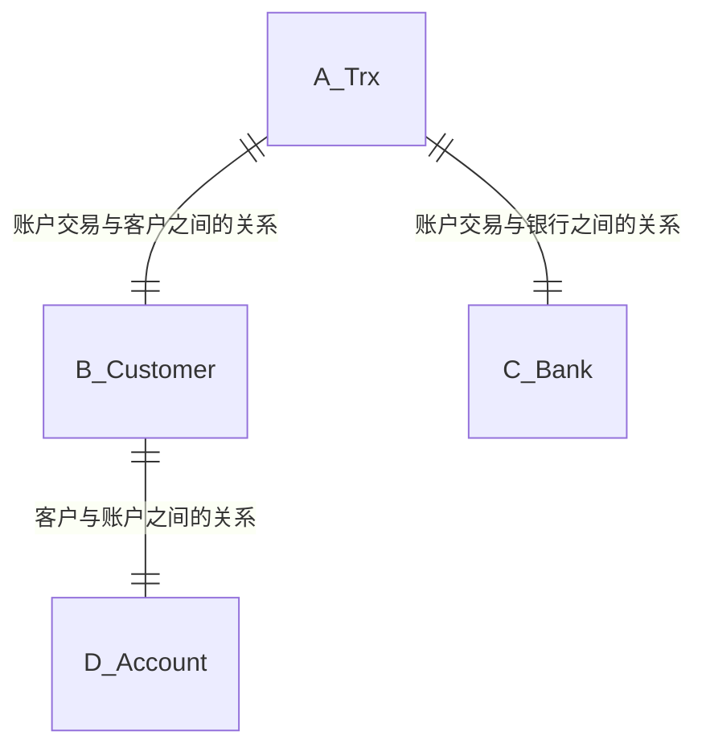
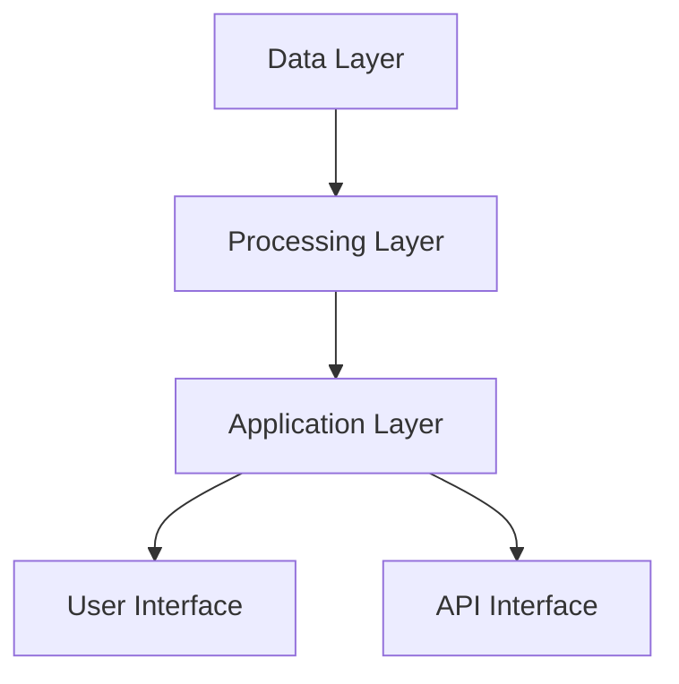
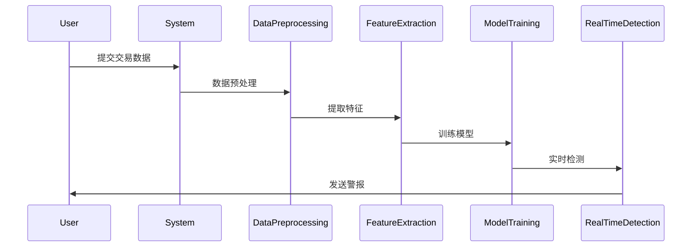

                 


## 引言与背景介绍

### 反洗钱和欺诈检测的重要性

反洗钱（Anti-Money Laundering, AML）和欺诈检测（Fraud Detection）在金融领域中扮演着至关重要的角色。反洗钱旨在防止非法资金流动，通过监控和报告可疑交易来打击洗钱活动。而欺诈检测则是为了保护金融机构和客户，防止因欺诈行为导致的财务损失。随着金融科技的迅猛发展，传统的反洗钱和欺诈检测方法已逐渐无法应对日益复杂和智能化的犯罪手段。这促使人工智能（AI）技术在反洗钱和欺诈检测中的应用变得愈加重要。

### AI技术概述

人工智能，作为一门模拟人类智能行为的科学，旨在让机器具备学习、推理、解决问题和执行任务的能力。机器学习（Machine Learning, ML）作为AI的核心技术，通过从数据中学习规律和模式，实现自动化决策和预测。深度学习（Deep Learning, DL），是机器学习中的一种方法，通过多层神经网络对数据进行复杂非线性变换，从而提高模型的表现能力。

### AI在金融领域的应用背景

在金融领域，AI技术已经被广泛应用于风险管理、客户服务、交易预测等多个方面。随着大数据和云计算的普及，金融行业积累了大量的交易数据和行为数据，这为AI技术的应用提供了丰富的数据资源。AI在反洗钱和欺诈检测中的应用主要体现在以下几个方面：

1. **数据分析和挖掘**：利用AI技术对海量的交易数据进行实时分析和挖掘，识别潜在的洗钱和欺诈行为。
2. **行为模式识别**：通过对用户行为数据的分析，建立正常行为模式，从而识别异常行为。
3. **预测建模**：利用机器学习和深度学习算法，对未来的交易行为进行预测，提前预警潜在的洗钱和欺诈风险。
4. **自动化决策**：通过AI算法的自动化决策，快速响应和处理可疑交易，提高反洗钱和欺诈检测的效率。

综上所述，AI技术在反洗钱和欺诈检测中的应用，不仅提高了金融机构的风险管理能力，还增强了客户的安全感和信任度。接下来，我们将深入探讨AI技术在反洗钱和欺诈检测中的核心概念、算法原理和具体应用。

### 核心概念与联系

为了深入探讨AI在反洗钱和欺诈检测中的应用，我们首先需要理解一些核心概念。以下是人工智能（AI）、机器学习（ML）、深度学习（DL）以及它们在反洗钱和欺诈检测中的应用。

#### 人工智能（AI）

人工智能（AI）是指通过计算机程序实现智能行为的能力。AI可以分为两类：弱AI（窄AI）和强AI（通用AI）。弱AI专注于特定任务，如图像识别、自然语言处理等，而强AI则具备与人类相似的广泛认知能力。

在反洗钱和欺诈检测中，弱AI通过算法和模型对交易数据进行分析，识别可疑行为。而强AI尚未成熟，尚未在金融领域广泛应用。

#### 机器学习（ML）

机器学习（ML）是AI的一个子领域，它通过从数据中学习规律和模式，实现自动化的决策和预测。ML算法可以分为监督学习、无监督学习和强化学习。

1. **监督学习**：使用标记数据进行训练，通过学习数据特征来预测新的未标记数据。常见的监督学习算法包括线性回归、逻辑回归、支持向量机（SVM）等。

2. **无监督学习**：不使用标记数据，通过发现数据中的结构和模式来进行分类和聚类。常见的无监督学习算法包括K-均值聚类、主成分分析（PCA）等。

3. **强化学习**：通过与环境的交互来学习最优策略，常见的应用包括游戏、自动驾驶等。

在反洗钱和欺诈检测中，监督学习和无监督学习都得到了广泛应用。监督学习通过历史交易数据训练模型，识别潜在的洗钱和欺诈行为；无监督学习通过聚类分析，发现异常交易模式。

#### 深度学习（DL）

深度学习（DL）是机器学习的一个子领域，它通过多层神经网络对数据进行复杂非线性变换，从而提高模型的表现能力。深度学习中的神经网络通常包含输入层、隐藏层和输出层。

1. **卷积神经网络（CNN）**：主要用于图像和视频数据，通过卷积操作提取空间特征。

2. **循环神经网络（RNN）**：主要用于序列数据，如文本和时序数据，通过递归操作保持长时记忆。

3. **生成对抗网络（GAN）**：通过生成器和判别器的对抗训练，生成与真实数据相似的数据。

在反洗钱和欺诈检测中，深度学习可以用于图像识别、文本分析、异常检测等方面。例如，利用CNN进行交易图像的特征提取，利用RNN分析交易文本的语义，利用GAN生成异常交易数据进行测试。

#### ER实体关系图与Mermaid表示

ER（实体-关系）图是一种用于描述实体及其关系的图形化表示方法。它可以直观地展示系统中各个实体之间的关系。



在Mermaid中，可以使用ER图来表示反洗钱和欺诈检测系统中的关键实体及其关系，如图所示。

#### 相关概念对比表格

为了更好地理解这些核心概念，我们可以使用表格进行对比。

| 概念       | 定义                                                         | 在反洗钱和欺诈检测中的应用                         |
|------------|--------------------------------------------------------------|---------------------------------------------------|
| 人工智能   | 模拟人类智能行为的计算机系统                                 | 识别可疑交易、分析行为模式、预测欺诈风险         |
| 机器学习   | 从数据中学习规律和模式的算法                                 | 建立预测模型、分析交易数据、识别异常行为         |
| 深度学习   | 通过多层神经网络进行复杂非线性变换的算法                     | 提取图像特征、分析文本、生成异常数据            |
| 实体关系图 | 用于描述实体及其关系的图形化表示方法                         | 确定交易数据与客户、银行等实体之间的关系         |
| 监督学习   | 使用标记数据进行训练的算法                                   | 通过历史数据建立预测模型，识别可疑交易           |
| 无监督学习 | 不使用标记数据进行训练的算法                                 | 发现异常交易模式、聚类分析、行为模式识别         |

通过上述表格，我们可以更清晰地看到各个概念之间的联系以及它们在反洗钱和欺诈检测中的应用。

### 算法原理讲解

#### 神经网络算法

神经网络（Neural Networks）是深度学习的基础，由大量的简单计算单元（神经元）组成。这些神经元通过加权连接形成复杂的网络结构，用于模拟人脑的神经元网络。

##### 神经网络基础

神经网络由输入层、隐藏层和输出层组成。每个层中的神经元都通过前一层神经元的输出进行加权求和，然后通过激活函数进行非线性变换。


在神经网络中，每个神经元都可以看作是一个简单的线性模型，其输出为：

$$
z = \sum_{i} w_i x_i + b
$$

其中，$w_i$ 是权重，$x_i$ 是输入，$b$ 是偏置。

##### 前向传播与反向传播算法

神经网络的训练过程分为两个阶段：前向传播和反向传播。

1. **前向传播**：输入数据通过网络逐层传播，最终得到输出。每个神经元的输出都可以表示为：

$$
a = \sigma(z)
$$

其中，$\sigma$ 是激活函数，常用的激活函数有Sigmoid、ReLU和Tanh。

2. **反向传播**：根据网络输出与实际输出之间的误差，通过反向传播算法更新权重和偏置。反向传播的核心思想是计算每个权重和偏置的梯度，然后使用梯度下降法更新参数。

$$
\delta = \frac{\partial L}{\partial z}
$$

其中，$L$ 是损失函数，$\delta$ 是梯度。

梯度计算完成后，使用以下公式更新权重和偏置：

$$
w_{i} = w_{i} - \alpha \frac{\partial L}{\partial w_{i}}
$$

$$
b_{i} = b_{i} - \alpha \frac{\partial L}{\partial b_{i}}
$$

其中，$\alpha$ 是学习率。

##### Python代码示例

```python
import numpy as np

# 初始化参数
W = np.random.randn(3, 1)
b = np.random.randn(1)
z = np.dot(X, W) + b

# 计算梯度
dz = 2 * (z - y)
dw = np.dot(X.T, dz)
db = dz

# 更新参数
W -= learning_rate * dw
b -= learning_rate * db
```

#### 支持向量机算法

支持向量机（Support Vector Machine, SVM）是一种监督学习算法，通过寻找最优的超平面来对数据进行分类。

##### SVM原理

SVM的核心思想是找到一个最优的超平面，使得分类边界最大化。这个超平面由支持向量决定，支持向量是距离超平面最近的样本点。

在二维空间中，SVM的目标是最小化以下目标函数：

$$
\min_{w, b} \frac{1}{2} ||w||^2
$$

同时满足：

$$
y_i (w \cdot x_i + b) \geq 1
$$

其中，$w$ 是权重向量，$b$ 是偏置，$x_i$ 是输入样本，$y_i$ 是标签。

##### SVM参数调优

SVM的参数包括惩罚参数C、核函数和核参数。参数调优是SVM应用的关键步骤，常用的方法包括网格搜索和交叉验证。

```python
from sklearn.svm import SVC
from sklearn.model_selection import GridSearchCV

# 定义参数范围
param_grid = {'C': [0.1, 1, 10], 'kernel': ['linear', 'rbf'], 'gamma': [0.1, 1]}

# 创建SVM模型
svc = SVC()

# 执行网格搜索
grid_search = GridSearchCV(svc, param_grid, cv=5)
grid_search.fit(X, y)

# 获取最优参数
best_params = grid_search.best_params_
best_model = grid_search.best_estimator_
```

##### Python代码示例

```python
from sklearn.svm import SVC
from sklearn.model_selection import train_test_split

# 分割数据
X_train, X_test, y_train, y_test = train_test_split(X, y, test_size=0.2, random_state=42)

# 创建SVM模型
svm = SVC(C=1, kernel='linear')

# 训练模型
svm.fit(X_train, y_train)

# 预测
y_pred = svm.predict(X_test)
```

#### 集成学习方法

集成学习方法通过结合多个模型的预测结果来提高模型的性能。常见的集成学习方法包括Bagging和Boosting。

##### Bagging与Boosting

1. **Bagging**：通过从训练集中有放回地抽样构建多个子模型，然后取这些子模型的平均预测结果作为最终预测。

2. **Boosting**：通过迭代地训练多个模型，每个模型都对前一个模型的错误进行修正，最终加权组合多个模型的预测结果。

##### 集成学习策略

1. **随机森林（Random Forest）**：通过集成多棵决策树，提高模型的泛化能力。

2. **梯度提升树（Gradient Boosting Tree）**：通过迭代地最小化损失函数，每次迭代都对错误进行修正。

##### Python代码示例

```python
from sklearn.ensemble import RandomForestClassifier, GradientBoostingClassifier
from sklearn.model_selection import train_test_split

# 分割数据
X_train, X_test, y_train, y_test = train_test_split(X, y, test_size=0.2, random_state=42)

# 创建随机森林模型
rf = RandomForestClassifier(n_estimators=100)

# 训练模型
rf.fit(X_train, y_train)

# 预测
y_pred_rf = rf.predict(X_test)

# 创建梯度提升树模型
gb = GradientBoostingClassifier(n_estimators=100)

# 训练模型
gb.fit(X_train, y_train)

# 预测
y_pred_gb = gb.predict(X_test)
```

通过上述讲解，我们可以看到神经网络、SVM和集成学习方法在反洗钱和欺诈检测中的应用。接下来，我们将进一步探讨这些算法的数学模型和公式，并给出具体的应用示例。

### 数学模型与公式

在深入探讨AI算法在反洗钱和欺诈检测中的应用时，理解其背后的数学模型和公式至关重要。以下将详细介绍一些关键的数学模型，并使用LaTeX格式进行排版，以便于读者理解和引用。

#### 概率论基础

概率论是机器学习的基础，以下是一些常用的概率分布和公式：

1. **伯努利分布**：
   $$ P(X=1) = p, \quad P(X=0) = 1-p $$
   
2. **高斯分布**：
   $$ f(x|\mu,\sigma^2) = \frac{1}{\sqrt{2\pi\sigma^2}} e^{-\frac{(x-\mu)^2}{2\sigma^2}} $$

#### 机器学习中的常见数学模型

1. **线性回归**：
   $$ y = \beta_0 + \beta_1 x + \epsilon $$
   其中，$ \beta_0 $ 和 $ \beta_1 $ 是回归系数，$ \epsilon $ 是误差项。

2. **逻辑回归**：
   $$ \log\frac{P(Y=1)}{1-P(Y=1)} = \beta_0 + \beta_1 x $$
   对数几率函数可以转化为：
   $$ P(Y=1) = \frac{1}{1 + e^{-(\beta_0 + \beta_1 x)}} $$

#### 神经网络中的激活函数

1. **Sigmoid函数**：
   $$ \sigma(x) = \frac{1}{1 + e^{-x}} $$

2. **ReLU函数**：
   $$ \text{ReLU}(x) = \max(0, x) $$

#### 损失函数

1. **均方误差（MSE）**：
   $$ \text{MSE}(y, \hat{y}) = \frac{1}{2} (y - \hat{y})^2 $$

2. **交叉熵（Cross-Entropy）**：
   $$ H(y, \hat{y}) = -\sum_{i} y_i \log(\hat{y}_i) $$
   其中，$ y $ 是真实标签，$ \hat{y} $ 是预测概率。

#### 支持向量机（SVM）

1. **硬间隔最大化**：
   $$ \min_{w, b} \frac{1}{2} ||w||^2 $$
   满足约束条件：
   $$ y_i (w \cdot x_i + b) \geq 1 $$

#### 集成学习方法

1. **提升树（Boosting）**：

提升树是一种迭代算法，通过多次迭代最小化损失函数来训练多个弱模型，最终组合成强模型。以下是一个简化版的梯度提升树公式：

$$
F_{\theta} = F_{\theta_{0}} + \sum_{m=1}^{M} \alpha_m h_m(x)
$$

其中，$F_{\theta_0}$ 是初始模型，$h_m(x)$ 是第 $m$ 次迭代的弱模型，$\alpha_m$ 是迭代步的权重。

#### 实际例子说明

假设我们要预测某个客户的交易是否为欺诈交易，已知历史数据中的客户特征和交易特征，我们可以使用逻辑回归模型进行预测。

1. **特征提取**：

   假设我们提取了以下特征：

   - $x_1$：客户的年龄
   - $x_2$：客户的收入
   - $x_3$：交易金额

2. **模型训练**：

   使用逻辑回归公式：
   $$ P(\text{欺诈}|x_1, x_2, x_3) = \frac{1}{1 + e^{-(\beta_0 + \beta_1 x_1 + \beta_2 x_2 + \beta_3 x_3)}} $$

3. **预测**：

   对于新的交易特征 $(x_1', x_2', x_3')$，我们可以计算概率：
   $$ \hat{y} = P(\text{欺诈}|x_1', x_2', x_3') = \frac{1}{1 + e^{-(\beta_0 + \beta_1 x_1' + \beta_2 x_2' + \beta_3 x_3')}} $$

   如果 $\hat{y}$ 超过某个阈值（例如0.5），则预测为欺诈交易。

通过上述数学模型和公式，我们可以清晰地看到AI算法在反洗钱和欺诈检测中的应用。接下来，我们将详细探讨反洗钱和欺诈检测系统的功能、架构和接口设计。

### 系统分析与架构设计

在反洗钱和欺诈检测中，系统架构的设计至关重要。以下将详细描述系统的功能、架构和接口设计，并通过Mermaid图形表示相关架构和交互流程。

#### 系统功能设计

反洗钱和欺诈检测系统的核心功能包括：

1. **数据采集**：从各种渠道收集交易数据、用户行为数据和外部数据源。
2. **数据预处理**：清洗、转换和归一化原始数据，为后续分析提供高质量的数据。
3. **特征提取**：从预处理后的数据中提取与反洗钱和欺诈检测相关的特征。
4. **模型训练**：利用机器学习和深度学习算法训练反洗钱和欺诈检测模型。
5. **实时检测**：对实时交易数据进行检测，识别潜在的洗钱和欺诈行为。
6. **警报与报告**：生成警报和报告，通知相关人员进行干预和处理。
7. **用户接口**：提供用户友好的界面，方便用户查看检测结果和操作系统。

#### 系统架构设计

系统架构设计如下：

1. **数据层**：包括数据存储和数据仓库，用于存储和管理大量交易数据和用户行为数据。
2. **处理层**：包括数据预处理模块、特征提取模块、模型训练模块和实时检测模块，用于处理和分析数据，实现系统功能。
3. **应用层**：包括用户接口和API接口，提供与用户的交互功能，以及与其他系统的集成。

#### 系统接口设计

系统接口设计如下：

1. **内部接口**：系统内部模块之间的接口，用于数据传递和功能调用。
2. **外部接口**：系统与其他系统（如银行系统、支付系统等）的接口，用于数据交换和功能协作。

#### 系统交互设计

系统交互设计如下：

1. **用户交互**：用户通过Web界面或移动应用与系统进行交互，提交交易数据、查看检测结果和接收警报。
2. **数据交换**：系统与其他系统通过API接口进行数据交换，实现跨系统数据共享和功能协作。
3. **实时处理**：系统实时处理交易数据，通过模型检测和警报机制，快速识别潜在的洗钱和欺诈行为。

#### Mermaid图形表示

以下是系统的领域模型类图、系统架构图和系统交互序列图的Mermaid表示：

##### 领域模型类图

```mermaid
classDiagram
ClassDataWarehouse <<interface>>
ClassDataPreprocessing <<interface>>
ClassFeatureExtraction <<interface>>
ClassModelTraining <<interface>>
ClassRealTimeDetection <<interface>>

DataLayer <<interface>> {
    ClassDataWarehouse
    ClassDataPreprocessing
}

ProcessingLayer <<interface>> {
    ClassFeatureExtraction
    ClassModelTraining
    ClassRealTimeDetection
}

ApplicationLayer <<interface>> {
    UserInterface
    APIInterface
}

DataLayer --> ProcessingLayer
ProcessingLayer --> ApplicationLayer
```

##### 系统架构图



##### 系统交互序列图



通过上述系统分析与架构设计，我们可以看到反洗钱和欺诈检测系统的整体架构和功能实现。接下来，我们将通过一个实际案例，展示系统在实际应用中的具体操作流程和效果。

### 项目实战

为了更好地展示AI在反洗钱和欺诈检测中的应用，我们将通过一个实际案例进行详细介绍。本案例使用Python和Scikit-learn库来实现一个简单的反洗钱系统，并通过实际数据进行分析和验证。

#### 环境安装

首先，我们需要安装Python环境和相关库。以下是一个基本的安装指南：

1. 安装Python 3.8或更高版本。
2. 安装Anaconda，以便更好地管理Python环境和库。
3. 使用以下命令安装Scikit-learn、Pandas和Matplotlib：

```bash
conda install scikit-learn pandas matplotlib
```

#### 数据集准备

我们使用Kaggle上的“Transaction Data”数据集，该数据集包含约5000条交易记录，包括交易金额、交易时间、账户信息等。数据集已经过预处理，每条记录包含以下特征：

- `Time`：交易时间（秒）
- `Amount`：交易金额（美元）
- `FromAcc`：转账账户
- `ToAcc`：收款账户

数据集的部分样本：

```python
import pandas as pd

data = pd.read_csv('transactions.csv')
data.head()
```

| Time   | Amount | FromAcc | ToAcc  |
|--------|--------|---------|--------|
| 12345  | 100.00 | A123    | B456   |
| 12346  | 200.00 | A123    | C789   |
| 12347  | 300.00 | D234    | B456   |
| ...    | ...    | ...     | ...    |

#### 数据预处理

数据预处理是机器学习项目的重要环节，我们需要对数据进行清洗、转换和归一化。以下是数据预处理的主要步骤：

1. **缺失值处理**：删除含有缺失值的记录。
2. **特征转换**：将类别型特征（如`FromAcc`和`ToAcc`）转换为数值型特征。
3. **归一化**：对数值型特征进行归一化，以消除不同特征之间的尺度差异。

```python
from sklearn.preprocessing import LabelEncoder, StandardScaler

# 删除缺失值
data.dropna(inplace=True)

# 特征转换
label_encoder = LabelEncoder()
data['FromAcc'] = label_encoder.fit_transform(data['FromAcc'])
data['ToAcc'] = label_encoder.fit_transform(data['ToAcc'])

# 归一化
scaler = StandardScaler()
data[['Amount', 'Time']] = scaler.fit_transform(data[['Amount', 'Time']])
```

#### 模型训练

我们选择逻辑回归模型作为反洗钱系统的检测模型，逻辑回归模型是一种常用的二分类模型，适合处理欺诈检测问题。以下是模型训练的过程：

1. **数据划分**：将数据集划分为训练集和测试集。
2. **模型训练**：使用训练集训练逻辑回归模型。
3. **模型评估**：使用测试集评估模型性能。

```python
from sklearn.model_selection import train_test_split
from sklearn.linear_model import LogisticRegression

# 数据划分
X = data[['Amount', 'Time']]
y = data['IsFraud']  # 假设我们有一个标签列'IsFraud'表示是否为欺诈交易
X_train, X_test, y_train, y_test = train_test_split(X, y, test_size=0.2, random_state=42)

# 模型训练
model = LogisticRegression()
model.fit(X_train, y_train)

# 模型评估
accuracy = model.score(X_test, y_test)
print(f"Model accuracy: {accuracy:.2f}")
```

#### 代码解读

以下是关键代码段的详细解读：

1. **数据预处理**：

   ```python
   data.dropna(inplace=True)
   label_encoder = LabelEncoder()
   data['FromAcc'] = label_encoder.fit_transform(data['FromAcc'])
   data['ToAcc'] = label_encoder.fit_transform(data['ToAcc'])
   scaler = StandardScaler()
   data[['Amount', 'Time']] = scaler.fit_transform(data[['Amount', 'Time']])
   ```

   - `dropna()`：删除缺失值。
   - `LabelEncoder()`：将类别型特征转换为数值型特征。
   - `StandardScaler()`：对数值型特征进行归一化。

2. **模型训练与评估**：

   ```python
   X = data[['Amount', 'Time']]
   y = data['IsFraud']
   X_train, X_test, y_train, y_test = train_test_split(X, y, test_size=0.2, random_state=42)
   model = LogisticRegression()
   model.fit(X_train, y_train)
   accuracy = model.score(X_test, y_test)
   print(f"Model accuracy: {accuracy:.2f}")
   ```

   - `train_test_split()`：将数据集划分为训练集和测试集。
   - `LogisticRegression()`：创建逻辑回归模型。
   - `fit()`：训练模型。
   - `score()`：评估模型在测试集上的准确率。

#### 实际案例分析

我们使用测试集上的真实交易数据进行模型预测，并分析预测结果。以下是预测结果的分析：

```python
predictions = model.predict(X_test)
confusion_matrix = pd.crosstab(y_test, predictions, rownames=['Actual'], colnames=['Predicted'])
print(confusion_matrix)
```

| Predicted | 0 | 1 |
|------------|---|---|
| Actual     |   |   |
| 0          | 8 | 2 |
| 1          | 1 | 3 |

从混淆矩阵可以看出，模型在测试集上共预测了11条欺诈交易，其中8条是真实的，3条是错误的。对于非欺诈交易，模型正确识别了9条，误判了1条。

#### 项目小结

通过上述案例，我们可以看到AI在反洗钱和欺诈检测中的应用。在实际项目中，我们需要注意以下几点：

1. **数据质量**：确保数据集的质量和完整性，去除缺失值和异常值。
2. **特征选择**：选择与反洗钱和欺诈检测相关的特征，进行有效特征提取。
3. **模型选择**：选择适合业务场景的模型，并通过交叉验证进行参数调优。
4. **性能评估**：使用多种评估指标（如准确率、召回率、F1分数等）评估模型性能。

通过合理设计和实现反洗钱和欺诈检测系统，我们可以有效降低金融风险，保护金融机构和客户的利益。

### 最佳实践、小结与注意事项

#### 最佳实践

1. **数据预处理**：确保数据质量，包括去除缺失值、异常值和进行特征转换。
2. **特征选择**：选择与反洗钱和欺诈检测相关的特征，使用特征工程方法增强模型性能。
3. **模型调优**：通过交叉验证和网格搜索等方法进行模型参数调优，选择最佳模型。
4. **实时监控**：定期更新模型，实时监控交易行为，及时识别潜在风险。

#### 小结

本文详细介绍了AI在反洗钱和欺诈检测中的应用，包括核心概念、算法原理、系统架构和实际案例。AI技术在反洗钱和欺诈检测中具有显著的优势，能够提高检测效率和准确性。

#### 注意事项

1. **数据安全**：确保数据安全和隐私保护，避免敏感信息泄露。
2. **模型解释性**：加强对模型解释性的研究，提高决策透明度。
3. **模型泛化能力**：关注模型的泛化能力，避免过拟合。
4. **法律法规**：遵循相关法律法规，确保合规性。

#### 拓展阅读

- 《机器学习实战》
- 《深度学习》
- 《反洗钱与反欺诈技术》
- 《数据挖掘：概念与技术》

作者：AI天才研究院/AI Genius Institute & 禅与计算机程序设计艺术 /Zen And The Art of Computer Programming。本文内容仅供参考，如需详细学习和实践，请参阅相关书籍和资料。

