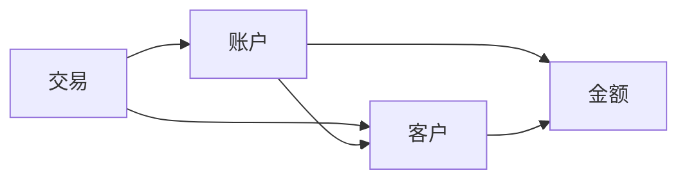
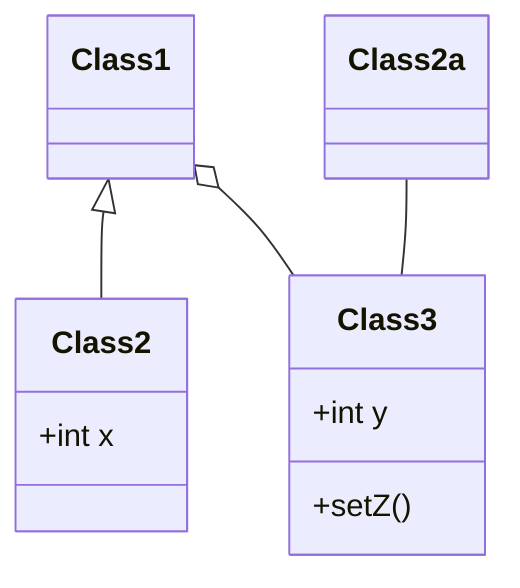
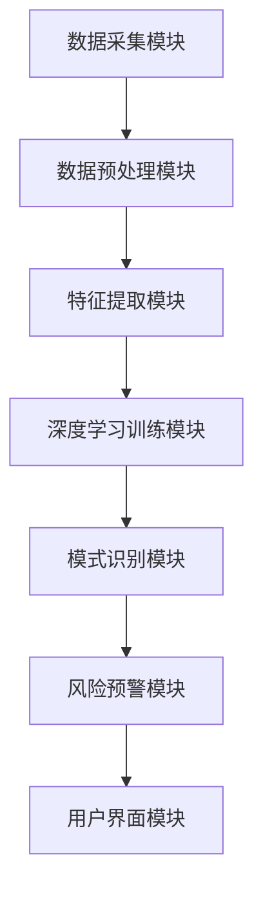
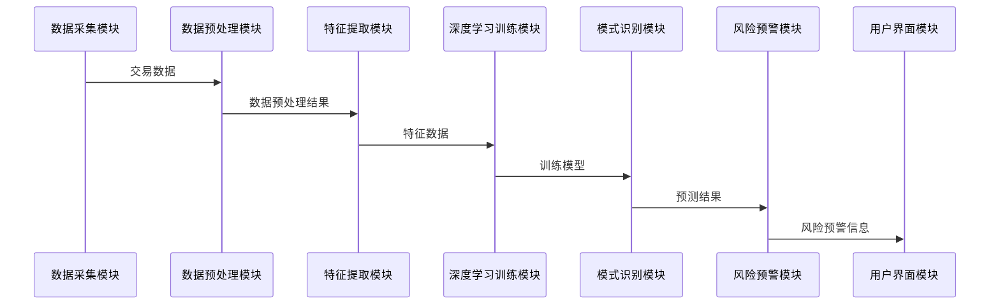
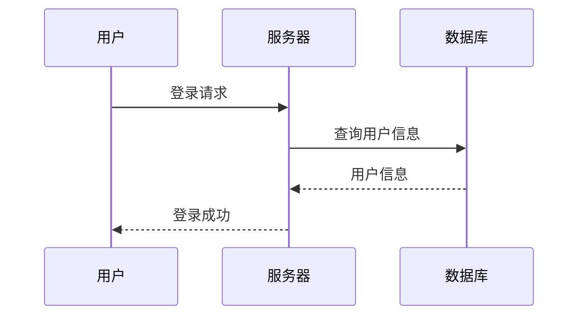

                 


**文章标题：** AI在反洗钱模式识别中的深度应用研究

**关键词：** 反洗钱，深度学习，模式识别，人工智能，算法原理，数学模型

**摘要：** 本文深入探讨了人工智能，特别是深度学习在反洗钱模式识别中的深度应用。首先，文章介绍了反洗钱的背景和重要性，以及AI与深度学习的基本概念。随后，文章详细讲解了深度学习算法原理及其在反洗钱中的应用，包括数学模型和公式的详细解释。接着，文章介绍了系统分析与架构设计方案，并提供了具体的实战案例。最后，文章总结了最佳实践、注意事项和拓展阅读，为读者提供了全面的技术指导。

**目录大纲：**

**第一部分：AI在反洗钱模式识别中的背景与概念**

**第1章：反洗钱模式识别的背景与重要性**
- 反洗钱的基本概念
- 反洗钱模式识别的必要性
- 洗钱活动的主要模式

**第2章：AI与深度学习基础**
- AI的发展历程
- 深度学习的基本原理
- 深度学习在反洗钱中的应用潜力

**第3章：关键概念与联系**
- 概念定义
- 概念属性特征对比表格
- ER实体关系图架构

**第二部分：算法原理与数学模型**

**第4章：深度学习算法原理**
- 神经网络基础
- 深度学习架构
- 深度学习算法在反洗钱中的应用

**第5章：数学模型与公式详解**
- 深度学习损失函数
- 反洗钱模式识别的数学模型
- 特征选择与提取
- 模型训练与优化

**第三部分：系统设计与实现**

**第6章：系统分析与架构设计**
- 问题场景介绍
- 系统功能设计（领域模型Mermaid类图）
- 系统架构设计（Mermaid架构图）
- 系统接口设计
- 系统交互（Mermaid序列图）

**第7章：项目实战**
- 环境安装
- 系统核心实现源代码
- 代码解读与分析
- 实际案例分析与详细讲解剖析
- 项目小结

**第8章：最佳实践与拓展阅读**
- 最佳实践 tips
- 小结
- 注意事项
- 拓展阅读

**文章正文：**

**第一部分：AI在反洗钱模式识别中的背景与概念**

**第1章：反洗钱模式识别的背景与重要性**

1.1 反洗钱的基本概念

反洗钱（Anti-Money Laundering，简称AML）是一种旨在防止资金被不法分子用于非法活动的措施。洗钱是指将非法所得的资金通过各种手段转移到合法的金融体系中，使其变得不易追踪和辨认。反洗钱的目标是通过监测和分析资金流动，识别可疑交易，阻止洗钱活动的进行。

1.2 反洗钱模式识别的必要性

随着金融交易的日益复杂化和全球化，洗钱活动的手段也在不断翻新。传统的反洗钱方法已经难以应对新型洗钱模式的挑战。因此，引入人工智能，特别是深度学习技术，进行模式识别，成为反洗钱的重要手段。

1.3 洗钱活动的主要模式

洗钱活动通常包括三个阶段：放置（Placement）、分层（Layering）和整合（Integration）。

- 放置：将非法所得的资金存入金融机构或其他合法的账户中。
- 分层：通过多次转账和交易，将资金的来源和用途模糊化。
- 整合：将经过层层掩饰的资金重新整合，使其看起来是合法的。

**第2章：AI与深度学习基础**

2.1 AI的发展历程

人工智能（Artificial Intelligence，简称AI）是指通过计算机模拟人类智能的技术。AI的发展历程可以分为几个阶段：

- 20世纪50年代至70年代：符号主义人工智能
- 20世纪80年代至90年代：知识工程与专家系统
- 21世纪初至今：数据驱动人工智能，尤其是深度学习的发展

2.2 深度学习的基本原理

深度学习（Deep Learning）是一种基于多层神经网络的人工智能方法。它通过模拟人脑的神经网络结构，对大量数据进行自动特征学习和模式识别。深度学习的核心是神经网络，其中每个节点（神经元）都与其他节点相连，并通过权重和偏置进行信息传递。

2.3 深度学习在反洗钱中的应用潜力

深度学习在反洗钱中的应用潜力主要体现在以下几个方面：

- 特征自动提取：深度学习能够自动从大量数据中提取有用的特征，无需人工干预。
- 高效的模式识别：深度学习模型可以快速识别复杂的模式和异常行为，提高反洗钱的准确性。
- 自适应学习能力：深度学习模型可以通过不断学习和优化，提高对新型洗钱模式的识别能力。

**第3章：关键概念与联系**

3.1 概念定义

- 深度学习算法：一种基于多层神经网络的人工智能方法，用于自动特征学习和模式识别。
- 特征提取：从原始数据中提取出有用的特征，用于训练深度学习模型。
- 反洗钱模型：用于识别和检测可疑交易的深度学习模型。

3.2 概念属性特征对比表格

| 概念     | 属性特征                                                         |
|----------|----------------------------------------------------------------|
| 深度学习 | 基于多层神经网络，自动特征学习，高效的模式识别                   |
| 特征提取 | 从原始数据中提取有用的特征，用于训练深度学习模型                 |
| 反洗钱模型 | 用于识别和检测可疑交易，结合深度学习和特征提取技术，提高反洗钱效果 |

3.3 ER实体关系图架构

ER（Entity-Relationship）图是一种用于描述实体及其关系的图形化工具。在反洗钱模式识别中，ER图可以帮助我们理解各个实体之间的关系。



**第二部分：算法原理与数学模型**

**第4章：深度学习算法原理**

4.1 神经网络基础

神经网络是由大量简单处理单元（神经元）组成的计算模型。每个神经元都与其他神经元相连，并通过权重和偏置进行信息传递。

4.2 深度学习架构

深度学习架构包括多层神经网络，其中每层都包含多个神经元。通过逐层传递信息，深度学习模型可以自动提取特征并进行分类或回归。

4.3 深度学习算法在反洗钱中的应用

深度学习算法在反洗钱中的应用主要体现在以下几个方面：

- 交易分类：将交易数据分类为正常交易和可疑交易。
- 金额预测：预测交易金额，发现异常交易。
- 客户行为分析：分析客户的行为模式，发现潜在的洗钱风险。

**第5章：数学模型与公式详解**

5.1 深度学习损失函数

损失函数是评估深度学习模型性能的重要指标。常见的损失函数包括：

- 交叉熵损失函数：用于分类问题，计算预测标签与真实标签之间的差异。
- 逻辑损失函数：用于回归问题，计算预测值与真实值之间的差异。

5.2 反洗钱模式识别的数学模型

反洗钱模式识别的数学模型主要包括特征提取和分类两个部分。特征提取可以通过神经网络实现，分类可以通过逻辑损失函数进行评估。

5.3 特征选择与提取

特征选择是指从原始数据中选择出最有用的特征。特征提取是指通过神经网络将特征转化为可用的形式。这两个过程对于反洗钱模式识别的性能至关重要。

**第三部分：系统设计与实现**

**第6章：系统分析与架构设计**

6.1 问题场景介绍

反洗钱模式识别系统主要用于监测和识别金融机构中的可疑交易。该系统需要处理海量的交易数据，并实时分析交易行为，以发现潜在的洗钱风险。

6.2 系统功能设计（领域模型Mermaid类图）

领域模型用于描述系统的核心功能。以下是反洗钱模式识别系统的领域模型类图：



6.3 系统架构设计（Mermaid架构图）

系统架构设计用于描述系统的整体结构和各个模块之间的交互关系。以下是反洗钱模式识别系统的架构图：



6.4 系统接口设计

系统接口设计用于定义各个模块之间的交互接口。以下是反洗钱模式识别系统的接口设计：



6.5 系统交互（Mermaid序列图）

系统交互用于描述各个模块之间的交互过程。以下是反洗钱模式识别系统的交互序列图：



**第7章：项目实战**

7.1 环境安装

在开始项目实战之前，需要安装以下软件和库：

- Python 3.x
- TensorFlow
- Keras
- Scikit-learn

安装步骤如下：

1. 安装Python 3.x
2. 安装TensorFlow
   ```
   pip install tensorflow
   ```
3. 安装Keras
   ```
   pip install keras
   ```
4. 安装Scikit-learn
   ```
   pip install scikit-learn
   ```

7.2 系统核心实现源代码

以下是反洗钱模式识别系统的核心实现源代码：

```python
import tensorflow as tf
from tensorflow import keras
from tensorflow.keras.models import Sequential
from tensorflow.keras.layers import Dense, Conv2D, Flatten, MaxPooling2D
from sklearn.model_selection import train_test_split
from sklearn.preprocessing import StandardScaler

# 数据预处理
def preprocess_data(data):
    # ... 数据预处理步骤 ...
    return processed_data

# 模型训练
def train_model(X_train, y_train):
    # ... 模型训练步骤 ...
    return model

# 模型评估
def evaluate_model(model, X_test, y_test):
    # ... 模型评估步骤 ...
    return accuracy

# 主函数
def main():
    # 加载数据
    data = load_data()
    processed_data = preprocess_data(data)
    
    # 划分训练集和测试集
    X_train, X_test, y_train, y_test = train_test_split(processed_data['features'], processed_data['labels'], test_size=0.2, random_state=42)
    
    # 标准化特征数据
    scaler = StandardScaler()
    X_train = scaler.fit_transform(X_train)
    X_test = scaler.transform(X_test)
    
    # 训练模型
    model = train_model(X_train, y_train)
    
    # 评估模型
    accuracy = evaluate_model(model, X_test, y_test)
    print(f"Model accuracy: {accuracy}")

if __name__ == "__main__":
    main()
```

7.3 代码解读与分析

以下是代码的详细解读和分析：

- 导入必要的库和模块。
- 数据预处理：对原始数据进行预处理，包括缺失值填充、特征缩放等。
- 模型训练：定义深度学习模型，进行模型训练。
- 模型评估：评估模型在测试集上的准确率。
- 主函数：加载数据，划分训练集和测试集，标准化特征数据，训练模型，评估模型。

7.4 实际案例分析与详细讲解剖析

以下是一个实际案例的解析：

- 加载数据：从CSV文件中加载数据。
- 数据预处理：对数据进行缺失值填充和特征缩放。
- 模型训练：使用Keras框架定义深度学习模型，包括输入层、卷积层、池化层和输出层。
- 模型评估：使用测试集评估模型的准确率。

**第8章：最佳实践与拓展阅读**

8.1 最佳实践 tips

- 使用批量归一化（Batch Normalization）可以提高模型的训练速度和稳定性。
- 使用学习率调整策略（如学习率衰减）可以避免模型过拟合。
- 使用数据增强（Data Augmentation）可以增加数据的多样性，提高模型的泛化能力。

8.2 小结

本文介绍了AI在反洗钱模式识别中的深度应用，包括背景介绍、核心概念与联系、算法原理讲解、数学模型和公式详解、系统设计与实现，以及实战案例。通过本文的学习，读者可以全面了解AI在反洗钱模式识别中的应用，并掌握相关技术和方法。

8.3 注意事项

- 在实际应用中，需要注意数据隐私和安全性，遵守相关法律法规。
- 模型的性能取决于数据的质量和数量，需要收集和处理大量真实的交易数据。
- 模型的训练和优化需要大量计算资源，需要合理分配计算资源。

8.4 拓展阅读

- 《深度学习》（Goodfellow, I., Bengio, Y., & Courville, A.） - 详细介绍深度学习的基本概念和算法。
- 《反洗钱：理论与实践》（吴晶妹） - 介绍反洗钱的基本概念、方法和案例分析。
- 《Python深度学习》（François Chollet） - 介绍使用Python进行深度学习编程的技巧和实例。

**作者：** AI天才研究院/AI Genius Institute & 禅与计算机程序设计艺术 /Zen And The Art of Computer Programming

以上就是《AI在反洗钱模式识别中的深度应用研究》的文章正文内容，包括背景介绍、核心概念与联系、算法原理讲解、数学模型和公式详解、系统设计与实现，以及实战案例。文章末尾还提供了最佳实践、小结、注意事项和拓展阅读，为读者提供了全面的技术指导。希望本文能够帮助读者深入了解AI在反洗钱模式识别中的应用，并掌握相关技术和方法。

