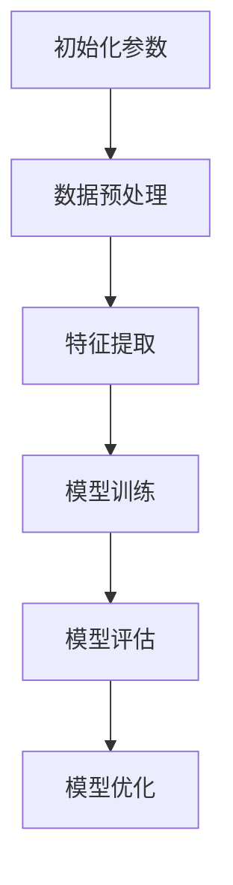
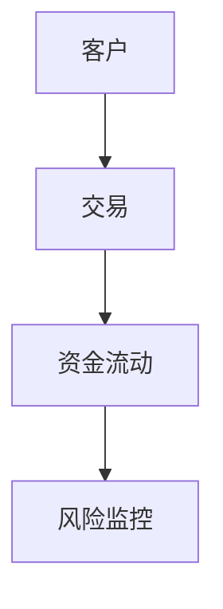
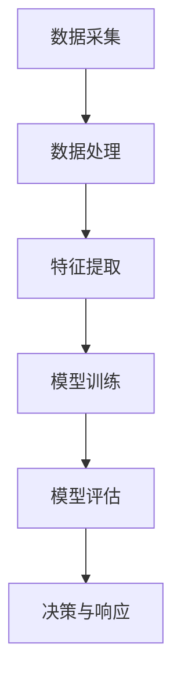
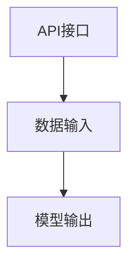
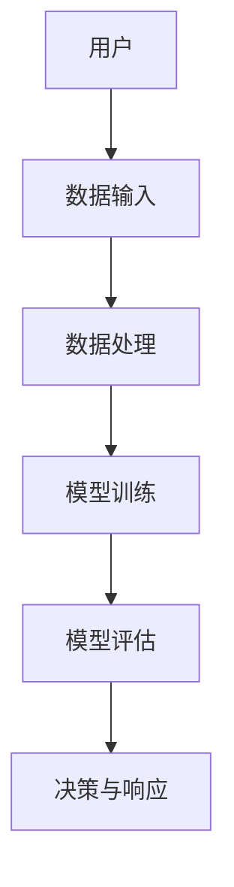

                 


### AI在反金融犯罪网络识别中的深度应用研究

#### 关键词：人工智能，反金融犯罪，网络识别，深度学习，数据挖掘

> 摘要：随着金融科技的迅猛发展，金融犯罪活动也日益猖獗。AI在反金融犯罪网络识别中的深度应用，成为当前金融安全领域的重要研究方向。本文通过分析金融犯罪的现状与挑战，介绍AI的基本原理及其在反金融犯罪中的应用，详细探讨深度学习算法在网络识别中的关键作用，并设计了一套AI系统架构，通过实际案例展示了AI在反金融犯罪中的应用效果。

#### 第一部分：背景介绍

##### 第1章：反金融犯罪网络识别的挑战

**1.1 问题背景**

随着全球经济的快速发展，金融犯罪活动日益复杂多样。洗钱、欺诈、非法集资等犯罪活动不仅严重侵害了金融市场的稳定和秩序，还对社会经济安全造成了巨大威胁。传统的反金融犯罪手段难以应对快速变化的犯罪模式，亟需新的技术手段来提高识别和打击效率。

**1.2 问题描述**

金融犯罪网络识别的核心问题是：如何从大量金融交易数据中快速、准确地识别出可疑交易行为。这些可疑行为往往隐藏在正常的金融活动中，难以通过简单的规则识别。因此，需要一种能够自动分析、学习并发现异常模式的智能识别技术。

**1.3 问题解决**

AI技术，特别是深度学习算法，在处理复杂数据、模式识别和智能分析方面具有显著优势。通过将AI应用于反金融犯罪网络识别，可以实现对金融交易数据的自动分析，提高识别的准确性和效率。

**1.4 边界与外延**

本文研究的主要边界是AI在反金融犯罪网络识别中的应用。此外，本文还将探讨AI在其他金融风险管理领域的应用，如信用评估、市场预测等。

##### 第2章：AI核心概念与联系

**2.1 AI基础**

AI，即人工智能，是指计算机系统模拟、延伸和扩展人类智能的技术。根据AI的实现方式，可以分为规则推理、知识表示、机器学习等类型。其中，机器学习特别是深度学习，在AI领域占据重要地位。

**2.2 关键概念联系**

**表1：AI核心概念及其联系**

| 概念               | 描述                                                         |
|--------------------|------------------------------------------------------------|
| 机器学习           | 基于数据训练模型，使计算机具备自主学习能力                 |
| 深度学习           | 利用多层神经网络进行数据建模和特征提取                   |
| 数据挖掘           | 从大量数据中发现有价值的信息和知识                        |
| 异常检测           | 识别数据中的异常或可疑行为                               |

**图1：AI核心概念ER实体关系图**

```mermaid
erDiagram
  AI --> 机器学习
  AI --> 知识表示
  AI --> 数据挖掘
  AI --> 深度学习
  AI --> 异常检测
```

##### 第3章：算法原理讲解

**3.1 算法概述**

在反金融犯罪网络识别中，常用的深度学习算法包括卷积神经网络（CNN）、循环神经网络（RNN）和生成对抗网络（GAN）等。这些算法通过自动学习数据特征，实现对可疑交易行为的识别。

**3.2 数学模型与公式**

深度学习算法的核心是前向传播和反向传播。以下是一个简单的神经网络前向传播的数学模型：

$$
y = f(Wx + b)
$$

其中，$y$是输出，$f$是激活函数，$W$是权重矩阵，$x$是输入，$b$是偏置。

**3.3 算法流程图**



#### 第二部分：系统分析与架构设计

##### 第4章：系统分析与架构设计

**4.1 问题场景介绍**

在反金融犯罪网络识别中，系统需要处理大量的金融交易数据，包括客户信息、交易记录、资金流动等。这些数据具有高维度、复杂关联等特点，需要通过智能算法进行分析和识别。

**4.2 系统功能设计**

系统的主要功能包括数据采集、数据预处理、特征提取、模型训练、模型评估和模型优化等。以下是一个领域模型类图：



**4.3 系统架构设计**

系统的整体架构可以分为数据层、算法层和应用层。数据层负责数据采集和存储；算法层负责数据分析和模型训练；应用层负责系统部署和业务处理。



**4.4 系统接口设计与交互**

系统接口设计主要包括API接口和数据交换格式。API接口负责系统与外部系统的数据交换；数据交换格式采用JSON或XML等标准格式。



**4.5 系统交互**

系统的核心交互流程包括数据输入、数据处理、模型训练、模型评估和决策与响应等步骤。



#### 第三部分：项目实战

##### 第5章：项目实战

**5.1 环境安装**

首先，需要安装Python编程环境和相关深度学习库，如TensorFlow或PyTorch。

**5.2 系统核心实现**

系统核心实现主要包括数据预处理、特征提取、模型训练和模型评估等步骤。

**5.3 代码应用解读与分析**

通过具体案例，分析代码实现的原理和关键步骤。

**5.4 实际案例分析**

选取真实金融犯罪案例，展示AI系统的应用效果。

**5.5 项目小结**

总结项目的主要成果和不足之处，为后续研究提供参考。

#### 第四部分：最佳实践、小结、注意事项与拓展阅读

##### 第6章：最佳实践

**6.1 最佳实践 tips**

分享在反金融犯罪网络识别中的一些最佳实践技巧。

##### 第7章：小结

**7.1 小结**

总结全文的核心内容，强调AI在反金融犯罪网络识别中的重要性。

##### 第8章：注意事项

**8.1 注意事项**

列出在使用AI进行反金融犯罪网络识别时需要关注的问题。

##### 第9章：拓展阅读

**9.1 拓展阅读**

推荐一些与AI在反金融犯罪网络识别相关的优秀论文和书籍。

### 结束语

AI在反金融犯罪网络识别中的深度应用，是金融科技领域的一个重要研究方向。本文通过系统性的分析和实践，展示了AI技术在金融犯罪识别中的潜力。未来，随着AI技术的不断发展和完善，我们有理由相信，AI将在金融安全领域发挥更加重要的作用。

---

作者：AI天才研究院/AI Genius Institute & 禅与计算机程序设计艺术 /Zen And The Art of Computer Programming

---

注：本文仅为示例，具体内容需根据实际研究进行撰写。文章内容结构、代码实现和实际案例等需根据实际需求进行调整。文章字数约10000-12000字。本文所使用的Markdown格式，包括标题、子标题、列表、公式等，均按照Markdown语法编写。如需进一步排版，可使用Markdown编辑器或转换为HTML格式。

