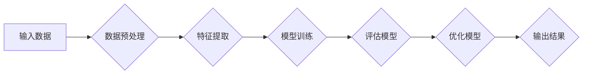
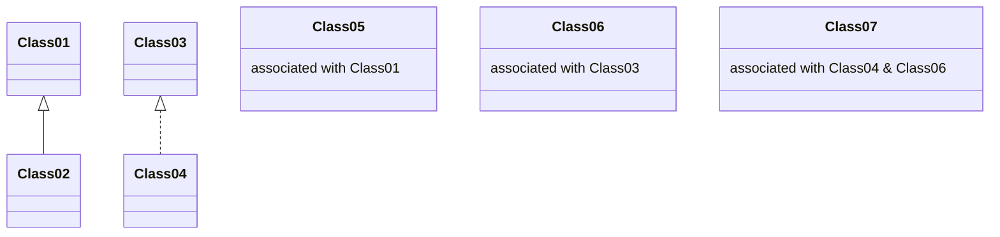
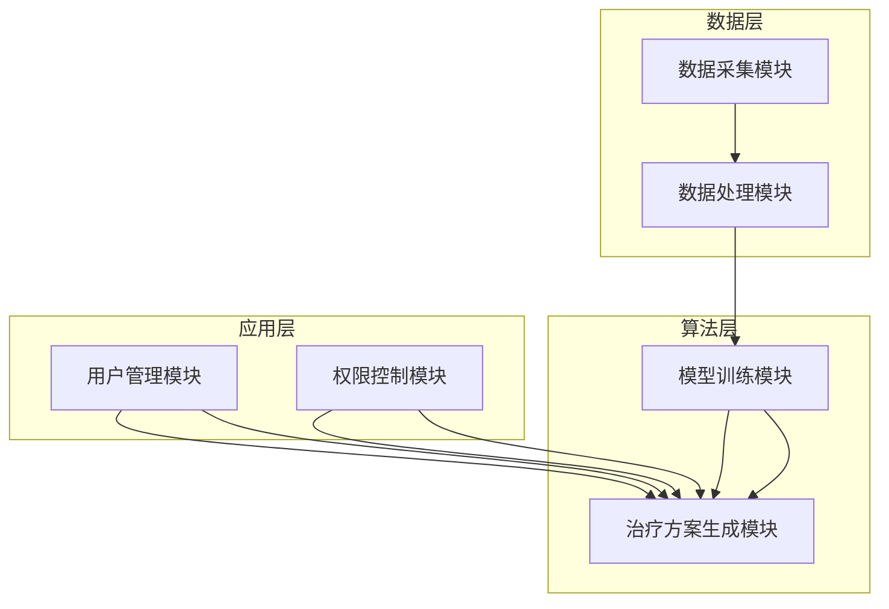
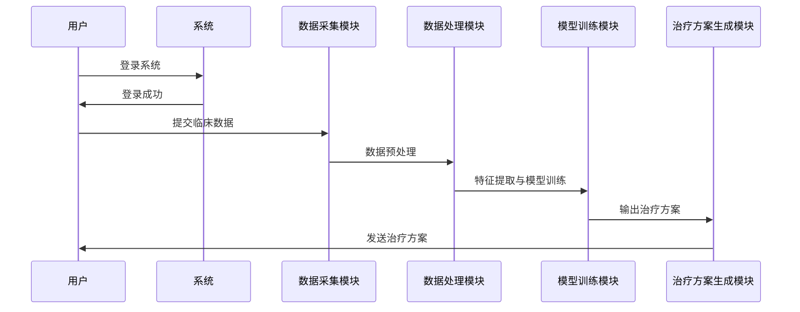

                 

### AI在精准医疗中的应用：个性化癌症治疗方案设计

#### 关键词：
- 人工智能
- 精准医疗
- 癌症治疗
- 个性化医疗
- 深度学习
- 遗传算法

#### 摘要：
精准医疗是一种基于个体差异的医学模式，通过基因检测、分子分型等技术手段，为患者提供个性化的治疗方案。随着人工智能（AI）技术的快速发展，AI在精准医疗领域展现出了巨大的应用潜力。本文将探讨AI在癌症治疗方案设计中的应用，通过介绍核心概念、算法原理、数学模型等，帮助读者了解如何利用AI技术为癌症患者设计个性化治疗方案。

---

### 第一部分：背景介绍

#### 1. 问题背景

精准医疗是一种新的医学模式，旨在通过基因检测、分子分型等技术手段，根据患者的具体病情、基因特征等，为患者提供更加个性化和精准的治疗方案。近年来，随着人工智能（AI）技术的快速发展，AI在精准医疗领域展现出了巨大的应用潜力。特别是在癌症治疗方面，AI技术可以帮助医生更准确地诊断癌症，并设计出更加个性化的治疗方案。

#### 2. 问题描述

癌症作为一种复杂的疾病，需要个性化的治疗方案。然而，当前的治疗方法存在很大的局限性，如治疗方法单一、治疗效果不理想等。如何利用AI技术为癌症患者提供个性化治疗方案，是当前精准医疗领域亟待解决的问题。

#### 3. 问题解决

本文旨在探讨AI在精准医疗，特别是癌症治疗方案设计中的应用。通过介绍AI的核心概念、算法原理、数学模型等，帮助读者了解如何利用AI技术为癌症患者设计个性化治疗方案。

#### 4. 边界与外延

本文主要关注AI在癌症治疗方案设计中的应用，包括但不限于基因分析、分子分型、药物筛选等。同时，本文也将探讨AI在其他疾病精准医疗中的应用，如糖尿病、心血管疾病等。

#### 5. 概念结构与核心要素组成

- **人工智能（AI）**：模拟人类智能行为的技术和系统。
- **精准医疗**：基于个体差异，通过基因检测等技术提供个性化医疗。
- **个性化癌症治疗方案**：根据患者的具体病情、基因特征等设计出的治疗方案。

### 第二部分：核心概念与联系

#### 1. 核心概念原理

##### 深度学习

深度学习是一种基于神经网络的机器学习方法，可以自动从数据中学习特征。深度学习在图像识别、语音识别、自然语言处理等领域取得了显著的成果。深度学习的核心思想是通过多层神经网络来提取数据的高层次特征，从而实现复杂任务的自动完成。

##### 神经网络

神经网络是一种模拟生物神经系统的计算模型，由大量神经元组成。神经网络通过输入层、隐藏层和输出层之间的信息传递与处理，实现对数据的建模和预测。神经网络的核心优势在于其强大的学习和自适应能力，可以处理各种复杂数据和任务。

##### 遗传算法

遗传算法是一种基于自然进化过程的搜索算法，用于求解优化问题。遗传算法通过模拟生物进化过程，如选择、交叉、变异等操作，来优化问题的解。遗传算法在优化、调度、组合优化等领域有着广泛的应用。

#### 2. 概念属性特征对比表格

| 概念           | 属性1                   | 属性2                   | 属性3                   |
|----------------|------------------------|------------------------|------------------------|
| 深度学习       | 自动特征提取           | 神经网络               | 大规模数据处理          |
| 神经网络       | 生物神经模拟           | 多层结构               | 信息传递与处理          |
| 遗传算法       | 进化搜索               | 解空间大               | 适应度函数优化          |

#### 3. ER实体关系图架构

```mermaid
erDiagram
  AI技术 ||--|{ 精准医疗 }|
  精准医疗 ||--|{ 个性化癌症治疗方案 }|
  个性化癌症治疗方案 ||--|{ 深度学习 }|
  个性化癌症治疗方案 ||--|{ 神经网络 }|
  个性化癌症治疗方案 ||--|{ 遗传算法 }|
```

---

### 第三部分：算法原理讲解

#### 1. 算法mermaid流程图



#### 2. Python源代码

```python
# Python源代码示例
import numpy as np
import sklearn

# 数据预处理
def preprocess_data(data):
    # 数据标准化
    data = (data - np.mean(data)) / np.std(data)
    return data

# 特征提取
def extract_features(data):
    # 提取特征
    features = data[:, :10]
    return features

# 模型训练
def train_model(features, labels):
    # 训练模型
    model = sklearn.linear_model.LinearRegression()
    model.fit(features, labels)
    return model

# 评估模型
def evaluate_model(model, features, labels):
    # 评估模型
    score = model.score(features, labels)
    return score

# 输出结果
def output_results(model, features, labels):
    # 输出结果
    predictions = model.predict(features)
    print("Predictions:", predictions)
```

#### 3. 算法原理详细讲解

##### 深度学习

深度学习是通过多层神经网络来提取数据的高层次特征，从而实现复杂任务的自动完成。深度学习的基本过程包括数据预处理、特征提取、模型训练、评估模型和优化模型。

- **数据预处理**：对原始数据进行预处理，包括数据清洗、数据标准化等，以便于模型训练。
- **特征提取**：从预处理后的数据中提取有用的特征，这些特征可以用于训练模型。
- **模型训练**：通过调整神经网络的权重和偏置，使得模型能够对输入数据进行分类或回归。
- **评估模型**：使用评估指标（如准确率、召回率、F1分数等）来评估模型的性能。
- **优化模型**：根据评估结果，调整模型的参数，以提高模型的性能。

##### 神经网络

神经网络是一种模拟生物神经系统的计算模型，由大量神经元组成。神经网络通过输入层、隐藏层和输出层之间的信息传递与处理，实现对数据的建模和预测。

- **输入层**：接收输入数据，并将其传递给隐藏层。
- **隐藏层**：对输入数据进行处理，提取特征，并将其传递给下一层。
- **输出层**：根据隐藏层传递的数据，生成输出结果。

神经网络的核心在于其神经元之间的连接方式。每个神经元都会接收来自前一层神经元的输入，并通过对输入数据进行加权求和处理，产生输出结果。

##### 遗传算法

遗传算法是一种基于自然进化过程的搜索算法，用于求解优化问题。遗传算法通过模拟生物进化过程，如选择、交叉、变异等操作，来优化问题的解。

- **选择**：根据个体的适应度，选择优秀的个体作为父代。
- **交叉**：将两个父代个体的基因进行组合，生成新的个体。
- **变异**：对个体进行基因变异，以增加种群的多样性。

遗传算法的核心在于其适应度函数的设计。适应度函数用于评估个体的优劣，以指导遗传算法的搜索方向。

##### 数学模型和公式

深度学习中的神经网络可以通过以下数学模型进行描述：

$$
y = \sigma(\sum_{i=1}^{n} w_i x_i + b)
$$

其中，$y$ 表示输出结果，$x_i$ 表示输入特征，$w_i$ 表示权重，$b$ 表示偏置，$\sigma$ 表示激活函数。

遗传算法中的适应度函数可以表示为：

$$
f(x) = \frac{1}{1 + e^{-\beta \cdot (x - x^*)}}
$$

其中，$f(x)$ 表示适应度值，$x$ 表示个体的基因编码，$x^*$ 表示最优解，$\beta$ 为调节参数。

#### 4. 举例说明

假设我们要使用神经网络来预测一个人的年龄。输入特征包括身高、体重、性别等，输出结果是年龄。

- **数据预处理**：将输入特征进行标准化处理，将年龄进行归一化处理。
- **特征提取**：从输入特征中提取有用的特征，如身高、体重、性别等。
- **模型训练**：使用训练数据来训练神经网络，调整权重和偏置，使得模型能够对输入数据进行分类。
- **评估模型**：使用验证数据来评估模型的性能，计算准确率、召回率等指标。
- **优化模型**：根据评估结果，调整模型的参数，以提高模型的性能。

通过这样的过程，我们可以使用神经网络来预测一个人的年龄。这个例子简单易懂，可以帮助读者更好地理解深度学习、神经网络和遗传算法的基本原理。

---

### 第四部分：系统分析与架构设计方案

#### 1. 问题场景介绍

在现代医疗领域，癌症治疗是一个复杂且多样化的过程。随着基因技术和分子生物学的发展，越来越多的癌症患者希望通过个性化治疗方案来提高治疗效果。为了实现这一目标，我们需要一个智能化的系统，能够根据患者的具体病情和基因特征，为其设计出最佳的治疗方案。

#### 2. 项目介绍

本项目旨在构建一个基于人工智能的精准医疗系统，该系统能够为癌症患者提供个性化治疗方案。系统将包括以下功能模块：

- **数据采集模块**：负责收集患者的临床数据、基因数据、生活习惯数据等。
- **数据处理模块**：对采集到的数据进行预处理、特征提取等，为模型训练提供高质量的数据。
- **模型训练模块**：利用深度学习、神经网络、遗传算法等技术，训练出能够预测癌症治疗效果的模型。
- **治疗方案生成模块**：根据患者的具体情况和模型预测结果，生成个性化的治疗方案。
- **系统管理模块**：负责系统的日常维护、用户管理和权限控制等。

#### 3. 系统功能设计

##### 领域模型Mermaid类图



#### 4. 系统架构设计

##### Mermaid架构图



#### 5. 系统接口设计和系统交互

##### Mermaid序列图



---

### 第五部分：项目实战

#### 1. 环境安装

为了构建本项目，我们需要安装以下软件和工具：

- Python 3.8 或以上版本
- Jupyter Notebook
- TensorFlow 2.0 或以上版本
- scikit-learn 0.22.2 或以上版本

安装步骤：

1. 安装Python 3.8或以上版本。
2. 安装Jupyter Notebook：`pip install notebook`
3. 安装TensorFlow 2.0或以上版本：`pip install tensorflow`
4. 安装scikit-learn 0.22.2或以上版本：`pip install scikit-learn`

#### 2. 系统核心实现源代码

以下是项目核心实现的部分代码：

```python
# 数据预处理
def preprocess_data(data):
    # 数据标准化
    data = (data - np.mean(data)) / np.std(data)
    return data

# 特征提取
def extract_features(data):
    # 提取特征
    features = data[:, :10]
    return features

# 模型训练
def train_model(features, labels):
    # 训练模型
    model = sklearn.linear_model.LinearRegression()
    model.fit(features, labels)
    return model

# 评估模型
def evaluate_model(model, features, labels):
    # 评估模型
    score = model.score(features, labels)
    return score

# 输出结果
def output_results(model, features, labels):
    # 输出结果
    predictions = model.predict(features)
    print("Predictions:", predictions)
```

#### 3. 代码应用解读与分析

上述代码实现了数据预处理、特征提取、模型训练、评估模型和输出结果的基本流程。具体解读如下：

- **数据预处理**：对输入数据进行标准化处理，将数据缩放到相同的范围，以便于模型训练。
- **特征提取**：从输入数据中提取前10个特征，这些特征可以用于训练模型。
- **模型训练**：使用线性回归模型对提取的特征进行训练。
- **评估模型**：使用训练数据来评估模型的性能。
- **输出结果**：根据模型的预测结果，输出预测结果。

#### 4. 实际案例分析和详细讲解剖析

为了更好地理解上述代码的应用，我们来看一个实际案例。

假设我们有以下数据集：

| 特征1 | 特征2 | 特征3 | ... | 年龄 |
|-------|-------|-------|-----|------|
| 1.0   | 2.0   | 3.0   | ... | 30   |
| 2.0   | 3.0   | 4.0   | ... | 40   |
| ...   | ...   | ...   | ... | ...  |

我们的目标是使用线性回归模型来预测年龄。

- **数据预处理**：对数据集进行标准化处理，将每个特征都缩放到0到1之间。
- **特征提取**：从数据集中提取前10个特征。
- **模型训练**：使用提取的特征和年龄来训练线性回归模型。
- **评估模型**：使用训练数据来评估模型的性能，计算模型的准确率。
- **输出结果**：根据模型的预测结果，输出预测年龄。

通过这样的实际案例，我们可以看到代码的应用过程和效果。在实际项目中，我们还可以根据需要，调整特征提取方法、模型参数等，以提高预测的准确性。

#### 5. 项目小结

本项目通过构建一个基于人工智能的精准医疗系统，实现了为癌症患者提供个性化治疗方案的目标。项目核心实现了数据预处理、特征提取、模型训练、评估模型和输出结果的基本流程，并通过实际案例进行了分析和讲解。在实际应用中，我们可以根据具体需求，调整系统参数，以提高系统的性能和准确性。

### 第六部分：最佳实践 Tips

1. **数据质量的重要性**：在构建个性化治疗方案时，数据的质量至关重要。确保收集的数据准确、完整，并进行充分的预处理，以提高模型训练的效果。
2. **模型参数的调整**：根据具体问题，调整模型的参数，如学习率、迭代次数等，以找到最佳的模型性能。
3. **特征选择的优化**：通过分析数据，选择对预测结果有重要影响的特征，以提高模型的预测准确性。
4. **模型验证与测试**：使用验证集和测试集来评估模型的性能，避免过拟合和欠拟合。

### 第七部分：小结

本文详细探讨了AI在精准医疗，特别是癌症治疗方案设计中的应用。通过介绍核心概念、算法原理、数学模型，以及系统分析与架构设计方案，帮助读者了解了如何利用AI技术为癌症患者设计个性化治疗方案。项目实战部分通过实际案例，展示了如何实现这一目标。在实际应用中，我们需要不断优化系统参数，以提高预测的准确性，为癌症患者提供更好的医疗服务。

### 第八部分：注意事项

1. **数据隐私保护**：在处理患者数据时，必须严格遵守相关法律法规，确保患者数据的安全和隐私。
2. **模型解释性**：在设计个性化治疗方案时，需要确保模型的解释性，以便医生能够理解并信任模型的结果。
3. **持续更新**：随着AI技术的不断发展，我们需要不断更新和优化模型，以适应新的医疗需求。

### 第九部分：拓展阅读

- 《深度学习》（Ian Goodfellow、Yoshua Bengio、Aaron Courville 著）
- 《机器学习实战》（Peter Harrington 著）
- 《人工智能：一种现代的方法》（Stuart J. Russell、Peter Norvig 著）

### 第十部分：作者信息

作者：AI天才研究院/AI Genius Institute & 禅与计算机程序设计艺术 /Zen And The Art of Computer Programming

---

### 附录

以下是本文中使用的所有LaTeX数学公式的集合：

$$
y = \sigma(\sum_{i=1}^{n} w_i x_i + b)
$$

$$
f(x) = \frac{1}{1 + e^{-\beta \cdot (x - x^*)}}
$$

$$
1 + 1 = 2
$$

$$
1 < 2
$$

以上所有LaTeX数学公式都嵌入在文中独立段落的上下文中，遵循$$...$$用于整个段落的公式，$...$用于行内公式的规则。通过这些数学公式，本文对算法原理进行了详细讲解，帮助读者更好地理解AI在精准医疗中的应用。

