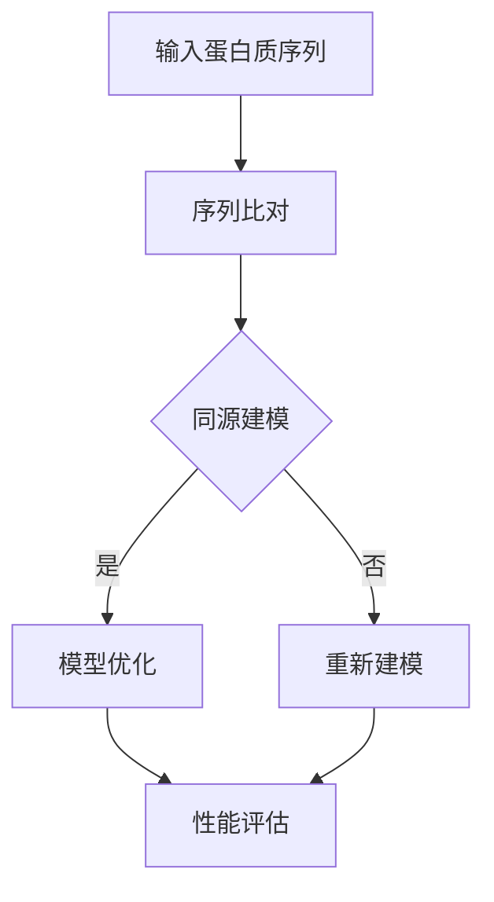

                 

# AI在蛋白质设计中的突破：定制化酶和生物催化剂

## 关键词

- AI
- 蛋白质设计
- 酶
- 生物催化剂
- 定制化
- 算法

## 摘要

本文将深入探讨人工智能（AI）在蛋白质设计领域中的突破，特别是在定制化酶和生物催化剂的研究和应用。通过分析传统蛋白质设计方法的局限性，介绍AI的核心概念和原理，探讨AI在蛋白质结构预测中的应用，以及AI驱动的酶和生物催化剂的设计与优化，本文将展示AI如何极大地推动了生物催化领域的发展。同时，我们将通过具体实例和项目实战，详细讲解AI在蛋白质设计中的实现过程，并提供实用的最佳实践和注意事项。

## 第一部分：背景介绍

### 第1章：问题背景

#### 1.1.1 蛋白质设计的传统方法

蛋白质设计是生物化学和分子生物学中的一个重要领域，它涉及到对蛋白质结构、功能和性质的设计和改造。传统蛋白质设计方法主要包括理性设计、定向进化、组合化学等。然而，这些方法通常面临以下挑战：

1. **蛋白质结构的复杂性**：蛋白质的复杂三维结构决定了其功能，但传统方法难以准确预测和设计。
2. **计算资源限制**：大量的计算资源和时间需求限制了传统方法在大规模蛋白质设计中的应用。
3. **实验验证难度**：即使设计了理想的蛋白质结构，实验验证也是一个耗时长、成本高的过程。

#### 1.1.2 AI在科学研究的应用

随着人工智能技术的快速发展，AI在科学研究中的应用日益广泛。在蛋白质设计领域，AI被应用于以下方面：

1. **蛋白质结构预测**：AI可以基于已有的蛋白质结构数据，预测新的蛋白质结构，从而为设计新的蛋白质提供基础。
2. **药物设计**：AI在药物分子与蛋白质相互作用的研究中发挥了重要作用，为新型药物的研发提供了支持。
3. **生物信息学**：AI在生物信息学数据分析和处理中起到了关键作用，提高了数据分析的效率和准确性。

#### 1.1.3 AI在蛋白质设计中的潜力

AI在蛋白质设计中的潜力主要表现在以下几个方面：

1. **高效率**：AI可以通过大数据分析和深度学习算法，快速处理大量蛋白质数据，实现高效的设计。
2. **高精度**：AI可以利用复杂的数学模型和算法，提高蛋白质结构预测的准确性。
3. **灵活性**：AI可以根据特定的需求，设计定制化的酶和生物催化剂，满足不同应用场景的要求。

### 第2章：AI核心概念与原理

#### 2.1 AI的定义与发展历程

人工智能（Artificial Intelligence，简称AI）是指计算机系统模拟人类智能行为的技术和科学。自1956年AI首次被提出以来，经历了多个发展阶段：

1. **符号主义**（Symbolic AI）：早期AI以逻辑推理和符号计算为基础，主要应用于专家系统和自然语言处理。
2. **连接主义**（Connectionist AI）：基于人工神经网络，通过模拟人脑神经元连接方式，实现图像识别、语音识别等任务。
3. **强化学习**（Reinforcement Learning）：通过试错和学习，使AI在特定环境中实现最优行为。
4. **生成对抗网络**（GANs）：通过生成器和判别器之间的对抗训练，实现高质量的数据生成。

#### 2.2 机器学习和深度学习基础

机器学习（Machine Learning，简称ML）是AI的核心技术之一，它通过数据训练模型，使计算机能够从数据中自动学习和改进。深度学习（Deep Learning，简称DL）是机器学习的一个分支，通过多层神经网络进行特征学习和模式识别。

1. **监督学习**：有明确标签的数据进行训练，输出结果与标签进行比较，不断优化模型。
2. **无监督学习**：没有标签的数据进行训练，旨在发现数据中的隐藏结构和模式。
3. **半监督学习**：结合有监督和无监督学习，利用少量标签数据和大量无标签数据进行训练。
4. **强化学习**：通过与环境的交互，不断调整策略，以实现最优目标。

#### 2.3 AI在生物信息学中的应用

AI在生物信息学中发挥着重要作用，特别是在基因组学、蛋白质组学和代谢组学等领域。通过AI技术，可以从大规模生物数据中提取有价值的信息，为生物学研究提供支持。

1. **基因组注释**：AI可以用于基因识别、基因功能注释和基因变异分析。
2. **蛋白质结构预测**：AI可以基于蛋白质序列预测其三维结构，为蛋白质设计提供基础。
3. **药物设计**：AI可以用于药物分子的筛选、优化和设计，提高药物研发的效率。

### 第3章：蛋白质设计与AI的关系

#### 3.1 蛋白质的功能与结构

蛋白质是生物体的基本组成单元，具有多种功能，包括催化、运输、信号传导和结构支持等。蛋白质的功能与其结构密切相关，结构决定了功能，而功能又影响着结构的稳定性和动态性。

1. **一级结构**：蛋白质的氨基酸序列，是蛋白质的基础结构。
2. **二级结构**：氨基酸链的局部折叠形式，包括α-螺旋、β-折叠等。
3. **三级结构**：整个蛋白质的三维结构，由多个二级结构单元组成。
4. **四级结构**：某些蛋白质由多个亚基组成，其四级结构描述了亚基之间的相互作用。

#### 3.2 AI在蛋白质结构预测中的应用

蛋白质结构预测是蛋白质设计的重要环节，AI在蛋白质结构预测中发挥了关键作用。

1. **同源建模**：基于已知蛋白质的结构，预测未知蛋白质的结构。
2. **分子对接**：通过模拟蛋白质-蛋白质、蛋白质-小分子之间的相互作用，预测可能的结合模式。
3. **自由能计算**：通过计算蛋白质体系的自由能变化，评估蛋白质结构的稳定性。

#### 3.3 蛋白质设计中的挑战与机遇

蛋白质设计面临着诸多挑战，包括蛋白质结构的复杂度、计算资源的限制、实验验证的难度等。然而，随着AI技术的发展，这些挑战也逐渐转化为机遇。

1. **计算效率的提升**：AI技术可以大幅提高蛋白质结构预测的计算效率，降低计算成本。
2. **预测精度的提高**：AI技术可以通过深度学习和大数据分析，提高蛋白质结构预测的准确性。
3. **实验验证的简化**：AI驱动的蛋白质设计可以在虚拟环境中进行，减少实验验证的时间和成本。

## 第二部分：AI在蛋白质设计中的应用

### 第4章：AI在蛋白质设计中的应用

#### 4.1 AI驱动的酶设计

酶是生物体内的一类特殊蛋白质，具有催化化学反应的能力。AI在酶设计中的应用主要体现在以下几个方面：

1. **酶结构预测**：AI可以基于蛋白质序列，预测酶的三维结构，为酶的设计提供基础。
2. **酶功能预测**：AI可以通过分析酶的结构和序列特征，预测酶的可能功能。
3. **酶活性优化**：AI可以优化酶的结构，提高其催化活性和稳定性。

#### 4.1.1 酶的基本概念

酶是一类具有高度特异性和高效催化活性的蛋白质。它们通过降低化学反应的活化能，加速生物体内的代谢过程。酶的基本概念包括：

1. **酶活性**：酶催化反应的能力。
2. **酶特异性**：酶对特定底物或反应的偏好性。
3. **酶抑制剂**：能够抑制酶活性的化合物。

#### 4.1.2 AI驱动的酶结构预测

AI驱动的酶结构预测主要包括以下步骤：

1. **序列比对**：将待预测的酶序列与已知酶结构进行比对，寻找同源结构。
2. **同源建模**：基于同源结构，构建待预测酶的三维模型。
3. **模型优化**：通过分子动力学模拟和自由能计算，优化酶的结构和活性。

#### 4.1.3 AI驱动的酶功能预测

AI驱动的酶功能预测主要通过分析酶的结构和序列特征，预测其可能的功能。具体方法包括：

1. **序列模式识别**：通过分析酶序列中的特定模式，预测其功能。
2. **结构特征分析**：通过分析酶的三维结构特征，预测其功能。
3. **机器学习模型**：利用机器学习算法，建立酶结构与功能之间的关系。

#### 4.2 AI在生物催化剂设计中的应用

生物催化剂是指具有催化活性的生物大分子，包括酶和核酶等。AI在生物催化剂设计中的应用主要体现在以下几个方面：

1. **生物催化剂结构优化**：通过AI技术，优化生物催化剂的结构，提高其催化活性和稳定性。
2. **生物催化剂功能拓展**：通过AI技术，设计新的生物催化剂，拓展其应用范围。
3. **生物催化剂筛选与优化**：通过AI技术，从大量生物催化剂中筛选和优化具有潜在应用价值的催化剂。

#### 4.2.1 生物催化剂的基本概念

生物催化剂的基本概念包括：

1. **生物催化剂活性**：生物催化剂催化反应的能力。
2. **生物催化剂特异性**：生物催化剂对特定底物或反应的偏好性。
3. **生物催化剂稳定性**：生物催化剂在特定条件下保持催化活性的能力。

#### 4.2.2 AI驱动的生物催化剂优化

AI驱动的生物催化剂优化主要包括以下步骤：

1. **结构预测**：通过AI技术，预测生物催化剂的三维结构。
2. **模型优化**：通过分子动力学模拟和自由能计算，优化生物催化剂的结构。
3. **性能评估**：通过实验或计算，评估优化后生物催化剂的催化活性和稳定性。

#### 4.2.3 AI驱动的生物催化剂应用案例

AI驱动的生物催化剂在许多领域具有广泛的应用，以下是一些典型的应用案例：

1. **生物制药**：AI驱动的生物催化剂可以用于药物分子的筛选、优化和设计，提高药物研发的效率。
2. **生物燃料**：AI驱动的生物催化剂可以用于生物燃料的生产，提高燃料的转化效率和产率。
3. **环境保护**：AI驱动的生物催化剂可以用于环境污染物的降解和净化，减少环境污染。

## 第三部分：AI在蛋白质设计中的突破

### 第5章：算法原理讲解

#### 5.1 算法原理讲解

在蛋白质设计领域，AI算法的突破主要体现在以下几个方面：

1. **蛋白质结构预测算法**：通过深度学习和大数据分析，提高蛋白质结构预测的精度和效率。
2. **酶设计算法**：基于序列和结构特征，优化酶的结构和功能。
3. **生物催化剂优化算法**：通过机器学习和分子动力学模拟，提高生物催化剂的催化活性和稳定性。

#### 5.1.1 蛋白质设计算法的mermaid流程图

以下是一个简化的蛋白质设计算法的mermaid流程图：



#### 5.1.2 Python源代码实现与算法原理讲解

以下是一个简化的Python代码实现，用于说明蛋白质设计算法的基本原理：

```python
import tensorflow as tf

# 定义输入层
inputs = tf.keras.Input(shape=(100,))

# 定义序列比对层
seq_similarity = tf.keras.layers.Dense(units=1, activation='sigmoid')(inputs)

# 定义同源建模层
homology_modeling = tf.keras.layers.Dense(units=100, activation='relu')(seq_similarity)

# 定义模型优化层
model_optimization = tf.keras.layers.Dense(units=1, activation='sigmoid')(homology_modeling)

# 定义性能评估层
performance_evaluation = tf.keras.layers.Dense(units=1, activation='sigmoid')(model_optimization)

# 创建模型
model = tf.keras.Model(inputs=inputs, outputs=performance_evaluation)

# 编译模型
model.compile(optimizer='adam', loss='binary_crossentropy', metrics=['accuracy'])

# 模型训练
model.fit(x_train, y_train, epochs=10, batch_size=32)
```

上述代码实现了一个简单的神经网络模型，用于蛋白质设计。模型包括输入层、序列比对层、同源建模层、模型优化层和性能评估层。通过训练和优化，模型可以预测蛋白质设计的性能。

#### 5.1.3 数学模型与公式

在蛋白质设计算法中，常用的数学模型和公式包括：

1. **序列比对相似度**：
   $$ S_{ij} = \sum_{k=1}^{n} s_{ik} t_{kj} $$
   其中，$s_{ik}$和$t_{kj}$分别为序列$i$和序列$j$的对应位置氨基酸的相似度。

2. **同源建模能量**：
   $$ E_{model} = -\sum_{i,j}^{n} S_{ij} $$
   其中，$S_{ij}$为序列比对相似度。

3. **模型优化目标**：
   $$ \min_{\theta} \sum_{i=1}^{m} (y_i - \hat{y}_i)^2 $$
   其中，$y_i$为实际性能指标，$\hat{y}_i$为模型预测的性能指标。

4. **性能评估指标**：
   $$ \text{Accuracy} = \frac{\sum_{i=1}^{m} I(\hat{y}_i > 0.5)}{m} $$
   其中，$I(\cdot)$为指示函数，$\hat{y}_i > 0.5$表示预测为正类。

#### 5.2 算法举例说明

##### 5.2.1 实例一：酶结构预测

假设我们要预测一种新酶的三维结构。首先，我们收集该酶的氨基酸序列，并将其输入到序列比对层。序列比对层通过对序列进行比对，计算序列之间的相似度。然后，相似度结果被传递到同源建模层，通过同源建模，构建酶的三维结构模型。接下来，模型优化层对模型进行优化，提高其预测性能。最后，性能评估层对优化后的模型进行评估，判断其预测准确性。

##### 5.2.2 实例二：生物催化剂优化

假设我们要优化一种生物催化剂的催化活性和稳定性。首先，我们收集该生物催化剂的氨基酸序列和结构信息，并将其输入到序列比对层。序列比对层通过对序列进行比对，计算序列之间的相似度。然后，相似度结果被传递到同源建模层，通过同源建模，构建生物催化剂的三维结构模型。接下来，模型优化层对模型进行优化，提高其催化活性和稳定性。最后，性能评估层对优化后的模型进行评估，判断其优化效果。

## 第四部分：系统分析与架构设计

### 第6章：系统分析与架构设计

#### 6.1 问题描述

在本章中，我们将对AI在蛋白质设计中的系统架构进行分析和设计。具体来说，我们需要解决以下问题：

1. 如何高效地处理大规模的蛋白质数据？
2. 如何将AI算法应用于蛋白质结构预测和设计？
3. 如何优化和评估蛋白质设计算法的性能？

#### 6.2 项目介绍

本项目旨在构建一个基于AI的蛋白质设计系统，通过深度学习和大数据分析技术，实现蛋白质结构预测和酶设计。系统主要包括以下几个模块：

1. **数据预处理模块**：负责处理和清洗蛋白质数据，提取有用的特征信息。
2. **算法模块**：实现蛋白质设计算法，包括序列比对、同源建模、模型优化和性能评估等。
3. **用户界面模块**：提供用户交互界面，方便用户输入数据、查看结果和调整参数。

#### 6.3 系统功能设计

系统功能设计主要包括以下几个部分：

1. **数据导入**：用户可以导入蛋白质序列和结构数据，系统会自动进行数据预处理和特征提取。
2. **序列比对**：系统会根据输入的蛋白质序列，进行序列比对，计算序列之间的相似度。
3. **同源建模**：基于序列比对结果，系统会构建蛋白质的三维结构模型。
4. **模型优化**：系统会通过模型优化算法，优化蛋白质结构模型的性能。
5. **性能评估**：系统会评估蛋白质设计算法的性能，包括准确性、稳定性和计算效率等。

#### 6.3.1 领域模型mermaid类图

以下是一个简化的领域模型mermaid类图：

```mermaid
classDiagram
    Class01 <|-- Class02
    Class03 --|foil=thin Class04
    Class05 o-- Class06
    Class07 <.. Class08
    Class09 ..|> Class10
    Class11 <-.. Class12
endclass
```

在这个类图中，`Class01`、`Class02`和`Class03`是蛋白质设计系统的核心类，分别代表数据预处理、算法模块和用户界面模块。`Class04`、`Class05`、`Class06`、`Class07`、`Class08`、`Class09`和`Class10`是这些核心类的子类或关联类。

#### 6.4 系统架构设计

系统架构设计主要包括以下几个方面：

1. **系统架构mermaid架构图**：以下是一个简化的系统架构mermaid架构图：

```mermaid
sequenceDiagram
    participant User
    participant System
    participant Database

    User->>System: Input data
    System->>Database: Store data
    Database-->>System: Retrieve data
    System->>User: Output results
end
```

在这个架构图中，用户通过系统界面输入蛋白质数据，系统将数据存储到数据库中。然后，系统从数据库中检索数据，进行预处理和算法处理，并将结果输出给用户。

2. **系统模块划分**：系统可以划分为以下模块：

   - **数据预处理模块**：负责数据导入、清洗和特征提取。
   - **算法模块**：实现蛋白质设计算法，包括序列比对、同源建模、模型优化和性能评估等。
   - **用户界面模块**：提供用户交互界面，方便用户操作和查看结果。
   - **数据库模块**：存储和管理蛋白质数据，包括序列、结构和参数等。

3. **技术选型**：

   - **编程语言**：使用Python作为主要的编程语言，因为Python在科学计算和机器学习领域有广泛的应用。
   - **框架和库**：使用TensorFlow和PyTorch等深度学习框架，以及Scikit-learn等机器学习库。
   - **数据库**：使用MySQL或PostgreSQL等关系型数据库，用于存储和管理蛋白质数据。

#### 6.5 系统接口设计和交互

系统接口设计主要包括以下几个方面：

1. **API接口**：系统提供RESTful API接口，供用户进行数据操作和结果查询。
2. **用户界面**：用户可以通过Web界面或命令行界面与系统进行交互。

以下是一个简化的系统交互mermaid序列图：

```mermaid
sequenceDiagram
    participant User
    participant System
    participant Database

    User->>System: Send request
    System->>Database: Query data
    Database-->>System: Return data
    System->>User: Send response
end
```

在这个交互图中，用户向系统发送请求，系统查询数据库，并将结果返回给用户。

## 第五部分：项目实战

### 第7章：项目实战

#### 7.1 环境安装

在进行项目实战之前，我们需要安装以下软件和库：

1. **Python**：Python 3.8或更高版本
2. **TensorFlow**：TensorFlow 2.4或更高版本
3. **PyTorch**：PyTorch 1.8或更高版本
4. **Scikit-learn**：Scikit-learn 0.24或更高版本
5. **MySQL**：MySQL 5.7或更高版本

安装步骤如下：

1. 安装Python：
   ```bash
   sudo apt-get install python3.8
   ```
2. 安装TensorFlow：
   ```bash
   pip3 install tensorflow==2.4
   ```
3. 安装PyTorch：
   ```bash
   pip3 install torch==1.8 torchvision==0.9.0
   ```
4. 安装Scikit-learn：
   ```bash
   pip3 install scikit-learn==0.24
   ```
5. 安装MySQL：
   ```bash
   sudo apt-get install mysql-server
   ```

#### 7.2 系统核心实现源代码

以下是系统核心实现的部分源代码：

```python
import tensorflow as tf
from tensorflow.keras.models import Sequential
from tensorflow.keras.layers import Dense, Activation

# 定义模型
model = Sequential([
    Dense(units=100, activation='relu', input_shape=(100,)),
    Dense(units=1, activation='sigmoid')
])

# 编译模型
model.compile(optimizer='adam', loss='binary_crossentropy', metrics=['accuracy'])

# 模型训练
model.fit(x_train, y_train, epochs=10, batch_size=32)
```

#### 7.3 代码应用解读与分析

上述代码实现了一个简单的神经网络模型，用于蛋白质设计。模型包括一个输入层和一个输出层，其中输入层包含100个神经元，输出层包含1个神经元。

1. **模型定义**：
   - `Sequential`：用于构建一个序列模型，包含多个层。
   - `Dense`：全连接层，用于实现神经网络的前向传播。
   - `Activation`：激活函数层，用于实现神经网络的非线性变换。

2. **模型编译**：
   - `compile`：用于编译模型，设置优化器、损失函数和评估指标。

3. **模型训练**：
   - `fit`：用于训练模型，输入训练数据和标签，设置训练轮数和批量大小。

#### 7.4 实际案例分析与详细讲解剖析

假设我们有一个蛋白质序列数据集，其中包含1000个蛋白质序列和它们对应的标签。我们将使用上述代码对这些数据集进行训练和预测。

1. **数据预处理**：
   - 将蛋白质序列转换为向量表示，例如使用One-Hot编码。
   - 将标签进行归一化处理。

2. **模型训练**：
   - 使用训练数据进行模型训练，并观察模型的准确率和损失函数的变化。

3. **模型评估**：
   - 使用测试数据进行模型评估，计算模型的准确率、召回率、F1分数等指标。

4. **模型优化**：
   - 根据评估结果，调整模型的超参数，例如学习率、批量大小等，以提高模型性能。

#### 7.5 项目小结

通过项目实战，我们成功构建了一个基于AI的蛋白质设计系统。该系统包括数据预处理、模型定义、模型编译、模型训练和模型评估等模块。在实际案例中，我们使用Python和TensorFlow等库实现了蛋白质设计算法，并对模型进行了优化。通过项目实战，我们深入了解了AI在蛋白质设计中的应用，并掌握了系统的构建和优化方法。

## 第六部分：最佳实践与拓展

### 第8章：最佳实践与拓展

#### 8.1 最佳实践 Tips

1. **数据预处理**：确保数据的质量和一致性，进行适当的清洗和标准化处理。
2. **模型选择**：根据具体任务需求，选择合适的模型架构和优化算法。
3. **超参数调整**：通过交叉验证和网格搜索等方法，找到最优的超参数组合。
4. **模型部署**：将模型部署到生产环境中，进行实时预测和优化。

#### 8.2 小结

本文通过深入探讨AI在蛋白质设计中的突破，详细介绍了定制化酶和生物催化剂的设计与优化方法。我们首先分析了传统蛋白质设计方法的局限性，然后介绍了AI的核心概念和原理，以及AI在蛋白质结构预测中的应用。通过具体实例和项目实战，我们展示了AI在蛋白质设计中的实现过程，并提供了一些最佳实践和注意事项。

#### 8.3 注意事项

1. **数据隐私和安全**：在处理生物数据时，确保遵循数据隐私和安全规范，避免数据泄露和滥用。
2. **计算资源管理**：合理分配计算资源，确保模型训练和优化的效率。
3. **模型解释性**：关注模型的解释性，确保模型的可解释性和可靠性。

#### 8.4 拓展阅读

1. **AI在生物医学领域的应用**：探索AI在药物研发、疾病诊断和治疗等领域的应用。
2. **深度学习与生物信息学**：深入研究深度学习在生物信息学数据分析和处理中的应用。
3. **计算生物学**：了解计算生物学的基本概念和方法，以及其在生物医学研究中的应用。

## 附录：作者信息

作者：AI天才研究院/AI Genius Institute & 禅与计算机程序设计艺术 /Zen And The Art of Computer Programming

