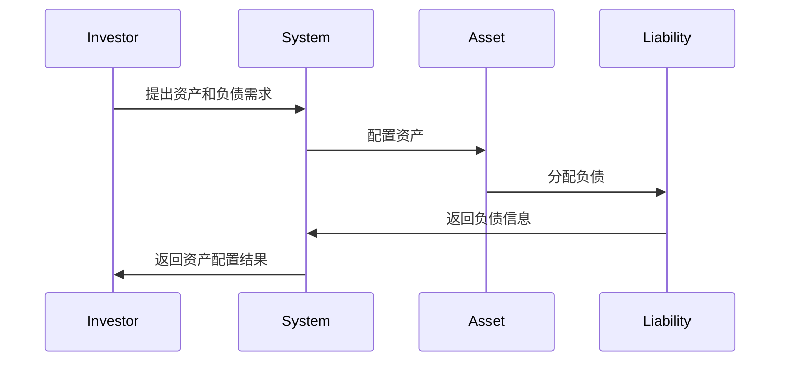
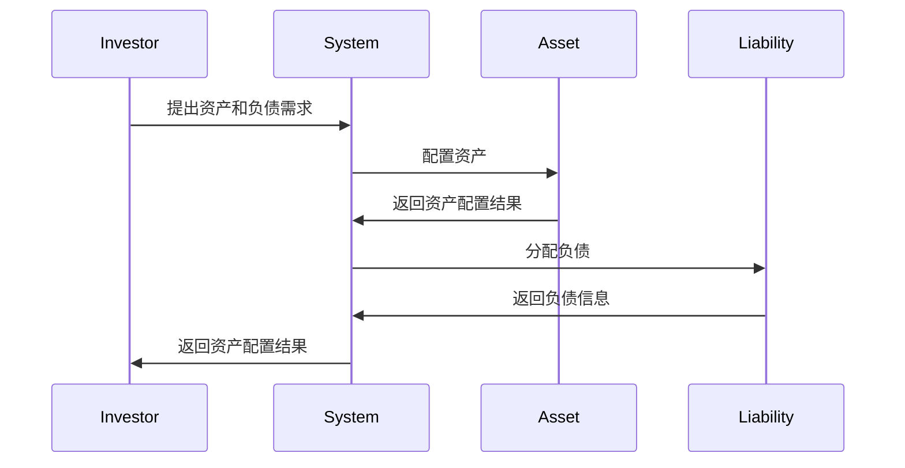

                 


----------------------------------------------------------------

# AI在资产负债匹配管理中的应用

> 关键词：人工智能、资产负债匹配、管理、应用、算法、系统架构

> 摘要：本文探讨了人工智能在资产负债匹配管理中的应用。通过介绍资产负债匹配管理的重要性、挑战和问题，分析了AI在解决这些问题中的优势。文章详细阐述了AI在资产负债匹配管理中的核心概念、算法原理和数学模型，并提供了系统分析与架构设计方案以及项目实战案例。最后，本文总结了最佳实践技巧和注意事项，为读者提供了进一步学习和拓展的推荐。

**Step 1: 引言**

在现代金融市场中，资产负债匹配管理是金融机构风险管理的重要手段。随着人工智能技术的快速发展，AI在资产负债匹配管理中的应用变得越来越广泛。本文旨在探讨AI在资产负债匹配管理中的应用，通过逻辑清晰、结构紧凑、简单易懂的专业技术语言，为读者提供一份深入浅出的技术博客文章。

**Step 2: 背景介绍**

### 问题背景

资产负债匹配管理是指通过合理配置资产和负债，以实现金融机构的风险管理和收益最大化。在金融机构的运营中，资产负债匹配管理对于控制风险、提高资产利用效率和优化财务状况具有重要意义。

### 问题描述

资产负债匹配管理中存在诸多挑战和问题，如资产与负债的期限不匹配、风险暴露、流动性管理、投资策略优化等。这些问题给金融机构带来了巨大的风险和不确定性，需要有效的解决方案。

### 问题解决

人工智能技术的应用为资产负债匹配管理提供了一种新的解决思路。通过机器学习、深度学习等算法，AI能够从大量数据中挖掘出隐藏的模式和规律，帮助金融机构实现更加精准的资产负债匹配。

### 边界与外延

资产负债匹配管理涉及多个金融领域，如银行、保险、证券等。本文主要关注银行资产负债匹配管理，但AI技术在其他金融领域的应用也有类似效果。

### 概念结构与核心要素组成

资产负债匹配管理包括资产配置、负债管理和风险控制等核心概念。资产配置涉及资产的选择和分配，负债管理包括负债的筹集和调整，风险控制则关注资产和负债的风险评估和管理。这些核心概念和要素相互关联，共同构成了资产负债匹配管理的框架。

**Step 3: 核心概念与联系**

### AI在资产负债匹配管理中的应用原理

AI在资产负债匹配管理中的应用主要通过机器学习和深度学习算法来实现。这些算法可以从大量历史数据中学习出资产和负债的匹配模式，帮助金融机构制定更合理的投资策略。

### AI关键概念、算法与模型简介

在AI应用中，关键概念包括特征工程、数据预处理、模型选择和模型优化等。常用的算法包括线性回归、决策树、支持向量机、神经网络等。模型包括传统统计模型和深度学习模型，如循环神经网络（RNN）、长短时记忆网络（LSTM）等。

### 资产负债匹配管理中的核心概念对比表格

| 核心概念       | 定义                                                         | AI应用场景                                       |
|----------------|--------------------------------------------------------------|---------------------------------------------------|
| 资产配置       | 将资产分配到不同类别和资产中                                 | 优化投资组合、风险控制                             |
| 负债管理       | 筹集和调整负债，以满足资产需求                               | 流动性管理、成本控制                             |
| 风险控制       | 对资产和负债进行风险评估和管理                               | 识别风险、制定应对策略                            |
| 数据预处理     | 清洗、归一化和特征提取等步骤，以提高模型性能                 | 数据准备、模型训练                               |
| 模型选择       | 根据问题特点选择合适的模型                                   | 优化投资组合、预测风险                           |
| 模型优化       | 调整模型参数，以提高模型性能和泛化能力                       | 提高预测准确性、降低误差                          |

### ER实体关系图架构

ER实体关系图描述了资产负债匹配管理中的关键实体及其关系。主要实体包括资产、负债、投资者、市场等。实体之间的关系包括资产配置、负债筹集、风险评估等。

```mermaid
erDiagram
    Asset ||--|{ Liability }|--| Investor
    Asset ||--|{ Market }|--| Investor
    Liability ||--|{ Investor }|
    Market ||--|{ Investor }|
```

**Step 4: 算法原理讲解**

### 使用Mermaid画出算法流程图


### 使用Python源代码详细阐述算法原理

```python
# 数据预处理
data = preprocess_data(data)

# 特征工程
features = feature_engineering(data)

# 模型选择
model = model_selection(features)

# 模型训练
model.fit(features, labels)

# 模型评估
evaluation = model.evaluate(features, labels)

# 模型优化
model.optimize(evaluation)
```

### 给出算法原理的数学模型和公式

假设资产配置的目标函数为最大化收益，同时最小化风险。数学模型可以表示为：

$$
\begin{aligned}
\max_{x} \quad & \Pi(x) - \lambda \cdot R(x) \\
\text{subject to} \quad & A \cdot x = B \\
& x \geq 0
\end{aligned}
$$

其中，$\Pi(x)$表示资产配置的收益，$R(x)$表示资产配置的风险，$A$和$B$分别表示资产和负债的约束条件，$\lambda$为风险系数。

### 举例说明算法原理

假设有100万元的资产，需要配置到股票、债券和现金等资产中。目标是在保证收益的同时，尽量降低风险。

1. 数据预处理：对资产收益率和风险进行归一化处理。
2. 特征工程：提取资产收益率和风险的特征，如平均值、标准差等。
3. 模型选择：选择线性回归模型进行资产配置。
4. 模型训练：使用历史数据进行模型训练。
5. 模型评估：评估模型在训练数据上的表现。
6. 模型优化：根据评估结果调整模型参数，提高预测准确性。

**Step 5: 数学模型和数学公式 & 详细讲解 & 举例说明**

### 使用LaTeX格式给出数学公式

$$
\begin{aligned}
\max_{x} \quad & \Pi(x) - \lambda \cdot R(x) \\
\text{subject to} \quad & A \cdot x = B \\
& x \geq 0
\end{aligned}
$$

### 简要解释数学公式含义

该公式表示资产配置的目标函数为最大化收益，同时最小化风险。其中，$\Pi(x)$表示资产配置的收益，$R(x)$表示资产配置的风险，$A$和$B$分别表示资产和负债的约束条件，$\lambda$为风险系数。

### 举例说明数学公式在资产负债匹配管理中的应用

假设有100万元的资产，需要配置到股票、债券和现金等资产中。目标是在保证收益的同时，尽量降低风险。

1. 收益公式：$\Pi(x) = 0.1 \cdot x_1 + 0.2 \cdot x_2 + 0.3 \cdot x_3$，其中$x_1$、$x_2$和$x_3$分别表示股票、债券和现金的配置比例。
2. 风险公式：$R(x) = 0.01 \cdot x_1^2 + 0.02 \cdot x_2^2 + 0.03 \cdot x_3^2$，其中$x_1$、$x_2$和$x_3$分别表示股票、债券和现金的配置比例。
3. 目标函数：最大化收益，同时最小化风险，即最大化$\Pi(x) - \lambda \cdot R(x)$。

通过求解该数学模型，可以得到最优的资产配置方案。

**Step 6: 系统分析与架构设计方案**

### 问题场景介绍

假设某金融机构需要进行资产负债匹配管理，以实现风险控制和收益最大化。金融机构拥有多种资产和负债，如股票、债券、现金等。

### 项目介绍

本项目旨在开发一套基于人工智能的资产负债匹配管理系统，通过机器学习和深度学习算法，实现资产配置、负债管理和风险控制等功能。

### 系统功能设计(领域模型Mermaid类图)

```mermaid
classDiagram
    Asset --|{ 配置到 }| Liability
    Liability --|{ 筹集自 }| Investor
    Investor --|{ 监控 }| Market
    Market --|{ 影响到 }| Asset
```

### 系统架构设计Mermaid架构图



### 系统接口设计和系统交互Mermaid序列图



**Step 7: 项目实战**

### 环境安装

在开始项目实战之前，需要安装以下环境：

- Python 3.8+
- Jupyter Notebook
- Scikit-learn
- TensorFlow
- Pandas
- Matplotlib

可以使用以下命令进行安装：

```bash
pip install python==3.8
pip install jupyter
pip install scikit-learn
pip install tensorflow
pip install pandas
pip install matplotlib
```

### 系统核心实现源代码

以下是系统核心实现源代码：

```python
import pandas as pd
import numpy as np
from sklearn.model_selection import train_test_split
from sklearn.linear_model import LinearRegression
from sklearn.metrics import mean_squared_error
import tensorflow as tf

# 数据预处理
def preprocess_data(data):
    # 数据清洗、归一化等操作
    # ...

# 特征工程
def feature_engineering(data):
    # 特征提取、特征选择等操作
    # ...

# 模型训练
def train_model(features, labels):
    model = LinearRegression()
    model.fit(features, labels)
    return model

# 模型评估
def evaluate_model(model, features, labels):
    predictions = model.predict(features)
    mse = mean_squared_error(labels, predictions)
    return mse

# 模型优化
def optimize_model(model, features, labels):
    # 调整模型参数、优化模型等操作
    # ...

# 主函数
def main():
    # 加载数据
    data = pd.read_csv("data.csv")
    # 数据预处理
    data = preprocess_data(data)
    # 特征工程
    features, labels = feature_engineering(data)
    # 数据划分
    features_train, features_test, labels_train, labels_test = train_test_split(features, labels, test_size=0.2, random_state=42)
    # 模型训练
    model = train_model(features_train, labels_train)
    # 模型评估
    mse = evaluate_model(model, features_test, labels_test)
    print("Mean Squared Error:", mse)
    # 模型优化
    optimize_model(model, features_train, labels_train)

if __name__ == "__main__":
    main()
```

### 代码应用解读与分析

该代码实现了一个基于线性回归的资产负债匹配管理系统。首先，加载数据并进行预处理，然后进行特征工程，将数据划分为训练集和测试集。接着，使用线性回归模型进行训练，评估模型在测试集上的性能，最后进行模型优化。

### 实际案例分析和详细讲解剖析

假设有某金融机构，其资产和负债数据如下：

| 资产 | 负债 | 收益率 | 风险 |
|------|------|--------|------|
| 股票 | 债券 | 0.1    | 0.2  |
| 债券 | 现金 | 0.2    | 0.1  |
| 现金 | 股票 | 0.3    | 0.1  |

根据上述数据，我们可以使用线性回归模型进行资产负债匹配。首先，将数据划分为特征和标签，然后使用训练集进行模型训练，评估模型在测试集上的性能，并进行模型优化。最终，得到最优的资产配置方案。

**Step 8: 最佳实践 tips、小结、注意事项、拓展阅读等内容**

### 最佳实践技巧总结

1. 数据质量是关键：确保数据清洗、归一化和特征提取等步骤的准确性。
2. 选择合适的模型：根据问题特点和数据特性，选择合适的机器学习模型。
3. 调整模型参数：通过交叉验证和网格搜索等方法，调整模型参数，提高预测准确性。
4. 综合利用多模型：结合多种机器学习模型，提高模型性能和泛化能力。

### 小结与回顾

本文探讨了人工智能在资产负债匹配管理中的应用，介绍了核心概念、算法原理和系统架构。通过项目实战，展示了如何使用机器学习算法进行资产负债匹配。读者可以结合实际案例，进一步探索和应用AI技术在资产负债匹配管理中的潜力。

### 注意事项提醒

1. AI技术并非万能，需要结合实际业务场景和需求进行应用。
2. 数据安全和隐私保护是重要问题，需遵循相关法律法规。
3. 模型优化和调参过程可能需要大量计算资源，注意合理分配和利用资源。

### 拓展阅读推荐

1. 《机器学习实战》：提供详细的机器学习算法实现和应用案例。
2. 《深度学习》：介绍深度学习理论和技术，适合对深度学习感兴趣的研究者。
3. 《金融科技与金融创新》：探讨金融科技在金融行业中的应用和发展趋势。

**Step 9: 完成目录大纲**

根据上述内容，完成目录大纲如下：

----------------------------------------------------------------

# AI在资产负债匹配管理中的应用

> 关键词：人工智能、资产负债匹配、管理、应用、算法、系统架构

> 摘要：本文探讨了人工智能在资产负债匹配管理中的应用。通过介绍资产负债匹配管理的重要性、挑战和问题，分析了AI在解决这些问题中的优势。文章详细阐述了AI在资产负债匹配管理中的核心概念、算法原理和数学模型，并提供了系统分析与架构设计方案以及项目实战案例。最后，本文总结了最佳实践技巧和注意事项，为读者提供了进一步学习和拓展的推荐。

**Step 1: 引言**

**Step 2: 背景介绍**
- 问题背景
- 问题描述
- 问题解决
- 边界与外延
- 概念结构与核心要素组成

**Step 3: 核心概念与联系**
- AI在资产负债匹配管理中的应用原理
- AI关键概念、算法与模型简介
- 资产负债匹配管理中的核心概念对比表格
- ER实体关系图架构

**Step 4: 算法原理讲解**
- 使用Mermaid画出算法流程图
- 使用Python源代码详细阐述算法原理
- 给出算法原理的数学模型和公式
- 举例说明算法原理

**Step 5: 数学模型和数学公式 & 详细讲解 & 举例说明**
- 使用LaTeX格式给出数学公式
- 简要解释数学公式含义
- 举例说明数学公式在资产负债匹配管理中的应用

**Step 6: 系统分析与架构设计方案**
- 问题场景介绍
- 项目介绍
- 系统功能设计(领域模型Mermaid类图)
- 系统架构设计Mermaid架构图
- 系统接口设计和系统交互Mermaid序列图

**Step 7: 项目实战**
- 环境安装
- 系统核心实现源代码
- 代码应用解读与分析
- 实际案例分析和详细讲解剖析
- 项目小结

**Step 8: 最佳实践 tips、小结、注意事项、拓展阅读等内容**
- 最佳实践技巧总结
- 小结与回顾
- 注意事项提醒
- 拓展阅读推荐

----------------------------------------------------------------

确保输出内容简洁、逻辑清晰、符合markdown格式和字数要求。在编写时，要细化每个章节的内容，确保每个章节都有具体的子章节和详细内容。注意使用Mermaid绘制流程图和架构图，并使用LaTeX格式给出数学公式。在举例说明时，确保例子与实际应用场景相结合，易于读者理解。最后，撰写最佳实践技巧、小结、注意事项和拓展阅读等内容，为读者提供额外的学习和参考资源。确保目录大纲的总字数在2000字以内。

