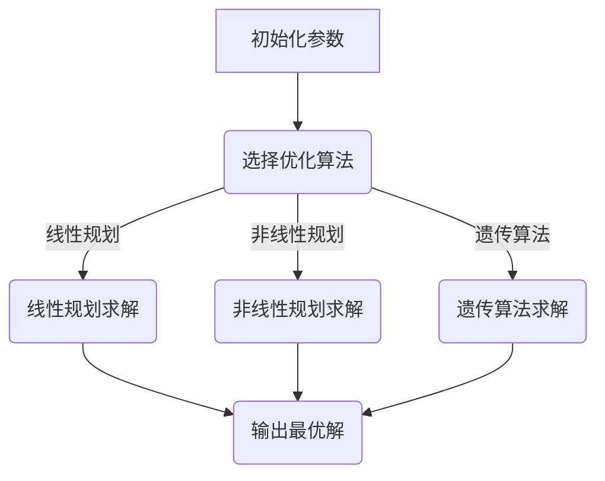

                 

### 《AI在资产负债管理优化中的应用》

**关键词：资产负债管理、AI、优化算法、数学模型、系统架构设计**

**摘要：**
随着全球金融市场的不断变化，资产负债管理（ALM）的优化已成为企业实现稳健发展的重要手段。本文将深入探讨AI技术在资产负债管理优化中的应用，从背景介绍、核心概念与联系、算法原理讲解、数学模型和公式、系统架构设计、项目实战等多个方面，详细阐述AI如何助力资产负债管理的优化，提高企业的风险管理能力和资金使用效率。

#### 第一部分：背景介绍

##### 第1章：资产负债管理概述

**1.1 问题背景**

金融市场波动与经济周期是资产负债管理面临的主要挑战。企业需要在不确定的市场环境中调整其资产和负债结构，以应对市场变化和风险。同时，全球经济一体化使得企业面临更加复杂的国际市场环境和竞争压力，进一步增加了资产负债管理的难度。

**1.2 问题描述**

资产负债管理涉及企业资产的配置、负债的管理以及两者的匹配。其主要目标包括：

- 确保企业流动性，避免因资金不足导致的经营风险；
- 实现资产收益的最大化；
- 控制负债成本，降低财务风险。

**1.3 问题解决**

随着人工智能技术的发展，AI技术在资产负债管理中展现出巨大潜力。通过机器学习、深度学习等技术，可以实现对大量金融数据的分析和预测，为企业提供更加精准的风险评估和优化策略。此外，AI还可以帮助企业在复杂的市场环境中快速调整资产负债结构，提高资金使用效率。

**1.4 边界与外延**

资产负债管理不仅限于金融行业，在制造业、零售业等多个领域都有广泛应用。它与其他管理领域的联系也日益紧密，如财务管理、风险管理、资金管理等。通过跨领域的融合，AI技术在资产负债管理优化中的应用将更加广泛。

**1.5 概念结构与核心要素组成**

资产负债管理涉及以下核心要素：

- **资产负债表**：反映企业的资产、负债和股东权益状况；
- **资产负债管理策略**：包括资产配置策略、负债管理策略和资产负债匹配策略；
- **风险管理**：评估和管理资产负债风险，确保企业财务稳定；
- **资金管理**：优化资金流动，提高资金使用效率。

##### 第2章：AI核心概念与原理

**2.1 AI基础概念**

AI（人工智能）是模拟、延伸和扩展人类智能的理论、方法、技术及应用。其主要分支包括：

- **机器学习**：通过数据驱动的方式，让计算机自动学习并优化模型；
- **深度学习**：基于多层神经网络的机器学习方法，模拟人脑进行复杂任务处理；
- **神经网络**：一种模拟人脑神经元连接方式的计算模型，是深度学习的基础。

**2.2 AI应用场景**

AI在资产负债管理中的应用场景主要包括：

- **数据分析**：利用AI技术对大量金融数据进行挖掘和分析，为企业提供决策支持；
- **风险评估**：通过机器学习算法预测金融市场风险，提高风险管理能力；
- **优化决策**：基于深度学习等技术，实现资产负债结构的优化，提高资金使用效率。

**2.3 AI与资产负债管理的联系**

AI与资产负债管理的联系主要体现在以下几个方面：

- **数据驱动**：资产负债管理需要大量数据支持，AI技术可以高效地处理和分析这些数据；
- **模型预测**：通过机器学习模型对金融市场进行预测，帮助企业制定更科学的资产负债策略；
- **决策优化**：利用深度学习等技术，优化资产负债结构，降低风险，提高收益。

##### 第3章：资产负债管理优化算法

**3.1 常见优化算法**

资产负债管理优化算法主要包括：

- **线性规划**：适用于目标函数和约束条件均为线性情况下的优化问题；
- **非线性规划**：适用于目标函数和约束条件非线性情况下的优化问题；
- **遗传算法**：基于生物进化理论的搜索算法，适用于复杂优化问题。

**3.2 算法mermaid流程图**



**3.3 算法原理详细讲解**

- **线性规划**：目标函数为线性，约束条件为线性不等式，求解步骤包括建立线性规划模型、求解最优解等；
- **非线性规划**：目标函数和约束条件至少有一个非线性，求解方法包括拉格朗日乘数法、牛顿法等；
- **遗传算法**：基于生物进化理论，通过选择、交叉、变异等操作，逐步优化解空间，最终得到最优解。

##### 第4章：资产负债管理的数学模型

**4.1 数学模型介绍**

资产负债管理的数学模型主要包括目标函数和约束条件。目标函数通常表示为最大化或最小化某种指标，如资产收益、负债成本等。约束条件则包括资产、负债和股东权益的平衡关系，以及风险控制等。

**4.2 数学公式**

```latex
\begin{align*}
\text{最大化} \quad & Z = c^T x \\
\text{约束条件} \quad & Ax \le b \\
\text{非负约束} \quad & x \ge 0
\end{align*}
```

**4.3 公式讲解**

- **目标函数**：表示企业希望最大化或最小化的指标，如资产收益或负债成本；
- **约束条件**：包括资产、负债和股东权益的平衡关系，以及风险控制等；
- **非负约束**：确保资产、负债和股东权益均为非负值，符合财务实际情况。

##### 第5章：资产负债管理系统架构设计

**5.1 问题场景介绍**

企业资产负债管理系统的主要功能包括：

- 资产负债表编制；
- 资产负债管理策略制定；
- 风险评估与预警；
- 资金流动监测与优化。

**5.2 项目介绍**

资产负债管理系统项目旨在通过AI技术，实现资产负债管理的自动化和智能化，提高企业风险管理能力和资金使用效率。项目目标包括：

- 构建一个高效、稳定的资产负债管理系统；
- 提高资产负债管理的精准度和效率；
- 降低企业财务风险，提高资产收益。

**5.3 系统功能设计**

系统功能设计主要包括以下模块：

- **数据处理模块**：负责收集、整理和存储资产负债相关数据；
- **模型训练模块**：基于AI技术，构建和训练资产负债管理模型；
- **优化决策模块**：根据模型预测结果，制定和调整资产负债管理策略；
- **风险预警模块**：实时监测市场变化，预警潜在风险。

**5.4 系统架构设计**

系统架构设计包括以下几个方面：

- **前端界面**：提供用户操作界面，展示资产负债管理结果；
- **后端服务**：负责数据处理、模型训练、优化决策等功能；
- **数据库**：存储资产负债相关数据，支持系统运行；
- **API接口**：实现前后端数据的交互，支持第三方系统集成。

**5.5 系统接口设计和系统交互**

系统接口设计和系统交互主要包括以下几个方面：

- **数据接口**：实现与外部数据源的对接，如银行、证券、交易所等；
- **服务接口**：提供内部模块间的服务调用，如数据处理、模型训练、优化决策等；
- **交互界面**：实现用户与系统之间的交互，如报表查询、数据下载、风险预警等。

##### 第6章：资产负债管理项目实战

**6.1 环境安装**

在开始资产负债管理项目实战之前，需要安装以下环境：

- **Python**：作为编程语言，用于编写和运行项目代码；
- **NumPy**：用于数学计算和数据处理；
- **Pandas**：用于数据处理和分析；
- **Scikit-learn**：用于机器学习和模型训练；
- **TensorFlow**：用于深度学习和神经网络训练。

**6.2 系统核心实现源代码**

系统核心实现源代码主要包括以下模块：

- **数据处理模块**：负责数据收集、预处理和存储；
- **模型训练模块**：负责构建和训练资产负债管理模型；
- **优化决策模块**：负责根据模型预测结果，制定和调整资产负债管理策略；
- **风险预警模块**：负责实时监测市场变化，预警潜在风险。

**6.3 代码应用解读与分析**

系统核心代码解读与分析主要包括以下几个方面：

- **数据处理模块**：如何对资产负债数据进行收集、预处理和存储；
- **模型训练模块**：如何构建和训练资产负债管理模型，包括特征选择、模型选择和参数调优等；
- **优化决策模块**：如何根据模型预测结果，制定和调整资产负债管理策略，包括资产配置、负债管理、资产负债匹配等；
- **风险预警模块**：如何实时监测市场变化，预警潜在风险，包括数据采集、特征提取、模型预测等。

**6.4 实际案例分析和详细讲解剖析**

本节将通过一个实际案例，对资产负债管理项目进行详细讲解和剖析。案例背景如下：

某企业在2022年面临较大的市场波动和风险。为了实现资产负债管理的优化，企业决定引入AI技术，构建一个基于深度学习的资产负债管理系统。通过实际案例，我们将详细介绍项目的实施过程、技术难点和解决方案，以及项目成果和效果评估。

**6.5 项目小结**

通过本项目的实施，企业实现了以下成果：

- 构建了一个高效、稳定的资产负债管理系统；
- 提高了资产负债管理的精准度和效率；
- 降低了企业财务风险，提高了资产收益。

同时，项目也暴露了一些问题，如数据质量、模型调优和风险管理等。针对这些问题，我们提出以下优化建议：

- 加强数据质量管理，确保数据的准确性和完整性；
- 深入研究资产负债管理模型，提高模型预测的准确性；
- 建立健全的风险管理体系，提高企业的风险管理能力。

##### 第7章：最佳实践与注意事项

**7.1 最佳实践 tips**

在资产负债管理优化过程中，以下最佳实践可以帮助企业取得更好的效果：

- **数据质量**：确保数据的准确性和完整性，是资产负债管理优化的基础；
- **模型调优**：通过多次迭代和优化，提高模型预测的准确性；
- **风险管理**：建立健全的风险管理体系，降低企业财务风险。

**7.2 小结**

资产负债管理优化是企业实现稳健发展的重要手段。通过引入AI技术，企业可以更加精准地预测市场变化，制定科学的资产负债管理策略，降低财务风险，提高资金使用效率。在实施过程中，企业应注重数据质量、模型调优和风险管理，不断提升资产负债管理的能力。

**7.3 注意事项**

在实施资产负债管理优化时，企业应注意以下几点：

- **避免常见错误**：如数据清洗不当、模型选择不当等；
- **安全与合规性考虑**：确保系统设计和实现符合相关法律法规要求；
- **持续优化**：根据市场变化和企业发展，不断调整和优化资产负债管理策略。

**7.4 拓展阅读**

- **相关书籍推荐**：《人工智能：一种现代的方法》、《深度学习》、《Python数据科学手册》等；
- **学术论文与报告**：国内外关于资产负债管理优化和AI技术应用的相关论文和报告。

**作者：AI天才研究院/AI Genius Institute & 禅与计算机程序设计艺术 /Zen And The Art of Computer Programming**

以上是《AI在资产负债管理优化中的应用》的完整内容。通过本文的深入探讨，相信读者对AI在资产负债管理优化中的应用有了更全面、更深入的了解。在实际应用中，企业可以根据自身情况，结合最佳实践和注意事项，逐步推进资产负债管理优化工作，提高企业竞争力。

